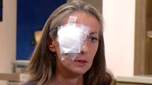
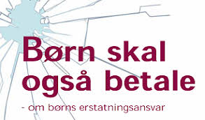

# Erstatnings- og forsikringsreglerne

```{r, echo=FALSE, results='asis'}
cat(readLines('np.html'))
```

<script async src="https://widget.spreaker.com/widgets.js"></script>

---

***Erstatningsreglerne anvendes i og uden for kontrakt i ejendomshandel, ejendomsadministration, bank og realkredit, forsikring samt revision og økonomifunktion i forbindelse med økonomisk tab, skader og mangler ved rådgivningen mv. overfor kunder og klienter. kapitlet gennemgår ulovbestemte betingelserne for erstatningsansvar uden for kontrakt, samt erstatning i kontrakt. Forsikringsreglerne anvendes til at dække erstatningsansvaret, hvor det er muligt. Den finansielle virksomhed skal ligeledes være meget opmærksom på god skik reglerne for finansielle virksomheder, samt hvidvask- og databeskyttelsesreglerne.***

---

**Indledningsvis skal du som studerende være særlig opmærksom på følgende i forbindelse med gennemgangen af erstatningsansvaret og den forsikringsmæssige dækning i forhold til eksamen i Erhvervs- og Finansjura:**

•	**Grundlæggende erstatningsbetingelser; ansvarsgrundlag, årsagsforbindelse, påregnelighed, økonomisk tab og værnet interesse.**

•	**Principalansvar (arbejdsgiverens hæftelsesansvar i DL 3-19-2).**

•	**Ansvarets sammenhæng med forsikringsdækning, erstatningsansvarslovens (forkortet; EAL) §§ 19 – 23.**

**OBS: Videoerne, domme og Forsikringsankenævnets afgørelser i herværende afsnit er ikke en del af pensum, men tjener udelukkende det formål at bidrage med en bedre forståelse for emnerne om erstatningsansvaret og den forsikringsmæssige afdækning.**

---

**Erstatningsretten bruges bl.a. også i faget "Privatøkonomisk rådgivning på finansøkonomuddannelsen.**

---


<h4><a href="https://youtu.be/aUJNx9bEge4" target="_blank">Video om introduktion til erstatningsretten</a></h4>

---

## Erstatningsansvar uden en lovgivning

Tegning af en forsikring kan påvirke ens erstatningsansvar. Ligesom manglende tegning af en forsikring kan påvirke ens erstatningsansvar.^[Følgende afsnit om erstatningsansvaret og den forsikringsmæssige afdækning bygger hovedsagelig på *Sonny Kristoffersen* bøger "Kend Erstatningsreglerne", på forlaget Samfundslitteratur, se e-bogens bibliotek, samt min bog "Introduktion til forsikringsreglerne", på forlaget Hans Reitzel **<a href="https://jura.tepedu.dk/bibliotek-premium.html" target="_blank">Se nærmere biblioteket klik her!</a>**.]

---

Et ansvarsforsikringsselskab beskæftiger sig indgående med erstatningsreglerne for at vurdere, om skadevolderen (dvs. forsikringstageren) har pådraget sig et erstatningsansvar over for en skadelidt. 

Ofte findes der ingen lovgivning, som kan fortælle, hvornår man som privatperson er ansvarlig for en skade. 

---

I stedet er der ud af mange års domspraksis udledt en erstatningsregel, der kaldes **den almindelige erstatningsregel.** 

Denne regel fastslår, at man er ansvarlig for den økonomiske skade, som man har forvoldt ved uagtsomhed eller med vilje. 

Reglen hedder også culpa- eller skyldreglen (**culpa** betyder "skyld" på latin eller brøde, uagtsomhed, forseelse, synd), som kan føres tilbage romerrettens culparegel. Modsat **diskulpere**	fritage for skyld.

---

Culpa er den grundlæggende betingelse for at pålægge erstatningsansvar uden for kontraktforhold. 

Der er tale om en **integritetskrænkelse** hvorved der er sket	fysisk skade på en person (personskade) eller på en ting (tingsskade).

En skadevolder har udvist culpa, optrådt culpøst, overtrådt culpareglen, hvis skadevolder har handlet enten forsætligt, dvs. med vilje og viden om handlingens elementer, eller uagtsomt. 

---

Vi mennesker skal i dagligdagen udvise **diligentia quam in suis rebus**; den omhu, vi udviser i egne anliggender.

Eller et andet latinsk udtryk fra romerretten: **impossibilia nulla est obligatione**;	man kan ikke forpligtelse sig til noget, der ikke er muligt.

---

**Brug af culpabegrebet brugt i praksis:**

[Jura] | culpa | - Den tiltalte havde udøvet culpa, og var derfor erstatningsansvarlig.

[Jura] | forseelse | - Hun er strafskyldig på grund af en uagtsom forseelse.

[Jura] | skyld | - De beviste, at vandværket havde udvist skyld i sagen.

---

**Se følgende domme om erstatningsansvaret:**  


Se dommen *"FED 2012.2*: Landsretten fandt, at en tilskuer, der ved strafbar handling løb ind på fodboldbane og afbrød landskamp, var erstatningsansvarlig over for DBU.
**<a href="https://pro.karnovgroup.dk/document/7000506917/1" target="_blank">Dommen klik her!</a>**

---


Se dommen i **FED 2006.78:** Ansvarspådragende efter culpareglen, at en person, der kørte i en lånt bil, ikke sikrede sig, at der var olie og vand på bilen, uagtet temperaturlampen lyste. 
**<a href="https://pro.karnovgroup.dk/document/7000376722/1" target="_blank">Dommen klik her!</a>**

---

Se dommen **U 2015.572 H**: Tobaksselskaber ikke ansvarlige for varigt mén som følge af mangeårigt forbrug af cigaretter. 
**<a href="https://pro.karnovgroup.dk/document/7000720888/1" target="_blank">Dommen klik her!</a>**

---     

Man er kun erstatningsansvarlig for skader, der kan gøres op i penge (økonomisk tab, som den skadelidte skal kunne bevise). 

Ved tingsskader vil det være værdien af eller reparation af det ødelagte. 

Ved personskader bliver det økonomiske tab beregnet efter reglerne i Lov om erstatningsansvar (forkortet; EAL), 
**<a href="https://jura.tepedu.dk/lovsamling.html" target="_blank">Erstatningsansvarsloven klik her!</a>**

---

Det er fx erstatning for varige mén, tabt arbejdsfortjeneste eller tab af forsørger. 

Se følgende domme, hvor der idømmes erstatningsansvar i forskellige situationer:  

---  



Se dommen i **FED 2012.3:** "A, der sad uden for golfbanens cafeteria, blev ramt i hovedet af golfbold, da B – som deltager i en polterabend – under golfspil kom til at slå bolden for langt. B, der kun én gang tidligere havde prøvet at spille golf og ikke havde modtaget undervisning heri, fandtes erstatningsansvarlig".
**<a href="https://pro.karnovgroup.dk/document/7000506918/1" target="_blank">Dommen klik her!</a>**


Se dommen i **FED 2009.114:**^[FED: Forsikring og Erstatningsretlig Domsamling.] En kvinde, som faldt i søvn som fører af en bil, påkørte og dræbte en modkørende bilist. 
**<a href="https://pro.karnovgroup.dk/document/7000477953/1" target="_blank">Dommen klik her!</a>**

---

Se dommen i **FED 2008.1:**   En mandlig stripteasedanser B ansvarlig for øjenskade på deltager A i kvindelig polterabend, da B affyrede konfettirør. 
**<a href="https://pro.karnovgroup.dk/document/7000382215/1" target="_blank">Dommen klik her!</a>**


<br><br><br><br>

---     

## Hændeligt uheld - uden ansvar


Er skaden forvoldt ved et **hændeligt uheld**, har vedkommende ikke gjort noget forkert og er ikke ansvarlig for skaden. 

Man skal heller ikke erstatte noget.


Åbner en hotelgæst fx døren til sit værelse indefra, i det øjeblik en tjener går forbi på gangen med en bakke med glas, og døren rammer bakken, så glassene falder på gulvet og knuses, er der tale om et hændeligt uheld. Uheldet kan ikke bebrejdes hotelgæsten, da han ikke havde mulighed for at undgå det. Han havde opført sig som “den gode hotelgæst” og ikke begået nogen fejl. 

---

Se afgørelserne fra retspraksis og Forsikringsankenævnet om spørgsmålet om hændelige skader:

---   


Se dommen i **U 1961.167 H**: At en 11-årig dreng kom til at ramme en anden dreng med en kæp i øjet, blev anset for et hændeligt uheld og derfor ikke noget erstatningsansvar. 
**<a href="https://pro.karnovgroup.dk/document/7000214033/1" target="_blank">Dommen klik her!</a>**

---

Se dommen i **FED 1998.584:** Ejeren af sommerhus til udlejning havde ikke pådraget sig erstatningspligt ved, at en lejers barn kom til skade, da et sofabord, der var en del af sommerhusets møblement, væltede. 
**<a href="https://pro.karnovgroup.dk/document/7000328756/1" target="_blank">Dommen klik her!</a>**

---

Se dommen i **FED 2019.04:** A kom til skade til en julefrokost, da hun faldt som følge af, at dansegulvet var vådt. Det var dokumenteret, at gulvet ikke i sig selv var glat, at det var blevet vasket i løbet af aften og forud for uheldet, og at det var første gang arbejdsgiveren afholdt julefrokost i lokalet. På denne baggrund fastslog landsretten, at det forhold, at nogle festdeltagere spildte drikkevarer på gulvet, ikke kunne føre til, at arbejdsgiveren havde handlet uforsvarligt. B blev derfor frifundet. 
**<a href="https://pro.karnovgroup.dk/document/7000835745/1" target="_blank">Dommen klik her!</a>**

---

Afgørelser fra Ankenævnet for Forsikring:

Se **Ankenævnskendelse i sagsnr.: 35.936:** Klagers “griben ud efter” sit 15 måneder gamle barn, der var ved at falde, hvorved cigaretglød ødelagde en sofa, ikke anset som uagtsom adfærd, derfor ikke nogen erstatningspligt for sofaen.

---

Se **Ankenævnskendelse i sagsnr.: 39.737:** Gæstebudsskade at tabe kaffebakke under forsøg på at undgå at træde på et barn. Ikke erstatningsansvar, men dækket som gæstebudsskade over personens ansvarsforsikring.

---

Se **Ankenævnskendelse i sagsnr.: 51.809**: 8-årigt barn faldt over egne ben og væltede vase. Ikke erstatningsansvar, men dækket som gæstebudsskade.

---

**"Gæstebudsskade":** Hvis en gæst kommer til at ødelægge noget hjemme hos værten, fx vælter en dyr vase eller spilder rødvin på et tæppe, kaldes det for en gæstebudsskade. 

Ved gæstebudsskader er gæsten normalt ikke erstatningsansvarlig. Værten har derfor ikke krav på erstatning fra gæsten. 

---

Som vært må man altså acceptere, at der er en vis risiko, når man har nogen på besøg.

Nogle indboforsikringer – bl.a. Topdanmarks – dækker gæstebudsskader alligevel, selv om der ikke er noget ansvar for gæsten efter domstolspraksis. 

---

Det anbefales derfor, at man som vært beder gæsten kontakte sit forsikringsselskab, da de måske dækker skaden. I så fald vil man få erstattet skaden fratrukket forsikringens selvrisiko.

Hvis gæsten smadder værtens indbo i vrede, så er der selvfølgelig ikke tale om en gæstebudsskade, men gæsten har et erstatningsansvar.


---

Se dommen i **FED 2003.1091:** Hønseejer var ikke ansvarlig for cyklists tilskadekomst, da cykel på landevej ramte fritgående høne. 
**<a href="https://pro.karnovgroup.dk/document/7000329678/1" target="_blank">Dommen klik her!</a>**

---

Se dommen **U 2013.84 V:** Motionscyklist, der sammen med andre cyklister kørte i en gruppe, og som efter at være kommet ud i rabatten prøvede at komme op på vejen igen, hvorved han væltede, og der skete sammenstød med bagfrakommende cyklister, havde ikke handlet ansvarspådragende. 
**<a href="https://pro.karnovgroup.dk/document/7000521782/1" target="_blank">Dommen klik her!</a>**

---

Se dommen i **H.K. af 24. juni 2002. Sagsnr.: 206/2002:** Museum var ikke ansvarligt for tilskadekomst, da gæst under privat besøg gled i hundeekskrementer og faldt.


---          

## Handlet forkert eller undladt at handle

Har skadevolder handlet forkert – dvs. er ansvarlig – er det vigtigt at finde ud af, om skaden er forvoldt ved en simpel uagtsomhed, grov uagtsomhed eller med forsæt (med vilje). 

Denne vurdering af handlingen eller undladelsen har bl.a. betydning for, om skadevolderens ansvarsforsikring skal betale for skaden hos skadelidte. 

---

**Se her følgende domsafgørelser:**  


Se dommen i **FED 2016.122:** Diskotek erstatningsansvarlig for personskade opstået ved, at diskotekets dørmand gik ud over det nødvendige og forsvarlige ved at skubbe eller kaste skadelidte ud af diskotekets dør. 
**<a href="https://pro.karnovgroup.dk/document/7000779860/1" target="_blank">Dommen klik her!</a>**

---

Se dommen i **Ø.L.D. af 12. maj 2005. Sag: 20. afd., a.s. nr. B-2581-04:** Værtinde ifaldt erstatningsansvar, fordi hun bar et sofabord ned ad en trappe iført højhælede sko og uden at fjerne noget nips, der indskrænkede trappearealet, hvilket forårsagede, at hun tabte bordet, som ramte en gæst i hovedet. (Utrykt)

---     

**Den almindelige fornuftige person**


Når en domstol bedømmer, om skadevolder har handlet forkert, sammenligner domstolen skadevolderens handling med, hvordan en almindelig fornuftig person ville have handlet i samme situation.

Begrebet afgrænser en uagtsomhed/en adfærd, der afviger fra de adfærdsnormer, der gælder inden for det pågældende område.

---

Kommer en domstol til det resultat, at en skadevolder har handlet anderledes, end hvad en almindelig fornuftig person ville have gjort i samme situation, har skadevolderen handlet forkert og vil blive pålagt et erstatningsansvar.

Det skal bevises af skadelidte (kaldet en **ligefrem bevisbyrde**). Det er hovedreglen i dansk ret; Den der vil gøre noget gældende, har også bevisbyrden herfor.

---

For at kunne få erstatning fra en skadevolder skal skadelidte ifølge retspraksis (domstolene) bevise følgende over for retten: 


*	Der er sket en skade og lidt et tab. 

*	Det er skadevolders skyld – skadevolder har handlet uagtsomt eller med forsæt.  

*	Der er årsagssammenhæng (**kausalitet**) mellem den skete skade og det lidte tab, dvs. at tabet er en direkte følge af skaden.  

*	Der er påregnelighed (**adækvans**) mellem skaden og tabet, dvs., at skadevolder burde kunne forudse, at skaden ville ske.  En skadevolder er ikke erstatningsansvarlig for upåregnelige, atypiske følger af sine handlinger.

---

Kan skadelidte ikke bevise det, er det ikke muligt at få erstatning fra en skadevolder eller dennes ansvarsforsikring, se følgende dom:

---     

Se dommen i **FED 2007.111:** Forsikringstager havde ikke dokumenteret, at der var årsagsforbindelse mellem nogle anførte lidelser og et færdselsuheld. 
**<a href="https://pro.karnovgroup.dk/document/7000390950/1" target="_blank">Dommen klik her!</a>**

---     


**Ansvar for ikke at gøre noget**

Det er ikke kun handlinger, man kan blive erstatningsansvarlig for. 

I visse tilfælde kan man også blive erstatningsansvarlig for sine undladelser. 

---

Det sker oftest i situationer, hvor der er pligt til at handle. 

Eksempler er husejeren, der ikke gruser et isglat fortov, eller forældre, der ikke holder øje med deres børn.

---

**Ansvar for psykiske personskader**


Udover at der kan tilkendes erstatningsansvar ved tingsskader, samt fysiske personskader, så kan der være erstatningspligt for psykiske personskader. 

---

Se her nævnte domme:  

Se dommen i **U 2012.524 H:** A blev sygemeldt efter et begivenhedsforløb på en personaleweekend og rejste krav om godtgørelse for svie og smerte mod kommunen K som arbejdsgiver. 
**<a href="https://pro.karnovgroup.dk/document/7000506494/1" target="_blank">Dommen klik her!</a>**

---


Se dommen i **U 2010.1609 H:** Psykisk personskade anset for omfattet af ulykkesbegrebet i ulykkesforsikring. 
**<a href="https://pro.karnovgroup.dk/document/7000438162/1" target="_blank"Dommen >klik her!</a>**

---

## Simpel uagtsomhed

Ved **simpel uagtsomhed** (latin; **culpa levis**), har skadevolder handlet mere skødesløst, end hvad en almindelig fornuftig person ville have handlet i den samme situation – den lille dagligdags uagtsomhed – er skadevolder erstatningsansvarlig. 

Simpel uagtsomhed er en uagtsomhed, som ikke kan betegnes som grov. 

---

Culpareglen omfatter som hovedregel begge former for uagtsomhed.

Forsikringsankenævnet og domstolene foretager et konkret skøn, om skadevolder har handlet simpelt uagtsomt. 

---

Se dommen i **FED 2019.35**. Cyklist erstatningsansvarlig for fodgængers tilskadekomst ved sammenstød, da cyklisten burde have tilpasset sin hastighed og placeret sig således på stien, at påkørsel kunne undgås. 
**<a href="https://pro.karnovgroup.dk/document/7000844867/1" target="_blank">Dommen klik her!</a>**

---

Hvis fx en fodgænger træder ud på vejbanen uden at se sig for og rammer en forbikørende cyklist, der vælter, kan uheldet bebrejdes fodgængeren, der har været mere skødesløs end “den gode fodgænger”. 

Derfor er fodgængeren erstatningsansvarlig for cyklistens økonomiske tab. 

---

Se følgende sager fra retspraksis og Forsikringsankenævnet, om spørgsmålet, om der er simpel uagtsomhed hos skadevolder:


Se dommen i **U 1915.242 H**: (Uagtsom Brandstiftelse). "En Tiltalt færdedes en Nat i et straatækket Udhus, hvor der henlaa Fourage og Halm, med en to Tommer lang; Lysestump, som han under sit Ophold i Udhuset tændte. Under sit Ophold i Udhuset røg han derhos Cigaret. Umiddelbart efter at Tiltalte havde forladt Udhuset, viste det sig, at der var Ild i dette, der nedbrændte. Antaget, at Tiltalte havde foraarsaget Ilden, og at der forelaa Tilsidesættelse af almindelig Forsigtighed". 
**<a href="https://pro.karnovgroup.dk/document/7000764552/1" target="_blank">Dommen klik her!</a>**

---

**Praksis i Ankenævnet for Forsikring:**


Se **Ankenævnskendelse i sagsnr.: 03.256**: Da forsikringstageren, som under pasning af skadelidtes blomster havde forvoldt skade på dennes gulvtæppe, ikke fandtes at have udvist et så uforsvarligt forhold, at han ville kunne gøres ansvarlig for skaden, var selskabet berettiget til at afslå at erstatte denne. (Utrykt).


Se **Ankenævnskendelse i sagsnr.: 03.308:** Da forsikringstageren, som under arbejde i sin svigerfars lejlighed forvoldte skade på el-hovedkablet, ikke fandtes at have udvist et så uforsvarligt forhold, at han ville kunne gøres ansvarlig for skaden, var selskabet berettiget til at afslå at erstatte denne (utrykt).

---

## Grov uagtsomhed

**Grov uagtsomhed** (latin; **culpa lata**) er en betydelig form for uagtsomhed. 

Nyere retspraksis lægger vægt på, om skadevolderens adfærd indebar en ”indlysende fare” for den indtrådte skade. 

Skadevolderens bevidsthed om faren kan indgå i vurderingen af, om uagtsomheden er grov. 


Går en fodgænger over for rødt og vælter en cyklist, er fodgængeren nu mere uforsigtig end selv en skødesløs fodgænger. 

Det kan betegnes som grov uagtsomhed, og fodgængeren er erstatningsansvarlig. 

Det er en skønsmæssig vurdering, om domstolene og Ankenævnet for Forsikring anser en person for at have handlet groft uagtsomt.

---

**Se her nævnte domme og ankenævnsafgørelser om grov uagtsomhed:**

---


---

Se dommen i **U 1998.1693 H:** Opbevaring af nøglen til sikringsboksen i et auktionshus på et kontor i samme bygning var grov uagtsomhed. 
**<a href="https://pro.karnovgroup.dk/document/7000204274/1" target="_blank">Dommen klik her!</a>**


Se dommen i **U 1999.1706 H** Død ved fald på ca. 6 meter fra et tag ikke omfattet af ulykkesforsikring, da faldet var fremkaldt ved, forsikredes forsæt eller grove uagtsomhed. 
**<a href="https://pro.karnovgroup.dk/document/7000196767/1" target="_blank">Dommen klik her!</a>**

---


Se dommen i **U 1993.955 V** Da kortvarig efterladelse af kuffert ved bagagebånd i lufthavn ikke var groft uagtsom, var tyveri af kufferten dækket af tyveriforsikringen. 
**<a href="https://pro.karnovgroup.dk/document/7000200954/1" target="_blank">Dommen klik her!</a>**

---


Se dommen i **FED 2013.9** Den 16-årige A ville ved ungdomsfest hjælpe værtinden med at tænde op i en udendørs pejs. I den forbindelse hældte han væske fra en dunk, som også værtinden havde benyttet i sit forsøg på at tænde op i pejsen, direkte ind i pejsen. Herved slog ilden tilbage og antændte A’s tøj samt dunken, som han i panik kastede fra sig. Den brændende dunk ramte en trækonstruktion og huset nedbrændte. Det viste sig, at væsken var benzin. Landsretten fandt, at A havde handlet groft uagtsomt, hvorfor hans ansvar ikke bortfaldt i medfør af erstatningsanvarslovens (EAL) § 19. 
**<a href="https://pro.karnovgroup.dk/document/7000534907/1" target="_blank">Dommen klik her!</a>**

---


Se dommen i **FED 2010.93:** Forsikringsselskab fik ikke medhold i, at en 13-årig dreng udviste grov uagtsomhed da han startede en bygningsbrand ved at tænde en lighter samtidig med, at en kammerat to meter derfra hældte benzin på en knallert. Tillagt betydning bl.a., at benzindampe har en forholdsvis svag lugt og løber langs gulvet, og at der er store individuelle forskelle på menneskers lugtesans. 
**<a href="https://pro.karnovgroup.dk/document/7000497550/1" target="_blank">Dommen klik her!</a>**

---

Se dommen i **FED 2001.2121:** Passager, som blev dræbt under bilkørsel med beruset fører, fandtes at have handlet groft uagtsomt, hvorfor hans livsarvinger ikke var berettiget til dødsfaldsdækning fra ulykkesforsikring. 
**<a href="https://pro.karnovgroup.dk/document/7000329307/1" target="_blank">Dommen klik her!</a>**

---

Se dommen i **FED 2001.2255** Bilist, som kørte ud foran tog i jernbaneoverskæring uden at være opmærksom på lys- og lydsignaler, havde handlet groft uagtsomt. DSB var derfor berettiget til at reducere personskadeerstatningen med 1/3. 
**<a href="https://pro.karnovgroup.dk/document/7000329214/1" target="_blank">Dommen klik her!</a>**

---

Se dommen i **FED 1998.224:** 16-årig rulleskøjteløber havde udvist grov uagtsomhed ved at køre ud på kørebanen foran bil. Under henvisning til alder, til at handlingen var udført i kådhed samt til områdets karakter, fandtes der dog ikke grundlag for at nedsætte personskadeerstatningen. 
**<a href="https://pro.karnovgroup.dk/document/7000328750/1" target="_blank">Dommen klik her!</a>**

---


Se dommen i **FED 2018.01 Ø.L.D. af 11. januar 2018. Sag: 20. afd. nr. B-583-17:** Den 14-årige A satte ild til papir i en affaldscontainer i en skolegård og forlod herefter stedet med den 13-årige B, der forholdt sig passivt til A's aktiviteter. Skolen brændte, og forsikringsselskabet F afholdt skadeudgifter på over 10 mio. kr. F gjorde regres med krav på 3 mio. kr. over for A og B. A fandtes at have handlet groft uagtsomt, men erstatningen blev reduceret til 1 mio. kr. efter EAL § 24a. B havde ikke handlet groft uagtsomt og blev derfor frifundet. 
**<a href="https://pro.karnovgroup.dk/document/7000814837/1" target="_blank">Dommen klik her!</a>**

---

**Uagtsomhedsbegrebet** findes også i straffeloven:

Se dommen i **U 2019.2748 V** 3 års fængsel for bl.a. uagtsomt manddrab ved som fører af en personbil i spirituspåvirket tilstand og under særligt hensynsløs kørsel at have forvoldt 3 personers død. Godtgørelser til de efterladte i medfør af erstatningsansvarslovens § 26 a. 
**<a href="https://pro.karnovgroup.dk/document/7000839976/1" target="_blank">Dommen klik her!</a>**

---

Samt **forsætlig** findes i straffeloven, dvs. med vilje:

Se dommen i **U 2019.2688 Ø**: 8 års fængsel for forsætlig påkørsel med døden til følge, jf. straffelovens § 245, stk. 1, jf. § 246. Desuden udvisning for bestandig. 
**<a href="https://pro.karnovgroup.dk/document/7000838303/1" target="_blank">Dommen klik her!</a>**

---

**Nævnsafgørelser (kendelser) fra Ankenævnet for Forsikring:**


Se **Ankenævnskendelse i sagsnr.: 20.217**: Kørsel på motorcykel med 1 hånd ikke grov uagtsomhed i familie-/indboforsikring, og selskabet skulle dække beskadiget tøj efter færdselsskade. (utrykt).

---


**Ankenævnskendelse i sagsnr.: 48.636**: Hasarderet kørsel under flugt fra politiet anset for grov uagtsomhed.

---


**Ankenævnskendelse i sagsnr.: 63.558**: Groft uagtsomt at efterlade ulåst bil med nøgler i tændingslås i flere timer på privat vej, men forholdsvis tæt på befærdet vej. (Utrykt)

---


## Forsæt (med vilje)

**Forsæt** er en handling, der er foretaget med vilje, er ikke i dansk ret en betingelse for at ifalde erstatningsansvar. 

At skadevolderen har udvist uagtsomhed, dvs. tilsidesat den agtpågivenhed, som kræves på det pågældende område, er som hovedregel tilstrækkeligt til at pålægge erstatningsansvar, 

---

Kaster en person en sten efter en cyklist for at ramme denne, og det lykkes, er skaden på cyklisten lavet med vilje – med forsæt. 

Skadevolderen er selvfølgelig også her erstatningsansvarlig. 

---

Hovedreglen er i dansk ret, at kun forsætlige forhold er strafbare, dog er der en vigtig undtagelse ved uagtsomt drab:

Se straffelovens § 241: "Den, som uagtsomt forvolder en andens død, straffes med bøde eller fængsel indtil 4 måneder eller under særligt skærpende omstændigheder med fængsel indtil 8 år. Er forholdet begået i forbindelse med spirituskørsel, overtrædelse af færdselslovens § 54, stk. 1 eller 2, eller særligt hensynsløs kørsel, anses dette som en særligt skærpende omstændighed".
**<a href="https://jura.tepedu.dk/lovsamling.html" target="_blank">Straffeloven klik her!</a>**


---

Ved forsætlige handlinger afviser skadevolders ansvarsforsikring at udbetale erstatning, se her nævnte sager om vurderingen af, om skadevolder har handlet med forsæt – med vilje.

---


Se **Forsikringsankenævnskendelse i sagsnr.: 15.569** Skade på skolelokaler, forårsaget af 15-årig dreng ved udtømning af to pulverslukkere, anset forsætligt forvoldt, og derfor ikke dækket af ansvarsforsikringen. (utrykt)

---

Ved simpel og grov uagtsomhed er det hovedreglen, at en ansvarsforsikring dækker (se dog afsnittet nedenfor om generelt bortfald af ansvar). 

---

Forsætlige skader dækker forsikringen ikke, medmindre skadevolder er under 14 år.

---


Se Højesteretsdommen i  **H.D. 19 december 2016 i sag 235/2015 (1. afdeling):** Skadelidte, der var sindssyg, forsøgte at begå selvmord ved at køre ind i en modkørende lastbil. Retten til erstatning for personskade bortfaldt som følge af forsætlig medvirken.

---

Her et passende udtryk fra romerretten: "res ipsa loquitur";	"tingene taler for sig selv".

---

**Studenteropgave:**

Find retssager i UfR, som nærmere behandler grov uagtsomhed ved færdselsulykker.
**<a href="https://pro.karnovgroup.dk/journals/ufr" target="_blank">Ugeskrift for Retsvæsen klik her!</a>**

---

## Objektivt ansvar


I dansk ret kan der også gælde et såkaldt **objektivt ansvar**, hvorefter skadevolderen pålægges erstatningsansvar, selv om der ikke er handlet uagtsomt (uden skyld). 

Med andre ord er der situationer, hvor man kan blive ansvarlig, selv om skaden sker ved et hændeligt uheld. 

---

Objektivt ansvar er bl.a. lovfæstet i produktansvarsloven, jernbaneloven, luftfartsloven, lov om drift af nukleare anlæg, søloven, hundeloven, færdselsloven og lov om formidling af fast ejendom.

---

**Se følgende dom over en ejendomsmægler:**  

Se dommen **FED 1997.92:** I medfør af (dagældende) lov om omsætning af fast ejendom § 24 (nu § 47) måtte en ejendomsmægler på objektivt grundlag godtgøre en forbruger (sælger) forskellen mellem det beregnede provenu og et korrekt beregnet provenu, selv om forskellen skyldtes en forkert oplysning om kursen på et lån fra et realkreditinstitut, som havde oplysningen fra Københavns Fondsbørs officielle kursliste. 
**<a href="https://pro.karnovgroup.dk/document/7000328732/1" target="_blank">Dommen klik her!</a>**

---

Men det objektive ansvar kan også være ulovhjemlet (ikke fastsat i loven). 

Domstolene har i visse tilfælde pålagt skadevoldere objektivt ansvar uden lovhjemmel, når skaden er indtrådt som følge af materialesvigt, fx. skader, der er forvoldt af brud på fjernvarmerør, el og gasledninger mv. 

---

Se følgende domme: 


Se dommen i **FED 2014.77:** Bygherre og entreprenører var erstatningsansvarlig for udgravnings- og funderingsarbejde, der gjorde mur på nabogrund ustabil med efterfølgende sammenstyrtning til følge. Ved sammenstyrtningen skete der skader på tilgrænsende ejendom, hvorved denne bygnings ejer blandt andet led et huslejetab. Murens ejer havde inden sammenstyrtningen accepteret, at muren kunne fjernes, hvorfor murens værdi ikke skulle erstattes. 
**<a href="https://pro.karnovgroup.dk/document/7000735002/1" target="_blank">Dommen klik her!</a>**

---

Se dommen i **FED 2004.507:** Kommune og underentreprenør solidarisk ansvarlige for skade på nedgravede kabler, som under udboring til stikledninger blev ødelagt. Ligedeling af ansvaret i det indbyrdes forhold. 
**<a href="https://pro.karnovgroup.dk/document/7000328054/1" target="_blank">Dommen klik her!</a>**

---

Lejeloven indeholder et objektivt ansvar for installationer, som kan finde analogt anvendelse på en andelshaver.

Se dommen i **TBB2014.722**: Andelshaver ansvarlig efter analogi fra lejelovens § 29, stk. 10, overfor andelsboligforening for vandskade hidrørende fra vandtilslutning til vaskemaskine.

---

**Studenteropgave:**

Find retssager i UfR, som nærmere behandler det objektive ansvar.
**<a href="https://pro.karnovgroup.dk/journals/ufr" target="_blank">Ugeskrift for Retsvæsen klik her!</a>**

---

## Generelt bortfald af ansvar

Selv om skadevolder har handlet forkert – været uagtsom – er der nogle situationer, hvor skadevolder alligevel ikke er erstatningsansvarlig.

Er den skade, der er sket, i forvejen dækket af en tingsforsikring eller en driftstabsforsikring, er skadevolder ikke erstatningsansvarlig. 

---

Det gælder dog kun, hvis skaden ikke er forvoldt med vilje eller ved grov uagtsomhed. 

Det fremgår af Lov om erstatningsansvar (EAL) (Lovbekendtgørelse nr. 1070 af 24. august 2018). 
**<a href="https://jura.tepedu.dk/lovsamling.html" target="_blank">Lovsamlingen klik her!</a>**

---


Smadrer en dreng fx naboens glasrude, der er forsikret, ved en simpel uagtsomhed, er drengen ikke erstatningsansvarlig. Vinduet bliver betalt af glasforsikringen.

Lov om erstatningsansvar fastslår også, at hvis staten, en kommune eller en anden offentlig institution er selvforsikrende, skal de erstatningsmæssigt betragtes på samme måde, som hvis de havde tegnet forsikring. 

---

Det betyder, at der ikke er forskel på, om drengen ved en simpel uagtsomhed smadrer naboens glasforsikrede rude eller en rude i kommunens skole, hvor kommunen er selvforsikret. 

I ingen af tilfældene er drengen erstatningsansvarlig. For kommunens vedkommende betyder det, at den selv må betale ruden.

---

"Objektive ansvarsfrihedsgrunde" er forhold, som efter culpareglen gør, at en skadevolder alligevel ikke er pligtig til at betale erstatning for et tab eller en skade, selv om der foreligger culpa, kausalitet, og adækvans.

---

**De objektive ansvarsfrihedsgrunde består af:**

**Nødværge**, jf. straffelovens § 13:

"Handlinger foretagne i nødværge er straffri, for så vidt de har været nødvendige for at modstå eller afværge et påbegyndt eller overhængende uretmæssigt angreb og ikke åbenbart går ud over, hvad der under hensyn til angrebets farlighed, angriberens person og det angrebne retsgodes betydning er forsvarligt.

Stk. 2. Overskrider nogen grænserne for lovligt nødværge, bliver han dog straffri, hvis overskridelsen er rimeligt begrundet i den ved angrebet, fremkaldte skræk eller ophidselse".

---

Nødværge betegner en handling, som foretages i et forsøg på at afværge et angreb, og hvor den person, der foretager nødværget, handler på en måde, som medfører indgreb i den angribendes retsgoder.

Hvis nødværgehandlingerne er nødvendige for at afværge eller modstå et påbegyndt eller overhængende angreb, og handlingerne ikke åbenbart går ud over, hvad der under hensyn til angrebets farlighed, angriberens person og det angrebne retsgodes betydning er forsvarligt, er nødværget lovligt.
**<a href="https://jura.tepedu.dk/lovsamling.html" target="_blank">Se straffeloven i Lovsamlingen klik her!</a>**

---

**Domme om nødret:**

Se dommen i **U 1938.134/2 V** Slag med gulvskrubbe for at hindre 3 berusede personer i at trænge sig ind i en butik. 
**<a href="https://pro.karnovgroup.dk/document/7000774882/1" target="_blank">Dommen klik her!</a>**

---

Se dommen i **U 1937.164** Tiltalte, hvis hund: var kommet i slagsmål med en glubsk hund, kastede en lukket havesaks efter hundene, hvorved den glubske hund blev såret og fik blodforgiftning - det udtaltes, at handlingen ikke fandtes at gå ud over, hvad der var forsvarligt - §§ 13 og 14 ikke citeret. 
**<a href="https://pro.karnovgroup.dk/document/7000775514/1" target="_blank">Dommen klik her!</a>**

---

Se dommen i **U 1934.509 H** Nazistisk stormafdelings forsvar med gummistykker overfor angreb med stakittremmer. Arbejdere, der havde angrebet og været i håndgemæng med marcherende nazister, idømt bøder. Nazisterne frifundet ("rimeligt forsvar"). 
**<a href="https://pro.karnovgroup.dk/document/7000240511/1" target="_blank">Dommen klik her!</a>**

---

Se dommen i **U 1926.11 H** En betjents forsvar - der endog medførte døden - overfor en beruset person, der havde slået betjenten i ansigtet anset berettiget. 
**<a href="https://pro.karnovgroup.dk/document/7000239406/1" target="_blank">Dommen klik her!</a>**

---

Se dommen i **U 1988.74 V** Modsat sig grov provokation, herunder ved slag i brystet, tildelt den pågældende et slag med en ølflaske i hovedet, frifindelse efter § 13, stk. 1 og 2. 
**<a href="https://pro.karnovgroup.dk/document/7000197908/1" target="_blank">Dommen klik her!</a>**

---

Se dommen i **U 1998.504 V** De tiltalte havde opfattet situationen således, at modparten såvel verbalt som ved sin fremtræden havde givet udtryk for et ønske om at komme i slagsmål med de tiltalte. De tiltaltes slag med knytnæver anset som straffri efter § 13, stk. 1. 
**<a href="https://pro.karnovgroup.dk/document/7000202350/1" target="_blank">Dommen klik her!</a>**

---

**U 2003.1353 V** Tiltalte, der - efter at en person havde råbt, at forurettede stod bag tiltalte med en kniv fremme - vendte sig om og slog forurettede i ansigtet med en ølflaske, og med to knytnæveslag, frifundet på grund af nødværge, jf. § 13, stk. 1. 
**<a href="https://pro.karnovgroup.dk/document/7000265254/1" target="_blank">Dommen klik her!</a>**

---

**Se på den anden side tilfælde, hvor nødværge ikke er statueret:** 

**U 1936.172 Ø** Slag med gummiknippel for at få en person til at slippe tag i gerningsmandens cykel, tildelt 2 slag, efter at taget var sluppet. 
**<a href="https://pro.karnovgroup.dk/document/7000240776/1" target="_blank">Dommen klik her!</a>**

---

Se dommen i **U 1933.817** Skud, der ramte krybskytte i benene, efter at krybskytten havde skudt gerningsmandens hund. 
**<a href="https://pro.karnovgroup.dk/document/7000240401/1" target="_blank">Dommen klik her!</a>**

---

Se dommen i **JD 1942.346** Nedskydning af brevduer, der beskadigede en nylig tilsået mark - hverken straffelovens §§ 13 eller 14 berettigede hertil.

---

Se dommen i **JD 1939.14** Slag med stok på person for at fjerne ham fra en gerningsmanden sammen med andre tilhørende strandgrund, 

Se dommen i **U 1974.729** (drab med kniv af betydeligt større og kraftigere person, der havde overfaldet tiltalte. Strafnedsættelse efter dagældende straffelovs § 84, stk. 1, nr. 1 og 4, og § 85), 

---

Se dommene i **U 1975.518 H** og **U 1992 752** 17-årigt besætningsmedlems medvirken til indførsel i USA af 4448 kg kokain, der blev taget om bord på skibet i internationalt farvand; det havde været yderst vanskeligt for ham at tage afstand fra hele den øvrige besætning, ligesom han havde næret frygt for sit liv, hvis han ikke deltog. Ikke frifundet efter straffelovens § 13, men den forskyldte straf bortfaldt i medfør af dagældende straffelovs § 84, stk. 1, nr. 2 og 5, jf. stk. 2 og § 85. 

---

Se dommen i **U 2008.1299 Ø** To politifolk, der under anholdelsesaktion havde benyttet tjenestepistol, frifundet for overtrædelse af straffelovens § 246. efter § 13, stk. 1, og stk. 2, og fik i øvrigt strafbortfald efter § 83. 
**<a href="https://pro.karnovgroup.dk/document/7000378613/1" target="_blank">Dommen klik her!</a>**

---

**Nødret**, er en objektiv ansvarsfrihedsgrund, jf. straffelovens § 14: 

"En handling, der ellers ville være strafbar, straffes ikke, når den var nødvendig til afværgelse af truende skade på person eller gods, og lovovertrædelsen måtte anses for at være af forholdsvis underordnet betydning".

Et juridisk udtryk for talemåden "nød bryder alle love"; udsagnet gælder imidlertid kun under visse betingelser. 

En handling, der ellers ville være en strafbar lovovertrædelse, straffes ifølge straffeloven § 14 ikke, hvis den var nødvendig for at afværge truende skade på mennesker eller andre værdier; det er ikke afgørende, hvordan nødsituationen er opstået. 

---

Nødretshandlingen er ikke straffri, hvis det truede gode kunne være reddet med lovlige midler. 

Handlingen kan foretages af den person, hvis værdier er truet, eller af andre, og den kan være rettet mod en tredje persons værdier. 

---

For at være straffri skal handlingen desuden være af væsentlig mindre betydning end den skade, der ville være sket uden indgriben.

Visse værdier af ikke-økonomisk art kan aldrig ofres i en nødsituation; det er fx ikke tilladt at dræbe et menneske for at redde et eller flere menneskeliv. Se også nødværge.

---

I erstatningsretten gælder, at den part, som nødretten udøves til fordel for, skal erstatte de skader, som er sket ved nødretshandlingen; ansvarsgrundlaget er objektivt ansvar. 
**<a href="https://jura.tepedu.dk/lovsamling.html" target="_blank">Se straffeloven i Lovsamlingen klik her!</a>**

---

**Domme om stillingtagen til anvendelsen af straffelovens § 14:**

Se dommen i **U 1998.1769 Ø**: Bilists hastighedsovertrædelse under overhaling, nødvendiggjort af trafikforholdene, ikke strafbar, jf. straffelovens § 14.
**<a href="https://pro.karnovgroup.dk/document/7000204419/1" target="_blank">Dommen klik her!</a>**

---

Samt anderledes dommen i **U 2014.2941 V**: Fjernelse af to franske bulldogs fra kennel på grund af mistanke om dyremishandling var tyveri, der ikke var straffrit i medfør af straffelovens § 14, og der var ikke grundlag for at anvende straffelovens § 83, 2. pkt., eller § 82, nr. 3 og 7. Fastsættelsen af straffen blev udsat, jf. straffelovens § 56, stk. 1. 
**<a href="https://pro.karnovgroup.dk/document/7000652650/1" target="_blank">Dommen klik her!</a>**

---

Objektiv ansvarsfrihedsgrund **Negotiorum gestio:** Begrebet betyder uanmodet forretningsførelse og betegner den situation, hvor en person på en andens vegne, men uden bemyndigelse fra den anden, varetager den andens interesser, mens den anden selv er forhindret i at varetagne sine egne interesser.


---

**Objektive ansvarsfrihedsgrunde samtykke og accept af risiko:**

Hvis en handling, som udføres på en ansvarlig måde, er nødvendig for at afværge et formuetab, ifalder skadevolderen ikke erstatningsansvar for skade, han forvolder på den hvis ting, han forsøger at redde, og 

**Samtykke**, herunder 

**Accept af risiko**.

Fælles for de objektive ansvarsfrihedsgrunde er, at de fritager for erstatningsansvar. Selv om den adfærd, der har ført til skaden, almindeligvis ville være retsstridig, så anses adfærden alligevel ikke for retsstridig, fordi adfærden i det konkrete tilfælde anses for at have en nytteevne, som er vigtigere end skadeevnen.

---

Se fx dommen om nødret i **U 2019.1874 V**, hvor en voksen person greb i nakken på en 10-årig dreng, der stod med en brandsprøjte i hænderne, det var en overtrædelse af voldsbestemmelsen i straffelovens § 244, men straffrit efter straffelovens § 13, stk. 1, om nødværge. 
**<a href="https://pro.karnovgroup.dk/document/7000836492/1" target="_blank">Dommen klik her!</a>**

---

En lovlig politiforretning kan undtage politiet et erstatningsansvar:

Se dommen i **U 2019.1069 V** Politiet ikke erstatningsansvarlig over for udlejer for ødelagt dør, som politiet havde måttet sparke ind for at anholde eftersøgt person, da der havde været tale om en lovlig politiforretning, og politiet havde ikke handlet ansvarspådragende. 
**<a href="https://pro.karnovgroup.dk/document/7000832674/1" target="_blank">Dommen klik her!</a>**

---

**Man kan ikke blive erstatningsansvarlig over for sig selv.** 

De ting, som man ødelægger af sine egne ting, udløser ikke et erstatningsansvar, som der kan dækkes på ens ansvarsforsikring. Se fx. her nævnte dom:

---

Se dommen i **FED 2003.836:** Som følge af identitet mellem forsikringstageren og ejeren af et sommerhus, var der ikke dækning på en erhvervsansvarsforsikring for skade forvoldt af forsikringstagerens ansatte under udførelse af entreprise på sommerhuset. 
**<a href="https://pro.karnovgroup.dk/document/7000327909/1" target="_blank">Dommen klik her!</a>**

---

**Studenteropgave:**

Find retssager i UfR, som nærmere behandler objektive ansvarsfrihedsgrunde.
**<a href="https://pro.karnovgroup.dk/journals/ufr" target="_blank">Ugeskrift for Retsvæsen klik her!</a>**

---

## Børns erstatningsansvar



Mange forældre tænker ikke umiddelbart over det, men ligesom voksne kan børn blive pålagt at betale erstatning for de skader, de forvolder på andre mennesker eller deres ting.^[Følgende afsnit om børns erstatningsansvar bygger på Justitsministeriets pjece: "Børn skal også betale - Om børns erstatningsansvar".] 

Den skadelidte kan kræve erstatning, hvis barnet har handlet mere uforsigtigt, end fornuftige børn på samme alder normalt ville have gjort.

---

**Børn helt ned til fire-fem år kan stilles til ansvar for de skader, de forvolder.** 

Barnet skal være skyld i uheldet. Hvis der er sammenhæng mellem et barns adfærd og en skade, kan barnet blive afkrævet erstatning, hvis man kan bebrejde barnet, at skaden er sket.

---

Den skadelidte kan rejse erstatningskrav, hvis skaden medfører et økonomisk tab, og der kan herudover i visse særlige tilfælde rejses krav om godtgørelse for ikke-økonomisk skade. 

Der kan for eksempel kræves erstatning for tingsskade i form af ødelagte ejendele eller personskade i form af tabt arbejdsfortjeneste, udgifter til helbredelse og godtgørelse for svie og smerte eller varigt mén.

---

Der kan dog ved tingsskade ikke gøres erstatningsansvar gældende over for et barn, hvis skadelidte har tegnet en tingsforsikring (fx. en indbo- eller kaskoforsikring), der dækker skaden.

---

Det gælder dog ikke, hvis barnet har forvoldt forsætligt eller ved grov uagtsomhed.

Når en domstol skal afgøre, om en skadevolder skal betale erstatning, ser den på, hvordan en fornuftig borger ville have handlet i en tilsvarende situation.

Hvis skadevolder har handlet anderledes og mere uforsigtigt end en fornuftig borger, har skadevolder begået en fejl og skal som udgangspunkt betale erstatning.

---

**Typer af ansvar for børn:**

Når det drejer sig om et barn under 15 år, sammenligner man ikke med en voksen. 

Derimod ser man på, hvordan et barn på samme alder normalt ville handle i en tilsvarende situation.

---

**Situationer:**

En pige åbner en dør og rammer én på den anden side, der får ødelagt sit ur. Pigen kan ikke gøre for, at hun rammer uret. Det kaldes hændeligt uheld, og den, der har lidt skaden (den skadelidte), har ikke krav på erstatning.

To piger pjatter på fortovet. De ser sig ikke for, og den ene går ud foran en cyklist, som vælter og brækker armen. Pigen handlede uforsigtigt. Det kaldes simpel uagtsomhed. Derfor skal hun betale erstatning.

---

En dreng snupper en telefon fra en kammerat og kaster den op i luften. Han taber telefonen, og den går i stykker. Drengen ved, at han risikerer at tabe telefonen. Alligevel kaster han rundt med den. Det kaldes grov uagtsomhed. Derfor skal han erstatte telefonen.


En dreng kaster en sten gennem en rude på skolen, fordi han er sur over, at en lærer har skældt ham ud. Drengen ødelægger ruden med vilje. Det kaldes forsæt, og han skal betale erstatning.

Den skadelidte kan rejse erstatningskrav, hvis skaden medfører et økonomisk tab, og der kan herudover i visse særlige tilfælde rejses krav om godtgørelse for ikke-økonomisk skade. 

---

Der kan for eksempel kræves erstatning for tingsskade i form af ødelagte ejendele eller personskade i form af tabt arbejdsfortjeneste, udgifter til helbredelse og godtgørelse for svie og smerte eller varigt mén.

Der kan dog ved tingsskade ikke gøres erstatningsansvar gældende over for et barn, hvis skadelidte har tegnet en tingsforsikring (fx. en indbo- eller kaskoforsikring), der dækker skaden.

Det gælder dog ikke, hvis barnet har forvoldt forsætligt eller ved grov uagtsomhed. 

---

**Skader under leg:**

Der opstår let skader, når børn kommer i kropskontakt, for eksempel når de leger og dyrker sport, og her er det sjældent, at nogen af børnene kan gøres ansvarlige. 

Dels indebærer deltagelse i leg i sig selv en vis risiko, dels er det svært at placere ansvaret blandt børnene.

---

Opstår skaden under en leg, der må betegnes som farlig, vil børnene dog kunne gøres ansvarlige, for eksempel hvis de slås med køller, og den ene slår den anden i hovedet. 

Da de to børn begge har handlet uagtsomt ved at deltage i den fælles leg, vil den skadelidte som udgangspunkt kun få halvdelen af sit tab erstattet.

---

**Nedsættelse eller bortfald af børns erstatningsansvar:**

I nogle tilfælde kan et barns erstatningsansvar blive nedsat eller helt falde bort. Det kan for eksempel ske på grund af:

* Manglende udvikling hos barnet. 

Eksempel: Er et seksårigt barn kun udviklet som en treårig, bliver barnet sammenlignet med, hvad et treårigt barn burde vide.

---

* Handlingens beskaffenhed. For eksempel hvis skaden er sket på en for barnet kompliceret måde. 

Eksempel: Hvis to otteårige drenge leger med en drage, der vikler sig ind i nogle luftledninger, så de kortslutter, vil drengenes erstatningsansvar falde bort. Drengene er ikke gamle nok til, at de burde indse, hvad der får ledninger til at kortslutte.

---

**Forældre skal føre tilsyn:**

Børns erstatningsansvar overføres ikke til forældrene, men forældrene kan idømmes et selvstændigt ansvar, hvis deres adfærd har haft betydning for, at barnet har forvoldt skaden. Det sker:

Hvis de ikke har ført et rimeligt tilsyn med barnet eller ikke har fortalt barnet, hvordan det skal opføre sig.

Og denne forsømmelse har været årsag eller medvirkende årsag til, at barnet forvoldte skaden.

---

Ingen kan holde øje med deres børn hele tiden, men jo mindre barnet er, desto større tilsynspligt har forældrene. 

Børn, som er ældre end 10-11 år, er ofte selv i stand til at overskue følgerne af deres handlinger.

Om tilsynspligten anses for at være tilsidesat, vurderes i hvert enkelt tilfælde. 

Da der er tale om et selvstændigt ansvar for forældrene, er det ikke en forudsætning, at man også kan pålægge barnet et ansvar for skaden.

---

**Skader i skolen:**


I skolen overtager de ansatte pligten til at føre tilsyn med børnene. Hvis en skade på en elev eller elevens ting skyldes, at en ansat ikke har holdt godt nok øje med eleverne, vil skolen kunne gøres ansvarlig. 

---

Forældrene skal betale:

Hvis et barn er skyld i en skade, kan den, det er gået ud over, kræve en erstatning på op til 7.500 kroner pr. skadegørende handling af den, der har forældremyndigheden.

Det gælder, selv om forælderen ikke kan bebrejdes, at skaden er sket. Har forældrene fælles forældremyndighed, hæfter de solidarisk for de 7.500 kr. 

Hvis forældrene selv kan bebrejdes noget – fx. manglende tilsyn – kan forældrene gøres erstatningsansvarlige for hele den skade, deres barn forvolder.

---

Reglen om, at forældre hæfter for de første 7.500 kr. af barnets erstatningsansvar, har været gældende siden lov om hæftelse for børns erstatningsansvar trådte i kraft den 1. juli 2009. 

Udsigten til at skulle betale, hvis børnene forvolder skader, skal motivere forældre til at fokusere på deres rolle som opdragere og på opdragelsens betydning for børnenes trivsel og adfærd.

---

Forældrene hæfter alene for de første 7.500 kroner. Hvis der er sket skade for et mindre beløb, skal forældrene kun betale et beløb svarende til det faktiske tab. 

Er skaden større, skal barnet selv betale resten.

---


**En eller flere skader:**

Hvis en mindreårig, for eksempel i forbindelse med gadeuroligheder, både skader en person med et stenkast og sætter ild til en bil, er der tale om to skadegørende handlinger. 


Det betyder, at forældrene hæfter med indtil 7.500 kroner for hver skadegørende handling.

Hvis barnet sætter ild til en bil, og ilden breder sig til andre biler, er der tale om én skadegørende handling. Dermed hæfter forældrene for højst 7.500 kroner.


Er en skade forvoldt af to søskende i forening, hæfter forældrene for i alt 15.000 kroner.

---

**Indboforsikringen kan dække:**

En indboforsikring indeholder typisk også en ansvarsforsikring for både forældre og børn.

Det betyder, at ansvarsforsikringen ofte dækker både den del af en skade, forældrene hæfter for (indtil 7.500 kroner), og den del, barnet eventuelt selv skal betale. 

Uden en forsikring skal barnet og forældrene selv betale. Forældrene har dog kun pligt til at betale op til 7.500 kroner.

---

Når et barn er under 14 år, kan det være vanskeligt at afgøre, om en skade forvoldes med vilje, eller om den skyldes tankeløshed. 

Derfor dækker familiens ansvarsforsikring typisk skader, som børn under 14 år har forvoldt uagtsomt, og skader, som de har forvoldt med vilje ("forsætligt"). Det gælder også hærværk.


---

**Når barnet fylder 14 år:**

Sætter et barn på 14 år eller derover ild til en bil, smider en sten igennem en rude på skolen eller laver andre skader med vilje (forsætligt), betaler ansvarsforsikringen kun de 7.500 kroner, forældrene hæfter for. 

Det er jo ikke forældrene, der har gjort noget forsætligt.

Resten må den skadelidte kræve, at barnet betaler.

---


Se fx. dommen i **U 1989.278 V**: To brødre på 4 og 6 år, S og L, klatrede over hegnet til M's minkfarm og åbnede her 979 bure, hvorfra 1882 dyr løb ud. Deres ansvarsforsikringsselskab havde alene villet anerkende erstatningsansvaret for M's udgifter til indfangning af løsslupne mink (23.500 kr.), og S og L gjorde gældende, at den øvrige skade. (600.845 kr.) havde været psykologisk upåregnelig for dem og derfor ikke kunne kræves erstattet. Heri fik de ikke medhold af Vestre Landsret, idet der ikke var tale om atypiske skader, som det var rimeligt at lade M bære risikoen for. Der fandtes heller ikke grundlag for at nedsætte erstatningen efter myndighedslovens § 63, 2. led. 
**<a href="https://pro.karnovgroup.dk/document/7000198503/1" target="_blank">Dommen klik her!</a>**

---

## Erstatningsansvaret og EAL § 19

I det omfang en skade er dækket af en tingsforsikring eller en driftstabsforsikring, er der ikke erstatningsansvar, jf. EAL § 19, stk. 1, 
**<a href="https://jura.tepedu.dk/lovsamling.html" target="_blank">Se erstatningsansvarsloven i Lovsamlingen klik her!</a>**

---

Hovedreglen om, at der ikke er erstatningsansvar for en forsikringsdækket skade, gælder uanset ansvarsgrundlagets karakter. 

Ansvaret bortfalder både i forhold til forsikringsselskabet og i forhold til skadelidte. 

---

**Sammenholdt med undtagelserne i EAL § 19, stk. 2 og i § 21 omfatter dog hovedreglen imidlertid kun følgende tilfældegrupper:**

1) ansvar for skader i privatlivet, der er forvoldt ved simpel uagtsomhed;

2) ansvar for skader i privatlivet, der hviler på strengere ansvarsregler end culpareglen bortset fra de i § 21 nævnte (fx. DL 3-19-2 ved private tjenesteforhold, hundelovens § 8);

3) arbejdstageres personlige ansvar for skader, der er forvoldt ved simpel uagtsomhed, jf. stk. 3.

---

Reglen gælder ikke enhver skadesforsikring, der omfattes af forsikringsaftaleloven, men kun forsikringer, hvor forsikringsydelsen bestemmes enten af tingens værdi eller af dens afkastningsinteresse i relation til en virksomheds drift. Kreditforsikringer, kautionsforsikringer og lign. falder derfor udenfor.

---

Se Højesteretsdom i **H.D. 9. september 2019 i sag 99/2018 og 160/2018 (1. afd.)**
En 14-årig dreng var erstatningsansvarlig for brandskader på en skolebygning, mens en 13-årig dreng blev frifundet. Lempelse af erstatningen: "A på 14 år og B på 13 år havde sammen opholdt sig på en skole, hvor A tændte ild i noget papir i en container, mens B så på. Ilden bredte sig til bygningen. Skolens forsikringsselskab G udbetalte erstatning for skaderne med ca. 7,4 mio. kr. og rettede et regreskrav mod A og B. Højesteret fandt, at A havde forvoldt skaderne på skolebygningen ved grov uagtsomhed. A var derfor erstatningsansvarlig for skaderne, jf. erstatningsansvarslovens § 19, stk. 2, nr. 1. B fandtes derimod ikke havde medvirket ved ildspåsættelsen. Højesteret udtalte, at en person som udgangspunkt ikke bliver erstatningsansvarlig ved at undlade at foretage en handling, som kunne have forhindret eller begrænset en skade forvoldt af en anden. Højesteret fandt, at B heller ikke var erstatningsansvarlig, fordi han ikke forsøgte at forhindre ildspåsættelsen og ikke forsøgte at forhindre, at ilden bredte sig. Regreskravet mod A blev nedsat efter erstatningsansvarslovens § 24 a til 250.000 kr. med forrentning fra den 15. maj 2022, hvor A var fyldt 24 år. (Dissens.). Højesteret stadfæstede herefter landsrettens dom alene med ændring vedrørende erstatningsbeløbet".

---

**Studenteropgave:**

Find retssager i UfR, som nærmere behandler erstatningskrav mod børn.
**<a href="https://pro.karnovgroup.dk/journals/ufr" target="_blank">Ugeskrift for Retsvæsen klik her!</a>**


---

<h4><a href="https://youtu.be/0MInd7t_dHw" target="_blank">Video om forsikring, erstatning og arbejdsgiveransvar</a></h4>

---

## Erstatningskravet og erstatningsbeløbet

I Lov om erstatningsansvar kan man læse, hvad der kan kræves i erstatning af en erstatningsansvarlig skadevolders forsikringsselskab. Man kan som skadelidt kræve erstatning for følgende:

*	Udgifter til behandling.

*	Tabt arbejdsfortjeneste.

*	Svie og smerte.

*	Varigt mén.

*	Tab af erhvervsevne.

*	Dødsfald.

*	Skader på ejendele.

*	Advokatomkostninger.

---

**Anmeldelse af erstatningskrav**

Skadelidte skal henvende sig til den, der er skyld i skaden. 

Har skadevolder en ansvarsforsikring, kan vedkommende anmelde skaden til sit eget forsikringsselskab. 

---

Har skadevolderen ingen forsikring, må skadevolderen selv betale. 

Skadelidte må eventuelt rejse sit krav om erstatning gennem en retssag.

---

**Sådan bliver man erstatningsansvarlig i relation til ansvarsforsikringen**

Flere forsikringer indeholder automatisk en ansvarsforsikring, der dækker, hvis en af de forsikrede bliver erstatningsansvarlig for en skade. 

For mange er det svært at vurdere, hvornår de er ansvarlige for en skade, og hvornår ansvarsforsikringen dækker. 

Derfor vil reglerne for, hvornår der er ansvar, kort blive gennemgået nedenfor.

---

Har man forvoldt en skade, er det naturligt, at man føler skyld og mener, at skadelidte skal have erstatning, enten fra en selv eller fra det forsikringsselskab, hvor man er ansvarsforsikret.

At føle skyld for en skade er ikke det samme som, at man juridisk er ansvarlig, og at skadelidte dermed har ret til erstatning. 

I nogle tilfælde vil det fremgå af lovgivningen, om man er erstatningsansvarlig, mens det i tilfælde, hvor der ikke er lovgivet, vil være retspraksis (domstolene), der afgør, om man er erstatningsansvarlig.

---

**Udgifter til behandling**


Man kan få erstattet de udgifter til behandling, som ikke bliver betalt fra anden side (fx. den offentlige sygesikring eller sin egen ulykkesforsikring). 

---

Det kan være udgifter til medicin, fysioterapi, kiropraktorbehandling, hjælpemidler og hjemmehjælp, som lægen har ordineret, eller rimelige udgifter til transport til og fra et behandlingssted.

Fremtidige helbredelsesudgifter bliver erstattet med et kapitalbeløb, der udbetales på én gang og udregnes efter regler, der er fastsat i loven.

---

**Se om følgende udbetalingerne efter EAL:**

*	Erstatning for tabt arbejdsfortjeneste.

*	Erstatning for erhvervsevnetab, hvis denne udbetales som en løbende ydelse.

*	Renter, uanset om beløbet, de vedrører, er skattepligtigt eller ej. Erstatningen er skattefri, men der skal betales skat af eventuelle renter.

---

**Tabt arbejdsfortjeneste**


Har man tab af indtægt som følge af uheldet, kan man kræve hele tabet erstattet. 

Man får erstatning fra det tidspunkt, hvor uheldet skete, og indtil man kan begynde at arbejde igen. 

Medfører skaden, at man vil få et varigt erhvervsevnetab, får man erstatning frem til det tidspunkt, hvor det er muligt midlertidigt eller endeligt at skønne over ens fremtidige erhvervsevne, se følgende dom:

Se dommen i **U 2009.485 H:** Erstatning for fremtidig tabt arbejdsfortjeneste efter ulykke, der forsinkede studerendes uddannelsesforløb.
**<a href="https://pro.karnovgroup.dk/document/7000393609/1" target="_blank">Dommen klik her!</a>**

---

**Svie og smerte**


Godtgørelse for svie og smerte ydes som kompensation for det ubehag og de smerter, som et uheld medfører. 

Godtgørelsen kan kræves for perioden fra tidspunktet for uheldet, og normalt så længe man er sygemeldt. Godtgørelsen bliver givet efter en fast takst.

---

Der er også mulighed for som ofre at få udbetalt en "tortgodtgørelse" i forbindelse med en forbrydelse:

(TfK – Tidsskrift for Kriminalret)

Se dommen i **TfK 2015.1100:** Fængsel i 1 år og betinget udvisning for forsøg på voldtægt. Tortgodtgørelse på 30.000 kr. Se hele dommen her: **https://pro.karnovgroup.dk/document/7000733790/1**

---

Se dommen i **TfK 2015.729:** Fængsel i 1 år og 3 måneder for at have tiltvunget sig oralt samleje uden kondom med prostitueret. T var tidligere straffet for voldtægt. F blev tilkendt 40.000 kr. i tortgodtgørelse. 
**<a href="https://pro.karnovgroup.dk/document/7000730835/1" target="_blank">Dommen klik her!</a>**

---

Se dommen i **TfK 2015.575:** 6 måneders fængsel for overtrædelse af straffelovens § 210, stk. 1, ved mors samleje med 17-årig biologisk søn. Tortgodtgørelse på 20.000 kr. Se hele dommen her: **https://pro.karnovgroup.dk/document/7000729633/1**

---

Se dommen i **TfK 2016.1271:** Fængsel i 5 måneder til T, der havde skaffet sig andet seksuelt forhold end samleje med F, der var i en tilstand, hvor hun ikke kunne modsætte sig handlingen. Tortgodtgørelse 15.000 kr. 
**<a href="https://pro.karnovgroup.dk/document/7000754405/1" target="_blank">Dommen klik her!</a>**

---

**Tortgodtgørelse kan også kræves udbetalt i andre retsforhold:**

Se **U 2019.2972 Ø:** Udlejer pålagt at betale tortgodtgørelse til lejer for på ny at have begæret udsættelse af beboelseslejemål på et mangelfuldt grundlag, jf. retsplejelovens § 598, stk. 2, jf. 505, stk. 1.
**<a href="https://pro.karnovgroup.dk/document/7000840317/1" target="_blank">Dommen klik her!</a>**

---

**Godtgørelse for varigt mén**


Hvis man får varige gener i sin dagligdag på grund af uheldet, kan man kræve godtgørelse for varigt mén.

Størrelsen af ens mén angives i ménprocent. 

Det er et lægeligt skøn, der afgør, hvor stort ens mén bliver. 

Det skal være mindst 5 procent, for at man kan få godtgørelse. 

---

Er man fyldt 40 år, bliver godtgørelsen reduceret i forhold til ens alder. Godtgørelsen for varigt mén har intet med ens (evt. tidligere) erhverv at gøre. 

Derfor vil man måske opleve, at man sagtens kan passe et kontorjob, selv om man har fået erstatning for varigt mén, hvorimod man måske ville have svært ved at passe et job, der var fysisk hårdere.

---

**Erhvervsevnetabserstatning**


Hvis uheldet betyder, at man mister mindst 15 procent af ens evne til at erhverve indtægt ved arbejde, kan man få erstatning for tab af erhvervsevne. 

Erstatningens størrelse afhænger af ens løn lige før uheldet, ens alder på uheldstidspunktet og størrelsen af ens erhvervsevnetab. 

---

Erstatningen bliver udregnet efter regler fastsat i loven.

Var man fyldt 30 år på tidspunktet for uheldet, bliver ens erstatning nedsat i forhold til ens alder.

---

Man kan også kræve erstatning, selv om man ikke har nogen egentlig indtægt. 

For børn, der normalt ingen indtægt har, bliver erstatningen fastsat ved, at ménprocenten bliver ganget med en “normalårsløn”, der er fastsat i loven. Dette resultat bliver herefter ganget med 10. 

---

For hjemmearbejdende og studerende bliver erstatningen fastsat ud fra et skøn over den økonomiske værdi af deres arbejdskraft på det tidspunkt, hvor de kom til skade.

Erhvervsevnetabserstatningen bliver udbetalt på én gang.

---

**Dødsfald**


Der gives erstatning for rimelige begravelsesudgifter. 

En efterladt ægtefælle eller samlever har desuden krav på et såkaldt “overgangsbeløb”. 

---

Dette beløb skal gøre den økonomiske overgang fra gift/samlevende til enlig nemmere. 

Beløbets størrelse er fastsat i loven. Der kan dog ikke både gives erstatning for begravelsesudgifter og betales overgangsbeløb.

---

**Afdøde havde forsørgerpligt**

Forsørgertabserstatning til ægtefælle eller samlever udgør 30 procent af den erstatning, som afdøde ville have fået udbetalt ved fuldstændigt tab af erhvervsevnen. 

Der er dog fastsat et minimum- og et maksimumbeløb.

---

Efterlevende børn får en erstatning, der svarer til summen af de børnebidrag, som afdøde på skadetidspunktet kunne være pålagt at betale. 

Erstatningen bliver fordoblet, hvis afdøde var eneforsørger.

---

## Eksamensopgave 1 Ejendomsmæglerens støvler


(fiktiv)

En fredag eftermiddag var Martin taget ud til en fremvisning af et hus beliggende i nabobyen Indby. Huset tilhørte Pernille. Martin havde i dagens anledning taget sine nye og meget dyre Armani® støvler på. 

Desværre havde han fået købt dem i en lidt for lille størrelse, men havde valgt at tage dem på alligevel selv om Egild ikke havde ment at det var en god idé, da han syntes at de ikke rigtig udstrålede det image som ”Udby Mæglerne ApS” gerne ville stå for.

Da Martin kommer ind i huset, vil han tage støvlerne af, men finder ud af at de sidder rigtig godt fast. Han kæmper noget med støvlerne, men til sidst får han dem revet af. 

Desværre rammer han med sin voldsomme bevægelse det spejl der hænger i gangen. Spejlet falder ned og smadrer mod gulvet. 

Ude i køkkenet står Pernille og er ved at lave kaffe. 

Hun bliver så forskrækket at hun taber den meget varme kaffe ned over sin hun ”Guffe”. 

”Guffe”, der var en præmiehund med en værdi på 10.000 kr., måtte efterfølgende aflives.

Eksamensspørgsmålet:

1.	Er nogen, og i givet fald hvem, erstatningspligtig over for Pernille for tabet af ”Guffe” og det smadrede spejl? 

---


<a class="spreaker-player" href="https://www.spreaker.com/episode/40409440" data-resource="episode_id=40409440" data-width="100%" data-height="350px" data-theme="light" data-playlist="show" data-playlist-continuous="true" data-autoplay="false" data-live-autoplay="false" data-chapters-image="true" data-episode-image-position="left" data-hide-logo="true" data-hide-likes="true" data-hide-comments="true" data-hide-sharing="true" data-hide-download="true" data-cover="https%3A%2F%2Fd3wo5wojvuv7l.cloudfront.net%2Fimages.spreaker.com%2Foriginal%2F09fdb4872bdbd4e7cd0a30fdc74ee72f.jpg">Podcast til eksamensopgave 6.1. Ejendomsmæglerens støvler</a>


---

## Eksamensopgave 2 Murermester Madsen


Madsen, der er murer, står sammen med sin ansat, murerlærling Anton oppe på et stillads. De er ved at lave reparationer på Knudsens hus’ ydermurer.
 
Madsen benytter opgaven til at undervise Anton i, hvordan arbejdet bør udføres fagligt korrekt, og han forklarer også i detaljer, om sikkerhed på en farlig arbejdsplads, som en byggeplads jo er. Anton er en lærenem elev, og han udfører snart arbejdet til punkt og prikke. 

Men på et tidspunkt smider Anton en murske hen mod spanden med mørtel, men han rammer uheldigvis ved siden af. 

Skeen falder ud over stilladsets kant og rammer Knudsen, der netop passerer forbi med sin trillebør nedenfor. 

Knudsen rammes på næsen, der brækker, og pga. slaget og chokket falder Knudsen bagover, og i faldet forvrider han sin skulder. Hans dyre solbriller er også ødelagt. 

Knudsens hustru står samtidig inde i køkkenet. 

Hustruen ser ikke murskeen ramme Knudsen, men hun ser ud af vinduet lige da han falder bagover. 

Hun tror, at han er faldet om af et hjerteslag og styrter ud til telefonen i entreen for at ringe 112. 

I sit hastværk glider hun i et tæppe på entrégulvet og falder. 

Desværre er hun faldet så uheldigt, at hun slår sin ryg så slemt, at hun senere viser sig at miste sin førlighed delvist.

I det Madsen går hen for at hjælpe hustruen, bliver han bidt af Knudsens hund, der tror, han vil gøre hustruen noget. 

Bidet er ikke alvorligt, men det ødelægger dog Madsens jakke. 

Madsen ønsker at udvide sin forretning men det kræver en del kapital. Banken vil gerne låne ham pengene men de kræver sikkerhed i form af to kautionister. 

Madsen spurgte sin far der efterhånden var en ældre herre og som havde en betydelig formue. Faren afviste, da han havde en forestilling om at sønnen ingen økonomisk sans havde. 

Madsen skrev derfor under i sin fars navn.

Derefter spurgte han sin ansatte murelæring, der netop havde arvet, om han ville kautionere. Madsen lod ham – mellem linjerne – forstå, at hvis han afviste, ville det få ”uheldige konsekvenser” for Antons fremtidige ansættelse. 

Anton følte sig presset og skrev under.   

Eksamensspørgsmålene, der skal tages stilling til:

1.	Kan Hr. Knudsen kræve erstatning og i givet fald for hvad og af hvem? 
    
2.	Kan Hr. Knudsens hustru kræve erstatning og i givet fald for hvad og af hvem?
    
3.	Kan Madsen kræve erstatning og i givet fald for hvad og af hvem?

4.	Hvis banken ønsker penge af kautionisterne, hvordan er de to kautionister så stillet? 
    

---

<a class="spreaker-player" href="https://www.spreaker.com/episode/40409445" data-resource="episode_id=40409445" data-width="100%" data-height="350px" data-theme="light" data-playlist="show" data-playlist-continuous="true" data-autoplay="false" data-live-autoplay="false" data-chapters-image="true" data-episode-image-position="left" data-hide-logo="true" data-hide-likes="true" data-hide-comments="true" data-hide-sharing="true" data-hide-download="true" data-cover="https%3A%2F%2Fd3wo5wojvuv7l.cloudfront.net%2Fimages.spreaker.com%2Foriginal%2F09fdb4872bdbd4e7cd0a30fdc74ee72f.jpg">Podcast eksamensopgave 6.2. Murermester Madsen</a>


---

## Eksamensopgave 3 Randers Boldklub


Hans bor i Randers og har 2 teenagedrenge. De spiller fodbold, og de kommer sammen med deres far til samtlige af Randers fodboldkampe. 

Randers har kæmpet sig op i rækkerne og spiller rigtig godt, og de er godt med i slutspillet i SAS-ligaen. Hans vil gerne støtte dem, så han køber fantrøjer og kasketter til sig selv og drengene over Internettet. 

De skal have trøjerne og kasketterne på til næste kamp.

Hans skriver på bestillingen, at han skal bruge det inden 14 dage men varerne når ikke at komme inden kampen.

Hans og drengene drager af sted til kampen mod Nordsjælland. 

Der er en god stemning på stadion. Randers spiller godt, men kommer bagud, da der bliver afsagt en tvivlsom kendelse. 

I bar frustration over den tvivlsomme kendelse og ikke at have fået trøjerne og kasketterne løber han ind på banen og slår ud efter dommeren, Albert. 

Albert når at undvige, men falder uheldigt lige ind i målstolpen, og han slår sit hoved ret kraftigt. Han får en dyb flænge i panden og mister bevidstheden i 10 minutter. 

Albert bliver kørt på hospitalet, og han får konstateret en hjernerystelse, der medfører, at han sygemeldes i 1 måned. 

Albert skulle have været på skiferie dagen efter kampen, men på grund af hjernerystelsen bliver han nødt til at aflyse sin ferie. 

Han har ikke tegnet nogen rejseforsikring, så han må betale for rejsen selv om han ikke kommer af sted.

Alberts søster, Emilie, der overværede det hele, gik i chok. Hun besvimede, faldt og pådrog sig en brækket arm.

Hans og drengene skynder sig hjem. De løber ned af vejen. Henne ved hjørne står fru Olsen med sin hund Rufus. Rufus er en ret stor hund. Da Hans og drengene kommer løbende, bliver Rufus bange og går til angreb på Hans. Rufus bider Hans i benet og har dermed ødelagt hans bukser, og der er et stort åbent sår, som skal sys på skadestuen. 

En uge efter kampen kommer trøjerne og kasketterne men nu vil Hans ikke længere have dem.

Eksamensspørgsmålene:

1.	Kan Albert få erstatning og hvilke krav kan han i givet fald 
    rejse?
    
2.	Er Emilie berettiget til erstatning?

3.	Er Hans berettiget til erstatning fra fru Olsen? 

4.	Er Hans bundet af aftalen om køb af trøjerne og kasketterne?

5.  Kan Hans rejse krav om erstatning mod sælger, hvis han er bundet af aftalen om køb af trøjerne og kasketterne?

---

<a class="spreaker-player" href="https://www.spreaker.com/episode/40409439" data-resource="episode_id=40409439" data-width="100%" data-height="350px" data-theme="light" data-playlist="show" data-playlist-continuous="true" data-autoplay="false" data-live-autoplay="false" data-chapters-image="true" data-episode-image-position="left" data-hide-logo="true" data-hide-likes="true" data-hide-comments="true" data-hide-sharing="true" data-hide-download="true" data-cover="https%3A%2F%2Fd3wo5wojvuv7l.cloudfront.net%2Fimages.spreaker.com%2Foriginal%2F09fdb4872bdbd4e7cd0a30fdc74ee72f.jpg">Podcast eksamensopgave 6.3. Randers Boldklub</a>

---

## Forsikringsreglerne

For en mere væsentlig uddybning af forsikringsretten for de studerende, som der vil vælge forsikringsvejen, se nærmere e-bogens kapitel 25, samt bogen hos Hans Reitzels Forlag: Introduktion til forsikringsreglerne:


---

**Forsikringer og pensioner er især reguleret i:**

*	Lov om finansiel virksomhed (FIL). 

*	Forsikringsaftaleloven (FAL).  

*	Pensionsbeskatningsloven (PBL).  

*	Pensionsopsparingsloven (POL).  


---

<h4><a href="https://youtu.be/jhoZCUQd-n8" target="_blank">Video om at forstå forsikring på 3 minutter</a></h4>

---

<h4><a href="https://youtu.be/C5MKa1y1r8I" target="_blank">Video Birgitte sælger forsikringer</a></h4>

---

<h4><a href="https://youtu.be/j-qLQu7qECw" target="_blank">Video om at blive skadesbehandler I forsikringsselskab</a></h4>

---


**Indgåelse af en forsikringsaftale**

Forsikringsaftalen omfatter enhver aftale, som indgås mellem på den ene side en forsikringsgiver (forsikringsselskabet) og på den anden side forsikringstageren.^[Følgende afsnit bygger især på **Sonny Kristoffersen:** Introduktion til forsikringsreglerne, 2019, Hans Reitzels Forlag, jf. **<a href="https://hansreitzel.dk/products/introduktion-til-forsikringsreglerne-bog-47916-9788741272849" target="_blank">klik her!</a>**, samt materialer og afgørelser fra Ankenævnet for Forsikring og informationer fra Forsikringsoplysningen og domme fra UfR og FED udgivet af KarnovGroup.] 

---

En forsikringsaftale kan således defineres som en aftale, hvor forsikringsselskabet (forsikringsgiver) overtager den økonomiske risiko for en uvis begivenheds indtræden mod et vederlag (præmie), der kan beregnes statistisk af forsikringsselskabet. 

---

**Forsikringstagerens oplysningspligt til forsikringsselskabet**

Det kan ikke antages, at den, der tegner forsikring, har en egentlig oplysningspligt, medmindre det må antages, at oplysningen vedrører forhold som forsikrede må vide har betydning for risikobedømmelsen, jf. FAL § 7. 

Har forsikringstageren ved forsikringens tegning svigagtig givet urigtig oplysning om eller fortiet en omstændighed, som må antages at være af betydning for selskabet, er aftalen ikke bindende for dette.  Det samme gælder, hvis hans eller hendes forhold i øvrigt har været af en sådan art, at det ville stride mod almindelig hæderlighed at gøre aftalen gældende, jf. FAL § 4.

---

Må det antages, at forsikringstageren ved forsikringens tegning hverken vidste eller burde vide, at en af ham given oplysning var urigtig, hæfter selskabet, som om urigtig oplysning ikke forelå, jf. FAL § 5, stk. 1.

---

Har forsikringstageren, uden at forholdet omfattes af FAL §§ 4 eller 5, givet urigtig oplysning, er selskabet fri for ansvar, hvis det kan antages ikke at ville have overtaget forsikringen, om det rette forhold havde været oplyst, jf. FAL § 6, stk. 1. 

Hvis forsikringstageren uden at have oplyst det til sit forsikringsselskab fx. udlejer sin bil, og der sker skade på bilen, eller tyveri af bilen under udlejningen, eller, at forsikringstageren udlåner bilen til sin søn, og der sker skade på bilen, må betragtes som grov uagtsomhed, at disse oplysninger ikke er blevet givet til forsikringsselskabet, med det sandsynlige resultat, at forsikringsselskabet er berettiget til at afvise erstatning, jf. FAL § 6 stk. 1. og FAL § 7. 

Disse uoplyste forhold, omkring anvendelsen af bilen forøger forsikringsselskabets risiko, som ikke er blevet beregnet ind i præmiens fastlæggelse for kaskoforsikringen på bilen og denne anvendelse af bilen vil typisk være i strid med forsikringsvilkårene for kaskoforsikringen. 

---

Må det antages, at selskabet ville have overtaget forsikringen, men på andre vilkår, hæfter det i det omfang, i hvilket det mod den aftalte præmie ville have forpligtet sig. Ville selskabet ved genforsikring i videre omfang have begrænset sit ansvar for egen regning, nedsættes erstatningen i samme forhold, jf. FAL § 6, stk. 2. 

---

Forsikringstagerens undladelse af at give oplysning har ingen indflydelse på selskabets ansvar, medmindre han burde være klar over, at den ikke oplyste omstændighed var af betydning for selskabet, og hans forhold kan tilregnes ham som grov uagtsomhed. I så fald anses han, som om han havde givet urigtig oplysning, jf. FAL § 6, se FAL § 7.

---

Forsikrede vil i almindelighed kunne indskrænke sig til redeligt at besvare de stillede spørgsmål i **”forsikringsbegæringen”**, se nedenfor.  
 
En forsikringsaftale er normalt en standardkontrakt og vil blive fortolket imod forsikringsselskabet, hvis indholdet er uklart, jf. nærmere koncipistreglen i aftalelovens § 38 b.  

---

For indgåelse af en forsikringsaftale gælder aftalelovens almindelige regler.

Det er relevant at nævne, at der er pligt til at brandforsikre en ejendom, hvis man ønsker den finansieret.


---

**Se nævnspraksis i Forsikringsankenævnet:**


Se afgørelsen i **Sagsnr.: 83897:** Klager over afvisning af dækning for feriekompensation. Klager anmeldte, at hun var blevet syg under en ferierejse i Guadeloupe, der var et oversøisk fransk departement. Selskabet henviste til, at Guadeloupe ikke var omfattet af forsikringens geografiske dækningsområde, EU/EØS. Selskabet henviste til policen og påpegede bl.a., at forsikringen alene dækkede i de lande, der var omtalt i forsikringens definition af EU/EØS. Nævnet fandt, at policen og forsikringsbetingelserne var udformet på en sådan måde, at forsikringstageren ikke kunne få et klart og entydigt svar på, hvilke geografiske områder, der var dækket. Nævnet bemærkede, at opstod der tvivl om forståelsen af en aftale, og havde det pågældende aftalevilkår ikke været genstand for individuel forhandling, fortolkedes vilkåret på den måde, som var mest gunstig for forbrugeren, jf. aftalelovens § 38 b. Da Guadeloupe var en del af Frankrig, var selskabet ikke berettiget til at nægte at yde forsikringsdækning. Klager medhold.  

---


Se dommen i **U 1990.426 Ø:** En bils bagagerum bag bagsædet var dækket af et vandret siddende gardin, som løftedes, når bagklappen åbnedes. Der skete tyveri fra bagagerummet. Bilens døre havde været låst. Ifølge vilkårene dækkede forsikring, hvis det stjålne lå i »låst bagagerum og ikke var synligt udefra«. Antaget, at vilkårenes ordlyd ikke med tilstrækkelig klarhed angav, at der – som påstået af forsikringsselskabet – skulle være adskillelse mellem bilens kabine og bagagerummet på en sådan måde, at adgang til bagagerummet fra kabinen alene var mulig ved voldelig opbrydning. Forsikringsvilkårene var derfor opfyldt. 
**<a href="https://pro.karnovgroup.dk/document/7000199096/1" target="_blank">Dommen klik her!</a>**

---


Ved en forbrugerforsikring forstås en forsikringsaftale, hvor forsikringstageren (forbrugeren) ved aftalens indgåelse hovedsagelig handler uden for sit erhverv.  

---

<h4><a href="https://youtu.be/sixGZPICtew" target="_blank">Video om unge og forsikringer | Gode råd om forsikringer</a></h4>

---


**Bevisbyrderegler** 

Forsikringsselskabet har bevisbyrden for, at en forsikringsaftale ikke er en forbrugerforsikring. 

Dette er svarende til, hvad der gælder efter bl.a. aftaleloven, købeloven og forbrugeraftaleloven. 

---

Det er som udgangspunkt forsikringstageren, der skal bevise, at man har ret til at få erstatning fra ens forsikringsselskab. Dermed er det forsikringstageren, der har bevisbyrden.  

I nogle tilfælde er det forsikringsselskabet, der har bevisbyrden. 

Mener selskabet, at en forsikringsbegivenhed (tyveri, skade mv.) ikke er dækket af forsikringen, fordi den er omfattet af en undtagelse i forsikringsbetingelserne, skal selskabet bevise dette. 

---

Mener selskabet, at man ved købet af forsikringen har givet forkerte (urigtige) oplysninger, skal selskabet bevise dette. 

Har man afgivet urigtige oplysninger, kan det betyde, at selskabet opsiger ens forsikringer tilbage til tegningstidspunktet.   

Tilsvarende har selskabet bevisbyrden, hvis selskabet mener, at man er underforsikret, eller at forsikringen er ophørt, fordi selskabet har opsagt ens forsikring. 

---

Mener selskabet, at en anden person skulle stå som ejer eller bruger af bilen i din forsikringspolice, er det også selskabet, der skal bevise, at den pågældende person er rette ejer eller bruger. 

Det har betydning for størrelsen af præmien og for erstatningen, hvis der ikke er betalt korrekt præmie.  

Selskabet har også bevisbyrden, hvis det anfører, at man har undladt at sikre genstande på passende måde (det vil sige at der fareforøgelse), eller at man har undladt at begrænse ens tab, efter at skaden er sket. 

---

Fx skal forsikringsselskabet bevise, at man har kørt alkoholpåvirket, at man har kørt over for rødt, at man har kørt alt for hurtigt eller på anden måde har handlet forsætligt eller groft uagtsomt.  

Hvis selskabet gør gældende, at ens krav er forældet, er det selskabet, der skal bevise dette. I alle sager gælder, at det kan have betydning for beviset, hvis en af parterne ikke vil eller kan fremlægge visse oplysninger. 

---

Det kan således indgå i bevisvurderingen, hvis man ikke vil give samtykke til, at selskabet indhenter lægelige eller kommunale akter, teleoplysninger eller lignende, som er af væsentlig betydning for ens sag.  

---

Hvad menes der med ordet **»forsikringstager«?** Den (person eller virksomhed), der har indgået aftale om forsikring med forsikringsselskabet (forsikringsgiver). 

I livsforsikring er forsikringstager den person, der betaler og ejer forsikringen, mens **"forsikrede“** er den person, hvis liv eller helbred er forsikret. 

Ved livsforsikring dog kaldet den »den begunstigede«.

---

Det vil – medmindre andet er aftalt – være forsikringstageren, der får forsikringen udbetalt. 

Ofte er forsikringstager og forsikrede samme person. 

---

**Har man pligt til at tegne forsikring?** 


Der er en lovbestemt pligt til at tegne forsikringer inden for en række retsområder. 

Der er forsikringspligt indenfor bl.a. arbejdsskadeloven, færdselsloven, jagtloven og hundeloven.


---

Se domspraksis om en sag vedrørende jagtansvarsforsikringen:

Se dommen i **FED 2012.14:** Jagt blev afbrudt og deltagerne kørte et andet sted hen for at spise frokost. Efter frokost ville jægerne A og B justere A's riffel, men ved et uheld blev A dræbt, da B utilsigtet affyrede riflen. Den lovpligtige jagtansvarsforsikring, F1, nægtede at dække skaden med henvisning til, at denne forsikring kun dækker under „jagt eller i umiddelbar forbindelse med jagtens påbegyndelse eller afslutning“. B's almindelige ansvarsforsikring, F2, dækkede skaden, men gjorde regres over for F1 og gjorde bl.a. gældende, at vådeskudsulykken skete i en for jagten naturlig tilknyttet situation, hvor der blev håndteret jagtvåben. Landsretten fandt ikke, at ulykken var sket under jagt, eller at den havde haft en sådan tæt tidsmæssig og stedlig tilknytning til jagt, at ulykken kunne anses som sket i umiddelbar forbindelse med jagtens påbegyndelse eller afslutning. F1 blev derfor frifundet. **<a href="https://pro.karnovgroup.dk/document/7000517576/1" target="_blank">Dommen klik her!</a>**

---

<h4><a href="https://www.youtube.com/embed/asAt_30Pd_o" target="_blank">Video om alle kan få almindelige forsikringer</a></h4>

---


**Hvordan man ansøger om en forsikring?**

Det sker via et skema kaldet en **"forsikringsbegæring“**, hvor man giver forsikringsselskabet de oplysninger, som danner grundlag for forsikringens art, størrelse, risiko og antagelsesvilkår. 

Forsikringsbegæringen vil normalt indeholde oplysninger om ens person m.m. at omfatte en række spørgsmål, som man skal besvare til belysning af risikoforholdene. 

Disse spørgsmål har man pligt til at besvare i nøje overensstemmelse med de faktiske forhold. 

---

Forsikringsselskabet må ikke i forbindelse med eller efter indgåelse af forsikringsaftaler anmode om, indhente eller modtage og bruge oplysninger, der kan belyse en persons arveanlæg og risiko for at udvikle eller pådrage sig sygdomme, herunder kræve undersøgelser, som er nødvendige for at tilvejebringe sådanne oplysninger. 

Det gælder dog ikke oplysninger om den pågældendes nuværende eller tidligere helbredstilstand. 

---

Dette indebærer bl.a., at forsikringsselskaber og pensionskasser ikke må betinge indgåelsen af en aftale af, at der fremlægges såkaldte "prædiktive genetiske tests", og heller ikke senere må anmode om at få foretaget sådanne undersøgelser med henblik på eventuel ændring af aftalevilkårene eller opsigelse af aftalen. 

Ved prædiktive genetiske test forstås undersøgelser af en persons arvemasse, som belyser en sygdomsrisiko og gør det muligt at drage slutninger med hensyn til den pågældendes fremtidige helbredstilstand, som ikke direkte og på kortere sigt afspejler en udvikling i en allerede opstået sygdom. 


Eksempler på sådanne test er DNA-analyser, RNA-analyser, vævstype- og blodtypeundersøgelser.  

Forsikringsselskaberne og pensionskasserne må heller ikke spørge om, hvorvidt den pågældende tidligere har fået foretaget en prædiktiv undersøgelse.  

---

Et forsikringsselskab eller en pensionskasse må derimod gerne indhente oplysninger om forebyggende undersøgelser hos læger eller sygehuse, hvis oplysningerne vedrører sygdomme, forsikrings- eller pensionstager tidligere har haft, eller som allerede er i udbrud. 

Et forsikringsselskab eller en pensionskasse må ligeledes anmode om og bruge oplysninger om tidligere eller aktuelle sygdomme hos andre personer, herunder forsikrings- eller pensionstagers slægtninge. 

---

Forsikringsaftalen kommer i stand, ved at forsikringsselskabet accepterer ens forsikringsbegæring, enten i form af et antagende svar eller eventuelt blot ved fremsendelse af en police til forsikringstageren.

Et forsikringsselskabs afslag på at tegne en forsikring som begæret og forsikringsselskabets opsigelse af en forsikringsaftale skal efter anmodning begrundes. 

---

Begrundelsen i FAL § 3b skal indeholde en henvisning til de relevante retsregler samt en kort redegørelse for, hvorfor forsikringen ikke kan tegnes, eller hvorfor forsikringsaftalen opsiges. 

Begrundelsen skal efter anmodning være skriftlig. 


## Skades-, pensions- og livsforsikringer


**Skadesforsikring er en aftale, hvor et forsikringsselskab overtager den økonomiske risiko for en uvis begivenheds indtræden.** 

**Ved skadesforsikring forstås i denne sammenhæng en forsikring, hvor selskabet kun er pligtig at erlægge forsikringsydelsen, når den sikrede har lidt en skade, der kan måles i penge, og hvor den ydelse, forsikringsselskabet skal erlægge, bestemmes af den sum penge, der skal til for at erstatte skaden.**

---

<h4><a href="https://www.youtube.com/embed/jhoZCUQd-n8" target=" _blank">Video: Forstå forsikring på 3 min Klik her!</a></h4>

---

Skadesforsikringens dækningsomfang reguleres af policen, de almindelige forsikringsbetingelser i overensstemmelse med forsikringsaftaleloven, jf. Lovbekendtgørelse 2015-11-09 nr. 1237 om forsikringsaftaler, se Lovsamlingen.

<h4><a href="https://j.tepedu.dk/lovsamling.html" target=" _blank">Klik her!</a></h4>

Efter forsikringsaftalelovens (forkortet; FAL) § 35 kan enhver lovlig interesse, der lader sig ansætte i penge, være genstand for skadesforsikring.

**Forsikringen kan tegnes for forsikringstagerens eller tredjemands interesse.**

---

**Kontraheringspligt ved skadesforsikringer?**

Forsikringsaftaleloven indeholder ingen regler om forsikringstagerens eller forsikringsselskabets pligt til at tegne en bestemt forsikring.

Forsikringstageren har i medfør af anden lovgivning i visse tilfælde pligt til at tegne en lovpligtig forsikring fx en ansvarsforsikring på bil og hund.

Efter færdselslovens § 105, stk. 1, skal der fx tegnes ansvarsforsikring for motordrevne køretøjer, samt efter hundelovens § 8, stk. 2, skal der tegnes ansvarsforsikring for hunde. 
Se nærmere Lovsamlingen: **<h4><a href="https://j.tepedu.dk/lovsamling.html" target=" _blank">Klik her!</a></h4>**

---

Det kan også nævnes, at der fx skal tegnes ansvarsforsikring for luftfartøjer, jf. luftfartslovens § 130, stk. 1, ligesom **statsautoriserede og registrerede revisorer, ejendomsformidlere og forsikringsmæglere har pligt til at tegne ansvarsforsikring**. 

Se fx Bekendtgørelse 2015-12-09 nr. 1537 om garantistillelse og ansvarsforsikring for ejendomsmæglere, ejendomsformidlingsvirksomheder m.v. jf. § 4, stk. 1:

"Enhver ejendomsmægler har pligt til gennem en erklæring fra et forsikringsselskab, jf. dog § 8, at dokumentere, at vedkommende person som ejendomsmægler er dækket af en ansvarsforsikring, og at forsikringsselskabet hæfter direkte over for formueskade påført en forbruger ved enhver form for uagtsom handling eller undladelse, der skyldes ejendomsmægleren eller ejendomsmæglerens personale og for krav omfattet af lovens § 47. 

Forsikringssummen skal andrage mindst 3 millioner kroner pr. forsikringsår. Det skal fremgå af erklæringen, at forsikringsselskabet hæfter over for den skadelidte tredjemand for en af ejendomsmægleren påtaget selvrisiko".

---

Pligt til at tegne forsikring kan desuden være pålagt medlemmerne af en forening mv. For eksempel skal advokater efter vedtægterne for Det Danske Advokatsamfund tegne en ansvarsforsikring, og efter retsplejelovens § 143 har en advokat pligt til at være medlem af Advokatsamfundet.

Det kan også i en aftale være bestemt, at en af parterne skal tegne en forsikring, fx at sælgeren af en vare skal tegne forsikring for varen, indtil den når frem til bestemmelsesstedet. 

Nævnes kan også pantebrevsformular A og B vedrørende pantsætning af fast ejendom, hvorefter den pantsatte ejendom skal være behørigt brandforsikret.

---

Om *"brandforsikring"*, jf. forsikringsaftalelovens § 79.

Brandforsikring dækker den ved ildsvåde forårsagede skade på en af forsikringen omfattet genstand, selv om denne ikke kommer i brand. 

**"Ildsvåde"**	er et gammelt ord for brand.

Skade, forårsaget ved ild, der ikke kan betegnes som ildsvåde, omfattes ikke af forsikringen.

Der skal foreligge en flammedannelse, der er sluppet løs.

Ildebrand forudsætter således en flammedannelse; skader på halmfyr, som skyldtes en glødebrand, er derfor ikke omfattet. 

**Svideskader** dækkes heller ikke.

Omkring **"lynnedslag"**, jf.	FAL § 81, stk. 1: Hvis ikke andet er aftalt, svarer selskabet også for skade, som forvoldes ved lynnedslag, selv om der ikke derved opstår brand, på samme måde som for brandskade.

---

***Studenteropgave***

Find 4 afgørelser fra Ankenævnet for forsikring (Forsikringsankenævnet) om brandforsikring, hvor ankenævnet giver afslag på forsikringssummen, eller at ankenævnet giver klageren medhold på udbetaling af forsikringssummen ved en brand.


**<a href="http://ankeforsikring.dk/kendelser/Sider/kendelser.aspx#Default=%7B%22o%22%3A%5B%7B%22d%22%3A%221%22%2C%22p%22%3A%22AnkeforsikringClosedDate%22%7D%5D%7D" target="_blank">klik her!</a>**

---


**Forskellen på skadesforsikring vs. livsforsikring:**


Ordet skadeforsikring - dækker over forsikring af skader på ejendele eller personer.

Det dækker over traditionelle forsikringer, som fx:

**Bilforsikring**

**Familie- og Indboforsikring, herunder rejseforsikring**

**Husforsikring**

**Bygningsforsikring**

**Ejerskifteforsikring**

---

Derudover dækker ordet skadesforsikring også over **sundheds- og ulykkesforsikringer** hvor man kan komme til at gøre skade på sig selv eller andre (**ansvarsforsikringer**, som typisk er en del af familie- og indboforsikringen).

---

**Ulykkesforsikring**

En ulykkesforsikring dækker, hvis man fx kører galt, falder ned ad trappen eller styrter på cyklen og får varige mén eller dør. 

Ulykkesforsikringen dækker kort sagt ved pludselige hændelser, der forårsager en personskade.

---

**Udbetaling:**

En ulykkesforsikring er en forsikring, hvor man får erstatning, hvis man skulle få et varigt mén. 

Forsikringen dækker typisk, hvis man får mén på mere end 5 % efter den pludselige hændelse.

Her kan man se en oversigt over procentsatser for forskellige mén.
**<a href="https://aes.dk/da/Selvbetjening/Mentabel.aspx" target="_blank">klik her!</a>**

---

Man kan også få erstatning for skader efter forvridninger og forstrækninger.

Ikke kun på arme og ben, men også forvridninger i resten af kroppen, fx ryg og nakke. 

Forsikringen kan dække udgifter til lægeordinerede behandlinger hos fysioterapeut, kiropraktor eller tandlæge med op til et vist beløb om året.

Nogle selskaber udbetaler et beløb pr. dag ved indlæggelse på et hospital i mere end tre dage, som følge af en ulykke. 

---

**Årsagssammenhæng**

For at opnå dækning er det et krav, at der er årsagssammenhæng mellem ulykkestilfældet og skaden. 

Ved vurderingen lægger selskaberne blandt andet vægt på, om ulykkestilfældet er egnet til at forårsage personskaden. 

Det vil sige, om ulykkestilfældet i sig selv er nok til at forårsage/forklare skaden. 

Er dette ikke tilfældet, vil ulykkesforsikringen i de fleste tilfælde ikke dække. Fx er der ikke årsagssammenhæng, hvis skaden skyldes, at man er syg eller har overbelastet eller nedslidt sin krop, uden at det er sket pludseligt.

---

**Erstatning ved invaliditet eller dødsfalddækning**

En ulykkesforsikring vil ofte indeholde en udbetaling i tilfælde af 100 % invaliditet eller død, beløbet udbetales som et engangsbeløb. 

---

**Børneulykkesforsikring**

Det er muligt at tegne en børneulykkesforsikring der dækker dine børn indtil de er fyldt 18 år, se nærmere nedenfor om behovet for at forældrene tegner en sådan forsikring.

---

**Dobbelterstatning**

Flere selskaber giver mulighed for at tegne en dobbelterstatning, hvilket betyder, at man får udbetalt det dobbelte beløb ved en méngrad på 30 % eller mere. 

Det vil sige, at hvis man mister en hånd og således bliver 30 % invalid efter Arbejdsmarkedets Erhvervssikringens méntabel, se link ovenfor, så udbetaler forsikringsselskabet 60 % af summen, man har forsikret sig for.

Har du således forsikret dig for 1. mio. kr., så ville du under normale omstændigheder modtage 300.000 kr. ved at miste en hånd, mens du modtager det dobbelte beløb 600.000 kr., såfremt du har tegnet en dobbelterstatning.

---

**Fuld erstatning ved øje eller øre**

En lignende udvidet dækning, kan også tegnes inden for andre områder fx øje og øre.

Eksempel: Hvis man i forvejen er døv på det ene øre og man bliver døv på ens raske øre, og man har forsikret sig for 1. mio. kr., så vil man under normale omstændigheder modtage 100.000 kr., da det svarer til 10 % invaliditet iflg. Arbejdsmarkedets Erhvervssikringens méntabel. Hvis man derimod har tegnet en udvidet dækning, kan man modtage helt op til 75 % i dækning for ens øre, hvilket betyder, at man vil modtage op til 750.000 kr.

Er man i forvejen blind eller har nedsat syn på ens ene øje, og man bliver blind på det andet raske øje, vil udbetalingen blive sat til 100 % i dækning.

---


**Fritid eller arbejdstid**

Man skal være opmærksom på om man kun vil dækkes i din fritid, eller om ens ulykkesforsikring skal gælde hele døgnet. Priserne er forskellige alt efter, hvad man arbejder med.

---

**Medicin, hjælpemidler og transport**

En ulykkesforsikring dækker ikke ens omkostninger til medicin, hjælpemidler og transport. Disse udgifter må man selv betale.

---

**Sygdom**

Ulykkesforsikringen dækker ikke en ulykke, som skyldes en sygdom. Dette gælder også, hvis det er smitte fra Fx madforgiftning eller overfølsomhedsreaktioner.

---

**Beruselse, påvirket, grov uagtsomhed mm.**

Ulykkesforsikringen dækker ikke, hvis man er påvirket af alkohol eller andre stoffer med mindre, det kan bevises, at det intet havde med ulykken at gøre. Forsikringen gælder heller ikke, hvis man har handlet groft uagtsomt.

---

**Fødsel eller overbelastning af kroppen**

En ulykkesforsikring dækker ikke ved fødsel eller skader, som er opstået, fordi man overbelaster din krop. Det samme er tilfældet, hvis man får forkert medicinsk behandling.

---

**Farlig sport - Udvidet dækning:**

Ulykkesforsikringen vil ikke dække, hvis man jævnligt dyrker ekstremsport eller farlig sport som fx boksning, motorløb mm. Det samme er tilfældet, hvis man dyrker en sport professionelt. I sådan et tilfælde skal man tegne en udvidet dækning. Undtagelsen er hvis det er et enkeltstående tilfælde som fx en polterabend, firmafest og lignende.

---

**Når man bliver ældre**

Der kan være forskellige betingelser når du bliver ældre fx omkring 60-70- årsalderen. Hos nogle selskaber nedsættes erstatningen, hvor andre selskaber hæver præmien. 

---

**Motorcykel, scooter og 45-knallert**

Der kan være forskellige betingelser når man bliver ældre fx omkring 60-70-årsalderen. Hos nogle selskaber nedsættes erstatningen, hvor andre selskaber hæver præmien. 

---

Forældre skal tegne en **børneulykkesforsikring** på sine børn i vuggestuen, børnehaven eller folkeskolen, da disse steder ikke længere dækkes af kommunen.

Mange forældre tror fejlagtigt at deres børn automatisk er forsikrede på forældrenes ulykkesforsikring, nøjagtigt som det gør sig gældende på indboforsikring og ansvarsforsikring. 

Man skal derfor huske at gør sit forsikringsselskab opmærksom på, at man har fået børn.

De fleste forsikringsselskaber tilbyder at dække dine børn kvit og frit på ens ulykkesforsikring i de første 2-3 år af barnets liv. 

Ofte dækker selskaberne dog kun, hvis man husker at få barnet skrevet på ens ulykkesforsikring. 

Det er altså altafgørende at man kontakter sit forsikringsselskab kort efter at barnet er født og får det skrevet på ens ulykkesforsikring – ellers er barnet ikke dækket. Og der sker faktisk desværre uheld med selv helt små børn der kan give børnene varige mén.

---

**Hvorfor man skal have en børneulykkesforsikring:**

Når børnene når de 2-3 år skal de have tegnet en separat ulykkesforsikring. Indtil 2012 var det sådan at de fleste kommuner havde en fælles forsikring, for alle børn i daginstitutioner og skoler. 

Fra januar 2012 blev det ikke længere lovligt for kommunen at tegne den slags forsikringer og børnene skal altså have deres egen børneulykkesforsikring, der kan dække behandlingen, hvis de skulle falde ned fra et klatrestativ. 

Ofte vil faldulykker kræve ekstra genoptræning og fysioterapi, som går ud over det kommunen dækker og det vil en børneulykkesforsikring i så fald kunne dække.

I uheldige tilfælde kan ulykker betyde at ens børn får varige mén og handicap. Det kan have store omkostninger, både økonomisk og socialt. 

En børneulykkesforsikring sikrer at man får en erstatning svarende til den skade ens barn har været udsat for. 

Sørg derfor også for at vælge en forsikringssum på forsikringen, der ikke er for lille. Normalt bør man vælge en forsikringssum på ca. 1 mio. kroner.

En anden meget almindelig ulykke for børn er tandskader. Børn der falder på cyklen kan lave alvorlige skader på tænderne og kommunerne dækker ikke længere den slags skader. Derfor skal børn selv have en børneulykkesforsikring med tandskadedækning. 

---

Der skal således være tale om en **lovlig interesse**, der kan forsikres af skadesforsikringen. 

Interessen der ønskes forsikret, må ikke være i strid med "lov og ærbarhed", Lov og ærbarhed, vending, der stammer helt tilbage fra **Christian 5.s Danske (1683) Lov 5-1-2**, hvori der står fremhævet og som stadigvæk gælder den dag i dag, at aftaler skal holdes, hvis de "ikke er imod Loven, eller Ærbarhed", 

---

Det latinske udtryk **contra bonos mores**	**i strid med lov og ærbarhed**. **Danske Lov 5-1-2:** "Alle contracter, som friviligen giøris af dennem, som ere myndige, og komne til deris lavalder, vær sig ved kiøb, sal, gave, mageskifte, pant, laan, leje, forpligter, forløfter og andet, ved hvad navn det nævnis kand, som ikke er imod loven, eller ærbarhed, skulde holdis i alle deris ord og puncter, saa som de indgangne ere". Se hertil Danske Lov i lovsamlingen.
**<a href="https://j.tepedu.dk/lovsamling.html" target="_blank">klik her!</a>**

*(5: femte bog, 1: kap. 1, 2: 2 afsnit).*

---

Et forsikringsselskab kan derfor ikke tilbyde at sælge forsikringer imod fartbøder eller parkeringsafgifter, det vil ikke være en lovlig interesse der kan forsikres.

---

Forsikringsselskaberne skal således ikke dække på en skadesforsikring, hvis skaden er sket i forbindelse med begået ulovligheder, fx opståede skader i forbindelse med hæleri, tyveri eller skader og mangler udført af en håndværker med betaling af beløbet uden moms (sort arbejde). 

Man vil heller ikke som forbruger kunne klage til Byggeriets Ankenævn over den mangelfulde ydelse fra "den sorte håndværker"

Se **Forsikringsankenævnskendelse sagsnr.: 86.533.** Klagerens datter havde købt en helt ny computer via den blå avis: "Computeren var købt på en finasieringsaftale med et kreditkort, der var stjålet. Ved købet fik hun udleveret fakturaen, hvor hun kunne se, at hendes sælger ikke var den person, der havde købt computeren. Hun betalte en betydelig lavere pris for computeren end den kostede i forretningen. Efter nævnets opfattelse burde klagerens datter have indset, at sælger ikke var kommet i besiddelse af computeren på lovlig vis. At der ikke blev rejst tiltale mod datteren for hæleri, kunne ikke føre til andet resultat".


***Studenteropgave***

Find to afgørelser i Forsikringsankenævnet om spørgsmålet om der er tale om en ulovlig eller lovlig interesse som kan forsikres.
**<a href="http://ankeforsikring.dk/Sider/default.aspx" target="_blank">klik her!</a>**

---

**Forsikringsklasser indenfor skadesforsikring**


Skadesforsikringsklasser er for eksempel:

*Bygningsforsikring*, 

*Løsøreforsikring*, 

*Erhvervsansvarsforsikring*, 

*Indboforsikring*, 

*Familieansvarsforsikring*, 

*Sygeforsikring*, 

*Personulykkesforsikring*,

*Ansvarsforsikring*

*Retshjælpsforsikring*.


---


Det fremgår således bl.a. af bilag 7, jf, ovenfor til Lov om finansiel virksomhed, at skadesforsikring også omfatter assistance, defineret som assistance til personer, der kommer i vanskeligheder under befordring eller under fravær fra bopælen eller det faste opholdssted (forsikringsklasse 18). 

Dette omfatter fx aftaler vedrørende vejhjælp, hjemtransport eller anden assistance, fx i medfør af en rejseforsikring, eller lignende ydelser, der falder ind under denne definition.

---

**Skadesforsikringens genstand skal kunne ansættes til en økonomisk værdi før, at der kan ske dækning på skadesforsikringen**

Hvis genstanden ikke har nogen nævneværdig økonomisk værdi afvises der dækning på skadesforsikringen:


Se fx **FED1998.942:** Konservering af fotoalbum og børnetegninger uden økonomisk værdi ansås ikke for dækket af familieforsikring, og forsikringstageren var derfor alene berettiget til erstatning for materialepriser. 
**<a href="https://pro.karnovgroup.dk/document/7000331066/1" target="_blank">Dommen klik her!</a>**

---

## Udvalgte skadesforsikringer

Følgende afsnit om skadesforsikringer bygger især på **Sonny Kristoffersen:** Introduktion til forsikringsreglerne, 2019, Hans Reitzels Forlag.


**<a href="https://hansreitzel.dk/products/introduktion-til-forsikringsreglerne-bog-47916-9788741272849" target="_blank">Klik her!</a>**, samt materialer og afgørelser fra Ankenævnet for Forsikring samt informationer fra Forsikringsoplysningen samt domme fra UfR og FED udgivet af KarnovGroup.

---

## Bilforsikring

Bilforsikring er forsikring af en bil som består af en lovpligtig ansvarsforsikring, samt en frivillig kaskoforsikring og eventuelt tillægsdækninger. Bilforsikringen kaldes også autoforsikring eller motorkøretøjsforsikring. Ansvarsforsikringen dækker skader, som ejeren med sin bil påfører andre personskader eller andres ejendele.

**<a href="https://j.tepedu.dk/skades-pensions-og-livsforsikringer.html#bilforsikring" target="_blank">Om bilforsikring, se Juridisk Håndbog klik her!</a>**


---


## Forsikringer af familiens bolig

En familieforsikring er et andet ord for indboforsikring, og er altså en forsikring, der dækker din husstand og families ting.


**<a href="https://j.tepedu.dk/skades-pensions-og-livsforsikringer.html#forsikringer-af-familiens-bolig" target="_blank">Om forsikringer af familiens bolig, se Juridisk Håndbog klik her!</a>**

---

## Bygningsforsikringen

En bygningsforsikring dækker både brand og andre pludselige skader som fx storm, vandskade og indbrudstyveri.  

**<a href="https://j.tepedu.dk/skades-pensions-og-livsforsikringer.html#bygningsforsikringen" target="_blank">Om bygningsforsikringen, se Juridisk Håndbog klik her!</a>**


---

## Ejerskifteforsikringen 

En ejerskifteforsikring er en forsikring, der dækker skjulte skader i boligen, som ikke er anført i tilstandsrapporten og elinstallationsrapporten, og som køber ikke kendte til på overtagelsestidspunktet.


**<a href="https://j.tepedu.dk/skades-pensions-og-livsforsikringer.html#ejerskifteforsikringen">Om ejerskifteforsikringen, se Juridisk Håndbog klik her!</a>**


---

## Rejseforsikringen 

En rejseforsikring er en forsikring, der kan kompensere og afhjælpe økonomiske udgifter, der opstår under rejser, først og fremmest udlandsrejser. En rejseforsikring tegnes sædvanligvis i tilknytning til en specifik rejse, og med en varighed, der svarer til rejsens samlede varighed.

**<a href="https://j.tepedu.dk/skades-pensions-og-livsforsikringer.html#rejseforsikringen">Om rejseforsikringen, se Juridisk Håndbog klik her!</a>**


---

## Ansvarsforsikringen

En ansvarsforsikring kan "fratage" dig ansvar hvis du kommer til at gøre skade på andre mennesker, ting eller hvis du ejer en virksomhed der sælger produkter hvor du fx kan risikere at blive retsforfulgt. 

**<a href="https://j.tepedu.dk/skades-pensions-og-livsforsikringer.html#ansvarsforsikringen">Om ansvarsforsikringen, se Juridisk Håndbog klik her!</a>**


---


## Rettigheder og forpligtelser i forsikringsretten

**<a href="https://j.tepedu.dk/skades-pensions-og-livsforsikringer.html#rettigheder-og-forpligtelser-i-forsikringsretten">Om rettigheder og forpligtelser i forsikringsretten, se Juridisk Håndbog klik her!</a>**


---


## Pensionsforsikringer

Pensionsforsikring, fællesbetegnelse for livsforsikringer, hvor størstedelen af den indbetalte præmie anvendes til opsparing, og hvis hovedformål er at sikre alderdomsforsørgelse for den forsikrede eller forsørgelse af den forsikredes efterladte.


**<a href="https://j.tepedu.dk/skades-pensions-og-livsforsikringer.html#pensionsforsikringer">Om pensionsforsikringer, se Juridisk Håndbog klik her!</a>**

Se **U 2020.3797 H:** Ændring af definitionen af forsikringstagers »nærmeste pårørende« kunne ikke ske ved passiv accept.**<a href="https://pro.karnovgroup.dk/document/7000854985/1" target="_blank">Dommen klik her!</a>**


---

## Livsforsikringer


*"Væddemålet med livsforsikringsselskabet om tidspunktet for dødsfaldet"*


**En livsforsikring sikrer én eller ens families indtægter, hvis én person skulle afgå ved døden**. 

Det garanterer altså ikke, at man lever for altid - men den kan resultere i en økonomisk udbetaling til ens familie og de efterladte, hvis man dør for tidligt.

Størrelsen af beløbet fastsættes sammen med ens rådgiver. 

Pension hører ligeledes under den samme kategori - fx er livrenter et godt eksempel på dette. 

Lever man længere er man sikret en fast indtægt. Dør man derimod tidligt, så er det forsikringsselskabet/pensionsselskabet der tjener på det.

De fleste kendte forsikringsselskaber tilbyder dog også livsforsikring. 

Denne forsikring henvender sig til den som ønsker at forsikre sig fx imod en eventuel død. 

Så hvis situationen er, at ens familie er afhængig af ens indkomst, og man vil sikre sin familie såfremt man går bort, eller bliver uarbejdsdygtig. 

Fastsættelse af præmierne består af flere elementer, dels summen man ønsker at bliver forsikret for, men ligeledes om ens helbredsoplysninger.

---

Livsforsikring er således ikke skadesforsikring, men en **summaforsikring**, der er karakteriseret ved, at forsikringsselskabet skal udbetale den aftalte forsikringssum ved forsikringsbegivenhedens indtræden, uanset om der kan påvises et økonomisk tab og uanset hvor mange livsforsikringer der er tegnet.

Berigelsesforbudet i FAL § 39: "Selskabet er, selv om andet er aftalt, ikke forpligtet til at udrede større erstatning end, hvad der kræves til den lidte skades dækning": 

Gælder kun ved **tingsforsikring**, men ikke for summaforsikring. Dvs. fx hvis man har flere livsforsikringer får man udbetalt fra alle forsikringerne. 


---

<h4><a href="https://www.youtube.com/embed/EMCsXK44p1k" target=" _blank">Video: Matematik i forsikring og finansiering Klik her!</a></h4>

---

<a href="https://j.tepedu.dk/skades-pensions-og-livsforsikringer.html#livsforsikringer">Om livsforsikringer, se Juridisk Håndbog klik her!</a>


---

## Forsikringsformidling

**<a href="https://j.tepedu.dk/skades-pensions-og-livsforsikringer.html#forsikringsformidling" target="_blank">Om forsikringsformidling, se Juridisk håndbog klik her!</a>**

---

## Ordforklaringer på forsikringstekniske udtryk

**<a href="https://j.tepedu.dk/skades-pensions-og-livsforsikringer.html#ordforklaringer-p%C3%A5-forsikringstekniske-udtryk" target="_blank">Ordforklaringer på forsikringstekniske udtryk, se Juridisk håndbog klik her!</a>**


---

## God skik for finansielle virksomheder

Efter § 43 i lov om finansiel virksomhed, skal finansielle virksomheder, finansielle holdingvirksomheder og forsikringsholdingvirksomheder drives i overensstemmelse med redelig forretningsskik og god praksis inden for virksomhedsområdet.

God skik-reglerne er offentligretlige regler. En overtrædelse af reglerne om god skik indebærer således ikke uden videre, at den konkrete aftale mellem den finansielle virksomhed og kunden er ugyldig eller uvirksom. Manglende overholdelse vil dog kunne have en afsmittende virkning på visse civilretlige forhold. Disse spørgsmål afgøres af de private finansielle ankenævn og af domstolene.

**<a href="https://j.tepedu.dk/god-skik-for-den-finansielle-virksomhed-samt-erstatningsansvaret.html" target="_blank">God skik for finansielle virksomheder, se Juridisk håndbog klik her!</a>**

---

Se e-bogens lovsamling **<a href="https://jura.tepedu.dk/lovsamling.html" target="_blank">Lov om finansiel virksomhed, klik her!</a>**

---

## Bekæmpelse af hvidvask og terrorfinansiering

Lovbekendtgørelse nr. 380 af 2. april 2020 om forebyggende foranstaltninger mod hvidvask og finansiering af terrorisme (hvidvaskloven) fastsætter forebyggende foranstaltninger mod hvidvask og finansiering af terrorisme (hvidvaskloven) er et regelsæt, som skal sikre, at de virksomheder, som er omfattet af loven, kender deres kunder og de transaktioner, som de foretager.

**Hvidvaskloven har i 2020 gennemført yderligere initiativerne om:** 

– Administrative bødeforelæg 

– Udvidelse af de finansielle virksomheders oplysningspligt over for Finanstilsynet. 

– Ny mulighed for at udpege en sagkyndig person, der kan følge den daglige drift i en    
  virksomhed, hvor der er risiko for finansiel kriminalitet. 
  
– Styrkelse af whistleblowerordningerne gennem forbud mod tavshedsklausuler. 

– Mulighed for påbud om stop for nye kundeforhold, hvis Finanstilsynet konstaterer 
  alvorlige overtrædelse af centrale hvidvaskregler i en virksomhed. 
  
– Skærpelse af strafansvar for afgivelse af urigtige oplysninger til Finanstilsynet. 

– Forhøjelse af den strafferetlige forældelsesfrist for grove overtrædelser af 
  hvidvaskloven og lov om finansiel virksomhed fra 5 til 10 år.
  
– Indførelse af egnetheds- og hæderlighedskrav for Finanstilsynets bestyrelse i stil med  
  fit & proper-kravene, som gælder for finansielle virksomheder.
  
---

Loven har derudover til formål at sikre en effektiv gennemførelse af visse bestemmelser i 4. hvidvaskdirektiv og dermed skabe yderligere klarhed om de juridiske rammer for Hvidvasksekretariatets virksomhed. Endelig er der indført lovændringer vedrørende indefrysning af midler, samt videregivelse af oplysninger og fortrolighed herom i forbindelse med operativt samarbejde om hvidvask og terrorfinansiering.


**<a href="https://j.tepedu.dk/bek%C3%A6mpelse-af-hvidvask-og-terrorfinansiering.html" target="_blank">Bekæmpelse af hvidvask og terrorfinansiering, se Juridisk håndbog klik her!</a>**

Se e-bogens lovsamling **<a href="https://jura.tepedu.dk/lovsamling.html" target="_blank">Lov om bekæmpelse af hvidvask og terrorfinansiering, klik her!</a>**

---

## Databeskyttelsesreglerne

Den finansielle virksomhed skal i dagligdagen have stor fokus på databeskyttelsesreglerne.

Betegnelsen **databeskyttelse** beskriver både det forhold, at enhver har ret til beskyttelse af sine personoplysninger, og at enhver, der behandler personoplysninger om andre i ikke-privat sammenhæng, er forpligtet til at iagttage disse rettigheder og til at beskytte personoplysningerne. 

**<a href="https://j.tepedu.dk/databeskyttelse.html" target="_blank">Databeskyttelsesreglerne, se Juridisk håndbog klik her!</a>**


---

## Løsningsmodeller ved eksamensopgaver indenfor erstatning uden for kontrakt 

**1. Identificer mulige skadevoldere og skader**^[Følgende afsnit bygger på Løsningsmodellerne fra opgavesamlingen i Erhvervsret ASPIRI, v. advokat *Peter Wedel Ranch Krarup*.]

Nedennævnte erstatningsbetingelse skal gennemgås for hver enkelt potentiel skadevolder:

•	Eventuelle skadevoldere, der skal bedømmes efter DL 3-19-2, bør af opgavetekniske grunde behandles til sidst, når der flere mulige skadevoldere.

---

**2. Børn og utilregnelige** 

•	Børn under 15 år sidestilles med voksne – jf. EAL § 24A (dog ikke børn under 4 år).

•	Utilregnelige sidestilles med tilregnelig (raske) - jf. EAL § 24B.

---

**3. Ansvarsgrundlag**

**3.1. Culpa**

* Culpa = uagtsomhed.

* Culpa for undladelser, kun hvis der foreligger en handlepligt.

* Pligt ifølge lovgivning eller regler.

* Pligt til at afmærke /afværge en egen frembragt fare.

* Pligt for ejer til at vedligeholde fast ejendom.

* Pligt for ejer til at rydde fortov.

* Pligt til at tilkalde assistance ved personskade og livsfare.

* Pligt for forældre, lærer og pædagoger til at holde opsyn med børn med børn i deres varetægt.

---

**Bevisbyrde**

**HR:** Skadelidte har bevisbyrden - ligefrem bevisbyrde

**U:** Med omvendt bevisbyrde - præsumptionsansvar (efter praksis ved skader ved operationer og bilreparationer).

---

**3.2. Objektivt ansvar**

•	Motorkøretøjer - Færdselsloven §101 (kun ejer og bruger, herunder tyv, men ikke fører - § 104).

•	Hundelovens § 8.

•	Lånte genstande til brug – DL 5-8-1 (Danske Lov).

---

**3.3. Arbejdsgiveransvar- solidarisk medansvar i forhold til tredjemand – DL 3-19-2:**

•	Der skal foreligge et ansættelsesforhold, herunder vennetjenester.

•	Arbejdsgiveren skal have instruktionsbeføjelse over den ansatte.

•	Den ansatte skal have handlet culpøst.

•	Skaden skal være forvoldt i tjenesten (omfatter svinkeærinder).

•	Handlingen må ikke være et abnormt skridt eller udført kådhed.

---

**Objektive erstatningsbetingelser**

**4. Kausalitet/årsagssammenhæng**

- Skaden skal være en følge af handlingen.
	
---

	
**5. Adækvans/påregnelighed**

- Handlingen skal have generel skadeevne i forhold til den type skader, som er sket.

---
 
**6. Tab**

**6.1. Økonomisk tab**

- Økonomisk tab erstattes med genanskaffelses- eller reparationspris.

---

**7.6.2. Personskade** 
- Personskade kapitaliseres og erstattes efter EAL – jf. EAL § 1 (erstatningsansvarsloven).

---

**6.2.1. Ikke varige tab**

- Andet tab som følge af skaden, herunder medicin, optræning mv. – jf. EAL § 1.

- Tabt arbejdsfortjeneste indtil begynder at arbejde igen – jf. EAL § 2.

- Godtgørelse for svie og smerte – jf. EAL § 3.

---

**6.2.2. Varige tab**

- Godtgørelse for varige mén – jf. EAL § 4.

- Erstatning for forringelse af erhvervsevnen – jf. EAL § 5.

---

**6.2.3. Død**

- Forsørgertabserstatning – jf. EAL §§ 13-14. (erstatningsansvarsloven).

---

**7. Der må ikke være objektive ansvarsfrihedsgrunde**

Såsom:

- **Nødværge** – skadevolder handler for at værge for sig, jf. straffelovens 13.

- **Nødret** – skadevolder ofrer et gode for at redde et dyrere eller forhindre personskade, jf. straffelovens § 14.

- **Lovlig retshåndhævelse** – skader, der sker ved lovlige retshåndhævelse/anholdelser o. lign.

- **Samtykke** – hvis skadelidte har samtykket i handlingen.

- **Accept af risiko** – hvis skadelidte har kendt og accepteret risikoen.

- **Uanmodet forretningsførelse** – hvis skadevolder nødvendigt og forsvarligt handler på andens vegne for at hindre skade, når denne selv var forhindret.

---


**8.  Nedsættelse, bortfald eller lempelse**

**8.1. Nedsættelse**

- Egen skyld hos såkaldte – hvis skadelidte selv har handlet culpøst.

---
 
**8.2 Forsikring og selvforsikrere**

**8.2.1. Selvforsikrere**

- Offentlige myndigheder vil normalt blive opfattet som selvforsikrede, og dermed som var forsikring tegnet, selvom dette ikke er tilfældet – jf. EAL § 20. (erstatningsansvarsloven)

---

**8.2.2. Ansvarsfrihed**

- I det omgang skaden er dækket af en tingsforsikring eller en driftstabsforsikring, er der ikke erstatningsansvar for skadevolder – jf. EAL § 19. En selvrisiko skal således erstattes. 

- Er skaden forvoldt ved forsæt eller grov uagtsomhed, eller er skaden forvoldt ved erhvervsmæssig virksomhed, eller offentlig virksomhed, der må ligestilles hermed, er skadevolder ikke ansvarsfri – jf. EAL § 19, stk. 2.

- Gælder ikke, hvis det er en lovpligtig ansvarsforsikring for motorkøretøjer – jf. EAL § 21, nr. 1.

---

**8.2.3. Arbejdstagere**

- Arbejdstagere, der forvolder en skade der er dækket af tingforsikring, driftstabsforsikring eller arbejdsgiverens ansvarsforsikring, ifalder ikke erstatningsansvar, medmindre skaden er forvoldt ved forsæt eller grov uagtsomhed – jf. EAL § 13, stk. 3.

---

**8.2.4. Forsikringsselskabets regres mod skadevolder**

- Har et forsikringsselskab udbetalt erstatning i tilfælde, hvor skadevolder ikke er ansvarsfri, har forsikringsselskabet fuld regres mod skadevolderen – jf. EAL § 22, stk. 1.

- Forsikringsselskabet har dog ikke regres mod skadevolderen ved livs-, ulykkes-, syge-, eller andre personforsikringer – jf. EAL § 22, stk. 2.

---

**8.3. Lempelse**

- Arbejdstagere kan evt. lempes efter EAL § 23 + § 24.

- Børn kan evt. lempes efter EAL § 24A + § 24.

- Utilregnelige kan evt. lempes efter EAL § 24B + § 24.
	 
- Alle andre skadevoldere kan evt. lempes efter EAL § 24.
	 
---
	 

**9. Flere erstatningsansvarlige**

- Flere erstatningsansvarlige hæfter solidarisk. 

- Fordeling sker efter, hvad der må anses for rimeligt – jf. EAL § 25.


---

## Quiz om erstatningsreglerne


<h3><a href="https://quiz.tepedu.dk/jura7" target="_blank">Quiz Erstatningsreglerne   </a></h3>

---

## Quiz om skades-, pensions- og livsforsikringer

<h3><a href="https://quiz.tepedu.dk/jura25" target="_blank">Quiz Skades-, pensions- og livsforsikringer</a></h3>


