# Køb

```{r, echo=FALSE, results='asis'}
cat(readLines('np.html'))
```


---

**Kapitel 8 om køb skal kun læses i hovedtræk**

---

## Hvad er et køb? 


Købeloven (Lovbekendtgørelse nr. 140 af 17. februar 2014 Købelov) opstiller ikke en definition af, hvad der forstås ved køb, 
**<a href="https://jura.tepedu.dk/lovsamling.html" target="_blank">Se købeloven klik her!</a>**

---

<h4><a href="https://www.youtube.com/embed/QQ9Dk4gvExM" target="_blank">Video om introduktion til køberetten</a></h4>


---

Med *"Køb"* forstås traditionelt som en aftale mellem sælger og køber om overdragelse af ejendomsretten af et formuegode (løsøre) mod et vederlag i penge. 

Modsat *"lån til brug"*, som er en	aftale mellem långiver og låntager om vederlagsfri brug af en ting, hvor selve tingen skal leveres tilbage til långiver, når forholdet ophører, fx. leasing af en bil eller leje af et løbehjul.

---

Der skal være tale om en gensidigt bebyrdende købsaftale, dvs. at både køberens og sælgerens ydelse forholder sig som vederlag for modydelsen. 

Sælgerens ydelse er et formuegode, dvs. en ejendomsgenstand. 

---

Der er hyppigst tale om overdragelse af ejendomsretten til et løsøre (dvs. ting, fx en hundehvalp), men der kan også være tale om overdragelse af fordringsrettigheder (fx aktier, oligationer samt skriftlige rentebærende fordringer), ophavsrettigheder eller andre immaterielle rettigheder, goodwill, valuta (dvs. penge af en anden mønt end betalingsstedets), overdragelse af en begrænset rettighed.

Se fx dommen i **U 1952.288/3 H** Om køb af udnyttelsesretten til et mergelleje.
**<a href="https://pro.karnovgroup.dk/document/7000216644/1" target="_blank">Se dommen klik her!</a>**

---

Et *"løsøre"* er en	rørlige, fysiske genstande, herunder køb af husdyr, der hverken er fast ejendom eller fordringer.

Selv om købeloven udtrykkeligt angiver kun at regulere »køb«, er købeloven i vidt omfang udtryk for almindelige *obligationsretlige grundsætninger*. 

Dette indebærer, at købelovens principper i mange henseender også finder anvendelse på andre, ulovregulerede kontraktstyper fx afgrænsningsbegrebet ved *tjenesteydelser*, *håndværksydelser* og *køb af fast ejendom*.

Købelovens regler gælder også, når der købes brugte ting af sælgeren.

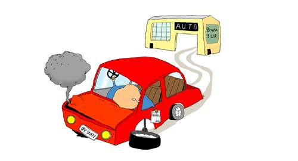
 
---

## Hvor købeloven gælder

Hovedreglen er, at købeloven gælder for alle køb, der bliver indgået mellem sælger og køber.

Undtagelse: Køb af fast ejendom og tjenesteydelser (dog analog anavendelse) eller ved opførelse af bygning eller andet anlæg på fast ejendom, samt internationale køb (Den internationale købelov CISG -Convention on Contracts for the International Sale of Goods).  

---
 
Hovedreglen er, at købeloven er *deklaratorisk* i handelskøb, hvor der er en købsaftale mellem to erhvervsdrivende, dvs., at købeloven:

* Kan fraviges ved aftale

* Må vige for handelsbrug eller sædvane.


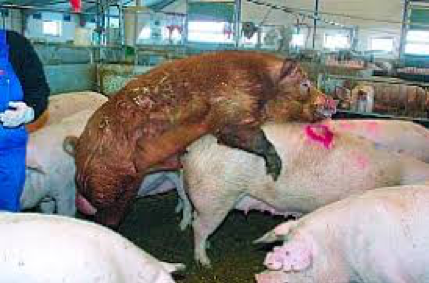

Se Højesteretsdom **U 1984.525 H** – Om den ufrugtbare orne: En leveret orne viste sig ufrugtbar, og der skete omlevering. Køberen rejste krav om erstatning for produktionstab, men ved erklæringer fra forskellige organisationer ansås godtgjort en sædvane inden for handelen med avlsorner for, at driftstab ikke kunne kræves erstattet. 
**<a href="https://pro.karnovgroup.dk/document/7000205124/1" target="_blank">Se dommen klik her!</a>**

---

Købeloven kan ikke fraviges i forbrugerkøb, medmindre fravigelsen er til forbrugerens fordel. 

Dvs., at forbrugeren bliver stillet bedre end, hvad der følger af købelovens ufravigelige forbrugerkøbsregler, fx at der gives forbrugeren 3 års reklamationsret imod den 2-årige lovpligtige reklamationsret der følger af  KBL. § 83, stk. 1.
 
---

## Købelovens begreber ved et handelskøb mellem to erhvervsdrivende
 
Et køb, der indgås mellem handlende, der handler i eller for deres bedrift, jf. KBL § 4, stk. 1 er et *handelskøb* fx. ved køb og salg af lastbiler mellem to erhvervsdrivende - en lastbilsælger og en vognmand.

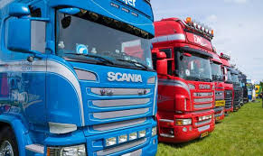

Dvs. et køb, hvor både køber og sælger er erhvervsdrivende, og hvor købet indgås i forbindelse med deres virksomhed eller deres erhvervsmæssige aktiviteter.

Det købte skal hovedsageligt anvendes i erhvervsøjemed, fx. den købte lastbil skal udelukkende anvendes i vognmandsforretningen.

---

Købeloven opstiller i en række sammenhænge særlige regler for handelskøb, jf. fx KBL §§ 6 og 16, § 21, stk. 3, og § 28, stk. 1, §§ 27, 32, 51 og § 52, stk. 1. 

Det er karakteristisk for de særlige regler om handelskøb, at parternes forpligtelser skærpes i forhold til, hvad der gælder i civile køb (handel mellem to private fx. i Den Blå Avis; kaldet et *civilkøb*). 

---

Det er dog ikke udelukket, at man i nogle typer af civile køb, som har et betydeligt merkantilt præg, efter omstændighederne kan skærpe parternes forpligtelser, således at der fx pålægges køberen en streng reklamationsforpligtelse ligesom i handelskøb, hvor KBL § 54’s reklamationsfrist på 2 år kan fraviges ved en aftale.

---

Det er ikke en betingelse i købeloven, af det købte skal anvendes til videresalg. 

Køb af inventar, kontormøbler, kontorrekvisitter, biler til brug for transport af varer eller kundebesøg udgør fx handelskøb, når køberen og sælgeren er handlende.

Der skal være tale om en egentlig *handelsvirksomhed*, derfor er landbrug eller fiskeri ikke at betragte som et handelskøb. 

---

Heller ikke aftaler, som indgås af erhvervsdrivende, som driver liberalt erhverv, fx advokater, rådgivnings- og konsulentvirksomheder mv., anses for handelskøb, da der er tale om tjenesteydelsesaftaler, som ikke er omfattet af købelovens regler, men er istedet er disse tjenesteydelsesaftaler omfattet af fx forældelseslovens regler.

Den handel, hvorved en forretningsdrivende etablerer sig ved køb af en forretning, er hverken et handelskøb eller et forbrugerkøb, men derimod et civilkøb.

---


Se dommen i **U 1988.76 V:** om forsinkelse med betaling af ydelse. Efter en i 1982 indgået kontrakt med ejendomsforbehold om salg af en restauration forfaldt restkøbesummen til betaling, hvis ydelser udeblev ud over 5 dage efter forfaldsdag. I juli 1986 videresolgtes restaurationen til K, der overtog gælden i henhold til købekontrakten, men ikke rettidigt betalte en den 1. august 1986 forfalden ydelse til den oprindelige ejer E. Efter at E den 12. august 1986 havde opsagt restgælden, betalte K dagen efter den forfaldne ydelse. - Da det ikke kunne udelukkes, at E, der havde været bekendt med salget til K, måtte have indset, at den manglende betaling af ydelsen måtte bero på en fejltagelse, havde forsinkelsen ikke berettiget E til at kræve restgælden betalt. 
**<a href="https://pro.karnovgroup.dk/document/7000197909/1" target="_blank">Se dommen klik her!</a>**

---

## Købelovens begreber ved forbrugerkøb:


Forbrugerkøb er et køb, der foretages af en forbruger hos en erhvervsdrivende, der handler som led i sit erhverv, og hvor køberen hovedsagelig handler uden for sit erhverv, jf. nærmere *det civilretlige forbrugerbegreb* i KBL § 4 a, stk. 1. 

Kaldet; *"B2C"*

---

Tilsvarende definitioner på forbrugeraftaler findes bl.a. i aftalelovens § 38 a, stk. 2, kreditaftalelovens § 1, jf. § 4, nr. 1–3, forbrugeraftalelovens § 2, stk. 1, rentelovens § 7, stk. 1, og betalingslovens § 7, nr. 15, jf. også forbrugerklagelovens § 2.

---

**<a href="https://jura.tepedu.dk/lovsamling.html" target="_blank">Se lovene i Lovsamlingen klik her!</a>**

---

Det købte skal hovedsageligt bruges privat.

Det er transaktionsfomålet med det købte i aftaleøjeblikket, der er afgørende for, om der er tale om et forbrugerkøb. 

Dvs. man ser på formålet med det købte og ikke den faktiske anvendelse af det købte. 

---

Det afgørende for, om en aftale har karakter af en forbrugeraftale, er derfor, om den erhvervsdrivendes ydelse på tidspunktet for aftalens indgåelse var bestemt til ikke-erhvervsmæssig anvendelse for medkontrahenten.

---

Det er ikke udelukket at anse et køb for et forbrugerkøb, selv om køberen skal anvende genstanden i såvel privat som erhvervsmæssigt øjemed. 

Det afgørende er, om genstanden hovedsagelig er bestemt til ikke-erhvervsmæssig anvendelse.

*Lønmodtageres indkøb* af genstande anses for forbrugerkøb, også selv om det købte skal benyttes ifm. lønmodtagerens udførelse af sit arbejde.

---

Købeaftaler, som indgås mellem to ikke-erhvervsdrivende, er som udgangspunkt ikke forbrugerkøb, men et *civilkøb*, medmindre et erhvervsdrivende mellemled indgår eller formidler aftaleindgåelsen for den ikke-erhvervsdrivende sælger, jf. KBL § 4a, stk. 2.

Er ydelsen indkøbt mhp. anvendelse i *offentlig virksomhed*, fx stat og kommune, er der ikke tale om forbrugerkøb.

---

Både fysiske og (mindre) juridiske personer kan i dansk ret anses som forbrugere i lovens forstand.

Som *»erhvervsdrivende«* i forbrugerkøbet anses personer, der udøver selvstændig, privat, økonomisk erhvervsvirksomhed inden for handel, industri, håndværk, transport, liberale erhverv, i den finansielle sektor mv., jf. også definitionen i markedsføringslovens § 2, nr. 2. 

Det er ikke afgørende, om der er tale om en hoved- eller bibeskæftigelse, men aktiviteten skal have et erhvervsmæssigt præg, dvs. en fortsat karakter og et ikke helt ubetydeligt omfang. 

---

Et enkeltstående salg vil dermed som udgangspunkt ikke være tilstrækkeligt til at anse forbrugerens medkontrahent for erhvervsdrivende. 

En person, som i et enkelt eller enkelte lejlighedsvise tilfælde videresælger en vare med fortjeneste, vil således ikke alene på det grundlag kunne anses for erhvervsdrivende. 

Der lægges med andre ord bl.a. vægt på transaktionshyppighed og kontinuitet.

---

Det er ikke en forudsætning for at blive anset som erhvervsdrivende, at man har fast forretningssted, men det kan indgå som et moment i vurderingen. 

Det er heller ikke afgørende, om der med virksomheden tilstræbes en økonomisk gevinst. 

---

Det kan være vejledende, men ikke afgørende, om vedkommende sælger er *momsregistreret*, bogføringspligtig, registreret i CVR-registeret, er omfattet af selskabsskatteloven eller foretager skattemæssige afskrivninger. 

Der kan desuden lægges vægt på, om den pågældende har en erhvervsmæssig markedsføring i form af annoncering, firmabrevpapir o.lign. 

Foreninger, organisationer og sammenslutninger kan efter omstændighederne være erhvervsdrivende, hvis de udøver erhvervsprægede aktiviteter.

----

Organisationer, hvis formål udelukkende er velgørende, almennyttigt, politisk eller religiøst, anses som udgangspunkt ikke for erhvervsdrivende, hvad angår deres indsamlingsaktiviteter. 

Sådanne organisationer kan imidlertid anses som erhvervsdrivende, for så vidt angår organisationernes kommercielle aktiviteter, fx hvis der drives forlagsvirksomhed, arrangeres medlemsrejser, drives butikker mv.

---

*Sportsklubber* vil ofte have karakter af almennyttige foreninger, men efter en konkret vurdering af klubbernes aktiviteter og omsætning kan de undertiden anses for erhvervsdrivende.

---

*Fagforeninger og a-kasser* er som udgangspunkt ikke omfattet af begrebet »erhvervsdrivende«, men sådanne organisationers aktiviteter kan efter en konkret vurdering anses for at være erhvervsmæssige.

---

Andelsbolig-, grundejer- og ejerlejlighedsforeninger, gårdlav, almennyttige boligforeninger, bofællesskaber, kolonihaveforeninger, kollegier o.lign. anses som udgangspunkt ikke som erhvervsdrivende, hvad angår de dispositioner, som har til formål at varetage medlemmernes interesser i henhold til organisationens/foreningens formål. 

---

Se afgørelsen i **Forbrugerredegørelse 2002–2003 6.6.1** (en ejerlejlighedsforening, der fordelte varmeudgifterne mellem medlemmerne, ansås ikke for erhvervsdrivende). 

---

Se nedenfor under Biblioteket, se min artikel om boligforeninger mv. og deres evt. status som forbrugere, jf. *Sonny Kristoffersen* i ET 2018 102 ff.
**<a href="https://jura.tepedu.dk/bibliotek-premium.html" target="_blank">Se artiklen klik her!</a>**

---

## Civilkøb


Et køb, hvor begge parter er privat personer, og hvor der ikke bruges en erhvervsdrivende mellemmand til at formidle salget - kaldes for et *civilkøb* og er ikke defineret i købeloven. 

Man anvender handelskøbsreglerne analogt, som har et betydeligt merkantilt præg, medmindre andet er blevet aftalt mellem parterne. 


Et civilt køb kan fx foregå på ”Den Blå Avis” eller på et loppemarked, hvor private udveksler genstande og penge samtidigt. 

---

Se dommen om et civilkøb af en bil i **U 2019.3071 V** vedrørende et vilkår i en slutseddel om, at en bil var solgt »engros uden garanti«, afskar ikke køberen fra at gøre mangler på bilens gearkasse og motor gældende.
**<a href="https://pro.karnovgroup.dk/document/7000840121/1" target="_blank">Se dommen klik her!</a>**

---

## Handelskøb

Et handelskøb er som tidligere nævnt et køb, hvor både køber og sælger er erhvervsdrivende, og hvor aftalen om købet indgås som led i en virksomhed. kaldet *"B2B"*. 

Købelovens regler ved handelskøb er deklaratoriske dvs., at de kan fraviges ved aftale mellem de to erhvervsdrivende.

---

Se nærmere handelskøbsreglerne i købeloven.
**<a href="https://jura.tepedu.dk/lovsamling.html" target="_blank">Se købeloven i Lovsamlingen klik her!</a>**

****


---

*Der findes forskellige former for køb under handelskøbet*:

*Genuskøb:* 


*Genuskøb* er karakteriseret ved:

Køb af genstande, bestemt efter art, jf. KBL § 3.

---

Ved et genuskøb, købes en vis mængde af en angiven art eller type genstande.

Sælgeren har valgfrihed med hensyn til, hvilke varer i det pågældende parti han vil levere til køber for at opfylde aftalen, fx. ved levering af bananer.
 

---


*Specieskøb:*


*Specieskøb* er et køb af en individuelt bestemt genstand, fx købet af maleriet af "Mona Lisa".

Genstanden kan være unik, og måske findes der kun den ene.

Der kan ikke ske omlevering med en tilsvarende vare, hvis den første vare går til grunde.

---

Aftalen er indgået om en specificeret salgsgenstand eller specifikke genstande - et bestemt parti varer, som køber har valgt.

Sælger har ikke valgfrihed med hensyn til, hvilken vare han vil levere til køber for at opfylde aftalen.

---

 
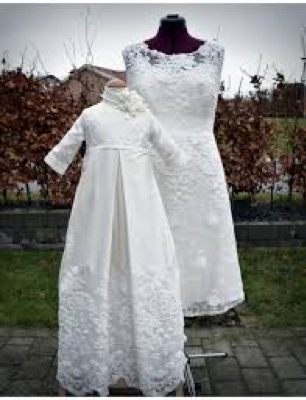 

*Bestillingskøb/fremstillingskøb*:

Et bestillingskøb kan også kaldes et fremstillingskøb, da købet vedrører bestilling af genstande, som først skal fremstilles, jf. KBL § 2, stk. 1, som indeholder et element af værksleje, nemlig aftaler, hvor den ene part har påtaget sig mod vederlag at fremstille en ny genstand (i modsætning til aftaler om fx reparation af en allerede eksisterende genstand). 

---

Se begrebet *"specificatio"*	romerretligt udtryk for frembringelse, dvs. bearbejdelse af et materiale, der tilhører en anden, hvorved der opstår et nyt produkt, fx vindruer, der bliver til vin, eller en marmorblok, der bliver til en statue.

Skabelsen af en ny vare, fx ved en ændring af en eksisterende bryllupskjole til en ny dåbskjole, er omfattet af købelovens regler. 

---

Det tilsvarende gælder ikke, hvis det blot er en reparation af en allerede eksisterende genstand, fx det at få lagt et bukseben op, eller at få udført en serviceydelse. 

---

Reparationer og tjenesteydelser er omfattet af forældelseslovens regler, jf. den 3 årige-forældelse i forældelseslovens § 3, stk. 1 og ikke underlagt reklamationsreglerne i købeloven.  

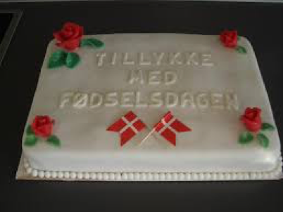 

---

*Fixkøb:*

Betegnelsen *fixkøb* bruges om et køb, hvor køber har betinget sig, at levering sker på et helt bestemt tidspunkt, fx en fødselsdagsskage, der skal leveres om formiddagen den 3. august 2019.
  
 
Samtidighedsgrundsætningen: Sælgeren har ikke pligt til at levere salgsgenstanden, medmindre købesummen samtidig betales, og køber har ikke pligt til at betale købesummen, medmindre salgsgenstanden samtidig stilles til hans rådighed, jf. KBL § 14 (kontantkøb).
 

Modtages betaling ikke samtidig med levering, overgår købet fra kontantkøb til et kreditkøb.
 
--- 

### Sælgers og købers forpligtelser under handelskøbet


 
 
*Sælgers forpligtelser* består i at:

Levere den solgte vare i rette tid og på rette sted (leveringstidspunkt og leveringssted).

Levere den solgte vare i rette stand (uden faktiske og retlige mangler).

---

*Købers forpligtelser* består i modtage varen og at betale den aftalte købesum:

I rette tid.

På rette sted.

Med rette betalingsmiddel.


--- 

#### Levering og risikoens overgang ved handelskøbet

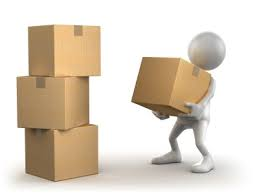
 

Indtil levering er sket, bærer sælgeren risikoen for salgsgenstandens hændelige undergang eller forringelse.

Når levering har fundet sted overgår risikoen fra sælger til køber.

NB! "Levering" kan ske, inden salgsgenstanden er kommet i købers besiddelse.

---

<h4><a href="https://www.youtube.com/embed/oqJcGNfpdY0" target="_blank">Video om risikoens overgang</a></h4>

---

Leveringstidspunktet og risikoens overgang er forskellig og afhænger af, om der er tale om et:

Afhentningskøb.

Pladskøb.

Afsendelseskøb/forsendelseskøb. 

---

*Afhentningskøb*

Hvis intet er aftalt om levering, er det som hovedregel et afhentningskøb. 

Køber henter selv varen på sælgers forretningssted eller bopæl, jf. KBL § 9.

---

*Handelskøb/specieskøb:* 

Risikoen overgår fra sælger til køber på det aftalte afhentningstidspunkt, dvs. det tidspunkt, hvor varen er klar til afhentning, også selv om varen ikke bliver afhentet af køber til tiden.

*Handelskøb/genuskøb:* 

Risikoen overgår fra sælger til køber på det aftalte afhentningstidspunkt, også selv om varen ikke bliver afhentet af køber til tiden.

*Betingelse:* 

Varerne skal være individualiseret/udskilte fra andre varer, som står hos sælger.

---

Ved en "bindende individualisering" ved genuskøb opnår køber beskyttelse mod sælgerens retsforfølgende kreditorer, når bestemte genstande er udskilt til fordel for køber på en for sælger bindende måde.


---

*Pladskøb og afsendelseskøb/forsendelseskøb*

*Pladskøb – udbringelseskøb*: 

Levering inden for sælgers geografiske udbringningsområde. 

Ofte har sælger egne folk der bringer varen ud.

Levering sker, og risikoen overgår fra sælger til køber, når køber har varen i sin besiddelse, jf. KBL § 11.

Det fremgår af bestemmelsen, at levering er sket, når genstanden er kommet i køberens »besiddelse«.

---

Afsendelseskøb/forsendelseskøb, jf. KBL § 10.

Levering sker og risikoen overgår fra sælger til køber, når varen overgives til første fremmede fragtfører. 

Ved søtransport sker levering, når varen er bragt inden for skibssiden.

 
---
 

*Afsendelseskøb med klausuler*

Her findes købelovens leveringsklausuler:

*FOB (Free on board)*, jf. KBL § 62. 

Fragtomkostninger ved FOB: Sælgeren er forpligtet til at stille godset til rådighed for køber når dette er lastet ombord på skibet i den angivne afgangshavn. 
---

Sælgeren holder alle omkostninger frem til dette punkt.

Risikoovergang for FOB klausulen: Risikoovergangen sker, i det øjeblik at godset er placeret på det af køberen angivne skib i afgangshavnen, og godset er frakoblet fra lasteenheden.

Kommentarer til FOB klausulen: Denne Incoterm kan kun anvendes til brug ved søtransport, eller ved transport via indenlandske vandveje.

---

Der er ingen forsikringspligt for sælger, men det anbefales at begge parter tegner en forsikring i hver deres risikoperiode. 

Sælger skal stå for eksportklareringen af godset.

---

*CFR (Cost & freight)*, jf. KBL § 63, jf. § 10.

Fragtomkostninger ved CFR: Sælgeren er forpligtet til at til at afholde alle fragtomkostninger frem til godset er ankommet til ankomsthavnen. 

Køber afholder alle omkostninger i forbindelse med losningen af godset, og den videre transport.

Risikoovergang ved CFR: Risikoovergangen sker, i det øjeblik at godset er placeret på det af sælgeren angivne skib i afgangshavnen, og godset er frakoblet fra lasteenheden.

---

Kommentarer til CFR klausulen: Denne Incoterm kan kun anvendes til brug ved søtransport, eller ved transport via indenlandske vandveje. 

Der er ingen forsikringspligt for sælger, men det anbefales at begge parter tegner en forsikring i hver deres risikoperiode. Omkostninger og risiko følger ikke hinanden. 

Sælger skal stå for eksportklareringen af godset.


---

*Cif (Cost, insurance, freight)*, jf. KBL § 64, jf. § 63 og § 10.

Fragtomkostninger ved CIF: Sælgeren er forpligtet til at til at afholde alle fragtomkostninger frem til godset er ankommet til ankomsthavnen. 

Køber afholder alle omkostninger i forbindelse med losningen af godset, og den videre transport. 

Sælgeren er endvidere forpligtet til at tegne en forsikring med minimumsdækning for søtransporten.


---

Risikoovergang for CIF: Risikoovergangen sker, i det øjeblik at godset er placeret på det af sælgeren angivne skib i afgangshavnen, og godset er frakoblet fra lasteenheden.

Kommentarer til CIF klausulen: Denne Incoterm kan kun anvendes til brug ved søtransport, eller ved transport via indenlandske vandveje. 

Sælger er forpligtet til at tegne en forsikring med minimumsdækning for søtransporten. 

Omkostninger og risiko følger ikke hinanden.

---


* Franco (Frit leveret), jf. KBL § 65.

Francokøb, eller forsendelseskøb, der indebærer, at sælgeren på egen bekostning og risiko skal levere varen på bestemmelsesstedet.

---


Til internationale køb anvendes *INCOTERMS 2010*. 

Incoterms, som er en forkortelse af ”International Commercial Terms”, er kort fortalt en betegnelse for standardiserede regler i købs- og salgsaftaler, og som i forbindelse med nationale og internationale transporter, definerer hvornår en risikoovergang finder sted, samt på hvilket tidspunkt man må antage den solgte vare for været leveret. 

---

Incoterms er ikke lovregler, men nogle standard handelsbetingelser. 

Derfor er det vigtigt, at det tydeligt skal fremgå af sælger/købers aftale at Incoterms er anvendt, da disse bestemmelser rent juridisk ellers ikke vil finde anvendelse.

---

Sådan fungerer det: Køber og sælger indgår en handelsaftale – I handelsaftalen er det nødvendigt at aftale hvordan den købte vare skal leveres.

Køber og sælger blive enige om at anvende Incoterms, hvilket giver dem et klart overblik over hvornår varen er at betragte som leveret, hvem der skal betale for hvilke omkostninger, og hvornår risikoen for godset overgår fra sælger til køber.


---

#### Sælgers misligholdelse

Sælger kan som udgangspunkt misligholde en aftale på tre måder:

* Forsinkelse med levering.

* Faktiske mangler - mangler ved den leverede vare. 

* Retlige mangler – vanhjemmel.

---

##### Forsinkelse med leveringen 

Hvis leveringstidspunkt ikke er aftalt – Levering skal ske efter påkrav, jf. KBL § 12.

Hvis der er aftalt levering:

Primo maj/begyndelsen af maj = 1. til 10. maj.

Medio maj/midten af maj = 11. til 20. maj.

* Ultimo maj/slutningen af maj = 21. til 31. maj.

---

Er der anvendt udtryk som fx »straks«, »omgående«, »prompte« eller »snarest muligt«, beror det bl.a. på brancheforhold mv., hvad der ligger heri,

Hvis der er aftalt levering 1. oktober, og levering sker senere, er der tale om misligholdelse i form af forsinkelse.
 
---

*Hovedregel:*
    
Leveres varen ikke i rette tid, er der tale om forsinkelse, og køber kan gøre misligholdelsesbeføjelser gældende, jf. KBL § 21, stk. 1.  

KBL § 21, stk. 1 gælder for både genus- og specieskøb. 

Det er først og fremmest aftalen, der er afgørende for, om levering er sket rettidigt eller ej.

---

Lovbestemmelsen finder anvendelse, uanset om sælgeren faktisk leverer, men leverer for sent, eller om sælgeren slet ikke leverer, fx fordi en speciesgenstand er gået til grunde. 

Sælgeren har almindeligvis bevisbyrden for, at der er leveret rettidigt.

---

Leverer sælgeren før det aftalte leveringstidspunkt, kan køberen afvise at modtage genstanden og kræve fornyet levering i rette tid, hvis afvigelsen fra sælgerens frigørelsestid er væsentlig.

---

*Undtagelser:* 

KBL § 21, stk. 1 gælder dog ikke:

Hvis forsinkelsen skyldes købers forhold, fx *fordringshavermora* eller

Hvis forsinkelsen skyldes en hændelig begivenhed, som sælger ikke bærer risikoen for, kan sælger:
 
* Tilbageholde købesummen, jf. KBL § 14.

* Kræve naturalopfyldelse/fastholde købet, jf. KBL § 21, stk. 1.

* Ophæve købet/annullere, jf. KBL § 21, stk. 1.

---

Betingelse: væsentlig forsinkelse – i handelskøb er enhver forsinkelse væsentlig, jf. KBL § 21, stk. 3.

Køber kan: 

Kræve erstatning, jf. KBL § 23 (species) og § 24 (genus – et strengt ansvar) – eventuelt dækningskøb, jf. KBL § 25.

Sælgeren har bevisbyrden for, at der foreligger ansvarsfritagende omstændigheder.

---

Hvis køber vil fastholde købet, har køberen reklamationspligt, jf. KBL § 26.

Dvs. så skal køber uden ugrundet ophold meddele sælger, at køber forlanger naturalopfyldelse - køber fastholder købet og kræver levering, selv om levering er forsinket.

Hvis køber ikke reagerer på sælgers information om forsinkelsen, mister køber sin ret til at kræve levering. 

Hvis levering ikke er sket som aftalt, og sælger ikke har informeret køber om forsinkelsen, skal køber reagere overfor sælger inden rimelig tid, hvis køber vil fastholde købet. 

---

Køber kan ikke lade som ingenting – der skal reklameres.

Hvis køberen meddeler, at køber vil fastholde, kan køber sætte en rimelig frist for levering og herefter hæve købet, hvis sælgeren ikke leverer rettidigt.

Det er et grundlæggende princip, at køberen skal reklamere, hvis køber vil ændre status quo, dvs. vil skabe en forandring i den tilstand, der består.

---

Købelovens reklamationsbestemmelser findes i KBL §§ 26–27. 

Om køberens reklamationspligt ved sælgerens forsinkelse, jf. KBL §§ 31–32. 

Om sælgerens reklamationspligt ved køberens forsinkelse, jf. KBL §§ 52–54. 

Om køberens reklamationspligt ved mangler ved salgsgenstanden KBL § 52  


---

Købelovens reklamationsbestemmelser suppleres af almindelige regler om passivitet mv. 

Dette indebærer bl.a., at en reklamation kan tillægges retsvirkning, hvis modtageren ikke gør indsigelse mod reklamationen, eller hvis der indledes forhandlinger vedr. levering el.lign. uden, at der tages forbehold for, at reklamationen er for sen.

---

Såfremt en part over for den misligholdende part tilkendegiver, hvilke(n) misligholdelsesbeføjelse(r) han eller hun vil påberåbe sig, kan parten som udgangspunkt ikke omgøre sit valg.

Hvis sælger skal levere over flere gange (successiv levering), dvs. at sælgeren skal erlægge sin ydelse i rater el.lign., gælder følgende:

---

Situation: Én leverance bliver forsinket.

Hovedreglen er delvis ophævelse.

* Hver enkelt leverance behandles for sig.

* Køber kan hæve købet vedrørende den ene forsinkede leverance. Køber kan ikke hæve de kommende leverancer, jf. KBL §§ 22, 1. pkt.

U1: Hæve kommende aftalte leverancer, hvis de senere leverancer også ventes at blive forsinkede, jf. KBL § 22, 2. pkt.

U2: Købet kan hæves i sin helhed, hvis det er begrundet i sammenhængen mellem leveringerne, jf. KBL § 22, 2. pkt.

---

## Mangler ved salgsgenstanden


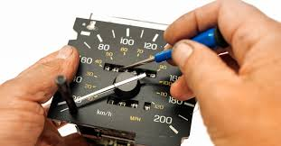

Sælgerens forpligtelse iht. købeaftalen består i at erlægge salgsgenstanden i rette tid og på rette sted samt i rette stand og mængde.

KBl §§ 21–27 regulerer de tilfælde, hvor sælgeren ikke leverer i rette tid og på rette sted (og dette ikke skyldes køberens forhold).

---

KBL §§ 42–54 regulerer de tilfælde, hvor sælgeren ikke leverer i rette stand og mængde, dvs. at der foreligger faktiske (kvalitative eller kvantitative) mangler.

Om retlige mangler, herunder vanhjemmel, og rådighedsmangler, dvs. de tilfælde, hvor køberen ikke får den rådighed over salgsgenstanden, som er aftalt, eller som køberen måtte forudsætte, se KBL § 59.

---

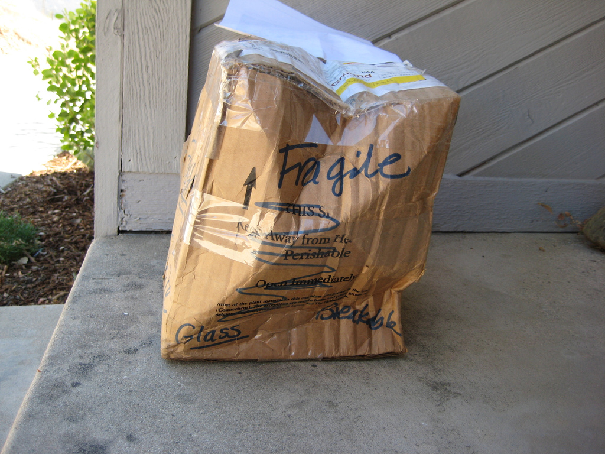

Købeloven indeholder ikke uden for forbrugerkøb en definition af, hvad der forstås ved en faktisk (kvalitativ) mangel. 

Det antages imidlertid, at den definition af mangler i forbrugerkøb, som fremgår af KBL § 76, også kan være vejledende for mangelsbedømmelsen i ikke-forbrugerkøb.

---

Køberen har bevisbyrden for, at salgsgenstanden er mangelfuld, jf. dog i forbrugerkøb KBL § 77a, stk. 3 formodningsreglen, hvor denne bevisbyrde er sælgerens de første 6 måneder efter købet.

Den 15. april 2019 vedtog Rådet det nye direktiv, som skal beskytte de europæiske forbrugere bedre. Når reglerne træder i kraft, vil det være sælger, der i de første 12 måneder skal bevise, at en fejl ved varen ikke er oprindelig og noget, sælger er ansvarlig for. 


---

**Kvantitetsmangel:* Mængde – leveret for lidt i forhold til det aftalte.

**Kvalitetsmangel:* Varen lever ikke op til hvad køber kunne forvente.

Vurderingstidspunkt for salgsgenstandens tilstand vurderes på tidspunktet for levering - dvs. tidspunktet for risikoens overgang, jf. KBL § 44.

---

*Hvad er en mangel:* 

Se principperne i forbrugerkøbsafsnittet, jf. KBL § 76, § 75a, ved vurdering af kvalitetsmangel. 

Varen skal være i overensstemmelse med, hvad der er blevet aftalt mellem køber og sælger.

---

<h4><a href="https://www.youtube.com/embed/ycpgvBLXZDA" target="_blank">Video om faktiske mangler</a></h4>

---


Køberen kan fastholde købet og kræve omlevering:


Specieskøb (kan i sagens natur ikke omleveres, da der kun er én)

Genuskøb, jf. KBL § 43, stk. 1.


Køberen kan fastholde og kræve forholdsmæssigt afslag/nedslag i købesummen:


Specieskøb, jf. KBL § 42, stk. 1.

Genuskøb, KBL § 43, stk. 1.

---


Køberen kan ophæve købet / annullere:


Specieskøb, jf. KBL § 42, stk. 1 – Betingelse: Væsentlig mangel ved salgsgenstanden.

Genuskøb, jf. KBL § 43, stk. 1. – Betingelse: Væsentlig mangel ved salgsgenstanden.


Samt kræve erstatning for købers tab:

Specieskøb, jf. KBL § 42, stk. 2.

Genuskøb, jf. KBL § 43, stk. 3.
 
---

Sælger har ret til at omlevere eller at afhjælpe manglen, fx ved reparation, jf. KBL § 49, hvis:

* Det kan ske uden ulempe for køber.

* Det kan ske uden omkostninger for køber.

* Køber kan ikke hæve eller forlange prisnedslag, hvis sælger tilbyder afhjælpning eller omlevering, jf. KBL § 78, stk. 3.

* Køber kan forlange erstatning, selv om der tilbydes afhjælpning eller omlevering, hvis erstatningsbetingelserne er opfyldt, jf. KBL § 80.

--- 

*Hvis sælger skal levere over flere gange*:

Situation: Én leverance ud af en række er mangelfuld

HR: Delvis ophævelse.

Hver enkelt leverance behandles for sig.

Køber kan hæve købet vedrørende den ene mangelfulde leverance. Køber kan ikke hæve de kommende leverancer, jf. KBL §§ 42,43 og 46.

U1: Hæve kommende aftalte leverancer, hvis de senere leverancer også ventes at blive mangelfulde, jf. KBL § 46, stk. 2

U2: Købet kan hæves i sin helhed, hvis det er begrundet i sammenhængen mellem leveringerne, jf. KBL § 46, stk. 2.
 
---

*Købers undersøgelsespligt, jf. KBL § 51:*

Når salgsgenstanden er leveret, har køber pligt til at undersøge varen, i overensstemmelse med ordentlig forretningsbrug, ellers mister køberen sine misligholdelsesbeføjelser.

Se det latinske begreb: *Caveat Emptor-reglen*: Køberen skal se sig for.

---

<h4><a href="https://youtu.be/o32ngMsTEMY" target="_blank">Video om Caveat Emptor - købers undersøgelsespligt</a></h4>

---

Købers reklamationspligt følger af KBL §§ 52-54:

Ved mangler skal køber reklamere straks, ellers mister han sine misligholdelsesbeføjelser.

Hvis køber vil hæve købet eller kræve efterlevering eller omlevering, skal han reklamere overfor sælger uden ugrundet ophold, ellers taber køber sin ret til at afvise salgsgenstanden eller kræve efterlevering.
 
---

##### Vanhjemmel – retslig mangel

Er, når køber ikke opnår den forventede ejendomsret ved købet. Fx. hvis sælger ikke har ret til at sælge salgsgenstanden, fordi: 

* genstanden tilhører tredjemand,

* er pantsat, lånt, lejet,

* købt med ejendomsforbehold mv, jf. kreditaftalelovens § 34, stk. 1.
 
---

*Fastholde købet*

tredjemands ret fjernes – pant i bil indfries af sælger eller køber, ellers kan tredjemand kræve bilen tilbage fra køber

*Ophæve købet/annullere*

En retlig mangel er væsentlig, og købet kan ophæves. Hver part skal tilbagelevere, hvad de hver især har modtaget.

---

*Kræve erstatning for økonomisk tab:*

Uanset om køber fastholder købet eller annullerer, kan han forlange erstatning, hvis han har lidt et tab – *den positive opfyldelsesinteresse*

Sælgers ansvarsgrundlag er objektivt ansvar over for køber, hvis køber er i god tro, dvs. hverken vidste eller burde vide, at der var retlige mangler.
 
---

#### Købers misligholdelse ved købet

Der er flere måder, hvor på køberen kan misligholde ved købet.

##### Købers forsinkelse med købesummens betaling

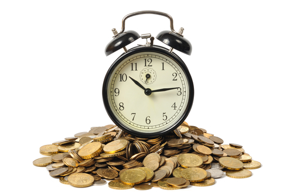

*Købers forpligtelse:*

*Køber skal modtage varen som aftalt og betale den aftalte købesum til tiden*.

---

*Hvordan køberen kan misligholde ved købet:*

Køberens forsinkelse med betaling af købesummen til sælgeren.

Anteciperet (forventet) forsinkelse med køberens betaling af købesummen til sælgeren.

Fordringshavermora - hvorved der menes køberens manglende modtagelse af varen fra sælgeren i forhold til, hvad der er aftalt mellem køberen og sælgeren. 

---

*Hvilke muligheder har sælgeren:*

Kan fastholde købet og forlange betaling, jf. KBL § 28, stk. 1

Hæve købet, jf. KBL § 28, stk. 1.

Forsinkelsen skal være væsentlig. I handelskøb er enhver forsinkelse væsentlig.

Kræve erstatning ved ophævelse, jf. KBL § 30.

Skadeserstatning efter KBL § 24.

Hvis sælger foretager et dækningssalg i rimelig tid efter ophævelsen, og salget indbringer færre penge, end det ville have gjort, hvis aftalen med den oprindelige køber var blevet opfyldt korrekt, kan sælger forlange differencebeløbet erstattet af køber, jf. KBL § 30, stk. 2.
 
---

Situation er den: Hvis sælger allerede har leveret, uden at der samtidig er sket betaling.

Hovedregel: Kreditkøb - ikke hæve og få det solgte tilbage.

Sælger må iværksætte inkasso og evt. tvangsinddrivelse.

Undtagelser, fx hvis:

Det solgte afvises af køber.

Der er taget et kontantforbehold/ejendomsforbehold.

Hvis det solgte er leveret til en køber på et tidspunkt, hvor køber er taget under konkursbehandling, og konkursboet ikke indtræder i aftalen eller stiller sikkerhed for købesummens betaling.
 
---

Særligt om delleverancer af det solgte, se nærmere KBL § 29, jf. KBL § 28.

Situation er den: Der er tale om flere leverancer, og køber er forsinket med betaling af en enkelt leverance.

Sælger kan hæve købet for de følgende leveringer, medmindre der ikke er grund til at frygte yderligere forsinkelser med betalingen.
 
---

*Anteciperet forsinkelse, KBL §§ 39-41:*

Situation: Endnu ikke forsinkelse, men sælger må forvente, at forsinkelse vil opstå – fx hvis køber er insolvent, kommer under konkursbehandling, rekonstruktion mv.

Sælger har tilbageholdsret – kan undlade at afsende varen/kan holde varen tilbage, indtil køber eller købers bo har stillet sikkerhed for betaling og sælger har standsningsret – kan hindre overgivelse og

Det solgte er på vej til køber. Sælger kan hindre overgivelsen til køber, indtil køber eller købers bo har stillet sikkerhed for betalingen af det solgte.

Sælger kan hæve købet: Når det er blevet tid til at levere, kan sælger hæve købet, hvis køber eller købers bo ikke har stillet sikkerhed for betaling af det solgte, jf. KBL § 39, stk. 1. 

---

##### Købers fordringshavermora

Om købers fordringshavermora, jf. KBL §§ 33-37.

Betragtes ikke som misligholdelse, men situationen udløser en række krav og valgmuligheder for sælgeren, der ikke kan ”komme af med” varen.

Sælger har pligt til at drage omsorg (omsorgspligt) for varen for købers regning.

Sælger har tilbageholdsret, indtil udgifterne er betalt.

Sælger har ret og pligt til at sælge varen til anden side.

Sælger er berettiget til at bortskaffe varen.
 

 

---

## Forbrugerkøb


Se købelovens forbrugerafsnit.jf. KBL §§ 72-87.

Se nærmere forbrugerkøbsreglerne i købeloven 
**<a href="https://jura.tepedu.dk/lovsamling.html" target="_blank">Se lovsamlingen klik her!</a>**

---

*Købelovens regler om forbrugerkøb er beskyttelsespræceptive:* 

Reglerne om forbrugerkøb kan ikke fraviges til skade for forbrugeren, men forbrugeren kan godt stilles bedre.

---

Forbrugerkøb: når en erhvervsdrivende som led i sit erhverv, sælger en vare, hvor formålet er til hovedsagelig privat anvendelse, jf. KBL § 4a.

*Bevisbyrde:* Hvis der opstår uenighed om hvorvidt købet er et forbrugerkøb, er det den erhvervsdrivende, der har bevisbyrden for, at købet ikke er et forbrugerkøb, jf. KBL § 4a, stk. 1.
 
---

### Købers og sælgers forpligtelser

 
*Sælgers forpligtelser*:

Levere den solgte vare i rette tid og på rette sted.

Levere den solgte varer i rette stand - uden mangler.

---

*Forbrugerkøberens forpligtelser:*

Modtage varen, som der er aftalt.

Betale købesummen, som er aftalt.

Rette tid i henhold til aftalen.

Rette sted i henhold til aftalen.

Rette betalingsmiddel i henhold til aftalen.

---

#### Levering af varen og risikoens overgang


Hvis intet er aftalt om levering, skal den erhvervsdrivende stille varen til rådighed for køber på den erhvervsdrivendes forretningssted – afhentningskøb, jf. KBL § 9, som er udtryk for hovedreglen, nemlig at leveringsstedet er hos sælgeren (eller der, hvor salgsgenstanden med parternes vidende befinder sig, jf. KBL § 9, stk. 2), dvs. at lovens udgangspunkt er, at der er tale om afhentningskøb - også i forbrugerkøb, jf. KBL § 1, stk. 2 e.c.

---

*Afhentningskøb*: Køber henter varen på sælgers forretningssted eller bopæl, jf. KBL § 9. Risikoen for varen overgår fra sælger til køber, når varen er stillet til rådighed og klar til afhentning.

---

*Udbringningskøb*: Varen bringes ud til køber. 

Levering sker og risikoen for varen overgår fra sælger til køber (forbrugeren), når forbrugeren har varen i sin besiddelse.

---

*Forsendelseskøb*: Levering sker, når varen er i købers besiddelse. Risikoen for varens forringelse eller hændelige undergang ligger hos sælger, indtil varen er i købers besiddelse, jf. KBL § 73: 

Denne bestemmelse finder kun anvendelse, såfremt sælgeren ved aftalen har påtaget sig at sende salgsgenstanden til køberen. 

---

Bestemmelsen gælder også, hvis sælgeren først efter aftalens indgåelse påtager sig at sende genstanden til køberen. En pligt til at sende genstanden kan også følge af sædvane. 

Levering er ikke sket, såfremt sælgeren fx, uden at køberen har anmodet herom, overgiver genstanden til køberens nabo eller henstiller den uden for køberens bopæl, fordi køberen ikke træffes hjemme. 

---

#### Sælgers misligholdelse af aftalen

*Sælger kan som udgangspunkt misligholde en aftale på tre måder:*

* Forsinkelse med levering af den aftalte vare.

* Faktiske mangler - mangler ved den leverede vare.

* Retlige mangler – vanhjemmel.


*Køber kan:*

 
* Tilbageholde købesummen, jf. KBL § 14.

* Påberåbe sig samtidighedsgrundsætningen. Parternes ydelser skal erlægges samtidigt

* Kræve levering, dvs. fastholde købet, jf. KBL § 21, stk. 1.

* Ophæve købet/annullere, jf. KBL § 74, stk. 2.

* Hvis forsinkelse har væsentlig betydning.

* Køber har reklameret med eller uden frist.

* Kræve erstatning for dokumenteret økonomisk tab i forbindelse med den køberetlige mangel, jf. KBL § 80.
 
---

##### Mangler ved salgsgenstanden

*Kvantitetsmangel*: Mængde – leveret for lidt i forhold til det aftalte.

*Kvalitetsmangel*: Varen lever ikke op til, hvad køber kunne forvente i forhold til aftalen.

---

*Hvornår skal der foreligge en mangel?* 

Ved leveringen til køberen, dvs. på tidspunktet for risikoens overgang, jf. KBL § 77a.


---

<h4><a href="https://vimeo.com/309261723" target="_blank">Video om køb</a></h4>

---

*Hvad er en mangel?* 

Se grundprincipperne i KBL §§ 75a og 76.

---

#### Købers misligholdelsesbeføjelser ved mangler

*Kræve naturalopfyldelse/fastholde købet og kræve*:


* Afhjælpning (reparation), jf. KBL § 78, stk. 1, nr. 1.

* Omlevering til en tilsvarende vare, jf. KBL § 78, stk. 1, nr. 2 (ej speciesvare).

* Forholdsmæssigt/passende afslag, jf. KBL § 78, stk. 1, nr. 3:

* Tilbageholde købesum, indtil mangelfri vare er leveret, se samtidighedsgrundsætningen, jf. KBL § 14.
 
Ophæve købet/annullere, jf. KBL § 78, stk. 1, nr. 4.

---

<h4><a href="https://youtu.be/2HE6yDTD0tQ" target="_blank">Video om forholdsmæssigt afslag</a></h4>

---


<h4><a href="https://vimeo.com/309270676" target="_blank">Video om Købeloven- Antal reparationsforsøg</a></h4>

---

<h4><a href="https://vimeo.com/304777987" target="_blank">Video om køb reparationsforsøg</a></h4>

---


*Hvis manglen er væsentlig*

Køber har reklameret med eller uden frist, jf. KBL §§ 81 og 83.

Der kan kræves erstatning for det økonomiske tab, jf. KBL § 80.

 
--- 


*Undersøgelsespligt*

Køber har en mindre undersøgelsespligt, jf. KBL § 77b.

Bestemmelsen begrænser forbrugerens adgang til at påberåbe sig forhold, der ellers ville udløse mangelsbeføjelser.

---

Forbrugeren afskæres således som udgangspunkt fra at påberåbe sig en mangel ved salgsgenstanden, hvis forbrugeren ved aftalens indgåelse var eller måtte være bekendt med den pågældende mangel.

Bestemmelsen indebærer ikke en pligt for køberen til at undersøge salgsgenstanden. 
---

Har køberen foretaget en sådan undersøgelse, kan køberen ikke påberåbe sig forhold, som undersøgelsen har eller må have afsløret.

---

<h4><a href="https://vimeo.com/309253968" target="_blank">Video om reklamationsretten</a></h4>


---

<h4><a href="https://vimeo.com/304774898" target="_blank">Video om reklamationsretten</a></h4>

---

*Reklamation*

Forbrugerkøberen skal reklamere rettidigt, dvs. mindst 2 måneder efter manglen er opdaget, jf. KBL § 81 – ellers mister forbrugerkøberen sine misligholdelsesbeføjelser.

Hvis man ikke kan finde bonnen for købet, kan man anvende et bankudskrift som kvittering.

---

Den absolutte reklamationsfrist er 24 måneder fra salgsgenstandens overgivelse, jf. KBL § 83, stk. 1, medmindre at sælgeren har påtaget sig at indestår for salgsgenstanden i længere tid ved et garantitilsagn (tilsikring), eller at der er tale om en reparation af det købte, som er en tjenesteydelse, hvor indsigelser på den mangelfulde reparation forældes efter 3 år, jf. forældelseslovens § 3.

---

<h4><a href="https://vimeo.com/305910704" target="_blank">Video om garantier</a></h4>

---

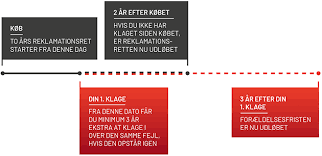  

---

*Formodningsreglen, jf. købelovens § 77a, stk. 3*:

Hvis en mangel viser sig i de første 6 måneder efter levering, formodes det, at genstanden var mangelfuld ved levering.

Køber skal ikke bevise at manglen var tilstede ved leveringen – det formodes, at manglen var tilstede ved leveringen.

---

Køber skal dog bevise, at der er en mangel ved varen.

Hvis en mangel viser sig efter 6 måneder fra levering, og inden udløbet af den absolutte reklamationsfrist på de 24 måneder, er det køber som skal bevise, at manglen var tilstede på leveringstidspunktet.
 
---

##### Købers misligholdelse med købesummens betaling

*Sælgers misligholdelsesbeføjelser:*

* Fastholde købet og forlange betaling.

* Hæve købet/annullere.

* Sælger skal reklamere uden ugrundet ophold.

* NB! Hvis levering er sket – kreditkøb.

* Krav om erstatning ved økonomisk tab.

* Dækningssalg.

* Tilbageholdsret og standsningsret.

---


##### Fordringshavermora - Køber modtager ikke den købte vare

*"Fordringshavermora"* betegnes det, når købers forhold bevirker, at sælger ikke kan levere varen til tiden.

Betragtes ikke som misligholdelse i købelovens forstand.

---

Risikoen for salgsgenstanden overgår til køber, selv om købers forhold bevirker, at sælger ikke kan levere.
  
Sælger har omsorgspligt, og under visse betingelser salgspligt og ret til at sælge købers varer til anden side.

---

## Eksamensopgave 8.1.

**Eksamensopgave om forbrugerkøb, kreditsikring og inkasso**


*Børge Brugtvognsforhandler*


Børge Johansen har i mange år haft skiftende jobs. Han har svært ved at fastholde sine jobs, da han bedst kan lide selv at bestemme arbejdstempo mv. 

Han interesserer sig meget for biler og er ret god til at reparere biler, da en del jobs har været på bilværksteder. 

En af hans venner, Kasper har en 5 år gammel bil og Børge tilbyder at sælge den for ham. Børge sætter straks bilen til salg og får den solgt til den aftalte pris i løbet af 3 dage.

Nu har Børge fundet sit nye job. 

Han vil til at sælge brugte biler. Han vil købe dem hos private, shine dem op og sælge dem videre. 

Børge lejer sig ind på et værksted i et industrikvarter. Han får hurtigt gang i salget, da han sælger bilerne til rimeligt lave priser. 

Børge har bl.a. solgt en 10 år gammel bil til Merete for 15.000 kr. 

Hun har haft bilen i 5 dage, da den går i stykker, og nu vil Merete have sine penge tilbage. 

Børge afviser hende med den begrundelse, at der ikke er nogen reklamationsret da det er en ældre bil og da den er solgt som den er og forefindes og at Merete i øvrigt tog en prøvetur i bilen inden hun købte den. 

Da Merete fastholder sit krav tilbyder Børge, at han vil reparerer bilen, men så må hun også selv betale de nødvendige reservedele – hun skal nok få dem til indkøbspris.

Kaj har også købt en bil hos Børge - for 180.000 kr. 

Børge har ændret lidt i bilens papirer og det viser sig senere, at den er 2 år ældre end der står i papirerne. 

Børge lover at tage bilen tilbage, og så skal Kaj få sine penge tilbage. 

Men Børge kan ikke betale, da han har brugt alle sine penge på bil opkøb. 

Derudover har banken sendt et brev om, at der er overtræk på kassekreditten og at de ønsker sikkerhed for deres tilgodehavende. 

*Eksamensspørgsmålene:*


1.	Redegør for hvilke rettigheder – om nogen - Merete har? 

2.	Redegør for hvad Kaj kan gøre for at få sine penge?

3.  Redegør for hvad kan banken gøre for at sikre kassekreditten?


---

## Løsningsmodeller ved eksamensopgaver i køb


**8.1. Hvis sælger og køber har bopæl i forskellige lande**^[Følgende afsnit bygger på Løsningsmodellerne fra opgavesamlingen i Erhvervsret ASPIRI, v. advokat *Peter Wedel Ranch Krarup*.]

-	I forbrugerkøb gælder CISG - den internationale købelov - ikke. Ved andre køb skal der foretages et lovvalg.  Hvis dansk ret anvendes købeloven.

- Hvis både sælger og køber bor i nordiske lande (Danmark, Finland, Island, Norge og Sverige), anvendes dog i stedet den nationale købelov, som lovvalgsreglerne peger på. Hvis dette medfører dansk ret, anvendes Købeloven.

---

**8.2. Er købsaftale indgået, og med hvilket indhold**

-	Se løsningsmodellen over i kapitel 4 om der er indgået en aftale mellem sælger og køber.

-	Bemærk at Købeloven er fravigelig (deklaratorisk) i handelskøb - jf. KBL § 1, stk. 1.

-	Visse lovbestemmelser kan ikke fraviges til skade for en forbruger - jf. KBL § 1, stk. 2.

---

**8.3. Indledende sondringer**

**8.3.1. Sondre mellem handelskøb, civilkøb og forbrugerkøb**

-	Handelskøb er køb mellem to handlende, der handler som led i deres erhverv - jf. KBL § 4.

-	Forbrugerkøb er køb, hvor en forbruger til privat brug køber fra en erhvervsdrivende - jf. KBL § 4a.

-	Civilkøb er køb, der ikke er handelskøb eller forbrugerkøb, som er indgået mellem to private.

---

**8.3.2 Sondre mellem genuskøb og specieskøb**

-	Har sælger valgfrihed m.h.t. den vare, der skal leveres, er købet et genuskøb - jf. KBL § 3.

-	Har sælger ikke valgfrihed m.h.t. den vare, der skal leveres, er købet et specieskøb.

---
							
**8.4. Misligholdelse**

**8.4.1. Sælgers misligholdelse**

**8.4.1.1. Forsinkelse med levering**

-	Leveres ikke i rette tid og på rettes sted, indtræder der forsinkelse - jf. KBL § 21 (forbrugerkøb - jf. KBL § 74).

**Leveringstiden**

-	På det aftalte leveringstidspunkt.

-	Er der aftalt levering til et bestemt tidspunkt, er købet et fix-køb - jf. KBL § 21, stk. 2.

-	Når leveringstiden ikke er aftalt, skal sælger levere ved købers påkrav herom - jf. KBL § 12.

-	Er der ikke aftalt henstand fra nogen af parterne, skal den ene ikke levere uden samtidig at få sin modydelse (samtidighedsgrundsætningen) - jf. KBL § 14.

**Leveringstedet**

-	Levering sker ved købers afhentning af varen hos sælger - jf. KBL § 9.

-	Ved udbringningskøb, når varen er overgivet til køber - jf. KBL § 11 (forbrugerkøb - jf. KBL § 73).

-	Ved forsendelseskøb, når varen er overgivet til første fremmede fragtfører - jf. KBL § 10.

-	Ved forbrugerkøb dog først, når varen er overgivet til køber - jf. KBL § 73.

-	Ved anden aftale, fx særlige leveringsklausuler (fob, cif, leveret m.v.)

---

**8.4.1.2 Mangler**

Når der opstår mangler på vej fra sælger til køber (risikoens overgang).

-	Afgørende for om der foreligger en mangel er tidspunktet for risikoens overgang - jf. KBL § 44 (forbrugerkøb - jf. KBL § 77a).

-	Ved fordringshavermora går risikoen over på det aftalte leveringstidspunkt, ved genus dog først, når der er sket udskillelse af varen - jf. KBL § 37.

-	Risikoen for varens hændelige undergang/forandring går over på køber ved levering jf. KBL § 17.

- Levering sker ved købers afhentning af varen hos sælger - jf. KBL § 9.

- Ved udbringningskøb, når varen er overgivet til køber - jf. KBL § 11 (forbrugerkøb - jf. KBL § 73).

- Ved forsendelseskøb, når varen er overgivet til første fremmede fragtfører - jf. KBL § 10.

- Ved forbrugerkøb dog først, når varen er overgivet til køber - jf. KBL § 73.

- Ved anden aftale, fx særlige leveringsklausuler (fob, cif, leveret m.v.)

-	Kun hvis manglen er indtrådt, mens det var sælgers risiko, kan mangler gøres gældende.

-	Hvis det er sælgers risiko, kan forsinkelse og mangler gøres gældende.

-	Hvis det er købers risiko, kan hverken forsinkelse eller mangler gøres gældende.
Kvalitetsmangler.

-	Ved varens kvalitet skal leveres, hvad der er aftalt, og hvad køber berettiget kan forvente. 

-	Er intet andet aftalt skal der leveres en vare af middelgod eller sædvanlige kvalitet. 

•	Ved forbrugerkøb - jf. KBL § 76:

•	Genstanden ikke svarer til den betegnelse, hvorunder den er solgt, eller sælgeren ved købets afslutning har givet urigtige eller vildledende oplysninger, medmindre at det er uden betydning for købers bedømmelse af genstanden. 

•	Sælgeren eller tideligere led har givet oplysninger som nævnt ovenfor på varens pakning, i annoncer eller i andre meddelelser til offentligheden.

•	Sælgeren her forsømt at give køberen oplysninger, som sælgeren burde kende, om forhold af betydning for køberens bedømmelse af salgsgenstanden.

•	Genstanden i øvrigt er af anden eller ringere beskaffenhed eller brugbarhed, end den ifølge aftalen og de foreliggende omstændigheder skulle være, herunder hvis kravene i medfør af KBL § 75a ikke er oplyst.

-	Salgsgenstanden skal have holdbarhed og øvrige egenskaber samt emballering, som køberen efter salgsgenstandens karakter og forholdene i øvrigt havde rimelig grund til at forvente. 

-	Salgsgenstanden skal være egnet til formål, som genstanden af den pågældende type sædvanligvis anvendes til. 

-	Salgsgenstanden skal være egnet til køberens særlige formål, hvis sælgeren har bestyrket køberens forventning herom. 

-	Salgs genstanden skal have samme egenskaber som vareprøve eller model, som sælger har forlagt køberen ved købets indgåelse. 

---

**Kvantitetsmangler**

•	Ved varens kvantitet skal leveres, hvad der er aftalt eller følger af sædvane. 

•	Der anvendes samme regler som ved kvalitetsmangler – jf. KBL § 50.

---

**Retsmangler**

•	Retsmangler/vanhjemmel (ejendomsforbehold/pant/dobbeltsalg) - jf. KBL § 59. 

•	Reglerne ved kvalitetsmangler anvendes analogt.

---

**8.4.2 Købers misligholdelse**

•	Køber skal betale på det aftale betalingstidspunkt.

•	Når betalingstiden ikke er aftalt, skal sælger betale ved sælgers påkrav herom - jf. KBL § 12.

•	Er der ikke aftalt henstand af nogen af parterne, skal den ene ikke levere uden samtidig at få sin modydelse (samtidighedsgrundsætningen) - jf. KBL § 14.

•	Fordringshavermora, dvs. at køber ikke kan/vil modtage varen til den aftale tid.

---

**8.5. Undersøgelsespligt** 

**8.5.1. Undersøgelsespligten**

•	I handelskøb har køber pligt til at fortage en sædvanlig undersøgelse så hurtigt som muligt efter modtagelse - jf. KBL § 51.

•	I handels- og civilkøb endvidere hvis køber er opfordret til undersøgelse - jf. KBL § 47. 

---

**8.5.2. Manglende eller utilstrækkelig undersøgelse**

•	Køber kan ikke påberåbe de mangler, som køber opdagede eller burde have opdaget ved denne undersøgelse. 

•	Indsigelser vedrørende skjulte mangler påvirkes dog ikke af manglende eller utilstrækkelige undersøgelse, da sådanne mangler ikke burde være opdaget. 

---

Fordringshavermora foreligger, når køber ikke vil modtage det købte på det aftalte tidspunkt.

-	Ved fordringshavermora går risikoen over på det aftalte leveringstidspunkt, ved genuskøb dog først når der er sket udskillelse af varen - jf. KBL § 37.

-	Sælger har omsorgspligt for varen på købers regning - jf. KBL § 33.

-	Sælger har salgspligt, hvis varen er let fordærvelig eller for dyr at opbevare - jf. KBL § 35.

-	Sælger har salgsret ved for dyr opbevaring eller når køber nægter modtagelse - jf. KBL § 34.

-	Sælger har bortskaffelsesret hvis salg er umuligt eller dyrt - jf. KBL § 34.

-	Sælger har tilbageholdelsesret i varen til dækning af omkostninger og erstatning jf. KBL § 36.

---

**8.6. Reklamationspligt**

**8.6.1. – Købers ved sælgers misligholdelse**

**Forsinkelse**

-	Når levering ikke har fundet sted, skal reklamation ske inden rimelig tid - jf. KBL § 26.

-	Når levering har fundet sted, skal reklamation ske uden ugrundet ophold - jf. KBL § 27.

---

**Mangler**

-	Handelskøb – straks efter at manglen blev eller burde være opdaget, samt inden 2 år efter overgivelsen - jf. KBL §§ 52 og 54.

-	Civilkøb – uden ugrundet ophold efter at manglen blev eller burde være opdaget, samt inden 2 år efter overgivelsen - jf. KBL §§ 52 og 54.

-	Forbrugerkøb – inden rimelig tid efter at manglen blev eller burde være opdaget, samt inden 2 år efter overgivelsen - jf. KBL §§81 og 83. Meddelelse givet inden 2 måneder, efter at køberen opdagede manglen, vil dog altid være rettidig. 

-	Ved svig, handlinger i strid med almindelig hæderlighed eller garanti for længere tid kan der reklameres efter udløbet af de ovenfor anførte frister - jf. KBL §53 + §§ 82-83.

---

5.6.2 – Sælgers ved købers misligholdelse
-	Handelskøb – straks efter at forsinkelsen indtræder - §32. 
-	Civilkøb og forbrugerkøb – uden ugrundet ophold efter, at forsinkelsen indtræder - §32. 

**8.7. Misligholdelsesbeføjelser**

**8.7.1. Købers beføjelser ved sælgers misligholdelse**

-	Fastholde – (forsinkelse) jf. KBL § 21 + § 74, (mangler) KBL §§ 42-43 + KBL § 78. 

-	Hæve hvis væsentligt – (forsinkelse) KBL § 21 + § 74, (mangler) KBL §§ 42-43 + KBL § 78. 

•	Ved successive leveringer kun den berørte del, med mindre der er sammenhæng mellem ydelserne - jf. KBL § 22 (forsinkelse) + KBL § 46 (mangler).

•	Tilbagelevere det modtagne i væsentlig samme stand og mængde - jf. KBL § 57.

•	Dog ikke hvis genstanden hændeligt er gået til grunde eller forandret/forbrugt inden manglen blev opdaget - jf. KBL § 58.

-	Omlevering hvis væsentligt (kun ved mangler og genuskøb) jf. KBL § 43 + § 78. 

•	Tilbagelevere det modtagne i væsentlig samme stand og mængde - jf. KBL § 57. 

•	Dog ikke hvis genstanden hændeligt er gået til grunde eller forandret/forbrugt inden manglen blev opdaget - jf. KBL § 58.

-	Afhjælpning - jf. KBL § 49 + KBL §§ 78-79 (kun ved mangler). 

-	Forholdsmæssigt afslag - KBL §§ 42-43 + KBL § 78 (kun ved værdiforringende mangler).

-	Erstatning – (forsinkelse) KBL §§ 23-24, (mangler) KBL §§ 42-43 + KBL § 80. 

•	Negativ kontraktinteresse eller positiv opfyldelsesinteresse.

---

**8.7.2. Sælgers beføjelser ved købers misligholdelse**

-	Fastholde - jf. KBL § 28.

-	Hæve hvis væsentligt - jf. KBL § 28.

•	Er købet et kontantkøb, eller er varen ved kreditkøb endnu ikke overgivet til køberen, kan sælgeren hæve ved væsentlig misligholdelse - jf. KBL § 28, stk. 1. 

•	Er varen overgivet til køberen, uden at betaling er modtaget (leveret på kredit), med mindre varen er udleveret til køberen ved en fejl, kan sælgeren kun hæve, såfremt der foreligger væsentlig misligholdelse, og såfremt salgsgenstanden er solgt med et gyldigt ejendomsforbehold – jf. KBL § 28, stk. 2.

•	Tilbagelevere det modtagne i væsentlig samme stand og mængde - jf. KBL § 57.

•	Dog ikke hvis genstanden hændeligt er gået til grunde eller forandret/forbrugt inden manglen blev opdaget - jf. KBL § 58. 

-	Sælger har udtagelsesret, såfremt varen er overgivet til køberen efter dennes konkurs - jf. KBL § 41. 

-	Er varen endnu ikke overgivet til køberen, har sælger tilbageholds- og standsningsret ved anticiperet misligholdelse (f.eks. konkurs) - jf. KBL §§ 39-40.

-	Erstatning - jf. KBL § 24 + § 30.

•	Negativ kontraktinteresse eller positiv opfyldelsesinteresse skal diskuteres. 

---


## Godkendte private ankenævn og andre klagemuligheder for forbrugere


*Nævnenes Hus* beliggende i Viborg fører på Erhvervsministerens vegne et overordnet tilsyn med, at de godkendte private ankenævn (udenretlige tvistløsningsorganer/ATB-instanser) overholder deres vedtægter.

Nævnenes Hus er udnævnt til kompetent myndighed i Danmark i henhold til Europa-Parlamentets og Rådets direktiv 2013/11/EU om alternativ tvistbilæggelse i forbindelse med tvister på forbrugerområdet (ATB-direktivet). 

De danske ATB-instanser er Center for Klageløsning og de godkendte private ankenævn.

---


<h4><a href="https://vimeo.com/309270909" target="_blank">Video om forbrugerklager</a></h4>


---

### Liste over klagemuligheder for forbrugere

Erhvervsministeriet skal offentliggøre en liste over tvistløsningsorganer, der opfylder kravene i Forbrugerklageloven og ATB-direktivet. 

Listen omfatter *mediation* i Nævnenes Hus i Center for Klageløsning, godkendte private ankenævn og lovbestemte tvistløsningsorganer.

---

#### Nævnenes Hus

Nævnenes Hus skal foretage mediation i klager, der er omfattet af lov om forbrugerklager, og som indbringes af en forbruger for styrelsen.
Mediationen foretages af Center for Klageløsning, der er en klageinstans under Nævnenes Hus. 

Center for Klageløsning og Forbrugerklagenævnet behandler klager, der ikke hører under et godkendt privat tvistløsningsorgan.

---

<h4><a href="https://vimeo.com/309260267" target="_blank">Video konflikthåndtering</a></h4>

---

*Typiske sager som behandles i Center for Klageløsning og Forbrugerklagenævnet:*

Fejl på møbler, tøj/sko, tv, mobiltelefoner, computere m.v.

Reparationer og serviceydelser – fx reparation af telefoner, møbler, rens af tøj m.v.

Skader forårsaget af et defekt produkt (produktansvar).

Køb af flybilletter fx forsinkelse, erstatning for ødelagt bagage.

Flyttemænd, fx skader på ejendele, prisen for flytningen m.v.

Prisfejl på varer på hjemmesider.

Køb af dyr, fx hunde, katte, heste m.v.

Dyrlægebehandling.

Skønhedsbehandlinger som frisør og lign.

Klager over garanti.

Klager over levering/afledning af vand.

Klager over varer købt på internettet.

Klager over leasing af biler.

Klager over medlemsskaber fx fitness.

Sælger leverer ikke varen.


---

#### Tvistløsningsorganer, som er godkendt af erhvervsministeren

##### Ankenævn for biler


Ankenævnet er et internetbaseret ankenævn for bilejere, som behandler forbrugerklager i forbindelse med køb af en bil for over 10.000 kr. eller en værksted/serviceregning over 1.500 kr.

**<a href="https://www.bilklage.dk/Forside" target="_blank">Se om Ankenævnet for biler klik her!</a>**

****

---

##### Ankenævnet for Bus, Tog og Metro

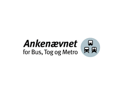

Ankenævnet behandler klager fra forbrugere over problemer oplevet i bus, tog eller metro.

**<a href="http://www.abtm.dk/" target="_blank">Om ankenævnet klik her!</a>**

---

##### Ankenævnet for Feriehusudlejning

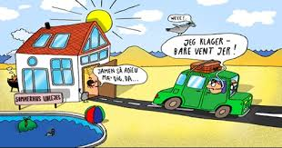

Ankenævnet behandler forbrugerklager vedrørende leje af ferieboliger beliggende i Danmark og det øvrige EU. 

Klagerne angår som udgangspunkt enhver mangel, der måtte udspringe af en lejeaftale. 

Dette kunne være manglende rengøring, mangler ved pool og spa, eller husets standard.

**<a href="https://www.fbnet.dk/ankenaevn/generelt-om-ankenaevnet/ankenaevnet-feriehusudlejning/om-ankenaevnet" target="_blank">Om ankenævnet klik her!</a>**

---

##### Ankenævnet for Finansieringsselskaber


Ankenævnet behandler klager over danske finansieringsselskabers fritstående lån og kreditter; dvs lån, der ikke er knyttet til en genstand.

**<a href="http://www.finansanke.dk/" target="_blank">Om ankenævnet klik her!</a>**

---

##### Ankenævnet for Fondsmæglerselskaber

Ankenævnet for Fondsmæglerselskaber behandler klager over fondsmæglerselskaber, som er omfattet af lov af finansiel virksomhed, og som vedrører private kundeforhold.

**<a href="https://fanke.dk/ankenaevnet-for-fondsmaeglerselskaber/" target="_blank">Om ankenævnet klik her!</a>**

---

##### Ankenævnet for Forsikring

Ankenævnet behandler klager fra private forbrugere om forsikrings- og pensionsforhold.

**<a href="http://ankeforsikring.dk/Sider/default.aspx" target="_blank">Om ankenævnet klik her!</a>**

---

##### Ankenævnet for hotel, restaurant og turisme

Ankenævnet behandler klager fra grupper af forbrugere over tjenesteydelser, der udbydes af hoteller, restauranter, forlystelsesparker og vandrerhjem samt andre virksomheder, der erhvervsmæssigt tilbyder lignende tjenesteydelser, såfremt ydelsen og/eller det fremsatte krav repræsenterer en værdi på højst kr. 150.000,-.

**<a href="http://www.hrt-ankenaevn.dk/" target="_blank">Om ankenævnet klik her!</a>**

---

##### Ankenævnet for Køreundervisning

Ankenævnet behandler klager fra forbrugere mod kørelærere vedrørende modtagelse af teoretisk eller praktisk køreundervisning.

**<a href="https://ankesag.dk/" target="_blank">Om ankenævnet klik her!</a>**

---

##### Ankenævnet for Tekniske Installationer

Ankenævnet behandler klager fra forbrugere over el og vvs arbejder. Det omtvistede beløb, dvs. det beløb der er uenighed om, skal mindst udgøre kr. 2.000,- og højest kr. 150.000,- inkl. moms.

**<a href="http://www.el-vvs-anke.dk/" target="_blank">Om ankenævnet klik her!</a>**

---

##### Ankenævnet på Energiområdet

Ankenævnet på Energiområdet behandler klager fra forbrugere over køb og levering af energiydelser.

**<a href="*https://www.energianke.dk/" target="_blank">Om ankenævnet klik her!</a>**

---

##### Byggeriets Ankenævn

Byggeriets Ankenævn behandler klager fra forbrugere over maler-, murer-, tømrer-, snedker-, gulv-, køkken-, stenhugger-, tække-, kloak-, brolægger-, anlægsgartner- og jordarbejder samt leverancer af vinduer, yderdøre og køkkenelementer. Ankenævnet behandler dog ikke klager over nybyggerier med en samlet entreprisesum på over 1 mio. kr. inkl. moms.

**<a href="https://www.byggerietsankenaevn.dk/" target="_blank">Om ankenævnet klik her!</a>**

---

##### Håndværkets Ankenævn

Håndværkets Ankenævn behandler klager fra forbrugere over nybygnings-, ombygnings-, tilbygnings- og reparationsarbejde vedrørende vvs-, bygningssmede-, maler-, snedker-, tømrer-, tække-, murer-, kloak-, belægnings-, anlægsgartner, auto- og møbelpolstringsarbejde. Håndværkets Ankenævn behandler endvidere klager over leverancer af vinduer, yderdøre og termoruder.

**<a href="https://www.hvanke.dk/" target="_blank">Om ankenævnet klik her!</a>**

----

##### Klagenævnet for Ejendomsformidling

Klagenævnet for Ejendomsformidling behandler klager fra forbrugere over ejendomsmæglere.

**<a href="https://www.ejendomsmaeglernaevnet.dk/" target="_blank">Om ankenævnet klik her!</a>**

---

##### Pakkerejse-Ankenævnet

Pakkerejse-Ankenævnet behandler klager vedrørende rejser, der er arrangeret og/eller solgt af en virksomhed her i landet. En pakkerejse er et rejsearrangement, der består af mindst to af følgende elementer:
transport, indkvartering, anden turistmæssig ydelse, der ikke er knyttet til transport eller indkvartering, men som udgør en væsentlig del af rejsen.

**<a href="https://www.pakkerejseankenaevnet.dk/forside/" target="_blank">Om ankenævnet klik her!</a>**

--- 

<h4><a href="https://vimeo.com/309269644" target="_blank">Video om rettigheder på rejsen</a></h4>

---

##### Parkeringsklagenævnet

Parkeringsklagenævnet behandler klager over kontrolafgifter pålagt af private for overtrædelse af vilkårene for brug af offentligt tilgængeligt private parkeringsområder.
**<a href="https://www.parkeringsklagenaevnet.dk/" target="_blank">Om ankenævnet klik her!</a>**

---

##### Det finansielle ankenævn

Det finansielle ankenævn behandler klager over danske og færøske pengeinstitutter og deres herværende datterselskaber fx finansieringsselskaber vedrørende private kundeforhold. 

Det finansielle ankenævn behandler også klager fra forbrugere over realkreditinstitutter og klager fra forbrugere over investeringsforeninger, specialforeninger samt andre kollektive investeringsordninger m.v. omfattet af Lov om investeringsforeninger og specialforeninger, samt andre kollektive investeringsordninger m.v.
**<a href="https://fanke.dk/" target="_blank">Om ankenævnet klik her!</a>**

---


##### Teleankenævnet


Teleankenævnet behandler klager mellem slutbrugere og teleudbydere vedrørende telefonabonnementer og internetabonnementer samt registrering og debitering af indholdstjenester.
**<a href="https://teleanke.dk/" target="_blank">Om ankenævnet klik her!</a>**

---

#### Lovbestemte tvistløsningsorganer

##### Disciplinær- og klagenævnet for beskikkede bygningssagkyndige

Disciplinær- og klagenævnet behandler tvister mellem forbrugere og beskikkede bygningssagkyndige i anledning af en udarbejdet tilstandsrapport.
**<a href="https://www.forbrug.dk/klageinstanser/klagenaevn-for-bygningssagkyndige/" target="_blank">Om klagenævnet klik her!</a>**

---

##### Søfartsstyrelsen

Søfartsstyrelsen behandler klager, hvor skibspassagerer ikke mener, at deres rettigheder ved sørejser og rejser på indre farvande ifølge EU-forordning nr. 1177/2010 er blevet overholdt.
**www.soefartsstyrelsen.dk**

---

##### Trafik- og Byggestyrelsen (post)

Trafik- og Byggestyrelsen behandler klager fra forbrugere over postvirksomheders ydelser omfattet af postloven.
**<a href="https://www.trafikstyrelsen.dk/da.aspx" target="_blank">Om styrelsen klik her!</a>**

---

##### Trafik-, Bygge- og Boligstyrelsen (flypassagagerer)

Trafik- og Byggestyrelsen behandler klager der vedrører flypassagerrettigheder i forbindelse med lange forsinkelser, aflysninger og boardingafvisningeri henhold til forordning (EF)261/2004.

**<a href="https://www.trafikstyrelsen.dk/da.aspx" target="_blank">Om ankenævnet klik her!</a>**

---

##### Trafik-, Bygge- og Boligstyrelsen (bilsyn)

Trafik- og Byggestyrelsen behandler klager over syns- og omsynsafgørelser vedr. syn og omsyn af køretøjer.
**https://www.trafikstyrelsen.dk/da.aspx**

---

##### Huslejenævn

I alle kommuner findes et huslejenævn, der træffer afgørelse i tvister mellem udlejer og lejere i en lang række tilfælde.

Huslejenævnet kontaktes gennem den enkelte kommune.

**<a href="https://www.huslejenaevn.dk/Pages/default.aspx" target="_blank">Om nævnet klik her!</a>**

---

##### Beboerklagenævn

I alle kommuner med almene boliger findes beboerklagenævn, der behandler tvister mellem udlejere af almene boliger og lejere.

Beboerklagenævnet kontaktes gennem den enkelte kommune.
**www.bdk.dk**

---

## Klagenævn for erhverv

### Klagenævnet for Udbud

Nævnet behandler klager over offentlige myndigheders overtrædelser af reglerne om EU-udbud af offentlige bygge- og anlægsarbejder, indkøb af varer og tjenesteydelser mv. samt klager over offentlige myndigheders overtrædelser af tilbudsloven. 
**<a href="https://naevneneshus.dk/start-din-klage/klagenaevnet-for-udbud/" target="_blank">Om klagenævnet klik her!</a>**

---

### Konkurrenceankenævnet

Konkurrenceankenævnet behandler klager over afgørelser, truffet af Konkurrencerådet samt klager over afgørelser efter Lov om vandsektorens organisering og økonomiske forhold.

**<a href="https://naevneneshus.dk/start-din-klage/konkurrenceankenaevnet/" target="_blank">Om ankenævnet klik her!</a>**

---

### Teleklagenævnet

Teleklagenævnet behandler hovedsageligt klager over afgørelser truffet af Erhvervsstyrelsen og Energistyrelsen om konkurrencemæssige forhold på teleområdet. Det er primært erhvervsdrivende, der kan klage.
**<a href="https://naevneneshus.dk/start-din-klage/teleklagenaevnet/" target="_blank">Om ankenævnet klik her!</a>**

---

### Erhvervsankenævnet

Erhvervsankenævnet er en klageinstans, som behandler klager over administrative afgørelser i det omfang, det fastsættes ved lov eller i henhold til lov.

Man behandler klager over afgørelser truffet af bl.a. Erhvervsstyrelsen, Finanstilsynet og Rejsegarantifonden.
**<a href="https://naevneneshus.dk/start-din-klage/erhvervsankenaevnet/" target="_blank">Om ankenævnet klik her!</a>**

---

### Ankenævnet vedr. Praktikvirksomheder

Ankenævnet vedrørende Praktikvirksomheders opgave er at afgøre klager fra virksomheder, der ikke er blevet godkendt som praktikplads af det faglige udvalg.

**<a href="https://naevneneshus.dk/start-din-klage/ankenaevnet-vedr-praktikvirksomheder/" target="_blank">Om ankenævnet klik her!</a>**

---

### Tvistighedsnævnet

Tvistighedsnævnets opgave er at afgøre sager om uenigheder mellem elev og praktikvirksomhed på erhvervsuddannelserne i forbindelse med elevens praktikophold i virksomheden.
**<a href="https://naevneneshus.dk/start-din-klage/tvistighedsnaevnet/vejledning/" target="_blank">Om nævnet klik her!</a>**

---

## Klager over streamingtjenester, musik eller film, software eller apps.
 
Nye rettigheder for dig, når du køber digitale tjenester i hele EU. Det kan fx være streamingtjenester, musik eller film, software eller apps.

Den 15. april 2019 vedtog Rådet det nye direktiv, som skal beskytte de europæiske forbrugere bedre, når de køber digitale tjenester. 

I dag er reglerne for digitale tjenester forskellige fra land til land indenfor EU. Med direktivet sikres mere ens rettigheder for forbrugerne uanset hvor i EU, sælgeren er etableret. 

Med de nye regler kan du i hele EU have ret til reparation, afslag i prisen eller pengene tilbage, hvis dit digitale produkt er mangelfuldt eller i stykker. 

Fx hvis du ikke kan få adgang til en lejet film. I praksis betyder det oftest, ligesom med fysiske varer, at sælgeren først skal have mulighed for at rette fejlen. Hvis det ikke lykkes, kan du kræve et nedslag i prisen eller pengene tilbage. 

---

<h4><a href="https://vimeo.com/309273066" target="_blank">Video om at forhandle om prisen</a></h4>

---

<h4><a href="https://vimeo.com/309272558" target="_blank">Video om deltagelse i netkonkurrence</a></h4>

---

<h4><a href="https://vimeo.com/309258695" target="_blank">Video Når du køber på nettet</a></h4>

---

<h4><a href="https://vimeo.com/309257060" target="_blank">Video om køb på nettet</a></h4>

---

<h4><a href="https://vimeo.com/309255477" target="_blank">Video om told</a></h4>

---

<h4><a href="https://vimeo.com/309252834" target="_blank">Video hvad betyder .dk?</a></h4>

---


**Quiz om forbrugeraftaler**


Må bilforhandleren sælge den brugte bil som "købt som beset"? Og hvor ofte skal din bil til syn?<a href="https://www.forbrug.dk/quiz/biler/?rn=64766" target="_blank"> Tag testen her.</a>

---  

**Quiz om køb af håndværkerydelser**


Hvad er AB-forbruger? Hvad har du ret til, hvis der er fejl ved håndværkerarbejdet? Og hvad gør du,hvis håndværkeren ikke går i gang med arbejdet til tiden? 

<a href="https://www.forbrug.dk/quiz/quiz-haandvaerkere/?rn=43716" target="_blank"> Tag testen her.</a>

---

**Quiz om aktiv forbruger**


De fleste kan hente en gevinst ved at skifte leverandør eller forhandle om pris/produkt. Men kun få gør det. Quiz om, hvordan du opnår det bedste produkt til prisen. <a href="https://www.forbrug.dk/quiz/aktiv-forbruger/?rn=43716" target="_blank">Tag testen her.</a>

---

**Quiz om bus, tog og metro**


Hvert år rejser danskerne mange tusinde kilometer med bus, tog og Metro. Men kender du fx dine rettigheder, hvis toget er forsinket? Test din viden her.

<a href="https://www.forbrug.dk/quiz/quiz-bus-tog-og-metro/?rn=43716" target="_blank"> Tag testen her.</a>

---

**Quiz om el**


Må elselskabet ringe til dig med tilbud? Hvad koster det at skifte elselskab? Og hvem skal du kontakte, hvis strømmen pludselig går? Test dig selv i vores quiz.

<a href="https://www.forbrug.dk/quiz/el/?rn=43716" target="_blank"> Tag testen her.</a>

---

<h4><a href="https://vimeo.com/306171700" target="_blank">Video om julehandel</a></h4>


---

<h4><a href="https://vimeo.com/305941642" target="_blank">Video om julegaven kan byttes</a></h4>


---

<h4><a href="https://www.forbrug.dk/quiz/julequiz/?rn=43716" target="_blank"> Quiz: Julehandel</a></h4>

---

<h4><a href="https://www.forbrug.dk/quiz/abonnementer/?rn=43716" target="_blank"> Quiz: Abonnementer</a></h4>

---
 
<h4><a href="https://www.forbrug.dk/quiz/betalingskort/?rn=43716" target="_blank">Quiz: Betalingskort</a></h4>

---

<h4><a href="https://www.forbrug.dk/quiz/biler/?rn=43716" target="_blank">Quiz: Biler</a></h4>

---

<h4><a href="https://www.forbrug.dk/quiz/boligquizzen/?rn=43716" target="_blank">Quiz: Boligsalg</a></h4>

---

<h4><a href="https://www.forbrug.dk/quiz/blaasygesikring/?rn=43716" target="_blank">Quiz: Det blå EU-sygesikringskort</a></h4>

---


<h4><a href="https://www.forbrug.dk/quiz/elektronik/?rn=43716" target="_blank">Quiz: Elektronik</a></h4> 

---

<h4><a href="https://www.forbrug.dk/quiz/forbrugerquizzen/?rn=43716" target="_blank">Quiz: Forbrugerrettigheder</a></h4>

---

<h4><a href="https://www.forbrug.dk/quiz/forbrugslaan/?rn=43716" target="_blank">Quiz: Forbrugslån</a></h4>

---

<h4><a href="https://www.forbrug.dk/quiz/klagemuligheder/?rn=43716" target="_blank">Quiz: Klagemuligheder</a></h4>

--- 

<h4><a href="https://www.forbrug.dk/quiz/kopivarequizzen/?rn=43716" target="_blank">Quiz: Kopivarer</a></h4>

--- 

<h4><a href="https://www.forbrug.dk/quiz/markedsfoeringslov/?rn=43716" target="_blank">Quiz: Markedsføringsloven</a></h4>

--- 

<h4><a href="https://www.forbrug.dk/quiz/priser-og-moms-quiz/?rn=43716" target="_blank">Quiz: Moms</a></h4>

---


<h4><a href="https://www.forbrug.dk/quiz/ehandelsquizzen/?rn=43716" target="_blank">Quiz: Nethandel</a></h4>

---

<h4><a href="https://www.forbrug.dk/quiz/e-handel-og-rejser/?rn=43716" target="_blank">Quiz: Nethandel og rejser</a></h4>

--- 

<h4><a href="https://www.forbrug.dk/quiz/proevepakke/?rn=43716" target="_blank">Quiz: Prøvepakker</a></h4>

--- 


<h4><a href="https://www.forbrug.dk/quiz/realkreditlaan/?rn=43716" target="_blank">Quiz: Realkreditlån</a></h4>

--- 


<h4><a href="https://www.forbrug.dk/quiz/skiferie/?rn=43716" target="_blank">Quiz: Skiferie</a></h4>

---  
 

<h4><a href="https://www.forbrug.dk/quiz/snyd-i-din-mailboks/?rn=43716" target="_blank">Quiz: Snyd i din mailbox</a></h4>

---
 
<h4><a href="https://www.forbrug.dk/quiz/spam-og-reklamer/?rn=43716" target="_blank">Quiz: Spam og reklamer</a></h4>

---

<h4><a href="https://www.forbrug.dk/quiz/toej-og-sko/?rn=43716" target="_blank">Quiz: Tøj og sko</a></h4>


