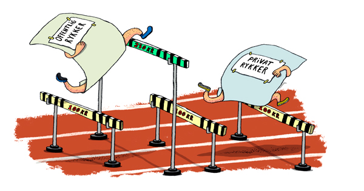

# Insolvensret

```{r, echo=FALSE, results='asis'}
cat(readLines('np.html'))
```


---

*Insolvensreglerne anvendes i dagligdagen i ejendomshandel, ejendomsadministration, bank og realkredit, forsikring samt revision og økonomifunktion i forbindelse med at kunderne og klienter skylder penge til jeres virksomhed.*

---

*Du skal som studerende være særlig opmærksom på følgende problemstillinger ved gennemgangen af insolvensretten, herunder kreditorforfølgning:* 


•	*Forskellen på individual- og universalforfølgning = vigtigt – herunder forskellen på tvangsauktion og konkurs*


•	*Individualforfølgning:*

---

Med individualforfølgning menes:

Når én kreditor forsøger at fremkalde betaling af sit tilgodehavende hos en skyldner fx ved tvangsfuldbyrdelse via Fogedretten. 

Modsat universalforfølgning som fx konkurs.

---

De juridiske udfordringer for en individualforfølgning er:

Udlægsgrundlag (eksekutionsgrundlag) – herunder betalingspåkrav, jf. retsplejelovens kapitel 44a og § 478.
  
Udlæggets genstand (trangsbeneficiet m.m.), jf. retsplejelovens § 507-515.

---
  
*Universalforfølgning:*

Når kreditorerne går sammen for at inddrive deres krav (insolvensbehandling). Universalforfølgning afskærer individualforfølgning. 

Eksempler på universalforfølgning er konkurs, tvangsakkord og gældssanering. Ligelighedsprincippet er centralt. 

Der er desuden mulighed for omstødelse iht. konkursloven (KL)
**<a href="https://jura.tepedu.dk/lovsamling.html." target="_blank"> Konkursloven i Lovsamlingen klik her!</a>**

---

Modsat: *individualforfølgning*.

---

*De juridiske udfordringer ved universalforfølgning:*

*Hæftelse:* Hæftelsestyper i enkeltmandsvirksomhed samt forskellige selskabsformer. 

Emnet har relevans for opgørelse af aktivsiden i et konkursbo samt kreditors evt. tab af restfordringen.  
  
Overordnet om rekonstruktion - anmodning, betingelser og retsvirkning: 
  
Konkursret – anmodning, 
  
Betingelser, jf. KL § 17-21, 
  
Fristdag, jf. KL § 1 

Nærtstående, jf. KL § 2, 

Konkursordenen, jf. KL kapitel 10, 
  
Separatister  og underpanthavere, jf. KL §§ 82 og 86, 
  
omstødelse, jf. KL kapitel 8 

---				

## Regler og definitioner

*Retsplejeloven og Konkursloven regulerer:*

*Individualforfølgning:*

Hver kreditor for sig, den kreditor, der kommer først, bliver først betalt af skyldner
  
Reguleret i Retsplejeloven (RPL; Lovbekendtgørelse nr. 1284 af 14. november 2018) og omfatter bl.a. udlæg, tvangsauktion og tvangsbeneficeret (retten til et beskedent hjem).

---
  
*Universalforfølgning:*

Reguleret i konkursloven (KL; Lovbekendtgørelse nr. 11 af 6. januar 2014), og omfatter konkurs, rekonstruktion og gældssanering.
**<a href="https://jura.tepedu.dk/lovsamling.html" target="_blank"> Konkursloven klik her!</a>**

---
  
Formålet er at stille kreditorerne lige i konkursboet.
  
Kun hvis skyldneren er insolvent, jf. KL § 17:
  
”Er en skyldner insolvent, skal hans bo tages under konkursbehandling, når det begæres af skyldneren eller en fordringshaver. 

Stk. 2 En skyldner er insolvent, hvis han ikke kan opfylde sine forpligtelser, efterhånden som de forfalder, medmindre betalingsudygtigheden må antages blot at være forbigående”.
 
---

Ordet *”insolvent”*


Defineret i KL § 17.

Skyldner kan ikke betale sin gæld, efterhånden som den forfalder til betaling.

Skifteretten vurderer, om insolvensen er til stede.

Hvis skyldner selv erklærer sig insolvent, forventes det at være rigtigt.

---

## Video om udlæg og trangsbeneficium

**<a href="https://www.youtube.com/embed/kxa-lYBFCDk" target="_blank"> Videoen klik her!</a>**

---

Der må ved afgørelsen om skyldnerens insolvens, og dermed en konkursbehandling tages der hensyn til en række momenter i praksis:

En rigtigt opgjort status er et vægtigt indicium om skyldnerens betalingsevne, jf. dommen **U 2001.2592 Ø** Skyldner, der siden 2000-02-10 ved (delvis) betaling havde afværget 15 konkursbegæringer, var insolvent, da han ikke kunne betale 50.798 kr. ifølge en udeblivelsesdom, og da han havde yderligere gældsposter.
**<a href="https://pro.karnovgroup.dk/document/7000236282/1" target="_blank">Dommen klik her!</a>**

---

Det må kræves, at der består en fordring mod skyldneren, men ikke, at den er forfalden. 

Fordringen må endvidere tilkomme den, der indleverer konkursbegæringen til skifteretten.

At fordringen er genstand for en ikke afsluttet retssag, udelukker ikke i sig selv, at den kan tjene som grundlag for konkurs, se fx dommen i **U 1973 673 H**.
**<a href="https://pro.karnovgroup.dk/document/7000209919/1" target="_blank">Dommen klik her!</a>**

---

Kreditor skal have en *retlig interesse* i konkursbehandlingen. 

Denne vil normalt bestå i, at der er udsigt til dividende. 

Det forhold, at kreditor aktuelt ikke kan forvente dividende i boet, udelukker ikke konkurs. 

Den retlige interesse kan bestå i, at konkursbehandlingen kan tænkes at tilvejebringe yderligere aktiver.

Enhver fysisk person kan uanset (u)myndighed være »skyldner« i den anførte betydning i KL § 17.

---

En juridisk person kan som »skyldner« erklæres konkurs, hvis enten ingen deltager i sammenslutningen hæfter personligt for sammenslutningens gæld, eller hvis samtlige personligt hæftende er under konkurs.

Pengeinstitutter kan erklæres konkurs, men beskikkelse af kurator sker efter forhandling med Finanstilsynet, se lov om finansiel virksomhed § 246, stk. 3. 

---

Om forsikringsselskabers konkurs, se lov om finansiel virksomhed §§ 264-265, hvorefter bl.a. beskikkelse af kurator sker efter forhandling med Finanstilsynet. 
**<a href="https://jura.tepedu.dk/lovsamling.html" target="_blank">Lov om finansiel virksomhed i Lovsamlingen klik her!</a>**

---

Ansvarlige interessentskabers boer behandles som konkursboer, når samtlige interessenter er under konkurs.


Insolvens antages i almindelighed at foreligge efter KL § 18, hvis:

* skyldneren erkender at være insolvent, 

* skyldneren er under rekonstruktionsbehandling,

* skyldneren har standset sine betalinger eller

* der ved udlæg inden for de sidste tre måneder før skifterettens modtagelse af konkursbegæringen ikke har kunnet opnås dækning hos skyldneren. 
 

 
---


## Inkasso

Efter en rykkerprocedure med 3 rykkergebyrer, jf. rentelovens § 9 b, skal sagen overdrages til retlig inkasso:

"§ 9 b
For rykkerskrivelser vedrørende fordringer kan fordringshaveren kræve et gebyr, jf. stk. 2, såfremt skrivelsen er fremsendt med rimelig grund (rykkergebyr). Fordringshaveren kan endvidere kræve et gebyr, jf. stk. 3, for at anmode en anden om at inddrive fordringen på fordringshaverens vegne, såfremt dette er sket med rimelig grund (inkassogebyr).

Stk. 2. Der kan kræves et rykkergebyr på højst 100 kr. for hver rykkerskrivelse, dog højst for 3 skrivelser vedrørende samme ydelse.  Har skyldneren inden for en sammenhængende periode til stadighed været i restance vedrørende samme skyldforhold, kan der uanset 1. pkt. højst kræves rykkergebyr for 3 skrivelser vedrørende restancerne i den pågældende periode. Der kan kun kræves gebyr for rykkerskrivelser, som er sendt med mindst 10 dages mellemrum".

Den tredje rykkerskrivelse skal indeholde et inkassovarsel.



---

Om renteloven, jf. Lovbekendtgørelse 2014-05-13 nr. 459 om renter og andre forhold ved forsinket betaling (renteloven), 
**<a href="https://jura.tepedu.dk/lovsamling.html." target="_blank">Se renteloven i Lovsamlingen klik her!</a>**

---

Inkasso reguleres af Lovbekendtgørelse nr. 1018 af 9. september 2014 om inkassovirksomhed.
**<a href="https://jura.tepedu.dk/lovsamling.html" target="_blank">Inkassoloven i Lovsamlingen klik her!</a>**

---

Formålet med inkassoloven er at sikre, at privat inkassovirksomhed, dvs. den inddrivelse af fordringer på andres vegne, der sker uden fogedretternes medvirken som led i privat inkassovirksomhed, foregår på en rimelig og forsvarlig måde. 

Dette søges navnlig opnået ved en autorisationsordning for inkassofirmaer, ved krav om godkendelse af personale, der retter personlig henvendelse til skyldnere, og ved krav om, at inkassofirmaer mv. skal stille sikkerhed for pengekrav, som måtte opstå som følge af udøvelsen af deres virksomhed. 

Lovens formål søges også opnået ved regler om, at inkassovirksomhed skal udøves i overensstemmelse med god inkassoskik i forhold til både skyldnere og kunder, jf. inkassolovens § 9. 

---

## Video Gode råd og gæld

**<a href="https://www.youtube.com/embed/XbxO46Oeizw" target="_blank"> klik her!</a>**

---

Inkassolovens indhold:

Inkassolovens kap. 1 fastlægger anvendelsesområdet for loven.

Kap. 2 fastsættes autorisationsordningen for inkassofirmaer og visse andre virksomheder. Endvidere indeholder kap. 2 regler om sikkerhedsstillelse. 

Kap. 3 fastsættes regler om godkendelse af personale, som retter personlige henvendelser til skyldnere. 

Kap. 4 indeholder regler om, hvorledes inkassovirksomhed skal udøves. 

Kap. 5 indeholder kompetence- og bemyndigelsesbestemmelser. 

Kap. 6 fastsættes regler om tilbagekaldelse og bortfald af autorisation mv.

Kap. 7 indeholder regler om tilsyn. 

Kap. 8 indeholder straffe- og ikrafttrædelsesbestemmelser.

---

### Inkassoprocessen


Gælden sendes til inkasso, hvis skyldner ikke betaler, efter kreditor har sendt en eller flere rykkere (højst 3 stk.)

Inkasso kan foretages af:

+	Kreditor selv

+	Inkassofirma

+	Advokat
  
Inkassobrev med diverse oplysninger sendes til skyldner.


Formålet med inkasso er at få betalt gælden eller opnå en afdragsordning, som kaldes et frivilligt forlig.

Betaler skyldner stadig ikke, må kreditor overveje at fortsætte med tvangsinddrivelse.

---


---

### Forenklet inkasso 


*Hvad er den forenklede inkassoproces (betalingspåkrav)?*

Den forenklede inkassoproces er en enkel måde at få rettens hjælp til at opkræve gæld på. Den samlede gæld må højst være på 100.000 kr. eksklusive renter og omkostninger.

Det særlige ved den forenklede inkassoproces er, at man kun skal rette én henvendelse til fogedretten, som både tager sig af grundlaget for og gennemførelsen af et udlæg.

Man kan bruge den forenklede inkasso i nogle tilfælde i stedet for at indgive en stævning.

---

*Hvornår kan man vælge den forenklede inkassoproces?*

Man kan vælge den forenklede inkassoproces, hvis man har en klar forventning om, at skyldneren er enig i kravet, og kravet ikke overstiger 100.000 kr. eksklusive renter og omkostninger.

---


*Hvordan gør man?*

Ønsker man at starte en forenklet inkassoproces, skal man udfylde og indlevere en *betalingspåkravsblanket* til fogedretten. 
**<a href="http://www.domstol.dk/selvbetjening/blanketter/inkasso/Pages/default.aspx" target="_blank">Blanketten klik her!</a>**

---

Betalingspåkravet har samme funktion som en stævning i civile sager og skal derfor indeholde næsten de samme oplysninger. Det er for eksempel parternes navne og adresse, ens krav og informationer om, hvordan kravet er opstået.

---

*Hvad ender sagen med?*

Hvis man i blanketten for betalingspåkravet har markeret, at man ønsker det, kan fogedretten automatisk:

Sørge for, at betalingspåkravet får samme bindende virkning (retskraft) som en dom. Bagefter iværksætter fogedretten et udlæg mod den skyldner, som er enig i kravet. Her vil sagen normalt ende.

Sende sagen til civilretten, hvis skyldneren – mod forventning – er uenig i kravet. Civilretten indleder derefter en retssag på grundlag af betalingspåkravet.

---

*Hvad koster det?*

Når man indleverer betalingspåkravet til fogedretten, skal man samtidig indbetale en retsafgift. Retsafgiften afhænger af kravets størrelse, ens valg i betalingspåkravet og sagens forløb.

Man kan foretage en vejledende beregning af retsafgiften.
**<a href="http://www.domstol.dk/selvbetjening/beregndinafgift/Pages/default.aspx" target="_blank"> klik her!</a>**

---

## Video God inkassoskik

**<a href="https://www.youtube.com/embed/z8QQeRFvPGQ" target="_blank">klik her!</a>**


---

## Video Forældelsesfristen for gæld

**<a href="https://www.youtube.com/embed/krDpzh9ugJ0" target="_blank"> klik her!</a>**


---

## Video: Inkasso i hundesalonen

<div class="video-container"><iframe src="https://www.youtube.com/embed/4p97-bt-mYk" width="853" height="480" frameborder="0" allowfullscreen="allowfullscreen"></iframe></div>

---


## Tvangsinddrivelse


Ordet *”tvangsinddrivelse”:*

Kreditor kan via fogedretten få udlæg i skyldners aktiver og sælge dem på tvangsauktion

Provenuet fra tvangsauktionen nedbringer skyldners gæld

---

## Video Gode råd om gæld: Fogedretten

**<a href="https://www.youtube.com/embed/th9E-UvXijE" target="_blank"> Videoen klik her!</a>**

---

Tvangsinddrivelse kræver et fundament, jf. RPL § 478 fx:

* Dom eller retsforlig.

* Frivillige forlig, hvis der står, det kan tvangsfuldbyrdes.

* Pantebreve.

* Afgørelser fra Forbrugerklagenævnet og de private godkendte tvistløsningsorganger efter 30 dage.

* Krav fra offentlige myndigheder fx Skat.

* Gældsbreve, hvis der står, det kan tvangsfuldbyrdes.

---

"Eksekutionsfundament" er et dokument, der danner grundlag for tvangsfuldbyrdelse, fx en dom, et retsforlig, et frivilligt forlig eller et gældsbrev.

"Eksigibel" er	udtryk for, at et dokument kan tvangsfuldbyrdes.

---

Se dommen i **U 2019.3219 V** Der kunne ikke ske tvangsfuldbyrdelse på grundlag af et digitalt gældsbrev, hvor underskriften ikke var tilføjet digitalt af den anførte debitor, men ifølge debitors forklaring af hendes daværende kæreste. 
**<a href="https://pro.karnovgroup.dk/document/7000841373/1" target="_blank">Dommen klik her!</a>**

---

Se **U 2019.3313 Ø** Gældsbrev, der var underskrevet ved anvendelse af Bank NemID, kunne tvangsfuldbyrdes, jf. retsplejelovens § 478, stk. 1, nr. 5. 
**<a href="https://pro.karnovgroup.dk/document/7000840573/1" target="_blank">Dommen klik her!</a>**

---

## Video Gode råd og gæld: SKAT

**<a href="https://www.youtube.com/embed/gNK1K_cpsSw" target="_blank"> Videon klik her!</a>**

---

## Video Gode råd om gæld: Budget

**<a href="https://www.youtube.com/embed/V_ZxNcRklxE" target="_blank"> Videoen klik her!</a>**

---

### Fogedretten

Fogedretten er afdeling under byretten ligesom skifteretten.

*Hvad sker der på et møde i fogedretten?*

Man kan blive indkaldt til møde i fogedretten, hvis man skylder penge i henhold til for eksempel et frivilligt forlig eller en dom og ikke betaler til tiden.

Fogedretten behandler således sager om tvangsgennemførelse af krav. Det kan for eksempel være krav om betaling af penge eller krav om at få en ting udleveret.

En kreditor kan få fogedrettens hjælp til at inddrive kravet.

Hvis den der skylder penge ikke kan betale, kan kreditor bede fogedretten om at foretage udlæg i skyldners ejendele.

Har en sælger solgt en ting på afbetaling, for eksempel en bil, og betaler køber ikke afdragene til tiden, kan sælger få fogedrettens hjælp til at få tingen tilbage.

Hvis en lejer ikke betaler sin husleje til tiden, kan udlejeren få fogedretten til at sætte lejeren ud.

Fogedretten holder også tvangsauktioner over fast ejendom.
 
Selv om en rettighed ikke er klart fastslået, kan fogedretten i visse tilfælde hjælpe med en foreløbig sikring af rettigheden.

---

*Fogedforretninger:* 

Når fogedretten hjælper med at få gennemført et krav, kaldes det en fogedforretning.

Udlæg, arrest, Bistand til opretholdelse af forbud og påbud, bevissikring, inddrivelse, tilbagetagelse og udsættelse af lejemål er eksempler på forskellige typer af fogedforretninger. 

En *"justificationssag"* betegner en	sag til efterprøvelse af lovligheden af en arrest eller et fogedforbud.

---

*Umiddelbare fogedforretninger:* 

Umiddelbare fogedforretninger er en type fogedsager, der ikke handler om betaling af pengebeløb. 

En umiddelbar fogedforretning kan for eksempel handle om, at ejeren af en ting ønsker fogedens bistand til at få tingen udleveret fra en anden. 

---

En umiddelbar fogedforretning kan også handle om, at ejeren af en ejendom ønsker fogedens bistand til at få en lejer sat ud af lejemålet.

En umiddelbar fogedforretning	kan ligeledes være en gennemtvingelse af udleveringskrav via fogedretten uden forudgående dom - fx til udlevering af et barn, som holdes tilbage efter samværsbesøg.

---

*Mødet i fogedretten*

Hvis man er skyldner, skal man medbringe alle oplysninger om ens egne og ens husstands økonomiske forhold til mødet, for eksempel registreringsattest til bil, matrikelnummer på fast ejendom og oplysninger om kontonumre på bankkonti.

Man har pligt til at svare på de spørgsmål, der bliver stillet på mødet, og til at tale sandt. Man kan straffes, hvis man taler usandt i fogedretten.

---

På mødet vil ens muligheder for at betale blive gennemgået. 

Hvis man ikke kan betale hele gælden straks, kan man normalt indgå en afdragsordning. 

Afdragsordningen kan dog ikke strække sig over længere tid end 10 måneder, medmindre andet bliver aftalt. 

I de tilfælde skal man typisk stille ens eventuelle aktiver, for eksempel hus eller bil, til sikkerhed for kreditors krav, indtil det er betalt. Det kaldes udlæg, se nedenfor.

Betaler man de aftalte afdrag til tiden, beholder man rådigheden over tingene. 

---

Hvis ikke kan man risikere, at kreditor anmoder om tvangsauktion over de udlagte genstande, som man så mister.

Kan man hverken betale straks eller afdrage, og ejer man intet af værdi, kan man afgive en insolvenserklæring til fogeden. 

Det betyder, at man normalt først kan blive indkaldt til fogedretten igen efter 6 måneder.

Hvis man mener, at man ikke skylder pengene, eller vil man protestere over andre forhold i sagen, kan man gøre det på mødet. 

---

Hvis fogeden ikke kan tage stilling til ens protest straks, kan fogeden vælge at udsætte sagen til et nyt møde, hvor der er afsat mere tid til at behandle sagen.

Hvis man er utilfreds med fogedrettens afgørelse, kan man normalt kære (klage) den til landsretten.

---

*Mødepligt i fogedsager:*

Man har pligt til at møde i fogedretten. Men man kan – med mindre fogedretten har bestemt andet – lade en anden møde for sig, hvis man udfylder den fuldmagt, man har modtaget med indkaldelsen til mødet i fogedretten.
 
Den person, som møder for én, skal kende til sagen og til ens økonomiske forhold. 

Gør personen ikke det, kan fogedretten stille krav om, at man selv møder personligt.

Hvis man bliver syg, har man ikke pligt til at møde. 

---

Fogedretten kan stille krav om, at man dokumenterer sin sygdom med en lægeattest. 

Man skal selv medbringe denne blanket hos ens egen læge. Man skal selv betale for attesten. Man kan ikke udeblive, fordi man skal på arbejde.

Møder man ikke, kan man risikere, at politiet afhenter én uden yderligere varsel. Man kan også risikere, at fogeden samme dag eller senere møder op på ens bopæl.

---

*Indgivelse af anmodning:* 

*Hvor skal man sende anmodning hen?*

I fogedretten kan man få hjælp til at få inddrevet et krav, som skyldner har anerkendt ved fx at underskrive et gældsbrev.

Sagen skal normalt sendes til fogedretten i den retskreds, hvor skyldneren bor, hvor der er pant for fordringen, hvorfra skyldner driver virksomhed, eller hvor den genstand, sagen drejer sig om, befinder sig.

---

Fogedretten behandler også betalingspåkrav. Ønsker man at indgive et betalingspåkrav, gælder samme regler som for civile sager. 

Et betalingspåkrav skal derfor indgives til fogedretten i den retskreds, hvor skyldneren bor.

---

*Hvornår kan man sende sin anmodning?*

Retsplejeloven fastsætter frister for, hvornår man kan få fogedrettens hjælp til at få gennemtvunget en afgørelse eller få inddrevet et krav.

Domme kan først gennemtvinges, når fuldbyrdelsesfristen er udløbet, og kun hvis modparten ikke forinden har anket afgørelsen. 

---

Fuldbyrdelsesfristen er 14 dage medmindre andet er bestemt i dommen.

Retsforlig og gældsbreve kan først inddrives eller gennemtvinges, når der er gået 14 dage fra den dag, man kunne kræve beløbet/ydelsen betalt, medmindre andet er bestemt i dokumentet.

---

*Hvad sker der, hvis sagen ikke er indgivet det rette sted?*

Hvis en sag bliver sendt til en forkert fogedret, vil retten så vidt muligt videresende sagen til den rigtige.

---

Foreløbig sikring af rettigheder:

*Arrest:*

Hvis man mener, at man har krav på penge fra en anden person, kan man i særlige tilfælde sikre sit krav ved at få foretaget arrest i personens formue.

Der kan for eksempel være tale om ulovlig brug af et patent eller om udgivelse af en bog, der indeholder fortrolige oplysninger.

---

Man har mulighed for at anmode fogedretten om at foretage arrest for krav, som man ikke kan få foretaget udlæg for.

Man skal som hovedregel sende sin anmodning til fogedretten i den retskreds, hvor den person eller virksomhed arresten skal rettes imod, har adresse.

---

Arrest kan kun foretages,

•	hvis det bliver sandsynliggjort, at der er et krav, og

•	hvis det må antages, at muligheden for senere at få dækning for kravet bliver væsentligt forringet, hvis ikke der foretages arrest.

•	Når der er foretaget arrest i en genstand, må ejeren ikke sælge den.

---

Hvis fogedretten foretager arrest, skal den, der har anmodet om arresten, anlægge sag ved civilretten inden 1 uge.

Man kan klage til landsretten over fogedrettens afgørelse.

---

Se romerrettens begreb: *"periculum in mora"*;	"fare ved udsættelse" - anvendes fx om situationer, hvor øjemedet med et indgreb vil forspildes, hvis man skal afvente en retskendelse.

---

*Bevissikring:*

Hvis man har mistanke om, at en anden person foretager handlinger, der krænker ens immaterielle rettigheder, for eksempel ved ulovlig musik- eller softwarekopiering, kan man anmode fogedretten om at foretage en bevissikringsundersøgelse hos den pågældende person.

For at der kan foretages en bevissikringsundersøgelse, skal det sandsynliggøres, at der er foretaget krænkelser af en immateriel rettighed, og at krænkelserne er sket i erhvervsmæssigt øjemed eller har haft et betydeligt omfang.

---

Bevissikringsundersøgelsen bliver som regel foretaget ved, at fogeden tager ud til det sted, hvor de påståede krænkelser har fundet sted. 

Her foretager fogeden en undersøgelse af stedet. 

Hvis fogeden finder genstande, der tyder på, at der er foregået krænkelser, kan fogedretten bestemme, at disse genstande skal beslaglægges.

For at beviserne ikke bliver skaffet af vejen, kan fogeden bestemme, at bevissikringsundersøgelsen skal foretages uden på forhånd at underrette den person, som påstås at have foretaget krænkelserne.

---

Den, der anmoder om en bevissikring, skal anlægge sag ved civilretten inden 4 uger efter, at fogedretten har afsluttet undersøgelsen.

Fogedrettens afgørelse om bevissikring kan kæres til landsretten. 

Landsretten kan dog ikke tage stilling til de spørgsmål, som skal behandles under den civile sag.

--

*Udlæg:*

Hvis man skylder penge, og man ikke betaler, kan kreditor bede fogedretten om at hjælpe med at indkræve pengene.

I fogedretten vil man blive spurgt, om man har mulighed for at betale pengene. 

Hvis man ikke kan betale, kan fogedretten foretage udlæg i et eller flere af ens aktiver. 

---

Det kan for eksempel være ens faste ejendom eller ens bil. 

Udlæg betyder, at kreditor kan forlange, at det aktiv, der er foretaget udlæg i, sælges på auktion, så kreditor kan få sine penge.

Der kan ikke foretages udlæg i små pengebeløb, sædvanligt indbo eller i andre ting af beskeden værdi, som er nødvendige for familiens erhverv eller uddannelse, se nærmere nedenfor for en gennemgang af *udlæg*.

---

*Inddrivelse af gæld til det offentlige:* 

Gæld til det offentlige inddrives af Skat/Inddrivelsescentret. 

Hvis skyldner protesterer over afgørelsen om udlæg, bliver sagen sendt til fogedretten.

Fogedretten indkalder herefter til et møde, hvor fogedretten tager stilling til indsigelsen.

---

*Tilbagetagelsessager:*

Har en sælger solgt en ting på afbetaling, for eksempel en bil, og betaler køber ikke afdragene til tiden, kan sælger få fogedrettens hjælp til at få tingen tilbage.

Bistand til opretholdelse af forbud og påbud:  
 
Hvis en person eller virksomhed overtræder et forbud eller påbud, som er meddelt af civilretten, kan man anmode fogedretten om hjælp til at opretholde forbuddet eller påbuddet.

---

Fogedretten kan eksempelvis hindre, at et forbud bliver overtrådt, sikre at et påbud bliver efterkommet eller tilintetgøre, hvad der er foretaget i strid med forbuddet eller påbuddet. 

Fogedretten kan også under visse betingelser beslagægge genstande, som anvendes eller har været anvendt ved overtrædelse af forbuddet eller påbuddet.

Man skal som hovedregel sende ens anmodning om bistand eller beslaglæggelse til fogedretten i den retskreds, hvor ens modpart har adresse eller til fogedretten ved den byret, der har meddelt forbuddet eller påbuddet.

---

Hvis man vil anmode om beslaglæggelse, og der allerede er en sag i gang om meddelelse af midlertidigt forbud og påbud ved civilretten eller Sø- og Handelsretten, skal man sende anmodningen til denne ret, som samtidig træffer afgørelse om beslaglæggelse. 

Retten kan dog henvise spørgsmålet om beslaglæggelse til fogedretten.

Hvis man er uenig i fogedrettens afgørelse om bistand, herunder beslaglæggelse, kan man kære den til landsretten. 

Det vil sige, at landsretten efterfølgende behandler sagen og træffer en ny afgørelse.


---

### Betalingspåkrav

Hvis kreditor ikke har et fundament, skal kreditor:

Have en dom for kravet eller

Udfylde et betalingspåkrav, jf. RPL kap. 44a.

Betalingspåkravet udfyldes af kreditor og indgives til Fogedretten.

Betalingspåkravet kan kun anvendes hvis:

+	Kreditor har et pengekrav på højst 100.000 kr.

+	Kravet er ubetinget og ubestridt af skyldner.

+	Skyldner har fået et ”inkassobrev”.
  
Kan med Fogedrettens påtegning på betalingspåkravet anvendes som fundament

---
 

### Udlæg


Hvis man skylder penge, og man ikke betaler, kan kreditor bede fogedretten om at hjælpe med at indkræve pengene.

I fogedretten vil man blive spurgt, om man har mulighed for at betale pengene. 

Hvis man ikke kan betale, kan fogedretten foretage udlæg i et eller flere af ens aktiver. 

---

Det kan for eksempel være ens faste ejendom eller ens bil. 

Udlæg betyder, at kreditor kan forlange, at det aktiv, der er foretaget udlæg i, sælges på auktion, så kreditor kan få sine penge.

Der kan ikke foretages udlæg i små pengebeløb, sædvanligt indbo eller i andre ting af beskeden værdi, som er nødvendige for familiens erhverv eller uddannelse, se nærmere nedenfor.

---

*HR:* Kreditor kan få udlæg i alle skyldners aktiver, medmindre følgende undtagelser:

*U1:* Tredjemands rettigheder skal respekteres.

*U2:* Særlige indlån i pengeinstitut fx bil købt på afbetaling som et kreditkøb med ejendomsforbehold.

*U3:* Endnu ikke udbetalt løn, jf. RPL § 511.

*U4:* Udbetalt erstatning fx fra ulykkesforsikring, RPL § 513 Erstatningen skal være holdt adskilt fra øvrige midler.

*U5:* Personlige aktiver med beskeden værdi, jf. jf. RPL § 515, stk. 1.

*U6:* Personlige hjælpemidler, jf. RPL § 515, stk. 2.

*U7:* Båndlagte gaver, jf. RPL § 514.

*U8:* Trangsbeneficiet, jf. RPL § 509.


---


Se dommen i **U 2019.3256** om krav i henhold til gældsbrev var ikke fritaget fra udlæg i medfør af retsplejelovens § 513, stk. 1, om beskyttelse mod kreditorforfølgning af personskadeerstatning.
**<a href="https://pro.karnovgroup.dk/document/7000840517/1" target="_blank">Dommen klik her!</a>**

---

## Video: Udlæg og trangsbeneficiet

**<a href="https://www.youtube.com/embed/kxa-lYBFCDk" target="_blank"> Videoen klik her!</a>**

---
 

*Trangsbeneficiet, jf. RPL § 509:*


Kreditor kan ikke få udlæg i aktiver omfattet af trangsbeneficiet.

Omfatter aktiver, der hører til et beskedent hjem, fx seng, bord, stol, sofa.

---

Almindelig hvidevarer hører til et beskedent hjem, fx køleskab, fryser, almindeligt tv og almindelig computer.

Smykker, malerier, smart TV eller fjernsyn med surround sound og subwoofer og andre værdifulde aktiver er ikke omfattet af trangsbeneficiet.

---

Spørgsmål er i et hvilket omfang, der kan foretages udlæg i følgende genstande og værdier: 

* Boliginventar (Opretholdelse af et beskedent hjem)

* Bil

* Kontanter (rede penge)

* Indestående på konti

* Depositum (lejebolig)

* Kæledyr

* Gaver, 

* Værdier med affektionsværdi

* Personskadeerstatning (Udbetalinger ved kritisk/ livstruende sygdom)

* Feriepenge

---

## Tvangsauktion


*En tvangsauktion er et "tvangssalg"*. 

Tvangsauktionssagen kan iværksættes af en person, som har penge til gode hos ejeren af ejendommen eller genstanden. 

Det kan for eksempel være en panthaver, der ikke har modtaget terminsydelser.

---

### Tvangsauktion over fast ejendom

Alle tvangsauktioner over fast ejendom sker i fogedretten i den retskreds, hvor ejendommen ligger. 

Den, der har iværksat tvangsauktionen, skal lave en salgsopstilling over ejendommen med alle oplysninger om ejendommen. Salgsopstillingen og standardauktionsvilkårene danner grundlaget for tvangsauktionen.

Vejledning i brug af salgsopstilling og Justitsministeriets tvangsauktionsvilkår findes her.

Salgsopstillingen bliver inden auktionen sendt til ejeren og til alle, der har pantebreve i ejendommen.

---

### Tvangsauktion over landbrugsejendom

Landbrugsstyrelsen har udformet vejledningen ”Endelig adkomst på landbrugsejendomme erhvervet på tvangsauktion”.
**<a href="https://www.domstol.dk/saadangoerdu/tvangsauktion/Documents/Endelig%20adkomst%20p%C3%A5%20landbrugsejendomme%20erhvervet%20p%C3%A5%20tvangsauktion.pdf" target="_blank">klik her!</a>**

---

Formålet er at vejlede køber. 

Vejledningen indeholder blandt andet information om, at det ved erhvervelse af en landbrugsejendom på tvangsauktion er landbrugslovens regler, der gælder, samt vejledning om opfyldelse af erhvervelsesbetingelserne.

---

### Tvangsauktion over løsøre 

Tvangsauktioner over løsøre kan efter henvisning af fogeden afholdes ved en auktionsleder. 

Tvangsauktioner over registrerede skibe og luftfartøjer samt gældsbreve og andre fordringer afholdes af fogedretten, mens aktier og andre værdipapirer realiseres ved tvangssalg efter forudgående autorisation fra fogedretten af en værdipapirhandler, typisk et pengeinstitut.

---

En liste over beskikkede auktionsledere fordelt på de enkelte retskredse.
**<a href="http://www.justitsministeriet.dk/arbejdsomr%C3%A5der/civilret/beskikkelse-af-auktionsledere" target="_blank">klik her!</a>**

---

Auktionslederne kan også benyttes til frivillige offentlige auktioner.

Tvangsauktioner er offentlige. 

Alle, der møder, kan afgive bud på auktionen. 

Kan man ikke selv møde, kan man lade en advokat byde for én. 

Man kan også give en skriftlig fuldmagt til en anden person, der så kan byde for én.
 
---


---

## Video om tvangsauktion

**<a href="https://www.youtube.com/embed/drN8QtdRsfk" target="_blank"> Videoen klik her!</a>**

---


## Konkurs

Se konkursloven. 
**<a href="https://jura.tepedu.dk/lovsamling.html." target="_blank">klik her!</a>**

---


For at en skyldner - en person eller et selskab - kan erklæres konkurs, er det en betingelse, at skyldneren er *insolvent*, jf. kravet i konkurslovens § 17:

"Er en skyldner insolvent, skal hans bo tages under konkursbehandling, når det begæres af skyldneren eller en fordringshaver.

Stk. 2. En skyldner er insolvent, hvis han ikke kan opfylde sine forpligtelser, efterhånden som de forfalder, medmindre betalingsudygtigheden må antages blot at være forbigående". 

---

*"Insolvens":*

En person er insolvent, når passiverne overstiger aktiverne (insufficiens), eller når han ikke er i stand til at opfylde sine forpligtelser efterhånden som disse forfalder (illikviditet)

---

Begrebet *illikviditet* betegner manglende evne til at betale forpligtelserne, efterhånden som disse forfalder.

---

*"Insufficiens"* er	udtryk for, at passiverne overstiger aktiverne.

En "fallent"	person, er en person, der er gået konkurs.

Man er insolvent, hvis man ikke kan betale sin gæld til tiden, og betalingsvanskelighederne ikke kun er midlertidige. 

Konkurs er en universalforfølgning, formålet er at dele skyldners aktiver ud til kreditorerne, så alle kreditorer stilles lige.

Begæring kan indgives til skifteretten af skyldner eller kreditor, jf. KL § 17, stk. 1.

Skyldner mister rådighed over sine aktiver ved dekretets afsigelse, jf. KL § 29.

Skifteretten udpeger kurator (advokat), som handler på vegne af konkursboet.

Annoncering i Statstidende - virkning for enhver, jf. KL § 30.

---
 
### Hvem kan indgive konkursbegæring?

En kreditor, der har penge til gode hos en skyldner, kan indgive konkursbegæring. 

Det er en betingelse, at årsagen til den manglende betaling er pengemangel og ikke manglende betalingsvilje, for eksempel utilfredshed med et udført arbejde. 

Er dette tilfældet, må der i stedet føres en retssag ved de almindelige domstole. 

---

Det samme gælder, hvis det er usikkert, om pengene skyldes.

En person eller et selskab, der er insolvent, kan indgive konkursbegæring mod sig selv.

Generelt må det anbefales at kontakte en advokat, inden man indgiver en konkursbegæring.

---

Se **U 2020.447 V** Konkursbetingelserne opfyldt, da skyldner ikke havde godtgjort at være solvent og at betalingsudygtigheden blot var forbigående.


---

### Hvad koster det at indgive konkursbegæring?

Retsafgiften for at indgive en konkursbegæring er 750 kr.

Den, der indgiver konkursbegæringen, skal normalt stille sikkerhed for betaling af omkostningerne ved konkursbehandlingen. 

Sikkerhedens størrelse fastsættes af skifteretten og skal stilles, inden skifteretten træffer afgørelse om konkurs. 

---

Omkostningerne ved konkursboets behandling dækkes altid først af konkursboets midler. 

Hvis der ikke kommer nogen - eller ikke tilstrækkelige - midler frem under bobehandlingen, kommer den, der har indgivet konkursbegæringen, til at betale omkostningerne.

---

Er det en lønmodtager, der ikke har fået udbetalt løn eller feriepenge, der indgiver konkursbegæringen, skal der ikke stilles sikkerhed for omkostningerne. 

Statskassen betaler da omkostninger, som ikke kan dækkes af boets midler.

---

### Hvad skal der stå i begæringen?

Konkursbegæringen skal være skriftlig. 

I konkursbegæringen skal man skrive navn og adresse på skyldneren og eventuelt CVR-nummer. 

---

Man skal også skrive, hvilket beløb der skyldes, og lidt om, hvad beløbet skyldes for. 

Man skal også skrive sit eget navn, adresse og telefonnummer.

Hvis en skyldner begærer sig selv taget under konkursbehandling, skal skyldner vedlægge en opgørelse over sine aktiver og passiver og en liste over sine kreditorer .

---

### Hvor skal man indgive begæringen? 

Hvis skyldneren har en erhvervsvirksomhed, skal begæringen indgives til skifteretten i den retskreds, hvor erhvervsvirksomheden ligger. 

Driver skyldneren ikke erhvervsvirksomhed, skal begæringen indgives til skifteretten i den retskreds, hvor skyldneren bor.

Er det i Storkøbenhavn (København, Lyngby, Glostrup og Frederiksberg  retskreds), indgives begæringen til Sø- og Handelsretten i København.

---

### Konkursbehandling

 


*Under konkursbehandlingen sker der følgende:*

Separatistkrav bliver fyldestgjort før konkursmassen gøres op.

En *"separatist"* er den, der er berettiget til i et konkursbo at forfølge sin ret til en individuel genstand uden hensyn til de andre berettigede i boet, fx ejere, sælgere med ejendomsforbehold, håndpanthavere.

---

Kurator skal sælge og opgøre alle konkursboets aktiver.

Konkursboet skal overveje, om det vil indtræde i gensidigt bebyrdende aftaler.

Konkursboet vurderer, om der kan være omstødelige dispositioner.

Kurator opgør alle kreditorernes krav og placerer dem i konkursordenen.

Når konkursboets aktiver og passiver er gjort op bliver kreditorerne fyldestgjort efter konkursordenen.

---

### Konkursmassen

Konkursmassen er konkursboets samlede aktiver og passiver.

Konkursboets aktiver (konkursmassen) omfatter:

*HR:*	Alt hvad skyldner ejer ved konkursdekrets afsigelse og under konkursen tilfalder ham, jf. KL § 32

*U1:*	Aktiver, som kreditor ikke kan få udlæg i, jf. KL § 36. 

*U2:*	Skyldners arbejdsindtægter under konkursen. 

*U3:*	Separatistkrav (fx aktiver solgt med ejendomsforbehold).

---


Boets passiver omfatter:  

Alle kreditorer kan anmelde deres krav, uanset om kravet er forfaldent, jf. KL § 38
 
De vigtigste niveauer i konkursordenen er i rækkefølge Konkurslovens kap. 10:

*Massekrav*, dvs. krav, som er opstået ved selve konkursbehandlingen, fx kuratorsalær,

*Privilegerede krav*, fx krav opstået under forsøg på at afværge en konkurs og lønkrav fra visse af skyldnerens ansatte, samt

*Simple krav*, dvs. krav fra skyldnerens almindelige kreditorer og derfor i  almindelighed den største post.

---
 
### Konkursordenen

Konkursordenen inddeler alle konkursboets kreditorer i klasser.

Hver konkursklasse bliver fyldestgjort fuldt ud, før der udloddes til næste klasse.

Først dækkes omkostninger i forbindelse med konkursen (massekrav), og herefter de øvrige klasser.

* Hvis der ikke er dækning til hele klassen, fx de simple krav, bliver der udloddet en dividende. Efterstående konkursklasser får ingen dækning.

---

Konkursordenen	betyder derfor inddelingen af konkurskreditorerne i klasser, således at intet krav i en lavere klasse dækkes, så længe der ikke er fuld dækning til alle krav i en højere klasse:

Massekrav

Sekundære massekrav

Privilegerede krav

3a: Lønkrav

3b: Leverandørkrav for en række afgifter

Simple krav

Efterstillede krav

---
 
### Udlodning af dividende

En dividende på 10 % til simple krav betyder, at kreditor med et krav på 100.000 kr. får en dækning på 10.000 kr.

Ordet *"udlodning"* betyder	udbetaling af arv i et dødsbo eller dividende i et konkursbo.

*Udækket gæld:*

Kreditor har stadig et restkrav på 90.000 kr. efter konkursen er afsluttet.

Kreditorernes udækkede gæld følger skyldner, hvis skyldner er en fysisk person.

Hvis skyldner er et selskab har kreditor ingen at rette kravet mod efter konkursen. Den udækkede gæld kan ikke blive fyldestgjort.

---
 
###	Konkurskarantæne


---

### Hvad er en konkurskarantæne?

Konkurskarantæne betyder, at en person i en periode får et forbud mod at deltage i ledelsen af en virksomhed, hvori den pågældende ikke hæfter personligt og ubegrænset for virksomhedens forpligtelse (aktieselskaber, anpartsselskaber m.v.)

En person kan pålægges konkurskarantæne, hvis personen på grund af groft uforsvarlig forretningsførelse vurderes uegnet til at deltage i ledelsen af en erhvervsvirksomhed.


---

*Hvem kan blive pålagt konkurskarantæne?*

Personer, som har været medlem af ledelsen i en virksomhed, der er gået konkurs, kan pålægges konkurskarantæne.

*Hvor lang tid varer en konkurskarantæne?*

Konkurskarantænen vil som udgangspunkt blive pålagt for en periode på 3 år.

---

### Overtrædelse af konkurskarantæne

Hvis en person overtræder en konkurskarantæne, kan skifteretten efter omstændighederne pålægge personen en ny karantæne. 

I den forbindelse kan karantænen udvides til et forbud mod deltagelse i enhver form for erhvervsvirksomhed, herunder den pågældendes egen personligt drevne virksomhed.

---

En overtrædelse af karantænen kan også medføre, at personen hæfter personligt på objektivt grundlag for selskabets forpligtelser, hvis det går konkurs.

Endvidere kan en overtrædelse af en konkurskarantæne straffes med bøde eller fængsel indtil 6 måneder efter straffelovens § 131.

---

*Hvem kan starte en sag om konkurskarantæne?*

Det er kurator eller rekonstruktør, der starter en sag om konkurskarantæne.

Kuratorer og rekonstruktører vurderer i alle konkursboer og rekonstruktionssager, om der er grundlag for at indlede en sag om konkurskarantæne.

---

### Konkurskarantæneregistret

Den, der bliver pålagt konkurskarantæne, registreres i et konkurskarantæneregister. 

Personer i dette register kan ikke blive registreret som medlem af ledelsen i et erhvervsdrivende selskab og kan ikke i strid med karantænen blive momsregistreret eller registreret som arbejdsgiver hos SKAT.

---

*Hvem har adgang til konkurskarantæneregistret?*

Der er ikke offentlig adgang til konkurskarantæneregistret.

Skifteretten kan videregive oplysninger fra registret til en kurator eller rekonstruktør, når skifteretten vurderer, at det er nødvendigt for kuratorens eller rekonstruktørens varetagelse af sit hverv.

---

Se dommen i **U 2019.3164 V**, hvor en direktør i konkursramt selskab blev pålagt konkurskarantæne i 3 år.
**<a href="https://pro.karnovgroup.dk/document/7000841374/1" target="_blank"> klik her!</a>**

---

### Omstødelse

Konkursens formål er at alle kreditorer stilles lige

Omstødelsesreglerne forhindrer, at kreditorer kan få en meget bedre retsstilling kort før konkursen indtræder

Omstødelse medfører at den begunstigede skal betale det omstødelige beløb tilbage.

---

Fristdagen er den dag Skifteretten har modtaget begæring om:

  +	Konkurs
  
  +	Rekonstruktion
  
  +	Gældssanering
  
---
  
Beregning af omstødelsesperioden tager udgangspunkt i fristdagen 

En konkurs starter med, at konkursboet selv eller en kreditor indleverer begæring / konkursbegæring til skifteret.

---

Fristdagen er derfor som udgangspunkt den dag, da skifteretten modtog begæring om rekonstruktion, konkurs eller gældssanering. 

Det er dagen hvor begæringen modtages, som er afgørende for fristdagen.

*"Afkræftelse"* er et	gammelt ord for omstødelse af dispositioner forud for en konkurs.

---


```{r kaution, echo=FALSE,fig.height=5}

mydf <- data.frame(
  S1 = c(
"Omstødelse",
"Gaver" ,
"Løn til nærtstående",
"Betaling af gæld", 
"Pant for gammel gæld", 
"Udlæg",
"Utilbørlige dispositioner"
),
  S2 = c(
    "Hovedregel for hvornår handlingen skal være foretaget, regnet tilbage fra fristdagen",
    "6 måneder",
    "6 måneder",
    "3 måneder",
    "3 måneder",
    "3 måneder",
    "Ingen grænse"
),
  S3 = c(
    "Hvis debitor er insolvent på tidspunktet for handlingens foretagelse, og handlingen er til fordel for en nærtstående, regnes fristen tilbage fra fristdagen",
"2 år",
"2 år",
"2 år",
"2 år",
"2 år",
"Ingen grænse"
)
  
)
names(mydf) <- NULL

mydf %>%
  kable("html", escape = FALSE,caption = "Sammenligning mellem privat kaution og erhvervskaution") %>%
  kable_styling(full_width = T,font_size = 10,bootstrap_options = c("responsive","bordered","striped")) %>%
  column_spec(1, bold = T, border_right = T, color = "black", background = "lightgrey") %>%
  column_spec(2, bold = T, border_right = T, color = "black", background = "lightgrey") %>%
  column_spec(3, bold = T, border_right = T, color = "black", background = "lightgrey") %>%
  row_spec(1,italic = T,bold = T,font_size = 12,color = "white", background = "darkgrey")
  # row_spec(1,italic = T,bold = T,font_size = 12)
  # column_spec(0, angle = -45)%>%
  # scroll_box(width = "500px") %>%
  # footnote(general = "Databeskyttelsesforordningen",general_title = "Kilde:")
```


---


```{r, echo=FALSE, result=TRUE ,fig.height=5,fig.cap=("Omstødelsesperiode for gaver")}
library(timevis)

data <- data.frame(
  id      = 1:5,
  content = c("6 måneder fra 2019-02-01 til 2019-08-01", "Omstødelsesperiode<br>starter<br>2019-02-01",
              "Overdragelse<br>af gave<br>2019-05-01", "Fristdag<br>2019-08-01","Konkursdekret<br>2019-08-22"),
  start   = c("2019-02-01", "2019-02-01",
              "2019-05-01", "2019-08-01","2019-08-22"),
  end     = c("2019-08-01", NA, NA, NA,NA) )
timevis(data, showZoom = FALSE)%>%
  setOptions(list(editable = FALSE)) %>%
  setSelection("5") %>%
  fitWindow(list(animation = TRUE))
```


---


```{r, echo=FALSE, result=TRUE ,fig.height=3,fig.cap=("Modregning før fristdag")}
library(timevis)

data <- data.frame(
  id      = 1:4,
  content = c("Fristdag",
              "Skyldners (konkursboets hovedkrav på kreditor opstår", "Kreditors modkrav opstår","Konkursdekret"),
  start   = c("2019-08-02",
              "2019-11-01", "2020-02-01","2020-02-25"),
  end     = c( NA, NA, NA,NA) )
timevis(data, showZoom = FALSE)%>%
  setOptions(list(editable = FALSE)) %>%
  setSelection("5") %>%
  fitWindow(list(animation = TRUE))
```

---


```{r, echo=FALSE, result=TRUE ,fig.height=3,fig.cap=("Modregning mellem fristdag og konkursdekret")}
library(timevis)

data <- data.frame(
  id      = 1:4,
  content = c("Fristdag",
              "Skyldners (konkursboets hovedkrav på kreditor er opstået", "Kreditors modkrav er opstået","Konkursdekret"),
  start   = c("2019-08-02",
              "2019-11-01", "2020-02-01","2020-02-25"),
  end     = c( NA, NA, NA,NA) )
timevis(data, showZoom = FALSE)%>%
  setOptions(list(editable = FALSE)) %>%
  setSelection("5") %>%
  fitWindow(list(animation = TRUE))
```

---


```{r, echo=FALSE, result=TRUE ,fig.height=4,fig.cap=("Modregning mellem fristdag og konkursdekret")}
library(timevis)

data <- data.frame(
  id      = 1:5,
  content = c("A får lavet køkken<br>Snedkers krav opstår",
              "Trælastens krav<br>på snedker opstår", "A køber<br>fordring","3 måneder","Fristdag"),
  start   = c("2019-08-02",
              "2019-11-01", "2020-02-01","2020-02-01","2020-02-25"),
  end     = c( NA, NA, NA,"2020-02-25",NA) )
timevis(data, showZoom = FALSE)%>%
  setOptions(list(editable = FALSE)) %>%
  setSelection("5") %>%
  fitWindow(list(animation = TRUE))
```

---

Se dommen i **U 2019.3119 V** Overdragelse af selskabs biler til selskabets direktør kort før konkursen, hvorved selskabets gæld til direktøren blev nedbragt ved modregning, omstødt i medfør af konkurslovens § 67, stk. 1, jf. § 69. 
**<a href="https://pro.karnovgroup.dk/document/7000839974/1" target="_blank">Dommen klik her!</a>**

---

## Video: Hvad er forskellen på frivillig gældssanering og konkurs?

**<a href="https://www.youtube.com/embed/-x0_B732-Pw" target="_blank"> Videoen klik her!</a>**

---

**Studenteropgave:**

**Find domme i UfR, hvor der er sket omstødelse.**
**<a href="https://pro.karnovgroup.dk/journals/ufr" target="_blank"> klik her!</a>**

---

Om gavebegrebet:

En *"gave"*	defineres i juraen som en vederlagsfri overførsel af et formuegode som et udslag af gavmildhed (animus donandi). 

Et gaveløfte	er en ensidig viljeserklæring om at ville yde en anden en gave. Skriftlige gaveløfter kræver ikke accept. 

Mundtlige gaveløfter skal accepteres straks.

---

## Eksamensopgave 13.1.

*Om konkurs og virksomhedsformer mv.*

*Ejendomsmæglerens konkurs*


Karla Kamilla Kyrel drev ejendomsmæglerfirmaet K3 v/ Karla Kamilla Kyrel. Virksomheden, der var startet i maj 2014, havde haft svært ved at få foden indenfor på markedet og de huse, man rent faktisk havde fået til salg, havde vist sig vanskelige at sælge. 

D. 11. august 2015 modtog Retten i Odense Bank Skt. Knuds konkursbegæring mod Karla Kamilla Kyrel personligt og d. 14. august 2015 afsagde Retten i Odense konkursdekret. 

Bank Skt. Knud havde oprindeligt stillet en usikret kassekredit på 300.000 kr. til rådighed for Ejendomsmæglerfirmaet K3 v/Karla Kamilla Kyrel, men kassekreditten var blevet udvidet til 500.000 kr. d. 15. maj 2015. 

På udvidelsestidspunktet var den eksisterende kassekredit udnyttet fuldt ud. 

I forbindelse med udvidelsen havde Bank Skt. Knud fået pant for alle 500.000 kr. i Karla Kamilla Kyrels ubehæftede sommerhus, der senere – under konkursen – indbragte 1.300.000 kr. Pantet var sendt til tinglysning samme dag som aftalen om udvidelsen var lavet. 

Da banken anmeldte sit krav i konkursboet, meddelte kurator, at banken sikkerhed efter hans opfattelse kunne omstødes og at bankens krav skulle indgå i konkursordenen på lige fod med de i øvrigt anmeldte krav. Ved konkursen var K3s konto overtrukket en smule - der var trukket præcis 525.000 kr. på kontoen.

*Eksamensspørgsmålet:*

1. Giv en kort begrundet redegørelse for, hvilken virksomhedstype, der er tale om og hvorfor det er Karla Kamilla Kyrel, der personligt bliver ramt af konkursen? (5%) 


*Eksamensspørgsmål:*

2. Giv en kort begrundet redegørelse for, hvilken dag der er fristdagen. (5%) 


*Eksamensspørgsmål:*

3. Giv en begrundet redegørelse for, om bankens sikkerhed helt eller delvist kan omstødes. (25%)


*Eksamensspørgsmål:*

4. Giv en kort begrundet redegørelse for, hvor i konkursordenen den usikrede del af bankens krav skal placeres. (5%) 


---

Fiona, der havde været ansat som ejendomsmægler hos K3, blev i stedet ansat som ejendomsmægler hos mæglerfirmaet VillaVillaKulla A/S, der udelukkende formidlede eksklusive huse. 

Det blev aftalt, at Fiona ville få 50% af alle salærer VillaVillaKulla A/S fik ind fra formidlingsaftaler hun skaffede firmaet. VillaVillaKulla A/S´ indehaver, Ulla Nielsen, var imidlertid meget interesserede i at fastholde firmaets eksklusive profil. 

Ud over løn og ansættelsesvilkår blev det derfor pointeret, at selvom det at indgå formidlingsaftaler var en helt normal del af en mæglers arbejde, så var det den faste regel i VillaVillaKulla, at man ikke måtte indgå formidlingsaftaler det første år af ansættelsen. Alle nye aftaler skulle i den periode indgås af Ulla.

Fiona var meget entusiastisk i forhold til sit nye arbejde og ville rigtigt gerne vise, at det i hvert fald ikke var hendes skyld, at K3 gik konkurs. 

Til den ugentlige træning i den lokale karateklub fortalte Fiona derfor glædestrålende om sit nye job og reklamerede voldsomt for VillaVillaKulla. Særligt over for holdkammeraten Tyra, der lå i skilsmisse, fik den hele armen og allerede et par dage efter var der bid. 

Tyra kontakte Fiona og bad hende besigtige Tyras rækkehus, hvilket skete samme dag. Da Fiona dagen efter gav Tyra om besked om, at hun mente, at huset kunne sælges for 1,4 mio. slog Tyra straks til. 

Samme aften kørte Fiona forbi Tyra på vej hjem fra kontoret og både Tyra og Fiona underskrev aftalen.

Næste dag da Fiona glædestrålende fortalte sin Ulla, at hun havde skaffet sin første kunde til virksomheden, blev Ulla ikke helt så glad som Fiona havde håbet. 

Faktisk gjorde Ulla det meget klart, at hun ikke ville have ”den slags huse” til salg og ringede straks Tyra op og gav hende samme besked. Tyra fastholdt, at de havde en aftale. 

*Eksamensspørgsmålet*

5. Er VillaVillaKulla A/S er forpligtede til at formidle salget af Tyras bolig? (20%)


---

Et par dage efter den uheldige situation med Tyra kaldte Ulla Fiona ind på sit kontor og bad hende være ”købermægler” for en af sine gode venner Palle Sætter. 

Palle havde i noget tid drevet en mindre robotvirksomhed, OmniRobots ApS, der producerede robotter der kunne automatisere processer inden for samling, maling, svejsning og pakning. 

Virksomheden blomstrede og da de var ved at vokse ud af de lokaler, de indtil da havde lejet sig ind i, var de på udkig efter noget større, de kunne købe. 

Oven på situationen med Tyra gjorde Fiona sig yderst umage med det resultat, at OmniRobots ApS i løbet af kort tid fik købt en fabriksejendom for 5 mio. kr. 

Beliggenheden var helt igennem ideel og selvom ejendommen krævede en del tilpasning for at kunne bruge til netop OmniRobots produktion, kunne de 4 måneder senere, d. 1. december 2015, flytte deres produktionsmaskiner til den nye location.  

I forbindelse med købet af ejendommen optog OmniRobots ApS et afdragsfrit lån på 3.0 mio. kr. i Realkredit Syd, der fik pant i ejendommen for beløbet. 

Realkredit Syds pantebrev blev anmeldt til tinglysning d. 2. november 2015. Den resterende del af købesummen samt pengene til ombygningen blev skaffet ved at bruge godt 1,7 mio. kr. 

OmniRobots havde stående i likvide midler samt at trække 1,2 mio. kr. på en kassekredit OmniRobots havde haft i Bank Skt. Knud, siden de købte deres produktionsmaskiner i februar 2014. 

Til sikkerhed for kassekreditten havde Bank Skt. Knud fået virksomhedspant i alle de kategorier, det er muligt at få virksomhedspant i og der var d. 13. februar 2014 tinglyst skadesløsbrev på virksomhedens blad i tingbogen. 

D. 1. november 2017 går OmniRobots ApS konkurs og de eneste aktiver på konkursboet er:

Ejendommen – værdi 2,2 mio. kr. 

Driftsmateriel, herunder de nævnte produktionsmaskiner – værdi 0,6 mio. kr.  

Tilgodehavender hos kunder – værdi 0,3 mio. kr.

En lastbil, Volvo FH 12 480 årg. 2009 – værdi 0,1 mio. kr. 

Der skyldes fortsat 3,0 mio. kr. til Realkredit Syd og 

1,2 mio. kr. til Bank Skt. Knud. 

Realkredit Syd gør med henvisning til deres pant i ejendommen krav på værdien af ejendommen, produktionsmaskinerne og lastbilen. 

Bank Skt. Knud gør med henvisning til deres virksomhedspant krav på alle fire aktiver. Konkursboet vil bare gerne have mest muligt til de øvrige kreditorer.

*Eksamensspørgsmålet:*

6. Hvem har krav på værdien af hvilke aktiver? (30%)

---

Uanset hvad du har svaret i opgave 6, skal du nu lægge til grund, at Bank Skt. Knuds virksomhedspant giver dem ret til værdien af tilgodehavenderne – 300.000 kr. Forestil dig, at banken d. 6. juni 2017 havde fået besked om, at en af OmniRobots andre kreditorer, Kreditech, d. 5. juni 2017 havde fået et udlæg på 70.000 kr. i tilgodehavenderne. 

*Eksamensspørgsmål*

7. Giv en begrundet redegørelse for hvor meget af de 300.000 kr. Kreditech og Bank Skt. Knud hver ville have krav på? (10%)

---

**Podcast om svaret på eksamensopgaven**

---


*Hvilke dispositioner kan fx omstødes:*


*Gaver, der ikke er lejlighedsgaver, jf. KL § 64*


*Betaling af gæld, jf. KL § 67, hvis betaling er sket*:

+	I omstødelsesperioden og

+	Betalingen ikke er ordinær 
  
Derudover skal betaling enten være:
  
+	Med usædvanlige betalingsmidler eller

+	Sket før normal forfaldstid eller

+	Med et beløb der afgørende har forringet skyldners betalingsevne.

---
 

Pant for gammel gæld, jf. KL § 70:

+	Pant for samtidig stiftet gæld er ok, hvis sikringsakten er foretaget med det samme
  
Udlæg, jf. KL § 71:

+	alle udlæg, hvor sikringsakten er foretaget de seneste 3 måneder før fristdagen, kan omstødes
  
*Utilbørlige dispositioner*, jf. KL § 74, hvis den begunstigede er i ond tro om:

+	Skyldners insolvens og
+	Utilbørligheden
 
Med kravet om utilbørlighed er det markeret, at en kreditorbegunstigelse eller en forringende disposition kan savne det anstødelige præg, som er en betingelse for omstødelse. 

Ved denne bedømmelse må der dog også tages hensyn til, hvor kritisk skyldnerens situation er. 

Står konkursen for døren, indsnævres hans og hendes (og tredjemands) handlefrihed stærkt. 

Vides det, at konkursbegæring vil blive indgivet i løbet af de nærmeste dage, vil de fleste af de dispositioner, som efter begæringens indgivelse vil kunne rammes efter KL § 72, være omstødelige efter KL § 74.^[Jf. *Lars Lindencrone Petersen* elektroniske Karnovkommentar til konkursloven, note 414 KarnovGroup.]  

---

## Rekonstruktion 


 
### Hvad er en rekonstruktion?

En person eller et selskab, der er insolvent, kan på begæring tages under rekonstruktionsbehandling.

Formålet med rekonstruktion kan være at udskille levedygtige virksomheder, at opnå en akkord, eller at afvikle en drift.

Skifteretten udnævner en rekonstruktør – der typisk vil være advokat – til at stå for rekonstruktionen, og der skal også udpeges en regnskabskyndig tillidsmand.

Det er vigtigt at være opmærksom på, at en begæring om rekonstruktion ikke kan hæves eller kaldes tilbage, når den er taget til følge. 

En indledt sag om rekonstruktion kan kun ende med akkord, konkurs, eller med at skyldneren bliver solvent.


---

### Hvem kan indgive begæring om rekonstruktionsbehandling?

Begæring om rekonstruktionsbehandling kan indgives af skyldneren selv (egenbegæring) eller af dennes kreditorer

*Hvor skal begæringen indgives?*

En begæring om rekonstruktion indgives til skifteretten i den retskreds, hvor skyldneren har sin forretning eller driver sin virksomhed. 

Hvis skyldneren ikke driver virksomhed, skal begæringen indgives til skifteretten i den retskreds, hvor skyldneren har bopæl eller – hvis det er selskab - hjemsted.

I Storkøbenhavn skal man indgive begæringen til Sø- og Handelsretten i København.

---

*Hvad skal begæringen indeholde?*

En begæring om rekonstruktion skal være skriftlig og indeholde:

Navn og adresse på skyldneren, skyldnerens erhvervsgren og CVR-nr., og navnet hvorunder virksomheden drives forslag til, hvem der skal være rekonstruktør samt tillidsmand.

Ved kreditorbegæringer de omstændigheder, som begæringen støttes på.

Hvis begæringen fremsættes af en kreditor og sendes med post, skal den indgives i to eksemplarer.

---

*Begæringen skal være vedlagt:*

Erklæringer med underskrifter fra den foreslåede rekonstruktør og tillidsmand om, at de er villige til at tage opgaven, og 

at de opfylder habilitetsbetingelserne i konkurslovens § 238, for selskaber – tegningsudskrift fra Erhvervsstyrelsen, som ikke må være mere end tre måneder gammel, og

750 kr. i retsafgift, medmindre beløbet overføres til skifterettens konto. Hvis beløbet overføres, skal det fremgå af begæringen.

---

Ved egenbegæringer en liste over aktiver og passiver og en liste over kreditorerne

Sikkerhed for omkostningerne ved en eventuel senere konkurs. 

Hvis begæringen indgives af en kreditor, kan sikkerheden dog stilles på det møde, hvor begæringen skal behandles. 

---

Sikkerheden fastsættes normalt til 30.000 kr., dog alene 15.000 kr., hvis der er virksomhedspant.

Hvis der ikke er forslag til rekonstruktør og tillidsmand, eller s disses erklæringer mangler, er begæringen uden virkning.

Er en eller flere af de andre betingelser ikke opfyldt, kan skifteretten afvise begæringen, eller meddele en kort frist til at rette manglerne.

---

*Hvordan forløber en rekonstruktion?*

Er begæringen om rekonstruktion indgivet af skyldneren, indleder skifteretten straks ved modtagelsen rekonstruktionsbehandling, hvis betingelserne er opfyldt. 

Det samme gælder, når begæringen kommer fra en kreditor, og der er givet samtykke fra skyldneren.

Hvis skyldneren er en fysisk person, og såfremt skyldneren ikke samtykker i begæringen senest på mødet - for eksempel derved, at skyldneren udebliver - konverteres rekonstruktionsbegæringen til en konkursbegæring, der straks behandles.

Hvis skyldneren er et selskab (juridisk person), og selskabet ikke samtykker senest på mødet, kan skifteretten tage rekonstruktionsforslaget til følge mod ledelsens vilje. 

I de tilfælde bestemmes det samtidigt, at rekonstruktøren overtager ledelsen af selskabet.

---

Hvis skyldneren er et selskab, kan rekonstruktionsbegæringen der imod ikke konverteres til en konkursbegæring. 

Ønskes selskabet erklæret konkurs i tilfælde, hvor en begæring ikke er taget til følge, må der indgives en lovformelig konkursbegæring. 

Begæringer om rekonstruktion og konkurs mod et selskab kan sagtens indgives samtidigt, og indkaldelse kan ske til samme tidspunkt.

Når rekonstruktionsbehandlingen er indledt, kan begæringen ikke tilbagekaldes.        

Så længe en begæring om rekonstruktion er under behandling, og så længe en rekonstruktionssag verserer, kan en konkursbegæring ikke behandles.

---

Skifteretten skal ved indledningen af rekonstruktionsbehandlingen beskikke en eller flere rekonstruktører og en regnskabskyndig tillidsmand for skyldneren. 

Skifteretten bestemmer, hvem der skal beskikkes, og er ikke bundet af de forslag, som er anført i begæringen.  

---

Samtidig fastsætter skifteretten tidspunktet for et møde med kreditorerne (planmøde). 

Dette planmøde skal holdes inden fire uger efter rekonstruktionsbehandlingens indledning. 

Skifteretten indrykker i den forbindelse en bekendtgørelse i Statstidende, hvori rekonstruktionsbehandlingens indledning offentliggøres, og kreditorerne indkaldes til planmødet.

---

På planmødet behandles et af rekonstruktøren udarbejdet forslag til en rekonstruktionsplan, der skal være accepteret af skyldneren, og som skal indeholde:

En begrundet redegørelse for hvilken type forslag til rekonstruktion der agtes fremsat, og en vurdering af, om der er væsentlige forhold, som kan hindre en gennemførelse af denne rekonstruktion,

så vidt muligt oplysning om skyldnerens regnskabsmæssige balance pr. dagen for indledningen af rekonstruktionsbehandlingen,

oplysning om, hvorvidt der efter tillidsmandens opfattelse er mangler ved skyldnerens seneste årsrapport, og

en redegørelse for de væsentligste skridt, der agtes foretaget under rekonstruktionsbehandlingen.

Vedtager kreditorerne ikke en rekonstruktionsplan på mødet, ophører rekonstruktionsbehandlingen, hvorefter skyldner tages under konkursbehandling. 

Vedtages en rekonstruktionsplan, og sker der efterfølgende væsentlige ændringer i forudsætningerne for den vedtagne plan, indkaldes der igen til retsmøde i skifteretten, hvor der tages stilling til det videre forløb. 

---

Senest seks måneder efter planmødet, skal der holdes et afstemningsmøde i skifteretten. 

På dette møde skal kreditorerne stemme om – og skifteretten skal stadfæste – et af rekonstruktøren udarbejdet rekonstruktionsforslag. 

Forslaget kan indeholde en tvangsakkord og/eller en virksomhedsoverdragelse.  

Hvis kreditorerne ikke vedtager forslaget, eller hvis skifteretten nægter at stadfæste det, ophører rekonstruktionsbehandlingen, og skyldneren tages under konkursbehandling.

---

Rekonstruktøren kan ved et møde i skifteretten – og i samråd med kreditorerne – anmode om udsættelse af afstemningsmødet med indtil to måneder ad gangen, dog ikke ud over fire måneder.

En rekonstruktionsbehandling varer typisk i syv måneder og kan maksimalt vare et år. 

Er skyldneren fortsat insolvent ved rekonstruktionsbehandlingens ophør, indledes automatisk konkursbehandling.

---

## Tvangsakkord


Tvangsakkord, er en gældsordning, der er et alternativ til konkurs, jf. konkurslovens §§ 10 og 10a:

"§ 10
En rekonstruktion skal indeholde mindst et af følgende elementer:

Tvangsakkord, jf. § 10 a.

Virksomhedsoverdragelse, jf. § 10 b. 

§ 10 a
En tvangsakkord kan gå ud på procentvis nedsættelse eller bortfald af fordringerne mod skyldneren. En tvangsakkord kan endvidere gå ud på betalingsudsættelse. 

En tvangsakkord kan betinges af, at skyldnerens formue eller en del af denne fordeles mellem fordringshaverne...". 

Ved en tvangsakkord kan skyldneren blive frigjort for sine gældsforpligtelser ved at betale en procentdel af gælden eller opnå udsættelse med betalingen af gælden (moratorium)". 

Ved en almindelig tvangsakkord nedsættes gælden som udgangspunkt procentvis; ved en likvidationsakkord fordeles skyldnerens formue mellem kreditorerne, hvorefter skyldneren er frigjort for den resterende gæld. 

En ren moratorieordning er sjælden, men en betalingsudsættelse vil ofte indgå som led i almindelig tvangsakkord. 

En skyldner, der anmoder skifteretten om åbning af akkordforhandling, skal have udarbejdet et akkordforslag og indhentet to fagkyndige tillidsmænds statusrapport, hvori bl.a. samtlige aktivers værdi samt passiver skal fremgå. 

---

Det er en betingelse for åbning af tvangsakkord, at mindst 40% af kreditorerne såvel efter antal som efter fordringernes størrelse tiltræder akkordforslaget. 

En tvangsakkord kan som hovedregel ikke gennemføres, hvis fordringerne nedsættes til mindre end 25%. 

Vedtagelse af en tvangsakkord kræver tilslutning fra mindst 60% af de deltagende fordringshavere efter antal. 

Betegnelsen "fordringshaver" er	den, der har noget til gode.

De fordringshavere, der tiltræder akkorden, skal endvidere repræsentere en bestemt andel af det samlede beløb, der giver stemmeret; andelen afhænger af akkordforslagets indhold, men udgør mindst 60%.

--- 

## Eksamensopgave 13.2.

*Om forbrugerret, pant, handel med fast ejendom, modregning og rekonstruktion mv.*


*Grosistens bekymringer*


"Kineserhviskeren" kalder man Vagn Vig, i gave og indbo branchen. 

Allerede mens han gik på erhvervsakademiet i Kolding, var han blevet venner med nogle af de kinesiske medstuderende, senere havde han fået en kinesisk kæreste, havde tilegnet sig noget af sproget og havde rejst i Kina. 

Han havde en særlig evne til at kommunikere med kinesere, som han nu udnyttede til at importere en bred vifte af gaveartikler, nips og pynt til hjemmet, som han solgte til en lang række detailforretninger i Nordeuropa.

Under en drøftelse med sin salgschef, Rikke Mortensen, om mulighederne for at markedsføre noget af sortimentet direkte til forbrugerne via en webshop, bemærker Vagn, at han har hørt noget om at sælgeren står rigtig dårligt over for køberen, hvis han ikke oplyser om fortrydelsesretten.


*Eksamensspørgsmålet:*

1.	Hvad er det for nogle retsvirkninger han henviser til? (15%)

---

Markedsføringen over for detailforretningerne varetages af to salgschefer. Den ene, Rikke, varetager Jylland og Fyn, og den anden, Ole Svane, dækker Sjælland og øerne. 

På en tur til operaen i Hamburg, stopper Ole Svane i Aabenraa, hvor han kommer tilfældigt ind i en boligindretningsbutik, og bemærker, at man ikke fører nogen af Vagn Vigs produkter. 

---

Han henter hurtigt et katalog fra bilen, præsenterer sig med sit visitkort, og indgår en sædvanlig salgsaftale med butikkens indehaver.

Desværre viser det sig, at Vagn tidligere har mistet penge i forbindelse med indehaverens konkurs, med en anden forretning, nogle år tidligere, og derfor ikke ønsker at gøre forretninger med ham igen. 
Han meddeler derfor tilbage, at aftalen er ugyldig, da Ole Svane har overskredet sin fuldmagt, i det Aabenraa ligger uden for hans område.

*Eksamensspørgsmålet:*

2.	Har han ret i det? (10%)

---


*Eksamensspørgsmålet*

3.	Hvis aftalen er ugyldig, kan Ole så holdes ansvarlig af indehaveren? (10%)

---

I forbindelse med planerne om etablering af en eventuel webshop overvejer Vagn, om han selv skal etablere lager og pakkeri, eller om det bedre kan betale sig at outsource denne del af virksomheden. 

I Trekantsområdet har han fundet en passende bygning til salg, tæt på motorvejen. 

Den nye bygning skal i givet fald også rumme de eksisterende lagerfunktioner og derudover ledes og administreres virksomheden fra lejede lokaler i det centrale Kolding.

Under en drøftelse om finansieringen med revisoren, foreslår denne, at et banklån til delvis finansiering af købet af den nye lagerbygning/pakkeri, samt til etableringen af webshoppen, ud over pant i ejendommen, sikkert vil kræve enten et virksomhedspant eller et fordringspant.

*Eksamensspørgsmålet:*

4.	Hvilke forskelle er der på hhv. virksomheds- og fordringspant? (15%)

---

En af Vagns vigtigste kunder, en stor landsdækkende møbelkæde, har likviditetsmæssige problemer, og betaler ikke sine regninger for leverede varer. 

Vagn er løsningsorienteret, og aftaler med møbelkæden, at de kan levere nogle af de købte varer tilbage, som ikke sælger så godt. Idet der så modregnes på de udestående fordringer.

Godt to måneder senere modtager han et brev, der fortæller, at møbelkæden er kommet under rekonstruktion.

*Eksamensspørgsmålet:*

5.	Er der noget Vagn måske skal være opmærksom på i relation til modregningsaftalen? (15%)

---

Kun to dage forinden har Vagn og sælgeren begge underskrevet aftalen om køb af den kombinerede lagerbygning/pakkeri, og han overvejer nu, i lyset af denne udvikling, om han har ret til at fortryde købet.

*Eksamensspørgsmålet:*

6.	Har han det? (10%)

---

Der er kun få ubehæftede aktiver i møbelkæden og stor usikret gæld til alle leverandørerne. 

Rekonstruktionsforslaget nævner, at de almindelige usikrede kreditorer, i tilfælde af en konkurs, står til at modtage en dividente på under 5%. 

Problemerne skyldes en meget uheldig valutadisposition og rekonstruktøren mener, at virksomheden kan og bør reddes, og foreslår, at Vagn og de andre leverandører, går med til at akkordere deres tilgodehavender med 65%.

*Eksamsspørgsmålet:*

7.	Hvilke elementer kan der indgå i en rekonstruktion? (10%)

---

*Eksamensspørgsmålet:*

8.	Hvilke overvejelser bør Vagn gøre sig i relation til rekonstruktionsforslaget? (15%)


---

## Gældssanering


Gældssanering er en ordning, hvor ens gæld kan blive slettet eller sat ned. 

Hvis gælden bliver sat ned, bliver der lavet en afdragsordning for resten af gælden. 

---

*Penge ødelægger næsten alt – og manglen på penge resten – Hans Bendix*

---

### Hvad er gældssanering?  


En *"gældssanering"* er	bortfald eller nedsættelse af gæld ved en kendelse afsagt af skifteretten.

Gældssanering er en ordning, hvor man får nedsat en stor og håbløs gæld til et beløb, som man er i stand til at betale.

---

Skifteretten nedsætter ens gæld til en procentdel af den oprindelige gæld, og som udgangspunkt omfatter en gældssanering alle ens kreditorer. 

Betalingen sker som en afdragsordning, hvor man skal betale beløbet med månedlige afdrag over en periode på normalt 5 år.

---

Man skal indsætte det månedlige afdrag på en særlig konto, og én gang om året fordeles beløbet til ens kreditorer i forhold til deres tilgodehavende.

Beløbet, som man skal betale, fastsættes, så man har et bestemt rådighedsbeløb og et beløb til dækning af faste udgifter til fx til husleje, el, vand og varme, bidrag til a-kasse, børnepasning og medicin.  

Hvis ens rådighedsbeløb og husleje m.v. svarer til ens indtægter, kan skifteretten træffe afgørelse om, at gælden helt bortfalder. 

---

Man kan læse reglerne om gældssanering i konkurslovens kapitel 25-29, 
**<a href="https://jura.tepedu.dk/lovsamling.html." target="_blank">Se konkursloven i Lovsamlingen klik her!</a>**

---

*Hvem kan søge?*

Personer kan søge gældssanering. 

Derimod kan selskaber, foreninger og lignende ikke søge gældssanering.

---

### Hvad er betingelserne for gældssanering?

Det er for det første en betingelse, at man ikke har mulighed for at betale ens gæld fuldt ud inden for en rimelig årrække, og at en gældssanering vil føre til en varig forbedring af ens økonomi.

Det er for det andet en betingelse, at ens forhold og omstændighederne i øvrigt taler for gældssanering. 

---

Det betyder navnlig, at gældens alder, omstændighederne ved gældens stiftelse og den hidtidige afvikling af gælden skal tale for gældssanering.

Man kan læse mere om betingelserne for gældssanering
**<a href="http://www.domstol.dk/saadangoerdu/gaeld/gaeldssanering/betingelser/Pages/default.aspx" target="_blank">klik her!</a>**

---

### Hvordan søger man?


Manudfylder og underskriver ansøgningsskemaet.

Ansøgningsskemaet 
**<a href="http://www.domstol.dk/Selvbetjening/blanketter/Blanketter/Gaeldsanering.pdf" target="_blank">klik her!</a>**

---

Man kan også hente ansøgningsskemaet i skifteretten. 

Man finder en vejledning til at udfylde ansøgningsskemaet
**<a href="http://www.domstol.dk/Selvbetjening/blanketter/Blanketter/Gaeldssanering%20-%20vejledning.pdf" target="_blank">klik her!</a>**

---

Ansøgningsskemaet indleverer man herefter til skifteretten.

Ansøgningsskemaet kan indleveres elektronisk.

Sammen med ansøgningsskemaet skal man indlevere:

* kopi af årsopgørelser fra SKAT for de seneste 3 år

* kopi af forskudsopgørelser for de seneste 2 år

* lønsedler/pensionsmeddelelser eller anden dokumentation for de seneste 3 måneders indtægt

Man skal indlevere de samme bilag for ens eventuelle ægtefælle/samlever/registreret partner. 

Hvis begge søger gældssanering, skal man udfylde hver sit ansøgningsskema.

Skifteretten kan vejlede om betingelserne for gældssanering og fremgangsmåden ved ansøgning om gældssanering.

---

### Hvor søger man?

Man skal søge om gældssanering i den retskreds, hvor man bor. 

Hvis man bor i en af følgende retskredse: Københavns Byret, Retten på Frederiksberg, Retten i Lyngby eller Retten i Glostrup, skal man søge i Sø- og Handelsretten. 

---

Man kan få hjælp til at finde ens retskreds.
**<a href="http://www.domstol.dk/FIND/Pages/findminretskreds.aspx" target="_blank">klik her!</a>**

---


### Hvad sker der under sagen?

Når man har indleveret ansøgningen til skifteretten, indkalder skifteretten én normalt til et møde. 

Hvis man vil forberede sig på mødet, kan man her finde en liste over spørgsmål, som skifteretten typisk vil stille under mødet.
**<a href="http://www.domstol.dk/Selvbetjening/blanketter/Blanketter/Gaeldssanering%20-%20spoergsm%C3%A5l.pdf" target="_blank">klik her!</a>**

---

Man kan læse mere om gældssaneringssagens forløb
**<a href="http://www.domstol.dk/saadangoerdu/gaeld/gaeldssanering/Pages/Sagensgang.aspx" target="_blank">klik her!</a>**

---


### Hvad omfatter gældssaneringen?

Gældssaneringen omfatter al den gæld, som man har til sine kreditorer den dag, hvor skifteretten træffer afgørelse om at indlede gældssanering for én. 

Skifteretten kan dog bestemme, at gældssaneringen kun omfatter gæld, der er stiftet før en bestemt dato forud for indledningen.

Gæld, der er sikret ved pant i for eksempel en bil eller i fast ejendom eller sikret ved ejendomsforbehold, kan ikke gældssaneres.

---

Hvis andre har kautioneret for ens gæld, vil gældssaneringen ikke medføre, at kravet mod kautionisten bortfalder eller bliver sat ned. 

Man skal derfor være forberedt på, at gældssaneringssagen vil medføre, at kreditor henvender sig til kautionisten og afkræver kautionisten beløbet.  

Kautionisten kan så anmelde sit krav under gældssaneringssagen på samme måde som ens andre kreditorer.

---

### Hvad koster det?

Det er gratis at indgive ansøgning om gældssanering til skifteretten. Udgifterne til skifterettens medhjælper – en advokat – vil normalt blive betalt af statskassen.

Hvis man har henvendt sig til en advokat, en revisor eller en anden privat rådgiver for at få hjælp i sagen, skal man selv betale udgiften hertil.

Hvis man under sagen får behov for at få sin egen advokat (ikke at forveksle med skifterettens medhjælper), skal man også selv betale. Skifteretten kan dog beskikke en advokat for én, når visse betingelser er opfyldt.


---

## Video: Gældssanering ja eller nej

**<a href="https://www.youtube.com/embed/lWPR4f96Hng" target="_blank"> Videoen klik her!</a>**

---

## Video: Advokatråd om gældssanering

**<a href="https://www.youtube.com/embed/eUtA_eE8acg" target="_blank"> Videoen klik her!</a>**

---

## Video om reglerne for gældssanering

**<a href="https://www.youtube.com/embed/PzVeVWnCsSw" target="_blank"> Videoen klik her!</a>**

---

## Eksamenssæt 13.3. 

*Om kreditforfølgning, aftaler, fuldmagt og forbrugerkøb, mv.*


*LOTTOGEVINSTEN*


19-årige Karl er en drømmer, og det er hans overbevisning, at han en dag nok skal vinde et stort beløb i Lotto – så han køber hver uge en lottokupon eller to, og en lørdag aften tjekker han ugens kupon og kan se, at han har så mange tal rigtige at han står til en gevinst på 1.245.324,00 kr.

Karl ringer straks rundt til sine venner og inviterer dem i byen til en fejring af den store gevinst. 

Det bliver en vild omgang og Karl er gavmild, så regningen for fejringen lyder på 35.500 kr., som Karl har fået skrevet på det lokale diskotek ”Til den lyse morgen”, efter at have fortalt diskoteksejeren, Lone, om gevinsten.

Søndag har Karl det meget dårligt efter fejringen, så han kommer ikke ud af sengen før mandag morgen og i stedet for at tage i skole tager han på indkøb. 

Karl køber sig en komplet garderobe hos butikken ”Når mænd er bedst”. Han betaler med sit dankort – regningen lyder på 84.000,00 kr., da det er ret dyre mærker Karl bedst kan lide. 

Der står ikke nogen penge på hans konto, så det bliver et overtræk, men det tænker Karl jo dækkes ind, når gevinsten udbetales. 

Karl føler også stor trang til at købe sig en passende bil – han tager derfor direkte fra ”Når mænd er bedst” til BMW forhandleren. 

Her forelsker han sig i en rigtig fin bil til 354.000,00 kr. 

Karl beslutter sig straks for købet og beder forhandleren klargøre bilen med det samme, så han kan komme ud at køre i løbet af et par dage. 

Han fortæller om gevinsten, og at han derfor ikke har brug for finansiering, og underskriver en købsaftale, hvorefter han skal betale hele beløbet inden 30 dage.

Onsdag tænker Karl, at han nok hellere må se at få talt med banken, og med Danske Spil om at få gevinsten udbetalt – desværre kan han ikke længere finde sin lottokupon.


*Eksamensspørgsmål:*

1: Hvilke muligheder har Lone for at opkrævet de skyldige 35.500 kr. fra Karl? (15%)

---

Karl ringer til ”Når mænd er bedst” og siger, at han har fortrudt sit indkøb og gerne vil have sine penge tilbage. 

Af butikken får han at vide, at de gerne tager tøjet retur, men de giver ikke pengene tilbage – han kan få et tilgodebevis. 

Han beder om at tale med indehaveren, Jens, men han giver ham samme besked.

Karl vil ikke have et tilgodebevis, så han går ikke ned i butikken for at aflevere tøjet.

*Eksamensspørgsmål:*

Spm. 2: Har Karl ret til at få pengene retur? (5%)

---


Karl mener ikke længere, at de forudsætninger han havde for at købe bilen er til stede, og han siger derfor til BMW forhandleren, at han ikke ser sig bundet af købsaftalen. 

BMW forhandleren er ikke enig, specielt fordi bilen er ved at være klargjort med alle de lækre tilkøb som Karl har bestilt.

*Eksamensspørgsmål:*

3: Kan Karl fortryde sit køb af bilen og træde tilbage fra købsaftalen på grund af bristede forudsætninger? (10%)

---

BMW forhandleren fastholder, at købsaftalen er bindende, men bliver nervøs for, hvorvidt Karl kan betale for bilen i det lange løb, men han tænker, at han er sikret af det ejendomsforbehold, som står som standard i købsaftalen.

Karl har ikke nogen penge at betale bilen med.


*Eksamensspørgsmål:*

4: Vil BMW forhandleren kunne søge sig fyldestgjort i bilen, på baggrund af det foretagne ejendomsforbehold? (16%)

---

Karl tænker, at hvis han er bundet af aftalen, så må han hellere få bilen finansieret gennem banken. 

Han beder derfor om et banklån, så han kan betale bilen. 

Banken vil gerne hjælpe ham med et lån på 354.000,00, men med en rente på 25% pr. år, og sikkerhed i form af kaution. 

Karls forældre indvilger i at kautionere for lånet, men Karl har bedt banken om ikke at fortælle om ”Lottogevinsten”, og de får heller ikke anden oplysning, end at der er tale om selvskyldnerkaution for et billån på 354.000,00 kr.


*Eksamensspørgsmål:*

5: Under hvilke betingelser kan banken få udbetalt kautionsbeløbet fra Karls forældre? (16%)

---

”Når mænd er bedst” er en personligt ejet virksomhed. Jens sidder selv med regnskaberne, og ser, at banken nægter at udbetale de 84.000 kr. for tøjkøbet med den begrundelse, at der ikke er dækning på Karls konto. 

Jens har i nogen tid haft svært ved at få omsat sine varer, og nu hvor han ikke ved, om og hvornår han får de 84.000 kr. for Karls indkøb af tøj, bliver han rigtig nervøs for, om en af leverandørerne, eller evt. banken, som har virksomhedspant til sikkerhed for en kassekredit, som på nuværende tidspunkt er trukket til 540.000,00 – 40.000,00 over det bevilgede maxbeløb, vil begære ham konkurs.

I virksomheden, som drives fra lejede lokaler, er der aktiver i form af et varelaget til en samlet værdi af ca. 100.000 kr., inventar til en værdi af ca. 40.000 kr., It-udstyr for omtrent 10.000 kr. samt en varevogn. 

Specielt er Jens bekymret for, at en konkurs vil betyde, at den faste ejendom, som han ejer sammen med sin hustru, hvor han bor med sin familie og hvorfra hustruen driver sin frisørsalon, risikerer at blive solgt som følge af en konkurs.

Jens ejer også en motorcykel.


*Eksamensspørgsmål:*

6: Giv en begrundet redegørelse for Jens situation i tilfælde af, at han bliver begæret konkurs. (16%)

---


*Eksamensspørgsmål:*

7: Hvordan havde Jens situation i tilfælde af en konkurs været anderledes, hvis hans virksomhed var drevet som et ApS? (10 %)

---


*Eksamensspørgsmål:*

8: Hvad betyder det for leverandørernes krav, at banken har et virksomhedspant? (12%)


---

## Quiz om insolvensret

<h3><a href="https://quiz.tepedu.dk/jura13" target="_blank">Quiz Insolvensret </a></h3>


---

