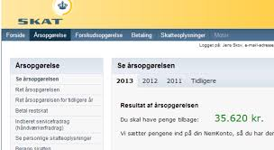

# Kautionsforhold

```{r, echo=FALSE, results='asis'}
cat(readLines('np.html'))
```


<!--  -->


---


*Forståelsen af kautionsreglerne i lov om finansiel virksomhed kan især være anvendelig i ejendomshandel, ejendomsadministration, bank og realkredit, forsikring samt revision og økonomifunktion i forbindelse med indgåelse af kautionsaftaler med kunder og klienter.*


---

*Som studerende skal du være særlig opmærksom på følgende problemstillinger ved gennemgangen af sikkerhedsstillelse for gæld i forhold til eksamen:*

*Kautionsformer især sondringen mellem simpel og selvskyldnerkaution*

*Sondring mellem privat- og erhvervskaution*

*Oplysning til kautionisterne i lov om finansiel virksomhed (FIL) § 47 og 48 i forbindelse med hoveddebitors misligholdelse af betaling*
  
*Kautionisternes hæftelse og indbyrdes regres*

---

## Kautionsbegreber


*Kaution*, betyder overtagelse af en økonomisk risiko, som bæres af en kreditor i et skyldforhold, med den virkning, at kautionisten sammen med debitor hæfter for opfyldelsen af debitors betalingspligt.   

Ordet *kaution* kommer af latin cautio 'forsigtighed, sikkerhed', af cavere 'passe på, sikre'.

Kaution er således en sikkerhedsstillelse for en andens gældsforhold.

Begrebet *"hovedmanden"*	anvendes ved kaution om den person, der er kautioneret for, dvs. debitor.

---

Der er tre parter i kautionsforhold (Se figuren nedenfor):

+	Låntager = hovedskyldner

+	Långiver = kreditor

+	Kautionist
  
---

*Parter i kautionsforhold*
```{r, echo=FALSE, result=TRUE,fig.height=3,fig.cap=("Forholdet mellem debitor, kreditor og kautionist")}
nodes <- data.frame(id = 1:3,
                    level=c(2,1,1),
                    shape = c("box"),
                    label = c("kautionist","långiver/\nkreditor","debitor/\nlåntager"),
                    font.size = c(20,20,20))
  
edges <- data.frame(from = c(1,2), to = c(2,3),
                    length = c(300,300),
                    label=c("kautionsaftale","lån/\nkredit"),
                    font.size = c(15,15),
                    arrows = c("to"),
                    smooth = FALSE)
visNetwork(nodes, edges, width = "100%") %>% 
  visInteraction(dragNodes = TRUE, 
                 dragView = TRUE, 
                 zoomView = FALSE) %>%
  visNodes(color = list(background = "white", 
                        border = "white",
                        highlight = "yellow"),
           shadow = list(enabled = TRUE, size = 30))  %>%
   visHierarchicalLayout(direction = "UD",levelSeparation = 200) %>%
  visEdges(color = list(color = "lightgrey", highlight = "yellow"))
```


---

Kautionsaftalen indgås mellem kautionisten og kreditor.

---

Kautionisten har typisk en relation til låntager i forvejen:

+	Forældre &lrarr;	børn.

+	Virksomhedsejer	&lrarr; virksomhed.

+	Moderselskab &lrarr; datterselskab.

---

```{r network5, echo=FALSE, result=TRUE,fig.height=3,fig.cap=("Eneanpartshaver stiller kaution overfor banken til sikkerhed for virksomhedens lån")}
nodes <- data.frame(id = 1:3, 
                    level=c(1,2,2),
                    shape = c("box"),
                    label = c("kautionist/\neneanpartshaver","bank","debitor/\nApS"),
                    font.size = c(20,20,20))
  
edges <- data.frame(from = c(1,2,3), to = c(2,3,1),
                    length = c(300,300,300),
                    label=c("kautionsaftale","lån","100% anparter"),
                    font.size = c(15,15,15),
                    arrows = c("to"),
                    smooth = FALSE)
visNetwork(nodes, edges, width = "100%") %>% 
  visInteraction(dragNodes = TRUE, 
                 dragView = TRUE, 
                 zoomView = FALSE) %>%
  visNodes(color = list(background = "white", 
                        border = "white",
                        highlight = "yellow"),
           shadow = list(enabled = TRUE, size = 30))  %>%
   visHierarchicalLayout(direction = "UD",levelSeparation = 200) %>%
  visEdges(color = list(color = "lightgrey", highlight = "yellow"))
```


---

## Stiftelse af kaution


---

Kautionsaftale indgås mellem kreditor og med en eller flere kautionister.


```{r , echo=FALSE, fig.height=4,result=TRUE,fig.cap=("Flere kautionister kan kautionere, enten som sam- eller medkautionister.")}
nodes <- data.frame(id = 1:6, 
                    level = c(2,3,3,3,1,3),
                    shape = c("box"),
                    label = c("kreditor","kautionist 1","kautionist 2","kautionist 3","debitor","kautionist 4"),
                    font.size = c(25,25,25,25,25,25))
  
edges <- data.frame(from = c(2,3,4,1,6), to = c(1,1,1,5,1),
                    length = c(250,250,250,250,250),
                    font.size = c(25,25,25,25,25),
                    # label=c("Hæftelse\n500.000","Hæftelse\n250.000","Hæftelse\n250.000","Lån 1 mio"),
                    # arrows = c("to"),
                    smooth = FALSE)
visNetwork(nodes, edges, width = "100%") %>% 
   
  visInteraction(dragNodes = TRUE, 
                 dragView = TRUE, 
                 zoomView = FALSE) %>%
  visNodes( color = list(background = "white", 
                        border = "white",
                        highlight = "yellow"),
           shadow = list(enabled = TRUE, size = 30)) %>%
  visLayout(randomSeed = 2) %>%
  visHierarchicalLayout(direction = "LR",levelSeparation = 400) %>%
 visEdges(shadow = TRUE,
           arrows =list(to = list(enabled = TRUE, scaleFactor = 1)),
           color = list(color = "lightgrey", highlight = "yellow"))
```

---

Aftalelovens regler gælder også for kautionsaftaler, fx:

+	Stærke og svage ugyldighedsgrunde.

+	Forudsætningslæren.

+	Generalklausulen om tilsidesættelse af urimelige aftaler i aftalelovens §§ 38c, jf. 36, se nærmere gennemgangen af disse lovregler i ***afsnit 4.4.*** **https://jura.tepedu.dk/aftaleret.html#urimelige-aftaler.**

---
  
Kaution er ligeledes reguleret i Lov om finansiel virksomhed, se Lovbekendtgørelse 2019-09-06 nr. 937 om finansiel virksomhed (forkortet; FIL), jf. her §§ 47 (erhvervskaution) og 48 (privat kaution), hvis kaution gives overfor et pengeinstitut, se lov om finansiel virksomhed (FIL) i lovsamlingen, se kapitel 26: **https://jura.tepedu.dk/lovsamling.html**. 

Hvis der ikke er tale om kaution over for et pengeinstitut, så anvendes aftalelovens regler for en nærmere vurdering om kautionsforpligtelsen er ugyldig.

Det er vigtigt at skelne mellem "erhvervskaution" (FIL § 47) og "privat kaution" (FIL § 48).

---

## Generalklausulen på kautionsforhold

Om anvendelse af aftalelovens § 36 på kautionsforhold findes der en del retspraksis (domme) på området:  


---

I dommen **U 1993.949 V** blev en kautionsaftale tilsidesat i medfør af aftalelovens § 36. En 73-årig kvinde K, der var nervesvækket og uden indsigt i økonomiske anliggender, havde over for en sparekasse S påtaget sig selvskyldnerkaution på indtil 100.000 kr. for sin stedsøn P’s ældre og fremtidige gæld til S. Ved kautionsløftets afgivelse var P’s engagement med S nødlidende på grund af overtræk på ca. 124.000 kr. og ville blive opsagt, hvis der ikke blev skaffet yderligere sikkerhed, fx ved kaution. K var ikke af S blevet informeret om P’s engagement og overtrækkene:
**https://pro.karnovgroup.dk/document/7000200948/1**


---


I dommen **U 1994.126 V** blev en kautionsforpligtelse ligeledes tilsidesat i medfør af aftalelovens § 36: 
**https://pro.karnovgroup.dk/document/7000200410/1**  

---

I dommen **U 1997.522 Ø** fandtes det ikke urimeligt eller i strid med redelig handlemåde, at et pengeinstitut gjorde en låneaftale gældende, da pengeinstituttet ved et låns oprettelse ikke burde have vidst, at en 18-årig ikke inden overskuelig tid ville kunne betale de månedlige ydelser. Der blev overført godt 170.000 kr. til en bilsælger, uden at banken sikrede sig, at låntager var indforstået hermed. Selvom dette kunne anses som en fejl, fandtes det, under hensyn til at låntager havde indgået en endelig handel og modtaget bilen, ikke urimeligt eller i strid med redelig handlemåde, at pengeinstituttet gjorde aftalen gældende, jf. aftalelovens § 36:
**https://pro.karnovgroup.dk/document/7000202267/1**


---

I dommen **U 2010.1628 H** blev en kautionsaftale delvist tilsidesat efter aftalelovens § 36: **https://pro.karnovgroup.dk/document/7000438164/1**

---

Pengeinstituttets manglende overholdelse af FIL § 47 eller af god skik for finansielle virksomheder i FIL § 43 medfører nødvendigvis ikke, at kautionsforpligtelsen bliver tilsidesat af domstolene:

Se dommen i **FM 2018.109**, hvor en banks manglende overholdelse af § 48 i lov om finansiel virksomhed kunne ikke i sig selv medføre, at en kautionist ikke var bundet af kautionsløftet: "Fogedretten havde fremmet en banks udlægsbegæring mod en skyldner på grundlag af en kautionserklæring.
Kautionisten kærede afgørelsen og gjorde for landsretten blandt andet gældende, at banken ikke havde overholdt reglerne i lov om finansiel virksomhed, bekendtgørelse om god skik for finansielle virksomheder eller reglerne i Finansrådets retningslinjer.
Landsretten stadfæstede fogedrettens afgørelse med følgende begrundelse:
»[Banken] har ikke godtgjort, at banken årligt og skriftligt har meddelt [kautionisten] størrelsen af den gældspost, som kautionen er stillet til sikkerhed for, jf. lov om finansiel virksomhed § 48. Dette forhold kan imidlertid ikke i sig selv medføre, at [kautionisten] ikke er bundet af sit kautionsløfte.
Det lægges til grund, at [kautionisten], da hun underskrev kautionserklæringen i 2010, og hvor størrelsen af kautionsforpligtelsen var uændret i forhold til kautionen fra 2006, var bekendt med størrelsen af gældsforholdet. Hun har skrevet under på, at hun er gjort bekendt med betingelserne for og konsekvenserne af kautionsforpligtelsen, herunder at kautionserklæringen kan danne grundlag for tvangsfuldbyrdelse.
Herefter og efter en samlet vurdering, hvori indgår, at der er tale om kaution for samleverens gæld og størrelsen af kautionsforpligtelsen, finder landsretten, at der ikke er grundlag for at anse kautionsaftalen for uforbindende. …«.

---

Samt domme i **FM 2011.37** Kautionsløfte var ikke ugyldigt - udtalt at manglende overholdelse af reglerne i bekendtgørelse om god skik for finansielle virksomheder ikke i sig selv har civilretlige konsekvenser:
"Et finansieringsselskab havde anmodet om udlæg for knapt 153.000 kr. hos A, der havde kautioneret for familiemedlemmers gæld. Det var ubestridt, at A ikke var blevet vejledt eller informeret om konsekvenserne af kautionsforpligtelsen i forbindelse med, at han påtog sig kautionsløftet. A gjorde gældende, at han ikke havde modtaget meddelelse efter § 48 i lov om finansiel virksomhed, ligesom han heller ikke havde modtaget årlige underretninger efter bekendtgørelse nr. 965 af 30. september 2009 om god skik for finansielle virksomheder, § 21, stk. 3.
Fogedrettens kendelse om at fremme udlægsforretningen blev stadfæstet af landsretten med følgende begrundelse:
"Lov om finansiel virksomhed § 48 omfatter efter sin ordlyd alene pengeinstitutter, hvorfor reglen ikke finder anvendelse i nærværende sag. I øvrigt bemærkes, at en manglende overholdelse af Bekendtgørelse om god skik for finansielle virksomheder ikke i sig selv har civilretlige konsekvenser. Det skal derfor afgøres efter reglerne i aftalelovens afsnit III om ugyldige viljeserklæringer, om [A] er bundet af sit kautionsløfte. I denne vurdering indgår principperne i den nævnte bekendtgørelse.
Det er ubestridt, at [A] ikke blev informeret om indholdet og konsekvenserne af kautionsforpligtelsen i forbindelse med, at han påtog sig kautionsløftet, og at [A] ikke har modtaget årlige oplysninger om størrelsen af det lånearrangement, for hvilket kautionsforpligtelsen består.
Landsretten lægger imidlertid til grund, at det ikke er godtgjort, at [A] ville have afholdt sig fra at påtage sig en kautionsforpligtelse på 155.000 kr., selv om han var blevet vejledt.
[A] har modtaget underretning om misligholdelse af lånet i 2006, 2007 og 2009.
Efter en samlet vurdering, hvori indgår, at der er tale om kaution for familiemedlemmers gældsstiftelse i forbindelse med huskøb og kautionsforpligtelsens størrelse, finder landsretten ikke grundlag for at anse kautionsaftalen for uforbindende eller ugyldig efter aftalelovens § 36, jf. § 38 c, og landsretten stadfæster derfor fogedrettens kendelse om, at fogedsagen fremmes".

---

**Studenteropgave:**

**Find 3 nævnsafgørelser i det Det Finansielle Ankenævn (Tidligere Pengeinstitutankenævnet), hvor der sker tilsidesættelse af kautionsaftaler efter aftalelovens §§ 38c, jf. 36.**

Link:

**https://fanke.dk/soeg-i-afgoerelser/**

---

## Privat kaution eller erhvervskaution

*Privatkaution* stilles typisk af en fysisk person overfor en person eller en virksomhed.

Der vil ofte være en nær relation mellem debitor og kautionist.

*Erhvervskaution* stilles både af fysiske og juridiske personer, men typisk er debitor en virksomhed.

---

Begrebet "debitorskifte" betyder indtræden af en ny skyldner i et gældsforhold. 

Kan kun ske med fordringshaverens samtykke, som dog kan være meddelt på forhånd.

---

I vurderingen om der er tale om en erhvervskaution eller privat kaution indgår følgende parametre (Se figuren nedenfor):

+ Ejerandel i virksomhed, der kautioneres for.

+ Stilling i virksomheden.

+ Indsigt i virksomhedens økonomi.

+ Bestemmende indflydelse i virksomheden samlet set.

---  


```{r kaution2, fig.height=3,echo=FALSE}

mydf <- data.frame(
  S1 = c(
"",
"Kautionisten ejer en del af den virksomhed, der kautioneres for, er den bestemmende indflydelse afgørende" ,
"Arbejder i virksomheden", 
"Har indsigt i økonomien", 
"Ejerandelen under 10%" 
),
  S2 = c(
    "Privat kaution",
"Ejer kautionisten mindre end 50% af virksomheden, er det som udgangspunkt en privat kaution.",
"Indtager en ubetydelig stilling uden indflydelse på driften, så er det stadigvæk en privat kaution.", 
"Ingen indsigt i virksomhedens økonomi taler det for en privat kaution.",
"Er ejerandelen lille i forhold til andres
ejerandel, er der ikke tale om en bestemmende indflydelse, og derfor er kautionen privat.
"
),
  S3 = c(
    "Erhvervskaution",
"Ejer kautionisten mere end 50 % af virksomheden, så er der tale om erhvervskaution.", 
"Har kautionisten en ledende stilling, kan det være en erhvervskaution, selvom kautionisten ejer mindre end 50% af virksomheden.",
"Har kautionisten stor indsigt i virksomhedens økonomi, kan der være tale om en erhvervskaution selvom ejerandelen er under 50%",
"")
  
)
names(mydf) <- NULL

mydf %>%
  kable("html", escape = FALSE,caption = "Sammenligning mellem privat kaution og erhvervskaution") %>%
  kable_styling(full_width = T,font_size = 10,bootstrap_options = c("responsive","bordered","striped")) %>%
  column_spec(1, bold = T, border_right = T, color = "black", background = "lightgrey") %>%
  column_spec(2, bold = T, border_right = T, color = "black", background = "lightgrey") %>%
  column_spec(3, bold = T, border_right = T, color = "black", background = "lightgrey") %>%
  row_spec(1,italic = T,bold = T,font_size = 12,color = "white", background = "darkgrey")
  # row_spec(1,italic = T,bold = T,font_size = 12)
  # column_spec(0, angle = -45)%>%
  # scroll_box(width = "500px") %>%
  # footnote(general = "Databeskyttelsesforordningen",general_title = "Kilde:")
```


---

### Erhvervskaution over for et pengeinstitut


Med hensyn til erhvervskaution over for et pengeinstitut, følger det af FIL § 47: 

”Er der inden for erhvervsforhold stillet kaution for lån ydet af et pengeinstitut, og udebliver låntager med betaling af hovedstol, afdrag eller renter, skal der senest 6 måneder efter de pågældende ydelsers forfaldsdag skriftligt gives meddelelse til enhver af kautionisterne eller til den eller dem af disse, der er bemyndiget til at modtage meddelelsen på samtlige kautionisters vegne". 

Undladelse heraf medfører, at pengeinstituttet taber sit krav over for kautionisterne, i det omfang disses regreskrav mod låntageren er blevet forringet ved undladelsen.

---

Skriftlighedskravet kan opfyldes i såvel papirformat som elektronisk format.


---

Se følgende domme:

**U 1992.442 Ø**, hvor der kunne ikke ses bort fra, at kautionisten ved underretning kunne have gennemført sit regreskrav helt eller delvis mod hovedskyldneren. Finansieringsselskabet var afskåret fra nu at gøre kautionsforpligtelsen gældende:
**https://pro.karnovgroup.dk/document/7000200021/1**

**U 1995.77 V**, da låntagers formue måtte antages at være negativ allerede inden udløbet af seksmånedersfristen, fandtes kautionisternes regreskrav ikke at være forringet ved den undladte underretning, og kautionisterne skulle indfri kautionen: **https://pro.karnovgroup.dk/document/7000201414/1**

**U 2011.3248 V**, hvor to kautionister hæftede solidarisk for et beløb på 450.000 kr., idet det ikke var godtgjort, at de hver især havde påtaget sig at kautionere med den følge, at banken, som var kreditor, opnåede en samlet sikkerhed på 900.000 kr.: "S og J, der var indehavere af anparterne i et byggefirma, etablerede den 28. maj 2004 en kassekredit i en bank med et maksimum på 125.000 kr. Den 27. august 2004 blev der til brug for et konkret byggeprojekt etableret en kassekredit med et kreditmaksimum på 575.000 kr. gældende indtil 2. maj 2005, og til sikkerhed for denne kassekredit påtog S og J sig en selvskyldnerkaution på 575.000 kr. Den 9. september 2005 blev der indgået endnu en kreditkontrakt mellem anpartsselskabet og banken med et kreditmaksimum på 450.000 kr. For denne gæld påtog S og J sig selvskyldnerkaution, og kautionen var begrænset til kreditmaksimum i henhold til den samtidig oprettede kreditkontrakt. Den kautionssikrede gæld på sidstnævnte konto blev fuldt indfriet den 24. august 2006, hvilket skete ved overførsel af 471.557 kr. fra en byggekonto, der var etableret samme dag med et kreditmaksimum på 2,6 mio. kr. Dette byggelån var sikret ved selvskyldnerkaution på 2,6 mio. kr. fra hver af S og J. Byggekontoen blev indfriet den 30. september 2008 i forbindelse med overførsel af 2.696.421 kr. fra den oprindelige kassekredit, der i juli 2008 var blevet forhøjet til kreditmaksimum på 3.325.000 kr. Banken påstod S og J tilpligtet at betale hver 450.000 kr., og gjorde til støtte herfor gældende, at de havde påtaget sig en tidsubegrænset selvskyldnerkaution over for ethvert mellemværende mellem banken og anpartsselskabet. S og J påstod sig frifundet, under henvisning til at deres kautionsforpligtelser ophørte i forbindelse med indfrielsen af lånet den 24. august 2006, og subsidiært gjorde de gældende, at bankens samlede kautionssikkerhed hos S og J ikke kunne overstige 450.000 kr. Landsretten anførte, at kautionserklæringerne angik erhvervsforhold og indeholdt en klar og tydelig angivelse af, at der kautioneredes som selvskyldnerkautionist for opfyldelse af enhver forpligtelse, som anpartsselskabet måtte få over for banken i henhold til ethvert nuværende og fremtidigt mellemværende. S og J havde dermed accepteret, at deres hæftelse - uanset det beløbsmæssige sammenfald - ikke kun vedrørte det samtidigt bevilgede lån på 450.000 kr. til anpartsselskabet. Når hensås hertil, og til at såvel S som J var anpartshavere i selskabet og havde indsigt i og bestemmende indflydelse på selskabets låneforhold, var der ikke grundlag for at anse kautionsforpligtelsen for ophørt ved indfrielsen af lånet på 450.000 kr. De var derfor ikke frigjort for kautionsforpligtelsen. S og J havde tidligere påtaget sig selvskyldnerkaution på 575.000 kr. i forbindelse med etableringen i august 2004 af en kassekredit på et tilsvarende beløb. Det blev lagt til grund, at de blev frigjort fra kautionsforpligtelsen, da gælden blev indfriet i maj 2005. I september 2005 blev der etableret en ny kassekredit på 450.000 kr., og i den forbindelse kautionerede de ligeledes begge. Efter S' og J's forklaringer havde de den forståelse, at de solidarisk påtog sig kaution for et beløb på i alt 450.000 kr. Under hensyn til det tidligere forløb samt at kautionserklæringerne blev udstedt i det væsentlige samtidigt, og i forbindelse med at der blev optaget et lån på netop 450.000 kr., fandtes det ikke, at det mod S' og J's forklaringer var godtgjort, at de hver især havde påtaget sig at kautionere for 450.000 kr. med den følge, at banken opnåede en samlet sikkerhed på 900.000 kr. S og J blev herefter dømt til in solidum at betale 450.000 kr. til banken:
**https://pro.karnovgroup.dk/document/7000500861/1**

---

### Privatkaution i et pengeinstitut


Der er i FIL § 48 lovbestemmelser vedrørende privatkaution i et pengeinstitut:

"§ 48
Inden der indgås aftale om en kautionsforpligtelse uden for erhvervsforhold for lån eller kreditter ydet af et pengeinstitut, skal pengeinstituttet sikre sig, at kautionisten er tilstrækkeligt informeret om indholdet af aftalen og konsekvenserne af at påtage sig en kautionsforpligtelse. Denne information skal indeholde oplysninger om, hvad den konkrete kautionsforpligtelse indebærer, og indeholde en afbalanceret beskrivelse af de risici, der er forbundet hermed. Endvidere skal pengeinstituttet for den debitor, hvis gæld kautionsforpligtelsen skal sikre, med samtykke fra debitor udlevere

1. den seneste årsopgørelse fra SKAT,
2. de seneste tre lønsedler eller
3. det seneste årsregnskab, hvis der kautioneres for en erhvervsdrivendes gæld.

Stk. 2. Et pengeinstitut, som ikke har overholdt stk. 1, kan kun gøre kautionsforpligtelsen gældende, såfremt kautionisten på anden vis har haft et forsvarligt grundlag for at bedømme de risici, der var forbundet med at indgå kautionsforpligtelsen. 

Stk. 3. Kautionsaftaler efter stk. 1 skal udfærdiges på papir eller andet varigt medium for at kunne gøres gældende. 

Stk. 4.  En kautionist kan ikke hæfte for et beløb, der er større end lånets hovedstol eller kredittens maksimum ved kautionsaftalens indgåelse.

Stk. 5. Ved kautionsaftaler efter stk. 1 skal pengeinstituttet årligt skriftligt meddele kautionisten størrelsen af den gældspost, som kautionen er stillet til sikkerhed for. 

Stk. 6.  Hvis låntageren udebliver med betaling af hovedstol, afdrag eller renter, skal der senest 3 måneder efter de pågældende ydelsers forfaldsdag gives meddelelse herom til kautionisten på papir eller andet varigt medium. 1. pkt. finder tilsvarende anvendelse, hvis pengeinstituttet giver låntageren henstand, uden at kautionisten har givet samtykke hertil.

Stk. 7.  Overskrides fristen i stk. 6, kan kautionsforpligtelsen kun gøres gældende over for kautionisten for det beløb, som låntagerens gæld efter den sikrede fordring ville have udgjort, hvis låntageren havde betalt alle ydelser rettidigt indtil det tidspunkt, som ligger 3 måneder forud for det tidspunkt, hvor meddelelse gives.

Stk. 8.  Overskridelse af fristen i stk. 6 medfører uanset stk. 7, at pengeinstituttet taber sit krav over for kautionisten, i det omfang dennes regreskrav mod låntageren er blevet forringet.

Stk. 9.  En kautionsforpligtelse efter stk. 1 bortfalder efter 10 år eller, hvis kautionsaftalen er indgået til sikkerhed for en kredit med variabelt beløb eller for et lån uden fast forfaldstidspunkt, efter 5 år, medmindre forpligtelsen forinden er gjort gældende af pengeinstituttet. 1. pkt. finder ikke anvendelse på lån, der efter deres vilkår kan finansieres ved udstedelse af særligt dækkede obligationer, såfremt kautionisten udtrykkeligt er oplyst herom og om virkningen heraf.

Stk. 10. En aftale om en kautionsforpligtelse efter stk. 1 kan tilsidesættes helt eller delvis, hvis den står i misforhold til kautionistens økonomi.

Stk. 11.  Stk. 1-10 finder tilsvarende anvendelse på tredjemandspant uden for erhvervsforhold".

---

Herved forstås en kaution, der ikke indgår i en erhvervsmæssig relation mellem låntager (debitor) og kautionisten. 

Er kautionen eksempelvis stillet for en virksomheds gæld af ejeren af virksomheden, vil forholdet ikke være omfattet af bestemmelsen i FIL § 48, men af FIL § 47. 

Kaution fra ejerens forældre vil derimod være omfattet af FIL § 48, da der i dette tilfælde vil være tale om en kaution uden for erhvervsforhold. 

I FIL § 48 er der indsat en forpligtelse til at informere kautionisten, ligesom det er præciseret, hvilke forhold der skal oplyses om, forinden der indgås en aftale om en kautionsforpligtelse. 

Ved tilstrækkeligt informeret forstås, at informationen skal være udformet, så en kautionist uden for erhvervsforhold har mulighed for at forstå indholdet og konsekvenserne ved at påtage sig kautionsforpligtelsen. 

Der vil derfor kunne være behov for at supplere en udleveret pjece med yderligere information over for kautionister, der har svært ved at forstå indholdet og konsekvenserne ved en kautionsforpligtelse.


---

[Se pjecen om privatkaution af december 2017 her.](https://finansdanmark.dk/media/19183/information-om-privat-kaution-og-tredjemandspant.pdf)

---

Informationen kan som tidligere gives ved udlevering af denne pjece til kautionisten, der er udarbejdet i fællesskab mellem Finansrådet (nu FinansDanmark) og ForbrugerrådetTænk, for så vidt angår kaution for lån ydet af pengeinstitutter. 

Der er dog ikke krav om, at pjecen skal udleveres. 

Det står således långiver frit for at udarbejde andet informationsmateriale, så længe dette forklarer, hvad en kautionsforpligtelse indebærer og indeholder en afbalanceret beskrivelse af de risici, der er forbundet med at kautionere.


Der er endvidere indsat regler om, at kautionsforpligtelser, som står i misforhold til kautionistens økonomi, skal kunne tilsidesættes helt eller delvist. 

Derudover er bestemmelsen udvidet til at omfatte tredjemandspant og realkreditlån, jf. FIL § 53 a.

Med hensyn til privatkaution i et pengeinstitut følger det således af FIL § 48, stk. 1, at inden der indgås aftale om en kautionsforpligtelse uden for erhvervsforhold for lån eller kreditter ydet af et pengeinstitut, skal pengeinstituttet sikre sig, at kautionisten er tilstrækkeligt informeret om indholdet af aftalen og konsekvenserne af at påtage sig en kautionsforpligtelse. 

Denne information skal indeholde oplysninger om, hvad den konkrete kautionsforpligtelse indebærer, og indeholde en afbalanceret beskrivelse af de risici, der er forbundet hermed. 

Endvidere skal pengeinstituttet for den debitor, hvis gæld kautionsforpligtelsen skal sikre, med samtykke fra debitor udlevere: 

---



*Den seneste årsopgørelse fra SKAT.*

*De seneste tre lønsedler eller det seneste årsregnskab, hvis der kautioneres for en erhvervsdrivendes gæld.*

---

Samtykke til videregivelse af oplysninger skal afgives i overensstemmelse med kravene i databeskyttelseslovgivningen. 

Et samtykke kan efter databeskyttelsesforordningen både afgives mundtligt, skriftligt og digitalt. 

Det er endvidere et krav, jf. databeskyttelsesforordningens artikel 7, at den dataansvarlige kan påvise, at den registrerede har givet samtykke til behandlingen af sine personoplysninger. 

Hvis et pengeinstitut ikke får et samtykke fra debitor til at videregive de nævnte oplysninger, kan instituttet ikke efterleve informationsforpligtelsen efter dette stykke. 

Hvis instituttet alligevel indgår en kautionsaftale, beror det på en vurdering efter FIL § 48, stk. 2, om kautionsforpligtelsen kan gøres gældende.

Et pengeinstitut, som ikke har overholdt FIL § 48, stk. 1, kan kun gøre kautionsforpligtelsen gældende, såfremt kautionisten på anden vis har haft et forsvarligt grundlag for at bedømme de risici, der var forbundet med at indgå kautionsforpligtelsen, jf. FIL § 48, stk. 2. 

Det beror på en konkret vurdering, om kautionisten har haft et forsvarligt grundlag for at bedømme de risici, der er forbundet med at indgå kautionsforpligtelsen. 

Er der tvivl om, hvorvidt kautionisten har haft et forsvarligt grundlag for at bedømme de risici, der er forbundet med at indgå kautionsforpligtelsen, vil reglen føre til, at kautionsaftalen bliver tilsidesat. 

Udleverer et pengeinstitut f.eks. kun den 4., 3. og næstsidste lønseddel, men ikke den seneste lønseddel, vil der dog næppe ske tilsidesættelse af kautionsaftalen, medmindre de udeladte oplysninger har indeholdt oplysninger om, at debitors økonomiske situation er blevet forringet, og at kautionisten derved er blevet frataget et forsvarligt grundlag for at bedømme de risici, der er forbundet med at indgå kautionsforpligtelsen. 

Hvis der derimod slet ikke er udleveret nogen af de i § 48, stk. 1 anførte oplysninger, vil det som udgangspunkt være vanskeligt at føre bevis for, at kautionisten har haft et forsvarligt grundlag for at bedømme de risici, der er forbundet med kautionsforpligtelsen. 

I disse tilfælde må kautionsforpligtelsen derfor forventes tilsidesat.

---


Kautionsaftaler efter FIL § 48, stk. 1 skal udfærdiges på papir eller andet varigt medium for at kunne gøres gældende, jf. FIL § 48, stk. 3. 

Ved varigt medium forstås i overensstemmelse med § 4, nr. 13, i kreditaftaleloven en indretning, som sætter forbrugeren i stand til at lagre oplysninger rettet til forbrugeren personligt på en måde, der muliggør senere søgning i et tidsrum, som er afpasset efter oplysningernes formål, og som giver mulighed for uændret gengivelse af de lagrede oplysninger.

En kautionist kan ikke hæfte for et beløb, der er større end lånets hovedstol eller kredittens maksimum ved kautionsaftalens indgåelse., jf. FIL § 48, stk. 4. 

Bestemmelsen medfører, at der kun kan stilles kaution for fordringer med et maksimum, og sætter således en begrænsning for anvendelsen af alskyldserklæringer.

Ved kautionsaftaler efter FIL § 48, stk. 1 skal pengeinstituttet årligt skriftligt meddele kautionisten størrelsen af den gældspost, som kautionen er stillet til sikkerhed for, jf. FIL § 48, stk. 5. 

Meddelelsen er en undtagelse til reglerne om tavshedspligt i FIL § 117.

Hvis låntageren udebliver med betaling af hovedstol, afdrag eller renter, skal der senest 3 måneder efter de pågældende ydelsers forfaldsdag gives meddelelse herom til kautionisten på papir eller andet varigt medium. 1. pkt. finder tilsvarende anvendelse, hvis pengeinstituttet giver låntageren henstand, uden at kautionisten har givet samtykke hertil, jf. FIL § 48, stk. 6. 

Underretningspligten indtræder, når låntager har været i restance gennem en sammenhængende periode ved lån med en aftalt afdragsordning og ved kassekreditter, når der igennem en sammenhængende periode på 3 måneder har været ikke bevilgede overtræk. 

Underretningspligten indtræder således, uanset om låntager har foretaget indbetalinger efter tidspunktet for overtrækkets henholdsvis restancens indtræden og for så vidt angår lån, skal restancen således ikke udgøre et beløb svarende til 3 måneders ydelser. 

I modsætning til reglen i FIL § 47 om kaution inden for erhvervsforhold er det ikke muligt at give meddelelsen til »den eller dem af disse, der er bemyndiget til at modtage meddelelsen på disse kautionisters vegne«. 

Hvis der er flere kautionister, skal der som udgangspunkt gives meddelelse til hver af kautionisterne. 

Dette udelukker dog ikke, at meddelelse kan gives til andre, hvor der er en rimelig begrundelse herfor, eksempelvis hvis en blandt flere kautionister har bopæl i udlandet. 

Bestemmelsen i FIL § 48, stk. 6 in fine indebærer, at der, som det antages i gældende ret, ikke kan lægges vægt på en generel forhåndstilladelse til at indrømme henstand, der er indeholdt i kautionsaftalen.

---


Overskrides fristen i FIL § 48, stk. 6, kan kautionsforpligtelsen kun gøres gældende over for kautionisten for det beløb, som låntagerens gæld efter den sikrede fordring ville have udgjort, hvis låntageren havde betalt alle ydelser rettidigt indtil det tidspunkt, som ligger 3 måneder forud for det tidspunkt, hvor meddelelse gives, jf. FIL § 48, stk. 7. 

Fristen regnes fra kautionistens modtagelse af underretningen. 

Det er ikke et krav, at kautionisten kan påvise et tab som følge af manglende overholdelse af fristen. 

Hvis eksempelvis et pengeinstitut har et misligholdt lån, hvor der mangler ydelser fra en 8 måneders periode inden fremkomst af meddelelsen efter stk. 6, kan pengeinstituttet ikke kræve renter, afdrag, gebyrer o. lign., der skulle have været betalt i de 5 måneder inden perioden på 3 måneder. Kautionisten vil stadig skulle hæfte for den resterende hovedstol.

Overskridelse af fristen i FIL § 48, stk. 6 medfører uanset § 48, stk. 7, at pengeinstituttet taber sit krav over for kautionisten, i det omfang dennes regreskrav mod låntageren er blevet forringet, jf. FIL § 48, stk. 8. 

Dette medfører, at kautionsforpligtelsen kan nedsættes yderligere end efter FIL § 48, stk. 7.

En kautionsforpligtelse efter FIL § 48, stk. 1 bortfalder efter 10 år eller, hvis kautionsaftalen er indgået til sikkerhed for en kredit med variabelt beløb eller for et lån uden fast forfaldstidspunkt, efter 5 år, medmindre forpligtelsen forinden er gjort gældende af pengeinstituttet. 1. pkt. finder ikke anvendelse på lån, der efter deres vilkår kan finansieres ved udstedelse af særligt dækkede obligationer (også for lån ydet af realkreditinstitutter, jf. § 53 a.), såfremt kautionisten udtrykkeligt er oplyst herom og om virkningen heraf, jf. FIL § 48, stk. 9. 

Det vil sige, at kautionisten skal oplyses om, at lånet er finansieret på den nævnte måde, og at dette betyder, at den tidsmæssige begrænsning af kautionsforpligtelsen ikke finder anvendelse.

Er kautionen stillet for flere fordringer af forskellig karakter, vil kautionsdækningen af de enkelte fordringer bortfalde på forskellige tidspunkter. 

Tidsbegrænsningen regnes fra kautionsaftalens indgåelse. 

Efter udløb af en kautionsaftale er det muligt at aftale en forlængelse af kautionen ved at iagttage de krav, der gælder i forbindelse med en kautionsaftales indgåelse, jf. § 48, stk. 1. 

Den fastsatte tidsbegrænsning omfatter ikke tilfælde, hvor anden lovgivning har forudsat eller foreskriver kautionsaftaler, der løber længere tid end foreskrevet i dette stykke. 

Bestemmelsen berører ikke reglerne om forældelse i forældelsesloven. Forældelsesreglerne finder anvendelse, når kravet efter kautionsløftet forfalder. 

Når en fordring er sikret ved kaution, bestemmes forældelsesfristen over for kautionisten efter de regler, der gælder for forældelse af fordringen mod hovedskyldneren jf. § 11 i forældelsesloven. 

---

*En aftale om en kautionsforpligtelse efter FIL § 48, stk. 1 kan tilsidesættes helt eller delvis, hvis den står i misforhold til kautionistens økonomi, jf. FIL § 48, stk. 10.*

Ved vurderingen af, om en kaution står i misforhold til kautionistens økonomi, skal der foretages en vurdering af både kautionistens formue og betalingsevne. 

Denne vurdering skal som udgangspunkt foretages på baggrund af forholdene på tidspunktet for kautionens påtagelse. 

Hvis kautionisten kun har beskedne indtægter, bør der kun lægges vægt på formueforholdene. Der skal kun i særlige tilfælde tages hensyn til efterfølgende ændringer i kautionistens økonomi. 

Fremtidige, kendte indtægtsstigninger kan indgå i vurderingen sammen med kendte mærkbare formueforøgelser inden for rimelig tid efter påtagelsen af kautionsforpligtelsen. 

Ved kautionister med større indtægter eller ved forventninger om større indtægtsstigninger, bør de fremtidige indtægter og indtægtsforventninger indgå i vurderingen af, om kautionen står i misforhold til kautionistens økonomi. 

I sådanne tilfælde vil der kunne lægges mindre vægt på kautionistens formue. 

Ved vurderingen af, om der er et »misforhold«, skal der ses på kautionistens reelle risiko ved kautionen, dvs. hvad kautionsforpligtelsen reelt dækker over. 

Ved denne vurdering kan indgå værdien af eventuelle pantesikkerheder eller øvrige sikkerheder, der er stillet af hovedskyldneren til sikkerhed for den kautionssikrede fordring. 

Der kan endvidere efter omstændighederne lægges vægt på sikkerheder, herunder kautioner, stillet af tredjemand. 

Også her ses der som udgangspunkt på forholdene på tidspunktet for kautionsaftalens indgåelse. 

Der skal kun i særlige tilfælde tages hensyn til efterfølgende ændringer i værdien af pantsikkerheder.

Vurderingen efter bestemmelsen sker som udgangspunkt alene på baggrund af forholdene mellem kreditor, debitor og kautionist. 

Der tages således kun hensyn til, at kautionisten har påtaget sig kautions-, pantsætnings- eller debitorforpligtelser over for andre kreditorer, hvis kreditor kender til sådanne forpligtelser. 

Generalklausulen i aftalelovens §§ 36 og 38 c vil herudover forsat kunne bringes i anvendelse i øvrigt i forhold til kautionsforpligtelser.

FIL § 48, stk. 1-10 finder tilsvarende anvendelse på tredjemandspant uden for erhvervsforhold, jf. FIL § 48, stk. 11.

---

Tredjemandspant stillet af en privatperson minder på flere punkter om privat kaution. 

Både ved kaution og tredjemandspant er der tale om, at en fordringshaver opnår sikkerhed for en fordring ved, at en tredjemand afgiver et løfte om at indestå for, at skylderens forpligtelse opfyldes. 

I modsætning til kaution hæfter en tredjemandspantsætter dog ikke personligt for den sikrede fordring, men derimod kun med det stillede pant, medmindre andet er aftalt.


---

## Oplysningspligt


Krav om at Finansielle virksomheder giver oplysninger til private kautionister (tilsvarende regler for tredjemandspant), jf. FIL § 48 om:

*Hvad en kautionsforpligtelse indebærer skal beskrives overfor kautionsten:*

Beskrivelse af risikoen.

Oplysninger om låntagers (debitors) økonomi med:

+ Årsopgørelser fra Skat.

+ Lønsedler.

+ Evt. årsregnskab.
  
Låntagers gæld til den finansielle virksomhed.

Gennemgå pjece om kaution.

Kautionen må ikke stå i misforhold til kautionisten økonomi.

Hvis oplysningspligten ikke er overholdt kan kautionen - eventuelt tilsidesættes efter FIL § 48, stk. 2.

---

## Kautionens indhold

Hvornår kautionen kan gøres gældende afhænger af kautionstypen:


*Simpel kaution* – når det er dokumenteret, at debitor ikke kan betale lånet.
  
*Selvskyldnerkaution* – når debitor har misligholdt lånet.
  
*Tabskaution* – efter udtømmende retsforfølgning.

---
  
Hvilket beløb kautionen kan gøres gældende for afhænger af kautionstypen:

  
*Alskyld* – for hele lånet
  
*Begrænset kaution* – for et maksimalt beløb
  
*Delkaution* – for en bestemt del af lånet

(Se figuren nedenfor)
 

```{r kautionsoversigt, fig.height=3,echo=FALSE}

mydf <- data.frame(
  S1 = c("Kautionstype" ,"Simpel kaution", 
"Selvskyldnerkaution", 
"Tabskaution", 
"Begrænset kaution", 
"Delkaution", 
"Samkaution", 
"Medkaution", 
"Efterkaution"),
  S2 = c("Definition" ,
  "Kan først gøres gældende overfor kautionisten, når det er dokumenteret, at 
debitor ikke kan betale gælden.", 
"Kan gøres gældende overfor kautionisten, når debitor misligholder lånet. ",
"Kan gøres gældende overfor kautionisten efter udtømmende retsforfølgning.",
"Omfatter hele gælden med et maksimalt beløb.",
"Kautionen omfatter en bestemt del af gælden.",
"Flere kautionister for samme gældsforhold under forudsætning af, at andre kautionister også har kautioneret.", 
"Flere kautionister for samme gældsforhold som er stillet uafhængigt af hinanden.",
"Kaution stillet overfor kreditor som effektueres, når hovedkautionist ikke kan betale")
  
)
names(mydf) <- NULL

mydf %>%
  kable("html", escape = FALSE,caption = "Kautionsoversigt") %>%
  kable_styling(full_width = T,font_size = 10,bootstrap_options = c("responsive","bordered","striped")) %>%
  column_spec(1, bold = T, border_right = T, color = "black", background = "lightgrey") %>%
  column_spec(2, bold = T, border_right = T, color = "black", background = "lightgrey") %>%
  row_spec(1,italic = T,bold = T,font_size = 12,color = "white", background = "darkgrey")
  # row_spec(1,italic = T,bold = T,font_size = 12)
  # column_spec(0, angle = -45)%>%
  # scroll_box(width = "500px") %>%
  # footnote(general = "Databeskyttelsesforordningen",general_title = "Kilde:")
```


---

## Pantesikkerhed eller kaution

Hvis en person eller bank skal yde et lån, er det ofte en forudsætning, at låntager kan stille sikkerhed for gældens tilbagebetaling.

Helt grundlæggende findes der to former for sikkerhed. 

Pantesikkerhed betyder, at låntager eller en tredjemand stiller sikkerhed ved at give långiver pant i en genstand af værdi (f.eks. fast ejendom), der kan tvangssælges via fogedretten, hvis låntager ikke tilbagebetaler lånet som aftalt.

Kaution betyder, at låntager stiller sikkerhed for lånets tilbagebetaling ved at anvise én eller flere kautionister, der hæfter for gældens betaling sammen med låntager.

Der findes forskellige former for hæftelse og kautioner, som vil blive beskrevet i det følgende.

---

### Pro rata hæftelse

```{r network11, fig.height=4, echo=FALSE, result=TRUE,fig.cap=("Pro rata hæftelse.")}
nodes <- data.frame(id = 1:5, 
                    level = c(2,3,3,3,1),
                    shape = c("box"),
                    label = c("kreditor","kautionist 1: 50%","kautionist 2: 25%","kautionist 3: 25%","debitor"),
                    font.size = c(25,25,25,25,25))
  
edges <- data.frame(from = c(2,3,4,1), to = c(1,1,1,5),
                    length = c(250,250,250,250),
                    font.size = c(25,25,25,25),
                    label=c("hæftelse\n500.000 kr.","hæftelse\n250.000 kr.","hæftelse\n250.000 kr.","lån 1 mio"),
                    # arrows = c("to"),
                    smooth = FALSE)
visNetwork(nodes, edges, width = "100%") %>% 
   
  visInteraction(dragNodes = TRUE, 
                 dragView = TRUE, 
                 zoomView = FALSE) %>%
  visNodes( color = list(background = "white", 
                        border = "white",
                        highlight = "yellow"),
           shadow = list(enabled = TRUE, size = 30)) %>%
  visLayout(randomSeed = 2) %>%
  visHierarchicalLayout(direction = "LR",levelSeparation = 400) %>%
 visEdges(shadow = TRUE,
           arrows =list(to = list(enabled = TRUE, scaleFactor = 1)),
           color = list(color = "lightgrey", highlight = "yellow"))
```

---


*Pro rata hæftelse* indebærer, at hver person alene hæfter for en bestemt andel af den samlede gæld.

Det kan eksempelvis være aftalt, at to kautionister hver især alene hæfter for 50.000 kr. af en samlet gæld på 100.000 kr.

Långiver kan i dette tilfælde alene kræve 50.000 kr. fra hver af de to kautionister.

Ved ren pro rata hæftelse har det ingen betydning for den ene kautionist, om den anden kautionist betaler sin del af gælden, da hver kautionist hæfter for en begrænset del af den samlede gæld.

Det kan dog være aftalt, at kautionisterne har regres over for hinanden, selv om de hæfter pro rata over for långiver. En sådan aftale minder om solidarisk hæftelse.


---

### Solidarisk hæftelse

*Solidarisk hæftelse* betyder, at kautionisterne hæfter for hele eller en del af gælden i fællesskab ud fra devisen "én for alle, alle for én".

Der vil være solidarisk hæftelse mellem to kautionister, hvis ikke andet er aftalt eller følger af lovgivningen.

Der findes to former for solidarisk hæftelse - fuldstændig solidarisk hæftelse og delvis solidarisk hæftelse.

---

### Fuldstændig solidarisk hæftelse

Ved fuldstændig solidarisk hæftelse hæfter kautionisterne for hele gælden i fællesskab.

Långiver kan kræve hele gælden betalt af enhver af kautionisterne, men långiver kan naturligvis ikke samlet kræve mere end det samlede skyldige beløb.

---

*Delvis solidarisk hæftelse:*

Ved *delvis solidarisk hæftelse* hæfter flere kautionister alene for en del af den samlede gæld.

Eksempelvis kan det være aftalt, at to kautionister hæfter for 50.000 kr. af en samlet gæld på 100.000 kr.

Her kan långiver altså ikke kræve hele lånet tilbagebetalt af kautionisten, men alene en del af det samlede lån.

Da flere kautionister hæfter for en del af det samlede lån, bortfalder den ene kautionists hæftelsesforpligtelse over for långiver, hvis den anden kautionist betaler det samlede skyldige beløb.

Dette er ikke tilfældet ved pro rata hæftelse, hvor hver enkelt kautionist hæfter for hver sin del af låntagers gæld.

---

## Simpel kaution eller en selvskyldnerkaution


*Selvskyldnerkaution* er den strengeste form for kaution set fra kautionistens synspunkt og anvendes af pengeinstitutterne. 

Selvskyldnerkaution indebærer, at kautionisten hæfter allerede fra den dag, hvor låntageren misligholder sin betalingsforpligtelse.

Hvis kravet ikke er betalt, kan långiver allerede fra forfaldsdagen kræve betaling fra kautionisterne uden at dokumentere, at låntager er insolvent og derfor ikke kan betale gælden.

---

Ved *simpel kaution* skal långiver derimod dokumentere, at låntager ikke kan betale gælden, før der kan kræves betaling fra kautionisterne.

Simpel kaution finder anvendelse, medmindre andet er aftalt fx en selvskyldnerkaution eller følger af lov.

Simpel kaution adskiller sig fra selvskyldnerkautionen med hensyn til tidspunktet for kautionsforpligtelsens indtræden. 

Udover misligholdelsen kræves det ved simpel kaution også, at betaling ikke kan opnås hos hovedmanden. Altså at han er insolvent, jf. her definitionen i konkurslovens § 17:

"Er en skyldner insolvent, skal hans bo tages under konkursbehandling, når det begæres af skyldneren eller en fordringshaver.
Stk. 2. En skyldner er insolvent, hvis han ikke kan opfylde sine forpligtelser, efterhånden som de forfalder, medmindre betalingsudygtigheden må antages blot at være forbigående".
 . 

Det vil praktisk sige, at der skal være sket forgæves retsforfølgning mod hovedmanden – fx forgæves udlægsforretning eller konkurs. 

I konkurssituationen hæfter kautionisten for det beløb, der ikke gives dividende for, jf. konkurslovens § 14, stk. 3:

"Tvangsakkorden har ingen indflydelse på fordringshaveres rettigheder mod kautionister og andre, som hæfter tillige med skyldneren".

Ved simpel kaution hæfter kautionisten således »kun« for hovedmandens solvens.

Simpel kaution er derfor den mindst byrdefulde kautionsform, hvorfor denne form for kaution vil være gældende for kautionsforpligtelser, medmindre andet er aftalt, fx en selvskyldnerkaution.

Som udgangspunkt kan den simple kautionist ikke kræve, at andre sikkerheder skal være realiseret forud for kautionen, fx pant eller andre kautioner, medmindre der foreligger aftale herom. 

---

Professionelle långivere som banker vil imidlertid normalt kræve, at en kaution stilles som selvskyldnerkaution.


---

## Privat kaution for lån i pengeinstitutter

Hvis en privatperson kautionerer for en anden privatperson eller en erhvervsvirksomhed for et lån i et pengeinstitut gælder der nogle særlige beskyttelsesregler.

Der er bl.a. nogle krav til hvilke informationer en privat kautionist skal have både før man kautionerer og under lånets løbetid. 

Desuden er der grænser for hvor længe en kaution stillet af en privat kautionist kan løbe, og pengeinstituttet skal sikre, at kautionsaftalen ikke står i misforhold til kautionistens økonomi.

De samme beskyttelsesregler gælder, hvis en privatperson stiller pantesikkerhed for en anden persons eller en virksomheds gæld til et pengeinstitut.

---

## Flere kautionister

Er der flere kautionister kan det være (Se figuren nedenfor):

Samkaution – afhængigt af hinanden

Medkaution – uafhængigt af hinanden
  
Flere kautionister hæfter solidarisk, hvis ikke andet er aftalt.

Hvis det er aftalt kan kautionisterne hæfte pro rata (Se figuren nedenfor).

---
  
*Samkautionister* har efter betaling af gælden regresret mod de andre kautionister.
 
 
```{r , echo=FALSE, fig.height=4,result=TRUE,fig.cap=("Flere kautionister kan kautionere, enten som sam- eller medkautionister.")}
nodes <- data.frame(id = 1:6, 
                    level = c(2,3,3,3,1,3),
                    shape = c("box"),
                    label = c("kreditor","kautionist 1","kautionist 2","kautionist 3","debitor","kautionist 4"),
                    font.size = c(25,25,25,25,25,25))
  
edges <- data.frame(from = c(2,3,4,1,6), to = c(1,1,1,5,1),
                    length = c(250,250,250,250,250),
                    font.size = c(25,25,25,25,25),
                    # label=c("Hæftelse\n500.000","Hæftelse\n250.000","Hæftelse\n250.000","Lån 1 mio"),
                    # arrows = c("to"),
                    smooth = FALSE)
visNetwork(nodes, edges, width = "100%") %>% 
   
  visInteraction(dragNodes = TRUE, 
                 dragView = TRUE, 
                 zoomView = FALSE) %>%
  visNodes( color = list(background = "white", 
                        border = "white",
                        highlight = "yellow"),
           shadow = list(enabled = TRUE, size = 30)) %>%
  visLayout(randomSeed = 2) %>%
  visHierarchicalLayout(direction = "LR",levelSeparation = 400) %>%
 visEdges(shadow = TRUE,
           arrows =list(to = list(enabled = TRUE, scaleFactor = 1)),
           color = list(color = "lightgrey", highlight = "yellow"))
```


  

 
```{r network7, echo=FALSE,fig.height=3, result=TRUE,fig.cap=("Efterkaution.")}
nodes <- data.frame(id = 1:4, shadow = TRUE,
                    shape = c("box"),
                    label = c("Kreditor","hovedkautionist/\neneanpartshaver","efterkautionist/\nægtefælle","debitor/\nbank"),
                    font.size = c(26,26,26,26))
edges <- data.frame(from = c(2,3,1), to = c(1,1,4),
                    length = c(300,300,300),
                    label=c("hæftelse 1","hæftelse 2","lån"),
                    smooth = FALSE,
                    font.size = c(16,16,16))
visNetwork(nodes, edges, width = "100%") %>% 
  visNodes(color = list(background = "white", 
                        border = "white",
                        highlight = "yellow"),
           shadow = list(enabled = TRUE, size = 30)) %>%
  visInteraction(dragNodes = TRUE, 
                 dragView = TRUE, 
                 zoomView = FALSE) %>%
  visLayout(randomSeed = 2) %>%

 visEdges(shadow = TRUE,
           arrows =list(to = list(enabled = TRUE, scaleFactor = 2)),
           color = list(color = "lightgrey", highlight = "yellow"))
``` 
  


---


## Kautionens ophør

Kautionen ophører, når gælden bliver betalt eller eftergivet.

Privat kaution bortfalder efter 5 år eller 10 år, hvis kautionen ikke forlænges.

Kautionen kan bortfalde ved kreditors henstand.

Privat kaution – kreditor skal give kautionisten besked inden for 3 måneder.

Erhvervskaution – kreditor skal give kautionisten besked inden for 6 måneder.
  
Kautionen forældes sammen med hovedfordring, hvis ikke andet er aftalt.

---

## Kautionistens krav på låntager


Når kautionisten har betalt kreditor det skyldige beløb, har kautionisten regresret overfor debitor:

*HR:* Kautionisten indtræder i kreditors rettigheder også i fx en panteret

*U1*: Kautionisten var klar over, at fordringen var ugyldig på grund af låntagers umyndighed
  
*U2*: Fordringen er eftergivet helt eller delvist ved tvangsakkord

---

## Regresret


**Kautionistens regresret**
```{r ,echo=FALSE, result=TRUE, fig.height=4,fig.cap=("Kautionistens regresret over for låntager")}

nodes <- data.frame(id = 1:5, 
                    shape = c("box"), 
                    level = c(1,2,3,4,5),
                    label = c("1. Kreditor har krav på låntageren","2. Låntager misligholder lånet","3. Kreditor kræver kautionen indfriet ","4. Kautionisten betaler kreditor","5. Kautionisten har et regreskrav på låntageren"),
                    font.size = c(26,26,26,26,26))
edges <- data.frame(from = c(1,2,3,4), to = c(2,3,4,5),font.size = c(30,30,30,30),arrows = c("to"),label=c("+","+","+","="),length = rep(100,4))

visNetwork(nodes, edges,  width = "100%",avoidOverlap=2) %>% 
  visInteraction(dragNodes = TRUE, 
                 dragView = TRUE, 
                 zoomView = FALSE) %>%
  visNodes(color = list(background = "white", 
                        border = "white",
                        highlight = "yellow"),
           shadow = list(enabled = TRUE, size = 30))  %>%
   visHierarchicalLayout(direction = "UD",levelSeparation = 100) %>%
  visEdges(color = list(color = "lightgrey", highlight = "yellow"))
  #visLayout(randomSeed = 24) # to have always the same network

```

---

Låntager fritages ikke fra sin gæld, fordi én af kautionisterne indbetaler de skyldige penge til långiver. 

Låntager er nemlig forpligtet til at betale gælden til de kautionister, der har betalt de skyldige penge til långiver. 

Kautionisterne har såkaldt *regres over for låntager*.

Ordet *regres* kommer af det latinske regressus 'tilbagegang', af regredi, af re- og gradi 'gå, træde'.

Det er ikke kun fra låntager en kautionist kan kræve betaling. 

*Hvis der er flere kautionister, og de hæfter solidarisk, er det også muligt at kræve betaling fra de øvrige kautionister, der hæfter for den samme del af gælden*. 

Hvis ikke andet er aftalt vil man gå ud fra, at to kautionister skal bære kravet 50/50.

Hvis kautionist A hæfter for 50.000 kr. af en gæld på 100.000 kr. sammen med kautionist B, og kautionist A indbetaler 50.000 kr. til långiver, kan kautionist A kræve 25.000 kr. fra kautionist B.

Herefter kan kautionist A og B kræve 25.000 kr. hver fra låntager (Se figuren nedenfor).

Det viser sig dog ofte særdeles svært at få penge fra den misligholdende låntager, da låntagers misligholdelse ofte skyldes insolvens. 

På samme måde viser det sig ofte at det ikke er alle kautionister, der faktisk har mulighed for at betale. 

---
  
## Hvis kautionisten dør

  


*Eksempel*:

"Min mand har kautioneret for sin datter. Overtager jeg denne forpligtelse ved min mands død ?
Med venlig hilsen X"

*Svar fra advokaten:*

"Hvis kautionsforpligtelsen stadig er gældende, når din mand afgår ved døden, vil kreditor anmelde kravet i dødsboet efter din mand. 

De gældsforpligtelser, som din mand har på dødsfaldstidspunktet, overtager du ikke, med mindre du vælger at sidde i uskiftet bo.

Gældsforpligtelserne skal som udgangspunkt indfries i forbindelse med bobehandlingen.

Da din mand har kautioneret over for sin datter, vil der måske være mulighed for, at din datter som en del af sin arv efter sin far udtager kautionsforpligtelsen.

Hermed menes, at kautionsforpligtelsen indfries af den del af arven, som tilkommer datteren. 

Hvis boet efter din mand viser sig at være insolvent (negativ nettoformue), vil kreditor i henhold til kautionsforpligtelsen ikke kunne rette kravet mod dig som det længstlevende ægtefælle. 

Kreditor vil alene kunne rette kravet mod datteren.

Med venlig hilsen

Advokat Sonny Kristoffersen"

---

## Eksamensopgave 15.1.

*Eksamensopgave om forbrugeraftaler, erstatningsret, kreditorforfølgning, konkurs, selskabsformer og kaution mv.*


*Prinsessefødselsdagen*

Peter Petersen er far til Fie som snart fylder 8 år, og han vil gerne invitere pigerne fra hendes klasse hjem til fødselsdag. 

Fødselsdagen må gerne have et tema – og Fie er helt vild med prinsesser, så han bestiller den helt store prinsessepakke til 1.015 kr. fra webbutikken TEMAFESTEN. 

Her kan man købe temapakker med engangsservice, pynt og tilbehør til børnefødselsdage. 

Peter modtager den 4. oktober en kasse med tilbehør til en børnefødselsdag. 

Den bliver ikke åbnet, men bare stillet på en hylde i værkstedet, for der er endnu 4 uger til festen skal holdes. 

Den 19. oktober åbner Peter pakken for at sende invitationerne ud.  

Desværre er der ikke prinsesseudstyr i pakken, men i stedet udstyr til en fødselsdag med monstertema. 

*Eksamensspørgsmålet:*

Hvilke muligheder har Peter for at fortryde sit køb eller gøre misligholdelsesbeføjelser gældenden imod Temafesten? (20%)


---

Om **forbrugeraftaleloven, se lovsamlingen i kapitel 26:** **https://jura.tepedu.dk/lovsamling.html-**

Om **forbrugeraftaler, se kapitel 6**: **https://jura.tepedu.dk/forbrugeraftaler-og-forbrugerbeskyttelse.html.**


---

Det lykkedes ikke for Peter at blive enig med TEMAFESTEN inden Fie skulle holde fødselsdag. 

Da dagen nærmer sig, har han sendt monsterpakken retur til TEMAFESTEN, og han har ikke noget prinsesseudstyr. 

Han går i stedet i en hobbyforretning og køber papir, glimmer, palletter, lim mv. og laver selv udstyr til en super flot prinsessefødselsdag – fødselsdagen bliver et kæmpe hit – men materialerne koster 2.300 kr. 

*Eksamensspørgsmålet:*

2. Kan Peter få refunderet hele eller dele af udgifterne til materialerne til prinsessefesten af TEMAFESTEN? (5%)


---

Om **købeloven, se kapitel 8**: **https://jura.tepedu.dk/kb.html**

Se **købeloven** i lovsamlingen i kapitel 26: **https://jura.tepedu.dk/lovsamling.html.**


---

Peter betalte for prinsessepakken, da han bestilte den – men da han skal betale på netbank kommer han til at overføre 10.150 kr. 

Det opdager han først den 3.november, hvor han undrer sig over, at der står så lidt på kontoen.

Peter Petersen kontakter TEMAFESTEN telefonisk og får den besked, at de ikke lige havde opdaget det for meget overførte beløb, men at de vil undersøge sagen og få sendt det for meget indbetalte tilbage. 

Efter et par dage refunderes de kr. 1.015 kr. men ikke det for meget indbetalte beløb. 

Peter ringer igen til TEMAFESTEN, og de lover igen at se på sagen. 

Herefter har han kontakt til TEMAFESTEN omtrent hver 3. dag – de bliver ved med at love tilbagebetaling, men det sker ikke. 

Herefter kontakter Peter en advokat for at få rådgivning om hvordan beløbet kan inddrives og hvordan forløbet i en sådan inddrivelse forventes at være.


*Eksamensspørgsmålet:*

3. Hvilken rådgivning skal advokaten give ham? (10%)


---

Om **individuel kreditforfølgning, se kapitel 13 om Insolvensret:**

**https://jura.tepedu.dk/insolvensret.html.**


---

Peter beslutter sig for, at advokaten skal forsøge at inddrive pengene for ham. Efter ca. 2 måneder skriver advokaten til Peter, at TEMAFESTEN netop er kommet under konkursbehandling, hvorfor den individuelle inddrivelse må stoppes. 

Advokaten kan oplyse, at det fremgår af konkursboets cirkulærebreve, at der næsten ingen aktiver er i konkursboet - blot et mindre varelager, som endnu ikke er værdisat.

*Eksamensspørgsmålet:*

4. Hvilken stilling har Peters tilgodehavende i TEMAFESTENs konkursbo og hvad betyder det for Peters mulighed for at få sit tilgodehavende tilbage? (15%)

---

**Podcast om svaret på eksamensopgaven**

---

## Eksamensopgave 15.2.


Jens Peter ejer og driver landejendommen ”Kjøvsager”, hvor han udover at dyrke jorden også producerer slagtesvin. 

Hans bankforbindelse Bank Nord har været med hele vejen op gennem 00’erne, hvor der er bygget nye svinestalde og i det hele taget investeret i produktionsapparatet på ejendommen. 

Ruslands stop for import af svin og svinekød fra EU har dog også ramt Jens Peters virksomhed og hans økonomi er efterhånden noget anstrengt. 

For at kunne tilså og gøde markerne i foråret 2014 er Jens Peter nødt til at bede Bank Nord om en midlertidig forhøjelse af driftskreditten på kr. 200.000. 

Bank Nord’s rådgiver er umiddelbart indstillet på at bevilge forhøjelsen af kreditten, forudsat at der kan stilles sikkerhed for beløbet. 

Desværre ejer Jens Peter dog ikke selv flere aktiver med friværdi.

Jens Peters ægtefælle Lisbeth arbejder som aftensygeplejerske på deltid på det lokale plejehjem. 

Lisbeths aktiver består dels af et aktiedepot i Bank Nord med aktier i en række danske C20 selskaber for en samlet værdi af i alt kr. 120.000 dels af et sommerhus på Enø, som hun har arvet efter sine forældre. 

Ejendomsværdien udgør kr. 760.000. Bank Nords rådgiver overvejer derfor, om han ikke kan få Lisbeth til at stille sikkerhed for forhøjelsen – og måske evt. for hele Jens Peters driftskredit, der så vil udgøre i alt kr. 800.000.

1.	Hvilke overvejelser bør Bank Nords rådgiver gøre sig i forbindelse med sikkerhed i form af en kaution fra Lisbeth? 

---

2.	Kan der i stedet for kaution stilles sikkerhed for Jens Peters gæld i Lisbeths aktiedepot og i hendes sommerhus og i bekræftende fald hvordan?

---

3.	Hvorledes hæfter Lisbeth for gælden ved etablering af sikkerhederne nævnt i henholdsvis spørgsmål 1. og 2.?

---

4.	Forklar hvilken sikkerhed hos Lisbeth du ville vælge, hvis du var rådgiver hos Bank Nord?

---

Jens Peter får bevilget forhøjelsen af kreditten og får udført forårsarbejdet på gården. 

Men desværre går det ikke så godt med høsten på ”Kjøvsager”, da udbyttet i 2014, pga. en længere tørkeperiode henover foråret og sommeren, desværre ikke bliver så stort som forventet. 

I foråret 2015 ser det for alvor sort ud for Jens Peter og fredag den 13. marts bliver han erklæret konkurs ved skifteretten.

I forbindelse med konkursen opstår der uenighed om retten til et fuldautomatisk fodringsanlæg installeret i svinestalden. 

Anlægget er købt på kredit med ejendomsforbehold hos Smeden i Sundby. 

Det var oprindeligt aftalt at anlægget skulle betales kontant ved leveringen på ejendommen den 20. april 2012. 

Men da det ikke som forudsat lykkedes for Jens Peter at skaffe finansiering til anlægget andre steder, indgik han og smeden i stedet en kreditkøbsaftale med ejendomsforbehold, som blev underskrevet af parterne den 30. april 2012. 

Smeden kræver anlægget udleveret i henhold til kreditkøbskontraktens ejendomsforbehold, da der stadig skyldes kr. 25.000, mens Bank Nord gør gældende at anlægget er omfattet af pantet i den faste ejendom. 

5. Hvem af kreditorerne har ret?

---


Læg til nu grund at Lisbeth i foråret 2014 kautionerede for forhøjelsen af driftskreditten med i alt kr. 200.000. I forbindelse med konkursen gør Bank Nord i foråret 2015 kautionskravet gældende mod Lisbeth. 

Lisbeth protesterer dog mod kravet og nægter at betale, idet hun gør gældende, at aftalen er ugyldig, da hun alene skrev under på kautionsaftalen med banken, fordi rådgiveren på et møde i banken lagde et urimeligt hårdt pres på hende ved flere gange at true med, ”at de måtte gå fra hus og hjem”, hvis hun ikke skrev under.

6.	Kan Lisbeth efter din opfattelse få ret i sin påstand? 

---


7.	Hvis det i spørgsmål 6 lægges til grund, at banken har ret i deres krav, hvorledes vil de så kunne inddrive deres tilgodehavende hos Lisbeth, hvis hun fortsat nægter at betale?


---

Om **konkurs, se afsnit 3.5.:** **https://jura.tepedu.dk/insolvensret.html#konkurs.**

.

---

Kurator i TEMAFESTENS konkursbo mener, at tilbagebetalingen af 1.015 kr. for monsterpakken kan omstødes, idet ingen kreditorer har fået nogen former for betaling i adskillige måneder op til konkursen blev en realitet.

*Eksamensspørgsmålet:*

5. Har kuratoren ret? (15%) 


---

Om **konkurs, se afsnit 3.5.:** **https://jura.tepedu.dk/insolvensret.html#konkurs.**


---

Fordi Peter i flere år har gået med en drøm om at blive selvstændig, og fordi hans oplevelse med selv at lave prinsesseudstyret til fødselsdagen var så god, bestemmer Peter sig for, at han vil lave sin egen webbutik med hobbyudstyr til hjemmegjorte festartikler. 

Peter har ikke ret mange penge at starte op for, og det vil kræve betydelige beløb at starte virksomheden op. Peter kan rejse kr. 10.000,00 selv. 

Peters ekskone tror også meget på Peters ide, så hun vil gerne kautionere som selvskyldnerkautionist for et lån i SPAREBANKEN på op til 250.000,00. 

Der bliver ikke udleveret nogen form for information fra pengeinstituttet omkring konsekvenserne af at kautionere til Peters ekskone, i forbindelse med kautionsaftalens oprettelse. 

Peter ønsker at løbe så lille en personlig økonomisk risiko som overhovedet muligt. 

*Eksamensspørgsmålet:*

Spm. 6. Hvilke selskabsformer bør Peter overveje og hvad skal han vælge? (10%) 


---

Se kapitel 23 om virksomhedsformer og hæftelse: 
**https://jura.tepedu.dk/virksomhedsformer-og-hftelser.html.**


--- 

Der er desværre ikke ret mange, som synes så godt om Peters festudstyr, at de vil betale en god pris for det. 

Derfor går der kun 6 måneder, før Peters virksomhed er løbet helt tør for penge og ikke længere kan betale de regninger, som kommer. 

SPAREBANKEN giver i første omgang Peter 5 måneders henstand med tilbagebetalingen, uden dog at give kautionisten besked. 

Herefter mister SPAREBANKEN tålmodigheden, og beder Peters ekskone om at indbetale de 250.000 kr. som hun har kautioneret for Peters lån.


*Eksamensspørgsmålet:*

7. Gør rede for den juridiske situation vedrørende ekskonens kaution (25%)

---

**Podcast om svaret på eksamensopgaven**

---

## Tredjemandspant


*Hvad menes der med tredjemandspant?*

Når låntager og pantsætter ikke er samme person

Kreditor har pant i tredjemands aktiv, som ligger til sikkerhed for lånet (Se figuren nedenfor)

Hvis der ikke er tale om et erhvervsforhold og kreditor er bank eller realkreditinstitut, skal kreditor opfylde samme oplysningsforpligtelse, som ved privatkaution, jf. FIL § 48, stk. 11:

+ Hvad tredjemandspant indebærer
  
+ Beskrivelse af risikoen
  
+ Låntagers økonomi
  
+ Låntagers gæld til den finansielle virksomhed
  
+ Gennemgå pjece om kaution
  
+ Kautionen må ikke stå i misforhold til kautionistens økonomi
  

```{r network12, echo=FALSE,fig.height=3, result=TRUE,fig.cap=("Trediemandspant")}
nodes <- data.frame(id = 1:4, shadow = TRUE,
                    shape = c("box"),
                    label = c("pantsætter","bank","låntager/\nselskab","kautionisten"))
edges <- data.frame(from = c(1,2,4), to = c(2,3,2),
                    # length = c(100,100,100,130),
                    label=c("pant","lån","kaution"),
                    # arrows = c("to"),
                    smooth = FALSE)
visNetwork(nodes, edges, width = "100%") %>% 
  visInteraction(dragNodes = TRUE, 
                 dragView = TRUE, 
                 zoomView = FALSE) %>%
  visNodes(color = list(background = "white", 
                        border = "white",
                        highlight = "yellow")) %>%
  visLayout(randomSeed = 2) %>%

 visEdges(shadow = TRUE,
           arrows =list(to = list(enabled = TRUE, scaleFactor = 1)),
           color = list(color = "lightgrey", highlight = "yellow"))
``` 
 

---

## Garantistillelse


*Hvad er en garantistillelse?*

Garantistillelse er en sikkerhedsstillelse for betaling på samme måde som kaution.

Fx købesumsgaranti i ejendomshandel = garanti købers bank stiller som sikkerhed for købesummens betaling.
  
Parterne i garantistillelse er garantirekvirent, garant og beneficiant (Se figuren nedenfor).

---

*To typer af garantier*:

*Anfordringsgaranti* – kommer til udbetaling på anfordring.

*Betinget garanti* – kommer til udbetaling når den stillede betingelse er opfyldt.
 


```{r ,echo=FALSE, result=TRUE, fig.height=2,fig.cap=("Parterne i en garantistillelse")}

nodes <- data.frame(id = 1:3, 
                    shape = c("box"), 
                    level = c(1,2,2),
                    label = c("garant/\nbank",    "garantirekvirent/\nkøber","beneficiant/\nsælger"),
                    font.size = c(26,26,26))
edges <- data.frame(from = c(1,1,3), to = c(2,3,2),font.size = c(20,20,20),arrows = c("to"),label=c("lån til købesum","garanti for købesum","købsaftale"),length = rep(400,3))

visNetwork(nodes, edges,  width = "100%",avoidOverlap=2) %>% 
  visInteraction(dragNodes = TRUE, 
                 dragView = TRUE, 
                 zoomView = FALSE) %>%
  visNodes(color = list(background = "white", 
                        border = "white",
                        highlight = "yellow"),
           shadow = list(enabled = TRUE, size = 30))  %>%
   visHierarchicalLayout(direction = "UD",levelSeparation = 100) %>%
  visEdges(color = list(color = "lightgrey", highlight = "yellow"))
  #visLayout(randomSeed = 24) # to have always the same network

``` 


---

##Løsningsmodeller ved eksamensopgaver i kaution


**15.1. Hvis der er flere kautionister**^[Følgende afsnit bygger på Løsningsmodellerne fra opgavesamlingen i Erhvervsret ASPIRI, v. advokat *Peter Wedel Ranch Krarup*.]

-	Flere Kautionister hæfter solidarisk og kaldes samkautionister. 

-	nedenfor Pkt. 2-4 gennemgås for hver kautionist.

---

**15.2. Er det simpel-, selvskyldner, -eller tabskaution**

**15.2.1. Simpel kaution**

-	Ved simpel kaution kan kreditor først kan kræve betaling, når det er konstateret ved insolvenserklæring, konkurs eller lignende, at skyldneren ikke kan betale.

---

**15.2.2. Selvskyldnerkaution**

-	Ved selvskyldnerkaution kan kreditor først kræve betaling, når forfaldstiden er kommet, og skyldneren ikke har betalt. 

---

**15.2.3. Tabskaution**

-	Ved tabskaution kan kreditor først kræve betaling, når kreditors tab endeligt er konstateret.

---

**15.3. Er kautionen begrænset**

-	Er intet andet aftalt, er hæftelsen ubegrænset (ubegrænset hæftelse).

-	Hæftelsen kan være aftalt beløbsmæssigt begrænset (begrænset hæftelse).

-	Hæftelsen kan være aftalt begrænset procentuelt eller til en brøkdel (pro-rata-hæftelse). 

---

**15.4. Kautionsforpligtelsens indhold**

-	Ugyldighed – se løsningsmodel i kap. 4 (aftaler), pkt. 2.

-	Fortolkning af kautionsaftalen – se løsningsmodel i kap. 4 (aftaler), pkt. 3.

-	Den kautionssikrede fordring dækker kun den fordring, den er stillet til sikkerhed for. 

-	Renter og kurstab (kendte biydelser) vil normalt være omfattet af kautionen, men andet kan aftales. 

-	Misligholdelse (morarenter og inddrivelsesomkostninger mod skyldneren) vil normalt ikke være omfattet af kautionen, men andet kan aftales. 

-	Forpligtelsens udstrækning i tid vil normalt være ubegrænset, men andet kan aftales. Opsigelse kan i visse tilfælde ske efter DL 1-23-15. 

---

**15.5. Bortfalder eller ophør af kautionsforpligtelsen**

-	Betaling frigørelse fra skyldneren.

-	Henstand og misligholdelse fra kreditor kan i visse tilfælde medføre kautionens bortfald.

-	Risikoforøgelse kan i visse tilfælde medføre kautionens bortfald. 

-	Opsigelse/udløb (tidsbegrænset). 

-	Forældelse/præklusion. Ophører skyldnerens forpligtelse ophører kautionsforpligtelsen normalt også. 

-	Kautionen kan gøres gældende for det fulde beløb uanset eftergivelse af gælden ved skyldnerens tvangsakkord (KL § 14, stk. 3) eller gældssanering (KL § 226, stk. 3). 

---

**15.6. Kautionistens regresret mod skyldner** 

**15.6.1. Regresretten**

-	Kautionister har regresret mod skyldneren, der endeligt skal betale det af kautionisten udredte beløb. '

-	Kautionisten indtræder ved indfrielsen normal i kreditors særrettigheder mod skyldneren, herunder panterettigheder, fortrinsstilling i konkurs mv. ved konkurs se KL § 99.

---

**15.6.2. Regresretten ved skyldnerens konkurs**

**15.6.2.1. Kautionistens dividenderet i skyldnernes konkursbo**

-	Bestemmelserne i KL § 47 - § 51 finder tilsvarende anvendelse på kaution – KL § 52.

-	Hæfter flere skyldnere solidarisk, nedsættes kreditors ret til dividende af hele sin fordring i en skyldners bo, jf. KL § 47, stk.1, ikke ved: 

1.	afdrag fra en medskyldner (f.eks. en kautionist), som havde ret til at søge det betalte tilbage fra skyldneren,

2.	afdrag, der er dividende fra en medskyldners bo,

3.	afdrag som fordringshaveren har modtaget fra en medskyldner senere end tre måneder før fristdagen. 

-	Afdragsbetalingen nedsætter dog fodringshaverens ret til dividende i det omfang, medskyldneren hos skyldneren har opnået dækning, som ikke omstødes – jf. KL § 47, stk.2.

-	Opnår fordringshaveren mere, end han har krav på, fordeles det overskydende mellem skyldneren eller deres boer efter, hvad der under hensyn til retsforholdet mellem dem skal påhvile hver især. I øvrigt haves intet krav mod boerne – jf. KL § 48.

-	Anmeldes i et bo en fordring og krav på regres fra en medskyldner for samme fordring, beregnes dividende fælles for begge fodringer. Den regresberettigede kan kun kræve den del af dividenden fælles for begge fordringer. Den regresberettigede kan kun kræve den del af dividenden, som bliver tilbage, efter at den fælles fordringshaver har fået det, som tilkommer ham. Har flere medskyldnere krav på regres, skal overskuddet, efter at fordringshaveren har fået fuld betaling, fordeles mellem dem efter princippet i § 48 - jf. KL § 49.

---


**15.6.2.2. Omstødelse**

-	Er en kaution for skyldnerens gæld blevet frigivet som følge af en betaling eller retsforfølgning, der kan omstødes, har boet krav mod kautionisten, hvis denne ved frigivelsen kendte eller burde kende de omstændigheder, som begrunder krav som omstødelse - jf. KL § 80, stk. 2. 

---

**15.7. Indbyrdes regres mellem flere kautionister** 

**15.7.1. Fordeling af betalingen mellem flere kautionister**

-	Kautionisterne kan fordele den indbyrdes hæftelse ved aftale.

-	Pant stillet af tredjemand sidestilles med en kautionistforpligtelse med begrænset hæftelse.

-	Ved ens hæftelser fordeles den indbyrdes hæftelse ligeligt – GBL §2, stk. 1, j. §61.
-	Ved forskel i hæftelsen fordeles den indbyrdes hæftelse forholdsmæssigt efter det beløb, som maksimalt vil kunne gøres gældende mod de enkelte kautionister i forhold til kreditors krav på det tidspunkt, hvor kautionen gøres gældende 

12.7.2. Når en kautionist er opkrævet mere, end han endeligt skal bære
-	Kan den overskydende del opkræves hos de øvrige kautionister – GBL § 2,2, jf. §61.
-	Kan en simpel medkautionists andel først opkræves, når debitor er fastslået insolvent. 
-	Kan en tabskautionists andel først opkræves, når tabet endeligt er fastlagt.

---

**15.7.3. Når en kautionist ikke kan findes eller ikke kan betale**

-	Fordeles hæftelsen foreløbigt forholdsmæssigt på de øvrige – GBL § 2, stk. 2, jf. GBL § 61.

-	Når kautionisten kan betale eller findes kan de øvrige kautionister opkræve den del, de har udlagt på denne kautionists vegne. 


---


## Quiz om kautionsforhold

<h3><a href="https://quiz.tepedu.dk/jura15" target="_blank">Quiz Kautionsforhold </a></h3>


---


