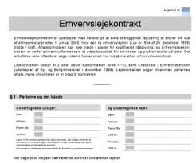
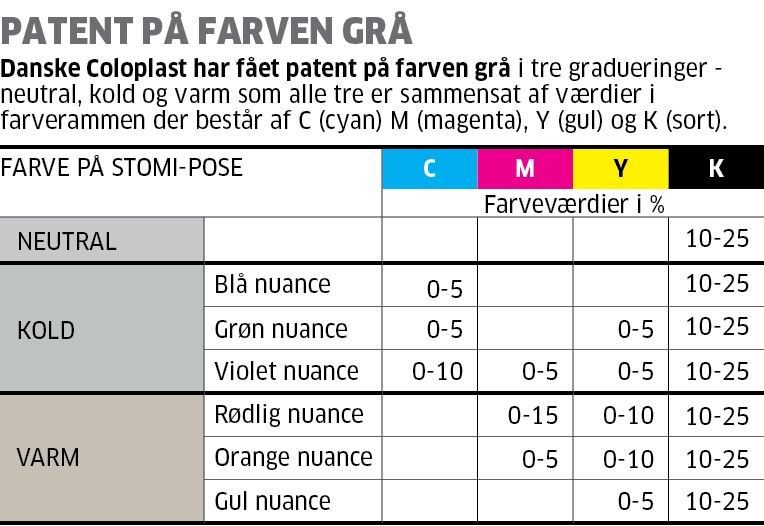

# Pant i fast ejendom, løsøre og virksomhedspant

```{r, echo=FALSE, results='asis'}
# cat(readLines('np.html'))
```


---

**Pant behandles i kap. 15 i "Erhvervsjura"**

---

*Som studerende skal du være særlig opmærksom på følgende forhold ved gennemlæsning af pensum om pant i fast ejendom, løsøre og virksomhedspant i forhold til eksamen*:


*Underpant i fast ejendom:*


* *Stiftelse, TL § 1*.

* *Sikringsakt*.  
  
* *Prioritetsrækkefølge, TL § 1 og § 1, stk. 2*.

* *Underpantsætning af ejerpantebreve, TL § 1a*. 
  
* *Overordnet om oprykning, § 40*. 

* *Tilbehørspant, TL §§ 37-38*. 

* *Prioritetskonflikt, TL § 1 (prioritetskonflikt) og TL § 5 (god tros begrebet)* 

* *Ejerpantebreve, TL § 1a*.  

* *Forståelse for forskellen mellem en aftaleerhverver, arvinger og  retsforfølgende kreditorer*.

* *Gyldighedsvirkningen, TL § 27 (kædekonflikt) + evt. erstatningsadgang, TL § 30 og 31*.


---

*Underpant i løsøre:*


* *Underpant i løsøre (inkl. motorkøretøjer m.m.)*.

* *Stiftelse*.

* *Sikringsakt*.

* *Prioriteter*. 

---

*Virksomhedspant/fordringspant:*

* *Virksomhedspant TL § 47c - § 47f*.

* *Hvad der er omfattet af virksomhedspantet også ift. til pantets omfang i fast ejendom og fordringspantet*.

* *Virksomhedspant ved skadesløsbrev/ejerpantebrev (indhold, omfang, udskillelse ifølge regelmæssig drift, prioritetskonflikter, forholdet til anden pantsætning og individualforfølgning/udlæg*.

* *Fordringspant TL § 47d*. 

---

## Parter, regler og definitioner


Ejeren af et aktiv har ejendomsretten til aktivet.

Den der har ejendomsretten er rettighedshaver.

Ejeren kan give pant i aktivet til panthaver. 

Så bliver ejer pantsætter, og panthaver bliver også rettighedshaver.

---

Pant reguleres i vidt omfang af reglerne i tinglysningsloven, jf. Lovbekendtgørelse nr. 1075 af 29. september 2014 om tinglysning. Se tinglysningsloven i Lovsamlingen under kapitel 26: **https://jura.tepedu.dk/lovsamling.html.**

---

*"Allonge"*	er et tillæg - til et pantebrev.

---

## Pant som sikkerhed


Pant i et aktiv giver kreditor større sikkerhed for, at en gæld betales tilbage.

Panthaver kan tvangssælge aktivet på tvangsauktion.

Er der flere panthaver i samme aktiv opstår en prioritetsstilling:


```{r pant1, echo=FALSE}
mydf <- data.frame(
  S1 = c("Prioritetsstilling" ,
         "1", 
          "2", 
          "3", 
          "4"
),
  S0 = c("Type af\nhæftelse" ,
         "Realkreditlån", 
          "Pantebrev", 
          "Pantebrev", 
          "Pantebrev"
),
  S1 = c("Beløb" ,
         "3.000.000 DKK", 
          "172.000 DKK", 
          "150.000 DKK", 
          "170.000 DKK"
),
  S2 = c("Tinglysningsdato" ,
         "23. august 2016", 
          "16 juli 2017", 
          "2. maj 2018", 
          "27. maj 2019"
)
)
names(mydf) <- NULL
mydf %>%
  kable("html", escape = FALSE, caption = "Eksempel på prioritetsstilling for en ejendom") %>%
  kable_styling(full_width = T,font_size = 10,bootstrap_options = c("responsive","bordered","striped")) %>%
  column_spec(1:4, bold = T, border_right = T, color = "black", background = "lightgrey") %>%
  # column_spec(2, bold = T, border_right = T, color = "black", background = "lightgrey") %>%
  # # column_spec(3, bold = T, border_right = T, color = "black", background = "lightgrey") %>%
  row_spec(1,italic = T,bold = T,font_size = 12,color = "white", background = "darkgrey") %>%
scroll_box(width = "100%")
  # row_spec(1,italic = T,bold = T,font_size = 12)
  # column_spec(0, angle = -45)%>%
  # scroll_box(width = "500px") %>%
  # footnote(general = "Forsikringsankenævnets klageguide",general_title = "Kilde:")%>%
# footnote(number = "Hvis skadevolder er under 14 år eller er utilregnelig, kan der dog være dækning selv om handlingen er forvoldt forsætligt")
```

---


Pantsætter (ejer) skal passe på det pantsatte aktiv. 

Pantsætteren skal sørge for almindelig vedligeholdelse af det pantsatte aktiv.

Der må ikke ske forringe pantets værdi ud over sædvanlig slid og ælde, fx:
   
* Værdiforringende ændringer.

* Fjerne aktiver fra pantet.

---

Pantsætter skal ofte sørge for at aktivet er forsikret mod tyveri og brand.
   
---

## Forskellige typer pant


*Håndpant*

Håndpant er en pantsætningsform ved løsøre og omsætningspapirer (fx. kunst og smykker, kaldet "pretiosa";	som kostbarheder, især smykker), hvor der er fare for, at pantsætter vil forringe aktivet eller pantsætter sælger aktivet.

Sikringsakten er, at pantsætteren er berøvet fysisk rådighed over det pantsatte.

Det kræver således en rådighedsberøvelse af aktivet fra pantsætteren.

---

   
*Underpant*

Det oftest anvendte, da pantsætter kan beholde rådigheden over aktivet (fx pantsætning af hus eller bil).

---
   
*Retspant* – er fx et *"udlæg"*: 

Hvis man skylder penge, og man ikke betaler, kan kreditor bede fogedretten om at hjælpe med at indkræve pengene.

I fogedretten vil man blive spurgt, om man har mulighed for at betale pengene. 

Hvis man ikke kan betale, kan fogedretten foretage udlæg i et eller flere af ens aktiver. 

Det kan for eksempel være ens faste ejendom eller ens bil. 

Udlæg betyder, at kreditor kan forlange, at det aktiv, der er foretaget udlæg i, sælges på auktion, så kreditor kan få sine penge.

Der kan ikke foretages udlæg i små pengebeløb, sædvanligt indbo eller i andre ting af beskeden værdi, som er nødvendige for familiens erhverv eller uddannelse

---

*Lovbestemt pant* – er fx ejendomsskat. 

Det offentliges lovbestemte pant har fortrinsret, hvad ejendomsskatter angår.

---
 
## Pantebreve, samt aftaler om pant

Et pantebrev er et lån ydet mod sikkerhed i fast ejendom. 

Med et pantebrev stiller ejeren sin ejendom som sikkerhed over for en långiver, der så bliver panthaver. 

Afdrager boligejeren ikke på lånet som aftalt, kan panthaveren begære tvangsauktion over ejendommen uden først at skulle foretage udlæg.

Et *pantebrev* er nærmere en aftale som indeholder beskrivelse af det pantsatte og hvad det ligger til sikkerhed for:

+	Kan indeholde et gældsbrev

+	Oprettes på baggrund af en pantebrevsformular

+	Skal tinglyses i Tingbogen: Personbogen, Andelsboligbogen eller Bilbogen

+	Skal være digitalt for at kunne tinglyses og underskrives med digital signatur (NemId).

---

Begrebet *"viljesbestemt pant"* er pant stiftet ved aftale - i modsætning til retspant, fx et udlæg.


---
 
### Typer af pantebreve  

Der findes følgende pantebrevsformer:

*Realkreditpantebreve*, der både giver pant i en ejendom og er et gældsbrev, hvor køber erkender at skylde et beløb til realkreditinstituttet.

---

*Ejerpantebreve*, hvor ejeren af en fast ejendom reserverer et pant i sin ejendom og underpantsætter dette fx til sin bank. 

Ejerpantebreve anvendes typisk som sikkerhed for lån i pengeinstitutter med tinglyst prioritetsstilling, men indebærer ikke i sig selv en pligt til forrentning og afdrag af et bestemt lånt beløb. 

---

*Skadesløsbreve*, hvor en ejer af en fast ejendom giver en bestemt kreditor sikkerhed i sin ejendom, når størrelsen af gælden ikke er endeligt fastlagt.

Skadesløsbrevet kan stilles som sikkerhed for et bestemt engagement - fx en kassekredit eller lignende.

---

*Sælgerpantebreve*, der både giver pant i en ejendom og er et gældsbrev, hvor køber erkender at skylde et beløb til kreditor (sælger).

---

Alle pantebreve skal tinglyses for at pantet gyldigt kan stiftes.

*Tinglysningsafgiften* for pantebreve er 1,5 % af lånets hovedstol oprundet til nærmeste 100 med tillæg af kr.1.660. 

Tinglysningsafgiften vil normalt blive medfinansieret i lånet.

---

*Eksempler på almindelige situationer:*

Da de færreste boligkøbere har mulighed for at betale boligen kontant, skal der normalt optages lån i forbindelse med boligkøbet. 

Som regel bliver der optaget et realkreditlån, eventuelt suppleret med et banklån. 

Når realkreditinstitutter og banker yder lån, forudsættes det, at boligkøberen giver pant i boligen til sikkerhed for tilbagebetaling af lånet.

Pantet stiftes ved, at der tinglyses et pantebrev i Tingbogen.

Ved ejerlejligheder er det almindeligt, at der er tinglyst et ejerpantebrev til sikkerhed for ejers forpligtelser over for ejerforeningen. 

Da det oftest har 1. prioritet ’skubber’ det de øvrige pantebreve ned. 

Nogle ejerforeninger vælger i stedet at tinglyse vedtægterne pantstiftende for at etablere sikkerheden.

Pensionister har mulighed for at foretage indefrysning af ejendomsskatterne ved at søge lån hos kommunen. 

Her sikrer kommunen lånet ved tinglysning af skadesløsbrev på ejendommen.  

Har køber ikke mulighed for at opnå sædvanlig finansiering via bank eller realkreditinstitut, sker det at sælger tilbyder at udstede et sælgerpantebrev til sikkerhed for købesummens betaling. 

Dette indebærer i praksis, at køber afdrager på lånet direkte til sælger i stedet for banken eller realkreditinstituttet.


<a href="https://www.tinglysningsretten.dk/tinglysning/faq/pant" target="_blank">Se spørgsmål og svar om pant, fra tinglysningsrettens hjemmeside</a>

---

*Godt at vide inden man tinglyser:*

Al tinglysning foregår digitalt på hjemmesiden www.tinglysning.dk. Det er muligt at tinglyse i Tingbogen (fast ejendom) *"Bilbogen"*, *"Andelsboligbogen"* og *"Personbogen"*.

Alle, der har NemID, har adgang til den digitale tinglysning, men det er en god ide at gøre sig overvejelser omkring, om man har de juridiske forudsætninger for at tinglyse.

I mapperne ovenfor finder man vejledninger til de digitale tingbøger samt generelle. Sidstnævnte kategori dækker over almengyldige vejledninger til tinglysningssystemet.

---


*Rent praktisk er tinglysningsprocessen delt i tre faser:*

1. Vælg den relevante dokumenttype under ”Ny Anmeldelse” og udfyld alle trin. Personen, der har oprettet anmeldelsen, vil fremadrettet blive kaldt ”Anmelder”.

2. Når anmeldelsen er færdiggjort og lagt i underskriftsmappen, skal de relevante parter logge ind med deres NemID og underskrive digitalt.

3. Når alle underskrifter er på plads, skal anmelder sørge for at anmelde til tinglysning. Hvis der afkræves tinglysningsafgift for dokumenttypen, vil betalingen foregå her.

Vær opmærksom på at det er anmelder, der har det juridiske ansvar for indholdet i anmeldelsen.

---

*Hotline:*

Deres hotline kan være behjælpelig, hvis man har tekniske problemer. Tinglysningsretten kan – som domstol – ikke yde juridisk vejledning. Hotline kan kontaktes på tlf. 70 22 18 00.

---
 
## Sikringsakt

Pant kræver typisk at der foretages en *sikringsakt* for at panthavers ret er sikret mod andre. 

Forholdet mellem pantsætter og panthaver kræver ikke tinglysning.

Sikringsakten afhænger af aktivet og kan være:

+ Tinglysning.
   
+ Registrering.
   
+ Fysisk rådighedsberøvelse.
   
+ Meddelelse (denuntiation).
   
+ Ingenting.

---

```{r pant2, echo=FALSE}
mydf <- data.frame(
  S1 = c("Aktivtype" ,
         "Fast ejendom", 
          "Biler", 
          "Løsøre", 
          "Simple fordringer",
         "Negotiable gældsbreve", 
          "Digitale pantebreve", 
          "Værdipapirer"
),
  S2 = c("Ejendomsret" ,
         "Tinglysning i\ntingbogen", 
          "Ingen", 
          "Ingen", 
          "Denunciation til debitorer",
         "Rådighedsberøvelse", 
          "Tinglysning", 
          "Registrering hos værdipapircentralen, VP securities"
),
  S3 = c("Underpant" ,
          "Tinglysning i\ntingbogen", 
          "Ingen", 
          "Ingen", 
          "Denunciation til debitorer",
         "", 
          "Tinglysning", 
          "Registrering hos værdipapircentralen, VP securities"
),
  S4 = c("Udlæg" ,
         "", 
          "Tinglysning\nbilbogen\nrådighedsberøvelse", 
          "Intet", 
          "Intet",
         "Rådighedsberøvelse", 
          "Tinglysning", 
          "Registrering hos værdipapircentralen, VP securities"
),
  S5 = c("Ejendomsforbehold" ,
         "", 
          "Tinglysning\nbilbogen", 
          "Intet", 
          "",
         "", 
          "", 
          ""
),
  S6 = c("Håndpant" ,
         "", 
          "", 
          "Rådighedsberøvelse", 
          "",
         "Rådighedsberøvelse", 
          "", 
          ""
)
)
names(mydf) <- NULL
mydf %>%
  kable("html", escape = FALSE, caption = "Sikringsakter for aktiver") %>%
  kable_styling(full_width = T,font_size = 10,bootstrap_options = c("responsive","bordered","striped")) %>%
  column_spec(1:6, bold = T, border_right = T, color = "black", background = "lightgrey") %>%
  # column_spec(2, bold = T, border_right = T, color = "black", background = "lightgrey") %>%
  # # column_spec(3, bold = T, border_right = T, color = "black", background = "lightgrey") %>%
  row_spec(1,italic = T,bold = T,font_size = 12,color = "white", background = "darkgrey") %>%
scroll_box(width = "100%")
  # row_spec(1,italic = T,bold = T,font_size = 12)
  # column_spec(0, angle = -45)%>%
  # scroll_box(width = "500px") %>%
  # footnote(general = "Forsikringsankenævnets klageguide",general_title = "Kilde:")%>%
# footnote(number = "Hvis skadevolder er under 14 år eller er utilregnelig, kan der dog være dækning selv om handlingen er forvoldt forsætligt")
```

---

Formålet med sikringsakten er:

*Prioritetskonstaterende virkning:* 

Er der flere panthaver i samme aktiv opstår en prioritetsstilling i mellem panthaverne.

---

*Offentliggørende virkning*:  

Tinglysning af en rettighed medfører, at det bliver offentliggjort. 

Alle har ret til at slå op i tingbøgerne og se ejerskab, pant mv. 

---

*Rådighedsindskrænkende virkning:*  

Håndpantsætning medfører, at pantsætter ikke længere har adgang til aktivet. 

Andre pantformer indskrænker pantsætter ret til at råde over aktivet.  


---
 
## Aktiver kreditor kan få pant i  

*Aktivtyper som der kan gives pant i:*

* Biler

* Fast ejendom

* Andelslejlighed

* Løsøre

* Virksomhedspant

* Fordringer og fordringspant

* Værdipapirer, aktier og anparter

* Fly og skibe
 
---

```{r pant3, echo=FALSE}
mydf <- data.frame(
  S1 = c("Aktivtype" ,
         "Fast ejendom samt tilbehør", 
          "Andelslejlighed", 
          "Biler", 
          "Løsøre herunder virksomhedspant og fordringspant, erhvervsfartøjer under 5 bruttoton, fritidsskibe under 20 bruttoton",
         "Børsnoterede værdipapirer også kaldet fondsaktiver", 
          "Aktier og anparter ikke børsnoterede", 
          "Fly",
         "Erhvervsfartøjer over 5 bruttoton, fritidsskibe over 20 bruttoton"
         
),
  S2 = c("Lov" ,
         "Tinglysningsloven afsnit 1, kapitel 1-6", 
          "Tinglysningsloven kapitel 6b", 
          "Tinglysningsloven kapitel 6a", 
          "Tinglysningsloven kapitel 7",
         "Kapitalmarkedsloven", 
          "Selskabsloven", 
          "Lov om registrering af rettigheder over luftfartøjer",
         "Søloven"
)
)
names(mydf) <- NULL
mydf %>%
  kable("html", escape = FALSE, caption = "Hvilken lov regulerer  sikkerhed for aktiver") %>%
  kable_styling(full_width = T,font_size = 10,bootstrap_options = c("responsive","bordered","striped")) %>%
  column_spec(1:2, bold = T, border_right = T, color = "black", background = "lightgrey") %>%
  # column_spec(2, bold = T, border_right = T, color = "black", background = "lightgrey") %>%
  # # column_spec(3, bold = T, border_right = T, color = "black", background = "lightgrey") %>%
  row_spec(1,italic = T,bold = T,font_size = 12,color = "white", background = "darkgrey") #%>%
  # row_spec(1,italic = T,bold = T,font_size = 12)
  # column_spec(0, angle = -45)%>%
  # scroll_box(width = "500px") %>%
  # footnote(general = "Forsikringsankenævnets klageguide",general_title = "Kilde:")%>%
# footnote(number = "Hvis skadevolder er under 14 år eller er utilregnelig, kan der dog være dækning selv om handlingen er forvoldt forsætligt")
```
 
---
 
## Pant i fast ejendom


Pant i fast ejendom er en sikkerhed som bruges til opfyldelse af en forpligtelse. 

Pant i fast ejendom bruges oftest til at stille sikkerhed for et lån via et pantebrev.

Når der stilles sikkerhed for et lån ved pant i fast ejendom, kan långiver kræve ejendommen på tvangsauktion, hvis forpligtelsen om gælden ikke bliver overholdt og derigennem opnår långiver en sikkerhed, når der lånes penge ud til ejeren af boligen.

Ved udbetaling af et lån, hvor der stilles sikkerhed i den faste ejendom, bliver der lavet et pantebrev, som er det juridiske dokument der indeholder forpligtelserne omkring lånet, og viser at der er givet pant i ejendommen mod lån af penge.

Pant i fast ejendom kan både bruges som sikkerhed via et pantebrev til køb af bolig og dermed som sikkerhed for et boliglån samt ved at tage lån i friværdi.

---

Se **tinglysningsloven**, jf. Lovbekendtgørelse 2014-09-30 nr. 1075
om tinglysning, se tinglysningsloven i Lovsamlingen i kapitel 26: **https://jura.tepedu.dk/lovsamling.html.**

---

*Alle rettigheder over fast ejendom skal tinglyses:*

* Tinglyses i Tingbogen med angivelse af et eller flere matrikelnumre.

* Adkomst – skøde tinglyses for at sikre ejendomsretten.

* Byrder/servitutter - også kaldet en deklaration - fx en lejekontrakt, vejret, byggehøjde eller ægtepagt tinglyses for at sikre sig mod evt. køber.

* Hæftelser – pant og udlæg tinglyses for at sikre prioritet på evt. tvangsauktion.  

* Flere panthavere i samme ejendom – prioritetsstilling.

* Skal et foranstående pant udvides, skal efterstående panthavere give tilladelse (rykningspåtegning).

* Der er oftest aftalt oprykningsret i et pantebrev, og så rykker det op i prioritetsstillingen efterhånden som gælden i foranstående pantebrev bliver nedbragt.

* Kreditor kan højst give henstand med betaling på pantebrevet 1 år, ellers vil rentekravet komme sidst i prioritetsordenen.

* Ejerpant kan opstå, hvis der ikke er aftalt oprykningsret, og et gælden i et foranstående pantebrev er nedbragt.

---

### Begrebet "hævd"

*"Hævd"* er en	særlig erhvervelsesmåde, hvor retten stiftes ved en uhjemlet råden (ikke lovmæssig råden) i 20 år eller i alderstid. Danske Lov 5-5-1 lyder således:

"Hvis Gods og Ejendom nogen haver haft i Haand og Hævd i tyve Aar Ulast og Ukært til Tinge, det beholder hand, uden anden Adkomst at fremvise, angerløst og Uafvundet, medmindre det bevisis, at hand hafde det, enten til pant eller i Forlæning, eller i Forsvar". Se **Danske Lov** i Lovsamlingen i kapitel 26: **https://jura.tepedu.dk/lovsamling.html.**

---

Hævd er således en særlig form for erhvervelse af ejendomsret. 

Hævd erhverves ved kontinuerlig uretmæssig brug af en ejendom. 

Brugen af ejendommen må således ikke ske i overensstemmelse med aftale med ejeren af ejendommen. 

Hævd kan opnås af en eller flere personer og der kan ske udskiftning i personkredsen undervejs i hævdsperioden.

Erhvervelse af hævd forudsætter, at den uretmæssige råden er forløbet over en længere årrække. 

Der skal mindst være tale om en kontinuerlig råden i 20 år og i visse tilfælde op mod 40-50 år. 

Den 20-årige råden kaldes ordinær hævd mens den længere rådighedsperiode kaldes alderstidshævd.

Rådigheden afbrydes, hvis ejeren opstiller en fysisk hindring eller foretager retslige skridt mod den eller de personer, der bruger ejendommen.

Når der vindes hævd får den eller de, der har brugt ejendommen, ejendomsret i overensstemmelse med den råden, der er udvist. 

Hvis den skete råden er begrænset, bliver der kun hævd som bruger af ejendommen.

Hævd skal tinglyses på samme måde som servitutter, for at blive beskyttet. 

Hævd eksisterer så længe hævden er tinglyst og kan ophøre på samme måde som servitutter, altså ved aftale og passivitet m.v.

---

**Video om tinglysningslovens §§ 1 og 27**


<div class="video-container"><iframe src="https://www.youtube.com/embed/hPEDQjWpyjg" width="853" height="480" frameborder="0" allowfullscreen="allowfullscreen"></iframe></div>


---


**Video: Om tinglysningslovens § 40**


<div class="video-container"><iframe src="https://www.youtube.com/embed/W-GUDkF6tIg" width="853" height="480" frameborder="0" allowfullscreen="allowfullscreen"></iframe></div>

---


*De vigtigste dokumenter, der således kan tinglyses:*

*Endeligt skøde:* Ikke andre betingelser end købesummens betaling.

*Betinget skøde:* Endelig overdragelse er gjort betinget af andre forhold end købesummens betaling.

*Almindelige pantebreve:* Skal udfærdiges på standardblanket. Foranstående hæftelser skal angives.

*Skadesløsbreve/ejerpantebreve:* Hvor der gives pant for et max. beløb, men skyldens størrelse fremgår ikke af selve pantebrevet, men af et under-liggende skyldforhold.

*Servitutter:* Ex. servitut vedrørende lokalplaner og vejret.

---

*Pantebrevslån som alternativ boligfinansiering:* 

Et pantebrevslån er et privat lån, man tager uden om banken. 

Man kan tage et pantebrevslån, hvis man køber fast ejendom, og dermed stiller sikkerhed i den bolig man finansierer med lånet.  

---

## Hvad omfatter pant i fast ejendom

*Hvad er omfattet af begrebet "fast ejendom":* 

Fast ejendom dækker både over jordarealer samt bygninger. 

Et stykke jord med tilhørende bygning anses som samme faste ejendom, og har derfor en samlet værdi. 

En bygning på en lejet grund kan i nogle tilfælde være særskilt fast ejendom og pantsættes uafhængigt af grunden:  

* Et afgrænset stykke jord med tilhørende beplantning og eventuelt bygninger – samme faste ejendom.

* En bygning på lejet grund kan være en særskilt fast ejendom og kan pantsættes uafhængigt af grunden.

* En del løsøre er tilbehør til fast ejendom og bliver en del af den samlede faste ejendom. 

*Ejendomspant i løsøre beskrives af:*

+ Tilvækstlæren.

+ TL § 38 om indlagt løsøre.

+ TL § 37 om erhvervsløsøre.
   
---   

```{r pant5, echo=FALSE}
mydf <- data.frame(
  S1 = c("I konflikt med" ,
          "TL § 47, individuelt løsørepant", 
          "TL § 47b, stk. 2, flydende pant i driftsmateriel", 
          " TL § 47c, virksomhedspant",
         "Ejendomsforbehold", 
          "Udlæg i løsøre"
),
  S2 = c("Løsning" ,
         "Løsørepant skal aftales før aktivet kommer ind på ejendommen.", 
         "Ingen konflikt, TL § 47b, stk. 2 finder udelukkende anvendelse i virksomheder fra lejede lokaler.", 
          "TL § 37 vinder altid over virksomhedspant jf. TL § 47c stk. 4", 
         "Ejendomsforbeholdet vinder, hvis det er gyldigt", 
          "Det er ikke muligt at få udlæg i løsøre omfattet af TL $ 37 jf. rpl. § 510"
)
)
names(mydf) <- NULL
mydf %>%
  kable("html", escape = FALSE, caption = "Tilbehør til fast ejendom, løsøre omfattet af TL § 37") %>%
  kable_styling(full_width = T,font_size = 10,bootstrap_options = c("responsive","bordered","striped")) %>%
  column_spec(1:2, bold = T, border_right = T, color = "black", background = "lightgrey") %>%
  # column_spec(2, bold = T, border_right = T, color = "black", background = "lightgrey") %>%
  # # column_spec(3, bold = T, border_right = T, color = "black", background = "lightgrey") %>%
  row_spec(1,italic = T,bold = T,font_size = 12,color = "white", background = "darkgrey") #%>%
# scroll_box(width = "100%")
  # row_spec(1,italic = T,bold = T,font_size = 12)
  # column_spec(0, angle = -45)%>%
  # scroll_box(width = "500px") %>%
  # footnote(general = "Forsikringsankenævnets klageguide",general_title = "Kilde:")%>%
# footnote(number = "Hvis skadevolder er under 14 år eller er utilregnelig, kan der dog være dækning selv om handlingen er forvoldt forsætligt")
```

---


```{r pant4, echo=FALSE}
mydf <- data.frame(
  S1 = c("I konflikt med" ,
         "TL § 37, tilbehør til fast ejendom (erhverv)", 
          "TL § 47, individuelt løsørepant", 
          "TL § 47b, stk. 2, flydende pant i driftsmateriel", 
          " TL § 47c, virksomhedspant",
         "Ejendomsforbehold", 
          "Udlæg i løsøre"
),
  S2 = c("Løsning" ,
         "Benyt TL § 38", 
          "Ikke særskilt ret over TL § 38-tilbehør, hvorfor TL § 38 anvendes", 
          "Ingen konflikt, TL § 47b, stk. 2 finder udelukkende anvendelse i virksomheder fra lejede lokaler.", 
          "Ikke særskilt ret over TL § 38-tilbehør, hvorfor TL § 38 anvendes", 
         "Ikke særskilt ret over TL § 38-tilbehør, hvorfor TL § 38 anvendes", 
          "rpl § 510 udelukker udlæg i løsøre omfattet af TL § 38"
)
)
names(mydf) <- NULL
mydf %>%
  kable("html", escape = FALSE, caption = "Tilbehør til fast ejendom, løsøre omfattet af TL § 38") %>%
  kable_styling(full_width = T,font_size = 10,bootstrap_options = c("responsive","bordered","striped")) %>%
  column_spec(1:2, bold = T, border_right = T, color = "black", background = "lightgrey") %>%
  # column_spec(2, bold = T, border_right = T, color = "black", background = "lightgrey") %>%
  # # column_spec(3, bold = T, border_right = T, color = "black", background = "lightgrey") %>%
  row_spec(1,italic = T,bold = T,font_size = 12,color = "white", background = "darkgrey") #%>%
# scroll_box(width = "100%")
  # row_spec(1,italic = T,bold = T,font_size = 12)
  # column_spec(0, angle = -45)%>%
  # scroll_box(width = "500px") %>%
  # footnote(general = "Forsikringsankenævnets klageguide",general_title = "Kilde:")%>%
# footnote(number = "Hvis skadevolder er under 14 år eller er utilregnelig, kan der dog være dækning selv om handlingen er forvoldt forsætligt")
```


---


## Tilvækstlæren 


---   


---   

*Hvad betyder "tilvækstlæren"?*

Når en genstand anbringes i en ejendom på en sådan måde, at det beskadiger ejendommen at fjerne genstanden, kan genstanden blive omfattet af ejendommens pant.

*Tilvækstlæren* omfatter således løsøreaktiver, som ikke kan fjernes fra ejendommen uden at gøre skade på den.

Det omfatter fx nedgravede kabler, kloaknet, vinduer, tag – alt der er ”vokser” ind i bygningen/ejendommen.

Løsøre omfattet af tilvækstlæren er en del af ejendommen og ingen kan have en særskilt ret over det. 

Det vokser så og sige ind i ejendommens pant. 

Dette gælder også, selvom ejeren ikke selv har betalt for løsøret.

---


**TL § 38 – Indlagt løsøre**


Omfatter løsøreaktiver, som er:

+ Indlagt i bygningen (installeret, boret ind i væggen mv.)

+ Til brug for bygningen (fx vaskemaskine, fryser, aircondition men ikke driftsaktiver til brug for virksomheden)

+ På ejerens bekostning (så hvis lejer eller en 3. mand har betalt er løsøret ikke omfattet af ejendomspantet)
   

Indlagt løsøre er omfattet af ejendomspantet og særskilt ret over det kan ikke opretholdes (hverken ejendomsforbehold eller pant)

---

Et juridiske begreber ved fast ejendom:

*"Afståelsesret"* er en	ret for en lejer til at lade en anden indtræde i sit sted på uændrede vilkår.

*"Aftægt"* er en ret til en fri bolig og evt. visse naturalydelser, som er forbeholdt i forbindelse med overdragelse af en fast ejendom.

*"Jus tollendi sine læsione prioris status"*;	betegner en ret til at bortfjerne installerede genstande, hvis dette kan ske uden beskadigelse af den øvrige del af bygningen.


---

TL § 38 har følgende ordlyd: 

”Når en bygning er opført, helt eller delvis, og når ledninger, varmeanlæg, husholdningsmaskiner eller lignende er blevet indlagt i bygningen på ejerens bekostning til brug for bygningen, kan særskilt ret over bygningens materialer og over nævnte tilbehør ikke forbeholdes, være sig som ejendomsret eller på anden måde. Tinglyst pantebrev i en ejendom omfatter uden særlig vedtagelse også dette tilbehør”. 

---

TL § 38 afskærer således inden for sit anvendelsesområde adgangen til at opretholde særskilte rettigheder over bestanddele og tilbehør til den faste ejendom, det være sig i form af ejendomsforbehold, løsøreunderpant, leasing eller på anden måde.^[Følgende afsnit om TL § 37 og 38 bygger på *Peter Mortensen* bemærkninger i Karnovkommentaren til Tinglysningsloven, KarnovGroup.]

Tilbehør til en erhvervsejendom nu kun omfattes af TL § 38, såfremt tilbehøret er til brug for selve bygningen (eller grunden) modsat erhvervsvirksomheden. 

Herved er der åbnet mulighed for, at maskiner og andet tilbehør til erhvervsvirksomheden kan finansieres særskilt ved salg med ejendomsforbehold, løsøreunderpant, leasing eller på anden måde. 

Der er hermed skabt ligestilling mellem erhvervsvirksomheder, der drives fra henholdsvis ejede og lejede lokaler. 

---

Efter retspraksis forstås ved *»indlagt«*, at genstanden varigt er anbragt på et bestemt sted i ejendommen, og at den udgør et nødvendigt, naturligt eller hensigtsmæssigt led i erhvervsvirksomheden. 

Den nærmere afgrænsning har dog givet anledning til tvivl. 

Formuleringen i TL 38: »når en bygning er opført, helt eller delvis« gælder bestemmelsen herefter uden hensyn til, om bygningen (virksomheden) er fuldført eller taget i brug. 

TL § 38 kan anvendes analogt på tilbehør til grunden. 

---

*Domme:*


Dommen **U 1934.167:** Centrifugalpumpe ved brønd i det fri, der anvendtes til gartneris forsyning med vand omfattet af TL § 38. Se link til hele dommen: **https://pro.karnovgroup.dk/document/7000240470/1**

---

Dommen **U 1932.603 Ø:** Automatisk pumpe i ejendoms gård forbundet med rør til hovedbygning og stald omfattet af TL 38. Se link til hele dommen her:
**https://pro.karnovgroup.dk/document/7000240219/1**


---


Men dommen **VLT 1932 329:** Pumpe anvendt i briketfabrik, anbragt i skur uden tilknytning til nogen bygning, var ikke omfattet af TL § 38. 

Svinehuse, hønsehuse og mindre skure omfattes af TL § 38, selv om man ikke kan henregne dem til bygninger. 

---


Dommen **U 1939.883 V:** Hønsehus af tynde brædder, opstillet et stykke fra ejendommens bygninger på støbt cementramme, således at det let kunne fjernes, uden for TL § 38. Se link til dommen her: **https://pro.karnovgroup.dk/document/7000241331/1**


---


Det er tvivlsomt, i hvilket omfang vindmøller er omfattet af TL § 38, således at særskilt pantsætning - og andre særskilte rettigheder - er afskåret i tilfælde, hvor møllen opføres på egen ejendom:

Se dommen **U 1991.447/1 V:** Vindmølle, der udelukkende producerede el til videresalg og ikke forsynede den ejendom, hvorpå den var beliggende, ikke omfattet af pantet i ejendommen efter TL § 38; pantsætning måtte derfor ske efter reglerne for løsøre. Se link til dommen her:
**https://pro.karnovgroup.dk/document/7000199565/1**


---

Der lægges der vægt på i TL § 38, om tilbehøret er *indlagt i »bygningen«*. Hermed er det understreget, at en genstand kun kan anses for omfattet af TL § 38, hvis den kan anses som et tilbehør til selve bygningen, jf. også ordene *"til brug for bygningen"*. 

---

Det er således ikke tilstrækkeligt, at genstanden kan betragtes som tilbehør til en erhvervsvirksomhed, der drives i bygningen.  

Tilbehør til grunden kan også være omfattet af TL § 38, jf. ordet *»delvis«*. 

Med udtrykket »indlagt« er det bl.a. fremhævet, at der må være en vis rumlig forbindelse mellem bygning (grund) og tilbehør, selv om det ikke kræves, at anbringelsen er sket »mur- og nagelfast«. 

Generelt følger af begrebet »indlagt« dels et krav om, at genstanden skal være bestemt til stationær brug (modsat let transportabel), dels et krav om, at den skal være varigt anbragt på ejendommen (modsat blot midlertidigt): 


Se dommen **U 1987.854 V:** Køleskabe, komfurer og elradiatorer, der var opstillet i 2 nyopførte huse, men ikke var tilsluttet elnettet, anset for omfattet af TL § 38. Se link til dommen her:
**https://pro.karnovgroup.dk/document/7000206469/1**

---

Kravet om, at anskaffelsen skal være sket på ejerens bekostning. 

Udenfor falder herefter tilfælde, hvor anskaffelsen er bekostet af en lejer, idet det afgørende i denne henseende er, om vederlaget i realiteten betales af ejeren, ikke om betalingen formelt kommer fra ejeren, jf. dommen i **U 1941.731/2 H**. Se link til dommen her: **https://pro.karnovgroup.dk/document/7000241579/1**

---

Er en genstand anskaffet af ejendommens ejers ægtefælle, må udgangspunktet være, at den ikke omfattes af TL § 38, jf. dommene i **U 1983.951 V.** Se link til dommen her: **https://pro.karnovgroup.dk/document/7000207034/1**


og dommen i **U 1985.227 V**: **https://pro.karnovgroup.dk/document/7000205273/1** 

---

Man vil dog formentlig stille ret strenge krav til beviset for, at genstanden reelt er bekostet af den anden ægtefælle, ligesom § 38 er anvendelig, hvis den ægtefælle, der har anskaffet genstanden, må antages reelt at være medejer af ejendommen, jf. dommen i **U 1984.620 V.** Se link til dommen her:
**https://pro.karnovgroup.dk/document/7000205229/1**


Tilsvarende gælder ved faste samlivsforhold.

Hvis indføjelsen er foretaget af en lejer, en brugspanthaver eller anden midlertidig besidder, omfattes forholdet som nævnt ikke af TL § 38.

---

TL § 38 afskærer som nævnt navnlig ejendomsforbehold i genstande, der indlægges i en fast ejendom, men heller ikke andre særskilte rettigheder kan opretholdes over sådanne genstande, således ikke panterettigheder, der er stiftet efter reglerne om pant i løsøre, eller brugs- og lejerettigheder (leasingrettigheder). 


---

*TL § 37 – Erhvervstilbehør*


TL § 37, stk. 1 har følgende formulering;

"Hvor en fast ejendom varigt er indrettet med en særlig erhvervsvirksomhed for øje, omfatter tinglyst pantebrev i ejendommen, når intet andet er aftalt, også det dertil hørende driftsinventar og driftsmateriel - derunder maskiner og tekniske anlæg af enhver art - og ved landejendomme tillige den til ejendommen hørende besætning, gødning, afgrøder og andre frembringelser, for så vidt de ikke udskilles ifølge en regelmæssig drift af den pågældende ejendom”

---

Hvis ejendommen er:

En erhvervsejendom. I reglen skal indretningen fremgå af særlige bygningsforanstaltninger. 

Specielt inventar mv. kan i særlige tilfælde være tilstrækkeligt, medens faktisk anvendelse til erhverv ikke er nok. 

Ikke hele ejendommen behøver at være indrettet med henblik på erhvervsvirksomheden, når den blot ikke spiller en kun ubetydelig rolle.

Som er varigt indrettet: I tvivlstilfælde kan der ses hen til betydningen for pantesikkerheden, jf. dommen i **U 1934.352.** Se link til dommen:
**https://pro.karnovgroup.dk/document/7000240490/1**

Det er uden betydning, om ejendommen først ved senere bygningsændring er blevet indrettet til erhvervsejendom

---

*Med en "særlig erhvervsvirksomhed for øje"*. 

Der ligger næppe nogen begrænsning i udtrykket »særlig«. 

Ejendommens indretning til erhverv behøver således ikke at sigte til et bestemt erhverv, men er dette tilfældet, er løsøret kun omfattet af panteretten efter TL § 37 i det omfang, det hører til en virksomhed af den art, hvortil ejendommen er indrettet,

Er driftsmateriel og driftsmidler omfattet af ejendomspantet. 

---

Altså - med undtagelse af biler, jf. stk. 3 - alle genstande, der varigt benyttes i driften som grundlag for denne (produktionsmidler), derimod (bortset fra landejendomme) ikke råvarer, halvfabrikata og færdige produkter:

Se hertil dommen **U 1987.586 V** Køkkener, der midlertidigt var opstillet i en køkkenfabrikants detailforretninger for at fremme salget, og som var monteret på nogenlunde samme måde som i et privat hjem, men blev udskiftet ved modelskifte mv., var ikke omfattet af en panthavers panteret efter TL § 37 og TL § 47 b, stk. 2, idet køkkenerne i princippet måtte sidestilles med enhver anden form for demonstrations/udstillingsvare, der traditionelt henregnes til en virksomheds varelager. Se link til dommen her:
**https://pro.karnovgroup.dk/document/7000206004/1**


Se dommen **U 1973.925 H** Et vaskeri drev også virksomhed med udlejning af arbejdstøj, duge og sengelinned mv. Antaget, at disse genstande nærmest måtte sidestilles med et varelager og ikke kunne anses som driftsinventar eller driftsmateriel omfattet af TL § 37. Se link til dommen:
**https://pro.karnovgroup.dk/document/7000210263/1**


---

Bestemmelsen kan fraviges ved aftale (deklaratorisk), hvis:

+ Aftale om pant eller ejendomsforbehold indgås før løsøret bliver bragt ind på ejendommen.

+ Aftale om pant bliver tiltrådt af panthaverne i ejendommen.

---
   
*Løsøret kan udskilles ifølge regelmæssig drift.*
 
Hvis ejendommen er en landejendom omfatter pantet også:


*Besætningen:* 

Dyr er i ældre retspraksis efter omstændighederne blevet opfattet som driftsmateriel, således at de ansås for omfattet af tilbehørspantet, selv om der ikke var tale om en landejendom:


Dommen i **U 1981.863 V** (Heste i stutteri). Se link til dom: 
**https://pro.karnovgroup.dk/document/7000207606/1**

og dommen i **U 1969.961 V** (Høns i hønseri). Se link til dom:
**https://pro.karnovgroup.dk/document/7000219399/1**


Men se nu dommen **U 1987.807 H** En ørredbestand på et dambrug kunne ikke anses for driftsmateriel. Se link til dommen: 
**https://pro.karnovgroup.dk/document/7000206388/1**

og 


Dommen i **U 1995.362 H** En minkfarms besætning af mink ikke anset som driftsinventar eller driftsmateriel. Se link til dommen:
**https://pro.karnovgroup.dk/document/7000201619/1**

---

Under besætning falder alle dyr, der indgår i en normal landbrugsdrift, herunder avlsdyr samt afkom, se dommen i **U 1935.561 V.** Se link til dom: 
**https://pro.karnovgroup.dk/document/7000240677/1**

Således også høns, smågrise og får, jf. dommen i **VLT 1957.159:** Ekstraordinært stort fårehold, uanset at besætningen ikke kunne ernæres af gårdens produkter, men ikke kaniner, pelsdyr, duer, bier og lignende. 

Det må dog kræves, at dyrene har væsentlig betydning for ejendommen, hvorfor man snarere vil medtage høns ved husmandsbrug, dommen **U 1937.154 V.** Se link til dom: **https://pro.karnovgroup.dk/document/7000240940/1**

End ved større landejendomme, jf. dommen **U 1935.373 V.** Se link til dom:
**https://pro.karnovgroup.dk/document/7000240650/1**

---
 
*Gødning, afgrøder og andre frembringelser:* 

En landbrugsejendoms mælkekvote er ikke omfattet af TL § 37, og det samme gælder et krav på godtgørelse for ophør med mælkeleverance, jf. dommen **U 1992 815 V:** **https://pro.karnovgroup.dk/document/7000200169/1**

Såvel den på roden værende som den indhøstede avl og afgrøde, jf. dommen **U 1964 746 V:** **https://pro.karnovgroup.dk/document/7000211153/1**


Panthaverne i den faste ejendom må dog respektere høstpant stiftet i henhold til lov om høstpant. 

Om kartoffelleveringsrettigheder, se dommen **U 1998 209/2 V:** og dommen **U 2000.967 V.** Se link **https://pro.karnovgroup.dk/document/7000196373/1**

---

En landejendom er oftest en traditionel gård med jordbrug og besætning. 

Der må være tale om en egentlig jordbrugsvirksomhed, jf. dommen **U 1995.362 H:** Minkfarm ikke omfattetPanteret i minkfarm omfattede ikke minkskind, der var løsørepantsat, jf. TL's § 37. Se link til dommen her: **https://pro.karnovgroup.dk/document/7000201619/1** 

---

Se dommen i **U 1987.807 H** Dambrug ikke omfattet. Ørredbestand til dambrug ikke omfattet af TL § 37. Banks fyldestgørelse opnået ved overdragelse af dambruget med ørredbestand omstødt i medfør af konkurslovens § 74. Se link til dommen her: **https://pro.karnovgroup.dk/document/7000206388/1**

---

Se dommen **U 1981.863 V.** En ejendom, der var noteret som landbrugsejendom, men som gennem lang tid udelukkende havde været drevet som stutteri og var indrettet specielt hertil, var ikke omfattet: 
**https://pro.karnovgroup.dk/document/7000207606/1**

---


Se dommen i **U 1969.961 V** Hønseri ikke anset for en landejendom. Se link til dommen her: **https://pro.karnovgroup.dk/document/7000219399/1** 

---

Se dommen **U 1933.762 V** (ligeledes). Se link til hele dommen her: **https://pro.karnovgroup.dk/document/7000240392/1**

---

Se dommen **VLT 1935.58** (pant i smedje med tilhørende areal af 1 td land antoges ikke at omfatte 1 hest, 1 ko og nogle smågrise, selv om stald var indrettet i husets ene ende). 

---

Det er uden betydning, om ejendommens jorder er beliggende i en landkommune eller ikke. 

Det er ligeledes uden betydning, om ejendommen ligger i landzone eller er noteret som en landbrugsejendom efter loven herom. 

Muligvis kan antallet af dyr på en ejendom være så stort, at der ikke er tale om jordbrug i traditionel forstand, men om industri, der ikke er omfattet. 

Det er derimod ikke nødvendigt, at opdræt af en besætning udelukkende baseres på ejendommens egen avl af foder.

---

Begreb:

*"Høstpant"* er pant i alle afgrøder, der høstes på ejendommen det pågældende år, hvis det vedrører leverancer af rå- og hjælpestoffer, i tiden 01.01-31.07, og ellers afgrøderne, der høstes det følgende år.

Ejeren eller brugeren af en landbrugsejendom  kan stifte pant i ejendommens afgrøder til sikkerhed for betalingen af gæld opstået i forbindelse med køb af de rå- og hjælpestoffer, jf. høstpantebrevslovens § 1, stk. 1, se nærmere **Lovbekendtgørelse 2015-12-14 nr. 1658 om høstpant** i Lovsamlingen i kapitel 26 vedrørende **høstpantebrevsloven**: **https://jura.tepedu.dk/lovsamling.html.**

---

Høstpanterbrevsloven indebærer bl.a., at en ejer eller en bruger af en landbrugsejendom kan stifte panteret i ejendommens kommende høst til sikkerhed for betalingen af gæld i forbindelse med opkøb af visse rå- og hjælpestoffer.

Høstpantebrevsordningen blev i sin tid indført som en hjælpeforanstaltning over for landbruget i en helt speciel nødsituation, og landbrugets økonomiske situation og landmændenes faktiske udnyttelse af ordningen begrundede senere, at ordningen blev gjort permanent.

---

**Uden for panteretten falder personlige brugsgenstande.**

Se dommen **U 1975.323 Ø**. Udsmykningsgenstande, herunder en antik våbensamling, i restaurationsvirksomhed ikke anset for omfattet af TL § 37, hvorimod et farvefjernsyn efter sin placering og anvendelse måtte betragtes som driftsinventar i forretningen. Se link til til dommen her: 
**https://pro.karnovgroup.dk/document/7000211506/1**

---

Personbiler er i almindelighed ikke omfattet, selv om de er anskaffet forud for 1993-06-01 og derfor ikke er undtaget efter TL § 37, stk. 3, jf. dommene i **U 1979.411/1 V, U 1978.823 V og U 1973.354 V**.

---

Er der tvivl om, hvorvidt genstande er omfattet af TL § 37 (eller TL § 38), kan de fremhæves udtrykkeligt i pantebrevet. Løsøregenstande, som ikke er omfattet af TL § 37, kan pantsættes særskilt efter TL § 47 (individualiserbart løsøre) eller efter TL § 47 c, virksomhedspant.


---

**Video: Om pant i fast ejendom, jf. TL §§ 37 og 38**


<div class="video-container"><iframe src="https://www.youtube.com/embed/xHy4WseYSYY" width="853" height="480" frameborder="0" allowfullscreen="allowfullscreen"></iframe></div>
 
---

## Eksamensopgave 18.1.

*Eksamensopgavesæt om pant i fast ejendom, virksomhedspant, pantets omfang, konkurs, omstødelse, tvangsfuldbyrdelse og rekonstruktion mv.*


*Fine biler og dyre vaner*

Super Cars I/S beskæftigede sig med salg af nye og brugte, eksklusive specialbiler som Porsche, Ferrari, Maseratti, Jaguar. 

Desuden drev selskabet et autoværksted, der havde specialiseret sig i disse bilmærker samt faciliteter til opbevaring af kundernes biler under optimale forhold, i vinterperioden. 

Selskabet havde kreditter og lån på i alt16 mio. kr. i Erhvervsbanken, og ønskede nu at udvide engagementet til kr. 20 mio. kr. 

Erhvervsbanken havde oprindelig accepteret engagementet på baggrund af partnernes personlige hæftelse, da de var ganske velhavende, men forlangte nu tillige pant i selskabets aktiver, som betingelse for udvidelsen. 

Resultatet blev at Super Cars gav banken pant i sin ejendom med showroom. Værkstedet blev drevet fra en lejet ejendom, som Super Cars selvfølgelig ikke kunne pantsætte. 

Der blev samtidig etableret virksomhedspant med afkrydsning af alle kategorier på skadesløsbrevet. Begge aftaler blev behørigt tinglyst.

Under besøg på virksomheden havde kreditchefen fra Erhvervsbanken, set de mange fornemme sportsvogne og havde desuden hæftet sig ved det kostbare og avancerede udstyr i værkstedet. 

Hun var ikke i tvivl om, at sikkerheden i ejendommen sammen med virksomhedspantet ville dække engagementet.

Det var gode tider med et generelt stort forbrug i samfundet, så det gik rigtig godt for Super Cars. 

Desværre havde selskabet en økonomidirektør, Larsen, som også gerne ville være med på velstandsbølgen, og derfor supplerede sin løn ved at tappe selskabet ved underslæb. 

Det førte til at selskabet, efter egen begæring, kom under rekonstruktion.

*Eksamensspørgsmål*

A. Hvordan hæfter partnerne bag Super Cars I/S, for virksomhedens gæld?

B. Hvilke funktioner har fristdagen under rekonstruktionen?

---


Ved den efterfølgende opgørelse af bankens sikkerheder opstod der diskussion mellem rekonstruktøren og banken om følgende spørgsmål: 

A. Banken gjorde gældende, at virksomhedspantet omfattede såvel virksomhedens varelager, af både nye og brugte biler, som direktørens firmabil.


B. Blandt selskabets fordringer var erstatningskravet overfor Larsen, nogle købekontrakter med ejendomsforbehold i de solgte biler samt en lang række almindelige tilgodehavender fra værkstedet. 

Banken gjorde gældende, at alle disse fordringer var omfattet af virksomhedspantet. 

*Eksamensspørgsmålet:*

Har banken ret i disse påstande? 

---


I forbindelse med et særligt klimareguleringsanlæg til de kælderlokaler under udstillingslokalerne, hvor man opbevarede de kostbare biler under optimale temperatur- og fugtighedsforhold, opstod der uenighed om retten til anlægget mellem banken og leverandøren, som havde solgt det på kredit med gyldigt ejendomsforbehold.

*Eksamensspørgsmålet:*

Hvordan afgøres spørgsmålet?


---


Rekonstruktøren gjorde krav gældende overfor den ene partners datter, der som gave fra Super Cars, på hendes 18 års fødselsdag, godt 1½ år inden fristdagen, havde modtaget en temmelig kostbar Masserati.

*Eksamensspørgsmålet:*

Hvilke muligheder har rekonstruktøren for omstødelsen?


---

*Eksamensspørgsmålet*:

5. Hvilke formål tjener omstødelse under rekonstruktion og konkurs?


---

**Video om TL §§ 37 og 38 om tilhørspant**

<div class="video-container"><iframe src="https://www.youtube.com/embed/uK1iZr2t3y8" width="853" height="480" frameborder="0" allowfullscreen="allowfullscreen"></iframe></div>

---


## Pant i løsøre

Løsøre omfatter enkelte aktiver, fx cykel, maleri, smykker, båd eller andre genstande.

Pant i løsøre kan tinglyses.

Ejendomsret til løsøre registreres ikke i et officielt register på samme måde som fast ejendom.

Ejendomsretten sikres ved individualisering.

---
 
## Biler


Motorkøretøjer er:

Typisk: Personbiler, lastbiler, varebiler, busser, campingvogne, motorcykler, påhængs- og sættevogne Typisk ikke: Knallerter, traktorer, mejetærsker, sidevogne.

Pant eller ejendomsforbehold tinglyses i Bilbogen med angivelse af stelnummer og bilens ejer.

Flere panthavere i samme bil – medfører en prioritetsstilling.

Et pantebrev har som udgangspunkt oprykningsret, efterhånden som foranstående pantebrev bliver betalt.

Pantebrev slettes fra Bilbogen efter 10 år.

---

**U 2014.1275 V:** Forsikringsselskab, der havde udbetalt erstatning for totalskadet bil til ejeren, der havde kørt spirituskørsel med en promille på 1,84, og til panthaveren, havde krav på tilbagebetaling hos forsikringstageren.

---

## Pant i andet løsøre

Pant tinglyses i Personbogen med angivelse af, hvilken genstand pantet omfatter – en klar og tydelig beskrivelse anbefales.

Flere panthavere i samme løsøre – medfører en prioritetsstilling.

Ejendomsforbehold og udlæg kan ikke tinglyses i Personbogen.

Pantebrev slettes fra Personbogen efter 10 år.


---

## Flydende pant – TL § 47b, stk. 2 – pant


Bestemmelsen i TL § 47b, stk. 2 har følgende formulering: 

”Når en erhvervsvirksomhed drives fra lejet ejendom, kan indehaveren uanset bestemmelsen i stk. 1 pantsætte det til virksomheden hørende driftsinventar og driftsmateriel - derunder maskiner og tekniske anlæg af enhver art - og ved landejendomme tillige den til ejendommen hørende besætning, gødning, afgrøder og andre frembringelser. 

Pantsætningen er ikke til hinder for, at de nævnte genstande udskilles ifølge en regelmæssig drift af virksomheden. Reglerne i 1. og 2. pkt. gælder ikke for de i § 42 c nævnte køretøjer”.  

---

I lighed med hvad der gælder efter TL § 37, skal ejendommen være indrettet med erhvervsvirksomhed for øje, jf. dommen i **U 1990.217 H.** Se link til dommen her: **https://pro.karnovgroup.dk/document/7000199006/1**

---

Det er en betingelse, at virksomheden virkelig kan siges at blive drevet fra lejet ejendom. 

Hvis virksomheden primært drives fra egen ejendom, medens den lejede ejendom alene er at betragte som et accessorium hertil, kan løsøre, der befinder sig på den lejede ejendom, derfor ikke gyldigt pantsættes under ét i medfør af TL § 47 b, stk. 2, jf. dommen i **U 1983.425 V** og **U 1984.829/1 V**.  

Der kræves ligesom ved TL § 37 en stedlig tilknytning til ejendommen, jf. dommene i **U 1990.217 H**, jf. **U 1988.745 Ø**. 


Bestemmelsen i TL § 47b, stk. 2 giver ikke hjemmel til pantsætning af varelagre og lignende, bortset fra den særlige regel om landbrugsejendomme, jf. dommen i **U 1971.616 H.** Se link til dom: **https://pro.karnovgroup.dk/document/7000212386/1**




Lejekontrakt og/eller goodwill kan pantsættes sammen med driftsinventar mv. 

Se også dommen i **U 1972.176 V.** Pantet omfattede også genstande erhvervet ved en lejekontrakt, der i et bo tilsidesattes som en omgåelse af (dagældende) afbetalingslov. "Pant i driftsinventar antoges også at omfatte pant i inventar, som panthaver havde »udlejet« til pantsætter, hvis bo nægtede at anerkende lejeaftalerne". Se link til dommen:
**https://pro.karnovgroup.dk/document/7000214040/1**


---

En erhvervsvirksomhed, der drives fra lejede lokaler kan således give pant i: 

+ Driftsmidler og driftsinventar.

+ Rettigheder efter lejekontrakten.

+ Evt. i goodwill.

---
   
Hvis det er en landbrugsvirksomheds kan pantet også omfatte besætning og afgrøder mm.

Nye aktiver bliver automatisk omfattet af pantet.


Aktiver kan udskilles ifølge regelmæssig drift, se dommen i **U 1972.1058 V:** Køberen af en opslåningsmaskine fra et bageri burde have indset, at der ikke forelå udskillelse ifølge regelmæssig drift, og dømtes til at erstatte panthaveren maskinens værdi. Se link til hele dommen her: **https://pro.karnovgroup.dk/document/7000216059/1**
 
---

## Virksomhedspant – TL § 47


Virksomhedspant er et panteretligt redskab der skal lette virksomheders adgang til finansiering, ved pantsætning af forskellige aktivkategorier.

Bestemmelsen har følgende ordlyd i TL § 47, stk. 1-2:  

“Underpant i løsøre, som ikke er nævnt i § 42 c, skal tinglyses for at opnå beskyttelse mod aftaler, der i god tro indgås med pantets ejer, og mod retsforfølgning.

Stk. 2. Underpant i ejerpantebreve, der giver pant i løsøre, skal tinglyses for at opnå beskyttelse mod aftaler, der i god tro indgås om pantebrevet, og mod aftaler om eller retsforfølgning mod løsøret”.

---

Sikringsakten er således registrering i form af tinglysning, jf. TL § 47, stk. 2.  

TL § 47 omfatter ikke pantebreve, der giver underpant i biler mv., idet rettigheder over biler mv. er reguleret i kap. 6 a. 


---

Vedrørende underpant i andet løsøre som ikke er omfattet af TL § 47, bemærkes der følgende:


* a) *Skibe* på over 5 BRT og fly:  
   
Panterettigheder i skibe på over 5 BRT og panterettigheder i fly kan ikke tinglyses efter § 47, men skal for at opnå beskyttelse registreres i skibsregistret, henholdsvis rettighedsregistret for luftfartøjer, jf. sølovens kap. 2, og lov om registrering af rettigheder over luftfartøjer § 1. 

Disse love indeholder tillige nærmere regler om bl.a. panterettens omfang og forholdet mellem flere panthavere (stort set svarende til § 40). 

Med henblik på afgørelse af, om pantsætning af et skib kan ske efter § 47, kan tinglysningsdommeren forlange fremlæggelse af målebrev, jf. dommen i **U 1985.443 V.** **https://pro.karnovgroup.dk/document/7000205540/1**


---

* b) *Forbud mod generalpant og pant i tingsindbegreb*: 

Se TL §§ 47 a og 47 b. Se også TL § 47 c om virksomhedspant. 

---

* c) *Pantsætning efter § 47 af formuegoder, der ikke har karakter af løsøre*: 

Genstande, der skal pantsættes efter reglerne om fast ejendom, kan ikke pantsættes efter TL § 47, jf. dommen i **U 1962.894/1 V** Træsommerhus på lejet grund bestemt til forbliven på stedet, jf. dommen i **U 1966.608/2 V** Tilsvarende afgørelse, selv om der i pantebrevet var angivet, at huset ikke var bestemt til varig forbliven på stedet. 

---

**Patenter, varemærker og mønstre** kan pantsættes efter TL § 47. 




Efter varemærkelovens § 41 kan en pantsætning af et varemærke registreres i varemærkeregisteret, men dette har ikke betydning som sikringsakt.

I dommen **U 1993.543 V**, hvorefter en panteret i goodwill antoges at omfatte et varemærke samt mønstre og modeller m.m. Vedr. pantsætning efter TL § 47 af edb - produktionsretten, maskinel og/eller programmel, domænenavne m.v.: Se link til dommen:**https://pro.karnovgroup.dk/document/7000200645/1** 

*Domænenavne og rettigheder* i henhold til patentloven, varemærkeloven, designloven, brugsmodelloven, mønsterloven, ophavsretsloven og lov om beskyttelse af halvlederprodukters udformning kan pantsættes ved virksomhedspant, jf. TL § 47 c, stk. 3, nr. 7.  

Der kan tinglyses underpant i løsøre købt med ejendomsforbehold (retten til at blive ejer).  

I forbindelse med pantsætning af en løsøregenstand kan tillige pant i lejeindtægter af genstanden tinglyses efter TL § 47, jf. dommene i **U 1986.858 H** og **U 1984.1009 V**, men anderledes med dommen i **U 1984.131/2 V**. 

I mangel af udtrykkelig bestemmelse herom er indtægter ikke omfattet af pantet, jf. dommen i **U 1983.423 V**. Se link til hele dommen her: **https://pro.karnovgroup.dk/document/7000206422/1** 

---

Den der driver virksomhed fra egen ejendom, kan pantsætte den til virksomheden knyttede goodwill efter TL § 47, og at den, der driver virksomhed fra lejede lokaler, kan pantsætte den til virksomheden knyttede goodwill efter TL § 47, selv om det ikke sker i forbindelse med pantsætning af en overdragelig lejekontrakt, og selv om lejekontrakten ikke er overdragelig. 

Der må herefter ved forskellige pantebreve kunne ske pantsætning af henholdsvis goodwill efter TL § 47 og driftsinventar og -materiel efter TL § 47 b, stk. 2, men der kan også fortsat foretages en fælles pantsætning af goodwill samt driftsinventar og -materiel. 

Der kan ved pantsætning af goodwill næppe kræves anden specifikation end en tydelig angivelse af, til hvilken virksomhed den pågældende goodwill er knyttet, sammenlign her dommen i **U 1993.543 V**. Se link til dommen her: **https://pro.karnovgroup.dk/document/7000200645/1**  

---

* d) *Specifikation af det pantsatte*:

Bortset fra de særlige undtagelser fra forbuddet mod underpant i tingsindbegreb - herunder navnlig TL § 47 b, stk. 2, § 47 c og § 47 d, er det en forudsætning for tinglysning af et pantebrev, der giver underpant i løsøre, og for beskyttelsen over for tredjemand, at pantebrevet i tilstrækkelig grad specificerer (individualiserer) det pantsatte. 

Det vil kræve, at de pantsatte genstande klart adskilles fra andre genstande tilhørende pantsætteren, således at denne ikke er i stand til at underskyde ikke-pantsatte genstande under aftalen og dermed skade de øvrige kreditorer. 

Rent praksis kunne det være stelnummer på de knallerter der er omfattet af pantet.

---

Oversigt over, hvad der er omfattet af virksomhedspant, jf. TL § 47:   


```{r pant6, echo=FALSE}
mydf <- data.frame(
  S1 = c(
           
          "TL § 47b, stk. 2, flydende pant i driftsmateriel", 
          "TL § 47c, virksomhedspant",
         "Ejendomsforbehold", 
          "Udlæg i løsøre",
         "TL § 47c, virksomhedspant",
          "Ejendomsforbehold", 
          "Udlæg i løsøre",
         "Ejendomsforbehold", 
          "Udlæg i løsøre",
         "Udlæg i løsøre"
),
  S2 = c(
         
         "Individuelt løsørepant, tinglyst inden det kommer ind i virksomheden vil have førsteprioritet", 
          "Individuelt løsørepant, tinglyst inden det kommer ind i virksomheden vil have førsteprioritet",  
         "Ejendomsforbeholdet skal respekteres af pant", 
          "Løsørepant skal respekteres af udlæg",
         "Tinglysningstidspunktet afgør prioritetsstillingen",
         "Ejendomsforbeholdet skal respekteres af pant", 
         "Løsørepant skal respekteres af udlæg",
         "Ejendomsforbeholdet skal respekteres af pant", 
         "Ved meddelelse inden 3 dage, skal udlæg respekteres af virksomhedspant",
         "Ejendomsforbeholdet skal respekteres af udlæg"
)
)
names(mydf) <- NULL
mydf %>%
  kable("html", escape = FALSE, caption = "Virksomhedspant TL § 47") %>%
  kable_styling(full_width = T,font_size = 10,bootstrap_options = c("responsive","bordered","striped")) %>%
   column_spec(1:2, bold = T, border_right = T, color = "black", background = "lightgrey") %>%
  # column_spec(2, bold = T, border_right = T, color = "black", background = "lightgrey") %>%
   # column_spec(3, bold = T, border_right = T, color = "black", background = "lightgrey") %>%
  pack_rows(index = c( "TL § 47 Individuelt løsørepant" = 4, "TL § 47 b stk. 2 flydende pant" = 3,"TL § 47 c virksomhedspant" = 2,"Ejendomsforbehold" = 1),label_row_css = "background-color: #666; color: #fff;")


# scroll_box(width = "100%")
  # row_spec(1,italic = T,bold = T,font_size = 12)
  # column_spec(0, angle = -45)%>%
  # scroll_box(width = "500px") %>%
  # footnote(general = "Forsikringsankenævnets klageguide",general_title = "Kilde:")%>%
# footnote(number = "Hvis skadevolder er under 14 år eller er utilregnelig, kan der dog være dækning selv om handlingen er forvoldt forsætligt")
```

---

## Eksamensopgave 18.2


*Om pant i fast ejendom og løsøre, samt erstatning, kaution, erstatningsbetingelserne og huseftersynsordningen, mv.*


*Musik med problemer*


Johan Tuxen-Brahe bor og driver sit pladeselskab, SoundNeed ApS, fra en tidligere landejendom syd for København. 

Han bor i det gamle stuehus og lejer de tidligere produktionsbygninger ud til virksomheden, der har indrettet studie, lager og administration mv. 

Både banken og realkreditinstituttet har pant i ejendommen.

Den 12. september 2014, er han til møde med sin bankrådgiver fra Køge Kapitalbank vedrørende finansiering af nye initiativer.

Det drejer sig om en ny stor luft/vand varmepumpe, som Johan forestillede sig kunne finansieres med kredit sikret med enten ejendomsforbehold eller pant i enten selve anlægget eller alternativt i ejendommen, til enten leverandøren eller Kapitalbanken. 


*Eksamensspørgsmålet:*

1. Hvordan skal bankrådgiveren rådgive Johan i dette spørgsmål?

Emne: Pant i fast ejendom og løsøre

Regler: Tinglysningsloven (TL) § 38 – kreditaftaleloven (KAL) § 21


Banken er også i øvrigt i tvivl om hvorvidt de har tilstrækkelig sikkerhed for SoundNeeds kassekredit, og drøfter mulighederne for i øvrigt at få pant i virksomhedens aktiver.


*Eksamensspørgsmålet:*

2. Hvilke muligheder kunne der blive tale om? 

Emne: Pant i løsøre 

Anvend reglerne: TL §§ 47b stk. 2 og 47c


Johan nævner også, at hans gamle onkel, ”Tuxen”, der er tidligere musiker, og altid har støttet hans ambitioner indenfor branchen, og desuden ejer 5% af anparterne i SoundNeed ApS, måske kunne overtales til at kautionere overfor banken, i forbindelse med køb af varmeanlægget.


*Eksamensspørgsmålet*:

3. Hvilke overvejelser må bankrådgiveren gøre sig i forhold til denne mulighed?

Emne: Kaution

Anvend reglerne: Alm. Regler om kaution – lov om finansiel virksomhed (FIL) §§ 47 og 48 –  samt kautionspjecen udarbejdet af FinansDanmark og ForbrugerrådetTænk


Læringsmål: Forståelse for kaution i både private og erhvervsforhold.


SoundNeed har også brug for en ny mixerpult til lydstudiet, og Johan forslår, at kreditten til købet finasieres med et lån i banken sikret med pant i mixerpulten.


*Eksamensspørgsmålet:*

4. Hvilke muligheder har banken for at få pant i mixerpulten?

Emne: Pant i løsøre

Anvend reglen: TL § 47

Læringsmål: Anvende, vurdere og formidle reglerne om kreditsikring og finansiel sikkerhedsstillelse i sammenhæng med andre juridiske emner, og i en praktisk sammenhæng med risiko- og kreditvurdering af private og erhvervskunder.

I perioder med ekstraordinær travlhed hyrer Johan lydteknikeren Lars Ravn, til at bistå med arbejdet i lydstudiet. Uheldigvis kommer Lars en sen aften, hvor han nok lidt rigelig, har søgt inspiration i noget stærkt øl fra det lokale mikrobryggeri, til at vælte et næsten fyldt glas øl, ud over den nye mixerpult, som bestemt ikke har godt af denne behandling.


*Eksamensspørgsmålet*:

5. Kan Johan, og i givet fald efter hvilke regler, kræve erstatning af Lars Ravn?

Emne: Erstatning udenfor kontrakt

Anvend reglen: De alm. Erstatningsbetingelser – EAL § 23 stk. 3

Læringsmål: Anvende og vurdere de grundlæggende erstatningsbetingelser ved erstatning udenfor kontrakt, for derigennem at kunne vurdere reglerne for rådgivnings- og professionsansvar indenfor den finansielle sektor (God skik bekendtgørelsen og LOFE § 24) samt reglerne om principalansvar.

Til Ejendommen hørte en tidligere aftægtsbolig, som Johan aldrig har haft brug for, og længe har ønsket solgt. Det har nu endelig ført til, at ejendommen via ejendomsmægler Groth, er blevet solgt til folkepensionisten Mia Andersen, der har tegnet ejerskifteforsikring. 

Desværre viser det sig, at tilstandsrapporten, ikke har medtaget en ellers oplagt sætningsskade på en skillevæg mellem stuen og køkkenet. 

Samtidig har det vist sig, at der ved slagregn og vind fra en ganske bestemt retning, trænger vand ind under tagkonstruktionen.

*Eksamensspørgsmålet*:

6. Hvem kan Mia Andersen rette krav imod, i forhold til de to uheldige situationer?

Emne: Overdragelse af fast ejendom - Huseftersynsordningen

Anvend reglerne: Lov om forbrugerbeskyttelse ved erhvervelse af fast ejendom (LFFE) §§ 1 - 5

Læringsmål: At anvende og formidle centrale regler og praksis for køb og salg af fast ejendom med fokus på forbrugerbeskyttelse.


--- 
 
 
## Fordringspant for udestående og fremtidige fordringer -  TL § 47d


Fordringspant er et såkaldt flydende pant – TL § 47d og har følgende formulering:

”Indehaveren af en erhvervsvirksomhed kan ved anvendelse af skadesløsbrev underpantsætte virksomhedens udestående og fremtidige simple fordringer hidrørende fra salg af varer og tjenesteydelser (fordringspant).

Stk. 2. Fordringspant skal tinglyses for at opnå beskyttelse mod aftaler, der i god tro indgås med pantets ejer, og mod retsforfølgning.  Skadesløsbreve som nævnt i stk. 1 kan ikke overdrages særskilt”.

---

TL § 47 d giver således en adgang til fordringspant - dvs. samlet underpantsætning af udestående og fremtidige fordringer som tingsindbegreb ved tinglysning i personbogen. 

Reglen supplerer gældsbrevslovens bestemmelser om pantsætning af simple gældsbreve, der anvendes analogt på andre simple fordringer.  

Bestemmelsen giver mulighed for et »flydende« pant i virksomhedens kundetilgodehavender således, at de enkelte fordringer omfattes af panteretten, efterhånden som de stiftes ved salg af varer m.v. på kredit, og udgår af pantet fx ved indfrielse af fordringen.  

Ifølge TL § 47 e, stk. 2, kan en virksomhed ikke på samme tid pantsætte sine aktiver efter både TL § 47 c (virksomhedspant) og efter TL § 47 d (fordringspant).  

En virksomhed kan hermed give underpant i den til enhver tid værende debitorportefølje således, at virksomhedens udestående fordringer på tidspunktet for pantets stiftelse omfattes heraf, ligesom fremtidige fordringer omfattes af panteretten, efterhånden som de stiftes. 

De omhandlede fordringer hidrører fra salg af varer og tjenesteydelser og stiftes derfor ved virksomhedens indgåelse af aftaler om kreditsalg m.v. med virksomhedens kunder. 

Den enkelte fordring udgår af panteretten ved ophør, dvs. typisk ved indfrielse, herunder modregning, eller ved forældelse.  

Tinglysning i personbogen er sikringsakt for fordringspantet og giver beskyttelse mod aftaler, der i god tro indgås med pantets ejer, og mod retsforfølgning. 

Det følger heraf, at panthaveren ikke skal iagttage gældsbrevslovens § 31, stk. 1, hvorefter sikringsakten ved overdragelse til sikkerhed af simple fordringer er underretning herom til skyldner for at opnå beskyttelse mod godtroende aftaleerhververe.  

TL § 47d regulerer ikke, hvornår et utinglyst fordringspant kan ekstingveres. 

Dette må afgøres ud fra almindelige formueretlige principper om ekstinktion. 

Det følger af disse principper, at den panteret eller retsforfølgning, der skal fortrænge en utinglyst panteret, selv skal være omsætningsbeskyttet, dvs. ved tinglysning eller meddelelse i henhold til gældsbrevslovens § 31. 

Udlæg i fordringer er dog sikret ved udlæggets foretagelse. Erhververen ifølge aftale om underpant skal endvidere være i god tro på tidspunktet for aftalens anmeldelse til tinglysning.  

TL § 47d omfatter udelukkende fordringer, som stammer fra salg af varer eller tjenesteydelser

* Kan omfatte fakturakrav, betaling for rådgivning, lejebetaling, leasingydelse mm.

* TL § 47d omfatter ikke negativt momstilsvar eller krav på erstatning

---

## Eksamensopgave 18.3.

*Om køb, erstatning, god skik for finansielle virksomheder,forsikringsret, erstatningsansvarsloven, konkursret, pant og ejendomsforbehold* 


*Tæppehandleren fra Sorø*

---

<br>


Jonas Hansen ejer og driver virksomheden Hansen Tæpper ApS, der importerer og sælger ægte tæpper. 

Virksomheden drives fra en ejet ejendom med lager indrettet med læsserampe samt showroom og kontorlokaler mv. i Sorø. 

Lageret er fordelt på flere bygninger på den store grund, og da en af disse bygninger nedbrænder en kold forårsnat i januar 2017, får Jonas problemer med at opfylde en større ordre til Safir Tæpper i Roskilde. 

Det viser sig at branden er forårsaget af en defekt elektrisk radiator, som havde befundet sig i et personalerum i bygningen.

Med henvisning til købelovens § 23, kræver Safir Tæpper erstatning for det tab de lider som følge af den manglende leverance.


*Eksamensspørgsmålet*:

1.	Under hvilke betingelser har de ret til erstatning? (12%)

---

Jonas fætter, Ole André, havde dagen inden branden besøgt Jonas på virksomheden, da de skulle drøfte en kommende fætter-kusinefest. Det gjorde de under en lidt våd frokost. Herefter havde Ole efterladt sin gamle bil, der ikke var kaskoforsikret, og som nu var brændt sammen med lagerbygningen. 


*Eksamensspørgsmålet*:

2.	Under hvilke betingelser har Ole ret til erstatning? (10%)


---

Efterfølgende hævder forsikringsselskabet, at branden er forårsaget af grov uagtsomhed fra Hansen Tæppers ansatte, for hvem faren ved den defekte ovn måtte have været oplagt.


*Eksamensspørgsmålet*:

3.	Hvad kan det komme til at betyde hvis denne påstand er korrekt? (20%)


---

Virksomheden yder også service med rensning og vedligeholdelse af tæpper, og da en særlig tæpperensningsmaskine er gået tabt under branden måtte der indkøbes en ny. Den kostbare maskine købes d. 3. februar, på kredit med ejendomsforbehold til sælgeren.

Jonas er også nødsaget til at anskaffe en ny varevogn til selskabet. Handlen gennemføres den 6. februar, og ligeledes på kredit med ejendomsforbehold der tinglyses.

Der findes også elektriske radiatorer af ældre dato, i et par af de andre bygninger på grunden, som nu endelig udskiftes med moderne varmepumper, der også finansieres med kredit sikret med ejendomsforbehold.

Branden og nogle uheldige forretningsdispositioner fører imidlertid til store økonomiske problemer, og det kniber med at svare en hver sit. 

En af Hansen Tæppers vigtigste leverandører truer med at gøre udlæg, hvis han ikke modtager et anseeligt afdrag på den forfaldne gæld. 

På ejendommen har der tidligere været en porcelænsfabrikation, og Jonas skaffer hurtigt nogle ekstra penge ved at sælge to porcelænsovne, der er efterladt fra denne aktivitet, og trækker samtidig det sidste på kassekreditten, hvorefter han betaler afdraget d. 16. februar.

Jonas håber hermed at have klaret skærende, men da forsikringssagen trækker ud og banken ikke vil forstrække ham yderligere, må han smide håndklædet i ringen. 

Efter et møde med revisoren d. 13. april, indgiver han således dagen efter rekonstruktionsbegæring, hvilket skifteretten imødekommer den 18. april. 

Rekonstruktionen viser sig dog hurtigt udsigtsløs, hvorefter virksomheden overgår til konkurs.


*Eksamensspørgsmålet:*

4.	Hvilken dag er fristdag? (8%) 

---


Vedrørende tæpperensningsmaskinen, varevognen og varmepumperne opstod der nu konflikt mellem realkreditinstituttet der har pant i ejendommen, banken, der har virksomhedspant, og sælgerne, der har ejendomsforbehold, om hvem der har ret til disse aktiver.


*Eksamensspørgsmålet:*

5.	Hvordan forholder det sig med rettighederne over de tre nævnte aktiver? (22%)

---


Både realkreditinstituttet og banken mener desuden at have ret til de solgte procelænsovne, hvilket dog afvises af kuratoren.


*Eksamensspørgsmålet*:

6.	Hvem har ret? (12%)

---

Kuratoren mener desuden, at betalingen til leverandøren kan omstødes.


*Eksamensspørgsmålet*:


7.  Hvilke argumenter ligger der bag denne påstand, og har hun ret i det? (16%)

---

## Eksamensopgave 18.4

*Møbler med prioritet*

Falk Møbler har ansat en ny indkøbsassistent, Lone Kaas, der efter indledende forhandlinger, den 1. oktober 2015, modtog en e-mail med et tilbud fra firmaet Lifetools key account manager, Henrik Lods, om et parti have og udemøbler til DKK 500.000, hvoraf de DKK 300.000 skulle erlægges kontant. 

Lone afventer imidlertid nogle andre tilbud, og vil derfor ikke svare med det samme. 

To dage senere modtager hun en e-mail fra Henrik, der forklarer, at tilbuddet desværre var regnet forkert ud, i det prisen skulle ha' været DKK 630.000, hvorfor det oprindelige tilbud er ugyldigt og desuden trækkes tilbage.

Lone er ikke enig heri og foretager sig ikke andet, før hun i løbet af de følgende dage får overblik over markedet, hvorefter hun accepterer Lifetools oprindelige tilbud med en e-mail d. 7. oktober.

Hos Lifetools er Henrik på kursus, så han ser først mailen efter weekenden, d. 12. oktober, og svarer samme dag tilbage, at der desværre ikke er en aftale, da det oprindelige tilbud jo er trukket tilbage og desuden er ugyldigt, derudover, hævder han, er accepten for sen. 

Endvidere gør Lifetools gældende, at Henrik Lods, under alle omstændigheder, har overtrådt sine beføjelser, da han ikke må tilbyde henstand på mere end 25 % af kontantprisen. 

Lone, der har fulgt godt med i erhvervsjuratimerne, mener ikke at argumenterne holder.


1. Er tilbuddet trukket tilbage? (10 %)
 
2. Er tilbuddet ugyldigt? (10 %)

3. Er tilbuddet accepteret rettidigt? (15 %)

4. Har Henrik overskredet sin beføjelse på en sådan måde, at Lifetools ikke bliver bundet af aftalen? (15 %)

---

Falck Møbler har gennem flere år forsynet butikskæden Gadget Gonzzo med møbler, og i forbindelse med et stort fremstød, med en række nye butikker, ønskede Gadget Gonzzo, 18 måneders delvis kredit, på en ordre på DKK 840.000, for klassiske møbler til virksomhedens direktionslokaler i henholdsvis København og Aarhus. 

Aftalen blev sluttet den 18. marts 2015, med en udbetaling på DKK 420.000. 

Til sikkerhed for kreditten fik Falck Møbler et gyldigt ejendomsforhold i det værdifulde inventar.

5. Hvilke betingelser skal være opfyldt for, at ejendomsforbeholdet skal være gyldigt? (10 %)

---

Gadget Gonzzos fremstød krævede også finansiering fra anden side, og den 1. april udvides kassekreditten efter aftale med Kommers Banken, der til sikkerhed får virksomhedspant omfattende alle relevante typer aktiver. 

Imidlertid udvikler salget sig ikke så hurtigt som forventet og Gadget Gonzzo løber ind i likviditetsproblemer, hvorefter en vareleverandør, Sound Studio, der ikke har modtaget betaling som aftalt, får udlæg i de fine nye møbler, hvilket straks meddeles Kommers Banken.

Det lykkes ikke umiddelbart Gadget Gonzzo at overkomme problemerne, og den 4. august 2015, begæres selskabet under rekonstruktion, hvilket bevilges den 10. august 2015. 

6. Til hvilken instans indgives begæringen og hvilke betingelser skal være opfyldt for, at den kan imødekommes? (5 %)

7. Hvilken dag er fristdag og hvilken betydning har den under rekonstruktionen? (5 %)

---

Reel Realkredit har pant i Gadget Gonzzos ejendom med de nye møbler, i Aarhus, mens administrations- og direktionsafdelingen i København, befandt sig i lejede lokaler. 
Rekonstruktøren anslog de stadig næsten nye møblers værdi til at være DKK 800.000, mens Falck Møbler stadig havde DKK 380.000 til gode.

8. Hvordan er prioritetsstillingen i de solgte møbler mellem Falck Møbler, Reel Realkredit, Kommers Banken og Sound Studio? (30 %)


---
 
## Rettigheder over fondsaktiver 

Området for værdipapirhandel reguleres af Lovbekendtgørelse nr. 12 af 8. januar 2018 om kapitalmarkeder. 

Kapitalmarkedsloven indeholder overordnet den samlede regulering, der gælder for udstedelse og handel med finansielle instrumenter på markedspladser. 

De væsentligste områder, der reguleres, er reglerne om betingelse for optagelse til handel på en markedsplads af et finansielt instrument, fx reglerne om prospektkrav, om udstedernes og andres oplysningsforpligtigelser og om overtagelsestilbud. 

Derudover omfatter loven regler om organisation og virksomhedsudøvelse, som gælder for de af markedets virksomheder, som ikke er undergivet anden finansiel lovgivning, fx markedspladserne. 

Disse virksomhedstyper er også undergivet et tilsyn og skal have en tilladelse, førend deres aktiviteter kan påbegyndes.  

Rettigheder over fondsaktiver (børsnoterede aktier og obligationer) skal registreres i værdipapircentral, jf. bekendtgørelse nr. 1175 af 31.oktober 2017 om registrering af fondsaktiver i en værdipapircentral (CSD). 

Dobbeltoverdragelse af børsnoterede værdipapirer – fondsaktiver er reguleret i kapitalmarkedslovens § 184.  
 
Fondsaktiver er defineret som omsættelige dematerialiserede/papirløse værdipapirer, der er registrerede i en værdipapircentral, jf. kapitalmarkedslovens § 3, nr. 34.  
 
Se nærmere kapitel 17 om regulering af dobbeltoverdragelser, jf. kapitalmarkedslovens § 184 og kædeoverdragelser i kapitalmarkedslovens § 186.  


---

## Om værdipapircentralen  


 
*Værdipapircentralens hjemmeside*

Se Video: **https://www.vp.dk/**

---

Værdipapircentraler, eller **clearing houses** på engelsk, er en vigtig del af aktiemarkedet at kende for som investor. 

Kort sagt, er centralernes opgave nemlig at passe på investorernes aktier. Det er her, de bor.  

I Danmark hedder værdipapircentralen VP Securities. 

De har monopol i Danmark på administrering og overvågning af alle danske aktier, uanset om aktierne er noterede eller ej.  

Hvad enten man handler aktier via en bank eller en børsmægler, så opbevares aktierne trygt i digitale depoter hos en værdipapircentral, der ikke har noget med de andre aktører at gøre.  

På den måde er man som investor altid sikret imod, at bank eller børsmægler går konkurs. 

Går banken ned, så overfører værdipapircentralen blot værdipapirerne til en anden udbyder.  

---

## Løsningsmodeller for ekamensopgaver i forbindelse med ejendomsrettens overgang ved køb (købernes beskyttelse)


Reglerne om ejendomsrettens overgang er relevant til afgørelse af, om en erhverver (køber) er beskyttet mod overdragerens (sælgerens) kreditor og evt. konkursbo, f.eks. i opgaver, hvor en køber endnu ikke har fået det købte udleveret, og sælgeren går konkurs, eller sælgerens kreditorer forsøger at foretage udlæg heri.^[Følgende afsnit bygger på Løsningsmodellerne fra opgavesamlingen i Erhvervsret ASPIRI, v. advokat *Peter Wedel Ranch Krarup*.]

**18.1. Ejendomsretten går over på køber som følger**

**18.1.1. Løsere og rettigheder (goodwill, patenter, varemærker, ophavsrettigheder, m.v.)**

**18.1.1.1. Er købet et genus- eller specieskøb**

-	Har sælger valgfrihed med hensyn til den vare, der skal leveres, er købet et genuskøb.

-	Har sælger ikke valgfrihed med hensyn til den vare, der skal leveres er købet et specieskøb.

---

**18.1.1.2. Ved specieskøb**

- Ved specieskøb går ejendomsretten over på køber, når købsaftalen er indgået.

---

**18.1.1.3. Ved genuskøb**

-	Ved genuskøb går ejendomsretten over, når der er sket bindende individualisering:

-	Salgsgenstanden er afsendt på erhververens regning og risiko.

-	Udskillelse er sket i overværelse af erhververen.

-	Erhververen har modtaget meddelelse om udskillelse eller afsendelse.

-	Mærkning med erhververens navn efter udtrykkelig bestemmelse af købsaftalen.

---


**18.1.2. Fast ejendom**

-	Ejendomsretten går over på køber ved tinglysning af skøde – jf. TL § 1, stk. 1 i tingbogen § 7.

---

**18.1.3. Fordringer og gældsbreve**

-	Se løsningsmodel ovenfor i kap. 16 – Fordringer og gældsbreve.

---

**18.1.4 Kapitalandele (Aktier, anparter og ejerbeviser)**

**18.1.4.1. Ejerbeviser (Aktiebreve)**

-	Fra aftalens indgåelse – SEL (selskabsloven) § 65, stk. 1 modsætningsbevis.

---

**18.1.4.2 Kapitalandele uden ejendomsbeviser (aktier og anparter)**

-	Ved denunciation til selskabet – SEL § 65 stk. 1.

**18.1.4.3. Ved kapitalandele udstedt via Værdipapircentralen**

-	Ved registrering i Værdipapircentralen – VHL (værdipapirhandelsloven) § 66.

---

**18.2. Evt. Omstødelse efter konkurslovens regler**

-	Typisk ved overdragelse til en for lav pris (skjult gave) – KL § 64 og 74.

---

**18.3. Dispositioner i konflikt med andre rettighedshavere**

**18.3.1.  Dobbeltoverdragelser**

**18.3.1.1. Løsøre og rettigheder**

-	Først i tid er bedst i ret, men en senere erhverver kan vinde ret, hvis denne har fået genstanden i hænde i god tro om den første købers ret.

---

**18.3.1.2. Fast ejendom**

-	Først i tid er bedst i ret, men en senere erhverver kan vinde ret, hvis han tinglyser først i god tro om den første købers ret – jf. TL § 1, stk. 2.

-	Den gode tro skal foreligge ved indleveringen af skødet til tinglysning – TL § 5.

---

**18.3.1.3. Kapitalandele (aktier, anparter og ejerbeviser)**

**18.3.1.3.1. Ejerbeviser (aktiebreve)**

- Udgangspunkter er, at først i tid er bedst i ret.

- En senere erhverver kan vinde ret, hvis han først har fået aktiebrevet i hænde i god tro – jf. SEL (selskabsloven) § 66, stk. 1 smhl. jf. GBL (gældsbrevslovens) § 14. 

---

**18.3.1.3.2. Kapitalandele uden ejerbeviser (aktier og anparter)**

- Udgangspunktet er, at i først i tid er bedst i ret.

- En senere erhverver kan vinde ret, hvis denne denuncierer først i god tro – jf. SEL § 65, stk. 2.

---

**18.3.2. Ulovlige dispositioner**

- En erhverver (også i god tro) af stjålne genstande opnår ikke ret til disse. Ejeren vil derfor kunne vindicere sådanne stjålne genstande – jf. Danske Lov 6-17-5 (Danske lov). 

- Det samme gælder analogt ved røveri, afpresning, voldelig tvang samt umyndighed.

- Ejerens ret fortabes, hvis han har givet overdrageren en særlig legitimation til at handle over genstanden (f.eks. ved fuldmagt, kommission og konsignation), eller ejeren har optrådt uforsigtig eller udvist passivitet. 

- Ejerens ret ekstinkveres ved kontanter efter ”pengeregelen”, idet den person, der i god tro modtager kontant betaling, kan ekstinkvere indsigelser om, at den betalende ikke kunne disponere over pengene. Dette gælder også, såfremt pengene er stjålne. 

---

**18.3.3. Køb af genstande med ejendomsforbehold**

- Sælger kan som udgangspunkt vindicere salgsgenstanden fra en senere erhverver. 

- Sælges med ejendomsforbehold til en forhandler af det solgte, kan sælgeren efter forhandlergrundsætningen ikke vindicere en videresolgt genstand. 

---

**18.3.4. Når der tillige pant i fast ejendom**

**18.3.4.1. Erhvervsvirksomheds driftsmateriel og –inventar (TL(tinglysningslovens) § 37)**

- Er genstanden driftsmateriel/-inventar, og er dette indført til en pantsat fast ejendom, der af ejeren varigt er indrettet med en særlig erhvervsvirksomhed for øje, indgår sådanne aktiver i pantet i den faste ejendom, med mindre andet er aftalt – jf. TL § 37. 
- Undtaget er motorkøretøjer, dvs. biler, lastvogne, motorcykler, sætte- og  påhængsvogne samt campingvogne (men ikke mejetærskere, traktorer og gaffeltrucks – jf. TL § 37, stk. 3.).

- Inden driftstilbehør indføres til virksomheden, kan dette dog frit underpantsættes ved etablering af løsørepant eller erhverves med ejendomsforbehold jf. TL § 37, stk. 1.

-Pantsætter er berettiget til at udskille aktiverne som led i sædvanlig regelmæssig drift af ejendommen – jf. TL §37, stk. 1, 2. led. 

- Der kan ikke foretages særskilt udlæg i driftsmateriel omfattet af TL § 37 – RPL § 510.

---

**18.3.4.2. Når genstanden er bygningstilbehør (TL § 38)**

- Er genstanden bygningstilbehør, og er denne af ejeren indlagt i en pantsat fast ejendom til brug for bygningen, ekstinkveres ejendomsforbehold, løsørepantsætning, ejendomsret og leasing af panthaverne i den faste ejendom – jf. TL § 38.

- Pantsætter er berettiget til at udskille bygningstilbehør som led i sædvanlig regelmæssig drift/vedligeholdelse af ejendommen. Dette er bl.a. tilfældet, når et aktiv erstattes af et nyere.

- Der kan ikke foretages særskilt udlæg i driftsmateriel omfattet af TL §37 – RPL (retsplejeloven) § 510.


---

## Løsningsmodeller til eksamensopgaver vedrørende pant

Om pant og udlæg (Pantehaveres og udlægshaveres beskyttelse)^[Følgende afsnit bygger på Løsningsmodellerne fra opgavesamlingen i Erhvervsret ASPIRI, v. advokat *Peter Wedel Ranch Krarup*.]

**18.1. Hvad er den pantsatte genstand**

-	Ved løsøre/rettigheder/biler/fast ejendom anvendes denne løsningsmodel

-	Ved fordringer/gældsbreve/pantebreve/værdipapirer/aktier anvendes i stedet løsningsmodel om (fordringer) i kap. 16.

---

**18.2. Er sikringsakten iagttaget**

**18.2.1. Håndpant**

-	Fast ejendom og rettigheder kan ikke håndpantssættes.

-	Sikringsakten er effektiv rådighedsberøvelse:

-	Overgivelse til panthaver.

-	Nøglepant – låses inde eller låses fast

-	Opbevaring hos 3. mand samt orientering om, at udlevering ikke må ske.

-	Fyldestgøres et krav, der er sikret ved håndpant, ikke rettidigt, kan panthaveren lade pantet bortsælge ved tvangsaktion – jf. RPL § 538a, stk. 1.

---

**18.2.2. Underpant**

-	Sikringsakten skal være opfyldt:

-	Fast ejendom: Tinglysning – jf. TL § 1, stk. 1 i tingbogen – jf. TL § 7.

-	Løsøre: tinglysning - jf. § 47, stk. 1 i personbogen – jf. TL § 43a.
-	Motorkøretøjer (ikke traktorer, mejetærskere og gaffeltrucks): tinglysning - jf. § 42d, stk. 1 i bilbogen – jf. TL § 42e.

-	Rettigheder: tinglysning - jf. § 47, stk. 1 i personbogen – jf. TL § 43a.

-	Omsætningspapirer, simple gældsbreve og andre fordringer kan ikke underpantsættes.

-	I forbrugerkreditkøb kan kreditgiver ikke i forbindelse med aftalens indgåelse eller leveringen af det solgte få pant i dette til sikkerhed for, at forbrugeren opfylder sine forpligtelser – KAL § 21, stk. 1. Bestemmelsen i stk. 1 hindrer ikke, at kreditgiveren efter reglerne om pantsætning af fast ejendom får pant i det solgte, nar dette udgør tilbehør til eller bestanddel af en fast ejendom – jf. KAL § 21, stk. 2.

-	Hvis ejerpantebrev skal sikringsakten være opfyldt – jf. TL § 47, stk. 10:

-	Ejerpantebrev i fast ejendom: tinglysning – jf. TL § 1a, stk. 1 i tingbogen – jf. TL § 7.

-	Ejerpantebrev i løsøre: tinglysning - jf. § 47, stk. 2 i personbogen – jf. TL § 43a.

-	Ejerpantebrev i motorkøretøjer (ikke traktorer, mejetærskere og gaffeltrucks): tinglysning - jf. § 42d, stk. 3 i bilbogen – jf. TL § 42e.

-	Ejerpantebrev i rettigheder: tinglysning - jf. § 47, stk. 2 i personbogen – jf. TL § 43a.

---

**18.2.3. Virksomhedspant**

-	Sikringsakten skal være opfyldt:

-	Indehaveren af en erhvervsvirksomhed kan ved tinglyst skadesløsbrev underpant sætte, hvad virksomheden ejer og fremtidig erhverver, herunder simple fordringer, varelagre, uindregistrerede motorkøretøjer, driftsinventar og driftsmateriel, drivmidler og hjælpestoffer, besætninger samt immaterielle rettigheder – jf. TL § 47c, stk. 1-3 (i personbogen - jf. § 43a).

-	Der kan på intet tidspunkt være tinglyst både virksomheds- og fordringspant – jf. TL § 47e, stk. 2.

-	Fordringspant kan ikke stilles til fordel for skyldnerens eller pantsætterens nærstående (KL § 2) – jf. TL § 47e, stk. 1.

-	Skadesløsbreve med fordringspant kan ikke overdrages – jf. TL § 47c, stk. 2, 2. pkt.

---


**18.2.4. Udlæg (retspant)**

-  	Kan der foretages udlæg i aktivet – jf. RPL §§ 507 - 515.

-  	Sikringsakten skal være opfyldt 	

- Fast ejendom: tinglysning – jf. TL § 1, stk. 1 i tingbogen – jf. TL § 7

- Løsøre: kræver ikke sikringsakt.

- Biler (ikke traktorer, mejetærskere & gaffeltrucks): tinglysning - jf. § 42 d, stk. 1 i bilbogen – jf. TL § 42 e.

- Rettigheder: kræver ikke sikringsakt.

---


**18.3. Hvis pantsætter erklæres konkurs – omstødelse**

-	Fristdagen er første anmeldelse til skifteretten – jf. KL § 1.

---

**18.3.1. Pant**

**18.3.1.1. Pant for gammel gæld**

-	Pant for gammel gæld omstødes, såfremt sikringsakten er foretaget senere end 3 mdr. før fristdagen – jf. KL § 70.

---

**18.3.1.2. Pant for samtidig stiftet gæld**

- 	Pant for samtidig stiftet gæld omstødes kun, såfremt sikringsakten er foretaget senere end 3 mdr. før fristdagen, og denne ikke er sikret uden ugrundet ophold mod retsforfølgning (inden for et par dage) – jf. KL § 70.

---

**18.3.1.3. Virksomhedspant**

-	Virksomhedspant omstødes, såfremt sikringsakten er foretaget senere end 3 mdr. før fristdagen – jf. KL § 70 stk. 1 & stk. 3.

-	Den forøgelse af pantet, der sker ved, at aktiver senere end 3 måneder før fristdagen bliver omfattet af pantet, omstødes, medmindre forøgelsen fremtrådte som ordinær. Hvis der således kan omstødes, vil omstødelse tillige kunne ske med hensyn til efterfølgende forøgelser, uanset om disse kan anses som ordinære.  Omstødelse kan dog ikke ske, i det omfang den samlede forøgelse modsvares af en forringelse af virksomhedspantet eller nettoforøgelse af den sikrede fordring, der er indtrådt efter den nævnte forøgelse – jf. KL § 70a.

---


**18.3.2. Udlæg**

-	Udlæg foretaget senere end 3 mdr. før fristdagen omstødes – jf. KL § 71. Kræver udlægget sikringsakt, omstødes dette, hvis blot sikringsakten er foretaget inden for denne frist – jf. KL § 73. 

---

**18.4. Prioritetsstillingen ved flere pantsætninger/udlæg** 

**18.4.1. Fast ejendom**

-	Først i tid er som udgangspunkt bedst i ret. 

---


**18.4.1.1. Aftaleerhverver (pant eller køb)**

-	Ved aftalepant kan en senere erhverver vinde ret over en tidligere ret, hvis den senere erhverver tinglyser først i god tro om den tidligere ret ved indlevering til tinglysning – jf. TL § 1, stk. 2 og § 5. 

---

**18.4.1.2. Kreditforfølgning (udlæg)**

-	Ved udlæg kan en senere udlægshaver vinde ret over en tidligere ret, hvis blot den senere udlægshaver tinglyser først – jf. TL § 1, stk. 2. Udlægshaver må godt være i ond tro om den tidligere ret. 

---

**18.4.2. Ejerpantebrev i fast ejendom**

-	Først i tid, bedst i ret.

---

**18.4.2.1. Underpant i ejerpantebrev**

-	Ved aftalepant kan en senere erhverver vinde ret over en tidligere ret, hvis den senere erhverver tinglyser først i god tro om den tidligere ret ved indleveringen til tinglysningen – jf. TL § 1a, stk. 2 og § 5.

---

**18.4.2.2. Overdragelse**

- 	Ved overdragelse kan en senere udlægshaver vinde ret over en tidligere ret, hvis den senere erhverver tinglyser først i god tro om den tidligere ret ved indleveringen til tinglysningen – jf. TL § 1a, stk. 4 og § 5.

---


**18.4.2.3. Kreditforfølgning (udlæg)**

-	Ved udlæg kan en senere udlægshaver vinde ret over en tidligere ret, hvis blot den senere udlægshaver tinglyser først – jf. TL § 1 a, stk. 2 Udlægshaver må godt være i ond tro om den tidligere ret.

---

**18.4.3. Løsøre**

-	Først i tid, bedst i ret.

---

**18.4.3.1. Underpant**

-	Ved aftalepant kan en senere erhverver vinde ret over en tidligere ret, hvis den senere erhverver tinglyser først i god tro om den tidligere ret ved indleveringen til tinglysning – jf. TL § 47, stk. 3 og § 5.

---

**18.4.3.2. Overdragelse**

-	Ved aftale kan en senere erhverver vinde ret over en tidligere ret, hvis den senere erhverver tinglyser først i god tro om den tidligere ret ved indleveringen til tinglysning – jf. TL § 47, stk. 3 og § 5.

---

**18.4.4. Ejerpantebrev i løsøre**

-	Først i tid, bedst i ret.

---


**18.4.4.1. Underpant i ejerpantebrev**

-	Ved aftalepant kan en senere erhverver vinde ret over en tidligere underpanteret, hvis den senere erhverver tinglyser først i god tro om den tidligere ret ved indleveringen til tinglysning – jf. TL § 47, stk.6 og § 5.

---

**18.4.4.2. Overdragelse**

-	Ved overdragelse kan en senere erhverver vinde ret over en tidligere ret, hvis den senere erhverver tinglyser først i god tro om den tidligere ret ved indleveringen til tinglysning – jf. TL § 47, stk. 6 og § 5.

---

**18.4.5. Motorkøretøjer**

-	Først i tid, bedst i ret.

---

**18.4.5.1. Aftaleerhverver (pant el. køb)**

-	Ved aftalepant kan en senere erhverver vinde ret over en tidligere ret, hvis den senere erhverver tinglyser først i god tro om den tidligere ret ved indleveringen til tinglysning – jf. TL § 47, stk. 6 og § 5.

---

**18.4.5.2. Kreditorforfølgning (udlæg)**

-	Ved udlæg kan en senere udlægshaver vinde ret over en tidligere ret, hvis blot den senere udlægsgaver tinglyser først – jf. TL § 42 d, stk. 1. Udlægshaver må godt være i ond tro om den tidligere ret.

---

**18.4.6. Ejerpantebrev i motorkøretøjer**

-	Først i tid er som udgangspunkt bedst i ret. 

---

**18.4.6.1. Underpant i ejerpantebrev**

- Ved aftalepant kan en senere erhverver vinde ret over en tidligere ret, hvis den senere erhverver tinglyser først i god tro om den tidligere ret ved indleveringen til tinglysning – jf. TL § 42d, stk. 4 og § 5.

---

**18.4.6.2. Overdragelse**

- Ved aftalepant kan en senere erhverver vinde ret over en tidligere ret, hvis den senere erhverver tinglyser først i god tro om den tidligere ret ved indleveringen til tinglysning – jf. TL § 42d, stk. 7 og § 5.

---


**18.4.6.3. Kreditforfølgning (udlæg)**

- Ved udlæg kan en senere udlægshaver vinde ret over en tidligere ret, hvis blot den senere udlægshaver tinglyser først – jf. TL § 42d, stk. 4. Udlægshaver må godt være i ond tro om den tidligere ret. 

---


**18.4.7. Virksomhedspant**

-	Først i tid er som udgangspunkt bedst i ret.

---

**18.4.7.1. Kreditforfølgning (udlæg, konkurs m.v.)**

- Tinglyst virksomhedspant skal respektere senere udlæg, hvis udlægshaveren senest 3 hverdage efter udlæggets foretagelse har givet meddelelse til virksomhedspanthaveren om udlægget – jf. TL § 47c, stk. 5.

- 	Virksomhedspant der er stiftet inden afsigelsen af konkursdekret, anmeldelse af rekonstruktion eller indledning af gældssaneringssag over pantsætteren, omfatter ikke aktiver erhvervet derefter – jf. TL § 47f.

13.4.7.2. Pant af driftsmateriel fra lejede lokaler
- 	Tinglysningstidspunktet er afgørende for fastlæggelse af prioritetsstillingen imellem en pant af driftsmateriel fra lejede lokaler efter TL § 47b, stk. 2, og virksomhedspant, uanset hvornår det enkelte aktiv må anses for at være blevet omfatter af panterettighederne – jf. TL § 47e, stk. 3.

---

**18.5. Dispositioner i konflikt med andre rettighedshavere**

**18.5.1. Erhvervsvirksomheds driftsmateriel og – inventar (TL § 37)**

-	Er genstanden driftsmateriel/inventar, og er dette indført til en pantsat fast ejendom, der af ejeren varigt er indrettet med en særligerhvervsvirksomhed for øje, indgår sådanne aktiver i pantet i den faste ejendom, med mindre andet er aftalt – jf. TL § 37.

-	Undtaget er motorkøretøjer, dvs. biler, lastvogne, motorcykler, sætte- og påhængsvogne samt campingvogne (men ikke mejetærskere, traktorer og gaffeltrucks) – jf. TL § 37, stk. 3.

-	Inden driftstilbehør indføres til virksomheden, kan dette dog frit underpantsættes ved etablering af løsørepant eller erhvervs med ejendomsforbehold – jf. TL § 37, stk. 1.

-	Pantsætter er berettiget til at udskille aktiverne som led i sædvanlig regelmæssig drift af ejendommen – jf. TL § 37, stk. 1, 2. Led.

-	Virksomhedspant omfatter ikke driftsmateriel/-inventar omfattet af en tinglyst panteret i efter TL § 37, uanset hvornår panteretten i den faste ejendom er tinglyst - jf. § 47c, stk. 4.

-	Der kan ikke foretages særskilt udlæg i driftsmateriel omfattet af TL § 37 – jf. RPL § 510.

---

**18.5.2. Når genstanden er bygningstilbehør (TL § 38)**

-	Er genstanden bygningstilbehør, og er denne af ejeren indlagt i en pantsat fast ejendom til brug for bygningen, ekstinkveres ejendomsforbehold, løsørepantsætning, ejendomsret og leasing af panthaverne i den faste ejendom – jf. TL § 38.

-	Pantsætter er berettiget til at udskille bygningstilbehør som led i sædvanlig regelmæssig drift/vedligeholdelse af ejendommen. Dette er bl.a. tilfældet, når et aktiv erstattes af et nyere.

-	Der kan ikke foretage særskilt udlæg i driftsmateriel omfattet af TL § 37 – jf. RPL § 510.

---

**18.5.3. Virksomhedspant**

-	Virksomhedspant omfatter ikke driftsmateriel/-inventar omfatter af en tinglyst panteret i efter TL § 37, uanset hvornår panteretten i den faste ejendom er tinglyst - jf. § 47c, stk. 4.

-	Virksomhedspant er ikke til hinder for, at aktiver, bortset fra fordringer, udskilles ifølge regelmæssig drift af virksomheden – jf. TL § 47c, stk. 1, 2. Pkt.

---

**18.6. Oprykningsret – ændringer i pantebrevsvilkår m.v.**

-	Er oprykningsret aftalt efter TL § 40, stk. 3. Ellers forudsæt dette af opgavetekniske grunde.

-	Når oprykningsret er aftalt, kan en foranstående panthaver efter TL § 40, stk. 7, ikke:

*	Meddele henstand med eller nedsætte afdrag - jf. TL § 40, stk. 3.

*	Meddele henstand med renter udover 1 år fra forfaldsdagen - jf. TL § 40, stk. 4. 

*	Forhøje renten - jf. TL § 40, stk. 5.

*	Aftale længere uopsigelighed - jf. TL § 40, stk. 5. 

*	Ændre tvangsauktionsklausul om at pantebrevet indestår i ejendommen ved tvangsauktion - jf. TL § 40, stk. 6.

---

**18.7. Virkning af forældelse**

-	Ved en fordrings forældelse bortfalder også retten til fyldestgørelse for fordring i pant eller udlæg i skyldnerens ejendom – FL (forældelsesloven) § 25, stk. 1.

-	Uanset fordringens forældelse bevares retten til fyldestgørelse i pant i skyldnerens ejendom, jf. FL § 25, stk. 2, når der er tale om:

1.	Pant for hovedstolen ifølge tinglyst pantebrev i fast ejendom for en bestemt angiven sum;

2.	Håndpant, bortset fra håndpant i ejerpantebrev; eller

3.	Underpant i fast ejendom, som panthaveren inden fordringen forældelse har overtaget til brug. 


---


## Quiz om pant i fast ejendom, løsøre og virksomhedspant

<h3><a href="https://quiz.tepedu.dk/jura18" target="_blank">Quiz Pant i fast ejendom, løsøre og virksomhedspant </a></h3>


---

 
