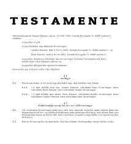
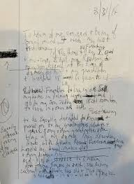

# Arveretten

```{r, echo=FALSE, results='asis'}
cat(readLines('np.html'))
```


---

**Video: Hvem arver fra dig?**

<div class="video-container"><iframe src="https://www.youtube.com/embed/ikBxcxBSBb8" width="853" height="480" frameborder="0" allowfullscreen="allowfullscreen"></iframe></div>

---

*Døden er en gæld, som ingen kan betale mere end èn gang. - Shakespeare.*

---


## Introduktion til arveretten


Med arvelovsrevisionen er der blevet gennemført en styrkelse af den længstlevende ægtefælles retsstilling.^[Følgende afsnit om arveretten bygger især på *Linda Nielsens* Karnovkommentar til arveloven, KarnovGroup.] 

---

Se nærmere **"arveloven"** i Lovsamlingen under kapitel 26:

**https://jura.tepedu.dk/lovsamling.html.**  

---

Ægtefæller vil typisk have et ønske om, at længstlevende så vidt muligt kan fortsætte sin livsførelse. 

Arveloven (AL) Lov 2007-06-06 nr. 515, er derfor søgt indrettet, så dette ønske i højere grad kan realiseres, uden at ægtefællerne behøver at oprette et testamente om begrænsning af børnenes arv.

Dette er navnlig sket ved en forhøjelse af den legale arveret, fra 1/3 til 1/2 af arveladerens ejendele, når arveladeren samtidig efterlader sig børn (livsarvinger). 

---

Arveloven indebærer endvidere, at arvelader har fået større frihed til at disponere over sin formue ved oprettelse af testamente. 

Livsarvingernes tvangsarv er således nedsat fra 1/2 til 1/4 af den legale arv.

Også ægtefællens tvangsarv udgør fremover ¼ af den legale arv.  

---

Endvidere er indført en adgang for arvelader til at begrænse en livsarvings tvangsarv til 1 mio. kr., ligesom arveladeren har fået mulighed for at bestemme, at en livsarving skal have sin tvangsarv udbetalt kontant. 

Dette indebærer, at det bl.a. bliver lettere at ligestille sammenbragte børn i arveretlig henseende, og at gennemførelsen af generationsskifter af erhvervsvirksomheder lettes.  

Herudover giver arveloven mulighed for, at ugifte samlevende på en særlig nem måde kan oprette testamente om gensidig arveret (et udvidet samlevertestamente). 

I sammenhæng med revisionen af arveloven er der blevet gennemført en række ændringer i *"forsikringsaftalelovens og pensionsopsparingslovens"* regler om indsættelse af begunstigede.  

De aktiver og passiver, som en afdød efterlader sig, kaldes et dødsbo. Afviklingen af dødsboet mellem arvinger og kreditorer kaldes et skifte. 

De arveretlige regler i arveloven fastlægger, hvem der er arvinger, og hvor meget og hvad den enkelte arving skal arve af det, der er i behold i boet. 

Efterlader afdøde sig ingen gæld, men alene aktiver, og ses der bort fra de forskellige regler om arveafgift (se boafgift og gaveafgift) mv., bliver det de arveretlige regler, der afgør, hvem arvebeholdningen, dvs. boets formue, skal tilfalde. 

De arveretlige regler medfører således en overgang af ejendomsretten til afdødes formue fra den afdøde til arvingerne. 

**Arv er en erhvervelsesmåde på linje med aftale, frembringelse mv.**

---

En betingelse for at arve er, at arvingen har overlevet arveladeren. 

Bevis for arveladerens død vil i almindelighed let kunne føres ved fremlæggelse af en dødsattest. 

Hvis en sådan ikke kan tilvejebringes, kan en domstol undertiden statuere, at en person er død eller må anses for død (såkaldt dødsformodningsdom).  

Beviset for, at arvingen har overlevet den afdøde, kan give vanskeligheder i visse tilfælde. 

Er der ikke vished for, at en bortebleven person har overlevet afdøde, afsættes kun arv til den pågældende, hvis der er nogen sandsynlighed for, at han/hun er i live. 

Er der vished for, at arvingen har overlevet afdøde, afsættes derimod arvelod, uanset om arvingens opholdssted måtte være ukendt.  

Hvis to personer, som havde arveret efter hinanden, er døde, uden at det vides, hvem der er død først, anses den ene ikke for at have overlevet den anden. 

Reglen har praktisk betydning fx ved trafikulykker, hvor ægtefæller omkommer. 

Et barn, som er avlet forinden dødsfaldet og senere fødes levende, har også arveret. 

Den gravide kvindes foster er således arveberettiget.  

Det siges, at *"arven er faldet"*, når kravet på arv kan overføres ved aftale, tilegnes af arvingens kreditorer, falde i arv ved arvingens død eller indgå i arvingens eventuelle separations- eller skilsmissebo. 

Dette tidspunkt indtræder som regel ved arveladers død. 

---

Der gælder særregler, når arveladerens efterlevende ægtefælle overtager et fællesbo til hensidden i uskiftet bo med den førstafdødes livsarvinger. 

Et *"uskiftet bo"* er	en ægtefælles overtagelse af fællesboet uden skifte med førstafdødes livsarvinger.

Sammenlevende person, som ikke er gift, kan ikke sidde i uskiftet bo.

Et *"successivt skifte af uskiftet bo"* er	udtryk for, at den længstlevende skifter med enkelte af førstafdødes livsarvinger, fx førstafdødes særbørn, efterhånden som disse bliver myndige.


---

## Oversigt over arveloven

*KAP. 1 SLÆGTNINGES ARVERET*  

*KAP. 2 ÆGTEFÆLLENS ARVERET*  

*KAP. 3 SVOGERSKABSARV EFTER EN LÆNGSTLEVENDE ÆGTEFÆLLE*

*KAP. 4 USKIFTET BO*  

*KAP. 7 AFTALE OM ARV SAMT ARVEFORSKUD*  

*KAP. 8 UDELUKKELSE OG BORTFALD AF ARVERET* 

*KAP. 9 TESTAMENTARISK BESTEMMELSE OVER TVANGSARV*  

*KAP. 10 TESTAMENTARISK BESTEMMELSE OVER FRIARV*  

*Kap. 11 OPRETTELSE OG TILBAGEKALDELSE AF TESTAMENTE* 

*Kap. 12 TESTAMENTES UGYLDIGHED OG ANFÆGTELSE*  

---
 
## Arvens fordeling til arveklasser

Arvinger kan inddeles i tre hovedgrupper: slægtninge, ægtefæller og testamentsarvinger.  


Arven fordeles til arveklasse 1, 2 eller 3. 

Er der ingen arvinger i arveklasse 1 går man videre til arveklasse 2, og er der ingen arvinger i arveklasse 2, arver arveklasse 3.  

Ægtefælle har også legal arveret. 

Arvelader kan selv få indflydelse på fordeling af arven ved at oprette testamente. 

Er der ingen arvinger efter arvelov eller testamente tilfalder arven statskassen, (på latin; "fiscus"),  jf. nærmere AL § 95, stk. 1: "Er der ingen arvinger efter loven eller testamente, tilfalder afdødes formue staten".  

---

Vores arvesystem kaldes også for *"parentelsystemet"* med	opdeling af slægten i arveklasser. 

Første parentel er arveladerens livsarvinger, hvis der ikke er nogen, så går arven videre til:

Andet parentel er arveladerens forældre og disses livsarvinger, hvis der ikke er nogen, så går arven videre til: 

Tredje parentel er arveladerens bedsteforældre og disses livsarvinger.

---


*"Skæringsdagen"* i et dødsbo	den dag, pr. hvilken dødsboet gøres op. Skal ved almindeligt privat skifte ligge senest 12 måneder efter dødsdagen.

---

### Arveklasse 1 

Arveklasse 1 er *"livsarvinger"*, som er børn, børnebørn, oldebørn osv., jf. AL § 1. 

Børnene arver lige. 

Er et af børnene døde, træder dette barns livsarvinger i stedet og arver lige ¼ af arven er tvangsarv, jf. AL § 5. 

Børns arv kan begrænses til 1 mio. kr., jf. AL § 5, stk. 2. (1.290.000 kr. i 2019).   

AL § 1 omhandler således arv til 1. arveklasse, dvs. arveladerens livsarvinger (tvangsarvinger), som er arveladerens nærmeste slægtsarvinger. 

Børnelinjen omfatter børn, børnebørn, oldebørn osv. Slægtskab foreligger mellem en mor og hendes barn og mellem barnet og den mand, der er barnets retlige far. 

Det er en forudsætning at faderskabet er fastslået inden dødsfaldet eller efterfølgende bliver det. arver lige.  

Er et barn død, træder dets børn i dets sted og arver indbyrdes lige. 

På tilsvarende måde arver fjernere livsarvinger. 

Denne såkaldte *"stirpal-grundsætning"* betyder, at arven inden for hver arveklasse fordeles i *»stammer«* og ikke efter *»hoveder«*. 

Stirpalgrundsætningen	fordelingen af arven efter stammer og linier (in stirpes et lineas). Hvis fx arveladeren efterlader sig en datter og en afdød søns 2 børn, arver datteren halvdelen af boet, mens de 2 børnebørn skal dele den anden halvdel med en fjerdedel til hver. Hvis man delte efter antal hoveder (in capita), ville de hver arve en tredjedel.

Børnebørn arver således ikke, så længe barnet lever. 

Når børnebørnene arver, må de »deles« om det afdøde barns arv - det såkaldte *»repræsentationsprincip«*. 

På tilsvarende måde arver fjernere livsarvinger (oldebørn mv.).   

---

### Arveklasse 2 


Arveklasse 2 er arveladers forældre, jf. AL § 2. Forældrene arver lige. 

Er en af forældrene død, træder dennes børn (arveladers søskende) i stedet og arver lige. Der bliver på denne måde forskel på hel- og halvsøskende. 

Arveklasse 2 er ikke tvangsarvinger, så kan arvelader selv bestemme ved testamente, hvad der skal ske med formuen. 

Hvis der ikke er oprettet testamente så følger arven arveklasserne.

Bestemmelsen i AL § 2 omhandler således arv til 2. arveklasse - forældrelinjen. 

Hvis arveladeren ikke efterlader sig livsarvinger, tilfalder arven anden arveklasse, som også kaldes *"udarvinger"*; som er arveladerens arveberettigede slægtninge, bortset fra arveladerens livsarvinger, fx afdødes forældre, søskende og søskendebørn.

Arveklasse 2 udgøres således af afdødes forældre og disses efterkommere, dvs. arveladerens søskende, nevøer og niecer osv. 

Et *"kollateralt slægtskab"* er et	slægtskab i sidelinien, dvs. hvor personer har fælles ophav, fx søskende.

Lever begge arveladerens forældre, arver de hver halvdelen, hvis arvelader ikke efterlader sig nogen livsarvinger.


---


### Arveklasse 3


Arveklasse 3 er arveladers bedsteforældre, jf. AL § 3. 

Arven fordeles med halvdelen til moderens forældre og halvdelen til faderens forældre. 

Er en af bedsteforældrene døde, træder dennes børn (arveladers faster, moster osv.) i stedet og arver lige. 

Bedsteforældre børnebørn (fætre og kusiner) arver ikke. 

Arveklasse 3 er ikke tvangsarvinger.  

Lever alle 4 bedsteforældre deles arven i 4 portioner. 

Er en af bedsteforældrene død, træder dennes børn i stedet efter *repræsentationsprincippet*. 

Arveladers farbrødre, fastre, mostre og morbrødre kan således være legale arvinger. 

Er farfaren død og efterlader sig to børn, arver disse således 1/8. 

Derimod falder arven ikke videre til fjernere livsarvinger. 

Arveladerens kusiner og fætre samt deres børn er således ikke legale arvinger.  
 
Arven mellem bedsteforældrelinien på fædrene side og bedsteforældrene på mødrene side sker efter stirpal-grundsætningen i § 2, og fordeles således ud i 1/4 til hhv. farfaren eller dennes børn, farmoren eller dennes børn, mormoren eller dennes børn samt morfaren eller dennes børn. 

Er der kun arvinger på fædrene eller mødrene side, deles arven ud med 1/2 til hver af disse eller deres børn. 

Efterlades en mormor og to fastre, arver mormoren således 1/2 og fastrene 1/4, mens fætre og kusiner ikke arver.  

  
---
 


---

**Video: Sådan fordeles arven**

<div class="video-container"><iframe src="https://www.youtube.com/embed/EIgZkPOF0_E" width="853" height="480" frameborder="0" allowfullscreen="allowfullscreen"></iframe></div>


---

## Længstlevendes ægtefælles arveret

Her en oversigt over længstlevendes ægtefælles arveret:  

*	Ægtefællen arver 1/2, hvis arvelader har børn, jf. AL § 9, stk. 1, ellers det hele jf. § 9, stk. 2. 

*	1/4 af arven er tvangsarv jf. AL § 10. 

*	Længstlevende ægtefælles har mulighed for at sidde i uskiftet, dvs.	en ægtefælles overtagelse af fællesboet uden skifte med førstafdødes livsarvinger.

*	Suppleringsarv AL § 11, stk. 2 op til 780.000 kr. (2019) – inklusive:

+	Boslod og særeje for længstlevende ægtefælle.

+	Arvelod for længstlevende ægtefælle.

+	Forsørgertabserstatning, livsforsikring, pension efter førstafdøde ægtefælle.

+	Ægtefællepension og ægtefælleydelse.

+	Ved længstlevende ægtefælles død, skal arven (som udgangspunkt) fordeles mellem begge ægtefællers arvinger, jf. AL § 16, stk. 2. 
 

---

**Video: Fordeling af arv: Ugift par uden børn**

<div class="video-container"><iframe src="https://www.youtube.com/embed/qYf2gatfAWQ" width="853" height="480" frameborder="0" allowfullscreen="allowfullscreen"></iframe></div>

---

**Video: Fordeling af arv: Ugift par med fælles børn**

<div class="video-container"><iframe src="https://www.youtube.com/embed/cDriXFDNg30" width="853" height="480" frameborder="0" allowfullscreen="allowfullscreen"></iframe></div>

---

**Video: Fordeling af arv: Ugift par med stedbørn**

<div class="video-container"><iframe src="https://www.youtube.com/embed/x7WzAOJJNXQ" width="853" height="480" frameborder="0" allowfullscreen="allowfullscreen"></iframe></div>

---


  
**Video: Arv mellem sammenlevende**

<div class="video-container"><iframe src="https://www.youtube.com/embed/WVec5BYeu34" width="853" height="480" frameborder="0" allowfullscreen="allowfullscreen"></iframe></div>

---

**Video: Fordeling af arv uden børn**

<div class="video-container"><iframe src="https://www.youtube.com/embed/bNa7tt460bY" width="853" height="480" frameborder="0" allowfullscreen="allowfullscreen"></iframe></div>

---

**Video: Fordeling af arv med fællesbørn**

<div class="video-container"><iframe src="https://www.youtube.com/embed/TXaWe8-jz9s" width="853" height="480" frameborder="0" allowfullscreen="allowfullscreen"></iframe></div>

---

*"Stedbørn"* er	de børn, som ægtefællen har med andre - kaldes også særbørn eller særkuldbørn.

**Video: Fordeling af arv: Ægtepar med stedbørn**

<div class="video-container"><iframe src="https://www.youtube.com/embed/MQ6i9G5NxUc" width="853" height="480" frameborder="0" allowfullscreen="allowfullscreen"></iframe></div>


---

**Video: Arv mellem ægtefæller**

<div class="video-container"><iframe src="https://www.youtube.com/embed/UtsI4IWmajI" width="853" height="480" frameborder="0" allowfullscreen="allowfullscreen"></iframe></div>


---

## Uskiftet bo for den længstlevendes ægtefælle

Vælger ægtefællen at sidde i uskiftet bo, får ægtefællen rådighed over alle aktiver og overtager afdødes gældsforpligtelser, jf. AL §§ 24 og 25. 

Kan kun sidde i uskiftet bo med delingsformue – særejet skal skiftes, jf. AL § 17. 

Man kan ikke sidde i uskiftet bo, hvis man ikke har været gift. 

Særbørn skal give samtykke til uskiftet bo, jf. AL § 18. 

Hvis længstlevende misbruger det uskiftede bos midler, kan børnene kræve skifte, jf. AL § 29.  

---

Længstlevende ægtefælle kan således forbruge det uskiftede bos midler og give gaver mv., men kan af hensyn til førstafdøde ægtefælles arvinger ikke råde frit. 

Spørgsmål om misbrug kan indbringes for skifteretten af førstafdødes arvinger, jf. AL §§ 29-32. 

Længstlevende ægtefælle har rådighed uden at være egentlig ejer. 

Den pågældende kan således fx stille sikkerhed, sælge aktiver hørende til det uskiftede bo og give gaver, men skal på den anden side tage hensyn til førstafdøde ægtefælles livsarvinger, idet længstlevende også råder over livsarvingernes potentielle arv efter førstafdødes ægtefælle.  

Når længstlevende dør, skal arven fordeles til begge ægtefællers livsarvinger, men der regnes ikke arv til ægtefællen, jf. AL § 28.  

---

## Arveladers testationskompetence

Testamenter giver arvelader mulighed for at få indflydelse på, hvem der skal arve, og hvad de skal arve.  

---

*Oversigt over arveladers testationskompetence*: 

Hovedreglen er, at arvelader kan ved testamente råde over hele sin formue. 

Undtagelsen er, hvis arvelader er gift og/eller har børn, er testationskompetencen begrænset af tvangsarven, jf. AL § 50.

Tvangsarven er som udgangspunkt 1/4 af arveladers formue.

---

En *"legatar"* er	en person, der skal arve en bestemt angiven pengesum eller bestemte ejendele.

---

*Testationskompetence*

```{r pie,echo=FALSE, message=FALSE,result=TRUE, fig.cap=("En fjerdedel af testators formue er tvangsarv hvis der er børn eller ægtefælle")}
library("chartjs")
chartjs(height = "300px") %>%
  cjsPie(labels = c("Tvangsarv 25%","Friarv 75%")) %>%
  cjsSeries(data = c(0.25,0.75))%>%
cjsLegend(position = "top")
```


---


*Eksempel: Tvangsarv med ægtefælle og 2 børn, formue: 1.200.000,-*

```{r pie2,echo=FALSE, message=FALSE,result=TRUE, fig.cap=("Formuen 1.200.000,- Ægtefællen arver 50% af 25% af formuen  i tvangsarv, børnene hver 25% af 25% af formuen i tvangsarv")}
library("chartjs")
chartjs(height = "300px") %>%
  cjsPie(labels = c("Ægtefælle: 12.5%","Barn 1: 6.25%","Barn 2: 6.25%","Friarv: 75%")) %>%
  cjsSeries(data = c(150000,75000,75000,900000))%>%
cjsLegend(position = "top")
```


---

*OBS: Suppleringsarv er også tvangsarv*. 

Der er tale om en tvangsarveret, der ikke kan fratages ved testamente. 

Retten til forlods udtagelse indebærer, at udtagelsen ikke belaster den længstlevende ægtefælles boslodskrav ved opgørelsen af fællesboet, og heller ikke kravet i henhold til retten til suppleringsarv. 

En længstlevende ægtefælles påberåbelse af AL § 11, stk. 1 vil kunne medføre, at et dødsbo kan sluttes uden skiftebehandling. 

Reglen vil derfor også i praksis blive påberåbt af en længstlevende ægtefælle, der som enearving ville kunne overtage hele boet efter AL § 9, stk. 2. 

---

**Video: Styr på arven: Testamente eller ej?** 

<div class="video-container"><iframe src="https://www.youtube.com/embed/5MxSyf_Ah84" width="853" height="480" frameborder="0" allowfullscreen="allowfullscreen"></iframe></div>

---

**Video: Styr på arven: Fem gode råd om testamente** 

<div class="video-container"><iframe src="https://www.youtube.com/embed/JdGPXTv0KEA" width="853" height="480" frameborder="0" allowfullscreen="allowfullscreen"></iframe></div>

1.Find ud af, hvem du vil have, der skal arve efter dig.

2.Husk, at nogle har krav på at arve efter dig.

3.Pensioner og livsforsikringer skal ikke skrives ind i dit testamente.

4.Overvej, om du vil lægge begrænsninger på din arv.

5.Husk at opdatere dit testamente, når der sker ændringer i din familie.

---

 
**Video: Hvordan opretter du et testamente?**
/
<div class="video-container"><iframe src="https://www.youtube.com/embed/TcZb7VCClcQ" width="853" height="480" frameborder="0" allowfullscreen="allowfullscreen"></iframe></div>

---

**Video:Styr på arven: Hvem får pensionen?** 

<div class="video-container"><iframe src="https://www.youtube.com/embed/F6Yourieo0Q" width="853" height="480" frameborder="0" allowfullscreen="allowfullscreen"></iframe></div>

Hvem skal have ens pension og livsforsikring, når man dør?

Det er vigtigt at huske, at pension og livsforsikring ikke skal skrives ind i ens testamente. 

Her skal man til gengæld selv lave en begunstigelse - og det er helt gratis at gøre i banken eller hos ens forsikringsselskab.

---


## Kravet til et gyldigt testamente  


---


*	at testator er fyldt 18 år (15 år for midler den umyndige selv kan råde over)

*	At testator kan handle fornuftsmæssigt

*	At testamentet opfylder kravene til:

*	*Notartestamente*

*	*Vidnetestamente*

*	*Nødtestamente*

---

Hvis der skulle være fejl i et testamente, har Domstolene mulighed for at rette og korrigere i et testamente efter romerrettens grundsætning: *"falsa demonstratio non nocet"*;	"en forkert betegnelse i et testamente af en person eller en ting skader ikke." 

Domstolene kan således rette en sådan fejl, hvis retten er sikker på, hvad testator mente.

Se nærmere om *"korrigerende fortolkning"* af et testamente, jf. arvelovens § 76:

"En testamentarisk bestemmelse, der på grund af en fejlskrift eller anden fejltagelse har fået et indhold, der afviger fra det tilsigtede indhold, skal så vidt muligt gennemføres efter sin rette mening. Hvis denne ikke kan fastslås, er den testamentariske bestemmelse ugyldig".

Den testamentariske bestemmelse skal kun gennemføres, hvis det rent faktisk er muligt med en meget høj grad af sandsynlighed at finde ud af, hvad den rette mening har været. 

Er det klart, at der er skrevet forkert, men er det ikke muligt at finde ud af, hvad der skulle have stået, må der bortses fra bestemmelsen.

---

Andre testamenteretlige begreber:

Et *"kodicil"* er et	tillæg til et testamente.

Et *"liberationslegat"* er en bestemmelse i et testamente om, at en bestemt gældspost skal eftergives ved testators død.

Et *"reciprokt testamente"* er et	gensidigt testamente, hvor opretterne begunstiger hinanden.

*"Repartition"* er en	redegørelse for fordelingen af et dødsbos midler.

*"Sekundosuccesssion"* er en	bestemmelser om, hvem arven tilfalder, når den første arving er død.

*"eksheredere"*, at	gøre arveløs.

Et *"uigenkaldeligt testamente"* er et	testamente, som ikke kan tilbagekaldes. Uigenkaldelighedserklæringen skal afgives i testamentsform og der skal desuden foreligge et bindende løfte over for arvingerne.

*"Universalarving"* er en	arving, som skal arv hele dødsboet.

---

**Video: Hvorfor skrive et testamente?**

**https://jyskebank.tv/hvorfor-lave-et-testamente**

---

### Notartestamente, jf. AL § 63



Et notartestamente er et testamente, der underskrives foran en notar. 

Notarens gebyr på 300 kr. sikrer, at testamentet bliver fundet og fulgt, når testator går bort. 

Notaren (i Byretten) påtegner testamentet og kontrollerer testators identitet, fornuft, mv.

Registrerer testamentet i Centralregistret for testamenter.

Notartestamentet er svært at anfægte i praksis.

En "bortkomstklausul" er en klausul i et notartestamente om, at den underskrevne genpart af testamentet, som opbevares i skifteretten, skal have samme gyldighed som originaleksemplaret.

---

*Nærmere om et notartestamente:*

Ved underskrift af testamente skal man udover originalen medbringe en kopi af testamentet.

Man skal medbringe billedlegitimation med cpr.nr.
 
Notaren skal sikre sig, at man forstår testamentets betydning. 

Det kan for eksempel ske ved at tale om testamentets indhold.

Det er ikke notarens opgave at godkende testamentet.

Både originalen og kopien skal skrives under hos notaren. 

Retsafgiften er som nævnt 300 kr.

Retten beholder kopien og underretter et centralt register om, at testamentet er oprettet.

---

*Om oprettelse af notartestamente - en vejledning til testator:*

Der skal udfyldes en forside til testamentet. 

Hent forsiden her:

http://www.domstol.dk/Selvbetjening/blanketter/Blanketter/Forside%20til%20testamente.pdf

Det anbefales, at blanketten udfyldes på pc.

Testamentet er gyldigt fra det øjeblik, man har underskrevet det hos notaren.

Når notaren har påtegnet testamentet, vil man eller ens advokat få det originale testamente udleveret med en påtegning om, at man har underskrevet testamentet i notarens påsyn, og at notaren har skønnet, at man fornuftsmæssigt var i stand til at oprette testamente. 

Man bør opbevare testamentet et sted, hvor det er nemt at finde. 

Hvis ens testamente indeholder bestemmelser om ens begravelse, er det en god ide, at man fortæller det til sine nærmeste.

Retten opbevarer en kopi af testamentet og sørger for at oprettelsen indberettes til et centralt register. 

Dette sikrer, at skifteretten får besked om testamentet efter ens død.

Hvis man har oprettet et testamente hos notaren, skal man også henvende sig til notaren, hvis man vil tilbagekalde eller ændre det. 

Ændring og tilbagekaldelse skal ske ved, at man opretter et nyt testamente, hvori det tidligere testamente bliver tilbagekaldt eller ændret. 

Notaren rådgiver ikke om formuleringen af et testamente. 

Formuleringen af testamentet og dets indhold kan man drøfte med en advokat.

---

*Hvad indeholder et testamente?*

Et testamente kan indeholde mange forskellige emner, alt efter hvilken slags testamente, der er tale om. 

Testamenter regulerer generelt følgende:

Parterne: Hvem efterlader arven og har de børn?

Fordeling af arven: Hvordan skal arven fordeles?

Subsidiære arvinger: Hvad gælder for sekundære arvinger?

Særeje for arvinger: Skal arven være særeje?

Indbotestamente: Hvem arver dine personlige ejendele?

Ændringer og tilbagekaldelse: Kan testamentet ændres eller tilbagekaldes?

Samlivsophævelse: Hvad sker der, hvis I går fra hinanden?

Længstlevendes testationsret: Kan længstlevende lave et nyt testamente?

Pensioner og forsikring: Hvad skal der ske med pensioner og forsikringer?

Ajourføring af testamentet: Hvordan ajourføres testamentet?

Underskrift for notaren: Hvordan skal testamentet underskrives?

---

### Vidnetestamente, jf. AL § 64


---

Et vidnetestamente er et testamente, der underskrives under tilstedeværelse af to uvildige vidner. 

I den tilhørende vidnepåtegning skal vidnerne skrive under på, at de sammen har overværet underskrivelsen af testamentet samt at testator var fornuftsmæssig i stand til at råde over sin formue ved testamente.

To vitterlighedsvidner, som ikke selv må være begunstiget i testamentet.

Vidnerne kontrollerer testators underskrift, fornuft mv.

---

*En person kan således ikke være testamentsvidne, hvis:*

* Testamentet begunstiger den pågældende eller dennes ægtefælle, samlever, beslægtede eller besvogrede i op- eller nedstigende linje, søskende eller andre nærstående. (Forlovede vil sammen med kærester og - efter en konkret vurdering - fjernere beslægtede blive anset for at være nærstående), 

* Testamentet begunstiger en person eller institution, som den pågældende ved testamentets oprettelse har en sådan tilknytning til, at testamentsvidnet har haft en særlig interesse i begunstigelsen, eller

* Der i øvrigt foreligger omstændigheder, som er egnede til at vække tvivl om den pågældendes habilitet.

Hvis et testamentsvidne har medvirket til oprettelse af et testamente i strid med AL § 64, stk. 3, nr. 1-3, er testamentet således anfægteligt. 

Bevisbyrden påhviler den, der vil arve, hvis testamentet tilsidesættes.


---

**Video: Hvad er et vitterlighedsvidne**

**https://dokument24.dk/info/vitterlighedsvidne**


---

### Nødtestamente, jf. AL § 65

*Holografisk testamente*, i dansk ret et nødtestamente oprettet uden vidner, men skrevet og underskrevet egenhændigt af testator.


---

Betingelser ved oprettelsen af et nødtestamente:

Kræver en nødsituation.

Ingen formkrav.

Bortfalder efter tre måneder.

---

En nødsituation kunne fx blodprop eller umiddelbart før en stor operation.

Andre nødstilfælde kan være et synkende skib, en naturkatastrofe, samt beslutning om selvmord, jf. nedenfor dommene om nødtestamente ved selvmord, jf. **U 1970.10 H, U 1979.108 H** og **U 2000.1340 H.**


---

**U.2019.1526 V** Testamente oprettet på dødslejet med begunstigelse af samleverske opfyldte betingelserne i arvelovens § 65 for nødtestamente:
"A, født 1938, afgik ved døden den 2. juni 2016, efter en ellers kureret kræftsygdom var vendt tilbage. A havde efter en skilsmisse siden 1984 boet sammen med S, født 1953. I slutningen af maj 2016 var det klart, at A var i den terminale fase. S havde den 23. maj 2016 ringet til en advokat, P, og bedt ham komme ud på bopælen. P, der ikke kendte A og S, kom ud til dem den 2. juni 2016 om formiddagen, og P fik at vide af en sygeplejerske, at A var i stand til at oprette testamente, men at det hastede. Der blev herefter oprettet et håndskrevet nødtestamente, hvoraf fremgik, at S skulle arve på lige fod med A’s tre børn således, at de hver især skulle arve ¼, og A underskrev testamentet. Dødsboet blev behandlet af en bobestyrer, og A’s tre børn (B1, B2, og B3) bestred, at testamentet kunne danne grundlag for skiftet. S anlagde sag mod B1, B2 og B3 med påstand om, at de skulle anerkende testamentet, idet betingelserne i arvelovens § 65 for at oprette nødtestamente havde været opfyldt. B1, B2 og B3 gjorde til støtte for frifindelsespåstanden bl.a. gældende, at S ikke havde bevist, at A havde været forhindret i at oprette et ordinært testamente, herunder et vidnetestamente, og at det var uden betydning, om testamentet var udtryk for A’s ønske. Skifteretten gav S medhold, og B1, B2 og B3 ankede dommen. Landsretten stadfæstede dommen, idet landsretten efter bevisførelsen lagde til grund, at A havde været meget afkræftet i dagene op til den 2. juni 2016, men at denne omstændighed ikke udelukkede, at han fornuftsmæssigt havde været i stand til at råde over sine ejendele på oprettelsestidspunktet. P havde forklaret, at A efter hans opfattelse var testamentshabil den 2. juni. Det kunne endvidere lægges til grund, at testamentet var udtryk for A’s vilje. S havde herefter bevisbyrden for, at A havde været forhindret i at oprette et notar- eller vidnetestamente, og denne bevisbyrde havde S løftet. Efter oplysningerne om A’s tilstand den 2. juni 2016, og da P ikke, da han kom ud på bopælen, var klar over, at testamentesoprettelsen var presserende, således at han skulle have sørget for at få en notar med, og da der ikke kunne stilles krav om, at P eller S skulle have sørget for at finde et vidne, havde betingelserne i arvelovens § 65 for at oprette et nødtestamente været opfyldt". Se hele dommen er:
**https://pro.karnovgroup.dk/document/7000834350/1**

---

**U 1970.10 H** Holografisk testamente oprettet før selvmord blev anset for et gyldigt nødtestamente:
"En 70-årig kvinde T, der var deprimeret efter en separation, tog livet af sig. I boet fandtes et af skrevet og underskrevet testamente til fordel for en broder og dennes hustru. Et tidligere oprettet testamente til fordel for et legat var påskrevet »Annulleret«. Under en af T's øvrige søskende rejst sag antoges det, at T havde befundet sig i en nødsituation, jfr. arvelovens § 44, og at hun med føje havde anset sig for forhindret i at oprette testamente i overensstemmelse med de almindelige regler. Herefter opretholdes det holografiske testamente". Se hele dommen her: **https://pro.karnovgroup.dk/document/7000213771/1**

---

**U 1979.108 H** Dokument efterladt af afdød, som havde begået selvmord, anerkendt som nødtestamente:
"A, som fra et tidligere ægteskab havde en søn, og som samlevede med B, begik selvmord og efterlod sig et af ham udfærdiget udateret dokument, der var anbragt i B's curlerpose og stilet til hende, og hvori det bl. a. hed: »Alt hvad der er, må du få« Efter det foreliggende lagdes det til grund, at A havde anbragt dokumentet i curlerposen den 12 eller 13 oktober, og det fandtes overvejende sandsynligt, af han efter at have forladt hjemmet den 13 oktober havde begået selvmord samme dag. Det lagdes herefter endvidere til grund, at A havde besluttet sig for selvmord, da han anbragte dokumentet i curlerposen, og at han da han havde befundet sig i en nødsituation som nævnt i arve lovens § 44 Dokumentet blev derfor trods indsigelse fra A's søn lagt til grund for skiftet efter A som en gyldig testamentarisk disposition vedrørende den testationsfri halvdel af A's bo". Se hele dommen **https://pro.karnovgroup.dk/document/7000208197/1**

---

**U 2000.1340 H** Holografisk testamente anerkendt, da opretteren ikke var ude af stand til at råde fornuftsmæssigt:
"T, der var født i 1930, blev i 1985 skilt fra sin ægtefælle, med hvem han havde en datter B. I 1988 flyttede han sammen med A, og efter at han havde været indlagt på hospital, psykiatrisk afdeling, oprettede han i 1990 et notartestamente, hvorefter A forlods skulle arve 10 % af hans likvide formue, mens B skulle være hans hovedarving. Ved et notartestamente i 1994 bestemte T, hvordan nærmere bestemte genstande skulle fordeles, mens B skulle arve resten. Den 5. september 1994 opregnede T en række genstandslegater, og den 26. november 1995 begik T selvmord. I et brev til en bekendt, dateret samme dag, udtalte T, at A uanset hans testamente skulle arve alt, hvad hun ønskede, før B. Der var ikke grundlag for at antage, at T, der havde skrevet brevet efter sin beslutning om at begå selvmord, i almindelighed eller ved den testamentariske disposition til fordel for A havde manglet evnen til at handle fornuftsmæssigt. A fik derfor medhold i, at hun skulle arve mest muligt". Se hele dommen her:
**https://pro.karnovgroup.dk/document/7000196579/1**




---


### Udvidet samlevertestamente

*"Udvidet samlevertestamente"* er en	betegnelse for et testamente mellem ugifte samlevende, hvor de bestemmer, at de skal arve hinanden og arves, som om de var ægtefæller, jf. AL § 87. 

For gyldigt at oprette et sådant testamente skal parterne opfylde betingelserne for at kunne indgå ægteskab med hinanden. 

Et udvidet samlevertestamente kan derfor ikke oprettes af søskende eller andre personer, der er beslægtet i op- og nedstigende linje. 

Der kan heller ikke oprettes et udvidet samlevertestamente, hvis en af parterne er gift eller part i et registreret partnerskab. 

---

Er der tale om personer af samme køn, er det endvidere en betingelse, at en af parterne er dansk (eller norsk, svensk eller islandsk) statsborger og har bopæl her i landet, eller at begge parter har haft bopæl her i landet i de sidste to år, jf. § 2 i lov om registreret partnerskab.  

Personer, der sidder i uskiftet bo, kan ikke oprette udvidet samlevertestamente.

---

Parterne skal endvidere på dødstidspunktet leve sammen sammen på fælles bopæl og  

a) vente, have eller have haft et fælles barn eller  

b) have levet sammen på den fælles bopæl i et ægteskabslignende forhold i de sidste 2 år

Samlevende har således ingen legal arveret, kræver oprettelse af testamente.

Samleverne kan arve hinanden – maksimalt 7/8 af formuen i konkurrence med børn. 

---

Samleveren kan udtage suppleringsarv.

---

Der kan udloddes svogerskabsarv efter længstlevende samlever.

Ordet *"udlodning"* betyder	udbetaling af arv i et dødsbo.

Samlevende kan ikke sidde i uskiftet bo.

Udvidet samlevertestamente skal ændres ved nyt testamente.

Udvidet samlevertestamente bortfalder ved indgåelse af ægteskab.

---

**Video: Udvidet samlevertestamente**

<div class="video-container"><iframe src="https://www.youtube.com/embed/0Ss86d4klSw" width="853" height="480" frameborder="0" allowfullscreen="allowfullscreen"></iframe></div>

---

###Indbotestamente	

Testamentarisk bestemmelse om, hvem der skal arve sædvanligt indbo og personlige effekter. 

Kan ifølge  arvelovens § 66 oprettes skriftligt af testator ved en dateret og underskrevet erklæring. 

For den, der i forvejen er arving, anses en begunstigelse i et indbotestamente for en fortrinsret til inden for sin arvelod at overtage de pågældende genstande til vurderingsbeløbet, medmindre andet fremgår af den testamentariske bestemmelse.

---

Ved indbotestamentet kan testator således i en erklæring - dvs. uden at oprette et egentligt testamente efter arvelovens §§ 63-64 bestemme, hvem der skal arve sædvanligt indbo og personlige effekter. 

Et indbotestamente kan også tilgodese personer, der ikke i forvejen er arvinger efter loven eller testamente, uanset at dette vil medføre en kvantitativ omfordeling af arven efter arveladeren. 

Pengelegater er ikke omfattet af bestemmelsen.

---

Hvis et testamente skal ændres eller tilbagekaldes, skal ændringen overholde formkravene til testamenter, jf. AL § 67.  

Et uigenkaldeligt testamente indskrænker testators testationskompetence – arvelader har ikke mulighed for at ændre testamentet. 

---

Hvis forudsætningerne for at oprette et uigenkaldeligt testamente brister eller var urigtige, kan testamentet være ugyldigt, jf. AL § 77. 

Vi skal også lige se på andre former for testamenter:

---

### Andre former for testamenter

#### Begravelsestestamente

"Begravelsestestamente" er	en erklæring om, hvilken type begravelse, man ønsker (religiøs eller ikke religiøs, ligbrænding eller jordfæstelse). 

Hverken pårørende eller myndigheder kan omgøre ens beslutning vedrørende dette. 

---

Bedemænd udleverer gratis folderen ”Min Sidste Vilje,” hvor alle ønsker til begravelsen kan noteres (musik, salmer, blomster, højtidelighed, efterfølgende samvær, gravstenens udformning, inskription, etc.).

---

#### Børnetestamente

Et "børnetestamente" er en tilkendegivelse om, hvem der skal have forældremyndigheden, hvis forældrene dør. Kræver ikke testamentsform.

I et børnetestamente kan forældrene tilkendegive, hvem de ønsker skal have forældremyndigheden over deres børn, hvis de dør, inden barnet/børnene bliver myndige. 

---

Sker det utænkelige, at begge forældre dør på samme tid, er det Familieretshuset, der vurderer, hvem der skal have forældremyndigheden over  børnene/barnet. Det vurderes ud fra, hvad der er til barnets bedste. Har forældrene oprettet et børnetestamente, vil Familieretshuset følge forældrenes ønsker - medmindre forholdene konkret taler imod.

Ved at forældrene selv tager stilling, undgår man en eventuel konflikt mellem to efterladte familier, som skal blive enige om, hvorvidt det fx er den ene forældres søster eller den andens, som skal have forældremyndigheden.

---

Er man alene med sine børn, og har man forældremyndigheden, kan man også med fordel oprette et børnetestamente. Hvis den anden forælder fortsat er i live, skal man dog være opmærksom på, at vedkommende altid har fortrinsret - medmindre særlige forhold taler imod.

Mange enlige forældre vælger at oprette et børnetestamente, fordi de gerne vil forklare, hvorfor den biologiske far eller mor ikke skal have forældremyndigheden. Så er det op til Familieretshuset at afgøre, om de vil fravige udgangspunktet, så den anden forælder ikke får forældremyndigheden.

---

Er man alene med sine børn, skal man være opmærksom på, at den efterlevende forælder har fortrinsret, medmindre særlige forhold taler imod.

Er ens børn fyldt 12 år, har de ret til at få medindflydelse på Familieretshusets afgørelse.

Der er som nævnt ikke nogen juridiske krav til, hvordan et børnetestamente skal se ud. Det kan laves som et selvstændigt dokument, hvor man selv skriver, hvem man ønsker skal have forældremyndigheden over ens børn, hvis man dør, før de er myndige. Herudover skal det indeholde en dato og underskrifter.

---

Børnetestamente kan også indgå i et “almindeligt” testamente, hvor man også tager stilling til andre vigtige ting om arvens fordeling og vilkår.

Uanset om testamentet kun indeholder ønsker om ens børn, eller om det også omhandler bestemmelser om fordelingen af arven efter forældrene, så kan testamentet underskrives for en notar. 

Når det er underskrevet for notaren, opbevares det i et centralt arkiv og kommer helt automatisk frem efter forældrenes død. Det sikrer, at Familieretshuset får kendskab til forældrenes ønsker. 


---

#### Behandlingstestamente

Med et *"behandlingstestamente"* kan man sikre, at lægerne følger ens ønsker til behandling, hvis man ikke selv er i stand til at give besked. 

Hvis man ikke har registreret sine ønsker i behandlingstestamentet, vil lægerne som udgangspunkt gøre, hvad de kan for at holde én i live. 

I behandlingstestamentet kan man registrere, at man ikke ønsker livsforlængende behandling, herunder genoplivningsforsøg ved hjertestop, hvis man kommer i en situation, hvor man ikke er i stand til selv at give udtryk for sine ønsker.

Man kan også registrere, at man ikke ønsker at modtage behandling med brug af tvang i tilfælde af, at man bliver varigt inhabil (fx hvis man bliver dement).

Ens registreringer gælder kun i det øjeblik, hvor man ikke længere selv er i stand til at give udtryk for sine ønsker. 

---

Man kan altid ændre i sin registrering.

---

Man kan bestemme, at man ikke ønsker livsforlængende behandling, herunder genoplivningsforsøg ved hjertestop, i en eller flere af følgende tre situationer:

*1. Hvis man bliver uafvendeligt døende*

Ved uafvendeligt døende forstås, at døden med stor sandsynlighed forventes at indtræde inden for dage til uger trods anvendelse af de mulige behandlingstilbud. 

Et eksempel er patienter, der er i slutfasen (terminalfasen) af en cancersygdom og ikke viser tegn på bedring eller lindring som følge af behandling.

---

*2. Hvis man ligger hjælpeløs hen pga. sygdom, ulykke mv., og der ikke er tegn på bedring*

Sygdom, fremskreden alderdomssvækkelse, ulykke, hjertestop el.lign. har medført så stor skade, at man permanent er ude af stand til at tage vare på sig selv fysisk og mentalt.

---

*3. Hvis de fysiske konsekvenser af ens sygdom eller behandling er meget alvorlige og lidelsesfulde*

Livsforlængende behandling, herunder genoplivningsforsøg ved hjertestop, kan medføre, at man overlever, men samtidig kan de fysiske konsekvenser af ens sygdom eller behandling være meget alvorlige og lidelsesfulde.

Man har mulighed for at registrere, at ens ønske om fravalg af genoplivning kun skal respekteres, hvis enten ens nærmeste pårørende, ens værge eller ens fremtidsfuldmægtige meddeler deres accept i den konkrete situation. 

Det er alene muligt at registrere for de situationer, hvor man ikke er uafvendeligt døende.

---

####Fremtidsfuldmægtig

Man kan oprette en *"fremtidsfuldmagt"*, som sættes i kraft, hvis man bliver syg eller svækket og mister evnen til at tage vare på sine personlige forhold. 

Den eller de personer, man giver fuldmagten til, er fremtidsfuldmægtig og kan handle på ens vegne.

---

Bemærk: man skal være fyldt 18 år for at oprette et behandlingstestamente. 

Når man fylder 18 år, skal ens NemID fornyes, for at man kan registrere sit behandlingstestamente. 

---

#### Plejetestamente

*"Plejetestamente"*	i et plejetestamente kan man give udtryk for, hvordan man ønsker, at et plejehjem skal varetage omsorgen for en, hvis man mister åndsevnerne (fx bliver dement). 

Testamentet kan fx omhandle ens ønsker til spisetider, beklædning, personlig pleje, make up og lignende. 

---

Der er ingen særlige formkrav. 

Myndigheder og plejepersonale bruger det som vejledning og skal så vidt muligt respektere ønskerne, men er ikke bundet af dem. 

---

#### Donortestamente

I et *"donortestamente"* tager man stilling til, om organer må fjernes og anvendes, efter at man er erklæret hjernedød. Man kan både give tilladelse og nedlægge forbud, lige som man kan donere udvalgte organer eller dem alle. 

Et donortestamente skal registreres i Donorregistret og kan oprettes på www.sundhed.dk 

---

Spørgsmål og svar om organdonation:


**https://organdonor.dk/spoergsmaal-og-svar-om-organdonation/**

---

####

## Fradømmelse af arveretten

Der kan ske en fradømmelse af arveretten for arvingen ved dennes forsætlige forbrydelse mod den afdøde.

Følgende fremgår således af arvelovens § 48:

"Når en person har begået en forsætlig overtrædelse af straffeloven, som har medført en andens død, kan det ved dom bestemmes, at den pågældende fortaber retten til at få arv, forsikringssummer, pensioner eller andre ydelser, der var afhængige af den dræbtes død. Tilsvarende kan det bestemmes, at den pågældendes arv eller andel i forsikringssummer, pension eller andre ydelser ikke må forøges som følge af lovovertrædelsen.

Stk. 2.  Den, der har forsøgt at dræbe en slægtsarving, øvet vold mod eller groft krænket den pågældende eller truet vedkommende på strafbar måde, kan efter den forurettedes anmodning fradømmes retten til arv, forsikringssummer, pensioner eller andre ydelser, der er afhængige af den pågældendes død...".

---

Bestemmelsen i arvelovens § 48 handler om fradømmelse af arveret - med en præcisering af, at bestemmelsen også finder anvendelse på forsikringssummer, pensioner, herunder kapital- og ratepensioner og andre ydelser, der kommer til udbetaling som følge af dødsfaldet, herunder fx udbetalinger fra Lønmodtagernes Dyrtidsfond.

Reglen i § 48 er fakultativ (frivillig), men det normale er fortabelse af arveretten, særlig ved forsætligt drab. 

---

Det kræves ikke, at fx et drab er begået for at arve eller på anden måde begunstige sig. 

Uagtsomt drab efter straffelovens § 241 kan ikke føre til frakendelse af arveretten, hvorimod medvirken til drab kan, uanset om straffen nedsættes eller bortfalder, fx ved straffrihed pga. psykisk abnormitet, straffelovens § 16. 

---

*Se fra retspraksis om frakendelse af arveretten:*

Se dommen i **U 2005.1545 H**. Fængsel i 12 år for drab på far. Frakendelse af arveret og ret til ulykkesforsikring:
"T, der på gerningstidspunktet var 38 år, blev fundet skyldig i manddrab ved at have tildelt sin far talrige slag med knytnæve og stump genstand samt spark m.v., hvorved faderen pådrog sig et kraniebrud og svære brystkvæstelser, der medførte, at han afgik ved døden. Nævningerne besvarede et tillægsspørgsmål om straffrihed på grund af frivillig tilbagetræden fra forsøg benægtende. Af en mentalerklæring fremgik bl.a., at T på tidspunktet for drabet havde et alkoholisk betinget blackout efter excessiv alkoholindtagelse. Straffen blev fastsat til fængsel i 12 år, og T blev desuden frakendt arveretten og retten til en ulykkesforsikring efter faderen". Se hele dommen her: **https://pro.karnovgroup.dk/document/7000306320/1** 

---

Dommen i **U 2002.2434 H** Drab af ægtefælle. 10 års fængsel for drab af ægtefælle. Udvisning:
"Den på gerningstidspunktet 35-årige T var fundet skyldig i overtrædelse af straffelovens § 237 ved en formiddag i december 2000 i en lejlighed i Brønshøj ved stump vold og kværkning at have dræbt sin ægtefælle. Han var endvidere fundet skyldig i overtrædelse af straffelovens § 244 ved i oktober 2000 at have udøvet vold mod ægtefællen. Højesteret fandt den af landsretten fastsatte straf af fængsel i 10 år passende bestemt.  T, der var thailandsk statsborger, havde i 1997 fået opholdstilladelse på grundlag af ægteskabet med den senere dræbte ægtefælle, der ligeledes var thailandsk statsborger. Han havde et særbarn født i 1982, der havde opholdstilladelse i Danmark, et særbarn født i 1988, hvis opholdstilladelse var blevet inddraget, samt med afdøde et fællesbarn født i 1998. Han havde et barn, sine forældre og 5 søskende i Thailand. Højesteret tiltrådte, at T var udvist for bestandig. Det tiltrådtes endvidere, at T var frakendt retten til arv og pensionsydelser efter ægtefællen". Se hele dommen her: **https://pro.karnovgroup.dk/document/7000253665/1** 

---

Se dommene i **U 1997.1686 H**; **U 1996.1645 H**; **U 1995.57 H**; **U 1993.921 H:** Skyldig i drab, men straffri efter straffelovens § 16 og anbringelse på hospital for sindslidende. 

---

Dommen i **U 1990.591 H** Drab på 75-årig mormor: "32-årig T, der i 1984 for blandt andet voldtægt af særlig farlig karakter var idømt fængsel i 3 år, var fundet skyldig i manddrab ved at have kværket eller stranguleret sin 75-årige mormor og tyveri ved kort efter drabet at have stjålet ca. 44.000 kr. i kontanter og guldsmykker til en samlet værdi af ca. 38.000 kr. fra mormoderens lejlighed. Nævningerne havde besvaret et tillægsspørgsmål om at anvende straffelovens § 85 på drabet benægtende. Straffen blev fastsat til fængsel i 14 år". Se hele dommen her: **https://pro.karnovgroup.dk/document/7000199157/1**

---

Dommen i **U 1946.812 H** Medvirken. T, der var K's universalarving, fik tredjemand til at dræbe K. Fængsel på livstid. Frakendt arveret:
"En Tiltalt, der efter forgæves at have forsøgt at formaa forskellige Personer til at dræbe en Kvinde, til hvis Universalarving han var indsat, sluttelig havde formaaet en Medtiltalt til at udføre Drabet, anset for Forsøg paa og Meddelagtighed i Manddrab med Fængsel paa Livstid, hvorhos han i Henhold til Ikrafttrædelseslovens § 14 fradømtes Arveret efter den dræbte". Se hele dommen her: **https://pro.karnovgroup.dk/document/7000242186/1**

--

*Se retspraksis, hvor der ikke skete fortabelse:* 

Se dommen i **U 1983.439 V** En abnorm enkeltreaktion, hvor tiltalte følte sig truet og uretfærdigt behandlet af faderen. Fængsel i 6 år for drab på far. Ej frakendelse af retten til arv.
"T, der ved en »kortslutningshandling« havde dræbt sin fader F efter at han umiddelbart forinden havde følt sig truet og uretfærdigt behandlet af F, idømtes for overtrædelse af straffelovens § 237, jf. § 85, fængsel i 6 år. En påstand om tab af retten til arv efter F blev ikke taget til følge". Se dommen her: **https://pro.karnovgroup.dk/document/7000206460/1** 

---

Dommen i **U 1981.615 Ø** Sønnerne ønskede faderen bevarede arveretten. Sindslidende, som havde dræbt sin hustru, ikke frakendt retten til at få arv efter afdøde:
"Den 56-årige T, der havde dræbt sin hustru H, og som ved kriminalrettens dom for overtrædelse af strfl. § 237 var dømt til psykiatrisk behandling på hospital for sindslidende eller under tilsyn heraf samt frakendt retten til at få arv efter H, ankede til landsretten med påstand om, at arveretten ikke frakendtes ham. Ægtefællernes 3 voksne børn, der var H's eneste livsarvinger, ønskede, at T bevarede sin arveret. Efter sagens samtlige oplysninger og det standpunkt, familien havde indtaget, fandtes T's ret til at få arv efter afdøde ikke at burde fra kendes ham". Se hele dommen her: **https://pro.karnovgroup.dk/document/7000207495/1**  


---

Arveretsfortabelse rammer kun de skyldige, ikke deres livsarvinger, som derfor får arven.

---

**Studenteropgave**

Gennemgå følgende domme om frakendelse af arveretten: **U 1997.1686 H**; **U 1996.1645 H**; **U 1995.57 H**; **U 1993.921 H**.


---

## Dødsgaver

"Dødsgave" er en	gave, som ikke kan gøres gældende, så længe giveren lever. Kræver testamentsform, jf. arvelovens § 93.

"Dødslejegave	gave", som gives på dødslejet. Kræver testamentsform, jf. arvelovens § 93, dog ikke "sædvanlige gaver", jf. arvelovens § 93, stk. 2.

---

Se ligeledes romerrettens begreb "inter vivos"; som betyder "mellem levende". Det modsatte af "mortis causa" (ved død). 

En gave er en disposition inter vivos, mens et testamente er en disposition mortis causa.

...

Ved sædvanlige gaver tænkes navnlig på fødselsdagsgaver, bryllupsgaver, konfirmationsgaver og andre gaver, som gives i anledning af en bestemt begivenhed. 

Også gaver, der ydes uden nogen bestemt ydre anledning, kan være omfattet af bestemmelsen i arvelovens § 93. 

Det forhold, at en gave er omfattet af reglen om afgiftsfritagelse i boafgiftslovens § 22, medfører ikke i sig selv, at gaven kan anses for en sædvanlig gave, og at der ikke stilles krav om iagttagelse af testamentsreglerne. 

---

Der stilles efter bestemmelsen i arvelovens § 93, stk. 2 ingen nærmere krav til gavens art, og penge kan således også anses for en sædvanlig gave. 

Ved bedømmelsen af, om der er tale om en sædvanlig gave, må der bl.a. ses på giverens indkomst- og formueforhold på gavetidspunktet, samt på, hvad der tidligere er givet som gave, og om værdien står i misforhold til giverens kår. 


Fx vil det forhold, at en døende person betænker sit barnebarn med en konfirmationsgave på 10.000 kr., iflg. motiverne (forarbejderne) til arveloven ikke kræve, at der oprettes testamente, hvis også øvrige børnebørn eller andre slægtninge er blevet betænkt med en lignende gave. 

Sædvanlige gaver mellem ægtefæller og konkurslovens regler, om lejlighedsgaver, der er undtaget fra omstødelse i konkurs, vil i øvrigt være vejledende ved den nærmere fastlæggelse af, hvad der kan anses for sædvanlige gaver.


---


**Video: Webseminar om Arv, testamenter og pensioner**

<div class="video-container"><iframe src="https://www.youtube.com/embed/exm1sAFp0dE" width="853" height="480" frameborder="0" allowfullscreen="allowfullscreen"></iframe></div>

---

## Om behandlingen af dødsboet


*Om information og vejledning om behandling af dødsboer:*

*Hvem anmelder dødsfaldet til skifteretten?*

Præsten anmelder dødsfaldet til folkeregisteret og skifteretten, som straks sender besked til skattevæsenet.

---

*Hvem skal tage sig af begravelsen?*

Normalt tager den nærmeste familie sig af begravelsen. 

Hvis der ikke er nogen familie, tager kommunen sig af sagen.

---

*Hvad må de pårørende, inden de pårørende har været i skifteretten?*

Indtil skifteretten har taget stilling til, hvordan boet skal behandles, skal de pårørende sørge for, at afdødes værdier bliver opbevaret betryggende. 

Inden da må familien ikke begynde at dele eller sælge afdødes ting eller betale regninger.

---

Når skifteretten har taget stilling til boets behandling, udsteder skifteretten en skifteretsattest som bevis for, at de, der overtager boet, har ret til at råde over afdødes formue.

---

*Skifterettens behandling*

Skifteretten vil kontakte kontaktpersonen i boet ca. 4 uger efter dødsfaldet.

I nogle tilfælde kan sagen behandles ved et telefonmøde med en medarbejder fra skifteretten. 

I andre tilfælde vil det være nødvendigt med et møde i skifteretten.

---

*Boudlæg*

Hvis afdødes formue ikke overstiger 45.000 kr., kan boet blive behandlet som boudlæg.

---

*Ægtefælleudlæg*

Hvis afdødes og ægtefællens samlede formue ikke overstiger 780.000 kr., bliver hele boet udlagt til ægtefællen.

---

*Uskiftet bo*

Hvis afdøde efterlader sig børn, kan ægtefællen sidde i uskiftet bo.

En ægtefælle har således ret til at få boet efter sin afdøde ægtefælle udleveret til uskiftet bo med fællesbørnene. 

Hvis afdøde havde børn med andre end ægtefællen (særbørn), kan ægtefællen også være i uskiftet bo med dem, hvis de giver deres samtykke.

---

Ægtefællen skal påtage sig at betale afdødes gæld.

Der skal indrykkes en annonce i Statstidende (et proklama), hvor kreditorer bliver bedt om at anmelde deres tilgodehavende inden 8 uger. 

Hvis ægtefællen fortryder at have påtaget sig afdødes gæld, skal ægtefællen, inden 8 ugers fristens udløb, henvende sig til skifteretten.

Det koster 500 kr. i retsafgift at få boet udleveret til uskiftet bo.

---

Man kan ikke få boet udleveret til uskiftet bo, hvis:

1. Afdøde og ægtefællen kun havde særeje.

2. Afdøde ikke havde børn.

3. Afdøde eller ægtefællen er insolvent.

4. Boet kan behandles som  boudlæg og normalt heller ikke, hvis boet kan behandles som ægtefælleudlæg. 

---

**Video: Styr på arven: Uskiftet bo kan blive dyrt** 

<div class="video-container"><iframe src="https://www.youtube.com/embed/Fuag5hpZ9Ik" width="853" height="480" frameborder="0" allowfullscreen="allowfullscreen"></iframe></div>

---

Se link her:

Om boudlæg: 

**http://www.domstol.dk/saadangoerdu/doedsfald/dodsbo/boudlaeg/Pages/default.aspx**

---

Om ægtefælleudlæg: 

**http://www.domstol.dk/saadangoerdu/doedsfald/dodsbo/aegtefaelleudlaeg/Pages/default.aspx**

---

*Skattemæssige konsekvenser*

Valg af skifteform kan have stor betydning for ægtefællens og arvingernes skattemæssige forhold.

Læs mere om dødsboskat i SKAT´s vejledning, som man kan finde her eller søg råd hos revisor eller advokat:

**https://www.skat.dk/skat.aspx?oid=133802&chk=216282**

---

*Privat skifte*

Hvis arvingerne er enige om det, kan boet skiftes privat. 
 
Hvis der ikke skal betales boafgift, kan boet behandles som forenklet privat skifte. 

---

Hvis ægtefællen er enearving, gælder særlige regler for et forenklet privat skifte.

Arvinger, der er enige om det, kan således vælge at skifte privat. 

Det betyder, at man skal være enige om, hvordan boet skal deles, herunder hvem der er arvinger.

---

Mindst en af arvingerne skal være myndig og solvent og skal underskrive en erklæring på tro og love herom.

Arvingerne skal udpege en kontaktperson, som skifteretten, skattevæsenet og andre, der skal i forbindelse med boet, kan henvende sig til.

---

Arvingerne skal selv lave opgørelse i boet og dele arven imellem sig.

Hvis der er umyndige arvinger eller arvinger, der ikke er i stand til at klare sig selv, skal disse arvinger have en værge eller skifteværge.

Retsafgiften er 2.500 kr., hvis den samlede arv er under 1.000.000 kr., og 9.000 kr., hvis arven er over 1.000.000 kr.

---

Arvingerne skal indlevere anmodning om privat skifte og solvenserklæring til skifteretten, inden skifteretten kan udstede skifteretsattesten.

Åbningsstatus skal indsendes til skifteretten senest 6 måneder efter dødsdagen (dog senest 2 måneder efter at boet er udleveret). 

---

Åbningsstatus skal indsendes i to eksemplarer, der begge skal være underskrevet af samtlige arvinger.

Endelig boopgørelse skal indleveres til skifteretten inden 15 måneder efter dødsdagen.

---

*Skattemæssige konsekvenser*

Valg af skifteform kan have stor betydning for ægtefællens og arvingernes skattemæssige forhold.

---

**Video: Hvad koster det at arve?**

<div class="video-container"><iframe src="https://www.youtube.com/embed/Va5cNkBjT_M" width="853" height="480" frameborder="0" allowfullscreen="allowfullscreen"></iframe></div>

---

Når man arver, skal man betale det, der hedder "boafgift". Det, der tidligere hed arveafgift. Der findes tre afgiftsklasser:

• 0 pct. = Ægtefælle.

• 15 pct. = Samlever, hvis man har boet sammen i minimum to år, børn, børnebørn, oldebørn, forældre.

• 15 pct. + 25 pct. = Søskende, niecer, nevøer, bedsteforældre, tanter og onkler.

---

Men der findes et bundfradrag på 276.600 kr. pr. bo, som er afgiftsfri.

Hvis man gerne vil undgå afgiften, kan det være en mulighed at give gaver, mens man lever, i stedet for at vente til man dør. 

Den nuværende grænse (2019) for gaver for nærbeslægtede er 61.500 kr. pr. person.

---


*Bobestyrerbo*

Hvis der ikke foreligger andre muligheder, bliver boet behandlet som bobestyrerbo. 

Det gælder også, hvis der er uenighed mellem arvingerne.

---

Se link her: *Hvornår skal et bo behandles af en bobestyrer?*: 

**http://www.domstol.dk/saadangoerdu/doedsfald/dodsbo/bobestyrerbo/Pages/default.aspx**

---

*Boer efter udlændinge (tidligere kaldet "henvisningsboer")*

Se link her:

**http://www.domstol.dk/SAADANGOERDU/DOEDSFALD/DODSBO/UDLAENDINGE/Pages/default.aspx**

---

*Vejledning til til værger og skifteværger* 

Se link her:

**http://www.domstol.dk/SAADANGOERDU/DOEDSFALD/DODSBO/VAERGER/Pages/default.aspx**

---

*Klage over skifterettens afgørelser*

Man kan klage over skifterettens afgørelser til landsretten.

---

**Video: Styr på arven: Undgå spærret konto ved død**

<div class="video-container"><iframe src="https://www.youtube.com/embed/_TmFA4SLd0U" width="853" height="480" frameborder="0" allowfullscreen="allowfullscreen"></iframe></div>

---

**Video: Undgå famliestrid**

<div class="video-container"><iframe src="https://www.youtube.com/embed/yr6A6wguEA8" width="853" height="480" frameborder="0" allowfullscreen="allowfullscreen"></iframe></div>

---


## Quiz om arveretten

<h3><a href="https://quiz.tepedu.dk/jura24" target="_blank">Quiz Arveretten</a></h3>


---


