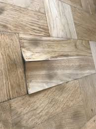

# Test

### <font color="red">Bygningsforsikringen<sup> Premium </font></sup> 


*Bygningsforsikringen*

En bygningsforsikring eller også benævnt som en husforsikring, villaforsikring, parcelhusforsikring eller husejerforsikring. 

Til bygningsforsikringen er også knyttet en ansvarsforsikring samt en retshjælpsforsikring. 

Man kan også have fritidshusforsikring. Bygningsforsikringen må ikke forveksles med en ejerskifteforsikring eller en såkaldt byggeskadeforsikring.  

Det er policen og forsikringsbetingelserne, der sætter rammen for, om man som forsikringstager kan få dækning, og hvad man som forsikringstager i givet fald kan få i erstatning.

Bygningsforsikringen dækker typisk skader på huset, der skyldes brand, kraftig storm, voldsomt tøbrud eller indbrud. 

Nogle forsikringer dækker også visse former for rådskader, mens andre dækker alle former for pludselig skade.

Forsikringsankenævnet opfordrer til, at man læser policen og forsikringsbetingelserne grundigt for at være sikker på, hvilke dækninger man har.

Bygningsforsikringen indeholder nogle undtagelsesbestemmelser. 

Der er ofte undtagelser for skader, som skyldes manglende vedligeholdelse af bygningen, eller hvor bygningen har konstruktionsfejl, som er hovedårsagen til skaden. 

Man skal være opmærksom på, at ens forsikringsbehov kan ændre sig med tiden. F.eks. skal man normalt tegne en tillægsforsikring, hvis man bygger om. 

Ændrer man tagbelægning, etablerer solceller eller bygger til, skal forsikringsselskabet have besked, da man i modsat fald risikerer ikke at få erstatning for en skade eller delvis erstatning.  


---

Når man anmelder et krav til sit bygningsforsikringsselskab, skal man bevise, at der er en skade på ens hus, som er dækket af forsikringen. 

Er man uenig med selskabet om, hvad reparationen koster, skal man også bevise, at reparationen er dyrere, end hvad selskabet har tilbudt.

Anmelder man en skade på sit hus, vil selskabets taksator ofte besigtige huset en eller flere gange eller lade det besigtige af en særlig byggesagkyndig, som kan være med til at belyse skadens forhold.

Bliver man uenig med selskabet om vurderingen af den anmeldte skade, kan der være behov for, at man selv indhenter en sagkyndig erklæring, hvori en sagkyndig beskriver fejl, udbedringsmetode og eventuelt udbedringspris.

Det er ofte et krav, at den sagkyndige har en god faglig indsigt og forholder sig sagligt til sagen. 

Det kan f.eks. være en bygningsingeniør, arkitekt eller en bygningskonstruktør. Udtalelser fra en håndværker kan også anvendes. 

Man bør være opmærksom på, at udtalelser fra håndværkere ikke altid kan tillægges samme bevismæssige værdi som en udtalelse fra en uafhængig byggesagkyndig.

Det kan være tilfældet, hvis håndværkeren udtaler sig om forhold, som han tidligere selv har været med til at udføre, eller hvis håndværkeren kan forvente, at han skal udbedre den skade, som man har bedt ham om at udtale sig om. 


Medmindre andet er aftalt med selskabet, skal man selv betale for den sagkyndige erklæring, man indhenter. 

Viser undersøgelsen, at der er en skade, som selskabet skal give erstatning for, kan man som udgangspunkt kræve, at selskabet refunderer ens udgifter til undersøgelsen i rimeligt omfang.

Anmelder man f.eks., at et skjult vandrør muligvis er læk på en udvidet rørskadeforsikring, vil selskabet normalt bede én om at kontakte en VVS-installatør og få trykprøvet sine rør. 

Viser det sig, at der ikke er utætheder i rørsystemet, skal man normalt selv betale regningen for trykprøvningen. 

Viser undersøgelsen omvendt, at der er dækningsberettigende utætheder, skal selskabet ud over reparationen af skaden også betale for udgiften til trykprøvningen.

Mange selskaber udarbejder i forbindelse med taksators besigtigelse en skriftlig aftaleseddel, så der ikke senere opstår tvivl om priser og det godkendte skadeomfang. 

Det er en fordel for forsikringstageren at bede om at få tilsagn eller lignende på skrift, så der ikke efterfølgende opstår tvivl om, hvad forsikringstageren og taksatoren er blevet enige om.

Hvis ens håndværker under reparationen finder ud af, at det bliver dyrere at reparere skaden, end hvad man har aftalt med selskabet, er det vigtigt, at man straks kontakter selskabet og får selskabets accept af de forøgede omkostninger. 

Også selvom det betyder, at reparationen midlertidigt må standses.

---

Det, som forsikringstageren opfatter som én skade, er ikke nødvendigvis én skade, men kan være flere skader, for hvilke der opkræves en selvrisiko pr. styk. 

Se eksempelvis **sagsnr.: 85631.** Klager over opkrævning af 3 gange selvrisiko. Råd i tre remender: 
"Klager anførte, at en remende var en “byggedel” og ikke en “bygningsdel”. Af forsikringsbetingelserne fremgik, at der opkrævedes 1 selvrisiko pr. bygningsdel. Selskabet anførte, at der er tale om bygningsdele. Klager havde i år 2005 haft samme skade, hvor 3 remender var ramt af råd. Samme selskab dækkede i 2005 skaden og opkrævede kun 1 selvrisiko. Nævnet udtalte, at en rem var en bygningsdel, og at selskabet i henhold til forsikringsbetingelserne havde været berettiget til at opkræve 3 x selvrisiko, uanset klageren ved tidligere oplevet skade alene blev opkrævet 1 x selvrisiko. Selskab medhold".

---

Er man som forsikringstager uenig i selskabets afgørelse, er det en god idé at tale med taksatoren eller sagsbehandleren i selskabet om, hvad man skal gøre for at bevise, at man har ret. 

Er man stadig utilfreds, kan man kontakte selskabets klageansvarlige, hvis man mener, at taksatoren og sagsbehandleren når til et forkert resultat.

Man skal altid have klaget til selskabet over dets afgørelse, før man kan klage til Ankenævnet. Forsikringsselskabet skal med andre ord have haft en ekstra mulighed for at imødekomme ens krav, før man kan klage til Forsikringsankenævnet.

Klager man til Ankenævnet, er det en stor hjælp for Ankenævnet, hvis man forklarer præcist, hvilken bygningsdel der er tale om, og hvad der er galt med den. 

Hvis der er mere end én skade, er det vigtigt, at man beskriver hver skade for sig. 

Husk, at Ankenævnet ikke kender ens hus, så det er en god ide at være så præcis i beskrivelserne som muligt over for nævnet i klagesagen. Tegninger og fotos kan være en stor hjælp for sagsbehandlingen i Ankenævnet.

---

*Hvilke skader der kan blive erstattet*

Det er policen og forsikringsbetingelserne, der sætter rammen for, om man kan få dækning på bygningsforsikringen, og hvad man i givet fald kan få i erstatning.

For at få erstatning skal man som forsikringstager bevise, at der er sket en forsikringsbegivenhed, der er omfattet af forsikringen – eksempelvis brand, storm eller pludselig skade.

Bygningsforsikringen indeholder nogle undtagelsesbestemmelser. 

Det er ofte undtagelser for skader, hvor skaden skyldes manglende vedligeholdelse af bygningen eller konstruktionsfejl. 
Det vil som udgangspunkt være et krav, at en konstruktionsfejl er hovedårsagen til skaden for anvendelsen af undtagelsesbestemmelsen.

Har man bevist, at der er sket en skade omfattet af en dækningsbestemmelse, og påberåber selskabet sig en undtagelsesbestemmelse, har forsikringsselskabet bevisbyrden for, at betingelserne i undtagelsesbestemmelsen er opfyldt.

Bygningsforsikringen dækker normalt kun skader, der sker, mens forsikringen er i kraft, og kun skader på ens hus og i visse situationer på enn grund. 

Har man fået skade på sit indbo, må man søge dækning via familieforsikringen. 

Er skaden opstået, inden man overtog huset, eller skyldes den en konstruktionsfejl, bør man kontakte sit *ejerskifteforsikringsselskab*, se om *ejerskifteforsikringen* nedenfor.

---

Sædvanligvis dækker bygningsforsikringen skader, der opstår på huset på grund af

* brand, eksplosioner og direkte lynnedslag.

* kortslutningsskader på ejendommens hårde hvidevarer og installationer.

* vejrligsskader på grund af storm, voldsomt skybrud og voldsomt tøbrud.

* udstrømning af vand fra røranlæg. 

---


Herudover kan man tegne tillægsdækning på bygningsforsikringen for eksempelvis

* skader på huset som følge af insekter, svamp og nogle gange også råd.

* brud på kloakker og stikledninger på grunden.

* vandskader fra skjulte rør inde i huset.

---


Nogle bygningsforsikringer dækker "anden pludselig skade". 

Det er et krav, at skadevirkning og skadeårsag sker pludseligt og samtidigt, og at skadeårsagen er udefra kommende. 

Skader, der sker ved almindelig brug, som f.eks. ridser, skrammer, spild af væsker osv. er som regel undtaget på bygningsforsikringen.

Hvis et vandrør udsættes for tæring og sprænges, hvorved der strømmer vand ud og forårsager vandskade, er skaden på røret ikke en pludselig skade. 

Derimod er vandskaden en pludselig skade.

---

*Om bygningsforsikringen giver den rigtige erstatning*

Forsikringstagerens erstatning skal som udgangspunkt fastsættes til reparationsprisen med fradrag af den selvrisiko, der fremgår af ens police.

Reparationsprisen fastsættes som udgangspunkt ud fra, hvad det vil koste at genoprette det beskadigede ud fra samme byggemåde og materialevalg, som oprindeligt er anvendt på ens hus. 

Man kan derfor ikke kræve en løsning, der er mere tidssvarende end den gamle, eller udtrykt som ”Man kan ikke få nyt for gammelt”. 

Ofte kan man aftale med bygningsforsikringsselskabet, at der foretages en mere tidssvarende løsning, og at man så selv betaler merprisen.

Hvis man ønsker erstatningen udbetalt til fri rådighed, kræver det normalt en særlig aftale med selskabet. 

Erstatningen opgøres i så fald efter dagsværdi, det vil sige med fradrag af værdiforringelse på grund af alder og slid, og kan ved større skader normalt heller ikke overstige handelsværdien før skaden. 

Ved større skader forudsætter udbetaling til forsikringstagerens frie rådighed normalt, at han eller hun indhenter panthavernes samtykke til, at der ikke foretages reparation eller genopførelse.

---

I sjældne tilfælde kan man få erstatning svarende til, at reparationen sker i overensstemmelse med det aktuelle bygningsreglement. 

Det er tilfældet, hvis man kan bevise, at der er tale om en så omfattende reparation, at byggeriet efter lovgivningen vil blive omfattet af nyeste bygningsreglement eller stærkstrømsbekendtgørelse. 

Man skal dog også bevise, at kommunen ikke vil give dispensation, således at ens byggeri ikke behøver at opfylde det nyeste lovkrav. 

Det er de færreste skader, man kan få erstattet efter disse regler, der kaldes lovliggørelseserstatning. 

Forsikringen kan indeholde et loft over, hvor stort et beløb selskabet skal udbetale i lovliggørelseserstatning.

Hvis der er tale om sliddele på huset, kan forsikringsselskabet normalt foretage fradrag i erstatningen i form af *afskrivning*, så forsikringstageren selv betaler for en andel af reparationsudgiften. 

Det skyldes, at man ved udskiftning eller reparation af nogle bygningsdele kan opnå en forbedring af huset, og at man som følge heraf vil kunne mindske sine udgifter til fremtidig vedligeholdelse af den reparerede del af huset.

Forsikringsankenævnet gør hertil opmærksom på, at det ikke kun er materialerne, forsikringsselskabet kan afskrive på, men også f.eks. arbejdsløn. 

Hvis bygningsdelens levetid ikke forlænges som følge af reparationen, eller reparationen ikke har karakter af sædvanlig løbende vedligeholdelse af bygningsdelen, kan selskabet normalt ikke afskrive. 

Skal nogle få tagsten eksempelvis udskiftes på ens tag som følge af en stormskade, vil dette ikke bevirke, at tagets levetid forlænges.

---

Bygningsforsikringsselskabet kan derfor ikke afskrive i en sådan situation. 


Se f.eks. **Ankenævnets sagsnr.: 48276** (selskabet var uberettiget til at afskrive på udgift til tapetsering af en ud af fire vægge), 

**Sagsnr.: 57310** (selskabet var uberettiget til at afskrive på udgift til 55 kvadratmeter partiel reparation af stråtag på 135 kvadratmeter), og 

**sagsnr.: 79280** (selskabet var uberettiget til at afskrive på udskiftning af ”skallen” på et spabad).

**Sagsnr.: 48276.** Hus – Reparation efter vandskade – Udstrømmende vand fra cisterne fra overbo – Selskabet kan vælge mellem to erstatningsforslag.

---


**Sagsnr.: 57310.** Hus – afskrivning på stråtag: 
"Klager over størrelsen af tilbudt erstatning efter stormskade på et stråtag. Klageren gør gældende, at selskabet ikke er berettiget til at opgøre skaden med udgangspunkt i, at taget var ca. 25 år, idet klageren kan dokumentere, at der har været udført tækkearbejde i 1993. Nævnet udtaler, at det lægges til grund, at der er foretaget en partiel reparation (55 m²) af den sydvendte tagflade på 135 m². Det er nævnets opfattelse, at reparationen ikke medfører en sådan forbedring (forøgelse af tagfladens levetid), at selskabet er berettiget til at foretage afskrivning. Selskab medhold".


---


**Sagsnr.: 79280.** Klager over selskabets afskrivning på reparationsomkostninger vedrørende et spabad: 
"Selskabet havde anerkendt skaden som dækningsberettigende, men havde afskrevet 50 % på reparationsomkostningerne med henvisning til, at der bl.a. var forudbestående skader på spabadets skal. Nævnet fandt, henset til at selskabet havde anerkendt skaden og ikke havde undersøgt skadeårsagen, at selskabet i sin erstatningsopgørelse og i sin argumentation over for nævnet ikke havde det fornødne grundlag for at lægge til grund, at skaden på spabadet var en kombination af ikke dækningsberettigende skader og dækningsberettigende skader. Selskabet var derfor uberettiget til at nedsætte erstatningen med denne begrundelse. Herefter var der alene tilbage at vurdere, om selskabet kunne foretage almindelig aldersafskrivning. Efter det oplyste, hvor det alene var skallen på spabadet, der var udskiftet, og der ikke var angivet oplysninger om, at denne udskiftning ville forlænge spabadets forventede levetid, eller reducere de forventede vedligeholdelsesudgifter væsentligt, fandt nævnet det betænkeligt at fastslå, at selskabet havde været berettiget til at foretage afskrivning. Klager medhold.
Sædvanligvis kan bygningsforsikringsselskabet kun aldersafskrive, hvis værdiforringelsen som følge af alder og slid er over 30 %. Højesteret har i afgørelsen trykt i Ugeskrift for Retsvæsen 2006.544 udtalt, at værdiforringelsesprocenten skulle beregnes på grundlag af den samlede værdi af de bygningsdele, der blev beskadiget ved forsikringsbegivenheden. Da det ikke var godtgjort, at værdiforringelsen beregnet af den samlede værdi af det beskadigede oversteg 30 % af nyværdien, var der ikke grundlag for at reducere erstatningen til dagsværdi".

---


**U 2006.544 H:** A fik i 1998 sin ejendom forsikret til fuld- og nyværdi hos et forsikringsselskab F: 
"F havde besigtiget ejendommen og ikke taget forbehold for eventuelle konstruktionsfejl. Efter en stormskade i 1999 afslog F at erstatte skader på bygningsdele, der havde konstruktionsfejl, og opgjorde erstatningen efter dagsværdi for skader på bygningsdele, hvis værdi før skaden var forringet med 30 % af nyværdien. Højesteret fastslog, at et forsikringsvilkår om dagsværdierstatning måtte forstås således, at værdiforringelsesprocenten skulle beregnes på grundlag af den samlede værdi af de bygningsdele, der blev beskadiget ved forsikringsbegivenheden. Da det ikke var godtgjort, at værdiforringelsen beregnet af den samlede værdi af det beskadigede oversteg 30 % af nyværdien, var der ikke grundlag for at reducere erstatningen til dagsværdi. Den omstændighed, at forsikringsselskabet havde besigtiget ejendommen i anledning af tegning af en sædvanlig bygningsforsikring og ikke taget forbehold for konstruktionsfejl, udelukkede ikke, at selskabet i forbindelse med en erstatningssag kunne afslå dækning under henvisning til konstruktionsfejl. Et vilkår i policen om, at erstatning udbetales, når de ødelagte bygninger var istandsat, måtte forstås som en aftale om forfaldsdagens indtræden. Da bygningerne ikke var istandsat, var der ikke grundlag for at lade erstatningen forrente".

---

Se også **sagsnr.: 85454**. Sagen vedrørte et nyere hus, der var funderet på træpæle, som var rådnet væk: 
"Selskabet ville afskrive reparationsudgiften inklusive udgiften til at fjerne gulve mv. med 80 % under henvisning til pælenes forventede levetid. ”Nævnet fandt, at der ikke kunne afskrives. Afgørelsen må forstås således, at udgiften til at fjerne i øvrigt ubeskadigede bygningsdele og ny-/genmontere dem indgår på lige vilkår med egentligt beskadigede bygningsdele i opgørelsen af, om værdiforringelsen er over 30 %".

---

Man bør læse sine forsikringsbetingelser for at se, om der er særlige regler om afskrivning. 

Nogle forsikringsselskaber har udarbejdet afskrivningstabeller, som gælder for udvalgte bygningsdele, f.eks. hårde hvidevarer. 

Forsikringsbranchen har udgivet levetidstabeller med vejledende levetider for forskellige bygningsdele.

Bygningsforsikring indeholder regler om selvrisiko. Det vil sige, at man selv skal betale en del af skaden. 

Forsikringsselskabet må derfor foretage fradrag af selvrisikoen, før de udbetaler erstatningen til forsikringstageren. 

---

Selvrisikoen fremgår af policen eller af forsikringsbetingelserne. 

Selvrisikoen gælder pr. skade.

Er ens hus totalskadet, fastsættes erstatningen som udgangspunkt til, hvad et nyt hus magen til det skadede koster at bygge. 

Man skal være opmærksom på, om der i policen er fastsat en forsikringssum for bygningen, eller om den er sumløs. 

Som regel er det kun udhuse, landbrugsbygninger og lignende, der er sumforsikrede.

De fleste bygningsforsikringer indeholder en regel, som under visse forudsætninger gør det muligt at anse bygningen for totalskadet, hvis den er mere end f.eks. 50 % skadet. 

Er dette tilfældet, har forsikringstageren valget mellem at få bygningen repareret eller få bygget en ny.

Også ved totalskadede huse kan forsikringsbetingelserne bestemme, at erstatningen fastsættes ud fra, hvad det vil koste at bygge et nyt hus ud fra samme byggemåde og materialevalg, som oprindeligt er anvendt på ens hus. 

Det nye hus skal naturligvis opfylde kravene i det aktuelle bygningsreglement, også selv om det betyder, at der må anvendes dyrere byggemåde eller dyrere materialer. 

Forsikringen kan dog også i denne situation indeholde et maksimum for, hvor stor en andel/beløb, der dækkes for at sikre, at huset er "lovligt" efter byggelovgivningen.

Som udgangspunkt udbetales der kun erstatning, hvis bygningen repareres eller genopføres. 

Dette skyldes, at der typisk er panthavere, der – ud over ejeren af huset – har interesse i at få bygningen repareret eller genopført, så den har samme værdi som før. 

Er der ikke sådanne panthavere, eller giver de alle samtykke, kan forsikringstageren normalt få erstatningen udbetalt kontant til fri rådighed. 

---

I disse tilfælde opgøres erstatningen dog til dagsværdi. 

*Dagsværdi* betyder, at der kan foretages fradrag på grund af alder og slid. 

En *kontanterstatning* kan ikke overstige den beskadigede bygnings handelsværdi, umiddelbart før skadens indtræden, ligesom en række tillægserstatninger som restværdi og lovliggørelse ikke udbetales.'

---

Hvis skaden på ens hus bevirker, at man ikke kan bo i det i en periode, er der normalt en dækning for genhusningsomkostninger. Det er kun rimelige meromkostninger, man kan få dækket, og man skal kunne dokumentere de afholdte meromkostninger over for forsikringsselskabet.

---

*Mangelfuldt arbejde*

Hvis der opstår uenighed om mangler ved det arbejde, som håndværkerne har udført, er det som udgangspunkt en sag mellem forsikringstageren og de pågældende håndværkere.

Forsikringsselskabets rolle er at betale regningen for reparationen. 

Man kan eventuelt klage over håndværkerne til *Byggeriets Ankenævn.*

Nogle gange anfører forsikringstageren, at det var *taksatoren* (den person fra forsikringsselskabet der gør skaden op), der anbefalede håndværkeren. 


Hvis dette blot er sket, fordi forsikringstageren ikke selv har kendskab til en håndværker, der kan udbedre skaden, gør dette ingen forskel.

Har taksatoren betinget sig, at en bestemt håndværker udbedrer skaden, eller er der tale om håndværkere, som forsikringsselskabet har en samarbejdsaftale med om at udbedre forsikringsskader for dem, er det som udgangspunkt forsikringsselskabet, der må sørge for, at håndværkeren retter manglerne, eller i værste fald sørge for, at en anden håndværker retter manglerne.

---

Se mere om denne problemstilling, hvortil Forsikringsankenævnet henviser i eksempelvis **sagsnr.: 57445, 73810, 81805, 86144 og 86219:**

**Sagsnr.: 57445.** Klager over afslag på erstatning for fejl ved reparationsarbejde i forbindelse med en dækningsberettigende rørskade: 
"Selskabets taksator fravalgte den af klager forslåede murer, hvis overslag han fandt for højt. Herefter kontaktede taksator en anden murer, hvis tilbud han accepterede og henviste videre til klager. Mureren oplyste klager ved første henvendelse at have fået overdraget arbejdet og forestod i efterforløbet kontakten til de øvrige håndværkere, herunder elinstallatør og VVS-mand. Under disse omstændigheder finder nævnet, at det er selskabet, der har kontraheret med mureren, som efterfølgende har forestået kontakten til de øvrige håndværkere. Nævnet finder derfor, at selskabet må forestå udbedringen af fejlen. Klager medhold".

---

**Sagsnr.: 73810.** Klager over, at selskabet anså klager for bygherre i forbindelse med udført tømrerarbejde, som var udført pga. en skade: 
"Klager var endvidere utilfreds med omfanget af en råd- og svampeskade samt over istandsættelsen af badeværelse, der var sket med mindre fliser. Klager havde tegnet husejerforsikring. Nævnet fandt, at det ikke var praksis, at selskaber påtog sig bygherrerollen eller kontrollerede byggeriets kvalitet. Nævnet fandt det ikke godtgjort, at selskabet havde accepteret at være bygherre eller ved sin ageren havde påtaget sig rollen. Nævnet kunne derfor ikke kritisere, at selskabet havde henvist klageren til entreprenøren vedr. sine mangelindsigelser. Ifølge § 14 i nævnets vedtægter måtte hver part afholde egne omkostninger i forbindelse med en klage til nævnet, hvorfor selskabet ikke kunne pålægges at betale klagegebyret. Selskab medhold".

---

**Sagsnr.: 81805** Klager over afvisning af dækning til etablering af flisefodspark under skab samt smal fliserække langs badekar, gulvrist og kanter: 
"Skaderne har forbindelse med en udbedret større skade, som selskabet har erstattet. Klagerne gør gældende, at de ikke har været involveret i udbedringsarbejdet eller bestilling af håndværkere mv. Selskabet gør gældende, at der ikke er tale om dækningsberettigende skader, og at klagerne må rette kravet mod de udførende håndværkere. Nævnet finder, at selskabet har påtaget sig at forestå udførelsen af reparationsarbejdet, hvorfor selskabet som udgangspunkt må påtage sig at dække udgifter ved mangler. Nævnet finder imidlertid at måtte lægge vægt på, at der blev afholdt afleveringsforretning i januar 2008, og at klagerne først rettede henvendelse til selskabet vedrørende de – ganske synlige – påklagede forhold i december 2010, altså næsten tre år efter afleveringsforretningen. Uanset om den påklagede fugebredde mellem fliserne i badeværelset forelå på tidspunktet for overtagelsesforretningen, eller om den først opstod i forbindelse med, at badeværelsesgulvet "kort tid efter" blev lagt om, finder nævnet, at den tid, der forløb indtil anmeldelsen til selskabet, har umuliggjort selskabets eventuelle udbedringskrav over for håndværkerne, og at klagerne må bære risikoen herfor. Selskab medhold".

---


**Sagsnr.: 86144.** Klager over behandling af en vandskade. Klager mente, at udbedringen efter vandskaden var utilstrækkelig: 
"Selskabets taksator havde anvist udbedringsmetoden. Nævnet fandt, at gulvet var blevet udtørret forsvarligt, inden selve udbedringsarbejdet blev igangsat. Nævnet fandt, at selskabet ikke hæftede for de fejl og mangler, som håndværkeren havde begået i forbindelse med udbedringsarbejdet, idet de anvisninger, som det af selskabet valgte fugtteknikfirma havde givet om udbedringsmetoden, ikke kunne danne grundlag for et erstatningsansvar. Nævnet fandt, at selskabet ikke var indtrådt som ansvarlig for den øvrige udbedringsmetode eller for den håndværksmæssige udførelse af selve udbedringsarbejdet. Selskab medhold".

---

**Sagsnr.: 86219.** Klager over afvisning af erstatning for mangler ved udført udbedringsarbejde: 
"Klager fik en dækningsberettigende vandskade. Hun tog kontakt til en entreprenør, hvis tilbud selskabet godkendte. Selskabet dækkede fakturaer for ca. 572.000 kr. En ingeniørrapport påviste væsentlige mangler ved arbejdet, og klager sagsøgte entreprenøren. Han blev frifundet som forkert sagsøgte med henvisning til, at entrepriseaftalen var indgået med tømrerens Aps – stiftet efter skadedagen og nu konkurs – og ikke tømrerens personlige virksomhed. Hverken selskabet eller klager havde opdaget denne selskabskonstruktion. Selskabet afviste at hæfte for arbejdets mangler med henvisning til, at det allerede havde opfyldt sin forpligtelse. Nævnet fandt, at klager var entreprenørens kunde, og at selskabet ikke havde påtaget sig at indestå for det udførte arbejde. Nævnet fandt, at klager ikke havde godtgjort, at selskabet havde begået ansvarspådragende forsømmelser i sin sagsbehandling eller rådgivning. Nævnet kunne derfor ikke pålægge selskabet at betale yderligere erstatning. Selskab medhold".


---

### <font color="red">Ejerskifteforsikringen<sup> Premium </font></sup> 


*Ejerskifteforsikring*

Ejerskifteforsikringen er en særlig forsikringsform som køber kan tegne i forbindelse med et køb af fast ejendom.

Forsikringen omfatter ejendommens bygninger, men ikke selve grunden. 

Der er mange betingelser, som skal være opfyldt, før man som køber af fast ejendom kan få erstatning. 

Ejerskifteforsikringen, tilstandsrapporten og elinstallationsrapporten er instrumenter, som køber og sælger kan benytte sig af, når de henholdsvis køber og sælger fast ejendom.

---

**Video**

<iframe src="https://player.vimeo.com/video/305944604" width="640" height="461" frameborder="0" allow="autoplay; fullscreen" allowfullscreen></iframe>
<p><a href="https://vimeo.com/305944604">Hvad d&aelig;kker ejerskifteforsikringen?</a> from <a href="https://vimeo.com/forbrugdk">Forbrug.dk</a> on <a href="https://vimeo.com">Vimeo</a>.</p>

---

*Betingelser der skal være opfyld for at køber kan få erstatning på ejerskifteforsikringen*

Følgende betingelser skal være opfyldt, for at forsikringstageren/køberen kan få erstatning via sin ejerskifteforsikring:

* Der skal være en skade eller nærliggende risiko for skade på det tidspunkt, hvor køber købte huset.

* Skaden må ikke fremgå af tilstandsrapporten, og køber må ikke på anden måde have haft kendskab til forholdet, da han eller hun købte huset.

* Forsikringsselskabet har ikke taget et konkret forbehold i policen for at dække forholdet. 

* Skaden skal nedsætte husets værdi eller brugbarhed nævneværdigt.

* Den nedsatte brugbarhed skal være væsentlig i forhold til den brugbarhed, køber ville have af et hus af samme alder i almindelig god vedligeholdelsesstand.

* Køber har ikke – forud for anmeldelsen af skaden – planlagt at foretage sådanne ændringer af huset, at skaden som led i dette arbejde må antages at ville blive udbedret.

* Udgiften til at udbedre skaden skal overstige bagatelgrænsen på 5.000 kr. for ejerskifteforsikringer tegnet efter den 1/5 2012.

Ejerskifteforsikringen kan have en udvidet dækning, eksempelvis i form af dækning for visse ulovlige bygningskonstruktioner eller forhold ved grunden og skader på eller ulovlige stik- og kloakledninger.

---

Den følgende tekst vedrører – hvor andet ikke er konkret anført – kun ejerskifteforsikringens basisdækning.

Når forsikringstageren/køberen anmelder et krav til sit ejerskifteforsikringsselskab, skal han eller hun bevise, at der er en skade på huset, som er dækket af forsikringen. 

Er forsikringstageren uenig med selskabet i, hvad reparationen koster, skal denne også bevise, at reparationen er dyrere, end hvad selskabet har tilbudt.

Anmelder forsikringstageren en skade på huset, vil selskabets taksator normalt besigtige huset en eller flere gange. 

Eventuelt kan forsikringstageren og taksatoren aftale, at forsikringsselskabet indhenter nogle vurderinger fra særlige byggesagkyndige, som kan være med til at belyse forholdene. 

Mange selskaber udarbejder i forbindelse med besigtigelsen en skriftlig aftaleseddel, så der ikke senere opstår tvivl om priser, og det godkendte skadeomfang. 

Alt afhængigt af situationen og karakteren af skaderne, kan det være en fordel, at forsikringstageren beder om at få tilsagn eller lignende på skrift, så der ikke efterfølgende opstår tvivl om, hvad forsikringstageren og taksatoren er blevet enige om.

---

*Nævnssager om købers brug af bygningssagkyndige undersøgelser ved skader*

I nogle sager kan der være behov for at få en byggesagkyndig til at besigtige huset for at beskrive fejl, udbedringsmetode og pris. 

Medmindre andet er aftalt med ejerskifteforsikringsselskabet, skal forsikringstageren selv betale for den byggesagkyndiges undersøgelse. 

Viser undersøgelsen, at der er en skade, som ejerskifteforsikringsselskabet skal erstatte, kan man som udgangspunkt kræve, at selskabet refunderer ens udgifter til byggesagkyndige undersøgelser i rimeligt omfang. 

---

I helt særlige tilfælde har Forsikringsankenævnet fastslået, at selskabet skal dække omkostninger til byggesagkyndige i videre omfang. 

Se eksempelvis ankenævnssagerne **sagsnr.: 85837 og 86324:**

**Sagsnr.:  85837.** Klager over afvisning af dækning for fugt- og skimmelskader på vægge, facader og terrændæk samt skader på skifertag. Ejendommen var fra 1900: 
"Den bygningssagkyndige var ved Disciplinær- og klagenævnet for beskikkede bygningssagkyndige fundet erstatningsansvarlig for skader på vægge, facader og tag pga. fejl i tilstandsrapporten, og han var blevet pålagt at betale erstatning – dog med fradrag for forbedringer. Nævnet fandt, at fugt og skimmel i vægge var af et omfang, så det i sig selv udgjorde en skade, og at selskabet derfor skulle erstatte klager 27.500 kr., som han ikke var blevet kompenseret for. Nævnet fandt, at forholdet vedrørende fugt i puds på facader var klart forkert anmærket i tilstandsrapporten, og at selskabet skulle erstatte klager 25.800 kr., som han ikke var kompenseret for. Selskabet kunne ved disse erstatninger ikke fratrække selvrisiko, som måtte anses for indeholdt i erstatningen fra den bygningssagkyndige. Nævnet fandt, at klager var kompenseret for skader på tag. Nævnet fandt, at klager ikke på det foreliggende grundlag havde bevist, at der var dækningsberettigende skader ved terrændækkonstruktionen uanset opfugtning af betonlag under fugtspærre. Nævnet fandt, at selskabet skulle genoptage sagsbehandlingen for så vidt angik genhusning, dække hans udgifter til advokat med indtil 20.000 kr. samt alle udgifter til sagkyndig bistand, uanset at rapporten vedrørende terrændækket ikke havde påvist dækningsberettigende skader. Klager delvis medhold".

---

**Sagsnr.: 86324.** Klager over afvisning af dækning for skæve gulve: "Nivelleringer viste skævheder på 68 mm over 842 cm. Klager anførte, at årsagen var sætninger af terrændæk og henviste til, at huset var efterfunderet for 32 år siden. Selskabet anførte, at det ikke var bevist, at forholdet udgjorde en dækningsberettigende skade. Nævnet fandt det bevist, at de skæve gulve udgjorde en skade. Nævnet lagde vægt på taksators og skønsmandens beskrivelser og på, at selskabet ved sin kommunikation til klager havde tilkendegivet, at forholdet opfyldte skadebegrebet og alene betinget dækning af, at det ikke kunne godtgøres, at klager havde kendskab til forholdet, før forsikringen blev tegnet. Nævnet fandt, at det var sandsynliggjort, at skaden meget vel også kunne omfatte terrændækket, og at der var risiko for fremtidige sætninger. Nævnet fandt, at selskabet skulle bekoste udgifterne til en bygningssagkyndig undersøgelse af terrændækket for at afdække omfanget af skaden. Klager delvis medhold".

---

Det er normalt et krav, at den sagkyndige har en god faglig indsigt og forholder sig sagligt til sagen. Udtalelser fra en håndværker kan også anvendes. 

Forsikringsankenævnet bemærker, at man bør dog være opmærksom på, at udtalelsen ikke altid kan tillægges samme bevismæssige værdi som en udtalelse fra en uafhængig byggesagkyndig. 

Det kan være tilfældet, hvis håndværkeren udtaler sig om forhold, som han tidligere selv har været med til at udføre, eller hvis håndværkeren kan forvente, at han skal udbedre den skade, som man har bedt ham om at udtale sig om.

Det er vigtigt, at forholdet belyses fyldestgørende. Har man eksempelvis skimmelsvamp i stuen i stueetagen og i et værelse på første sal, er det ikke nok, at man får undersøgt og beskrevet skimmelsvampen i stuen, og at man så antager, at man dermed også har bevist, at det samme gælder for værelset på førstesalen.

Er man uenig i forsikringsselskabets afgørelse, er det en god idé at tale med taksatoren eller sagsbehandleren i ejerskifteforsikringsselskabet om, hvad man skal gøre for at bevise, at man har ret. 

Er man stadig utilfreds, kan man kontakte selskabets klageansvarlige, hvis man mener, at sagsbehandleren er nået til et forkert resultat.

Man skal altid have klaget til forsikringsselskabet over dets afgørelse, før man kan klage til Forsikringsankenævnet. 

Ejerskifteforsikringsselskabet skal med andre ord have haft en ekstra mulighed for at imødekomme forsikringstagerens krav.


Klager man til Forsikringsankenævnet, er det en stor hjælp for nævnet, hvis man forklarer præcist, hvilken bygningsdel der er tale om, og hvad der er galt med den. 

Er der mere end én skade, er det vigtigt, at man beskriver hver skade for sig. 

Husk, at ankenævnet ikke kender ens hus, så det er en god ide at være så præcis i beskrivelserne som muligt. 

Tegninger og fotos kan være en stor hjælp for klagesagens behandling.

---

*Skader på huset som man kan få erstattet på ejerskifteforsikringen*

Ejerskifteforsikringen er en særlig forsikringsform. 

Og der gælder en række regler, som kan gøre, at man ikke får erstatning eller kun får delvis erstatning. 

Policen, forsikringsbetingelserne, tilstandsrapporten og elinstallationsrapporten indeholder regler eller beskrivelser af huset, som er afgørende for, hvad man som forsikringstager kan få erstattet. Det er derfor vigtigt, at man læser disse dokumenter grundigt – særligt, hvis man er uenig med sit forsikringsselskab.

Den tegnede ejerskifteforsikring kan som nævnt have en udvidet dækning. 

Den følgende tekst vedrører, hvor andet ikke er konkret anført, kun forsikringens basisdækning.

For at få erstatning skal der – på det tidspunkt, hvor man overtog huset – være en skade på ens hus eller nærliggende risiko for skade på ens hus. 

Det skal være en skade, som opfylder skadedefinitionen i ejerskifteforsikringen.

Man kan kun få dækning for skader og nærliggende risiko for skader, som ikke fremgår tilstrækkeligt klart af tilstandsrapporten eller elinstallationsrapporten, som forsikringsselskabet ikke har taget et konkret forbehold for i policen, og som man som køber ikke på anden måde havde kendskab til, da man købte huset.


En skade er i ejerskifteforsikringen defineret som brud, lækage, deformering, svækkelse, revnedannelse, ødelæggelse eller andre fysiske forhold i bygningen, der nedsætter husets værdi eller brugbarhed nævneværdigt i forhold til tilsvarende intakte huse af samme alder i almindelig god vedligeholdelsesstand. 

Manglende bygningsdele kan være en skade.

Det er som udgangspunkt kun skader på selve bygningen, der er dækket. 

Forhold ved grunden – herunder stik- og kloakledninger uden for fundamentet – er ikke omfattet af ejerskifteforsikringens basisdækning, men kan være omfattet af en eventuelt udvidet dækning på forsikringen.

Man kan i et vist omfang få dækket fysiske forhold ved bygningerne, der giver nærliggende risiko for skader på forsikrede bygninger eller bygningsdele. 

Vil man have erstatning for en nærliggende risiko for skade på ens hus, skal man sandsynliggøre, hvilken skade der kan indtræde, og hvorfor man mener, at risikoen for skadens indtræden er nærliggende.

En nærliggende risiko for skade foreligger, hvis forholdet erfaringsmæssigt vil udvikle sig til en skade, hvis man ikke foretager særligt omfattende vedligeholdelsesarbejde eller andre forebyggende foranstaltninger. 

Kan man undgå, at forholdet udvikler sig til en egentlig skade, hvis man udfører visse former for vedligeholdelsesarbejde eller andre forebyggende foranstaltninger, har man ikke ret til erstatning.

Forsikringsankenævnet udtaler, at der kun er tale om en skade, hvis fysiske forhold nedsætter husets værdi eller brugbarhed nævneværdigt i forhold til tilsvarende intakte huse af samme alder i almindelig god vedligeholdelsesstand.

For at noget anses som en skade, er det derfor ikke nok, at der er tale om en underlig, ulovlig eller uhensigtsmæssig konstruktion, hvis den fungerer rimeligt i forhold til, hvad man kan forvente. 

Det betyder, at man ikke kan få erstatning for kosmetiske forhold eller for forhold, som er almindeligt forekommende i huse på den alder, som man køber.

Man kan med andre ord ikke få erstatning, hvis huset er lidt mindre brugbart i forhold til den brugbarhed, der foreligger i et hus af tilsvarende alder. 

For huse af en vis alder kan eksempelvis kuldebroer, træk mv. være forhold, som ikke nedsætter brugbarheden af huset væsentligt, når man sammenligner med tilsvarende huse af samme alder. 

Et knirkende gulv eller mindre revner i gulvfliser er heller ikke nødvendigvis en skade, som nedsætter brugbarheden nævneværdigt.

På tilsvarende måde har man som udgangspunkt ikke krav på erstatning, hvis et hus – der oprindeligt har været kalket – efterfølgende er blevet malet med plastikmaling og derfor skaller eller har visse problemer med, at fugten indefra har svært ved at trænge ud gennem murene, idet husets brugbarhed – i forhold til andre tilsvarende huse af samme alder – normalt ikke vil være nedsat nævneværdigt som følge heraf.

Før 1972 var kravene til fugtsikring af kældre ikke særligt omfattende. 

Det er derfor normalt ikke en skade, hvis en kælder fra 1950 er fugtig, da det dengang var helt normalt at bygge kældre på den måde. Kan man bevise, at generne går langt ud over, hvad man kunne forvente i forhold til tidligere byggemåder, kan der dog alligevel være dækning. Man kan som udgangspunkt forvente mere af en kælder, der er godkendt til beboelse, end af en kælder, der ikke er godkendt til beboelse. 

---

Se eksempelvis **Forsikringsankenævnets sagsnr.: 86019**. Klager over afvisning af dækning for en fugtskadet kælder i en ejendom fra 1955: "Der var konstateret blankt vand i kælderen. Nævnet fandt, at et i policen taget dækningsforbehold om ubesigtigede bygningsdele var for generelt og ikke kunne påberåbes af selskabet. Nævnet lagde til grund, at kælderen var opført efter gængse byggemetoder i 1955, og at de omhandlede fugtproblemer i kælderen skyldtes den oprindelige konstruktion af ejendommen. Da kælderen var godkendt til beboelse i 1995-96, fandt nævnet, at kælderen skulle være i en sådan stand, at den var egnet til beboelse på sædvanlig vis. Nævnet fandt det bevist, at kælderen havde sådanne fugtproblemer, at det udgjorde en dækningsberettigende skade. Klager medhold".

---

Ovenstående illustrerer, at det kan være svært at gennemskue, hvornår der foreligger en skade eller nærliggende risiko for skade i ejerskifteforsikringens forstand. 

Lidt populært kan man sige, at skadesbegrebet er en relativ størrelse, som i høj grad relaterer sig til, hvad man som køber måtte være forberedt på. 

Der er derfor i 2012 indført et særligt afsnit i tilstandsrapporten med en hustypebeskrivelse. 

Den viser, hvilken type hus man er i færd med at købe, og hvad man især bør være opmærksom på. 

Man bør derfor læse denne beskrivelse grundigt, hvis man er uenig med sit forsikringsselskab om, hvorvidt man har ret til erstatning.

Endelig gælder den særlige regel, at forsikringsselskabet kun skal erstatte de udgifter, som er en følge af skaden. 

Det betyder eksempelvis, at hvis man har besluttet sig for at udskifte taget, og man i den forbindelse opdager, at eksempelvis undertaget er mørnet eller på andre måder er ødelagt, så vil man ikke kunne få dette erstattet via ejerskifteforsikringen. 

Det skyldes, at man under alle omstændigheder ville have udskiftet undertaget, og derfor er udgiften ikke en følge af skaden, men derimod en følge af ens beslutning om at få nyt tag.

Har man tegnet udvidet dækning for ulovlige bygningsindretninger, bør man læse forsikringsbetingelserne nøje for at vurdere, om man kan få erstatning.

*Ulovlighedsdækning* betyder, at forholdet skal være i strid med den bygningslovgivning – og dermed det bygningsreglement – der var gældende på opførelses- eller udførelsestidspunktet. 

Det er ikke tilstrækkeligt, at det i dag ville være ulovligt at udføre konstruktionen på den måde, eller at det på ud- eller opførelsestidspunktet var usædvanligt eller i strid med god håndværksskik. 

Man skal endvidere være opmærksom på, at det oftest er en betingelse for dækning, at man har søgt dispensation fra at skulle lovliggøre forholdet hos myndighederne og fået afslag.
Man har kun krav på at få erstatning, hvis man får udbedret skaden.

---

Endelig indeholder ejerskifteforsikringen som nævnt en *bagatelgrænse*, som betyder, at selskabet kan afvise at skadebehandle en anmeldt skade, hvis udbedringsomkostningen for den konkrete skade er under 5.000 kr. 

Bagatelgrænsen gælder pr. skade. For forsikringer tegnet inden den 1/5 2012 gælder der ikke en beløbsmæssig bagatelgrænse.
For at opsummere, så skal følgende være opfyldt, for at man kan få erstatning:

* Der skal være en skade eller nærliggende risiko for skade på det tidspunkt, hvor man købte huset.

* Skaden må ikke fremgå af tilstandsrapporten, og man må ikke på anden måde have haft kendskab til forholdet, da man købte huset.

* Forsikringsselskabet har ikke taget et konkret forbehold i policen for at dække forholdet. 

* Skaden skal nedsætte husets værdi eller brugbarhed nævneværdigt.

* Den nedsatte brugbarhed skal være væsentlig i forhold til den brugbarhed, man ville have af et hus af samme alder i almindelig god vedligeholdelsesstand.

* Man har ikke – forud for anmeldelsen af skaden – planlagt at foretage sådanne ændringer af huset, at skaden som led i dette arbejde må antages at ville blive udbedret.

* Udgiften til at udbedre skaden skal overstige bagatelgrænsen på 5.000 kr. for forsikringer tegnet efter den 1/5 2012.

---

*Nævnssager om erstatningsfastsættelsen på ejerskifteforsikringen*

Erstatning på ejerskifteforsikringen fastsættes som udgangspunkt til reparationsprisen med fradrag af den selvrisiko, der fremgår af policen. 

Man har som nævnt kun krav på erstatning, hvis man får udbedret skaden. Man kan med andre ord ikke bede om at få erstatning og så vælge at "leve med skaden".

Forsikringsankenævnet bemærker, at reparationsudgiften fastsættes som udgangspunkt ud fra, hvad det vil koste at genoprette det beskadigede ud fra samme byggemåde og materialevalg, som oprindeligt er anvendt på huset. 

Man kan derfor ikke kræve at få en løsning, der er mere tidssvarende end den gamle. Men ofte kan man aftale med forsikringsselskabet, at der senere gennemføres en mere tidssvarende løsning, og at man så selv betaler merprisen.

I særlige tilfælde kan man få erstatning svarende til, at reparationen sker i overensstemmelse med det aktuelle bygningsreglement. 

Det er tilfældet, hvis man kan bevise, at der er tale om en så omfattende reparation, at byggeriet efter lovgivningen vil blive omfattet det nyeste bygningsreglement. 

Man skal også bevise, at kommunen ikke vil give dispensation, således at byggeriet ikke behøver at opfylde det nyeste lovkrav. 

Er der tale om sliddele på huset, har forsikringsselskabet nogle gange lov til at afskrive, så forsikringstageren selv betaler for en andel af reparationsudgiften. 

Det skyldes, at man ved udskiftning eller reparation af nogle bygningsdele kan opnå en forbedring af huset, og at man som følge heraf vil kunne mindske sine udgifter til fremtidig vedligeholdelse af den reparerede del af huset.

Forsikringsankenævnet gør opmærksomhed på, at det ikke kun er materialerne, selskabet kan afskrive på, men også f.eks. arbejdsløn.

Er forsikringen tegnet efter den 1/5 2012, indeholder forsikringsbetingelserne nogle afskrivningstabeller, som bestemmer, hvornår og med hvilken procentsats forsikringsselskabet kan afskrive. 

Afskrivningen afhænger dels af bygningsdelen, dels af, hvad den er lavet af, og endelig af, hvor gammel bygningsdelen er. Selskabet kan kun afskrive, hvis der er tale om en bygningsdel, der er nævnt i afskrivningstabellerne. Afskrivningen sker bygningsdel for bygningsdel. 

---


Forsikringsankenævnet har behandlet problemstillinger om afskrivning i **sagsnr.: 85778 og 87692:**

**Sagsnr.: 85778.** Klager bl.a. over erstatningsopgørelse for en anerkendt skade på en udvendig trappe til hoveddøren til et hus fra 1942: 
"Der var skader i form af bl.a. løse sten og fuger bl.a. ved vange. Selskabet afskrev med henvisning til betingelsernes afskrivningstabel om vægkonstruktioner i murværk og dækkede 78 % af udbedringsomkostningerne. Klager var utilfreds hermed og gjorde endvidere gældende, at der var forkert fald på dele af trappen. Nævnet fandt, at det ikke var bevist, at der var forhold ved trappens konstruktion – f.eks. faldet – der udgjorde en dækningsberettigende skade. Nævnets flertal kunne ikke kritisere, at selskabet alene havde anerkendt at betale 78 % af udbedringsomkostningerne. Flertallet fandt modsat mindretallet, at trappen var integreret i murkonstruktionen, og at afskrivning derfor kunne ske i overensstemmelse med afskrivningstabellen. Flertallet fandt, at der ved indførelsen af de bindende afskrivningstabeller i ejerskifteforsikringen var givet selskaberne hjemmel til at foretage afskrivning også på udgifter, hvor der alene var tale om mindre beløb til udbedring. Selskab medhold".

---

**Sagsnr.: 87692.** Klager over størrelsen af erstatning for fugtskade i tagkonstruktion fra 1977: 
"Nævnet måtte lægge til grund, at der var trængt vand ind ved overgangen fra hovedtag til kvisttag, og at undertag, gulv i tagetage og loftlister herved var blevet beskadiget. Selskabet foretog afskrivning på 52 % på baggrund af undertagpladernes alder og afskrivningstabellerne herfor. Nævnet fandt ikke at kunne kritisere selskabets afskrivning. Selskab medhold".

---

Ejerskifteforsikringen indeholder regler om selvrisiko. Det vil sige, at man selv skal betale en del af skaden. 

Forsikringsselskabet er derfor berettiget til at foretage fradrag af selvrisikoen, før selskabet udbetaler erstatning til forsikringstageren. 

Selvrisikoen fremgår af policen eller af forsikringsbetingelserne. 

Selvrisikoen gælder pr. skade. Ved afgørelsen af, om der er tale om en eller flere skader, er hovedkriteriet, om der er tale om samme skadeårsag eller eventuelt, om der er en væsentlig sammenhæng mellem skadeårsagerne. 

---

Der beregnes normalt kun selvrisiko en gang, hvis flere forskellige bygningsdele er ramt af samme skadeårsag, jf. **sagsnr.: 51661 og 56266:**
 
**Sagsnr.: 51661**. Skader i to værelser skyldtes i henhold til en indhentet syns- og skønsrapport bevægelse i væggene. Forsikringsankenævnet fandt, at der var tale om én årsag, hvorfor selskabet alene var berettiget til at opkræve selvrisiko én gang.

I **sagsnr.: 56266** fandt Forsikringsankenævnet det bevist, at to rådskader på et gulv havde hver deres årsag, da rådskaderne var en følge af to forskellige fugtkilder. Selskabet var derfor berettiget til at opkræve to gange selvrisiko.

---

*Policeforbehold/klausuler for ejerskifteforsikringen*

Det fremgår af § 1 i bekendtgørelse om dækningsomfanget for ejerskifteforsikringer i henhold til Lov om forbrugerbeskyttelse ved erhvervelse af fast ejendom mv., at der på grundlag af oplysningerne i tilstandsrapporten kan tages forbehold for dækning af bestemte bygningsdele. 

Det er dog i forarbejderne til loven forudsat, at forbeholdet ikke er af generel karakter, og at forbeholdet har udgangspunkt i tilstandsrapporten.

Forsikringsankenævnet oplyser, at når Ankenævnet vurderer, om et forbehold er gyldigt i en klagesag, ser det blandt andet på, om forbeholdet tager udgangspunkt i oplysningerne i tilstandsrapporten, om det efter sin ordlyd er begrænset til bestemte bygningsdele eller bestemte installationer, og om det knytter sig til skadeoplysningerne, f.eks. K-bemærkningerne eller sælgeroplysningerne. 

Ankenævnet lægger også vægt på, hvor bredt forbeholdet er formuleret, og hvor vanskeligt forbeholdet er at forstå for klageren, herunder om forsikringsselskabet har forklaret, hvorfor det er sagligt at tage forbeholdet.

Forsikringsankenævnet har i nogle afgørelser underkendt forbehold, som selskaberne har indsat i policen, helt eller delvis. 

Ankenævnet har i sine afgørelser blandt andet henvist til, at forbeholdene har været formuleret for bredt, generelt, eller ikke har taget udgangspunkt i oplysningerne i tilstandsrapporten.

---

Hvis selskabet generelt har taget et forbehold for alle K-påtegninger i tilstandsrapporten – og især, hvis selskabet tager forbehold for årsagen til og følgerne af skader, der udspringer af disse – underminerer man K-systemet, da et sådant forbehold reelt bevirker, at alle K-påtegningerne virker som K3- eller UN-påtegninger og dermed er undtaget fra dækning. Sådanne forbehold er efter Forsikringsankenævnets vurdering ugyldige, da de ikke er i overensstemmelse med formålet med Huseftersynsordningen. 

Se til belysning heraf eksempelvis Forsikringsankenævnets **sagsnr.: 84782, 85886 og 88115:**

**Sagsnr.: 84782.** Klager over afslag på dækning for fugtskade under gulve: 
"Selskabet henviste til forbehold i policen. Nævnet lagde til grund, at terrændæk under stuen var fejlkonstrueret, hvilket havde medført vækst af skimmelsvamp i gulvkonstruktionen, der ville tiltage, såfremt forholdet ikke udbedredes. Selskabet havde i klausul taget forbehold for skade, følger af skade og årsagerne til skade, der konstateredes på eller udbredte sig fra en række forhold i tilstandsrapporten, herunder K1 vedrørende gulvene. Selskabet havde i klausulen taget forbehold for hovedparten af de forhold, der gav anledning til bemærkninger i tilstandsrapporten, og klausulen var efter nævnets opfattelse af en sådan generel karakter … ved erhvervelse af fast ejendom mv., hvorfor den ikke kunne opretholdes som gyldig, og forbeholdet kunne allerede derfor ikke udvides til at omfatte det fejlkonstruerede terrændæk. Klager medhold".

---

**Sagsnr.: 85886.** Klager over selskabets afvisning af at yde dækning i anledning af utætheder i husets tag: 
"Nævnet fandt, at et i policen taget dækningsforbehold var for generelt og ikke kunne opretholdes. Nævnet fandt, at det måtte lægges til grund, at det anmeldte forhold havde været til stedet på overtagelsestidspunktet. Nævnet fandt, at tilstandsrapportens beskrivelse af tagbelægningen var klart forkert, og at der var nærliggende risiko for skade. Nævnets flertal fandt, at selskabet efter bekendtgørelsen om dækningsomfanget for ejerskifteforsikringer var berettiget til at foretage afskrivning jf. tabellerne, også på udgifter, hvor der alene var tale om et mindre beløb til udbedring. Flertallet fandt modsat mindretallet, at afskrivning kunne ske, inden selvrisikoen blev fratrukket, hvorved der ikke var noget beløb til udbetaling. Selskab medhold".

---

**Sagsnr.: 88115.** Klager over afvisning af dækning for stuegulv, der bulede op: 
"Der var varmerør mellem strøer på betonlag i gulvkonstruktionen, men der manglede dampspærre. På parketgulvet var få måneder inden overtagelsen lagt nyt klikgulv i stedet for væg-til-væg-tæpper. Klikgulvet bulede voldsomt op få uger efter overtagelsen. Af byggeteknisk rapport og taksatorrapport fremgik, at undergulv var kraftigt opfugtet pga. manglende dampspærre, og fordi den nye konstruktion nu lukkede fugten inde. Der var tillige skimmel. Nævnet fandt, at forholdet udgjorde en skade, og at hele stuegulvet skulle fjernes. Nævnet fandt, at selskabet ikke kunne afvise dækning med henvisning til en K1 om let fjedrende og knirkede strøgulve samt sprækker flere steder. Nævnet fandt, at forsikringsaftalelovens §§ 4-6 ikke kunne gøres gældende over for klager i relation til oplysninger, der fremgik af tilstandsrapporten. Nævnet fandt, at klager heller ikke groft uagtsomt havde undladt at gøre selskabet opmærksom på faktuelle fejl i tilstandsrapporten angående væg-til-væg-tæpper, hvorfor forsikringsaftalelovens § 7 heller ikke kunne påberåbes af selskabet. Klager medhold".

---

Hvis en bygningsdel ikke har kunnet besigtiges af konstruktionsmæssige grunde (fx krybekælder uden lem, lukket paralleltagkonstruktion mv.), kan selskabet efter Ankenævnets opfattelse ikke på denne baggrund tage et gyldigt forbehold for bygningsdelen. 

Ved bygningskonstruktioner, der er udført uden mulighed for besigtigelse, og i det omfang, en sådan konstruktion er normal, er den skjulte konstruktion netop den risiko, ejerskifteforsikringsselskabet må påtage sig, se nærmere i **Forsikringsankenævnets sagsnr.: 85996.** Klager over afvisning af dækning for et forhold ved isoleringen mellem fundament og stueetage: 
"Det fremgik af tilstandsrapporten, at krybekælderen ikke var tilgængelig og derfor ikke var besigtiget. Selskabet havde derfor i policen taget forbehold for skader herfra. Krybekælderen havde en højde på 20 cm. Nævnet fandt, at der var tale om skjult konstruktion, hvilket var normalt for denne type af konstruktion. Normale, skjulte konstruktioner var netop den risiko, som ejerskifteforsikringsselskabet måtte påtage sig. Nævnet fandt, at forbeholdet vedrørende krybekælderen ikke var tilstrækkeligt konkret begrundet i tilstandsrapporten og af sådan generel karakter, at det ikke var i overensstemmelse med § 1 i bekendtgørelse om dækningsomfang for ejerskifteforsikringer. Nævnet fandt, at forbeholdet derfor ikke var gyldigt. Klager medhold".

---

Hvis der i tilstandsrapporten er gjort anmærkning om, at en bygningsdel ikke har kunnet besigtiges på grund af andre forhold (fx beplantning, sne, tunge møbler, tæpper), kan forsikringsselskabet efter Ankenævnets opfattelse tage et konkret forbehold. 

Forbeholdet skal være konkret og ikke omfatte yderligere bygningsdele end dem, der ikke har kunnet besigtiges.

---

### <font color="red">Rejseforsikringen<sup> Premium </font></sup> 

*Den private rejseforsikring*

Tænk rejseforsikring i god tid, før man tager af sted. Måske har man en rejseforsikring. 

Måske skal man ud at købe en. Rejs aldrig uden for Danmark, uden at man har taget stilling til en eventuel rejseforsikring.  

Det gælder, uanset om man skal på solferie, aktivferie, efterårsferie, studieophold, forretningsrejse eller udstationeres. 

Hvilken forsikring, man eventuelt skal vælge, kommer meget an på, hvorhen rejsen går, hvor lang tid rejsen varer, hvad man skal lave, og hvor godt man vil sikre sig.

Dækningen på de enkelte forsikringsselskabers rejseforsikringer kan være meget forskellig. 

Det er derfor vigtigt, at man læser din police og forsikringsbetingelserne, så man kan få klarhed over, om man kan få forsikringsdækning, og hvad man kan få i erstatning.

---
 
Der findes 3 hovedformer for forsikringsdækning i forbindelse med rejser.

*Afbestillingsforsikring*, hvor man kan få erstatning, hvis man er nødt til at afbestille rejsen på grund af sygdom eller lignende. Man bør bemærke, at en traditionel "rejseforsikring" som udgangspunkt ikke indeholder afbestillingsdækning.

*Rejseforsikring*, hvor man kan få forsikringsdækning, når man er ude at rejse. Det er typisk udgifter til lægelig behandling, erstatning for mistede feriedage, udgift til hjemtransport, udgift til erstatningsrejse mv., man kan få dækket via sin rejseforsikring.

*Rejsegodsforsikring*. De fleste har gennem deres indbo/familieforsikring en rejsegodsforsikring, der dækker f.eks. tyveri af bagage, man medbringer på rejsen. 

Nogle rejseforsikringer dækker også i denne situation.

---

Forsikringen kan indeholde væsentlige begrænsninger i dækningen. 

Ofte er forsikringen begrænset til at dække rejser i et specielt geografisk område – eksempelvis Europa. 

Og ofte gælder forsikringen kun, hvis rejsen er af begrænset varighed – eksempelvis rejser af maksimalt 1 måneds varighed. Forsikringen kan også indeholde et alderskrav – eksempelvis at man ikke er fyldt 70 år. 

Se **Forsikringsankenævnets sag 83386.** Klager over afvisning af dækning for behandlingsudgifter og hjemtransport i forbindelse med sygdom under en rejse i Tyrkiet: 
"Klagers datter bestilte den 24/8 2011 en rejse til Tyrkiet med afrejse den 17/8 2012 samt en årsrejseforsikring til sin far. Hun oplyste i den forbindelse telefonisk hans fødselsdato, og det blev fremhævet, at han var en ældre mand, der havde behov for at bo i stueplanet. Under ferierejsen blev klager syg og måtte behandles lokalt og hjemtransporteres. Selskabet afviste dækning med henvisning til, at klager, der var fyldt 70 år, ikke inden afrejsen havde indsendt en helbredserklæring, hvilket fremgik af betingelserne som et krav for at opnå dækning. Klager anførte, at hverken han eller hans datter var blevet vejledt om, at en helbredserklæring var en forudsætning for dækning. Nævnet fandt, at selskabet, her rejsebureauets medarbejder, burde have gjort klager opmærksom på dette ikke sædvanlige krav og derfor ikke burde have udstedt et forsikringsbevis uden at sikre sig, at klager var klar over, at forsikringen ikke var gyldig uden helbredsattest. At der på side 2 på billetten, der var udstedt den 31/7 2012 kort før afrejsen, var informeret om kravet, kunne ikke føre til et andet resultat. Nævnet fandt, at da selskabet således ikke havde ydet den nødvendige rådgivning om denne særlige betingelse, var selskabet forpligtet til at se bort fra kravet. Klager medhold".

---

Man bør også være opmærksom på, at forsikringen ikke nødvendigvis dækker, hvis ens rejse er helt eller delvist erhvervsmæssig – herunder hvis ens rejse er helt eller delvist betalt af din arbejdsgiver. 

Hvis man skal på en blandet arbejds- og privatrejse, kan man risikere, at ens private rejseforsikring ikke dækker nogen del af rejsen.

Hvis man er i tvivl, bør man – inden afrejsen – kontakte forsikringsselskabet og få en skriftlig bekræftelse på, at rejseforsikringen dækker i de ovennævnte situationer. 


Forsikringen dækker som oftest ikke, hvis den anmeldte skade (eksempelvis afbestilling eller hospitalsudgifter i udlandet) skyldes, at man lider af en kronisk lidelse eller af en forudbestående sygdom. 

---

Rejseforsikringen dækker normalt kun akut opstået sygdom. 

Rejseforsikringen dækker derfor ikke, hvis man inden afrejsen er syg, og man vælger at rejse alligevel, og denne sygdom gør, at man må søge dækning under rejsen. 

Se eksempelvis sagerne i **sagsnr.: 88319, 88241, 88056, 87284 og 85452.**

**Sagsnr.: 88319.** Klager over afslag på dækning i forbindelse med klagers afbestilling af to ferierejser: 
"Klager fik ved en helbredsundersøgelse konstateret en nyresten, og skulle have foretaget yderligere udredning. Han bestilte efterfølgende de to rejser. Det blev besluttet, at klagers ene nyre skulle fjernes. Klager anmodede selskabet om en forhåndsgodkendelse til dækning under rejserne. Selskabet indsatte en klausul vedrørende udgifter forbundet med nyre- og urinvejslidelser. Selskabet afbestilte herefter rejsen. Nævnet fandt, at selskabet havde været berettiget til at indsætte en klausul som sket, og at klagers sygdom var til stede på tidspunktet for bestillingen af rejsen. Selskab medhold".

---

**Sagsnr.: 88241.** Klager over afslag på dækning for afbestilt rejse. "Selskabet henviste til, at klager var under et udredningsforløb, da hun bestilte rejsen. Klager blev den 12/11 2014 af egen læge henvist til en koloskopi, som blev foretaget den 11/12 2014. Den 1/12 2014 bestilte hun rejsen. Nævnet fandt, at afgørende for afvisning af dækning var, om klager på tidspunktet for rejsens bestilling havde kendskab til den sygdom, der var skyld i afbestillingen. Da klager kun var henvist til koloskopi kunne hun ikke anses for at have kendskab til sin sygdom. Klager medhold".

---

**Sagsnr.: 88056.** Klager over afslag på dækning af afbestilt rejse: "Klagers datter havde haft mavekramper og var i et udredningsforløb for epileptiske kramper (tuberøs sklerose), da de bestilte en rejse. Inden afrejse tiltog kramperne og førte til, at klager afbestilte rejsen. Selskabet afviste at yde dækning med henvisning til, at klagers datter var i et udredningsforløb og måtte forvente et behandlingsforløb. Efter betingelserne ydes der ikke dækning, hvis en sygdom var til stede og med stor sandsynlighed kunne medføre et behandlingsbehov. Nævnet fandt, at selskabet ikke havde bevist, at der på bestillingstidspunktet med stor sandsynlighed kunne ventes behandlingsbehov inden afrejse, som ville føre til afbestilling. Klager medhold".

---

**Sagsnr.: 87284.** Klager over afslag på dækning for afbestilling af en rejse: 
"Klager var den 14/8 2014 til konsultation hos sin læge på grund af vandladningsforstyrrelser, og han blev henvist til videre udredning på mistanke om kræft i blærehalskirtlen. Samme dag bestilte han en rejse for perioden fra den 2/9 til den 14/9 2014. Idet han blev indkaldt til hospitalsundersøgelse den 2/9 2014 afbestilte han rejsen den 30/8 2014. Nævnet fandt ikke grundlag for at kritisere selskabets afslag på dækning for den afbestilte rejse, idet klager på tidspunktet for bestillingen af rejsen havde symptomer, der var egnet til at give ham mistanke om alvorlig sygdom, der krævede hospitalsudredning. Selskab medhold".

---

**Sagsnr.: 85452.** Klager over indsættelse af klausul i en rejseforsikring for sygdom i brysterne: 
"Klager ansøgte den 18/11 2013 om forhåndsgodkendelse forud for en rejse til Australien fra 6/12 2013 til 2/1 2014. Hun havde været til behandling i oktober og november, og statusscanningerne i august og november viste uændrede forhold og normale blodprøver. Selskabets lægekonsulent oplyste, at hun måtte anses for at være i en stabil fase, idet hun ikke inden for de sidste 2 måneder før afrejse havde fået ændret medicinering eller været hospitalsindlagt og havde gået til kontrol. Selskabet meddelte forhåndsgodkendelse med forbehold for udgifter, der relaterede sig til sygdom i brysterne og enhver følge heraf. Nævnet fandt, at selskabet ikke i forbindelse med en forhåndsgodkendelse kunne klausulere forsikringsdækningen i videre omfang, end hvad der fulgte af forsikringsaftalen. Nævnet fandt, at selskabet ikke havde hjemmel til at indføje klausulen. Klager medhold".

---

Er man kronisk syg eller er bekendt med, at man er syg, bør man kontakte sit forsikringsselskab for at høre, om man er dækket, eller om forsikringsselskabet kan give én et skriftligt forhåndstilsagn om, at forsikringsselskabet dækker, herunder hvad de dækker eller ikke dækker. 

Se mere om forhåndstilsagn i **sagsnr.: 86321 og 86490**.

Forsikringen dækker kun en særlig kreds af sikrede personer. De sikrede vil normalt være husstanden, men andre personer kan også være sikrede ifølge forsikringen. 

Rejser man med venner eller familiemedlemmer – der ikke er en del af husstanden – og er alle rejsedeltagerne ikke omfattet af en og samme rejseforsikring, kan man risikere, at der ikke er dækning for ødelagt ferie/rejseledsagelse mv., hvis eksempelvis ens svigerfar eller en ven bliver alvorligt syg under rejsen. Læs derfor forsikringsbetingelserne inden afrejse. 

Se også **sagsnr.: 77224 og 88471**.

---


I skadesituationer, der kræver øjeblikkelig bistand, skal man normalt kontakte forsikringsselskabets alarmcentral, der vejleder én og hjælper med at arrangere behandling, hjemtransport mv. 

Hvis man ikke koordinerer med forsikringsselskabets alarmcentral, risikerer man, at forsikringsselskabet afviser at betale eller kræver, at man skal betale prisforskellen mellem den løsning, man har fundet, og den billigere løsning, som selskabet ville have anvist. Se f.eks. **sagsnr.: 86567**.

Anmelder man et krav til sit selskab, skal man bevise, at man har været ude for en begivenhed, der er dækket af forsikringen. Hvis man er uenig med forsikringsselskabet om størrelsen af en erstatning, skal man bevise, at man har ret.

Det er vigtigt, at man sikrer sig at få relevant dokumentation fra læger, hospitaler, politi mv. i udlandet, da det ofte vil være afgørende for, at man kan bevise, at man har ret til dækning.

Kommer alarmcentralen med konkrete anbefalinger, er det en god ide at få det på skrift, eksempelvis via mail, så man senere kan bevise, hvad der er aftalt. 

Tjek eventuelt også, om alarmcentralen har optaget samtalen, og om man kan få en lydfil, hvis der er uenighed om, hvad der er aftalt.

Er man uenig med selskabet, er det en god idé, at man taler med sagsbehandleren i forsikringsselskabet om, hvad man skal gøre for at bevise, at man har ret. 

Er man stadig utilfreds, kan man kontakte forsikringsselskabets klageansvarlige, hvis man mener, at sagsbehandleren er nået til et forkert resultat.

Man skal altid have klaget til forsikringsselskabet over dets afgørelse, før man kan klage til Forsikringsankenævnet. Selskabet skal med andre ord have haft en ekstra mulighed for at imødekomme ens krav.

Klager man til Forsikringsankenævnet, er det en god ide, at man medsender forsikringsanmeldelser, lægejournaler, politirapporter, vidneforklaringer og udtalelser fra læger, hoteller, rejseledere, medrejsende mv., der viser, hvad der er sket.

Ofte kan der være oplysninger i ens sag, som ikke giver et helt entydigt billede af, hvad der er sket. 

Hvis der er tvivl om, hvad der er sket, vil Ankenævnet altid foretage en konkret vurdering af de oplysninger, som forsikringstager og selskabet fremlægger. 

Ankenævnet vil normalt lægge størst vægt på de oplysninger, der er fremkommet fra uvildige parter. 

Ankenævnet lægger ofte størst vægt på de forklaringer, som forsikringstager eller en anden person først har givet til forsikringsselskabet eller til en tredjemand fx politiet.

---

*Hvad dækker rejseforsikringen*

Der kan være stor forskel på, hvad forsikringsselskaberne dækker. Forsikringsankenævnet har oplistet en række af de mest almindelige dækninger nedenfor. 

Ens rejseforsikring kan indeholde andre dækninger, ligesom nogle af de anførte dækninger måske ikke er omfattet af den forsikring, man har. 

Tjek derfor altid policen og forsikringsbetingelser.

* Hjemtransport. Man kan få transport til Danmark, hvis sygdom, skade, krig, katastrofe eller lignende gør det nødvendigt at rejse hjem før tiden. Se eksempelvis **sagesnr.: 86567, 86484 og 84847**.

* Sygeledsagelse/tilkaldelse. Man kan få dækket merudgifter for medforsikrede ledsagere, der følger den syge, eller ved tilkaldelse til rejsedestinationen for pårørende.

* Hjemkaldelse. Man kan få dækket ekstra rejseudgifter til hjemrejse f.eks. ved pårørendes alvorlige sygdom/død i Danmark.

* Erstatningsrejse/ødelagte rejsedage. Man kan få dækket udgifterne til en ny rejse, eller man kan få erstatning for de rejsedage, der er ødelagte. Se eksempelvis **sagsnr.: 84580, 84400, 83728, 83660 og 82708**.

---

Erstatningsrejse er normalt betinget af, at man mindst har været ordineret indendørs ophold i mere end halvdelen af ferien.

Ødelagte feriedage er en økonomisk godtgørelse for de dage, hvor man f.eks. har været sengeliggende syg. 

Ødelagte feriedage er til forskel fra erstatningsrejse normalt relevant, hvis ens sygdom har varet kortere end halvdelen af ferien. 

Man skal huske at få relevant dokumentation fra læge eller lignende.

Bemærk, at det skal fremgå udtrykkeligt af policen, hvis man skal have ret til dækning i en situation, hvor man ikke har kunnet deltage i rejsens hovedaktivitet – eksempelvis skisport – men hvor man i øvrigt var rask nok til at "være på ferie". Se f.eks. **sagsnr.: 87625**.

---


*Bagage* 

Her dækkes tyveri/forsinkelse. 

Bliver ens bagage forsinket, skal man melde forsinkelsen til flyselskabet og sørge for at få en skriftlig bekræftelse i form af en PIR (Property Irregularity Report). 

Derudover skal man gemme kvitteringer for de erstatningskøb, som man foretager på destinationen, samt om muligt få dokumentation for, hvornår man modtager ens bagage fra flyselskabet
. 
Se eksempelvis **sagsnr.: 83945** – om en manglende PIR – og sag 83675 om, hvad der var nødvendige og rimelige indkøb på grund af forsinket bagage. Se også sag 86240 og 82638 om nødvendige indkøb.

I **sagsnr.: 86082** fandt Forsikringsankenævnet, at klageren ikke havde handlet groft uagtsom ved at efterlade sin rejsetaske – der blev stjålet – i reception i 45 min. 

Se også **sagsnr.: 86720** om en håndbagagetaske med værdifuldt indhold, som blev opbevaret i bagagerummet på en bus under transporten.

---

*Forsinket fremmøde* 

Man kan få dækket udgifter til at indhente rejseruten, hvis man f.eks. ikke når en flyafgang på grund af uforudsete begivenheder. 
 
Kan man ikke nå det planlagte transportmiddel, skal man normalt kontakte selskabets alarmcentral hurtigst muligt. 

Bemærk, at denne dækning ikke nødvendigvis gælder både ud- og hjemrejse.

---
 
*Forsinket afrejse* 

Bliver ens rejse betydeligt forsinket, kan man få dækket rimelige og nødvendige ekstraudgifter til hotelophold og fortæring. 

Man skal have dokumentation for forsinkelsen fra transportselskabet, og man skal bevise, hvilke rimelige ekstraomkostninger man har afholdt. 

Se eksempelvis **sagsnr.: 86931**.

---

*Privatansvar* 

Hvis man under en rejse pådrager sig et erstatningsansvar over for andre, kan erstatningen og eventuelle advokatudgifter mv. være dækket. 

Man bør hurtigst muligt kontakte ens selskab, hvis man kommer i en situation, som kan medføre et erstatningskrav mod én.

---

*Ulykkesforsikring under rejseforsikringen*


Ulykkesforsikringen kan være inkluderet i ens rejseforsikring. 

Har man flere ulykkesforsikringer, kan man få dækning for varigt mén fra alle de ulykkesforsikringer, som man er dækket af. 

Man skal være opmærksom på, om ens "almindelige" ulykkesforsikringer har en geografisk begrænsning.

---

*Behandlingsudgifter/sygdom* 

Her dækkes udgifter til læge-/hospitalsbehandling, hvis man bliver akut syg under rejsen.

Man skal være opmærksom på, at en rejseforsikring ikke dækker i alle situationer. 

F.eks. er udgifter til behandling af kroniske lidelser, som man har fået konstateret før afrejsen, ofte undtaget. 

Udgifterne kan dog være dækket, hvis ens kritiske sygdom er i en stabil fase og har været det i en vis periode – eksempelvis i 2 måneder.

---
 
Forsikringen kan også indeholde regler om, at den kun dækker akut sygdom, det vil sige, at forsikringen ikke dækker, hvis man inden afrejsen er syg, og man alligevel vælger at rejse, og at denne sygdom gør, at man får brug for forsikringen.


I tvivlstilfælde bør man kontakte ens forsikringsselskab for at høre, om forsikringsselskabet kan give én et skriftligt forhåndstilsagn til, at eventuelle behandlingsudgifter dækkes. 

Nogle forsikringsselskaber vil bede én om helbredsoplysninger. De helbredsoplysninger, man afgiver, skal være korrekte. 

Ellers risikerer man, at ens erstatning bortfalder eller nedsættes. Se mere om forhåndstilsagn i **sagsnr.: 86321 og 86490**

---

*Afbestillingsforsikring*


Afbestillingsforsikring kan tegnes selvstændigt eller som tillæg til ens rejseforsikring eller ens familieforsikring.  


Hvis man er nødt til at aflyse sin rejse, kan en afbestillingsforsikring sikre én mulighed for at få erstattet rejsens pris. Hvis man afbestiller lige før afrejsen, får man nemlig sjældent penge tilbage fra rejsearrangøren.  


Afbestillingsforsikringen dækker bl.a. ved dødsfald, samt ved akut alvorlig sygdom eller tilskadekomst, når det medfører indlæggelse på hospital eller lægeordineret indendørsophold. Der er også dækning i tilfælde af indbrud eller brand i ens bolig eller ens virksomhed. 

---

*Aktiv ferie*

Skal man på aktiv ferie som f.eks. ski-, dykker- eller golfferie, er det muligt at tegne en rejseforsikring eller i nogle tilfælde få udvidet den bestående forsikring med en dækning for ødelagt ferie, hvis man ikke kan udføre de aktiviteter, der var formålet med ferien. 

Gælder ikke kun formålsbestemte aktive ferier, men typisk alle ferier.

---

*Årsrejseforsikring*

En årsrejseforsikring er en standardrejseforsikring, som kan købes hos forsikringsselskaberne, og som dækker rejser hele året. 

Forsikirngen dækker typisk kun rejser op til 30 dages varighed. Årsrejseforsikringen kan være et tilkøb til ens indboforsikring. 

Denne forsikring kan omfatte de rejsemål, som er omfattet af den offentlige rejsesygesikring. Men den kan også købes, så den dækker hele verden. 

Forsikringen kan indeholde en af flere dækninger. F.eks. erstatningsrejse og udgifter i forbindelse med hjemkaldelse, tilkaldelse, sygeledsagelse, transportforsinkelse, forsinket fremmøde og overfald. 

En erstatningsrejse kan komme på tale, når sygdom eller tilskadekomst medfører lægeordineret senge- og/eller indendørsophold, samt at opholdet er ordineret i mere end halvdelen af tiden under ferien.   

Det er således de alvorlige sygdomme/tilskadekomster, som berettiger til dækning. 

Det kan f.eks. være solskoldning, sneblindhed, barsk influenza, lungebetændelse og hospitalsindlæggelse. 

Det er vigtigt, at den behandlende læge i sin lægeerklæring til forsikringstageren beskriver diagnosen præcist og forklarer betingelserne for diagnosen. 

Hvis man ikke har en årsrejseforsikring, kan man købe en almindelig rejseforsikring, der dækker præcis de dage, man ønsker.

---

*Det blå sygesikringskort*


*Hvad er det blå EU-sygesikringskort?*

Det blå EU-sygesikringskort er et kort, der viser, at man har ret til behandling på samme vilkår som borgerne i det land, man rejser i. 

Man skal bruge det blå EU-sygesikringskort, når man rejser til et EU-land, Norge, Island, Liechtenstein eller Schweiz.
Kortet er gratis og er gyldigt i op til fem år. 

Hvis man skal bruge kortet til andet end ferie eller bor i udlandet kan gyldigheden være kortere. 

Det er vigtigt, at dit blå EU-sygesikringskort er gyldigt i hele den periode, man opholder sig i udlandet.

Når man rejser til andre lande end ovennævnte, dækker hverken det gule eller blå kort. Hvis man ønsker at være dækket af en sygeforsikring under rejse til disse lande, bør man tegne en privat rejseforsikring hos sit forsikringsselskab.

---

*Hvornår dækker det blå EU-sygesikringskort?*

Man skal have det blå EU-sygesikringskort med, hvis man opholder sig midlertidigt (op til 1 år) i et EU-land, Norge, Island, Liechtenstein eller Schweiz.

Det blå EU-sygesikringskort gælder fx når man skal på ferie skal i ulønnet praktik eller være au-pair skal studere eller følge en faglig uddannelse skal arbejde i udlandet og har en afgørelse om, at man er omfattet af dansk social sikring.

Man kan kun bruge kortet i EU-landene, Norge, Island, Liechtenstein og Schweiz. 

Man bør undersøge, hvordan man er dækket af det blå EU-sygesikringskort i det land, man skal rejse til og overveje, om man bør tegne en privat rejseforsikring. 

Skal man rejse til lande uden for EU-lande, Norge, Island, Liechtenstein og Schweiz bør man overveje at tegne en privat rejseforsikring.

---

*Hvad der er dækket på det blå EU-sygesikringskort*

EU-sygesikringskortet viser, at man har ret til de samme sundhedsydelser på de samme vilkår, som borgerne har i det land, man opholder sig i. 

Man kan derfor komme til at betale hele eller en del af behandlingen selv, hvis det samme gælder for sygeforsikrede borgere i landet. 

Man kan risikere, at man selv skal lægge ud for betaling af behandling.

Det blå EU-sygesikringskort dækker kun, hvis lægen, tandlægen eller sygehuset er tilknyttet den offentlige sygesikring i landet.

---

*Det dækker det blå EU-sygesikringskort ikke*

Det blå EU-sygesikringskort dækker ikke udgifter til hjemtransport, og i nogle lande heller ikke alle udgifter til sygetransport. 

Hvis man ønsker at få dækket alle udgifter til syge- og hjemtransport i forbindelse med sygdom eller dødsfald, skal man tegne en privat rejseforsikring. 

Der gælder særlige regler for hjemtransport fra Finland, Island, Norge og Sverige.

Kortet dækker ikke planlagt behandling, hvis behandlingen er den eneste grund til, at man er rejst til landet. 

Behandling, der med rimelighed kan vente, til man er tilbage i Danmark igen, er heller ikke dækket.

---

*Hvem kan få det blå EU-sygesikringskort*

Man kan få det blå EU-sygesikringskort, hvis man bor i Danmark, er statsborger i et EU-land, Norge, Island, Liechtenstein eller Schweiz, og man er dansk sygesikret.

Man kan i særlige tilfælde have ret til et EU-sygesikringskort, hvis man:

* bor i udlandet og arbejder i Danmark eller er udsendt af en dansk arbejdsgiver til at arbejde i udlandet.

* Derudover kan man have ret til et kort, hvis man er statsløs, konventionsflygtning eller familiemedlem til en dansk sikret. Et familiemedlem er ens ægtefælle eller samlever og ens børn under 18 år. 

* Dog har forældre til børn med statsborgerskab i et EU/EØS-land eller Schweiz ikke ret til et blåt EU-sygesikringskort.


---

**Video: Mandrilaftalen – Forsikringer**

<div class="video-container"><iframe src="https://www.youtube.com/embed/EGj0tVWtr6g" width="853" height="480" frameborder="0" allowfullscreen="allowfullscreen"></iframe></div> 

---

### <font color="red">Ansvarsforsikringen<sup> Premium </font></sup>


Følgende betragtninger, og oplysninger om det private ansvar, husejeransvaret, ansvaret for ens hund, skader på arbejdet samt skader ved udøvelse af sportsaktiviteter mv. bygger hovedsageligt på Forsikringsankenævnets oplysninger i ankenævnets ”klageguide” samt Forsikringsankenævnets praksis, herunder på retspraksis, samt viden fra Forsikringsoplysningen.


*Privatansvarsforsikring* 

Privatansvarsforsikringen er normalt er en del af ens familie/indboforsikring. 

Forsikringen dækker den erstatning, man skal betale, hvis man som privatperson forvolder skade på andre personer eller på andres genstande. 

Der er også knyttet en ansvarsforsikring til en række andre forsikringer, bl.a. en bygningsforsikring. 

Privatansvarsforsikringen dækker kun, hvis man juridisk set er erstatningsansvarlig for den indtrufne skade. 

Forsikringen dækker således normalt ikke, hvis man ønsker at betale erstatning ud fra et “rimelighedssynspunkt” eller ud fra ens moralske opfattelse.

Efter dansk ret er man juridisk set ansvarlig for en skade, hvis man har udvist en uforsvarlig adfærd (handling eller undladelse), hvis adfærden kan tilregnes en som forsætlig eller uagtsom, og hvis den skade, som man har forvoldt, må anses for at være en forventelig (påregnelig) følge af ens adfærd. 

Denne såkaldte culparegel står ikke skrevet i nogen lov, men er udviklet gennem en langvarig retspraksis.

Hændelige skader er man ikke ansvarlig for, se f.eks. her fra retspraksis følgende afsagte domme:


---


**FED 2018.05:** 2-årigt barn A, der blev passet af gudmor B, kom alvorligt til skade, da A fik fingre i skål med skoldhed suppe, der væltede ned over A:
"A og B opholdt sig i et køkken, og B havde vendt ryggen til A i ca. 2 sek. Det var ikke oplyst, hvor på køkkenbordet skålen var placeret, og A havde herefter ikke bevist, at B havde udvist ansvarspådragende uagtsomhed".

---


I **Forsikringsankenævnetssagsnr.: 86059** fandt nævnet, at klageren havde handlet ansvarspådragende ved at lade en veninde til sin datter benytte en trampolin, hvis sikkerhedsnet ikke var monteret korrekt. 

---


*Forsikringsankenævnets sagsnr.: 88426.** Klager over afslag på dækning for en ansvarsskade, hvor klagers 12-årige søn var skadevolder:
"Efter afsluttet fodboldspil, hvor de var på vej ud for at samle bolde ind, gav sønnen faderen et hårdt skub i ryggen, så han faldt forover og beskadigede knæet. Selskabet henviste til, at sønnen ikke var ansvarlig for skaden. Nævnet fandt, at sønnen havde udvist en adfærd, som kunne tilregnes ham som uagtsom. Klagers tilskadekomst var derfor omfattet af hjemforsikringens dækning for ansvar ved personskade. Nævnet lagde vægt på, at skubbet ikke kunne anses for at være sket under et igangværende fodboldspil eller under farlig leg. Klager medhold".


---


---

**Forsikringsankenævnets sagsnr.: 87739.** Klager over afslag på at dække en ansvarsskade forvoldt af klagers søn:
"Sønnen beskadigede gulvet i sit værelse på efterskolen, da han tabte et tændt heksehyl, som han ville smide ud af vinduet. Forsikringen dækkede ikke ansvar på skader på ting, som den sikrede havde i sin varetægt. Nævnet fandt derfor ikke at kunne kritisere selskabets afgørelse. Selskab medhold".

---




**Forsikringsankenævnets sagsnr.: 86992.** Klager over afslag på dækning for en anmeldt ansvarsskade:
"Klager anmeldte, at der var sket skade på hendes nabos gulv i forbindelse med, at hun havde passet naboens hus og have og ikke havde fået lukket tilstrækkeligt for vandet efter vanding af blomster. Herved var vandet løbet gennem en haveslange dryppet ned i en spand, hvor haveslangens frie ende var placeret, hvorefter vandet løb ud på gulvet. Selskabet anførte, at der var tale om en hændelig skade. Nævnet fandt, at skaden opstod ved klagers udførelse af en vennetjeneste for naboen, hvor hun ikke fik lukket forsvarligt for vandet. Nævnet fandt, at klager herved havde handlet ansvarspådragende, og lagde bl.a. vægt på, haveslangen var placeret i stuen, og at huset henstod ubeboet på tidspunktet for skadens indtræden. Det forhold, at klagers kortfattede mail af 12/8 2014 kunne give anledning til usikkerhed om, hvem der placerede spanden i stuen, kunne efter nævnets opfattelse ikke føre til andet resultat. Selskabet skulle derfor anerkende, at klager var erstatningsansvarlig. Klager medhold".


---


---

**Forsikringsankenævnets sagsnr.: 86059.** Klager over afvisning af dækning for en knæskade, som klagers datters veninde (12 år) pådrog sig under et hop på klagers trampolin den 3/6 2013: "Selskabet afviste dækning med henvisning til, at der var tale om et hændeligt uheld, og at klager ikke var ansvarlig for den skete skade. Nævnet fandt, at klager havde handlet ansvarspådragende ved at lade datterens veninde benytte en trampolin med et sikkerhedsnet, der ikke var monteret korrekt. Nævnet fandt det godtgjort, at den mangelfulde montering af sikkerhedsnettet var medvirkende årsag til, at venindens fod satte sig fast, så hun kom til skade. Selskabet skulle derfor anerkende, at klager var ansvarlig for de skader, som veninden måtte have pådraget sig. Det forhold, at skadelidte og skadelidtes mor var bekendt med sikkerhedsnettets tilstand, kunne ikke føre til andet resultat. Klager medhold".


**Forsikringsankenævnets sagsnr.: 85472.** Klager over afvisning af dækning for en ansvarsskade over en familieforsikring:
"Klager havde etableret et stort hul i gulvet i sin ejerlejlighed med henblik på at opsætte vindeltrappe. En maler faldt ned gennem hullet og kom til skade. Selskabet afviste ansvarsdækning med henvisning til, at der var tale om et grundejeransvar, som ikke var dækket af forsikringen. Nævnets flertal fandt, klagers eventuelle ansvar var et culpaansvar uden for kontrakt, og at han havde ageret som privatperson. Det eventuelle ansvar var derfor dækningsberettigende. Betingelsernes punkt 8.1.4 vedrørende grundejeransvar kunne alene anses for et tillæg til, og ikke en indskrænkning af, den dækning, der ydedes efter hovedreglen i punkt 8.1.1 om ansvar som privatperson. Mindretallet fandt, at betingelsernes 8.1.4 udtømmende gjorde op med dækningen for grundejeransvar, og at den anmeldte skade ikke kunne henføres herunder. Mindretallet bemærkede, at klager kunne have tegnet en entrepriseforsikring. Klager medhold".

---

Forsikringen dækker normalt ikke, hvis man har handlet forsætligt (med vilje). Det ses eksempelvis i **Forsikringsankenævnets sagsnr.: 86464**:

---


**Forsikringsankenævnets sagsnr.: 86464.** Klager over dækning for erstatningsansvar som følge af brand i solcenter: 
"Klager og en veninde havde i et solcenter sat ild til papirstykker i kabinerne, som fik fat i en papirdispenser, der begyndte at brænde. Pigerne forlod solcentret og den rygende papirdispenser. Der var efterfølgende sket brandskader for 2,3 mio. kr. Klager blev idømt solidarisk ansvar med veninden for skaderne. Selskabet afviste at yde dækning med henvisning til at skaderne var sket med forsæt. Klager gjorde gældende, at det ikke var hende, der konkret havde sat ild til det papirstykke, der førte til ild i papirdispenseren og de efterfølgende brandskader. Nævnet fandt, at skaderne var sket med forsæt fra klager og lagde navnlig vægt på, at et solidarisk ansvar var omfattet af dækningsundtagelsen, og at klager ved sin medvirken og ved at forlade stedet med en rygende papirdispenser, der havde været ild i måtte have indset, at der herved var nærliggende risiko for yderligere skader. Selskab medhold".

---

Har forsikringstageren handlet forsætligt, må han eller hun selv betale erstatning til den skadelidte. 

Har et barn under 14 år handlet forsætligt, dækker ansvarsforsikringen dog som udgangspunkt også sådanne forsætlige skader. 

Det samme er tilfældet, hvis man – da man forvoldte skaden – på grund af ens sindstilstand manglede evnen til at handle fornuftsmæssigt.

Man kan efter omstændighederne pålægges erstatningsansvar, hvis andre personer lider tab som følge af redningsaktioner til fordel for en selv. 

Privatansvarsforsikringen dækker også et sådant ansvar, i det omfang kravet ikke dækkes af lov om arbejdsskadeforsikring, og i det omfang redningsaktionen ikke sker som et led i redningsmandens erhverv.

Man bør som forsikringstager være tilbageholdende med at anerkende et erstatningsansvar på egen hånd, da man risikerer, at forsikringsselskabet er uenigt og derfor ikke vil dække skaden. 

Man bør derfor normalt kontakte sit forsikringsselskab og bede forsikringsselskabet om at tage stilling til, om man har pådraget sig et ansvar efter dansk rets almindelige erstatningsregler, som forsikringsselskabet vil dække i henhold til policen og forsikringsbetingelserne.

Bliver man sagsøgt af en person, der mener, at man er erstatningssvarlig som privatperson, kan det være hensigtsmæssigt at få en advokat til at føre ens sag. 

Hvis forsikringsselskabet er enigt i, at man ikke er erstatningsansvarlig, dækker forsikringen normalt også sådanne sagsomkostninger til en advokat.

Mener man, at forsikringsselskabets afvisning af at dække en skade – som man har forvoldt på andres ejendom eller på andre personer – er forkert, er det er en god ide at drøfte med sagsbehandleren i forsikringsselskabet, hvad der skal til, for at man kan bevise, at man har ret. 

Er man stadig utilfreds, kan man kontakte forsikringsselskabets klageansvarlige, hvis man mener, at sagsbehandleren, er nået til et forkert resultat i sagen.

Man skal altid have klaget til forsikringsselskabet over dets afgørelse, før man har adgang til at klage til Forsikringsankenævnet.

Det er værd at bemærke, at Forsikringsankenævnet ikke kan behandle en klage, hvis man som skadelidt mener, at skadevolderens forsikringsselskab skal erstatte de skader/tab, som skadevolderen har påført en som skadelidt. 

Det skyldes, at ankenævnet kun kan behandle klager over forsikringer, som man selv eller en i ens husstand har købt. 

Og da det ikke er skadelidtes forsikring, der rettes krav imod, kan Forsikringsankenævnet ikke behandle sagen.

Hvis man som skadelidt ikke kan blive enig med skadevolderen eller med vedkommendes forsikringsselskab, er skadelidte nødt til at anlægge en retssag ved domstolene mod skadevolderen. 

Skadelidte kan eventuelt få retshjælpsdækning til at føre en sådan retssag. Se f.eks. nævnte ankenævnssag:

Ofte kan der være oplysninger i en sag om erstatningsansvar, som ikke giver et entydigt billede af, hvad der er sket. 

Hvis der er tvivl om, hvad der er sket, vil forsikringsankenævnet altid vil foretage en konkret vurdering af validiteten af de oplysninger, som klageren (forsikringstageren) og forsikringsselskabet er fremkommet med. 

Forsikringsankenævnet vil normalt lægge størst vægt på de oplysninger, der er fremkommet fra uvildige parter. 

Og ankenævnet vil ofte lægge betydelig vægt på de forklaringer, som forsikringstageren eller en anden person først har givet til forsikringsselskabet eller til en tredjemand.

---

#### <font color="red">Uagtsom<sup> Premium </font></sup>

Privatansvarsforsikringen dækker som nævnt, hvis forsikringstageren juridisk set har pådraget sig et erstatningsansvar. 

For at pådrage sig et erstatningsansvar skal man bl.a. have udvist en uforsvarlig adfærd (handling eller undladelse), som kan tilregnes én som forsætlig eller uagtsom, og den skade, man har forvoldt, skal være en påregnelig følge af ens adfærd. 

Denne såkaldte culparegel står ikke skrevet i nogen lov, men er udviklet gennem langvarig retspraksis.

---

Man har handlet uagtsomt, hvis man har handlet anderledes en almindelig, fornuftig person, dvs man har handlet i strid med almindelige normer for adfærd i den pågældende situation. 

Ens adfærd vil med andre ord blive betragtet som uagtsom, hvis den afviger fra de i samfundet almindeligt anerkendte, forsvarlige handlemønstre. 

---

Det ses eksempelvis – som allerede nævnt – i **Forsikringsankenævnets sagsnr.: 86059**, hvor ankenævnet fandt, at klageren havde handlet ansvarspådragende ved at lade en veninde til sin datter benytte en trampolin, hvis sikkerhedsnet ikke var monteret korrekt. 

Ligeledes er **Forsikringsankenævnets sagsnr.: 88426** om en 12-årig dreng, der skubber en voksen i ryggen, samt **Forsikringsankenævnets sagsnr.: 87739, 86992 og 85472** relevante.  

---

#### <font color="red">Forsætlig<sup> Premium </font></sup>

---


Man har handlet forsætligt, hvis man havde vilje til at forårsage den skade, der indtrådte, hvis man havde indset, at skaden ville indtræde, eller hvis man ikke ville have handlet anderledes, selv om man havde indset, at skaden med stor sandsynlighed ville indtræde. 

Det ses eksempelvis i tidligere nævnte **Forsikringsankenævns sagsnr.: 86464**, hvor nævnet fandt, at brandskaderne på et solcenter var sket med forsæt, da skadevolderen måtte have indset, at der var nærliggende risiko for skade, idet en papirdispenser røg, da skadevolderen forlod solcentret.

---

Privatansvarsforsikringen dækker ikke, hvis man har forvoldt skaden forsætligt. 

Har man handlet forsætligt, bliver man selvfølgelig erstatningsansvarlig over for skadelidte, men det er ikke noget, som ansvarsforsikringen dækker. 

Her må skadevolder selv betale. 

Dette gælder dog ikke for børn under 14 år, der handler forsætligt, medmindre det klart fremgår af forsikringsbetingelserne, at børns forsætlige handlinger ikke dækkes. 

---

Det følger af forsikringsaftalelovens (Lovbekendtgørelse nr. 1237 af 9. november 2015) § 19, stk. 1:

"Bestemmelserne i FAL§ 18 om bortfald eller begrænsning af selskabets ansvar finder ikke anvendelse, når den sikrede var under 14 år eller på grund af sindssygdom, åndssvaghed, forbigående sindsforvirring eller lignende tilstand har manglet evnen til at handle fornuftsmæssigt".


---

Se følgende domme:


**U 1964.786 H:** To 7-årige drenge havde begået hærværk på en bigård og herved pådraget sig erstatningsansvar:
"Deres forældre havde tegnet familieansvarsforsikringer. Da de i de pågældende selskabers policer indeholdte vilkår ikke med tilstrækkelig klarhed udelukkede anvendelse af den særlige bestemmelse i forsikringsaftalelovens. § 19, stk. 1, jfr. § 18, tilpligtedes selskaberne at friholde drengene for erstatningsansvaret".

---


**U 1954.746 H:** Hvor en mand fik udbetalt en ulykkeserstatning for hustruen uanset, at han havde dræbt hende og deres 6 børn:
"Da han var sindssyg i gerningsøjeblikket, lidende af en psykogen sindssygdom, måtte det antages, at han ved begåelsen af drabet på grund af sindssygdom havde manglet evnen til at handle fornuftsmæssigt og da drabet måtte anses for en af forsikringen omfattet begivenhed, fandtes han i medfør af forsikringsaftalelovens § 19, stk. 1, at have krav på forsikringsydelsen".

---


**U 1982.528 H:** Hvor en mand dræbte sin hustru og hund, hvorefter han satte ild på sit hus, hvorved han indebrændte:
"Det var ubestridt, at han havde handlet forsætligt, jf. forsikringsaftalelovens § 18, stk. 1. Retslægerådet mente, at der ikke var sikre holdepunkter for, at mandens handling skyldtes sindssygdom eller lignende tilstand. Retten antog – på grund af det abnorme handlingsforløb – at manden havde befundet sig i en sygelig sindstilstand, hvorfor forsikringsselskabet skulle udbetale forsikringssummen".


**U 2006.1961 Ø:** Hvor en mand satte i suicidal øjemed ild til sin ejendom:
"Retslægerådet skønnede at han ikke var sindssyg og heller ikke var det på gerningstidspunktet. Rådet fandt dog – med henvisning til omfattende alkoholmisbrug – at manden mest sandsynlig var omfattet af straffelovens § 69. Landsretten bemærkede, at forsikringsaftalelovens § 19, stk. 1, har et bredere anvendelsesområde end straffelovens § 16, idet forsikringsaftalelovens § 19, stk. 1, blandt andet omfatter »forbigående sindsforvirring eller lignende tilstand«.

---

Bevisbyrden for, at den sikrede ved fremkaldelse af forsikringsbegivenheden opfylder det psykiske kriterium, ligger hos kravstilleren, jf. **U 1982.528 H**, nævnt ovenfor. 

Det er en relativ tung bevisbyrde.

---

Et eksempel på en forsætlig skade er **Forsikringsankenævnets sagsnr.: 86048**, hvor nævnet fandt, at klagerens søn havde handlet forsætligt, da han – mens han stod med ryggen til og i irritation over at være blevet låst ude af nogle klassekammerater – sparkede bagud mod en dør og en siderude. Nævnet fandt, at det var overvejende sandsynligt, at ruden ville gå i stykker ved en sådan handling.

---

#### <font color="red">Hændelig<sup> Premium </font></sup>


Forvolder man en skade hændeligt, dækker ens ansvarsforsikring heller ikke. 

At det er hændeligt, betyder, at skaden indtræffer tilfældigt, og uden at det skyldes uagtsomhed eller forsømmelse fra ens side. 

I den situation bliver man ikke juridisk erstatningsansvarlig efter dansk ret. 

Derfor må skadelidte i en sådan situation selv bære tabet, med mindre skadevolder alligevel betaler, fordi skadevolder føler, at skadevolder er moralsk ansvarlig. 

Men dette er ansvarsforsikringen uvedkommende.

---

Af relevante sager kan nævnes **Forsikringssankenævnets sagsnr.: 86248**, hvor en kvinde tissede i en seng, 

samt 

**forsikringsankenævnets sagsnr.: 81840** om en kajak, der i en carport faldt ned på en bil.

---


**Forsikringsankenævnets sagsnr.: 86248.** Klager over afvisning af dækning for en skade på klagers vens seng forårsaget af klagers ufrivillige vandladning:
"Selskabet henviste til, at uheldet var hændeligt, og at klager ikke havde handlet uagtsomt, hvorfor selskabet ikke kunne anerkende, at hun havde handlet ansvarspådragende. Nævnet fandt, at klager ikke havde udvist fejl eller forsømmelser forud for skadens indtræden, hvorfor klager ikke kunne pålægges et ansvar for den indtrufne skade. Nævnet fandt endvidere, at klagers lejlighedsvise brug af et præparat mod ufrivillig vandladning ikke kunne ændre herpå. Selskab medhold".

---


**Forsikringsankenævnets sagsnr.: 81840.** Klager over afvisning af at dækning af ansvarsskade. Klagers kajak, der var opmagasineret i hans tidligere udlejers carport, blæste under storm ned fra sin placering mellem to bjælker og forårsagede herved skade på udlejers bil. Selskabet afviste dækning med henvisning til, at skaden var hændelig. Selskab medhold.

---

#### <font color="red">Gæstebudsskade<sup> Premium </font></sup>


Forvolder man skaden under almindeligt privat samvær – typisk af selskabelig karakter – dækker ansvarsforsikringen i en række situationer, hvor domstolene vil være tilbageholdende med at pålægge en et juridisk erstatningsansvar. 

Disse skader kaldes normalt for *“gæstebudsskader”.*

---


Et eksempel er **Forsikringsankenævnets sagsnr.: 75029**, hvor klagerens datter – mens hun var på besøg – beskadigede et trægulv med sine spidse stilethæle. 


Der kan også henvises til **Forsikringsankenævnets sagsnr.: 75365**, samt sammenstød af cykler under en fælles motionsaktivitet, jf. **forsikringsankenævnets sagsnr.: 91226:**


**Forsikringsankenævnets sagsnr.: 91226.** Klager over afvisning af dækning for skade ved sammenstød af cykler:
"Klager og skadelidte havde deltaget i en fælles cykeltur, hvor klager var stødt ind i baghjulet på skadelidtes cykel. Klager ønskede, at selskabet skulle erstatte skade på baghjulet med henvisning til, at han havde handlet ansvarspådragende ved at se bagud under kørslen, alternativt at selskabet dækkede skaden som gæstebudsskade. Selskabet anførte, at klagers erstatningsansvar skulle vurderes på baggrund af den milde ansvarsvurdering, der skete ved skader forvoldt idrætsudøvere imellem under udøvelse af sportsaktiviteter. Selskabet anførte yderligere, at gæstebudsdækningen ikke var relevant, da formålet med cykelturen havde været motion og ikke den personlige relation eller samværet. Nævnet fandt, at klageren ikke havde handlet ansvarspådragende, hvorfor selskabet ikke skulle dække efter den almindelige regel om erstatningsansvar. Nævnet fandt, at der måtte sondres mellem selve motionscyklingen - som ikke ville være omfattet af reglen om gæstebudsskade - og det efterfølgende sociale samvær, hvor man ifølge klageren "får en kop kaffe og en øl til en snak efterfølgende", idet denne del af samværet ville være omfattet af den særlige dækning, som forsikringen yder ved gæstebudsskader, idet dette samvær falder ind under begrebet "almindeligt privat samvær". Klageren havde derfor ikke krav på, at skaden på cyklen blev dækket efter reglen om gæstebudsskade. Selskab medhold".


---


```{r ansvarsforsikringen, echo=FALSE}
mydf <- data.frame(
  S1 = c("Hvordan er handlingen forvoldt?" ,
         "Forsætligt", 
          "Uagtsomt", 
          "Gæstebudsskade", 
          "Hændeligt"
),
  S2 = c("Er der juridisk set erstatningsansvar?" ,
  "Ja",
"Ja",
"Ja",
"Nej"
),
  S3 = c("Dækker ansvarsforsikringen?",
         "Nej",
         "Ja",
         "Ja",
         "Nej"
)
)
names(mydf) <- NULL
mydf %>%
  kable("html", escape = FALSE, caption = "Er skaden dækket af ansvarsforsikringen?") %>%
  kable_styling(full_width = T,font_size = 10,bootstrap_options = c("responsive","bordered","striped")) %>%
  column_spec(1, bold = T, border_right = T, color = "black", background = "lightgrey") %>%
  column_spec(2, bold = T, border_right = T, color = "black", background = "lightgrey") %>%
  column_spec(3, bold = T, border_right = T, color = "black", background = "lightgrey") %>%
  row_spec(1,italic = T,bold = T,font_size = 12,color = "white", background = "darkgrey") %>%
  # row_spec(1,italic = T,bold = T,font_size = 12)
  # column_spec(0, angle = -45)%>%
  # scroll_box(width = "500px") %>%
  footnote(general = "Forsikringsankenævnets klageguide",general_title = "Kilde:")%>%
footnote(number = "Hvis skadevolder er under 14 år eller er utilregnelig, kan der dog være dækning selv om handlingen er forvoldt forsætligt")
```


Er skaden dækket af en tingsforsikring tegnet af skadelidte, f.eks. en indboforsikring eller en kaskoforsikring på hus eller bil, er skadevolder som udgangspunkt ikke erstatningsansvarlig for skaden, og skadevolders ansvarsforsikring skal derfor ikke dække. 

Skadelidte må i stedet rette henvendelse til sit eget forsikringsselskab.

Der gælder visse undtagelser fra dette princip. 

Eksempelvis er der alligevel erstatningsansvar – og dækning hos ens ansvarsforsikringsselskab – hvis man har forvoldt skaden ved grov uagtsomhed.

---

Ved grov uagtsomhed forstås normalt, at den udviste adfærd indebar en indlysende fare for den skade, som faktisk skete. 

Der er ligeledes erstatningsansvar, hvis man har forvoldt skaden forsætligt, men i de tilfælde dækker ens ansvarsforsikring som ovenfor anført ikke.

---

**Video:Ansvarsforsiirnger og dækningsprincipper på 6 minutter**

<div class="video-container"><iframe src="https://www.youtube.com/embed/ZRS1HfnS6Y0" width="853" height="480" frameborder="0" allowfullscreen="allowfullscreen"></iframe></div>

---

#### <font color="red">Undtagelserne på ansvarsforsikringen<sup> Premium </font></sup>


Privatansvarsforsikringen indeholder en række undtagelser, hvor ansvarsforsikringen ikke dækker. 

De mest almindelige undtagelser er ifølge Forsikringsankenævnet følgende:

* Ansvar for skade, der rammer den sikrede personkreds

* Ansvarsforsikringen dækker normalt ikke, hvis man kommer til at forvolde skade på en af de personer, som familie-/indboforsikringen omfatter. 

Det vil typisk være tilfældet, hvis man forvolder skade på ejendele, der tilhører en selv, da man ikke kan være erstatningsansvarlig over for sig selv, ens ægtefælle/samlevende eller ens børn. 

Dog dækker ansvarsforsikringen normalt, hvis man forvolder personskade på dem.

Ansvarsforsikringen dækker som regel kun ansvar, man pådrager sig i privatlivet.

Forvolder man skade i forbindelse med sit erhverv, skal dækning søges på en eventuel erhvervsansvarsforsikring. 

Hvis det erhvervsmæssige aspekt i aktiviteten er helt underordnet – f.eks. hvis man kommer til at ødelægge en stol, mens man er til et bestyrelsesmøde i andelsboligforeningen, der afholdes hos en anden andelshaver – vil ens ansvarsforsikring normalt dække.

---

*Ansvar for arbejde for andre*

Hvis man arbejder for andre og får løn for det, så dækker privatansvarsforsikringen ikke de skader, man forvolder som ansat.

Hvis man ikke får løn, dækker ansvarsforsikringen i nogle tilfælde. 

Man ser på, om man selv har en interesse i det arbejde, som man udfører, eller om det er en vennetjeneste. 

Herudover ser man på omfanget og intensiteten af ens arbejdsindsats. 

Hvis man kortvarigt hjælper ens nabo med f.eks. at støvsuge og taber støvsugerrøret ned på et glasbord, der smadres, vil ansvarsforsikringen normalt dække. 

---

Lignende nævnssager:


**Forsikringsankenævnets sagsnr.: 39930.** Ansvar – ansvar. Klagers søn forvolder skade på sin brors linoliegulv, da han forsøger at fjerne tæpperester med ovnrens – anset for arbejde for andre.

**Forsikringsankenævnets sagsnr.: 60013.** Ansvar – vennetjeneste:
"Selskabet afviser dækning for ansvarsskade. Klageren ville være sød og støvsuge et værelse hos udlejer. Smadrede glasbord. Selskabet gør gældende, at klageren ikke er erstatningsansvarlig for den skete skade, der er sket ved simpel uagtsomhed under udøvelse af en tjeneste i skadelidtes interesse. Nævnet finder, at klageren, der ikke kan henføres under undtagelsesbestemmelsen om arbejde for andre, har handlet uagtsomt. Klageren er derved erstatningsansvarlig for den forvoldte skade. Klageren medhold".

---

#### <font color="red">Ansvar i kontraktforhold<sup> Premium </font></sup>


Hvis man bliver erstatningsansvarlig, fordi man ikke overholder en aftale eller en kontrakt, dækker ansvarsforsikringen ikke.

*Ansvar for ting, der er i ens varetægt*

Ofte dækker ansvarsforsikringen ikke ansvar for skade på ting, som man har til låns, leje eller opbevaring, afbenyttelse, befordring, eller som af andre grunde befinder sig i ens varetægt. 

Låner man eksempelvis en iPad af en ven i længere tid, vil iPaden være i ens varetægt, og ansvarsforsikringen dækker ikke.

Her skal det bemærkes, at nogle ansvarsforsikringer dækker eksempelvis i den første måned, hvor man låner eller lejer en genstand.

Ens råden over genstanden skal være af en vis intensitet, for at man kan siges at have den i sin varetægt. 

Cykler man eksempelvis over til en ven med hans iPad, som han har glemt hjemme hos en, og taber man den på vejen, vil der typisk være forsikringsdækning. 

Ved kortvarig råden over en genstand med ejerens accept vil der som udgangspunkt også være dækning på ansvarsforsikringen.

Forsikringsankenævnet har i **sagsnr.: 85614** taget stilling til, om undervisningsmateriale udleveret af en skole – herunder en iPad – er omfattet af den private ansvarsforsikring. 

Nævnet fandt, at dette ikke var tilfældet, da lånet af undervisningsmaterialerne ikke udelukkende var i elevens interesse:


**Forsikringsankenævnets sagsnr.: 85614.** Klager over afslag dækning for en iPad og skolebøger:
"Genstandene lå i klagers skoletaske, der blev stjålet. Klager anførte, at de var udlånt af gymnasiet i hendes interesse til brug for uddannelsen, hvorfor hun bar risikoen for dem. Hun henviste til både DL 5-8-1 (Danske Lov fra 1683) og en underskrevet kontrakt med skolen om lån af iPad. Selskabet henviste til, at genstandene tilhørte skolen, samt til udtalelser fra Folketingets Ombudsmand og Undervisningsministeriet, hvoraf fremgik, at DL 5-8-1 ikke fandt anvendelse ved skolers udlån af undervisningsmidler, og at der ikke gyldigt kunne indgås aftale om et mere vidtrækkende ansvar for de lånte genstande, end hvad der fulgte af den almindelige erstatningsretlige culparegel. Nævnet fandt, at klager ikke ejede genstandene og heller ikke bar risikoen for disse. Nævnet måtte lægge til grund, at kontraktens vilkår om, at klager bar tyveririsikoen for iPaden var ugyldigt, da vilkåret gik videre end dansk rets almindelige regler om erstatning. Nævnet fandt, at ansvar for skader på lånte genstande efter betingelserne var undtaget dækning, når der var gået mere end 30 dage efter overtagelsen. Selskabet var derfor ikke forpligtet til at dække tyveriet. Selskab medhold".

---

Skader som f.eks. tyveri, brand og lignende, der kan overgå genstande, man har lånt, lejet, eller som på anden måde er i ens varetægt, vil være omfattet af ens indboforsikring.

Det samme gælder genstande, som børn kommer til at ødelægge, fordi de har en naturlig opdagetrang. 

Et vidtgående eksempel er **U 1980.1082 Ø.** Her skulle forsikringsselskabet erstatte, at to 16-årige drenge havde formået at starte en bulldozer med en skruetrækker, hvorefter bulldozeren kørte i havnen:


**U 1980.1082 Ø:** To 16-årige drenge A og B brugsstjal en bulldozer på et havneområde:
"Kort efter at A ved hjælp af en skruetrækker, som B rakte ham, havde startet bulldozeren, kørte den i havnen. hvorved der opstod betydelig skade på bulldozeren. B’s fader havde i et forsikringsselskab tegnet en privatforsikring. Undtaget fra selskabets ansvar var “forsætlige skader”, “skader på ting, der var i den sikredes varetægt” og “skader forvoldt under benyttelse af motordrevet køretøj”. B fandtes erstatningsansvarlig efter almindelige regler, da han ansås for forsætligt at have medvirket til, at bulldozeren begyndte at køre, og da han og A ved uagtsomt forhold havde forvoldt skaden, der måtte anses for påregnelig. Skaden ansås dækket af forsikringspolicen, da skaden ikke var forårsaget ved forsæt, da et varetægtsforhold ikke ansås for opstået ved den kortvarige benyttelse af bulldozeren, og da undtagelsesbestemmelsen vedrørende motordrevet køretøj efter sit indhold ikke klart omfattede skaden på det benyttede køretøj. Erstatningen omfattede skadelidtes “egne leverancer” og et beløb til dækning af administrationsudgifter".


---

*Ansvar forvoldt ved brug af motorkøretøjer, ens ansvar som husejer eller som hundeejer*

Sådanne skader dækkes ikke, og man skal således købe en autoansvarsforsikring, en husejerforsikring med ansvarsdækning eller en hundeforsikring.

---

**Quiz**  

<h3><a href="https://quiz.tepedu.dk/juraerstatning" target="_blank">Quiz Erstatning   </h3>
</a>


