--- 
title: "Erhvervs- og Finansjura for finansøkonomer"
author: "Af Sonny Kristoffersen"
date: "`r Sys.Date()`"
site: bookdown::bookdown_site
output: bookdown::gitbook
documentclass: book
bibliography: [book.bib, packages.bib]
biblio-style: apalike
link-citations: yes
github-repo: rstudio/bookdown-demo
description: "JURA"
favicon: "favicon.ico"
---


#    {-}


```{r, echo=FALSE, results='asis'}
cat(readLines('fp.html'))
```


<!-- --- -->


<h4><a href="https://vimeo.com/354519447" target="_blank">Video sådan køber du adgang til onlinebøger på www.tepedu.dk.</a></h4>


<!-- --- -->


<h4><a href="https://vimeo.com/354519512" target="_blank">Video sådan afmelder du dit abonnement på www.tepedu.dk.</a></h4>


<!-- --- -->

<br>

<h4>***Anmeldelser***</h4>


<br>

>Mine oplevelser med e-bogen har kun været gode. Jeg synes det fungerer godt med indledningen du har lavet til hvert kapitel så man kan få et overblik over, hvilke emner der er vigtige til eksamen. Dem har jeg selv haft stor glæde af når jeg laver eksamensopgaver 😊<br><br>
>Derudover synes jeg det er godt, i et fag som dette, at have det overblik som e-bogen giver og have muligheden for at søge i bogen så man hurtigere kan finde en forklaring eller lige den § man leder efter. 
>Quizzerne er også en god mulighed for at repeterer emnerne når vi skal læse til eksamen. 
>Derfor foretrækker jeg helt klart e-bogen i dette fag.<br><br>

***Ida-Marie***

<br><br><br>


>Jeg er personligt rigtig glad for bogen og synes den er godt målrettet mod studerende. 

>Den har en lækker og overskuelig opsætning. Jeg er specielt glad for at der er farver i den - det er fedt ar den ikke bare er sort og hvid! 
>Det hjælper også læsningen at der er fremhævede keywords og specielt tjekspørgsmålene i slutningen af hvert kapitel. 
>jeg har været rigtig glad for den i min sygdomsperiode, da jeg føler at jeg alligevel er ok med hjemmefra.<br><br>

***Louise*** 


<br><br><br>

>Generelt en rigtig god e-bog. Fordelen ved denne e-bog er at den er meget praksisnær og ikke mindst aktuel da den løbende bliver opdateret. Noget af det der gør den særligt god, er alle de mange eksempler fra virkeligheden som stilles i relation til den teori og de love som vi elever bl.a. arbejder med i praksis. Ligeledes er der i starten af hvert kapitel fremhævet nogle af de mest relevante forhold/paragraffer som hører til kapitlet, hvilket flere gange har været en stor hjælp.<br><br>
>Derfor føler jeg mig godt klædt på når jeg skal til eksamen i Jura, da jeg kan bruge denne e-bog som redskab. Og desuden er der en smart søgefunktion der gør det meget lettere at finde frem til det man leder efter!<br><br>

***Frederik***

<br><br><br>

>Erhvervs- og finansjura for finansøkonomer rummer rigtig mange gode ting, bl.a. de quizzer der er ved de fleste emner, det gør det muligt at lave et hurtigt brush up.<br><br> 
>Derudover er den nem at navigere i, da menuen i siden gør det nemt at komme til og fra de forskellige emner. Den er skrevet i et sprog som er nemt at forstå, og der er gode eksempler.<br><br>

***Emma***

<br><br><br>

>Jeg synes, at Erhvervs- og finansjura for finansøkonomer er sat rigtig godt op. Simpel at slå op, og nem og finde information i.<br><br>

***Nick***

<br><br><br>

>Jeg synes overordnet set den er super god.<br>
<br>Jeg selv brugte den meget til at læse til eksamen. Den er overskuelig og letlæselig, hvilket er en rigtig god ting indenfor jura, da det godt kan være svært at læse, grundet alle de begreber man ikke kender fra hverdagen.<br><br>
Derudover synes jeg det fungerer super godt, at den er så godt delt op i afsnit. Forstået på den måde, at tit og ofte er det noget meget konkret man søger, og der er dit materiale meget brugervenlig. Det spare en for en masse tid, her tænker jeg også måske i en eksamen situation hvor man er meget presset på tiden<br><br>
Så overordnet set synes jeg den fungere vildt godt. Ydermere supplere den godt til dine powerpoint, og personligt ville jeg mene, at dine PowerPoints og din e-bog ville være et rigtig godt undervisningsmateriale.<br><br>
>Det var i hvert fald de to ting jeg støttede mig op af, da jeg læste til eksamen, og da jeg sad til eksamen 😊
<br><br>

***Molly***

<br><br><br>

>Generelt er e-bogen skrevet i et let læseligt sprog i modsætning til den forrige lærebog. Den forklarer juraen i et sprog der ikke er overkompliceret og let at forstå for almindeligew mennesker. Der er i bogen enkelte slåfejl, og jeg har fundet enkelte link der ikke var aktive eller manglede, men alt i alt en rigtigt god ”første udgave”. Jeg forstiller mig at du retter småfejlene i takt med, at du bruger e-bogen i undervisningen. <br><br>
Personligt kunne jeg godt tænke mig flere eksempler på hvordan de ”vigtige” love bliver anvendt, opstillet i punktform, således at e-bogen bredere kan anvendes som opslagsvært i eksamensøjemed, men i kraft af at der er mulighed for at tage noter, kan den studerende lave sin egen punktliste. Ydermere mener jeg personligt at det ville lette forståelsen for den studerende med uddrag fra domme hvor denne kan se loven brugt, ligesom man kan på Karnov.<br><br>
>Alt i alt en godt struktureret e-bog, hvor den studerende har rig mulighed for at dygtiggøre sig i erhvervsjura!<br><br>

***Søren*** 

<br><br><br>

<h4>***Vigtigt at bemærke***</h4>

*Formålet med e-bogen er at kvalificere dig til kunne udføre salg, rådgivning og sagsbehandling med professionel og etisk funderet tilgang på et juridisk grundlag. E-bogens erhvervssigte er ejendomshandel, ejendomsadministration, bank og realkredit, forsikring, samt revision og økonomifunktion.*

*Denne e-bog er målrettet til finansøkonomuddannelsen, og dermed til brug for din udarbejdelse af den skriftlige jura-eksamen på 2. semester på finansøkonomuddannelsen. E-bogen kan ligeledes anvendes, når du som finansøkonom skal ud og arbejde i pengeinstitut/realkredit, forsikring,	ejendomshandel,	ejendomsadministration	økonomistyring og	revision.*

*Det nationale fagelement erhvervs- og finansjura i e-bogen indeholder relevant juridisk lovning i relation til juridiske problemstillinger inden for ejendomshandel, ejendomsadministration, bank og realkredit, forsikring samt revision og økonomifunktion. Erhvervs- og finansjura i e-bogen omhandler identifikation af relevante juridiske problemstillinger, og hvordan du kan argumentere for et problems løsning eller forebyggelse.*

*E-bogen giver dig udviklingsbaseret viden om praksis og centralt anvendt teori og metode inden for erhvervs- og finansjura i relation til ejendomshandel, ejendomsadministration, bank og realkredit, forsikring samt revision og økonomifunktion. Du får forståelse for praksis, centralt anvendt teori og metode samt at du kommer til at forstå erhvervets anvendelse af teori og metode inden for erhvervs- og finansjura.*

*E-bogen giver dig færdigheder til at anvende centrale metoder og redskaber inden for erhvervs- og finansjura, som knytter sig til beskæftigelsen inden for ejendomshandel, ejendomsadministration, bank og realkredit, forsikring samt revision og økonomifunktion, så du kan vurdere praksisnæreproblemstillinger under hensyntagen til relevant lovgivning, og løsningsmuligheder inden for erhvervs- og finansjura til kunder, samarbejdspartnere og brugere.*

*E-bogen giver dig kompetencer, så du kan håndtere udviklingsorienterede situationer i relation til en finansøkonoms beskæftigelse og du kan deltage i fagligt og tværfagligt samarbejde med en professionel tilgang inden for erhvervs- og finansjura, og at du i en struktureret sammenhæng kan tilegne dig ny viden, færdigheder og kompetencer inden for erhvervs- og finansjura i relation til ejendomshandel, ejendomsadministration, bank og realkredit, forsikring samt revision og økonomifunktion.*

*E-bogen kan anvendes i faget “Erhvervs- og Finansjura” på 1. og 2. semester, samt i brancheretningsfaget “Finansiel Rådgivning" på 3. semester, samt i andre af de økonomiske og markedsføringsmæssige fag på finansøkonomuddannelsen. E-bogen kan ligeledes med fordel anvendes ved udarbejdelsen af af OLA'er, samt til hovedopgaven på 4. semester. E-bogen kan bruges under den skriftlige i Erhvervs- og finansjura-eksamen, hvortil der er netadgang. E-bogen indeholder desuden en vejledning i opgavebesvarelse af de juridiske eksamensopgaver.*

*Ved afslutningen ved hver af de eksamensrelevante kapitler er der opstillede løsningsmodeller til løsning af de til den skriftlige eksamen stillede eksamensopgaver. Løsningsmodeller bør anvendes som disposition ved løsning af eksamensopgaver inden for de respektive retsområder, og den angivne rækkefølge bør som udgangspunkt ikke fraviges. Der er henvisninger mellem løsningsmodellerne, hvis der er flere retsområder, der skal behandles og besvares i en eksamensopgave.*

*E-bogens talrige videoer, quizzer, podcast, domme, Finanstilsynets afgørelser, nævnsafgørelser, samt latinske-juridiske betegnelser fra romerretten mv., er ikke at betragte som en del af jeres pensum, men er et supplement til pensum for at fremme din yderligere forståelse for erhvervs- og finansjuraen.*

*E-bogen indeholder tidligere eksamensopgaver, samt studierelevante opgaver. Efter hver eksamensopgave er der en podcast, som indeholder en rettevejledning til den stillede eksamensopgave*

*Link til dommene i e-bogen til Karnovslovsamling/UfR (Ugeskrift for Retsvæsen), kræver opkobling hjemmefra via "fjernskrivebordet". Då skolen er der automatisk opkobling på Karnovslovsamling*. 

*Adgangen til "Karnovs Lovsamling", der hjemmefra med MAC eller PC opkobling, hvor de enkelte lovparagraffer er kommenterede, sker via "fjernskrivebordet". Se nærmere de respektive vejledninger om adgang til fjernskrivebordet udenfor CPH på "cphbusiness.dk/guides" eller Moodle Flowet Bibliotek under punkt 1. Databaser - (der linkes til CPH's vejledninger)*

*E-bogen indeholder også en løbende opdateret lovsamling som er relevant for dig som finansøkonom.*  

*Om konstaterede fejl og mangler, samt spørgsmål til e-bogens indhold kan henvendelse ske til mig på følgende e-mail: sbmk@cphbusiness.dk*  

*Ved tekniske problemer kontakt Thomas Petersen: cphthomas@gmail.com*


*De bedste hilsener*

*Lektor Sonny Kristoffersen, Ph.D.*


---

*Denne e-bog er kun til personligt brug. Alle rettigheder forbeholdes. Fotografering, kopiering eller anden gengivelse af dette materiale, er uden forfatterens skriftlige samtykke, forbudt, ifølge dansk lov om ophavsret.*


<!--chapter:end:index.Rmd-->

# Retsstaten  

```{r, echo=FALSE, results='asis'}
cat(readLines('np.html'))
```

<!-- ```{r echo=FALSE} -->

<!-- BEGREB <<- c( -->
<!--           "Grundloven", -->
<!--           "Tinglysningsloven", -->
<!--           "Aftaleloven" -->
<!--           # , -->
<!--           # "h test" -->


<!--           ) -->
<!-- forklaring <<- c( -->
<!--   "Grundloven beskriver bl.a. den enkelte borgers rettigheder og pligter, du kan se den her:><a href=\"https://www.retsinformation.dk/Forms/R0710.aspx?id=45902\" style=\"color:#3088fc\" target=\"_blank\">Grundloven</a>", -->
<!--   "Tinglysningsloven indeholder reglerne for den offentlige registrering af rettigheder over fast ejendom<br><a href=\"https://www.retsinformation.dk/Forms/R0710.aspx?id=142900\" style=\"color:#3088fc\" target=\"_blank\">Tinglysningsloven</a>", -->
<!--   "Aftaleloven" -->
<!-- #   , -->
<!-- #   "Vi tester hypotesen -->
<!-- #   <br>H<sub>0</sub>: &mu;=34 -->
<!-- #   <br>H<sub>1</sub>: &mu;&ne;34<br> -->
<!-- # <br>H<sub>0</sub>: &mu;≤34 -->
<!-- #   <br>H<sub>1</sub>: &mu;>34<br> -->
<!-- #   <a href=\"https://www.retsinformation.dk/Forms/R0710.aspx?id=142900\" style=\"color:#3088fc\" target=\"_blank\">Tinglysningsloven</a>" -->
<!-- #    -->

<!--   ) -->

<!-- indeks <<- data.frame(BEGREB,forklaring) -->


<!-- ``` -->


---


***Kapitel 1 om retsstaten skal kun læses i hovedtræk. Kapitlet omhandler vores demokrati og tremagtsdelingen mellem den dømmende magt (Domstolene), den udøvende magt (Regeringen) og den lovgivende magt (Folketinget). Der lægges især vægt på en gennemgang af domstolenes rolle som konfliktløsende organ mellem borgerne og mellem borgerne og myndighederne.*** 

---

## Grundloven om Danmarks forfatning


Af de mere end 1.300 love, vi har i Danmark, er der én lov, en retskilde, der er hævet over alle de andre, nemlig grundloven.  Grundloven er Danmarks forfatning, dvs. den lov, der beskriver de grundlæggende regler for samfundet.
**<a href="https://jura.tepedu.dk/lovsamling.html" target="_blank">Grundloven i Lovsamlingen Klik her!</a>**

---

EU-retten står over dansk ret, sådan at en dansk lov kan være ulovlig, nemlig, hvis den enten strider mod EU-retten eller mod grundloven.

I Danmark fejrer man hvert år grundlovens fødselsdag 5. juni. Men hvordan blev grundloven egentlig indført?

Fra 1660 til 1848 havde Danmark enevælde, og i 1700-tallet begyndte modstanden mod enevældet at ulme rundt om i Europa. 

---

Befolkningerne stillede krav om, at folket skulle være med til at bestemme, hvordan deres land skulle styres, og flere steder blev monarkiet væltet og erstattet af en republik.

Efterhånden som den internationale udvikling tog fart, erkendte Kong Christian den 8., at Danmark også måtte have en fri forfatning. Da han døde, gjorde hans søn, Frederik den 7., arbejdet med forfatningen færdig.  
 
 
---


<h4><a href="https://www.youtube.com/embed/nRkpUt8juz0" target="_blank">Video om den danske Grundlov</a></h4>

---


<h4><a href="https://youtu.be/D2-6UfvUNOU" target="_blank">Video om Grundloven i 1849</a></h4>

---

<h4><a href="https://www.youtube.com/embed/0Xo-6zo9oP8" target="_blank"> Video Demokrati og vedtagelsen af Grundloven i 1849</a></h4>

---


<h4><a href="https://youtu.be/WoDxgUO_K-I" target="_blank">Video Grundlovens tilblivelse</a></h4>


---


<h4><a href="https://youtu.be/fz71wkiH4ig" target="_blank">Video Grundlovsændringen i 1915</a></h4>

---


**Rettigheder og pligter:**


Grundloven beskriver bl.a. den enkelte borgers rettigheder og pligter, fx at der er ytringsfrihed, religionsfrihed og værnepligt. 

I grundloven står der også, at den øverste magt i Danmark skal deles mellem den lovgivende, den udøvende og den dømmende magt.

---

I grundloven kan du læse om magtens fordeling i samfundet. Om Folketinget som den demokratisk valgte forsamling, der vedtager love, der gælder for os alle. 

Om regeringen, der skal sikre, at lovene bliver overholdt af os borgere og af de myndigheder, der skal sørge for, at vi for eksempel har gode skoler, sygehuse og biblioteker. 

---

Om domstolene, der er uafhængige af regering og Folketing, fordi de skal dømme i konflikter mellem borgerne indbyrdes og mellem myndigheder og borgere.

Grundloven handler også om de rettigheder, du har som borger. Vi kalder dem friheds- eller menneskerettigheder.

---

Den ene slags frihedsrettigheder er ytringsfriheden, retten til at forsamles og demonstrere for dine synspunkter og retten til at oprette foreninger og til at være medlem af en forening. 

Grundloven sikrer også, at du har ret til at være medlem af et politisk parti og være politisk aktiv – også selv om det går imod regeringens eller flertallets synspunkter. 

---

Disse rettigheder skal sikre, at demokratiet kan fungere. 

Grundlovens regler om folkeafstemninger og valg til Folketinget ville for eksempel ikke være meget værd, hvis vi ikke havde ret til at diskutere politiske spørgsmål og sige vores mening.

---

Den anden slags frihedsrettigheder er reglerne om den personlige frihed og om ejendomsretten og boligens ukrænkelighed. Disse regler skal først og fremmest beskytte borgerne mod overgreb fra statsmagten. 

---

Hvis du bliver anholdt af politiet, har du for eksempel krav på, at en dommer tager stilling til din sag inden 24 timer. 

---

Hvis myndighederne vil undersøge din bolig, dine private papirer eller din pc, skal de som hovedregel have en dommers tilladelse først. 

Og hvis myndighederne vil tage dit hus for at rive det ned, fordi der skal bygges en motorvej eller en jernbane hen over grunden, ja så skal du have en erstatning, der svarer til husets og grundens værdi.

---

Grundloven sætter på den måde grænser for, hvordan staten kan blande sig i vores privatliv.

Grundloven skal sikre stabile rammer om det politiske liv og de politiske kampe om magten. Og grundloven skal sikre, at borgernes rettigheder ikke krænkes. 

---

Begge dele sikres ved, at grundloven er mere vanskelig at ændre end andre love. Den danske grundlov er kun blevet ændret få gange, siden den blev vedtaget for mere end 160 år siden. 

Og sproget i mange af paragrafferne er ikke blevet moderniseret siden. 

---

***Af to årsager vil der aldrig opstå revolution i Danmark. Først og fremmest regner det for meget, og man kan ikke revolutionere under en opslået paraply. Dernæst skal ethvert tilløb til revolution overstås inden spisetid, for danskeren vil ikke gå glip af sin varme aftensmad – Arne Melchior***

---


<h4><a href="https://www.youtube.com/embed/l5iRg-JX5J4" target="_blank">Video om dit Demokrati | Hvem må stemme?</a><h4>

---


## Magtadskillelseslæren i Grundlovens § 3


Grundlovens § 3 har følgende ordlyd: 

***”Den lovgivende magt er hos kongen og Folketinget i forening. Den udøvende magt er hos kongen. Den dømmende magt er hos domstolene”.***


```{r Magtenstredeling,echo=FALSE, result=TRUE, fig.cap=("Magtens tredeling")}

nodes <- data.frame(id = 1:3, 
                    shape = c("box"), 
                    level = c(1,2,2),
                    label = c("Lovgivende magt \n Folketinget",    "Dømmende magt \n Domstolene","Udøvende magt \n Regeringen"),
                    font.size = c(26,26,26))
edges <- data.frame(from = c(1,2,3), to = c(2,3,1),arrows = c(""),length = rep(300,3))

visNetwork(nodes, edges,  width = "100%",avoidOverlap=2) %>% 
  visInteraction(dragNodes = TRUE, 
                 dragView = TRUE, 
                 zoomView = FALSE) %>%
  visNodes(color = list(background = "white", 
                        border = "white",
                        highlight = "yellow"),
           shadow = list(enabled = TRUE, size = 30))  %>%
   visHierarchicalLayout(direction = "UD",levelSeparation = 100) %>%
  visEdges(color = list(color = "lightgrey", highlight = "yellow"))
  #visLayout(randomSeed = 24) # to have always the same network

```

---

**Tremagtsdelingen:**

 
*	Lovgivende magt: Folketinget.

*	Dømmende magt: Domstolene.

*	Udøvende magt: Regering.

---

**Begrundelsen:**

*	Gensidig kontrol.

*	Magtbalance.  


---

Bestemmelsen handler om magtens tredeling i den lovgivende, den udøvende og den dømmende magt. 

Magten er delt mellem forskellige myndigheder (Folketing, regering og domstole) for at undgå, at al magt samles hos én myndighed. Det ville kunne føre til magtmisbrug.

---

Ifølge grundloven har dronningen og Folketinget i fællesskab magten til at lovgive. 

Men helt sådan er det ikke i virkeligheden. 

---

I praksis er det nemlig regeringen og Folketinget, som bestemmer, hvordan lovene skal se ud. 

Dronningen skriver dem bare under og har derfor ingen reel magt. 

Dronningen skal "føre lovene ud i livet" – hun har formel magt.

---

I dag betyder det blot, at hun rent formelt udnævner ministrene i en regering. 

Derefter er det i praksis ministrene og deres ministerier, der sørger for, at lovene bliver overholdt.

---

Dronningen har ingen indflydelse på, hvem der skal være ministre. Det bestemmer statsministeren. 

Hun har heller ingen indflydelse på, hvilke partier der skal danne regering.

---

Det handler grundlovens §§ 12-15 bl.a. om. Domstolene har magten til at dømme. 

De afgør, om folk har overtrådt landets love og skal straffes. Og de tager stilling i sager, hvor borgere har indbyrdes konflikter. 

---

Domstolene afgør også, om ministerier og kommuner har overtrådt lovene, og om lovene overholder grundloven.

---

I 1999 fastslog Højesteret i dommen **U 1999.841 H**, at den såkaldte Tvindlov var i strid med grundlovens § 3. Tvindlovens bestemmelse om, at en række Tvindskoler ikke længere skulle have penge fra det offentlige, var derfor ugyldig. 
**<a href="https://pro.karnovgroup.dk/document/7000196204/1" target="_blank">Dommen Klik her!</a>**

---


<h4><a href="https://youtu.be/SLywBhN18zM" target="_blank">Video om retsstaten</a></h4>


---

## Folketinget den lovgivende magt

Folketinget er Danmarks parlament. Her vedtages al lovgivning i Danmark. 

Folketingets grundlæggende opgaver og nogle af arbejdsformerne er beskrevet i grundloven.  

Andre metoder er praksisser, der har udviklet sig gennem de snart 170 år, Folketinget har eksisteret.

---

**Folketinget er den lovgivende magt.** 

Folketinget og regeringen er de eneste, der kan fremsætte lovforslag, dvs. komme med forslag til nye love og lovændringer. 

---

Den lovgivende magt er Folketinget og det er kun Folketinget, der kan vedtage lovforslag.

Lovgivningsmagten er **"omnipotent"**, som betyder, at lovgivningsmagten har uindskrænket magt, med næsten ubegrænset autoritet og/eller styrke. Så den vægtes meget højt i vurderingen af juridiske problemer. 

---

Grundloven beskriver fordelingen af magten mellem Folketinget (lovgivende), regeringen (udøvende og lovgivende) og domstolene (dømmende), også kaldet magtens tredeling. 

Magten i samfundet er delt i 3 for at forhindre, at der sker magtmisbrug. 

---

**Parlamentarisk kontrol og lovgivning i Folketinget:**


**Folketinget har 3 hovedopgaver:**


*	At behandle lovforslag og vedtage landets love.

*	At behandle og vedtage statens årlige budget, finansloven.

*	At føre kontrol med regeringens magtudøvelse.

---


For at kunne løfte de opgaver kræves det, at folketingsmedlemmerne ved, hvordan det politiske arbejde skal foregå. 

Reglerne for, hvordan folketingsmedlemmerne skal samarbejde, og hvordan lovgivningsprocessen er, står beskrevet i Folketingets forretningsorden. 

Reglerne kan ændre sig over tid, fordi samfundet ændrer sig, men de fleste af reglerne har mange år på bagen.

---


<h4><a href="https://www.youtube.com/embed/wmVKBzA2lqo" target="_blank"> Video om dit Demokrati | Finansloven</a></h4>


---


**Lovforslag:**


Love regulerer, hvordan vi skal leve sammen i Danmark, hvad vi skal drive i fællesskab – fx folkeskolen og sygehusene – og hvordan det fælles skal være indrettet. 

Lovgivning handler om, hvad man skal som borger, og hvad man ikke må, herunder hvad der er strafbart. 

---

Lovteksterne skal derfor skrives så præcist, at borgerne ikke er i tvivl om de fælles spilleregler i samfundet.


Nye lovforslag kan fremsættes af regeringen og folketingsmedlemmerne (folketingsbeslutninger).

---

Regeringen fremsætter de fleste lovforslag, da regeringen har statsadministrationen (ministerierne og styrelser) til at hjælpe sig med udformning af lovforslag mv.

Lovforslag tager lang tid at skrive, og det kræver stor juridisk indsigt. 

---

Derfor er det regeringen, der fremsætter de fleste lovforslag. For regeringen har mange embedsmænd i ministerierne til at hjælpe sig, mens partierne uden for regeringen, oppositionen, har færre til at hjælpe sig – de har kun medarbejdere i deres gruppesekretariater og i Folketingets Administration.

---

**Ideer til nye love kommer primært fra regeringen, men kan også komme fra:**


*	Folketingsmedlemmerne.

*	Interesseorganisationer, erhvervslivet, foreninger m.v.

*	Sager i medierne.

*	Borgere, der henvender sig til et folketingsmedlem eller et parti. 
  med en sag.
  
* Borgerforslag. Hvis 50.000 personer med stemmeret til folketingsvalg støtter et borgerforslag, kan det blive fremsat i Folketinget.
  
---

Inden et lovforslag fremsættes i Folketingssalen, har det som regel været igennem en længere proces i ministerierne.


---


<h4><a href="https://www.youtube.com/embed/glMv32HV0-o" target="_blank"> Video om dit Demokrati | Fra idé til lov</a></h4>

---


**Folketingets kontrol med regeringen:**


Ud over at lovgive har Folketinget en anden og lige så vigtig rolle i demokratiet. 

Det er at kontrollere, om regeringen – den udøvende magt ‒ fører Folketingets love ud i livet, som de var tænkt, og om der sker magtmisbrug. Det kalder man parlamentarisk kontrol.

---

**Den kritiske opposition:**

Parlamentarisk kontrol med regeringen er en meget vigtig opgave i Folketinget, hvor Folketinget kontrollerer, hvordan regeringen fører lovene ud i livet, og om regeringen fører en politik, der i hovedtræk bliver støttet af et flertal i Folketinget.

Søgelyset rettes ofte mod ministrene i regeringen. For det meste går det stille af, men situationen kan også spidse til, så regering og Folketing kommer til at stå stejlt over for hinanden. 

---

I praksis er det oppositionen – de partier i Folketinget, som er imod regeringens politik – der udfører den parlamentariske kontrol. 

Det er dem, der har den største interesse i at være kritiske over for regeringens arbejde og afsløre, om der sker magtmisbrug.

---

**Oppositionen undersøger bl.a., om regeringen:**


*	Virkeliggør lovens indhold og gør det på den måde, som regeringen har lovet.

*	Overholder statsbudgettet.  

--

Folketingsmedlemmerne fra oppositionspartierne finder den parlamentariske kontrol af regeringens magtudøvelse vigtig. 

Oppositionen har en politisk fordel i at finde fejl og mangler ved en regering, den ikke er enig med, og det giver oppositionspartierne mulighed for at forklare vælgerne, hvordan deres politik er anderledes end regeringens.

---

**Udvalgsarbejdet i Folketinget:**


Arbejdet i Folketinget foregår både i Folketingssalen og i Folketingets udvalg. 

Udvalgene arbejder med hvert deres fagområde og behandler både lovgivning og den brede kontrol med regeringens arbejde.  

---

## Regeringen den udøvende magt


Statsministeren er regeringens chef og den, der bestemmer, hvem der skal være minister i regeringen. 

Regeringen laver landets love, mens Folketinget vedtager dem. 

Ministrene er som regel også medlemmer af Folketinget, men det er ikke et krav. 


---

**Sådan dannes en regering:**


Grundloven giver dronningen magt til at udpege statsministeren og de øvrige ministre. 

Men i praksis er det et flertal i Folketinget, der er afgørende for, hvem der skal være statsminister. 

Statsministeren sætter så sit ministerhold og danner sin regering.

---

Statsministeren vælges og nedsætter sin regering:


Folketingsvalg skal afholdes mindst én gang hvert 4. år. 

Det står i grundloven. Statsministeren kan dog til enhver tid udskrive folketingsvalg, så der kan sagtens gå mindre end 4 år mellem hvert valg.

---

Når valget er slut og mandaterne fordelt, er det nye Folketing fundet. 

Så skal man i gang med at finde ud af, hvem der skal være statsminister og danne regering.

---


**Negativ parlamentarisme:**


**Den siddende statsminister fortsætter, hvis der ikke er et flertal imod ham eller hende - dvs. 90 eller flere ud af de 179 folketingsmedlemmer.** 

Det kaldes negativ parlamentarisme.

Taber regeringen valget, skal der findes en ny statsminister og en ny regering.

---

**Dronningen udnævner formelt den nye regering:**


Den siddende statsminister skal, i samarbejde med dronningen, finde ud af, hvilken statsministerkandidat der har den bredeste opbakning hos det nye folketingsmedlemmer. Det kaldes en dronningerunde.

Der kan også udnævnes af dronningen en "kongelig undersøger", som ikke nødvendigvis er den siddeende statsminister, se fx udnævnelsen af Mette Frederiksen som kongelig undersøger efter folketingsvalget i 2019.

---

Når statsministeren har fundet sine ministre, udnævner dronningen formelt regeringen på Amalienborg. Regeringen kommer bagefter ud på slotspladsen. 

Her præsenterer statsministeren sin nye regering for danskerne.

---

**Sådan arbejder regeringen:**


Regeringens ministre leder via deres ministerier landet efter de love, Folketinget har vedtaget. 

Regeringen har stor indflydelse på de love, der vedtages i Folketinget, da det er regeringen, der kommer med langt de fleste forslag til nye love.

---

Regeringen fremsætter lovforslagene:


Den udøvende magt ligger hos regeringen. Det står i grundloven. 

Regeringen har ret og pligt til at gennemføre de regler og love, som Folketinget vedtager, så lovene bliver til virkelighed i samfundet. 

---

Lovgivningsarbejdet har regeringen også stor indflydelse på. 

Det er regeringen, der forbereder og foreslår langt de fleste nye love og ændringer i eksisterende love. 

---

Regeringen er ansvarlig for hele processen med forberedelse af lovforslagene, inden de når til Folketinget, herunder at lægge de overordnede planer, drive de politiske forhandlinger, skrive lovudkast og sende det i høring.

Når regeringen foreslår en lov, kaldes det, at den fremsætter et lovforslag. 

Både regeringen og medlemmerne af Folketinget kan fremsætte lovforslag – men de fleste kommer fra regeringen.

---

**Lovkataloget viser regeringens mål:**

Når en ny regering tiltræder, vil de partier, der indgår i regeringen, sammen skrive et regeringsgrundlag eller anden form for fælleserklæring. 

Et regeringsgrundlag er en slags politisk programerklæring, som signalerer, hvilken politik regeringen gerne vil gennemføre i den kommende regeringsperiode. 

Lovkataloget er et redskab for regeringen til at omsætte den overordnede politik til konkrete initiativer. 

---

Regeringen forsøger at gøre de politiske mål til virkelighed via nye love. 

De lovforslag, regeringen regner med at kunne få flertal for, bliver præsenteret i regeringens lovkatalog eller lovprogram, som udarbejdes og præsenteres for et folketingsår ad gangen. 

---

Lovkataloget kan findes på Statsministeriets hjemmeside og giver et pejlemærke for årets politiske beslutninger.

Den formelle baggrund for lovkataloget er, at der i grundlovens § 38 står beskrevet, at statsministeren skal lave en åbningsredegørelse, når et nyt folketingsår starter. 

---

Åbningsredegørelsen består både af en mundtlig og en skriftlig del. 

Den mundtlige del er åbningstalen, som statsministeren holder på åbningsdagen, mens den skriftlige del er lovkataloget.

---

Statsministeren:


Statsministen er regeringens chef. Det er statsministeren, der bestemmer, hvem der skal være ministre, og hvilke ministerier der skal være.

---

**Statsministeren har stor magt:**

Statsministerposten er landets højeste ministerpost. 

En statsminister har en særlig stor magt og et særlig stort ansvar. 

**Det er kun statsministeren, der kan bestemme:** 


*	hvem der skal være minister.

*	hvilke ministre der eventuelt skal afskediges/udskiftes.

*	hvornår der skal være folketingsvalg inden for den 4-årige    
  regeringsperiode.

---

Statsministeren fører tilsyn med sine ministre og fordeler opgaver og fagområder imellem dem. 

---

**Ministrene:**


Regeringen, og dermed ministrene, har den udøvende magt i Danmark. 

Det vil sige, at ministrene har det overordnende ansvar for, at de love, som Folketinget vedtager, føres ud i livet. 

Ministrene har meget magt og ansvar, og en af deres vigtigste opgaver er at foreslå ny lovgivning.

---

Regeringens ministre har hver sit fagområde: Kulturministeren har ansvar for kulturområdet, skatteministeren for skatteområdet osv. 

De fleste ministerområder ligger nogenlunde fast – fx er der i praksis altid et Justitsministerium, et Finansministerium osv. 

---

Men statsministeren kan ændre ministrenes fagområder eller oprette nye ministerier, hvis statsministeren ønsker at begrænse, fremhæve eller styrke bestemte fagområder. 

fx blev der efter valget i november 2007 som noget nyt udnævnt en minister for klima og energi. 


---

Ministrenes opgaver:

At foreslå ny lovgivning er en af ministrenes fornemste opgaver. Lovforslagene bliver forberedt i ministerierne, som har mange medarbejdere til bl.a. at skrive lovforslag.

**En ministers arbejde består bl.a. i at:**


*	forhandle indholdet af nye love på plads. 

*	svare på spørgsmål fra Folketinget, fx fra Folketingets udvalg. 

*	svare på henvendelser fra borgere og organisationer m.fl.

*	informere offentligheden om ministeriets arbejde, bl.a. i form af 
  hjemmesider, interviews og pressemeddelelser.
  
*	træffe beslutninger i ministeriet og sørge for, at ministeriet 
  arbejder effektivt.
  
*	samarbejde med internationale parter, herunder EU

*	deltage i ugentlige ministermøder med resten af regeringens    
  ministre.
  
*	deltage i statsrådsmøder og regeringens udvalg.

*	deltage i regeringsseminarer.


---


## Domstolene den dømmende magt


```{r domstolene,echo=FALSE, result=TRUE, fig.cap=("Oversigt over domstolene")}

nodes <- data.frame(id = 1:8, 
                    shape = c("box"), 
                    level = c(1,2,2,4,4,3,4,1),
                    label = c(" Højesteret ","Vestre \n Landsret","Østre \n Landsret","Sø og \n Handelsretten","Grønlandsdomstolen","Byretterne","Retten\npå Færøerne", " Procesbevillingsnævnet \n Den særlige klageret \n Dommerudnævnelsesrådet \n Bibeskæftigelsesnævnet"),
                    font.size = c(25,18,18,rep(12,5)))
edges <- data.frame(from = c(1,1,1,1,2,2,3,3), to = c(2,3,4,6,4,5,4,7),arrows = c(""),length = rep(100,8))

visNetwork(nodes, edges,  width = "100%",avoidOverlap=2) %>% 
  visInteraction(dragNodes = TRUE, 
                 dragView = TRUE, 
                 zoomView = FALSE) %>%
  visInteraction(dragNodes = TRUE, 
                 dragView = TRUE, 
                 zoomView = FALSE) %>%
  visNodes(color = list(background = "white", 
                        border = "white",
                        highlight = "yellow"),
           shadow = list(enabled = TRUE, size = 30))  %>%
  visHierarchicalLayout(direction = "UD",levelSeparation = 100) %>%
  visEdges(color = list(color = "lightgrey", highlight = "yellow"))
  #visLayout(randomSeed = 24) # to have always the same network

```

Uafhængige domstole er en grundlæggende del af magtens tredeling i et demokrati. Sådan er det også i Danmark. Grundloven siger nemlig, at domstolene alene har den dømmende magt.


---

<h4><a href="https://www.youtube.com/embed/uvpuD60uLdI" target="_blank">Video om historien om de danske domstole og retssystemet</a></h4>

---

**Domstolenes opgaver:**


Domstolene er den dømmende magt i Danmark. 

De afgør, om personer har overtrådt landets love, og afgør uoverensstemmelser mellem to parter i civile sager.

Se romerrettens grundlæggende princip: "jura novit curia";	retten kender retsreglernes indhold.

Alle har ret til en retfærdig rettergang. Det står i den europæiske menneskerettighedskonvention. 

---

Det betyder bl.a., at en retssag skal afgøres inden for en rimelig tidsperiode og ved en domstol, der er uafhængig og upartisk. 

**Domstolenes uafhængighed er bestemt i den danske grundlov. Grundloven deler nemlig magten i tre for at forhindre magtmisbrug, jf. Grundlovens § 3:**


*	den lovgivende magt (Folketinget)

*	den udøvende magt (regeringen)

*	den dømmende magt (domstolene)


Det er Folketinget, der vedtager Danmarks love. 

Regeringen regerer ud fra lovene. Men hverken Folketinget eller regeringen kan dømme på baggrund af de vedtagne love. 

Kun domstolene kan afgøre, hvordan lovene skal fortolkes, og dømme ud fra dem. 

---

Dommerne må kun rette sig efter, hvad der står i loven og det forarbejde, der ligger til grund for den. 

De må ikke lade sig påvirke af Folketinget, regeringen, pressen eller andre, når de dømmer i en sag. 

---

**Byretterne, landsretterne og Højesteret:**

Domstolene i Danmark har 3 instanser: byret, landsret og Højesteret. Alle retssager begynder som udgangspunkt i en byret. 

Almindelige borgere kan være med til at dømme i straffesager som domsmænd eller nævninge, afhængigt af sagens karakter. 

Domsmænd eller nævninge må ikke være jurister.


---

Domsmænd og nævninge kan være inhabile, se dommen i **U 2019.2824 Ø** 

---

De almindelige domstole behandler civile sager og straffesager. 


**Civile sager** er sager, som anlægges ved domstolene for at få afgjort en uenighed mellem 2 parter. 

Som eksempler på civile sager kan nævnes sager om mangler ved fast ejendom, opsigelse af en arbejdstager, boligretssager, ægteskabssager, faderskabssager og sager om adoption.

---

<h4><a href="https://www.youtube.com/embed/ZhrbIIppfyE" target="_blank">Video om en civil retsssag</a></h4>

---

*Straffesager* er først og fremmest sager, hvor retten skal træffe beslutning, om en person skal straffes for en overtrædelse af loven især straffeloven.
**<a href="https://jura.tepedu.dk/lovsamling.html" target="_blank">Straffeloven i Lovsamlingen klik her!</a>**

---

Afgørelser, der træffes i forbindelse med politiets efterforskning, er også straffesager. 

Det kan fx være afgørelser om varetægtsfængsling, beslaglæggelse og ransagning.

---

Se det retssikkerhedsbegrebet: **"in dubio pro reo"**;	"enhver grundet tvivl bør komme den sigtede til gode".

Samt **"nullum crimen, nulla poena sine lege":**	**"ingen straf uden lov"**. jf. her straffelovens § 1: "Straf kan kun pålægges for et forhold, hvis strafbarhed er hjemlet ved lov, eller som ganske må ligestilles med et sådant".

---

<h4><a href="https://www.youtube.com/embed/hzh_nfGbQCI" target="_blank">Video "Kend din ret" om straffesager</a></h4>


---

<h4><a href="https://www.youtube.com/embed/7q3eY91RLKI" target="_blank">Video "Kend din ret" om straffesager</a></h4>


---

<h4><a href="https://www.youtube.com/embed/ydMjwDvjMVI" target="_blank">Video om gadevold - retsspil</a></h4>

---

<h4><a href="https://www.youtube.com/embed/z_GMbA99aKs" target="_blank">Video om når du skal i retten</a></h4>

---

<h4><a href="https://www.youtube.com/embed/VrT97zQkas4" target="_blank">Video om rettens arbejde - Vidnets rolle i en straffesag ved byretten</a></h4>

---

Byretterne behandler ligeledes skiftesager, foged- og auktionssager.

Tinglysning af dokumenter foregår ved Tinglysningsretten.

---

Alle sager kan som udgangspunkt behandles ved 2 retsinstanser, fx ved byret og landsret. 

Visse mindre sager kan dog normalt kun behandles ved én instans, byretterne, uden mulighed for appel til landsretten.

---

### Højesteret   


Danmark har én højesteret. Den ligger ved Christiansborg Slot i København. 

Højesteret er den øverste domstol i Danmark. Her afgøres fx sager, der har betydning for, hvordan lignende sager skal afgøres, eller sager, der har særlig samfundsmæssig interesse. 

Højesteret er en appeldomstol, som behandler domme og kendelser, der er afsagt af Østre Landsret, Vestre Landsret eller Sø- og Handelsretten. 

---

En kendelse	er en beslutning truffet af en domstol, et nævn eller en kommission. 

**"Kære"** er en appelform, hvor kendelser indbringes for en højere ret.

---

Behandlingen af **"kæremål"** sker som regel skriftligt.

En kendelse af domstol "kæres" således til en højere domstol. 

Kærefristen	er normalt 2 uger, dog 4 uger i fogedsager.

---

En dom **"ankes"** til en højere domstol. 

**"Opsættende virkning"**	anvendes fx ved anke af en byretsdom. Anken til landsretten har opsættende (suspensiv) virkning, hvis anken sker inden 14 dage efter dommens afsigelse, dvs. byretsdommens virkning udsættes til landsrettens afgørelse, som enten kan stadfæste byrettens dom eller ændre byrettens dom.


---

Man kan altså ikke anlægge sag direkte ved Højesteret.

Højesteret behandler både civile sager og straffesager og fungerer som tredje instans i skifte-, foged- og tinglysningssager. 

---

Ved Højesteret behandles også sager, som Procesbevillingsnævnet har tilladt indbragt for retten. Det drejer sig om sager af særlig principiel betydning, fx sager, som kan have betydning for afgørelse af en række andre sager, eller om sager af særlig samfundsmæssig interesse.

---

I straffesager kan Højesteret ikke tage stilling til skyldsspørgsmålet.

Særlige forvaltnings- eller forfatningsdomstole anvender man i mange andre EU-lande. Det gør man ikke i Danmark. Her er det de almindelige domstole – i praksis Højesteret – der undersøger, om de afgørelser, myndighederne træffer, er lovlige, eller om en lov er i strid med grundloven.


---

### Landsretterne

![Østre Landsret i København]


(img/landsret.png)

I Danmark findes der 2 landsretter: Vestre Landsret i Viborg og Østre Landsret i København. Landsretten behandler primært appelsager fra byretten.

Hvis byretten fx mener, at en sag er af principiel karakter, kan den også henvise sagen direkte til behandling i landsretten.

---
 
**Østre Landsret** ligger i København.

Ved landsretterne er ansat ca. 100 landsdommere. Hver landsret ledes af en præsident.

---


**Vestre Landsret** ligger i Viborg og behandler sager fra Jylland.

Østre Landsret ligger som nævnt i København og behandler ligeledes sager fra resten af landet, Færøerne og Grønland.


Landsretterne er delt i afdelinger. 

Til hver afdeling hører tre landsdommere, som i fællesskab afgør alle afdelingens sager, både straffesager og civile sager. 

I nogle straffesager medvirker nævninger, i andre domsmænd. 

---

I enkelte sager deltager personer, der er særligt sagkyndige på et specielt område.

Vestre og Østre Landsret er appelinstanser for byretterne.

Begrebet "in terminis";	betyder ordret. Anvendes når en byretsdom eller byrettens kendelse stadfæstes af landsretten med uændret begrundelse.

---

**Sø- og Handelsretten:** 


Sø- og Handelsretten ligger i København. 

I Sø- og Handelsretten er ansat en præsident, 2 vicepræsidenter, 2 dommere og et antal sagkyndige medlemmer. 

De sagkyndige medlemmer har særlig kendskab til sø- og handelsforhold. 

---

Sø- og Handelsretten behandler bl.a. sager, hvor kendskab til sø- og handelsforhold er af væsentlig betydning.

Sø- og Handelsretten behandler også sager om konkurs, rekonstruktion og gældssanering m.v. fra hele Storkøbenhavn.

---

**Den Særlige Klageret:** 

Den Særlige Klageret ligger i København samme sted som Højesteret. 

Klageretten er sammensat af en højesteretsdommer, en landsdommer, en byretsdommer, en advokat og en universitetslærer i retsvidenskab eller anden jurist med særlig videnskabelig uddannelse.

---

Den Særlige Klageret træffer afgørelser i disciplinære sager vedrørende dommere og andet juridisk personale ansat ved domstolene, herunder også ansatte på Færøerne og i Grønland.

Klageretten behandler derudover sager om genoptagelse af straffesager og udelukkelse af forsvarere fra straffesager.

---

### Byretterne


**Danmark har 24 byretter. De er fordelt over hele landet. Byretten behandler som nævnt bl.a.:**

*	civile sager.

*	straffesager.

*	tinglysningssager.

*	skiftesager. 

---

**Skifteretten** som er en afdeling under byretten behandler først og fremmest følgende typer sager: Skifte af dødsboer, skifte af ægtefællers fællesbo, insolvenssager og sager om konkurskarantæne.

---

**Fogedretten** som er en afdeling under byretten behandler sager om tvangsgennemførelse af krav. Det kan for eksempel være krav om betaling af penge eller krav om at få en ting udleveret.


---


```{r byretterne,echo=FALSE, result=TRUE, fig.cap=("Byretterne")}


nodes <- data.frame(id = 1:6, 
                    shape = c("box"), 
                    level = c(1,2,2,2,2,2),
                    label = c("Byrettens afdelinger","Civilretten","Fogedretten","Skifteretten","Boligretten","Kriminalretten"),
                    font.size = c(15,15,15,15,15,15))
edges <- data.frame(from = c(1,1,1,1,1), to = c(2,3,4,5,6))

visNetwork(nodes, edges, width = "100%") %>% 
  visInteraction(dragNodes = TRUE, 
                 dragView = TRUE, 
                 zoomView = FALSE) %>%
  visNodes(color = list(background = "white", 
                        border = "white",
                        highlight = "yellow"),
           shadow = list(enabled = TRUE, size = 30))  %>%
      visHierarchicalLayout(direction = "UD",levelSeparation = 100)  %>%
      visLayout(randomSeed = 24) %>%
  visEdges(color = list(color = "lightgrey", highlight = "yellow"))

```

---

Danmark er inddelt i 24 såkaldte byretskredse.

Byretterne ledes af en byretspræsident.

Byretterne behandler civile sager, straffesager, notarialforretninger og skiftesager.

---

Alle sager begynder som udgangspunkt i byretten.

Byretterne kan i en række tilfælde henvise en civil sag til behandling ved landsretten. 

Det gælder fx, hvis sagen er af principiel betydning, eller sagen kan få væsentlig betydning for andre end parterne.

---

<h4><a href="https://www.youtube.com/embed/vtR3p-7IItk" target="_blank">Video om hvordan fungerer byretten</a></h4>

---

<h4><a href="https://www.youtube.com/embed/7WNie-cX1jw" target="_blank">Video, hvor en sag kommer på tværs</a></h4>

---

**Saglig kompetence: Hvilken ret/domstol skal behandle sagen?**

**Stedlig kompetence: Værneting – Hvor i landet skal sagen anlægges?**

---

Hvis der ikke er lavet en **værnetingsaftale** mellem de stridende parter, skal en retssag som hovedregel anlægges ved sagsøgtes hjemting (bopæl/kendt opholdssted).

---

Følger også af romerretten: *"actor sequitur forum rei"*;	sagsøgeren skal anlægge sagen ved sagsøgtes værneting.

---

Værneting er således et spørgsmålet om, hvor en retssag skal anlægges og føres. Ved hvilken domstol en sag skal anlægges, hvis der opstår uenighed mellem aftaleparter med bopæl i hver sit EU-land, afhænger af, om der er indgået en værnetingsaftale og af EU-Domsforordningen.

---

**Supplerende værneting, er fx:**

*	Virksomhedsværneting 

*	Ejendomsværneting

*	Opfyldelsesværneting

*	Forbrugerværneting

*	Deliktsværneting
 


```{r værneting, echo=FALSE, result=TRUE}


text_tbl <- data.frame(
  S1 = c("Paragraf","§239", "§240", "§241","§242","§243","§244","§246"),
  S2 = c(
    "Indhold","Regioner og kommuner har hjemting i den retskreds, hvor hovedkontoret ligger.",
    
    "Sager mod staten: Staten har hjemting i den retskreds, hvor den myndighed, som stævnes på statens vegne, har kontor.", 
    
    "Ejendomsværneting: Sager vedrørende rettigheder over fast ejendom, kan anlægges ved retten på det sted, hvor ejendommen ligger.",
    
    "Opfyldelsesværneting: Sager om kontraktsforhold kan anlægges ved retten på det sted, hvor den forpligtelse, der ligger til grund for sagen, er opfyldt eller skal opfyldes.
Bestemmelsen finder ikke anvendelse på pengekrav, medmindre kravet er opstået under ophold i retskredsen under sådanne omstændigheder, at det skulle opfyldes, inden stedet forlades.
",

"Deliktsværneting: Sager, hvorunder der påstås straf, erstatning eller oprejsning i anledning af retskrænkelser, kan anlægges ved retten på det sted, hvor retskrænkelsen er foregået (skadestedet).",

"Forbrugerværneting: I sager om forbrugeraftaler, som ikke er indgået ved personlig henvendelse på den erhvervsdrivendes faste forretningssted, kan forbrugeren anlægge sag mod den erhvervsdrivende ved sit eget hjemting.",

"Sagsøgte har ikke dansk hjemting: Stk. 1: Sager mod personer, selskaber, foreninger, private institutioner og andre sammenslutninger, der ikke har hjemting i Danmark, kan anlægges her i landet, for så vidt nogen ret efter bestemmelserne i §§ 237, 238, stk. 2, 241, 242, 243 og 245 kan anses som værneting i sagen.  

Opholdsværneting: Stk. 2: Kan ingen ret efter stk. 1 anses som værneting i sagen, kan sager vedrørende formueretsforhold mod de i stk. 1 nævnte personer anlægges ved retten på det sted, hvor de ved stævningens forkyndelse opholder sig.  

Godsværneting: Stk. 3: Sager vedrørende formueretsforhold mod de i stk. 1 nævnte personer og sammenslutninger kan endvidere, hvis der ikke er værneting efter reglen i stk. 1, anlægges ved retten på det sted, hvor den pågældende person eller sammenslutning på tidspunktet for sagens anlæg har gods, eller hvor det gods, kravet angår, befinder sig på tidspunktet for sagens anlæg. Afværges arrest i gods gennem sikkerhedsstillelse, betragtes sikkerhedsstillelsen som gods, der befinder sig på det sted, hvor arrestbegæringen er eller i givet fald skulle være indgivet."


  )
)
names(text_tbl) <- NULL
text_tbl%>%
  kable("html", escape = FALSE, caption = "Værneting") %>%
   kable_styling(full_width = T,font_size = 10,bootstrap_options = c("responsive","bordered","striped")) %>%
  column_spec(1, bold = T, border_right = T,color = "black",background = "lightgrey") %>%
  column_spec(2) %>%
  column_spec(2,  bold = T, color = "black", background = "lightgrey")
# add_header_above(c( "Koncipistreglen" = 2),italic = TRUE)
```


---

Processuelle grundbegreber:

**Forhandlingsprincippet:** Sagsøger og sagsøgte har selv ansvaret for sagens bevisførelse. Retten kan opfordre parterne til at føre et bestemt bevis, men parterne er ikke forpligtet til at følge rettens opfordring. Så dommen i en civil retssag kan således alene baseres på det, parterne har fremlagt under retssagen.

---

**Bevisumiddelbarhedsprincippet:** Beviser skal føres umiddelbart foran dommeren. 

---

**Den frie bevisbedømmelse:** Retten har frihed til på objektivt grundlag at vurdere og afgøre, hvad der findes bevist under sagen, og hvilke beviser der vægter tungere end andre.

---

**"de minimis non curat prætor"**	Dommeren bekymrer sig ikke om uvæsentlige forhold.

---

**Bevisbyrde:** Den som påstår noget under en retssag, skal bevise at han eller hun har ret og har dermed bevisbyrden for sin påstand (kaldet en ”ligefrem bevisbyrde” som er hovedreglen i dansk ret) modsat et præsumptionsansvar - omvendt bevisbyrde, som undtagelsesvis gælder fx i markedsføringsloven, hvor det er den erhvervsdrivende, der har bevisbyrden for, at reklamen taler sandt.

---

Ved domstolene gælder **"forhandlingsmaksimen"** eller forhandlingsprincippet.

Retten skal afgøre sagen på grundlag af parternes påstande og de oplysninger, som de tilvejebringer - det modsatte er: 

**"Officialmaksimen"** som gælder i forvaltningen, Forbrugerklagenævnet og det private godkendte ankenævn fx Det Finansielle Ankenævn og Forsikringsankenævnet, hvor det er forvaltningen og sekretariaterne som skal oplyse sagen. 

---

Den processuelle grundsætning: **ne bis in idem;** der må ikke føres proces to gange om samme spørgsmål. Den første sag har retskraft (gælder), således at en ny sag må afvises.

---

**"Ordre public"** domstolenes adgang til ikke at anvende retsregler fra fremmed ret, som er i strid med fundamentale danske retsprincipper.

---

**"Sagens anlæg"** sker ved stævningens indlevering til retten. Fra sagens anlæg afbryder forældelse, og der tilkendes normalt procesrente fra sagens anlæg.

---

**"Udeblivelsesdom"** er en	dom afsagt i en sag, hvor sagsøgte er udeblevet.


---

**Civilretssagens forløb:**

Parterne: Sagsøger og sagsøgte.

**Sagens forberedelse:**

Stævning og svarskrift

*	Evt. forberedende retsmøde.

*	Evt. syn og skøn.

*	Replik og duplik.

*	Hovedforhandling.

---

**Hovedforhandlingen:**

Det retsmøde, hvor hele sagen samlet fremlægges for retten med henblik på at gøre sagen endeligt klar til afgørelse.

Hovedforhandlingen indledes med, at parterne nedlægger deres påstande. 

Sagsøgeren giver herefter en kort fremstilling af sagen, hvorefter bevisførelsen – herunder afhøringer af vidner - finder sted. 

---

Oplæsning af dokumenter finder kun sted, i det omfang der er anledning dertil. 

Derefter gør sagsøgeren og sagsøgte hver for sig rede for deres opfattelse af hele sagen, og der gives til sidst parterne lejlighed til at kommentere hinandens indlæg.

---

Når forhandlingerne er sluttet, optages sagen til afgørelse. 

Retten kan dog med parternes samtykke udsætte sagen på parternes stillingtagen til rettens forligsforslag.

Hovedforhandling blev tidligere kaldt for domsforhandling.


---
 
**Småsagsprocessen:**

Småsagsprocessen gør det nemmere at gå rettens vej med sager om mindre beløb. Den særlige behandlingsform til små sager trådte i kraft den 1. januar 2008.

Småsagsprocessen ændrer behandlingen af sager om krav på højst 50.000 kr. Småsagsprocessen bevirker:  

At retten hjælper med grundig vejledning og assistance til parter, som ikke repræsenteres af en advokat.

At man kan få behandlet en sag om mindre krav på en lettere måde med færre omkostninger.

---

**Hvorfor en småsagsproces?**

**Formålet med småsagsprocessen er:**

At det bliver billigere at gennemføre en retssag om mindre krav på højst 50.000 kr., fordi retten hjælper parterne med at forberede sagerne.

At det bliver lettere at gå i retten for privatpersoner og mindre erhvervsdrivende uden juridisk indsigt, fordi sagsgangene bliver forenklet.

---

**Eksempel:**

Murermester Hansen har en kunde, fru Nielsen, som nægter at betale sin regning på 29.000 kr. for en reparation på skorstenen, fordi hun ikke mener, at murermester Hansen har udført arbejdet grundigt nok. Hun kræver, at murermester Hansen gør arbejdet om, før hun vil betale regningen.

Murermester Hansen vil have sine penge og anlægger derefter sagen i småsagsprocessen blot ved at udfylde en stævningsblanket til retten. Retten hjælper derefter både muremester Hansen og fru Nielsen med at tilrettelægge sagen, formulere deres påstande og evt. få en sagkyndig til at undersøge skorstenen. Tidligere skulle de selv have sørget for det.

---

**Værd at vide om småsagsprocessen:**  

Småsagsprocessen er tiltænkt sager, hvor kravet er højst 50.000 kr. 

I sager, hvor kravet overstiger 50.000 kr., kan parterne aftale, at sagen skal behandles i småsagsprocessen.

Småsager anlægges og behandles - på samme måde som andre civile sager - i domstolenes selvbetjeningsløsning minretssag.dk. Læs mere om minretssag.dk på siden om digitale civile sager:

Link: **http://www.domstol.dk/saadangoerdu/civilesager/digitale_civile_sager/Pages/default.aspx**

Når sagsøgte har afleveret en svarblanket, hjælper retten med forberedelsen af sagen.

Undervejs vil der være færre retsmøder end i almindelige retssager, fordi rettens forberedelse af sagen som hovedregel skal ske på baggrund af skriftligt materiale.

---

**Udenretlige tvistløsningsorganer:**

**Klage- og ankenævn betydning for den finansielle branche:**

Forbrugerklagenævnet, Det Finansielle Ankenævn (Sammenlægning pr. 1. februar 2019 af Pengeinstitutankenævnet, Realkreditankenævnet og Ankenævnet for investeringsfonde) Ankenævnet for Forsikring, Ankenævnet for Finansieringsselskaber og Klagenævnet for Ejendomsformidling

Sagsbehandling efter **"officialmaksimen"**, dvs. nævnets sekretariatet skal oplyse klagesagen.

---

**Mediation i det offentlige forbrugerklagesystem:**

Der foregår mediation i Nævnenes Hus før, før klagen kan indbringes for Forbrugerklagenævnet. 

Følgende fremgår af Bekendtgørelse nr. 65 af 16. januar 2019 om behandling af forbrugerklager i Nævnenes Hus samt Forbrugerklagenævnet:

"§ 2. Mediationen foretages på grundlag af parternes oplysninger.

Stk. 2. Nævnenes Hus lægger i mediationen særligt vægt på

1) at bidrage til at genskabe en god dialog mellem parterne,

2) at pege på muligheder, som parterne ikke har tænkt på, og

3) at vejlede parterne om de generelle regler på området og at vejlede parterne om Forbrugerklagenævnets praksis.

Stk. 3. Nævnenes Hus og sagens parter kan foreslå en mindelig løsning af sagen.

Stk. 4. Inden parterne accepterer et konkret forslag til en mindelig løsning efter stk. 3, skal de oplyses om

1) at de kan vælge, om de vil acceptere løsningen,

2) at den foreslåede løsning kan afvige fra udfaldet af en domstolsprøvelse eller en klage ved Forbrugerklagenævnet,

3) hvad retsvirkningerne af den foreslåede løsning er, og

4) at de har ret til rimelig betænkningstid til at vurdere, om de vil acceptere løsningen.

§ 3. Nævnenes Hus foretager mediation i klager, som ikke hører under et tvistløsningsorgan omfattet af forbrugerklageloven, og som indbringes for styrelsen af en forbruger. Prisen for varen eller tjenesteydelsen, som klagen vedrører, skal være mindst de beløb, som er fastsat i medfør af stk. 3 og højst 100.000 kr.

Stk. 2. Nævnenes Hus kan i særlige tilfælde se bort fra de i stk. 1 fastsatte undergrænser.

Stk. 3. Undergrænserne for varer og tjenesteydelser som nævnt i stk. 1 reguleres hvert tredje år pr. 1. januar, første gang pr. 1. januar 2019, hvor undergrænsen er 1.050 kr., dog 680 kr. for tøj og sko. Reguleringen sker i overensstemmelse med den sats for det generelle pris- og lønindeks, som er fastsat i finansloven. Beløbene afrundes til nærmeste 10 kr. De til enhver tid gældende undergrænser for varer og tjenesteydelser fremgår af Nævnenes Hus’ hjemmeside, **www.naevneneshus.dk**.


---

**Retsmægling ved domstolene:**

Alle retter bortset fra Højesteret tilbyder retsmægling i civile sager som alternativ til en løsning af tvisten ved en dom eller et traditionelt retsforlig.

---

**Hvad er retsmægling?**

Retsmægling er en frivillig måde at løse konflikter på, hvor en mægler i fortrolighed hjælper sagens parter til selv at finde frem til en løsning på deres problem. 

---

Mægleren kan ikke træffe afgørelse i sagen.

Retsmægleren er en dommer, en domstolsjurist eller en advokat, som har gennemgået en særlig uddannelse i retsmægling. 

---

En **"advokat"** er en person, der i mindst 3 år efter bestået juridisk embedseksamen (cand. jur./jurist) har været i praktisk juridisk virksomhed, og som herefter af justitsministeren er blevet beskikket som advokat. Advokatfuldmægtig	er en jurist/cand. jur., som er under uddannelse til advokat på et advokatkontor,

---

Mægleren bliver udpeget af retten og skal være upartisk.

Det er mæglerens opgave at lede mæglingsprocessen. 

Mægleren hjælper parterne med at finde frem til de egentlige årsager til konflikten og hjælper parterne til at få en bedre forståelse for både deres egne og modpartens synspunkter.

Mægleren hjælper parterne til selv at finde frem til den løsning, som i størst muligt omfang tager hensyn til begge parters behov og interesser.

---

**Hvorfor vælge retsmægling?**

Når man finder ind til kernen, der ligger bag ved en konflikt, er det ikke altid, at en dom er den mest tilfredsstillende løsning for parterne.

Til forskel fra en retssag eller traditionel forligsmægling ved domstolene bliver der ved retsmægling sat fokus på, hvorfor parterne er uenige, og hvordan de bedst kommer videre. 

---

Det gør det lettere for parterne at fortsætte et eventuelt samarbejde efter mæglingen, og det giver bedre mulighed for at nå frem til en mere varig løsning.

Retsmægling er ofte en mindre tidskrævende måde at løse konflikter på.

Der skal som hovedregel stadigvæk betales retsafgift.

---

**Hvordan foregår retsmægling?**

Retsmægleren holder møde med parterne. Hvis parterne har advokater, aftaler man, om advokaterne skal deltage. 

Gennem samtaler forsøger man i fællesskab at fastlægge omfanget af parternes konflikt og baggrunden herfor, og man taler om, hvordan parterne i fællesskab kan nå frem til en løsning.

---

Mæglingsmødet kan foregå i et af rettens lokaler eller et andet sted, som retsmægleren og parterne aftaler. 

Hvis retsmægleren er advokat, kan mødet foregå på advokatens kontor.

---

Retsmægleren planlægger i samråd med parterne retsmæglingens forløb. Normalt skal begge parter være personligt til stede. 

Det kan eventuelt aftales, at mægleren skal afholde møde med parterne hver for sig.

---

**Hvornår afsluttes retsmægling?**

Retsmæglingen bliver afsluttet, når parterne når frem til en løsning på konflikten, eller hvis en af parterne ønsker det. 

Retsmægleren kan slutte retsmæglingen, uanset om parterne ønsker at fortsætte.

---

Hvis parterne bliver enige om en løsning på deres konflikt, indgår de en aftale. 

Parterne kan vælge at forelægge løsningsforslaget for deres advokater eller andre rådgivere, inden de beslutter sig for, om de vil indgå en aftale.

Hvis retsmæglingen ikke resulterer i en løsning, fortsætter sagen ved retten som en almindelig retssag.

---

**Hvem kan bruge retsmægling?**

En sag kan være velegnet til retsmægling, uanset om den drejer sig om private forhold eller erhvervsforhold.

Det er en betingelse, at sagen er anlagt ved retten, og at begge parter er enige om retsmægling. Det er også en betingelse, at retten vurderer, at sagen egner sig til retsmægling.

---

**Hvad koster retsmægling?**

Retsmæglerens bistand er gratis, men hver part skal betale salær til egen advokat.

Retsmægling er ofte mindre tidskrævende og dermed også billigere for parterne end en retssag eller traditionel forligsmægling.

---


<h4><a href="https://www.youtube.com/embed/JE83bKdqcpg" target="_blank"> Video om retsmægling for virksomheder</a></h4>


---


**Voldgift** 

*	Voldgiftsloven – voldgiftsklausul i aftale

*	Ofte hurtigere sagsbehandling end ved de alm. domstole

*	Dommere med særligt fagkundskab

*	Sagen er ikke offentlig

*	Ikke mulighed for anke til højere instans

---

**Tinglysningsretten:**

Tinglysningsretten, som ligger i Hobro, blev etableret den 1. januar 2007 med en præsident som øverste chef.

Fra den 8. september 2009 er håndteringen af hele tinglysningsområdet samlet i Tinglysningsretten. Byretterne tinglyser altså ikke længere dokumenter.

Tinglysning er nu en digital proces, der foregår fra hjemmesiden www.tinglysning.dk.

Information og vejledning kan findes på **www.tinglysningsretten.dk**


---

### Andre dele af domstolssystemet

**Procesbevillingsnævnet:**

Procesbevillingsnævnet blev oprettet pr. 1. januar 1996 med det formål at behandle ansøgninger om 2. og 3. instansbevillinger i civile sager og straffesager. Siden den 1. januar 2007 har Procesbevillingsnævnet endvidere haft til opgave at behandle klager over Civilstyrelsens afslag på ansøgninger om fri proces.

---

**Appeltilladelse:**

En appeltilladelse indebærer, at en sag, der ikke ellers ville kunne ankes eller kæres, kan indbringes for en højere retsinstans. 

Appeltilladelse forudsætter, at sagen rejser spørgsmål af principiel karakter, eller at særlige grunde taler for tilladelse. 

---

**Fri proces:**

Fri proces indebærer i grundtræk, at den pågældende får en advokat beskikket til at føre sagen, og at statskassen betaler sagens omkostninger, herunder retsafgifter, advokatsalær og eventuelle sagsomkostninger, som skal betales til modparten. 

Fri proces er især forbeholdt personer, som på den ene side ikke selv har økonomisk mulighed for at betale sagsomkostningerne, men som på den anden side har rimelig grund til at føre proces, navnlig fordi der er udsigt til at vinde sagen.

---

Procesbevillingsnævnets afdeling for appeltilladelser består af en højesteretsdommer (formand), en landsdommer, en byretsdommer, en advokat og et medlem, der repræsenterer retsvidenskaben.

Nævnets afdeling for fri proces består af en landsdommer (afdelingsformand), en byretsdommer og en advokat.

---

Beslutningerne på nævnsmøderne træffes ved almindelig stemmeflerhed. 

Der afholdes i almindelighed møde i hver afdeling ugentligt, og sagerne udsendes ca. en uge før mødet. 

---

Hastesager kan dog udsendes med kortere varsel. 

Nævnsmøderne er ikke offentlige, og der er ikke mulighed for at få foretræde for nævnet.

I overensstemmelse med forarbejderne til lovgivningen om Procesbevillingsnævnets virksomhed begrundes nævnets afgørelser alene med en henvisning til indholdet af de bestemmelser, der giver hjemmel for meddelelse af bevilling.

---

Bevillingsmæssigt og administrativt hører Procesbevillingsnævnet under Domstolsstyrelsen, men Procesbevillingsnævnet er uafhængigt af domstolene og af den offentlige forvaltning. 

Man kan derfor ikke klage over nævnets afgørelser til justitsministeren eller til Folketingets Ombudsmand.

---

**Rigsretten:**

Rigsretten består af indtil 15 af Højesterets dommere og et tilsvarende antal medlemmer, som udpeges af Folketinget. 

Folketingsmedlemmer kan ikke udpeges til medlem af Rigsretten.

Medlemmerne af Rigsretten vælges for 6 år. Der er udpeget medlemmer af Rigsretten i 1996.
 
Rigsretten har til opgave at påkende sager mod ministre vedrørende deres embedsførelse. 

---

Det er Folketinget, der beslutter, om der skal rejses tiltale mod en minister.

Folketinget har 5 gange rejst tiltale for Rigsretten. 

Den seneste sag var mod tidligere justitsminister Erik Ninn-Hansen. 

Der blev afsagt dom i sagen den 22. juni 1995.Ved den første rigsretssag siden 1910 blev han i 1995 idømt fire måneders betinget fængsel for brud på ministeransvarlighedsloven, idet rigsretten fandt, at det var ulovligt, at han som minister gennemtvang et stop for familiesammenføringer for tamilske flygtninge uden om Folketinget.

---

**Dommerudnævnelsesrådet:**

Dommerudnævnelsesrådet er et uafhængigt råd, der har til opgave at afgive indstillinger til justitsministeren vedrørende besættelse af dommerstillinger.

Domstolsstyrelsen stiller sekretariat til rådighed for Dommerudnævnelsesrådet.

Dommerudnævnelsesrådet blev oprettet ved lov nr. 402 af 26. juni 1998 som et led i domstolsreformen, der bl.a. havde til formål at sikre en bredere rekruttering af dommere og større gennemsigtighed ved besættelse af dommerstillinger. Rådet har været i funktion siden den 1. juli 1999, da loven trådte i kraft.


---

**Domstolsstyrelsen:**

Domstolsstyrelsen har til opgave at administrere og udvikle Danmarks Domstole.

Domstolsstyrelsen blev oprettet som en ny, selvstændig statsinstitution den 1. juli 1999.

Domstolsstyrelsen ledes af en bestyrelse og en direktør. 

---

Domstolsstyrelsen hører ressortmæssigt under Justitsministeriet, men justitsministeren kan ikke bestemme over styrelsen og kan ikke ændre styrelsens afgørelser.

Bestyrelsen er den øverste ledelse og har det overordnede ansvar for Domstolsstyrelsens virksomhed. 

Den daglige ledelse er lagt i hænderne på direktøren, som er ansat af og kan afskediges af bestyrelsen.

Sammensætningen af Domstolsstyrelsens bestyrelse er fastsat i lov om Domstolsstyrelsen.

---

**EU-domstolen:**

****


Den Europæiske Unions Domstol (EU-Domstolen) fortolker EU's lovgivning for at sikre, at den anvendes på samme måde i alle EU-lande, og afgør retstvister mellem nationale regeringer og EU's institutioner. 


I visse tilfælde kan den også anvendes af enkeltpersoner, virksomheder eller organisationer til at gribe ind over for en EU-institution, hvis de mener, den på den ene eller anden måde har tilsidesat deres rettigheder.

---

**Den Europæiske Menneskerettighedsdomstol:**

Den Europæiske Menneskerettighedsdomstol ligger i Strasbourg, og er en institution under Europarådet. 

Menneskerettighedsdomstolen behandler klager fra borgere over medlemsstaternes overtrædelse af Den Europæiske Menneskerettighedskonvention (EMRK), men også klager fra medlemsstater over en anden medlemsstats mulige overtrædelse af EMRK. 

For at indbringe en sag for menneskerettighedsdomstolen, skal man som borger imidlertid have udtømt alle sine muligheder for at klage i den stat, hvor krænkelsen er sket. 

Klagen skal desuden være indsendt senest inden 6 måneder efter den sidste endelige nationale afgørelse. 
 
Flere oplysninger om muligheden for at indbringe en sag for domstolen kan fås hos Institut for Menneskerettigheder, **www.menneskeret.dk**.

---

## Quiz

<h4><a href="https://quiz.tepedu.dk/jura1" target="_blank">Quiz Retsstaten </a></h4>

---


<!--chapter:end:01-Retsstaten.Rmd-->

# Retskilderne

```{r, echo=FALSE, results='asis'}
cat(readLines('np.html'))
```

---

***Kapitel 2 skal kun læses i hovedtræk. Kapitlet omhandler hvilke retsregler (retskilder) som findes i vores retssystem og hvordan retskilderne anvendes i den juridiske metode. E-bogens andre kapitler beskriver nærmere retskilderne for de behandlet lovemner der er relevante for Finansøkonomen.*** 


---

Retskilder er de faktorer, som danner grundlaget for at opnå viden om, hvad der er gældende ret.^[Følgende afsnit om retskilderne bygger bl.a. på http://juridiskmetode.dk/retskilderne/index.html og http://denstoredanske.dk/Samfund,_jura_og_politik/Jura/Almindelig_retsl%C3%A6re,_retsfilosofi_og_terminologi/retskilder.] 

Ordet **"jura"** er latin, pluralis af jus og betyder **"ret"**.

---

I bred betydning kan man definere begrebet **"retskilde"** som enhver tankegang, der leder retsanvenderen frem mod en konklusion om, hvad der er gældende ret på et givent område. 

---

I praksis anvendes begrebet retskilde om den præmis i en konklusion om gældende ret, som foreligger i autoritativ form, enten i form af et dokument udstedt af en kompetent instans (fx en lov, en bekendtgørelse eller en dom) eller i form af en udtalelse om, hvad der er praksis inden for et område, afgivet af en institution med en særlig kompetence inden for området.

---

## Retskildehierarkiet

Retskilderne præsenteres i dansk ret traditionelt i et hierarki med grundloven og lovene som øverste retskilder og **"forholdets natur"** som den laveste.

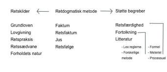

Lovgivningen er den primære retskilde, som altid skal tages i betragtning ved fastlæggelse af retsstillingen, men retspraksis er også en vigtig retskilde, især hvis der foreligger en afgørelse fra Højesteret (se præjudikat) eller en afgørelse fra EU-Domstolen eller fra Menneskerettighedsdomstolen vedrørende Den Europæiske Menneskerettighedskonvention. 

---

Andre faktorer, der kan anvendes som retskilder, er fx retssædvaner, aftaler, lovforarbejder, administrativ praksis, administrative retsforskrifter, udtalelser fra Folketingets Ombudsmand samt retsvidenskabens analyser. 

Herudover anvendes traditionelt også forholdets natur som retskilde.

---

Der kan ikke opstilles en fast prioritering af retskilderne, idet de i konkrete tilfælde alle kan have betydning for, hvad der er gældende ret.

---

I den juridiske argumentation og fortolkning indtager retskilderne den vægtigste position. Her kan man støde på to juridiske begreber:

**"De lege ferenda"**	udtalelse om, hvorledes gældende ret burde være.

**"De lege lata"**	udtalelse om, hvad der er gældende ret.

---

**Man kan også opdele retskilderne i 3 hovedkategorier:**

 
1. National lovgivningen og EU-lovgivningen.

2. National retspraksis og EU-praksis.

3. Øvrige retskilder:

---


* Retssædvaner.

* Aftaler.

* Forholdets natur.

* Kutymer.

* Retsgrundsætninger.

* God skik regler.

---

### Lov

En lov er underlagt grundloven for 1953 og må ikke stride mod grundloven og/eller internationale konventioner fx menneskerettighedskonventionen (EMRK).

Her gælder **"lex superior"**, hvor en	grundlovbestemmelse går forud for en lovbestemmelse, som går forud for bestemmelse i bekendtgørelse.

---

En lov er hierarkisk højere rangeret end en bekendtgørelse. jf. herom forneden. 

Love er bindende for private, virksomheder og myndigheder. 

---

Før en lov kan blive vedtaget, skal den behandles 3 gange i folketinget. 

Det er regeringen, der fremsætter lovforslaget, og det er folketinget, der vedtager eller forkaster den.

---

Der gælder et retssikkerhedsmæssigt princip i Danmark om lighed for loven, uanset om man er fattig eller rig.

Se tillige det latinske udtryk: **"ignorantia juris non nocet"**; ukendskab til loven fritager ikke for ansvar.

---

Samt **"lex posterior"**;	nyere lovbestemmelse går forud for ældre lovbestemmelse, samt

**"Lex specialis"**;	specielle lovbestemmelser går forud for generelle lovbestemmelser (lex generalis).

---

En vigtigt forståelse af, hvordan loven skal fortolkes er "formålsfortolkning", hvad er formålet med loven: på latin; **"ratio legis"**;	"lovens formål".

---


Justitia (rettens gudinde) med en vægt i den ene hånd og et sværd i den anden er blevet et afgørende symbol på rettens betydning og lovens upartiske (blinde) retfærdighed. 
 
---

### Bekendtgørelse


En bekendtgørelse er en administrativ forskrift udstedt af en forvaltningsmyndighed med hjemmel (støtte) i lov. 

Bekendtgørelser er bindende for borgere, virksomheder og myndigheder, medmindre andet følger af bekendtgørelsen.

**"Anordning"** er et	gammelt ord for bekendtgørelse.

---

### Cirkulære

**Cirkulærer** er kun bindende for myndighederne og kan ikke påberåbes af borgerne. 

Cirkulærer udstedes af centrale administrative myndigheder med underordnede myndigheder som adressater. 

Et cirkulære kan ikke forpligte borgerne, og disse kan normalt heller ikke retligt støtte sig på et cirkulære alene.

--- 

### Dommenes retskildeværdi ("præjudikatsværdi")


En dom er en form for retsafgørelse, der i modsætning til kendelser og beslutninger afslutter sagens behandling ved retten.

Domstolsafgørelser og domstolskendelser kan have **"præjudikatsværdi"**. 

Det betyder, at afgørelsen kan have betydning for, hvordan fremtidige afgørelser inden for det pågældende område skal bedømmes. 

----

Præjudikatsværdien kan være underlagt en række indskrænkninger, hvilket betyder, at præjudikatsværdiens rækkevidde kan være begrænset.

Der findes ikke i dansk ret et klart princip, der angiver, hvornår og i hvilket omfang domme har præjudikatsværdi; det afhænger af den konkrete problemstilling.

---

Følgende momenter kan indgå i vurderingen af, hvilken præjudikatsværdi en afgørelse kan tillægges:

Hvor konkret er afgørelsen, og kan den være anvendelig på lignende afgørelser.

Højesteretsdomme har generelt større præjudikatsværdi end landsretsdomme, der igen har større præjudikatsværdi end byretsdomme. 

---

Endvidere har nye domme større præjudikatsværdi end ældre domme. 

Dommes præjudikatsværdi begrænses, når deres begrundelser gøres meget konkrete.

---

### God skik regler


Undertiden støder man i lovgivningen på, at en handlemåde skal være overensstemmelse med en branchebestemt **”god skik”**, en såkaldt **"adfærdsnorm"**. 

---

Eksempler herpå er god advokatskik, god ejendomsmæglerskik, god skik for de finansielle virksomheder, god markedsføringsskik, god revisionsskik, god inkassoskik og god forvaltningsskik m.v. 

---

God skik regler findes i begrænset omfang på lov- eller bekendtgørelsesniveau (eksempel herpå er bekendtgørelse om god skik for finansielle virksomheder), mens normerne for god skik i andre tilfælde er fastsat af domstolene mv. 

God skik er som udgangspunkt branchebestemt, og de vage rammer sikrer en tidsvarende standardnorm, der udvikles i takt med samfundsudviklingen.


---

### Retssædvane

Retssædvaner er ulovreguleret, men selv om retssædvanerne er ulovreguleret har de som retskilde samme betydning, som de var på lovniveau. 

Nogle retssædvaner er udviklet af domstolene. 

Domslæsning, læsning af anerkendte juridiske grundsætninger og søgning i retslitteraturen er nogle af svarene på, hvor retssædvaner kan findes. 

---

Imidlertid er retssædvaner ikke vilkårlige, hvorfor der er flere elementer, der skal være opfyldt, før retssædvanen overhovedet kan tillægges betydning. 

Et klassisk eksempel på retssædvane er **"culpareglen"**.

I den juridiske litteratur er der opstillet rammer for, hvornår der er tale om en retssædvane. 

---

Den traditionelle opfattelse er, at det være en handlemåde, der er 

1) fulgt almindeligt, 
2) stadigt og 
3) længe ud fra 
4) den overbevisning, at man er retligt forpligtet til det.

---

### Kutyme

Kutyme er defineret ved at være en sædvane. 

Den har ikke samme retskildeværdi som retssædvane, da retssædvane svarer til lovniveau. Kutyme må derfor betragtes som trin-lavere. 

Kutyme er en alment kendt handlemåde i en bestemt branche, hvilket aktørerne i den pågældende branche har eller bør have viden om. 

---

I juridisk litteratur er sædvane undertiden beskrevet som en handelssædvane, og der kan derfor være forskel på kutymerne i de forskellige brancher. 

Kutyme er tæt beslægtet med god-skik regler. 

Hvad der er kutymer, kan indhentes informationer om fra brancheforeninger såsom Dansk Erhverv og Dansk Industri.

---

### Aftalen

Aftaler (fx en kontrakt) der er indgået mellem parter, anses for en af de vigtigste retskilder. 

Imidlertid er der ikke tale om en "lov", men reguleringen af aftalen kan være underlagt lovgivningen. Det skal derfor afdækkes, om aftalen er underlagt præceptive (ufravigelige) lovregler og regler, der er deklaratoriske (fravigelige), 


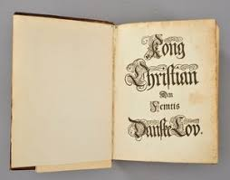

om aftalen er i strid mod lov og ærbarhed (Danske Lovs 5-1-2), og om aftalen, uden et gyldigt grundlag binder en tredjemand.
**<a href="https://jura.tepedu.dk/lovsamling.html" target="_blank">Danske Lov Klik her!</a>**

---

Præceptive regler er kendetegnet ved, at de ikke kan fraviges ved aftale. Aftaler i strid mod lov og ærbarhed er kendetegnet ved, at aftalen er i strid med ufravigelige regler. 

---

Eksempelvis kan man ikke håndhæve en aftale om sort arbejde. 

Beskyttelsespræceptive er kendetegnet ved, at de efter aftale kan stille den svage part bedre end loven (fx en arbejdstager), men hvor denne ret ikke tilkommer den stærke part (fx en arbejdsgiver). 

Det samme gælder ved forbrugerkøb. Forbrugerbrugen kan godt stilles bedre, men ikke dårligere efter købeloven.

---

Deklaratoriske regler er regler fx. i handelskøb, der kan fraviges ved aftale, og kommer i anvendelse, hvis der ikke foreligger aftale om andet.

 
---

### Forholdets natur

Det er i juridisk litteratur omdiskuteret, om hvorvidt forholdets natur overhovedet er en retskilde, og der kan i den juridiske litteratur findes flere argumenter for og imod. 

Forholdets natur er kendetegnet ved, at der tages hensyn til nogle retlige relevante hensyn og principper og rimelighedsbetragtninger. 

---

Se fra romerretten: **"ex æquo et bono"**	efter ret og billighed (rimelighed).

---

## Romerretten


**"jus romanum"** er den ret, der gjaldt i Romerriget. Denne ret har spillet en afgørende rolle for den europæiske retsudvikling og er en meget vigtig del af kulturarven fra antikken. ^[Følgende afsnit om romerretten bygger især på *Mathias Hein Jessen* https://videnskab.dk/kultur-samfund/du-kan-takke-romerriget-du-skal-folge-loven.] 

Romerretten har leveret afgørende begreber og kategorier om eksempelvis magt, jurisdiktion og ejendom til politisk tænkning og har været en meget afgørende del af den måde, vi tænker politik, stat, suverænitet, magt og ejendom på her i Vesten.

---

Vores kendskab til romerretten stammer først og fremmest fra den lovsamling, den samling af skrifter, love og dokumenter, der blev foretaget af den østromerske (byzantinske) kejser Justinian i mellem 529 og 534.

---

Denne lovsamling, som i dag kendes som **"Corpus juris civilis"**, skulle vise sig at blive et af de helt afgørende dokumenter i den vestlige idéhistorie. Corpus juris civilis består af fire dele:

"Institutiones", som er en lærebog eller indføring i romerret for studerende (også **"Novellae"**, som er Justinians lovgivning efter samlingen af lovværket (som først blev tilføjet senere); og endelig den måske vigtigste af dem alle, **"Digesta"**.

---

**"Digesta"** (en systematisk, ordnet fremstilling) eller **"Pandectae"** (latin: altomfattende) var en samling af den vigtigste romerretslige litteratur fra først og fremmest den såkaldte klassiske periode mellem cirka 100 f.v.t. til 300 e.v.t.

Digesta består således af 50 bøger, hvor 39 romerske jurister er citeret (og flere end 100 omtales og refereres til). 

---

Den mest citerede er **"Ulpian"** (fra første halvdel af det 3. årh. e.v.t.). 

Justinians ambition var at samle alle centrale bestemmelser og skriverier fra romerretten til ét stort, sammenhængende lovværk uden interne modsigelser, der dermed skulle erstatte de tidligere spredte og usammenhængende lovskrifter (vigtigst af dem de **"tolv tavlers lov"**).

---

Som nævnt skulle Corpus juris civilis, og særligt Digesta, blive et af de mest afgørende dokumenter i den vestlige idehistorie. 

Det første kapitel af første bog af Digesta drejer sig helt overordnet om, hvad retfærdighed og lov overhovedet er.

Her udlægges det (gennem Ulpian), der også kalder jurister for 'lovens præster', hvordan den, der vil studere loven og retten, først må vide, hvor ordet ret (jus) kommer fra.

---

Det kommer fra justitia (retfærdighed), som er en »konstant og vedvarende vilje til at tildele enhver sin ret«, hvis basale principper er »at leve ærværdigt, ikke at skade andre og at tildele enhver sit eget.«

Det handler altså basalt set om et ordentligt, godt liv og sikring af ejendom uden at forvolde skade mod andre, se fx sikringen i grundlovens § 73 om ejendomsretten ukrænkelighed, samt udviklingen af erstatningsretten, som har sit fodfæste i romerretten.

---

Dansk ret og sprog er således påvirket af romerrettens begrebsapparat fx. at man som jurist ( en person, der har bestået juridisk embedseksamen, dvs. cand. jur. fra universitetet) eller jurainteresseret skal kunne forstå elementer af romerretten, samt de klassisk latinsk-juridiske begreber for at forstå til fulde dansk gældende ret; som fx de latinske udtryk som "actio, bona fide", "caveat emptor", "conditio sine qua non", "reformatio in pejus", "dolus eventualis", "depositum", "ex officio", "ex nunc", "ex tunc", "in extenso", "in dubio pro reo", "in absentia", "insolvens", "de lege lata", "de lege ferenda", "et cetera", "et cetera" osv.

---

**Fx. betyder:** 

"ex nunc";	fra nu af.

"ex officio";	af egen drift.

"ex tunc";	fra da af, (dvs. med tilbagevirkende kraft).

"ex tuto";	for en sikkerheds skyld.

---

Andre latinske juridiske udtryk vil løbende blive forklaret igennem herværende kapitler.

---

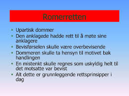

---

## EU-rettens retskilder

De mål, der er fastsat i traktaterne, nås gennem forskellige typer retsakter. Nogle er bindende, andre er ikke. 

Nogle angår alle EU-lande, mens andre kun angår nogle stykker.

---

### Forordninger

En **"forordning"** er en bindende retsakt, som er direkte gældende i EU-medlemsstaterne - parallelt til en national lov, se fx forordning 241/2004 om flypassagers rettigheder. Derfor skal de enkle EU-medlemsstater følge forordningen i alle dens enkeltheder. 

Da EU fx ønskede at garantere fælles sikkerhedsforanstaltninger for varer importeret fra lande uden for EU, vedtog Rådet en forordning.

---

### Direktiver


Et **"direktiv"** er en retsakt, der fastsætter et mål, som EU-landene skal opnå. 

Det er dog op til de enkelte lande at lave deres egne love for, hvordan disse mål skal opnås. 

---

Et eksempel er EU's direktiv om forbrugerrettigheder, som styrker forbrugernes rettigheder i EU, fx ved at fjerne skjulte afgifter og omkostninger på internettet og forlænge den periode, som forbrugere kan fortryde en købsaftale i.

---

### Afgørelser

En **"afgørelse"** er bindende for dem, den er rettet til (fx et EU-land eller en individuel virksomhed) og er direkte gældende. 

fx har Kommissionen udstedt en afgørelse om EU's deltagelse i forskelige antiterrororganisationers arbejde. Afgørelsen vedrører kun sådanne organisationer.

---

### Henstillinger

En **"henstilling"** er ikke bindende. 

Da EU-Kommissionen rettede en henstilling til EU-landenes myndigheder om at forbedre deres brug af videokonferencer for at hjælpe domstolstjenester med at arbejde bedre sammen på tværs af grænserne, havde den ingen retslige virkninger. 

En henstilling giver institutionerne mulighed for at give deres mening til kende og foreslå en retningslinje, uden derved at pålægge dem, den er rettet til, nogen retlige forpligtelser.

---

### Udtalelser

En **"udtalelse"** er et instrument, der giver institutionerne mulighed for at fremsætte en ikkebindende erklæring, dvs. at den ikke pålægger dem, den er rettet mod, nogen forpligtelser. 

En udtalelse er ikke bindende. Den kan afgives af de vigtigste EU-institutioner (Kommissionen, Rådet, Parlamentet), Regionsudvalget og Det Europæiske Økonomiske og Sociale Udvalg. 

Mens lovene udformes, afgiver udvalgene udtalelser fra deres særlige regionale eller økonomiske og sociale synspunkt. For eksempel afgav Regionsudvalget en udtalelse om pakken om en politik for ren luft i Europa.

---

<h4><a href="https://youtu.be/3GRtTKpMyVM" target="_blank">Video EU institutioner</a></h4>

---

<h4><a href="https://www.youtube.com/embed/7y0IJQHlEEY">Video om dit Demokrati | Hvad bestemmer EU</a></h4>

---

<h4><a href="https://www.youtube.com/embed/ED7rPDtZkPM" target="_blank">Video om dit Demokrati | Hvem må være med i EU</a></h4>

---

## Case law


Der er stor forskel på retskildeopfattelsen inden for forskellige retssystemer, se fx case law.^[Følgende afsnit om Case Law bygger på http://denstoredanske.dk/Samfund,_jura_og_politik/Jura/Retssammenligning,_komparativ_ret/case_law.]

Case law, judge-made law, dommerskabt ret.  

I common law-lande har domstolene en mere vidtgående funktion end den dømmende magt i andre retssystemer.

---

Common law-domstolen skal ikke kun fortolke og anvende lovgiverens retsregler, statutory law, men skaber også sin egen ret, case law eller judge-made law. 

En domstolsafgørelse har således ikke alene betydning for parterne i en konkret tvist; afgørelsen skaber præcedens, dvs. at en lignende sag i fremtiden med stor sandsynlighed vil blive afgjort på samme måde, den såkaldte "stare decisis-doktrin".

---

**Betegnelsen case law** er engelsk, af case 'tilfælde' og law 'lov'.
I England er de afgørelser, der hidrører fra samme eller en højere domstol, bindende. 

Andre afgørelser har kun vejledende karakter. Der sondres desuden mellem den tidligere afgørelses egentlige begrundelse, **"ratio decidendi"**, og andre udtalelser i afgørelsen, **"obiter dicta"**. 

Et *"obiter dictum" er kun vejledende**, uanset fra hvilken domstol det måtte hidrøre.

---

Selv bindende afgørelser bliver fra tid til anden tilsidesat (overruled); fx kan der bag afgørelsen ligge en forældet tankegang, og i 1966 udtalte Englands højeste domstol, House of Lords, at den ikke fremover ville betragte sig som evigt bundet af sine egne tidligere afgørelser.

I USA håndhæves stare-decisis mindre strengt end i England. USA's højesteret har enkelte gange tilsidesat sine tidligere afgørelser, selv i sager om fortolkning af USA's forfatning.

---

Fx gav United States Supreme Court i 1954 sorte elever adgang til skoler og universiteter, som tidligere havde været forbeholdt de hvide, og tilsidesatte herved sin egen ældre afgørelse, der havde anerkendt doktrinen om "separate but equal", dvs. at man i undervisningen adskilte sorte og hvide.  


---

## Retskildepolycentri


**Retskildepolycentri** er en nyere retsvidenskabelig erkendelse af, at dannelsen af retskilder i forskellige fora i det moderne samfund kan resultere i, at en retskilde kan have forskellig virkning for forskellige retsanvendere. 

Teorien bryder med den hierarkiske retskildeopfattelse. 

Teoriens ophavsmand er den danske juraprofessor Henrik Zahle.  

---

## Juridisk metode


**Juridisk metode, fremgangsmåde ved stillingtagen til juridiske problemer.**  

Metoden består for det første af en beskrivelse og identifikation af de retskilder, som gyldigt kan inddrages i en juridisk argumentation; for det andet af læren om, hvordan retskilderne fortolkes. 

---

**Juridisk metode består af 3 hovedelementer:**


Et faktum (Hændelsesforløbet fx der er sket økonomisk misbrug af en kortholderens mistede Dankort)  
+  
Et retsfaktum (Hvilken retsregel i betalingsloven skal anvendes i forhold til tredjemandsmisbruget af Dankortet)  
=  
En retsfølge (Afgørelsen, hvem der kommer til at betale for misbruget af Dankortet banken eller kortholderen)  

---

Se fx bestemmelsen i betalingslovens § 100, stk. 4, nr. 3, hvorefter betaleren hæfter for op til 8.000 kr. af misbrug, som finder sted som følge af betalerens groft uforsvarlige adfærd.

Begrebet groft uforsvarlig adfærd er ikke nærmere afgrænset i betalingsloven, men traditionelt anvendes begrebet »grov uagtsomhed« som betegnelse for »tilsidesættelse af den agtpågivenhed, som selv skødesløse personer plejer at udvise.« 

---

Med anvendelsen af begrebet groft uforsvarlig adfærd er det således præciseret, at grov uagtsomhed i sædvanlig forstand ikke er tilstrækkeligt til at pådrage betaleren hæftelse efter bestemmelsen. 

Der skal altså mere til. 

Groft uforsvarlig adfærd må herefter forstås som sløseri, der er præget af ligegyldighed i forbindelse med opbevaring af bl.a. pinkoden. 

Der skal derfor meget til efter praksis i Pengeinstitutankenævnet (nu Det finansielle Ankenævn), før der statueres groft uforsvarlig adfærd.


---

**PIA 78/2006**

»Det forhold, at misbrugeren på klagerens bopæl tilfældigt fik mulighed for at overhøre klageren oplyse sin kode til dankortet til kæresten sammenholdt med, at dankortet opbevaredes i hendes pung, der lå i hendes jakke på bopælen, kan ikke betegnes som groft uforsvarlig adfærd, heller ikke selv om klageren havde givet T adgang til sin bopæl, uanset om hun måtte have kendskab til T’s kriminelle baggrund«.

---

**PIA 205/2005:** »Klagerens Visa/Dankort blev opbevaret i en pung, som lå i en jakke, der var anbragt bag disken i klagerens butik og ikke var synlig for kunderne. Selv om det må bebrejdes klageren, at pinkoden til kortet var anført på en seddel, der lå i pungen sammen med kortet, findes klageren efter en samlet vurdering ikke at have udvist en groft uforsvarlig adfærd som omhandlet i (dagældende) lov om visse betalingsmidler § 11, stk. 3, nr. 3. Ankenævnet har herved også lagt vægt på, at det i lovens forarbejder er forudsat, at det udvidede ansvar kun ville kunne gøres gældende i et fåtal af tilfælde«.  

---

Selvforskyldt beruselse kan blive betragtet som uforsvarlig adfærd, jf. **PIA 281/2013** Spørgsmål om misbrug af kort var muliggjort ved groft uforsvarlig adfærd som følge af beruselse: 

»Som sagen foreligger oplyst, lægger vi til grund, at klageren ikke ved, hvad han foretog sig fra ca. kl. 00.30 til ca. kl. 02.00, da han vågnede i en bil, som han formoder var en pirattaxa. 

Vi finder ikke grundlag for at antage, at klagerens tilstand skyldes andre forhold end indtagelse af alkohol. Under disse omstændigheder finder vi, at misbruget af klagerens betalingskort er muliggjort, fordi han var stærkt påvirket af alkohol. Vi finder, at klageren under de beskrevne omstændigheder har udvist groft uforsvarlig adfærd. 

Vi stemmer derfor for at lade klageren hæfte med 8.000 kr. af det tab, der opstod som følge af den uberettigede brug af kortet, jf. (dagældende) lov om betalingstjenester § 62, stk. 3 nr. 3«. 

---

Det er en konkret vurdering, om der bliver statueret groft uforsvarlig adfærd, jf. fx **PIA 436/1993:**:

Natten mellem den 12. og 13. juni 1993 blev klageren, medens han opholdt sig på en restauration, frastjålet sit dankort, som var opbevaret i klagerens tegnebog. 

Klageren anmeldte den 13. juni 1993 kl. 11.10 telefonisk tyveriet til kriminalpolitiet i Sønderborg efter forinden telefonisk at have spærret dankortet ved meddelelse til PBS. 

Det viste sig efterfølgende, at der ved anvendelse af dankortet og korrekt pinkode den 13. juni 1993 mellem kl. 9.25 og 9.28 var hævet 3 x 2.000 kr. i tre forskellige dankortautomater. 

Efter de foreliggende oplysninger lagde Pengeinstitutankenævnet til grund, at tyveriet af dankortet var blevet forøvet af to unge piger, som senere blev dømt for tyveri ved den 13. juni 1993 kl. 9.25-9.28 under anvendelse af dankortet at have stjålet de 3 x 2.000 kr. fra dankortautomaterne. 

Det fremgik af en retsbogsudskrift fra straffesagen, at de sigtede havde forklaret, at den ene af dem, A, snakkede med klageren, mens den anden sigtede, B, tog pungen op af lommen på ham. 

Herefter gik de ud på toilettet, hvor de tog pengene og kortet. 

A forklarede videre, at hun havde spurgt klageren om koden, og han havde givet hende den. Han sagde noget om, at han skulle ringe til banken for at få kortet spærret, og hun tilbød at gøre det for ham. 

Hun lod, som om hun telefonerede til banken, og sagde i den forbindelse til klageren, at hun skulle bruge pinkoden, hvorefter han gav hende den. Klageren indbragte sagen for Ankenævnet med påstand om, at indklagede var tilpligtet at anerkende, at klageren ikke hæftede for de 6.000 kr. 

Ankenævnet traf følgende afgørelse: 

»Efter (dagældende) betalingskortlovens § 21, stk. 2, hæfter kortindehaveren uden beløbsbegrænsning for tab, der opstår som følge af andres uberettigede brug af betalingskortet og den dertil hørende personlige hemmelige kode, såfremt kortudstederen godtgør, at kortindehaveren har oplyst koden til den, der har foretaget den uberettigede brug. 

Ankenævnet finder imidlertid ikke, at bestemmelsen er anvendelig på et tilfælde som det foreliggende. Ankenævnet finder på den anden side, at klageren udviste groft uforsvarlig adfærd ved i det foreliggende tilfælde at oplyse sin PIN-kode. Han hæfter derfor med op til 8.000 kr. for det tab, der opstod som følge af det uberettigede brug af kortet, jf. (dagældende) betalingskortlovens § 21, stk. 3, nr. 2. Som følge af det anførte bestemmes: Den indgivne klage tages ikke til følge«.  


---

Den juridiske metode indeholder væsentlige elementer af vurdering og skøn og er derfor mindre eksakt end de metoder, der anvendes inden for mange andre fagområder.


I juridisk Ordbog (*Bo von Eyben*, 14. udg.) defineres juridisk metode som følger: "den metode, der skal anvendes for at afgøre, hvilken regel der er gældende for et bestemt retsområde. Dette forudsætter kendskab til læren om retskilderne og evne til herudfra at finde de relevante retskilder og at anvende dem korrekt på det givne forhold..." 


---

## Quiz

<h4><a href="https://quiz.tepedu.dk/jura2" target="_blank">Quiz Retskilderne </a></h4>

---


<!--chapter:end:02-Retskilderne.Rmd-->

# Aftaleret

```{r, echo=FALSE, results='asis'}
cat(readLines('np.html'))
```


Aftaleretten er reguleret af aftaleloven, jf. Lovbekendtgørelse 2016-03-02 nr. 193 om aftaler og andre retshandler på formuerettens område, 
**<a href="https://jura.tepedu.dk/lovsamling.html" target="_blank">Lovsamlingen klik her!</a>**

---

***Aftaleloven har stor betydning i dagligdagen for en finansøkonomen, som er ansat i et pengeinstitut/realkredit, forsikring,	ejendomshandel,	ejendomsadministration	økonomistyring og	revision, når finansøkonomen på vegne af den finansielle virksomhed indgår aftaler og kontrakter med kunder og klienter.*** 

---

Fx ejendomsmæglerens indgåelse af en formidlingsaftale med sælgeren af den faste ejendom eller bankrådgiverens låneaftale med en kunde eller bankens kautionsaftalen med en kautionist.

Der er en del af god skik for finansielle virksomheder, jf. lov om finansiel virksomhed § 43, at alle væsentlige aftaler skal indgås skriftligt.

---

<h4><a href="https://www.youtube.com/embed/QdPllNiV5Ck" target="_blank">Video om en introduktion til aftaleretten</a></h4>

---

**Hvilke problemstillinger og aftaleretlige lovregler, du som studerende særlig skal være opmærksom på vedrørende eksamensspørgsmål indenfor aftaleretten:**


• **Opfordring kontra bindende tilbud**, jf. aftalelovens § 9, herunder prisangivelser på nettet, netbutikker og i fysiske butikker.
  
• **Aftaleindgåelse**, aftalelovens §§ 2-7 og 40.

• **Ugyldighed** (svig, aftalelovens § 30 fejl, aftalelovens § 32, stk. 1, udnyttelse, aftalelovens § 31).

• **Falsk/forfalskning.**

• **Urimelighed** - aftalelovens §§ 38c, jf. 36, om rimelige aftaler som kan tilsidesættes.

• **Fuldmagtstyper** (især stillingsfuldmagt, aftalelovens § 10, stk. 2), fuldmagtens omfang og konsekvenser, aftalelovens §§ 10, 11, 15 og 25, modificeret ved erstatningsansvarslovens § 23. 

**Se gennemgangen af fuldmagtsreglerne.**
**<a href="https://jura.tepedu.dk/fuldmagter-og-mellemm%C3%A6nd.html" target="_blank">klik her!</a>**

---

Aftaleretten beskæftiger sig med reglerne for indgåelse af aftaler, fuldmagtsforhold og aftalefortolkning mv.

---


**Et grundlæggende aftaleretligt princip er:**

**"Pacta sunt servanda"** (latin: **Aftaler skal holdes**) er det grundlæggende juridiske princip inden for aftaleret, civilret og international ret om, at aftaler skal holdes.

---

Forskellen på en **"aftale"** og en **"kontrakt"** er, at kontrakten er skriftlig og underskrevet og kan derfor håndhæves i retssystemet.

---

Aftalelovens principper har betydning på hele aftaleområdet,^[Følgene bygger til dels på *Torsten Iversen og Lars Hedegaard Kristensens* Karnovkommentar til aftaleloven] fx i:

* Forsikringsaftaleloven, kreditaftaleloven, forbrugeraftaleloven, AB 18 (entrepriseregler), købeloven, E-handelsloven m.fl.

*	Aftaleindgåelse reguleres af aftalelovens §§ 2-9.

+ Deklaratorisk, dvs. parterne kan aftale anden fremgangsmåde ved aftaleindgåelse, end den der er beskrevet i aftaleloven.

---


```{r aftalelov,echo=FALSE,fig.height=4, result=TRUE,fig.cap=("Oversigt over aftalelove")}


nodes <- data.frame(id = 1:7, 
                    shape = c("box"), 
                    label = c(" Aftalelov "," Forsikringsaftalelov "," Kreditaftalelov "," Forbrugeraftalelov "," Aftale om pant "," Købelov "," Kautionsaftale "),
                    font.size = c(50,25,25,25,25,25,25))
edges <- data.frame(from = c(1,1,1,1,1,1), to = c(2,3,4,5,6,7),arrows = c("to"),length = rep(40,6))

visNetwork(nodes, fig.width=4,edges,  width = "100%") %>% 
  visInteraction(dragNodes = TRUE, 
                 dragView = TRUE, 
                 zoomView = FALSE) %>%
  visNodes(color = list(background = "white", 
                        border = "white",
                        highlight = "yellow"),
           shadow = list(enabled = TRUE, size = 30))  %>%
  visHierarchicalLayout(direction = "LR",levelSeparation = 300) %>%
visEdges(color = list(color = "lightgrey", highlight = "yellow") )
  # visLayout(randomSeed = 24) # to have always the same network

```


---

## Aftaleindgåelse

**Hovedreglen** er, at der er aftalefrihed – vi kan frit aftale, hvad vi vil.

**Undtagelse**

**(U1):** Begrænsninger i præceptive lovregler. 

---

**Se fx:**

+	Funktionærlovens regler om opsigelsesvarsler.

+	Forbrugeraftalelovens regler om fortrydelsesret.
      
**U2:** Urimelige aftaler, aftalelovens §§ 38 c, jf. 36

**U3:** "En aftale bliver også ugyldig, hvis den strider mod "Lov og ærbarhed", jf. allerede Christian 5.s Danske Lov fra 1683. 

---

Fx et løfte om at ville betale en anden persons fartbøde ugyldig eller, at et forsikringsselskab skulle udbyde forsikringer mod fartbøder eller, at retssystemet skulle håndhæve mangler ved håndværksydelser i forbindelse med udførelsen af sort arbejde.

---

Men en aftale bliver ikke ugyldig, blot fordi der er overtrådt offentligretlige forskrifter. 

Fx er en aftale om køb af drikkevarer uden for den tilladte åbningstid bindende trods lovovertrædelsen.

---


**Hvad er en aftale:**

Ordet **"aftale”**: En aftale - jf. aftalelovens titel - består af viljeserklæringer, som to eller flere personer afgiver indbyrdes, og hvoraf mindst én erklæring er et løfte, som har karakter tilbud. 

Aftalebegrebet bruges oftest om et tilbud, som er accepteret af modparten, fx en pagt, traktat, kontrakt, charter, overenskomst, vedtægt, vedtagelse, konvention og studehandel. 

Aftaler er bindende, uanset om de er mundtlige eller skriftlige, jf. aftalelovens § 1. 

---

Mundtlige aftaler	er principielt bindende, men kan meget ofte ikke bevises, jf. **Danske Lov 5-1-1**:

"Een hver er pligtig at efterkomme hvis hand med mund, haand og sejl, lovet og indgaaet haver".
**<a href="https://jura.tepedu.dk/lovsamling.html" target="_blank">Danske Lov i Lovsamlingen klik her!</a>**

---

Mundtlige aftaler er således lige så bindende som skriftlige, jf. Danske Lov, DL 5–1–1 og forudsætningsvis **aftalelovens § 3, stk. 2**, som fastslår, at tilbud, der fremsættes mundtligt skal accepteres straks.

De mundtlige kan bare være sværere at bevise, hvis parterne bliver uenige om aftalens indhold. 

Bevisbyrde - Den part der hævder en mundtlig aftale er indgået, har bevisbyrden (som er hovedreglen i dansk ret; en ligefrem bevisbyrde).

---


Ensidigt løfte ctr. gensidigt løfte se figurer.

Udtrykkeligt løfte ctr. stiltiende løfte.

---

**Hvad er forskellen på en aftale og en kontrakt:**  

**En aftale kan også være mundtlig.** 

En kontrakt er skriftlig og underskrevet af aftalepartnerne og kan således påberåbes (håndhæves) ved domstolene.  


---

```{r gensidigtloefte, echo=FALSE, fig.height=4,result=TRUE,fig.cap=("Gensidigt løfte")}


nodes <- data.frame(id = 1:2, shape = c("box"),label = c(" Sælger "," Køber "),font.size = c(30,30))
edges <- data.frame(from = c(1), 
                    to = c(2),
                    arrows = c("to","from"),
                    length = c(600,500),
                    label=c("Varer/Ydelser","Penge/modydelse"),
                    font.size = c(15,15),
                    smooth = c(TRUE,TRUE)
                    )

visNetwork(nodes, edges,  width = "100%") %>% 
  visInteraction(dragNodes = TRUE, 
                 dragView = TRUE, 
                 zoomView = FALSE) %>%
  visNodes(color = list(background = "white", 
                        border = "white",
                        highlight = "yellow"),
           
           shadow = list(enabled = TRUE, size = 30))  %>%
  visHierarchicalLayout(direction = "LR",levelSeparation = 300) %>%
  
visEdges(color = list(color = "lightgrey", highlight = "yellow") )
```


```{r faicon2, echo=FALSE, fig.height=1,result=TRUE,fig.cap=("Ensidigt løfte")}

nodes <- data.frame(id = 1:2, shape = c("box"),label = c(" Testator "," Arving "),font.size = c(30,30))
edges <- data.frame(from = c(1), 
                    to = c(2),
                    arrows = c("to"),
                    length = c(300),
                    font.size = c(15),
                    label=c(" ARV "),
                    smooth = FALSE
                    )
 visNetwork(nodes, edges,  width = "100%") %>% 
   visInteraction(dragNodes = TRUE, 
                 dragView = TRUE, 
                 zoomView = FALSE) %>%
  visNodes(color = list(background = "white", 
                        border = "white",
                        highlight = "yellow"),
           shadow = list(enabled = TRUE, size = 30))  %>%
   visHierarchicalLayout(direction = "LR",levelSeparation = 300) %>%
  visEdges(color = list(color = "lightgrey", highlight = "yellow") )
```


---

Eksempler på indgåelse af juridiske aftaler mellem parter 

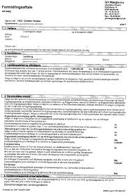

---

Ejendomsmægleren tager initiativ til en formidlingsaftale om salg af et hus:  

Tilbudsgiver (ejendomsmægleren): Den, der afsender/giver et tilbud til en anden.
  
Tilbudsmodtager (boligsælgeren): Den, som modtager et tilbud. 

---


**En kunde tager initiativ til en forsikringsaftale:**  


"Tilbudsgiver" (kunden): En interesseret kunde sender en begæring til et forsikringsselskab med ønske om en forsikring.

---

**Aftaleretlige begreber:**

**"Tilbudsmodtager"** (sælger): Sælger modtager en ordre eller ønske om køb fra interesseret køber.

---

**Hvad er et løfte?**


Et **"løfte"**: En ensidig erklæring fra en person om at ville påtage sig en pligt, fx en kautionist vil påtage sig pengeforpligtelsen, hvis deitor ikke kan betale til banken. 

Løftet skaber en forventning hos modtager. 

---

**Løftet har følgende retsvirkninger:** 

Dels at løftegiveren har pligt enten til at opfylde løftet efter dets indhold (såkaldt **naturalopfyldelse**) eller 

til at erstatte løftemodtagerens økonomiske interesse i løftets opfyldelse, dvs. erstatning i form af såkaldt **"positiv opfyldelsesinteresse"** (forudsat naturligvis, at der foreligger et ansvarsgrundlag).

---

Positiv opfyldelsesinteresse	er en erstatning, der stiller den anden part, som om aftalen var blevet opfyldt efter sit indhold. Giver i modsætning til negativ kontraktsinteresse dækning for den tabte fortjeneste.

---

**Hvad er et tilbud?**


**"Tilbud"**: Et tilbud er et løfte, som taber sin virkning, hvis det ikke accepteres i rette tid. 

Det kan være et løfte om at levere en vare eller tjenesteydelse til en bestemt pris og et bestemt sted på et bestemt tidspunkt. 

Fx debitors **"løfte"** til banken om at ville betale 1.000 kr. af på lånet hver måned.

---

**Hvad er en accept?**

**"Accept":** En erklæring, som har karakter af antagende svar på tilbud. 

---

**Hvad er et svar?**

Et **"svar"**, hvori man siger ja til et tilbud. 

---

**Hvad er accepten?**

**"Accepten"** er både et løfte, der binder acceptanten, når modtageren har hørt/læst accepten (kundskabsøjeblikket), og det er samtidig et påbud der binder modtageren, når det er kommet frem, dvs. når et svar (tilbud eller accept) er modtaget i modtagerens brevkasse, indbakke eller lignende, men indholdet er endnu ikke læst. 

---

**Hvad menes der med, at det er kommet frem?**

**"Kommet frem":** Når et svar (tilbud eller accept) er modtaget i modtagerens brevkasse, indbakke eller lignende, men indholdet er endnu ikke læst.

Et brev er kommet frem, når det er kommet så vidt, at modtageren kan gøre sig bekendt med indholdet ved handlinger, som han eller hun efter almindelig skik og brug eller særlig tilkendegivelse bør foretage. Det er uden betydning, om modtageren rent faktisk læser brevet.

---

**Hvårnår er det kommet til kundskab?**

**"Kommet til kundskab":** Det øjeblik, modtageren er blevet bekendt med indholdet af tilbud eller accept, dvs. har hørt eller læst indholdet. Fx åbner en mail.

Der er ikke noget krav om, at modtageren skal have forstået indholdet.

---

**Opfordring til at gøre tilbud**: er en ikke-bindende henvendelse til andre om at give tilbud.

Hvis en erhvervsdrivende i overensstemmelse med aftalelovens § 9 vil fravige det almindelige aftaleretlige udgangspunkt om, at tilbud i en internet butik er bindende, skal det fremgå meget tydeligt af siden, at tilbuddene på hjemmesiden alene er ”en opfordring til at give et tilbud”, og at der ikke er indgået en bindende aftale, før sælgeren har accepteret køberens tilbud.

---

**Se fra retspraksis:**

Se dommen i **U 2003.907 V** (U: Ugeskrift for Retsvæsen). Hvor en annoncering af en brugt bil på internettet alene var opfordring til at gøre tilbud. 
**<a href="https://pro.karnovgroup.dk/document/7000263053/1" target="_blank">Se dommen klik her!</a>**

---

**Påbud** er en erklæring: som går ud på at lægge bånd på adressaten.

**Reklamation** er en indsigelse i anledning af et retsforhold.

**Pligtmæssig reklamation** er en reklamation, som afgives af hensyn til adressaten og forsendes på adressatens risiko, jf. aftalelovens § 40 (og tilsvarende købelovens § 61). 

Aftaleloven bruger herom udtrykket **give meddelelse**.

---


## Aftalemodellen


En bindende aftale kommer i stand via den såkaldte **aftalemodel**:

*	Tilbudsgiver sender sit tilbud ………….**fremsendelsestid.**

*	Tilbudsmodtager modtager tilbud (**kommet frem**).

*	Tilbudsmodtager læser tilbud (kommet til kundskab) ………… **betænkningstid**.
  
*	Tilbudsmodtager accepterer tilbud/sender accept ………… **tilbagesendelsestid**.
  
*	Accept når frem til tilbudsgiver (**kommet frem**).

*	Tilbudsgiver læser accepten (**kommet til kundskab**).


Resultat: Der er indgået en juridisk bindende aftale mellem parterne.

---

<h4><a href="https://youtu.be/DvV2yhetl8M" target="_blank">Video om aftalemodellen</a></h4>

---

<h4><a href="https://youtu.be/WbgTUpCLz00" target="_blank">Video om aftalers indgåelse</a></h4>

---


```{r faicon3, echo=FALSE, result=TRUE,fig.height=4,fig.cap=("Aftale sælgers initiativ")}
nodes <- data.frame(id = 1:2, shape = c("box"),label = c("Sælger \n tilbudsgiver ","Køber \n tilbudsmodtager "),font.size = c(15,15))
edges <- data.frame(from = c(1), 
                    to = c(2),
                    arrows = c("to","from"),
                    length = c(800,500),
                    font.size = c(12,12),
                    label=c("1. Sælger sender tilbud til køber","2. Køber sender accept/ordre"),
                    smooth = TRUE
                    )
  visNetwork(nodes, edges,  width = "100%") %>% 
    visInteraction(dragNodes = TRUE, 
                 dragView = TRUE, 
                 zoomView = FALSE) %>%
  visNodes(color = list(background = "white", 
                        border = "white",
                        highlight = "yellow"),
           shadow = list(enabled = TRUE, size = 30))  %>%
  visHierarchicalLayout(direction = "LR",levelSeparation = 400) %>%
visEdges(color = list(color = "lightgrey", highlight = "yellow") )
```


---


```{r faicon4, echo=FALSE,fig.height=4, result=TRUE,fig.cap=("Aftale købers initiativ")}
nodes <- data.frame(id = 1:2, shape = c("box"),label = c("Sælger \n tilbudsmodtager ","Køber \n tilbudsgiver "),font.size = c(20,20))
edges <- data.frame(from = c(1), 
                    to = c(2),
                    arrows = c("to","from"),
                    length = c(800,500),
                    label=c("2. Sælger sender \n accept/ordrebekræftelse","1. Køber sender købstilbud/ordre"),
                    smooth = TRUE
                    )
 visNetwork(nodes, edges,  width = "100%") %>% 
   visInteraction(dragNodes = TRUE, 
                 dragView = TRUE, 
                 zoomView = FALSE) %>%
  visNodes(color = list(background = "white", 
                        border = "white",
                        highlight = "yellow"),
           shadow = list(enabled = TRUE, size = 30))  %>%
  visHierarchicalLayout(direction = "LR",levelSeparation = 400) %>%
visEdges(color = list(color = "lightgrey", highlight = "yellow") )
```

---

**Tilbud eller opfordring til tilbud**:


**HR:** Tilbud er bindende for afgiveren, jf. aftalelovens § 1.

Tilbuddet bliver bindende for tilbudsgiver, når tilbudsmodtager får kendskab til tilbuddets indhold.

Tilbud er bindende i butikker og butiksvinduer, medmindre køber burde indse, at der var tale om en fejl (latinsk; lapsus).

---
    
Tilbud er fx bindende i **web-butikker**, når sælger selv har råderet over websitet og muligvis, at der også er en indkøbsfunktion på websitet.

Der er ingen formkrav til udformningen af tilbuddet, og det kan fremsættes ved mundtlige og elektroniske erklæringer/aftaler.

Tilbuddet må ikke være tilbagekaldt helt eller delvist (ændret).

---

Tilbuddet kan tilbagekaldes, såfremt tilbagekaldelsen kommer frem til modtageren senest samtidig med, at modtageren får kundskab herom, jf. aftalelovens § 7, se senere.

Hvis tilbuddet afslås af tilbudsmodtager, bortfalder tilbuddet og kan ikke accepteres senere, jf. aftalelovens § 5.

---

Afslaget kan tilbagekaldes, såfremt tilbagekaldelsen kommer frem til modtageren senest samtidig med, at modtageren får kundskab herom, jf. aftalelovens § 7.

---

Undtagelser: **Opfordring til tilbud**, jf. aftalelovens § 9:


Nogle typer tilbud er ikke bindende for sælger, kaldet "opfordring til tilbud", fx:
  
+ **Slagtilbud** og **så længe lager haves**, tilbud og priser i aviser og kataloger, på plakater, annoncer, TV- og radioreklamer, køtilbud, priser og tilbud på internettet, når sælger ikke selv har råderet over websitet.

---

Se dommen i **U 2002.631 V** Sælgers direktørs notering af kundes ønske om køb af allerede solgt kø-tilbudsvare havde skabt berettiget forventning hos kunden om køb af varen. Erstatning for prisdifferencen. 
**<a href="https://pro.karnovgroup.dk/document/7000246785/1" target="_blank">Dommen klik her!</a>**

---

<h4><a href="https://www.youtube.com/embed/j36H6TAo7Us" target="_blank">Video om tilbud contra opfordring til tilbud</a></h4>

---

**Afslag på tilbud:**

Hvis tilbudsmodtager forholder sig passiv, bortfalder tilbuddet, når acceptfristen er udløbet, og sælger kan frit sælge til anden side.

Hvis tilbudsmodtager afslår tilbuddet, er det bortfaldet, selv om acceptfristen ikke er udløbet, jf. aftalelovens § 5. 

---

Sælger kan frit sælge til anden side.  

Situation: Tilbagekaldelse af afslag. Tilbudsmodtager (potentiel køber) sender et afslag til sælger, men køber fortryder sit afslag.

Tilbuddet er stadig bindende for sælger, hvis købers tilbagekaldelse kommer til tilbudsgivers (sælgers) kundskab, senest samtidig med at sælger læser afslaget.

---


<h4><a href="https://www.youtube.com/embed/Noq0xWiKryg" target="_blank">Video om afslag</a></h4>

---


**Accept:**

Der er ingen formkrav til accepten i aftaleloven.

Accepten kan ikke ske ved passivitet, jf. aftalelovens § 8.

Man kan derfor ikke ved frafald af accept forpligte adressaten, fx ved uopfordret at fremsende varer eller andre ydelser til adressaten. 

---

Ved forbrugeraftaler er dette særligt reguleret i forbrugeraftalelovens § 6's forbud mod "negativ aftalebinding".

Accepten kan ske ved en handling, fx at køre med Metroen eller modtage varen.

---

Tilbuddet skal være accepteret i rette tid:

Acceptfristen kan være fastsat i tilbuddet efter aftalelovens § 2.

Er acceptfristen ikke fastsat i tilbuddet, beregnes denne efter aftalelovens § 3, stk. 1. Den såkaldte **legale acceptfrist**. 

---

Den legale acceptfrist er sammensat af tre bestanddele nemlig: 

(1) den påregnelige fremsendelsestid for tilbuddet + 

(2) en rimelig betænkningstid + 

(3) den påregnelige fremsendelsestid for accepten. 

---

Mundtlige tilbud skal accepteres straks, jf. aftalelovens § 3, stk. 2.

---

Når acceptfristen er udløbet, falder tilbuddet bort. 

Ved for sen accept er der derfor ingen aftale, men accepten bliver til et nyt tilbud, jf. aftalelovens § 4, stk. 1.

---

**Når acceptfristen er fastsat i tilbuddet:**

Når tilbudsmodtager har læst eller hørt om tilbuddet, har tilbudsmodtager en frist til at overveje, om tilbudsmodtager vil acceptere, fx i form af en ordrebekræftelse.

---

Accepten er rettidig, hvis den er kommet frem til tilbudsgiver inden acceptfristens udløb, jf. aftalelovens § 2.

---

Hvis acceptfristen er angivet til 8 dage, regnes fristen fra tilbuddets datering.

---

**Accept – den legale acceptfrist:**


Ingen acceptfrist i tilbuddet, så gælder:

Den legale acceptfrist, jf. aftalelovens § 3:

Fremsendelsestid + rimelig betænkningstid + tilbagesendelsestid.

Rimelig betænkningstid” afhænger af de konkrete omstændigheder. 

---

**Betænkningstiden er:**


+	Den er kort, hvis prisen på salgsproduktet svinger meget.
    
+	Den er kort, hvis der er tale om letfordærvelige varer.
    
+	Den er længere, hvis der er tale om komplekse og større tilbud.
    
*	Mundtlige tilbud, der gives uden acceptfrist, skal accepteres straks, ellers er det bortfaldet, jf. aftalelovens § 3, stk. 2.

---

**Accept - forsinket:**

Forsinket accept,	anses i aftaleretten som et nyt tilbud fra acceptanten, jf. aftalelovens § 4, stk. 1.

**Accepten kommer for sent frem – fristen er sprunget - Aftalelovens § 4:**

**Hovedregel:** Aftalelovens § 4, stk. 1: Forsinket accept betragtes som et nyt tilbud, som den oprindelige tilbudsgiver skal acceptere, før der er indgået en bindende aftale.

---

**Undtagelse:** Aftalelovens § 4, stk. 2: Accepten er OK, hvis tilbudsgiver må indse at acceptanten tror, at accepten er rettidig, fx hvis accept er sendt inden fristens udløb, men bliver forsinket hos postvæsen - tjek datostempel.

---

**NB:** Hvis tilbudsgiver ikke vil være bundet af en forsinket accept, skal tilbudsgiver uden ugrundet ophold give acceptanten "meddelelse" om forsinkelsen, jf. aftalelovens § 40. 

---

Lader tilbudsgiver som ingenting, risikerer tilbudsgiver at være bundet	og skal opfylde aftalen.

---


**Det at give meddelelse** se nærmere aftalelovens § 40:

**Når nogen, som efter denne lov skal »give meddelelse« har indleveret meddelelsen til befordring med telegraf eller post eller, hvor andet forsvarligt befordringsmiddel benyttes, har afgivet den til befordring dermed, går det ikke ud over ham, at meddelelsen forsinkes eller ikke kommer frem.**


---

<h4><a href="https://www.youtube.com/embed/w5HtkYrMXDg" target="_blank">Video om tilbagekaldelse efter aftalelovens § 40</a></h4>


---

<h4><a href="https://www.youtube.com/embed/xoiUi_ShUJc" target="_blank">Video om for sen accept</a></h4>

---

<h4><a href="https://www.youtube.com/embed/dJmhJTwJzhg" target="_blank">Video om rettidig accept</a></h4>

---

<h4><a href="https://www.youtube.com/embed/xGnZFVV1H74" target="_blank">Video om uoverensstemmende accept</a></h4>


---

**Tilbagekaldelse af tilbud/accept:**


**Aftalelovens § 7:**

**Situation: Tilbudsgiver vil annullere sit tilbud:**

Tilbud kan tilbagekaldes af tilbudsgiver, hvis tilbagekaldelsen kommer frem inden eller samtidig med, at det oprindelige tilbud kommer til tilbudsmodtagers kundskab.

---


**Situation: Acceptanten vil annullere sin accept:**

Svar/accept kan tilbagekaldes af acceptanten, hvis tilbagekaldelsen kommer frem inden eller samtidig med, at accepten kommer til tilbudsgivers kundskab.


U: Se den såkaldte **Re integra-reglen** - aftalelovens § 39, 2. pkt.: 

Under særlige omstændigheder kan tilbagekaldelse alligevel ske efter fristens udløb, hvis to betingelser er opfyldt:  

1. Tilbuddet eller accepten må ikke have virket bestemmende på modtagerens handlemåde, fx sådan, at tilbudsgiver har sat produktion af ordren i gang på baggrund af accepten.

2.	Årsagen til, at tilbagekaldelsen er kommet for sent frem, skyldes særlige omstændigheder.

Re integra-reglen kan ikke påberåbes, bare fordi man har fortrudt. Der skal således noget særligt til.

---

Se domspraksis vedrørende anvendelsen af aftalelovens § 39, 2. pkt.: 

Se dommen i **U 1929.1084 S**: En sælger S modtog fra køberen K et brev om annullation af en ordre, men næste morgen modtog han telegram om, at brevet var bestemt til et andet firma. Skønt S ikke havde eller burde have indset, at der forelå en fejltagelse, fandtes brevet dog ikke bindende for K, da S ikke, inden fejltagelsen oplystes, havde foretaget andet end at bestemme sig til at levere varen til en anden kunde. 
**<a href="https://pro.karnovgroup.dk/document/7000239877/1" target="_blank">Dommen klik her!</a>**


---

Se dommen i **U 1969.579 Ø** En køber, der telefonisk havde bestilt en vaskemaskine, indfandt sig fejlagtigt i en anden nærliggende forretning, hvor hun mod kvittering betalte for en vaskemaskine af den pågældende type. Da hun 4 dage senere opdagede fejlen, nægtede forretningen at tilbagebetale købesummen under påberåbelse af, at der var indgået en endelig handel. Det fandtes ikke godtgjort, at forretning nr. 2, da betalingen fandt sted, indså eller burde indse, at der forelå en fejltagelse, men da køberen havde reklameret tilstrækkeligt hurtigt, og da handelens indgåelse og tilbagekaldelse ikke havde påført forretningen arbejde eller udgift, fandtes aftalelovens § 39, 2. pkt., at måtte anvendes. 
**<a href="https://pro.karnovgroup.dk/document/7000218873/1" target="_blank">Dommen klik her!</a>**


---

Se dommen i **U 1989.561 H ** En annullation af en slutseddel, der var underskrevet under medvirken af en ejendomsmægler, om morgenen dagen efter købet tillagt retsvirkning efter princippet i aftalelovens § 39, 2. pkt., idet slutsedlen blev underskrevet umiddelbart efter den første besigtigelse af ejendommen, uden at ejendomsmægleren, der var klar over den vanskelige situation som køberen befandt sig i pga. forestående tvangsauktion over sit hus, forinden havde søgt klarlagt, om køberen havde økonomisk mulighed for at opfylde handelen. 
**<a href="https://pro.karnovgroup.dk/document/7000198607/1" target="_blank">Dommen klik her!</a>**

---

<h4><a href="https://www.youtube.com/embed/Pf2unCK7tME" target="_blank">Video om tilbagekaldelse</a></h4>

---

Uoverensstemmende accept i forhold til tilbuddet:

Accepten skal være i overensstemmelse med tilbuddet – som et spejlbillede, jf. aftalelovens § 6:

**HR:** Aftalelovens § 6, stk. 1: En uoverensstemmende accept er et afslag, og vil blive betragtet som et modbud (nyt tilbud), men fra acceptantens side.

**U:** Aftalelovens § 6, stk. 2 – En uoverensstemmende accept betragtes ikke som et modbud (nyt tilbud), hvis afsenderen tror,	at accepten er i overensstemmelse med tilbuddet og tilbudsgiveren må indse at acceptanten tror at accepten er ok. 

---

**NB:** Hvis tilbudsgiver ikke vil være bundet af indholdet i den ”forkerte” accept, skal denne uden ugrundet ophold give acceptanten besked. 

---

Lader tilbudsgiver som ingenting, er tilbudsgiver bundet af aftalen og skal levere i henhold til indholdet af den uoverensstemmende accept.


---

**Give meddelelse** se om begrebet igen i aftalelovens § 40.

---

## Eksamensopgave 1.

Bord og stol A/S


Firmaet ”Bord og stol A/S” producerer og handler med alle former for møbler, men har i de senere år specialiseret sig i møbler til hoteller. ”Bord og stol A/S”s indkøber har fundet nogle meget elegante møbler i Østen lavet i et nyt og anderledes design. 

Indkøberen har på vegne ”Bord og stol A/S” fået forhandlet sig frem til en god pris mod garanti, om at aftage et vist minimum af varerne.
 
”Bord og stol A/S” sender et tilbud ud til de kunder, der skal til at renovere deres hotel, med en acceptfrist til d. 10.04. 

Tilbuddet lyder på indkøb af min. 20 sæt, og leveringstidspunktet er sat til d. 1.05. 

Prisen angives til 11.995 kr. for et sæt bestående af en seng, et skab, et bord og to stole. Der kommer en del ordre ind inden d. 10.04. 

”Bord og stol A/S” undrer sig, dog over, at en kunde, ”Parkhotellet” ikke har afgivet bestilling, da man telefonisk havde fået indtryk af, at hotellet helt sikkert ville have varerne. 

På grund af travlhed reagerer ”Bord og stol A/S” ikke. D. 20.04. kommer så accepten fra kunden. 

Af den fremgår, at ”Parkhotellet” ønsker 20 sæt. Firmaet ”Bord og stol A/S” reagerer ikke på accepten, da den er kommet for sent frem. 

Da der d. 01.05. ikke kommer nogen møbler, kontakter ”Parkhotellet” ”Bord og stol A/S”, der meddeler, at accepten kom for sent frem. ”Parkhotellet” kan ikke forstå det og undersøger sagen. 

Accepten er afsendt i god tid, nemlig allerede d. 07.04. Firmaet ”Bord og stol A/S” oplyser, at ”Parkhotellet” kan få møblerne, men nu til 13.600 kr. pr. sæt. 

Efterspørgslen har nemlig vist sig at være stor. ”Parkhotellet” fastholder sin accept og forlanger havemøblerne leveret snarest. 

Bord og stol A/S modtager også en accept fra en anden kunde, nemlig Strand Hotellet. Stand Hotellet har imidlertid angivet en pris på 1.995 kr. 

Bord og Stol A/S reagerer heller ikke på denne accept, da de ikke ønsker at sælge møblerne til 1.995 kr. 

Det viser sig senere, at Stand Hotellet havde lavet en fejl, og ønskede møblerne til 11.995 kr. Bord og stol giver samme melding som til Parkhotellet, nemlig at prisen nu er 13.600 kr. 

3 måneder efter levering af møbler til Hotel Golf reklamerer Hotel Golf over mangler ved møblerne, idet flere af stoleryggene er gået løs.  

Bord og stol afviser reklamationen, da der står på bagsiden af fakturaen, at der skal reklameres inden 8 dage fra leveringen.


**Eksamensspørgsmålene:**

1.	Redegør for om Parkhotellet har krav på at få møblerne til 11.995 kr. 


 
2.	Redegør for om Strand Hotellet har krav på at få møblerne til 11.995 kr. 


3.	Redegør for hvilke rettigheder Hotel Golf har i forhold til de løse stolerygge.

---

**Podcast svar på eksamensopgave 1**

---

## Eksamensopgave 2

**Hundekiks og tudekiks**

I Køge driver Lars Ravn hundekennelen Vax Pedigree, som han i 2010 har købt sammen med den tilhørende ejendom. 

Et halvt år tidligere har Lars købt hunhunden Rita af racen Akita, som skal indgå i avlen. 

Hunden stammer fra kennlen Trofast, og Lars har studeret dens stamtavle grundigt for bl.a. at sikre sig, at hunden som ønsket, bringer nyt blod til Vax Pedigree. 

Det er derfor en stor overraskelse da det viser sig at Ritas første kuld hvalpe udviser klare træk, som ikke er i overensstemmelse med racen, og at Rita tydeligvis ikke er en ren Atika, og at Kennlen Trofast har fusket med stamtavlen.

Lars mener ikke at det kan være rigtigt og kræver overfor Trofast, at handlen er ugyldig og skal gå tilbage, samt erstatning for de omkostninger han har haft på den "uduelige hund", som han udtrykker det.

**Eksamensspørgsmålet:**

1. Har han ret til det?

--- 

Lars har store planer om at lancere en ny type hundekiks efter egen opskrift, og har fundet en producent i Hundige, fra hvem han efter indledende forhandlinger, har modtaget et tilbud om at man er villig til i ni måneder, månedligt at producere og levere 600 poser af 500 gr., til en pris af DKK 24,-/kg.

Lars er meget i tvivl om hele projektet og skyder det hele fra sig i nogle uger, inden han finder modet til at overveje tilbuddet, og svarer med en ordre på 600 poser om måneden i fire måneder.

Da han ikke hører noget tilbage fra producenten, ringer han til deres salgschef, som fortælle ham, at der ikke er indgået nogen aftale.

**Eksamensspørgsmålet:**

2. Belys sagens juridiske elementer og tag stilling til konflikten.

---

Vax Pedigree har fornylig åbnet en web butik med forskellige produkter til hunde. Det har hidtil kørt uden problemer, men da en kunde fortryder et køb af en snackbold, kommer han i tvivl om reglerne. Kunden henviser til forbrugeraftaleloven og mener ikke at hun skal betale for at returnere varen. Lars mener at huske, at det forholder sig omvendt.

**Eksamensspørgsmålet:**

3. Hvordan er forbrugeraftalelovens regler om betaling ved returnering af varer efter fortrydelse?

---

Lars har planer om at udvide forretningen med en hundepension, og i øvrigt at modernisere kennelen. Planen kræver en større investering til byggeri, renovering og udstyr, og under et møde med sin revisor, drøfter Lars finansieringsmulighederne. En betydelig del af planen vedrører udstyr til nye stalde og opholdsrum til hundene, og revisoren fortæller, at der er flere måder hvorpå en kreditor kan få sikkerhed i dette udstyr, i forbindelse med en anskaffelse heraf på kredit.

**Eksamensspørgsmålet:**

4. Hvilke modeller for kreditsikring kan det være revisoren henviser til?

---

Fine racehunde koster mange penge, og revisoren er også inde på, at Vax Pedigree sikkert kunne mindske sit tab på dårlige betalere, der har købt hunde på kredit. Han foreslår at der kun gives kredit ved større kreditkøb, imod betryggende sikkerhed.

**Eksamensspørgsmålet:**

5. Hvilke muligheder har Vax Pedigree for at sikre sig bedre?

---

I forbindelse med renoveringen har Vax Pedigree solgt en hel del brugt udstyr til stalde og opholdsrum mv. til Otterup Hundekennel ApS, som har fået kredit for 85 % af betalingen. Kreditten er sikret med et ejendomsforbehold, og da afdraget tre måneder senere udebliver, spørger Lars sin advokat, om hvilke muligheder han har for at inddrive betalingen.

**Eksamensspørgsmålet:**

6. Hvad skal advokaten svare?

---

Lars kontakter Otterup Hundekennel og de bliver enige om at Vax Pedigree, i stedet for afdraget, modtager noget udmærket hundefoder som Otterup Hundekennel angiveligt kan undvære.

Få uger senere erklæres Otterup Hundekennel imidlertid konkurs, og Lars glæder sig over den hurtige løsning med foderet. "Så slap jeg for den tudekiks" forklarer han en nabo.

**Eksamensspørgsmålet:**

7. Er Lars glæde velbegrundet?

---

**Eksamensspørgsmålet:**

8. Hvordan er Vax Pedigrees stilling i konkursboet?

---

**Podcast svar på eksamensopgave 2**

---


## Aftaleindgåelse på internettet


Aftaleloven gælder også ved aftaler og køb på nettet.

Afsender bærer selv risiko for, at mailen kommer frem til modtageren.

---

Den er **”kommet frem”** - når e-mailen ligger i indbakken. 

Det er uden betydning, om modtageren rent faktisk læser e-mailen.

Den er **”kommet til kundskab”** - når e-mailen åbnes og læses. 

Det er uden betydning, om modtageren rent faktisk forstå indholdet, fx indholdet i en tilstandsrapport.

Aftalelovens § 40 om, at ”give meddelelse” omfatter også e-mails.

---

<h4><a href="https://youtu.be/l1rc2FBSjss" target="_blank">Video om hjemmesider</a></h4>

---

<h4><a href="https://youtu.be/SGvg5W3JRzQ" target="_blank">Video om e-mærket</a></h4>

---

## Aftalers ugyldighed


Hovedreglen er, at aftalen er bindende, men den kan alligevel bortfalde, hvis aftalen rammes af ugyldighed.

---

Ugyldighed som kan ramme aftalen kan opstå pga. bl.a. følgende forhold:

**Tilblivelsesmangler** – omstændigheder ved aftalens indgåelse, fx svig, forfalskning, voldelig tvang, udnyttelse mv. (sondres mellem svage og stærke ugyldighedsgrunde).

---

**Habilitetsmangler** – en af parterne mangler habilitet eller evne til at indgå aftaler, fx pga. umyndighed, sindssygdom, demens. 

Hvis man har habilitet	har man evne til at foretage retsgyldige handlinger.

---

**"Indholdsmangler"** – indholdet er i strid med loven, moral, almindelig hæderlighed mv.

---

**Bristende forudsætninger** - et løfte kan afgives på baggrund af nogle forudsætninger, som ikke nødvendigvis er diskuteret eller udtrykt klart mellem parterne i en aftale.

---

**Aftalens ugyldighed kan skyldes følgende forhold:**

**Oversigt:**


**Umyndige** (under 18 år og under lavværgemål), jf. værgemålsloven § 44.

---

**Myndighed** er	evnen til at kunne forpligte sin person eller formue ved retshandler.

---

**Fornuftsmangel;** – Se værgemålslovens § 46.

---

**Falsk**; tiltrådt uden bemyndigelse.

---

**Forfalskning**; rettet i gyldig dokument.

---

**Voldelig tvang**; vold eller trussel derom mod løftegiveren, jf. aftalelovens § 28.

---

**Forvanskning;** løftet er undergået forandring, jf. aftalelovens § 32, stk. 2.

---

**Simpel tvang;** anden tvang end vold mod løftegiver hvis ond tro, jf. aftalelovens § 29.

---

**Svig;** urigtige oplysninger eller bevidst fortielse af sandheden ved ond tro, jf. aftalelovens § 30.

---

**Udnyttelse/åger;** misforhold ved udnyttelse hvis ond tro, jf. aftalelovens § 31.

---

**"Fejltagelse"**, løftet har fået et andet indhold end tilsigtet hvis ond tro, jf. aftalelovens § 32, stk. 1.

---

**Stridende mod almindelig hæderlighed hvis ond tro;** jf. aftalelovens § 33 smhl. med aftalelovens § 39.

---

**Urimeligt/i strid med redelig handlemåde (generalklausulen)**; jf. aftalelovens § 36 og ved forbrugeraftaler aftalelovens §§ 38a-c.

---

**Bristende forudsætninger**

---

Forskellen på de stærke og svage ugyldighedsgrunde:


**Ugyldighedsgrunde**

Der skelnes mellem stærke og svage ugyldighedsgrunde. 

De stærke ugyldighedsgrunde kan gøres gældende også over for en kontraktpart, der var i god tro ved aftalens indgåelse. 

---

**De Stærke ugyldighedsgrunde** er bl.a. forfalskning af indhold eller underskrift, underskriverens mindreårighed eller værgemål samt voldelig tvang. 

---

**De svage ugyldighedsgrunde** kan ikke gøres gældende over for en kontraktpart i god tro, og den godtroende part kan således fastholde aftalen trods ugyldighedsgrunden. 

Hvis A fx giver B et løfte pga. svigagtige oplysninger fra C, binder løftet A trods svigen, såfremt B ikke burde være klar over, at der var udvist svig.

---


## De stærke ugyldighedsgrunde

**De stærke ugyldighedsgrunde omfatter følgende grunde eller årsager:**

* Falsk.

* Forfalskning.

* Forvanskning, jf. aftalelovens § 32, stk. 2.

* Voldelig tvang, jf. aftalelovens § 28, stk. 1.

* Umyndighed, omfattende værgemål, fornuftsmangel (Værgemålsloven).

---

**<a href="https://jura.tepedu.dk/lovsamling.html" target="_blank"> Værgemålsloven i Lovsamlingen Klik her!</a>**


---

**Nærmere om de stærke ugyldighedsgrunde:**

**Falsk:** Dokumentet er falsk, fx ved falsk underskrift på en selvskyldnerkaution. 

Løftet er ikke ægte.


---

**"Forfalskning":** Lånedokumentet er forfalsket, hvis der er ændret i dokumentet, fx et beløb – ændret fra 250.000 kr. til 550.000 kr. 

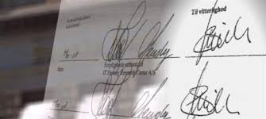

Løftet er ægte fra starten, men indholdet af løftet ændres. 

Eller der bliver forfalsket med en underskrift.

---

**Forvanskning:** Aftaler eller beskeder der under fremsendelsen ændres eller forvanskes ved en fejl, hvorved aftalen får et andet indhold, aftalelovens § 32, stk. 2:

"Bliver en afgiven viljeserklæring, som befordres ved telegraf eller mundtlig fremføres ved bud, forvansket ved fejl fra telegrafvæsenets side eller ved urigtig gengivelse af budet, er afgiveren ikke bundet ved erklæringen i den skikkelse hvori den kom frem, selv om den, til hvem erklæringen er afgivet, var i god tro. Vil afgiveren gøre gældende at erklæringen er uforbindende, har han dog at give meddelelse derom uden ugrundet ophold, efter at forvanskningen er kommet til hans kundskab. Undlader han det, er han bundet ved erklæringen i den skikkelse, hvori den kom frem, såfremt den, til hvem erklæringen er afgivet, var i god tro".

Det antages, at ordene »befordres ved telegraf« ved en analogislutning omfatter telefax, email og SMS.

---

I forarbejderne til bestemmelsen fremhæves følgende: »Ved Forvanskning tænkes […] naturligvis kun paa Realitetsændringer; Forandringer, som ikke indvirke paa Erklæringens Forstaaelse, ere selvfølgelig uden Betydning«.

---

Hvis afsenderen ikke vil være bundet af indholdet i den fejlagtige erklæring, skal afsenderen uden ugrundet ophold efter at vedkommende har opdaget fejlen, give besked til modtageren om, at afsenderen ikke vil være bundet. 

---

Gør afsenderen ikke det, er vedkommende bundet af indholdet i den fejlagtige aftale.

Bestemmelsen i aftalelovens § 32, stk. 2 tager ikke stilling til, om afsenderen har pligt til at erstatte den godtroende erklæringsmodtager det tab, denne lider ved at stole på erklæringen. 

Her må gælde almindelige erstatningsregler, således afsenderen er erstatningspligtig, når forvanskningen skyldes dennes fejl, eller ansvar kan støttes på arbejdsgiveransvaret i DL 3-19-2.

---

Se dommen i **U 2018.553 V**: Aftalelovens §§ 32 og 39 anvendelig på fejl i pensionsselskabs tilbud til kunde om månedlige udbetalinger på en ratepension, idet de månedlige udbetalinger ved en fejlskrift var angivet til 84.429 kr. i stedet for 74.429 kr. 
**<a href="https://pro.karnovgroup.dk/document/7000804760/1" target="_blank">Dommen klik her!</a>**


---

Se dommen i **U 2007.640 V** Forretning var ikke bundet af forkert priskiltning.
**<a href="https://pro.karnovgroup.dk/document/7000361980/1" target="_blank">Dommen klik her!</a>**

---

Se dommen i **U 2000.1218 V** Part ikke bundet af modparts accept, da modparten burde have indset, at der forelå en fejltagelse, jf. aftalelovens § 32. 
**<a href="https://pro.karnovgroup.dk/document/7000196494/1" target="_blank">Dommen klik her!</a>**


---

Se dommen i **U 1996.459 Ø** Bud på tvangsauktion uforbindende efter aftalelovens § 32.
**<a href="https://pro.karnovgroup.dk/document/7000202164/1" target="_blank">Dommen klik her!</a>**

---


Se dommen i **U 1989.273 V** Fejl i skøde vedrørende betaling af tilslutningsafgifter. Aftalelovens § 32. 
**<a href="https://pro.karnovgroup.dk/document/7000198499/1" target="_blank">Dommen klik her!</a>**

---

Se også udtrykket fra romerretten: *"Reservatio mentalis"*;	"bevidst uoverensstemmelse mellem vilje og erklæring."
    
---

**Hvad er voldelig tvang?**

Voldelig tvang, er en stærk ugyldighedsgrund, det følger af aftalelovens § 28, stk. 1:

"Er en viljeserklæring retsstridigt fremkaldt ved personlig vold eller ved trussel om øjeblikkelig anvendelse af sådan, er den ikke bindende for den tvungne".

---


Aftalen er ugyldig hvis løftet fra løftegiver er fremkaldt ved vold eller trussel om øjeblikkelig anvendelse af mekanisk vold, fx holder en pistol for panden af løftegiver, eller en kniv for halsen.

Tvangen (truslen) skal have henblik på løftets afgivelse, således at det tilfælde, at en retshandel er fremkaldt ved en i spøg fremsat trussel, ligesom når løftet er afgivet af frygt, der ikke er fremkaldt ved nogen derpå rettet trussel, falder uden for tvangsbegrebet.

---

Sådanne løfte kan dog efter omstændighederne tilsidesættes efter aftalelovens §§ 33 eller 36.

Den retsstridige trussel kan både forekomme i ord eller gerning. 

---

Om trusselen går ud på at påføre personen fysisk skade er uden betydning. 

Om trusselen fremsættes direkte over for den, der tilsigtes tvunget, eller en anden person med henblik på, at denne viderebringer trusselen, er ligeledes uden betydning. 

Om trusselen rent faktisk er båret af en vilje til at udføre den retsstridige handling er også uden betydning, når den truede må antages at anse trusselen for alvorligt ment. 

---

Også trusselens styrke er principielt uden betydning for dens retsstridighed (men kan influere på adressatens beføjede tro på, at trusselen er alvorligt ment).

Ordene **personlig vold** taler for, at der alene tænkes på vold - eller trussel herom - som er rettet direkte mod erklæringsgiverens person.

---


Om udøvelse af vold i forbindelse med indgåelse af en aftale overtrædes straffelovens bestemmelser (Lovbekendtgørelse 2018-09-20 nr. 1156), jf. straffelovens § 244-246 om de mere om mindre kvalificerede former for strafbar vold. Se også straffelovens § 288 om røveri, samt straffelovens § 260 om ulovlig tvang. 
**<a href="https://jura.tepedu.dk/lovsamling.html" target="_blank">Straffeloven i Lovsamlingen klik her!</a>**

---

Hvis det er tredjemand, som truer for at fremprovokere et løfte, og løftegiver ikke vil være bundet af løftet/aftalen, skal løftegiver uden ugrundet ophold give løftemodtager besked om, at denne er blevet truet til at afgive løftet. 

Gør løftegiver ikke det, bliver vedkommende bundet af sit løfte og aftalen er bindende, jf. aftalelovens § 28, stk. 2.

---

Reglerne i aftalelovens §§ 28-29 omfatter den såkaldte kompulsive tvang, dvs. at erklæringsgiveren er bevæget til at afgive løftet ved trussel om påførelse af et onde.

Mens aftalelovens § 28 omfatter den voldelige kompulsive tvang, omfatter aftalelovens § 29 den ikke-voldelige kompulsive tvang.

---

**Kompulsiv** betyder: Fremkaldt ved trusler.

Kompulsiv tvang	er tvang, der retter sig mod viljen. Modsat mekanisk tvang.

---

Ved voldelig kompulsiv tvang i aftalelovens § 28 er retshandelen ugyldig, selv om løftemodtageren var i god tro. 

Bestemmelsen omhandler en såkaldt stærk ugyldighedsgrund, der som udgangspunkt bevares selv over for en erklæringsmodtager i god tro, jf. dog aftalelovens § 28, stk. 2 om manglende reklamation.

---

Se dommen i **U 2010.1819 Ø** Bruger af betalingskort hæftede for samlevers misbrug. 
**<a href="https://pro.karnovgroup.dk/document/7000443622/1" target="_blank">Dommen klik her!</a>**

---

Om betydningen her i visse overdragelsestilfælde, se fx gældsbrevsloven § 17 og tinglysningsloven § 27.

---

**Gældsbrevslovens § 17:**

"Udstederen kan selv over for en erhverver i god tro påberåbe sig, at gældsbrevet var falsk eller forfalsket,  underskrevet på hans vegne uden fuldmagt dertil, eller ugyldigt på grund af voldelig tvang (lov nr. 242 af 8. maj 1917 om aftaler og andre retshandler på formuerettens område § 28) umyndighed som følge af mindreårighed og tinglyst værgemål med fratagelse af den retlige handleevne, jf. værgemålslovens § 6, eller manglende evne til at handle fornuftsmæssigt, jf. værgemålslovens § 46, at gældsbrevet var erklæret dødt og magtesløst,  eller at fordringen var ophørt eller forandret efter lovgivningens regler om deponering, forældelse, præklusion, tvangsakkord eller gældssanering". 

---

**Tinglysningslovens § 27, stk. 1:**

"Når et dokument er tinglyst, kan godtroende erhververe af rettigheder over ejendommen ifølge tinglyst aftale ikke mødes med nogen indsigelse mod nævnte dokuments gyldighed. Den indsigelse, at et dokument er falsk eller forfalsket, eller at dets udstedelse retsstridig er fremkaldt ved personlig vold eller ved trussel om øjeblikkelig anvendelse af sådan, eller at udstederen var umyndig ved udstedelsen, bevares dog også overfor den godtroende erhverver. Ved overdragelse af et tinglyst negotiabelt pantebrev til eje eller pant gælder endvidere reglerne i §§ 27 a og 27 b."

----

**<a href="https://jura.tepedu.dk/lovsamling.html" target="_blank">Gældsbrevsloven og tinglysningsloven i Lovsamlingen klik her!</a>**

---

**Handleevne** betyder en persons evne til at forpligte sig ved retshandler fx ved et køb.

---


Ved ikke-voldelig kompulsiv tvang fx **afpresning**, er retshandelen derimod gyldig, hvis løftemodtageren var i god tro, da løftet kom til løftemodtagerens kundskab, jf. aftalelovens § 29. 

Denne bestemmelse i aftalelovens § 29 omhandler en såkaldt svag ugyldighedsgrund, som kan fortabes over for en godtroende erklæringsmodtager, se nærmere nedenfor.

---

**"Afpresning"**	i straffeloven er fremsættelse af trusler mod en anden for derved at opnå en uberettiget vinding, jf. straffelovens § 281.

Sager om afpresning kan efter omstændighederne have betydelig grovhed og nærme sig røveriforhold. 

---

I nyere tid er der således set sager, hvor rockere og 2. generationsindvandrerbander med gangsterlignende metoder i form af trusler med tæskehold o.l. har tvunget andre til at betale "dummebøder" ofte til betydelige beløb. 

---

Som eksempler fra trykt praksis på andre grove afpresningsforhold kan nævnes: 

Dommen i **U 1975.1117 Ø** Telefonisk trussel om at ødelægge forretning med bombe, sammen med en anden skriftligt truet på livet - i første tilfælde krævet 60.000 kr., i sidste tilfælde 800.000 kr. - hver fængsel i 1 år 3 mdr. 
**<a href="https://pro.karnovgroup.dk/document/7000211837/1" target="_blank">Dommen klik her!</a>**

---

Dommen i **U 1978.216 V** Truet med at bringe 4 bomber til sprængning på skibe, medmindre der betaltes 300.000 - fængsel i 2 år, jf. straffelovens § 286. 2 års fængsel for forsøg på afpresning (300 US dollar) gennem trusler om terrorangreb mod rederis skibe. 
**<a href="https://pro.karnovgroup.dk/document/7000208702/1" target="_blank">Dommen klik her!</a>**

---

**Umyndighed:**

**"Umyndige"** er personer under 18 år, der ikke har indgået ægteskab (mindreårige), samt personer, der har fået frataget handleevnen efter værgemålslovens § 6.

---


**<a href="https://jura.tepedu.dk/lovsamling.html" target="_blank">Værgemålsloven i Lovsamlingen klik her!</a>**


---

**Personer under 18 år:**

Det er hovedreglen i dansk ret, at umyndige ikke kan indgå retshandler eller råde over deres formue, fx købe på kredit, sælge sine ting, pantsætte sine ting – aftale vil være ugyldig, uanset om løftemodtager var i god tro, jf. værgemålslovens §§ 44 og 45.

---

Undtagelserne for denne hovedregel findes i værgemålslovens § 42 – hvorefter der kan indgås gyldige aftaler med umyndige, hvis der er tale om:

1.	**"Selverhvervelsesreglen"** (kontantreglen)

2.	**"Pengereglen"**

---

**"Selverhvervelsesreglen":**  


Personer over 15 år kan råde over deres egne penge, som de selv har tjent fx ved at gå med aviser eller fået ved arv/gave, og hvad værgen har givet dem. !!NB – kun ved kontantkøb (dog ikke ved kreditaftaler, da den umyndige ikke kan binde sig for fremtiden).

---

**Pengereglen:**  

Pengereglen er en uskreven retsgrundsætning, hvorefter penge, der uberettiget er betalt af en umyndig, ikke kan forlanges tilbagebetalt fra en modtager fx købmanden, der har modtaget pengene i god tro.

En aftale med en umyndig, fx en 8-årig, er gyldig, hvis pengereglen er opfyldt:  

Pengene modtages kontant til fuld betaling, dvs. ej ved kreditkøb, da en umyndig ikke kan forpligte sig for fremtiden ved afbetaling.

---

Sælgers gode tro er afgørende. 

Er sælgeren i tvivl, skal sælgeren bede om værgens samtykke, jf. værgemålslovens § 44.

---

Situation: Aftale med mindreårig indgås i god tro, men aftalen rammes af ugyldighed.

Hver part skal tilbagelevere, hvad de hver især har modtaget. Hvis det er muligt.

---

Kan den umyndige ikke tilbagelevere, og der er tale om en genstand, som har været den umyndige til nytte, fx cykel eller computer, kan den umyndige risikere at skulle betale erstatning til løftemodtager efter nyttereglen, jf. værgemålslovens § 45.

---

**Nyttereglen:** Bliver en aftale ugyldig, fordi den ene part er umyndig, skal parterne tilbagelevere, hvad de har modtaget, eller, hvis dette ikke er muligt, erstatte dets værdi. Den umyndige skal dog kun yde erstatning i det omfang, det modtagne skønnes at være kommet denne til nytte, jf. værgemålslovens § 45, stk. 1.

---

Har den umyndige fremvist falsk ID ved aftalens indgåelse, skal den umyndige erstatte løftemodtagers tab, uden hensyn til nyttereglen.

---

Derudover gælder de almindelige erstatningsretlige regler.

---

Forbrugerklagenævnspraksis om pengereglen:^[Se nævnte afgørelser hos *Anne-Dorte Bruun Nielsen*: U.2016B.197 om " Mindreårige, pengereglen og elektroniske betalingsmidler". Artiklen behandler mindreåriges betaling med elektroniske betalingsmidler og analyserer begrebet »kontant« dels i relation til pengereglen, dels i relation til forbuddet imod gældsstiftelse.]

---

I **Forbrugerklagenævnets Årsberetning 1982, s. 75** (1), havde en 12-årig dreng købt elektroniske spil for 398 kr. Han betalte spillet kontant. Pengene havde han fået ved uden forældrenes tilladelse at hæve 400 kr. på en bankbog. Forbrugerklagenævnet fandt, at det måtte anses som sædvanligt, at mindreårige på egen hånd købte varer som den pågældende, og fandt ikke, at der var et sådant misforhold mellem drengens alder og købesummens størrelse, at sælgeren burde have indset, at drengen ikke havde ret til at råde over pengene. Trods drengens manglende ret til at råde over pengene, måtte aftalen derfor efter Nævnets opfattelse anses for bindende. (**Afgørelsessagsnr.: 82-340-36**).

---

Se ligeledes samme sted, s. 75 (2). En 13-årig dreng købte en legetøjsbil til 1.080 kr. uden forældrenes tilladelse. Her fandt Forbrugerklagenævnet, at legetøjsbilen havde så høj en pris, at forhandleren burde have undersøgt, om drengen havde tilladelse til købet, inden han solgte bilen. Da forældrene ikke havde givet denne tilladelse, var den indgåede aftale ikke gyldig, og legetøjsforhandleren måtte tilbagebetale købesummen mod at få legetøjsbilen tilbage. (**Afgørelsessagsnr.: 82-340-5**).

---

I **Juridisk Årbog 2000, s. 98**, er refereret en afgørelse vedrørende en 13-årig dreng, der ved kontant betaling købte et stereoanlæg med tilhørende cd-brænder og forsikring for i alt 6.088 kr. Anlægget blev købt over i alt 3 dage, idet alt udstyret ikke blev anskaffet på én gang. Købet blev betalt med penge, den umyndige ikke var berettiget til at råde over, idet de var hævet fra hans mors sparekassebog uden hendes samtykke eller viden. Sælger gjorde gældende, at det i dagens Danmark er almindeligt, at unge mennesker i teenagealderen selv køber stereoanlæg, videomaskiner og lignende elektronisk udstyr i alle prisniveauer, dels at det forhold, at handlen var foregået over flere dage, og at det største enkeltstående kontantbeløb, der således var modtaget, udgjorde 2.199 kr., ikke gav sælgeren anledning til at fatte mistanke om, at den mindreårige ikke var berettiget til at foretage købet. Forbrugerklagenævnet fandt, at det måtte anses for usædvanligt, at en 13-årig selv foretager kontantkøb for mere end 6.000 kr., og at den erhvervsdrivende ikke kunne have rimelig grund til uden videre at gå ud fra, at den mindreårige betalte med midler, som han selv havde rådighed over. Forbrugerklagenævnet bemærkede, at omstændighederne i forbindelse med købet – herunder drengens alder og beløbets størrelse – burde have givet den erhvervsdrivende anledning til nærmere at overveje den mindreåriges adkomst til selv at råde over pengene. Det burde derfor have stået den erhvervsdrivende klart, at den mindreårige ikke var berettiget til at råde over godt 6.000 kr. til indkøb af stereoanlæg, hvorfor købet fandtes ugyldigt, og den erhvervsdrivende måtte tilbagebetale det samlede beløb, han havde modtaget, imod udlevering af stereoanlægget. (**Afgørelsessagsnr.: 2000-4011/7-222**).

---

I **Juridisk Årbog 2000, s. 99**, er refereret en sag om en umyndig forbruger, der indgik aftale om køb af en høretelefonforstærker for midler, han havde erhvervet til sin konfirmation. Forbrugerklagenævnet fandt derfor, at aftalen ikke kunne anses for ugyldig. Der var i sagen ikke oplysning om beløbsstørrelsen, men dette er jo også irrelevant, når den umyndige faktisk disponerede over penge, han havde til fri rådighed. Sagen vedrører herudover købelovens § 75 om sælgerens leveringsforbehold. (**Afgørelsessagsnr.: 1999-4011/7-209**).

---

Se endvidere begrebet **ratihabition**; **"efterfølgende godkendelse".** 

Anvendes fx på aftaler indgået af mindreårige, som efterfølgende bliver gyldige ved, at den nu myndige opfylder aftalen.

---

**Værgemål og fornuftsmangel:**


Personer over 18 år kan komme under værgemål/umyndiggøres, fx pga. svær demens, sindssygdom, psykisk handicap mv.

Er ude af stand til at varetage deres økonomiske anliggender, og hvor der er en risiko for forringelse eller økonomisk udnyttelse.

---

Loven taler om **”manglende evne til at handle fornuftsmæssigt".**

Der beskikkes en værge, som får ansvaret for økonomien.

Aftaler indgået med voksne under værgemål er ugyldige, jf. værgemålslovens § 46, uanset om løftemodtager var i god tro.


---

## De svage ugyldighedsgrunde


**De svage ugyldighedsgrunde omfatter følgende grunde eller årsager:**


* **Aftalers ugyldighed ved simpel tvang**, jf. aftalelovens § 29.

* **Svig**, jf. aftalelovens § 30.

* **Udnyttelse**, jf. aftalelovens § 31.

* **Fejlskrift/anden fejltagelse**, jf. aftalelovens § 32, stk. 1.


---

Aftalers ugyldighed ved simpel tvang, jf. aftalelovens § 29:

**Hvad er simpel tvang?**

Simpel tvang, som en svag ugyldighedsgrund, følger af aftalelovens § 29:

"Er en viljeserklæring retsstridigt fremkaldt ved anden tvang end i § 28 omtalt, er den ikke bindende for den tvungne, hvis den, til hvem erklæringen er afgivet selv har udøvet tvangen eller har indset eller burdet indse, at erklæringen retsstridigt var fremkaldt ved tvang fra tredjemands side".

---

Den ikke-voldelige kompulsiv tvang/psykisk tvang, er fx trusler om boykot, skandalisering og afpresning. 

---

For det første skal den handling, der trues med, være lovlig, jf. herved dommen i **U 1928.47 H**. 
**<a href="https://pro.karnovgroup.dk/document/7000239630/1" target="_blank">Dommen klik her!</a>**


For det andet skal den handling, der trues til, være lovlig.

For det tredje skal der være en rimelig/saglig sammenhæng mellem dét, der trues med, og dét, der trues til (altså søges opnået fra den truendes side).

---

Retsstridighedsbetingelsen opfylder så at sige »sig selv«, når viljeserklæringen er fremkaldt ved trussel om personlig vold eller fremkaldt ved udøvelse af sådan, jf. herom til § 28, der er en stærk ugyldighedsgrund.

---

Derimod er det naturligvis retmæssigt at true en skyldner med inkasso eller retslig kreditorforfølgning, hvis skyldneren ikke betaler, dog under hensyntagen til god inkassoskik i inkassolovens § 9: 

"Inkassovirksomhed skal udøves i overensstemmelse med god inkassoskik. Det er i strid med god inkassoskik at anvende metoder, der udsætter nogen for urimelig pression, skade eller ulempe".
**<a href="https://jura.tepedu.dk/lovsamling.html" target="_blank">Inkassoloven i Lovsamlingen klik her!</a>**

---

Det er ligeledes retmæssigt at true en butikstyv med politianmeldelse, hvis ikke tyven betaler købesummen (altså ikke blot den lavere indkøbspris) for den stjålne vare. Det er derimod retsstridigt under trussel om politianmeldelse at true butikstyven til at betale et større beløb.

---

Se dommen i **U 1968.512 V** Butiksbestyrers handlemåde over for butikstyv bedømt som afpresning og straffet med dagbøder, jf. straffelovens § 287. 
**<a href="*https://pro.karnovgroup.dk/document/7000213223/1" target="_blank">Dommen klik her!</a>**

---

Se dommen i **U 1975.656 V** Betinget dom uden straffastsættelse, samt bøde for at afpresse butikstyve for store beløb under trusler om politianmeldelse.
**<a href="https://pro.karnovgroup.dk/document/7000211639/1" target="_blank">Dommen klik her!</a>**

---

Løfter, der er motiveret af simpel tvang er ikke bindende for løftegiver, hvis løftemodtager selv har udøvet tvangen.
  
Hvis løftet er motiveret simpel tvang udøvet af tredjemand, er løftegiver ikke bundet af sit løfte, hvis løftemodtager indså eller burde have indset, at løftet blev afgivet som følge af simpel tvang.

---
  
Hvis løftemodtager derimod var i god tro, dvs. ikke indså eller burde have indset at løftet blev afgivet som følge af tredjemands simple tvang, er løftegiver bundet af sit løfte.

---

"Bevisbyrden" for, at det er den retsstridige tvang, som har fremkaldt løftet, ligger hos den løftegiver, der nu vil påberåbe sig ugyldighed.

---

* **Svig**, jf. aftalelovens § 30:

**Hvad er svig?**


**Svig**, se nærmere ordlyden i aftalelovens § 30:

"En viljeserklæring er ikke bindende for afgiveren, hvis den, til hvem erklæringen er afgivet, har fremkaldt den ved svig eller har indset eller burdet indse, at den var fremkaldt ved svig fra tredjemands side.
Stk. 2. Har den, til hvem erklæringen er afgivet, svigagtigt givet urigtige oplysninger om omstændigheder, som kan antages at være af betydning for erklæringen, eller gjort sig skyldig i svigagtig fortielse af sådanne omstændigheder, anses erklæringen for at være fremkaldt ved den således udviste svig, medmindre det gøres antageligt, at denne ikke har indvirket på erklæringen".

---

<h4><a href="https://www.youtube.com/embed/n52ni_aO5iE" target="_blank">Video om svig</a></h4>

---

Ved **svig** forstås et retsstridigt forhold, bestående i, at en person mod bedre vidende giver urigtige oplysninger eller fortier sandheden med forsæt til derved at fremkalde en viljeserklæring.

Svig, er således en form vildledelse med det formål at få nogen til at foretage en juridisk disposition, fx indgå en aftale, på et urigtigt grundlag, så personen lider et tab eller udsættes for en uventet risiko for et tab.

---

Juridisk latinske term: **"falsus in uno, falsus in omnibus"** – Én gang en løgner, altid løgner.

---

Svig kan bestå i, at forhold forties, eller at der siges noget urigtigt mod bedre vidende, jf. også overtrædelser af det offentligretlige vildledningsforbud i markedsføringslovens §§ 5-7, samt det civilretlige vildledningsforbud i købelovens § 76, stk. 1, nr. 1-2. 
**<a href="https://jura.tepedu.dk/lovsamling.html" target="_blank">Se lovene i Lovsamlingen klik her!</a>**

---

Da svigagtig optræden er skadelig for det økonomiske samliv, knytter retssystemet alvorlige sanktioner hertil. 

Et løfte, der er fremkaldt ved svig, kan erklæres ugyldigt i medfør af aftaleloven § 30. 

Dertil kommer, at svig som udgangspunkt er udtryk for forsæt til en formueskade, hvorved den svigagtige adfærd resulterer i en erstatningspligt.


---

Se dommen i **U 1991.523/3 H** om svig ved kreditforsikringer. 
**<a href="https://pro.karnovgroup.dk/document/7000199604/1" target="_blank">Dommen klik her!</a>**

---

Svig kan i almindelighed ikke medføre ugyldighed, når adressaten er i god tro (på kundskabstidspunktet).

Såvel urigtige oplysning som fortielser kan medføre, at der foreligger svig. I begge henseender gælder et krav om "forsæt" (at det er sket med vilje). 

Svig kan således være fejlinformation, urigtige oplysninger og fortielser, der bruges eller tilbageholdes for at få en aftale i hus eller få solgt en brugt bil:


---


Situationen: Sælger af en båd påstår urigtigt, at båden har været ejet af en berømthed, og på den baggrund meddeler køber, at han vil købe båden, trods den høje købesum.

Løftet om køb af båden kan erklæres ugyldigt, hvis modtageren af løftet var i ond tro bådesælgeren. 

Løftet er så ikke bindende for bådekøberen

Bådesælgeren er i ond tro, hvis: han vidste eller burde vide om et forhold og alligevel vælger imod bedrevidende at bruge urigtige oplysninger eller fortie sandheden, for at få en aftale i hus.

---

**Svig udøvet af tredjemand:**

**Situationen:** 

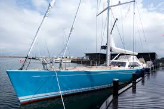


Peter (tredjemand) har sin båd til salg hos Bo Bådesælger. 

Peter møder en interesseret køber på Bo's parkeringsplads, og fortæller, at båden har været A P Møllers i 1990’erne. 

På den baggrund bliver båden solgt med det samme.

Bo Bådesælger (løftemodtager) er i god tro, idet han intet ved om Peters fejlinformation. 

Aftalen mellem bådekøberen og Bo Bådesælger er derfor bindende. 

---

**Aftalers ugyldighed udnyttelse**, jf. indholdet af aftalelovens § 31:

"Har nogen udnyttet en andens betydelige økonomiske eller personlige vanskeligheder, manglende indsigt, letsind eller et bestående afhængighedsforhold til at opnå eller betinge en ydelse, der står i væsentligt misforhold til modydelsen, eller som der ikke skal ydes vederlag for, er den, der således er udnyttet, ikke bundet ved den af ham afgivne viljeserklæring.
Stk. 2. Det samme gælder, hvis tredjemand har gjort sig skyldig i et sådant forhold som omtalt i stk. 1 og den, til hvem viljeserklæringen er afgivet indså eller burde indse dette".

---

**Situation:**

Bent låner Anders penge og Bent kræver urimeligt høje renter (åger-renter). 

Bent er vidende om at A er i økonomiske vanskeligheder og ikke kan låne penge andre steder.  

Når Bent i aftaleøjemed udnytter viden om Anders´ vanskeligheder eller manglende viden/indsigt mv., er der tale om udnyttelse. 

Bent er i ond tro og aftalen er ugyldig. 

---

Det er navnlig ved erklæringens afgivelse, om der er bestående en underlegenhedstilstand hos erklæringsgiveren i forhold til erklæringsmodtageren, som er i fokus, når der skal tages stilling til, om aftalelovens § 31 kan anvendes.

---

Se dommen i **U 1985.672 V**, hvor en aftale med 79 årlig lejer om pligt til fraflytning blev tilsidesat. 
**<a href="https://pro.karnovgroup.dk/document/7000205936/1" target="_blank">Dommen klik her!</a>**

---

Se dommen i **U 1951.486 H**, hvor et testamente og pantebrev blev anset uforbindende efter aftalelovens § 31. 
**<a href="https://pro.karnovgroup.dk/document/7000222560/1" target="_blank">Dommen klik her!</a>**

---

Har løftemodtageren ligefrem været ude af stand til at handle fornuftsmæssigt, bør det selvsagt rutinemæssigt overvejes at påberåbe sig værgemålslovens § 46 »ved siden af« aftalelovens § 31.

---

Se dommen i **U 1957.129 H**, hvor en 66-årig gårdejers salg af gård til ung husbestyrerinde blev anset uforbindende (ugyldig) pga. manglende evne til at handle fornuftsmæssigt. 
**<a href="https://pro.karnovgroup.dk/document/7000223700/1" target="_blank">Dommen klik her!</a>**

---

Det skal have været løftemodtageren bevidst, både at der forelå en af de nævnte underlegenhedstilstande, at en udnyttelse af den pågældende tilstand fandt sted, samt at udnyttelsen var utilbørlig.

Det er tidspunktet for aftalens indgåelse, der er afgørende for, om der foreligger et relevant »væsentlig misforhold« mellem ydelse og modydelse. 

---

Om løftemodtageren har betinget sig fordelen til sig selv eller andre er irrelevant. 

Der må ved afgørelsen af, om et relevant misforhold foreligger, tages hensyn til den risiko, løftemodtageren løb ved aftalens indgåelse.

---

Det løftegiveren har valget mellem, om løftegiver vil have viljeserklæringen kendt ugyldig som helhed, eller om løftegiver - eventuelt i forbindelse med en påstand om ugyldighed og tilbagegivelse af ydelserne - vil kræve vederlaget nedsat, således at misforholdet mellem de to ydelser fjernes.

Den udnyttede kan også vælge at fastholde retshandelen, hvis denne nu på grund af fx en prisstigning eller en rentestigning kan se sin fordel herved.

---

"Hvis du fortæller sandheden, så behøver du ikke huske alt" – *Mark Twain*


---

**"Fejlskrift/anden fejltagelse"**, jf. ordlyden i aftalelovens § 32, stk. 1:

"Den, der har afgivet en viljeserklæring, som ved fejlskrift eller anden fejltagelse fra hans side har fået et andet indhold end tilsigtet, er ikke bundet ved erklæringens indhold, hvis den, til hvem erklæringen er afgivet, indså eller burde indse, at der forelå en fejltagelse."

---

Reglen i aftalelovens § 32, stk. 1, omfatter kun tilfælde, hvor uoverensstemmelsen mellem vilje og erklæring skyldes en vildfarelse hos den erklærende. 

"Fejlskrift" er fx en mail, der får et andet indhold end tilsigtet fra den der afgiver viljeserklæringen, dvs. den der sender mailen. 

En **"erklæringsvildfarelse"** er en ubevidst uoverensstemmelse mellem vilje og erklæring, fx ved en fejlskift. Kaldes også "uægte vildfarelse".

---

Se **U 2020.1114 Ø** Ikke hjemmel til at opretholde parkeringsafgift i en situation, hvor der var betalt for parkering, men hvor der var tastet et ciffer forkert i køretøjets registreringsnummer.
**<a href="https://pro.karnovgroup.dk/document/7000848763/1" target="_blank">Dommen klik her!</a>**

---

Løftet i mailen er ikke bindende for løftegiver, hvis løftemodtager indså eller burde have indset, at der var tale om en fejl, idet løftemodtager så ville være i ond tro.

Modsætningsvis: Hvis løftemodtager ikke indså eller burde have kunnet indse, at det var en fejl, er løftemodtager i god tro og aftalen er gyldig.

---

Er erklæringen udformet af en anden, men har et andet indhold end erklæringsgiveren forestillede sig, finder bestemmelsen anvendelse.

Se dommen i **U 1972.568 H** 75-årig kvindes underskrivelse på skøde i den tro, at det var et testamente, blev tilsidesat efter aftalelovens § 32, stk. 1. 
**<a href="https://pro.karnovgroup.dk/document/7000214865/1" target="_blank">Dommen klik her!</a>**

---

Sammenfattende må det antages, at reglen i aftalelovens § 32, stk. 1 dækker både tilfælde om, hvor løftegiveren har afgivet en viljeserklæring, løftegiver overhovedet ikke ville have afgivet, samt de tilfælde, hvor løftegiveren vel ville afgive viljeserklæringen, men denne ikke har det indhold, løftegiver regnede med.

---

<h4><a href="https://www.youtube.com/embed/-xVEbZDAZZ8" target="_blank">Video om fejlskrift</a></h4>

---

## God og ond tro

**God tro** (på latin kaldet; "bona fide")	god tro er:

+ Løftemodtager(LM) havde ikke viden om ugyldighedsgrunden.
      
+ Løftemodtager(LM) vidste ikke eller burde ikke have vidst, at løftet fra løftegiver (LG) var mangelfuldt, fx afgivet pga. ulovlig tvang, eller at løftegiver var umyndig.


---
      
**Ond tro** er:

+ Løftemodtager (LM) havde en viden om ugyldighedsgrunden. 
      
+ Løftemodtager indså eller burde have indset, at løftet fra løftegiver var mangelfuldt, fx afgivet pga. ulovlig tvang eller at løftegiver var umyndig.
      
---

<h4><a href="https://www.youtube.com/embed/Ax4X9V-kdGw" target="_blank">Video om god og ond tro</a></h4>

---

**Ved stærke ugyldighedsgrunde:**

+	LM er i ond tro = LG er ikke bundet af løftet (aftalen erklæres ugyldig).
      
+	LM er i god tro = LG er ikke bundet af løftet (aftalen erklæres ugyldig).

---      

**Ved svage ugyldighedsgrunde:**

+	LM er i ond tro = LG er ikke bundet af løftet (aftalen erklæres ugyldig).
      .
+	LM er i god tro = LG er bundet af løftet (aftalen fortsat bindende).


---

**Retsvirkningen af at en aftale er ugyldig:**

-	Parterne fritages for at opfylde aftalen. 

-	Evt. leverede ydelser skal tilbageleveres.

-	Evt. erstatning til den forurettede part, hvis der er lidt et økonomisk tab. 


---

## Urimelige aftaler

**Urimelige aftaler** kan omfatte følgende forhold:

* **Indholdsmangler** - Hvis aftalen har fået et urimeligt indhold, kan den tilsidesættes helt eller delvist.

Se:

*	Aftalelovens § 33: Hvis aftalen er i **strid med almindelig hæderlighed**.

*	"Generalklausulen", jf. aftalelovens § 36: "Aftalen kan tilsidesættes helt eller delvis, hvis det ville være urimeligt eller i strid med redelig handlemåde at gøre den gældende". 

Ved forbrugeraftaler gælder yderligere aftalelovens § 38c, stk. 2.

---

**I urimelighedsvurderingen indgår:**

*	Forholdene ved aftalens indgåelse

*	Aftalens indhold og

*	Senere indtrufne omstændigheder

---

<h4><a href="https://www.youtube.com/embed/VliOntGAvUU" target="_blank">Video om Forudsætningslæren</a></h4>

---

## Bristende forudsætninger

**Forudsætningslæren:**

Et løfte kan afgives på baggrund af nogle forudsætninger, som ikke nødvendigvis er diskuteret eller udtrykt klart mellem parterne i en aftale.

Hvis forudsætningen ikke holder, taler man om bristende, svigtende eller urigtige forudsætninger, hvilket i nogle tilfælde kan medføre, at aftalen ophæves.

En bristende forudsætning: Løftegivers vildfarelse vedrører fremtidige forhold, fx køb af en bryllupskage til bryllup, der bliver aflyst.

---


**Ophævelse af aftalen kræver at 3 betingelser skal være opfyldt:**

1.	Forudsætningen skal have været væsentlig for løftegiver.

2.	Forudsætningen skal være kendt for løftemodtager.

3.	Forudsætningen skal være relevant og rimelig efter forholdene og i forhold til løftemodtagers risiko og byrde, hvis forudsætningen svigter.

---

Eller benævnt på en anden kort måde:

Bristende forudsætninger, hvis **"afgørende/væsentligt, kendeligt og relevant/rimeligt"**.

---

En **ugyldig aftale** er, når parterne ikke er forpligtet af det løfte de har afgivet, og aftalen ophæves.

*	Tilbagelevere allerede udvekslede ydelser (penge/varer)

*	Evt. erstatning til den part, der har handlet i tillid til aftalen, og ved ophævelsen lider et økonomisk tab.

---


Kaldet den **negativ kontraktsinteresse:**
      
Som betyder, at et erstatningskrav, hvor man i økonomisk henseende stilles, som om aftalen slet ikke var indgået – tilbage til status quo.

Dvs. **"negativ kontraktsinteresse"**	er en erstatning, der stiller en part i et kontraktsforhold, som om kontrakten slet ikke var indgået. 

Modsat den såkaldte **"positiv opfyldelsesinteresse"**, hvor også den mistede fortjeneste skal erstattes. 

Køber skal således stilles som om aftalen var opfyldt efter købsaftalens indhold. I modsætning til den "negative kontraktsinteresse", giver den "positive opfyldelsesinteresse" dermed også dækning for tabt fortjeneste.
      
---

## Standardkontrakter/vilkår

Standardvilkår ses eksempelvis i fortrykt lejekontrakt, salgsaftale for biler, lånedokumenter, forsikringsaftaler.

Hovedreglen er, at standardvilkår trykt på eller vedlagt kontrakten, anses for vedtaget ved kundens underskrift.

Det er en betingelse, at standardvilkårene skal være påtrykt eller vedhæftet kontrakten. 

---

Vilkår der eftersendes efter underskrift gælder ikke, da vilkårene så ikke er gensidigt vedtaget.
        
Undtagelsen til hovedreglen er, at et standardvilkår kan tilsidesættes, hvis det vurderes som urimeligt for kunden (aftalelovens §§ 36 og § 38 a-d).

---

Se fra retspraksis:


Se dommen i **U 2005.2960 S** Vilkår om forlængelse af abonnementsaftale medmindre forbrugeren opsagde inden 30 dage før abonnementsperiodens udløb, tilsidesat:
**<a href="https://pro.karnovgroup.dk/document/7000311279/1" target="_blank">Dommen klik her!</a>**

---

Se dommen i **U 2003.1883 V** Forbruger fritaget for TDC's krav om betaling af opkald til St. Helena, jf. aftalelovens § 38 c, jf. § 36. 
**<a href="https://pro.karnovgroup.dk/document/7000267521/1" target="_blank">Dommen klik her!</a>**

---

En andelsboligforening opfattes som forbrugere og kan derfor påberåbe sig urimelighedsreglerne i aftalelovens §§ 38 c og 36 og dermed få tilsidesat eller ændret kontraktsindgåelser med tredjemand.

---

Se dommen i **U 2019.2389 V**. Andelsboligforening skulle i relation til aftale om juridisk rådgivning anses som forbruger. Aftalen om honorering var åbenbart i strid med god skik-bekendtgørelsens § 3, stk. 4, og andelsboligforeningen kunne kræve en stor del af honoraret tilbagebetalt. 
**<a href="https://pro.karnovgroup.dk/document/7000837142/1" target="_blank">Dommen klik her!</a>**

---

*Salgs- og leveringsbetingelser* skal præsenteres for kunden inden eller i forbindelse med aftalens indgåelse. 

Fremsendelse sammen med faktura anses ikke for vedtaget af kunden.

Usædvanlige vilkår skal fremhæves i en kontrakt, hvis de skal anses for vedtaget – må ikke gemmes blandt ”de små bogstaver.” Risiko for tilsidesættelse, jf. nærmere aftalelovens §§ 38 c, jf. 36.

"Forbrugeraftaler" – Den erhvervsdrivende, som indgår aftaler med forbrugere, skal lave aftaler på en klar og forståelig måde, jf. kravet i aftalelovens § 38b, stk. 2.

Om forbrugeraftaler.
**<a href="https://jura.tepedu.dk/forbrugeraftaler-og-forbrugerbeskyttelse.html" target="_blank">klik her!</a>**


---

**Se fra retspraksis:**

Se dommen i **U 2019.2389 V.** Andelsboligforening skulle i relation til aftale om juridisk rådgivning anses som forbruger. 
**<a href="https://pro.karnovgroup.dk/document/7000837142/1" target="_blank">Dommen klik her!</a>**

---

## Aftalens omfang og fortolkning

**Fortolkningsprincipper ved tvivl om indholdet af en aftale:**  

* **Koncipistreglen:** Aftalen fortolkes til skade for den, som har udarbejdet aftalen, jf. aftalelovens § 38b.

* **Minimumsreglen:** Aftalen fortolkes til fordel for løftegiver. 

* **Prioritetsreglen:** Aftalen fortolkes til fordel for det specielle vilkår frem for det generelle.  

* **Gyldighedsreglen:** Aftalen fortolkes med henblik på at opnå en gyldig aftale, som vil kunne gennemføres.  

* **Rimelighedsreglen:** Aftalen fortolkes i overensstemmelse med, hvad der er rimeligt og hensigtsmæssigt.  

* **Udfyldningsregel:** En regel, der finder anvendelse, hvis der ikke er konkrete holdepunkter for ved fortolkning at nå frem til det modsatte resultat.


---

<h4><a href="https://www.youtube.com/embed/DdFmNJpY3dE" target="_blank">Video om fortolkning af aftaler</a></h4>


---


```{r reglerogfortolkninger,echo=FALSE}
options(knitr.table.format = "html")
collapse_rows_dt <- data.frame(Regel = c("Koncipistreglen", "Minimumsreglen","Prioritetsreglen", "Gyldighedsreglen","Rimelighedsreglen"),
                 Fortolkning = c("Dette fortolkningsprincip er også benævnt som uklarhedsreglen og betyder, at den part, som har konciperet (skrevet) kontrakten må bære risikoen for tvetydighed. Er der en uklarhed i kontrakten, tolkes aftalen til skade eller ugunst for koncipisten og dermed mindst tyngende for den anden part, som ikke har haft indflydelse på aftalens formulering. Uklarhedsreglen er særlig relevant ved fortolkning af standardaftaler, der er udarbejdet af en stærk part.",
                              "Hvis der er tvivl om, hvad løftegiveren har forpligtet sig til i aftalen, vælges den forståelse af aftalen, som er
mest gunstig for løftegiveren. Hvis der fx er tvivl, om der er aftalt simpel kaution eller selvskyldnerkaution, vælges simpel kaution, der er mest gunstig for forbrugeren. Særligt hvad angår forbrugeraftaler, har minimumsreglen fundet en plads i aftalelovens § 38b. Lovbestemmelsen beskytter forbrugeren i de tilfælde, hvor et tyngende aftalevilkår ikke har været til forhandling med en erhvervsdrivende aftalepart. En sådan aftale skal tolkes på den måde, som er mest gunstig for forbrugeren.
",
                              "Ved fortolkning efter prioritetsreglen går et specielt vilkår forud for et generelt vilkår. Man kan også kalde det en fortolkning efter et lex specialis-princip, hvor en speciel og udspecificeret bestemmelse vejer tungere end en generel formuleret bestemmelse",
                              "Hvis man står over for et valg, om aftalen er gyldig og kan gennemføres, eller ugyldig og må bortfalde, er gyldighedsreglen et fortolkningsprincip, hvor aftalen tolkes med henblik på at opnå en gyldig aftale, som vil kunne gennemføres.",
                              "Efter rimelighedsreglen fortolker man ud fra hensigtsmæssigheds- og rimelighedsbetragtninger. Ved tvivl om forståelsen af en aftale, tolkes aftalen i overensstemmelse med, hvad der er rimeligt."))
                 
kable(collapse_rows_dt, align = "l",caption = "Regler og tolkning") %>%
  kable_styling(full_width = T,bootstrap_options = c( "hover","responsive","bordered","striped")) %>%
  column_spec(1, bold = F) %>%
  collapse_rows(columns = 1:2, valign = "top") %>%
  column_spec(1:2,  bold = F, color = "black", background = "lightgrey")%>%
  column_spec(1,  bold = T,italic = TRUE)%>%
  row_spec(0, bold = T, color = "white", background = "darkgrey") 
# row_spec(5:9, bold = T, color = "Black", background = "yellow") %>%
# add_header_above(c( "Koncipistreglen" = 2),italic = TRUE)

```

---

## Ansættelsesret, herunder funktionærloven

Funktionærloven er ikke pensum i Erhvervs- og finansjura på finansøkonomuddannelsen, men kan bruges som viden, når du indgår en ansættelseskontrakt i den finansielle barnche.

**Aftaler om finansøkonomens ansættelse og opsigelse** 

**<a href="https://www.finansforbundet.dk/da/rettigheder-regler/Sider/naarduskalhavenytjob.aspx" target="_blank">Få styr på din ansættelseskontrakt som finansøkonom Klik her!</a>**

---

**<a href="https://www.finansforbundet.dk/da/rettigheder-regler/Sider/reglerforopsigelse.aspx" target="_blank">Opsigelse af en finansøkonom Klik her!</a>**


---

## Funktionærloven

Lovbekendtgørelse nr. 1002 af 24. august 2017 om retsforholdet mellem arbejdsgivere og funktionærer (funktionærloven) indeholder en regulering af funktionærens og arbejdsgiverens rettigheder og forpligtelser, eksempelvis angående opsigelsesvarsel, sygdom, godtgørelse, graviditet, konkurrence mv.

---

For at være omfattet af funktionærloven er grundbetingelsen, at man er beskæftiget med kontorarbejde, køb og salg eller visse former for lagerekspedition.

Desuden skal man arbejde gennemsnitligt mere end 8 timer om ugen og være ansat til at udføre aftalt arbejde efter instruktion fra arbejdsgiveren for at være omfattet af funktionærloven.

---

**Papir på ansættelsen***

Senest en måned efter, man er startet på sit arbejde, og ens gennemsnitlige arbejdstid er på mere end 8 timer om ugen, skal arbejdsgiveren give én et stykke papir med vilkårene for ens ansættelse.

---

**Arbejdsgiveren har blandt andet pligt til at oplyse om:**

Arbejdstagerens og arbejdsgiverens navn og adresse.

Hvis arbejdstagerens arbejde skal udføres på en anden adresse end den, arbejdsgiveren har anført som sit hovedsæde, skal denne adresse også fremgå. Hvis arbejdstageren ikke er tilknyttet et fast arbejdssted, er det i stedet dette, der skal fremgå af arbejdstagerens ansættelsesaftale.

Arbejdstagerens titel, rang, stilling, jobkategori eller en beskrivelse af arbejdet. 

Hvornår arbejdstageren er tiltrådt arbejdet. 

Hvor længe det forventes, arbejdstageren skal være ansat - hvis der er tale om tidsbegrænset ansættelse.

Arbejdstagerens rettigheder til betalt ferie.

Reglerne om arbejdstagerens og arbejdsgiverens opsigelsesvarsel.

Hvad arbejdstageren har ret til, eller hvad der er aftalt i løn. Dette inkluderer også tillæg, eventuelt pensionsbidrag og andre lønandele.

Hvornår arbejdstageren får udbetalt lønnen. 

Arbejdstagerens normale daglige eller ugentlige arbejdstid.

Øvrige væsentlige eller særlige vilkår.

Hvilke kollektive overenskomster der gælder. Hvem overenskomsterne eller aftalerne er indgået med, hvis det drejer sig om parter uden for virksomheden.

---

Disse regler er ikke en del af funktionærloven, men stammer fra ansættelsesbevisloven om arbejdsgiverens pligter ved ansættelsen (Lovbekendtgørelse nr. 240 af 17. marts 2010 om arbejdsgiverens pligt til at underrette lønmodtageren om vilkårene for ansættelsesforholdet.

---

**Prøvetid**

Prøvetiden er højst tre måneder.

Funktionærloven giver mulighed for, at aftale en prøvetid på højst tre måneder. 

I prøvetiden kan arbejdsgiveren opsige funktionæren med 14 dages varsel. 

Hvis der er aftalt et gensidigt opsigelsesvarsel på 14. dage, skal funktionæren også sige op med 14 dages varsel. 

Hvis ikke der er aftalt et gensidigt opsigelsesvarsel, kan funktionæren sige op med dags varsel.

De særlige regler for prøvetid gælder kun, hvis der udtrykkeligt ved ansættelsen er aftalt prøvetid.

---

**Hvis en jobaftale afbrydes**

Hvis arbejdsgiveren bryder en jobaftale har funktionæren krav på løn i en periode, der svarer til funktionærens opsigelsesvarsel.

Hvis arbejdsgiveren nægter at lade funktionæren begynde i et job, som funktionæren er blevet ansat til, har funktionæren krav på løn i en periode, der svarer til funktionærens opsigelsesvarsel.

Det kræver dog, at funktionæren straks gør arbejdsgiveren opmærksom på funktionærens krav og tilbyder at udføre det aftalte arbejde i perioden.

---

**Hvis funktionæren bryder en jobaftale**

Arbejdsgiver har normalt krav på erstatning, hvis funktionæren udebliver fra et job, som er aftalt, funktionæren skulle tiltræde. Erstatningen er sædvanligvis på en halv måneds bruttoløn.

---

**Funktionæren bliver bortvist**

Bliver funktionæren uberettiget bortvist, har funktionæren krav på løn, indtil det lovlige opsigelsesvarsel udløber.

Det kræver dog, at funktionæren straks protesterer mod bortvisningen, gør arbejdsgiveren opmærksom på sit krav, og giver arbejdsgiveren en kort frist (5-8 dage) til skriftligt at oplyse, om han eller hun vil fastholde bortvisningen af funktionæren.

Når funktionæren har protesteret over for arbejdsgiveren, skal funktionæren i begge tilfælde omgående henvende sig til sin lokale fagforeningsafdeling, der så vil tage sig af sagen. Det er vigtigt, at funktionæren protesterer og henvender sig til sin fagforening omgående.

Hvis der går for lang tid, er der risiko for, at bortvisningen eller opsigelsesvarslet vil blive betragtet som godkendt af funktionæren.
Hvis funktionæren skal have arbejdsløshedsdagpenge, og ikke har protesteret mod bortvisningen eller opsigelsesvarslet, risikerer funktionæren at få karantæne.

---

**Erstatning**

Hvis funktionæren bliver uberettiget bortvist, skal arbejdsgiveren betale erstatning svarende til funktionæren løn indtil udløbet af det lovlige opsigelsesvarsel. Det samme gælder, hvis funktionæren forlader jobbet, fordi funktionæren arbejdsgiver groft har misligholdt ansættelsesforholdet.

Hvis det lovlige opsigelsesvarsel er mere end 3 måneder, fastsættes erstatningen efter de almindelige erstatningsregler.

Hvis funktionæren forlader din stilling uden varsel eller med for kort varsel, har arbejdsgiveren normalt krav på erstatning for det tab, han eller hun har lidt. Det samme gælder, hvis arbejdsgiveren ophæver et ansættelsesforhold på grund af grov misligholdelse fra funktionærens side.

Hvis funktionæren ulovligt forlader sin stilling, vil arbejdsgiveren almindeligvis have krav på mindst en halv måneds bruttoløn i erstatning.

---

**Fratrædelsesgodtgørelse**

Er funktionæren blevet opsagt, og har funktionæren været uafbrudt beskæftiget i den samme virksomhed i enten 12 eller 17 år, skal arbejdsgiveren udbetale en  fratrædelsesgodtgørelse på henholdsvis 1 og 3 måneders løn, uanset om funktionæren efterfølgende er ledig, overgår til nyt arbejde, eller går på pension.

---

**Opsigelse**

Send opsigelsen skriftligt.

Funktionæren kan normalt sige sit job op med en måneds varsel.

Funktionæren kan sige sit job op med en måneds varsel til en måneds udgang, med mindre funktionæren er ansat på prøve eller er midlertidigt ansat, eller Funktionæren har aftalt et gensidigt forlænget varsel.

Hvis funktionæren ønsker at stoppe den 31. januar, betyder det, at funktionærens arbejdsgiver skal modtage din opsigelse senest kl. 24.00 den 31. december. Du bør altid sige op skriftligt, så det senere kan bevises.

---

**Opsigelser skal varsles**

Hvis funktionæren bliver afskediget, har funktionæren krav på at få at vide hvorfor, hvis funktionæren beder om det.

Desuden har funktionæren krav på et varsel, som afhænger af, hvor længe funktionæren har været ansat.

---

**Hvis funktionæren har været ansat:**

Under 6 måneder har funktionæren 1 måneds opsigelse (Opsigelsen skal være modtaget inden udløbet af den 5. ansættelsesmåned).

6 måneder til tre år har funktionæren 3 måneders opsigelse (Opsigelsen skal være modtaget inden udløbet af 2 år og 9 måneders ansættelse).

3-6 år har funktionæren 4 måneders opsigelse (Opsigelsen skal være modtaget inden udløbet af 5 år og 8 måneders ansættelse).

6-9 år har funktionæren 5 måneders opsigelse (Opsigelsen skal være modtaget inden udløbet af 8 år og 7 måneders ansættelse).

Over 9 år har funktionæren 6 måneders opsigelse (Opsigelsen skal være modtaget efter 8 år og 7 måneders ansættelse).

---

Opsigelsen bør være skriftlig, og funktionæren skal modtage den senest klokken 24.00 den sidste dag i måneden, før opsigelsesvarslet begynder at løbe.

Hvis funktionæren har 3 måneders opsigelsesvarsel og bliver sagt op til fratræden den 31. juli, skal funktionæren altså have modtaget den skriftlige opsigelse senest 30. april kl. 24.00.

Modtager funktionæren det dagen efter - 1. maj - rykker opsigelsen 1 hel måned.

Hvis funktionæren bliver sagt op kort før, funktionæren rykker fra et opsigelsesvarsel til et andet, skal funktionæren være opmærksom på, at funktionæren varsel kan blive forlænget.

Hvis funktionæren for eksempel bliver sagt op efter 2 år og 10 måneders ansættelse, har funktionæren ikke krav på 3 men 4 måneders varsel, da funktionæren når op på at have været ansat i over 3 år, når opsigelsesvarslet udløber. 

Når ansættelsestiden skal regnes ud, skal prøvetiden eller eventuel vikaransættelse regnes med, og det samme gælder elevtid. Læretid ifølge den tidligere lærlingelov og eventuelt ikke-funktionærarbejde i virksomheden kan ikke medregnes.

---

**Usaglig opsigelse**

Fyring skal være rimeligt begrundet.

Har funktionæren været ansat uafbrudt i mindst et år, har funktionæren krav på erstatning ved en usaglig opsigelse. Usaglig opsigelse er, hvis funktionæren bliver sagt op uden at det er "rimelig begrundet i funktionærens eller virksomhedens forhold."

Når erstatningen skal beregnes, bliver der blandt andet taget hensyn til funktionærens alder, og hvor længe funktionæren har været ansat.

Erstatningsbeløbet kan højst svare til 6 måneders løn.

---

*Opsigelse med for kort varsel*

Hvis funktionæren bliver opsagt med for kort varsel, skal funktionæren også protestere med det samme og tilbyde din arbejdskraft indtil udløb af dit lovlige opsigelsesvarsel. 

---

*Fri til at søge arbejde**

Funktionæren har krav på at få fri med løn til at søge andet arbejde.

Uanset om funktionæren selv har sagt op, eller funktionæren er blevet sagt op, har funktionæren krav på at få fri med løn til at søge andet arbejde. Altså fri til at gå til jobsamtale. 

Dog skal funktionæren tage hensyn til arbejdsmængden og lignende på funktionærens arbejdsplads, når funktionæren planlægger, hvornår funktionæren skal have fri.

---

**Kunde- og konkurrenceklausuler**

Kunde- og konkurrenceklausuler er reguleret af lov om ansættelsesklausuler (Lov nr. 1565 af 15. december 2015 om ansættelsesklausuler). 

Loven om ansættelsesklausuler omfatter både kundeklausuler, konkurrenceklausuler og de såkaldte jobklausuler.

Loven gælder for alle lønmodtagere og ikke kun funktionærer.

---

Konkurrenceklausul: En aftale mellem en lønmodtager og dennes arbejdsgiver om, at lønmodtageren af konkurrencehensyn  efter fratrædelsen ikke må drive forretning eller anden virksomhed af en vis art eller tage ansættelse i en sådan.

Det er en gyldighedsbetingelse for konkurrenceklausuler at de er indgået med en ansat i en helt særlig betroet stilling ligesom der er et krav om at der i aftalen er en konkret beskrivelse af, hvorfor det er påkrævet med en konkurrenceklausul.

---

Kundeklausul: En aftale mellem en lønmodtager og dennes arbejdsgiver om, at lønmodtageren efter fratrædelsen ikke må tage ansættelse hos eller direkte eller indirekte have erhvervsmæssig kontakt med sin tidligere arbejdsgivers kunder og andre forretningsmæssige forbindelser. 

Kundeklausuler kan kun omfatte kunder, som lønmodtageren selv har været i forretningsmæssig forbindelse med 12 måneder forud for opsigelsestidspunktet, og lønmodtageren skal have udlevet en liste over de relevante kunder.

---

Kunde- og konkurrenceklausuler (samt klausuler hvor disse kombineres) kan kun gøres gældende, hvis lønmodtageren på opsigelsestidspunktet har været ansat i 6 måneder.

Der er indført maksimumgrænser på enten 6 eller 12 måneder for den tid som en klausul kan gælde for lønmodtageren.

Adgangen til kompensation for klausuler er ændret på flere måder og bl.a. således, at kompensationen forøges jo mere belastende klausulen er for lønmodtageren og ved bedre adgang til engangskompensation.

---

Jobklausul: En aftale, som en arbejdsgiver indgår med andre virksomheder med henblik på at hindre eller begrænse en lønmodtagers muligheder for at opnå ansættelse i en anden virksomhed, eller en aftale indgået med en lønmodtager med henblik på at hindre eller begrænse andre lønmodtageres muligheder for at opnå ansættelse i en anden virksomhed. 

Jobklausuler udfases og kan fremadrettet kun indgås ved virksomhedsoverdragelser og i vikarsituationer for så vidt der er tale om rimelig betaling mellem de to virksomheder.

---

**Graviditet**

Senest tre måneder før forventet fødsel skal funktionæren meddele sin arbejdsgiver, hvornår funktionæren forventer at begynde sin barselsorlov. 

De øvrige regler i forbindelse med barsel er meget komplicerede. Funktionæren kan være dækket af funktionærloven, sin overenskomst eller en individuel aftale.

---

**Kortvarige ansættelser/midlertidige ansættelser**

Midlertidig ansættelse er for eksempel job som jule- eller ferieassistance.

Midlertidige ansættelser i henhold til funktionærloven omfatter ansættelser, der varer maksimalt en måned eller kortere end en måned, og hvor det udtrykkeligt er aftalt, at det er en midlertidig ansættelse. 

Ved en midlertidig ansættelse har arbejdstageren ikke krav på et ansættelsesbevis. 

Hvis arbejdstageren er ansat midlertidigt, gælder det opsigelsesvarsel, som arbejdstageren og arbejdsgiveen aftaler eller som er anført i en eventuel overenskomst.

Hvis der ikke aftaler noget opsigelsesvarsel, kan arbejdstageren sige op uden varsel. Arbejdsgiver kan ligeledes sige arbejdstageren op uden varsel.

---

## Løsningsmodeller for eksamensløsning af aftaleretlige problemstillinger i Erhvervs- og Finansjura

---

**Problemstillinger vedrørende aftaler**^[Følgende afsnit bygger på Løsningsmodellerne fra opgavesamlingen i Erhvervsret ASPIRI, v. advokat *Peter Wedel Ranch Krarup*.]

**Aftalers indgåelse – Er aftalen bindende?**

**Der skal foreligge et tilbud**

Annoncer, salgsopstillinger og hjemmesider uden indkøbsfunktion er ikke tilbud, men opfordring til at give tilbud.

Der er ingen formkrav til udformningen (Bør nævnes ved mundtlige og elektroniske erklæringer/aftaler).

---

**Tilbud**

Tilbuddet er bindende for tilbudsgiveren - jf. aftalelovens § 1.

---

Tilbuddet må ikke være tilbagekald helt eller delvist (ændret)

Tilbuddet kan tilbagekaldes, såfremt tilbagekaldelsen kommer frem til modtageren senest samtidig med, at modtageren får kundskab herom om tilbuddet - jf. aftalelovens § 7.

---

**Tilbuddet må ikke være afslået**

Hvis tilbuddet afslås, bortfalder tilbuddet og kan ikke accepteres senere - jf. aftalelovens § 5.

Afslaget kan tilbagekaldes, såfremt tilbagekaldelsen kommer frem til modtageren senest samtidig med, at modtageren får kundskab herom - jf. aftalelovens § 7.

---

**Der skal forelægge en accept**

Der er ingen formkrav til accepten.

Accepten kan ikke ske ved passivitet - jf. aftalelovens § 8.

Accepten kan ske ved handling, fx. køre med Metroen eller modtage varen.

---

**Tilbuddet skal være accepteret i rette tid**

Acceptfristen kan være fastsat i tilbuddet efter aftalelovens § 2.

---

Er acceptfristen ikke fastsat i tilbuddet, beregnes denne efter aftalelovens § 3, stk. 1 til 2 gange befordringstiden for tilbuddet med tillæg af en rimelig betænkningstid.

---

Mundtlige tilbud skal accepteres straks - jf. aftalelovens § 3, stk. 2.

---

Når acceptfristen er udløbet, falder tilbuddet bort. Ved for sen accept er der derfor ingen aftale, men accepten bliver til et nyt tilbud - jf. aftalelovens § 4, stk. 1.

---

Meddelelsespligt, hvis acceptanten må gud fra, at accepten er rettidig, og modtageren burde indse dette - jf. aftalelovens §4 stk. 2. 

---

Indlevering til postvæsen eller fremsendelse pr. telefax er tilstrækkeligt - jf. aftalelovens § 40.

---

**Accepten skal være overensstemmende med tilbuddet**

Uoverensstemmende accept foreligger, hvis accepten giver en anden retsstilling end tilbuddet, dvs. hvis accepten medfører ændringer i forhold til tilbuddet eller lovgivningen.

En uoverensstemmende accept er et afslag på tilbuddet, der således falder bort, og accepten bliver til et ny tilbud - jf. aftalelovens § 6, stk. 1. Dette skal accepteres af den oprindelige tilbudsgiver for at aftale forligger. 

---

Meddelelsespligt, hvis acceptanten må gå ud fra, at tilbuddet er overensstemmende, og modtageren burde indse dette - jf. aftalelovens § 6, stk. 2. Indlevering til postvæsen eller fremsendelse pr. Telefax er tilstrækkeligt - jf. aftalelovens § 40.

---

**Accepten må ikke være tilbagekaldt helt eller delvist**

Accepten kan tilbagekaldes, såfremt tilbagekaldelsen kommer frem til modtageren senest samtidig med, at modtageren får kundskab herom - jf. aftalelovens § 7.

---

**Ophør af aftaler – Ugyldighed og fortrydelse**

**Ugyldighed – angiv samtlige mulige og relevante ugyldighedsregler**

Umyndige (under 18 år og under lavværgemål) – jf. værgemålsloven § 44.

Fornuftsmangel – jf. Værgemålslovens § 46.

Falsk, tiltrådt uden bemyndigelse.

Forfalskning, rettet i gyldig dokument.

Voldelig tvang, vold eller trussel derom mod løftegiveren - jf. aftalelovens § 28.

Forvanskning, løftet er undergået forandring - jf. aftalelovens § 32, stk. 2.

Simpel tvang, anden tvang end vold mod løftegiver hvis ond tro - jf. aftalelovens § 29.

Svig, urigtige oplysninger eller bevidst fortielse af sandheden ved ond tro - jf. aftalelovens § 30.

Udnyttelse/åger, misforhold ved udnyttelse hvis ond tro - jf. aftalelovens § 31.

Fejltagelse, løftet har fået et andet indhold end tilsigtet hvis ond tro - jf. aftalelovens § 32, stk. 1.

Stridende mod almindelig hæderlighed hvis ond tro - jf. aftalelovens § 33 smhl. § 39.

Urimeligt/i strid med redelig handlemåde (generalklausulen) - jf. aftalelovens § 36.

I strid med lov og ærbarhed – DL 5-1-2.

Forbrugeraftalers ugyldighed - jf. aftalelovens §§ 38a-d.

Præceptive lovregler kan ikke fraviges ved aftale.

Bristende forudsætninger, hvis afgørende/ væsentligt, kendeligt og relevant/rimeligt.

---

**Retsvirkningen af at en aftale er ugyldig**

Parterne fritages for at opfylde. 

Eventuelle leverede ydelser skal tilbageleveres.

Eventuel erstatning til den forurettede part i form af negativ kontraktinteresse. 

---

**Fortrydelsesret**

Hvis fortrydelsesret er aftalt mellem køber og sælger. 

Efter Lov om forbrugeraftaler ved fjernsalg og salg uden for sælgers faste forretningssted er der 14 dages fortrydelsesret.

Lov om forbrugerbeskyttelse ved køb af fast ejendom er der 6 hverdages fortrydelsesret.

---

**Fortolkning af aftaler**

**Minimumsreglen**, dvs. mindst byrdefulde forståelse.

**Uklarhedsreglen** (koncipistreglen) fortolkes til skade for den part (koncipisten), der udfærdigede aftalen. 

**Prioritetsreglen** fortolkes et individuelt aftalt vilkår går frem for et standardvilkår. 

**Udfyldningsreglen** fortolkes i retning af de retsregler, der er søgt fraveget. 

**Rimelighedsreglen** fortolkes efter hvad der er rimeligt.

**Gyldighedsreglen** fortolkes mod en gyldig virkning.

Forbrugeraftaler fortolkes til fordel for forbrugeren – jf. aftalelovens § 38b.

---

## Quiz

<h3><a href="https://quiz.tepedu.dk/jura4" target="_blank">Quiz aftaleret   </a></h3>


<!--chapter:end:03-Aftaleret.Rmd-->


# Fuldmagter og mellemmænd

```{r, echo=FALSE, results='asis'}
cat(readLines('np.html'))
```

<script async src="https://widget.spreaker.com/widgets.js"></script>

---

***Fulmagtsreglerne anvendes, når du som fuldmægtig finansøkonom er ansat i ejendomshandel, ejendomsadministration, bank og realkredit, forsikring samt revision og økonomifunktion i forbindelse med indgåelse af aftaler og kontrakter med kunder og klienter.***

---


**Hvad er en fuldmagt?**

**Fuldmagt er en	ret til at handle i en andens navn og for en andens regning.**

Fuldmagt er i dansk ret en tilladelse fra en person (fuldmagtsgiveren) om at lade en anden (fuldmægtigen) handle på sine vegne overfor andre (tredjepart). 

---


Reglerne for anvendelse af fuldmagt findes i aftalelovens kapitel II.
**<a href="https://jura.tepedu.dk/lovsamling.html" target="_blank">Lovsamlingen Klik her!</a>**

---

**Forskellige former for fuldmagter:**

**Stillingsfuldmagt** aftalelovens § 10, stk. 2 i aftaleloven i relation til et ansættelsesforhold fx læger, kassedamer og bankassistenter.

---

**Forevisningsfuldmagt** aftalelovens § 16, stk. 1 i aftaleloven fx et stykke papir der giver lov til at købe/sælge i fuldmagtsgivers navn. Fx. afhentning i Føtex af en andens (fuldmagtsgivers) postpakke.

---

**Specialfuldmagt** aftalelovens § 13 aftaleloven, når 3.mand kender FM´s (fuldmagtsgiveren) omfang. Fx må lærere indkøbe bøger eller en salgsassistent må bestille varer.

---

**Offentlig bekendtgjort fuldmagt** fra fuldmagtsgiveren, jf. aftalelovens § 14, stk. 1 i aftaleloven fx hvis der afholdes reception.

---

**Opsigelse af fuldmagt kan ske ved følgende:**

* Fuldmagten opsiges/fratrædes.

* Rent fysisk tages tilbage.

* Tilbagekaldes for 3. mand.

* Tilbagetrækkes som den blev bekendt gjort.

 

---

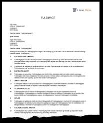


**Fuldmagt** er således reguleret af aftaleloven, se Lovbekendtgørelse nr. 193 af 2. marts 2016 om aftaler og andre retshandler på formuerettens område. 
**<a href="https://jura.tepedu.dk/lovsamling.html" target="_blank"> Aftaleloven se Lovsamlingen Klik her!</a>**

---

**Fuldmagter inddeles på følgende måde:**

**"Fuldmagt med særlig tilværelse".**
  
**"Fuldmagt uden særlig tilværelse".**

---

Derudover findes der regler om mellemmænd:
  
**Kommission** (Kommisionsloven Lovbekendtgørelse nr. 332 af 31. marts 2014). 
  
**Handelsagenter** (Lov nr. 272 af 2. maj 1990 om handelsagenter og handelsrejsende).


---

## Fuldmagtsforhold og aftaleindgåelse 


<script async src="https://widget.spreaker.com/widgets.js"></script>


```{r network4, echo=FALSE, result=TRUE,fig.cap=("Fuldmagtsforhold og aftaleindgåelse ")}

nodes <- data.frame(id = 1:3, 
                    shape = c("box"), 
                    label = c(" Fuldmagtsgiver "," Fuldmægtig "," Trediemand "),
                    font.size = c(35,35,35))
edges <- data.frame(from = c(1,2,3),
                    to = c(2,3,1),
                    label = c("Fuldmagt", "Aftale indgås",""),
                    # arrows = c("middle"),
                    length = c(300,300,200)
                    )

visNetwork(nodes, edges, width = "100%",avoidOverlap=2) %>% 
  visInteraction(dragNodes = TRUE, 
                 dragView = TRUE, 
                 zoomView = FALSE) %>%
  visNodes(color = list(background = "white", 
                        border = "white",
                        highlight = "yellow"),
           shadow = list(enabled = TRUE, size = 30))  %>%
  # visHierarchicalLayout()
  visLayout(randomSeed = 24) %>% # to have always the same network
visEdges(color = list(color = "lightgrey", highlight = "yellow"))
```


Fuldmagt: Aftaleloven afsnit II, jf. aftalelovens §§ 10-27 ^[Følgende bygger til dels på *Torsten Iversens og Lars Hedegaard Kristensen* Karnovkommentar til aftaleloven om fuldmagtsforhold]

---

**Personerne ved fuldmagtsforhold:**

**Fuldmagtsgiver/hovedmanden,** er den, i hvis navn og for hvis regning aftalen indgås.

**Fuldmægtigen/mellemmanden,** er den, der handler i hovedmandens navn.

**Tredjemand/aftalepart,** er hovedmandens aftalepart.

---

Fuldmagtsgiver (hovedmanden) bliver umiddelbart bundet af de aftaler, som fuldmægtigen indgår på fuldmagtsgiverens vegne, jf. aftalelovens § 10, stk. 1:  

”Den, som har givet en anden fuldmagt til at foretage en retshandel, bliver umiddelbart berettiget og forpligtet overfor tredjemand ved retshandel, som fuldmægtigen foretager i fuldmagtsgiverens navn og indenfor fuldmagtens grænser”.

---

Fuldmagtsforholdet hviler normalt på en **"aftale"** mellem en fuldmagtsgiver og fuldmægtig, men kan herudover gives til kende ved en viljeserklæring til en eller flere tredjemænd eller ved en konkludent handling, der tillader tredjemand at slutte, at fuldmagtsgiveren har udstyret fuldmægtigen med en fuldmagt (således som det er tilfældet ved stillingsfuldmagten ved et ansættelsesforhold). 

---


---

Aftalelovens bestemmelser indeholder ikke nogen udtømmende opregning af de måder, hvorpå en fuldmagt kan skabes. 

Anden optræden eller adfærd fra hovedmandens side end en viljeserklæring kan skabe fuldmagt, fx overgivelse af dokumenter eller ved passivitet.

---

En fuldmagt skabt ved passivitet kaldes ofte **adfærdsfuldmagt**. 

Der foreligger ingen fuldmagt, men hovedmanden har ved sin adfærd givet grund til at tro, at **"fuldmægtigen“** var bemyndiget til at disponere på hovedmandens vegne.

---

Adfærdsfuldmagt foreligger således også, når hovedmanden i et tidsrum har tolereret, at en person har foretaget retshandler for ham, og hovedmanden har opfyldt de indgåede aftaler, idet tredjemand her er bibragt den opfattelse, at denne person faktisk har en fuldmagt.

En aftale kan i nogle tilfælde rammes af ugyldighed, hvis der er handlet i strid med en fuldmagt.

---

## Sondringen mellem bemyndigelse og legitimation


---


Aftaleloven sondrer mellem på den ene side **legitimation** og på den anden side **beføjelse**. 

Ved **fuldmagt** forstås således den magt eller kompetence (legitimation), fuldmægtigen har til inden for visse grænser at foretage retshandler med bindende virkning for fuldmagtsgiveren. 

Ved **beføjelse** (bemyndigelse) den ret eller tilladelse, fuldmægtigen iht. det mellem ham og fuldmagtsgiveren bestående retsforhold har til at optræde på dennes vegne:

* **Bemyndigelse/beføjelse:** Er således den interne instruks mellem fuldmagtsgiver og fuldmægtig. Indholdet af denne instruks er som udgangspunkt ikke kendt for omverdenen.

* **Legitimation:** Den ydre fuldmagt er synlig og kendt for omverdenen.

* **Fuldmagt/legitimation:** Omfatter det tredjemand kan forvente. Fuldmagtsgivers signal til omverdenen om, hvordan fuldmægtigen kan binde fuldmagtsgiver. De ydre rammer (eks. købe et hus).

Fuldmagt og bemyndigelse kan være ens, men bemyndigelsen er ofte snævrere end fuldmagten. Fuldmagten kan aldrig være snævrere end bemyndigelse.

---

<h4><a href="https://youtu.be/ugJt8-E7xJY" target="_blank">Video om fuldmagt via aftaler</a></h4>

---

<br>

## De 2 fuldmagtsformer


**Der findes som nævnt to fuldmagtsformer:**

1. "Fuldmagt med særlig tilværelse".

2. "Fuldmagt med uden særlig tilværelse".

---

*Fuldmagt med særlig tilværelse:*

+ **Stillingsfuldmagt**, jf. aftalelovens § 10, stk. 2.

+ **Specialfuldmagt**, jf. aftalelovens § 13.

+ **Offentlig bekendtgjort fuldmagt**, jf. aftalelovens § 14, stk. 1

+ **Skriftlig fuldmagt/forevisningsfuldmagt**, jf. aftalelovens § 16, stk. 1

---

*Fuldmagt uden særlig tilværelse:*


Kaldes også en **§ 18-fuldmagt**.

---


## Fuldmagt med særlig tilværelse

**Stillingsfuldmagt, jf. aftalelovens § 10, stk. 2:**

”Indtager nogen ifølge aftale med en anden en stilling, som efter lov eller sædvane medfører beføjelse for ham til indenfor visse grænser at handle på den andens vegne, anses han befuldmægtiget til at foretage retshandler, som falder indenfor disse grænser”. 


---


Når man som (fuldmagtsgiver) giver en anden (fuldmægtig) fuldmagt til at handle på ens vegne, bliver man som hovedregel bundet af den aftale, ens fuldmægtig indgår med tredjemand. 

Der er kun tale om en stillingsfuldmagt i § 10’s forstand, når man efter aftale med en anden (fuldmagtsgiver/arbejdsgiveren) indtager en stilling, dvs. er ansat hos den pågældende. 

---

Stillingsfuldmagten stiftes ved, at man efter aftale med fuldmagtsgiver opnår ansættelse i en vis stilling og faktisk indtager denne fx, at man er ansat i en bank, ejendomsmæglerkæde eller i et forsikringsselskab. 

Deraf følger så, at en advokat ikke har en stillingsfuldmagt for sin klient, og at en tilsynsførende arkitekt eller ingeniør ingen stillingsfuldmagt har fra bygherren. 

---

Tredjemand fx kunden kan påberåbe sig stillingsfuldmagten, selv om kunden ikke kender til ansættelsen af fuldmægtigen hos fuldmagtsgiveren.

En ansat har således via sin stilling fuldmagt til at handle på vegne af fuldmagtsgiver (arbejdsgiver).

---

Fuldmægtigen (den ansatte) har udadtil fuldmagt til at handle inden for stillingens grænser, dvs. den ansatte kan indgå de aftaler med tredjemand, som er sædvanlige for stillingen, fx en ejendomsmægler kan indgå en formidlingsaftale med en sælger af et hus. 

Ejendomsmægleren kan dog ikke forpligte opdragsgiveren (sælgeren) uden særlig fuldmagt hertil.

---

En kunderådgiver i en bank kan i sagens natur indgå aftaler om lån fra banken, men hun kan ikke indgå aftaler med et reklamebureau om ny markedsføringskampagne af bankens lån, medmindre hun har fået en udvidet bemyndigelse/særlig tilladelse fra fuldmagtsgiver fx hendes områdechef.

Situation: Fuldmægtigen indgår en aftale med tredjemand, der overskrider bemyndigelsen (den interne instruks fra fuldmagtsgiver).

---

Fuldmagtsgiver er bundet af de aftaler, fuldmægtigen indgår med tredjemand i strid med den interne instruks, hvis tredjemand var i god tro, jf. aftalelovens § 11, stk. 1.

**"God tro":** Hvis det vurderes at tredjemand ikke indså eller burde have indset, at fuldmægtigen indgik en aftale, der lå uden for vedkommendes beføjelser (den interne instruks).

---

**Situation:** Fuldmægtigen indgår en aftale med tredjemand, der ligger uden for legitimationen (stillingsfuldmagtens sædvanlige grænser).

Fuldmagtsgiver er ikke bundet af de aftaler fuldmægtigen indgår med tredjemand, hvis de ligger uden for stillingens grænser, uanset tredjemands gode tro, fx at bankrådgiveren til en bankkunde giver tilsagn om et privat forbrugslån, uden at lånet bliver forrentet og uden stiftelsesomkostninger.

---

**Stillingsfuldmagtens særlige tilværelse viser sig** bl.a. derved, at fuldmagtsgiver bliver bundet over for en tredjemand i god tro, selv om fuldmagtsgiver ved konkret tilkendegivelse til fuldmægtigen har indskrænket dennes bemyndigelse, idet fuldmægtigen desuagtet stadig besidder den fuldmagt, der ifølge lov eller sædvane er forbundet med den stilling, fuldmægtigen besidder. 

---

Vil fuldmagtsgiveren indskrænke stillingsfuldmagten, må han degradere fuldmægtigen, dvs. afskedige ham fra stillingen og give ham en stilling med en mindre vidtgående stillingsfuldmagt, og dette må være kendeligt for omverdenen.

Stillingsfuldmagtens grænser afhænger i første række af, hvilken stilling der er tale om, idet sædvanerne for forskellige stillinger er forskellige. 

---

En koncerndirektør har en vidererækkende stillingsfuldmagt end en salgschef, og en salgschef en vidererækkende stillingsfuldmagt end en værkfører. 

Der kan dog samtidig være forskel på rækkevidden i forskellige henseender. 

Selv om salgschefens stillingsfuldmagt generelt er mere omfattende end værkførerens, kan sidstnævntes fuldmagt udmærket række videre end førstnævntes på særlige områder. 


---


**Sædvanens betydning er mange gange større end aftalelovens**, når det gælder stillingsfuldmagt, men det er i sagens natur mindre sikkert, hvad der er sædvanligt, end hvad der står i loven. 

---

**Efter almindelige bevisbyrderegler** må den, der hævder, at der foreligger en fuldmagt, formentlig skulle godtgøre dennes rækkevidde, men da fuldmagtsgiver normalt er den, der sidder inde med oplysninger om stillingsbeskrivelsen, branchen, virksomheden og dens organisation og praksis, må fuldmagtsgiver være undergivet en betydelig forpligtelse til at bidrage til sagens oplysning. 

---

Domstolene må antages i hovedsagen at anse spørgsmålet om fuldmagtens rækkevidde som et retsspørgsmål, som det tilkommer domstolene at afgøre, jf maksimen **"jura novit curia"** (retten kender retsreglerne og ved, hvordan de anvendes, og gør det **"ex officio";** af egen drift), og ikke som et spørgsmål om faktum, som det påhviler den ene part at føre bevis for.

---

Stillingsfuldmagtens grænser afhænger i første række af, hvilken stilling der er tale om, idet sædvanerne for forskellige stillinger er forskellige. 

En bankdirektør har en mere vidererækkende stillingsfuldmagt end en områdekundechef, og en områdekundechef en mere vidererækkende stillingsfuldmagt end en lokalafdelingschef. 

---

**"Erstatning":** Hvis fuldmagtsgiver lider et dokumenteret økonomisk tab, fordi fuldmægtigen har handlet groft uagtsom eller forsætligt, kan fuldmægtigen i sjældne grove tilfælde blive erstatningsansvarlig over for arbejdsgiveren/fuldmagtsgiveren, jf. **erstatningsansvarslovens § 23, stk. 1:**

"Erstatning, som en arbejdsgiver har måttet udrede som følge af en arbejdstagers uforsvarlige adfærd, kan kun kræves betalt af denne i det omfang, det findes rimeligt under hensyn til den udviste skyld, arbejdstagerens stilling og omstændighederne i øvrigt."

---

De vigtigste momenter i vurderingen af, om og i hvilket omfang arbejdsgiveren kan gøre regres mod arbejdstageren, er skyldgraden (normalt ikke regres ved skader, der er forvoldt ved simpel uagtsomhed; i modsætning til erstatningsansvarslovens § 19, stk. 3, indebærer forsæt eller især grov uagtsomhed dog ikke nødvendigvis fuldt ansvar for arbejdstageren, se herved:

Dommen i **U 2016.3069 V** Regres ved betydelig uagtsomhed, 
**<a href="*https://pro.karnovgroup.dk/document/7000752589/1" target="_blank">Dommen klik her!</a>**

---

Samt **U 2006.356 V** om regres ved en forsætligt forvoldt skade og arbejdstagerens stilling (indtagelse af en overordnet stilling med ledelsesfunktioner vil fx kunne tale for regres). 
**<a href="https://pro.karnovgroup.dk/document/7000317254/1" target="_blank">Dommen klik her!</a>**

---

Ordet **Regres** er et krav om tilbagebetaling for noget man har betalt på andres vegne. Ordet regres kommer af det latinske regressus og betyder **”tilbagegang”.**

---

**Ophør af fuldmagtsforholdet:**

En stillingsfuldmagt ophører og tilbagekaldes ved at fuldmægtigen fjernes fra stillingen, fx opsiges eller bortvises.

Arbejdsgiveren bliver bundet af de aftaler, den opsagte indgår med tredjemand i opsigelsesperioden.

---

I en opsigelsesperiode bør fuldmagtsgiver tage stilling til, om fuldmægtigen stadig skal have fuldmagt til at indgå de samme aftaler udadtil, eller der skal laves en ændring frem til fratrædelsestidspunktet.

---    

**Specialfuldmagt, jf. aftalelovens § 13**  

**Aftalelovens § 13 har følgende ordlyd:**

”En fuldmagt, som er bragt til tredjemands kundskab ved en til ham særskilt rettet erklæring fra fuldmagtsgiveren, er tilbagekaldt, når særskilt erklæring om, at fuldmagten ikke længere skal gælde, er kommet frem til tredjemand”.

---

Det kaldes også for **legitimationsfuldmagt**.

Fuldmagten er en særskilt erklæring, der meddeles direkte fra fuldmagtsgiver til tredjemand.
  
Tredjemand får direkte besked om fuldmagtens indhold.
  
Erklæringens form er ligegyldig.

Kan være både mundtlig og skriftlig.

Erklæringens fremkomst kan bevises, og dets indhold om tilbagekaldelse er klart.
  
En specialfuldmagt ophører/tilbagekaldes på samme måde som den blev stiftet.
  
Tilbagekaldelsen får virkning når den er kommet frem – behøver ikke komme til tredjemands kundskab.
 
---

**Offentlig bekendtgjort fuldmagt**, jf. aftalelovens § 14


**Bestemmelsen i aftalelovens § 14 har følgende indhold:**

”En fuldmagt, som af fuldmagtsgiveren er offentlig bekendtgjort i bladene eller på anden måde, tilbagekaldes ved en erklæring, som bekendtgøres på samme måde. 

Stk. 2. Er dette ikke muligt, skal tilbagekaldelsen tilkendegives på anden ligeså virksom måde. Fuldmagtsgiveren kan forlange, at den i § 17 omtalte myndighed skal afgøre, hvad han i så henseende har at foretage.

Stk. 3. Fuldmagten anses ikke som offentlig bekendtgjort, fordi den er tinglæst”.

---

Offentlig bekendtgjort fuldmagt - fx **kuratorfuldmagt**, der får fuldmagt til at behandle et konkursbo og varetage boets interesser eller udstedelse af **"prokura"** om at kunne handle på vegne af fx et selskab eller en forening.

---

**Skriftlig fuldmagt/forevisningsfuldmagt** 

**Se aftalelovens § 16 med følgende bestemmelse:**

”En skriftlig fuldmagt, som er overgivet fuldmægtigen, og som må anses bestemt til at være i hans besiddelse og at forevises for tredjemand, tilbagekaldes derved, at den på fuldmagtsgiverens forlangende tilbagegives ham eller tilintetgøres.

Stk. 2. Fuldmægtigen er pligtig til på forlangende at give fuldmagten tilbage til fuldmagtsgiveren”.

---


En skriftlig fuldmagt, der er beregnet til forevisning for andre – fx **”hent min pakke- fuldmagt”**, eller en **generalfuldmagt**.

**Ophører, når fuldmagten tilbagegives til fuldmagtsgiver, eller fuldmagten tilintetgøres.**
 

---

## Fuldmagt uden særlig tilværelse

**Se nærmere aftalelovens § 18:**

Denne type fuldmagt er kendetegnet ved, at den ikke er kendt eller synlig for omverdenen.

Kaldes også for en aftalelovens **"§ 18-fuldmagt":**

”En fuldmagt, der alene hviler på fuldmagtsgiverens erklæring til fuldmægtigen, er tilbagekaldt, når erklæringen om, at fuldmagten ikke længere skal gælde, er kommet frem til fuldmægtigen".

---

Fuldmagten/instruksen gives ofte mundtligt, men kan også gives skriftligt.

Hvor tredjemand ikke har modtaget anden erklæring end fuldmægtigens egne ord for, at denne er fuldmægtig for hovedmanden.

Der sondres ikke mellem bemyndigelse og legitimation, da fuldmagtens omfang og bemyndigelsen er sammenfaldende.

---

**Aftaler i strid med fuldmagten:**

Fuldmagtsgiver er ikke bundet af aftaler som fuldmægtigen indgår i strid med en § 18-fuldmagt, uanset om tredjemand var i god tro, jf. aftalelovens § 11, stk. 2.

Tilbagekaldelse af fuldmagten kan ske på samme måde, som den er givet.

En tilbagekaldelse får virkning, når den er kommet frem – behøver ikke at komme til kundskab.

---

<h4><a href="https://www.youtube.com/embed/JKyH0smEY9I" target="_blank">Video om aftalelovens § 19 tilbagekaldelse af fuldmagt</a></h4>

---

## Erstatning til tredjemand:

**Erstatning til tredjemand er reguleret i aftalelovens § 25**.

**Bestemmelsen har følgende ordlyd:**

“Den, der optræder som fuldmægtig for en anden, indestår for, at han har fornøden fuldmagt.  Oplyser han ikke, at han havde sådan eller at hans retshandel er godkendt af den opgivne fuldmagtsgiver eller af andre grunde er bindende for denne, skal han erstatte den skade, tredjemand lider ved, at retshandelen ikke kan gøres gældende mod den opgivne fuldmagtsgiver.

Stk. 2. Denne bestemmelse kommer ikke til anvendelse, når tredjemand vidste eller burde vide, at den, som foretog retshandelen, ikke havde fornøden fuldmagt. Ej heller kommer den til anvendelse, når den, som foretog retshandelen, handlede i henhold til en fuldmagt, der var ugyldig eller uvirksom af grunde, som han var uvidende om, og som tredjemand ikke kunne påregne, at han vidste besked om".

---

Den, der udadtil optræder som fuldmægtig for en anden, indestår for, at han rent faktisk har fornøden fuldmagt til at handle og indgå aftaler på vegne af fuldmagtsgiver.

---

Fuldmægtigen er ved aftalens indgåelse garant (står inde) for at:

* Fuldmagten eksisterer,

* Fuldmagten ikke er tilbagekaldt og

* Fuldmagten ikke er overskredet

---

**Aftalelovens § 25 – erstatning til tredjemand (fortsat):**

**HR:** Hvis fuldmægtigen ikke havde den fornødne fuldmagt til at handle, og aftalen derfor falder til jorden, kan tredjemand forlange erstatning hos fuldmægtigen, hvis han lider et økonomisk tab.

**U1:** Erstatning kan ikke komme på tale, hvis tredjemand vidste eller burde vide, at fuldmægtigen ikke havde den fornødne fuldmagt.

**U2:** Erstatning kan ikke komme på tale, hvis fuldmægtigen indgår aftaler, og ikke ved at fuldmagten i mellemtiden er blevet tilbagekaldt.

---

Fuldmægtigen indestår for, at denne har den fornødne fuldmagt til at foretage den retshandel, han foretager (fx afgivelse af tilbud eller accept af et banklån). 

Fuldmægtigen indestår efter alm regler ikke for, at fuldmagtsgiveren opfylder kontrakten, medmindre medkontrahenten har føje til at tro, at fuldmægtigen garanterer herfor. 

---

Fuldmægtigen kan blive ansvarlig over for medkontrahenten, hvis fuldmægtigen undlader at give medkontrahenten meddelelser, fortier fuldmagtsgiverens insolvens for medkontrahenten eller i øvrigt anvender svig.

Fuldmægtigen er altså i almindelighed ubetinget erstatningsansvarlig (objektivt ansvarlig), hvis det viser sig, at fuldmagten ikke var i orden. 

Dette stemmer med de almindelige regler om ansvaret i vanhjemmelslignende tilfælde af misligholdelse. 

---

Hvis fuldmægtigen er umyndig, kan et sådant ansvar ikke pålægges fuldmægtigen, men fuldmægtigen kan ifalde erstatningspligt efter den almindelige culparegel, og medkontrahenten kan i så fald kræve erstatning for den **"negative kontraktsinteresse"** (det tab, han lider ved at stole på kontrakten), hvis fuldmægtigen har skuffet medkontrahenten med forsæt eller uagtsomhed.

---

Aftalelovens § 25 indebærer, at tredjemand ikke selv behøver at undersøge fuldmagtens eksistens eller at forlange udtrykkelig garanti for, at fornøden fuldmagt foreligger, idet tredjemand er berettiget til at gå ud fra, at den, der optræder som fuldmægtig, også har den fornødne fuldmagt.

---

<h4><a href="https://www.youtube.com/embed/pg3C6fbVoTs" target="_blank">Video om erstatning efter aftalelovens § 25</a></h4>

---


Fuldmægtigen skal erstatte tredjemand den **"positive opfyldelsesinteresse"**, dvs. tredjemand skal stilles, som om aftalen var blevet indgået og ikke alene den negative kontraktsinteresse, dvs. stilles som om aftalen ikke var blevet indgået. 

Tredjemand kan altså kræve erstatning for det fulde tab, tredjemand lider ved, at løftet ikke kan gøres gældende imod den opgivne fuldmagtsgiver, inkl. fortjeneste. 

---

Tredjemand er ikke henvist til at nøjes med en erstatning for det tab, tredjemand har lidt ved at handle i tillid til fuldmagtens eksistens, tredjemand har krav på at blive stillet økonomisk, som om fuldmagten eksisterede. 

Hvis den opgivne fuldmagtgiver er kommet under konkurs, følger det af det anførte, at tredjemand kun kan kræve det beløb, som tredjemand, hvis fuldmagten havde været i orden, ville have erholdt af konkursboet.

---

**Mere alvorlige straffelovs forbrydelser som fuldmægtig:**

**Mandatsvig og returkommission:**

**Mandatsvig** straffes efter straffeloven.	For mandatsvig straffes den, som for derigennem at skaffe sig eller andre uberettiget vinding påfører en anden formuetab 1) ved misbrug af en for ham skabt adgang til at handle med retsvirkning for denne eller 2) ved i et formueanliggende, som det påhviler ham at varetage for den anden, at handle mod dennes tarv, jf. straffelovens § 280.

---

**Returkommission** straffes efter straffelovens § 299, stk. 2: Med bøde eller fængsel indtil 4 år straffes den, som ved varetagelse af en andens formueanliggender for sig selv eller andre på pligtstridig måde modtager, fordrer eller lader sig tilsige gave eller anden fordel, såvel som den, der yder, lover eller tilbyder en sådan gave eller anden fordel".

---

Det afgørende efter straffelovens § 299, stk. 2 om returkommission er, om den, der er adressat for fordelen, begår et pligtstridigt forhold ved at modtage fordelen. 

---

Bestemmelsens typiske anvendelsesområde er tilfælde, hvor en person, der er ansat eller på anden måde knyttet til en virksomhed, fra tredjemand modtager en fordel, og hvor fordelen er ydet for at få den pågældende til i strid med sine pligter over for hvervgiveren at foretage eller undlade at foretage en handling eller eventuelt at foretage en handling på en bestemt måde. 

Såvel den, der yder mv. en sådan fordel (**aktiv bestikkelse**), som den, der modtager mv. fordelen **(passiv bestikkelse**), er omfattet af straffelovens § 299, stk. 2.

---

Se dommen i **U 1936.833 Ø:** Tiltalte, der havde generalfuldmagt for en bygherre, havde, uanset at han havde meddelt forskellige håndværkere og leverandører noterede transporter på et byggelån, dels benyttet dette til dækning af sine egne krav, dels ved udbetaling til bygherren til byggesagen uvedkommende formål. 
**<a href="https://pro.karnovgroup.dk/document/7000240874/1" target="_blank">Dommen klik her!</a>**

---

Se endvidere dommen i **JD 1943.121** Om statsbanefunktionærs urigtige opgørelse over flyttegodtgørelse.

---

Se dommen i **U 1974.955 Ø** Funktionær for et aktieselskab med ansvar for køb og salg af vin havde i tiden fra efteråret 1969 til foråret 1971 ladet sig tilsige agentprovision fra forskellige udenlandske vinleverandører, hvilket holdtes skjult for selskabet. 
**<a href="https://pro.karnovgroup.dk/document/7000211376/1" target="_blank">Dommen klik her!</a>**

---

<h4><a href="https://www.youtube.com/embed/08Bm3t_CR9s" target="_blank">Video om fuldmagtens grænser</a></h4>

---

## Eksamensopgave 1


**Eksamensopgave - jem og fix**  


Kim er ansat i firmaet jem og fix i Odense. Han blev ansat som salgsassistent den 1. januar 2019. 

Han er meget dygtig og meget omhyggelig med sit arbejde og bliver efterhånden meget vellidt af kunderne - både de lokale håndværkere og de private kunder. 

En af hans gamle klassekammerater Andreas er flyttet til Odense, hvor han har købt et helt nyt hus og skal til at etablere haven. 

Andreas kommer til jem og fix og møder Kim. De får snakket om gamle dage, og Andreas afgiver en ordre på fliser til en stor terrasse, materialer til et flot plankeværk og et sæt havemøbler i træ til 8 personer.

Andreas mener, at Kim må give en god rabat på sådan en stor ordre. Andreas får forhandlet sig frem til 25 % i rabat. 

Kim er egentlig ikke så glad bagefter, for han har en aftale med hovedkontoret om, at der max. må gives 10 % i rabat.

Andreas har lige startet sit eget firma, Swim der sælger havebassiner. Andreas præsenterer Kim for produkterne, og han får solgt 5 stk. havebassiner til jem og fix til en samlet pris på 15.000 kr. 

Kim må ellers slet ikke købe varer ind, da det skal foregå centralt.


**Eksamensspørgsmålet:**

1.	Er jem og fix bundet af de aftaler, som Kim har indgået med Andreas?


---

**Podcast om svaret på eksamensopgaven**

---

<h4><a href="https://youtu.be/oeIre44pjQU" target="_blank">Video om sådan laver du selv en Fuldmagt</a><h4>

---

## Modeller for eksamensløsning af fuldmagtsforhold

**Foreligger der en fuldmagt**^[Følgende afsnit bygger på Løsningsmodellerne fra opgavesamlingen i Erhvervsret ASPIRI, v. advokat *Peter Wedel Ranch Krarup*.]

Andens navn.

Andens regning.

---

**Hvilken type fuldmagt er der tale om**

Stillingsfuldmagt ved ansættelsesforhold, aftalelovens § 10, stk. 2, dvs. med særlig tilværelse.

Specialfuldmagter er særlig meddelt 3. mand, ajf. ftalelovens § 13, dvs. med særlig tilværelse.

Offentlig bekendtgjort fuldmagt (annonce eller opslag), jf. aftalelovens § 14, dvs. med særlig tilværelse. 

Skriftlig fuldmagt (kun hvis beregnet til fremvisning), jf. aftalelovens § 16, dvs. med særlig tilværelse.

Aftalelovens § 18-fuldmagt (mundtlig eller skriftlige, der ikke er beregnet til fremvisning), dvs. uden særlig tilværelse.

---

**Hvad er fuldmagtens rækkevidde**

Angiv fuldmægtigens legitimation (det for 3. mand kendelige).

Angiv fuldmægtigens bemyndigelse (den til fuldmægtigen meddelte interne instruks).

Legitimation og bemyndigelse er sammenfaldende ved § 18-fuldmagter.

---

**Er fuldmagten tilbagekaldt/ændret/ophørt**:

Vil fuldmagtsgiveren tilbagekalde en fuldmagt, skal han, selv om han har underrettet fuldmægtigen om, at fuldmagten ikke længere skal gælde, foretage, hvad der i aftalelovens § 13-§ 16 er foreskrevet. 

---

Er flere af disse forskrifter anvendelige på samme fuldmagt, skal de alle iagttages - aftalelovens § 12, stk. 1.

---

**Stillingsfuldmagt** – ved bortvisning eller flytning - aftalelovens § 10, stk. 2. 

---

**Specialfuldmagt** – når 3. mand underrettes om tilbagekaldelsen - aftalelovens § 13.

---

**Offentlig bekendtgjort fuldmagt** – tilbagekaldelsen offentliggøres på samme måde - aftalelovens § 14.

---

**Skriftlig fuldmagt** – fuldmagten modtages retur eller destrueres - aftalelovens § 16. 

---

**§ 18-fuldmagt** – når besked om tilbagekaldelse er kommet frem til fuldmægtigen - aftalelovens § 18.

---

Den tredjemand, der har modtaget underretning om, at en fuldmagt er tilbagekaldt, kan ikke påberåbe sig, at tilbagekaldelsen ikke er sket på anden måde - aftalelovens § 12, stk. 2.

---

**Død, umyndiggørelse og konkurs** - jf. aftalelovens §§ 21-23. 

---

Hvis fuldmagtsgiver må frygte, at fuldmægtigen vil handle i forhold til bestemt 3. mand, selvom fuldmagten er tilbagekaldt eller erklæret uvirksom, skal fuldmagtsgiveren give den pågældende 3. mand meddelelse herom, ellers bliver fuldmagtsgiver bundet - jf. aftalelovens § 19. Indlevering til postvæsen eller fremsendelse pr. telefax er tilstrækkeligt - jf. aftalelovens § 40. 

---

**Har fuldmægtigen indgået aftale med 3. mand?**

**<a href="https://jura.tepedu.dk/aftaleret.html#aftaleindg%C3%A5else" target="_blank">Se om aftaleindgåelse klik her!</a>**

---

**Bliver fuldmagtsgiver bundet af den indgåede aftale**

Har fuldmægtigen overskredet legitimationen - jf. aftalelovens § 10, stk. 1.

Har fuldmægtigen overskredet den interne bemyndigelse - jf. aftalelovens § 11.

---

**Der sondres mellem:**

Fuldmagt med særlig tilværelse. 
 
Fuldmagt uden særlig tilværelse (§ 18-fuldmagt)

---
 

**Fuldmægtigens erstatningsansvar over for 3. mand**

Fuldmægtigen indestår for at have den fornødne fuldmagt og skal erstatte 3. mand den skade, som han har lidt ved, at aftalen ikke bliver bindende - jf. aftalelovens § 25, stk. 1.

---

Fuldmægtigen er dog ansvarsfri, såfremt 3. mand vidste eller burde vide, at fuldmægtigen ikke havde fornøden fuldmagt, eller fuldmægtigen handlede i henhold til en fuldmagt, som var ugyldig eller uvirksom af grunde, som han var uvidende om, og som 3. mand ikke kunne påregne at han vidste besked om - jf. aftalelovens § 25, stk. 2. 


---

## Quiz

<h3><a href="https://quiz.tepedu.dk/jura5" target="_blank">Quiz Jura aftaleret   </a></h3>


<!--chapter:end:04-Fuldmagter.Rmd-->


# Forbrugeraftaler og forbrugerbeskyttelse

```{r, echo=FALSE, results='asis'}
cat(readLines('np.html'))
```


---

***Indledningsvis skal du som studerende være særlig opmærksom på følgende problemstillinger ved gennemgangen af kapitlet "forbrugeraftaler og forbrugerbeskyttelse":***


•	**Forbrugerbeskyttelse ved erhvervelse af fast ejendom; fortrydelsesret og tilbud, tilbagekaldelse og sælgers accept, Lov om forbrugerbeskyttelse ved erhvervelse af fast ejendom (LFFE) kapitel 2**

**<a href="https://jura.tepedu.dk/handel-med-fast-ejendom.html" target="_blank">Se kapitlet klik her!</a>**
 
  
•	**Forbrugeraftaleloven, om det civilretlige forbrugerbegreb, om forbud mod uanmodet henvendelser og om forbud mod negativ aftaleindgåelse, jf. forbrugeraftalelovens §§ 3-6** 

•	**Fortrydelsesretten på 14 dage, forbrugeraftalelovens §§ 18-24** 

--- 

**Introduktion til forbrugeraftaleloven:**


Forbrugeraftaleloven, jf. Lov 2013-12-17 nr. 1457 om forbrugeraftaler, se nærmere forbrugeraftaleloven. 
**<a href="https://jura.tepedu.dk/lovsamling.html" target="_blank"> Se Lovsamlingen klik her!</a>**

---

Samt *Sonny Kristoffersen* Karnovkommentar til forbrugeraftaleloven
**<a href="https://pro.karnovgroup.dk/document/7000823484/1" target="_blank">klik her!</a>**

---

Forbrugeraftalelovens (FBL) formål:.^[Følgende afsnit om forbrugeraftaler bygger på **Sonny Kristoffersen**: ”Kend forbrugerkøbsreglerne”, 2018, Samfundslitteratur.]

Forbrugeraftaleloven kan vel karakteriseres som forbrugernes grundlov. Eller angivet som "færdselsloven" for den erhvervsdrivende, hvordan den erhvervsdrivende skal behandle forbrugeren, når der indgåes forbrugeraftaler.

---

Forbrugeraftaleloven er **"beskyttelsespræceptiv"** – dvs. loven kan ikke fraviges til skade for forbrugeren, FBL § 33, men forbrugeren kan godt stilles bedre end, hvad lovgivningen tilsiger, fx 6 måneders fortrydelsesretten i forhold til den lovpligtige fortrydelsesret på 14 dage.

En forbrugeraftale indgås mellem to parter, hvor den erhvervsdrivende indgår aftalen som led i sit erhverv, mens den anden part (forbrugeren) handler hovedsagelig uden for sit erhverv, jf. FBL § 2, stk. 1. 

Det kaldes for det *civilretlige forbrugerbegreb*.^[Se *Sonny Kristoffersen* artikel i U.2011B.258: Afgrænsning af det civilretlige forbrugerbegreb, 
**<a href="https://jura.tepedu.dk/bibliotek-premium.html" target="_blank"> klik her!</a>**]

En erhvervsdrivende formidler er en, der skaber kontakt imellem private handlende, fx et internetauktionsfirma, som også skal overholde forbrugeraftaleloven.

---


Se sagen om QXL (internet-auktionsudbyder):

Se **Sø- og Handelsrettens dom afsagt den 18. juni 2009 i sag N-1-07:** QXL Ricardo Danmark A/S (QXL) er formidler som nævnt i forbrugeraftalelovens § 3, stk. 3, i forbindelse med salg på www.qxl.dk, når sælgeren er ikkeerhvervsdrivende, og køberen hovedsagelig handler uden for sit erhverv. QXL har derfor pligt til at give købere oplysning om fortrydelsesretten efter lovens § 11, stk. 1, nr. 5, og § 12, stk. 2, nr. 2, og til at modtage køberes underretning om brug af fortrydelsesretten efter lovens § 19, stk. 1. Ved ikke at have overholdt QXLs oplysningspligt efter forbrugeraftaleloven og ved ikke at have ført kontrol med, at erhvervsdrivende sælgere på deres website overholder deres pligter efter forbrugeraftaleloven, havde QXL handlet i strid med god markedsføringsskik, jf. markedsføringslovens § 3. 

---

**<a href="https://jura.tepedu.dk/lovsamling.html" target="_blank">Se markedsføringsloven i Lovsamlingen klik her!</a>**

---


Den erhvervsdrivende, som påstår, aftalen ikke er en forbrugeraftale, har bevisbyrden, jf. FBL § 2, stk. 2.

Bedømmelsen i FBL § 2, stk. 2 beror på en konkret vurdering. 

Se fx **Forbrugerklagenævnets sagsnr.: 17/02094**, hvorefter køb af tilretning af brudekjole ikke blev anset som forbrugerkøb: "... Det er den erhvervsdrivende, der skal godtgøre, at der ikke er tale om en forbrugeraftale (forbrugeraftalelovens § 2, stk. 2). Bedømmelsen beror på en konkret vurdering. Nævnet vurderer, at den erhvervsdrivende ikke kan anses for at være erhvervsdrivende, da der er tale om et civilt køb. Nævnet har ved afgørelsen lagt vægt på, at den erhvervsdrivende ikke er CVR-registreret, at hun ikke har fast forretningssted som skrædder, og at hun ikke markedsfører sig selv som skrædder. Herudover har nævnet lagt vægt på, at parterne må antages at have indgået aftalen på baggrund af et privat bekendtskab, og at det herved er uklart om tilretning af brudekjoler skulle ske mod betaling. Der er således ikke tale om et forbrugerkøb, og Forbrugerklagenævnet har derfor ikke kompetence til at behandle sagen”.

---

Forbrugerombudsmanden (FOB) tilsyn med at FBL overholdes. 

De fleste konflikter afgøres af Forbrugerklagenævnet.^[Se nærmere **Sonny Kristoffersen** Ph.D-afhandling fra 2015: "Det offentlige forbrugerklagesystem i et retssikkerhedsmæssigt perspektiv", 2019, Samfundslitteratur.]
 
---

## Forbud mod uanmodet henvendelse


Der er et forbud mod uanmodet telefonisk eller direkte personlig henvendelse til forbrugere på deres bopæl, arbejdsplads, skoler, gymnasier, erhvervsakademier, universiteter eller andre steder, hvor der ikke er almindelig adgang, fx også foreninger, hvis henvendelsen fra virksomheden har til formål at opnå en aftale med forbrugeren, jf. FBL § 4, stk. 1.

Forbuddet er især begrundet med privatlivets fred og for at imødegå overraskelsesmomentet, så forbrugeren ikke føler sig tvunget til at indgå en aftale. Evt. aftaler der er indgået ved dørtrinet er ugyldige, jf. FBL § 5.

---
 
**Undtagelserne finder vi i FBL § 4, stk. 2, hvorefter telefoniske henvendelse gerne må ske, hvis det handler om:**

* Bestilling af bøger,

* Tegning af abonnement på aviser, ugeblade og tidsskrifter

* Formidling af forsikringsaftaler og

* Tegning af abonnement, der omfatter redningstjeneste eller sygetransport.


---

## Telefonsalg

**Ved telefoniske henvendelser omfattet af FBL § 4, stk. 2, om bestilling af bøger, abonnementer på aviser mv. skal forbrugeren ved hvert opkald have oplysning i telefonsamtalen om:**
 
* Den erhvervsdrivendes identitet.

* Navnet på den person, som forbrugeren er i kontakt med i telefonen.

* Telefonsælgerens forbindelse til den erhvervsdrivende, og

* Det kommercielle formål med telefonhenvendelsen.


Virksomheden der gerne må ringe uanmodet, skal tjekke	*Robinson-listen* inden henvendelse, ellers er det en overtrædelse af markedsføringslovens § 10, stk. 4, nr. 2 og 3.

**Derudover gælder markedsføringslovens § 10, stk. 6:** 

"Den erhvervsdrivende skal derfor ved den første henvendelse til forbrugeren, oplyse denne om retten til at frabede sig uanmodede henvendelser fra den erhvervsdrivende i fremtiden".


---

## Salg uden for den erhvervsdrivendes faste forretningssted

Henvendelse fra en erhvervsdrivende må gerne ske:


På offentlige steder, hvortil der er almindelig adgang, fx gader, veje, pladser og andre steder som fx togstationer og restauranter. 

Der kan dog være andre forbudsregler på de steder.

Til virksomheder og offentlige institutioner, hvis henvendelse vedrører tilbud om bestilling af varer og ydelser, der anvendes i virksomheden/institutionen.


På bopælen, hvis det ikke har med erhvervsmæssigt salg at gøre, fx henvendelser vedrørende religion, indsamlinger til velgørende formål (reguleret af indsamlingsloven), salg af lodsedler, spørgsmål i forbindelse med markedsundersøgelser mv.

---


## Forbrugeraftalers ugyldighed og bødestraf

* Aftalen er ugyldig: Aftaler indgået i strid med FBL § 4 er ugyldige, jf. FBL § 5. Forbrugeren kan godt fastholde aftalen uanset ugyldighed. 

Den erhvervsdrivende kan ikke påberåbe sig ugyldigheden.

* Bødestraf: Det kan være forbundet med bødestraf, for virksomheden, at handle i strid med forbrugeraftaleloven, jf. FBL § 34 - se H&M sag om opringninger på mobiltelefoner.

* Robinson-listen: En forbrugers tilmelding til Robinson-listen skal forhindre henvendelser fra virksomheder om produkter omfattet af FBL § 4, stk. 2. Overtrædelse straffes med bøde.

--- 

## Forbud mod negativ aftalebinding (-aftaleindgåelse)

En forbruger kan som udgangspunkt ikke blive bundet ved sin passivitet, jf. FBL § 6.

Ses særligt inden for TV/sattelitaftaler,IT/internetforbindelser, avis- og bladabonnementer.

---

Hvis en forbruger modtager en vare fra en virksomhed, som forbrugeren ikke har bestilt, og det ikke skyldes en fejl, kan forbrugeren beholde varen uden at skulle betale.

Det samme gælder for tjenesteydelser/arbejde som en erhvervsdrivende udfører, uden at forbrugeren har bedt om det. Fx en vinduespudser, der går i gang med at vaske ens vinduer uden en aftale, er forbrugeren ikke bundet af. 


Området er tæt forbundet med princippet om god markedsføringsskik, jf. markedsføringslovens § 3 og god erhvervsskik i markedsføringslovens § 4. 

Det kan også være en vildledning af forbrugerens retsstilling, jf. markedsføringslovens § 5.

---

## Aftaler indgået uden for den erhvervsdrivendes forretningssted


Aftalen er indgået et andet sted end der, hvor den erhvervsdrivende sælger har sit forretningssted, fx homeparties, salgsdemonstrationer under udflugter, udstilling/messe, marked.
 
Den erhvervsdrivende har pligt til at give tydelig skriftlig oplysning om fortrydelsesretten og hvortil henvendelse kan ske. 

---

**Oplysningen skal gives:**

Ved mødet med forbrugeren.

Ved varesalg – når varen overgives eller leveres fysisk til forbrugeren.

Fortrydelsesfristen begynder først at løbe fra det tidspunkt, forbrugeren modtager oplysningerne, hvis de ikke modtages, så udskydes fortrydelsesfristens begyndelsestidspunkt med 12 måneder.


---

## Fjernsalg


**"Fjernsalg"** er en aftale om salg af varer eller salg af tjenesteydelser, eller aftale om løbende levering af varer eller tjenesteydelser.
  
Aftalen indgås på afstand ved fjernkommunikation, fx e-handel, aftale indgået pr. e-mail, telefonsalg, katalog- og postordresalg.
  
Den erhvervsdrivende og forbrugeren mødes ikke fysisk ved aftalens indgåelse. 

---

Forbrugeren har ikke haft mulighed for at afprøve eller undersøge salgsgenstanden.

Aftalen skal være indgået som led i et system for fjernsalg, og den skal drives af den erhvervsdrivende, fx en aftale om køb, indgået via virksomhedens hjemmeside.
 
---

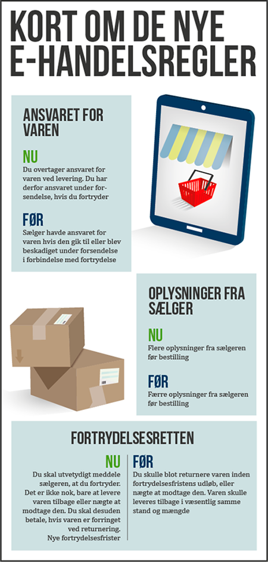

---

I rimelig tid inden aftalen indgås,	skal den erhvervsdrivende give forbrugeren oplysninger, fx om:

Den erhvervsdrivendes navn og forretningsadresse, tlf. numre, mailadresse m.v.
  
Varens eller tjenesteydelsens vigtigste egenskaber.

Den samlede pris, inkl. gebyrer, moms og afgifter, øvrige ekstraomkostninger, fx til levering, bestillingstakster, servicetakst.
  
Betalingsvilkår, leveringsvilkår, aftaleperiode, eventuel uopsigelighedsperiode og opsigelsesvilkår.
  
Oplysninger om, hvorvidt der er fortrydelsesret og hvordan den kan udøves, herunder om forbrugeren skal betale for tilbagelevering af en vare.
  
Oplysningerne skal være klare og forståelige.
 
Oplysningerne skal meddeles på papir eller andet varigt medium.

---

Snarest muligt efter aftalens indgåelse, skal der gives oplysninger om:
  
Fortrydelsesfristens begyndelsestidspunkt.

Betingelserne for at fortryde.

Fremgangsmåden ved forbrugerens brug af fortrydelsesretten og

Hvortil/til hvem fortrydelse kan meddeles.

---

Ved køb af varer som skal sendes til forbrugeren, skal oplysning om fortrydelsesfristen gives senest ved varens overgivelse. 

Hvis oplysning først kommer frem senere, løber fristen, fra oplysningerne er modtaget.

Hvis der ikke modtages nogen oplysninger om fortrydelsesretten, så udskydes fortrydelsesrettens begyndelsestidspunkt med 12 måneder. 

Hvis man slet ikke får oplysning om fortrydelsesretten, så er fortrydelsesfristen 12 måneder plus 14 dage.
 
---

**Varer og ikke-finansielle tjenesteydelser:**  

**Forsinkelse med levering**

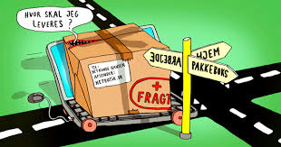

Hvis leveringstidspunkt ikke er aftalt: Varen/tjenesteydelsen skal leveres inden 30 dage fra bestillingen, jf. FBL § 27, stk. 1.

Forbrugeren kan hæve aftalen, hvis forsinkelsen er væsentlig for forbrugeren, og den erhvervsdrivende burde forudsætte dette.

---

Forbrugeren kan vælge at give en frist for levering, overholdes den ikke, kan aftalen hæves.

Hvis en aftale hæves, skal hver part tilbagelevere, hvad de hver især har modtaget.

Den erhvervsdrivende skal tilbagebetale penge til forbrugeren, senest 30 dage fra den erhvervsdrivende har modtaget besked om, at forbrugeren vil fortryde

 
---

## Forbrugerens fortrydelsesret i forbrugeraftaleloven


**"Fortrydelsesret"** er en ret for forbrugeren til uden angivelse af begrundelse at træde tilbage fra en aftale, som ellers ville være bindende for forbrugeren.

---
 
Hovedreglen i dansk ret er, at der ingen fortrydelsesret er ved køb i den fysiske handel, medmindre den er aftalt mellem forbrugeren og den erhvervsdrivende, fx har Elgiganten en aftalt returret på 14 dage i sine fysiske butikker, som dog ikke må forveksles med den lovpligtige fortrydelsesret efter forbrugeraftaleloven.

---

**Se her FBL § 18, stk. 1, hvor der er lovgivet om en fortrydelsesret i forbrugerkøb:**

* Forbrugeraftaler, der indgået ved fjernsalg, fx på nettet.

* Forbrugeraftaler, der indgået uden for fast forretningssted, fx i Bellacenteret.

 
---

**Fortrydelsesret: Andre særregler:**

**Fortrydelsesret ved køb af fast ejendom, jf. lov om forbrugerbeskyttelse ved erhvervelse af fast ejendom:**

En køber kan fortryde et køb af en fast ejendom i 6 hverdage fra aftalens indgåelse mod samtidig betaling af en godtgørelse til sælger på 1% af den nominelle købesummen, se nærmere ebogens kap. 21.

---

**Fortrydelsesret ved indgåelse af forsikringsaftaler:**

14 dage fra forsikringsaftalens indgåelse, dog 30 dage ved aftale om livsforsikring eller individuelle pensionsordninger, jf. FAL (forsikringsaftaleloven) § 34 i-k
 
---

**Fortrydelsesfristen 14 dages beregning:**

 
**Fortrydelsesfristen beregnes fra forskellige tidspunkter, jf. FBL § 19, stk. 2 – aftale om køb af:**

Tjenesteydelse – beregnes fra aftalens indgåelse.

Flere varer der leveres enkeltvis – beregnes når den sidste vare er i forbrugerens fysiske besiddelse.

Flere varer der leveres i partier – beregnes fra det sidste parti er i forbrugerens fysiske besiddelse.

--

Varer der leveres regelmæssigt over en periode – beregnes fra den første vare er i forbrugerens besiddelse.

Levering af vand, gas, elektricitet m.v. samt varer med digitalt indhold – beregnes fra aftalens indgåelse.

Den dag, hvor forbrugeren har modtaget de oplysninger om fortrydelsesret mv., som det påhviler den erhvervsdrivende at give forbrugeren på papir eller andet varigt medium.
 
---

**Forbrugeren har således 14 dages fortrydelsesret i disse situationer:**

Forbrugeraftaler indgået ved fjernsalg.

Forbrugeraftaler indgået uden for den erhvervsdrivendes forretningssted, fx på en messe i Bellacenteret.

---

**Hvordan fortryder forbrugeren:**
 
Forbrugeren skal meddele sin fortrydelse ved en utvetydig erklæring evt. bruge standardfortrydelsesformular.
  
Meddelelse om fortrydelse skal være afsendt inden fristens udløb.

Forbrugerne skal have sine penge tilbage.

Forbrugeren skal sende varen tilbage senest 14 dage efter, at den erhvervsdrivende har modtaget besked om fortrydelse.

---
  
**Forbrugeren bærer risikoen for varen.**

Ved værdiforringelse (forskellen mellem ny-pris og gensalgspris) skal forbrugeren betale. 

Der kan fradrages i den købesum, den erhvervsdrivende skal tilbagebetale til kunden.

---

**Retsvirkning ved fortrydelse:**

Ved tilbagetræden fra aftalen inden fortrydelsesfristens udløb, bortfalder aftalen, og:

Hver part tilbageleverer ydelse/modydelse.

Hvis forbrugeren har betalt helt eller delvis, skal det modtagne tilbagebetales til forbrugeren.
  
Tilbagebetaling skal ske snarest muligt og senest 30 dage efter, at den erhvervsdrivende har modtaget forbrugerens meddelelse om ophævelse.
  
Den erhvervsdrivende kan vente, indtil varen er returneret, eller indtil forbrugeren har dokumenteret, at varen er tilbagesendt.

--- 

## Fjernsalg - Finansielle tjenesteydelser


**Oplysningspligten**, jf. FBL § 14:


**Den erhvervsdrivende skal bl.a. give oplysninger om:**

CVR-nummer eller andet relevant identifikationsnummer.

Klageadgang og fremgangsmåden ved klage, herunder oplysning om en fysisk adresse.
  
Fortrydelsesfristens begyndelsestidspunkt, varighed og betingelserne for og fremgangsmåden ved brug af fortrydelsesretten.

---
  
Eventuelle særlige risici ved tjenesteydelsen som følge af ydelsens særlige karakter.
  
En eventuel lovvalgs- eller værnetingsklausul i aftalen. 

Forbrugeren skal have oplysningerne på papir eller et andet varigt medie.

En manglende overholdelse af oplysningspligten kan straffes med bøde.

---

**Fortrydelse - Fjernsalg af finansielle tjenesteydelser:**


**Finansiel tjenesteydelse:**

* Enhver tjeneste, der har karakter af bank-, kredit, forsikrings-, individuel pensions-, investerings- eller betalingstjenesteydelse.

---

**Fortrydelsesfristen:**

Der er 14 dages fortrydelsesret fra aftalens indgåelse eller fra det tidspunkt, forbrugeren har modtaget oplysning om fortrydelsesretten.

Der er 30 dages fortrydelsesret ved aftaler om individuel pensionsordning, FBL § 19, stk. 1.

Fristerne skal beregnes i kalenderdage. 

---

**Tilbagebetale:**  

Den erhvervsdrivende skal tilbagebetale eventuelt modtagne beløb snarest muligt og inden 30 dage efter, forbrugerens underretning om fortrydelse er kommet frem.

 
---

**Fjernsalg - Finansielle tjenesteydelser: Fremgangsmåde ved fortrydelse:**

Der skal ske underretning til den erhvervsdrivende om, at forbrugeren vil bruge fortrydelsesretten. 

Underretning skal være afsendt inden udløb af fortrydelsesfristen.
  
Forbrugeren har bevisbyrden for, at meddelelsen er sendt.

Meddelelsen om forbrugerens fortrydelse skal være utvetydig.

Der kan anvendes en standardfortrydelsesformular.

---

**Fortrydelsesret ved køb af værdipapirer?**

**HR.** Køb og salg af værdipapir er der tale om en finansiel fjernsalgsaftale og udgangspunktet er, at der er 14 dages fortrydelsesret. Den erhvervsdrivende skal på en synlig måde oplyse om, at der ikke ved købet af værdipair er nogen fortrydelsesret.

---

**U1.** Der er ingen fortrydelsesret, jf. forbrugeraftalelovens § 18, stk. 2, nr. 15:
”aftaler om varer, værdipapirer eller tjenesteydelser, hvis prisen afhænger af udsving på kapitalmarkedet, som den erhvervsdrivende ikke har nogen indflydelse på, og som kan forekomme i fortrydelsesperioden”. 

---

Bestemmelsen tilsigter dels at gennemføre direktivets artikel 16, litra b, dels at videreføre den tidligere forbrugeraftalelovs § 17, stk. 2, nr. 3, der undtog aftaler (både fjernsalgsaftaler og aftaler indgået uden for fast forretningssted) om værdipapirer eller finansielle tjenesteydelser, hvis værdipapirets eller tjenesteydelsens pris var afhængig af udsving på kapitalmarkedet, som leverandøren ikke havde nogen indflydelse på, og som kunne forekomme i fortrydelsesperioden, fra fortrydelsesretten.

---

Bestemmelsen indebærer, at reglerne om fortrydelsesret alligevel vil finde anvendelse på aftaler omfattet af lovens § 18, stk. 2, nr. 15, hvis der er tale om en aftale vedrørende en finansiel tjenesteydelse og denne aftale samtidigt er indgået uden for den erhvervsdrivendes forretningssted, jf. definitionen heraf i lovens § 3, nr. 2.

Der kan rejses spm. om der findes værdipapir, som ikke er afhængig af udsving på kapitalmarkedet. Det antages, at det ikke er tilfældet at der findes sådanne værdipapir. Ultrakorte obligationer (udløb om f.eks. 6 mdr.) bevæger sig kun meget, meget lidt. Guld går modsat - når aktier falder pga. uro stiger prisen på guld.

---

**U2.** Forbrugeraftalelovens § 18, stk. 3 gives der i visse situationer dog fortrydelsesret ved køb af værdipapir som er afhængig af udsving på kapitalmarkedet, som ikke er fjernsalgsaftaler ved køb af værdipapir uden for den erhvervsdrivendes faste forretningssted; fx salg af aktier og obligationer i Bellacentret vil der efter bestemmelsen i § 18, stk. 3 være en fortrydelsesret på købet af værdipapirer, så forbrugeren bliver beskyttet mod den aggressive sælger og for dermed at undgå overrumpling af forbrugeren med det personlige møde med sælgeren.


Forbrugeraftalelovens § 18, stk. 3, gælder aftaler vedrørende finansielle tjenesteydelser indgået uden for den erhvervsdrivendes forretningssted generelt, hvor der ikke er tale om en fjernsalgsaftale.

---

Køb af værdipapir i selve filialen er der ikke nogen fortrydelsesret, medmindre det aftales.  For kreditaftaler er der 14 dages fortrydelsesret, jf. kreditaftalelovens § 19.

---

God skik, jf. lov om finansiel virksomhed, jf. 43 og MiFID reglerne skal der også være opmærksomhed på.


---

## Urimelige aftaler

Urimelige aftaler kan tilsidesættes helt eller delvis eller ændres efter aftalelovens § 36. 
**<a href="https://jura.tepedu.dk/lovsamling.html" target="_blank"> Se aftaleloven i Lovsamlingen klik her!</a>**

---

**Generelle betragtninger- vurdering:**

Hvis det er stridende mod hæderlig forretningsskik, jf. aftalelovens §§ 38 c, stk 1, jf. 36:

"En aftale kan ændres eller tilsidesættes helt eller delvis, hvis det vil være urimeligt eller i strid med redelig handlemåde at gøre den gældende. Det samme gælder andre retshandler.
Stk. 2. Ved afgørelsen efter stk. 1 tages hensyn til forholdene ved aftalens indgåelse, aftalens indhold og senere indtrufne omstændigheder".

---
  
**Hvis der er i strid med redelig handlemåde.**

Aftalelovens §§ 38 a – 38 d – særligt kapitel om forbrugeraftaler:

Ved tvivl om indholdet af en forbrugeraftale tolkes aftalen til fordel for forbrugeren (koncipistreglen), jf. aftalelovens § 38 b.

**Aftaler skal være udarbejdet på en klar og tydelig måde, jf. aftalelovens § 38 b:**

"Opstår der tvivl om forståelsen af en aftale, og har det pågældende aftalevilkår ikke været genstand for individuel forhandling, fortolkes vilkåret på den måde, som er mest gunstig for forbrugeren. Den erhvervsdrivende har bevisbyrden for, at et aftalevilkår har været genstand for individuel forhandling.

Stk. 2. En skriftlig aftale, der tilbydes forbrugeren, skal af den erhvervsdrivende være udarbejdet på en klar og forståelig måde".

---
  
**Se retspraksis:**


Se dommen i **U 2005.2960 S** om vilkår om forlængelse af abonnementsaftale medmindre forbrugeren opsagde inden 30 dage før abonnementsperiodens udløb, blev tilsidesat af Sø- og Handelsretten. 
**<a href="https://pro.karnovgroup.dk/document/7000311279/1" target="_blank">Dommen klik her!</a>**

---

## Løbende tjenesteydelser/abonnementer


En forbruger kan opsige en aftale om løbende levering af varer eller tjenesteydelser med 1 måneds varsel til udgangen af en måned, når der er gået 5 måneder efter aftalens indgåelse, jf. FBL § 28, stk. 1, fx abonnementslignende aftaler.

---

Se Forbrugerklagenævnets sagsnr.: *18/11554*, hvor et vilkår om fysisk fremmøde for opsigelse af fitnessabonnement var urimeligt. I henhold til den erhvervsdrivendes aftalevilkår skulle opsigelse af fitnessabonnementet ske ved, at forbrugeren ved fysisk fremmøde i det center, hvor han var indmeldt, udfyldte af en blanket. Forbrugeren havde fremsendt sin opsigelse til den erhvervsdrivende per mail. Nævnet vurderede, at vilkåret om krav om fysisk fremmøde, som betingelse for opsigelse af fitnessabonnementsaftalen, måtte anses for at være urimeligt og lagde herved vægt på, at der som udgangspunkt ikke kan stilles formkrav til en opsigelse, og at der ikke foreligger oplysninger om saglige hensyn, der i tilstrækkelig grad kan begrunde vilkåret.

---

## E-handelsretten

(Emnet er ikke pensum på finansøkonomuddannelsen)

En central lov for e-handelsretten er **e-handelsloven** (Lov nr. 227 af 22. april 2002 om tjenester i informationssamfundet herunder visse aspekter af elektronisk handel.e-handelsloven har gennemført dele af Europa-Parlamentets og Rådets direktiv af 2000-06-08om visse retlige aspekter af informationssamfundstjenester, navnlig elektronisk handel, i det indre marked (»Direktivet om elektronisk handel«) (2000/31).

---

Det er karakteristisk for en række informationssamfundstjenester, f.eks. internethjemmesider, at de har en grænseoverskridende karakter. 

For at sikre den frie bevægelighed i det indre marked er det nødvendigt at fjerne visse retlige hindringer for påbegyndelse og udøvelse af informationssamfundstjenester gennem koordinering af medlemsstaternes lovgivning og at fastsætte visse minimumskrav for informationssamfundstjenester på fællesskabsplan. 

---

Ved direktivet fjernes bl.a. retlige hindringer som følge af forskelle i nationale lovgivninger og usikkerhed om, hvilke nationale regler der finder anvendelse på informationssamfundstjenester. 

Der er blevet indført et afsenderlandsprincip, jf. direktivets artikel 3 (lovens §§ 3-6), hvorefter leverandører af online-tjenester kan stille deres ydelser til rådighed overalt i EU på grundlag af de regler og den myndighedskontrol, der findes i den medlemsstat, hvori de er etableret.

Afsenderlandsprincippet gælder kun regler, der er omfattet af »det koordinerede område«, som er defineret i § 2, nr. 8. 

Direktivet indfører ikke ny international privatret og berører ikke domstolenes kompetence, ligesom en række forhold og aktiviteterer holdt uden for direktivets anvendelsesområde.

---

Direktivets bestemmelser gælder som udgangspunkt for både erhvervsdrivende og forbrugere. 

Visse af direktivets bestemmelser kan dog fraviges ved aftale i erhvervsforhold.

E-handelsdirektivet supplerer den generelle og sektorspecifikke EU-regulering, som gælder for informationssamfundstjenester. 

Direktivet berører således en lang række områder, hvor der findes anden regulering, og som henhører under forskellige myndigheders kompetenceområde, f.eks. hvad angår etablering, markedsføring, rådgivning, aftaleindgåelse, ansvar og offentlig kontrol, jf. noterne til de enkelte lovbestemmelser. 

Det overlades som udgangspunkt til medlemsstaterne at bestemme form og midler til gennemførelse af e-handelsdirektivet. 

Da det i Danmark blev anset for uhensigtsmæssigt og omstændeligt at gennemføre direktivet ved ændring i anden lovgivning, er direktivet implementeret ved enselvstændig lov, hvis bestemmelser er formuleret, så de ligger tæt op ad direktivtekstens ordlyd med henblik på at sikre en så korrekt implementering som muligt.

---

Direktivets artikel 9 fastslår et »diskriminationsforbud«, som indebærer, at medlemsstaternes lovgivning som udgangspunkt ikke må indeholde formkrav, som hindrer elektronisk indgåelse af kontrakter, f.eks. krav om skriftlighed, underskrift, fremlæggelse af originale dokumenter mv. 

Direktivets artikel 9 tager ikke stilling til de bevisspørgsmål, som brugen af elektroniske medier ved bl.a. aftaleindgåelse kan give anledning til. 

De bevismæssige spørgsmål angår bl.a., om der kan opnås tilstrækkelig sikkerhed for, at en meddelelse faktisk stammer fra den angivne udsteder (meddelelsens autenticitet og uafviselighed), og at meddelelsens indhold ikke er ændret efter, at den er afsendt (meddelelsens integritet). 

---

Se også lov om elektronisk signatur og Betænkning 1456/2004 om e-signaturs retsvirkninger, Betænkning 1400/2000om e-signatur og formkrav i lovgivningen og Beretning 1517/2010 om elektronisk aftaleindgåelse og handel, s. 12 f. og 17 f.

I forbindelse med den danske gennemførelse af e-handelsdirektivet blev det besluttet ikke at implementere artikel 9 som en selvstændig bestemmelse i e-handelsloven, men derimod at iværksætte et tværgående lovmoderniseringsarbejde, som tog sigte på at ændre eller ophæve formkrav mv. i lovgivningen, som unødigt hindrede brugen af digital kommunikation. 

---

Hvert ministerium blev pålagt at gennemgå sin egen lovgivning med henblik på at finde frem til de relevante bestemmelser og fastsætte en nærmere plan for lovmoderniseringen.

Ved afgørelsen af, om en elektronisk meddelelse kan opfylde evt. formkrav i lovgivningen, tages udgangspunkt i princippet om »funktionel ækvivalens«, jf. nærmere Betænkning 1400/2000 om e-signatur og formkrav i lovgivningen, s. 102 ff. 

Heri ligger en vurdering af, hvilke formål de pågældende formkrav tilsigter at varetage, og hvorvidt en elektronisk meddelelse kan opfylde formkravene. 

---


**Der kan grundlæggende være tale om fire formål:** 

1) at sikre bevis for en aftales eksistens og indhold, jf. ovenfor om sikring af meddelelsens autenticitet/uafviselighed og integritet, 

2) at varetage en beskyttelses-/advarselsfunktion, 

3) at indskærpe afgiveren af erklæringen en vis højtidelighed eller alvor, og/eller 4) at sikre dokumentets negotiabilitet.

Medlemsstaterne kan i henhold til direktivets artikel 9, stk. 2, helt eller delvist undtage bestemte kategorier af kontrakter fra artikel 9’s anvendelsesområde. 

---

**Det gælder** 

a) kontrakter om rettigheder over fast ejendom, 

b) kontrakter, der kræver medvirken af offentlige myndighed, 

c) kontrakter om kaution og sikkerhedsstillelse fra personer, der handler uden for deres erhvervsmæssige virksomhed, samt 

d) familieretlige og arveretlige aftaler. Medlemsstaterne skal meddele Kommissionen, hvilke af de nævnte undtagelser der udnyttes, samt hvert femte år aflægge rapport til Kommissionen om begrundelse for undtagelsen af kontrakter, der kræver medvirken af offentlig myndighed.

---

**E-handelsloven i en praksisnær kontekst**

**E-handelslovens regler gælder for en webshop og hjemmeside**.

Når man driver en netbutik, skal man overholde e-handelsloven. Man skal fx vise tydeligt, hvem man er, og der skal være tydelighed omkring ens salg og ens priser. Herunder skal bestillingsprocedure være klart kommunikeret til ens kunder.

---

**Ufravigelige krav til e-handel**

E-handelsloven indeholder nogle minimumskrav for e-handel, som virksomheden, ikke kan fravige, når der sælges online til forbrugere. 

Reglerne gælder uanset, at man har aftalt noget andet med ens kunde.

---

**Man skal blandt andet:**

Give nogle generelle oplysninger om ens virksomhed. 

Udforme reklamen, så den kan identificeres som reklame.

Give nogle tekniske oplysninger i forbindelse med, at man indgår aftalen.

Give en elektronisk ordrebekræftelse.

Virksomheder, der handler med hinanden via e-handel, kan indbyrdes aftale at fravige enkelte bestemmelser i e-handelsloven. 

Fx kan bestemmelsen om at give en elektronisk ordrebekræftelse afviges, hvis det er skrevet ind i salgsbetingelserne.

E-handelslovens bestemmelser supplerer reglerne i markedsføringsloven og forbrugeraftaleloven, så dem er det også vigtigt, at man sætter sig ind i. 

Forbrugerombudsmanden fører tilsyn med, at virksomheder overholder loven. 

Man har en generel oplysningspligt, hvilket betyder, at man altid skal synliggøre visse oplysninger om ena virksomhed. 

---

Virksomhedens webshop og hjemmeside skal som minimum give sine kunder lettilgængelig viden om ens virksomheds:

Fulde registrerede navn.

Fysiske etablerings-/forretningsadresse.

E-mailadresse.

CVR-nummer.

Tilhørsforhold til eventuelle godkendelses- og mærkningsordninger.

Speciel oplysningspligt for lovregulerede erhverv.

Priser og intention om salg skal stå tydeligt.

Man skal angive prisen for en vare eller tjenesteydelse, klart og tydeligt. 

Det skal også fremgå, om prisen er inklusive afgifter og leveringsomkostninger.

Man skal udforme og præsentere al kommerciel kommunikation, så det er tydeligt for forbrugerne, at der er tale om reklame, dvs. at man ønsker at sælge varer eller tjenesteydelser.

Det skal tydeligt fremgå, hvem der er afsender.

Betingelser for deltagelse i konkurrencer og spil og benyttelse af reklametilbud, som fx rabatter, tilgift og gaver skal også være let tilgængelige og fremlagt klart og tydeligt.

Krav om let forståelig information om bestilling.

---

Man skal tydeligt, klart og forståeligt informere om:

De forskellige tekniske led, fx bestillingsproceduren, i forbindelse med kontraktens indgåelse.

hvorvidt virksomheden opbevarer den indgåede kontrakt, og hvordan den eventuelt er tilgængelig.

De tekniske hjælpeværktøjer til at finde og rette indtastningsfejl.

De sprog, kontrakten kan indgås på.

Webshoppens tekniske funktioner skal være kundevenlige.

Private forbrugere skal have mulighed for at afgive en korrekt ordre, når de bestiller varer via ens hjemmeside. 

Man skal derfor sørge for, at hjemmesidens funktioner er så kundevenlige, at det er muligt for dem at finde og rette indtastningsfejl, så de ikke kommer til at bestille varer, de ikke ønsker.

Man skal også stille kontraktbetingelser og generelle salgsbetingelser til rådighed på en sådan måde, at ens kunder har mulighed for at lagre eller kopiere dem.

Man skal uden unødig forsinkelse, elektronisk bekræfte modtagelsen af en elektronisk ordre.

---

**Særligt for handel via online markedspladser:**

Markedsplatforme har en stigende rolle på markedet, og man bør derfor som e-handelsvirksomhed gøre sig tanker om fordele og ulemper ved at udbyde ens produkter på en online markedsplatform. 

Markedsplatforme formidler typisk blot kontakten mellem sælger og køber. 

Selve aftalen om køb bliver indgået direkte mellem parterne. 

Normalt vil det være lovgivningen i det land, som platformen betjener, der vil være gældende for købsaftalen.

---

**Quiz om e-handel**


Kan du fortryde dit køb, når du handler på nettet? Hvad gælder for levering? Og hvad kan du gøre, hvis varen ikke dukker op? **<a href="https://www.forbrug.dk/quiz/ehandelsquizzen/?rn=43716" target="_blank">Tag quizzen fra forbrug.dk, og få svar.</a>**

---

Nethandel #heltsikkert giver dig én samlet indgang til information om, hvordan du handler sikkert på nettet, og hvad du kan gøre, hvis det er gået galt.  
**<a href="https://www.forbrug.dk/nethandel/" target="_blank">Se regler om nethandel klik her!</a>**

---

<h4><a href="https://www.forbrug.dk/menu/videokanal/#mainVideo" target="_blank">Videoer om forbrugerforhold</a></h4>

---

**Quiz om e-handel og rejser**


Bestiller du rejser på nettet? Der gælder særlige regler ved handel på nettet, som du skal være opmærksom på. **<a href="https://www.forbrug.dk/quiz/e-handel-og-rejser/?rn=43716" target="_blank">Få styr på reglerne med forbrug.dk's quiz.</a>**

---

**Quiz om elektronik**

I forbrug.dk’s quiz kan du teste, hvad du har ret til, hvis dit elektroniske udstyr, fx dit kamera, din computer eller din mobiltelefon, går i stykker. **<a href="https://www.forbrug.dk/quiz/elektronik/?rn=43716" target="_blank">Tag testen her.</a>**

---

**Quiz om forbrugerrettigheder**

Har du styr på, hvad du har ret til som forbruger? Jo mere du ved, jo bedre er du klædt på, når du står i butikken eller handler på nettet. **<a href="https://www.forbrug.dk/quiz/forbrugerquizzen/?rn=43716" target="_blank">Test din viden her.</a>**

---

**Quiz om kopivarer**

Har du styr på, om du må eje kopivarer i Danmark? Eller om du må tage dem med hjem fra et andet land? **<a href="https://www.forbrug.dk/quiz/kopivarequizzen/?rn=43716" target="_blank">Prøv forbrug.dks quiz om kopivarer, og bliv klogere her.</a>**


---

## Quiz

<h3><a href="https://quiz.tepedu.dk/jura6" target="_blank">Quiz om forbrugeraftaler og forbrugerbeskyttelse</a></h3>

---


<!--chapter:end:05-Forbrugeraftaler.Rmd-->

# Erstatnings- og forsikringsreglerne

```{r, echo=FALSE, results='asis'}
cat(readLines('np.html'))
```


---

***Erstatningsreglerne anvendes i og uden for kontrakt i ejendomshandel, ejendomsadministration, bank og realkredit, forsikring samt revision og økonomifunktion i forbindelse med økonomisk tab, skader og mangler ved rådgivningen mv. overfor kunder og klienter. kapitlet gennemgår ulovbestemte betingelserne for erstatningsansvar uden for kontrakt, samt erstatning i kontrakt. Forsikringsreglerne anvendes til at dække erstatningsansvaret, hvor det er muligt. Den finansielle virksomhed skal ligeledes være meget opmærksom på god skik reglerne for finansielle virksomheder, samt hvidvask- og databeskyttelsesreglerne.***

---

**Indledningsvis skal du som studerende være særlig opmærksom på følgende i forbindelse med gennemgangen af erstatningsansvaret og den forsikringsmæssige dækning i forhold til eksamen i Erhvervs- og Finansjura:**

•	**Grundlæggende erstatningsbetingelser; ansvarsgrundlag, årsagsforbindelse, påregnelighed, økonomisk tab og værnet interesse.**

•	**Principalansvar (arbejdsgiverens hæftelsesansvar i DL 3-19-2).**

•	**Ansvarets sammenhæng med forsikringsdækning, erstatningsansvarslovens (forkortet; EAL) §§ 19 – 23.**

**OBS: Videoerne, domme og Forsikringsankenævnets afgørelser i herværende afsnit er ikke en del af pensum, men tjener udelukkende det formål at bidrage med en bedre forståelse for emnerne om erstatningsansvaret og den forsikringsmæssige afdækning.**

---

**Erstatningsretten bruges også i faget "Privatøkonomisk rådgivning på finansøkonomuddannelsen.**

---


<h4><a href="https://youtu.be/aUJNx9bEge4" target="_blank">Video om introduktion til erstatningsretten</a></h4>

---

## Erstatningsansvar uden en lovgivning

Tegning af en forsikring kan påvirke ens erstatningsansvar. Ligesom manglende tegning af en forsikring kan påvirke ens erstatningsansvar.^[Følgende afsnit om erstatningsansvaret og den forsikringsmæssige afdækning bygger hovedsagelig på *Sonny Kristoffersen* bøger "Kend Erstatningsreglerne", på forlaget Samfundslitteratur, se e-bogens bibiotek, samt min bog "Introduktion til forsikringsreglerne", på forlaget Hans Reitzel **<a href="https://jura.tepedu.dk/bibliotek-premium.html" target="_blank">Se nærmere biblioteket klik her!</a>**.]

---

Et ansvarsforsikringsselskab beskæfter sig indgående med erstatningsreglerne for at vurdere, om skadevolderen (dvs. forsikringstageren) har pådraget sig et erstatningsansvar over for en skadelidt. 

Ofte findes der ingen lovgivning, som kan fortælle, hvornår man som privatperson er ansvarlig for en skade. 

---

I stedet er der ud af mange års domspraksis udledt en erstatningsregel, der kaldes **den almindelige erstatningsregel.** 

Denne regel fastslår, at man er ansvarlig for den økonomiske skade, som man har forvoldt ved uagtsomhed eller med vilje. 

Reglen hedder også culpa- eller skyldreglen (**culpa** betyder "skyld" på latin eller brøde, uagtsomhed, forseelse, synd), som kan føres tilbage romerrettens culparegel. Modsat **diskulpere**	fritage for skyld.

---

Culpa er den grundlæggende betingelse for at pålægge erstatningsansvar uden for kontraktforhold. 

Der er tale om en **integritetskrænkelse** hvorved der er sket	fysisk skade på en person (personskade) eller på en ting (tingsskade).

En skadevolder har udvist culpa, optrådt culpøst, overtrådt culpareglen, hvis skadevolder har handlet enten forsætligt, dvs. med vilje og viden om handlingens elementer, eller uagtsomt. 

---

Vi mennesker skal i dagligdagen udvise **diligentia quam in suis rebus**; den omhu, vi udviser i egne anliggender.

Eller et andet latinsk udtryk fra romerretten: **impossibilia nulla est obligatione**;	man kan ikke forpligtelse sig til noget, der ikke er muligt.

---

**Brug af culpabegrebet brugt i praksis:**

[Jura] | culpa | - Den tiltalte havde udøvet culpa, og var derfor erstatningsansvarlig.

[Jura] | forseelse | - Hun er strafskyldig på grund af en uagtsom forseelse.

[Jura] | skyld | - De beviste, at vandværket havde udvist skyld i sagen.

---

**Se følgende domme om erstatningsansvaret:**  


Se dommen *"FED 2012.2*: Landsretten fandt, at en tilskuer, der ved strafbar handling løb ind på fodboldbane og afbrød landskamp, var erstatningsansvarlig over for DBU.
**<a href="https://pro.karnovgroup.dk/document/7000506917/1" target="_blank">Dommen klik her!</a>**

---


Se dommen i **FED 2006.78:** Ansvarspådragende efter culpareglen, at en person, der kørte i en lånt bil, ikke sikrede sig, at der var olie og vand på bilen, uagtet temperaturlampen lyste.. 
**<a href="https://pro.karnovgroup.dk/document/7000376722/1" target="_blank">Dommen klik her!</a>**

---

Se dommen **U 2015.572 H**: Tobaksselskaber ikke ansvarlige for varigt mén som følge af mangeårigt forbrug af cigaretter. 
**<a href="https://pro.karnovgroup.dk/document/7000720888/1" target="_blank">Dommen klik her!</a>**

---     

Man er kun erstatningsansvarlig for skader, der kan gøres op i penge (økonomisk tab, som den skadelidte skal kunne bevise). 

Ved tingsskader vil det være værdien af eller reparation af det ødelagte. 

Ved personskader bliver det økonomiske tab beregnet efter reglerne i Lov om erstatningsansvar (forkortet; EAL), 
**<a href="https://jura.tepedu.dk/lovsamling.html" target="_blank">Erstatningsansvarsloven klik her!</a>**

---

Det er fx erstatning for varige mén, tabt arbejdsfortjeneste eller tab af forsørger. 

Se følgende domme, hvor der idømmes erstatningsansvar i forskellige situationer:  

---  


Se dommen i **FED 2012.3:** "A, der sad uden for golfbanens cafeteria, blev ramt i hovedet af golfbold, da B – som deltager i en polterabend – under golfspil kom til at slå bolden for langt. B, der kun én gang tidligere havde prøvet at spille golf og ikke havde modtaget undervisning heri, fandtes erstatningsansvarlig".
**<a href="https://pro.karnovgroup.dk/document/7000506918/1" target="_blank">Dommen klik her!</a>**


Se dommen i **FED 2009.114:**^[FED: Forsikring og Erstatningsretlig Domsamling.] En kvinde, som faldt i søvn som fører af en bil, påkørte og dræbte en modkørende bilist. 
**<a href="https://pro.karnovgroup.dk/document/7000477953/1" target="_blank">Dommen klik her!</a>**

---

Se dommen i **FED 2008.1:**   En mandlig stripteasedanser B ansvarlig for øjenskade på deltager A i kvindelig polterabend, da B affyrede konfettirør. 
**<a href="https://pro.karnovgroup.dk/document/7000382215/1" target="_blank">Dommen klik her!</a>**


<br><br><br><br>

---     

## Hændeligt uheld - uden ansvar


Er skaden forvoldt ved et **hændeligt uheld**, har vedkommende ikke gjort noget forkert og er ikke ansvarlig for skaden. 

Man skal heller ikke erstatte noget.


Åbner en hotelgæst eksempelvis døren til sit værelse indefra, i det øjeblik en tjener går forbi på gangen med en bakke med glas, og døren rammer bakken, så glassene falder på gulvet og knuses, er der tale om et hændeligt uheld. Uheldet kan ikke bebrejdes hotelgæsten, da han ikke havde mulighed for at undgå det. Han havde opført sig som “den gode hotelgæst” og ikke begået nogen fejl. 

---

Se afgørelserne fra retspraksis og Forsikringsankenævnet om spørgsmålet om hændelige skader:

---   


Se dommen i **U 1961.167 H**: At en 11-årig dreng kom til at ramme en anden dreng med en kæp i øjet, blev anset for et hændeligt uheld og derfor ikke noget erstatningsansvar. 
**<a href="https://pro.karnovgroup.dk/document/7000214033/1" target="_blank">Dommen klik her!</a>**

---

Se dommen i **FED 1998.584:** Ejeren af sommerhus til udlejning havde ikke pådraget sig erstatningspligt ved, at en lejers barn kom til skade, da et sofabord, der var en del af sommerhusets møblement, væltede. 
**<a href="https://pro.karnovgroup.dk/document/7000328756/1" target="_blank">Dommen klik her!</a>**

---

Se dommen i **FED 2019.04:** A kom til skade til en julefrokost, da hun faldt som følge af, at dansegulvet var vådt. Det var dokumenteret, at gulvet ikke i sig selv var glat, at det var blevet vasket i løbet af aften og forud for uheldet, og at det var første gang arbejdsgiveren afholdt julefrokost i lokalet. På denne baggrund fastslog landsretten, at det forhold, at nogle festdeltagere spildte drikkevarer på gulvet, ikke kunne føre til, at arbejdsgiveren havde handlet uforsvarligt. B blev derfor frifundet. 
**<a href="https://pro.karnovgroup.dk/document/7000835745/1" target="_blank">Dommen klik her!</a>**

---

Afgørelser fra Ankenævnet for Forsikring:

Se **Ankenævnskendelse i sagsnr.: 35.936:** Klagers “griben ud efter” sit 15 måneder gamle barn, der var ved at falde, hvorved cigaretglød ødelagde en sofa, ikke anset som uagtsom adfærd, derfor ikke nogen erstatningspligt for sofaen.

---

Se **Ankenævnskendelse i sagsnr.: 39.737:** Gæstebudsskade at tabe kaffebakke under forsøg på at undgå at træde på et barn. Ikke erstatningsansvar, men dækket som gæstebudsskade over personens ansvarsforsikring.

---

Se **Ankenævnskendelse i sagsnr.: 51.809**: 8-årigt barn faldt over egne ben og væltede vase. Ikke erstatningsansvar, men dækket som gæstebudsskade.

---

"Gæstebudskade": Hvis en gæst kommer til at ødelægge noget hjemme hos værten, fx vælter en dyr vase eller spilder rødvin på et tæppe, kaldes det for en gæstebudsskade. 

Ved gæstebudsskader er gæsten normalt ikke erstatningsansvarlig. Værten har derfor ikke krav på erstatning fra gæsten. 

---

Som vært må man altså acceptere, at der er en vis risiko, når man har nogen på besøg.

Nogle indboforsikringer – bl.a. Topdanmarks – dækker gæstebudsskader alligevel, selv om der ikke er noget ansvar for gæsten efter domstolspraksis. 

---

Det anbefales derfor, at man som vært beder gæsten kontakte sit forsikringsselskab, da de måske dækker skaden. I så fald vil man få erstattet skaden fratrukket forsikringens selvrisiko.

Hvs gæsten smadder værtens indbo i vrede, så er der selvfølgelig ikke tale om en gæstebudskade, men gæsten har et et erstatningsansvar.


---

Se dommen i **FED 2003.1091:** Hønseejer var ikke ansvarlig for cyklists tilskadekomst, da cykel på landevej ramte fritgående høne. 
**<a href="https://pro.karnovgroup.dk/document/7000329678/1" target="_blank">Dommen klik her!</a>**

---

Se dommen **U 2013.84 V:** Motionscyklist, der sammen med andre cyklister kørte i en gruppe, og som efter at være kommet ud i rabatten prøvede at komme op på vejen igen, hvorved han væltede, og der skete sammenstød med bagfrakommende cyklister, havde ikke handlet ansvarspådragende. 
**<a href="https://pro.karnovgroup.dk/document/7000521782/1" target="_blank">Dommen klik her!</a>**

---

Se dommen i **H.K. af 24. juni 2002. Sagsnr.: 206/2002:** Museum var ikke ansvarligt for tilskadekomst, da gæst under privat besøg gled i hundeekskrementer og faldt.


---          

## Handlet forkert eller undladt at handle

Har skadevolder handlet forkert – dvs. er ansvarlig – er det vigtigt at finde ud af, om skaden er forvoldt ved en simpel uagtsomhed, grov uagtsomhed eller med forsæt (med vilje). 

Denne vurdering af handlingen eller undladelsen har bl.a. betydning for, om skadevolderens ansvarsforsikring skal betale for skaden hos skadelidte. 

---

**Se her følgende domsafgørelser:**  


Se dommen i **FED 2016.122:** Diskotek erstatningsansvarlig for personskade opstået ved, at diskotekets dørmand gik ud over det nødvendige og forsvarlige ved at skubbe eller kaste skadelidte ud af diskotekets dør. 
**<a href="https://pro.karnovgroup.dk/document/7000779860/1" target="_blank">Dommen klik her!</a>**

---

Se dommen i **Ø.L.D. af 12. maj 2005. Sag: 20. afd., a.s. nr. B-2581-04:** Værtinde ifaldt erstatningsansvar, fordi hun bar et sofabord ned ad en trappe iført højhælede sko og uden at fjerne noget nips, der indskrænkede trappearealet, hvilket forårsagede, at hun tabte bordet, som ramte en gæst i hovedet. (Utrykt)

---     

**Den almindelige fornuftige person**


Når en domstol bedømmer, om skadevolder har handlet forkert, sammenligner domstolen skadevolderens handling med, hvordan en almindelig fornuftig person ville have handlet i samme situation.

Begrebet afgrænser en uagtsomhed/en adfærd, der afviger fra de adfærdsnormer, der gælder inden for det pågældende område.

---

Kommer en domstol til det resultat, at en skadevolder har handlet anderledes, end hvad en alimindelig fornuftig person ville have gjort i samme situation, har skadevolderen handlet forkert og vil blive pålagt et erstatningsansvar.

Det skal bevises af skadelidte (kaldet en **ligefrem bevisbyrde**). Det er hovedreglen i dansk ret; Den der vil gøre noget gældende, har også bevisbyrden herfor.

---

For at kunne få erstatning fra en skadevolder skal skadelidte ifølge retspraksis (domstolene) bevise følgende over for retten: 


*	Der er sket en skade og lidt et tab. 

*	Det er skadevolders skyld – skadevolder har handlet uagtsomt eller med forsæt.  

*	Der er årsagssammenhæng (**kausalitet**) mellem den skete skade og det lidte tab, dvs. at tabet er en direkte følge af skaden.  

*	Der er påregnelighed (**adækvans**) mellem skaden og tabet, dvs., at skadevolder burde kunne forudse, at skaden ville ske.  En skadevolder er ikke erstatningsansvarlig for upåregnelige, atypiske følger af sine handlinger.

---

Kan skadelidte ikke bevise det, er det ikke muligt at få erstatning fra en skadevolder eller dennes ansvarsforsikring, se følgende dom:

---     

Se dommen i **FED 2007.111:** Forsikringstager havde ikke dokumenteret, at der var årsagsforbindelse mellem nogle anførte lidelser og et færdselsuheld. 
**<a href="https://pro.karnovgroup.dk/document/7000390950/1" target="_blank">Dommen klik her!</a>**

---     


**Ansvar for ikke at gøre noget**

Det er ikke kun handlinger, man kan blive erstatningsansvarlig for. 

I visse tilfælde kan man også blive erstatningsansvarlig for sine undladelser. 

---

Det sker oftest i situationer, hvor der er pligt til at handle. 

Eksempler er husejeren, der ikke gruser et isglat fortov, eller forældre, der ikke holder øje med deres børn.

---

**Ansvar for psykiske personskader**


Udover at der kan tilkendes erstatningsansvar ved tingsskader, samt fysiske personskader, så kan der være erstatningspligt for psykiske personskader. 

---

Se her nævnte domme:  

Se dommen i **U 2012.524 H:** A blev sygemeldt efter et begivenhedsforløb på en personaleweekend og rejste krav om godtgørelse for svie og smerte mod kommunen K som arbejdsgiver. 
**<a href="https://pro.karnovgroup.dk/document/7000506494/1" target="_blank">Dommen klik her!</a>**

---


Se dommen i **U 2010.1609 H:** Psykisk personskade anset for omfattet af ulykkesbegrebet i ulykkesforsikring. 
**<a href="https://pro.karnovgroup.dk/document/7000438162/1" target="_blank"Dommen >klik her!</a>**

---

## Simpel uagtsomhed

Ved **simpelt uagtsomhed** (latin; **culpa levis**), har skadevolder handlet mere skødesløst, end hvad en almindelig fornuftig personen ville have handlet i den samme situation – den lille dagligdags uagtsomhed – er skadevolder erstatningsansvarlig. 

Simpel uagtsomhed er en uagtsomhed, som ikke kan betegnes som grov. 

---

Culpareglen omfatter som hovedregel begge former for uagtsomhed.

Forsikringsankenævnet og domstolene foretager et konkret skøn, om skadevolder har handlet simpelt uagtsomt. 

---

Se dommen i **FED 2019.35**. Cyklist erstatningsansvarlig for fodgængers tilskadekomst ved sammenstød, da cyklisten burde have tilpasset sin hastighed og placeret sig således på stien, at påkørsel kunne undgås. 
**<a href="https://pro.karnovgroup.dk/document/7000844867/1" target="_blank">Dommen klik her!</a>**

---

Hvis eksempelvis en fodgænger træder ud på vejbanen uden at se sig for og rammer en forbikørende cyklist, der vælter, kan uheldet bebrejdes fodgængeren, der har været mere skødesløs end “den gode fodgænger”. 

Derfor er fodgængeren erstatningsansvarlig for cyklistens økonomiske tab. 

---

Se følgende sager fra retspraksis og Forsikringsankenævnet, om spørgsmålet, om der er simpel uagtsomhed hos skadevolder:


Se dommen i **U 1915.242 H**: (Uagtsom Brandstiftelse). "En Tiltalt færdedes en Nat i et straatækket Udhus, hvor der henlaa Fourage og Halm, med en to Tommer lang; Lysestump, som han under sit Ophold i Udhuset tændte. Under sit Ophold i Udhuset røg han derhos Cigaret. Umiddelbart efter at Tiltalte havde forladt Udhuset, viste det sig, at der var Ild i dette, der nedbrændte. Antaget, at Tiltalte havde foraarsaget Ilden, og at der forelaa Tilsidesættelse af almindelig Forsigtighed". 
**<a href="https://pro.karnovgroup.dk/document/7000764552/1" target="_blank">Dommen klik her!</a>**

---

**Praksis i Ankenævnet for Forsikring:**


Se **Ankenævnskendelse i sagsnr.: 03.256**: Da forsikringstageren, som under pasning af skadelidtes blomster havde forvoldt skade på dennes gulvtæppe, ikke fandtes at have udvist et så uforsvarligt forhold, at han ville kunne gøres ansvarlig for skaden, var selskabet berettiget til at afslå at erstatte denne. (Utrykt).


Se **Ankenævnskendelse i sagsnr.: 03.308:** Da forsikringstageren, som under arbejde i sin svigerfars lejlighed forvoldte skade på el-hovedkablet, ikke fandtes at have udvist et så uforsvarligt forhold, at han ville kunne gøres ansvarlig for skaden, var selskabet berettiget til at afslå at erstatte denne (utrykt).

---

## Grov uagtsomhed

**Grov uagtsomhed** (latin; **culpa lata**) er en betydelig form for uagtsomhed. 

Nyere retspraksis lægger vægt på, om skadevolderens adfærd indebar en ”indlysende fare” for den indtrådte skade. 

Skadevolderens bevidsthed om faren kan indgå i vurderingen af, om uagtsomheden er grov. 


Går en fodgænger over for rødt og vælter en cyklist, er fodgængeren nu mere uforsigtig end selv en skødesløs fodgænger. 

Det kan betegnes som grov uagtsomhed, og fodgængeren er erstatningsansvarlig. 

Det er en skønsmæssig vurdering, om domstolene og Ankenævnet for Forsikring anser en person for at have handlet groft uagtsomt.

---

**Se her nævnte domme og ankenævnsafgørelser om grov uagtsomhed:**

---


---

Se dommen i **U 1998.1693 H:** Opbevaring af nøglen til sikringsboksen i et auktionshus på et kontor i samme bygning var grov uagtsomhed. 
**<a href="https://pro.karnovgroup.dk/document/7000204274/1" target="_blank">Dommen klik her!</a>**


Se dommen i **U 1999.1706 H** Død ved fald på ca. 6 meter fra et tag ikke omfattet af ulykkesforsikring, da faldet var fremkaldt ved forsikredes forsæt eller grove uagtsomhed. 
**<a href="https://pro.karnovgroup.dk/document/7000196767/1" target="_blank">Dommen klik her!</a>**

---


Se dommen i **U 1993.955 V** Da kortvarig efterladelse af kuffert ved bagagebånd i lufthavn ikke var groft uagtsom, var tyveri af kufferten dækket af tyveriforsikringen. 
**<a href="https://pro.karnovgroup.dk/document/7000200954/1" target="_blank">Dommen klik her!</a>**

---


Se dommen i **FED 2013.9** Den 16-årige A ville ved ungdomsfest hjælpe værtinden med at tænde op i en udendørs pejs. I den forbindelse hældte han væske fra en dunk, som også værtinden havde benyttet i sit forsøg på at tænde op i pejsen, direkte ind i pejsen. Herved slog ilden tilbage og antændte A’s tøj samt dunken, som han i panik kastede fra sig. Den brændende dunk ramte en trækonstruktion og huset nedbrændte. Det viste sig, at væsken var benzin. Landsretten fandt, at A havde handlet groft uagtsomt, hvorfor hans ansvar ikke bortfaldt i medfør af erstatningsanvarslovens (EAL) § 19. 
**<a href="https://pro.karnovgroup.dk/document/7000534907/1" target="_blank">Dommen klik her!</a>**

---


Se dommen i **FED 2010.93:** Forsikringsselskab fik ikke medhold i, at en 13-årig dreng udviste grov uagtsomhed da han startede en bygningsbrand ved at tænde en lighter samtidig med, at en kammerat to meter derfra hældte benzin på en knallert. Tillagt betydning bl.a., at benzindampe har en forholdsvis svag lugt og løber langs gulvet, og at der er store individuelle forskelle på menneskers lugtesans. 
**<a href="https://pro.karnovgroup.dk/document/7000497550/1" target="_blank">Dommen klik her!</a>**

---

Se dommen i **FED 2001.2121:** Passager, som blev dræbt under bilkørsel med beruset fører, fandtes at have handlet groft uagtsomt, hvorfor hans livsarvinger ikke var berettiget til dødsfaldsdækning fra ulykkesforsikring. 
**<a href="https://pro.karnovgroup.dk/document/7000329307/1" target="_blank">Dommen klik her!</a>**

---

Se dommen i **FED 2001.2255** Bilist, som kørte ud foran tog i jernbaneoverskæring uden at være opmærksom på lys- og lydsignaler, havde handlet groft uagtsomt. DSB var derfor berettiget til at reducere personskadeerstatningen med 1/3. 
**<a href="https://pro.karnovgroup.dk/document/7000329214/1" target="_blank">Dommen klik her!</a>**

---

Se dommen i **FED 1998.224:** 16-årig rulleskøjteløber havde udvist grov uagtsomhed ved at køre ud på kørebanen foran bil. Under henvisning til alder, til at handlingen var udført i kådhed samt til områdets karakter, fandtes der dog ikke grundlag for at nedsætte personskadeerstatningen. 
**<a href="https://pro.karnovgroup.dk/document/7000328750/1" target="_blank">Dommen klik her!</a>**

---


Se dommen i **FED 2018.01 Ø.L.D. af 11. januar 2018. Sag: 20. afd. nr. B-583-17:** Den 14-årige A satte ild til papir i en affaldscontainer i en skolegård og forlod herefter stedet med den 13-årige B, der forholdt sig passivt til A's aktiviteter. Skolen brændte, og forsikringsselskabet F afholdt skadeudgifter på over 10 mio. kr. F gjorde regres med krav på 3 mio. kr. over for A og B. A fandtes at have handlet groft uagtsomt, men erstatningen blev reduceret til 1 mio. kr. efter EAL § 24a. B havde ikke handlet groft uagtsomt og blev derfor frifundet. 
**<a href="https://pro.karnovgroup.dk/document/7000814837/1" target="_blank">Dommen klik her!</a>**

---

**Uagtsomhedsbegrebet** findes også i straffeloven:

Se dommen i **U 2019.2748 V** 3 års fængsel for bl.a. uagtsomt manddrab ved som fører af en personbil i spirituspåvirket tilstand og under særligt hensynsløs kørsel at have forvoldt 3 personers død. Godtgørelser til de efterladte i medfør af erstatningsansvarslovens § 26 a. 
**<a href="https://pro.karnovgroup.dk/document/7000839976/1" target="_blank">Dommen klik her!</a>**

---

Samt **forsætlig** findes i straffeloven, dvs. med vilje:

Se dommen i **U 2019.2688 Ø**: 8 års fængsel for forsætlig påkørsel med døden til følge, jf. straffelovens § 245, stk. 1, jf. § 246. Endvidere udvisning for bestandig. 
**<a href="https://pro.karnovgroup.dk/document/7000838303/1" target="_blank">Dommen klik her!</a>**

---

**Nævnsafgørelser (kendelser) fra Ankenævnet for Forsikring:**


Se **Ankenævnskendelse i sagsnr.: 20.217**: Kørsel på motorcykel med 1 hånd ikke grov uagtsomhed i familie-/indboforsikring, og selskabet skulle dække beskadiget tøj efter færdselsskade. (utrykt).

---


**Ankenævnskendelse i sagsnr.: 48.636**: Hasarderet kørsel under flugt fra politiet anset for grov uagtsomhed.

---


**Ankenævnskendelse i sagsnr.: 63.558**: Groft uagtsomt at efterlade ulåst bil med nøgler i tændingslås i flere timer på privat vej, men forholdsvis tæt på befærdet vej. (Utrykt)

---


## Forsæt (med vilje)

**Forsæt** er en handling, der er foretaget med vilje, er ikke i dansk ret en betingelse for at ifalde erstatningsansvar. 

At skadevolderen har udvist uagtsomhed, dvs. tilsidesat den agtpågivenhed, som kræves på det pågældende område, er som hovedregel tilstrækkeligt til at pålægge erstatningsansvar, 

---

Kaster en person en sten efter en cyklist for at ramme denne, og det lykkes, er skaden på cyklisten lavet med vilje – med forsæt. 

Skadevolderen er selvfølgelig også her erstatningsansvarlig. 

---

Hovedreglen er i dansk ret, at kun forsætlige forhold er strafbare, dog er der en vigtig undtagelse ved uagtsomt drab:

Se straffelovens § 241: "Den, som uagtsomt forvolder en andens død, straffes med bøde eller fængsel indtil 4 måneder eller under særligt skærpende omstændigheder med fængsel indtil 8 år. Er forholdet begået i forbindelse med spirituskørsel, overtrædelse af færdselslovens § 54, stk. 1 eller 2, eller særligt hensynsløs kørsel, anses dette som en særligt skærpende omstændighed".
**<a href="https://jura.tepedu.dk/lovsamling.html" target="_blank">Straffeloven klik her!</a>**


---

Ved forsætlige handlinger afviser skadevolders ansvarsforsikring at udbetale erstatning, se her nævnte sager om vurderingen af, om skadevolder har handlet med forsæt – med vilje.

---


Se **Forsikringsankenævnskendelse i sagsnr.: 15.569** Skade på skolelokaler, forårsaget af 15-årig dreng ved udtømning af to pulverslukkere, anset forsætligt forvoldt, og derfor ikke dækket af ansvarsforsikringen. (utrykt)

---

Ved simpel og grov uagtsomhed er det hovedreglen, at en ansvarsforsikring dækker (se dog afsnittet nedenfor om generelt bortfald af ansvar). 

---

Forsætlige skader dækker forsikringen ikke, medmindre skadevolder er under 14 år.

---


Se Højesteretsdommen i  **H.D. 19 december 2016 i sag 235/2015 (1. afdeling):** Skadelidte, der var sindssyg, forsøgte at begå selvmord ved at køre ind i en modkørende lastbil. Retten til erstatning for personskade bortfaldt som følge af forsætlig medvirken.

---

Her et passende udtryk fra romerretten: "res ipsa loquitur";	"tingene taler for sig selv".

---

**Studenteropgave:**

Find retssager i UfR, som nærmere behandler grov uagtsomhed ved færdselsulykker.
**<a href="https://pro.karnovgroup.dk/journals/ufr" target="_blank">Ugeskrift for Retsvæsen klik her!</a>**

---

## Objektivt ansvar


I dansk ret kan der også gælde et såkaldt **objektivt ansvar**, hvorefter skadevolderen pålægges erstatningsansvar, selv om der ikke er handlet uagtsomt (uden skyld). 

Med andre ord er der situationer, hvor man kan blive ansvarlig, selv om skaden sker ved et hændeligt uheld. 

---

Objektivt ansvar er bl.a. lovfæstet i produktansvarsloven, jernbaneloven, luftfartsloven, lov om drift af nukleare anlæg, søloven, hundeloven, færdselsloven og lov om formidling af fast ejendom.

---

**Se følgende dom over en ejendomsmægler:**  

Se dommen **FED 1997.92:** I medfør af (dagældende) lov om omsætning af fast ejendom § 24 (nu § 47) måtte en ejendomsmægler på objektivt grundlag godtgøre en forbruger (sælger) forskellen mellem det beregnede provenu og et korrekt beregnet provenu, selv om forskellen skyldtes en forkert oplysning om kursen på et lån fra et realkreditinstitut, som havde oplysningen fra Københavns Fondsbørs officielle kursliste. 
**<a href="https://pro.karnovgroup.dk/document/7000328732/1" target="_blank">Dommen klik her!</a>**

---

Men det objektive ansvar kan også være ulovhjemlet (ikke fastsat i loven). 

Domstolene har i visse tilfælde pålagt skadevoldere objektivt ansvar uden lovhjemmel, når skaden er indtrådt som følge af materialesvigt, fx. skader, der er forvoldt af brud på fjernvarmerør, el og gasledninger mv. 

---

Se følgende domme: 


Se dommen i **FED 2014.77:** Bygherre og entreprenører var erstatningsansvarlig for udgravnings- og funderingsarbejde, der gjorde mur på nabogrund ustabil med efterfølgende sammenstyrtning til følge. Ved sammenstyrtningen skete der skader på tilgrænsende ejendom, hvorved denne bygnings ejer blandt andet led et huslejetab. Murens ejer havde inden sammenstyrtningen accepteret, at muren kunne fjernes, hvorfor murens værdi ikke skulle erstattes. 
**<a href="https://pro.karnovgroup.dk/document/7000735002/1" target="_blank">Dommen klik her!</a>**

---

Se dommen i **FED 2004.507:** Kommune og underentreprenør solidarisk ansvarlige for skade på nedgravede kabler, som under udboring til stikledninger blev ødelagt. Ligedeling af ansvaret i det indbyrdes forhold. 
**<a href="https://pro.karnovgroup.dk/document/7000328054/1" target="_blank">Dommen klik her!</a>**

---

Lejeloven indeholder et objektiv ansvar for installationer, som kan finde analogt anvendelse på en andelshaver.

Se dommen i **TBB2014.722**: Andelshaver ansvarlig efter analogi fra lejelovens § 29, stk. 10, overfor andelsboligforening for vandskade hidrørende fra vandtilslutning til vaskemaskine.

---

**Studenteropgave:**

Find retssager i UfR, som nærmere behandler det objektive ansvar.
**<a href="https://pro.karnovgroup.dk/journals/ufr" target="_blank">Ugeskrift for Retsvæsen klik her!</a>**

---

## Generelt bortfald af ansvar

Selv om skadevolder har handlet forkert – været uagtsom – er der nogle situationer, hvor skadevolder alligevel ikke er erstatningsansvarlig.

Er den skade, der er sket, i forvejen dækket af en tingsforsikring eller en driftstabsforsikring, er skadevolder ikke erstatningsansvarlig. 

---

Det gælder dog kun, hvis skaden ikke er forvoldt med vilje eller ved grov uagtsomhed. 

Det fremgår af Lov om erstatningsansvar (EAL) (Lovbekendtgørelse nr. 1070 af 24. august 2018). 
**<a href="https://jura.tepedu.dk/lovsamling.html" target="_blank">Lovsamlingen klik her!</a>**

---


Smadrer en dreng eksempelvis naboens glasrude, der er forsikret, ved en simpel uagtsomhed, er drengen ikke erstatningsansvarlig. Vinduet bliver betalt af glasforsikringen.

Lov om erstatningsansvar fastslår også, at hvis staten, en kommune eller en anden offentlig institution er selvforsikrende, skal de erstatningsmæssigt betragtes på samme måde, som hvis de havde tegnet forsikring. 

---

Det betyder, at der ikke er forskel på, om drengen ved en simpel uagtsomhed smadrer naboens glasforsikrede rude eller en rude i kommunens skole, hvor kommunen er selvforsikret. 

I ingen af tilfældene er drengen erstatningsansvarlig. For kommunens vedkommende betyder det, at den selv må betale ruden.

---

"Objektive ansvarsfrihedsgrunde" er forhold, som efter culpareglen gør, at en skadevolder alligevel ikke er pligtig til at betale erstatning for et tab eller en skade, selv om der foreligger culpa, kausalitet, og adækvans.

---

**De objektive ansvarsfrihedsgrunde består af:**

**Nødværge**, jf. straffelovens § 13:

"Handlinger foretagne i nødværge er straffri, for så vidt de har været nødvendige for at modstå eller afværge et påbegyndt eller overhængende uretmæssigt angreb og ikke åbenbart går ud over, hvad der under hensyn til angrebets farlighed, angriberens person og det angrebne retsgodes betydning er forsvarligt.

Stk. 2. Overskrider nogen grænserne for lovligt nødværge, bliver han dog straffri, hvis overskridelsen er rimeligt begrundet i den ved angrebet fremkaldte skræk eller ophidselse".

---

Nødværge betegner en handling, som foretages i et forsøg på at afværge et angreb, og hvor den person, der foretager nødværget handler på en måde, som medfører indgreb i den angribendes retsgoder.

Såfremt nødværgehandlingerne er nødvendige for at afværge eller modstå et påbegyndt eller overhængende angreb, og handlingerne ikke åbenbart går ud over, hvad der under hensyn til angrebets farlighed, angriberens person og det angrebne retsgodes betydning er forsvarligt, er nødværget lovligt.
**<a href="https://jura.tepedu.dk/lovsamling.html" target="_blank">Se straffeloven i Lovsamlingen klik her!</a>**

---

**Domme om nødret:**

Se dommen i **U 1938.134/2 V** Slag med gulvskrubbe for at hindre 3 berusede personer i at trænge sig ind i en butik. 
**<a href="https://pro.karnovgroup.dk/document/7000774882/1" target="_blank">Dommen klik her!</a>**

---

Se dommen i **U 1937.164** Tiltalte, hvis hund: var kommet i slagsmål med en glubsk hund, kastede en lukket havesaks efter hundene, hvorved den glubske hund blev såret og fik blodforgiftning - det udtaltes, at handlingen ikke fandtes at gå ud over, hvad der var forsvarligt - §§ 13 og 14 ikke citeret. 
**<a href="https://pro.karnovgroup.dk/document/7000775514/1" target="_blank">Dommen klik her!</a>**

---

Se dommen i **U 1934.509 H** Nazistisk stormafdelings forsvar med gummistykker overfor angreb med stakittremmer. Arbejdere, der havde angrebet og været i håndgemæng med marcherende nazister, idømt bøder. Nazisterne frifundet ("rimeligt forsvar"). 
**<a href="https://pro.karnovgroup.dk/document/7000240511/1" target="_blank">Dommen klik her!</a>**

---

Se dommen i **U 1926.11 H** En betjents forsvar - der endog medførte døden - overfor en beruset person, der havde slået betjenten i ansigtet anset berettiget. 
**<a href="https://pro.karnovgroup.dk/document/7000239406/1" target="_blank">Dommen klik her!</a>**

---

Se dommen i **U 1988.74 V** Modsat sig grov provokation, herunder ved slag i brystet, tildelt den pågældende et slag med en ølflaske i hovedet, frifindelse efter § 13, stk. 1 og 2. 
**<a href="https://pro.karnovgroup.dk/document/7000197908/1" target="_blank">Dommen klik her!</a>**

---

Se dommen i **U 1998.504 V** De tiltalte havde opfattet situationen således, at modparten såvel verbalt som ved sin fremtræden havde givet udtryk for et ønske om at komme i slagsmål med de tiltalte. De tiltaltes slag med knytnæver anset som straffri efter § 13, stk. 1. 
**<a href="https://pro.karnovgroup.dk/document/7000202350/1" target="_blank">Dommen klik her!</a>**

---

**U 2003.1353 V** Tiltalte, der - efter at en person havde råbt, at forurettede stod bag tiltalte med en kniv fremme - vendte sig om og slog forurettede i ansigtet med en ølflaske, og med to knytnæveslag, frifundet på grund af nødværge, jf. § 13, stk. 1. 
**<a href="https://pro.karnovgroup.dk/document/7000265254/1" target="_blank">Dommen klik her!</a>**

---

**Se på den anden side tilfælde, hvor nødværge ikke er statueret:** 

**U 1936.172 Ø** Slag med gummiknippel for at få en person til at slippe tag i gerningsmandens cykel, tildelt 2 slag, efter at taget var sluppet. 
**<a href="https://pro.karnovgroup.dk/document/7000240776/1" target="_blank">Dommen klik her!</a>**

---

Se dommen i **U 1933.817** Skud, der ramte krybskytte i benene, efter at krybskytten havde skudt gerningsmandens hund. 
**<a href="https://pro.karnovgroup.dk/document/7000240401/1" target="_blank">Dommen klik her!</a>**

---

Se dommen i **JD 1942.346** Nedskydning af brevduer, der beskadigede en nylig tilsået mark - hverken straffelovens §§ 13 eller 14 berettigede hertil.

---

Se dommen i **JD 1939.14** Slag med stok på person for at fjerne ham fra en gerningsmanden sammen med andre tilhørende strandgrund, 

Se dommen i **U 1974.729** (drab med kniv af betydeligt større og kraftigere person, der havde overfaldet tiltalte. Strafnedsættelse efter dagældende straffelovs § 84, stk. 1, nr. 1 og 4, og § 85), 

---

Se dommene i **U 1975.518 H** og **U 1992 752** 17-årigt besætningsmedlems medvirken til indførsel i USA af 4448 kg kokain, der blev taget om bord på skibet i internationalt farvand; det havde været yderst vanskeligt for ham at tage afstand fra hele den øvrige besætning, ligesom han havde næret frygt for sit liv, hvis han ikke deltog. Ikke frifundet efter straffelovens § 13, men den forskyldte straf bortfaldt i medfør af dagældende straffelovs § 84, stk. 1, nr. 2 og 5, jf. stk. 2 og § 85. 

---

Se dommen i **U 2008.1299 Ø** To politifolk, der under anholdelsesaktion havde benyttet tjenestepistol, frifundet for overtrædelse af straffelovens § 246. efter § 13, stk. 1, og stk. 2, og fik i øvrigt strafbortfald efter § 83. 
**<a href="https://pro.karnovgroup.dk/document/7000378613/1" target="_blank">Dommen klik her!</a>**

---

**Nødret**, er en objektiv ansvarsfrihedsgrund, jf. straffelovens § 14: 

"En handling, der ellers ville være strafbar, straffes ikke, når den var nødvendig til afværgelse af truende skade på person eller gods, og lovovertrædelsen måtte anses for at være af forholdsvis underordnet betydning".

Et juridisk udtryk for talemåden "nød bryder alle love"; udsagnet gælder imidlertid kun under visse betingelser. 

En handling, der ellers ville være en strafbar lovovertrædelse, straffes ifølge straffeloven § 14 ikke, hvis den var nødvendig for at afværge truende skade på mennesker eller andre værdier; det er ikke afgørende, hvordan nødsituationen er opstået. 

---

Nødretshandlingen er ikke straffri, hvis det truede gode kunne være reddet med lovlige midler. 

Handlingen kan foretages af den person, hvis værdier er truet, eller af andre, og den kan være rettet mod en tredje persons værdier. 

---

For at være straffri skal handlingen endvidere være af væsentlig mindre betydning end den skade, der ville være sket uden indgriben.

Visse værdier af ikke-økonomisk art kan aldrig ofres i en nødsituation; det er fx ikke tilladt at dræbe et menneske for at redde et eller flere menneskeliv. Se også nødværge.

---

I erstatningsretten gælder, at den part, som nødretten udøves til fordel for, skal erstatte de skader, som er sket ved nødretshandlingen; ansvarsgrundlaget er objektivt ansvar. 
**<a href="https://jura.tepedu.dk/lovsamling.html" target="_blank">Se straffeloven i Lovsamlingen klik her!</a>**

---

**Domme om stillingtagen til anvendelsen af straffelovens § 14:**

Se dommen i **U 1998.1769 Ø**: Bilists hastighedsovertrædelse under overhaling, nødvendiggjort af trafikforholdene, ikke strafbar, jf. straffelovens § 14.
**<a href="https://pro.karnovgroup.dk/document/7000204419/1" target="_blank">Dommen klik her!</a>**

---

Samt anderledes dommen i **U 2014.2941 V**: Fjernelse af to franske bulldogs fra kennel på grund af mistanke om dyremishandling var tyveri, der ikke var straffrit i medfør af straffelovens § 14, og der var ikke grundlag for at anvende straffelovens § 83, 2. pkt., eller § 82, nr. 3 og 7. Fastsættelsen af straffen blev udsat, jf. straffelovens § 56, stk. 1. 
**<a href="https://pro.karnovgroup.dk/document/7000652650/1" target="_blank">Dommen klik her!</a>**

---

Objektiv ansvarsfrighedsgrund **Negotiorum gestio:** Begrebet betyder uanmodet forretningsførelse og betegner den situation, hvor en person på en andens vegne, men uden bemyndigelse fra den anden, varetager den andens interesser, mens den anden selv er forhindret i at varetagne sine egne interesser.


---

**Objektive ansvarsfrihedsgrunde samtykke og accept af risiko:**

Hvis en handling, som udføres på en ansvarlig måde, er nødvendig for at afværge et formuetab, ifalder skadevolderen ikke erstatningsansvar for skade, han forvolder på den hvis ting, han forsøger at redde, og 

**Samtykke**, herunder 

**Accept af risiko**.

Fælles for de objektive ansvarsfrihedsgrunde er, at de fritager for erstatningsansvar. Selv om den adfærd, der har ført til skaden, almindeligvis ville være retsstridig, så anses adfærden alligevel ikke for retsstridig, fordi adfærden i det konkrete tilfælde anses for at have en nytteevne, som er vigtigere end skadeevnen.

---

Se fx dommen om nødret i **U 2019.1874 V**, hvor en voksen person greb i nakken på en 10-årig dreng, der stod med en brandsprøjte i hænderne, det var en overtrædelse af voldsbestemmelsen i straffelovens § 244, men straffrit efter straffelovens § 13, stk. 1, om nødværge. 
**<a href="https://pro.karnovgroup.dk/document/7000836492/1" target="_blank">Dommen klik her!</a>**

---

En lovlig politiforretning kan undtage politiet et erstatningsansvar:

Se dommen i **U 2019.1069 V** Politiet ikke erstatningsansvarlig over for udlejer for ødelagt dør, som politiet havde måttet sparke ind for at anholde eftersøgt person, da der havde været tale om en lovlig politiforretning, og politiet havde ikke handlet ansvarspådragende. 
**<a href="https://pro.karnovgroup.dk/document/7000832674/1" target="_blank">Dommen klik her!</a>**

---

**Man kan ikke blive erstatningsansvarlig over for sig selv.** 

De ting, som man ødelægger af sine egne ting, udløser ikke et erstatningsansvar, som der kan dækkes på ens ansvarsforsikring. Se fx. her nævnte dom:

---

Se dommen i **FED 2003.836:** Som følge af identitet mellem forsikringstageren og ejeren af et sommerhus, var der ikke dækning på en erhvervsansvarsforsikring for skade forvoldt af forsikringstagerens ansatte under udførelse af entreprise på sommerhuset. 
**<a href="https://pro.karnovgroup.dk/document/7000327909/1" target="_blank">Dommen klik her!</a>**

---

**Studenteropgave:**

Find retssager i UfR, som nærmere behandler objektive ansvarsfrihedsgrunde.
**<a href="https://pro.karnovgroup.dk/journals/ufr" target="_blank">Ugeskrift for Retsvæsen klik her!</a>**

---

## Børns erstatningsansvar


Mange forældre tænker ikke umiddelbart over det, men ligesom voksne kan børn blive pålagt at betale erstatning for de skader, de forvolder på andre mennesker eller deres ting.^[Følgende afsnit om børns erstatningsansvar bygger på Justitsministeriets pjece: "Børn skal også betale - Om børns erstatningsansvar".] 

Den skadelidte kan kræve erstatning, hvis barnet har handlet mere uforsigtigt, end fornuftige børn på samme alder normalt ville have gjort.

---

**Børn helt ned til fire-fem år kan stilles til ansvar for de skader, de forvolder.** 

Barnet skal være skyld i uheldet. Hvis der er sammenhæng mellem et barns adfærd og en skade, kan barnet blive afkrævet erstatning, hvis man kan bebrejde barnet, at skaden er sket.

---

Den skadelidte kan rejse erstatningskrav, hvis skaden medfører et økonomisk tab, og der kan herudover i visse særlige tilfælde rejses krav om godtgørelse for ikke-økonomisk skade. 

Der kan for eksempel kræves erstatning for tingsskade i form af ødelagte ejendele eller personskade i form af tabt arbejdsfortjeneste, udgifter til helbredelse og godtgørelse for svie og smerte eller varigt mén.

---

Der kan dog ved tingsskade ikke gøres erstatningsansvar gældende over for et barn, hvis skadelidte har tegnet en tingsforsikring (fx. en indbo- eller kaskoforsikring), der dækker skaden.

---

Det gælder dog ikke, hvis barnet har forvoldt forsætligt eller ved grov uagtsomhed.

Når en domstol skal afgøre, om en skadevolder skal betale erstatning, ser den på, hvordan en fornuftig borger ville have handlet i en tilsvarende situation.

Hvis skadevolder har handlet anderledes og mere uforsigtigt end en fornuftig borger, har skadevolder begået en fejl og skal som udgangspunkt betale erstatning.

---

**Typer af ansvar for børn:**

Når det drejer sig om et barn under 15 år, sammenligner man ikke med en voksen. 

Derimod ser man på, hvordan et barn på samme alder normalt ville handle i en tilsvarende situation.

---

**Situationer:**

En pige åbner en dør og rammer én på den anden side, der får ødelagt sit ur. Pigen kan ikke gøre for, at hun rammer uret. Det kaldes hændeligt uheld, og den, der har lidt skaden (den skadelidte), har ikke krav på erstatning.

To piger pjatter på fortovet. De ser sig ikke for, og den ene går ud foran en cyklist, som vælter og brækker armen. Pigen handlede uforsigtigt. Det kaldes simpel uagtsomhed. Derfor skal hun betale erstatning.

---

En dreng snupper en telefon fra en kammerat og kaster den op i luften. Han taber telefonen, og den går i stykker. Drengen ved, at han risikerer at tabe telefonen. Alligevel kaster han rundt med den. Det kaldes grov uagtsomhed. Derfor skal han erstatte telefonen.


En dreng kaster en sten gennem en rude på skolen, fordi han er sur over, at en lærer har skældt ham ud. Drengen ødelægger ruden med vilje. Det kaldes forsæt, og han skal betale erstatning.

Den skadelidte kan rejse erstatningskrav, hvis skaden medfører et økonomisk tab, og der kan herudover i visse særlige tilfælde rejses krav om godtgørelse for ikke-økonomisk skade. 

---

Der kan for eksempel kræves erstatning for tingsskade i form af ødelagte ejendele eller personskade i form af tabt arbejdsfortjeneste, udgifter til helbredelse og godtgørelse for svie og smerte eller varigt mén.

Der kan dog ved tingsskade ikke gøres erstatningsansvar gældende over for et barn, hvis skadelidte har tegnet en tingsforsikring (fx. en indbo- eller kaskoforsikring), der dækker skaden.

Det gælder dog ikke, hvis barnet har forvoldt forsætligt eller ved grov uagtsomhed. 

---

**Skader under leg:**

Der opstår let skader, når børn kommer i kropskontakt, for eksempel når de leger og dyrker sport, og her er det sjældent, at nogen af børnene kan gøres ansvarlige. 

Dels indebærer deltagelse i leg i sig selv en vis risiko, dels er det svært at placere ansvaret blandt børnene.

---

Opstår skaden under en leg, der må betegnes som farlig, vil børnene dog kunne gøres ansvarlige, for eksempel hvis de slås med køller, og den ene slår den anden i hovedet. 

Da de to børn begge har handlet uagtsomt ved at deltage i den fælles leg, vil den skadelidte som udgangspunkt kun få halvdelen af sit tab erstattet.

---

**Nedsættelse eller bortfald af børns erstatningsansvar:**

I nogle tilfælde kan et barns erstatningsansvar blive nedsat eller helt falde bort. Det kan for eksempel ske på grund af:

* Manglende udvikling hos barnet. 

Eksempel: Er et seksårigt barn kun udviklet som en treårig, bliver barnet sammenlignet med, hvad et treårigt barn burde vide.

---

* Handlingens beskaffenhed. For eksempel hvis skaden er sket på en for barnet kompliceret måde. 

Eksempel: Hvis to otteårige drenge leger med en drage, der vikler sig ind i nogle luftledninger, så de kortslutter, vil drengenes erstatningsansvar falde bort. Drengene er ikke gamle nok til, at de burde indse, hvad der får ledninger til at kortslutte.

---

**Forældre skal føre tilsyn:**

Børns erstatningsansvar overføres ikke til forældrene, men forældrene kan idømmes et selvstændigt ansvar, hvis deres adfærd har haft betydning for, at barnet har forvoldt skaden. Det sker:

Hvis de ikke har ført et rimeligt tilsyn med barnet eller ikke har fortalt barnet, hvordan det skal opføre sig.

Og denne forsømmelse har været årsag eller medvirkende årsag til, at barnet forvoldte skaden.

---

Ingen kan holde øje med deres børn hele tiden, men jo mindre barnet er, desto større tilsynspligt har forældrene. 

Børn, som er ældre end 10-11 år, er ofte selv i stand til at overskue følgerne af deres handlinger.

Om tilsynspligten anses for at være tilsidesat, vurderes i hvert enkelt tilfælde. 

Da der er tale om et selvstændigt ansvar for forældrene, er det ikke en forudsætning, at man også kan pålægge barnet et ansvar for skaden.

---

**Skader i skolen:**


I skolen overtager de ansatte pligten til at føre tilsyn med børnene. Hvis en skade på en elev eller elevens ting skyldes, at en ansat ikke har holdt godt nok øje med eleverne, vil skolen kunne gøres ansvarlig. 

---

Forældrene skal betale:

Hvis et barn er skyld i en skade, kan den, det er gået ud over, kræve en erstatning på op til 7.500 kroner pr. skadegørende handling af den, der har forældremyndigheden.

Det gælder, selv om forælderen ikke kan bebrejdes, at skaden er sket. Har forældrene fælles forældremyndighed, hæfter de solidarisk for de 7.500 kr. 

Hvis forældrene selv kan bebrejdes noget – fx. manglende tilsyn – kan forældrene gøres erstatningsansvarlige for hele den skade, deres barn forvolder.

---

Reglen om, at forældre hæfter for de første 7.500 kr. af barnets erstatningsansvar, har været gældende siden lov om hæftelse for børns erstatningsansvar trådte i kraft den 1. juli 2009. 

Udsigten til at skulle betale, hvis børnene forvolder skader, skal motivere forældre til at fokusere på deres rolle som opdragere og på opdragelsens betydning for børnenes trivsel og adfærd.

---

Forældrene hæfter alene for de første 7.500 kroner. Hvis der er sket skade for et mindre beløb, skal forældrene kun betale et beløb svarende til det faktiske tab. 

Er skaden større, skal barnet selv betale resten.

---


**En eller flere skader:**

Hvis en mindreårig, for eksempel i forbindelse med gadeuroligheder, både skader en person med et stenkast og sætter ild til en bil, er der tale om to skadegørende handlinger. 


Det betyder, at forældrene hæfter med indtil 7.500 kroner for hver skadegørende handling.

Hvis barnet sætter ild til en bil, og ilden breder sig til andre biler, er der tale om én skadegørende handling. Dermed hæfter forældrene for højst 7.500 kroner.


Er en skade forvoldt af to søskende i forening, hæfter forældrene for i alt 15.000 kroner.

---

**Indboforsikringen kan dække:**

En indboforsikring indeholder typisk også en ansvarsforsikring for både forældre og børn.

Det betyder, at ansvarsforsikringen ofte dækker både den del af en skade, forældrene hæfter for (indtil 7.500 kroner), og den del, barnet eventuelt selv skal betale. 

Uden en forsikring skal barnet og forældrene selv betale. Forældrene har dog kun pligt til at betale op til 7.500 kroner.

---

Når et barn er under 14 år, kan det være vanskeligt at afgøre, om en skade forvoldes med vilje, eller om den skyldes tankeløshed. 

Derfor dækker familiens ansvarsforsikring typisk skader, som børn under 14 år har forvoldt uagtsomt, og skader, som de har forvoldt med vilje ("forsætligt"). Det gælder også hærværk.


---

**Når barnet fylder 14 år:**

Sætter et barn på 14 år eller derover ild til en bil, smider en sten igennem en rude på skolen eller laver andre skader med vilje (forsætligt), betaler ansvarsforsikringen kun de 7.500 kroner, forældrene hæfter for. 

Det er jo ikke forældrene, der har gjort noget forsætligt.

Resten må den skadelidte kræve, at barnet betaler.

---


Se fx. dommen i **U 1989.278 V**: To brødre på 4 og 6 år, S og L, klatrede over hegnet til M's minkfarm og åbnede her 979 bure, hvorfra 1882 dyr løb ud. Deres ansvarsforsikringsselskab havde alene villet anerkende erstatningsansvaret for M's udgifter til indfangning af løsslupne mink (23.500 kr.), og S og L gjorde gældende, at den øvrige skade. (600.845 kr.) havde været psykologisk upåregnelig for dem og derfor ikke kunne kræves erstattet. Heri fik de ikke medhold af Vestre Landsret, idet der ikke var tale om atypiske skader, som det var rimeligt at lade M bære risikoen for. Der fandtes heller ikke grundlag for at nedsætte erstatningen efter myndighedslovens § 63, 2. led. 
**<a href="https://pro.karnovgroup.dk/document/7000198503/1" target="_blank">Dommen klik her!</a>**

---

## Erstatningsansvaret og EAL § 19

I det omfang en skade er dækket af en tingsforsikring eller en driftstabsforsikring, er der ikke erstatningsansvar, jf. EAL § 19, stk. 1, 
**<a href="https://jura.tepedu.dk/lovsamling.html" target="_blank">Se erstatningsansvarsloven i Lovsamlingen klik her!</a>**

---

Hovedreglen om, at der ikke er erstatningsansvar for en forsikringsdækket skade, gælder uanset ansvarsgrundlagets karakter. 

Ansvaret bortfalder både i forhold til forsikringsselskabet og i forhold til skadelidte. 

---

**Sammenholdt med undtagelserne i EAL § 19, stk. 2 og i § 21 omfatter dog hovedreglen imidlertid kun følgende tilfældegrupper:**

1) ansvar for skader i privatlivet, der er forvoldt ved simpel uagtsomhed;

2) ansvar for skader i privatlivet, der hviler på strengere ansvarsregler end culpareglen bortset fra de i § 21 nævnte (fx. DL 3-19-2 ved private tjenesteforhold, hundelovens § 8);

3) arbejdstageres personlige ansvar for skader, der er forvoldt ved simpel uagtsomhed, jf. stk. 3.

---

Reglen gælder ikke enhver skadesforsikring, der omfattes af forsikringsaftaleloven, men kun forsikringer, hvor forsikringsydelsen bestemmes enten af tingens værdi eller af dens afkastningsinteresse i relation til en virksomheds drift. Kreditforsikringer, kautionsforsikringer og lign. falder derfor udenfor.

---

Se Højesteretsdom i **H.D. 9. september 2019 i sag 99/2018 og 160/2018 (1. afd.)**
En 14-årig dreng var erstatningsansvarlig for brandskader på en skolebygning, mens en 13-årig dreng blev frifundet. Lempelse af erstatningen: "A på 14 år og B på 13 år havde sammen opholdt sig på en skole, hvor A tændte ild i noget papir i en container, mens B så på. Ilden bredte sig til bygningen. Skolens forsikringsselskab G udbetalte erstatning for skaderne med ca. 7,4 mio. kr. og rettede et regreskrav mod A og B. Højesteret fandt, at A havde forvoldt skaderne på skolebygningen ved grov uagtsomhed. A var derfor erstatningsansvarlig for skaderne, jf. erstatningsansvarslovens § 19, stk. 2, nr. 1. B fandtes derimod ikke havde medvirket ved ildspåsættelsen. Højesteret udtalte, at en person som udgangspunkt ikke bliver erstatningsansvarlig ved at undlade at foretage en handling, som kunne have forhindret eller begrænset en skade forvoldt af en anden. Højesteret fandt, at B heller ikke var erstatningsansvarlig, fordi han ikke forsøgte at forhindre ildspåsættelsen og ikke forsøgte at forhindre, at ilden bredte sig. Regreskravet mod A blev nedsat efter erstatningsansvarslovens § 24 a til 250.000 kr. med forrentning fra den 15. maj 2022, hvor A var fyldt 24 år. (Dissens.). Højesteret stadfæstede herefter landsrettens dom alene med ændring vedrørende erstatningsbeløbet".

---

**Studenteropgave:**

Find retssager i UfR, som nærmere behandler erstatningskrav mod børn.
**<a href="https://pro.karnovgroup.dk/journals/ufr" target="_blank">Ugeskrift for Retsvæsen klik her!</a>**


---

<h4><a href="https://youtu.be/0MInd7t_dHw" target="_blank">Video om forsikring, erstatning og arbejdsgiveransvar</a></h4>

---

## Erstatningskravet og erstatningsbeløbet

I Lov om erstatningsansvar kan man læse, hvad der kan kræves i erstatning af en erstatningsansvarlig skadevolders forsikringsselskab. Man kan som skadelidt kræve erstatning for følgende:

*	Udgifter til behandling.

*	Tabt arbejdsfortjeneste.

*	Svie og smerte.

*	Varigt mén.

*	Tab af erhvervsevne.

*	Dødsfald.

*	Skader på ejendele.

*	Advokatomkostninger.

---

**Anmeldelse af erstatningskrav**

Skadelidte skal henvende sig til den, der er skyld i skaden. 

Har skadevolder en ansvarsforsikring, kan vedkommende anmelde skaden til sit eget forsikringsselskab. 

---

Har skadevolderen ingen forsikring, må skadevolderen selv betale. 

Skadelidte må eventuelt rejse sit krav om erstatning gennem en retssag.

---

**Sådan bliver man erstatningsansvarlig i relation til ansvarsforsikringen**

Flere forsikringer indeholder automatisk en ansvarsforsikring, der dækker, hvis en af de forsikrede bliver erstatningsansvarlig for en skade. 

For mange er det svært at vurdere, hvornår de er ansvarlige for en skade, og hvornår ansvarsforsikringen dækker. 

Derfor vil reglerne for, hvornår der er ansvar, kort blive gennemgået nedenfor.

---

Har man forvoldt en skade, er det naturligt, at man føler skyld og mener, at skadelidte skal have erstatning, enten fra en selv eller fra det forsikringsselskab, hvor man er ansvarsforsikret.

At føle skyld for en skade er ikke det samme som, at man juridisk er ansvarlig, og at skadelidte dermed har ret til erstatning. 

I nogle tilfælde vil det fremgå af lovgivningen, om man er erstatningsansvarlig, mens det i tilfælde, hvor der ikke er lovgivet, vil være retspraksis (domstolene), der afgør, om man er erstatningsansvarlig.

---

**Udgifter til behandling**


Man kan få erstattet de udgifter til behandling, som ikke bliver betalt fra anden side (fx. den offentlige sygesikring eller sin egen ulykkesforsikring). 

---

Det kan være udgifter til medicin, fysioterapi, kiropraktorbehandling, hjælpemidler og hjemmehjælp, som lægen har ordineret, eller rimelige udgifter til transport til og fra et behandlingssted.

Fremtidige helbredelsesudgifter bliver erstattet med et kapitalbeløb, der udbetales på én gang og udregnes efter regler, der er fastsat i loven.

---

**Se om følgende udbetalingerne efter EAL:**

*	Erstatning for tabt arbejdsfortjeneste.

*	Erstatning for erhvervsevnetab, hvis denne udbetales som en løbende ydelse.

*	Renter, uanset om beløbet, de vedrører, er skattepligtigt eller ej. Erstatningen er skattefri, men der skal betales skat af eventuelle renter.

---

**Tabt arbejdsfortjeneste**


Har man tab af indtægt som følge af uheldet, kan man kræve hele tabet erstattet. 

Man får erstatning fra det tidspunkt, hvor uheldet skete, og indtil man kan begynde at arbejde igen. 

Medfører skaden, at man vil få et varigt erhvervsevnetab, får man erstatning frem til det tidspunkt, hvor det er muligt midlertidigt eller endeligt at skønne over ens fremtidige erhvervsevne, se følgende dom:

Se dommen i **U 2009.485 H:** Erstatning for fremtidig tabt arbejdsfortjeneste efter ulykke, der forsinkede studerendes uddannelsesforløb.
**<a href="https://pro.karnovgroup.dk/document/7000393609/1" target="_blank">Dommen klik her!</a>**

---

**Svie og smerte**


Godtgørelse for svie og smerte ydes som kompensation for det ubehag og de smerter, som et uheld medfører. 

Godtgørelsen kan kræves for perioden fra tidspunktet for uheldet, og normalt så længe man er sygemeldt. Godtgørelsen bliver givet efter en fast takst.

---

Der er også mulighed for som ofre at få udbetalt en "tortgodtgørelse" i forbindelse med en forbrydelse:

(TfK – Tidsskrift for Kriminalret)

Se dommen i **TfK 2015.1100:** Fængsel i 1 år og betinget udvisning for forsøg på voldtægt. Tortgodtgørelse på 30.000 kr. Se hele dommen her: **https://pro.karnovgroup.dk/document/7000733790/1**

---

Se dommen i **TfK 2015.729:** Fængsel i 1 år og 3 måneder for at have tiltvunget sig oralt samleje uden kondom med prostitueret. T var tidligere straffet for voldtægt. F blev tilkendt 40.000 kr. i tortgodtgørelse. 
**<a href="https://pro.karnovgroup.dk/document/7000730835/1" target="_blank">Dommen klik her!</a>**

---

Se dommen i **TfK 2015.575:** 6 måneders fængsel for overtrædelse af straffelovens § 210, stk. 1, ved mors samleje med 17-årig biologisk søn. Tortgodtgørelse på 20.000 kr. Se hele dommen her: **https://pro.karnovgroup.dk/document/7000729633/1**

---

Se dommen i **TfK 2016.1271:** Fængsel i 5 måneder til T, der havde skaffet sig andet seksuelt forhold end samleje med F, der var i en tilstand, hvor hun ikke kunne modsætte sig handlingen. Tortgodtgørelse 15.000 kr. 
**<a href="https://pro.karnovgroup.dk/document/7000754405/1" target="_blank">Dommen klik her!</a>**

---

**Tortgodtgørelse kan også kræves udbetalt i andre retsforhold:**

Se **U 2019.2972 Ø:** Udlejer pålagt at betale tortgodtgørelse til lejer for på ny at have begæret udsættelse af beboelseslejemål på et mangelfuldt grundlag, jf. retsplejelovens § 598, stk. 2, jf. 505, stk. 1.
**<a href="https://pro.karnovgroup.dk/document/7000840317/1" target="_blank">Dommen klik her!</a>**

---

**Godtgørelse for varigt mén**


Hvis man får varige gener i sin dagligdag på grund af uheldet, kan man kræve godtgørelse for varigt mén.

Størrelsen af ens mén angives i ménprocent. 

Det er et lægeligt skøn, der afgør, hvor stort ens mén bliver. 

Det skal være mindst 5 procent, for at man kan få godtgørelse. 

---

Er man fyldt 40 år, bliver godtgørelsen reduceret i forhold til ens alder. Godtgørelsen for varigt mén har intet med ens (evt. tidligere) erhverv at gøre. 

Derfor vil man måske opleve, at man sagtens kan passe et kontorjob, selv om man har fået erstatning for varigt mén, hvorimod man måske ville have svært ved at passe et job, der var fysisk hårdere.

---

**Erhvervsevnetabserstatning**


Hvis uheldet betyder, at man mister mindst 15 procent af ens evne til at erhverve indtægt ved arbejde, kan man få erstatning for tab af erhvervsevne. 

Erstatningens størrelse afhænger af ens løn lige før uheldet, ens alder på uheldstidspunktet og størrelsen af ens erhvervsevnetab. 

---

Erstatningen bliver udregnet efter regler fastsat i loven.

Var man fyldt 30 år på tidspunktet for uheldet, bliver ens erstatning nedsat i forhold til ens alder.

---

Man kan også kræve erstatning, selv om man ikke har nogen egentlig indtægt. 

For børn, der normalt ingen indtægt har, bliver erstatningen fastsat ved, at ménprocenten bliver ganget med en “normalårsløn”, der er fastsat i loven. Dette resultat bliver herefter ganget med 10. 

---

For hjemmearbejdende og studerende bliver erstatningen fastsat ud fra et skøn over den økonomiske værdi af deres arbejdskraft på det tidspunkt, hvor de kom til skade.

Erhvervsevnetabserstatningen bliver udbetalt på én gang.

---

**Dødsfald**


Der gives erstatning for rimelige begravelsesudgifter. 

En efterladt ægtefælle eller samlever har desuden krav på et såkaldt “overgangsbeløb”. 

---

Dette beløb skal gøre den økonomiske overgang fra gift/samlevende til enlig nemmere. 

Beløbets størrelse er fastsat i loven. Der kan dog ikke både gives erstatning for begravelsesudgifter og betales overgangsbeløb.

---

**Afdøde havde forsørgerpligt**

Forsørgertabserstatning til ægtefælle eller samlever udgør 30 procent af den erstatning, som afdøde ville have fået udbetalt ved fuldstændigt tab af erhvervsevnen. 

Der er dog fastsat et minimum- og et maksimumbeløb.

---

Efterlevende børn får en erstatning, der svarer til summen af de børnebidrag, som afdøde på skadetidspunktet kunne være pålagt at betale. 

Erstatningen bliver fordoblet, hvis afdøde var eneforsørger.

---

## Eksamensopgave 1

Ejendomsmæglerens støvler


(fiktiv)

En fredag eftermiddag var Martin taget ud til en fremvisning af et hus beliggende i nabobyen Indby. Huset tilhørte Pernille. Martin havde i dagens anledning taget sine nye og meget dyre Armani® støvler på. 

Desværre havde han fået købt dem i en lidt for lille størrelse, men havde valgt at tage dem på alligevel selv om Egild ikke havde ment at det var en god idé, da han syntes at de ikke rigtig udstrålede det image som ”Udby Mæglerne ApS” gerne ville stå for.

Da Martin kommer ind i huset vil han tage støvlerne af, men finder ud af at de sidder rigtig godt fast. Han kæmper noget med støvlerne, men til sidst får han dem revet af. 

Desværre rammer han med sin voldsomme bevægelse det spejl der hænger i gangen. Spejlet falder ned og smadrer mod gulvet. 

Ude i køkkenet står Pernille og er ved at lave kaffe. 

Hun bliver så forskrækket at hun taber den meget varme kaffe ned over sin hun ”Guffe”. 

”Guffe”, der var en præmiehund med en værdi på 10.000 kr, måtte efterfølgende aflives.

Eksamensspørgsmålet:

1.	Er nogen, og i givet fald hvem, erstatningspligtig over for Pernille for tabet af ”Guffe” og det smadrede spejl? 

**Podcast om svaret på eksamensopgaven**


---

## Eksamensopgave 2 


Murermester Madsen


Madsen, der er murer, står sammen med sin ansat, murerlærling Anton oppe på et stillads. De er ved at lave reparationer på Knudsens hus’ ydermurer.
 
Madsen benytter opgaven til at undervise Anton i, hvordan arbejdet bør udføres fagligt korrekt, og han forklarer også i detaljer, om sikkerhed på en farlig arbejdsplads, som en byggeplads jo er. Anton er en lærenem elev, og han udfører snart arbejdet til punkt og prikke. 

Men på et tidspunkt smider Anton en murske hen mod spanden med mørtel, men han rammer uheldigvis ved siden af. 

Skeen falder ud over stilladsets kant og rammer Knudsen, der netop passerer forbi med sin trillebør nedenfor. 

Knudsen rammes på næsen, der brækker, og pga. slaget og chokket falder Knudsen bagover, og i faldet forvrider han sin skulder. Hans dyre solbriller er også ødelagt. 

Knudsens hustru står samtidig inde i køkkenet. 

Hustruen ser ikke murskeen ramme Knudsen, men hun ser ud af vinduet lige da han falder bagover. 

Hun tror, at han er faldet om af et hjerteslag og styrter ud til telefonen i entreen for at ringe 112. 

I sit hastværk glider hun i et tæppe på entrégulvet og falder. 

Desværre er hun faldet så uheldigt, at hun slår sin ryg så slemt, at hun senere viser sig at miste sin førlighed delvist.

I det Madsen går hen for at hjælpe hustruen, bliver han bidt af Knudsens hund, der tror, han vil gøre hustruen noget. 

Bidet er ikke alvorligt, men det ødelægger dog Madsens jakke. 

Madsen ønsker at udvide sin forretning men det kræver en del kapital. Banken vil gerne låne ham pengene men de kræver sikkerhed i form af to kautionister. 

Madsen spurgte sin far der efterhånden var en ældre herre og som havde en betydelig formue. Faren afviste, da han havde en forestilling om at sønnen ingen økonomisk sans havde. 

Madsen skrev derfor under i sin fars navn.

Derefter spurgte han sin ansatte murelæring, der netop havde arvet, om han ville kautionere. Madsen lod ham – mellem linjerne – forstå, at hvis han afviste, ville det få ”uheldige konsekvenser” for Antons fremtidige ansættelse. 

Anton følte sig presset og skrev under.   

Eksamensspørgsmålene, der skal tages stillin til:

1.	Kan Hr. Knudsen kræve erstatning og i givet fald for hvad og af hvem? 
    
2.	Kan Hr. Knudsens hustru kræve erstatning og i givet fald for hvad og af hvem?
    
3.	Kan Madsen kræve erstatning og i givet fald for hvad og af hvem?

4.	Hvis banken ønsker penge af kautionisterne, hvordan er de to kautionister så stillet? 
    

---

**Podcast om svaret på eksamensopgaven**

---

## Eksamensopgave 3 


*Randers Boldklub*

Hans bor i Randers og har 2 teenagedrenge. De spiller fodbold, og de kommer sammen med deres far til samtlige af Randers fodboldkampe. 

Randers har kæmpet sig op i rækkerne og spiller rigtig godt, og de er godt med i slutspillet i SAS-ligaen. Hans vil gerne støtte dem, så han køber fantrøjer og kasketter til sig selv og drengene over Internettet. 

De skal have trøjerne og kasketterne på til næste kamp.

Hans skriver på bestillingen, at han skal bruge det inden 14 dage men varerne når ikke at komme inden kampen.

Hans og drengene drager af sted til kampen mod Nordsjælland. 

Der er en god stemning på stadion. Randers spiller godt, men kommer bagud, da der bliver afsagt en tvivlsom kendelse. 

I bar frustration over den tvivlsomme kendelse og ikke at have fået trøjerne og kasketterne løber han ind på banen og slår ud efter dommeren, Albert. 

Albert når at undvige, men falder uheldigt lige ind i målstolpen, og han slår sit hoved ret kraftigt. Han får en dyb flænge i panden og mister bevidstheden i 10 minutter. 

Albert bliver kørt på hospitalet, og han får konstateret en hjernerystelse, der medfører, at han sygemeldes i 1 måned. 

Albert skulle have været på skiferie dagen efter kampen, men på grund af hjernerystelsen bliver han nødt til at aflyse sin ferie. 

Han har ikke tegnet nogen rejseforsikring, så han må betale for rejsen selv om han ikke kommer af sted.

Alberts søster, Emilie, der overværede det hele, gik i chok. Hun besvimede, faldt og pådrog sig en brækket arm.

Hans og drengene skynder sig hjem. De løber ned af vejen. Henne ved hjørne står fru Olsen med sin hund Rufus. Rufus er en ret stor hund. Da Hans og drengene kommer løbende, bliver Rufus bange og går til angreb på Hans. Rufus bider Hans i benet og har dermed ødelagt hans bukser, og der er et stort åbent sår, som skal sys på skadestuen. 

En uge efter kampen kommer trøjerne og kasketterne men nu vil Hans ikke længere have dem.

Eksamensspørgsmålene:

1.	Kan Albert få erstatning og hvilke krav kan han i givet fald 
    rejse?
    
2.	Er Emilie berettiget til erstatning?

3.	Er Hans berettiget til erstatning fra fru Olsen? 

4.	Er Hans bundet af aftalen om køb af trøjerne og kasketterne?

5.  Kan Hans rejse krav om erstatning mod sælger, hvis han er bundet af aftalen om køb af trøjerne og kasketterne?

---

**Podcast om svaret på eksamensopgaven**

---

## Forsikringsreglerne

For en mere væsentlig uddybning af forsikringsretten for de studerende, som der vil vælge forsikringsvejen, se nærmere e-bogens kapitel 25, samt bogen hos Hans Reitzels Forlag: Introduktion til forsikringsreglerne:


---

**Forsikringer og pensioner er især reguleret i:**

*	Lov om finansiel virksomhed (FIL). 

*	Forsikringsaftaleloven (FAL).  

*	Pensionsbeskatningsloven (PBL).  

*	Pensionsopsparingsloven (POL).  


---

<h4><a href="https://youtu.be/jhoZCUQd-n8" target="_blank">Video om at forstå forsikring på 3 minutter</a></h4>

---

<h4><a href="https://youtu.be/C5MKa1y1r8I" target="_blank">Video Birgitte sælger forsikringer</a></h4>

---

<h4><a href="https://youtu.be/j-qLQu7qECw" target="_blank">Video om at blive skadesbehandler I forsikringsselskab</a></h4>

---


**Indgåelse af en forsikringsaftale**

Forsikringsaftalen omfatter enhver aftale, som indgås mellem på den ene side en forsikringsgiver (forsikringsselskabet) og på den anden side forsikringstageren.^[Følgende afsnit bygger især på **Sonny Kristoffersen:** Introduktion til forsikringsreglerne, 2019, Hans Reitzels Forlag, jf. **<a href="https://hansreitzel.dk/products/introduktion-til-forsikringsreglerne-bog-47916-9788741272849" target="_blank">klik her!</a>**, samt materialer og afgørelser fra Ankenævnet for Forsikring og informationer fra Forsikringsoplysningen og domme fra UfR og FED udgivet af KarnovGroup.] 

---

En forsikringsaftale kan således defineres som en aftale, hvor forsikringsselskabet (forsikringsgiver) overtager den økonomiske risiko for en uvis begivenheds indtræden mod et vederlag (præmie), der kan beregnes statistisk af forsikringsselskabet. 

---

**Forsikringstagerens oplysningspligt til forsikringsselskabet**

Det kan ikke antages, at den, der tegner forsikring, har en egentlig oplysningspligt, medmindre det må antages, at oplysningen vedrører forhold som forsikrede må vide har betydning for risikobedømmelsen, jf. FAL § 7. 

Har forsikringstageren ved forsikringens tegning svigagtig givet urigtig oplysning om eller fortiet en omstændighed, som må antages at være af betydning for selskabet, er aftalen ikke bindende for dette.  Det samme gælder, hvis hans eller hendes forhold i øvrigt har været af en sådan art, at det ville stride mod almindelig hæderlighed at gøre aftalen gældende, jf. FAL § 4.

---

Må det antages, at forsikringstageren ved forsikringens tegning hverken vidste eller burde vide, at en af ham given oplysning var urigtig, hæfter selskabet, som om urigtig oplysning ikke forelå, jf. FAL § 5, stk. 1.

---

Har forsikringstageren, uden at forholdet omfattes af FAL §§ 4 eller 5, givet urigtig oplysning, er selskabet fri for ansvar, hvis det kan antages ikke at ville have overtaget forsikringen, om det rette forhold havde været oplyst, jf. FAL § 6, stk. 1. 

Hvis forsikringstageren uden at have oplyst det til sit forsikringsselskab fx. udlejer sin bil, og der sker skade på bilen, eller tyveri af bilen under udlejningen, eller, at forsikringstageren udlåner bilen til sin søn, og der sker skade på bilen, må betrages som grov uagtsomhed, at disse oplysninger ikke er blevet givet til forsikringsselskabet, med det sandsynlige resultat, at forsikringsselskabet er berettiget til afvise et erstatning, jf. FAL § 6 stk. 1. og FAL § 7. 

Disse uoplyste forhold, omkring anvendelsen af bilen forøger forsikringsselskabets risiko, som ikke er blevet beregnet ind i præmiens fastlæggelse for kaskoforsikringen på bilen og denne anvendelse af bilen vil typisk være i strid med forsikringsvilkårene for kaskoforsikringen. 

---

Må det antages, at selskabet ville have overtaget forsikringen, men på andre vilkår, hæfter det i det omfang, i hvilket det mod den aftalte præmie ville have forpligtet sig. Ville selskabet ved genforsikring i videre omfang have begrænset sit ansvar for egen regning, nedsættes erstatningen i samme forhold, jf. FAL § 6, stk. 2. 

---

Forsikringstagerens undladelse af at give oplysning har ingen indflydelse på selskabets ansvar, medmindre han burde være klar over, at den ikke oplyste omstændighed var af betydning for selskabet, og hans forhold kan tilregnes ham som grov uagtsomhed. I så fald anses han, som om han havde givet urigtig oplysning, jf. FAL § 6, se FAL § 7.

---

Forsikrede vil i almindelighed kunne indskrænke sig til redeligt at besvare de stillede spørgsmål i **”forsikringsbegæringen”**, se nedenfor.  
 
En forsikringsaftale er normalt en standardkontrakt og vil blive fortolket imod forsikringsselskabet, hvis indholdet er uklart, jf. nærmere koncipistreglen i aftalelovens § 38 b.  

---

For indgåelse af en forsikringsaftale gælder aftalelovens almindelige regler.

Det er relevant at nævne, at der er pligt til at brandforsikre en ejendom, såfremt man ønsker den finansieret.


---

**Se nævnspraksis i Forsikringsankenævnet:**


Se afgørelsen i **Sagsnr.: 83897:** Klager over afvisning af dækning for feriekompensation. Klager anmeldte, at hun var blevet syg under en ferierejse i Guadeloupe, der var et oversøisk fransk departement. Selskabet henviste til, at Guadeloupe ikke var omfattet af forsikringens geografiske dækningsområde, EU/EØS. Selskabet henviste til policen og påpegede bl.a., at forsikringen alene dækkede i de lande, der var omtalt i forsikringens definition af EU/EØS. Nævnet fandt, at policen og forsikringsbetingelserne var udformet på en sådan måde, at forsikringstageren ikke kunne få et klart og entydigt svar på, hvilke geografiske områder, der var dækket. Nævnet bemærkede, at opstod der tvivl om forståelsen af en aftale, og havde det pågældende aftalevilkår ikke været genstand for individuel forhandling, fortolkedes vilkåret på den måde, som var mest gunstig for forbrugeren, jf. aftalelovens § 38 b. Da Guadeloupe var en del af Frankrig, var selskabet ikke berettiget til at afvise at yde forsikringsdækning. Klager medhold.  

---


Se dommen i **U 1990.426 Ø:** En bils bagagerum bag bagsædet var dækket af et vandret siddende gardin, som løftedes, når bagklappen åbnedes. Der skete tyveri fra bagagerummet. Bilens døre havde været låst. Ifølge vilkårene dækkede forsikring, hvis det stjålne lå i »låst bagagerum og ikke var synligt udefra«. Antaget, at vilkårenes ordlyd ikke med tilstrækkelig klarhed angav, at der – som påstået af forsikringsselskabet – skulle være adskillelse mellem bilens kabine og bagagerummet på en sådan måde, at adgang til bagagerummet fra kabinen alene var mulig ved voldelig opbrydning. Forsikringsvilkårene var derfor opfyldt. 
**<a href="https://pro.karnovgroup.dk/document/7000199096/1" target="_blank">Dommen klik her!</a>**

---


Ved en forbrugerforsikring forstås en forsikringsaftale, hvor forsikringstageren (forbrugeren) ved aftalens indgåelse hovedsagelig handler uden for sit erhverv.  

---

<h4><a href="https://youtu.be/sixGZPICtew" target="_blank">Video om unge og forsikringer | Gode råd om forsikringer</a></h4>

---


**Bevisbyrderegler** 

Forsikringsselskabet har bevisbyrden for, at en forsikringsaftale ikke er en forbrugerforsikring. 

Dette er svarende til, hvad der gælder efter bl.a. aftaleloven, købeloven og forbrugeraftaleloven. 

---

Det er som udgangspunkt forsikringstageren, der skal bevise, at man har ret til at få erstatning fra ens forsikringsselskab. Dermed er det forsikringstageren, der har bevisbyrden.  

I nogle tilfælde er det forsikringsselskabet, der har bevisbyrden. 

Mener selskabet, at en forsikringsbegivenhed (tyveri, skade mv.) ikke er dækket af forsikringen, fordi den er omfattet af en undtagelse i forsikringsbetingelserne, skal selskabet bevise dette. 

---

Mener selskabet, at man ved købet af forsikringen har givet forkerte (urigtige) oplysninger, skal selskabet bevise dette. 

Har man afgivet urigtige oplysninger, kan det betyde, at selskabet opsiger ens forsikringer tilbage til tegningstidspunktet.   

Tilsvarende har selskabet bevisbyrden, hvis selskabet mener, at man er underforsikret, eller at forsikringen er ophørt, fordi selskabet har opsagt ens forsikring. 

---

Mener selskabet, at en anden person skulle stå som ejer eller bruger af bilen i din forsikringspolice, er det også selskabet, der skal bevise, at den pågældende person er rette ejer eller bruger. 

Det har betydning for størrelsen af præmien og for erstatningen, hvis der ikke er betalt korrekt præmie.  

Selskabet har også bevisbyrden, hvis det anfører, at man har undladt at sikre genstande på passende måde (det vil sige at der fareforøgelse), eller at man har undladt at begrænse ens tab, efter at skaden er sket. 

---

Eksempelvis skal forsikringsselskabet bevise, at man har kørt alkoholpåvirket, at man har kørt over for rødt, at man har kørt alt for hurtigt eller på anden måde har handlet forsætligt eller groft uagtsomt.  

Hvis selskabet gør gældende, at ens krav er forældet, er det selskabet, der skal bevise dette. I alle sager gælder, at det kan have betydning for beviset, hvis en af parterne ikke vil eller kan fremlægge visse oplysninger. 

---

Det kan således indgå i bevisvurderingen, hvis man ikke vil give samtykke til, at selskabet indhenter lægelige eller kommunale akter, teleoplysninger eller lignende, som er af væsentlig betydning for ens sag.  

---

Hvad menes der med ordet **»forsikringstager«?** Den (person eller virksomhed), der har indgået aftale om forsikring med forsikringsselskabet (forsikringsgiver). 

I livsforsikring er forsikringstager den person, der betaler og ejer forsikringen, mens **"forsikrede“** er den person, hvis liv eller helbred er forsikret. 

Ved livsforsikring dog kaldet den »den begunstigede«.

---

Det vil – medmindre andet er aftalt – være forsikringstageren, der får forsikringen udbetalt. 

Ofte er forsikringstager og forsikrede samme person. 

---

**Har man pligt til at tegne forsikring?** 


Der er en lovbestemt pligt til at tegne forsikringer inden for en række retsområder. 

Der er forsikringspligt indenfor bl.a. arbejdsskadeloven, færdselsloven, jagtloven og hundeloven.


---

Se domspraksis om en sag vedrørende jagtansvarsforsikringen:

Se dommen i **FED 2012.14:** Jagt blev afbrudt og deltagerne kørte et andet sted hen for at spise frokost. Efter frokost ville jægerne A og B justere A's riffel, men ved et uheld blev A dræbt, da B utilsigtet affyrede riflen. Den lovpligtige jagtansvarsforsikring, F1, afviste at dække skaden med henvisning til, at denne forsikring kun dækker under „jagt eller i umiddelbar forbindelse med jagtens påbegyndelse eller afslutning“. B's almindelige ansvarsforsikring, F2, dækkede skaden, men gjorde regres over for F1 og gjorde bl.a. gældende, at vådeskudsulykken skete i en for jagten naturlig tilknyttet situation, hvor der blev håndteret jagtvåben. Landsretten fandt ikke, at ulykken var sket under jagt, eller at den havde haft en sådan tæt tidsmæssig og stedlig tilknytning til jagt, at ulykken kunne anses som sket i umiddelbart forbindelse med jagtens påbegyndelse eller afslutning. F1 blev derfor frifundet. **<a href="https://pro.karnovgroup.dk/document/7000517576/1" target="_blank">Dommen klik her!</a>**

---

<h4><a href="https://www.youtube.com/embed/asAt_30Pd_o" target="_blank">Video om alle kan få almindelige forsikringer</a></h4>

---


**Hvordan man ansøger om en forsikring?**

Det sker via et skema kaldet en **"forsikringsbegæring“**, hvor man giver forsikringsselskabet de oplysninger, som danner grundlag for forsikringens art, størrelse, risiko og antagelsesvilkår. 

Forsikringsbegæringen vil normalt indeholde oplysninger om ens person m.m. og omfatte en række spørgsmål, som man skal besvare til belysning af risikoforholdene. 

Disse spørgsmål har man pligt til at besvare i nøje overensstemmelse med de faktiske forhold. 

---

Forsikringsselskabet må ikke i forbindelse med eller efter indgåelse af forsikringsaftaler anmode om, indhente eller modtage og bruge oplysninger, der kan belyse en persons arveanlæg og risiko for at udvikle eller pådrage sig sygdomme, herunder kræve undersøgelser, som er nødvendige for at tilvejebringe sådanne oplysninger. 

Det gælder dog ikke oplysninger om den pågældendes nuværende eller tidligere helbredstilstand. 

---

Dette indebærer bl.a., at forsikringsselskaber og pensionskasser ikke må betinge indgåelsen af en aftale af, at der fremlægges såkaldte "prædiktive genetiske tests", og heller ikke senere må anmode om at få foretaget sådanne undersøgelser med henblik på eventuel ændring af aftalevilkårene eller opsigelse af aftalen. 

Ved prædiktive genetiske test forstås undersøgelser af en persons arvemasse, som belyser en sygdomsrisiko og gør det muligt at drage slutninger med hensyn til den pågældendes fremtidige helbredstilstand, som ikke direkte og på kortere sigt afspejler en udvikling i en allerede opstået sygdom. 


Eksempler på sådanne test er DNA-analyser, RNA-analyser, vævstype- og blodtypeundersøgelser.  

Forsikringsselskaberne og pensionskasserne må heller ikke spørge om, hvorvidt den pågældende tidligere har fået foretaget en prædiktiv undersøgelse.  

---

Et forsikringsselskab eller en pensionskasse må derimod gerne indhente oplysninger om forebyggende undersøgelser hos læger eller sygehuse, hvis oplysningerne vedrører sygdomme, forsikrings- eller pensionstager tidligere har haft, eller som allerede er i udbrud. 

Et forsikringsselskab eller en pensionskasse må ligeledes anmode om og bruge oplysninger om tidligere eller aktuelle sygdomme hos andre personer, herunder forsikrings- eller pensionstagers slægtninge. 

---

Forsikringsaftalen kommer i stand, ved at forsikringsselskabet accepterer ens forsikringsbegæring, enten i form af et antagende svar eller eventuelt blot ved fremsendelse af en police til forsikringstageren.

Et forsikringselskabs afslag på at tegne en forsikring som begæret og forsikringsselskabets opsigelse af en forsikringsaftale skal efter anmodning begrundes. 

---

Begrundelsen i FAL § 3b skal indeholde en henvisning til de relevante retsregler samt en kort redegørelse for, hvorfor forsikringen ikke kan tegnes, eller hvorfor forsikringsaftalen opsiges. 

Begrundelsen skal efter anmodning være skriftlig. 


## Skades-, pensions- og livsforsikringer


**Skadesforsikring er en aftale, hvor et forsikringsselskab overtager den økonomiske risiko for en uvis begivenheds indtræden.** 

**Ved skadesforsikring forstås i denne sammenhæng en forsikring, hvor selskabet kun er pligtig at erlægge forsikringsydelsen, når den sikrede har lidt en skade, der kan måles i penge, og hvor den ydelse, forsikringsselskabet skal erlægge, bestemmes af den sum penge, der skal til for at erstatte skaden.**

---

<h4><a href="https://www.youtube.com/embed/jhoZCUQd-n8" target=" _blank">Video: Forstå forsikring på 3 min Klik her!</a></h4>

---

Skadesforsikringens dækningsomfang reguleres af policen, de almindelige forsikringsbestingelser i overensstemmelse med forsikringsaftaleloven, jf. Lovbekendtgørelse 2015-11-09 nr. 1237 om forsikringsaftaler, se Lovsamlingen.

<h4><a href="https://j.tepedu.dk/lovsamling.html" target=" _blank">Klik her!</a></h4>

Efter forsikringsaftalelovens (forkortet; FAL) § 35 kan enhver lovlig interesse, der lader sig ansætte i penge, være genstand for skadesforsikring.

**Forsikringen kan tegnes for forsikringstagerens eller tredjemands interesse.**

---

**Kontraheringspligt ved skadesforsikringer?**

Forsikringsaftaleloven indeholder ingen regler om forsikringstagerens eller forsikringsselskabets pligt til at tegne en bestemt forsikring.

Forsikringstageren har i medfør af anden lovgivning i visse tilfælde pligt til at tegne en lovpligtig forsikring fx en ansvarsforsikring på bil og hund.

Efter færdselslovens § 105, stk. 1, skal der fx tegnes ansvarsforsikring for motordrevne køretøjer, samt efter hundelovens § 8, stk. 2, skal der tegnes ansvarsforsikring for hunde. 
Se nærmere Lovsamlingen: **<h4><a href="https://j.tepedu.dk/lovsamling.html" target=" _blank">Klik her!</a></h4>**

---

Det kan også nævnes, at der fx skal tegnes ansvarsforsikring for luftfartøjer, jf. luftfartslovens § 130, stk. 1, ligesom **statsautoriserede og registrerede revisorer, ejendomsformidlere og forsikringsmæglere har pligt til at tegne ansvarsforsikring**. 

Se fx Bekendtgørelse 2015-12-09 nr. 1537 om garantistillelse og ansvarsforsikring for ejendomsmæglere, ejendomsformidlingsvirksomheder m.v. jf. § 4, stk. 1:

"Enhver ejendomsmægler har pligt til gennem en erklæring fra et forsikringsselskab, jf. dog § 8, at dokumentere, at vedkommende person som ejendomsmægler er dækket af en ansvarsforsikring, og at forsikringsselskabet hæfter direkte over for formueskade påført en forbruger ved enhver form for uagtsom handling eller undladelse, der skyldes ejendomsmægleren eller ejendomsmæglerens personale og for krav omfattet af lovens § 47. 

Forsikringssummen skal andrage mindst 3 millioner kroner pr. forsikringsår. Det skal fremgå af erklæringen, at forsikringsselskabet hæfter over for den skadelidte tredjemand for en af ejendomsmægleren påtaget selvrisiko".

---

Pligt til at tegne forsikring kan endvidere være pålagt medlemmerne af en forening mv. For eksempel skal advokater efter vedtægterne for Det Danske Advokatsamfund tegne en ansvarsforsikring, og efter retsplejelovens § 143 har en advokat pligt til at være medlem af Advokatsamfundet.

Det kan også i en aftale være bestemt, at en af parterne skal tegne en forsikring, fx at sælgeren af en vare skal tegne forsikring for varen, indtil den når frem til bestemmelsesstedet. 

Nævnes kan også pantebrevsformular A og B vedrørende pantsætning af fast ejendom, hvorefter den pantsatte ejendom skal være behørigt brandforsikret.

---

Om *"brandforsikring"*, jf. forsikringsaftalelovens § 79.

Brandforsikring dækker den ved ildsvåde forårsagede skade på en af forsikringen omfattet genstand, selv om denne ikke kommer i brand. 

**"Ildsvåde"**	er et gammelt ord for brand.

Skade, forårsaget ved ild, der ikke kan betegnes som ildsvåde, omfattes ikke af forsikringen.

Der skal foreligge en flammedannelse, der er sluppet løs.

Ildebrand forudsætter således en flammedannelse; skader på halmfyr, som skyldtes en glødebrand, er derfor ikke omfattet. 

**Svideskader** dækkes heller ikke.

Omkring **"lynnedslag"**, jf.	FAL § 81, stk. 1: Hvis ikke andet er aftalt, svarer selskabet også for skade, som forvoldes ved lynnedslag, selv om der ikke derved opstår brand, på samme måde som for brandskade.

---

***Studenteropgave***

Find 4 afgørelser fra Ankeknævnet for forsikring (Forsikringsankenævnet) om brandforsikring, hvor ankenævnet giver afslag på forsikringssummen, eller at ankenævnet giver klageren medhold på udbetaling af forsikringssummen ved en brand.


**<a href="http://ankeforsikring.dk/kendelser/Sider/kendelser.aspx#Default=%7B%22o%22%3A%5B%7B%22d%22%3A%221%22%2C%22p%22%3A%22AnkeforsikringClosedDate%22%7D%5D%7D" target="_blank">klik her!</a>**

---


**Forskellen på skadesforsikring vs. livsforsikring:**


Ordet skadeforsikring - dækker over forsikring af skader på ejendele eller personer.

Det dækker over traditionelle forsikringer, som fx:

**Bilforsikring**

**Familie- og Indboforsikring, herunder rejseforsikring**

**Husforsikring**

**Bygningsforsikring**

**Ejerskifteforsikring**

---

Derudover dækker ordet skadesforsikring også over **sundheds- og ulykkesforsikringer** hvor man kan komme til at gøre skade på sig selv eller andre (**ansvarsforsikringer**, som typisk er en del af familie- og indboforsikringen).

---

**Ulykkesforsikring**

En ulykkesforsikring dækker, hvis man fx kører galt, falder ned ad trappen eller styrter på cyklen og får varige mén eller dør. 

Ulykkesforsikringen dækker kort sagt ved pludselige hændelser, der forårsager en personskade.

---

**Udbetaling:**

En ulykkesforsikring er en forsikring, hvor man får erstatning, hvis man skulle få et varigt mén. 

Forsikringen dækker typisk, hvis man får mén på mere end 5 % efter den pludselige hændelse.

Her kan man se en oversigt over procentsatser for forskellige mén.
**<a href="https://aes.dk/da/Selvbetjening/Mentabel.aspx" target="_blank">klik her!</a>**

---

Man kan også få erstatning for skader efter forvridninger og forstrækninger.

Ikke kun på arme og ben, men også forvridninger i resten af kroppen, fx ryg og nakke. 

Forsikringen kan dække udgifter til lægeordinerede behandlinger hos fysioterapeut, kiropraktor eller tandlæge med op til et vist beløb om året.

Nogle selskaber udbetaler et beløb pr. dag ved indlæggelse på et hospital i mere end tre dage, som følge af en ulykke. 

---

**Årsagssammenhæng**

For at opnå dækning er det et krav, at der er årsagssammenhæng mellem ulykkestilfældet og skaden. 

Ved vurderingen lægger selskaberne blandt andet vægt på, om ulykkestilfældet er egnet til at forårsage personskaden. 

Det vil sige, om ulykkestilfældet i sig selv er nok til at forårsage/forklare skaden. 

Er dette ikke tilfældet, vil ulykkesforsikringen i de fleste tilfælde ikke dække. Fx er der ikke årsagssammenhæng, hvis skaden skyldes, at man er syg eller har overbelastet eller nedslidt sin krop, uden at det er sket pludseligt.

---

**Erstatning ved invaliditet eller dødsfalddækning**

En ulykkesforsikring vil ofte indeholde en udbetaling i tilfælde af 100 % invaliditet eller død, beløbet udbetales som et engangsbeløb. 

---

**Børneulykkesforsikring**

Det er muligt at tegne en børneulykkesforsikring der dækker dine børn indtil de er fyldt 18 år, se nærmere nedenfor om behovet for at forældrene tegner en sådan forsikring.

---

**Dobbelterstatning**

Flere selskaber giver mulighed for at tegne en dobbelterstatning, hvilket betyder, at man får udbetalt det dobbelte beløb ved en mén-grad på 30 % eller mere. 

Det vil sige, at hvis man mister en hånd og således bliver 30 % invalid efter Arbejdsmarkedets Erhvervssikringens méntabel, se link ovenfor, så udbetaler forsikringsselskabet 60 % af summen, man har forsikret sig for.

Har du således forsikret dig for 1. mio. kr., så ville du under normale omstændigheder modtage 300.000 kr. ved at miste en hånd, mens du modtager det dobbelte beløb 600.000 kr., såfremt du har tegnet en dobbelterstatning.

---

**Fuld erstatning ved øje eller øre**

En lignende udvidet dækning kan også tegnes inden for andre områder fx øje og øre.

Eksempel: Hvis man i forvejen er døv på det ene øre og man bliver døv på ens raske øre, og man har forsikret sig for 1. mio. kr., så vil man under normale omstændigheder modtage 100.000 kr., da det svarer til 10 % invaliditet iflg. Arbejdsmarkedets Erhvervssikringens méntabel. Hvis man derimod har tegnet en udvidet dækning kan man modtage helt op til 75 % i dækning for ens øre, hvilket betyder, at man vil modtage op til 750.000 kr.

Er man i forvejen blind eller har nedsat syn på ens ene øje, og man bliver blind på det andet raske øje, vil udbetalingen blive sat til 100 % i dækning.

---


**Fritid eller arbejdstid**

Man skal være opmærksom på om man kun vil dækkes i din fritid, eller om ens ulykkesforsikring skal gælde hele døgnet. Priserne er forskellige alt efter, hvad man arbejder med.

---

**Medicin, hjælpemidler og transport**

En ulykkesforsikring dækker ikke ens omkostninger til medicin, hjælpemidler og transport. Disse udgifter må man selv betale.

---

**Sygdom**

Ulykkesforsikringen dækker ikke en ulykke, som skyldes en sygdom. Dette gælder også, hvis det er smitte fra Fx madforgiftning eller overfølsomhedsreaktioner.

---

**Beruselse, påvirket, grov uagtsomhed mm.**

Ulykkesforsikringen dækker ikke, hvis man er påvirket af alkohol eller andre stoffer med mindre, det kan bevises, at det intet havde med ulykken at gøre. Forsikringen gælder heller ikke, hvis man har handlet groft uagtsomt.

---

**Fødsel eller overbelastning af kroppen**

En ulykkesforsikring dækker ikke ved fødsel eller skader, som er opstået, fordi man overbelaster din krop. Det samme er tilfældet, hvis man får forkert medicinsk behandling.

---

**Farlig sport - Udvidet dækning:**

Ulykkesforsikringen vil ikke dække, hvis man jævnligt dyrker ekstremsport eller farlig sport som fx boksning, motorløb mm. Det samme er tilfældet, hvis man dyrker en sport professionelt. I sådan et tilfælde skal man tegne en udvidet dækning. Undtagelsen er hvis det er et enkeltstående tilfælde som fx en polterabend, firmafest og lignende.

---

**Når man bliver ældre**

Der kan være forskellige betingelser når du bliver ældre fx omkring 60-70 års alderen. Hos nogle selskaber nedsættes erstatningen, hvor andre selskaber hæver præmien. 

---

**Motorcykel, scooter og 45-knallert**

Der kan være forskellige betingelser når man bliver ældre fx omkring 60-70 års alderen. Hos nogle selskaber nedsættes erstatningen, hvor andre selskaber hæver præmien. 

---

Forældre skal tegne en **børneulykkesforsikring** på sine børn i vuggestuen, børnehaven eller folkeskolen, da disse steder ikke længere dækkes af kommunen.

Mange forældre tror fejlagtigt at deres børn automatisk er forsikrede på forældrenes ulykkesforsikring, nøjagtigt som det gør sig gældende på indboforsikring og ansvarsforsikring. 

Man skal derfor huske at gør sit forsikringsselskab opmærksom på, at man har fået børn.

De fleste forsikringsselskaber tilbyder at dække dine børn kvit og frit på ens ulykkesforsikring i de første 2-3 år af barnets liv. 

Ofte dækker selskaberne dog kun, hvis man husker at få barnet skrevet på ens ulykkesforsikring. 

Det er altså altafgørende at man kontakter sit forsikringsselskab kort efter at barnet er født og får det skrevet på ens ulykkesforsikring – ellers er barnet ikke dækket. Og der sker faktisk desværre uheld med selv helt små børn der kan give børnene varige mén.

---

**Hvorfor man skal have en børneulykkesforsikring:**

Når børnene når de 2-3 år skal de have tegnet en separat ulykkesforsikring. Indtil 2012 var det sådan at de fleste kommuner havde en fælles forsikring, for alle børn i daginstitutioner og skoler. 

Fra januar 2012 er det ikke længere lovligt for kommunen at tegne den slags forsikringer og børnene skal altså have deres egen børneulykkesforsikring, der kan dække behandlingen, hvis de skulle falde ned fra et klatrestativ. 

Ofte vil faldulykker kræve ekstra genoptræning og fysioterapi, som går ud over det kommunen dækker og det vil en børneulykkesforsikring i så fald kunne dække.

I uheldige tilfælde kan ulykker betyde at ens børn får varige mén og handicap. Det kan have store omkostninger, både økonomisk og socialt. 

En børneulykkesforsikring sikrer at man får en erstatning svarende til den skade ens barn har været udsat for. 

Sørg derfor også for at vælge en forsikringssum på forsikringen, der ikke er for lille. Normalt bør man vælge en forsikringssum på ca. 1 mio kroner.

En anden meget almindelig ulykke for børn er tandskader. Børn der falder på cyklen kan lave alvorlige skader på tænderne og kommunerne dækker ikke længere den slags skader. Derfor skal børn selv have en børneulykkesforsikring med tandskadedækning. 

---

Der skal således være tale om en **lovlig interesse**, der kan forsikres af skadesforsikringen. 

Interessen der ønskes forsikret, må ikke være i strid med "lov og ærbarhed", Lov og ærbarhed, vending, der stammer helt tilbage fra **Christian 5.s Danske (1683) Lov 5-1-2**, hvori der står fremhævet og som stadigvæk gælder den dag i dag, at aftaler skal holdes, hvis de "ikke er imod Loven, eller Ærbarhed", 

---

Det latinske udtryk **contra bonos mores**	**i strid med lov og ærbarhed**. **Danske Lov 5-1-2:** "Alle contracter, som friviligen giøris af dennem, som ere myndige, og komne til deris lavalder, vær sig ved kiøb, sal, gave, mageskifte, pant, laan, leje, forpligter, forløfter og andet, ved hvad navn det nævnis kand, som ikke er imod loven, eller ærbarhed, skulde holdis i alle deris ord og puncter, saa som de indgangne ere". Se hertil Danske Lov i lovsamlingen.
**<a href="https://j.tepedu.dk/lovsamling.html" target="_blank">klik her!</a>**

*(5: femte bog, 1: kap. 1, 2: 2 afsnit).*

---

Et forsikringselskab kan derfor ikke tilbyde at sælge forsikringer imod fartbøder eller parkeringsafgifter, det vil ikke være en lovlig interesse der kan forsikres.

---

Forsikringselskaberne skal således ikke dække på en skadesforsikring, hvis skaden er sket i forbindelse med begået ulovligheder, fx opståede skader i forbindelse med hæleri, tyveri eller skader og mangler udført af en håndværker med betaling af beløbet uden moms (sortarbejde). 

Man vil heller ikke som forbruger kunne klage til Byggeriets Ankenævn over den mangelfulde ydelse fra "den sorte håndværker"

Se **Forsikringsankenævnskendelse sagsnr.: 86.533.** Klagerens datter havde købt en helt ny computer via den blå avis: "Computeren var købt på en finasieringsaftale med et kreditkort, der var stjålet. Ved købet fik hun udleveret fakturaen, hvor hun kunne se, at hendes sælger ikke var den person, der havde købt computeren. Hun betalte en betydelig lavere pris for computeren end den kostede i forretningen. Efter nævnets opfattelse burde klagerens datter have indset, at sælger ikke var kommet i besiddelse af computeren på lovlig vis. At der ikke blev rejst tiltale mod datteren for hæleri, kunne ikke føre til andet resultat".


***Studenteropgave***

Find to afgørelser i Forsikringsankenævnet om spørgsmålet om der er tale om en ulovlig eller lovlig interesse som kan forsikres.
**<a href="http://ankeforsikring.dk/Sider/default.aspx" target="_blank">klik her!</a>**

---

**Forsikringsklasser indenfor skadesforsikring**


Skadesforsikringsklasser er for eksempel:

*Bygningsforsikring*, 

*Løsøreforsikring*, 

*Erhvervsansvarsforsikring*, 

*Indboforsikring*, 

*Familieansvarsforsikring*, 

*Sygeforsikring*, 

*Personulykkesforsikring*,

*Ansvarsforsikring*

*Retshjælpsforsikring*.


---


Det fremgår således bl.a. af bilag 7, jf, ovenfor til Lov om finansiel virksomhed, at skadesforsikring også omfatter assistance, defineret som assistance til personer, der kommer i vanskeligheder under befordring eller under fravær fra bopælen eller det faste opholdssted (forsikringsklasse 18). 

Dette omfatter fx aftaler vedrørende vejhjælp, hjemtransport eller anden assistance, fx i medfør af en rejseforsikring, eller lignende ydelser, der falder ind under denne definition.

---

**Skadesforsikringens genstand skal kunne ansættes til en økonomisk værdi før, at der kan ske dækning på skadesforsikringen**

Hvis genstanden ikke har nogen nævneværdig økonomisk værdi afvises der dækning på skadesforsikringen:


Se fx **FED1998.942:** Konservering af fotoalbum og børnetegninger uden økonomisk værdi ansås ikke for dækket af familieforsikring, og forsikringstageren var derfor alene berettiget til erstatning for materialepriser. 
**<a href="https://pro.karnovgroup.dk/document/7000331066/1" target="_blank">Dommen klik her!</a>**

---

## Udvalgte skadesforsikringer

Følgende afsnit om skadesforsikringer bygger især på **Sonny Kristoffersen:** Introduktion til forsikringsreglerne, 2019, Hans Reitzels Forlag.


**<a href="https://hansreitzel.dk/products/introduktion-til-forsikringsreglerne-bog-47916-9788741272849" target="_blank">Klik her!</a>**, samt materialer og afgørelser fra Ankenævnet for Forsikring samt informationer fra Forsikringsoplysningen samt domme fra UfR og FED udgivet af KarnovGroup.

---

## Bilforsikring

Bilforsikring er forsikring af en bil som består af en lovpligtig ansvarsforsikring, samt en frivillig kaskoforsikring og eventuelt tillægsdækninger. Bilforsikringen kaldes også autoforsikring eller motorkøretøjsforsikring. Ansvarsforsikringen dækker skader, som ejeren med sin bil påfører andre personskader eller andres ejendele.

**<a href="https://j.tepedu.dk/skades-pensions-og-livsforsikringer.html#bilforsikring" target="_blank">Om bilforsikring, se Juridisk Håndbog klik her!</a>**


---


## Forsikringer af familiens bolig

En familieforsikring er et andet ord for indboforsikring, og er altså en forsikring, der dækker din husstand og families ting.


**<a href="https://j.tepedu.dk/skades-pensions-og-livsforsikringer.html#forsikringer-af-familiens-bolig" target="_blank">Om forsikringer af familiens bolig, se Juridisk Håndbog klik her!</a>**

---

## Bygningsforsikringen

En bygningsforsikring dækker både brand og andre pludselige skader som fx storm, vandskade og indbrudstyveri.  

**<a href="https://j.tepedu.dk/skades-pensions-og-livsforsikringer.html#bygningsforsikringen" target="_blank">Om bygningsforsikringen, se Juridisk Håndbog klik her!</a>**


---

## Ejerskifteforsikringen 

En ejerskifteforsikring er en forsikring, der dækker skjulte skader i boligen, som ikke er anført i tilstandsrapporten og elinstallationsrapporten, og som køber ikke kendte til på overtagelsestidspunktet.


**<a href="https://j.tepedu.dk/skades-pensions-og-livsforsikringer.html#ejerskifteforsikringen">Om ejerskifteforsikringen, se Juridisk Håndbog klik her!</a>**


---

## Rejseforsikringen 

En rejseforsikring er en forsikring, der kan kompensere og afhjælpe økonomiske udgifter, der opstår under rejser, først og fremmest udlandsrejser. En rejseforsikring tegnes sædvanligvis i tilknytning til en specifik rejse, og med en varighed, der svarer til rejsens samlede varighed.

**<a href="https://j.tepedu.dk/skades-pensions-og-livsforsikringer.html#rejseforsikringen">Om rejseforsikringen, se Juridisk Håndbog klik her!</a>**


---

## Ansvarsforsikringen

En ansvarsforsikring kan "fratage" dig ansvar hvis du kommer til at gøre skade på andre mennesker, ting eller hvis du ejer en virksomhed der sælger produkter hvor du f.eks. kan risikere at blive retsforfulgt. 

**<a href="https://j.tepedu.dk/skades-pensions-og-livsforsikringer.html#ansvarsforsikringen">Om ansvarsforsikringen, se Juridisk Håndbog klik her!</a>**


---


## Rettigheder og forpligtelser i forsikringsretten

**<a href="https://j.tepedu.dk/skades-pensions-og-livsforsikringer.html#rettigheder-og-forpligtelser-i-forsikringsretten">Om rettigheder og forpligtelser i forsikringsretten, se Juridisk Håndbog klik her!</a>**


---


## Pensionsforsikringer

Pensionsforsikring, fællesbetegnelse for livsforsikringer, hvor størstedelen af den indbetalte præmie anvendes til opsparing, og hvis hovedformål er at sikre alderdomsforsørgelse for den forsikrede eller forsørgelse af den forsikredes efterladte.


**<a href="https://j.tepedu.dk/skades-pensions-og-livsforsikringer.html#pensionsforsikringer">Om pensionsforsikringer, se Juridisk Håndbog klik her!</a>**

Se **U 2020.3797 H:** Ændring af definitionen af forsikringstagers »nærmeste pårørende« kunne ikke ske ved passiv accept.**<a href="https://pro.karnovgroup.dk/document/7000854985/1" target="_blank">Dommen klik her!</a>**


---

## Livsforsikringer


*"Væddemålet med livsforsikringsselskabet om tidspunktet for dødsfaldet"*


**En livsforsikring sikrer én eller ens families indtægter, hvis én person skulle afgå ved døden**. 

Det garanterer altså ikke, at man lever for altid - men den kan resultere i en økonomisk udbetaling til ens familie og de efterladte, hvis man dør for tidligt.

Størrelsen af beløbet fastsættes sammen med ens rådgiver. 

Pension hører ligeledes under den samme kategori - fx er livrenter et godt eksempel på dette. 

Lever man længere er man sikret en fast indtægt. Dør man derimod tidligt, så er det forsikringsselskabet/pensionsselskabet der tjener på det.

De fleste kendte forsikringsselskaber tilbyder dog også livsforsikring. 

Denne forsikring henvender sig til den som ønsker at forsikre sig fx imod en eventuel død. 

Så hvis situationen er, at ens familie er afhængig af ens indkomst, og man vil sikre sin familie såfremt man går bort, eller bliver uarbejdsdygtig. 

Fastsættelse af præmierne består af flere elementer, dels summen man ønsker at bliver forsikret for, men ligeledes om ens helbredsoplysninger.

---

Livsforsikring er således ikke skadesforsikring, men en **summaforsikring**, der er karakteriseret ved, at forsikringsselskabet skal udbetale den aftalte forsikringssum ved forsikringsbegivenhedens indtræden, uanset om der kan påvises et økonomisk tab og uanset hvor mange livsforsikringer der er tegnet.

Berigelsesforbudet i FAL § 39: "Selskabet er, selv om andet er aftalt, ikke forpligtet til at udrede større erstatning end, hvad der kræves til den lidte skades dækning": 

Gælder kun ved **tingsforsikring**, men ikke for summaforsikring. Dvs fx hvis man har flere livsforsikringer får man udbetalt fra alle forsikringerne. 


---

<h4><a href="https://www.youtube.com/embed/EMCsXK44p1k" target=" _blank">Video: Matematik i forsikring og finansiering Klik her!</a></h4>

---

<a href="https://j.tepedu.dk/skades-pensions-og-livsforsikringer.html#livsforsikringer">Om livsforsikringer, se Juridisk Håndbog klik her!</a>


---

## Forsikringsformidling

**<a href="https://j.tepedu.dk/skades-pensions-og-livsforsikringer.html#forsikringsformidling" target="_blank">Om forsikringsformidling, se Juridisk håndbog klik her!</a>**

---

## Ordforklaringer på forsikringstekniske udtryk

**<a href="https://j.tepedu.dk/skades-pensions-og-livsforsikringer.html#ordforklaringer-p%C3%A5-forsikringstekniske-udtryk" target="_blank">Ordforklaringer på forsikringstekniske udtryk, se Juridisk håndbog klik her!</a>**


---

## God skik for finansielle virksomheder

Efter § 43 i lov om finansiel virksomhed, skal finansielle virksomheder, finansielle holdingvirksomheder og forsikringsholdingvirksomheder drives i overensstemmelse med redelig forretningsskik og god praksis inden for virksomhedsområdet.

God skik-reglerne er offentligretlige regler. En overtrædelse af reglerne om god skik indebærer således ikke uden videre, at den konkrete aftale mellem den finansielle virksomhed og kunden er ugyldig eller uvirksom. Manglende overholdelse vil dog kunne have en afsmittende virkning på visse civilretlige forhold. Disse spørgsmål afgøres af de private finansielle ankenævn og af domstolene.

**<a href="https://j.tepedu.dk/god-skik-for-den-finansielle-virksomhed-samt-erstatningsansvaret.html" target="_blank">God skik for finansielle virksomheder, se Juridisk håndbog klik her!</a>**

---

Se e-bogens lovsamling **<a href="https://jura.tepedu.dk/lovsamling.html" target="_blank">Lov om finansiel virksomhed, klik her!</a>**

---

## Bekæmpelse af hvidvask og terrorfinansiering

Lovbekendtgørelse nr. 380 af 2. april 2020 om forebyggende foranstaltninger mod hvidvask og finansiering af terrorisme (hvidvaskloven) fastsætter forebyggende foranstaltninger mod hvidvask og finansiering af terrorisme (hvidvaskloven) er et regelsæt, som skal sikre, at de virksomheder, som er omfattet af loven, kender deres kunder og de transaktioner, som de foretager.

**Hvidvaskloven har i 2020 gennemført yderligere initiativerne om:** 

– Administrative bødeforelæg 

– Udvidelse af de finansielle virksomheders oplysningspligt over for Finanstilsynet. 

– Ny mulighed for at udpege en sagkyndig person, der kan følge den daglige drift i en    
  virksomhed, hvor der er risiko for finansiel kriminalitet. 
  
– Styrkelse af whistleblowerordningerne gennem forbud mod tavshedsklausuler. 

– Mulighed for påbud om stop for nye kundeforhold, hvis Finanstilsynet konstaterer 
  alvorlige overtrædelse af centrale hvidvaskregler i en virksomhed. 
  
– Skærpelse af strafansvar for afgivelse af urigtige oplysninger til Finanstilsynet. 

– Forhøjelse af den strafferetlige forældelsesfrist for grove overtrædelser af 
  hvidvaskloven og lov om finansiel virksomhed fra 5 til 10 år.
  
– Indførelse af egnetheds- og hæderlighedskrav for Finanstilsynets bestyrelse i stil med  
  fit & proper-kravene, som gælder for finansielle virksomheder.
  
---

Loven har derudover til formål at sikre en effektiv gennemførelse af visse bestemmelser i 4. hvidvaskdirektiv og dermed skabe yderligere klarhed om de juridiske rammer for Hvidvasksekretariatets virksomhed. Endelig er der indført lovændringer vedrørende indefrysning af midler, samt videregivelse af oplysninger og fortrolighed herom i forbindelse med operativt samarbejde om hvidvask og terrorfinansiering.


**<a href="https://j.tepedu.dk/bek%C3%A6mpelse-af-hvidvask-og-terrorfinansiering.html" target="_blank">Bekæmpelse af hvidvask og terrorfinansiering, se Juridisk håndbog klik her!</a>**

Se e-bogens lovsamling **<a href="https://jura.tepedu.dk/lovsamling.html" target="_blank">Lov om bekæmpelse af hvidvask og terrorfinansiering, klik her!</a>**

---

## Databeskyttelsesreglerne

Den finansielle virksomhed skal i dagligdagen have stor fokus på databeskyttelsesreglerne.

Betegnelsen **databeskyttelse** beskriver både det forhold, at enhver har ret til beskyttelse af sine personoplysninger, og at enhver, der behandler personoplysninger om andre i ikke-privat sammenhæng, er forpligtet til at iagttage disse rettigheder og til at beskytte personoplysningerne. 

**<a href="https://j.tepedu.dk/databeskyttelse.html" target="_blank">Databeskyttelsesreglerne, se Juridisk håndbog klik her!</a>**


---

## Løsningsmodeller ved eksamensopgaver indenfor erstatning uden for kontrakt 

**1. Identificer mulige skadevoldere og skader**^[Følgende afsnit bygger på Løsningsmodellerne fra opgavesamlingen i Erhvervsret ASPIRI, v. advokat *Peter Wedel Ranch Krarup*.]

Nedennævnte erstatningsbetingelse skal gennemgås for hver enkelt potentiel skadevolder:

•	Eventuelle skadevoldere, der skal bedømmes efter DL 3-19-2, bør af opgavetekniske grunde behandles til sidst, når der flere mulige skadevoldere.

---

**2. Børn og utilregnelige** 

•	Børn under 15 år sidestilles med voksne – jf. EAL § 24A (dog ikke børn under 4 år).

•	Utilregnelige sidestilles med tilregnelig (raske) - jf. EAL § 24B.

---

**3. Ansvarsgrundlag**

**3.1. Culpa**

* Culpa = uagtsomhed.

* Culpa for undladelser, kun hvis der foreligger en handlepligt.

* Pligt ifølge lovgivning eller regler.

* Pligt til at afmærke /afværge en egen frembragt fare.

* Pligt for ejer til at vedligeholde fast ejendom.

* Pligt for ejer til at rydde fortov.

* Pligt til at tilkalde assistance ved personskade og livsfare.

* Pligt for forældre, lærer og pædagoger til holde opsyn med børn med børn i deres varetægt.

---

**Bevisbyrde**

**HR:** Skadelidte har bevisbyrden - ligefrem bevisbyrde

**U:** Med omvendt bevisbyrde - præsumptionsansvar (efter praksis ved skader ved operationer og bilreparationer).

---

**3.2. Objektivt ansvar**

•	Motorkøretøjer - Færdselsloven §101 (kun ejer og bruger, herunder tyv, men ikke fører - § 104).

•	Hundelovens § 8.

•	Lånte genstande til brug – DL 5-8-1 (Danske Lov).

---

**3.3. Arbejdsgiveransvar- solidarisk medansvar i forhold til tredjemand – DL 3-19-2:**

•	Der skal foreligge et ansættelsesforhold, herunder vennetjenester.

•	Arbejdsgiveren skal have instruktionsbeføjelse over den ansatte.

•	Den ansatte skal have handlet culpøst.

•	Skaden skal være forvoldt i tjenesten (omfatter svinkeærinder).

•	Handlingen må ikke være et abnormt skridt eller udført kådhed.

---

**Objektive erstatningsbetingelser**

**4. Kausalitet/årsagssammenhæng**

- Skaden skal være en følge af handlingen.
	
---

	
**5. Adækvans/påregnelighed**

- Handlingen skal have generel skadeevne i forhold til den type skader, som er sket.

---
 
**6. Tab**

**6.1. Økonomisk tab**

- Økonomisk tab erstattes med genanskaffelses- eller reparationspris.

---

**7.6.2. Personskade** 
- Personskade kapitaliseres og erstattes efter EAL – jf. EAL § 1 (erstatningsansvarsloven).

---

**6.2.1. Ikke varige tab**

- Andet tab som følge af skaden, herunder medicin, optræning mv. – jf. EAL § 1.

- Tabt arbejdsfortjeneste indtil begynder at arbejde igen – jf. EAL § 2.

- Godtgørelse for svie og smerte – jf. EAL § 3.

---

**6.2.2. Varige tab**

- Godtgørelse for varige mén – jf. EAL § 4.

- Erstatning for forringelse af erhvervsevnen – jf. EAL § 5.

---

**6.2.3. Død**

- Forsørgertabserstatning – jf. EAL §§ 13-14. (erstatningsansvarsloven).

---

**7. Der må ikke være objektive ansvarsfrihedsgrunde**

Såsom:

- **Nødværge** – skadevolder handler for at værge for sig, jf. straffelovens 13.

- **Nødret** – skadevolder ofrer et gode for at redde et dyrere eller forhindre personskade, jf. straffelovens § 14.

- **Lovlig retshåndhævelse** – skader, der sker ved lovlig retshåndhævelse/anholdelser o. lign.

- **Samtykke** – hvis skadelidte har samtykket i handlingen.

- **Accept af risiko** – hvis skadelidte har kendt og accepteret risikoen.

- **Uanmodet forretningsførelse** – hvis skadevolder nødvendigt og forsvarligt handler på andens vegne for at hindre skade, når denne selv var forhindret.

---


**8.  Nedsættelse, bortfald eller lempelse**

**8.1. Nedsættelse**

- Egen skyld hos såkaldte – hvis skadelidte selv har handlet culpøst.

---
 
**8.2 Forsikring og selvforsikrere**

**8.2.1. Selvforsikrere**

- Offentlige myndigheder vil normalt blive opfattet som selvforsikrede, og dermed som var forsikring tegnet, selvom dette ikke er tilfældet – jf. EAL § 20. (erstatningsansvarsloven)

---

**8.2.2. Ansvarsfrihed**

- I det omgang skaden er dækket af en tingsforsikring eller en driftstabsforsikring, er der ikke erstatningsansvar for skadevolder – jf. EAL § 19. En selvrisiko skal således erstattes. 

- Er skaden forvoldt ved forsæt eller grov uagtsomhed, eller er skaden forvoldt ved erhvervsmæssig virksomhed, eller offentlig virksomhed, der må ligestilles hermed er skadevolder ikke ansvarsfri – jf. EAL § 19, stk. 2.

- Gælder ikke, hvis det er en lovpligtig ansvarsforsikring for motorkøretøjer – jf. EAL § 21, nr. 1.

---

**8.2.3. Arbejdstagere**

- Arbejdstagere, der forvolder en skade der er dækket af tingforsikring, driftstabsforsikring eller arbejdsgiverens ansvarsforsikring, ifalder ikke erstatningsansvar, medmindre skaden er forvoldt ved forsæt eller grov uagtsomhed – jf. EAL § 13, stk. 3.

---

**8.2.4. Forsikringsselskabets regres mod skadevolder**

- Har et forsikringsselskab udbetalt erstatning i tilfælde, hvor skadevolder ikke er ansvarsfri, har forsikringsselskabet fuld regres mod skadevolderen – jf. EAL § 22, stk. 1.

- Forsikringsselskabet har dog ikke regres mod skadevolderen ved livs-, ulykkes-, syge-, eller andre personforsikringer – jf. EAL § 22, stk. 2.

---

**8.3. Lempelse**

- Arbejdstagere kan evt. lempes efter EAL § 23 + § 24.

- Børn kan evt. lempes efter EAL § 24A + § 24.

- Utilregnelige kan evt. lempes efter EAL § 24B + § 24.
	 
- Alle andre skadevoldere kan evt. lempes efter EAL § 24.
	 
---
	 

**9. Flere erstatningsansvarlige**

- Flere erstatningsansvarlige hæfter solidarisk. 

- Fordeling sker efter, hvad der må anses for rimeligt – jf. EAL § 25.


---

## Quiz om erstatningsreglerne


<h3><a href="https://quiz.tepedu.dk/jura7" target="_blank">Quiz Erstatningsreglerne   </a></h3>

---

## Quiz om skades-, pensions- og livsforsikringer

<h3><a href="https://quiz.tepedu.dk/jura25" target="_blank">Quiz Skades-, pensions- og livsforsikringer</a></h3>


<!--chapter:end:06-Erstatningsreglerne.Rmd-->

# Køb

```{r, echo=FALSE, results='asis'}
cat(readLines('np.html'))
```


**Kapitel 7 om køb skal kun læses i hovedtræk**

---

**Hvad er et køb:**

Købeloven (Lovbekendtgørelse nr. 140 af 17. februar 2014 Købelov) opstiller ikke en definition af, hvad der forstås ved køb, 
**<a href="https://jura.tepedu.dk/lovsamling.html" target="_blank">Se købeloven klik her!</a>**

---

<h4><a href="https://www.youtube.com/embed/QQ9Dk4gvExM" target="_blank">Video om introduktion til køberetten</a></h4>


---

Med "Køb" forstås traditionelt som en aftale mellem sælger og køber om overdragelse af ejendomsretten af et formuegode (løsøre) mod et vederlag i penge. 

---

Modsat "lån til brug", som er en	aftale mellem långiver og låntager om vederlagsfri brug af en ting, hvor selve tingen skal leveres tilbage til långiver, når forholdet ophører, fx. leasing af en bil eller leje af et løbehjul.

---

Der skal være tale om en gensidigt bebyrdende købsaftale, dvs. at både køberens og sælgerens ydelse forholder sig som vederlag for modydelsen. 

Sælgerens ydelse er et formuegode, dvs. en ejendomsgenstand. 

---

Der er hyppigst tale om **overdragelse af ejendomsretten til et løsøre** (dvs. ting, fx en hundehvalp), men der kan også være tale om overdragelse af fordringsrettigheder (fx aktier, obligationer samt skriftlige rentebærende fordringer), ophavsrettigheder eller andre immaterielle rettigheder, goodwill, valuta (dvs. penge af en anden mønt end betalingsstedets), overdragelse af en begrænset rettighed.

---

Se fx dommen i **U 1952.288/3 H** Om køb af udnyttelsesretten til et mergelleje.
**<a href="https://pro.karnovgroup.dk/document/7000216644/1" target="_blank">Dommen klik her!</a>**

---

Et "løsøre" er en	rørlige, fysiske genstande, herunder køb af husdyr, der hverken er fast ejendom eller fordringer.

Selv om købeloven udtrykkeligt angiver kun at regulere »køb«, er købeloven i vidt omfang udtryk for almindelige obligationsretlige grundsætninger. 

---

Dette indebærer, at købelovens principper i mange henseender også finder anvendelse på andre, ulovregulerede kontraktstyper fx afgrænsningsbegrebet ved tjenesteydelser, håndværksydelser og køb af fast ejendom.

Købelovens regler gælder også, når der købes **brugte ting** af sælgeren.


 
---

Hvor købeloven gælder:

**Hovedreglen er, at købeloven gælder for alle køb, der bliver indgået mellem sælger og køber.**

**Undtagelse:** Køb af fast ejendom og tjenesteydelser (dog analog anvendelse) eller ved opførelse af bygning eller andet anlæg på fast ejendom, samt internationale køb (Den internationale købelov CISG -Convention on Contracts for the International Sale of Goods).  

---
 
Hovedreglen er, at købeloven er deklaratorisk i handelskøb, hvor der er en købsaftale mellem to erhvervsdrivende, dvs., at købeloven:

* Kan fraviges ved aftale

* Må vige for handelsbrug eller sædvane.


Se Højesteretsdom **U 1984.525 H** – Om den ufrugtbare orne: En leveret orne viste sig ufrugtbar, og der skete omlevering. Køberen rejste krav om erstatning for produktionstab, men ved erklæringer fra forskellige organisationer ansås godtgjort en sædvane inden for handelen med avlsorner for, at driftstab ikke kunne kræves erstattet. 
**<a href="https://pro.karnovgroup.dk/document/7000205124/1" target="_blank">Dommen klik her!</a>**

---

Købeloven kan ikke fraviges i forbrugerkøb, medmindre fravigelsen er til forbrugerens fordel. 

Dvs., at forbrugeren bliver stillet bedre end, hvad der følger af købelovens ufravigelige forbrugerkøbsregler, fx at der gives forbrugeren 3 års reklamationsret imod den 2-årige lovpligtige reklamationsret der følger af KBL. § 83, stk. 1.
 
---

Købelovens begreber ved et handelskøb mellem to erhvervsdrivende:
 
Et køb, der indgås mellem handlende, der handler i eller for deres bedrift, jf. KBL § 4, stk. 1 er et *handelskøb* fx. ved køb og salg af lastbiler mellem to erhvervsdrivende - en lastbilsælger og en vognmand.


Dvs. et køb, hvor både køber og sælger er erhvervsdrivende, og hvor købet indgås i forbindelse med deres virksomhed eller deres erhvervsmæssige aktiviteter.

Det købte skal hovedsageligt anvendes i erhvervsøjemed, fx. den købte lastbil skal udelukkende anvendes i vognmandsforretningen.

---

Købeloven opstiller i en række sammenhænge særlige regler for handelskøb, jf. fx KBL §§ 6 og 16, § 21, stk. 3, og § 28, stk. 1, §§ 27, 32, 51 og § 52, stk. 1. 

Det er karakteristisk for de særlige regler om handelskøb, at parternes forpligtelser skærpes i forhold til, hvad der gælder i civile køb (handel mellem to private fx i Den Blå Avis; kaldet et civilkøb). 

---

Det er dog ikke udelukket, at man i nogle typer af civile køb, som har et betydeligt merkantilt præg, efter omstændighederne kan skærpe parternes forpligtelser, således at der fx pålægges køberen en streng reklamationsforpligtelse ligesom i handelskøb, hvor KBL § 54’s reklamationsfrist på 2 år kan fraviges ved en aftale.

---

Det er ikke en betingelse i købeloven, af det købte skal anvendes til videresalg. 

Køb af inventar, kontormøbler, kontorrekvisitter, biler til brug for transport af varer eller kundebesøg udgør fx handelskøb, når køberen og sælgeren er handlende.

Der skal være tale om en egentlig handelsvirksomhed, derfor er landbrug eller fiskeri ikke at betragte som et handelskøb. 

---

Heller ikke aftaler, som indgås af erhvervsdrivende, som driver liberalt erhverv, fx advokater, rådgivnings- og konsulentvirksomheder mv., anses for handelskøb, da der er tale om tjenesteydelsesaftaler, som ikke er omfattet af købelovens regler, men er i stedet er disse tjenesteydelsesaftaler omfattet af fx forældelseslovens regler.

Den handel, hvorved en forretningsdrivende etablerer sig ved køb af en forretning, er hverken et handelskøb eller et forbrugerkøb, men derimod et civilkøb.

---


Se dommen i **U 1988.76 V:** om forsinkelse med betaling af ydelse. Efter en i 1982 indgået kontrakt med ejendomsforbehold om salg af en restauration forfaldt restkøbesummen til betaling, hvis ydelser udeblev ud over 5 dage efter forfaldsdag. I juli 1986 videresolgtes restaurationen til K, der overtog gælden i henhold til købekontrakten, men ikke rettidigt betalte en den 1. august 1986 forfalden ydelse til den oprindelige ejer E. Efter at E den 12. august 1986 havde opsagt restgælden, betalte K dagen efter den forfaldne ydelse. - Da det ikke kunne udelukkes, at E, der havde været bekendt med salget til K, måtte have indset, at den manglende betaling af ydelsen måtte bero på en fejltagelse, havde forsinkelsen ikke berettiget E til at kræve restgælden betalt. 
**<a href="https://pro.karnovgroup.dk/document/7000197909/1" target="_blank">Dommen klik her!</a>**

---

**Købelovens begreber ved forbrugerkøb:**

Forbrugerkøb er et køb, der foretages af en forbruger hos en erhvervsdrivende, der handler som led i sit erhverv, og hvor køberen hovedsagelig handler uden for sit erhverv, jf. nærmere det civilretlige forbrugerbegreb i KBL § 4 a, stk. 1. 

Også kaldet; **B2C**.

---

Tilsvarende definitioner på forbrugeraftaler findes bl.a. i aftalelovens § 38 a, stk. 2, kreditaftalelovens § 1, jf. § 4, nr. 1–3, forbrugeraftalelovens § 2, stk. 1, rentelovens § 7, stk. 1, og betalingslovens § 7, nr. 15, jf. også forbrugerklagelovens § 2.

---

**<a href="https://jura.tepedu.dk/lovsamling.html" target="_blank">Se lovene i Lovsamlingen klik her!</a>**

---

**Det købte skal hovedsageligt bruges privat**.

Det er transaktionsfomålet med det købte i aftaleøjeblikket, der er afgørende for, om der er tale om et forbrugerkøb. 

Dvs. man ser på formålet med det købte og ikke den faktiske anvendelse af det købte. 

---

Det afgørende for, om en aftale har karakter af en forbrugeraftale, er derfor, om den erhvervsdrivendes ydelse på tidspunktet for aftalens indgåelse var bestemt til ikke-erhvervsmæssig anvendelse for medkontrahenten.

---

Det er ikke udelukket at anse et køb for et forbrugerkøb, selv om køberen skal anvende genstanden i såvel privat som erhvervsmæssigt øjemed. 

Det afgørende er, om genstanden hovedsagelig er bestemt til ikke-erhvervsmæssig anvendelse.

Lønmodtageres indkøb af genstande anses for forbrugerkøb, også selv om det købte skal benyttes ifm. lønmodtagerens udførelse af sit arbejde.

---

Købeaftaler, som indgås mellem to ikke-erhvervsdrivende, er som udgangspunkt ikke forbrugerkøb, men et civilkøb, medmindre et erhvervsdrivende mellemled indgår eller formidler aftaleindgåelsen for den ikke-erhvervsdrivende sælger, jf. KBL § 4a, stk. 2.

Er ydelsen indkøbt mhp. anvendelse i offentlig virksomhed, fx stat og kommune, er der ikke tale om forbrugerkøb.

---

Både fysiske og (mindre) juridiske personer kan i dansk ret anses som forbrugere i lovens forstand.

Som **erhvervsdrivende** i forbrugerkøbet anses personer, der udøver selvstændig, privat, økonomisk erhvervsvirksomhed inden for handel, industri, håndværk, transport, liberale erhverv, i den finansielle sektor mv., jf. også definitionen i markedsføringslovens § 2, nr. 2. 

Det er ikke afgørende, om der er tale om en hoved- eller bibeskæftigelse, men aktiviteten skal have et erhvervsmæssigt præg, dvs. en fortsat karakter og et ikke helt ubetydeligt omfang. 

---

Et enkeltstående salg vil dermed som udgangspunkt ikke være tilstrækkeligt til at anse forbrugerens medkontrahent for erhvervsdrivende. 

En person, som i et enkelt eller enkelte lejlighedsvise tilfælde videresælger en vare med fortjeneste, vil således ikke alene på det grundlag kunne anses for erhvervsdrivende. 

Der lægges med andre ord bl.a. vægt på transaktionshyppighed og kontinuitet.

---

Det er ikke en forudsætning for at blive anset som erhvervsdrivende, at man har fast forretningssted, men det kan indgå som et moment i vurderingen. 

Det er heller ikke afgørende, om der med virksomheden tilstræbes en økonomisk gevinst. 

---

Det kan være vejledende, men ikke afgørende, om vedkommende sælger er momsregistreret, bogføringspligtig, registreret i CVR-registeret, er omfattet af selskabsskatteloven eller foretager skattemæssige afskrivninger. 

Der kan desuden lægges vægt på, om den pågældende har en erhvervsmæssig markedsføring i form af annoncering, firmabrevpapir o.lign. 

Foreninger, organisationer og sammenslutninger kan efter omstændighederne være erhvervsdrivende, hvis de udøver erhvervsprægede aktiviteter.

----

Organisationer, hvis formål udelukkende er velgørende, almennyttigt, politisk eller religiøst, anses som udgangspunkt ikke for erhvervsdrivende, hvad angår deres indsamlingsaktiviteter. 

Sådanne organisationer kan imidlertid anses som erhvervsdrivende, for så vidt angår organisationernes kommercielle aktiviteter, fx hvis der drives forlagsvirksomhed, arrangeres medlemsrejser, drives butikker mv.

---

Sportsklubber vil ofte have karakter af almennyttige foreninger, men efter en konkret vurdering af klubbernes aktiviteter og omsætning kan de undertiden anses for erhvervsdrivende.

---

Fagforeninger og a-kasser er som udgangspunkt ikke omfattet af begrebet erhvervsdrivende, men sådanne organisationers aktiviteter kan efter en konkret vurdering anses for at være erhvervsmæssige.

---

Andelsbolig-, grundejer- og ejerlejlighedsforeninger, gårdlav, almennyttige boligforeninger, bofællesskaber, kolonihaveforeninger, kollegier o.lign. anses som udgangspunkt ikke som erhvervsdrivende, hvad angår de dispositioner, som har til formål at varetage medlemmernes interesser i henhold til organisationens/foreningens formål. 

---

Se afgørelsen i **Forbrugerredegørelse 2002–2003 6.6.1** (en ejerlejlighedsforening, der fordelte varmeudgifterne mellem medlemmerne, ansås ikke for erhvervsdrivende). 

---

Se nedenfor under Biblioteket, se min artikel om boligforeninger mv. og deres evt. status som forbrugere, jf. *Sonny Kristoffersen* i ET 2018 102 ff.
**<a href="https://jura.tepedu.dk/bibliotek-premium.html" target="_blank">Se artiklen klik her!</a>**

---

**Civilkøb**

Et køb, hvor begge parter er privat personer, og hvor der ikke bruges en erhvervsdrivende mellemmand til at formidle salget - kaldes for et **civilkøb** og er ikke defineret i købeloven. 

Man anvender handelskøbsreglerne analogt, som har et betydeligt merkantilt præg, medmindre andet er blevet aftalt mellem parterne. 


Et civilt køb kan fx foregå på ”Den Blå Avis” eller på et loppemarked, hvor private udveksler genstande og penge samtidigt. 

---

Se dommen om et civilkøb af en bil i **U 2019.3071 V** vedrørende et vilkår i en slutseddel om, at en bil var solgt »engros uden garanti«, afskar ikke køberen fra at gøre mangler på bilens gearkasse og motor gældende.
**<a href="https://pro.karnovgroup.dk/document/7000840121/1" target="_blank">Dommen klik her!</a>**

---

**Handelskøb**

Et handelskøb er som tidligere nævnt et køb, hvor både køber og sælger er erhvervsdrivende, og hvor aftalen om købet indgås som led i en virksomhed. kaldet **B2B**. 

Købelovens regler ved handelskøb er **deklaratoriske** dvs., at de kan fraviges ved aftale mellem de to erhvervsdrivende.

---

Se nærmere handelskøbsreglerne i købeloven.
**<a href="https://jura.tepedu.dk/lovsamling.html" target="_blank">Se købeloven i Lovsamlingen klik her!</a>**

---

Der findes forskellige former for køb under handelskøbet:

**Genuskøb** 


**Genuskøb er karakteriseret ved:**

Køb af genstande, bestemt efter art, jf. KBL § 3.

---

Ved et genuskøb, købes en vis mængde af en angiven art eller type genstande.

Sælgeren har valgfrihed med hensyn til, hvilke varer i det pågældende parti han vil levere til køber for at opfylde aftalen, fx. ved levering af bananer.
 

---


**Specieskøb:**


**Specieskøb** er et køb af en individuelt bestemt genstand, fx købet af maleriet af "Mona Lisa".

Genstanden kan være unik, og måske findes der kun den ene.

Der kan ikke ske omlevering med en tilsvarende vare, hvis den første vare går til grunde.

---

Aftalen er indgået om en specificeret salgsgenstand eller specifikke genstande - et bestemt parti varer, som køber har valgt.

Sælger har ikke valgfrihed med hensyn til, hvilken vare han vil levere til køber for at opfylde aftalen.

---

 
 

**Bestillingskøb/fremstillingskøb:**

Et bestillingskøb kan også kaldes et fremstillingskøb, da købet vedrører bestilling af genstande, som først skal fremstilles, jf. KBL § 2, stk. 1, som indeholder et element af værksleje, nemlig aftaler, hvor den ene part har påtaget sig mod vederlag at fremstille en ny genstand (i modsætning til aftaler om fx reparation af en allerede eksisterende genstand). 

---

Se begrebet "specificatio"	romerretligt udtryk for frembringelse, dvs. bearbejdelse af et materiale, der tilhører en anden, hvorved der opstår et nyt produkt, fx vindruer, der bliver til vin, eller en marmorblok, der bliver til en statue.

Skabelsen af en ny vare, fx ved en ændring af en eksisterende bryllupskjole til en ny dåbskjole, er omfattet af købelovens regler. 

---

Det tilsvarende gælder ikke, hvis det blot er en reparation af en allerede eksisterende genstand, fx det at få lagt et bukseben op, eller at få udført en serviceydelse. 

---

Reparationer og tjenesteydelser er omfattet af forældelseslovens regler, jf. den 3 årige-forældelse i forældelseslovens § 3, stk. 1 og ikke underlagt reklamationsreglerne i købeloven.  

 

---

**Fixkøb:**

Betegnelsen "fixkøb" bruges om et køb, hvor køber har betinget sig, at levering sker på et helt bestemt tidspunkt, fx en fødselsdagsskage, der skal leveres om formiddagen den 3. august 2019.
  
 
Samtidighedsgrundsætningen: Sælgeren har ikke pligt til at levere salgsgenstanden, medmindre købesummen samtidig betales, og køber har ikke pligt til at betale købesummen, medmindre salgsgenstanden samtidig stilles til hans rådighed, jf. KBL § 14 (kontantkøb).
 

Modtages betaling ikke samtidig med levering, overgår købet fra kontantkøb til et kreditkøb.
 
--- 

## Handelskøb

**Sælgers og købers forpligtelser under handelskøbet**


 
 
**Sælgers forpligtelser består i at:**

Levere den solgte vare i rette tid og på rette sted (leveringstidspunkt og leveringssted).

Levere den solgte vare i rette stand (uden faktiske og retlige mangler).

---

**Købers forpligtelser** består i at modtage varen og at betale den aftalte købesum:

I rette tid.

På rette sted.

Med rette betalingsmiddel.


--- 

**Levering og risikoens overgang ved handelskøbet**


 

Indtil levering er sket, bærer sælgeren risikoen for salgsgenstandens hændelige undergang eller forringelse.

Når levering har fundet sted overgår risikoen fra sælger til køber.

NB! **Levering** kan ske, inden salgsgenstanden er kommet i købers besiddelse.

---

<h4><a href="https://www.youtube.com/embed/oqJcGNfpdY0" target="_blank">Video om risikoens overgang</a></h4>

---

**Leveringstidspunktet og risikoens overgang er forskellig og afhænger af, om der er tale om et:**

Afhentningskøb.

Pladskøb.

Afsendelseskøb/forsendelseskøb. 

---

**Afhentningskøb**

Hvis intet er aftalt om levering, er det som hovedregel et afhentningskøb. 

Køber henter selv varen på sælgers forretningssted eller bopæl, jf. KBL § 9.

---

**Handelskøb/specieskøb:** 

Risikoen overgår fra sælger til køber på det aftalte afhentningstidspunkt, dvs. det tidspunkt, hvor varen er klar til afhentning, også selv om varen ikke bliver afhentet af køber til tiden.

**Handelskøb/genuskøb:** 

Risikoen overgår fra sælger til køber på det aftalte afhentningstidspunkt, også selv om varen ikke bliver afhentet af køber til tiden.

Betingelse: 

Varerne skal være individualiseret/udskilte fra andre varer, som står hos sælger.

---

Ved en **bindende individualisering** ved genuskøb opnår køber beskyttelse mod sælgerens retsforfølgende kreditorer, når bestemte genstande er udskilt til fordel for køber på en for sælger bindende måde.


---

**Pladskøb og afsendelseskøb/forsendelseskøb**

**Pladskøb – udbringelseskøb:** 

Levering inden for sælgers geografiske udbringningsområde. 

Ofte har sælger egne folk der bringer varen ud.

---

Levering sker, og risikoen overgår fra sælger til køber, når køber har varen i sin besiddelse, jf. KBL § 11.

Det fremgår af bestemmelsen, at levering er sket, når genstanden er kommet i køberens »besiddelse«.

---

Afsendelseskøb/forsendelseskøb, jf. KBL § 10.

Levering sker og risikoen overgår fra sælger til køber, når varen overgives til første fremmede fragtfører. 

Ved søtransport sker levering, når varen er bragt inden for skibssiden.

---
 
**Afsendelseskøb med klausuler**

Her findes købelovens leveringsklausuler:

**FOB (Free on board)**, jf. KBL § 62. 

Fragtomkostninger ved FOB: Sælgeren er forpligtet til at stille godset til rådighed for køber når dette er lastet ombord på skibet i den angivne afgangshavn. 

---

Sælgeren holder alle omkostninger frem til dette punkt.

Risikoovergang for FOB klausulen: Risikoovergangen sker, i det øjeblik at godset er placeret på det af køberen angivne skib i afgangshavnen, og godset er frakoblet fra lasteenheden.

Kommentarer til FOB klausulen: Denne Incoterm kan kun anvendes til brug ved søtransport, eller ved transport via indenlandske vandveje.

---

Der er ingen forsikringspligt for sælger, men det anbefales at begge parter tegner en forsikring i hver deres risikoperiode. 

Sælger skal stå for eksportklareringen af godset.

---

**CFR (Cost & freight)**, jf. KBL § 63, jf. § 10.

**Fragtomkostninger ved CFR:**

Sælgeren er forpligtet til at til at afholde alle fragtomkostninger frem til godset er ankommet til ankomsthavnen. 

Køber afholder alle omkostninger i forbindelse med losningen af godset, og den videre transport.

Risikoovergang ved CFR: Risikoovergangen sker, i det øjeblik at godset er placeret på det af sælgeren angivne skib i afgangshavnen, og godset er frakoblet fra lasteenheden.

---

**Kommentarer til CFR klausulen:** 

Denne Incoterm kan kun anvendes til brug ved søtransport, eller ved transport via indenlandske vandveje. 

Der er ingen forsikringspligt for sælger, men det anbefales at begge parter tegner en forsikring i hver deres risikoperiode. Omkostninger og risiko følger ikke hinanden. 

Sælger skal stå for eksportklareringen af godset.


---

**Cif (Cost, insurance, freight)**, jf. KBL § 64, jf. § 63 og § 10.

Fragtomkostninger ved CIF: Sælgeren er forpligtet til at til at afholde alle fragtomkostninger frem til godset er ankommet til ankomsthavnen. 

Køber afholder alle omkostninger i forbindelse med losningen af godset, og den videre transport. 

Sælgeren er endvidere forpligtet til at tegne en forsikring med minimumsdækning for søtransporten.


---

**Risikoovergang for CIF:** Risikoovergangen sker, i det øjeblik at godset er placeret på det af sælgeren angivne skib i afgangshavnen, og godset er frakoblet fra lasteenheden.

Kommentarer til CIF klausulen: Denne Incoterm kan kun anvendes til brug ved søtransport, eller ved transport via indenlandske vandveje. 

Sælger er forpligtet til at tegne en forsikring med minimumsdækning for søtransporten. 

Omkostninger og risiko følger ikke hinanden.

---

**Franco (Frit leveret)**, jf. KBL § 65.

Francokøb, eller forsendelseskøb, der indebærer, at sælgeren på egen bekostning og risiko skal levere varen på bestemmelsesstedet.

---

Til internationale køb anvendes **INCOTERMS 2010**. 

Incoterms, som er en forkortelse af ”International Commercial Terms”, er kort fortalt en betegnelse for standardiserede regler i købs- og salgsaftaler, og som i forbindelse med nationale og internationale transporter, definerer hvornår en risikoovergang finder sted, samt på hvilket tidspunkt man må antage den solgte vare for været leveret. 

---

Incoterms er ikke lovregler, men nogle standard handelsbetingelser. 

Derfor er det vigtigt, at det tydeligt skal fremgå af sælger/købers aftale at Incoterms er anvendt, da disse bestemmelser rent juridisk ellers ikke vil finde anvendelse.

---

Sådan fungerer det: Køber og sælger indgår en handelsaftale – I handelsaftalen er det nødvendigt at aftale hvordan den købte vare skal leveres.

Køber og sælger blive enige om at anvende Incoterms, hvilket giver dem et klart overblik over hvornår varen er at betragte som leveret, hvem der skal betale for hvilke omkostninger, og hvornår risikoen for godset overgår fra sælger til køber.


---

**Sælgers misligholdelse**

Sælger kan som udgangspunkt misligholde en aftale på tre måder:

* Forsinkelse med levering.

* Faktiske mangler - mangler ved den leverede vare. 

* Retlige mangler – vanhjemmel.

---

**Forsinkelse med leveringen** 

Hvis leveringstidspunkt ikke er aftalt – Levering skal ske efter påkrav, jf. KBL § 12.

Hvis der er aftalt levering:

Primo maj/begyndelsen af maj = 1. til 10. maj.

Medio maj/midten af maj = 11. til 20. maj.

* Ultimo maj/slutningen af maj = 21. til 31. maj.

---

Er der anvendt udtryk som fx »straks«, »omgående«, »prompte« eller »snarest muligt«, beror det bl.a. på brancheforhold mv., hvad der ligger heri,

Hvis der er aftalt levering 1. oktober, og levering sker senere, er der tale om misligholdelse i form af forsinkelse.
 
---

**Hovedregel:**
    
Leveres varen ikke i rette tid, er der tale om forsinkelse, og køber kan gøre misligholdelsesbeføjelser gældende, jf. KBL § 21, stk. 1.  

KBL § 21, stk. 1 gælder for både genus- og specieskøb. 

Det er først og fremmest aftalen, der er afgørende for, om levering er sket rettidigt eller ej.

---

Lovbestemmelsen finder anvendelse, uanset om sælgeren faktisk leverer, men leverer for sent, eller om sælgeren slet ikke leverer, fx fordi en speciesgenstand er gået til grunde. 

Sælgeren har almindeligvis bevisbyrden for, at der er leveret rettidigt.

---

Leverer sælgeren før det aftalte leveringstidspunkt, kan køberen afvise at modtage genstanden og kræve fornyet levering i rette tid, hvis afvigelsen fra sælgerens frigørelsestid er væsentlig.

---

**Undtagelser:** 

KBL § 21, stk. 1 gælder dog ikke:

Hvis forsinkelsen skyldes købers forhold, fx **fordringshavermora** eller

Hvis forsinkelsen skyldes en hændelig begivenhed, som sælger ikke bærer risikoen for, kan sælger:
 
* Tilbageholde købesummen, jf. KBL § 14.

* Kræve naturalopfyldelse/fastholde købet, jf. KBL § 21, stk. 1.

* Ophæve købet/annullere, jf. KBL § 21, stk. 1.

---

**Betingelse:** væsentlig forsinkelse – i handelskøb er enhver forsinkelse væsentlig, jf. KBL § 21, stk. 3.

Køber kan: 

Kræve erstatning, jf. KBL § 23 (species) og § 24 (genus – et strengt ansvar) – eventuelt dækningskøb, jf. KBL § 25.

Sælgeren har bevisbyrden for, at der foreligger ansvarsfritagende omstændigheder.

---

Hvis køber vil fastholde købet, har køberen reklamationspligt, jf. KBL § 26.

Dvs. så skal køber uden ugrundet ophold meddele sælger, at køber forlanger naturalopfyldelse - køber fastholder købet og kræver levering, selv om levering er forsinket.

---

Hvis køber ikke reagerer på sælgers information om forsinkelsen, mister køber sin ret til at kræve levering. 

Hvis levering ikke er sket som aftalt, og sælger ikke har informeret køber om forsinkelsen, skal køber reagere overfor sælger inden rimelig tid, hvis køber vil fastholde købet. 

---

Køber kan ikke lade som ingenting – der skal reklameres.

Hvis køberen meddeler, at køber vil fastholde, kan køber sætte en rimelig frist for levering og herefter hæve købet, hvis sælgeren ikke leverer rettidigt.

Det er et grundlæggende princip, at køberen skal reklamere, hvis køber vil ændre status quo, dvs. vil skabe en forandring i den tilstand, der består.

---

**Reklamationsreglerne i handelskøb:**

Købelovens reklamationsbestemmelser findes i KBL §§ 26–27. 

Om køberens reklamationspligt ved sælgerens forsinkelse, jf. KBL §§ 31–32. 

Om sælgerens reklamationspligt ved køberens forsinkelse, jf. KBL §§ 52–54. 

Om køberens reklamationspligt ved mangler ved salgsgenstanden KBL § 52  

---

Købelovens reklamationsbestemmelser suppleres af almindelige regler om passivitet mv. 

Dette indebærer bl.a., at en reklamation kan tillægges retsvirkning, hvis modtageren ikke gør indsigelse mod reklamationen, eller hvis der indledes forhandlinger vedr. levering el.lign. uden, at der tages forbehold for, at reklamationen er for sen.

---

Såfremt en part over for den misligholdende part tilkendegiver, hvilke(n) misligholdelsesbeføjelse(r) han eller hun vil påberåbe sig, kan parten som udgangspunkt ikke omgøre sit valg.

Hvis sælger skal levere over flere gange (successiv levering), dvs. at sælgeren skal erlægge sin ydelse i rater el.lign., gælder følgende:

---

Situation: Én leverance bliver forsinket.

Hovedreglen er delvis ophævelse.

* Hver enkelt leverance behandles for sig.

* Køber kan hæve købet vedrørende den ene forsinkede leverance. Køber kan ikke hæve de kommende leverancer, jf. KBL §§ 22, 1. pkt.

U1: Hæve kommende aftalte leverancer, hvis de senere leverancer også ventes at blive forsinkede, jf. KBL § 22, 2. pkt.

U2: Købet kan hæves i sin helhed, hvis det er begrundet i sammenhængen mellem leveringerne, jf. KBL § 22, 2. pkt.

---

## Mangler ved salgsgenstanden


Sælgerens forpligtelse iht. købeaftalen består i at erlægge salgsgenstanden i rette tid og på rette sted samt i rette stand og mængde.

KBL §§ 21–27 regulerer de tilfælde, hvor sælgeren ikke leverer i rette tid og på rette sted (og dette ikke skyldes køberens forhold).

---

KBL §§ 42–54 regulerer de tilfælde, hvor sælgeren ikke leverer i rette stand og mængde, dvs. at der foreligger faktiske (kvalitative eller kvantitative) mangler.

Om retlige mangler, herunder vanhjemmel, og rådighedsmangler, dvs. de tilfælde, hvor køberen ikke får den rådighed over salgsgenstanden, som er aftalt, eller som køberen måtte forudsætte, se KBL § 59.

---


Købeloven indeholder ikke uden for forbrugerkøb en definition af, hvad der forstås ved en faktisk (kvalitativ) mangel. 

Det antages imidlertid, at den definition af mangler i forbrugerkøb, som fremgår af KBL § 76, også kan være vejledende for mangelsbedømmelsen i ikke-forbrugerkøb ved handelskøb og civilkøb.

---

Køberen har bevisbyrden for, at salgsgenstanden er mangelfuld, jf. dog i forbrugerkøb KBL § 77a, stk. 3 formodningsreglen, hvor denne bevisbyrde er sælgerens de første 6 måneder efter købet.

Den 15. april 2019 vedtog Rådet det nye direktiv, som skal beskytte de europæiske forbrugere bedre. Når reglerne træder i kraft, vil det være sælger, der i de første 12 måneder skal bevise, at en fejl ved varen ikke er oprindelig og noget, sælger er ansvarlig for. 


---

**Kvantitetsmangel**: Mængde – leveret for lidt i forhold til det aftalte.

**Kvalitetsmangel**: Varen lever ikke op til hvad køber kunne forvente.

Vurderingstidspunkt for salgsgenstandens tilstand vurderes på tidspunktet for levering - dvs. tidspunktet for risikoens overgang, jf. KBL § 44.

---

**Hvad er en mangel**: 

Se principperne i forbrugerkøbsafsnittet, jf. KBL § 76, § 75a, ved vurdering af kvalitetsmangel. 

Varen skal være i overensstemmelse med, hvad der er blevet aftalt mellem køber og sælger.

---

<h4><a href="https://www.youtube.com/embed/ycpgvBLXZDA" target="_blank">Video om faktiske mangler</a></h4>

---


**Køberen kan fastholde købet og kræve omlevering:**


Specieskøb (kan i sagens natur ikke omleveres, da der kun er én)

Genuskøb, jf. KBL § 43, stk. 1.


Køberen kan fastholde og kræve forholdsmæssigt afslag/nedslag i købesummen:


Specieskøb, jf. KBL § 42, stk. 1.

Genuskøb, KBL § 43, stk. 1.

---


**Køberen kan ophæve købet / annullere:**


Specieskøb, jf. KBL § 42, stk. 1 – Betingelse: Væsentlig mangel ved salgsgenstanden.

Genuskøb, jf. KBL § 43, stk. 1. – Betingelse: Væsentlig mangel ved salgsgenstanden.


**Samt kræve erstatning for købers tab:**

Specieskøb, jf. KBL § 42, stk. 2.

Genuskøb, jf. KBL § 43, stk. 3.
 
---

Sælger har ret til at omlevere eller at afhjælpe manglen, fx ved reparation, jf. KBL § 49, hvis:

* Det kan ske uden ulempe for køber.

* Det kan ske uden omkostninger for køber.

* Køber kan ikke hæve eller forlange prisnedslag, hvis sælger tilbyder afhjælpning eller omlevering, jf. KBL § 78, stk. 3.

* Køber kan forlange erstatning, selv om der tilbydes afhjælpning eller omlevering, hvis erstatningsbetingelserne er opfyldt, jf. KBL § 80.

--- 

**Hvis sælger skal levere over flere gange:**

Situation: Én leverance ud af en række er mangelfuld

HR: Delvis ophævelse.

Hver enkelt leverance behandles for sig.

Køber kan hæve købet vedrørende den ene mangelfulde leverance. Køber kan ikke hæve de kommende leverancer, jf. KBL §§ 42,43 og 46.

U1: Hæve kommende aftalte leverancer, hvis de senere leverancer også ventes at blive mangelfulde, jf. KBL § 46, stk. 2

U2: Købet kan hæves i sin helhed, hvis det er begrundet i sammenhængen mellem leveringerne, jf. KBL § 46, stk. 2.
 
---

**Købers undersøgelsespligt, jf. KBL § 51:**

Når salgsgenstanden er leveret, har køber pligt til at undersøge varen, i overensstemmelse med ordentlig forretningsbrug, ellers mister køberen sine misligholdelsesbeføjelser.

Se det latinske begreb: **Caveat Emptor-reglen**: Køberen skal se sig for.

Sml. om køberens undersøgelsespligt før indgåelse af købeaftalen, jf. KBL  § 47. 

---

<h4><a href="https://youtu.be/o32ngMsTEMY" target="_blank">Video om Caveat Emptor - købers undersøgelsespligt</a></h4>

---

**Købers reklamationspligt følger af KBL §§ 52-54:**

Ved mangler skal køber reklamere straks, ellers mister han sine misligholdelsesbeføjelser.

Hvis køber vil hæve købet eller kræve efterlevering eller omlevering, skal han reklamere overfor sælger uden ugrundet ophold, ellers taber køber sin ret til at afvise salgsgenstanden eller kræve efterlevering.
 
---

**Vanhjemmel – retslig mangel**

Er, når køber ikke opnår den forventede ejendomsret ved købet. Fx. hvis sælger ikke har ret til at sælge salgsgenstanden, fordi: 

* genstanden tilhører tredjemand,

* er pantsat, lånt, lejet,

* købt med ejendomsforbehold mv, jf. kreditaftalelovens § 34, stk. 1.
 
---

**Fastholde købet**

tredjemands ret fjernes – pant i bil indfries af sælger eller køber, ellers kan tredjemand kræve bilen tilbage fra køber

**Ophæve købet/annullere**

En retlig mangel er væsentlig, og købet kan ophæves. Hver part skal tilbagelevere, hvad de hver især har modtaget.

---

**Kræve erstatning for økonomisk tab:**

Uanset om køber fastholder købet eller annullerer, kan han forlange erstatning, hvis han har lidt et tab – **den positive opfyldelsesinteresse**

Sælgers ansvarsgrundlag er objektivt ansvar over for køber, hvis køber er i god tro, dvs. hverken vidste eller burde vide, at der var retlige mangler.
 
---

## Købers misligholdelse ved købet

Der er flere måder, hvor på køberen kan misligholde ved købet.

**Købers forsinkelse med købesummens betaling**:


---

**Købers forpligtelse**:

Køber skal modtage varen som aftalt og betale den aftalte købesum til tiden.

---

**Hvordan køberen kan misligholde ved købet:**

Køberens forsinkelse med betaling af købesummen til sælgeren.

**Anteciperet (forventet) forsinkelse** med køberens betaling af købesummen til sælgeren.

**Fordringshavermora** - hvorved der menes køberens manglende modtagelse af varen fra sælgeren i forhold til, hvad der er aftalt mellem køberen og sælgeren. 

---

**Hvilke muligheder har sælgeren:**

Kan fastholde købet og forlange betaling, jf. KBL § 28, stk. 1

Hæve købet, jf. KBL § 28, stk. 1.

**Forsinkelsen skal være væsentlig:** 

I handelskøb er enhver forsinkelse væsentlig.

Kræve erstatning ved ophævelse, jf. KBL § 30.

Skadeserstatning efter KBL § 24.

---

Hvis sælger foretager et **dækningssalg** i rimelig tid efter ophævelsen, og salget indbringer færre penge, end det ville have gjort, hvis aftalen med den oprindelige køber var blevet opfyldt korrekt, kan sælger forlange differencebeløbet erstattet af køber, jf. KBL § 30, stk. 2.
 
---

Situation er den: Hvis sælger allerede har leveret, uden at der samtidig er sket betaling.

Hovedregel: Kreditkøb - ikke hæve og få det solgte tilbage.

Sælger må iværksætte inkasso og evt. tvangsinddrivelse.

Undtagelser, fx hvis:

Det solgte afvises af køber.

Der er taget et kontantforbehold/ejendomsforbehold.

Hvis det solgte er leveret til en køber på et tidspunkt, hvor køber er taget under konkursbehandling, og konkursboet ikke indtræder i aftalen eller stiller sikkerhed for købesummens betaling.
 
---

Særligt om delleverancer af det solgte, se nærmere KBL § 29, jf. KBL § 28.

Situation er den: Der er tale om flere leverancer, og køber er forsinket med betaling af en enkelt leverance.

Sælger kan hæve købet for de følgende leveringer, medmindre der ikke er grund til at frygte yderligere forsinkelser med betalingen.
 
---

**Anteciperet forsinkelse, KBL §§ 39-41:**

Situation: Endnu ikke forsinkelse, men sælger må forvente, at forsinkelse vil opstå – fx hvis køber er insolvent, kommer under konkursbehandling, rekonstruktion mv.

Sælger har tilbageholdsret – kan undlade at afsende varen/kan holde varen tilbage, indtil køber eller købers bo har stillet sikkerhed for betaling og sælger har standsningsret – kan hindre overgivelse og

Det solgte er på vej til køber. Sælger kan hindre overgivelsen til køber, indtil køber eller købers bo har stillet sikkerhed for betalingen af det solgte.

Sælger kan hæve købet: Når det er blevet tid til at levere, kan sælger hæve købet, hvis køber eller købers bo ikke har stillet sikkerhed for betaling af det solgte, jf. KBL § 39, stk. 1. 

---

**Købers fordringshavermora:**

Om købers fordringshavermora, jf. KBL §§ 33-37.

Betragtes ikke som misligholdelse, men situationen udløser en række krav og valgmuligheder for sælgeren, der ikke kan ”komme af med” varen.

Sælger har pligt til at drage omsorg (omsorgspligt) for varen for købers regning.

Sælger har tilbageholdsret, indtil udgifterne er betalt.

Sælger har ret og pligt til at sælge varen til anden side.

Sælger er berettiget til at bortskaffe varen.
 
---

## Forbrugerkøb


Se købelovens forbrugerafsnit. jf. KBL §§ 72-87.

Se nærmere forbrugerkøbsreglerne i købeloven 
**<a href="https://jura.tepedu.dk/lovsamling.html" target="_blank">Lovsamlingen klik her!</a>**

---

**Købelovens regler om forbrugerkøb er beskyttelsespræceptive:** 

Reglerne om forbrugerkøb kan ikke fraviges til skade for forbrugeren, men forbrugeren kan godt stilles bedre.

---

Forbrugerkøb: når en erhvervsdrivende som led i sit erhverv, sælger en vare, hvor formålet er til hovedsagelig privat anvendelse, jf. KBL § 4a.

Bevisbyrde: Hvis der opstår uenighed om hvorvidt købet er et forbrugerkøb, er det den erhvervsdrivende, der har bevisbyrden for, at købet ikke er et forbrugerkøb, jf. KBL § 4a, stk. 1.
 
---

## Købers og sælgers forpligtelser

 
**Sælgers forpligtelser:**

Levere den solgte vare i rette tid og på rette sted.

Levere den solgte varer i rette stand - uden mangler.

---

**Forbrugerkøberens forpligtelser:**

Modtage varen, som der er aftalt.

Betale købesummen, som er aftalt.

Rette tid i henhold til aftalen.

Rette sted i henhold til aftalen.

Rette betalingsmiddel i henhold til aftalen.

---

**Levering af varen og risikoens overgang**


Hvis intet er aftalt om levering, skal den erhvervsdrivende stille varen til rådighed for køber på den erhvervsdrivendes forretningssted – afhentningskøb, jf. KBL § 9, som er udtryk for hovedreglen, nemlig at leveringsstedet er hos sælgeren (eller der, hvor salgsgenstanden med parternes vidende befinder sig, jf. KBL § 9, stk. 2), dvs. at lovens udgangspunkt er, at der er tale om afhentningskøb - også i forbrugerkøb, jf. KBL § 1, stk. 2 e.c.

---

**Afhentningskøb:** Køber henter varen på sælgers forretningssted eller bopæl, jf. KBL § 9. Risikoen for varen overgår fra sælger til køber, når varen er stillet til rådighed og klar til afhentning.

---

**Udbringningskøb:** Varen bringes ud til køber. 

Levering sker og risikoen for varen overgår fra sælger til køber (forbrugeren), når forbrugeren har varen i sin besiddelse.

---

**Forsendelseskøb:** Levering sker, når varen er i købers besiddelse. Risikoen for varens forringelse eller hændelige undergang ligger hos sælger, indtil varen er i købers besiddelse, jf. KBL § 73: 

Denne bestemmelse finder kun anvendelse, såfremt sælgeren ved aftalen har påtaget sig at sende salgsgenstanden til køberen. 

---

Bestemmelsen gælder også, hvis sælgeren først efter aftalens indgåelse påtager sig at sende genstanden til køberen. En pligt til at sende genstanden kan også følge af sædvane. 

Levering er ikke sket, såfremt sælgeren fx, uden at køberen har anmodet herom, overgiver genstanden til køberens nabo eller henstiller den uden for køberens bopæl, fordi køberen ikke træffes hjemme. 

---

## Sælgers misligholdelse af aftalen

**Sælger kan som udgangspunkt misligholde en aftale på tre måder:**

* Forsinkelse med levering af den aftalte vare.

* Faktiske mangler - mangler ved den leverede vare.

* Retlige mangler – vanhjemmel.


Køber kan:

 
* Tilbageholde købesummen, jf. KBL § 14.

* Påberåbe sig samtidighedsgrundsætningen. Parternes ydelser skal erlægges samtidigt

* Kræve levering, dvs. fastholde købet, jf. KBL § 21, stk. 1.

* Ophæve købet/annullere, jf. KBL § 74, stk. 2.

* Hvis forsinkelse har væsentlig betydning.

* Køber har reklameret med eller uden frist.

* Kræve erstatning for dokumenteret økonomisk tab i forbindelse med den køberetlige mangel, jf. KBL § 80.
 
---

**Mangler ved salgsgenstanden:**

**Kvantitetsmangel:** Mængde – leveret for lidt i forhold til det aftalte.

**Kvalitetsmangel:** Varen lever ikke op til, hvad køber kunne forvente i forhold til aftalen.

---

Hvornår skal der foreligge en mangel? 

Ved leveringen til køberen, dvs. på tidspunktet for risikoens overgang, jf. KBL § 77a.


---

<h4><a href="https://vimeo.com/309261723" target="_blank">Video om køb</a></h4>

---

**Hvad er en mangel?** 

Se grundprincipperne i KBL §§ 75a og 76.

---

**Købers misligholdelsesbeføjelser ved mangler:**

**Kræve naturalopfyldelse/fastholde købet og kræve:**


* Afhjælpning (reparation), jf. KBL § 78, stk. 1, nr. 1.

* Omlevering til en tilsvarende vare, jf. KBL § 78, stk. 1, nr. 2 (ej speciesvare).

* Forholdsmæssigt/passende afslag, jf. KBL § 78, stk. 1, nr. 3:

* Tilbageholde købesum, indtil mangelfri vare er leveret, se samtidighedsgrundsætningen, jf. KBL § 14.
 
Ophæve købet/annullere, jf. KBL § 78, stk. 1, nr. 4.

---

<h4><a href="https://youtu.be/2HE6yDTD0tQ" target="_blank">Video om forholdsmæssigt afslag</a></h4>

---

<h4><a href="https://vimeo.com/309270676" target="_blank">Video om Købeloven- Antal reparationsforsøg</a></h4>

---

<h4><a href="https://vimeo.com/304777987" target="_blank">Video om køb reparationsforsøg</a></h4>

---


**Hvis manglen er væsentlig**:

Køber har reklameret med eller uden frist, jf. KBL §§ 81 og 83.

Der kan kræves erstatning for det økonomiske tab, jf. KBL § 80.

 
--- 


**Undersøgelsespligt**:

Køber har en mindre undersøgelsespligt, jf. KBL § 77b.

Bestemmelsen begrænser forbrugerens adgang til at påberåbe sig forhold, der ellers ville udløse mangelsbeføjelser.

---

Forbrugeren afskæres således som udgangspunkt fra at påberåbe sig en mangel ved salgsgenstanden, hvis forbrugeren ved aftalens indgåelse var eller måtte være bekendt med den pågældende mangel.

Bestemmelsen indebærer ikke en pligt for køberen til at undersøge salgsgenstanden. 

---

Har køberen foretaget en sådan undersøgelse, kan køberen ikke påberåbe sig forhold, som undersøgelsen har eller må have afsløret.

---

<h4><a href="https://vimeo.com/309253968" target="_blank">Video om reklamationsretten</a></h4>


---

<h4><a href="https://vimeo.com/304774898" target="_blank">Video om reklamationsretten</a></h4>

---

**Reklamation:**

Forbrugerkøberen skal reklamere rettidigt, dvs. mindst 2 måneder efter manglen er opdaget, jf. KBL § 81 – ellers mister forbrugerkøberen sine misligholdelsesbeføjelser.

Hvis man ikke kan finde bonnen for købet, kan man anvende et bankudskrift som kvittering.

---

**Den absolutte reklamationsfrist** er 24 måneder fra salgsgenstandens overgivelse, jf. KBL § 83, stk. 1, medmindre at sælgeren har påtaget sig at indestår for salgsgenstanden i længere tid ved et garantitilsagn (tilsikring), eller at der er tale om en reparation af det købte, som er en tjenesteydelse, hvor indsigelser på den mangelfulde reparation forældes efter 3 år, jf. forældelseslovens § 3.

---

<h4><a href="https://vimeo.com/305910704" target="_blank">Video om garantier</a></h4>


---

**Formodningsreglen**, jf. købelovens § 77a, stk. 3:

Hvis en mangel viser sig i de første 6 måneder efter levering, formodes det, at genstanden var mangelfuld ved levering.

Køber skal ikke bevise at manglen var tilstede ved leveringen – det formodes, at manglen var tilstede ved leveringen.

---

Køber skal dog bevise, at der er en mangel ved varen.

Hvis en mangel viser sig efter 6 måneder fra levering, og inden udløbet af den absolutte reklamationsfrist på de 24 måneder, er det køber som skal bevise, at manglen var tilstede på leveringstidspunktet.
 
---

## Købers misligholdelse med købesummens betaling

Sælgers misligholdelsesbeføjelser:

* Fastholde købet og forlange betaling.

* Hæve købet/annullere.

* Sælger skal reklamere uden ugrundet ophold.

* NB! Hvis levering er sket – kreditkøb.

* Krav om erstatning ved økonomisk tab.

* Dækningssalg.

* Tilbageholdsret og standsningsret.

---


**Fordringshavermora** - Køber modtager ikke den købte vare"

"Fordringshavermora" betegnes det, når købers forhold bevirker, at sælger ikke kan levere varen til tiden.

Betragtes ikke som misligholdelse i købelovens forstand.

---

Risikoen for salgsgenstanden overgår til køber, selv om købers forhold bevirker, at sælger ikke kan levere.
  
Sælger har omsorgspligt, og under visse betingelser salgspligt og ret til at sælge købers varer til anden side.

---

## Den international købelov

**Den internationale købelov (CISG) er ikke en del pensum på finansøkonomuddannelsen**

Ved Lovbekendtgørelse nr. 1224 af 21. november 2014 International købelov, (forkortet; intkbl), skabtes grundlag for, at Danmark kunne ratificere FN-konventionen om internationale løsørekøb, forkortet CISG (dvs. United Nations Convention on Contracts for the International Sale of Goods). Om den internationale udbredelse af CISG.

Intkbl finder ikke anvendelse, hvis både sælger og køber har deres forretningssteder i Danmark, Finland, Island, Norge eller Sverige.  Hvis en part. ikke har et forretningssted, sidestilles partens bopæl med et forretningssted.

Dette skyldes, at de nordiske lande har nogenlunde den samme købelov.

---

**Forudsætninger for anvendelse af CISG (CISG art. 1)**

For det første skal parterne skal have deres forretningssteder i forskellige stater, hvilket skal fremgå af aftalen. Derudover skal parternes forretningsstederne ligge i stater, der har tiltrådt CISG eller lovvalg skal føre til anvendelse af regler i en stat, der har tiltrådt CISG.

--- 

**Køb, der ikke omfattes af CISG (CISG art. 2)**

1. Forbrugerkøb

2. Køb på auktion

3. Køb af værdipapirer eller penge

4. Køb af skibe og fly

5. Internordiske køb

---

**Deklaratorisk**

CISG er deklaratorisk, dvs. det kan aftales, at CISG skal finde anvendelse selv om betingelserne for anvendelse ikke er opfyldte, ligesom det kan aftales, at CISG ikke skal finde anvendelse, selv om betingelserne for anvendelse er opfyldte.

--- 

**Hvornår anvendes CISG's køberetslige bestemmelser**

Køb mellem danske virksomheder: Den danske købelov anvendes (intet grænseoverskridende element).

--- 

Salg fra Danmark til nordisk land: Den danske købelov anvendes (Iflg. International  Købelov § 2 finder CISG ikke anvendelse på internordiske køb. Iflg. løsørekøblovvalgslovens § 4 skal anvendes dansk ret).

---

Salg fra nordisk land til Danmark: Loven i nordisk stat anvendes (Iflg. løsørekøblovvalgsloven § 4 skal loven i sælger stat anvendes. Da de nordiske stater har tilsvarende bestemmelse, som i International Købelov § 2 anvendes CISG ikke).

--- 

Salg fra Danmark til stat, der har tiltrådt CISG (ikke nordisk stat): CISG anvendes (Iflg. løsørekøblovvalgsloven § 4 skal anvendes dansk ret. Ifølge International Købelov § 2 finder CISG anvendelse).

--- 

Salg fra Danmark til stat, der ikke har tiltrådt CISG: CISG anvendes (Ifølge Løsørekøblovvalgslovens § 4 skal anvendes dansk ret. Ifølge International Købelov § 2 samt CISG art. 1, stk. 1 nr. b finder CISG anvendelse, da lovvalg peger på dansk ret og CISG efter International Købelov er gjort til en bestanddel af dansk ret).

---       

Salg fra CISG-stat (ikke nordisk) til Danmark: CISG anvendes (Ifølge løsørekøblovvalgsloven § 4 skal anvendes udenlandsk ret. Iflg. CISG art. 1 finder CISG herefter anvendelse, da begge stater har tiltrådt CISG)

--- 

Salg fra ikke-CISG stat til Danmark: CISG anvendes ikke men derimod pågældende stats egen nationale købelov (Iflg. løsørekøblovvalgslovens § 4 skal anvendes  udenlandsk ret. Iflg. CISG art. 1, stk. 1 nr. b finder CISG ikke anvendelse, da der er tale om en ikke-CISG stat).

--- 

**Hvornår anvendes CISG's aftaleretlige bestemmelser (kap. II)**

Købsaftale mellem danske virksomheder: Den danske aftalelov anvendes (intet grænseoverskridende element).

--- 

Salg fra DK til nordisk land: Den danske aftalelov anvendes (Ifølge International Købelov § 2 finder CISG ikke anvendelse på internordiske køb. Ifølge Kontraktlovvalgskonventionens art. 8 smh. med løsørekøblovvalgs-lovens § 4 skal anvendes dansk ret).

--- 

Salg fra nordisk land til DK: Aftaleloven i pågældende nordiske stat anvendes (ifølge International Købelov § 2 finder CISG ikke anvendelse i internordiske køb. Ifølge Kontraktlovvalgskonventionens art. 8 smh. med  løsørekøblovvalgsloven § 4 skal aftaleloven i sælgers stat anvendes).

 

Salg fra DK til stat, der har tiltrådt CISG: Den danske aftalelov anvendes (ifølge løsørekøblovvalgsloven § 4 smh. med Kontraktlovvalgskonventionens art. 8 skal anvendes dansk ret. Ifølge International Købelov § 1finder CISG ikke anvendelse).

--- 

Salg fra DK til stat, der ikke har tiltrådt CISG: Den danske aftalelov anvendes (Iflg. løsørekøblovvalgsloven § 4 smh. med Kontraktlovvalgskonventionens art. 8 skal anvendes dansk ret. Ifølge International Købelov § 1 finder CISG ikke anvendelse).

       

Salg fra CISG-stat (ikke nordisk) til DK: CISG anvendes (iflg. løsørekøblovvalgsloven § 4 smh. med kontraktlovvalgskonventionens Art. 8 skal anvendes  udenlandsk ret. Iflg. CISG art. 1 finder CISG kap. II herefter anvendelse, da begge stater har tiltrådt CISG)

--- 

Salg fra ikke-CISG stat til DK: CISG anvendes ikke men derimod pågældende stats egen nationale aftalelov (Iflg. løsørekøblovvalgsloven § 4 smh. med kontraklovvalgskonventionens Art. 8 skal anvendes  udenlandsk ret. Iflg. CISG art. 1, stk. 1 nr. b finder CISG ikke anvendelse, da der er tale om en ikke-CISG stat).

--- 

**Anvendelse af CISG**

Dansk udgave af CISG ikke autentisk. Domstolene skal udelukkende anvende de autentiske versioner (arabisk, engelsk, fransk, kinesisk, russisk og spansk). Evt. sprogklausul kan indsættes i købsaftale.

--- 

Ved fortolkning skal tages hensyn til 1) CISG's internationale karakter, 2) behovet for at fremme en ensartet anvendelse og 3) god forretningsskik i international handel (CISG art. 7).

--- 

**CISG's materielle indhold**

 
**Risikoens overgang**

**Forsendelseskøb: Risikoen overgår ved overgivelse til første transportør**

CISG art. 67:

"1. Skal varen forsendes, og er sælger ikke forpligtet til at overgive den på et bestemt sted, går risikoen over på køber, når varen er overgivet til den første transportør med henblik på videreforsendelse af varen til køber i overensstemmelse med købeaftalen. Er sælger forpligtet til at overgive varen til en transportør på et bestemt sted, går risikoen først over på køber, når varen er overgivet til transportøren på dette sted. Det har ingen virkning for risikoens overgang, at sælger har adgang til at beholde de dokumenter, der giver ret til at råde over varen.

2. Risikoen går dog først over på køber, når varen er blevet udskilt til køber ved mærkning af varen, ved transportdokument, ved meddelelse til køber eller på anden måde".

---

**Salg af svømmende ladning: Risikoen overgår ved aftalens indgåelse** 

CISG art. 68:

"Risikoen for varer, der sælges, mens de er under transport, går over på køber fra aftalens indgåelse. Hvis det imidlertid fremgår af omstændighederne, anses køber for at have påtaget sig risikoen fra det tidspunkt, da varen blev overgivet til den transportør, som udfærdigede forsendelsesdokumenterne. Sælger bærer dog risikoen for tab eller forringelse, såfremt sælger, da aftalen blev indgået, vidste eller burde have vidst, at varen var gået tabt eller var blevet forringet, og han ikke oplyste køber derom".

---

**Andre tilfælde: Risikoen overgår ved købers modtagelse af varen** 

CISG art. 69:

"1. I tilfælde, som ikke omfattes af bestemmelserne i artiklerne 67 og 68, går risikoen over på køber, når han modtager varen, eller, hvor han ikke gør dette i rette tid, fra det tidspunkt, da varen stilles til hans rådighed, og han misligholder aftalen ved ikke at tage imod levering.

2. Er køber forpligtet til at modtage varen på et andet sted end sælgers forretningssted, overgår risikoen dog, når tiden for levering er kommet, og køber er bekendt med, at varen er stillet til hans rådighed på det angivne sted.

3. Angår aftalen en vare, der ikke er udskilt, anses den ikke for at være stillet til købers rådighed, før den er klart udskilt til køber".

--- 

**Konsekvenser af risikoens overgang: Svarer i det store hele til KBL's bestemmelser**

CISG art. 66:

"Går varen tabt, eller forringes den, efter at risikoen er gået over på køber, fritager dette ikke køber for hans forpligtelse til at betale købesummen, medmindre varens tab eller forringelse skyldes sælgers handling eller forsømmelse".

Køber skal betale (hvis risikoen er gået over), og sælger skal levere (hvis risikoen ikke gået over).

--- 

**Sælgers forpligtelser**

Levering og leveringssted: Sælgers hovedforpligtelse er at levere salgsgenstanden.

CISG art. 30:

"Sælger er forpligtet til at levere varen, overgive de dokumenter, der vedrører varen, og overdrage ejendomsretten til varen, således som det er fastsat i aftalen og i denne konvention".

---

Hvis forsendelseskøb: Leveringsforpligtelsen opfyldes ved overgivelse til første fremmede fragtfører 

CISG art. 31a:

"hvis aftalen angår en vare, der skal sendes, at overgive varen til den første transportør med henblik på varens videreforsendelse til køber".

---

Hvis **afhentningskøb:** Leveringsstedet er sælgers forretningssted 

CISG art. 31c:

"i andre tilfælde - at stille varen til købers rådighed på det sted, der var sælgers forretningssted på tidspunktet for aftalens indgåelse".

--- 

**Mangler:** 

Sælger er forpligtet til at levere en mangelsfri genstand. Definition af mangler i CISG art. 35 (samme principper som efter dansk ret):

"1. Sælger er forpligtet til at levere en vare af den mængde og kvalitet og svarende til den beskrivelse, der er fastsat i aftalen. Varen skal endvidere være emballeret eller pakket på den måde, som er fastsat i aftalen.

2. Medmindre andet er aftalt mellem parterne, er varen kun mangelfri, hvis den:

a) er egnet til de formål, til hvilke varer af den angivne beskrivelse sædvanligvis vil blive anvendt,

b) er egnet til de særlige formål, som sælger udtrykkeligt eller stiltiende er blevet gjort bekendt med på tidspunktet for aftalens indgåelse, medmindre det fremgår af omstændighederne, at køber ikke regnede med, eller ikke med rimelighed kunne regne med sælgers faglige dygtighed og dømmekraft,

c) har den kvalitet, der svarer til en vareprøve eller model, som sælger har forelagt køber,

d) er emballeret eller pakket på en måde, der er sædvanlig for en sådan vare, eller, hvor en sådan måde ikke findes, på en måde, som er forsvarlig for at bevare og beskytte varen.

3. Sælger er ikke ansvarlig for en mangel ved varen efter bestemmelserne i stk 2, litra a-d, hvis køber på tidspunktet for aftalens indgåelse kendte eller ikke kunne have været uvidende om en sådan mangel".

--- 

**HR: Manglen skal foreligge på tidspunktet for risikoens overgang** 

CISG art. 36:

"1. Sælger er ansvarlig efter aftalen og bestemmelserne i denne konvention for mangler, der findes på det tidspunkt, da risikoen overgår til køber, selv om manglen først viser sig senere.

2. Sælger er også ansvarlig for mangler, som opstår efter det tidspunkt, der er nævnt i stk 1, og som skyldes en misligholdelse af en hvilken som helst af hans forpligtelser, herunder en misligholdelse af en garanti for, at varen inden for en periode vil forblive egnet til et almindeligt eller et særligt formål eller vil bevare nærmere angivne egenskaber eller karakteristika".

---

U: Manglen skyldes sælgers misligholdelse af en kontraktlig forpligtelse (CISG art. 36).

--- 

**Køber har undersøgelsespligt** 

CISG art. 38:

"1. Køber skal undersøge varen eller foranledige den undersøgt, så hurtigt som det efter omstændighederne er muligt.

2. Såfremt varen ifølge aftalen skal sendes, kan undersøgelsen udskydes, til efter varen er ankommet til sit bestemmelsessted.

3. Såfremt varen bliver omdirigeret, mens den er undervejs, eller den bliver videresendt af køber, uden at denne har rimelig adgang til at undersøge varen, og såfremt sælger ved aftalens indgåelse vidste eller burde have vidst, at varen muligvis ville blive omdirigeret eller videresendt, kan undersøgelsen udskydes, til efter varen er ankommet til sit nye bestemmelsessted".

---

**+ Reklamationspligt** 

CISG art. 39:

"1. Køber mister adgangen til at påberåbe sig mangler ved varen, såfremt han ikke giver meddelelse til sælger herom( med angivelse af manglens beskaffenhed inden rimelig tid efter, at han har opdaget eller burde have opdaget manglen.

2. Køber mister under alle omstændigheder retten til at påberåbe sig mangler ved varen, såfremt han ikke giver meddelelse til sælger inden 2 år fra den dag, da varen faktisk blev overgivet i købers besiddelse, medmindre denne tidsfrist er uforenelig med en aftalt garantiperiode".

--- 

Vanhjemmel: Salgsgenstanden skal være fri for hæftelser 

CISG art. 41:

"Sælger er forpligtet til at levere en vare, som er fri for tredjemands ret eller krav, medmindre køber har samtykket i at modtage varen med tredjemands ret eller krav. Hvis imidlertid en sådan ret eller et sådant krav bygger på en immaterialrettighed, er sælgers forpligtelser underkastet bestemmelserne i artikel 42"

---

**Købers forpligtelser**

Betaling af købesummen: En købsaftale kan være gyldigt indgået uden aftale om pris: Markedsprisen skal betales 

CISG art. 55:

"Når en aftale er indgået på gyldig måde, men ikke udtrykkeligt eller stiltiende fastsætter eller indeholder forskrifter til fastsættelse af købesummen, anses parterne, hvor andet ikke fremgår af omstændighederne, at have aftalt den pris, som på tidspunktet for indgåelsen af aftalen almindeligvis forlanges for en tilsvarende vare, når den sælges i den pågældende branche under tilsvarende omstændigheder".

---

**Køber skal betale på det aftalte tidspunkt** 

CISG art. 59:

"Køber er forpligtet til at betale købesummen på det tidspunkt, som er fastsat, eller som kan fastslås på grundlag af aftalen og denne konvention, uden at sælger behøver fremsætte særskilt påkrav eller iagttage særlige former".

---

**Hvis ingen aftale: Betaling ved modtagelsen af varen** 

CISG art. 58:

"1. Har køber ikke forpligtet sig til at betale købesummen på et andet tidspunkt, er han forpligtet til at betale den, når sælger stiller enten varen eller dokumenterne, som giver deres indehaver ret til at råde over varen, til købers rådighed i overensstemmelse med aftalen og denne konvention. Sælger har ret til at gøre en sådan betaling til en betingelse for varens eller dokumenternes overgivelse.

2. Skal varen forsendes, kan sælger sende den på det vilkår, at varen eller dokumenter, der giver deres indehaver ret til at råde over varen, kun overgives til køber mod betaling af købesummen.

3. Køber er ikke forpligtet til at betale købesummen, førend han har haft adgang til at undersøge varen, medmindre den fremgangsmåde for levering og betaling, som parterne har aftalt, er uforenelig med en sådan adgang til undersøgelse".

---

**Betaling skal ske på sælgers forretningssted** 

CISG art. 57:

"1. Har køber ikke forpligtet sig til at erlægge købesummen på et andet bestemt sted, er han forpligtet til at erlægge den til sælger:

a) på sælgers forretningssted, eller

b) hvor betaling skal erlægges mod overgivelse af varen eller af dokumenter, på det sted, hvor overgivelsen finder sted.

2. Sælger er forpligtet til at bære de forøgede betalingsomkostninger, der er en følge af, at han har skiftet forretningssted efter aftalens indgåelse".

---

Pligt til at modtage varen: I modsætning til KBL er køber forpligtet til at modtage varen 

CISG art. 53:

"Køber er forpligtet til at betale købesummen for varen og til at tage imod levering som fastsat i aftalen og i denne konvention".

Ikke-modtagelse = misligholdelse.

--- 

**Misligholdelsesbeføjelser**

**Ophævelse:** Ved væsentlig misligholdelse kan købet ophæves 

CISG art. 49, stk. 1:

"1. Køber kan hæve købet:

a) hvis sælgerens manglende opfyldelse af sine forpligtelser efter aftalen eller denne konvention er en væsentlig misligholdelse, eller

b) i tilfælde af manglende levering, hvis sælger ikke leverer varen inden for den yderligere frist, som køber har fastsat i henhold til artikel 47, stk 1, eller hvis han meddeler, at han ikke vil levere varen inden for den således fastsatte frist".

---


og CISG art. 64, stk. 1:

"1. Sælger kan hæve købet:

a) hvis købers manglende opfyldelse af sine forpligtelser efter aftalen eller denne konvention er en væsentlig misligholdelse, eller

b) hvis køber ikke inden for den yderligere frist, som sælger har fastsat i henhold til artikel 63, stk 1, har opfyldt sin betalingsforpligtelse eller sin forpligtelse til at tage imod levering af varen, eller såfremt køber meddeler, at han ikke vil gøre det inden for den således fastsatte frist".

---

CISG art. 25 definerer, hvornår der foreligger en væsentlig misligholdelse (=særlig ulempe). 

"En parts misligholdelse er væsentlig, hvis den medfører en sådan ulempe for den anden part, at den i betydelig grad berøver ham for, hvad han i henhold til aftalen er berettiget til at forvente, medmindre den misligholdende part ikke forudså og en fornuftig person i samme situation og under tilsvarende omstændigheder ikke ville have forudset et sådant resultat".

---

Der skal altid gives meddelelse ved ophævelse 

CISG art. 26:

"En erklæring om ophævelse er kun virksom, hvis der afgives meddelelse herom til den anden part".

--- 

*Særlige afvigelser i forhold til den danske købelov*

*Mangler*

 

**HR: Køber kan kræve at sælger afhjælper en mangler** 

CISG art. 46, stk. 3:

"3. Lider varen af en mangel, kan køber kræve, at sælger afhjælper manglen, medmindre det under hensyn til samtlige foreliggende omstændigheder er urimeligt at kræve dette. Et krav om afhjælpning skal fremsættes enten i forbindelse med meddelelse efter artikel 39 eller inden rimelig tid derefter".

**U: Det er urimeligt at kræve afhjælpning**

--- 

Sælger er berettiget til at afhjælpe mangler - også efter leveringstidspunktet 

CISG art. 48, anderledes efter Købelovens § 49:

"1. Hvor ikke andet følger af artikel 49, kan sælger, selv efter leveringstidspunktet, på egen bekostning afhjælpe enhver misligholdelse fra hans side, hvis dette kan gøres uden urimelig forsinkelse for køber, og uden at denne udsættes for en urimelig ulempe eller usikkerhed om, hvorvidt hans udlæg vil blive godtgjort af sælger. Køber bevarer dog sin eventuelle ret til at kræve skadeserstatning efter bestemmelserne i denne konvention.

2. Opfordrer sælger køber til at lade ham vide, om køber vil tage imod opfyldelse af aftalen, og efterkommer køber ikke denne opfordring inden rimelig tid, kan sælger opfylde aftalen inden for den tidsfrist, som han har angivet i sin opfordring. Køber kan da ikke inden for den tidsfrist gøre nogen form for misligholdelsesbeføjelse gældende, som er uforenelig med sælgers opfyldelse af sine forpligtelser.

3. En meddelelse fra sælger om, at han vil opfylde aftalen inden for en angiven frist, antages at indeholde en opfordring til køber i henhold til stk 2 om, at denne skal meddele sælger sin afgørelse.

4. En opfordring eller meddelelse fra sælger i henhold til stk 2 eller stk 3 i denne artikel får kun virkning, hvis den kommer frem til køber".

 
---

**Erstatningsansvar**

**HR:** Enhver misligholdelse er erstatningspådragende (CISG art. 79 modsætningsvis). 
Det sondres altså ikke mellem genus- og specieskøb.

--- 

**U1:** Ej erstatningsansvar, hvis misligholdelse ligger uden for partens kontrol, og hindringen ikke kunne være taget i betragtning ved aftalens indgåelse

CISG art. 79:

"1. En part er ikke erstatningsansvarlig for manglende opfyldelse af sine forpligtelser, såfremt han kan godtgøre, at dette skyldtes en hindring uden for hans kontrol, og at han på tidspunktet for aftalens indgåelse ikke med rimelighed kunne forventes at have taget hindringen i betragtning eller at have undgået eller overvundet den eller dens følger.

2. Skyldes en parts manglende opfyldelse, at en tredjemand, som han har antaget til helt eller delvist at opfylde aftalen, ikke opfylder sine forpligtelser, er parten kun fritaget for erstatningspligt, hvis:

a) han er fritaget efter bestemmelserne i stk 1, og

b) den pågældende tredjemand, han har antaget, ville være fritaget, hvis bestemmelserne i stk 1 skulle gælde for ham.

3. Fritagelse for erstatningspligt efter denne artikel gælder, så længe hindringen består.

4. Den part, som ikke opfylder aftalen, er forpligtet til at give meddelelse til den anden part om hindringen og dens betydning for mulighederne for at opfylde aftalen. Hvis den anden part ikke modtager meddelelsen inden rimelig tid, efter at den part, som ikke har opfyldt sine forpligtelser, fik eller burde have fået kendskab til hindringen, er denne part erstatningspligtig for det tab, der følger af, at den anden part ikke modtog meddelelsen.

5. Bestemmelserne i denne artikel afskærer ikke nogen af parterne fra at gøre andre rettigheder gældende end retten til at kræve skadeserstatning efter denne konvention".

--- 

Sælger erstatningsansvar omfatter efter CISG art. 74 også skade på købers ting.

"Skadeserstatning i anledning af en parts misligholdelse består af et beløb, der svarer til det tab, herunder tabt fortjeneste, som den anden part har lidt som følge af misligholdelsen. Erstatningen må ikke overstige det tab, som den misligholdende part forudså eller burde have forudset, da aftalen blev indgået, når henses til de omstændigheder han vidste eller burde have vidst ville blive en mulig følge af misligholdelsen".

---

Efter dansk ret reguleres dette spørgsmål efter produktansvarsloven. Dvs. i tilfælde af, at CISG finder anvendelse kan såvel CISG art. 74 som produktansvarsloven påberåbes.

--- 

**Ophævelse efter overgivelse**

I modsætning til Købelovens § 28, stk. 2 kan der ske ophævelse af købet, selv om salgsgenstanden er overgivet 

CISG art. 4:

"Denne konvention gælder kun for købeaftalens indgåelse og sælgers og købers rettigheder og forpligtelser i henhold til denne aftale. Medmindre andet udtrykkeligt er bestemt i konventionen, gælder den især ikke for:

a) gyldigheden af aftalen eller enkelte af aftalens bestemmelser eller af sædvane,

b) den virkning aftalen kan have på ejendomsretten til den solgte vare".

---

Vedrører imidlertid kun forholdet mellem parterne - ikke forholdet til tredjemænd.

---

## Eksamensopgave 1

**Eksamensopgave om forbrugerkøb, kreditsikring og inkasso**


Børge Brugtvognsforhandler


Børge Johansen har i mange år haft skiftende jobs. Han har svært ved at fastholde sine jobs, da han bedst kan lide selv at bestemme arbejdstempo mv. 

Han interesserer sig meget for biler og er ret god til at reparere biler, da en del jobs har været på bilværksteder. 

En af hans venner, Kasper har en 5 år gammel bil og Børge tilbyder at sælge den for ham. Børge sætter straks bilen til salg og får den solgt til den aftalte pris i løbet af 3 dage.

Nu har Børge fundet sit nye job. 

Han vil til at sælge brugte biler. Han vil købe dem hos private, shine dem op og sælge dem videre. 

Børge lejer sig ind på et værksted i et industrikvarter. Han får hurtigt gang i salget, da han sælger bilerne til rimeligt lave priser. 

Børge har bl.a. solgt en 10 år gammel bil til Merete for 15.000 kr. 

Hun har haft bilen i 5 dage, da den går i stykker, og nu vil Merete have sine penge tilbage. 

Børge afviser hende med den begrundelse, at der ikke er nogen reklamationsret da det er en ældre bil og da den er solgt som den er og forefindes og at Merete i øvrigt tog en prøvetur i bilen inden hun købte den. 

Da Merete fastholder sit krav tilbyder Børge, at han vil reparerer bilen, men så må hun også selv betale de nødvendige reservedele – hun skal nok få dem til indkøbspris.

Kaj har også købt en bil hos Børge - for 180.000 kr. 

Børge har ændret lidt i bilens papirer og det viser sig senere, at den er 2 år ældre end der står i papirerne. 

Børge lover at tage bilen tilbage, og så skal Kaj få sine penge tilbage. 

Men Børge kan ikke betale, da han har brugt alle sine penge på bil opkøb. 

Derudover har banken sendt et brev om, at der er overtræk på kassekreditten og at de ønsker sikkerhed for deres tilgodehavende. 

**Eksamensspørgsmålene:**


1.	Redegør for hvilke rettigheder – om nogen - Merete har? 

2.	Redegør for hvad Kaj kan gøre for at få sine penge?

3.  Redegør for hvad kan banken gøre for at sikre kassekreditten?

**Podcast eksamensbesvarelsen til "Børge brugtvognsforhandler"**

---

## Løsningsmodeller ved eksamensopgaver i køb


**1. Hvis sælger og køber har bopæl i forskellige lande**^[Følgende afsnit bygger på Løsningsmodellerne fra opgavesamlingen i Erhvervsret ASPIRI, v. advokat *Peter Wedel Ranch Krarup*.]

-	I forbrugerkøb gælder CISG - den internationale købelov - ikke. Ved andre køb skal der foretages et lovvalg.  Hvis dansk ret anvendes købeloven.

- Hvis både sælger og køber bor i nordiske lande (Danmark, Finland, Island, Norge og Sverige), anvendes dog i stedet den nationale købelov, som lovvalgsreglerne peger på. Hvis dette medfører dansk ret, anvendes Købeloven.

---

**2. Er købsaftale indgået, og med hvilket indhold**

-	Se løsningsmodellen over i kapitel 4 om der er indgået en aftale mellem sælger og køber.

-	Bemærk at Købeloven er fravigelig (deklaratorisk) i handelskøb - jf. KBL § 1, stk. 1.

-	Visse lovbestemmelser kan ikke fraviges til skade for en forbruger - jf. KBL § 1, stk. 2.

---

**3. Indledende sondringer**

**3.1. Sondre mellem handelskøb, civilkøb og forbrugerkøb**

-	Handelskøb er køb mellem to handlende, der handler som led i deres erhverv - jf. KBL § 4.

-	Forbrugerkøb er køb, hvor en forbruger til privat brug køber fra en erhvervsdrivende - jf. KBL § 4a.

-	Civilkøb er køb, der ikke er handelskøb eller forbrugerkøb, som er indgået mellem to private.

---

**3.2 Sondre mellem genuskøb og specieskøb**

-	Har sælger valgfrihed m.h.t. den vare, der skal leveres, er købet et genuskøb - jf. KBL § 3.

-	Har sælger ikke valgfrihed m.h.t. den vare, der skal leveres, er købet et specieskøb.

---
							
**4. Misligholdelse**

**4.1. Sælgers misligholdelse**

**4.1.1. Forsinkelse med levering**

-	Leveres ikke i rette tid og på rettes sted, indtræder der forsinkelse - jf. KBL § 21 (forbrugerkøb - jf. KBL § 74).

**Leveringstiden**

-	På det aftalte leveringstidspunkt.

-	Er der aftalt levering til et bestemt tidspunkt, er købet et fix-køb - jf. KBL § 21, stk. 2.

-	Når leveringstiden ikke er aftalt, skal sælger levere ved købers påkrav herom - jf. KBL § 12.

-	Er der ikke aftalt henstand fra nogen af parterne, skal den ene ikke levere uden samtidig at få sin modydelse (samtidighedsgrundsætningen) - jf. KBL § 14.

**Leveringstedet**

-	Levering sker ved købers afhentning af varen hos sælger - jf. KBL § 9.

-	Ved udbringningskøb, når varen er overgivet til køber - jf. KBL § 11 (forbrugerkøb - jf. KBL § 73).

-	Ved forsendelseskøb, når varen er overgivet til første fremmede fragtfører - jf. KBL § 10.

-	Ved forbrugerkøb dog først, når varen er overgivet til køber - jf. KBL § 73.

-	Ved anden aftale, fx særlige leveringsklausuler (fob, cif, leveret m.v.)

---

**4.1.2 Mangler**

Når der opstår mangler på vej fra sælger til køber (risikoens overgang).

-	Afgørende for om der foreligger en mangel er tidspunktet for risikoens overgang - jf. KBL § 44 (forbrugerkøb - jf. KBL § 77a).

-	Ved fordringshavermora går risikoen over på det aftalte leveringstidspunkt, ved genus dog først, når der er sket udskillelse af varen - jf. KBL § 37.

-	Risikoen for varens hændelige undergang/forandring går over på køber ved levering jf. KBL § 17.

- Levering sker ved købers afhentning af varen hos sælger - jf. KBL § 9.

- Ved udbringningskøb, når varen er overgivet til køber - jf. KBL § 11 (forbrugerkøb - jf. KBL § 73).

- Ved forsendelseskøb, når varen er overgivet til første fremmede fragtfører - jf. KBL § 10.

- Ved forbrugerkøb dog først, når varen er overgivet til køber - jf. KBL § 73.

- Ved anden aftale, fx særlige leveringsklausuler (fob, cif, leveret m.v.)

-	Kun hvis manglen er indtrådt, mens det var sælgers risiko, kan mangler gøres gældende.

-	Hvis det er sælgers risiko, kan forsinkelse og mangler gøres gældende.

-	Hvis det er købers risiko, kan hverken forsinkelse eller mangler gøres gældende.
Kvalitetsmangler.

-	Ved varens kvalitet skal leveres, hvad der er aftalt, og hvad køber berettiget kan forvente. 

-	Er intet andet aftalt skal der leveres en vare af middelgod eller sædvanlige kvalitet. 

•	Ved forbrugerkøb - jf. KBL § 76:

•	Genstanden ikke svarer til den betegnelse, hvorunder den er solgt, eller sælgeren ved købets afslutning har givet urigtige eller vildledende oplysninger, medmindre at det er uden betydning for købers bedømmelse af genstanden. 

•	Sælgeren eller tideligere led har givet oplysninger som nævnt ovenfor på varens pakning, i annoncer eller i andre meddelelser til offentligheden.

•	Sælgeren her forsømt at give køberen oplysninger, som sælgeren burde kende, om forhold af betydning for køberens bedømmelse af salgsgenstanden.

•	Genstanden i øvrigt er af anden eller ringere beskaffenhed eller brugbarhed, end den ifølge aftalen og de foreliggende omstændigheder skulle være, herunder hvis kravene i medfør af KBL § 75a ikke er oplyst.

-	Salgsgenstanden skal have holdbarhed og øvrige egenskaber samt emballering, som køberen efter salgsgenstandens karakter og forholdene i øvrigt havde rimelig grund til at forvente. 

-	Salgsgenstanden skal være egnet til formål, som genstanden af den pågældende type sædvanligvis anvendes til. 

-	Salgsgenstanden skal være egnet til køberens særlige formål, hvis sælgeren har bestyrket køberens forventning herom. 

-	Salgs genstanden skal have samme egenskaber som vareprøve eller model, som sælger har forlagt køberen ved købets indgåelse. 

---

**Kvantitetsmangler**

•	Ved varens kvantitet skal leveres, hvad der er aftalt eller følger af sædvane. 

•	Der anvendes samme regler som ved kvalitetsmangler – jf. KBL § 50.

---

**Retsmangler**

•	Retsmangler/vanhjemmel (ejendomsforbehold/pant/dobbeltsalg) - jf. KBL § 59. 

•	Reglerne ved kvalitetsmangler anvendes analogt.

---

**4.2 Købers misligholdelse**

•	Køber skal betale på det aftale betalingstidspunkt.

•	Når betalingstiden ikke er aftalt, skal sælger betale ved sælgers påkrav herom - jf. KBL § 12.

•	Er der ikke aftalt henstand af nogen af parterne, skal den ene ikke levere uden samtidig at få sin modydelse (samtidighedsgrundsætningen) - jf. KBL § 14.

•	Fordringshavermora, dvs. at køber ikke kan/vil modtage varen til den aftale tid.

---

**5. Undersøgelsespligt** 

**5.1. Undersøgelsespligten**

•	I handelskøb har køber pligt til at fortage en sædvanlig undersøgelse så hurtigt som muligt efter modtagelse - jf. KBL § 51.

•	I handels- og civilkøb endvidere hvis køber er opfordret til undersøgelse - jf. KBL § 47. 

---

**5.2. Manglende eller utilstrækkelig undersøgelse**

•	Køber kan ikke påberåbe de mangler, som køber opdagede eller burde have opdaget ved denne undersøgelse. 

•	Indsigelser vedrørende skjulte mangler påvirkes dog ikke af manglende eller utilstrækkelige undersøgelse, da sådanne mangler ikke burde være opdaget. 

---

Fordringshavermora foreligger, når køber ikke vil modtage det købte på det aftalte tidspunkt.

-	Ved fordringshavermora går risikoen over på det aftalte leveringstidspunkt, ved genuskøb dog først når der er sket udskillelse af varen - jf. KBL § 37.

-	Sælger har omsorgspligt for varen på købers regning - jf. KBL § 33.

-	Sælger har salgspligt, hvis varen er let fordærvelig eller for dyr at opbevare - jf. KBL § 35.

-	Sælger har salgsret ved for dyr opbevaring eller når køber nægter modtagelse - jf. KBL § 34.

-	Sælger har bortskaffelsesret hvis salg er umuligt eller dyrt - jf. KBL § 34.

-	Sælger har tilbageholdelsesret i varen til dækning af omkostninger og erstatning jf. KBL § 36.

---

**6. Reklamationspligt**

**6.1. – Købers ved sælgers misligholdelse**

**Forsinkelse**

-	Når levering ikke har fundet sted, skal reklamation ske inden rimelig tid - jf. KBL § 26.

-	Når levering har fundet sted, skal reklamation ske uden ugrundet ophold - jf. KBL § 27.

---

**Mangler**

-	Handelskøb – straks efter at manglen blev eller burde være opdaget, samt inden 2 år efter overgivelsen - jf. KBL §§ 52 og 54.

-	Civilkøb – uden ugrundet ophold efter at manglen blev eller burde være opdaget, samt inden 2 år efter overgivelsen - jf. KBL §§ 52 og 54.

-	Forbrugerkøb – inden rimelig tid efter at manglen blev eller burde være opdaget, samt inden 2 år efter overgivelsen - jf. KBL §§81 og 83. Meddelelse givet inden 2 måneder, efter at køberen opdagede manglen, vil dog altid være rettidig. 

-	Ved svig, handlinger i strid med almindelig hæderlighed eller garanti for længere tid kan der reklameres efter udløbet af de ovenfor anførte frister - jf. KBL §53 + §§ 82-83.

---

**6.2 – Sælgers ved købers misligholdelse**

-	Handelskøb – straks efter at forsinkelsen indtræder - §32. 
-	Civilkøb og forbrugerkøb – uden ugrundet ophold efter, at forsinkelsen indtræder - §32. 

**7. Misligholdelsesbeføjelser**

**7.1. Købers beføjelser ved sælgers misligholdelse**

-	Fastholde – (forsinkelse) jf. KBL § 21 + § 74, (mangler) KBL §§ 42-43 + KBL § 78. 

-	Hæve hvis væsentligt – (forsinkelse) KBL § 21 + § 74, (mangler) KBL §§ 42-43 + KBL § 78. 

•	Ved successive leveringer kun den berørte del, med mindre der er sammenhæng mellem ydelserne - jf. KBL § 22 (forsinkelse) + KBL § 46 (mangler).

•	Tilbagelevere det modtagne i væsentlig samme stand og mængde - jf. KBL § 57.

•	Dog ikke hvis genstanden hændeligt er gået til grunde eller forandret/forbrugt inden manglen blev opdaget - jf. KBL § 58.

-	Omlevering hvis væsentligt (kun ved mangler og genuskøb) jf. KBL § 43 + § 78. 

•	Tilbagelevere det modtagne i væsentlig samme stand og mængde - jf. KBL § 57. 

•	Dog ikke hvis genstanden hændeligt er gået til grunde eller forandret/forbrugt inden manglen blev opdaget - jf. KBL § 58.

-	Afhjælpning - jf. KBL § 49 + KBL §§ 78-79 (kun ved mangler). 

-	Forholdsmæssigt afslag - KBL §§ 42-43 + KBL § 78 (kun ved værdiforringende mangler).

-	Erstatning – (forsinkelse) KBL §§ 23-24, (mangler) KBL §§ 42-43 + KBL § 80. 

•	Negativ kontraktinteresse eller positiv opfyldelsesinteresse.

---

**7.2. Sælgers beføjelser ved købers misligholdelse**

-	Fastholde - jf. KBL § 28.

-	Hæve hvis væsentligt - jf. KBL § 28.

•	Er købet et kontantkøb, eller er varen ved kreditkøb endnu ikke overgivet til køberen, kan sælgeren hæve ved væsentlig misligholdelse - jf. KBL § 28, stk. 1. 

•	Er varen overgivet til køberen, uden at betaling er modtaget (leveret på kredit), med mindre varen er udleveret til køberen ved en fejl, kan sælgeren kun hæve, såfremt der foreligger væsentlig misligholdelse, og såfremt salgsgenstanden er solgt med et gyldigt ejendomsforbehold – jf. KBL § 28, stk. 2.

•	Tilbagelevere det modtagne i væsentlig samme stand og mængde - jf. KBL § 57.

•	Dog ikke hvis genstanden hændeligt er gået til grunde eller forandret/forbrugt inden manglen blev opdaget - jf. KBL § 58. 

-	Sælger har udtagelsesret, såfremt varen er overgivet til køberen efter dennes konkurs - jf. KBL § 41. 

-	Er varen endnu ikke overgivet til køberen, har sælger tilbageholds- og standsningsret ved anticiperet misligholdelse (f.eks. konkurs) - jf. KBL §§ 39-40.

-	Erstatning - jf. KBL § 24 + § 30.

•	Negativ kontraktinteresse eller positiv opfyldelsesinteresse skal diskuteres. 

---

## Ekstra bonusmateriale til erhvervs- og finansjura

**Ekstra jura-materiale som ikke er pensum for finansøkonomuddannelsen, men som du kan bruge privat som professionelt i bl.a. den finansielle branche:**

---

**Markedsførings- og konkurrenceret**


Den finansielle branche er reguleret af markedsføringsloven og konkurreceloven.


**<a href="https://j.tepedu.dk/markedsf%C3%B8rings-og-konkurrenceret.html" target="_blank">Om markedsførings- og konkurrenceret, se Juridisk Håndbog klik her!</a>**

---


**<a href="https://j.tepedu.dk/produktansvar.html" target="_blank">Om produktansvar, se Juridisk Håndbog klik her!</a>**

---

**Bibliotek over mine bøger og artikler:**

**<a href="https://j.tepedu.dk/bibliotek.html" target="_blank">Bibliotek, se Juridisk Håndbog klik her!</a>**

---


**Ankenævn og andre klagemuligheder for forbrugere**


"Nævnenes Hus" beliggende i Viborg fører på Erhvervsministerens vegne et overordnet tilsyn med, at de godkendte private ankenævn (udenretlige tvistløsningsorganer/ATB-instanser) overholder deres vedtægter.

Nævnenes Hus er udnævnt til kompetent myndighed i Danmark i henhold til Europa-Parlamentets og Rådets direktiv 2013/11/EU om alternativ tvistbilæggelse i forbindelse med tvister på forbrugerområdet (ATB-direktivet). 

De danske ATB-instanser er Center for Klageløsning og de godkendte private ankenævn.

---

<h4><a href="https://vimeo.com/309270909" target="_blank">Video om forbrugerklager</a></h4>


---

**Liste over klagemuligheder for forbrugere**

Erhvervsministeriet skal offentliggøre en liste over tvistløsningsorganer, der opfylder kravene i Forbrugerklageloven og ATB-direktivet. 

Listen omfatter "mediation" i Nævnenes Hus i Center for Klageløsning, godkendte private ankenævn og lovbestemte tvistløsningsorganer.

---

**Nævnenes Hus**

Nævnenes Hus skal foretage mediation i klager, der er omfattet af lov om forbrugerklager, og som indbringes af en forbruger for styrelsen.
Mediationen foretages af Center for Klageløsning, der er en klageinstans under Nævnenes Hus. 

Center for Klageløsning og Forbrugerklagenævnet behandler klager, der ikke hører under et godkendt privat tvistløsningsorgan.

---

<h4><a href="https://vimeo.com/309260267" target="_blank">Video konflikthåndtering</a></h4>

---

*Typiske sager som behandles i Center for Klageløsning og Forbrugerklagenævnet:*

Fejl på møbler, tøj/sko, tv, mobiltelefoner, computere m.v.

Reparationer og serviceydelser – fx reparation af telefoner, møbler, rens af tøj m.v.

Skader forårsaget af et defekt produkt (produktansvar).

Køb af flybilletter fx forsinkelse, erstatning for ødelagt bagage.

Flyttemænd, fx skader på ejendele, prisen for flytningen m.v.

Prisfejl på varer på hjemmesider.

Køb af dyr, fx hunde, katte, heste m.v.

Dyrlægebehandling.

Skønhedsbehandlinger som frisør og lign.

Klager over garanti.

Klager over levering/afledning af vand.

Klager over varer købt på internettet.

Klager over leasing af biler.

Klager over medlemsskaber fx fitness.

Sælger leverer ikke varen.

---

**Tvistløsningsorganer, som er godkendt af erhvervsministeren:**

**Ankenævn for biler**


Ankenævnet er et internetbaseret ankenævn for bilejere, som behandler forbrugerklager i forbindelse med køb af en bil for over 10.000 kr. eller en værksted/serviceregning over 1.500 kr.
**<a href="https://www.bilklage.dk/Forside" target="_blank">Ankenævn for biler klik her!</a>**

---

**Ankenævnet for Bus, Tog og Metro**

Ankenævnet behandler klager fra forbrugere over problemer oplevet i bus, tog eller metro.
**<a href="http://www.abtm.dk/" target="_blank">Ankenævnet for Bus, Tog og Metro klik her!</a>**

---

**Ankenævnet for Feriehusudlejning**


Ankenævnet behandler forbrugerklager vedrørende leje af ferieboliger beliggende i Danmark og det øvrige EU. 

Klagerne angår som udgangspunkt enhver mangel, der måtte udspringe af en lejeaftale. 

Dette kunne være manglende rengøring, mangler ved pool og spa, eller husets standard.
**<a href="https://www.fbnet.dk/ankenaevn/generelt-om-ankenaevnet/ankenaevnet-feriehusudlejning/om-ankenaevnet" target="_blank">Ankenævnet for Feriehusudlejning klik her!</a>**

---

**Ankenævnet for Finansieringsselskaber**

Ankenævnet behandler klager over danske finansieringsselskabers fritstående lån og kreditter; dvs lån, der ikke er knyttet til en genstand.
**<a href="http://www.finansanke.dk/" target="_blank">klik her!</a>**

---

**Ankenævnet for Fondsmæglerselskaber**

Ankenævnet for Fondsmæglerselskaber er vigtigt for dig der kommer til at beskæftige dig med investeringer.

Ankenævnet for Fondsmæglerselskaber behandler klager over fondsmæglerselskaber, som er omfattet af lov af finansiel virksomhed, og som vedrører private kundeforhold.
**<a href="https://fanke.dk/ankenaevnet-for-fondsmaeglerselskaber/" target="_blank">Ankenævent for Fondsmæglerselskaber klik her!</a>**

---

**Ankenævnet for Forsikring**

Ankenævnet for Forsikring er vigtigt for dig, som bliver ansat i et forsikringsselskab.

Ankenævnet behandler klager fra private forbrugere om forsikrings- og pensionsforhold.
**<a href="http://ankeforsikring.dk/Sider/default.aspx" target="_blank">Ankenævnet for Forsikring klik her!</a>**

---

**Ankenævnet for hotel, restaurant og turisme**

Ankenævnet behandler klager fra grupper af forbrugere over tjenesteydelser, der udbydes af hoteller, restauranter, forlystelsesparker og vandrerhjem samt andre virksomheder, der erhvervsmæssigt tilbyder lignende tjenesteydelser, såfremt ydelsen og/eller det fremsatte krav repræsenterer en værdi på højst kr. 150.000,-.
**<a href="http://www.hrt-ankenaevn.dk/" target="_blank">Ankenævnet for hotel, restaurant og turisme klik her!</a>**

---

**Ankenævnet for Køreundervisning**

Ankenævnet behandler klager fra forbrugere mod kørelærere vedrørende modtagelse af teoretisk eller praktisk køreundervisning.
**<a href="https://ankesag.dk/" target="_blank">Ankenævnet for Køreundervisning klik her!</a>**

---

**Ankenævnet for Tekniske Installationer**

Ankenævnet behandler klager fra forbrugere over el og vvs arbejder. Det omtvistede beløb, dvs. det beløb der er uenighed om, skal mindst udgøre kr. 2.000,- og højest kr. 150.000,- inkl. moms.
**<a href="http://www.el-vvs-anke.dk/" target="_blank">Ankenævnet for Tekniske Installationer klik her!</a>**

---

**Ankenævnet på Energiområdet**

Ankenævnet på Energiområdet behandler klager fra forbrugere over køb og levering af energiydelser.
**<a href="*https://www.energianke.dk/" target="_blank">Ankenævnet på Energiområdet klik her!</a>**

---

**Byggeriets Ankenævn**

Byggeriets Ankenævn behandler klager fra forbrugere over maler-, murer-, tømrer-, snedker-, gulv-, køkken-, stenhugger-, tække-, kloak-, brolægger-, anlægsgartner- og jordarbejder samt leverancer af vinduer, yderdøre og køkkenelementer. Ankenævnet behandler dog ikke klager over nybyggerier med en samlet entreprisesum på over 1 mio. kr. inkl. moms.
**<a href="https://www.byggerietsankenaevn.dk/" target="_blank">Byggeriets Ankenævn klik her!</a>**

---

**Håndværkets Ankenævn**

Håndværkets Ankenævn behandler klager fra forbrugere over nybygnings-, ombygnings-, tilbygnings- og reparationsarbejde vedrørende vvs-, bygningssmede-, maler-, snedker-, tømrer-, tække-, murer-, kloak-, belægnings-, anlægsgartner, auto- og møbelpolstringsarbejde. Håndværkets Ankenævn behandler endvidere klager over leverancer af vinduer, yderdøre og termoruder.
**<a href="https://www.hvanke.dk/" target="_blank">Håndværkets Ankenævn klik her!</a>**

----

**Klagenævnet for Ejendomsformidling**

Er vigtigt for dig, som vælger ejendomsmæglervejen.

Klagenævnet for Ejendomsformidling behandler klager fra forbrugere over ejendomsmæglere.
**<a href="https://www.ejendomsmaeglernaevnet.dk/" target="_blank">Klagenævnet for Ejendomsformidling klik her!</a>**

---

**Pakkerejse-Ankenævnet**

Pakkerejse-Ankenævnet behandler klager vedrørende rejser, der er arrangeret og/eller solgt af en virksomhed her i landet. En pakkerejse er et rejsearrangement, der består af mindst to af følgende elementer: transport, indkvartering, anden turistmæssig ydelse, der ikke er knyttet til transport eller indkvartering, men som udgør en væsentlig del af rejsen.
**<a href="https://www.pakkerejseankenaevnet.dk/forside/" target="_blank">Pakkerejse-Ankenævnet klik her!</a>**

--- 

<h4><a href="https://vimeo.com/309269644" target="_blank">Video om rettigheder på rejsen</a></h4>

---

**Parkeringsklagenævnet**

Parkeringsklagenævnet behandler klager over kontrolafgifter pålagt af private for overtrædelse af vilkårene for brug af offentligt tilgængeligt private parkeringsområder.
**<a href="https://www.parkeringsklagenaevnet.dk/" target="_blank">Parkeringsklagenævnet klik her!</a>**

---

**Det finansielle ankenævn**

Det finansielle ankenævn er vigtig for dig, der bliver ansat i et pengeinstitut eller realkreditinstitut.

Det finansielle ankenævn behandler klager over danske og færøske pengeinstitutter og deres herværende datterselskaber fx finansieringsselskaber vedrørende private kundeforhold. 

Det finansielle ankenævn behandler også klager fra forbrugere over realkreditinstitutter og klager fra forbrugere over investeringsforeninger, specialforeninger samt andre kollektive investeringsordninger m.v. omfattet af Lov om investeringsforeninger og specialforeninger, samt andre kollektive investeringsordninger m.v.
**<a href="https://fanke.dk/" target="_blank">Det finansielle ankenævn klik her!</a>**

---

**Teleankenævnet**


Teleankenævnet behandler klager mellem slutbrugere og teleudbydere vedrørende telefonabonnementer og internetabonnementer samt registrering og debitering af indholdstjenester.
**<a href="https://teleanke.dk/" target="_blank">Teleankenævnet klik her!</a>**

---

**Lovbestemte tvistløsningsorganer**

**Disciplinær- og klagenævnet for beskikkede bygningssagkyndige**

Disciplinær- og klagenævnet for beskikkede bygningssagkyndige er vigtig for dig, der vælger at blive ejendomsmægler.

Disciplinær- og klagenævnet behandler tvister mellem forbrugere og beskikkede bygningssagkyndige i anledning af en udarbejdet tilstandsrapport.
**<a href="https://www.forbrug.dk/klageinstanser/klagenaevn-for-bygningssagkyndige/" target="_blank">Disciplinær- og klagenævnet for beskikkede bygningssagkyndige klik her!</a>**

---

**Søfartsstyrelsen**

Søfartsstyrelsen behandler klager, hvor skibspassagerer ikke mener, at deres rettigheder ved sørejser og rejser på indre farvande ifølge EU-forordning nr. 1177/2010 er blevet overholdt.

**<a href="www.soefartsstyrelsen.dk" target="_blank">Søfartsstyrelsen klik her!</a>**

---

**Trafik- og Byggestyrelsen (post)**

Trafik- og Byggestyrelsen behandler klager fra forbrugere over postvirksomheders ydelser omfattet af postloven.
**<a href="https://www.trafikstyrelsen.dk/da.aspx" target="_blank">Trafik- og Byggestyrelsen (post) klik her!</a>**

---

**Trafik-, Bygge- og Boligstyrelsen (flypassagerer)**

Trafik- og Byggestyrelsen behandler klager der vedrører flypassagerrettigheder i forbindelse med lange forsinkelser, aflysninger og boardingafvisninger i henhold til forordning (EF)261/2004.
**<a href="https://www.trafikstyrelsen.dk/da.aspx" target="_blank">Trafik-, Bygge- og Boligstyrelsen (flypassagerer) klik her!</a>**

---

**Trafik-, Bygge- og Boligstyrelsen (bilsyn)**

Trafik- og Byggestyrelsen behandler klager over syns- og omsynsafgørelser vedr. syn og omsyn af køretøjer.
**<a href="https://www.trafikstyrelsen.dk/da.aspx" target="_blank">Trafik-, Bygge- og Boligstyrelsen (bilsyn) klik her!</a>**

---

**Huslejenævn**

I alle kommuner findes et huslejenævn, der træffer afgørelse i tvister mellem udlejer og lejere i en lang række tilfælde.

Huslejenævnet kontaktes gennem den enkelte kommune.
**<a href="https://www.huslejenaevn.dk/Pages/default.aspx" target="_blank">Huslejenævn klik her!</a>**

---

**Beboerklagenævn**

I alle kommuner med almene boliger findes beboerklagenævn, der behandler tvister mellem udlejere af almene boliger og lejere.

Beboerklagenævnet kontaktes gennem den enkelte kommune.
**<a href="www.bdk.dk" target="_blank">Beboerklagenævn klik her!</a>**

---

**Klagenævn for erhverv**

**Klagenævnet for Udbud**

Nævnet behandler klager over offentlige myndigheders overtrædelser af reglerne om EU-udbud af offentlige bygge- og anlægsarbejder, indkøb af varer og tjenesteydelser mv. samt klager over offentlige myndigheders overtrædelser af tilbudsloven. 
**<a href="https://naevneneshus.dk/start-din-klage/klagenaevnet-for-udbud/" target="_blank">Klagenævnet for Udbud klik her!</a>**

---

**Konkurrenceankenævnet**

Konkurrenceankenævnet behandler klager over afgørelser, truffet af Konkurrencerådet samt klager over afgørelser efter Lov om vandsektorens organisering og økonomiske forhold.
**<a href="https://naevneneshus.dk/start-din-klage/konkurrenceankenaevnet/" target="_blank">Konkurrenceankenævnet klik her!</a>**

---

**Teleklagenævnet**

Teleklagenævnet behandler hovedsageligt klager over afgørelser truffet af Erhvervsstyrelsen og Energistyrelsen om konkurrencemæssige forhold på teleområdet. Det er primært erhvervsdrivende, der kan klage.
**<a href="https://naevneneshus.dk/start-din-klage/teleklagenaevnet/" target="_blank"Teleklagenævnet >klik her!</a>**

---

**Erhvervsankenævnet**

Erhvervsankenævnet er en klageinstans, som behandler klager over administrative afgørelser i det omfang, det fastsættes ved lov eller i henhold til lov.

Man behandler klager over afgørelser truffet af bl.a. Erhvervsstyrelsen, Finanstilsynet og Rejsegarantifonden.
**<a href="https://naevneneshus.dk/start-din-klage/erhvervsankenaevnet/" target="_blank">Erhvervsankenævnet klik her!</a>**

---

**Ankenævnet vedr. praktikvirksomheder**

Ankenævnet vedrørende Praktikvirksomheders opgave er at afgøre klager fra virksomheder, der ikke er blevet godkendt som praktikplads af det faglige udvalg.
**<a href="https://naevneneshus.dk/start-din-klage/ankenaevnet-vedr-praktikvirksomheder/" target="_blank">Ankenævnet vedr. praktikvirksomheder klik her!</a>**

---

**Tvistighedsnævnet**

Tvistighedsnævnets opgave er at afgøre sager om uenigheder mellem elev og praktikvirksomhed på erhvervsuddannelserne i forbindelse med elevens praktikophold i virksomheden.
**<a href="https://naevneneshus.dk/start-din-klage/tvistighedsnaevnet/vejledning/" target="_blank">Tvistighedsnævnet klik her!</a>**

---

**Klager over streamingtjenester mv.**
 
Nye rettigheder for dig, når du køber digitale tjenester i hele EU. Det kan fx være streamingtjenester, musik eller film, software eller apps.

Den 15. april 2019 vedtog Rådet det nye direktiv, som skal beskytte de europæiske forbrugere bedre, når de køber digitale tjenester. 

I dag er reglerne for digitale tjenester forskellige fra land til land indenfor EU. Med direktivet sikres mere ens rettigheder for forbrugerne uanset hvor i EU, sælgeren er etableret. 

---

Med de nye regler kan du i hele EU have ret til reparation, afslag i prisen eller pengene tilbage, hvis dit digitale produkt er mangelfuldt eller i stykker. 

Fx hvis du ikke kan få adgang til en lejet film. I praksis betyder det oftest, ligesom med fysiske varer, at sælgeren først skal have mulighed for at rette fejlen. Hvis det ikke lykkes, kan du kræve et nedslag i prisen eller pengene tilbage. 

---

<h4><a href="https://vimeo.com/309273066" target="_blank">Video om at forhandle om prisen</a></h4>

---

<h4><a href="https://vimeo.com/309272558" target="_blank">Video om deltagelse i netkonkurrence</a></h4>

---

<h4><a href="https://vimeo.com/309258695" target="_blank">Video Når du køber på nettet</a></h4>

---

<h4><a href="https://vimeo.com/309257060" target="_blank">Video om køb på nettet</a></h4>

---

<h4><a href="https://vimeo.com/309255477" target="_blank">Video om told</a></h4>

---

<h4><a href="https://vimeo.com/309252834" target="_blank">Video hvad betyder .dk?</a></h4>

---

## Quizzer


**Quiz om forbrugeraftaler**

Må bilforhandleren sælge den brugte bil som "købt som beset"? Og hvor ofte skal din bil til syn? **<a href="https://www.forbrug.dk/quiz/biler/?rn=64766" target="_blank"> Tag testen her.</a>**

---  

**Quiz om køb af håndværkerydelser**


Hvad er AB-forbruger? Hvad har du ret til, hvis der er fejl ved håndværkerarbejdet? Og hvad gør du, hvis håndværkeren ikke går i gang med arbejdet til tiden? 
**<a href="https://www.forbrug.dk/quiz/quiz-haandvaerkere/?rn=43716" target="_blank"> Tag testen her.</a>**

---

**Quiz om aktiv forbruger**

De fleste kan hente en gevinst ved at skifte leverandør eller forhandle om pris/produkt. Men kun få gør det. Quiz om, hvordan du opnår det bedste produkt til prisen. **<a href="https://www.forbrug.dk/quiz/aktiv-forbruger/?rn=43716" target="_blank">Tag testen her.</a>**

---

**Quiz om bus, tog og metro**


Hvert år rejser danskerne mange tusinde kilometer med bus, tog og Metro. Men kender du fx dine rettigheder, hvis toget er forsinket? Test din viden her.
**<a href="https://www.forbrug.dk/quiz/quiz-bus-tog-og-metro/?rn=43716" target="_blank"> Tag testen her.</a>**

---

**Quiz om el**


Må elselskabet ringe til dig med tilbud? Hvad koster det at skifte elselskab? Og hvem skal du kontakte, hvis strømmen pludselig går? Test dig selv i vores quiz.
**<a href="https://www.forbrug.dk/quiz/el/?rn=43716" target="_blank"> Tag testen her.</a>**

---

<h4><a href="https://vimeo.com/306171700" target="_blank">Video om julehandel</a></h4>


---

<h4><a href="https://vimeo.com/305941642" target="_blank">Video om julegaven kan byttes</a></h4>


---

<h4><a href="https://www.forbrug.dk/quiz/julequiz/?rn=43716" target="_blank"> Quiz: Julehandel</a></h4>

---

<h4><a href="https://www.forbrug.dk/quiz/abonnementer/?rn=43716" target="_blank"> Quiz: Abonnementer</a></h4>**

---
 
<h4><a href="https://www.forbrug.dk/quiz/betalingskort/?rn=43716" target="_blank">Quiz: Betalingskort</a></h4>

---

<h4><a href="https://www.forbrug.dk/quiz/biler/?rn=43716" target="_blank">Quiz: Biler</a></h4>

---

<h4><a href="https://www.forbrug.dk/quiz/boligquizzen/?rn=43716" target="_blank">Quiz: Boligsalg</a></h4>

---

<h4><a href="https://www.forbrug.dk/quiz/blaasygesikring/?rn=43716" target="_blank">Quiz: Det blå EU-sygesikringskort</a></h4>

---


<h4><a href="https://www.forbrug.dk/quiz/elektronik/?rn=43716" target="_blank">Quiz: Elektronik</a></h4> 

---

<h4><a href="https://www.forbrug.dk/quiz/forbrugerquizzen/?rn=43716" target="_blank">Quiz: Forbrugerrettigheder</a></h4>

---

<h4><a href="https://www.forbrug.dk/quiz/forbrugslaan/?rn=43716" target="_blank">Quiz: Forbrugslån</a></h4>

---

<h4><a href="https://www.forbrug.dk/quiz/klagemuligheder/?rn=43716" target="_blank">Quiz: Klagemuligheder</a></h4>

--- 

<h4><a href="https://www.forbrug.dk/quiz/kopivarequizzen/?rn=43716" target="_blank">Quiz: Kopivarer</a></h4>

--- 

<h4><a href="https://www.forbrug.dk/quiz/markedsfoeringslov/?rn=43716" target="_blank">Quiz: Markedsføringsloven</a></h4>

--- 

<h4><a href="https://www.forbrug.dk/quiz/priser-og-moms-quiz/?rn=43716" target="_blank">Quiz: Moms</a></h4>

---


<h4><a href="https://www.forbrug.dk/quiz/ehandelsquizzen/?rn=43716" target="_blank">Quiz: Nethandel</a></h4>

---

<h4><a href="https://www.forbrug.dk/quiz/e-handel-og-rejser/?rn=43716" target="_blank">Quiz: Nethandel og rejser</a></h4>

--- 

<h4><a href="https://www.forbrug.dk/quiz/proevepakke/?rn=43716" target="_blank">Quiz: Prøvepakker</a></h4>

--- 


<h4><a href="https://www.forbrug.dk/quiz/realkreditlaan/?rn=43716" target="_blank">Quiz: Realkreditlån</a></h4>

--- 


<h4><a href="https://www.forbrug.dk/quiz/skiferie/?rn=43716" target="_blank">Quiz: Skiferie</a></h4>

---  
 

<h4><a href="https://www.forbrug.dk/quiz/snyd-i-din-mailboks/?rn=43716" target="_blank">Quiz: Snyd i din mailbox</a></h4>

---
 
<h4><a href="https://www.forbrug.dk/quiz/spam-og-reklamer/?rn=43716" target="_blank">Quiz: Spam og reklamer</a></h4>

---

<h4><a href="https://www.forbrug.dk/quiz/toej-og-sko/?rn=43716" target="_blank">Quiz: Tøj og sko</a></h4>


<!--chapter:end:07-Koeb.Rmd-->

# Virksomhedsformer og hæftelser

```{r, echo=FALSE, results='asis'}
cat(readLines('np.html'))
```

***De forskellige virksomhedsformer og deres hæftelse har stor betydning i dagligdagen for en finansøkonomen, som er ansat i et pengeinstitut/realkredit, forsikring,	ejendomshandel,	ejendomsadministration	økonomistyring og	revision, når finansøkonomen på vegne af den finansielle virksomhed indgår aftaler og kontrakter med kunder og klienter***

---

***Kapilet gennemgår reglerne i selskabsretten, der beskæftiger sig med retsforholdene hos aktieselskaber, anpartsselskaber, fonde, foreninger og andre juridiske personer; i et vist omfang tillige med retsforholdene for andre erhvervsmæssige samvirkeformer, herunder interessentskaber, kommanditselskaber og sameje.***

---

***Som studerende skal man være særlig opmærsom på følgende ved gennemgangen af virksomhedsformer:***


---

**Særligt reglerne for virksomhedernes hæftelse i ejendomshandel, ejendomsadministration, bank og realkredit, forsikring samt revision og økonomifunktion i forbindelse med indgåelse af aftaler og kontrakter med kunder og klienter. Overordnet om virksomhedsformer, kapitalkrav og hæftelse (enkeltmandsvirksomhed, ApS, I/S, A/S), SEL § 4 og 5**


---

Lovgrundlaget er **selskabsloven**, jf. Lovbekendtgørelse 2019-07-23 nr. 763 om aktie- og anpartsselskaber og **erhvervsvirksomhedsloven** (LEV), jf. Lovbekendtgørelse 2019-07-01 nr. 659 om visse erhvervsdrivende virksomheder.
**<a href="https://jura.tepedu.dk/lovsamling.html" target="_blank">Lovsamlingen klik her!</a>**

---

<h4><a href="https://www.youtube.com/embed/hJsMkMGjhyg" target="_blank">Video: Selskabsformer - hvilken selskabsform skal man vælge?</a></h4>

---


## Hæftelsesformer

* Juridisk person.

* Fysisk person.

* Personlig/ubegrænset hæftelse.

* Begrænset hæftelse.

* Solidarisk hæftelse.

* Pro-rata hæftelse.

* Direkte og indirekte hæftelse.
 

**Forskellen på en juridisk person og fysisk person:**

En **juridisk person** er en organisation, som har selvstændig retsevne, som fx et selskab, en fond eller en forening. 

En **forening** er en sammenslutning med en vekslende medlemskreds til opnåelse af et fælles formål af økonomisk eller ideel karakter.

**Fysiske personer** af kød og blod, som et biologisk væsen, anses ikke for juridiske personer.

---

En juridisk person er en retlig enhed, der opstår af en sammenslutning af personer, fx et selskab, en andelsboligforening, fonde, kommunen, staten, en organisation, et konkursbo eller dødsbo.

En juridisk person har således retsevne, dvs. har evnen til at være part i et retsforhold og agere i retssager.

---

En juridisk person er adskilt fra enkeltpersoner.

Hæfter for gæld med sine aktiver, fx aktiverne i et aktieselskab.

---

En fysisk person:

* Enkeltpersoner.

* Hæfter for gæld med deres personlige formue.

--- 

**Personlig/ubegrænset hæftelse:**

Det betyder, at man:

Hæfter for samtlige forpligtelser i virksomheden.

Ved personlig hæftelse, stiller man sikkerhed med hele sin personlige formue, dvs. med alt, hvad man ejer og fremtidig erhverver.

---

**Begrænset hæftelse:**

Det betyder, at:

Skyldneren eller selskabsdeltagerens hæftelse er begrænset til bestemt angivne aktiver eller et pengebeløb, fx i form af sit indskud i virksomheden. 

Skyldneren risikerer således kun at miste en del af sin formue, da hæftelsen vedrører et begrænset beløb.

---

**Solidarisk hæftelse:**

Det betyder:

”Én for alle og alle for én,” fx ved drift af interessentskab (I/S).

Når flere personer driver en virksomhed sammen med solidarisk hæftelse og virksomheden ikke betaler sine regninger, kan kreditor kræve hele gælden betalt af én eller flere af de hæftende virksomhedsejere.

---

**Pro-rata hæftelse:**

Det betyder, at:

Hver enkelt skyldner hæfter kun for en på forhånd fastsat andel af gældsforpligtelsen.

Man kan kalde det forholdsmæssig hæftelse, hvor hver enkelt skyldner kun er forpligtet til at indfri egen andel af gælden og ikke kan forpligtes til at betale de andres.

---

**Direkte hæftelse:**

Det betyder, at:

Kreditorer, som har penge til gode, kan rette pengekravet direkte mod selskabsdeltagerne og forlange betaling hos dem, uden først at skulle rette kravet mod selskabet.

---

**Indirekte hæftelse:**

Det betyder, at:

Kreditorer kan ikke rette kravet direkte mod selskabsdeltagerne, men må først rette kravet mod selskabet.

Viser det sig, at selskabet ikke kan betale, kan kravet så rettes mod selskabsdeltageren, der fx har kautioneret for selskabets kassekredit.

---

## Virksomhedsformer


---


<h4><a href="https://youtu.be/UTLgb0phl28" target="_blank">Video om opstart af virksomhed og valg af virksomhedsformer</a></h4>

---

## Enkeltmandsvirksomhed


Det betyder, at virksomheden:

Ejes af én ejer, og ejeren tager alle nødvendige beslutninger om virksomhedens drift alene.

Enkeltmandsvirksomheden tegnes af ejeren, men der kan udstedes prokura og fuldmagt til ansatte eller andre, der herefter kan handle og indgå aftaler på virksomhedens vegne.

---

Eneejeren bærer tabet eller gevinsten alene.

Virksomhedens navn er navneretligt beskyttet, jf. LEV § 6, stk. 2.

Hæftelse: Personligt, ubegrænset og direkte, med alt hvad han eller hun ejer.

---

Lovgivning: Lov om visse erhvervsdrivende virksomheder: Erhvervsvirksomhedsloven (LEV) (Lovbekendtgørelse 2019-07-01 nr. 659 om visse erhvervsdrivende virksomheder).
**<a href="https://jura.tepedu.dk/lovsamling.html" target="_blank">Lovsamlingen klik her!</a>**

---
 
## Interessentskab I/S


Dermed menes, at:

Interessentskaber består af to eller flere ejere. 

Ejerne hæfter personligt, hvorfor man skal være påpasselig med oprettelse af denne type selskab.

---

Der er ingen stiftelseskrav ved oprettelse af et interessentskab og det kræver ingen form for startkapital. 

Dog kan det være en god idé at udarbejde en interessentskabsaftale parterne imellem - i samråd med en advokat. 

Dette for at sikre at reglerne imellem interessenterne overholdes.

---

**Hæftelse i interessentskaber:** Det er vigtigt at have en kontrakt med regler, da ejerne af interessentskabet hæfter solidarisk – altså efter ”de tre musketerer princippet”. 

At hæfte solidarisk vil sige, at hvis selskabet går konkurs, så har kreditorerne ret til selv at bestemme hvilken ejer de vil hente deres udestående hos. 

De kan vælge at hente lige meget fra alle parter, eller hente mere hos den ene end de resterende, hvis denne ene person nu besidder en stor personlig formue.

---

*Generelle krav til et I/S:* 

Et I/S hører under loven om erhvervsdrivende virksomheder, og skal derfor sørge for at vælge et selskabsnavn, som skiller sig ud fra de eksisterende. 

Derudover skal selskabet overholde bogføringsloven. 

Om der skal udarbejdes et årsregnskab eller ej, afhænger af om interessentskabet er registreret hos Erhvervs- og Selskabsstyrelsen. 

---

Hvis selskabet er registreret, skal der udarbejdes et årsregnskab, og ellers er det ikke et krav. 

Derudover har SKAT også ret til at kræve at et årsregnskab udarbejdes, og så er man nødt til at sørge for det.

---

**Beskatning af interessentskaber:** 

Beskatningsmæssigt vil den forholdsmæssige andel af interessentskabets indkomst og egenkapital blive beskattet ved opgørelsen af den skattepligtige indkomst i privat regi. 

Altså beskattes interessentskaber typisk som personlig indkomst, men kan også beskattes gennem ordninger som virksomhedsskatteordningen eller kapitalafkastordningen.

---

**Definition "I/S":**

En virksomhed, hvor alle deltagerne hæfter personligt, uden begrænsning og solidarisk over for selskabets kreditorer, jf. LEV § 2, stk. 1.

**”En for alle og alle for en:** Interessenterne har hver for sig påtaget sig at hæfte for hele kreditors tilgodehavende, uanset gældens størrelse.

---

**Regres:** En interessent som har måttet betale hele kreditors tilgodehavende, har efterfølgende et regreskrav mod de øvrige interessenter.

Ved udtræden/indtræden af I/S, hæfter interessenten kun for den gæld, som interessentskabet havde på udtrædelsestidspunktet/indtrædelsestidspunktet.

Beslutninger: Skal ske i enighed, medmindre andet aftales.

---

 
Udarbejdelsen af **Interessentskabskontrakten:**


Udarbejdelse af interessentskabskontrakten skal indeholde følgende punkter:

* Selskabets navn (i overensstemmelse med LEV § 6).

* Selskabets adresse, formål, hjemsted.

* Ejerforhold og arbejdsindsats.

* Loyalitetspligt, tavshedspligt, konkurrenceklausul, erhvervshemmeligheder osv.
  
* Ledelsesstruktur og beslutninger.

* Overskuds- og underskudsdeling.

* Kapitalkonti/økonomiske mellemværende med selskabet.

* Hæftelse – eksternt solidarisk, men hvad med internt? – pro-rata, regres, hæftelse ved indtræden/udtræden osv.
  
* Overdragelse af ejerandel, salg af andel (internt eller til 3M), overtagelse af andel fra dødsbo.
  
* Opsigelse af partnerskab, samarbejdsumulighed.

* Tvister og værneting.
 

---

## ApS og A/S (kapitalselskaber)

Efter selskabsloven, § 1, stk. 1, jf. Lovbekendtgørelse 2019-07-23 nr. 763 om aktie- og anpartsselskaber, finder loven anvendelse alle aktieselskaber og anpartsselskaber (kapitalselskaber). 
**<a href="https://jura.tepedu.dk/lovsamling.html" target="_blank">Lovsamlingen klik her!</a>**

---

Det omfatter Bestemmelsen i § 1, stk. 1 angiver selskabslovens anvendelsesområde.

Ikke blot A/S’er og ApS’er, men også partnerselskaber (P/S’er), jf. kapitel 22, er omfattet af begrebet kapitalselskaber. 

---

Andelsselskabet (AMBA’et) er ikke omfattet af selskabsloven. 

Den tidligere definition i selskabsloven er udgået og definitionen findes nu i lov om erhvervsdrivende virksomheder § 4. 

---

Det er fundet unødvendigt at medtage en negativ afgrænsning heraf også i selskabsloven, hvor heller ikke andre juridiske personer, der falder uden for selskabsloven (eksempelvis fonde og foreninger) er negativt afgrænset.

*Finansielle virksomheder: er som udgangspunkt omfattet af selskabsloven, men er i øvrigt undergivet omfattende særregulering, jf. især lov om finansiel virksomheder. 

---

Selskabsloven gælder tillige for andre juridiske enheder i kraft af krydshenvisninger fra særlovgivningen, se eksempelvis lov om finansiel virksomhed § 23, hvorefter kapital 3 i selskabsloven med de nødvendige tilpasninger finder anvendelse på gensidige forsikringsselskaber og tværgående pensionskasser.

Udenlandsk indregistrerede selskaber omfattes ikke. En betingelse for selskabets registrering i Danmark er, at dets hjemsted er beliggende her.  

---

Om **advokatselskaber og advokatholdingselskaber** henvises til Bekendtgørelse nr. 1427 11. december 2007 om advokatselskaber.

---

<h4><a href="https://www.youtube.com/embed/XIQuq979kfg" target="_blank">Video Hvad er et holdingselskab?</a></h4>

---


**Stiftelse af et kapitalselskab (Aps og A/S):**

"Hvordan stiftes et kapitalselskab?"

I Erhvervsstyrelsen.

Med et stiftelsesdokument, vedtægter, tegning af selskabskapital.

---

Kontant indskud – **kapitalkrav**, jf. selskabslovens § 4:

ApS: 40.000 kr.

A/S: 400.000 kr.

---

Om minimumskapitalkravet i henholdsvis aktie- og anpartsselskaber skal to forhold fremhæves:

1. På den ene side kan det ikke heraf uden videre udledes, at ejerne (eller stiftere og ledelse) under alle omstændigheder kan påberåbe sig den begrænsede hæftelse, der er aktie- og anpartsselskabsformens kendemærke ifølge selskabslovens § 1, stk. 2. 

Det påhviler nemlig ud over opfyldelse af minimumskapitalkravet stifterne/anpartshaverne (under hensyn til den påtænkte virksomhed) og senere ledelsen (under hensyn til den konkrete økonomiske situation) løbende at vurdere, hvor stor en selskabskapital det konkrete anpartsselskab skal have. 

---

For så vidt angår ledelsen påhviler pligten til løbende at udøve dette skøn forsvarligt af loven:

Kapitalberedskabet skal således til enhver tid være forsvarligt, dvs. stå i rimeligt forhold til selskabets aktiviteter. Ledelsen er personligt ansvarlig for dette forhold. 

---

Pligten er for hvert enkelt relevant ledelsesorgan fastslået henholdsvis i § 115, nr. 5 (som en af bestyrelsens opgaver), i § 116, nr. 5 (som en af tilsynsrådets opgaver), og i § 118, stk. 2 (som en af direktionens opgaver).

"Bestyrelsen" er de personer, som har den overordnede ledelse af et selskab eller en forening. Vælges på generalforsamlingen.

---


2. Det nævnte forhold må på den anden side ikke lede til den misforståelse, at hvis den beholdne egenkapital i et anpartsselskab kommer under minimumskravet, er der indbygget et automatisk ejer- og/eller ledelsesansvar, hvis anpartsselskabets kreditorer lider tab ved dets efterfølgende økonomiske sammenbrud.

---

Der gælder en lovbestemt reaktionspligt, hvis egenkapitalen i anpartsselskabet kommer under halvdelen af selskabskapitalen, jf. § 119, men der er ingen pligt til at bringe nettoegenkapitalen op på niveau med selskabskapitalen (der består altså ingen retableringspligt), hvis ledelse og ejere overholder det ovenfor beskrevne forsvarlighedskrav. 

---

Bryder anpartsselskabets økonomi sammen, efter at selskabet gennem længere tid ikke har opfyldt minimumskapitalkravet, kan det dog blive en for ejere og ledelse ansvarsmæssigt belastende omstændighed, hvis der har foreligget såkaldt "underkapitalisering".

---

**Begrænset hæftelse:**

Apportindskud – indskud af andre værdier end kontanter:

Revisorvurdering af aktiver der indskydes.

Værdien af det indskudte skal minimum svare til kapitalkravet.

---

Til gengæld for kapitalindskud modtager selskabsdeltagerne:

ApS: Anparter - anpartshaver.

A/S: Aktier – aktionær.
 
---

**Ledelsesstruktur og beslutninger:**


**Bestyrelse/tilsynsråd og direktion** 

**Generalforsamlingen:**

Et kapitalselskabs øverste myndighed. 

Kredsen af kapitalejerne træffer beslutning om de overordnede forhold i kapitalselskabet, herunder valg af medlemmer til bestyrelse/tilsynsråd i kapitalselskabet.

"
**Quorum** betyder det antal medlemmer, der skal være til stede for at en beslutning gyldigt kan træffes på f.eks. en generalforsamling.

---
 

**Tegningsret**

Dermed menes:

Hvilke personer kan handle og indgå aftaler på kapitalselskabets vegne.

En tegningsudskrift eller et sammenskrevet resumé fra Erhvervs- og   Selskabsstyrelsen.

---

**Ejeraftale:**

En sådan aftale regulerer det interne forhold mellem kapitalejerne (aktionær- overenskomst/anpartshaveroverenskomst).

---

<h4><a href="https://www.youtube.com/embed/7ZWXsGAW2ho" target="_blank">Video om indgåelse af en ejeraftale</a></h4>
 
---

**Selskabskapital:**


---

**Begrebet selskabskapital**, der er defineret i selskabslovens § 5, nr. 30, udgøres af det indskud, som kapitalejernes hæftelse er begrænset til i medfør af selskabslovens § 4, stk. 2.
  
Garantikapital, hvad enten denne er indbetalt eller ej, er ikke en del af selskabskapitalen.
  
"Ansvarlig lånekapital" eller ansvarlig indskudskapital er ikke en del af selskabskapitalen. 

---

Hverken **garantikapital** eller **ansvarlig lånekapital/indskudskapital** skal anmeldes til registrering i Erhvervsstyrelsen, men kan oplyses i årsregnskabet i noterne som et samlet tal angivende selskabskapitalen og optaget ansvarlig lånekapital, hvilket så skal ske under en anden betegnelse som fx »samlet ansvarlig kapital«.

---
  
Et lån, der er ydet til selskabet på vilkår, at det skal stå tilbage for alle eksisterende og eller kommende selskabskreditorer, skal særskilt opregnes med noteoplysning herom i årsregnskabet, jf. årsregnskabsloven § 93, stk. 3 (der gælder for virksomheder i regnskabsklasse C (mellemstore og store selskaber) og regnskabsklasse D (navnlige statslige og børnoterede aktieselskaber). 

En årsregnskabsoplysning om, at låntagerselskabet er rådig over et ansvarligt lån, er et løfte til almenheden om at lånet indestår »indtil videre«.
  
---

## Eksamensopgave 1.

**"Justesens juristerier"**

Om kreditorforfølgning, sikringsakter, grundlæggende selskabsret, hæftelsesformer, prioritetsstillinger, kreditsikring, selskabsformer og hæftelse, mv.


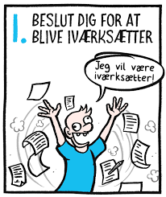

Ivar Justesen er en evig iværksætter og er altid i gang med nye ”erhvervseventyr”, desværre ikke alle lige vellykkede, så derfor har han efterhånden oparbejdet en del gæld. En af hans kreditorer, Sun-Import A/S rykker nu kraftigt for betaling i henhold til en forfalden faktura på kr. 114.870.

**Eksamensspørgsmålet:**

1.	Hvilke muligheder – udover konkurs – har Sun-Import A/S for at inddrive det skyldige beløb hos Ivar? 

---

Ivar ejer en nedlagt landejendom, der er belånt langt udover dens værdi. Han har kun almindeligt indbo, men har sidste år arvet et antikt chatol efter sin moster. Et 48” B&O TV er leaset hos Electric City. 

Ivars bil har en værdi af ca. kr. 150.000, men den er købt med ejendomsforbehold hos en autoforhandler og der skyldes fortsat 128.000 i den. 

I banken har han to indlånskonti – en NEM-konto med et indestående på kr. 2.982 og en konto med et indestående på kr. 79.000, der hidrører fra en arbejdsskadeerstatning, som han fik udbetalt efter en arbejdsulykke for en del år siden. 

Herudover har han et depot med en aktiepost i Carlsberg med en kursværdi på ca. kr. 20.000. Hos tre kunder har han nog-le tilgodehavender på i alt kr. 85.000 for levering af varer. 


**Eksamensspørgsmålet:**

2.	Redegør for hvilke muligheder Sun-Import A/S har for at foretage udlæg i Ivars nævnte aktiver til sikkerhed for deres fordring. 


**Eksamensspørgsmålet:**


3.	Hvilke sikringsakter skal der foretages ved udlæg i aktiverne og hvorfor? 

---


En af grundene til at Ivars landejendom er overbehæftet er dels at han selv for nogle måneder siden optog et banklån mod pant i ejendommen dels at en anden af hans kreditorer Zync Invest havde foretaget et udlæg. 

Ivar havde den 10. maj fået bevilget et lån på kr. 200.000 i sin bank, som dog havde betinget sig at få sikkerhed i et pantebrev på kr. 200.000 i ejendommen med prioritet efter de i forvejen indestående lån. 

Alle dokumenter blev udstedt og underskrevet på et møde i banken samme dag. På grund af travlhed fik banken først anmeldt pantebrevet til tinglysning den 13. maj kl. 10.42. 

Den 12. maj foretog fogedretten på begæring af en af Ivars kreditorer, Zync Invest, udlæg for kr. 53.000 i ejendommen. 

Ivar havde under fogedretsmødet oplyst Zync Invest om pantebrevet til banken. Udlægget blev tinglyst den 13. maj kl. 10.25.


**Eksamensspørgsmålet:**

4.	Hvordan er prioritetsstillingen i ejendommen mellem bankens panteret og Zync Invests udlæg? 

---


Ivar vil gerne starte endnu et erhvervsprojekt op sammen med sin svoger. Men da de er to deltagere overvejer han nu bl.a. på baggrund af råd fra sin revisor, om de i stedet kan starte op i et anpartsselskab. 


**Eksamensspørgsmålet:**

5.	Hvilke fordele og ulemper kan der være ved at starte den nye virksomhed op i et anpartsselskab?

---

Ivar har sat familiens gamle sofa til salg på en åben Facebookgruppe ”Ting og sager til salg”. Opslaget indeholder et billede af sofaen og teksten: ”Sofa i meget fin stand sælges. Nypris 9.995. Kan afhentes hos mig efter nærmere aftale i en personlig besked – giv et bud!” Ivar får flere kommentarer og likes på sit opslag. Bl.a. skriver Lonnie Frydenlund: ”Jeg byder kr. 1.800. Hvor bor du?” Ivar sender Lonnie følgende personlige besked: ”Top sofaen er din. Du kan betale kontant eller med MobilePay, når du henter den. Jeg bor på Løvsangervej 10 i Sundby. Hvornår kan du hente den?” Senere samme dag skriver Lonnie: 

”Når du bor så langt væk, vil jeg ikke købe sofaen alligevel. Det er alt for dyrt i transport.” 

Ivar mener, at der er indgået en aftale om køb af sofaen, hvilket Lonnie dog nægter.

**Eksamensspørgsmålet:**

6.	Tag stilling til, om der er indgået en bindende aftale mellem Ivar og Lonnie.


**Podcast om svaret på eksamensopgaven**

---


## Koncern

Et **moderselskab** er karakteriseret ved at selskabet ejer en stor del af aktierne eller anparterne i et andet selskab, som kaldes et datterselskab, jf. selskabslovens § 6.

Hvert selskab inden for koncernen er en juridisk person, som har sit ”eget liv”.

---
  
I koncerner hæfter de enkelte koncernselskaber ikke for hinandens forpligtelser. Dette gælder også med hensyn til modregning.

**Koncernforbundne selskaber** kan indgå aftaler og handle med hinanden på sædvanlige vilkår.

---

Begreber der er godt at kunne i selskabsretten:

**Corporate governance:**	De overordnede principper og strukturer, der regulerer samspillet mellem ledelsesorganerne i et selskab, ejerne og andre, der direkte berøres af selskabets dispositioner og virksomhed.

---

**CSR**	Corporate Social Responsibility: Ved virksomheders samfundsansvar forstås, at virksomheder frivilligt integrerer hensyn til blandt andet menneskerettigheder, sociale forhold, miljø- og klimamæssige forhold samt bekæmpelse af korruption i deres forretningsstrategi og forretningsaktiviteter.

---

Modsat begrebet "fusion"; samling af flere selskaber taler man om "spaltning"	opdeling af selskab i flere selskaber.

---

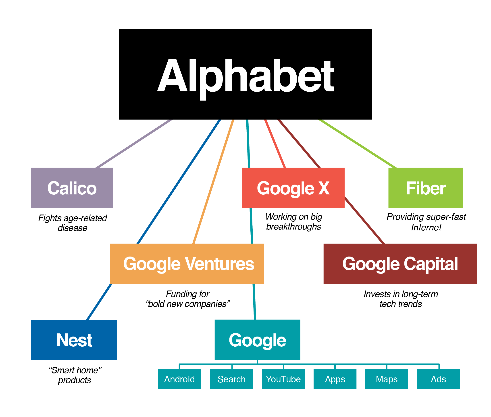
  
## Aktieselskaber A/S 


Efter selskabslovens § 5, nr. 1 er et aktieselskab et kapitalselskab, herunder et partnerselskab, hvor kapitalejernes indskudskapital er fordelt på aktier. 

Aktier kan udbydes til offentligheden. 

---

Kapitalejerne hæfter alene med deres indskud i selskabet. 

Kun kapitalsselskabets formue hæfter for kapitalsselskabets gæld og øvrige forpligtelser, jf. også selskabslovens § 1, stk. 2:” 

I et aktie- eller anpartsselskab hæfter aktionærerne og anpartshaverne (kapitalejerne) ikke personligt for kapitalselskabets forpligtelser, men alene med deres indskud.  

---

Kapitalejerne har ret til andel i kapitalselskabets overskud i forhold til deres ejerandel, medmindre andet er fastsat i selskabets vedtægter.”

Tilsvarende gælder, at når en kapitalejer har indbetalt sine kapitalandele fuldt ud, jf. selskabslovens §§ 33-34, er kapitalejeren ikke selskabsretligt forpligtet til at tilføre selskabet yderligere kapital.

---

Udover at kapitalselskabets ejere og ledelse kan ifalde erstatningsansvar efter reglerne i selskabslovens kapitel 22, der i vidt omfang er modelleret over dansk rets almindelige erstatningsreger og omtales i forbindelse med det nævnte kapitels enkelte bestemmelser, kan der tænkes en såkaldt gennembrudshæftelse – som dog er meget sjældent set i praksis, men hvis grundsynspunkt kan føre til hæftelse på objektivt grundlag, altså hvor kapitalejere/ledelse ikke har handlet ansvarspådragende.

---

Retstilstanden kan for det i praksis mest interessante områdes vedkommende – koncerner/hovedaktionærforhold m.v. – antagelig sammenfattes i et udsagn om, at et moderselskab/en hovedaktionær på objektivt grundlag kommer til at betale en dattervirksomheds gæld, hvis moderselskabet/hovedaktionæren forretningsmæssigt har drevet koncernens selskaber som én virksomhed, hvori ligger, at moderselskabet/hovedaktionæren klart har ladet datterselskabet leve på koncernens goodwill og kreditværdighed, og at driften af datterselskabets virksomhed kun er forretningsmæssig mulig under forudsætning af, at moderselskabet/hovedaktionæren til stadighed tilfører den nødvendige kapital.

---

Den første danske højesteretsdom om gennembrudshæftelse er **U 1997.1642 H**. Dommen vedrører gennembrudshæftelse i forhold til et søsterselskab, hvorefter et anpartsselskab hæftede for søsterselskabs gæld til Told- og Skattestyrelsen.
**<a href="https://pro.karnovgroup.dk/document/7000203941/1" target="_blank">Dommen klik her!</a>**

---

**Likvidation** betyder	afvikling og opløsning af fx. et solvent aktieselskab.

---

## Anpartsselskab ApS

Efter selskabslovens § 5, nr. 2 er et anpartsselskab, et kapitalselskab, hvor kapitalejernes indskudskapital er fordelt på anparter. 

Anpartsselskaber kan ikke udbyde deres kapitalandele til offentligheden, jf. selskabslovens § 1, stk. 3. 

Kapitalejerne hæfter alene med deres indskud i selskabet.

---

Når man stifter et ApS skal man, ifølge selskabsloven, indskyde kr. 40.000 i anpartskapital. 

**Minimumskravet på 40.000 kr.** er fastsat ved L 2019 445, som indebar en nedsættelse fra 50.000 kr. Kravet er tidligere ved L 2013 616 nedsat fra 80.000 kr.

---

Den seneste nedsættelse af minimumskapitalkravet for anpartsselskaber til 40.000 kr. skal ses i sammenhæng med den samtidige afskaffelse af selskabsformen iværksætterselskab (IVS).

Minimumsbeløbet på 40.000 kr. (dog mindst 25 pct. af selskabskapitalen) skal være indbetalt, jf. § 33, stk. 1, hvilket er en betingelse for, at selskabet overhovedet kan registreres, jf. § 40, stk. 2.

---

Hvis der indskydes aktiver, kræver disse en vurderingsberetning, der laves af en revisor.

En af de helt store fordele ved at stifte et ApS er, at man har begrænset hæftelse. 

Hvis virksomheden går konkurs, mister man kun de 40.000 kroner, man har indskudt i anpartskapital. 

---

Det betyder, at man ikke nødvendigvis skal gå fra hus og hjem, hvis virksomheden går ned.

Et anpartsselskab kan have én eller flere ejere. 

Ejerne af selskabet kan være privatpersoner, eller det kan være selskaber. 

Ejerandelen af selskabet bestemmes af, hvor stor en del af anpartsselskabets kapital personen eller selskabet har indskudt.

---

**Krav ved stiftelse af anpartsselskab:** Ved stiftelsen af et ApS er der visse krav, som skal overholdes:

Det kræves, at der oprettes et stiftelsesdokument, en anpartshaverfortegnelse og en protokol. 

Stiftelsesdokumentet indeholder selskabets vedtægter, der fortæller om regler, navn, hjemsted, formål med selskabet og lignende forhold. 

Der er et krav om, at selskabet skal ledes af en direktion og/eller en bestyrelse. 

---

Det er direktionen eller bestyrelsen som underskriver årsregnskabet hvert år og dermed påtager sig ansvaret for, at regnskabet er retvisende og udarbejdet korrekt. 

Årsregnskabet skal være udarbejdet senest 5 måneder efter regnskabsårets afslutning.

---

**Beskatning af et anpartsselskab:** 

Anpartsselskabet beskattes for sig, mens man som ansat ejer i selskabet bliver beskattet som almindelig lønmodtager. Et anpartsselskab betaler en selskabsskat af selskabets overskud efter selskabsskattereglerne.  

Et anpartsselskab skal udarbejde og offentliggøre regnskabet, der som hovedregel skal revideres af en revisor.

---

**Pligt i forbindelse med bogføringsloven:** 

Et anpartsselskab er underlagt en pligt om at følge bogføringsloven, dvs. bogholderiet skal udarbejdes efter gældende lov. 

Hvis dette ikke overholdes, kan det føre til krav om supplerende oplysninger eller forbehold i årsregnskabet.

---

## Kommanditselskab K/S

**Ejerne og hæftelse:**

Ejerne i et K/S kan både være virksomheder (juridiske personer) og enkeltpersoner (fysiske personer).

---

**Hæftelse:**

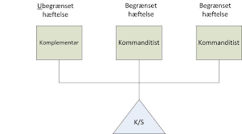

**Komplementar:** Hæfter personligt, uden begrænsning og solidarisk for virksomhedens forpligtelser.

**Kommanditist:** Hæfter begrænset for virksomhedens forpligtelser og kommanditisten kan ikke miste mere end det beløb der er indskudt i kommanditselskabet.

---

<h4><a href="https://www.youtube.com/embed/-WQOQFPIsL0" target="_blank">Video om SKAT og et K/S investering</a></h4>

---

<h4><a href="https://www.youtube.com/embed/gHkN4-3GZm8" target="_blank">Video om Kommanditselskab</a></h4>

---

## Partnerselskab P/S

**Kaldes også kommanditaktieselska

**2 typer selskabsdeltagere:** 

Mindst én komplementar og mindst én kommanditist.

Kommanditisterne har indskudt kapital, som er fordelt på aktier.

Både fysiske og juridiske personer kan være komplementar i et partnerselskab.

Selskabsformen bruges især i advokatbranchen.

---

**Hæftelse:**

Komplementaren hæfter personligt og direkte, og hvis der er flere komplementarer hæfter de solidarisk.

Kommanditaktionæren hæfter begrænset.

Partnerselskabet adskiller sig blandt andet fra et K/S ved at der skal indbetales selskabskapital. Kommanditaktionærerne skal som minimum tegne kommanditaktier for kr. 400.000.


---

## Partrederi og partselskab


**Partrederi:**

Særligt inden for småskibsfarten, hvor 2 eller flere ejer et skib.

Partrederne hæfter personligt, direkte og pro-rata for partrederiets gæld, dvs. i forhold til deres andel i skibet Partselskab:

Ikke særlig udbredt, men ses dog særligt inden for tidsbegrænsede projekter, fx byggeprojekter, hvor der er et tidsbegrænset samarbejde mellem de involverede håndværkere.

Partselskabsdeltageren hæfter **pro-rata** med hele sin formue, men kun for sin egen del af selskabets gæld.

---

## Andelsselskab A.M.B.A

 
 


**Formål:** At fremme deltagernes fælles interesser gennem deres deltagelse i virksomheden som aftagere, leverandører eller på anden lignende måde, og hvor virksomhedens afkast fordeles blandt medlemmerne eller forbliver indestående i virksomheden, jf. LEV § 4.

Ses inden for landbrug, indkøbs- og brugsforeninger, vandværk, varme- og elforsyningsselskaber mv.

---

**Hæftelsen** i et andelsselskab er ikke lovreguleret. Hæftelsesformen fremgår af selskabets  vedtægter.

Oftest er der begrænset hæftelse for ejerne, som er subsidiær eller indirekte, dvs. at kreditorerne først skal have udtømt alle muligheder for inddrivelse hos andelsselskabet, før de kan gå efter andelshaverne.
 


---


---

<h4><a href="https://www.youtube.com/embed/CoL6olkOPKs" target="_blank">Video Hvilket selskab skal jeg vælge?</a></h4>

---

## Quiz

<h3><a href="https://quiz.tepedu.dk/jura12" target="_blank">Quiz Virksomhedsformer og hæftelser </a></h3>


<!--chapter:end:08-Virksomhedsformer.Rmd-->

# Insolvensret

```{r, echo=FALSE, results='asis'}
cat(readLines('np.html'))
```


***Dette her kapitel om insolvensreglerne anvendes i dagligdagen i ejendomshandel, ejendomsadministration, bank og realkredit, forsikring samt revision og økonomifunktion i forbindelse med at kunderne og klienter skylder penge til jeres virksomhed. Derfor er det vigtigt som finansøkonom at bl.a. kende reglerne om inkassoprocessen, tvangsinddrivelse via fogedretten, tvangsauktion, samt konkursbehandling, rekonstruktion og gældssanering.***

---

***Du skal som studerende være særlig opmærksom på følgende problemstillinger ved gennemgangen af insolvensretten, herunder kreditorforfølgning:*** 


•	**Forskellen på individual- og universalforfølgning, herunder forskellen på tvangsauktion og konkurs**

•	**Individualforfølgning:**

---

**Med individualforfølgning menes:**

Når én kreditor forsøger at fremkalde betaling af sit tilgodehavende hos en skyldner fx ved tvangsfuldbyrdelse via Fogedretten. 

Modsat universalforfølgning som fx konkurs.

---

De juridiske udfordringer for en individualforfølgning er:

Udlægsgrundlag (eksekutionsgrundlag) – herunder betalingspåkrav, jf. retsplejelovens kapitel 44a og § 478.
  
Udlæggets genstand (trangsbeneficiet m.m.), jf. retsplejelovens § 507-515.

---
  
**Med universalforfølgning menes:**

Når kreditorerne går sammen for at inddrive deres krav (insolvensbehandling). Universalforfølgning afskærer individualforfølgning. 

Eksempler på universalforfølgning er konkurs, tvangsakkord og gældssanering. Ligelighedsprincippet er centralt. 

---

Der er desuden mulighed for omstødelse iht. konkursloven (KL)
**<a href="https://jura.tepedu.dk/lovsamling.html" target="_blank">Lovsamlingen klik her!</a>**

---

Modsat: individualforfølgning.

---

**De juridiske udfordringer ved universalforfølgning:**

Hæftelse: Hæftelsestyper i enkeltmandsvirksomhed samt forskellige selskabsformer. 

Emnet har relevans for opgørelse af aktivsiden i et konkursbo samt kreditors evt. tab af restfordringen.  
  
Overordnet om rekonstruktion - anmodning, betingelser og retsvirkning: 
Oversigt over Konkursret – anmodning, 
  
Betingelser, jf. KL § 17-21, 
  
Fristdag, jf. KL § 1 

Nærtstående, jf. KL § 2, 

Konkursordenen, jf. KL kapitel 10, 
  
Separatister og underpanthavere, jf. KL §§ 82 og 86, 
  
Omstødelse af dispositioner, jf. KL kapitel 8 

---				

**Regler og definitioner**


**Retsplejeloven og Konkursloven regulerer:**

**Individualforfølgning:**

Hver kreditor for sig, den kreditor, der kommer først, bliver først betalt af skyldner
  
Reguleret i Retsplejeloven (RPL; Lovbekendtgørelse nr. 1284 af 14. november 2018) og omfatter bl.a. udlæg, tvangsauktion og tvangsbeneficeret (retten til et beskedent hjem).

---
  
**Universalforfølgning:**

Reguleret i konkursloven (KL; Lovbekendtgørelse nr. 11 af 6. januar 2014), og omfatter konkurs, rekonstruktion og gældssanering.
**<a href="https://jura.tepedu.dk/lovsamling.html" target="_blank"> Lovsamlingen klik her!</a>**

---
  
**Formålet** er at stille kreditorerne lige i konkursboet.
  
Kun hvis skyldneren er insolvent, jf. KL § 17:
  
”Er en skyldner insolvent, skal hans bo tages under konkursbehandling, når det begæres af skyldneren eller en fordringshaver. 

Stk. 2 En skyldner er insolvent, hvis han ikke kan opfylde sine forpligtelser, efterhånden som de forfalder, medmindre betalingsudygtigheden må antages blot at være forbigående”.
 
---

Ordet **insolvent**


Defineret i KL § 17.

Skyldner kan ikke betale sin gæld, efterhånden som den forfalder til betaling.

Skifteretten vurderer, om insolvensen er til stede.

Hvis skyldner selv erklærer sig insolvent, forventes det at være rigtigt.

---

<h4><a href="https://www.youtube.com/embed/kxa-lYBFCDk" target="_blank">Video om udlæg og trangsbeneficium</a></h4>

---

Der må ved afgørelsen om skyldnerens insolvens, og dermed en konkursbehandling tages der hensyn til en række momenter i praksis:

En rigtigt opgjort status er et vægtigt indicium om skyldnerens betalingsevne, jf. dommen **U 2001.2592 Ø** Skyldner, der siden 2000-02-10 ved (delvis) betaling havde afværget 15 konkursbegæringer, var insolvent, da han ikke kunne betale 50.798 kr. ifølge en udeblivelsesdom, og da han havde yderligere gældsposter.
**<a href="https://pro.karnovgroup.dk/document/7000236282/1" target="_blank">Dommen klik her!</a>**

---

Det må kræves, at der består en fordring mod skyldneren, men ikke, at den er forfalden. 

Fordringen må endvidere tilkomme den, der indleverer konkursbegæringen til skifteretten.

---

At fordringen er genstand for en ikke afsluttet retssag, udelukker ikke i sig selv, at den kan tjene som grundlag for konkurs, se fx dommen i **U 1973 673 H**.
**<a href="https://pro.karnovgroup.dk/document/7000209919/1" target="_blank">Dommen klik her!</a>**

---

Kreditor skal have en "retlig interesse" i konkursbehandlingen. 

Denne vil normalt bestå i, at der er udsigt til dividende. 

Det forhold, at kreditor aktuelt ikke kan forvente dividende i boet, udelukker ikke konkurs. 

---

Den retlige interesse kan bestå i, at konkursbehandlingen kan tænkes at tilvejebringe yderligere aktiver.

Enhver fysisk person kan uanset (u)myndighed være »skyldner« i den anførte betydning i KL § 17.

---

En juridisk person kan som »skyldner« erklæres konkurs, hvis enten ingen deltager i sammenslutningen hæfter personligt for sammenslutningens gæld, eller hvis samtlige personligt hæftende er under konkurs.

Pengeinstitutter kan erklæres konkurs, men beskikkelse af kurator sker efter forhandling med Finanstilsynet, se lov om finansiel virksomhed § 246, stk. 3. 

---

Om forsikringsselskabers konkurs, se lov om finansiel virksomhed §§ 264-265, hvorefter bl.a. beskikkelse af kurator sker efter forhandling med Finanstilsynet. 
**<a href="https://jura.tepedu.dk/lovsamling.html" target="_blank">klik her!</a>**

---

Ansvarlige interessentskabers boer behandles som konkursboer, når samtlige interessenter er under konkurs.


**Insolvens antages i almindelighed at foreligge efter KL § 18, hvis:**

* skyldneren erkender at være insolvent, 

* skyldneren er under rekonstruktionsbehandling,

* skyldneren har standset sine betalinger eller

* der ved udlæg inden for de sidste tre måneder før skifterettens modtagelse af konkursbegæringen ikke har kunnet opnås dækning hos skyldneren. 
 

 
---


## Inkasso

Efter en **rykkerprocedure med 3 rykkergebyrer**, jf. rentelovens § 9 b, skal sagen overdrages til retlig inkasso:

"§ 9 b
For rykkerskrivelser vedrørende fordringer kan fordringshaveren kræve et gebyr, jf. stk. 2, såfremt skrivelsen er fremsendt med rimelig grund (rykkergebyr). Fordringshaveren kan endvidere kræve et gebyr, jf. stk. 3, for at anmode en anden om at inddrive fordringen på fordringshaverens vegne, såfremt dette er sket med rimelig grund (inkassogebyr).

Stk. 2. Der kan kræves et rykkergebyr på højst 100 kr. for hver rykkerskrivelse, dog højst for 3 skrivelser vedrørende samme ydelse.  Har skyldneren inden for en sammenhængende periode til stadighed været i restance vedrørende samme skyldforhold, kan der uanset 1. pkt. højst kræves rykkergebyr for 3 skrivelser vedrørende restancerne i den pågældende periode. Der kan kun kræves gebyr for rykkerskrivelser, som er sendt med mindst 10 dages mellemrum".

Den tredje rykkerskrivelse skal indeholde et inkassovarsel.


---

Om renteloven, jf. Lovbekendtgørelse 2014-05-13 nr. 459 om renter og andre forhold ved forsinket betaling (renteloven), 
**<a href="https://jura.tepedu.dk/lovsamling.html" target="_blank">Lovsamlingen klik her!</a>**

---

Inkasso reguleres af Lovbekendtgørelse nr. 1018 af 9. september 2014 om inkassovirksomhed.
**<a href="https://jura.tepedu.dk/lovsamling.html" target="_blank">Lovsamlingen klik her!</a>**

---

**Formålet med inkassoloven** er at sikre, at privat inkassovirksomhed, dvs. den inddrivelse af fordringer på andres vegne, der sker uden fogedretternes medvirken som led i privat inkassovirksomhed, foregår på en rimelig og forsvarlig måde. 

Dette søges navnlig opnået ved en autorisationsordning for inkassofirmaer, ved krav om godkendelse af personale, der retter personlig henvendelse til skyldnere, og ved krav om, at inkassofirmaer mv. skal stille sikkerhed for pengekrav, som måtte opstå som følge af udøvelsen af deres virksomhed. 

Lovens formål søges også opnået ved regler om, at inkassovirksomhed skal udøves i overensstemmelse med god inkassoskik i forhold til både skyldnere og kunder, jf. inkassolovens § 9. 

---

<h4><a href="https://www.youtube.com/embed/XbxO46Oeizw" target="_blank">Video Gode råd og gæld</a></h4>

---

**Inkassolovens indhold:**

Inkassolovens kap. 1 fastlægger anvendelsesområdet for loven.

Kap. 2 fastsættes autorisationsordningen for inkassofirmaer og visse andre virksomheder. Endvidere indeholder kap. 2 regler om sikkerhedsstillelse. 

Kap. 3 fastsættes regler om godkendelse af personale, som retter personlige henvendelser til skyldnere. 

Kap. 4 indeholder regler om, hvorledes inkassovirksomhed skal udøves. 

Kap. 5 indeholder kompetence- og bemyndigelsesbestemmelser. 

Kap. 6 fastsættes regler om tilbagekaldelse og bortfald af autorisation mv.

Kap. 7 indeholder regler om tilsyn. 

Kap. 8 indeholder straffe- og ikrafttrædelsesbestemmelser.

---

**Inkassoprocessen**


Gælden sendes til inkasso, hvis skyldner ikke betaler, efter kreditor har sendt en eller flere rykkere (højst 3 stk.)

Inkasso kan foretages af:

+	Kreditor selv

+	Inkassofirma

+	Advokat
  
Inkassobrev med diverse oplysninger sendes til skyldner.


**Formålet med inkasso** er at få betalt gælden eller opnå en afdragsordning, som kaldes et frivilligt forlig.

Betaler skyldner stadig ikke, må kreditor overveje at fortsætte med tvangsinddrivelse.

---


---

**Forenklet inkasso** 


**Hvad er den forenklede inkassoproces (betalingspåkrav)?**

Den forenklede inkassoproces er en enkel måde at få rettens hjælp til at opkræve gæld på. Den samlede gæld må højst være på 100.000 kr. eksklusive renter og omkostninger.

Det særlige ved den forenklede inkassoproces er, at man kun skal rette én henvendelse til fogedretten, som både tager sig af grundlaget for og gennemførelsen af et udlæg.

Man kan bruge den forenklede inkasso i nogle tilfælde i stedet for at indgive en stævning.

---

**Hvornår kan man vælge den forenklede inkassoproces?**

Man kan vælge den forenklede inkassoproces, hvis man har en klar forventning om, at skyldneren er enig i kravet, og kravet ikke overstiger 100.000 kr. eksklusive renter og omkostninger.

---

**Hvordan gør man?**

Ønsker man at starte en forenklet inkassoproces, skal man udfylde og indlevere en *betalingspåkravsblanket* til fogedretten. 
**<a href="http://www.domstol.dk/selvbetjening/blanketter/inkasso/Pages/default.aspx" target="_blank">klik her!</a>**

---

Betalingspåkravet har samme funktion som en stævning i civile sager og skal derfor indeholde næsten de samme oplysninger. Det er for eksempel parternes navne og adresse, ens krav og informationer om, hvordan kravet er opstået.

---

**Hvad ender sagen med?**

Hvis man i blanketten for betalingspåkravet har markeret, at man ønsker det, kan fogedretten automatisk:

Sørge for, at betalingspåkravet får samme bindende virkning (retskraft) som en dom. Bagefter iværksætter fogedretten et udlæg mod den skyldner, som er enig i kravet. Her vil sagen normalt ende.

Sende sagen til civilretten, hvis skyldneren – mod forventning – er uenig i kravet. Civilretten indleder derefter en retssag på grundlag af betalingspåkravet.

---

**Hvad koster det?**

Når man indleverer betalingspåkravet til fogedretten, skal man samtidig indbetale en retsafgift. Retsafgiften afhænger af kravets størrelse, ens valg i betalingspåkravet og sagens forløb.

Man kan foretage en vejledende beregning af retsafgiften.
**<a href="http://www.domstol.dk/selvbetjening/beregndinafgift/Pages/default.aspx" target="_blank"> klik her!</a>**

---

<h4><a href="https://www.youtube.com/embed/z8QQeRFvPGQ" target="_blank">Video God inkassoskik</a></h4>

---

<h4><a href="https://www.youtube.com/embed/krDpzh9ugJ0" target="_blank">Video Forældelsesfristen for gæld</a></h4>


---

<h4><a href="https://youtu.be/4p97-bt-mYk" target="_blank">Video: Inkasso i hundesalonen</a></h4>

---


## Tvangsinddrivelse


Ordet **tvangsinddrivelse:**

Kreditor kan via **fogedretten få udlæg i skyldners aktiver** og sælge dem på tvangsauktion

Provenuet fra tvangsauktionen nedbringer skyldners gæld

---

<h4><a href="https://www.youtube.com/embed/th9E-UvXijE" target="_blank">Video Gode råd om gæld: Fogedretten</a></h4>

---

**Tvangsinddrivelse kræver et fundament, jf. RPL § 478 fx:**

* Dom eller retsforlig.

* Frivillige forlig, hvis der står, det kan tvangsfuldbyrdes.

* Pantebreve.

* Afgørelser fra Forbrugerklagenævnet og de private godkendte tvistløsningsorganger efter 30 dage.

* Krav fra offentlige myndigheder fx Skat.

* Gældsbreve, hvis der står, det kan tvangsfuldbyrdes.

---

**Eksekutionsfundament** er et dokument, der danner grundlag for tvangsfuldbyrdelse, fx en dom, et retsforlig, et frivilligt forlig eller et gældsbrev.

**Eksigibel** er	udtryk for, at et dokument kan tvangsfuldbyrdes.

---

Se dommen i **U 2019.3219 V** Der kunne ikke ske tvangsfuldbyrdelse på grundlag af et digitalt gældsbrev, hvor underskriften ikke var tilføjet digitalt af den anførte debitor, men ifølge debitors forklaring af hendes daværende kæreste. 
**<a href="https://pro.karnovgroup.dk/document/7000841373/1" target="_blank">Dommen klik her!</a>**

---

Se **U 2019.3313 Ø** Gældsbrev, der var underskrevet ved anvendelse af Bank NemID, kunne tvangsfuldbyrdes, jf. retsplejelovens § 478, stk. 1, nr. 5. 
**<a href="https://pro.karnovgroup.dk/document/7000840573/1" target="_blank">Dommen klik her!</a>**

---

<h4><a href="https://www.youtube.com/embed/gNK1K_cpsSw" target="_blank">Video Gode råd og gæld: SKAT</a></h4>

---

<h4><a href="https://www.youtube.com/embed/V_ZxNcRklxE" target="_blank">Video Gode råd om gæld: Budget</a></h4>

---

## Fogedretten

Fogedretten er **afdeling under byretten ligesom skifteretten**.

Hvad sker der på et møde i fogedretten?

Man kan blive indkaldt til møde i fogedretten, hvis man skylder penge i henhold til for eksempel et frivilligt forlig eller en dom og ikke betaler til tiden.

Fogedretten behandler således sager om tvangsgennemførelse af krav. Det kan for eksempel være krav om betaling af penge eller krav om at få en ting udleveret.

---

En kreditor kan få fogedrettens hjælp til at inddrive kravet.

Hvis den der skylder penge ikke kan betale, kan kreditor bede fogedretten om at foretage udlæg i skyldners ejendele.

Har en sælger solgt en ting på afbetaling, for eksempel en bil, og betaler køber ikke afdragene til tiden, kan sælger få fogedrettens hjælp til at få tingen tilbage.

Hvis en lejer ikke betaler sin husleje til tiden, kan udlejeren få fogedretten til at sætte lejeren ud.

Fogedretten holder også tvangsauktioner over fast ejendom.
 
Selv om en rettighed ikke er klart fastslået, kan fogedretten i visse tilfælde hjælpe med en foreløbig sikring af rettigheden.

---

**Fogedforretninger:** 

Når fogedretten hjælper med at få gennemført et krav, kaldes det en fogedforretning.

Udlæg, arrest, Bistand til opretholdelse af forbud og påbud, bevissikring, inddrivelse, tilbagetagelse og udsættelse af lejemål er eksempler på forskellige typer af fogedforretninger. 

En **justifikationssag** betegner en	sag til efterprøvelse af lovligheden af en arrest eller et fogedforbud.

---

**Umiddelbare fogedforretninger:**

Umiddelbare fogedforretninger er en type fogedsager, der ikke handler om betaling af pengebeløb. 

En umiddelbar fogedforretning kan for eksempel handle om, at ejeren af en ting ønsker fogedens bistand til at få tingen udleveret fra en anden. 

---

En umiddelbar fogedforretning kan også handle om, at ejeren af en ejendom ønsker fogedens bistand til at få en lejer sat ud af lejemålet.

En umiddelbar fogedforretning	kan ligeledes være en gennemtvingelse af udleveringskrav via fogedretten uden forudgående dom - fx til udlevering af et barn, som holdes tilbage efter samværsbesøg.

---

**Mødet i fogedretten**

Hvis man er skyldner, skal man medbringe alle oplysninger om ens egne og ens husstands økonomiske forhold til mødet, for eksempel registreringsattest til bil, matrikelnummer på fast ejendom og oplysninger om kontonumre på bankkonti.

Man har pligt til at svare på de spørgsmål, der bliver stillet på mødet, og til at tale sandt. Man kan straffes, hvis man taler usandt i fogedretten.

---

På mødet vil ens muligheder for at betale blive gennemgået. 

Hvis man ikke kan betale hele gælden straks, kan man normalt indgå en afdragsordning. 

Afdragsordningen kan dog ikke strække sig over længere tid end 10 måneder, medmindre andet bliver aftalt. 

---

I de tilfælde skal man typisk stille ens eventuelle aktiver, for eksempel hus eller bil, til sikkerhed for kreditors krav, indtil det er betalt. Det kaldes udlæg, se nedenfor.

Betaler man de aftalte afdrag til tiden, beholder man rådigheden over tingene. 

---

Hvis ikke kan man risikere, at kreditor anmoder om tvangsauktion over de udlagte genstande, som man så mister.

Kan man hverken betale straks eller afdrage, og ejer man intet af værdi, kan man afgive en insolvenserklæring til fogeden. 

---

Det betyder, at man normalt først kan blive indkaldt til fogedretten igen efter 6 måneder.

Hvis man mener, at man ikke skylder pengene, eller vil man protestere over andre forhold i sagen, kan man gøre det på mødet. 

---

Hvis fogeden ikke kan tage stilling til ens protest straks, kan fogeden vælge at udsætte sagen til et nyt møde, hvor der er afsat mere tid til at behandle sagen.

Hvis man er utilfreds med fogedrettens afgørelse, kan man normalt kære (klage) den til landsretten.

---

**Mødepligt i fogedsager:**

Man har pligt til at møde i fogedretten. Men man kan – med mindre fogedretten har bestemt andet – lade en anden møde for sig, hvis man udfylder den fuldmagt, man har modtaget med indkaldelsen til mødet i fogedretten.
 
Den person, som møder for én, skal kende til sagen og til ens økonomiske forhold. 

---

Gør personen ikke det, kan fogedretten stille krav om, at man selv møder personligt.

Hvis man bliver syg, har man ikke pligt til at møde. 

---

Fogedretten kan stille krav om, at man dokumenterer sin sygdom med en lægeattest. 

Man skal selv medbringe denne blanket hos ens egen læge. Man skal selv betale for attesten. Man kan ikke udeblive, fordi man skal på arbejde.

Møder man ikke, kan man risikere, at politiet afhenter én uden yderligere varsel. Man kan også risikere, at fogeden samme dag eller senere møder op på ens bopæl.

---

**"Indgivelse af anmodning:** 

**Hvor skal man sende anmodning hen?**

I fogedretten kan man få hjælp til at få inddrevet et krav, som skyldner har anerkendt ved fx at underskrive et gældsbrev.

Sagen skal normalt sendes til fogedretten i den retskreds, hvor skyldneren bor, hvor der er pant for fordringen, hvorfra skyldner driver virksomhed, eller hvor den genstand, sagen drejer sig om, befinder sig.

---

Fogedretten behandler også betalingspåkrav. Ønsker man at indgive et betalingspåkrav, gælder samme regler som for civile sager. 

Et betalingspåkrav skal derfor indgives til fogedretten i den retskreds, hvor skyldneren bor.

---

**Hvornår kan man sende sin anmodning?**

Retsplejeloven fastsætter frister for, hvornår man kan få fogedrettens hjælp til at få gennemtvunget en afgørelse eller få inddrevet et krav.

Domme kan først gennemtvinges, når fuldbyrdelsesfristen er udløbet, og kun hvis modparten ikke forinden har anket afgørelsen. 

---

Fuldbyrdelsesfristen er 14 dage medmindre andet er bestemt i dommen.

Retsforlig og gældsbreve kan først inddrives eller gennemtvinges, når der er gået 14 dage fra den dag, man kunne kræve beløbet/ydelsen betalt, medmindre andet er bestemt i dokumentet.

---

**Hvad sker der, hvis sagen ikke er indgivet det rette sted?**

Hvis en sag bliver sendt til en forkert fogedret, vil retten så vidt muligt videresende sagen til den rigtige.

---

**Foreløbig sikring af rettigheder:**

**Arrest:**

Hvis man mener, at man har krav på penge fra en anden person, kan man i særlige tilfælde sikre sit krav ved at få foretaget arrest i personens formue.

Der kan for eksempel være tale om ulovlig brug af et patent eller om udgivelse af en bog, der indeholder fortrolige oplysninger.

---

Man har mulighed for at anmode fogedretten om at foretage arrest for krav, som man ikke kan få foretaget udlæg for.

Man skal som hovedregel sende sin anmodning til fogedretten i den retskreds, hvor den person eller virksomhed arresten skal rettes imod, har adresse.

---

Arrest kan kun foretages,

•	hvis det bliver sandsynliggjort, at der er et krav, og

•	hvis det må antages, at muligheden for senere at få dækning for kravet bliver væsentligt forringet, hvis ikke der foretages arrest.

•	Når der er foretaget arrest i en genstand, må ejeren ikke sælge den.

---

Hvis fogedretten foretager arrest, skal den, der har anmodet om arresten, anlægge sag ved civilretten inden 1 uge.

Man kan klage til landsretten over fogedrettens afgørelse.

---

Se romerrettens begreb: "periculum in mora";	"fare ved udsættelse" - anvendes fx om situationer, hvor øjemedet med et indgreb vil forspildes, hvis man skal afvente en retskendelse.

---

**Bevissikring:**

Hvis man har mistanke om, at en anden person foretager handlinger, der krænker ens immaterielle rettigheder, for eksempel ved ulovlig musik- eller softwarekopiering, kan man anmode fogedretten om at foretage en bevissikringsundersøgelse hos den pågældende person.

For at der kan foretages en bevissikringsundersøgelse, skal det sandsynliggøres, at der er foretaget krænkelser af en immateriel rettighed, og at krænkelserne er sket i erhvervsmæssigt øjemed eller har haft et betydeligt omfang.

---

Bevissikringsundersøgelsen bliver som regel foretaget ved, at fogeden tager ud til det sted, hvor de påståede krænkelser har fundet sted. 

Her foretager fogeden en undersøgelse af stedet. 

---

Hvis fogeden finder genstande, der tyder på, at der er foregået krænkelser, kan fogedretten bestemme, at disse genstande skal beslaglægges.

For at beviserne ikke bliver skaffet af vejen, kan fogeden bestemme, at bevissikringsundersøgelsen skal foretages uden på forhånd at underrette den person, som påstås at have foretaget krænkelserne.

---

Den, der anmoder om en bevissikring, skal anlægge sag ved civilretten inden 4 uger efter, at fogedretten har afsluttet undersøgelsen.

Fogedrettens afgørelse om bevissikring kan kæres til landsretten. 

Landsretten kan dog ikke tage stilling til de spørgsmål, som skal behandles under den civile sag.

---

**Udlæg:**

Hvis man skylder penge, og man ikke betaler, kan kreditor bede fogedretten om at hjælpe med at indkræve pengene.

I fogedretten vil man blive spurgt, om man har mulighed for at betale pengene. 

Hvis man ikke kan betale, kan fogedretten foretage udlæg i et eller flere af ens aktiver. 

---

Det kan for eksempel være ens faste ejendom eller ens bil. 

Udlæg betyder, at kreditor kan forlange, at det aktiv, der er foretaget udlæg i, sælges på auktion, så kreditor kan få sine penge.

Der kan ikke foretages udlæg i små pengebeløb, sædvanligt indbo eller i andre ting af beskeden værdi, som er nødvendige for familiens erhverv eller uddannelse, se nærmere nedenfor for en gennemgang af "udlæg".

---

**Inddrivelse af gæld til det offentlige:** 

Gæld til det offentlige inddrives af Skat/Inddrivelsescentret. 

Hvis skyldner protesterer over afgørelsen om udlæg, bliver sagen sendt til fogedretten.

Fogedretten indkalder herefter til et møde, hvor fogedretten tager stilling til indsigelsen.

---

**Tilbagetagelsessager:**

Har en sælger solgt en ting på afbetaling, for eksempel en bil, og betaler køber ikke afdragene til tiden, kan sælger få fogedrettens hjælp til at få tingen tilbage.

Bistand til opretholdelse af forbud og påbud:  
 
Hvis en person eller virksomhed overtræder et forbud eller påbud, som er meddelt af civilretten, kan man anmode fogedretten om hjælp til at opretholde forbuddet eller påbuddet.

---

Fogedretten kan eksempelvis hindre, at et forbud bliver overtrådt, sikre at et påbud bliver efterkommet eller tilintetgøre, hvad der er foretaget i strid med forbuddet eller påbuddet. 

Fogedretten kan også under visse betingelser beslagægge genstande, som anvendes eller har været anvendt ved overtrædelse af forbuddet eller påbuddet.

Man skal som hovedregel sende ens anmodning om bistand eller beslaglæggelse til fogedretten i den retskreds, hvor ens modpart har adresse eller til fogedretten ved den byret, der har meddelt forbuddet eller påbuddet.

---

Hvis man vil anmode om beslaglæggelse, og der allerede er en sag i gang om meddelelse af midlertidigt forbud og påbud ved civilretten eller Sø- og Handelsretten, skal man sende anmodningen til denne ret, som samtidig træffer afgørelse om beslaglæggelse. 

Retten kan dog henvise spørgsmålet om beslaglæggelse til fogedretten.

---

Hvis man er uenig i fogedrettens afgørelse om bistand, herunder beslaglæggelse, kan man kære den til landsretten. 

Det vil sige, at landsretten efterfølgende behandler sagen og træffer en ny afgørelse.


---

**Betalingspåkrav**

**Hvis kreditor ikke har et fundament, skal kreditor:**

Have en dom for kravet eller

Udfylde et betalingspåkrav, jf. RPL kap. 44a.

Betalingspåkravet udfyldes af kreditor og indgives til Fogedretten.

---

**Betalingspåkravet kan kun anvendes hvis:**

+	Kreditor har et pengekrav på højst 100.000 kr.

+	Kravet er ubetinget og ubestridt af skyldner.

+	Skyldner har fået et ”inkassobrev”.
  
Kan med Fogedrettens påtegning på betalingspåkravet anvendes som fundament

---

**Udlæg**


Hvis man skylder penge, og man ikke betaler, kan kreditor bede fogedretten om at hjælpe med at indkræve pengene.

I fogedretten vil man blive spurgt, om man har mulighed for at betale pengene. 

Hvis man ikke kan betale, kan fogedretten foretage udlæg i et eller flere af ens aktiver. 

---

Det kan for eksempel være ens faste ejendom eller ens bil. 

Udlæg betyder, at kreditor kan forlange, at det aktiv, der er foretaget udlæg i, sælges på auktion, så kreditor kan få sine penge.

Der kan ikke foretages udlæg i små pengebeløb, sædvanligt indbo eller i andre ting af beskeden værdi, som er nødvendige for familiens erhverv eller uddannelse, se nærmere nedenfor.

---

**HR:** Kreditor kan få udlæg i alle skyldners aktiver, medmindre følgende undtagelser:

**U1:** Tredjemands rettigheder skal respekteres.

**U2:** Særlige indlån i pengeinstitut fx bil købt på afbetaling som et kreditkøb med ejendomsforbehold.

**U3:** Endnu ikke udbetalt løn, jf. RPL § 511.

**U4:** Udbetalt erstatning fx fra ulykkesforsikring, RPL § 513 Erstatningen skal være holdt adskilt fra øvrige midler.

**U5:** Personlige aktiver med beskeden værdi, jf. jf. RPL § 515, stk. 1.

**U6:** Personlige hjælpemidler, jf. RPL § 515, stk. 2.

**U7:** Båndlagte gaver, jf. RPL § 514.

**U8:** Trangsbeneficiet, jf. RPL § 509.


---

Se dommen i **U 2019.3256** om krav i henhold til gældsbrev var ikke fritaget fra udlæg i medfør af retsplejelovens § 513, stk. 1, om beskyttelse mod kreditorforfølgning af personskadeerstatning.
**<a href="https://pro.karnovgroup.dk/document/7000840517/1" target="_blank">Dommen klik her!</a>**

---

<h4><a href="https://www.youtube.com/embed/kxa-lYBFCDk" target="_blank">Video: Udlæg og trangsbeneficiet</a></h4>

---
 

**Trangsbeneficiet, jf. RPL § 509:**


Kreditor kan ikke få udlæg i aktiver omfattet af **trangsbeneficiet**.

Omfatter aktiver, der hører til et beskedent hjem, fx seng, bord, stol, sofa.

---

Almindelig hvidevarer hører til et beskedent hjem, fx køleskab, fryser, almindeligt tv og almindelig computer.

Smykker, malerier, smart TV eller fjernsyn med surround sound og subwoofer og andre værdifulde aktiver er ikke omfattet af trangsbeneficiet.

---

Spørgsmål er i et hvilket omfang, der kan foretages udlæg i følgende genstande og værdier: 

* Boliginventar (Opretholdelse af et beskedent hjem).

* Bil.

* Kontanter (rede penge).

* Indestående på konti.

* Depositum (lejebolig).

* Kæledyr.

* Gaver, 

* Værdier med affektionsværdi.

* Personskadeerstatning (Udbetalinger ved kritisk/ livstruende sygdom).

* Feriepenge.

---

## Tvangsauktion


En tvangsauktion er et **tvangssalg**. 

Tvangsauktionssagen kan iværksættes af en person, som har penge til gode hos ejeren af ejendommen eller genstanden. 

Det kan for eksempel være en panthaver, der ikke har modtaget terminsydelser.

---

**Tvangsauktion over fast ejendom**

Alle tvangsauktioner over fast ejendom sker i fogedretten i den retskreds, hvor ejendommen ligger. 

Den, der har iværksat tvangsauktionen, skal lave en salgsopstilling over ejendommen med alle oplysninger om ejendommen. Salgsopstillingen og standardauktionsvilkårene danner grundlaget for tvangsauktionen.

---

Vejledning i brug af salgsopstilling og Justitsministeriets tvangsauktionsvilkår findes her.

Salgsopstillingen bliver inden auktionen sendt til ejeren og til alle, der har pantebreve i ejendommen.

---

**Tvangsauktion over landbrugsejendom**

Landbrugsstyrelsen har udformet vejledningen ”Endelig adkomst på landbrugsejendomme erhvervet på tvangsauktion”.
**<a href="https://www.domstol.dk/saadangoerdu/tvangsauktion/Documents/Endelig%20adkomst%20p%C3%A5%20landbrugsejendomme%20erhvervet%20p%C3%A5%20tvangsauktion.pdf" target="_blank">klik her!</a>**

---

Formålet er at vejlede køber. 

Vejledningen indeholder blandt andet information om, at det ved erhvervelse af en landbrugsejendom på tvangsauktion er landbrugslovens regler, der gælder, samt vejledning om opfyldelse af erhvervelsesbetingelserne.

---

**Tvangsauktion over løsøre** 

Tvangsauktioner over løsøre kan efter henvisning af fogeden afholdes ved en auktionsleder. 

Tvangsauktioner over registrerede skibe og luftfartøjer samt gældsbreve og andre fordringer afholdes af fogedretten, mens aktier og andre værdipapirer realiseres ved tvangssalg efter forudgående autorisation fra fogedretten af en værdipapirhandler, typisk et pengeinstitut.

---

En liste over beskikkede auktionsledere fordelt på de enkelte retskredse.
**<a href="http://www.justitsministeriet.dk/arbejdsomr%C3%A5der/civilret/beskikkelse-af-auktionsledere" target="_blank">klik her!</a>**

---

Auktionslederne kan også benyttes til frivillige offentlige auktioner.

Tvangsauktioner er offentlige. 

Alle, der møder, kan afgive bud på auktionen. 

Kan man ikke selv møde, kan man lade en advokat byde for én. 

Man kan også give en skriftlig fuldmagt til en anden person, der så kan byde for én.
 
---

<h4><a href="https://www.youtube.com/embed/drN8QtdRsfk" target="_blank">Video om tvangsauktion</a></h4>

---

## Konkurs

Se konkursloven. 
**<a href="https://jura.tepedu.dk/lovsamling.html" target="_blank">klik her!</a>**

---


For at en skyldner - en person eller et selskab - kan erklæres konkurs, er det en betingelse, at skyldneren er "insolvent", jf. kravet i konkurslovens § 17:

"Er en skyldner insolvent, skal hans bo tages under konkursbehandling, når det begæres af skyldneren eller en fordringshaver.

Stk. 2. En skyldner er insolvent, hvis han ikke kan opfylde sine forpligtelser, efterhånden som de forfalder, medmindre betalingsudygtigheden må antages blot at være forbigående". 

---

**Insolvens:**

En person er insolvent, når passiverne overstiger aktiverne (insufficiens), eller når han ikke er i stand til at opfylde sine forpligtelser efterhånden som disse forfalder (illikviditet)

---

Begrebet **illikviditet** betegner manglende evne til at betale forpligtelserne, efterhånden som disse forfalder.

---

**Insufficiens** er	udtryk for, at passiverne overstiger aktiverne.

En **fallent**	person, er en person, der er gået konkurs.

Man er insolvent, hvis man ikke kan betale sin gæld til tiden, og betalingsvanskelighederne ikke kun er midlertidige. 

Konkurs er en universalforfølgning, formålet er at dele skyldners aktiver ud til kreditorerne, så alle kreditorer stilles lige.

Begæring kan indgives til skifteretten af skyldner eller kreditor, jf. KL § 17, stk. 1.

Skyldner mister rådighed over sine aktiver ved dekretets afsigelse, jf. KL § 29.

Skifteretten udpeger kurator (advokat), som handler på vegne af konkursboet.

Annoncering i **Statstidende** - virkning for enhver, jf. KL § 30.

---
 
**Hvem kan indgive konkursbegæring?**

En kreditor, der har penge til gode hos en skyldner, kan indgive konkursbegæring. 

Det er en betingelse, at årsagen til den manglende betaling er pengemangel og ikke manglende betalingsvilje, for eksempel utilfredshed med et udført arbejde. 

Er dette tilfældet, må der i stedet føres en retssag ved de almindelige domstole. 

---

Det samme gælder, hvis det er usikkert, om pengene skyldes.

En person eller et selskab, der er insolvent, kan indgive konkursbegæring mod sig selv.

Generelt må det anbefales at kontakte en advokat, inden man indgiver en konkursbegæring.

---

Se **U 2020.447 V** Konkursbetingelserne opfyldt, da skyldner ikke havde godtgjort at være solvent og at betalingsudygtigheden blot var forbigående.
**<a href="https://pro.karnovgroup.dk/document/7000846143/1" target="_blank">Dommen klik her!</a>**

---

**Hvad koster det at indgive konkursbegæring?**

**Retsafgiften for at indgive en konkursbegæring er 750 kr.**

Den, der indgiver konkursbegæringen, skal normalt stille sikkerhed for betaling af omkostningerne ved konkursbehandlingen. 

Sikkerhedens størrelse fastsættes af skifteretten og skal stilles, inden skifteretten træffer afgørelse om konkurs. 

---

Omkostningerne ved konkursboets behandling dækkes altid først af konkursboets midler. 

Hvis der ikke kommer nogen - eller ikke tilstrækkelige - midler frem under bobehandlingen, kommer den, der har indgivet konkursbegæringen, til at betale omkostningerne.

---

Er det en lønmodtager, der ikke har fået udbetalt løn eller feriepenge, der indgiver konkursbegæringen, skal der ikke stilles sikkerhed for omkostningerne. 

Statskassen betaler da omkostninger, som ikke kan dækkes af boets midler.

---

**Hvad skal der stå i begæringen?**

Konkursbegæringen skal være skriftlig. 

I konkursbegæringen skal man skrive navn og adresse på skyldneren og eventuelt CVR-nummer. 

---

Man skal også skrive, hvilket beløb der skyldes, og lidt om, hvad beløbet skyldes for. 

Man skal også skrive sit eget navn, adresse og telefonnummer.

Hvis en skyldner begærer sig selv taget under konkursbehandling, skal skyldner vedlægge en opgørelse over sine aktiver og passiver og en liste over sine kreditorer.

---

**Hvor skal man indgive begæringen?** 

Hvis skyldneren har en erhvervsvirksomhed, skal begæringen indgives til skifteretten i den retskreds, hvor erhvervsvirksomheden ligger. 

Driver skyldneren ikke erhvervsvirksomhed, skal begæringen indgives til skifteretten i den retskreds, hvor skyldneren bor.

Er det i Storkøbenhavn (København, Lyngby, Glostrup og Frederiksberg retskreds), indgives begæringen til Sø- og Handelsretten i København.

---

### Konkursbehandling

 


**Under konkursbehandlingen sker der følgende:**

**Separatistkrav** bliver fyldestgjort før konkursmassen gøres op.

En **separatist** er den, der er berettiget til i et konkursbo at forfølge sin ret til en individuel genstand uden hensyn til de andre berettigede i boet, fx ejere, sælgere med ejendomsforbehold, håndpanthavere.

---

Kurator skal sælge og opgøre alle konkursboets aktiver.

Konkursboet skal overveje, om det vil indtræde i gensidigt bebyrdende aftaler.

Konkursboet vurderer, om der kan være omstødelige dispositioner.

Kurator opgør alle kreditorernes krav og placerer dem i konkursordenen.

Når konkursboets aktiver og passiver er gjort op bliver kreditorerne fyldestgjort efter konkursordenen.

---

### Konkursmassen

**Konkursmassen er konkursboets samlede aktiver og passiver.**

Konkursboets aktiver (konkursmassen) omfatter:

**HR:**	Alt hvad skyldner ejer ved konkursdekrets afsigelse og under konkursen tilfalder ham, jf. KL § 32

**U1:**	Aktiver, som kreditor ikke kan få udlæg i, jf. KL § 36. 

**U2:**	Skyldners arbejdsindtægter under konkursen. 

**U3:**	Separatistkrav (fx aktiver solgt med ejendomsforbehold).

---


**Boets passiver omfatter:**  

Alle kreditorer kan anmelde deres krav, uanset om kravet er forfaldent, jf. KL § 38
 
De vigtigste niveauer i konkursordenen er i rækkefølge Konkurslovens kap. 10:

**Massekrav**, dvs. krav, som er opstået ved selve konkursbehandlingen, fx kuratorsalær,

**Privilegerede krav**, fx krav opstået under forsøg på at afværge en konkurs og lønkrav fra visse af skyldnerens ansatte, samt

**Simple krav**, dvs. krav fra skyldnerens almindelige kreditorer og derfor i almindelighed den største post.

---
 
### Konkursordenen

**Konkursordenen inddeler alle konkursboets kreditorer i klasser.**

Hver konkursklasse bliver fyldestgjort fuldt ud, før der udloddes til næste klasse.

Først dækkes omkostninger i forbindelse med konkursen (massekrav), og herefter de øvrige klasser.

* Hvis der ikke er dækning til hele klassen, fx de simple krav, bliver der udloddet en dividende. Efterstående konkursklasser får ingen dækning.

---

Konkursordenen	betyder derfor inddelingen af konkurskreditorerne i klasser, således at intet krav i en lavere klasse dækkes, så længe der ikke er fuld dækning til alle krav i en højere klasse:

Massekrav.

Sekundære massekrav.

Privilegerede krav.

3a: Lønkrav.

3b: Leverandørkrav for en række afgifter.

Simple krav.

Efterstillede krav.

---
 
### Udlodning af dividende

En dividende på 10 % til simple krav betyder, at kreditor med et krav på 100.000 kr. får en dækning på 10.000 kr.

Ordet "udlodning" betyder	udbetaling af arv i et dødsbo eller dividende i et konkursbo.

"Udækket gæld":

Kreditor har stadig et restkrav på 90.000 kr. efter konkursen er afsluttet.

Kreditorernes udækkede gæld følger skyldner, hvis skyldner er en fysisk person.

Hvis skyldner er et selskab har kreditor ingen at rette kravet mod efter konkursen. Den udækkede gæld kan ikke blive fyldestgjort.

---
 
###	Konkurskarantæne


**Konkurskarantæne betyder, at en person i en periode får et forbud mod at deltage i ledelsen af en virksomhed**, hvori den pågældende ikke hæfter personligt og ubegrænset for virksomhedens forpligtelse (aktieselskaber, anpartsselskaber m.v.)

En person kan pålægges konkurskarantæne, hvis personen på grund af groft uforsvarlig forretningsførelse vurderes uegnet til at deltage i ledelsen af en erhvervsvirksomhed.


---

**Hvem kan blive pålagt konkurskarantæne?**

Personer, som har været medlem af ledelsen i en virksomhed, der er gået konkurs, kan pålægges konkurskarantæne.

**Hvor lang tid varer en konkurskarantæne?**

Konkurskarantænen vil som udgangspunkt blive pålagt for en periode på 3 år.

---

**Overtrædelse af konkurskarantæne:**

Hvis en person overtræder en konkurskarantæne, kan skifteretten efter omstændighederne pålægge personen en ny karantæne. 

I den forbindelse kan karantænen udvides til et forbud mod deltagelse i enhver form for erhvervsvirksomhed, herunder den pågældendes egen personligt drevne virksomhed.

---

En overtrædelse af karantænen kan også medføre, at personen hæfter personligt på objektivt grundlag for selskabets forpligtelser, hvis det går konkurs.

Endvidere kan en overtrædelse af en konkurskarantæne straffes med bøde eller fængsel indtil 6 måneder efter straffelovens § 131.

---

**Hvem kan starte en sag om konkurskarantæne?**

Det er kurator eller rekonstruktør, der starter en sag om konkurskarantæne.

Kuratorer og rekonstruktører vurderer i alle konkursboer og rekonstruktionssager, om der er grundlag for at indlede en sag om konkurskarantæne.

---

**Konkurskarantæneregistret:**

Den, der bliver pålagt konkurskarantæne, registreres i et konkurskarantæneregister. 

Personer i dette register kan ikke blive registreret som medlem af ledelsen i et erhvervsdrivende selskab og kan ikke i strid med karantænen blive momsregistreret eller registreret som arbejdsgiver hos SKAT.

---

**Hvem har adgang til konkurskarantæneregistret?**

Der er ikke offentlig adgang til konkurskarantæneregistret.

Skifteretten kan videregive oplysninger fra registret til en kurator eller rekonstruktør, når skifteretten vurderer, at det er nødvendigt for kuratorens eller rekonstruktørens varetagelse af sit hverv.

---

Se dommen i **U 2019.3164 V**, hvor en direktør i konkursramt selskab blev pålagt konkurskarantæne i 3 år.
**<a href="https://pro.karnovgroup.dk/document/7000841374/1" target="_blank"> klik her!</a>**

---

### Omstødelse

Konkursens formål er at alle kreditorer stilles lige

**Omstødelsesreglerne forhindrer, at kreditorer kan få en meget bedre retsstilling kort før konkursen indtræder**

Omstødelse medfører at den begunstigede skal betale det omstødelige beløb tilbage.

---

Fristdagen er den dag Skifteretten har modtaget begæring om:

  +	Konkurs.
  
  +	Rekonstruktion.
  
  +	Gældssanering.
  
---
  
**Beregning af omstødelsesperioden tager udgangspunkt i fristdagen** 

En konkurs starter med, at konkursboet selv eller en kreditor indleverer begæring / konkursbegæring til skifteret.

---

Fristdagen er derfor som udgangspunkt den dag, da skifteretten modtog begæring om rekonstruktion, konkurs eller gældssanering. 

Det er dagen hvor begæringen modtages, som er afgørende for fristdagen.

**Afkræftelse** er et	gammelt ord for omstødelse af dispositioner forud for en konkurs.

---


```{r kaution, echo=FALSE,fig.height=5}

mydf <- data.frame(
  S1 = c(
"Omstødelse",
"Gaver" ,
"Løn til nærtstående",
"Betaling af gæld", 
"Pant for gammel gæld", 
"Udlæg",
"Utilbørlige dispositioner"
),
  S2 = c(
    "Hovedregel for hvornår handlingen skal være foretaget, regnet tilbage fra fristdagen",
    "6 måneder",
    "6 måneder",
    "3 måneder",
    "3 måneder",
    "3 måneder",
    "Ingen grænse"
),
  S3 = c(
    "Hvis debitor er insolvent på tidspunktet for handlingens foretagelse, og handlingen er til fordel for en nærtstående, regnes fristen tilbage fra fristdagen",
"2 år",
"2 år",
"2 år",
"2 år",
"2 år",
"Ingen grænse"
)
  
)
names(mydf) <- NULL

mydf %>%
  kable("html", escape = FALSE,caption = "Sammenligning mellem privat kaution og erhvervskaution") %>%
  kable_styling(full_width = T,font_size = 10,bootstrap_options = c("responsive","bordered","striped")) %>%
  column_spec(1, bold = T, border_right = T, color = "black", background = "lightgrey") %>%
  column_spec(2, bold = T, border_right = T, color = "black", background = "lightgrey") %>%
  column_spec(3, bold = T, border_right = T, color = "black", background = "lightgrey") %>%
  row_spec(1,italic = T,bold = T,font_size = 12,color = "white", background = "darkgrey")
  # row_spec(1,italic = T,bold = T,font_size = 12)
  # column_spec(0, angle = -45)%>%
  # scroll_box(width = "500px") %>%
  # footnote(general = "Databeskyttelsesforordningen",general_title = "Kilde:")
```


---


```{r, echo=FALSE, result=TRUE ,fig.height=5,fig.cap=("Omstødelsesperiode for gaver")}
library(timevis)

data <- data.frame(
  id      = 1:5,
  content = c("6 måneder fra 2019-02-01 til 2019-08-01", "Omstødelsesperiode<br>starter<br>2019-02-01",
              "Overdragelse<br>af gave<br>2019-05-01", "Fristdag<br>2019-08-01","Konkursdekret<br>2019-08-22"),
  start   = c("2019-02-01", "2019-02-01",
              "2019-05-01", "2019-08-01","2019-08-22"),
  end     = c("2019-08-01", NA, NA, NA,NA) )
timevis(data, showZoom = FALSE)%>%
  setOptions(list(editable = FALSE)) %>%
  setSelection("5") %>%
  fitWindow(list(animation = TRUE))
```


---


```{r, echo=FALSE, result=TRUE ,fig.height=3,fig.cap=("Modregning før fristdag")}
library(timevis)

data <- data.frame(
  id      = 1:4,
  content = c("Fristdag",
              "Skyldners (konkursboets hovedkrav på kreditor opstår", "Kreditors modkrav opstår","Konkursdekret"),
  start   = c("2019-08-02",
              "2019-11-01", "2020-02-01","2020-02-25"),
  end     = c( NA, NA, NA,NA) )
timevis(data, showZoom = FALSE)%>%
  setOptions(list(editable = FALSE)) %>%
  setSelection("5") %>%
  fitWindow(list(animation = TRUE))
```

---


```{r, echo=FALSE, result=TRUE ,fig.height=3,fig.cap=("Modregning mellem fristdag og konkursdekret")}
library(timevis)

data <- data.frame(
  id      = 1:4,
  content = c("Fristdag",
              "Skyldners (konkursboets hovedkrav på kreditor er opstået", "Kreditors modkrav er opstået","Konkursdekret"),
  start   = c("2019-08-02",
              "2019-11-01", "2020-02-01","2020-02-25"),
  end     = c( NA, NA, NA,NA) )
timevis(data, showZoom = FALSE)%>%
  setOptions(list(editable = FALSE)) %>%
  setSelection("5") %>%
  fitWindow(list(animation = TRUE))
```

---


```{r, echo=FALSE, result=TRUE ,fig.height=4,fig.cap=("Modregning mellem fristdag og konkursdekret")}
library(timevis)

data <- data.frame(
  id      = 1:5,
  content = c("A får lavet køkken<br>Snedkers krav opstår",
              "Trælastens krav<br>på snedker opstår", "A køber<br>fordring","3 måneder","Fristdag"),
  start   = c("2019-08-02",
              "2019-11-01", "2020-02-01","2020-02-01","2020-02-25"),
  end     = c( NA, NA, NA,"2020-02-25",NA) )
timevis(data, showZoom = FALSE)%>%
  setOptions(list(editable = FALSE)) %>%
  setSelection("5") %>%
  fitWindow(list(animation = TRUE))
```

---

Se dommen i **U 2019.3119 V** Overdragelse af selskabs biler til selskabets direktør kort før konkursen, hvorved selskabets gæld til direktøren blev nedbragt ved modregning, omstødt i medfør af konkurslovens § 67, stk. 1, jf. § 69. 
**<a href="https://pro.karnovgroup.dk/document/7000839974/1" target="_blank">Dommen klik her!</a>**

---

<h4><a href="https://www.youtube.com/embed/-x0_B732-Pw" target="_blank">Video: Hvad er forskellen på frivillig gældssanering og konkurs?</a></h4>

---

**Studenteropgave:**

Find domme i UfR, hvor der er sket omstødelse.
**<a href="https://pro.karnovgroup.dk/journals/ufr" target="_blank"> klik her!</a>**

---

**Om gavebegrebet:**

En **gave**	defineres i juraen som en vederlagsfri overførsel af et formuegode som et udslag af gavmildhed (animus donandi). 

Et gaveløfte	er en ensidig viljeserklæring om at ville yde en anden en gave. Skriftlige gaveløfter kræver ikke accept. 

Mundtlige gaveløfter skal accepteres straks.

---

## Eksamensopgave 1

Om konkurs og virksomhedsformer mv.

**Ejendomsmæglerens konkurs**


Karla Kamilla Kyrel drev ejendomsmæglerfirmaet K3 v/ Karla Kamilla Kyrel. Virksomheden, der var startet i maj 2014, havde haft svært ved at få foden indenfor på markedet og de huse, man rent faktisk havde fået til salg, havde vist sig vanskelige at sælge. 

D. 11. august 2015 modtog Retten i Odense Bank Skt. Knuds konkursbegæring mod Karla Kamilla Kyrel personligt og d. 14. august 2015 afsagde Retten i Odense konkursdekret. 

Bank Skt. Knud havde oprindeligt stillet en usikret kassekredit på 300.000 kr. til rådighed for Ejendomsmæglerfirmaet K3 v/Karla Kamilla Kyrel, men kassekreditten var blevet udvidet til 500.000 kr. d. 15. maj 2015. 

På udvidelsestidspunktet var den eksisterende kassekredit udnyttet fuldt ud. 

I forbindelse med udvidelsen havde Bank Skt. Knud fået pant for alle 500.000 kr. i Karla Kamilla Kyrels ubehæftede sommerhus, der senere – under konkursen – indbragte 1.300.000 kr. Pantet var sendt til tinglysning samme dag som aftalen om udvidelsen var lavet. 

Da banken anmeldte sit krav i konkursboet, meddelte kurator, at banken sikkerhed efter hans opfattelse kunne omstødes og at bankens krav skulle indgå i konkursordenen på lige fod med de i øvrigt anmeldte krav. Ved konkursen var K3s konto overtrukket en smule - der var trukket præcis 525.000 kr. på kontoen.

**Eksamensspørgsmålet:**

1. Giv en kort begrundet redegørelse for, hvilken virksomhedstype, der er tale om og hvorfor det er Karla Kamilla Kyrel, der personligt bliver ramt af konkursen? (5%) 


**Eksamensspørgsmålet:**

2. Giv en kort begrundet redegørelse for, hvilken dag der er fristdagen. (5%) 


**Eksamensspørgsmålet:**

3. Giv en begrundet redegørelse for, om bankens sikkerhed helt eller delvist kan omstødes. (25%)


**Eksamensspørgsmålet:**

4. Giv en kort begrundet redegørelse for, hvor i konkursordenen den usikrede del af bankens krav skal placeres. (5%) 

---

Fiona, der havde været ansat som ejendomsmægler hos K3, blev i stedet ansat som ejendomsmægler hos mæglerfirmaet VillaVillaKulla A/S, der udelukkende formidlede eksklusive huse. 

Det blev aftalt, at Fiona ville få 50% af alle salærer VillaVillaKulla A/S fik ind fra formidlingsaftaler hun skaffede firmaet. VillaVillaKulla A/S´ indehaver, Ulla Nielsen, var imidlertid meget interesserede i at fastholde firmaets eksklusive profil. 

Ud over løn og ansættelsesvilkår blev det derfor pointeret, at selvom det at indgå formidlingsaftaler var en helt normal del af en mæglers arbejde, så var det den faste regel i VillaVillaKulla, at man ikke måtte indgå formidlingsaftaler det første år af ansættelsen. Alle nye aftaler skulle i den periode indgås af Ulla.

Fiona var meget entusiastisk i forhold til sit nye arbejde og ville rigtigt gerne vise, at det i hvert fald ikke var hendes skyld, at K3 gik konkurs. 

Til den ugentlige træning i den lokale karateklub fortalte Fiona derfor glædestrålende om sit nye job og reklamerede voldsomt for VillaVillaKulla. Særligt over for holdkammeraten Tyra, der lå i skilsmisse, fik den hele armen og allerede et par dage efter var der bid. 

Tyra kontakte Fiona og bad hende besigtige Tyras rækkehus, hvilket skete samme dag. Da Fiona dagen efter gav Tyra om besked om, at hun mente, at huset kunne sælges for 1,4 mio. slog Tyra straks til. 

Samme aften kørte Fiona forbi Tyra på vej hjem fra kontoret og både Tyra og Fiona underskrev aftalen.

Næste dag da Fiona glædestrålende fortalte sin Ulla, at hun havde skaffet sin første kunde til virksomheden, blev Ulla ikke helt så glad som Fiona havde håbet. 

Faktisk gjorde Ulla det meget klart, at hun ikke ville have ”den slags huse” til salg og ringede straks Tyra op og gav hende samme besked. Tyra fastholdt, at de havde en aftale. 

**Eksamensspørgsmålet:**

5. Er VillaVillaKulla A/S er forpligtede til at formidle salget af Tyras bolig? (20%)


---

Et par dage efter den uheldige situation med Tyra kaldte Ulla Fiona ind på sit kontor og bad hende være ”købermægler” for en af sine gode venner Palle Sætter. 

Palle havde i noget tid drevet en mindre robotvirksomhed, OmniRobots ApS, der producerede robotter der kunne automatisere processer inden for samling, maling, svejsning og pakning. 

Virksomheden blomstrede og da de var ved at vokse ud af de lokaler, de indtil da havde lejet sig ind i, var de på udkig efter noget større, de kunne købe. 

Oven på situationen med Tyra gjorde Fiona sig yderst umage med det resultat, at OmniRobots ApS i løbet af kort tid fik købt en fabriksejendom for 5 mio. kr. 

Beliggenheden var helt igennem ideel og selvom ejendommen krævede en del tilpasning for at kunne bruge til netop OmniRobots produktion, kunne de 4 måneder senere, d. 1. december 2015, flytte deres produktionsmaskiner til den nye location.  

I forbindelse med købet af ejendommen optog OmniRobots ApS et afdragsfrit lån på 3.0 mio. kr. i Realkredit Syd, der fik pant i ejendommen for beløbet. 

Realkredit Syds pantebrev blev anmeldt til tinglysning d. 2. november 2015. Den resterende del af købesummen samt pengene til ombygningen blev skaffet ved at bruge godt 1,7 mio. kr. 

OmniRobots havde stående i likvide midler samt at trække 1,2 mio. kr. på en kassekredit OmniRobots havde haft i Bank Skt. Knud, siden de købte deres produktionsmaskiner i februar 2014. 

Til sikkerhed for kassekreditten havde Bank Skt. Knud fået virksomhedspant i alle de kategorier, det er muligt at få virksomhedspant i og der var d. 13. februar 2014 tinglyst skadesløsbrev på virksomhedens blad i tingbogen. 

D. 1. november 2017 går OmniRobots ApS konkurs og de eneste aktiver på konkursboet er:

Ejendommen – værdi 2,2 mio. kr. 

Driftsmateriel, herunder de nævnte produktionsmaskiner – værdi 0,6 mio. kr.  

Tilgodehavender hos kunder – værdi 0,3 mio. kr.

En lastbil, Volvo FH 12 480 årg. 2009 – værdi 0,1 mio. kr. 

Der skyldes fortsat 3,0 mio. kr. til Realkredit Syd og 

1,2 mio. kr. til Bank Skt. Knud. 

Realkredit Syd gør med henvisning til deres pant i ejendommen krav på værdien af ejendommen, produktionsmaskinerne og lastbilen. 

Bank Skt. Knud gør med henvisning til deres virksomhedspant krav på alle fire aktiver. Konkursboet vil bare gerne have mest muligt til de øvrige kreditorer.

Eksamensspørgsmålet:

6. Hvem har krav på værdien af hvilke aktiver? (30%)

---

Uanset hvad du har svaret i opgave 6, skal du nu lægge til grund, at Bank Skt. Knuds virksomhedspant giver dem ret til værdien af tilgodehavenderne – 300.000 kr. Forestil dig, at banken d. 6. juni 2017 havde fået besked om, at en af OmniRobots andre kreditorer, Kreditech, d. 5. juni 2017 havde fået et udlæg på 70.000 kr. i tilgodehavenderne. 

**Eksamensspørgsmålet:**

7. Giv en begrundet redegørelse for hvor meget af de 300.000 kr. Kreditech og Bank Skt. Knud hver ville have krav på? (10%)

---

**Podcast om svaret på eksamensopgaven**

---


**Hvilke dispositioner kan fx omstødes:**


**Gaver, der ikke er lejlighedsgaver, jf. KL § 64**


**Betaling af gæld, jf. KL § 67, hvis betaling er sket:**

+	I omstødelsesperioden og

+	Betalingen ikke er ordinær. 
  
Derudover skal betaling enten være:
  
+	Med usædvanlige betalingsmidler eller

+	Sket før normal forfaldstid eller

+	Med et beløb der afgørende har forringet skyldners betalingsevne.

---
 

**Pant for gammel gæld, jf. KL § 70:**

+	Pant for samtidig stiftet gæld er ok, hvis sikringsakten er foretaget med det samme
  
Udlæg, jf. KL § 71:

+	alle udlæg, hvor sikringsakten er foretaget de seneste 3 måneder før fristdagen, kan omstødes
  
"Utilbørlige dispositioner", jf. KL § 74, hvis den begunstigede er i ond tro om:

+	Skyldners insolvens og
+	Utilbørligheden
 
Med kravet om utilbørlighed er det markeret, at en kreditorbegunstigelse eller en forringende disposition kan savne det anstødelige præg, som er en betingelse for omstødelse. 

Ved denne bedømmelse må der dog også tages hensyn til, hvor kritisk skyldnerens situation er. 

---

Står konkursen for døren, indsnævres hans og hendes (og tredjemands) handlefrihed stærkt. 

Vides det, at konkursbegæring vil blive indgivet i løbet af de nærmeste dage, vil de fleste af de dispositioner, som efter begæringens indgivelse vil kunne rammes efter KL § 72, være omstødelige efter KL § 74.^[Jf. *Lars Lindencrone Petersen* elektroniske Karnovkommentar til konkursloven, note 414 KarnovGroup.]  

---

## Rekonstruktion 


**Hvad er en rekonstruktion?**

En person eller et selskab, der er insolvent, kan på begæring tages under rekonstruktionsbehandling.

Formålet med rekonstruktion kan være at udskille levedygtige virksomheder, at opnå en akkord, eller at afvikle en drift.

Skifteretten udnævner en rekonstruktør – der typisk vil være advokat – til at stå for rekonstruktionen, og der skal også udpeges en regnskabskyndig tillidsmand.

---

Det er vigtigt at være opmærksom på, at en begæring om rekonstruktion ikke kan hæves eller kaldes tilbage, når den er taget til følge. 

En indledt sag om rekonstruktion kan kun ende med akkord, konkurs, eller med at skyldneren bliver solvent.


---

**Hvem kan indgive begæring om rekonstruktionsbehandling?**

Begæring om rekonstruktionsbehandling kan indgives af skyldneren selv (egenbegæring) eller af dennes kreditorer.

---

**Hvor skal begæringen indgives?**

En begæring om rekonstruktion indgives til skifteretten i den retskreds, hvor skyldneren har sin forretning eller driver sin virksomhed. 

Hvis skyldneren ikke driver virksomhed, skal begæringen indgives til skifteretten i den retskreds, hvor skyldneren har bopæl eller – hvis det er selskab - hjemsted.

I Storkøbenhavn skal man indgive begæringen til Sø- og Handelsretten i København.

---

**Hvad skal begæringen indeholde?**

**En begæring om rekonstruktion skal være skriftlig og indeholde:**

Navn og adresse på skyldneren, skyldnerens erhvervsgren og CVR-nr., og navnet hvorunder virksomheden drives forslag til, hvem der skal være rekonstruktør samt tillidsmand.

Ved kreditorbegæringer de omstændigheder, som begæringen støttes på.

Hvis begæringen fremsættes af en kreditor og sendes med post, skal den indgives i to eksemplarer.

---

**Begæringen skal være vedlagt:**

Erklæringer med underskrifter fra den foreslåede rekonstruktør og tillidsmand om, at de er villige til at tage opgaven, og 

at de opfylder habilitetsbetingelserne i konkurslovens § 238, for selskaber – tegningsudskrift fra Erhvervsstyrelsen, som ikke må være mere end tre måneder gammel, og

750 kr. i retsafgift, medmindre beløbet overføres til skifterettens konto. Hvis beløbet overføres, skal det fremgå af begæringen.

---

Ved egenbegæringer en liste over aktiver og passiver og en liste over kreditorerne

Sikkerhed for omkostningerne ved en eventuel senere konkurs. 

Hvis begæringen indgives af en kreditor, kan sikkerheden dog stilles på det møde, hvor begæringen skal behandles. 

---

Sikkerheden fastsættes normalt til 30.000 kr., dog alene 15.000 kr., hvis der er virksomhedspant.

Hvis der ikke er forslag til rekonstruktør og tillidsmand, eller s disses erklæringer mangler, er begæringen uden virkning.

Er en eller flere af de andre betingelser ikke opfyldt, kan skifteretten afvise begæringen, eller meddele en kort frist til at rette manglerne.

---

**Hvordan forløber en rekonstruktion?**

Er begæringen om rekonstruktion indgivet af skyldneren, indleder skifteretten straks ved modtagelsen rekonstruktionsbehandling, hvis betingelserne er opfyldt. 

Det samme gælder, når begæringen kommer fra en kreditor, og der er givet samtykke fra skyldneren.

Hvis skyldneren er en fysisk person, og såfremt skyldneren ikke samtykker i begæringen senest på mødet - for eksempel derved, at skyldneren udebliver - konverteres rekonstruktionsbegæringen til en konkursbegæring, der straks behandles.

---

Hvis skyldneren er et selskab (juridisk person), og selskabet ikke samtykker senest på mødet, kan skifteretten tage rekonstruktionsforslaget til følge mod ledelsens vilje. 

I de tilfælde bestemmes det samtidigt, at rekonstruktøren overtager ledelsen af selskabet.

---

Hvis skyldneren er et selskab, kan rekonstruktionsbegæringen der imod ikke konverteres til en konkursbegæring. 

Ønskes selskabet erklæret konkurs i tilfælde, hvor en begæring ikke er taget til følge, må der indgives en lovformelig konkursbegæring. 

Begæringer om rekonstruktion og konkurs mod et selskab kan sagtens indgives samtidigt, og indkaldelse kan ske til samme tidspunkt.

---

Når rekonstruktionsbehandlingen er indledt, kan begæringen ikke tilbagekaldes.        

Så længe en begæring om rekonstruktion er under behandling, og så længe en rekonstruktionssag verserer, kan en konkursbegæring ikke behandles.

---

Skifteretten skal ved indledningen af rekonstruktionsbehandlingen beskikke en eller flere rekonstruktører og en regnskabskyndig tillidsmand for skyldneren. 

Skifteretten bestemmer, hvem der skal beskikkes, og er ikke bundet af de forslag, som er anført i begæringen.  

---

Samtidig fastsætter skifteretten tidspunktet for et møde med kreditorerne (planmøde). 

Dette planmøde skal holdes inden fire uger efter rekonstruktionsbehandlingens indledning. 

Skifteretten indrykker i den forbindelse en bekendtgørelse i Statstidende, hvori rekonstruktionsbehandlingens indledning offentliggøres, og kreditorerne indkaldes til planmødet.

---

På planmødet behandles et af rekonstruktøren udarbejdet forslag til en rekonstruktionsplan, der skal være accepteret af skyldneren, og som skal indeholde:

En begrundet redegørelse for hvilken type forslag til rekonstruktion der agtes fremsat, og en vurdering af, om der er væsentlige forhold, som kan hindre en gennemførelse af denne rekonstruktion,

så vidt muligt oplysning om skyldnerens regnskabsmæssige balance pr. dagen for indledningen af rekonstruktionsbehandlingen,

oplysning om, hvorvidt der efter tillidsmandens opfattelse er mangler ved skyldnerens seneste årsrapport, og

en redegørelse for de væsentligste skridt, der agtes foretaget under rekonstruktionsbehandlingen.

Vedtager kreditorerne ikke en rekonstruktionsplan på mødet, ophører rekonstruktionsbehandlingen, hvorefter skyldner tages under konkursbehandling. 

Vedtages en rekonstruktionsplan, og sker der efterfølgende væsentlige ændringer i forudsætningerne for den vedtagne plan, indkaldes der igen til retsmøde i skifteretten, hvor der tages stilling til det videre forløb. 

---

Senest seks måneder efter planmødet, skal der holdes et afstemningsmøde i skifteretten. 

På dette møde skal kreditorerne stemme om – og skifteretten skal stadfæste – et af rekonstruktøren udarbejdet rekonstruktionsforslag. 

Forslaget kan indeholde en tvangsakkord og/eller en virksomhedsoverdragelse.  

Hvis kreditorerne ikke vedtager forslaget, eller hvis skifteretten nægter at stadfæste det, ophører rekonstruktionsbehandlingen, og skyldneren tages under konkursbehandling.

---

Rekonstruktøren kan ved et møde i skifteretten – og i samråd med kreditorerne – anmode om udsættelse af afstemningsmødet med indtil to måneder ad gangen, dog ikke ud over fire måneder.

En rekonstruktionsbehandling varer typisk i syv måneder og kan maksimalt vare et år. 

Er skyldneren fortsat insolvent ved rekonstruktionsbehandlingens ophør, indledes automatisk konkursbehandling.

---

## Tvangsakkord

**Tvangsakkord, er en gældsordning**, der er et alternativ til konkurs, jf. konkurslovens §§ 10 og 10a:

"§ 10
En rekonstruktion skal indeholde mindst et af følgende elementer:

Tvangsakkord, jf. § 10 a.

Virksomhedsoverdragelse, jf. § 10 b. 

§ 10 a
En tvangsakkord kan gå ud på procentvis nedsættelse eller bortfald af fordringerne mod skyldneren. En tvangsakkord kan endvidere gå ud på betalingsudsættelse. 

En tvangsakkord kan betinges af, at skyldnerens formue eller en del af denne fordeles mellem fordringshaverne...". 

Ved en tvangsakkord kan skyldneren blive frigjort for sine gældsforpligtelser ved at betale en procentdel af gælden eller opnå udsættelse med betalingen af gælden (moratorium)". 

Ved en almindelig tvangsakkord nedsættes gælden som udgangspunkt procentvis; ved en likvidationsakkord fordeles skyldnerens formue mellem kreditorerne, hvorefter skyldneren er frigjort for den resterende gæld. 

En ren moratorieordning er sjælden, men en betalingsudsættelse vil ofte indgå som led i almindelig tvangsakkord. 

En skyldner, der anmoder skifteretten om åbning af akkordforhandling, skal have udarbejdet et akkordforslag og indhentet to fagkyndige tillidsmænds statusrapport, hvori bl.a. samtlige aktivers værdi samt passiver skal fremgå. 

---

Det er en betingelse for åbning af tvangsakkord, at mindst 40% af kreditorerne såvel efter antal som efter fordringernes størrelse tiltræder akkordforslaget. 

En tvangsakkord kan som hovedregel ikke gennemføres, hvis fordringerne nedsættes til mindre end 25%. 

---

Vedtagelse af en tvangsakkord kræver tilslutning fra mindst 60% af de deltagende fordringshavere efter antal. 

Betegnelsen "fordringshaver" er	den, der har noget til gode.

De fordringshavere, der tiltræder akkorden, skal endvidere repræsentere en bestemt andel af det samlede beløb, der giver stemmeret; andelen afhænger af akkordforslagets indhold, men udgør mindst 60%.

--- 

## Eksamensopgave 2

Om forbrugerret, pant, handel med fast ejendom, modregning og rekonstruktion mv.


**Grossistens bekymringer**


"Kineserhviskeren" kalder man Vagn Vig, i gave og indbo branchen. 

Allerede mens han gik på erhvervsakademiet i Kolding, var han blevet venner med nogle af de kinesiske medstuderende, senere havde han fået en kinesisk kæreste, havde tilegnet sig noget af sproget og havde rejst i Kina. 

Han havde en særlig evne til at kommunikere med kinesere, som han nu udnyttede til at importere en bred vifte af gaveartikler, nips og pynt til hjemmet, som han solgte til en lang række detailforretninger i Nordeuropa.

Under en drøftelse med sin salgschef, Rikke Mortensen, om mulighederne for at markedsføre noget af sortimentet direkte til forbrugerne via en webshop, bemærker Vagn, at han har hørt noget om at sælgeren står rigtig dårligt over for køberen, hvis han ikke oplyser om fortrydelsesretten.


**Eksamensspørgsmålet:**

1.	Hvad er det for nogle retsvirkninger han henviser til? (15%)

---

Markedsføringen over for detailforretningerne varetages af to salgschefer. Den ene, Rikke, varetager Jylland og Fyn, og den anden, Ole Svane, dækker Sjælland og øerne. 

På en tur til operaen i Hamburg, stopper Ole Svane i Aabenraa, hvor han kommer tilfældigt ind i en boligindretningsbutik, og bemærker, at man ikke fører nogen af Vagn Vigs produkter. 

---

Han henter hurtigt et katalog fra bilen, præsenterer sig med sit visitkort, og indgår en sædvanlig salgsaftale med butikkens indehaver.

Desværre viser det sig, at Vagn tidligere har mistet penge i forbindelse med indehaverens konkurs, med en anden forretning, nogle år tidligere, og derfor ikke ønsker at gøre forretninger med ham igen. 
Han meddeler derfor tilbage, at aftalen er ugyldig, da Ole Svane har overskredet sin fuldmagt, i det Aabenraa ligger uden for hans område.

**Eksamensspørgsmålet:**

2.	Har han ret i det? (10%)

---

**Eksamensspørgsmålet:**

3.	Hvis aftalen er ugyldig, kan Ole så holdes ansvarlig af indehaveren? (10%)

---

I forbindelse med planerne om etablering af en eventuel webshop overvejer Vagn, om han selv skal etablere lager og pakkeri, eller om det bedre kan betale sig at outsource denne del af virksomheden. 

I Trekantsområdet har han fundet en passende bygning til salg, tæt på motorvejen. 

Den nye bygning skal i givet fald også rumme de eksisterende lagerfunktioner og derudover ledes og administreres virksomheden fra lejede lokaler i det centrale Kolding.

Under en drøftelse om finansieringen med revisoren, foreslår denne, at et banklån til delvis finansiering af købet af den nye lagerbygning/pakkeri, samt til etableringen af webshoppen, ud over pant i ejendommen, sikkert vil kræve enten et virksomhedspant eller et fordringspant.

**Eksamensspørgsmålet:**

4.	Hvilke forskelle er der på hhv. virksomheds- og fordringspant? (15%)

---

En af Vagns vigtigste kunder, en stor landsdækkende møbelkæde, har likviditetsmæssige problemer, og betaler ikke sine regninger for leverede varer. 

Vagn er løsningsorienteret, og aftaler med møbelkæden, at de kan levere nogle af de købte varer tilbage, som ikke sælger så godt. Idet der så modregnes på de udestående fordringer.

Godt to måneder senere modtager han et brev, der fortæller, at møbelkæden er kommet under rekonstruktion.

**Eksamensspørgsmålet:**

5.	Er der noget Vagn måske skal være opmærksom på i relation til modregningsaftalen? (15%)

---

Kun to dage forinden har Vagn og sælgeren begge underskrevet aftalen om køb af den kombinerede lagerbygning/pakkeri, og han overvejer nu, i lyset af denne udvikling, om han har ret til at fortryde købet.

**Eksamensspørgsmålet:**

6.	Har han det? (10%)

---

Der er kun få ubehæftede aktiver i møbelkæden og stor usikret gæld til alle leverandørerne. 

Rekonstruktionsforslaget nævner, at de almindelige usikrede kreditorer, i tilfælde af en konkurs, står til at modtage en dividende på under 5%. 

Problemerne skyldes en meget uheldig valutadisposition og rekonstruktøren mener, at virksomheden kan og bør reddes, og foreslår, at Vagn og de andre leverandører, går med til at akkordere deres tilgodehavender med 65%.

**Eksamensspørgsmålet:**

7.	Hvilke elementer kan der indgå i en rekonstruktion? (10%)

---

**Eksamensspørgsmålet:**

8.	Hvilke overvejelser bør Vagn gøre sig i relation til rekonstruktionsforslaget? (15%)

---

**Podcast besvarelsen af eksamenssættet**


---

## Eksamensopgave 3 

Opgave 1: (50%)
Tømrermester Bertil Jacobsen havde i efteråret 2018 ombygget Tina Jensens hus for kr. 610.000. Beløbet skulle betales ved afslutningen af arbejdet, men Tina Jensen kunne på det tidspunkt ikke låne pengene, hverken i banken eller i realkreditinstituttet. Den 1.2.2019 underskrev Tina Jensen et frivilligt forlig, hvoraf det fremgik, at beløbet forfaldt ved påkrav. Bertil Jacobsen rykkede flere gange for betaling, uden at Tina Jensen reagerede.

**Eksamensspørgsmålet 1.1 (10%)**

Hvordan kan Bertil Jacobsen gennemtvinge sit krav på lovlig vis?

**Eksamensspørgsmåler 1.2 (5%)**

Hvad kunne Bertil Jacobsen have gjort, såfremt Tina Jensen ikke havde underskrevet det frivillige forlig?.

Sagen sendes i fogedretten, og Tina Jensen bliver indkaldt til et fogedretsmøde d. 1.5.2019. Under mødet oplyser Tina Jensen, at hun ejer følgende aktiver:
•	En fast ejendom til en anslået værdi af kr. 3.100.000,00. Ejendommen er belånt med i alt kr. 3.075.000,00 og der er et udlæg tinglyst d. 1.3.2018 på kr. 50.000,00
•	Et sommerhus, som hun ejer i lige sameje med sine 3 søskende. Sommerhuset har en anslået værdi til kr. 1.000.000,00 og er belånt med i alt kr. 750.000,00
•	Aktier nom. Kr. 75.000 i Novo Nordisk A/S, som hun har arvet efter sin far
•	Et tilgodehavende hos Torben Knudsen på kr. 50.000, som hun har solgt en gammel bil til, men endnu ikke modtaget betaling for
•	En gammel personbil til en værdi af 35.000, som er nødvendig for hun kan komme på arbejde. I bilen er der er et tinglyst ejendomsforbehold, hvor restgælden udgør kr. 30.000
•	Et 55’ fladskærms-tv, lejet hos Leasy
•	Et antikt spisebordsmøblement med bord og seks stole, som Tina Jensen har arvet efter sin farmor
•	En opsparingskonto i banken med et indeståede på kr. 3.200,00

Bertil Jacobsen ønsker at foretage udlæg i så meget som muligt til dækning af det skyldige beløb.

**Eksamensspørgsmålet 1.3 (5%)**

Kan Bertil Jacobsen selv bestemme, hvad der skal foretages udlæg i?

**Eksamensspørgsmålet 1.4 (15%)**

Hvad kan Bertil Jacobsen foretage udlæg i. 

Spørgsmål 1.5 (10%)
Hvad er sikringsakterne for udlæggene i de aktiver, der kan foretages udlæg i?

**Eksamensspørgsmålet 1.6 (5%)**

Hvad er formålet med at foretage en sikringsakt?

---

Opgave 2: (50%)
Tina Jensen har efterhånden problemer med alle sine kreditorer. Hun har bl.a. misligholdt betalingen for april og maj måned på i alt kr. 3.118,00 til Autogården A/S.
Autogården A/S har netop kontaktet hende og bedt hende aflevere hendes personbil tilbage, da de har ejendomsforbehold i bilen. 
Tina Jensen købte bilen for et år siden i maj 2018. Bilen blev købt på kredit for en samlet kreditkøbspris på i alt kr. 90.000,00. Ejendomsforbeholdet blev aftalt i forbindelse med kreditkøbet, og Tina Jensen gav sin gamle bil i bytte. 

**Eksamensspørgsmålet 2.1 (10%)**

Hvilke betingelser skal opfyldes, for at ejendomsforbeholdet er gyldigt ?
Af kreditkøbskontrakten fremgår det, at Tina Jensen skal tilbagebetale i alt kr. 75.000 til en årlig variabel rente på 13,95% med en ydelse på kr. 1.559, 00 pr. måned, der forfalder til betaling d. 1. i hver måned. Da Tina Jensen ikke reagerer på Autogårdens henvendelse, ønsker Autogården, at sende Tina Jensen i fogedretten med henblik på tilbagetagelse af den solgte bil. 

**Eksamensspørgsmålet 2.2 (5%)**

Kan Autogården selv afhente bilen, når de har ejendomsforbehold?

**Eksamensspørgsmålet 2.3 (10%)**

Hvilke betingelser skal være opfyldt for at bilen kan tilbagetages i henhold til kreditaftalelovens regler herfor?

**Eksamensspørgsmålet 2.4 (10%)**

Er betingelserne opfyldt, hvis det lægges til grund, at Autogården sender sagen i fogedretten d. 24. maj 2019?

**Eksamensspørgsmålet 2.5 (15%)**

Forestil dig at datoen er den 3. juli 2019, og at Tina heller ikke betalte ydelsen pr. 1. juni. 

**Eksamensspørgsmålet**

Er betingelserne for en tilbagetagelse af bilen gennem fogedretten nu opfyldt?

---

## Gældssanering


**Gældssanering er en ordning, hvor ens gæld kan blive slettet eller sat ned.** 

Hvis gælden bliver sat ned, bliver der lavet en afdragsordning for resten af gælden. 

---

*Penge ødelægger næsten alt – og manglen på penge resten – Hans Bendix*

---

**Hvad er gældssanering?**  


En **gældssanering** er	bortfald eller nedsættelse af gæld ved en kendelse afsagt af skifteretten.

Gældssanering er en ordning, hvor man får nedsat en stor og håbløs gæld til et beløb, som man er i stand til at betale.

---

Skifteretten nedsætter ens gæld til en procentdel af den oprindelige gæld, og som udgangspunkt omfatter en gældssanering alle ens kreditorer. 

Betalingen sker som en afdragsordning, hvor man skal betale beløbet med månedlige afdrag over en periode på normalt 5 år.

---

Man skal indsætte det månedlige afdrag på en særlig konto, og én gang om året fordeles beløbet til ens kreditorer i forhold til deres tilgodehavende.

Beløbet, som man skal betale, fastsættes, så man har et bestemt rådighedsbeløb og et beløb til dækning af faste udgifter til fx til husleje, el, vand og varme, bidrag til a-kasse, børnepasning og medicin.  

Hvis ens rådighedsbeløb og husleje m.v. svarer til ens indtægter, kan skifteretten træffe afgørelse om, at gælden helt bortfalder. 

---

Man kan læse reglerne om gældssanering i konkurslovens kapitel 25-29, 
**<a href="https://jura.tepedu.dk/lovsamling.html" target="_blank">Lovsamlingen klik her!</a>**

---

**Hvem kan søge?**

Personer kan søge gældssanering. 

Derimod kan selskaber, foreninger og lignende ikke søge gældssanering.

---

**Hvad er betingelserne for gældssanering?**

Det er for det første en betingelse, at man ikke har mulighed for at betale ens gæld fuldt ud inden for en rimelig årrække, og at en gældssanering vil føre til en varig forbedring af ens økonomi.

Det er for det andet en betingelse, at ens forhold og omstændighederne i øvrigt taler for gældssanering. 

---

Det betyder navnlig, at gældens alder, omstændighederne ved gældens stiftelse og den hidtidige afvikling af gælden skal tale for gældssanering.

Man kan læse mere om betingelserne for gældssanering
**<a href="http://www.domstol.dk/saadangoerdu/gaeld/gaeldssanering/betingelser/Pages/default.aspx" target="_blank">klik her!</a>**

---

**Hvordan søger man?**


Man udfylder og underskriver ansøgningsskemaet.

Ansøgningsskemaet 
**<a href="http://www.domstol.dk/Selvbetjening/blanketter/Blanketter/Gaeldsanering.pdf" target="_blank">klik her!</a>**

---

Man kan også hente ansøgningsskemaet i skifteretten. 

Man finder en vejledning til at udfylde ansøgningsskemaet
**<a href="http://www.domstol.dk/Selvbetjening/blanketter/Blanketter/Gaeldssanering%20-%20vejledning.pdf" target="_blank">klik her!</a>**

---

Ansøgningsskemaet indleverer man herefter til skifteretten.

Ansøgningsskemaet kan indleveres elektronisk.

Sammen med ansøgningsskemaet skal man indlevere:

* kopi af årsopgørelser fra SKAT for de seneste 3 år

* kopi af forskudsopgørelser for de seneste 2 år

* lønsedler/pensionsmeddelelser eller anden dokumentation for de seneste 3 måneders indtægt

Man skal indlevere de samme bilag for ens eventuelle ægtefælle/samlever/registreret partner. 

Hvis begge søger gældssanering, skal man udfylde hver sit ansøgningsskema.

Skifteretten kan vejlede om betingelserne for gældssanering og fremgangsmåden ved ansøgning om gældssanering.

---

**Hvor søger man?**

Man skal søge om gældssanering i den retskreds, hvor man bor. 

Hvis man bor i en af følgende retskredse: Københavns Byret, Retten på Frederiksberg, Retten i Lyngby eller Retten i Glostrup, skal man søge i Sø- og Handelsretten. 

---

Man kan få hjælp til at finde ens retskreds.
**<a href="http://www.domstol.dk/FIND/Pages/findminretskreds.aspx" target="_blank">klik her!</a>**

---


**Hvad sker der under sagen?**

Når man har indleveret ansøgningen til skifteretten, indkalder skifteretten én normalt til et møde. 

Hvis man vil forberede sig på mødet, kan man her finde en liste over spørgsmål, som skifteretten typisk vil stille under mødet.
**<a href="http://www.domstol.dk/Selvbetjening/blanketter/Blanketter/Gaeldssanering%20-%20spoergsm%C3%A5l.pdf" target="_blank">klik her!</a>**

---

Man kan læse mere om gældssaneringssagens forløb
**<a href="http://www.domstol.dk/saadangoerdu/gaeld/gaeldssanering/Pages/Sagensgang.aspx" target="_blank">klik her!</a>**

---


**Hvad omfatter gældssaneringen?**

Gældssaneringen omfatter al den gæld, som man har til sine kreditorer den dag, hvor skifteretten træffer afgørelse om at indlede gældssanering for én. 

Skifteretten kan dog bestemme, at gældssaneringen kun omfatter gæld, der er stiftet før en bestemt dato forud for indledningen.

Gæld, der er sikret ved pant i for eksempel en bil eller i fast ejendom eller sikret ved ejendomsforbehold, kan ikke gældssaneres.

---

Hvis andre har kautioneret for ens gæld, vil gældssaneringen ikke medføre, at kravet mod kautionisten bortfalder eller bliver sat ned. 

Man skal derfor være forberedt på, at gældssaneringssagen vil medføre, at kreditor henvender sig til kautionisten og afkræver kautionisten beløbet.  

Kautionisten kan så anmelde sit krav under gældssaneringssagen på samme måde som ens andre kreditorer.

---

**Hvad koster det?**

Det er gratis at indgive ansøgning om gældssanering til skifteretten. Udgifterne til skifterettens medhjælper – en advokat – vil normalt blive betalt af statskassen.

Hvis man har henvendt sig til en advokat, en revisor eller en anden privat rådgiver for at få hjælp i sagen, skal man selv betale udgiften hertil.

Hvis man under sagen får behov for at få sin egen advokat (ikke at forveksle med skifterettens medhjælper), skal man også selv betale. Skifteretten kan dog beskikke en advokat for én, når visse betingelser er opfyldt.


---

<h4><a href="https://www.youtube.com/embed/lWPR4f96Hng" target="_blank">Video: Gældssanering ja eller nej</a></h4>

---

<h4><a href="https://www.youtube.com/embed/eUtA_eE8acg" target="_blank">Video: Advokatråd om gældssanering</a></h4>

---

<h4><a href="https://www.youtube.com/embed/PzVeVWnCsSw" target="_blank">Video om reglerne for gældssanering</a></h4>

---

## Eksamensopgave 4 

Om kreditforfølgning, aftaler, fuldmagt og forbrugerkøb, mv.


**LOTTOGEVINSTEN**

19-årige Karl er en drømmer, og det er hans overbevisning, at han en dag nok skal vinde et stort beløb i Lotto – så han køber hver uge en lottokupon eller to, og en lørdag aften tjekker han ugens kupon og kan se, at han har så mange tal rigtige at han står til en gevinst på 1.245.324,00 kr.

Karl ringer straks rundt til sine venner og inviterer dem i byen til en fejring af den store gevinst. 

Det bliver en vild omgang og Karl er gavmild, så regningen for fejringen lyder på 35.500 kr., som Karl har fået skrevet på det lokale diskotek ”Til den lyse morgen”, efter at have fortalt diskoteksejeren, Lone, om gevinsten.

Søndag har Karl det meget dårligt efter fejringen, så han kommer ikke ud af sengen før mandag morgen og i stedet for at tage i skole tager han på indkøb. 

Karl køber sig en komplet garderobe hos butikken ”Når mænd er bedst”. Han betaler med sit dankort – regningen lyder på 84.000,00 kr., da det er ret dyre mærker Karl bedst kan lide. 

Der står ikke nogen penge på hans konto, så det bliver et overtræk, men det tænker Karl jo dækkes ind, når gevinsten udbetales. 

Karl føler også stor trang til at købe sig en passende bil – han tager derfor direkte fra ”Når mænd er bedst” til BMW forhandleren. 

Her forelsker han sig i en rigtig fin bil til 354.000,00 kr. 

Karl beslutter sig straks for købet og beder forhandleren klargøre bilen med det samme, så han kan komme ud at køre i løbet af et par dage. 

Han fortæller om gevinsten, og at han derfor ikke har brug for finansiering, og underskriver en købsaftale, hvorefter han skal betale hele beløbet inden 30 dage.

Onsdag tænker Karl, at han nok hellere må se at få talt med banken, og med Danske Spil om at få gevinsten udbetalt – desværre kan han ikke længere finde sin lottokupon.


**Eksamensspørgsmålet:**

1: Hvilke muligheder har Lone for at opkrævet de skyldige 35.500 kr. fra Karl? (15%)

---

Karl ringer til ”Når mænd er bedst” og siger, at han har fortrudt sit indkøb og gerne vil have sine penge tilbage. 

Af butikken får han at vide, at de gerne tager tøjet retur, men de giver ikke pengene tilbage – han kan få et tilgodebevis. 

Han beder om at tale med indehaveren, Jens, men han giver ham samme besked.

Karl vil ikke have et tilgodebevis, så han går ikke ned i butikken for at aflevere tøjet.

**Eksamensspørgsmålet:**

Spm. 2: Har Karl ret til at få pengene retur? (5%)

---

Karl mener ikke længere, at de forudsætninger han havde for at købe bilen er til stede, og han siger derfor til BMW forhandleren, at han ikke ser sig bundet af købsaftalen. 

BMW forhandleren er ikke enig, specielt fordi bilen er ved at være klargjort med alle de lækre tilkøb som Karl har bestilt.

**Eksamensspørgsmålet:**

3: Kan Karl fortryde sit køb af bilen og træde tilbage fra købsaftalen på grund af bristede forudsætninger? (10%)

---

BMW forhandleren fastholder, at købsaftalen er bindende, men bliver nervøs for, hvorvidt Karl kan betale for bilen i det lange løb, men han tænker, at han er sikret af det ejendomsforbehold, som står som standard i købsaftalen.

Karl har ikke nogen penge at betale bilen med.


**Eksamensspørgsmålet:**

4: Vil BMW forhandleren kunne søge sig fyldestgjort i bilen, på baggrund af det foretagne ejendomsforbehold? (16%)

---

Karl tænker, at hvis han er bundet af aftalen, så må han hellere få bilen finansieret gennem banken. 

Han beder derfor om et banklån, så han kan betale bilen. 

Banken vil gerne hjælpe ham med et lån på 354.000,00, men med en rente på 25% pr. år, og sikkerhed i form af kaution. 

Karls forældre indvilger i at kautionere for lånet, men Karl har bedt banken om ikke at fortælle om ”Lottogevinsten”, og de får heller ikke anden oplysning, end at der er tale om selvskyldnerkaution for et billån på 354.000,00 kr.


**Eksamensspørgsmålet:**

5: Under hvilke betingelser kan banken få udbetalt kautionsbeløbet fra Karls forældre? (16%)

---

”Når mænd er bedst” er en personligt ejet virksomhed. Jens sidder selv med regnskaberne, og ser, at banken nægter at udbetale de 84.000 kr. for tøjkøbet med den begrundelse, at der ikke er dækning på Karls konto. 

Jens har i nogen tid haft svært ved at få omsat sine varer, og nu hvor han ikke ved, om og hvornår han får de 84.000 kr. for Karls indkøb af tøj, bliver han rigtig nervøs for, om en af leverandørerne, eller evt. banken, som har virksomhedspant til sikkerhed for en kassekredit, som på nuværende tidspunkt er trukket til 540.000,00 – 40.000,00 over det bevilgede maxbeløb, vil begære ham konkurs.

I virksomheden, som drives fra lejede lokaler, er der aktiver i form af et varelaget til en samlet værdi af ca. 100.000 kr., inventar til en værdi af ca. 40.000 kr., It-udstyr for omtrent 10.000 kr. samt en varevogn. 

Specielt er Jens bekymret for, at en konkurs vil betyde, at den faste ejendom, som han ejer sammen med sin hustru, hvor han bor med sin familie og hvorfra hustruen driver sin frisørsalon, risikerer at blive solgt som følge af en konkurs.

Jens ejer også en motorcykel.

**Eksamensspørgsmålet:**

6: Giv en begrundet redegørelse for Jens situation i tilfælde af, at han bliver begæret konkurs. (16%)

---

**Eksamensspørgsmålet:**

7: Hvordan havde Jens situation i tilfælde af en konkurs været anderledes, hvis hans virksomhed var drevet som et ApS? (10 %)

---

**Eksamensspørgsmålet:**

8: Hvad betyder det for leverandørernes krav, at banken har et virksomhedspant? (12%)

---

**Podcast gennemgang af eksamensopgaven**

---

## Eksamensopgave 5

**Janett Apollo**

Janett Apollo havde fornylig medvirket i realityserien Ultimativ Personlighedsdesign. 

Her var hendes personlighed blevet omskabt, så hun nu fremstod som en smart ung international forretningskvinde. 

Forretningen bestod i korthed af hende selv, og publikums interesse i også at følge hendes skæbne fremover, desuden skulle hun starte et agentur for andre realitystjerner. 

Hun skal derfor etablere et selskab, og mødes med den flotte unge erhvervsrådgiver, 

Conrad Kramer fra Provenubanken, for at drøfte mulighederne.

De finder hurtigt ud af, at virksomheden rummer betydelige risikomomenter, og at Janett har brug for kredit for at få agenturet ordentligt i gang.

**Eksamensspørgsmålet:** 

1.Hvilke overvejelser skal de drøfte i relation til valg af selskabstype, og hvilken selskabstype mener du, Conrad bør anbefale?

Janett sørger for, at mødet med Conrad bliver videooptaget og promoveret, og mens ugebladene skriver om en romance mellem hende og den flotte Conrad, interviewes hun også til avisernes erhvervssektioner og TV om, hvordan det er at være ung iværksætter. 

Det er en perfekt begyndelse, så hun lejer et velbeliggende erhvervslejemål og går i gang med at ansætte personale, købe udstyr og indrette lokalerne.

Video er tidens medie, og stjernerne skal promoveres med videooptagelser, ligesom der er planer om et selvproduceret realityprogram om livet på agenturet Rocket Star Promotion. 

Janett ser store muligheder heri, og etablerer endnu et selskab, Rocket Star Productions, til disse aktiviteter. 

Etablering af studie og redigeringsfaciliteter samt indkøb af videoudstyr bliver hurtigt dyrere end Janett havde forestillet sig. 

Hun klarer sig ved at købe noget af udstyret på kredit, med ejendomsforbehold, men arrangerer også frokost, på en fin restaurant med Conrad fra banken, for at drøfte en udvidelse af hendes kassekredit.

Conrad har også fået smag for kendislivet, og mens videokameraerne kører griber han hendes hånd på den hvide dug, og siger indfølende: ”En udvidelse af kassekreditten vil kræve mere sikkerhed. Det kunne sikkert arrangeres i form af et fuldt udnyttet virksomhedspant.” Janett smiler selvsikkert tilbage, understreger igen hendes virksomheds potentiale og vigtighed for banken, og beder ham forklare nærmere, hvad et virksomhedspant indebærer.

**Eksamensspørgsmålet:** 

2. Hvad skal Conrad svare hende?

**Eksamensspørgsmålet** 

3. Hvad bør banken være opmærksom på i relation til dette virksomhedspant?

---

Alle initiativerne kommer godt fra start, og Janetts image krævede, at hun boede mere præsentabelt, så hun køber en mellemstor herskabslejlighed af den gamle fru Hedenskjold. 

Kreditforeningen var imidlertid ikke helt overbevist om hendes økonomiske soliditet, og da Janett ikke ønskede at involvere banken, bliver en del af finansieringen tilvejebragt i form af kredit fra sælgeren, sikret med et sælgerpant i lejligheden.


Umiddelbart efter handlen døde fru Hedenskjold, og i forbindelse med opgørelsen og fordelingen af boet, blev tinglysningen af pantet overset.

Virksomhederne ekspanderede fortsat, men da der et år senere opstår mulighed for en større ekspansion, får Janett brug for yderligere finansiering. 

Conrad fra Provenubanken følger Janett i medierne og på de sociale netværk, og kender alt til hendes erhvervelse af den fine lejlighed, som han mente måtte rumme en friværdi, der kunne bruges som kreditsikkerhed. 

Det bliver da også en vigtig del af løsningen, og banken tinglyser pant i lejligheden i forbindelse med endnu en udvidelse af kreditten.

Da fru Hedenskjolds arving, barnebarnet Frantz, kort efter forsøgte at sælge pantebrevet, bliver man opmærksom på den manglende tinglysning, og der opstår en tvist med Provenubanken om prioritetsrækkefølgen.

**Eksamensspørgsmålet:** 

4. Hvad er prioritetsrækkefølgen i Janetts lejlighed?

**Eksamensspørgsmålet:** 

5.	Hvilke hensyn tilgodeses af den lovgivning, der ligger bag svaret i spørgsmål 4.?

---

Janett må også ha’ et passende køretøj, og finder en flot istandsat ældre Alfa Romeo hos Vintage Auto. Likviditeten er stadig noget stram, så hun betaler med et gældsbrev med teksten. ”…at betale DKK 50.000 til Vintage Auto…”.

Desværre viste det sig, at den fine Alfa Romeo var blevet stjålet syv år tidligere, og da forsikringsselskabet nu fandt frem til bilen, krævede de den tilbage fra Janett.

**Eksamensspørgsmålet:** 

6.	Har Janett ret til at beholde bilen?

Det gældsbrev Vintage Auto modtog som betaling for bilen, er i mellemtiden blevet stjålet af en af deres medarbejdere, som derefter har solgt det til den intetanende Henrik Dørge, der viser Janett gældsbrevet og gør krav på betaling.

**Eksamensspørgsmålet:** 

7.	Er Janett forpligtet til at betale Dørge?

**Eksamensspørgsmålet:** 

8.	Hvis teksten i gældsbrevet i stedet havde været: ”…at betale DKK 50.000 til Vintage Auto eller ordre…”. Hvordan havde det så påvirket svaret i spørgsmål 7?

9.		Hvilke hensyn ligger bag den forskel lovgivningen, giver i svarene på spørgsmål 7. og 8.?

---

Opretholdelse af kendislivet er dyrt og Janett har for at finansiere sin eksklusive livsstil måttet optage nogle hurtige forbrugslån hen ad vejen. 

Pengene er bl.a. brugt til køb af mærketøj, designersko og -håndtasker, dyre møbelklassikere til indretning af den nye lejlighed samt et utal af ture i nattelivet. 

Efterhånden kniber det dog lidt med at få betalt afdrag på flere af lånene, og en af kreditorerne, Quick Finans, har nu truet med at tage et lån på kr. 125.000 til inkasso.

**Eksamensspørgsmålet:** 

10.	Hvorledes kan Quick Finans søge det misligholdte lån inddrevet hos Janett?

Alle svar skal være begrundede og indeholde mulige relevante § henvisninger.

---

**Podcast om svaret på eksamensopgaven**

---

## Eksamensopgave 6

**Joachim**

Efter at have bestået sin finansøkonomeksamen er Joachim blevet ansat som trainee hos ejendomsmæglerfirmaet Livsstilsejendomme ApS – firmaet der sælger livsstilsejendomme til og for ”de kræsne købere”. 

For at kunne komme rundt til møder, fremvisninger og vurderinger er det dog nødvendigt, at han har sin egen bil – og gerne af en vis standard. 

Han Har derfor set på en brugt BMW 118i Cabriolet, som han gerne vil købe, da det vil være en passende bil til jobbet. 

Bilen koster kr. 269.000 og da han selv kun har en opsparing på kr. 45.000, som han kan betale kontant, har han behov for at få finansieret resten af købesummen.  
 
Forhandleren tilbyder Joachim finansiering gennem Nordfinans, som de samarbejder med om bilfinansiering. Joachim spørger dog også sin egen bank om mulighed for finansiering og her er man også parat til at give ham et billån. 

Både Nordfinans og banken kræver dog at få sikkerhed i bilen. 

**Eksamensspørgsmålet:** 
 
1.	(30%) 
Redegør for hvordan henholdsvis Nordfinans og Banken kan opnå sikkerhed i bilen, herunder hvad de skal foretage sig i forbindelse med etablering af sikkerheden og tag endvidere stilling til hvilken finansiering af bilkøbet, der her er relevant for Joachim. 
 
Joachim kan fra sin undervisning i erhvervsjura huske noget om, at der ved indgåelse kreditaftaler er fortrydelsesret. 

**Eksamensspørgsmålet:** 
 
2.	(5%) 
Vil der være fortrydelsesret for Joachims aftale om et billån og i bekræftende fald på hvilke betingelser?  
 
Joachim bliver hurtigt bidt af ejendomsmæglerjobbet, som han finder utrolig spændende, men også til tider udfordrende.  

Han har bl.a. fundet nogle købere til et rækkehus, og de har også underskrevet et købstilbud med overtagelsesdag den 1. juni. Da han får ”Købeaftalen” tilbage med sælgers underskrift, har denne dog ændret i dokumentet, så overtagelsesdagen er rykket fra den 1. juni til den 1. juli. 

Køberne har nu oplyst, at de så ikke ønsker at købe huset alligevel - og faktisk allerede har fundet et andet tilsvarende rækkehus hos en anden mægler. 

Sælger mener, at køberne så skal betale en godtgørelse til ham på 1 % af købesummen. Igen tænker Joachim tilbage på sin undervisning i Erhvervs- og finansjura. 

**Eksamensspørgsmålet:** 
 
3.	(20%) 
Tag begrundet stilling til de juridiske udfordringer Joachim står overfor her. 
 
Efter en tid i jobbet går det op for Joachim, at den økonomiske situation for 
Livstilsejendomme ApS alligevel ikke er så god, som det ser ud til på overfladen. Hans chef ejendomsmægler Pommer, der er direktør og eneanpartshaver i selskabet, fortæller ham nemlig, at det faktisk ser så sort ud, at nogle af kreditorerne nu truer med konkurs.

**Eksamensspørgsmålet:** 
 
4.	(5%) 
Til hvilken instans indgives en konkursbegæring og hvilke betingelser skal være opfyldt for at den kan tages til følge? 
 
Allerede den 2. maj indgav en kreditor konkursbegæring mod Livsstilsejendomme ApS og konkursdekret blev afsagt den 7. maj, hvor advokat Lykke samtidig blev udpeget som kurator. 

**Eksamensspørgsmålet:** 
 
5.	(5%) 
Hvilken dag er fristdag ved konkursen og hvilken betydning har den for konkursbehandlingen? 

**Eksamensspørgsmålet:** 

---
 
I forbindelse med konkursbehandlingen støder advokat Lykke bl.a. på følgende dispositioner i selskabet forud for konkursen: 

•	Selskabets bankforbindelse har den 6. februar samme år fået fordringspant hos selskabet til sikkerhed for kassekreditten, som på daværende tidspunkt var overtrukket med knapt kr. 100.000. 
•	Pommers hustru Sophy har i oktober året før fået udbetalt et honorar på kr. 
75.000 for konsulentbistand i forbindelse med en markedsføringskampagne af Livsstilsejendomme i den lokale ugeavis og 
•	Ugeavisen har til sikkerhed for gæld vedr. annoncering foretaget udlæg gennem fogedretten henholdsvis den 12. januar i en kopimaskine og den 27. marts i en bronzeskulptur, der har udsmykket Pommers kontor. 

**Eksamensspørgsmålet:** 

6.	(30%) 
Tag stilling til, om de nævnte dispositioner er omstødelige.

**Eksamensspørgsmålet:** 

7.	(5%) 
Hvilket formål sikrer reglerne om omstødelse i konkurs.

---

**Podcast om svaret på eksamensopgaven**

---

## Eksamensopgave 7

**Knudsen Properties v/Dennis Knudsen**

Indledning

Knudsens Properties, der ejes af Dennis Knudsen, er en ejendomsudviklings- og entreprenørvirksomhed. Virksomheden arbejder med ejendomsopførelse, -investering og -udvikling sammen med såvel industrielle som private investorer.  


Opgave 1 (25 %) 

I sommeren 2009 fik virksomheden dog store økonomiske problemer og et akut likviditetsbehov. Dette blev løst ved, at der som sikkerhed for et lån fra Kreditselskabet Bokredit, blev udstedt og den 7. august 2009 tinglyst et pantebrev til Bokredit i Knudsens Properties forretningsejendom på 1.500.000 kr. 

Efter tinglysningen af pantebrevet udbetalte Bokredit imidlertid ikke pengene til Knudsens Properties. Ifølge den medarbejder, som Dennis Knudsen efterfølgende kommunikerede med, skyldtes den manglende udbetaling uroen på finansmarkederne. I løbet af vinteren havde Dennis Knudsen rykket for udbetaling af lånet flere gange, men uden held. Konflikten var trukket i langdrag, og i marts 2010 truer Dennis Knudsen med at stævne Bokredit, for at få lånet udbetalt.

I april måned 2010 får Dennis Knudsen imidlertid en henvendelse fra Provisionsbanken, som forlanger, at Knudsen Properties betaler renter og afdrag til dem i henhold til pantebrevet. Dennis Knudsen forstod intet af denne henvendelse. 

Efter nærmere undersøgelse viste det sig, at Bokredit straks efter tinglysningen, havde solgt pantebrevet til Provisionsbanken, som derfor nu afkræver Knudsens Properties betaling for afdragene på pantebrevet. Dennis Knudsen mener bestemt ikke, at Knudsen Properties skal betale afdrag til Provisionsbanken, når lånet aldrig er udbetalt af Bokredit.

**Eksamensspørgsmålet:** 

1.1. Hvordan er Knudsens Properties juridisk stillet med hensyn til indsigelser overfor såvel Bokredit som Provinsbanken?

---

I april måned modtager Dennis Knudsen også en rykker fra finansieringsselskabet ”Andelsfinans”. Ifølge rykkerbrevet har Dennis Knudsen misligholdt betalingen på et sælgerpantebrev med sikkerhed i hans privatbolig. Dette forstår Dennis Knudsen ikke, idet disse betalinger er tilmeldt betalingsservice i hans egen bank, og de skulle derfor være betalt rettidigt. 

Ved en opringning til banken, finder Dennis Knudsen ud af, at terminerne er betalt rettidigt, men til sælgeren af ejendommen. Denne havde kort efter salget af privatboligen videresolgt sælgerpantebrevet til Andelsfinans, som nu kræver betaling.

Dennis Knudsen mener dog ikke, at Andelsfinans kan kræve, at han betaler igen.

**Eksamensspørgsmålet:** 

1.2. Hvordan skal konflikten løses juridisk? 
Opgave 2 (20%)

---

Dennis Knudsens søn, Erik Knudsen, har i nogle år arbejdet som rejseleder rundt omkring i verden. Da rejselederjobbet ikke var særligt godt aflønnet, besluttede Erik Knudsen at starte sit eget rejsebureau sammen med sin kæreste, Anne. 
 
Erik Knudsen henvendte sig til Sparbank for at få et lån på 800.000,- kr. til indskud i et lejet lokale samt til etableringsomkostninger. 
 
Sparbanken syntes, at parrets forretningsplan så fornuftig ud, men krævede dog at få sikkerhed for lånet. Da hverken Erik Knudsen eller kæresten ejer noget særligt af værdi til brug for en sikkerhedsstillelse, har de spurgt begge deres fædre om at kautionere for lånet. 

Fædrene indvilligede i at kautionere den 1. september 2009. Annes far begrænsede dog sin kaution til 200.000 kr. mens Dennis Knudsen kautionerer for hele lånet. Sparbank forlangte selvskyldnerkaution fra begge kautionister. 
 
Rejsebureauet går rimeligt, men likviditetsbehovet stiger, og allerede den 1. oktober 2009, er det ikke længere muligt for Erik Knudsen at betale de aftalte renter og afdrag efterhånden som de forfalder. Pr. 1. januar 2010 er gælden på lånet nået helt op på 832.000,- kr.
 
Da den islandske askesky i april 2010 vælter indover Danmark, går salget næsten helt i stå, hvorfor Erik Knudsen ser sig nødsaget til at lukke rejsebureauet. 

Sparbank opsiger herefter lånet pr. 1. maj 2010, samt kræver at kautionisterne betaler i henhold til deres kautionsforpligtelser. På dette tidspunkt skyldes der 874.000,- kr. på lånet. 

Kautionisterne mener imidlertid ikke, at de er forpligtet til at indfri gælden, idet de på intet tidspunkt er blevet orienteret om Erik Knudsens betalingsproblemer.

**Eksamensspørgsmålet:** 

2. Med henvisning til relevant lovgivning bedes du redegøre for, hvordan Sparbank og kautionisterne er stillet - herunder for, hvor meget Sparbank evt. vil kunne afkræve kautionisterne, samt tage stilling til kautionisternes indbyrdes forhold. 

---

Opgave 3 (20%)

Indkøberen fra Knudsen Properties, Anton Madsen, havde undersøgt markedet for rendegravere og fundet, at priserne lige nu var særlige fordelagtige. Anton henvendte sig derfor 10. maj 2010 til sin barndomskammerat, Hans Jensen, der er ansat som produktchef hos ”Hydrema” i Støvring – for at få et tilbud på en Hydrema rendegraver. 

Ugen efter sender Hans Jensen et tilbud på en brugt ”Hydrema 926D” til en pris på 750.000 kr. Anton Madsen modtager tilbuddet den 20. maj, og afsender straks derefter en accept.

Imidlertid modtager Anton Madsen samme dag en mail fra Hans Jensen, hvori han tilbagekalder sit tilbud, idet rendegraveren allerede var solgt til en anden kunde.

Anton Madsen fastholder, at der er indgået en aftale om køb af en Hydrema 926D til 750.000 kr.

Men Hydrema anfører, at Anton Madsen burde vide, at Hans Jensen ikke havde fuldmagt til at sælge, hvorfor Hydrema under ingen omstændigheder kan være bundet af den pågældende aftale.

**Eksamensspørgsmålet:** 

3. Hvordan skal problemet løses? Tag begrundet stilling til alle påstande med henvisning til relevant lovgivning. 

---


Opgave 4 (35%)

I april måned 2010 har den økonomiske krise ramt Knudsen Properties så hårdt, at Dennis Knudsen beder virksomhedens revisor Søren Svendsen om at foretage en vurdering af muligheden, for at etablere en frivillig akkord med virksomhedens kreditor.

Efter en gennemgang af selskabets forhold, informerede Søren Svendsen om, at en ordning med kreditorerne næppe var mulig. Dennis Knudsen så derfor ingen anden udvej end at henvende sig til advokat  Anders Andersen, for at få dennes hjælp til en anmeldelse af betalingsstandsning af Knudsen Properties. 

Dette skete 1. maj 2010, hvor Skifteretten beskikkede Anton Anderson som tilsyn for boet.

Anton Andersen bad straks revisor Søren Svendsen om at fortsætte sine undersøgelser af Knudsen Properties økonomi. Desværre viste disse undersøgelser allerede den 15. maj, at virksomheden ikke stod til at redde, og den 20. maj 2010 bliver Knudsen Properties taget under konkursbehandling på grundlag af en begæring fra Dennis Knudsen selv.

Skifteretten udpegede advokat Anders Andersen som kurator for konkursboet. 

Under boets behandling opstår der følgende spørgsmål:

1)	Revisor Søren Svendsen anmeldte et krav på 100.000 kr. med påstand om fortrinsstilling efter Konkurslovens § 94. Kravet var sammensat af:
•	50.000 kr. for arbejdet udført før 1. maj 2010
•	50.000 kr. fortsatte undersøgelser og arbejdet med at forestå selskabets bogføring og momsregnskab under betalingsstandsningen.

**Eksamensspørgsmålet:** 

4. 

1). I hvilket omfang skal kurator Anders Andersen godkende revisor Søren Svendsens krav?

2)	Af kontoudskriften vedrørende Knudsens Properties kassekredit fremgik, at der den 15. juli 2009 var overført 100.000 kr. til Dennis Knudsens hustru Anne Knudsen. Dennis Knudsen forklarede, at der var tale om en gave i anledning af deres 30 års bryllupsdag. 

3)	Videre fremgik det af bilag i bogholderiet, at en af Knudsens Properties leverandører, den 3. marts 2010 havde fået udleveret 5 nyere bærbare PC’ere, som betaling for byggematerialer leveret den 1. februar 2010.

**Eksamensspørgsmålet:** 

4.2 & 4.3 Hvordan bør ovenstående dispositioner behandles af kuratoren?

---

4)	Endelig fik kurator Anders Andersen, fredag den 11. juni 2010, opgjort Knudsens Properties samlede aktivmasse  til 2.300.000 kr. med følgende krav fra de usikrede kreditorer:

a)	Leverandørerne har et samlet krav på 2.750.000 kr. Heraf har en vinleverandør et krav på 50.000 kr. for vinafgifter.
  
b)	Skat med et krav på 350.000 kr. for medarbejder A-skat.


c)	Manglende lønudbetaling til medarbejderne for perioden 1. december 2009 til 1. maj 2010 på 750.000 kr.
 
d)	Krav på 175.000 kr. fra kurator Anders Andersen fra arbejdet med både betalingsstandsningen og konkursen. De 75.000 kr. vedrører tilsynet under betalingsstandsningen og de sidste 100.000 kr. arbejdet som kurator.

**Eksamensspørgsmålet:** 

4.4. Hvordan skal aktivmassen fordeles mellem kreditorerne?


---

**Podcast om svaret på eksamensopgaven**

---

## Quiz


<h3><a href="https://quiz.tepedu.dk/jura13" target="_blank">Quiz Insolvensret </a></h3>


<!--chapter:end:09-Insolvensret.Rmd-->

# Kreditaftaler

```{r, echo=FALSE, results='asis'}
cat(readLines('np.html'))
```

---

***Aftaler om kreditter anvendes i dagligdagen i ejendomshandel, ejendomsadministration, bank og realkredit, forsikring samt revision og økonomifunktion i forbindelse med jeres virksomheds indgåelse af kreditaftaler og kreditkøbsaftaler med kunder og klienter. Hvis du laver aftaler om kredit, skal du være opmærksom på de regler, der gælder for området. Kreditkøb er, når du aftaler med en køber, at vedkommende ikke behøver at betale kontant, men kan betale en del af eller hele prisen for den vare, han/hun har købt, på et senere tidspunkt.***

---

***Som studerende skal du være særlig opmærksom på følgende problemstillinger ved gennemgangen af kreditaftaler:***


**Underpantsforbud, KAL § 21**

**Ejendomsforbehold – gyldighedsreglerne, KAL § 34**
.
**Ejendomsforbeholdets betydning i forbindelse med anden**

*sikkerhedsstillelse og tilbehørspant i fast ejendom, TL §§ 37 og 38*. 
  
*Oprindelig trepartsforhold, KAL § 4, nr. 15, litra b,*

**samt efterfølgende trepartsforhold, reguleret af gældsbrevsloven**


---

 
**Introduktion til kreditaftaleloven** 


**Forskellen på et banklån og et kreditkøb:**


*Banklån*
```{r almbank, echo=FALSE, result=TRUE,fig.height=3,fig.cap=("Banklån er en kreditaftale om et lån indgået mellem en bank og en kunde")}

nodes <- data.frame(id = 1:2, shape = c("box"),label = c("Bank"," Kunde"),font.size = c(25,25))
edges <- data.frame(from = c(1,2), 
                    to = c(2,1),
                    arrows = c("to"),
                    length = c(100,100),
                    font.size = c(20,20),
                    label=c(" Lån ","renter/gebyrer og afdrag"),
                    smooth = c(TRUE,TRUE)
                    )
 visNetwork(nodes, edges, width = "100%") %>% 
   visInteraction(dragNodes = TRUE, 
                 dragView = TRUE, 
                 zoomView = FALSE) %>%
  visNodes(color = list(background = "white", 
                        border = "white",
                        highlight = "yellow"),
           shadow = list(enabled = TRUE, size = 30))  %>%
  visHierarchicalLayout(direction = "UD",levelSeparation = 300) %>%
visEdges(color = list(color = "lightgrey", highlight = "yellow") )
```


---

**Kreditkøb**

```{r , echo=FALSE, result=TRUE,fig.height=3,fig.cap=("Kreditkøb, to parter i et kreditkøb")}

nodes <- data.frame(id = 1:2, shape = c("box"),label = c("Sælger"," Køber"),font.size = c(25,25))
edges <- data.frame(from = c(1,2), 
                    to = c(2,1),
                    arrows = c("to"),
                    length = c(100,100),
                    font.size = c(20,20),
                    label=c(" Vare/lån ","Omkostninger \n afdrag"),
                    smooth = TRUE
                    )
 visNetwork(nodes, edges, width = "100%") %>% 
   visInteraction(dragNodes = TRUE, 
                 dragView = TRUE, 
                 zoomView = FALSE) %>%
  visNodes(color = list(background = "white", 
                        border = "white",
                        highlight = "yellow"),
           shadow = list(enabled = TRUE, size = 30))  %>%
  visHierarchicalLayout(direction = "UD",levelSeparation = 300) %>%
visEdges(color = list(color = "lightgrey", highlight = "yellow") )
```

---

Kreditaftaleloven (KAL)^[Lovbekendtgørelse 2019-08-06 nr. 817 om kreditaftaler.] anvendes i de fleste aftaler om lån, kredit eller køb på kredit. 
**<a href="https://jura.tepedu.dk/lovsamling.html" target="_blank"> Lovsamlingen klik her!</a>**

---

**Kreditaftaleloven anvendes både i forbrugerkøb, handelskøb og civilkøb.**

Ordet **kreditaftale** er defineret i KAL § 4, nr. 3: 

”Kreditaftale: En aftale, hvorved en kreditgiver yder eller giver tilsagn om at yde en forbruger kredit i form af henstand med betalingen, lån eller anden tilsvarende form for finansiel ordning,  undtagen aftaler om løbende levering af tjenesteydelser eller varer af samme art, hvor forbrugeren betaler for ydelserne eller varerne i rater, så længe de leveres.”

---

Kreditaftaleloven regulere lån og kreditkøb. 

En kreditaftale kan indgås via en kreditformidler. 

---

En kreditgiver defineres nærmere i KAL § 4, nr. 2. KAL § 1, stk. 1, indeholder det civilretlige forbrugerbegreb, det indebærer, at KALs hovedområde er forbrugerkreditaftaler. 

---

Definitionen er overensstemmende med definitionerne af forbrugeraftaler/køb i aftalelovens § 38 a, stk. 2, købeloven § 4 a, stk. 1, 1. pkt., forbrugeraftalelovens § 1, stk. 2, og rentelovens § 7, stk. 1.

---

**Kreditretlige begreber:**

En **kreditgiveren** forstås som forbrugerens modpart. 

Kreditgiver er først og fremmest den (typisk juridiske person), der i forhold til forbrugeren yder kredit. 

Ved aftaler om ydelse af pengelån/kredit, der skal tilbagebetales, er långiver kreditgiver. 

---

**Amortisering** betyder	en regelmæssig tilbagebetaling af et lån.

**Betalingsstedet** er normalt fordringshaverens bopæl eller forretningssted. Grundsætningen: **Pengeskyld er bringeskyld**.

Betegnelsen **fordringshaver** er	den, der har noget til gode.

**Fordringshavermora** foreligger, når opfyldelse forhindres på grund af fordringshaverens forhold. Ved betalingsforpligtelser kan skyldneren i visse tilfælde blive frigjort ved deponering, jf. deponeringsloven.

**Fordringshaverskifte**	betyder indtræden af ny fordringshaver i et gældsforhold. Kan normalt ske uden skyldnerens samtykke.

**Forfaldstid** er	det tidspunkt, på hvilket fordringshaveren kan kræve betaling.

**Forhalingsrente** er en	rente som følge af for sen betaling - i modsætning til almindelig kreditrente.

**Forældelse**	ophør af en fordring på grund af dennes alder.

**forældelsesfrist** er normalt på 10 år fra fordringens stiftelse, jf. forældelseslovens § 6. En række krav forældelse dog på 3 år fra forfaldstid, 
**<a href="https://jura.tepedu.dk/lovsamling.html" target="_blank">Lovsamlingen klik her!</a>**

---

**Saldokvittering** er en	kvittering for betaling til fuld og endelig afgørelse af ethvert mellemværende.

En **skadesløs kvittering** er en kvittering, hvor den betalende tager forhold om tilbagesøgning, hvis det viser sig, at der betalt for meget.

**Vanhjemmel** er en retlige mangler ved det solgte, fx at dette var behæftet med pant eller ejendomsforbehold.

---

De finansielle institutioners udlån til forbrugere er derfor omfattet af kreditaftaleloven (pengeinstitutter, kreditinstitutter, finansieringsselskaber, realkreditinstitutter, låneforeninger, livsforsikringsselskaber (policelån), pensionskasser, erhvervsdrivende udlånsfonde osv).

---

<h4><a href="https://vimeo.com/304785098" target="_blank">Video om kreditlån klik her!</a></h4>

---

**Hvad er kreditformidling?**

```{r , echo=FALSE, result=TRUE,fig.height=4,fig.cap=("Kreditkøb, to parter i et kreditkøb")}

nodes <- data.frame(id = 1:3, shape = c("box"),label = c("Autoforhandler\nsælger\nkreditformidler","Køber/låntager","Finansieringsselskab\nkreditgiver"),font.size = c(25,25,25))
edges <- data.frame(from = c(1,2,3,3), 
                    to = c(2,3,1,2),
                    arrows = c("to"),
                    length = c(100,200,50,50),
                    font.size = c(20,20,20,20),
                    label=c("Vare ","Afdrag\nrenter","Købesum","Kreditaftale"),
                    smooth = TRUE
                    )
 visNetwork(nodes, edges, width = "100%") %>% 
   visInteraction(dragNodes = TRUE, 
                 dragView = TRUE, 
                 zoomView = FALSE) %>%
  visNodes(color = list(background = "white", 
                        border = "white",
                        highlight = "yellow"),
           shadow = list(enabled = TRUE, size = 30))  %>%
  visHierarchicalLayout(direction = "UD",levelSeparation = 300) %>%
visEdges(color = list(color = "lightgrey", highlight = "yellow") )
```

---

**Kreditgiver skal være erhvervsdrivende**, jf. dog KAL § 1, stk. 2, og for ikke-forbrugerkøb KAL § 2.^[Følgende afsnit om kreditaftaleloven bygger på **Sonny Kristoffersens**: Forbrugerretten II, Den civilretlige forbrugerbeskyttelse, kap. 5 om kreditaftaler, 2016., KarnovGroup.] 

Erhvervsdrivende er enhver, der driver en privat erhvervsvirksomhed, hvad enten der er tale om hoved- eller bibeskæftigelse. 

Virksomheden må dog have et vist omfang og være af en vis varighed. 

---

Er vedkommende bogføringspligtig, momspligtig m.v. vil vedkommende normalt være erhvervsdrivende i lovens forstand. 

Det er uden betydning, om der tilstræbes økonomisk gevinst med virksomheden. 

---

**Offentlig virksomhed**, som kan sidestilles med privat erhvervsvirksomhed, f.eks. levering af vand, transport af personer og gods, er også at betragte som erhvervsvirksomhed i lovens forstand, jf. herved princippet i markedsføringslovens § 1. 

---

**Foreninger og sammenslutninger**, hvis formål udelukkende er velgørenhed eller almennyttigt, politisk eller religiøst, kan i almindelighed ikke anses for erhvervsdrivende.  

Forarbejderne til kreditaftaleloven betoner, at en arbejdsgiver, som yder kredit til en medarbejder, normalt ikke kan anses som kreditgiver i lovens forstand, medmindre arbejdsgiveren yder kreditten som led i sin erhvervsmæssige virksomhed, fx et pengeinstitut.  

---

Kreditaftaleloven gælder også for kreditaftaler, hvor kreditten ydes af en ikke-erhvervsdrivende, hvis aftalen er indgået eller formidlet for kreditgiveren af en erhvervsdrivende.  

Kreditgiveren har **bevisbyrden** for, at der ikke foreligger en forbrugerkreditaftale, at en kreditaftale er omfattet af KAL § 2, jf. KAL § 1, stk. 3.  

---

## Krav til kreditaftalen

Før kreditaftalen indgås skal en forbruger have oplysninger om vilkår og omkostninger på et varigt medie (fx papir, CD-rom, netbank).

---

Kreditgiver skal bl.a. oplyse om **ÅOP** (årlige omkostninger i procent; kan betegnes for ”kiloprisen for lånet”)

Kreditaftalen skal indgås på varigt medie og opfylde tilsvarende oplysningskrav 

---


**Opfylder kreditgiver ikke oplysningspligten:**

+	Skal forbrugeren evt. betale færre omkostninger.

+	Løber fortrydelsesretten først fra oplysningspligten er opfyldt.

+	Kreditgiver kan blive pålagt en bøde.

---

Kreditgiver skal vurdere forbrugerens kreditværdighed før kreditaftalen bliver indgået.

I forbindelse med optagelse af realkreditlån har forbrugeren krav på en 7 dages acceptfrist, jf. KAL § 7d.

Et kortfristet forbrugslån kræver at forbruger afventer mindst 48 timer med at acceptere tilbuddet, jf. KAL § 8c.

---

Forbrugeren har ret til at fortryde en kreditaftale, jf. KAL § 19

En forbruger har altid ret til at indfri lånet før tid og dermed spare yderligere renteudgifter.

Undtaget pantebreve med pant i fast ejendom.
  
Urimelige vilkår kan blive tilsidesat, jf. KAL § 22 eller efter aftalelovens §§ 38c, jf. 36.

---

## Kreditgiverens oplysningspligt mv.


---

**Kreditaftalelovens forbrugerbeskyttende sigte** kommer til udtryk i lovens bestemmelser om, at forbrugeren senest i forbindelse med kreditaftalens indgåelse skal have en række oplysninger om prisen og vilkårene for kreditten. 

Loven indeholder derfor en række formkrav til kreditaftaler og bestemmelser om, at manglende eller urigtig opfyldelse af oplysningspligten kan medføre såvel civilretlige som strafferetlige sanktioner, jf. KAL §§ 23 og 24 samt 56, stk. 2. 

---

Det påhviler som nævnt domstolene – i praksis navnlig fogedretterne – ex officio (af egen drift) at iagttage, om det dokument, der fremlægges i en (foged-)sag, er omfattet af loven, og at de foreskrevne kreditoplysninger er givet på behørigt vis, jf. dommen i **U 2000.461 V**.
**<a href="https://pro.karnovgroup.dk/document/7000196125/1" target="_blank">Dommen klik her!</a>**

---

Kapitel 2 i KAL regulerer 10 områder, der vedrører kreditgiverens oplysningspligt og andre forpligtelser, som det påhviler kreditgiveren at iagttage forud for og i forbindelse med indgåelse af en kreditaftale. 

---

**Disse områder er:** 

**1.** Oplysningspligt forud for aftaleindgåelsen, jf. KAL § 7 a.

**2.** Oplysningspligt forud for aftaleindgåelsen i forbindelse med visse særlige former for kreditaftaler, jf. KAL § 7 b.

**3.** Vurdering af forbrugerens kreditværdighed, jf. KAL § 7 c.

**4.** Krav til kreditaftalen, jf. KAL § 8.

**5.** Pantsikrede lån i fast ejendom, jf. KAL § 8 a.

**6.** Overtræk, jf. KAL § 8 b.

**7.** Underretning om ændring af debitorrenten, jf. KAL § 9.

**8.** Kontoudtog og underretning om ændringer i debitorrenten ved kassekreditter, jf. KAL § 10.

**9.** Beregning af de årlige omkostninger i procent, jf. KAL § 16 og endelig,

**10.** En særlig bestemmelse om kreditformidlere i KAL § 17.

---

Bestemmelserne i KAL §§ 7 a, 7 b og 7 c vedrører oplysninger, der skal gives i god tid før der indgås en kreditaftale, og bestemmelsen i KAL § 7 c vedrører den pligt, der påhviler kreditgivere til at foretage en kreditvurdering af forbrugeren, før der indgås en kreditaftale.  

Bestemmelsen i KAL § 8 vedrører formkrav til en kreditaftale og oplysninger, der skal gives i selve kreditaftalen. 

De øvrige oven for nævnte bestemmelser vedrører oplysninger, der skal gives efterfølgende samt bestemmelser om beregning af de årlige omkostninger i procent og om kreditformidlere.  

---

### Oplysningspligt forud for aftaleindgåelsen

Før en forbruger bindes af en kreditaftale eller et kredittilbud, skal kreditgiveren – eller kreditformidleren, hvis aftalen formidles af denne – i god tid give forbrugeren de oplysninger, der er nødvendige for, at denne kan sammenligne forskellige tilbud, således at forbrugerens beslutning om at indgå en kreditaftale kan træffes på et informeret grundlag, jf. KAL § 7 a, stk. 1. 

Oplysningerne skal gives dels på grundlag af de kreditvilkår og betingelser, som kreditgiveren tilbyder, dels på grundlag af de præferencer og oplysninger, som forbrugeren måtte have fremført. 

---

Oplysningerne skal gives i så god tid, før en eventuel aftale indgås, at forbrugeren har tid til at sætte sig ind i de udleverede oplysninger.

Hvis en kreditgiver ikke ønsker at indgå en aftale, er kreditgiveren ikke pligtig at udlevere kreditoplysninger. 

Oplysningerne gives på papir eller på et andet varigt medium ved hjælp af formularen i lovens bilag 2.

---

Det er kreditgiveren, der må tåle de civilretlige sanktioner, jf. KAL § 34 og § 24, der kan bringes i anvendelse, hvor formidleren ikke retmæssigt har opfyldt sin oplysningspligt. 

Kreditgiveren ofte vil have et regreskrav mod den formidler, som ikke har opfyldt sin oplysningspligt over for forbrugeren.

---


---

**De oplysninger, som kreditgiveren skal give forud for indgåelse af en aftale, er ifølge KAL § 7 a, stk. 2 følgende:**  

**1.** Kredittypen. (fx lån eller en kassekreditaftale)

**2.** Navn og fysisk adresse på kreditgiveren og i givet fald navn og fysisk adresse på den involverede kreditformidler, jf. definitionen i KAL § 4, nr. 6.

**3*. Det samlede kreditbeløb og betingelserne for at udnytte kreditmuligheden, jf. lovens § 4, nr. 12 om definitionen af det samlede kreditbeløb. Det lånebeløb som forbrugeren kan råde over (låneprovenuet). 

*4.* Kreditaftalens løbetid. Løbetiden er	den periode, over hvilken et lån afvikles

*5*. Ved kredit i form af henstand med betalingen for en specifik vare eller tjenesteydelse og tilknyttede kreditaftaler, varen eller tjenesteydelsen og kontantprisen herfor. 

*6*. Debitorrenten, betingelserne for anvendelsen af debitorrenten og et eventuelt indeks eller en eventuel referencesats, der skal anvendes på den oprindelige debitorrente, og tidspunkter, betingelser og procedurer for ændring af debitorrenten. 

Hvis der anvendes forskellige debitorrenter under forskellige omstændigheder, angives de nævnte oplysninger for alle de relevante debitorrenter.

*7*. De årlige omkostninger i procent og det samlede beløb, som skal betales af forbrugeren, illustreret ved et repræsentativt eksempel, som angiver alle de antagelser, der er lagt til grund for at beregne procentsatsen. 

Hvis forbrugeren har informeret kreditgiveren om et eller flere elementer i den kredit, vedkommende foretrækker, som f.eks. kreditaftalens løbetid og det samlede kreditbeløb, skal kreditgiveren tage hensyn til disse elementer. 

Hvis en kreditaftale giver forskellige muligheder for at udnytte kreditmuligheden med forskellige omkostninger eller debitorrenter, og kreditgiveren derfor anvender det loft for kreditten, som fremgår af antagelsen i lovens bilag 1, skal kreditgiveren angive, at andre muligheder for at udnytte kreditmuligheden for denne type kreditaftale kan medføre højere årlige omkostninger i procent.

**8.** Størrelse, antal og hyppighed af de betalinger, der skal foretages af forbrugeren, og i givet fald den rækkefølge, hvori betalingerne henføres til forskellige udestående saldi til forskellige debitorrenter med henblik på tilbagebetaling.

**9.** Hvor det er relevant, omkostningerne i forbindelse med forvaltning af en eller flere konti til registrering af både betalingstransaktioner og udnyttelser af kreditmuligheden, medmindre det ikke er obligatorisk at åbne en konto, tillige med omkostningerne ved anvendelse af et betalingsmiddel i forbindelse med både betalingstransaktioner og udnyttelser af kreditmuligheden, andre omkostninger i forbindelse med kreditaftalen og betingelserne for en eventuel ændring af disse omkostninger.

**10.** Hvor det er relevant, om der er omkostninger, som forbrugeren skal betale til en notar ved indgåelsen af kreditaftalen.

**11.** Den eventuelle forpligtelse til at indgå en aftale om en accessorisk tjenesteydelse i forbindelse med kreditaftalen, navnlig en forsikringspolice, såfremt indgåelsen af en aftale om en sådan accessorisk tjenesteydelse er obligatorisk for at opnå kreditten eller for at opnå kreditten på de annoncerede vilkår og betingelser. 

**12.** Den gældende sats for morarenter og måden, denne sats tilpasses på, og, hvor det er relevant, eventuelle omkostninger i forbindelse med misligholdelse. 

**13.** Oplysning om følgerne af manglende betalinger.

**14.** Hvor det er relevant, den sikkerhedsstillelse, som kræves.

**15.** Hvorvidt en fortrydelsesret finder anvendelse eller ej. 

**16.** Retten til førtidig tilbagebetaling og, hvor det er relevant, oplysninger om kreditgiverens ret til kompensation og om, hvordan denne kompensation fastsættes i overensstemmelse med KAL § 26.

**17.** Forbrugerens ret til omgående underretning uden omkostninger i henhold til KAL § 7 c, stk. 3, om resultatet af databasesøgninger, der er foretaget med henblik på vurdering af den pågældendes kreditværdighed.

**18.** Forbrugerens ret til efter anmodning og uden omkostninger at få udleveret en kopi af udkastet til kreditaftale, finder ikke anvendelse, hvis kreditgiveren på tidspunktet for anmodningen ikke er villig til at indgå kreditaftalen med forbrugeren.

**19.** Hvis det er relevant, hvor længe oplysningerne, der er afgivet forud for aftaleindgåelsen, er bindende for kreditgiveren.

---

### Vurdering af forbrugerens kreditværdighed

Før en kreditgiver indgår en kreditaftale med en forbruger, skal kreditgiveren ifølge KAL § 7 c foretage en vurdering af forbrugerens kreditværdighed. 

Vurderingen skal ske på grundlag af fyldestgørende oplysninger, der, hvor det er relevant, indhentes hos forbrugeren og, hvor det er nødvendigt, ved søgning i relevante databaser; det vil i praksis sige hos et kreditoplysningsbureau.  

---

Kreditvurderingspligten har til formål at beskytte forbrugeren og skal som følge heraf foretages med sigte på at vurdere, om forbrugeren på baggrund af dennes økonomiske situation ved hjælp af fx løbende indtægter, låneomlægning eller realisation af aktiver vil være i stand til at betale de forudsatte ydelser på kreditten – og altså ikke med henblik på at vurdere kreditgiverens risiko for tab.  

---

### Kravene til selve kreditaftalen


De ovenfor omtalte bestemmelser i KAL §§ 7 a, 7 b og 7 c vedrører som tidligere anført oplysninger, der skal gives, og kreditvurderinger, der skal foretages, før der indgås en kreditaftale. 

Bestemmelsen i lovens § 8 regulerer de formkrav og de oplysninger, som skal fremgå af selve kreditaftalen.  

---

Formkrav:

En kreditaftale skal ifølge KAL § 8, stk. 1, udfærdiges på papir eller på et andet varigt medium. Endvidere er det et krav, at alle aftalens parter skal have et eksemplar af aftalen.  

---


**Ifølge KAL § 8, stk. 2, skal en kreditaftale indeholde oplysning om:**

**1.** Kredittypen.

**2.** Navn og fysisk adresse på aftaleparterne og i givet fald på den involverede kreditformidler.

**3.** Kreditaftalens løbetid.

**4.** Det samlede kreditbeløb og betingelserne for at udnytte kreditmuligheden.

**5.** Den erhvervede vare eller tjenesteydelse og kontantprisen herfor, såfremt der er tale om en kredit i form af henstand med betalingen for en specifik vare eller tjenesteydelse eller om tilknyttede kreditaftaler.

**6.** Debitorrenten, betingelserne for anvendelsen af debitorrenten og et eventuelt indeks eller en eventuel referencesats, der skal anvendes på den oprindelige debitorrente, samt tidspunkter, betingelser og procedurer for ændring af debitorrenten. 

Hvis der anvendes forskellige debitorrenter under forskellige omstændigheder, angives de nævnte oplysninger med hensyn til alle de relevante debitorrenter.

**7.** De årlige omkostninger i procent og det samlede beløb, som skal betales af forbrugeren, beregnet på tidspunktet for indgåelse af kreditaftalen. 

Alle de antagelser, der er lagt til grund ved beregningen af denne procentsats, angives.

**8.** Størrelse, antal og hyppighed af de betalinger, der skal foretages af forbrugeren, og i givet fald den rækkefølge, hvori betalingerne henføres til forskellige udestående saldi til forskellige debitorrenter med henblik på tilbagebetaling.

**9*. Forbrugerens ret til på anmodning, til enhver tid i løbet af kreditaftalens varighed uden omkostninger, at modtage en opgørelse i form af en amortiseringsplan, såfremt der er tale om amortisation af kapitalen i forbindelse med en kreditaftale med fast løbetid. 

Amortiseringsplanen skal angive skyldige betalinger, tidspunkter og betingelser for betaling af sådanne beløb. 

Desuden skal den indeholde en specificering af den enkelte tilbagebetaling, som viser amortiseringen af kapitalen, renterne beregnet på grundlag af debitorrenten og, hvor det er relevant, eventuelle yderligere omkostninger. 

Hvis rentesatsen ikke er fast eller de yderligere omkostninger kan ændres i kreditaftalens løbetid, skal amortiseringsplanen klart og tydeligt angive, at oplysningerne i planen kun er gyldige indtil næste ændring af debitorrenten eller af de yderligere omkostninger i henhold til kreditaftalen.

**10.** En opgørelse over tidspunkter og betingelser for betaling af renter og eventuelle dermed forbundne faste omkostninger og engangsomkostninger, såfremt der skal betales omkostninger og renter uden amortisation af hovedstolen.

**11.** Omkostningerne i forbindelse med forvaltning af en eller flere konti til registrering af både betalingstransaktioner og udnyttelser af kreditmuligheden, medmindre det ikke er obligatorisk at åbne en konto, tillige med omkostningerne ved anvendelse af et betalingsmiddel i forbindelse med både betalingstransaktioner og udnyttelser af kreditmuligheden, andre omkostninger i forbindelse med kreditaftalen og betingelserne for en eventuel ændring af disse omkostninger, hvor det er relevant.

**12.** Den gældende sats for morarenter som er fastsat på tidspunktet for indgåelse af aftalen og måden, hvorpå denne sats tilpasses, og, hvor det er relevant, andre omkostninger i forbindelse med misligholdelse.

**13.** Oplysning om følgerne af manglende betalinger.

**14.** Hvor det er relevant, at der skal betales notarialgebyrer.

**15.** Den sikkerhedsstillelse og de forsikringer, som eventuelt kræves.

**16.** En eventuel fortrydelsesret og fristen for udøvelse af en sådan fortrydelsesret samt andre betingelser for udøvelsen, herunder oplysninger om forbrugerens forpligtelse til at tilbagebetale den udnyttede kapital med renter i overensstemmelse med § 19, stk. 4, og det rentebeløb, der påløber pr. dag.

**17.** Oplysninger om forbrugerens rettigheder i medfør af § 20 og betingelserne for udøvelse af disse.

**18.** Retten til førtidig tilbagebetaling, proceduren for førtidig tilbagebetaling og, hvor det er relevant, oplysninger om kreditgiverens ret til kompensation og den måde, hvorpå denne kompensation fastsættes.

**19.** Proceduren for udøvelse af retten til at opsige kreditaftalen.

**20.** Hvorvidt der er klageadgang og adgang til udenretslig bilæggelse af tvister for forbrugeren, og, hvis dette er tilfældet, hvorledes forbrugeren kan gøre brug deraf.

**21.** Hvor det er relevant, andre aftalevilkår og -betingelser.

*22.** Navn og adresse på den kompetente tilsynsmyndighed.

---

**Særligt om kassekreditter:**


En kassekredit er et lån i et pengeinstitut, der gør det muligt at have et ekstra rådighedsbeløb, selvom kontoen skulle være tom.

---

<h4><a href="https://youtu.be/cFofI0O1wP4" target="_blank">Video Hvad er en kassekredit</a></h4>

---

**Kassekreditaftaler skal ifølge KAL § 8, stk. 5, indeholde en klar og tydelig angivelse af:**

**1.** Kredittypen.

**2.** Navn og fysisk adresse på aftaleparterne og i givet fald på den involverede kreditformidler.

**3.** Kreditaftalens løbetid.

**4.** Det samlede kreditbeløb og betingelserne for at udnytte kreditmuligheden.

**5.** Debitorrenten, betingelserne for anvendelsen af debitorrenten og et eventuelt indeks eller en eventuel referencesats, der skal anvendes på den oprindelige debitorrente, samt tidspunkter, betingelser og procedurer for ændring af debitorrenten. 

Hvis der anvendes forskellige debitorrenter under forskellige omstændigheder, angives de nævnte oplysninger med hensyn til alle de relevante debitorrenter.

**6.** De årlige omkostninger i procent og de samlede omkostninger, som skal betales af forbrugeren, beregnet på tidspunktet for indgåelse af kreditaftalen. 

Alle de antagelser, der er lagt til grund ved beregningen af denne procentsats, jf. § 16, stk. 3 og 4, og § 4, nr. 7 og 9, angives. 

**7.** En angivelse af, at forbrugeren til enhver tid kan blive anmodet om at betale hele kreditbeløbet tilbage.

**8.**Oplysninger om de omkostninger, der påløber fra sådanne kreditaftalers indgåelse, og, når det er relevant, om betingelserne for ændring af de pågældende omkostninger.

**9.** Proceduren for udøvelse af retten til at opsige kreditaftalen.  

---


**Oplysning om variabel rente og andre variable kreditomkostninger:**

Kreditaftaleloven indeholder ikke begrænsninger af godkendte pengeinstitutters, realkreditinstitutters eller andre godkendte kreditinstitutters ret til at variere den rente og de andre omkostninger, som en forbruger skal betale for en given kredit. 

---

Derimod er der fastsat regler, som fastlægger andre kreditgiveres ret til at foretage ændringer i den rente og de eventuelle andre omkostninger, som en forbruger skal betale for en given kredit. 

---

Ifølge KAL § 8, stk. 6, kan der i en kreditaftale kun aftales, at renten helt eller delvist skal variere med størrelsen af Nationalbankens diskonto eller lignende forhold, som kreditgiveren er uden indflydelse på. 

Den samme begrænsning gælder ifølge KAL § 8, stk. 7, for andre kreditomkostninger end renten. 

---

**Særligt om pantsikrede lån i fast ejendom:**  

I KAL § 8 a, stk. 1, er det bestemt, at ved kreditaftaler, der sikres ved pant i fast ejendom, skal de oplysninger, der er nævnt i § 8, og aftalens øvrige væsentlige vilkår gives forud for kreditaftalens indgåelse, jf. KAL § 7 a.

For så vidt angår sælgerpantebreve er det ved KAL § 8 a, stk. 2, bestemt, at hvis en sælger af en fast ejendom yder kredit mod udstedelse af (sælger-)pantebrev i den faste ejendom, skal de oplysninger, der er nævnt i stk. 1, gives i aftalen om ejendommens overdragelse; almindeligvis købsaftalen. 

---

<h4><a href="https://vimeo.com/241136749" target="_blank">Video Forstå et sælgerpantebrev på 2 minutter</a></h4>

---

Denne aftale skal endvidere indeholde oplysning om, hvilket beløb der skal betales, hvis forbrugeren kan betale kontant hos sælgeren, alias kreditgiveren, i stedet for at udstede pantebrev.

Som følge af at en aftale om ejendommens overdragelse, en købsaftale, jævnligt er af foreløbig karakter, er det ved KAL § 8 a, stk. 3, bestemt, at hvis de oplysninger, der er givet efter stk. 1 eller 2, er af foreløbig karakter, skal kreditgiveren snarest muligt sende meddelelse om de endelige kreditoplysninger til forbrugeren.

Som en ordensforskrift er det ved KAL § 8 a, stk. 4, bestemt, at KAL § 8 finder tilsvarende anvendelse på kreditaftaler efter stk. 1 og 2. 

---

**Særligt om overtræk:**  

Hvor en kreditgiver og en forbruger har indgået aftale om oprettelse af en løbende konto, hvor det eventuelt vil kunne tillades forbrugeren at overtrække kontoen, skal aftalen ifølge KAL § 8 b, stk. 1, indeholde de oplysninger, der er omhandlet i KAL § 7 b, stk. 2, nr. 5. 

Det vil sige debitorrenten, betingelserne for anvendelsen af debitorrenten og et eventuelt indeks eller en eventuel referencesats, der skal anvendes på den oprindelige debitorrente, de omkostninger, der anvendes fra det tidspunkt, hvor kreditaftalen indgås, og i givet fald betingelserne for ændring af disse omkostninger.

En sådan kreditaftale kan være en kassekredit, men kan også være en anden konto, fx en løn- eller budgetkonto med overtræksret.

---

Oplysningerne skal gives regelmæssigt på papir eller på et andet **varigt medium**.

Hvor der er tale om et væsentligt overtræk (konkret vurdering) i en periode på over 1 kalendermåned skal kreditgiveren ifølge KAL § 8 b, stk. 2, straks på papir eller på et andet varigt medium underrette forbrugeren om følgende:

Overtrækket, det involverede beløb, debitorrenten og en eventuel bod og eventuelle omkostninger eller morarenter. 

---

**Underretning om ændring af debitorrenten:**

Ifølge KAL § 9, stk. 1, skal kreditgiveren underrette forbrugeren om enhver ændring i debitorrenten. 

Underretningen skal ske på papir eller på et andet varigt medium. Underretningen skal ifølge KAL § 9, stk. 2, indeholde oplysning om betalingernes størrelse, efter at den nye debitorrente er trådt i kraft. 

---

Hvis betalingernes antal eller hyppighed ændres, skal underretningen tillige indeholde oplysning herom.

Underretningen skal ifølge stk. 1 som hovedregel gives, før ændringerne træder i kraft. 

---

**Dog kan kreditgiveren og forbrugeren i kreditaftalen have fastsat en bestemmelse om, at oplysninger efter KAL § 9, stk. 1 og 2, gives til forbrugeren med jævne mellemrum i de tilfælde, hvor:** 

*1*) ændringen i debitorrenten skyldes en ændring i en referencesats (fx Nationalbankens diskonto eller udlånsrente), 

*2*) hvor den nye referencesats er gjort tilgængelig for offentligheden på passende vis, og 

*3*) hvor oplysninger om den nye referencesats også er tilgængelige hos kreditgiveren.

---

For så vidt angår refinansiering af variabelt forrentede lån med pant i fast ejendom, der ydes på baggrund af obligationsudstedelse, kan underretning om en ændring i debitorrenten efter stk. 1 og 2 ifølge KAL § 9, stk. 4, ske, efter at ændringen er trådt i kraft. 

Kontoudtog og underretning om ændringer i debitorrenten ved kassekreditter 

Bestemmelsen i KAL § 10 regulerer kreditgiverens pligt til at udsende kontoudtog og underrette forbrugeren om ændringer i debitorrenten, når kreditaftalen er en kassekredit. 

---

Ifølge KAL § 10, stk. 1, skal kreditgiveren jævnligt orientere forbrugeren ved at sende forbrugeren et kontoudtog på papir eller på et andet varigt medium. 

Denne forpligtelse kan ikke opfyldes ved, at forbrugeren eksempelvis via adgang til netbank selv kan generere et kontoudtog, hvorimod et automatisk genereret kontoudtog, der er tilgængeligt via forbrugerens netbank, anses for at være i overensstemmelse med underretningspligten ifølge stk. 1, hvis det indeholder de foreskrevne oplysninger.

---

**Ifølge KAL § 10, stk. 2, skal et kontoudtog indeholde oplysninger om:**


---

**1.** Den nøjagtige periode, som kontoudtoget dækker.

**2.**	Størrelsen på de udnyttede kreditmuligheder og datoerne for udnyttelserne.

**3.**	Saldoen på det foregående kontoudtog og dettes dato.

**4.**	Den nye saldo.

**5***	Datoerne for betalinger og betalingernes størrelse.

**6.**	Den anvendte debitorrente.

**7.**	Eventuelle omkostninger, der er pålagt.

**8.**	Det eventuelle minimumsbeløb, der skal betales.

---

Ifølge KAL § 10, stk. 3, skal kreditgiveren endvidere underrette forbrugeren om enhver stigning i debitorrenten eller andre omkostninger, inden den pågældende ændring træder i kraft. 

Også denne underretning skal ske på papir eller andet varigt medium.

---

Dog kan det ifølge KAL § 10, stk. 4, fastsættes i en kreditaftale, at underretning om ændring i debitorrenten gives på kontoudtog efter stk. 1 i de tilfælde, hvor ændringen i debitorrenten skyldes en ændring i en referencesats, hvor den nye referencesats er gjort tilgængelig for offentligheden, og hvor oplysning om den nye referencesats tillige er tilgængelig hos kreditgiveren. 

---

**Beregning af de årlige omkostninger i procent:**


 
Ved de **årlige omkostninger i procent (også betegnet som **"ÅOP"**) forstås ifølge KAL § 16, stk. 1, en procentsats, der på årsbasis svarer til nutidsværdien af alle fremtidige eller eksisterende forpligtelser i form af udnyttede kreditmuligheder, tilbagebetalinger og omkostninger, der er aftalt mellem kreditgiveren og forbrugeren. 

Sagt med andre ord betyder ÅOP, hvor meget det samlet koster at låne 100 kr. i ét år. **"kiloprisen for lånet"**.

---

De årlige omkostninger i procent beregnes ud fra den matematiske formel, som er i kreditaftalelovens bilag 1.

Grundligningen, som bestemmer de årlige omkostninger i procent (ÅOP), sætter på årsbasis lighedstegn mellem den samlede nutidsværdi af udnyttede kreditmuligheder og den samlede nutidsværdi af tilbagebetalinger og betalinger af omkostninger:


---

**Kreditformidlere:** 

I visse tilfælde skal en forbruger betale et gebyr til en kreditformidler for den (tjeneste-)ydelse, som formidleren har præsteret i forbindelse med indgåelse af en kreditaftale.

---

### Kreditgiverens tilsidesættelse af oplysningspligten


**Hvilke konsekvenser har det, hvis kreditgiveren tilsidesætter sine oplysningsforpligtelser:**

Manglende opfyldelse af visse oplysningsforpligtelser, er civilretligt sanktioneret i KAL § 23, såfremt der ikke er givet behørig oplysning om ÅOP og de samlede omkostninger, som forbrugeren skal betale, jf. KAL § 8, stk. 2, nr. 7, eller stk. 5, nr. 6, jf. KAL § 23, stk. 1, jf. dog § 23, stk. 3, at forbrugeren ikke kan afkræves andre kreditomkostninger end en årlig rente svarende til den officielle udlånsrente med et tillæg på 5 %, se fx Juridisk Årbog 1999, s. 188 (møbler på kredit).

---

KAL § 23, stk. 1, medfører således ikke blot en reduktion af den aftalte rente til en rente, der svarer til den officielle udlånsrente med et tillæg på p.t. 5 %. 

Bestemmelsen medfører tillige, at kreditgiveren selv må afholde samtlige omkostninger, fx kurstab, provisioner, tinglysningsafgift og alle andre stiftelsesomkostninger, som har været forbundet med at stifte kreditten, da forbrugeren kun er pligtig at betale lånebeløbet.

---

Sanktionsreglen i KAL § 23, stk. 1, gælder ikke, hvis kreditgiveren kan godtgøre, at forbrugeren på trods af de manglende eller urigtige oplysninger har haft et forsvarligt grundlag for at bedømme kreditomkostningerne, jf. KAL § 23, stk. 3. 

I betragtning af den høje detaljeringsgrad, der er i lovens bestemmelser om kreditgiverens oplysningspligt, kan det ikke antages, at bestemmelsen i KAL § 23, stk. 3, har væsentlig betydning. 

---

Det er desuden hensigten med bestemmelsen, at denne skal have et snævert anvendelsesområde, således at den altovervejende hovedregel er, at en tilsidesættelse af oplysningspligten fører til, at der skal ske en regulering, jf. nærmere præmisserne i dommen **U 2004.317 H** om aftale om leje af videoapparat med ret til at købe for 1 kr. efter 5 år. Dette var i strid med kreditaftaleloven.
**<a href="https://pro.karnovgroup.dk/document/7000279473/1" target="_blank">Dommen klik her!</a>**

---

Undtagelser i kreditaftaleloven skal således fortolkes indskrænkende grundet lovens forbrugerbeskyttende hensigt.

---

Den reduktion af det samlede beløb, som en forbruger skal betale, såfremt sanktionsreglerne i KAL § 23, stk. 1 og 2, finder anvendelse, sker ved en reduktion af den sidste eller om fornødent i de sidste ydelser, som forbrugeren skal betale, jf. § 23, stk. 4, og ikke ved en reduktion af størrelsen af de fremtidige ydelser. 

Såfremt forbrugeren har betalt mere end det, denne er pligtig at betale ifølge en korrektion af kreditaftalen, jf. lovens § 23, stk. 1 har forbrugeren som hovedregel krav på tilbagebetaling af det for meget betalte. 

---

Forbrugerens retsstilling fastsættes i sådanne tilfælde efter dansk rets almindelige regler om "condictio indebiti" (tilbagesøgning). 

**condictio indebiti** betyder	tilbagesøgning af beløb, som er erlagt i en urigtig formening om skyld.

Har sælgeren i et kreditkøb ikke givet oplysninger som foreskrevet i KAL § 8, kan kreditgiveren i almindelighed ikke kræve godtgørelse for omkostninger, som ellers ville påløbe i anledning af forbrugerens misligholdelse, jf. KAL § 24.

---

**Bøder for overtrædelse af kreditaftaleloven:**

Grove eller gentagne overtrædelser af KAL §§ 7 a, 7 b, 8, 8 a, 8 b, 9, 10 eller 17 straffes med bøde, jf. KAL § 56, stk. 2.

---

### Urimelige vilkår i kreditaftalen

Det følger af KAL § 22: 

“Er det beløb, som forbrugeren efter aftalen skal betale som vederlag eller omkostninger, urimeligt, skal det nedsættes til, hvad der skønnes rimeligt. 
Medmindre andet bestemmes af retten, sker afkortningen i det eller de sidste beløb, der skal betales efter aftalen. 
Er der afkrævet forbrugeren et urimeligt vederlag for at give den pågældende henstand eller andre lempelser i de aftalte vilkår, sker afkortningen på samme måde”.

---

Reduktion af en rentesats rejser ligesom andre rettelser af en kontrakt spørgsmålet om, hvor vidtgående rettelsen bør være. 

---

Dommen i **U 1960.631 H** tyder på, men fastslår dog ikke udtrykkeligt, at rentefoden er blevet nedsat til en høj sats, måske den højeste sats som ikke kunne være tilsidesat, men ikke til den lavere sats, som er almindelig eller gennemsnitlig praksis på markedet.
**<a href="https://pro.karnovgroup.dk/document/7000214859/1" target="_blank">Dommen klik her!</a>**

---

## Trepartsforhold en introduktion 

**Lånesituationer med tre parter:**

*1.	Oprindeligt trepartsforhold.

*2.	Efterfølgende trepartsforhold.

*3.	Fritstående lån.

---

Vigtigt at skelne mellem de tre situationer for at afgøre, hvilke regler, der finder anvendelse.
 
**Trepartsforhold:** 

**Oprindeligt trepartsforhold:**

Forbrugeren opnår lån hos en tredjemand gennem en kreditformidler, jf. KAL § 4, stk. 1, nr. 15 litra b

Typisk situation: Forbruger køber en vare i en butik og indgår i butikken en låneaftale med en kreditgiver.

---

Hvis varen er mangelfuld kan forbrugeren gøre krav gældende overfor finansieringsselskabet (køberetlig identifikation mellem finansieren og sælgeren).

Kreditgiver kan få ejendomsforbehold i det solgte men ikke pant.

---
 
**Trepartsforhold:** 

**Efterfølgende trepartsforhold:**

Forbrugeren indgår kreditaftale med sælger, jf. KAL § 4, stk. 1, nr. 15 litra a. Sælger overdrager efterfølgende aftalen til en tredjemand. 

Typisk situation: Forbruger køber en vare i en butik og indgår en afdragsordning med butikken. Butikken sælger kravet på forbrugeren videre til et finansieringsselskab.

---

Hvis varen er mangelfuld kan forbrugeren gøre samme krav gældende overfor finansieringsselskabet som overfor sælger. 

Kreditgiver kan få ejendomsforbehold i det solgte men ikke pant.
 
 
---

**Trepartsforhold og fritstående lån:**

Ikke et trepartsforhold fordi sælger ikke har kontakt med långiver

Forbrugeren opnår lån hos en långiver. Låneprovenuet bliver brug til et kontantkøb 

Typisk situation: Forbruger optager lån i sin bank. 


Lånet bliver brugt til køb af fx bil. 

Bilsælger kender ikke til finansieringen

Hvis varen er mangelfuld kan forbrugeren ikke gøre krav gældende overfor banken – lånet skal tilbagebetales

Det er ikke et kreditkøb og banken kan få pant i bilen
 
Kreditaftaleloven indeholder en række bestemmelser, som skal beskytte forbrugerne i såvel oprindelige som efterfølgende trepartsforhold. 

---

### Oprindeligt trepartsforhold


```{r , echo=FALSE, result=TRUE,fig.height=4,fig.cap=("Oprindeligt trepartsforhold")}

nodes <- data.frame(id = 1:3, shape = c("box"),level = c(1,1,2),label = c("Sælger\nkreditformidler","Køber/låntager","Finansieringsselskab\nkreditgiver\nTrediemand"),font.size = c(25,25,25))
edges <- data.frame(from = c(1,2,2,3,3,1), 
                    to = c(2,1,3,2,1,3),
                    arrows = c("to"),
                    length = c(700,100,100,100,100,100),
                    font.size = c(20,20,20,20,20,20),
                    label=c("2. Vare\n3. Købesum","","3. Lån\n4. Omkostninger","","1. Aftale",""),
                    smooth = c(FALSE,FALSE,FALSE,FALSE,FALSE,FALSE)
                    )
 visNetwork(nodes, edges, width = "100%") %>% 
   visInteraction(dragNodes = TRUE, 
                 dragView = TRUE, 
                 zoomView = FALSE) %>%
  visNodes(color = list(background = "white", 
                        border = "white",
                        highlight = "yellow"),
           shadow = list(enabled = TRUE, size = 30))  %>%
  visHierarchicalLayout(direction = "UD",levelSeparation = 300) %>%
visEdges(color = list(color = "lightgrey", highlight = "yellow") )
```

---

I det oprindelige trepartsforhold er der fra starten tre aftaleparter involveret, idet forbrugeren dels indgår aftale med en sælger eller tjenesteyder om køb eller om præstation af en tjenesteydelse, dels indgår aftale med långiver (finansieren) om ydelse af lån til betaling af vederlaget. 

---

Der foreligger dog kun et oprindeligt trepartsforhold, hvis der tillige foreligger en aftalerelation mellem finansieren og sælgeren eller tjenesteyderen, således at kreditten ydes på grundlag heraf, jf. KAL § 4, nr. 15, litra b, jf. KAL § 33, stk. 4, for så vidt angår tjenesteydelser. 

---

Som eksempel på oprindelige trepartsforhold kan nævnes de eksterne kontosystemer, hvor en særlig kontoorganisation – kontoring eller lignende – ved aftale med en række handlende mv. har forpligtet sig til gennem ydelse af kredit at finansiere de aftaler, som kunder, der er tilsluttet organisationen, og som typisk er udstyret med et særligt kontokort, foretager hos de pågældende handlende mv. 


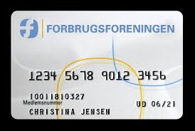

Endvidere kan nævnes de såkaldte lånekøb, hvor købesummen helt eller delvis tilvejebringes ved lån til forbrugeren fra tredjemand, fx et finansieringsselskab, med hvem sælgeren har truffet aftale om finansiering af købet.  

En sådan aftale kan også foreligge stiltiende, fx ved at der har udviklet sig et fast samarbejde mellem sælgeren og finansieringsselskabet. 

Fogedretten har statueret oprindeligt trepartsforhold, selv om skyldner havde haft forudgående kontakt til finansieringsselskabet. 

---

### Efterfølgende trepartsforhold


```{r , echo=FALSE, result=TRUE,fig.height=4,fig.cap=("Efterfølgende trepartsforhold")}

nodes <- data.frame(id = 1:3, shape = c("box"),level = c(1,1,2),label = c("Autoforhandler\nkreditformidler","Køber/låntager","Finansieringsselskab"),font.size = c(25,25,25))
edges <- data.frame(from = c(1,2,2,3,1), 
                    to = c(2,1,3,1,3),
                    arrows = c("to"),
                    length = c(900,100,100,100,100),
                    font.size = c(20,20,20,20,20),
                    label=c("Vare\nLåneaftale","","Afdrag\nRenter","Overdragelse af låneaftale\nBetaling for overdragelse",""),
                    smooth = c(FALSE,FALSE,FALSE,FALSE,FALSE)
                    )
 visNetwork(nodes, edges, width = "100%") %>% 
   visInteraction(dragNodes = TRUE, 
                 dragView = TRUE, 
                 zoomView = FALSE) %>%
  visNodes(color = list(background = "white", 
                        border = "white",
                        highlight = "yellow"),
           shadow = list(enabled = TRUE, size = 30))  %>%
  visHierarchicalLayout(direction = "UD",levelSeparation = 300) %>%
visEdges(color = list(color = "lightgrey", highlight = "yellow") )
```

---

Begrebet efterfølgende trepartsforhold omfatter de tilfælde, hvor den oprindelige kreditgivers rettigheder i henhold til kreditaftalen tiltransporteres til en tredjemand. 

Begrebet er en kreditaftaleretlig term, der dækker over begreber som factoring, kontraktbelåning, kontraktsdiscontering o.lign. 

Begrebets materielle indhold er reguleret ved reglerne om personskifte i skyldforhold, herunder navnlig reglerne om kreditorskifte. 

---

Mens det oprindelige trepartsforhold er kendetegnet ved, at tredjemanden finansierer forbrugeren, er det efterfølgende trepartsforhold kendetegnet ved, at tredjemanden finansierer sælgeren.

Forholdet mellem forbrugeren i et kreditkøb og tredjemanden i det efterfølgende trepartsforhold reguleres dels ved de almindelige regler om kreditorskifte i skyldforhold, dels ved kreditaftalelovens §§ 31-33.

---

Forholdet mellem sælgeren/kreditgiveren i det oprindelige trepartsforhold og tredjemanden i det efterfølgende trepartsforhold er navnlig, men ikke kun, reguleret ved gældsbrevslovens §§ 9 og 10 og ved gældsbrevslovens §§ 29-31 samt den righoldige retspraksis, der foreligger vedrørende factoring, fakturabelåning og selskabsopsplitning mv. 
 
---

### Fritstående lån i forhold til det oprindelige trepartsforhold

```{r , echo=FALSE, result=TRUE,fig.height=4,fig.cap=("Fritstående lån, køber finansierer købet med lån i banken")}

nodes <- data.frame(id = 1:3, shape = c("box"),level = c(1,1,2),label = c("Sælger","Køber/låntager","Bank"),font.size = c(25,25,25))
edges <- data.frame(from = c(1,2,2,3), 
                    to = c(2,1,3,2),
                    arrows = c("to"),
                    length = c(900,100,100,100),
                    font.size = c(20,20,20,20),
                    label=c("Vare\nKøbesum","","Banklån\nAfdrag/Renter/Gebyrer","")
                    # smooth = c(FALSE,FALSE,FALSE,FALSE)
                    )
 visNetwork(nodes, edges, width = "100%") %>% 
   visInteraction(dragNodes = TRUE, 
                 dragView = TRUE, 
                 zoomView = FALSE) %>%
  visNodes(color = list(background = "white", 
                        border = "white",
                        highlight = "yellow"),
           shadow = list(enabled = TRUE, size = 30))  %>%
  visHierarchicalLayout(direction = "UD",levelSeparation = 300) %>%
visEdges(color = list(color = "lightgrey", highlight = "yellow") )
```

---

Såfremt et køb eller en tjenesteydelse finansieres ved, at forbrugeren opnår et lån hos kreditgiver, som ikke har nogen forbindelse til sælgeren eller tjenesteyderen, foreligger der ikke et oprindeligt trepartsforhold, men derimod et såkaldt "fritstående lån". 

En sådan kreditaftale omfattes nok af kreditaftalelovens generelle bestemmelser om oplysningspligt, forbrugerens betalinger, efterfølgende trepartsforhold, mv., hvorimod lovens bestemmelser vedrørende oprindeligt trepartsforhold og kreditkøb ikke finder anvendelse. 

---

Finansieres et køb eller tjenesteydelse ved et fritstående lån, har kreditaftaleloven således ingen betydning for retsforholdet mellem forbrugeren og sælgeren eller tjenesteyderen. 
 
Når det skal afgøres, om der foreligger et fritstående lån eller et kreditkøb (oprindeligt trepartsforhold), som er omfattet af KAL § 4, nr. 15, litra b, er det efter lovforarbejderne afgørende, om der foreligger en sådan grad af forbindelse – et sådant samvirke mellem køb og lån – mellem sælger og långiver, at forholdet med rimelighed bør anses for et kreditkøb med de i loven angivne konsekvenser, mens lovteksten i KAL § 4, nr. 15, litra b kræver en aftale om finansiering mellem sælger og tredjemand. 

---

Der skal ikke efter retspraksis meget til før at en sådan aftale foreligger mellem sælgeren og tredjemand, hør om **U 1995.192/2 H** (Vandsengedommen).
**<a href="https://pro.karnovgroup.dk/document/7000201462/1" target="_blank">Se Dommen klik her!</a>**

---

Selv om dommen **U 1995.192/2 H** er udtryk for, at KAL § 4, nr. 15, litra b, har et bredt anvendelsesområde, medfører bestemmelsen ikke, at alle lån, der anvendes til løsørekøb, må anses for omfattet af KAL § 4, nr. 15, litra b. 

---

Lånetilsagn, der gives af et pengeinstitut/finansieringsselskab, inden den kommende køber henvender sig til sælgeren, er eksempelvis ikke omfattet, medmindre lånetilsagnet er opnået i en institution, der har en aftale med vedkommende forhandler, og køber opnår lånet på grundlag af denne aftale. 

---

Det kan heller ikke antages, at sælgers medvirken – eksempelvis at han hjælper køberen med en telefonisk henvendelse til banken – i sig selv bevirker, at lånet er omfattet af KAL § 4, nr. 15, litra b.

---

**Internationale betalingskort er omfattet af det oprindelige trepartsforhold:**


 
---


 
---


---

Lån, der ydes af eksterne kontosystemer (og selskabskonstruktioner, der må ligestilles hermed) må antages at være omfattet af KAL § 4, nr. 15, litra b«.  

Konkurrence- og Forbrugerstyrelsen antager på baggrund af de enkelte internationale kortsystemer, at i hvert fald systemerne MasterCard, Eurocard, samt Diners Club-kortet er omfattet af reglerne om oprindelige trepartsforhold. 

---

For så vidt angår VISA vil afgørelsen af dette spørgsmål bero på, hvorvidt der sker en sådan forsinkelse af debiteringen efter anvendelse af kortet, at der må siges at blive ydet kredit fra kortudsteders side. 

Dette resultat er i overensstemmelse med kreditkøbsudvalgets intentioner om, at de forbrugerbeskyttende regler i loven skal omfatte hele kreditkøbsområdet, og ud fra en mere overordnet betragtning synes ulemperne for kortudsteder at være overskuelige. 

---

Først og fremmest vil risikoen for, at der statueres oprindeligt trepartsforhold, virke som et incitament for kortudsteder til at vælge respektable og fornuftige samarbejdspartnere. 

Endvidere har kortudsteder mulighed for at tage højde for denne risiko i forhold til det indbyrdes opgør med betalingsmodtager fx i form af modregning ved efterfølgende betalingsanmodninger fra samme betalingsmodtager. 

---

Endelig kan der næppe herske tvivl om, at kreditelementet indgår som et væsentligt beslutningsparameter ved kortindehavers beslutning om at anskaffe sig et af de pågældende betalingskort. 

---

### Forbrugerens adgang til at fremsætte indsigelser over for anden kreditor


I KAL kapitel 9 om kreditorskifte er der fastsat regler til beskyttelse af forbrugeren i trepartsforhold.

---

Når en kreditgiver har overdraget sine rettigheder i henhold til en kreditaftale til tredjemand, har forbrugeren ifølge KAL § 33, stk. 1, over for erhververen ret til at gøre enhver indsigelse gældende, som forbrugeren kunne gøre gældende over for den oprindelige kreditgiver.

---

Erhververen har de samme rettigheder og forpligtelser over for forbrugeren, som den oprindelige kreditgiver.

Ifølge KAL § 33, stk. 2, skal forbrugeren underrettes om en sådan overdragelse efter stk. 1. 

Dette gælder ikke, hvis den oprindelige kreditgiver efter aftale med erhververen fortsat står for kreditten i forhold til forbrugeren. 

---

I tilfælde af kreditorskifte (ved det efterfølgende trepartsforhold) er reglen en gentagelse af princippet i gældsbrevslovens § 27, men reglen i KAL § 33 kan – i modsætning til gældsbrevslovens § 27 – ikke fraviges ved aftale, jf. KAL § 7, stk. 1:

"Loven og de i medfør af denne udfærdigede forskrifter kan ikke ved aftale fraviges til skade for forbrugeren".

---

**Efterfølgende trepartsforhold:**


```{r , echo=FALSE, result=TRUE,fig.height=4,fig.cap=("Efterfølgende trepartsforhold, køber kan gøre samme indsigelser overfor både sælger og finansieringsselskab.")}

nodes <- data.frame(id = 1:3, shape = c("box"),level = c(1,1,2),label = c("Sælger","Køber","Finansieringsselskab"),font.size = c(25,25,25))
edges <- data.frame(from = c(1,2,2,1), 
                    to = c(2,1,3,3),
                    arrows = c("to"),
                    length = c(900,100,100,100),
                    font.size = c(20,20,20,20),
                    label=c("Kreditkøb\nKøbers indsigelser","","Afdrag\nRenter","Salg af købekontrakt")
                    # smooth = c(FALSE,FALSE,FALSE,FALSE,FALSE)
                    )
 visNetwork(nodes, edges, width = "100%") %>% 
   visInteraction(dragNodes = TRUE, 
                 dragView = TRUE, 
                 zoomView = FALSE) %>%
  visNodes(color = list(background = "white", 
                        border = "white",
                        highlight = "yellow"),
           shadow = list(enabled = TRUE, size = 30))  %>%
  visHierarchicalLayout(direction = "UD",levelSeparation = 300) %>%
visEdges(color = list(color = "lightgrey", highlight = "yellow") )
```

---

I det oprindelige trepartsforhold, hvor fordringen mod forbrugeren hidrører fra, at en tredjemand efter aftale med sælgeren eller tjenesteyderen har ydet forbrugeren et lån til finansiering af ydelsen, indebærer § 33, stk. 1, en nydannelse i forhold til gældsbrevslovens § 27, idet bestemmelsen sikrer, at forbrugeren over for en sådan tredjemand kan gøre de samme indsigelser gældende, som forbrugeren kunne mod sælgeren eller tjenesteyderen.

Realindholdet af KAL § 33, stk. 1, er, at der sker en køberetlig identifikation mellem tredjemand og den oprindelige kreditgiver (sælgeren). 

---

I lovforarbejderne betegnes trepartsforholdet som sælgers og tredjemands solidariske hæftelse over for forbrugeren.  

Bestemmelsen medfører, at forbrugeren fx i tilfælde, hvor der foreligger forsinkelse eller mangler ved det købte, kan afvise at betale til anden kreditor i samme omfang, som forbrugeren kunne afvise at betale til sælgeren. 

---

Har forbrugeren hævet købet, er forbrugeren ikke pligtig at betale til anden kreditor. 

Efter de almindelige obligationsretlige grundsætninger får forbrugeren ikke en bedre retsstilling over for den finansierende tredjemand, end den forbrugeren havde over for sælgeren. 

---

Forbrugerens adgang til at udøve køberetlige beføjelser – eksempelvis at hæve købet eller påberåbe sig en mangel – er betinget af, at forbrugeren ikke har fortabt retten hertil efter den relative eller absolutte reklamationsfrist, jf. købelovens § 81 og § 83. 

Såfremt forbrugeren har hæveadgang i henhold til købelovens § 78, må forbrugeren efter lovens § 33, stk. 1 og 3, tilbagelevere løsøret, jf. afgørelsen i **Juridisk Årbog 1994-94, s. 212** om kreditkøb af en sofagruppe.

---

### Forbrugerens adgang til at fremsætte pengekrav over for anden kreditor

Efter KAL § 33, stk. 3 og 4, kan forbrugeren i det oprindelige trepartsforhold i et nærmere angivet omfang gøre et pengekrav gældende over for såvel den finansierende tredjemand som over for den eller dem, der måtte have erhvervet den finansierende tredjemands fordring ved transport. 

---

Betingelserne for, at forbrugeren kan gøre et pengekrav gældende mod de nævnte tredjemænd, er: 

**at** forbrugeren har et pengekrav mod sælgeren eller tjenesteyderen i anledning af aftalen (fx krav på hel eller delvis tilbagebetaling af vederlaget eller på erstatning), at forbrugeren sandsynliggør, 

**at** sælgeren eller tjenesteyderen ikke opfylder sine forpligtelser, samt 

**at** beløbet ikke overstiger, hvad forbrugeren har betalt den pågældende finansierende tredjemand i anledning af aftalen. 

---

Ordlyden af bestemmelsen i KAL § 33, stk. 3, 2. pkt., hvorefter »forbrugeren må dog først sandsynliggøre, at sælgeren ikke opfylder sine forpligtelser«, er imidlertid ikke særlig klar. 

Der er ikke grundlag for at antage, at der foreligger en fuldstændig solidarisk hæftelse i sædvanlig forstand, hvor fordringshaveren kan kræve hele ydelsen af enhver af de forpligtede. 

KAL § 33, stk. 3, synes i stedet at bygge på en selvskyldnerkautionslignende ordning, hvorefter forbrugeren skal have rettet henvendelse til sælgeren eller (typisk) dennes bo, forinden kravet rejses mod en finansierende tredjemand. 

---

Krav om naturapræstationer i form af levering, omlevering eller afhjælpning kan ikke gøres gældende mod den finansierende tredjemand. 

Sådanne naturakrav kan, hvis de ikke opfyldes af sælger, imidlertid konverteres til pengekrav gennem udnyttelse af adgangen til at hæve, kræve forholdsmæssigt afslag eller erstatning for afhjælpningsudgiften. 

---

Forbrugerens krav mod den finansierende tredjemand kan som nævnt højst andrage det beløb, som denne har modtaget fra forbrugeren i anledning af købet, jf. KAL § 33, stk. 2, 2. pkt. 

Det afgørende ved beregningen af kravet er således ikke, at forbrugeren har et køberetligt krav på sælgeren på fx. 100.000 kr., men at forbrugeren har betalt eksempelvis 50.000 kr. til den pågældende tredjemand.  

---

Princippet er praktiseret i en række afgørelser ved Forbrugerklagenævnet, jf. fx **Juridisk Årbog 1998, s. 153 og 155**, **Juridisk Årbog 1999, s. 214 og 216**, samt **Juridisk Årbog 2001, s. 112**.


Det er tvivlsomt, om den finansierende tredjemand over for forbrugeren hæfter for produktskader i helt samme omfang som sælgeren. 

---

**Cut-off-klausul** er en klausul om, at skyldneren ikke skal kunne rejse indsigelse mod en erhverver af fordringen, jf. KAL § 32: "Det kan ikke aftales, at der ved overdragelse til tredjemand af de rettigheder, der tilkommer kreditgiveren, sælgeren eller leverandøren af en tjenesteydelse, sker indskrænkning af dennes forpligtelser over for forbrugeren." 

Er ikke gyldig i forbrugerforhold, jf. tillige KAL § 33.

---

I kreditkøb med forbrugere kan der ikke aftales pant i det solgte aktiv jf. KAL § 21, stk. 1, hvorfor pantebrevet ikke er gyldigt.

Der kan heller ikke aftales en cut off-klausul jf. KAL § 32, da fx bilkøberne derved vil blive afskåret fra, at gøre deres evt. mangelsindsigelser gældende over for 3 mand der har fået overdraget fodringen på lånet til bilen fra bilsælgeren.

Når aftalerne overdrages til en ny fordringshaver, er der tale om et efterfølgende trepartsforhold jf. KAL § 33, stk. 1, som giver fx bilkøberen samme rettigheder over for den nye fordringshaver, som bilkøberne havde mod den oprindelige fordringshaver fx bilsælgerne.

---

I denne situation, hvor fx lastbilkøberne ikke er forbrugere, men erhvervsdrivende. Ved ikke-forbrugere er der intet forbud mod pant i bilerne jf. KAL § 21 og ej heller forbud mod at aftale en cut off-klausul jf. KAL § 32.
Derfor vil såvel pantebrevene i de solgte aktiver, som tillæggene til kreditaftalerne være gyldige.

Der skal heller ikke som erhvervsdrivende køber erlægges 20 pct. i udbetaling, jf. KAL § 34, stk. 1, nr. 4, jf. § 50.

---

## Køb med ejendomsforbehold


**Ejendomsforbehold** er en aftale mellem køber og sælger om, at sælger kan tage varen tilbage, hvis køber ikke betaler afdrag efter kreditaftalen, jf. KAL § 34, stk. 1.

Ved et gyldigt ejendomsforbehold	har sælger således forbeholdt sig ejendomsretten til det solgte, hvis købesummen ikke betales.

---

Ejendomsforbehold kan være en del af kreditaftalen, men sælger kan også vælge ikke at tage ejendomsforbehold.

I aftaler om kreditkøb er det udelukkende muligt at bruge ejendomsforbehold, der kan ikke tages underpant i varen.


```{r , echo=FALSE, result=TRUE,fig.height=4,fig.cap=("Konflikten mellem Amalies ret efter ejendomsforbeholdet og Cecilies ret til den købte vare.")}

nodes <- data.frame(id = 1:3, shape = c("box"),label = c("A. Amalie","B. Bent","C. Cecilie"),font.size = c(25,25,25))
edges <- data.frame(from = c(1,2,3), 
                    to = c(2,3,1),
                    arrows = c("to"),
                    length = c(400,100,300),
                    font.size = c(20,20,20),
                    label=c("Ejendomsforbehold\ntil sælger","",""),
                    smooth = c(FALSE,FALSE,TRUE)
                    )
 visNetwork(nodes, edges, width = "100%") %>% 
   visInteraction(dragNodes = TRUE, 
                 dragView = TRUE, 
                 zoomView = FALSE) %>%
  visNodes(color = list(background = "white", 
                        border = "white",
                        highlight = "yellow"),
           shadow = list(enabled = TRUE, size = 30))  %>%
  visHierarchicalLayout(direction = "UD",levelSeparation = 300) %>%
visEdges(color = list(color = "lightgrey", highlight = "yellow") )
```

---

**Formkravet til et gyldigt ejendomsforbehold:**

Et gyldigt ejendomsforbehold skal efter KAL § 34, stk. 1 være:

1) det er aftalt senest ved overgivelsen af det købte til forbrugeren,

2) det samlede beløb, der skal betales, jf. § 8, stk. 2, nr. 7, inklusive den erlagte udbetaling overstiger 2.000 kr.,

3) kreditkøbet ikke er sket i henhold til en aftale om kredit med variabelt lånebeløb og

4) sælgeren ved overgivelsen af det købte er fyldestgjort for mindst 20 pct. af kontantprisen".


---

Desuden skal ejendomsforbehold i motorkøretøjer tinglyses i bilbogen, jf. TL § 42d, stk. 1.

OBS: Ingen krav om udbetaling i handelskøb og civilkøb for at der er taget et gyldigt ejendomsforbehold.
 
---

**Konflikt med senere rettigheder ved et gyldigt ejendomsforbehold:**

**HR:** Et gyldigt stiftet ejendomsforbehold beskytter sælgers ejendomsret til aktivet overfor købers andre kreditorer og aftaleerhververe. 

**U:** Hvis en godtroende forbruger har købt aktivet med ejendomsforbehold, kan køber ekstinkvere (udslette) sælger ejendomsforbehold hvis:  

**U1:** Sælger har givet tilladelse til videresalg.  

**U2:**: Sælger har opført sig passivt eller særlig uforsigtigt, og aktivet er udleveret til køber.

**U3:** Forhandlergrundsætningen – sælger er klar over, at køber er forhandler af aktivet, og aktivet er udleveret til køber. 

---

**Forhandlergrundsætning**	betyder, at et ejendomsforbehold ikke kan gøres gældende, hvis sælgeren har solgt genstanden til en person, om hvem han vidste eller burde vide, at denne var forhandler af genstande af den pågældende art, og forhandleren herefter har videresolgt genstanden til en godtroende erhverver, som har fået genstanden i hænde.

---

**Særregler for forbrugerkøb med ejendomsforbehold:**

Formålet med reglerne om køb med ejendomsforbehold er at give sælgeren mulighed for at få sikkerhed for købesummens betaling og derved beskytte sine legitime fordringsrettigheder over for forbrugerens andre kreditorer og aftaleerhververe.  

Endvidere har reglerne til formål at varetage forbrugerens interesser i tilfælde af konflikt med sælgeren. 

---

Kreditaftalelovens regler om køb med ejendomsforbehold søger at afbalancere hensynet til forbrugerens interesse i at komme ud af et kreditkøb med ejendomsforbehold uden at efterlade sig gæld til kreditgiveren samt forbrugerens interesse i fortsat at kunne benytte det købte trods en mindre væsentlig misligholdelse af sin betalingsforpligtelse med hensynet til sælgerens interesse i at kunne sikre sig over for såvel forbrugerens faktiske som retlige dispositioner over det solgte.   

---

Køb med ejendomsforbehold er defineret i KAL § 4, nr. 16, hvorefter der ved køb med ejendomsforbehold forstås et kreditkøb, hvor det er aftalt, at sælgeren kan tage det solgte tilbage, hvis forbrugeren ikke opfylder sine forpligtelser.  

En indehaver af et ejendomsforbehold skal som hovedregel ikke foretage nogen sikringsakt for at opnå omsætnings- og kreditorbeskyttelse. 

---

Dog er det ved tinglysningslovens § 42 d bestemt, at ejendomsforbehold i køretøjer mv., jf. tinglysningslovens § 42 c, skal tinglyses i bilbogen for at opnå omsætnings- og kreditorbeskyttelse.  

Et ejendomsforbehold i fx en bil kan udmærket være gyldigt mellem parterne, selv om det ikke er tinglyst, og selv om de formkrav, der stilles for at få det tinglyst, ikke er opfyldt. 

---

Tinglysning af et ejendomsforbehold, der ikke er gyldigt stiftet, medfører ikke, at ejendomsforbeholdet bliver gyldigt.  

Som køb med ejendomsforbehold anses også en aftale, der er betegnet som lejekontrakt, eller en aftale, hvorefter betalingen i øvrigt fremtræder som vederlag for brug af tingen, såfremt det må antages at have været meningen, at modtageren af tingen skal blive ejer af den, jf. § 4, nr. 16:

---


Se **Fona-sagerne** i Højesterets dom **U 2004.317 H**, hvorefter aftale om leje af videoapparat med ret til at købe apparatet for 1 kr. efter 5 år var i strid med kreditaftaleloven.
**<a href="https://pro.karnovgroup.dk/document/7000279473/1" target="_blank">Dommen klik her!</a>**


---

**Krav til aftalen om ejendomsforbehold:**

Definitorisk stilles der ikke krav om, at et ejendomsforbehold skal aftales skriftligt. 

Da en forbrugerkreditaftale efter bestemmelsen i KAL § 8 skal udfærdiges skriftligt, og da en betingelse for, at kreditgiveren – såvel i forbrugerkøb som ikke-forbrugerkøb med ejendomsforbehold – kan tage det solgte tilbage ifølge KAL § 36, er, at ejendomsforbeholdet er indeholdt i en skriftlig kontrakt, må et **ejendomsforbehold de facto aftales skriftligt**. 

---

Der foreligger et gyldigt ejendomsforbehold, når et sådant udtrykkeligt og klart er aftalt mellem parterne,  og når betingelserne i KAL § 34 i øvrigt er opfyldt. 

Et ejendomsforbehold skal være så klart udtrykt, at køberen har mulighed for at forstå, at sælgeren har forbeholdt sig ejendomsretten til det solgte. 

---

Det kræves ikke, at den konkrete køber faktisk har forstået dette, men at den almindelige køber vil være i stand til at forstå dette.  

---

Sælgeren kan ikke tage et ensidigt ejendomsforbehold – fx i en faktura eller i leveringsbetingelserne, jf. dommene **U 1977.29 SH og U 1978.373 V** (et ejendomsforbehold, der var fortrykt på kontraktens bagside, fandtes ikke at være aftalt, da kontrakten var underskrevet på forsiden) og **U 1983.311 H** – og i hvert fald i forbrugerkøb er et sådant forbehold ikke gyldigt, selv om køber ikke reklamerer over det pågældende kontraktvilkår.  

---


**Krav til individualisering af det solgte:**

En betingelse for, at et ejendomsforbehold kan gøres gældende, er, at den solgte genstand er specificeret således, at den ikke er forvekslelig med en anden genstand. Kravet gælder såvel inter partes som i forhold til tredjemand. 

Der er enighed i teori og praksis om, at en rettighedshaver skal kunne godtgøre sin ret, fx i fogedretten, men der er til gengæld ikke enighed om, hvilke krav der skal stilles til salgsgenstandens individualisering i købekontrakten.  

---

Kravet kunne være, at det solgte skal være individualiseret på en sådan måde i købekontrakten, at det fx i forbindelse med en fogedsag kan identificeres, uanset at det måtte befinde sig sammen med sammenlignelige genstande og genstande af tilsvarende art. 

I praksis vurderes kravene konkret på grundlag af de givne forhold og omstændigheder.  

---

Det kunne imidlertid også være nærliggende at henvise til, at domstolene ved tinglysning af pantebreve i løsøre stiller krav om, at den pantsatte genstand skal være individualiseret – beskrevet med en sådan klarhed, at der ikke kan indskydes andre genstande under panteaftalen. 

Kravet må efter forholdets natur afhænge af, hvilken løsøregenstand (der fx også omfatter dyr) der er tale om. 

Det er kreditgiveren, der i det enkelte tilfælde må løfte bevisbyrden for, hvilken genstand denne har ejendomsforbehold i. 

---

**Et ejendomsforbehold gælder kun for den konkrete genstand, der er taget ejendomsforbehold i.** 

Findes genstanden ikke længere, eller kan den ikke identificeres, kan sælgeren ikke hævde sin rettighed. 

Forbrugeren skal foretage en normal vedligeholdelse af den genstand, der er ejendomsforbehold i.

Hvis genstanden ikke længere findes hos forbrugeren, fx fordi den er solgt eller byttet væk, kan sælgeren som hovedregel ikke gøre ejendomsforbeholdet gældende i den eventuelle nye genstand. 

---

Spørgsmålet om, hvorvidt sælgeren kan vindicere genstanden fra tredjemand, må afgøres efter almindelige regler om eksstinktion.  

Udgangspunktet i dansk ret er, at kreditgiveren (sælgeren) kan "vindicere" (tilbagefører) genstanden fra en senere erhverver. 

---

Ifølge domspraksis fraviges dette udgangspunkt, såfremt kreditgiveren har udvist uforsigtighed eller passivitet, jf. fx dommen i **U 1984.846 V** Om videresalg af en motorcykel.
**<a href="https://pro.karnovgroup.dk/document/7000205503/1" target="_blank">Dommen klik her!</a>**

---

**Betingelser for gyldigheden af et ejendomsforbehold:**

Et ejendomsforbehold i forbrugerkøb er som tidligere nævnt kun gyldigt efter lovens § 34, stk. 1, såfremt:

1. Det er aftalt senest ved overgivelsen af det købte til forbrugeren,

2. det samlede beløb, der skal betales, jf. § 9, stk. 1, nr. 5, overstiger 2.000 kr.,

3. kreditkøbet ikke er sket i henhold til en aftale om kredit med variabelt lånebeløb, og

4. sælgeren ved overgivelsen af det købte er fyldestgjort for mindst 20 % af kontantprisen.

---

**1. Krav til aftaletidspunktet:**

Efter KAL § 34, stk. 1, nr. 1, skal et ejendomsforbehold således være aftalt senest ved overgivelsen af det købte til forbrugeren. 

Dette krav harmonerer med den almindelige regel i køberetten, hvorefter sælgerens ret til at hæve (sælgerens standsningsret) går tabt, når salgsgenstanden er overgivet til køberen, jf. købelovens § 28, stk. 2 og § 39. 

---

Kriteriet for, at der er sket overgivelse af genstanden, er, at genstanden faktisk befinder sig hos forbrugeren, dennes repræsentant eller under forhold, der ganske må ligestilles hermed, jf. dommen i **U 1957.324 H:**
**<a href="https://pro.karnovgroup.dk/document/7000223971/1" target="_blank">Dommen klik her!</a>**

---

Er en overgivelse oprindelig sket i henhold til en aftale om lån, leje, prøve eller udvalg mv., er det tilstrækkeligt, at ejendomsforbeholdet aftales senest samtidig med aftalen om køb, jf. herved dommen i **U 1967.805 H:**
**<a href="https://pro.karnovgroup.dk/document/7000213445/1" target="_blank">Dommen klik her!</a>**

---

Kravet om, at ejendomsforbeholdet skal være aftalt senest ved overgivelsen, gælder både inter partes og i forhold til køberens kreditorer. 

---

**2. Kreditprisen skal overstige 2.000 kr.:**

Et yderligere krav for, at der foreligger et gyldigt ejendomsforbehold, er, at kreditprisen skal overstige 2.000 kr., jf. KAL § 34, stk. 1, nr. 2.  

Kravet er opfyldt, når det samlede beløb, der skal betales, overstiger 2.000 kr., også selv om kontrakten omfatter flere genstande, der hver for sig er prissat til et beløb under det angivne minimumsbeløb, jf. dommen i **U 1991.124 V**.
**<a href="https://pro.karnovgroup.dk/document/7000199447/1" target="_blank">Dommen klik her!</a>**

---

Det samlede beløb, der skal betales af forbrugeren, beregnes på tidspunktet for indgåelsen af kreditaftalen, jf. KAL § 8, stk. 2, nr. 7.

---

**3. Købet må ikke være sket i henhold til kreditaftale med -variabelt lånebeløb:**

Efter KAL § 34, stk. 1, nr. 3, kan et ejendomsforbehold ikke gyldigt aftales, såfremt kreditkøbet sker i henhold til en aftale om kredit med variabelt lånebeløb, dvs. en kassekredit eller en kontoaftale med eller uden kort.

Begrundelsen for reglen er navnlig, at Kreditkøbsudvalget dels fandt køb med ejendomsforbehold uforeneligt med begrebet kontokøb, dels fandt det ønskeligt at holde den juridiske regulering af køb med ejendomsforbehold uden for reguleringen af kontokøb bl.a. af hensyn til afviklingen af kreditgiverens krav i tilfælde af køberens misligholdelse af købet. 

---

Ved at tillade køb med ejendomsforbehold i henhold til kreditaftale med variabelt lånebeløb (kontoaftaler) vanskeliggøres muligheden for at påvirke efterspørgsel og forbrug ved ændringer i kravet til udbetalingens størrelse. 

Bestemmelsen i KAL § 34, stk. 1, nr. 3, udelukker ikke, at en køber kan indgå en aftale om køb med ejendomsforbehold i en forretning, hvor køberen i forvejen har en kontoaftale; blot skal købet med ejendomsforbehold finansieres efter reglerne om kreditaftaler med fast lånebeløb. 

---

**4. Udbetalingskrav på mindst 20 % af kontantprisen:**

Efter KAL § 34, stk. 1, nr. 4, er det ydermere en betingelse for et gyldigt ejendomsforbehold, at sælgeren er fyldestgjort for mindst 20 % af kontantprisen, hvilket vil sige den pris, som genstanden kunne være købt til ved kontant betaling på tidspunktet for aftalens indgåelse.  

Det er uden videre givet, at begrebet kontantprisen omfatter moms, jf. dommene i **U 1970.688 Ø og U 1980.624 V**. 

---

Et eksempel herpå er fx stempelafgift. 

Reglerne om mindsteudbetalingen er basalt set en social/forbrugerbeskyttende foranstaltning, medens mindsteudbetalingens vekslende størrelse imidlertid allerede fra 1950’erne først og fremmest har været dikteret af finanspolitiske hensyn, jf. fx kartoffelkuren i 1986, hvor udbetalingskravet blev forhøjet fra 20 % til 30 %. 

Udbetalingskravet er ved lov nr. 226 af 6. april 1994 blevet ændret fra 30 % til 20 % af kontantprisen.

Selvom kravets tilsidesættelse medfører, at ejendomsforbeholdet er ugyldigt, fratager det ikke forbrugeren de særlige beskyttelsesregler i kapitlet, jf. KAL § 30, stk. 2. 

---

Sælgeren har bevisbyrden for, at der foreligger et ikke-forbrugerkøb, jf. KAL § 1, stk. 3, og dermed for, at ejendomsforbeholdet er gyldigt, uanset at udbetalingskravet ikke er opfyldt.  

Kravet om en mindsteudbetaling på 20 % af kontantprisen er objektiv og skal tages bogstaveligt. 

Selv om der kun mangler et beskedent beløb førend, at sælgeren er fyldestgjort for 20 % af kontantprisen, er ejendomsforbeholdet ugyldigt.  
 
---

## Betingelser for tilbagetagelse fra forbrugeren

Såfremt kreditor har et dokument, som opfylder kravene i KAL § 36, stk. 1, idet dokumentet:  

1. er underskrevet af forbrugeren og overgivet til den pågældende i genpart og 

2. indeholder et gyldigt ejendomsforbehold, kan kreditor tage det solgte tilbage ved en umiddelbar fogedforretning.  

---

Såfremt kreditor ikke er i besiddelse af et sådant dokument, må kreditor på sædvanlig vis først opnå en dom over skyldneren, som i overensstemmelse med KAL § 35 skal lyde på, at kreditor har krav på tilbagetagelse af det solgte.  

Er den solgte genstand omfattet af retsplejelovens § 509, stk. 1, eller § 515, stk. 2 (Trangsbeneficiet), kan tilbagetagelse dog ikke ske, jf. KAL § 36, stk. 2. 


---

## Forbud mod pantsætning

Efter KAL § 21 i kreditkøb kan kreditgiveren ikke i forbindelse med aftalens indgåelse eller leveringen af det solgte få pant i dette til sikkerhed for, at forbrugeren opfylder sine forpligtelser. 

Hvis sælgeren vil have sikkerhed, må denne følge kal § 34 for at sikker sig et et gyldigt ejendomsforbehold.

---

Det hindrer dog kke, at kreditgiveren efter reglerne om pantsætning af fast ejendom får pant i det solgte, når dette udgør tilbehør til eller bestanddel af en fast ejendom. 

Dette forbud gælder heller ikke ved anvendelse på kreditkøb af aktier, andre former for obligationer end præmieobligationer, sparekassers garantibeviser, beviser for ansvarlig indskudskapital i pengeinstitutter, beviser udstedt af investeringsforeninger under tilsyn og lignende værdipapirer

---

## Køber misligholder kreditaftalen

Opsigelse af en kreditkøbsaftale, jf. KAL § 29

Kreditgiver kan kun opsige hele aftalen, hvis forbrugeren er i kvalificeret misligholdelse, dvs. køber skal være i restance i mindst 30 dage og:

+	Restancen skal udgøre mindst 1/10 af det samlede beløb.
  
+	Hvis flere afdrag mangler at blive betalt, skal de tilsammen udgøre mindst 1/20.
  
+	Hele restgælden er i restance.
  
---

Køber misligholder kreditaftalen og der er et gyldigt ejendomsforbehold: 

Er kreditaftalen opsagt kan sælger med ejendomsforbehold tage aktivet tilbage.  

Aktiver omfattet af **trangsbeneficiet** kan ikke tages tilbage, jf. RPL § 509.  

---

Sælger kan kun blive fyldestgjort i det solgte aktiv uden mulighed for at få betalt en evt. restgæld . 

Har køber misligholdt aktivet eller lagt hindringer i vejen for tilbagetagelsen, kan sælger kræve restgælden betalt, jf. KAL § 41.  
  

---

Køber misligholder kreditaftalen og der er ikke noget gyldigt ejendomsforbehold:

**HR:** Er kreditaftalen opsagt kan sælger uden ejendomsforbehold få udlæg i alle købers aktiver.

**U:** Fogedretten kan henvise sælger til at tage det solgte tilbage.

---

En sælger uden ejendomsforbehold kan kræve hele restgælden betalt uanset værdien af det solgte aktiv

Køb med ugyldigt ejendomsforbehold:

Sælger kan:

+	Ikke få aktivet tilbage.

+	Kun kræve gæld udover aktivets værdi tilbagebetalt, hvis køber har misligholdt aktivet.

...

## Eksamensopgave 1

**Kunst og kærlighed**

Lone Pind driver et mindre kunstgalleri i Nyborg. I begyndelsen af januar solgte hun et mindre men temmelig værdifuldt oliemaleri til en af galleriets tilbagevendende kunder, kunstsamleren Ole Høj. Som det var sket før, manglede han rede penge til købet, og de aftalte, at Lone fik sikkerhed for kreditten i form af et ejendomsforbehold.

**Eksamensspørgsmålet:** 

1. Hvilke andre former for kreditsikkerhed kunne parterne have overvejet?

---

De første måneder går det planmæssigt med betalingen, men da først afdraget fra april og derefter fra maj udebliver, bliver Lone urolig.

**Eksamensspørgsmålet:** 

2. Hvilke betingelser skal være opfyldt før Lone kan kræve oliemaleriet tilbage?

---

Lone har ansat den unge flamboyante kunsthistoriestuderende Natasha Romanoff, som studentermedhjælp i galleriet, og en dejlig forårsdag i maj, skal Natasha besøge en af galleriets gennem mange år tilknyttede kunstnere, Den temperamentsfulde Hans Corfitz, for på vegne af en af galleriets kunder, kunstinvestoren, Harald Jensen, at vælge et værk af Corfitz, til hans portefølje.

Lone har forklaret Natasha, at Corfitz er en dygtig og hård forhandler, og at hendes opgave er at opnå et afslag på mindst 25%, i forhold til den pris han forlanger. Hun har også talt med Corfitz for at aftale Natashas besøg, og da de er gode venner og hele opgaven er lidt af en test af Natashas evner, fortæller hun ham også om afslaget på de 25%, og at han ikke må give sig for let.

Det viser sig at Corfitz tager rollen meget alvorligt og selvom Natasha prøver med både kunstteoretiske og merkantile argumenter såvel som kvindelig charme, lykkes det hende ikke at opnå mere end hvad der svarer til 22% afslag. Hun mener, at det må være nok og indgår aftalen.

Men det er ikke kun Corfitz, men også Lone der har temperament, og som følge af det skete og en anden mindre uoverensstemmelse, udvikler der sig en større konflikt imellem de to, og Lone afviser aftalen om købet som ugyldig.

**Eksamensspørgsmålet:** 

3.  Har hun ret til det?

---

Få uger efter har striden lagt sig, og Lone er godt tilfreds med Natashas arbejde, hvorefter Natasha tirsdag d. 8. juni 2015 indgår aftale om køb af en lille hyggelig lejlighed i det østlige Odense. Men da hendes næsten faste kæreste, baron Christian von Zlowlov, ganske overraskende, frier til hende to dage senere, og hun vælger at sige ja, fortryder hun lejlighedskøbet, da hun jo nu skal være frue på Christians sydfynske slot.

**Eksamensspørgsmålet:** 

4. Er det muligt for Natasha at komme ud af aftalen, og i givet fald på hvilke betingelser?

---

Efter at have drøftet situationen med Christian bliver de dog enige om at beholde lejligheden, da det i mange situationer er praktisk for dem at have en lejlighed i Odense. Desværre viser det sig få uger senere, at der er nogle temmelig alvorlige fugtskader under og bag køkkenelementerne mellem køkkenvasken og opvaskemaskinen. Der er ikke udfærdiget tilstandsrapport, og sælger hævder, at der er tale om synlige fejl.

**Eksamensspørgsmålet:** 

5.  Hvilke omstændigheder afgør Natachas muligheder for at gøre krav gældende i forbindelse med skaderne?

---

**Eksamensspørgsmålet:** 

6. Hvis der i den samme situation var blevet udfærdiget tilstandsrapport og elinstallationsrapport samt tegnet ejerskifte-forsikring, og der med sikkerhed var tale om synlige fejl, som ikke fremgik af tilstandsrapporten, hvordan havde Nataschas situation så været, og af hvem og under hvilke betingelser, kunne hun kræve erstatning?

---

**Podcast om svaret på eksamensopgaven**

---

## Eksamensopgave 2

**Børge Olsen**


Opgave 1 (25 %) 

Børge Olsen var Smart-tv-nørd, som hele tiden forsøgte at holde trit med udviklingen af Smart-tv fra SONY. 

I den forbindelse havde Børge Olsen set på Elgigantens hjemmeside et fantastisk køtilbud på nyt Smart-tv produkt fra SONY: 

SONY 55" 4K SMART LED TV KD55XF7596BAEP. Pris: 8000,00 kr.

For den pris fik man en funktionsrig 4K Smart TV med fjernbetjening med stemmefunktion fra Sony med:

•	55" 4K HDR Android Smart-TV
•	400 Hz Motionflow XR - Fantastisk bevægelse!
•	4K X-Reality PRO
•	HDR10 + HLG
•	Chromecast & Miracast
•	S-Force Front Surround Sound
•	4 x HDMI, 3 x USB
•	DVB-T2/C/S2

Den 1. august 2019 stod Børge tidligt op for at være en af de første i køen til at købe et af de få eksemplarer, der var kommet til Elgiganten i Fields afdelingen i København.

Prisen var 8.000 kr., men han havde kun taget 4.000 kr. med og ville derfor gerne låne de sidste 4.000 kr. Elgiganten foreslog ham følgende muligheder:

1.	Han kunne købe Smart-tv’et på kredit i Elgiganten med ejendomsforbehold.

2.	Han kunne købe Smart-tv’et på kredit i forretningen mod samtidig at underskrive et løsørepantebrev, der gav Elgiganten pant i tv’et.

3.	Han kunne købe Smart-tv’et på kredit i forretningen mod samtidig at underskrive et ordregældsbrev.

4.	Han kunne søge et lån hos et finansieringsselskab, som Elgiganten havde en samarbejdsaftale med. Elgiganten havde låneansøgningsskemaer liggende i Fields

**Eksamensspørgsmålet:** 

1) Redegør med inddragelse af den relevante lovgivning for, om det er lovligt for Elgiganten at tilbyde finansieringen på de anførte måder

---

Opgave 2 (25 %) 

Børge Olsen er kunde i Sydbank, hvor han har en konto med et tilknyttet Visa/dankort. Betalte med sit kort i et supermarked den 11. april 2019 kl. 18.01, hvor han samtidig hævede ekstra 500 kr. 

Næste gang han forsøgte at bruge sit dankort var 2 dage senere, d. 13 april kl. 10, da han ville købe ind hos fiskehandleren. 

Da han skulle betale, blev han klar over, at han have mistet sin dankort. Han havde ikke nogen ide om, hvordan havde mistet det.   

kl. 13.21 samme dag ringede Børge Olsen til Nets for at spærre kortet. Han fik i den forbindelse oplyst, at i perioden fra 12. april 2019 kl. 18.38 til 13. april 2019 kl. 11.39 var kortet blevet brugt 9 gange med et samlet beløb på i alt 30.122,02 kr.

Ligeledes den 13 april var der i tidsrummet fra kl. 10.57 til kl 11.39 blevet der foretaget yderligere 4 fire hævninger på tilsammen 9.355 kr. hvorefter Nets havde spærret kortet på grundlag af mistanke om misbrug

Børge Olsen anmeldte sagen til politiet og gav samtidig Sydbank besked om, at han ikke kunne godkende nogen af de nævnte hævninger på hans konto.

Børge forklarede, at han havde spærret kortet så hurtigt som mulig. 

Han havde ringet til Nets, da han var kommet hjem, men af ikke nærmere oplyste årsager havde det taget noget tid for ham at komme hjem.    

I et efterfølgende brev skrev Sydbank til ham, at han af det samlede beløb hæftede for 8.000 kr., da ”der går for lang tid, fra du opdager at kortet er stjålet, til kortet bliver spærret.”

**Eksamensspørgsmålet:** 

2) Redegør med henvisning til den relevante lovgivning for, i hvilken udstrækning Børge Olsen hæfter for det misbrug, der har fundet af sted den 12. og 13. april 2019?

---

Opgave 3 (25 %) 

Kurt Petersen er indehaver af et mindre mekanikerværksted, hvor der foruden Kurt er ansat en arbejdsmand på 22 år. 

Værkstedet er indrettet således, at kunderne skal parkere deres biler i værkstedets indkørsel, hvorfra de efterfølgende bliver kørt ind på værkstedet, når de skal repareres. 

Arbejdsmanden, som har kørekort, har ansvaret for at køre de indleverede biler ind på værkstedshallen. 

Da arbejdsmanden skal køre den en af bilerne ind i værkstedshallen, kommer han til at køre ind i værkstedsporten, som bliver revet løs, falder ned og bliver ødelagt.  

Ved påkørslen får den kundebil, han kører i også nogle store buler. 

**Eksamensspørgsmålet:** 

3. Redegør med inddragelse af de relevante lovbestemmelser for, hvem der kan pålægges ansvar for:

1)	Den ødelagte værkstedsport 
2)	Bulerne på kundebilen

---

Opgave 4 (25 %)

For ca. et halvt år siden havde Kurt Petersen en kunde, som fik udskiftet motoren i sin bil. 

Det blev til en samlet regning på 38.000 kr., som kunden ikke umiddelbart kunne betale. 

Det blev aftalt, at kunden skulle betale 8.000 kr. ved afhentning af bilen, og at restbeløbet skulle betales løbende inden for de næste 6 måneder i takt med, at kunden kunne afdrage.

På trods af talrige rykkere betalte kunden imidlertid ikke noget. 

Da Kurt efter 4 måneder sendte yderligere en rykker, fik han et han et brev fra kundens advokat med meddelelse om, at kunden var gået konkurs. 

I brevet fra advokaten, stod der, at konkursboet havde samlede aktiver for i alt 250.000 kr. og følgende gældsposter:

Gæld til Kurt Petersen 30.000 kr.
Skattegæld på 400.000 kr.
Skyldig løn til ansatte 65.000 kr.
Bankgæld på 500.000 kr.
Husleje på 75.000 kr.
Bøde 3.000 kr.
Indkøb, som boet havde foretaget, på i alt 35.000 kr.

Der var ikke stillet sikkerhed for nogen af de nævnte gældsposter.

**Eksamensspørgsmålet:** 

4. Redegør med inddragelse af den relevante lovgivning for, hvor stor en dividende Kurt Petersen kan forvente at modtage fra konkursboet.

---

**Podcast om svaret på eksamensopgaven**

---

## Eksamensopgave 3

**Bo Bjerrehus**

Opgave 1 (25 %) 
Bo Bjerrehus gjorde sig inden for antikviteter som var over 100 år gammel og størstedelen af hans virksomhed bestod i import fra udlandet. 

Særligt slotte fra Slovenien havde hans store interesse, idet de kunne erhverves forholdsvis billigt og alligevel sælges til en høj pris i København til liebhavere som bestod af dansker og svensker. 
  
Bo Bjerrehus havde netop fået to containere hjem på sit lager i Nordhavnen med en ny sending af antikke møbler fra følgende slotte i Slovenien: ”Bled Castle”, ”Predjama Castle” og ”Ljubljana Castle”. 

I containerne var bl.a. to ens mahognispiseborde med 2 sæt á 12 stole eller i alt 24 tilhørende stole. 

Derudover var der en forholdsvis stor 16-armet messinglysekrone samt 4 ægte uldtæpper i forskellige størrelser og farver (1x2m, 2x3m, 2x4m og 4x5m). 
 
Bo Bjerrehus fremviste effekterne til Ole Olsen den 28. maj 2018, i sin store eksklusive antikvitetsforretning, som var beliggende i Bredgade i indre Købehavn. 

Ole Olsen var særligt vild med det store uldtæppe på 4x5m og spisebordsstolene. 

Bo Bjerrehus og Ole Olsen blev hurtig enig om en pris på 8.500,00 kr. for uldtæppet og 18.000,00 kr. for et spisebordssæt. 

Olsen betalte herefter kontant 8.500,00 kr. for uldtæppet. Da Olesen ikke havde nok kontante midler til købet af møblerne udfyldte han straks en lånebrochure i antikvitetsbutikken i Bredgade fra kreditbureauet ”Sikkerflex” om finansiering af beløbet på 18.000,00 kr. uden udbetaling. 

Det fremgik af låneansøgningen fra ”Sikkerflex”, at kreditbureauet ikke hæftede for eventuelle køberetlige mangler ved det købte. 

Den aftalte afdragsperiode var 6 måneder.  
 
Bo Bjerrehus sendte straks låneansøgningen ind pr. mail til ”Sikkerflex” og efter 5 minutter blev lånebeløbet på de 18.000,00 kr. godkendt og overført til Bo Bjerrehus’ konto. 

Ole Olsen kunne derefter så forlade antikvitetsbutikken med uldtæppet og et spisebordssæt.  
 	 
Omkring julen 2018 viste det sig, at stolebenene på 6 af stolene fra Slovenien var begyndt at revne. Ole Olsen kontaktede straks Bo Bjerrehus efter nytår for at reklamere over stolenes tilstand.  
 
Desværre var Bo Bjerrehus gået konkurs dagen efter købet den 29. maj 2018.

**Eksamensspørgsmålet:** 
 
1: Der ønskes en begrundet redegørelse for, hvilke muligheder Ole Olsen har for at gøre sit krav gældende. 
 

Ad. ”Sikkerflex” 

 
 
Ad. Konkursboet 
 
---
 
 
Opgave 2 (25 %)  
 
Jørgen var ansat som nyuddannet personvognsmekaniker hos bilværkstedet ”Bil til tiden”. Værkstedet udførte alle former for reparationer for såvel erhvervsvirksomheders firmabiler og for private bilejere. 
 
I maj 2019 havde værkstedet modtaget Bo Bjerrehus’ bil en Mercedes Brabus s550, med et produktionsår fra 2015, der netop havde været til det første bilsyn. 
 
Ved bilsynet var der desværre blevet konstateret flere forhold på bilen, som skulle udbedredes inden for 30 dage efter synsdatoen i henhold til reglerne, herunder var der en enkelt bundplade, der var gennemtærede, hvorfor den skulle udskiftes. 
 
Jørgen blev sat til at foretage pladearbejdet på bilen i en af de bygninger, der tilhørte bilværkstedet. 

Jørgen skulle bl.a. udskifte de rustangrebne dele af rammehovedbundspladen, hvilket han valgte at gøre, mens han sad i bilen.  
 
Jørgen var opmærksom på, som han var blevet undervist på tekniskskole, at man som udgangspunkt altid skal punktsvejse, hvor der oprindeligt var punktsvejsninger, og fuldsvejsninger hvor der oprindeligt var fuldsvejsninger. 

For en rammehovedbundsplade vil det sige, at den skulle punktsvejses ved napoleonshatten, punktsvejses ved rammetunnelen og fuldsvejses ved kanterne hvor toppe og bunden af rammehovedet mødes forrest. 
 
Ved udskiftning skulle Jørgen svejse den nye bundplade på, og der opstod i den forbindelse lige pludselig brand i bilen. 
 
Branden var opstået ved, at benzinslangen, der var placeret i højre side af bilen, smeltede som følge af varmen fra svejseflammen, hvorefter benzinen løb ud og antændtes. Bil udbrændte totalt, og værkstedsbygningen blev stærkt beskadiget. 
 
Det vidste sig, at Jørgen ikke havde været opmærksom på, hvor benzinslagen var placeret på denne bilmodel og han have derfor ikke inden svejsearbejdets påbegyndelse undersøgt benzinslangens placering, som han ellers havde lært at man skulle af sin mester. 
 
Bilværkstedet ”Bil til tiden” havde en ansvarsforsikring hos forsikringsselskabet Albatros.   
 
Bo Bjerrehus krævede erstatning for sin udbrændte Mercedes fra Jørgen, samt fra bilværkstedet ”Bil til tiden”. 

**Eksamensspørgsmålet:** 
 
2: Med inddragelse af den relevante lovgivning, ønskes der en stillingtagen til, om Bo Bjerrehus kan opnå erstatning fra Jørgen og fra bilværkstedet ”Bil til tiden”. 
 
 
Ad. Jørgen
 
Ad. Værkstedet ”Bil til tiden” 

---
 
Opgave 3 (25%) 
 
Bjerrehus havde en kollega i antikvitetsbranchen, som hed Mortensen. Mortensen havde også kunder og forretningsforbindelser både i Danmark og i udlandet.  
 
En dag modtog han en mail fra en af sine danske samarbejdspartnere, som havde 3 uldtæpper til salg. Uldtæpperne var ikke helt magen til, men mindede dog om det uldtæppe, som Bjerrehus havde solgt til Ole Olsen (Opgave 1). Mortensens samarbejdspartner vedhæftede nogle fotos og gav en indgående beskrivelse af tæpperne og tilføjede, at det var nogle meget eksklusive tæpper, som stammede fra et dødsbo.  
 
Samarbejdspartneren spurgte, om Mortensen havde lyst til at give et tilbud på køb af alle tre tæpper. Det ville Mortensen gerne og svarede tilbage dagen efter – som var en tirsdag - at han gerne ville købe dem til en samlet pris på 45.000 kr.  
 
Tirsdag aften havde Mortensen en telefonsamtale med Bjerrehus, som fortalte, at han havde solgt sit tæppe for 8.500 kr. Oven på den oplysning fik Mortensen ”kolde fødder” i forhold til det købstilbud, han havde sendt tidligere på dagen. Han skyndte sig derfor at skrive en ny mail til sin samarbejdspartner om, at han havde overvurderet størrelsen på tæpperne, som han havde troet var større, end de i virkeligheden var. Han ønskede derfor kun, skrev han, at købe tæpperne til en samlet pris på 30.000 kr.  
 
Onsdag morgen modtog han svar fra samarbejdspartneren, som blankt afviste Mortensens ønske, og han tilføjede, at han aftenen forinden havde læst Mortensens mail, og at han netop nu var ved at sende en accept af Mortensens købstilbud på 45.000 kr. Mortensen fik kort tid efter denne mail, og skrev med det samme tilbage, at han ikke mente, at han var bundet af sit tilbud.  

**Eksamensspørgsmålet:** 
    
3: Redegør med inddragelse af den relevante lovgivning for, om Mortensen er bundet af sit tilbud.  
 
---
 

Opgave 4 (25%) 
Mortensen antikvitetsforretning havde også udviklet sig dårligt, og gennem nogle måneder undlod han at betale sine gæld, og han betalte heller ikke afdrag på hans kassekredit i banken. Kassekreditten skulle have været nedbragt med 40.000 kr., men det var Mortensen ikke i stand til at betale. Banken opsagde derfor hele kassekreditten, og bad sin advokat tage det samlede tilgodehavende på i alt 152.000 kr. til inkasso. Antikvitetsforretningen var drevet som en personlig ejet virksomhed, og der var ikke stillet sikkerhed for kassekreditten.  
 
Under et møde i Fogedretten oplyste Mortensen følgende om sine aktiver: 
 
1.	Han havde en Audi, som han brugte både privat og i forretningen.  Han havde købt den som brugt, og den havde kostet 180.000 kr. Han havde betalt 50.000 kr. kontant og resten skulle afvikles over 3 år. Sælgeren havde gyldigt ejendomsforbehold i bilen for restkøbesummen. 
 
2.	Privat boede Mortensen i en andelslejlighed på 170 m2 med sin søn. Lejligheden havde en værdi på 1,4 mio. kr.   
 
3.	Mortensen havde et depot i banken med forskellige aktier til en samlet kursværdi på 80.000 kr., som stammede fra en erstatning, han havde fået udbetalt fra sit forsikringsselskab for en knæskade, han pådrog sig for et par år siden. 
 
4.	Han havde også forskelligt indbo som f.eks. dagligstuemøbler, en ny, indbydende seng, køkkenmaskiner, musikanlæg, der var et par år gammel og nogle mere personlige ting som et par ski og en almindelig cykel. 
 
5.	Han havde desuden en computer til en værdi af 12.000 kr. Computeren brugte han i sin virksomhed. 
 
6.	Endelig havde han en vielsesring til en værdi af 8.000 kr., som stammede fra ægteskabet med hans nu fraskilte kone. 

**Eksamensspørgsmålet:** 

4: Redegør med inddragelse af den relevante lovgivning for, i hvilken udstrækning banken vil kunne gøre udlæg i de nævnte aktiver.  
 
Ad. 1)	?

Ad. 2)	?

Ad. 3)	?

Ad. 4)	?

Ad. 5)	?

Ad. 6)	?
 
---

**Podcast om svaret på eksamensopgaven**

---

## Løsningsmodeller til eksamen om hæveadgang ved salg (sælgers beskyttelse)

**1. Har køber og sælger bopæl i forskellige lande**

- Hvilken købelov skal anvendes (se International køb/CISG).^[Følgende afsnit bygger på Løsningsmodellerne fra opgavesamlingen i Erhvervsret ASPIRI, v. advokat *Peter Wedel Ranch Krarup*.]

**2. Når den danske købelov (KBL) og kreditaftalelov (KAL) skal anvendes**

**2.1. Kontantkøb**

-	Er købet et kontantkøb, eller er varen ved kreditkøb endnu ikke overgivet til køberen, kan sælgeren hæve ved væsentlig misligholdelse – jf. KBL (købeloven) § 28, stk. 1.

-	Sælger har udtagelsesret, såfremt varen er overgivet til køberen efter dennes konkurs – jf. KBL § 41.

---


**2.2. Kreditkøb**

-	Er varen overgivet til køberen, uden at betaling er modtaget (leveret på kredit), med mindre varen er udleveret til køberen ved en fejl, kan sælgeren kun hæve, såfremt der foreligger væsentlig misligholdelse, og såfremt slagsgenstanden er solgt med et gyldigt ejendomsforbehold – jf. KBL § 28, stk. 2.

-	Er varen endnu ikke overgivet til køberen, har sælger tilbageholds- og standsningsret ved anticiperet misligholdelse (fx konkurs) – jf. KBL §§ 39-40.

---

**3. Når CISG skal anvendes**

- Sælger kan hæve købet ved væsentlig misligholdelse fra køberen – CISG art. 64, jf. art. § 61 samt art. 25. CISG stiller således ikke krav om ejendomsforbehold, for at sælgeren kan hæve. 

---

**4. Er ejendomsforbeholdet gyldigt**

-	Gyldighedsbetingelserne er fastlagt i KAL § 34, stk. 1 (alle skal være opfyldt):

-	Det skal være aftalt senest ved overgivelsen.

-	Det samlede beløb inkl. Kreditomkostninger skal overstige kr. 2.000.

-	Kreditten skal være med fast lånebeløb (dvs. ikke en kassekredit).

-	Udbetaling på mindst 20% i forbrugerkøb (ikke påkrævet ved ikke-forbrugerkøb - jf. KAL § 50).

-	Ejendomsforbeholdet må kun angå salgsgenstanden.

-	Hvis ejendomsforbeholdet angår et motorkøretøj, skal dette – for at opnå beskyttelse over for 3. Mand (dvs. ikke en gyldighedsbetingelse) – tinglyses, medmindre der sker rådighedsberøvelse – jf. TL § 42d (gælder ikke ved mejetærskere, traktorer og gaffeltrucks – jf. TL § 42c).

---

**5. Fyldestgørelse**

**5.1. Betingelser for fyldestgørelse**

-	Undlader forbrugeren i et kreditkøb at opfylde sin betalingspligt, har kreditgiveren ikke af den grund ret til at forlange betaling af beløb, som ellers ikke ville være forfaldet, tage det solgte tilbage eller gøre anden aftalt særlig retsvirkning af undladelsen gældende, medmindre forbrugeren er udeblevet med et særligt beløb 30 dage efter dets forfaldstid og betingelserne i stk. 2 er opfyldt – jf. KAL § 29, stk. 1. 

-	Det forfaldne beløb skal, jf. KAL § 29, stk. 2, udgøre:

1)	Mindst en tiendedel af det samlede beløb, der skal betales, eller

2)	Hvis der i det forfaldne beløb indgår flere afdrag, mindst en tyvendedel af det samlede beløb, der skal betales, eller

3)	Hele restfordringen.

-	Kreditgiveren skal søge sig fyldestgjort for sit tilgodehavende ved tilbagetagelse af det solgte, jf. Dog KAL § 36, stk.2. Kreditgiveren kan kun i de tilfælde, der er nævnt i §§ 41-42, foretage udlæg i forbrugerens øvrige aktiver. Udlæg kan foretages på grundlag af fogedrettens opgørelse af kravet - jf. KAL § 35.

-	Kreditgiveren kan umiddelbart på grundlag af købekontrakten søge sig fyldestgjort for sit tilgodehavende hos forbrugeren gennem tilbagetagelse af det solgte ved fogedrettens hjælp, jf. KAL § 36, stk.1, hvis kontrakten:

1) er underskrevet af forbrugeren og overgivet til den pågældende i genpart og

2) indeholder ejendomsforbehold.

-	Tilbagetagelse af det solgte kan uanset forbrugerens samtykke ikke ske, hvis det efter retsplejelovens § 509, stk.1, eller § 515, stk.2, ville være undtaget fra udlæg – jf. KAL § 36, stk.2. 

-	Hvis forbrugeren, inden der er sket tilbagetagelse af det solgte, har betalt det beløb, som ikke blev betalt i rette tid, med tillæg af renter og kreditgiverens eventuelle omkostninger, kan kreditgiveren ikke tage det solgte tilbage, forlange betaling af beløb, som ellers ikke ville være forfaldet, eller gøre anden aftalt særlig retsvirkning af undladelse gældende, medmindre dette på grund af særlig omstændigheder ved misligholdelse må anses for påkrævet – jf. KAL § 37.

---


**5.3. Opgørelse af fordring**

-	Vil kreditgiveren i et køb med ejendomsforbehold tage det solgte tilbage, kan denne opgørelse af sit tilgodehavende, jf. KAL § 38, stk.1, kun medregne:

1)den ubetalte del af fordringen med fradrag efter KAL § 27, stk. 2-3.

2) rente af forfaldne ydelser og 

3) nødvendige omkostninger ved tilbagetagelse, herunder inkassoomkostninger, medmindre KAL § 24 er til hinder herfor. 

-	Er det solgtes værdi mindre end dette tilgodehavende, har kreditgiveren kun krav på betaling af det overskydende beløb, i det omfang særlige omstændigheder taler derfor, navnlig hvis forbrugeren har udvist

-	forsømmelighed ved brugen eller opbevaring af det købte eller har lagt hindringer i vejen for tilbagetagelsesforretningen – jf. KAL § 41. 

-	Hvis det solgtes værdi overstiger det beløb, som kreditgiveren kan beregne sig, kan kreditgiveren kun tage tingen tilbage, hvis det overskydende beløb samtidig betales til forbrugeren - Jf. § 40.

---

**5.4. Manglende ejendomsforbehold**

-	Hvis ikke særlige hensyn til forbrugeren eller kreditgiveren taler imod det, kan fogedretten i kreditkøb henvise en kreditgiver, der ikke har ejendomsforbehold til så vidt muligt at søge sig fyldestgjort ved tilbagetagelse af det solgte. Er det solgtes værdi mindre end kreditgiverens tilgodehavende, har kreditgiveren krav på betaling af det overskydende beløb – jf. KAL § 30, stk.1.

---

**5.5. Ugyldigt ejendomsforbehold**

-	Hvis et ejendomsforbehold i en aftale om kreditkøb ikke er gyldigt, fordi betingelserne i KAL § 34, jf. Pkt. 2 ovenfor, ikke er opfyldt, har kreditgiveren kun krav på betaling af det beløb, hvormed hans tilgodehavende måtte overstige det solgtes værdi ved tilbagetagelse, med mindre særlige omstændigheder taler derfor, navnlig hvis forbrugeren har udvist forsømmelighed ved brugen eller opbevaring af det købte eller har lagt hindringer i vejen for tilbagetagelsesforretningen – jf. KAL § 30, stk. 2 og KAL § 41. 

---

**6. Dispositioner i konflikt med andre rettighedshavere** 

**6.1. Videresalg af genstande med ejendomsforbehold**

-	Sælger kan som udgangspunkt vindicere salgsgenstanden fra en senere erhverver. 

-	Sælges med ejendomsforbehold til en forhandler af det solgte, kan sælgeren efter forhandlergrundsætningen ikke vindicere en videresolgt genstand.

---

**6.2. Når der er pant i fast ejendom**

**6.2.1. Når genstanden er bygningstilbehør (TL § 38)**

-	Er genstanden bygningstilbehør, og er denne af ejeren indlagt i en pantsat fast ejendom til brug for bygningen, ekstinkveres ejendomsforbehold, løsørepantsætning, ejendomsret og leasing af panthaverne i den faste ejendom – jf. TL § 38.

-	Pantsætter er berettiget til at udskille bygningstilbehør som led i sædvanlig regelmæssig drift/vedligeholdelse af ejendommen. Dette er bl.a. tilfældet, når et aktiv erstattes af et nyere.

-	Der kan ikke foretages særskilt udlæg i driftsmateriel omfattet af TL § 37 – jf. RPL § 510.

---

**6.2.2. Erhvervsvirksomheds driftsmateriel og -inventar (TL § 37)**

-	Er genstanden driftsmateriel/-inventar, og er dette indført til en pantsat fast ejendom, der af ejeren varigt er indrettet med en særlig erhvervsvirksomhed for øje, indgår sådanne aktiver i pantet i den faste ejendom, med mindre andet er aftalt – jf. TL § 37.

-	Undtaget er motorkøretøjer, dvs. biler, lastvogne, motorcykler, sætte- og påhængsvogne samt campingvogne (men ikke mejetærskere, traktorer og gaffeltrucks – jf. TL § 37, stk. 3. 

-	Inden driftstilbehør indføres til virksomheden, kan dette dog frit underpantsættes ved etablering af løsørepant eller erhverves med ejendomsforbehold – jf. TL § 37, stk. 1.

-	Pantsætter er berettiget til at udskille aktiverne som led i sædvanlig regelmæssig drift af ejendommen – TL § 37, stk. 1, 2. led.

-	Der kan ikke foretages særskilt udlæg i driftsmateriel omfattet af TL § 37 – jf. RPL § 510.

---

**7. Virkning af forældelse**

-	En sælgers ejendomsforbehold i leveret løsøre bortfalder ved forældelse af fordringen på købesummen – jf. FL (forældelsesloven) § 25, stk. 4.

 
---

**Quiz om forbrugslån**


Hvad betyder ÅOP? Har du mulighed for at fortryde et forbrugslån? Og hvor lang tid har du til at tilbagebetale lånet? **<a href="https://www.forbrug.dk/quiz/forbrugslaan/?rn=43716" target="_blank">Test din viden i forbrug.dk’s quiz.</a>**

---

**Quiz om realkreditlån**


Hvad er kursskæring og bidragssats? Hvad er et F3-lån? Og hvad sker der, når du konverterer et realkreditlån? **<a href="https://www.forbrug.dk/quiz/realkreditlaan/?rn=43716" target="_blank">Test dig selv i vores quiz om realkreditlån.</a>**

---

## Quiz

<h3><a href="https://quiz.tepedu.dk/jura14" target="_blank">Quiz Kreditaftaler </a></h3>


---

<!--chapter:end:10-Kreditaftaler.Rmd-->

# Kautionsforhold

```{r, echo=FALSE, results='asis'}
cat(readLines('np.html'))
```


<!--  -->

---

***Forståelsen af kautionsreglerne i lov om finansiel virksomhed kan især være anvendelig i ejendomshandel, ejendomsadministration, bank og realkredit, forsikring samt revision og økonomifunktion i forbindelse med indgåelse af kautionsaftaler med kunder og klienter. Kaution er kendetegnet ved, at en person eller virksomhed, går ind og garanterer at betale en anden persons gæld, hvis personen ikke er i stand til det. I nogle tilfælde kan banker eller andre kreditorer kræve, at man som låntager skal få en anden person til at kautionerer for ens lån. Det vil sige at personen, der også hedder en kautionist, garanterer at betale låntagers lån, hvis låntager ikke selv kan betale, når kravet - fx lånet - forfalder til betaling. Kreditor vil undersøge kautionisten i forhold til, hvorvidt han eller hun er økonomisk stærkt stillet i forhold til at kautionere for lånet. Hvis kreditor accepterer kautionisten, betyder det, at der er flere, der hæfter for lånet, hvilket giver en større sikkerhed for tilbagebetaling for kreditoren. Kaution giver på den måde kreditor større sikkerhed og låntager mulighed for indgå i kontrakter såsom låneaftaler, som låntager måske ellers ikke kunne uden en kaution. Hvis låntager betaler sine forpligtelser - såsom renter og afdrag - vil låntager ikke misligholde sine forpligtelser. Hvis låntager ikke misligholder sine forpligtelser, vil der ikke kunne gøres noget krav gældende mod en kautionist. Det vil sige, at kautionisten ikke vil berøres af at kautionere.***


---

***Som studerende skal du være særlig opmærksom på følgende problemstillinger ved gennemgangen af sikkerhedsstillelse for gæld i forhold til eksamen:***

**Kautionsformer især sondringen mellem simpel og selvskyldnerkaution**

**Sondring mellem privat- og erhvervskaution**

**Oplysning til kautionisterne i lov om finansiel virksomhed (FIL) § 47 og 48 i forbindelse med hoveddebitors misligholdelse af betaling**
  
**Kautionisternes hæftelse og indbyrdes regres**

---

## Kautionsbegreber


**Kaution**, betyder overtagelse af en økonomisk risiko, som bæres af en kreditor i et skyldforhold, med den virkning, at kautionisten sammen med debitor hæfter for opfyldelsen af debitors betalingspligt.   

Ordet "kaution" kommer af latin cautio 'forsigtighed, sikkerhed', af cavere 'passe på, sikre'.

---

**Kaution er således en sikkerhedsstillelse for en andens gældsforhold**.

Begrebet **hovedmanden**	anvendes ved kaution om den person, der er kautioneret for, dvs. debitor.

---

Der er tre parter i kautionsforhold (Se figuren nedenfor):

+	Låntager = hovedskyldner.

+	Långiver = kreditor.

+	Kautionist.
  
---

**Parter i kautionsforhold:**

```{r, echo=FALSE, result=TRUE,fig.height=3,fig.cap=("Forholdet mellem debitor, kreditor og kautionist")}
nodes <- data.frame(id = 1:3,
                    level=c(2,1,1),
                    shape = c("box"),
                    label = c("kautionist","långiver/\nkreditor","debitor/\nlåntager"),
                    font.size = c(20,20,20))
  
edges <- data.frame(from = c(1,2), to = c(2,3),
                    length = c(300,300),
                    label=c("kautionsaftale","lån/\nkredit"),
                    font.size = c(15,15),
                    arrows = c("to"),
                    smooth = FALSE)
visNetwork(nodes, edges, width = "100%") %>% 
  visInteraction(dragNodes = TRUE, 
                 dragView = TRUE, 
                 zoomView = FALSE) %>%
  visNodes(color = list(background = "white", 
                        border = "white",
                        highlight = "yellow"),
           shadow = list(enabled = TRUE, size = 30))  %>%
   visHierarchicalLayout(direction = "UD",levelSeparation = 200) %>%
  visEdges(color = list(color = "lightgrey", highlight = "yellow"))
```


---

Kautionsaftalen indgås mellem kautionisten og kreditor.

---

**Kautionisten har typisk en relation til låntager i forvejen:**

+	Forældre &lrarr;	børn.

+	Virksomhedsejer	&lrarr; virksomhed.

+	Moderselskab &lrarr; datterselskab.

---

```{r network5, echo=FALSE, result=TRUE,fig.height=3,fig.cap=("Eneanpartshaver stiller kaution overfor banken til sikkerhed for virksomhedens lån")}
nodes <- data.frame(id = 1:3, 
                    level=c(1,2,2),
                    shape = c("box"),
                    label = c("kautionist/\neneanpartshaver","bank","debitor/\nApS"),
                    font.size = c(20,20,20))
  
edges <- data.frame(from = c(1,2,3), to = c(2,3,1),
                    length = c(300,300,300),
                    label=c("kautionsaftale","lån","100% anparter"),
                    font.size = c(15,15,15),
                    arrows = c("to"),
                    smooth = FALSE)
visNetwork(nodes, edges, width = "100%") %>% 
  visInteraction(dragNodes = TRUE, 
                 dragView = TRUE, 
                 zoomView = FALSE) %>%
  visNodes(color = list(background = "white", 
                        border = "white",
                        highlight = "yellow"),
           shadow = list(enabled = TRUE, size = 30))  %>%
   visHierarchicalLayout(direction = "UD",levelSeparation = 200) %>%
  visEdges(color = list(color = "lightgrey", highlight = "yellow"))
```


---

## Stiftelse af kaution


Kautionsaftale indgås mellem kreditor og med en eller flere kautionister.


```{r , echo=FALSE, fig.height=4,result=TRUE,fig.cap=("Flere kautionister kan kautionere, enten som sam- eller medkautionister.")}
nodes <- data.frame(id = 1:6, 
                    level = c(2,3,3,3,1,3),
                    shape = c("box"),
                    label = c("kreditor","kautionist 1","kautionist 2","kautionist 3","debitor","kautionist 4"),
                    font.size = c(25,25,25,25,25,25))
  
edges <- data.frame(from = c(2,3,4,1,6), to = c(1,1,1,5,1),
                    length = c(250,250,250,250,250),
                    font.size = c(25,25,25,25,25),
                    # label=c("Hæftelse\n500.000","Hæftelse\n250.000","Hæftelse\n250.000","Lån 1 mio"),
                    # arrows = c("to"),
                    smooth = FALSE)
visNetwork(nodes, edges, width = "100%") %>% 
   
  visInteraction(dragNodes = TRUE, 
                 dragView = TRUE, 
                 zoomView = FALSE) %>%
  visNodes( color = list(background = "white", 
                        border = "white",
                        highlight = "yellow"),
           shadow = list(enabled = TRUE, size = 30)) %>%
  visLayout(randomSeed = 2) %>%
  visHierarchicalLayout(direction = "LR",levelSeparation = 400) %>%
 visEdges(shadow = TRUE,
           arrows =list(to = list(enabled = TRUE, scaleFactor = 1)),
           color = list(color = "lightgrey", highlight = "yellow"))
```

---

Aftalelovens regler gælder også for kautionsaftaler, fx:

+	Stærke og svage ugyldighedsgrunde.

+	Forudsætningslæren.

+	Generalklausulen om tilsidesættelse af urimelige aftaler i aftalelovens §§ 38 c, jf. 36, se nærmere gennemgangen af disse lovregler.
**<a href="https://jura.tepedu.dk/aftaleret.html#urimelige-aftaler" target="_blank">Lovsamlingen klik her!</a>**

---
  
Kaution er ligeledes reguleret i Lov om finansiel virksomhed, se Lovbekendtgørelse 2019-09-06 nr. 937 om finansiel virksomhed (forkortet; FIL), jf. her §§ 47 (erhvervskaution) og 48 (privat kaution), hvis kaution gives overfor et pengeinstitut, se lov om finansiel virksomhed (FIL) i lovsamlingen.
**<a href="https://jura.tepedu.dk/lovsamling.html" target="_blank">Lovsamlingen klik her!</a>**

---

Hvis der ikke er tale om kaution over for et pengeinstitut, så anvendes aftalelovens regler for en nærmere vurdering om kautionsforpligtelsen er ugyldig.

Det er vigtigt at skelne mellem "erhvervskaution" (FIL § 47) og "privat kaution" (FIL § 48).

---

## Generalklausulen på kautionsforhold

Om anvendelse af aftalelovens § 36 på kautionsforhold findes der en del retspraksis (domme) på området:  

I dommen **U 1993.949 V** blev en kautionsaftale tilsidesat i medfør af aftalelovens § 36.
**<a href="https://pro.karnovgroup.dk/document/7000200948/1" target="_blank">Dommen klik her!</a>**

---


I dommen **U 1994.126 V** blev en kautionsforpligtelse ligeledes tilsidesat i medfør af aftalelovens § 36.
**<a href="https://pro.karnovgroup.dk/document/7000200410/1" target="_blank">Dommen klik her!</a>**

---

I dommen **U 1997.522 Ø** fandtes det ikke urimeligt eller i strid med redelig handlemåde, at et pengeinstitut gjorde en låneaftale gældende, da pengeinstituttet ved et låns oprettelse ikke burde have vidst, at en 18-årig ikke inden overskuelig tid ville kunne betale de månedlige ydelser. 
**<a href="https://pro.karnovgroup.dk/document/7000202267/1" target="_blank">Dommen klik her!</a>**

---

I dommen **U 2010.1628 H** blev en kautionsaftale delvist tilsidesat efter aftalelovens § 36.
**<a href="https://pro.karnovgroup.dk/document/7000438164/1" target="_blank">Dommen klik her!</a>**

---

Pengeinstituttets manglende overholdelse af FIL § 47 eller af god skik for finansielle virksomheder i FIL § 43 medfører nødvendigvis ikke, at kautionsforpligtelsen bliver tilsidesat af domstolene:

Se dommen i **FM 2018.109**, hvor en banks manglende overholdelse af § 48 i lov om finansiel virksomhed kunne ikke i sig selv medføre, at en kautionist ikke var bundet af kautionsløftet.

---

Samt domme i **FM 2011.37** Kautionsløfte var ikke ugyldigt - udtalt at manglende overholdelse af reglerne i bekendtgørelse om god skik for finansielle virksomheder ikke i sig selv har civilretlige konsekvenser.


---

**Studenteropgave:**

Find 3 nævnsafgørelser i det Det Finansielle Ankenævn (Tidligere Pengeinstitutankenævnet), hvor der sker tilsidesættelse af kautionsaftaler efter aftalelovens §§ 38c, jf. 36.
**<a href="https://fanke.dk/soeg-i-afgoerelser/" target="_blank">klik her!</a>**


---

## Privat kaution eller erhvervskaution

**Privatkaution** stilles typisk af en fysisk person overfor en person eller en virksomhed.

Der vil ofte være en nær relation mellem debitor og kautionist.

**Erhvervskaution** stilles både af fysiske og juridiske personer, men typisk er debitor en virksomhed.

---

Begrebet **debitorskifte** betyder indtræden af en ny skyldner i et gældsforhold. 

Kan kun ske med fordringshaverens samtykke, som dog kan være meddelt på forhånd.

---

**I vurderingen om der er tale om en erhvervskaution eller privat kaution indgår følgende parametre (Se figuren nedenfor):**

+ Ejerandel i virksomhed, der kautioneres for.

+ Stilling i virksomheden.

+ Indsigt i virksomhedens økonomi.

+ Bestemmende indflydelse i virksomheden samlet set.

---  


```{r kaution2, fig.height=3,echo=FALSE}

mydf <- data.frame(
  S1 = c(
"",
"Kautionisten ejer en del af den virksomhed, der kautioneres for, er den bestemmende indflydelse afgørende" ,
"Arbejder i virksomheden", 
"Har indsigt i økonomien", 
"Ejerandelen under 10%" 
),
  S2 = c(
    "Privat kaution",
"Ejer kautionisten mindre end 50% af virksomheden, er det som udgangspunkt en privat kaution.",
"Indtager en ubetydelig stilling uden indflydelse på driften, så er det stadigvæk en privat kaution.", 
"Ingen indsigt i virksomhedens økonomi taler det for en privat kaution.",
"Er ejerandelen lille i forhold til andres
ejerandel, er der ikke tale om en bestemmende indflydelse, og derfor er kautionen privat.
"
),
  S3 = c(
    "Erhvervskaution",
"Ejer kautionisten mere end 50 % af virksomheden, så er der tale om erhvervskaution.", 
"Har kautionisten en ledende stilling, kan det være en erhvervskaution, selvom kautionisten ejer mindre end 50% af virksomheden.",
"Har kautionisten stor indsigt i virksomhedens økonomi, kan der være tale om en erhvervskaution selvom ejerandelen er under 50%",
"")
  
)
names(mydf) <- NULL

mydf %>%
  kable("html", escape = FALSE,caption = "Sammenligning mellem privat kaution og erhvervskaution") %>%
  kable_styling(full_width = T,font_size = 10,bootstrap_options = c("responsive","bordered","striped")) %>%
  column_spec(1, bold = T, border_right = T, color = "black", background = "lightgrey") %>%
  column_spec(2, bold = T, border_right = T, color = "black", background = "lightgrey") %>%
  column_spec(3, bold = T, border_right = T, color = "black", background = "lightgrey") %>%
  row_spec(1,italic = T,bold = T,font_size = 12,color = "white", background = "darkgrey")
  # row_spec(1,italic = T,bold = T,font_size = 12)
  # column_spec(0, angle = -45)%>%
  # scroll_box(width = "500px") %>%
  # footnote(general = "Databeskyttelsesforordningen",general_title = "Kilde:")
```

---

## Erhvervskaution over for et pengeinstitut


**Med hensyn til erhvervskaution over for et pengeinstitut, følger det af FIL § 47:** 

”Er der inden for erhvervsforhold stillet kaution for lån ydet af et pengeinstitut, og udebliver låntager med betaling af hovedstol, afdrag eller renter, skal der senest 6 måneder efter de pågældende ydelsers forfaldsdag skriftligt gives meddelelse til enhver af kautionisterne eller til den eller dem af disse, der er bemyndiget til at modtage meddelelsen på samtlige kautionisters vegne". 

Undladelse heraf medfører, at pengeinstituttet taber sit krav over for kautionisterne, i det omfang disses regreskrav mod låntageren er blevet forringet ved undladelsen.

---

Skriftlighedskravet kan opfyldes i såvel papirformat som elektronisk format.


---

**Se følgende domme:**

**U 1992.442 Ø**, hvor der kunne ikke ses bort fra, at kautionisten ved underretning kunne have gennemført sit regreskrav helt eller delvis mod hovedskyldneren. Finansieringsselskabet var afskåret fra nu at gøre kautionsforpligtelsen gældende.
**<a href="https://pro.karnovgroup.dk/document/7000200021/1" target="_blank">Dommen klik her!</a>**

---

**U 1995.77 V**, da låntagers formue måtte antages at være negativ allerede inden udløbet af seksmånedersfristen, fandtes kautionisternes regreskrav ikke at være forringet ved den undladte underretning, og kautionisterne skulle indfri kautionen.
**<a href="https://pro.karnovgroup.dk/document/7000201414/1" target="_blank">Dommen klik her!</a>**

---

**U 2011.3248 V**, hvor to kautionister hæftede solidarisk for et beløb på 450.000 kr., idet det ikke var godtgjort, at de hver især havde påtaget sig at kautionere med den følge, at banken, som var kreditor, opnåede en samlet sikkerhed på 900.000 kr.
**<a href="https://pro.karnovgroup.dk/document/7000500861/1" target="_blank">Dommen klik her!</a>**

---

## Privatkaution i et pengeinstitut


**Der er i FIL § 48 lovbestemmelser vedrørende privatkaution i et pengeinstitut:**

"§ 48
Inden der indgås aftale om en kautionsforpligtelse uden for erhvervsforhold for lån eller kreditter ydet af et pengeinstitut, skal pengeinstituttet sikre sig, at kautionisten er tilstrækkeligt informeret om indholdet af aftalen og konsekvenserne af at påtage sig en kautionsforpligtelse. Denne information skal indeholde oplysninger om, hvad den konkrete kautionsforpligtelse indebærer, og indeholde en afbalanceret beskrivelse af de risici, der er forbundet hermed. Endvidere skal pengeinstituttet for den debitor, hvis gæld kautionsforpligtelsen skal sikre, med samtykke fra debitor udlevere

1. den seneste årsopgørelse fra SKAT,
2. de seneste tre lønsedler eller
3. det seneste årsregnskab, hvis der kautioneres for en erhvervsdrivendes gæld.

Stk. 2. Et pengeinstitut, som ikke har overholdt stk. 1, kan kun gøre kautionsforpligtelsen gældende, såfremt kautionisten på anden vis har haft et forsvarligt grundlag for at bedømme de risici, der var forbundet med at indgå kautionsforpligtelsen. 

Stk. 3. Kautionsaftaler efter stk. 1 skal udfærdiges på papir eller andet varigt medium for at kunne gøres gældende. 

Stk. 4.  En kautionist kan ikke hæfte for et beløb, der er større end lånets hovedstol eller kredittens maksimum ved kautionsaftalens indgåelse.

Stk. 5. Ved kautionsaftaler efter stk. 1 skal pengeinstituttet årligt skriftligt meddele kautionisten størrelsen af den gældspost, som kautionen er stillet til sikkerhed for. 

Stk. 6.  Hvis låntageren udebliver med betaling af hovedstol, afdrag eller renter, skal der senest 3 måneder efter de pågældende ydelsers forfaldsdag gives meddelelse herom til kautionisten på papir eller andet varigt medium. 1. pkt. finder tilsvarende anvendelse, hvis pengeinstituttet giver låntageren henstand, uden at kautionisten har givet samtykke hertil.

Stk. 7.  Overskrides fristen i stk. 6, kan kautionsforpligtelsen kun gøres gældende over for kautionisten for det beløb, som låntagerens gæld efter den sikrede fordring ville have udgjort, hvis låntageren havde betalt alle ydelser rettidigt indtil det tidspunkt, som ligger 3 måneder forud for det tidspunkt, hvor meddelelse gives.

Stk. 8.  Overskridelse af fristen i stk. 6 medfører uanset stk. 7, at pengeinstituttet taber sit krav over for kautionisten, i det omfang dennes regreskrav mod låntageren er blevet forringet.

Stk. 9.  En kautionsforpligtelse efter stk. 1 bortfalder efter 10 år eller, hvis kautionsaftalen er indgået til sikkerhed for en kredit med variabelt beløb eller for et lån uden fast forfaldstidspunkt, efter 5 år, medmindre forpligtelsen forinden er gjort gældende af pengeinstituttet. 1. pkt. finder ikke anvendelse på lån, der efter deres vilkår kan finansieres ved udstedelse af særligt dækkede obligationer, såfremt kautionisten udtrykkeligt er oplyst herom og om virkningen heraf.

Stk. 10. En aftale om en kautionsforpligtelse efter stk. 1 kan tilsidesættes helt eller delvis, hvis den står i misforhold til kautionistens økonomi.

Stk. 11.  Stk. 1-10 finder tilsvarende anvendelse på tredjemandspant uden for erhvervsforhold".

---

Herved forstås en kaution, der ikke indgår i en erhvervsmæssig relation mellem låntager (debitor) og kautionisten. 

Er kautionen eksempelvis stillet for en virksomheds gæld af ejeren af virksomheden, vil forholdet ikke være omfattet af bestemmelsen i FIL § 48, men af FIL § 47. 

---

Kaution fra ejerens forældre vil derimod være omfattet af FIL § 48, da der i dette tilfælde vil være tale om en kaution uden for erhvervsforhold. 

I FIL § 48 er der indsat en forpligtelse til at informere kautionisten, ligesom det er præciseret, hvilke forhold der skal oplyses om, forinden der indgås en aftale om en kautionsforpligtelse. 

---

Ved tilstrækkeligt informeret forstås, at informationen skal være udformet, så en kautionist uden for erhvervsforhold har mulighed for at forstå indholdet og konsekvenserne ved at påtage sig kautionsforpligtelsen. 

Der vil derfor kunne være behov for at supplere en udleveret pjece med yderligere information over for kautionister, der har svært ved at forstå indholdet og konsekvenserne ved en kautionsforpligtelse.


---

[Se pjecen om privatkaution af december 2017 her.](https://finansdanmark.dk/media/19183/information-om-privat-kaution-og-tredjemandspant.pdf)

---

Informationen kan som tidligere gives ved udlevering af denne pjece til kautionisten, der er udarbejdet i fællesskab mellem Finansrådet (nu FinansDanmark) og ForbrugerrådetTænk, for så vidt angår kaution for lån ydet af pengeinstitutter. 

Der er dog ikke krav om, at pjecen skal udleveres. 

Det står således långiver frit for at udarbejde andet informationsmateriale, så længe dette forklarer, hvad en kautionsforpligtelse indebærer og indeholder en afbalanceret beskrivelse af de risici, der er forbundet med at kautionere.

---

Der er endvidere indsat regler om, at kautionsforpligtelser, som står i misforhold til kautionistens økonomi, skal kunne tilsidesættes helt eller delvist. 

Derudover er bestemmelsen udvidet til at omfatte tredjemandspant og realkreditlån, jf. FIL § 53 a.

---

Med hensyn til privatkaution i et pengeinstitut følger det således af FIL § 48, stk. 1, at inden der indgås aftale om en kautionsforpligtelse uden for erhvervsforhold for lån eller kreditter ydet af et pengeinstitut, skal pengeinstituttet sikre sig, at kautionisten er tilstrækkeligt informeret om indholdet af aftalen og konsekvenserne af at påtage sig en kautionsforpligtelse. 

Denne information skal indeholde oplysninger om, hvad den konkrete kautionsforpligtelse indebærer, og indeholde en afbalanceret beskrivelse af de risici, der er forbundet hermed. 

---

Endvidere skal pengeinstituttet for den debitor, hvis gæld kautionsforpligtelsen skal sikre, med samtykke fra debitor udlevere: 

---


Den seneste årsopgørelse fra SKAT.

De seneste tre lønsedler eller det seneste årsregnskab, hvis der kautioneres for en erhvervsdrivendes gæld.

---

Samtykke til videregivelse af oplysninger skal afgives i overensstemmelse med kravene i databeskyttelseslovgivningen. 

Et samtykke kan efter databeskyttelsesforordningen både afgives mundtligt, skriftligt og digitalt. 

Det er endvidere et krav, jf. databeskyttelsesforordningens artikel 7, at den dataansvarlige kan påvise, at den registrerede har givet samtykke til behandlingen af sine personoplysninger. 

---

Hvis et pengeinstitut ikke får et samtykke fra debitor til at videregive de nævnte oplysninger, kan instituttet ikke efterleve informationsforpligtelsen efter dette stykke. 

Hvis instituttet alligevel indgår en kautionsaftale, beror det på en vurdering efter FIL § 48, stk. 2, om kautionsforpligtelsen kan gøres gældende.

---

Et pengeinstitut, som ikke har overholdt FIL § 48, stk. 1, kan kun gøre kautionsforpligtelsen gældende, såfremt kautionisten på anden vis har haft et forsvarligt grundlag for at bedømme de risici, der var forbundet med at indgå kautionsforpligtelsen, jf. FIL § 48, stk. 2. 

---

Det beror på en konkret vurdering, om kautionisten har haft et forsvarligt grundlag for at bedømme de risici, der er forbundet med at indgå kautionsforpligtelsen. 

Er der tvivl om, hvorvidt kautionisten har haft et forsvarligt grundlag for at bedømme de risici, der er forbundet med at indgå kautionsforpligtelsen, vil reglen føre til, at kautionsaftalen bliver tilsidesat. 

---

Udleverer et pengeinstitut f.eks. kun den 4., 3. og næstsidste lønseddel, men ikke den seneste lønseddel, vil der dog næppe ske tilsidesættelse af kautionsaftalen, medmindre de udeladte oplysninger har indeholdt oplysninger om, at debitors økonomiske situation er blevet forringet, og at kautionisten derved er blevet frataget et forsvarligt grundlag for at bedømme de risici, der er forbundet med at indgå kautionsforpligtelsen. 

---

Hvis der derimod slet ikke er udleveret nogen af de i § 48, stk. 1 anførte oplysninger, vil det som udgangspunkt være vanskeligt at føre bevis for, at kautionisten har haft et forsvarligt grundlag for at bedømme de risici, der er forbundet med kautionsforpligtelsen. 

I disse tilfælde må kautionsforpligtelsen derfor forventes tilsidesat.

---


Kautionsaftaler efter FIL § 48, stk. 1 skal udfærdiges på papir eller andet varigt medium for at kunne gøres gældende, jf. FIL § 48, stk. 3. 

Ved varigt medium forstås i overensstemmelse med § 4, nr. 13, i kreditaftaleloven en indretning, som sætter forbrugeren i stand til at lagre oplysninger rettet til forbrugeren personligt på en måde, der muliggør senere søgning i et tidsrum, som er afpasset efter oplysningernes formål, og som giver mulighed for uændret gengivelse af de lagrede oplysninger.

---

En kautionist kan ikke hæfte for et beløb, der er større end lånets hovedstol eller kredittens maksimum ved kautionsaftalens indgåelse., jf. FIL § 48, stk. 4. 

Bestemmelsen medfører, at der kun kan stilles kaution for fordringer med et maksimum, og sætter således en begrænsning for anvendelsen af alskyldserklæringer.

---

Ved kautionsaftaler efter FIL § 48, stk. 1 skal pengeinstituttet årligt skriftligt meddele kautionisten størrelsen af den gældspost, som kautionen er stillet til sikkerhed for, jf. FIL § 48, stk. 5. 

Meddelelsen er en undtagelse til reglerne om tavshedspligt i FIL § 117.

Hvis låntageren udebliver med betaling af hovedstol, afdrag eller renter, skal der senest 3 måneder efter de pågældende ydelsers forfaldsdag gives meddelelse herom til kautionisten på papir eller andet varigt medium. 1. pkt. finder tilsvarende anvendelse, hvis pengeinstituttet giver låntageren henstand, uden at kautionisten har givet samtykke hertil, jf. FIL § 48, stk. 6. 

---

Underretningspligten indtræder, når låntager har været i restance gennem en sammenhængende periode ved lån med en aftalt afdragsordning og ved kassekreditter, når der igennem en sammenhængende periode på 3 måneder har været ikke bevilgede overtræk. 

Underretningspligten indtræder således, uanset om låntager har foretaget indbetalinger efter tidspunktet for overtrækkets henholdsvis restancens indtræden og for så vidt angår lån, skal restancen således ikke udgøre et beløb svarende til 3 måneders ydelser. 

---

I modsætning til reglen i FIL § 47 om kaution inden for erhvervsforhold er det ikke muligt at give meddelelsen til »den eller dem af disse, der er bemyndiget til at modtage meddelelsen på disse kautionisters vegne«. 

Hvis der er flere kautionister, skal der som udgangspunkt gives meddelelse til hver af kautionisterne. 

Dette udelukker dog ikke, at meddelelse kan gives til andre, hvor der er en rimelig begrundelse herfor, eksempelvis hvis en blandt flere kautionister har bopæl i udlandet. 

---

Bestemmelsen i FIL § 48, stk. 6 in fine indebærer, at der, som det antages i gældende ret, ikke kan lægges vægt på en generel forhåndstilladelse til at indrømme henstand, der er indeholdt i kautionsaftalen.

---


Overskrides fristen i FIL § 48, stk. 6, kan kautionsforpligtelsen kun gøres gældende over for kautionisten for det beløb, som låntagerens gæld efter den sikrede fordring ville have udgjort, hvis låntageren havde betalt alle ydelser rettidigt indtil det tidspunkt, som ligger 3 måneder forud for det tidspunkt, hvor meddelelse gives, jf. FIL § 48, stk. 7.

---

Fristen regnes fra kautionistens modtagelse af underretningen. 

Det er ikke et krav, at kautionisten kan påvise et tab som følge af manglende overholdelse af fristen. 

---

Hvis eksempelvis et pengeinstitut har et misligholdt lån, hvor der mangler ydelser fra en 8 måneders periode inden fremkomst af meddelelsen efter stk. 6, kan pengeinstituttet ikke kræve renter, afdrag, gebyrer o. lign., der skulle have været betalt i de 5 måneder inden perioden på 3 måneder. Kautionisten vil stadig skulle hæfte for den resterende hovedstol.

Overskridelse af fristen i FIL § 48, stk. 6 medfører uanset § 48, stk. 7, at pengeinstituttet taber sit krav over for kautionisten, i det omfang dennes regreskrav mod låntageren er blevet forringet, jf. FIL § 48, stk. 8. 

---

Dette medfører, at kautionsforpligtelsen kan nedsættes yderligere end efter FIL § 48, stk. 7.

En kautionsforpligtelse efter FIL § 48, stk. 1 bortfalder efter 10 år eller, hvis kautionsaftalen er indgået til sikkerhed for en kredit med variabelt beløb eller for et lån uden fast forfaldstidspunkt, efter 5 år, medmindre forpligtelsen forinden er gjort gældende af pengeinstituttet. 1. pkt. finder ikke anvendelse på lån, der efter deres vilkår kan finansieres ved udstedelse af særligt dækkede obligationer (også for lån ydet af realkreditinstitutter, jf. § 53 a.), såfremt kautionisten udtrykkeligt er oplyst herom og om virkningen heraf, jf. FIL § 48, stk. 9. 

---

Det vil sige, at kautionisten skal oplyses om, at lånet er finansieret på den nævnte måde, og at dette betyder, at den tidsmæssige begrænsning af kautionsforpligtelsen ikke finder anvendelse.

Er kautionen stillet for flere fordringer af forskellig karakter, vil kautionsdækningen af de enkelte fordringer bortfalde på forskellige tidspunkter. 

---

Tidsbegrænsningen regnes fra kautionsaftalens indgåelse. 

Efter udløb af en kautionsaftale er det muligt at aftale en forlængelse af kautionen ved at iagttage de krav, der gælder i forbindelse med en kautionsaftales indgåelse, jf. § 48, stk. 1. 

Den fastsatte tidsbegrænsning omfatter ikke tilfælde, hvor anden lovgivning har forudsat eller foreskriver kautionsaftaler, der løber længere tid end foreskrevet i dette stykke. 

---

Bestemmelsen berører ikke reglerne om forældelse i forældelsesloven. Forældelsesreglerne finder anvendelse, når kravet efter kautionsløftet forfalder. 

Når en fordring er sikret ved kaution, bestemmes forældelsesfristen over for kautionisten efter de regler, der gælder for forældelse af fordringen mod hovedskyldneren jf. § 11 i forældelsesloven. 

---

En aftale om en kautionsforpligtelse efter FIL § 48, stk. 1 kan tilsidesættes helt eller delvis, hvis den står i misforhold til kautionistens økonomi, jf. FIL § 48, stk. 10.

Ved vurderingen af, om en kaution står i misforhold til kautionistens økonomi, skal der foretages en vurdering af både kautionistens formue og betalingsevne. 

Denne vurdering skal som udgangspunkt foretages på baggrund af forholdene på tidspunktet for kautionens påtagelse. 

---

Hvis kautionisten kun har beskedne indtægter, bør der kun lægges vægt på formueforholdene. Der skal kun i særlige tilfælde tages hensyn til efterfølgende ændringer i kautionistens økonomi. 

Fremtidige, kendte indtægtsstigninger kan indgå i vurderingen sammen med kendte mærkbare formueforøgelser inden for rimelig tid efter påtagelsen af kautionsforpligtelsen. 

---

Ved kautionister med større indtægter eller ved forventninger om større indtægtsstigninger, bør de fremtidige indtægter og indtægtsforventninger indgå i vurderingen af, om kautionen står i misforhold til kautionistens økonomi. 

I sådanne tilfælde vil der kunne lægges mindre vægt på kautionistens formue. 

Ved vurderingen af, om der er et »misforhold«, skal der ses på kautionistens reelle risiko ved kautionen, dvs. hvad kautionsforpligtelsen reelt dækker over. 

---

Ved denne vurdering kan indgå værdien af eventuelle pantesikkerheder eller øvrige sikkerheder, der er stillet af hovedskyldneren til sikkerhed for den kautionssikrede fordring. 

Der kan endvidere efter omstændighederne lægges vægt på sikkerheder, herunder kautioner, stillet af tredjemand. 

---

Også her ses der som udgangspunkt på forholdene på tidspunktet for kautionsaftalens indgåelse. 

Der skal kun i særlige tilfælde tages hensyn til efterfølgende ændringer i værdien af pantsikkerheder.

Vurderingen efter bestemmelsen sker som udgangspunkt alene på baggrund af forholdene mellem kreditor, debitor og kautionist. 

---

Der tages således kun hensyn til, at kautionisten har påtaget sig kautions-, pantsætnings- eller debitorforpligtelser over for andre kreditorer, hvis kreditor kender til sådanne forpligtelser. 

Generalklausulen i aftalelovens §§ 36 og 38 c vil herudover forsat kunne bringes i anvendelse i øvrigt i forhold til kautionsforpligtelser.

FIL § 48, stk. 1-10 finder tilsvarende anvendelse på tredjemandspant uden for erhvervsforhold, jf. FIL § 48, stk. 11.

---

Tredjemandspant stillet af en privatperson minder på flere punkter om privat kaution. 

Både ved kaution og tredjemandspant er der tale om, at en fordringshaver opnår sikkerhed for en fordring ved, at en tredjemand afgiver et løfte om at indestå for, at skylderens forpligtelse opfyldes. 

I modsætning til kaution hæfter en tredjemandspantsætter dog ikke personligt for den sikrede fordring, men derimod kun med det stillede pant, medmindre andet er aftalt.


---

**Oplysningspligt ved privat kaution**


Krav om at Finansielle virksomheder giver oplysninger til private kautionister (tilsvarende regler for tredjemandspant), jf. FIL § 48 om:

Hvad en kautionsforpligtelse indebærer skal beskrives overfor kautionisten.

Beskrivelse af risikoen.

Oplysninger om låntagers (debitors) økonomi med:

+ Årsopgørelser fra Skat.

+ Lønsedler.

+ Evt. årsregnskab.
  
Låntagers gæld til den finansielle virksomhed.

Gennemgå pjece om kaution.

Kautionen må ikke stå i misforhold til kautionisten økonomi.

Hvis oplysningspligten ikke er overholdt kan kautionen - eventuelt tilsidesættes efter FIL § 48, stk. 2.

---

## Kautionens indhold

**Hvornår kautionen kan gøres gældende afhænger af kautionstypen:**


**Simpel kaution** – når det er dokumenteret, at debitor ikke kan betale lånet.
  
**Selvskyldnerkaution** – når debitor har misligholdt lånet.
  
**Tabskaution** – efter udtømmende retsforfølgning.

---
  
**Hvilket beløb kautionen kan gøres gældende for afhænger af kautionstypen:**

  
**Alskyld** – for hele lånet.
  
**Begrænset kaution** – for et maksimalt beløb.
  
**Delkaution** – for en bestemt del af lånet.

(Se figuren nedenfor).
 

```{r kautionsoversigt, fig.height=3,echo=FALSE}

mydf <- data.frame(
  S1 = c("Kautionstype" ,"Simpel kaution", 
"Selvskyldnerkaution", 
"Tabskaution", 
"Begrænset kaution", 
"Delkaution", 
"Samkaution", 
"Medkaution", 
"Efterkaution"),
  S2 = c("Definition" ,
  "Kan først gøres gældende overfor kautionisten, når det er dokumenteret, at 
debitor ikke kan betale gælden.", 
"Kan gøres gældende overfor kautionisten, når debitor misligholder lånet. ",
"Kan gøres gældende overfor kautionisten efter udtømmende retsforfølgning.",
"Omfatter hele gælden med et maksimalt beløb.",
"Kautionen omfatter en bestemt del af gælden.",
"Flere kautionister for samme gældsforhold under forudsætning af, at andre kautionister også har kautioneret.", 
"Flere kautionister for samme gældsforhold som er stillet uafhængigt af hinanden.",
"Kaution stillet overfor kreditor som effektueres, når hovedkautionist ikke kan betale")
  
)
names(mydf) <- NULL

mydf %>%
  kable("html", escape = FALSE,caption = "Kautionsoversigt") %>%
  kable_styling(full_width = T,font_size = 10,bootstrap_options = c("responsive","bordered","striped")) %>%
  column_spec(1, bold = T, border_right = T, color = "black", background = "lightgrey") %>%
  column_spec(2, bold = T, border_right = T, color = "black", background = "lightgrey") %>%
  row_spec(1,italic = T,bold = T,font_size = 12,color = "white", background = "darkgrey")
  # row_spec(1,italic = T,bold = T,font_size = 12)
  # column_spec(0, angle = -45)%>%
  # scroll_box(width = "500px") %>%
  # footnote(general = "Databeskyttelsesforordningen",general_title = "Kilde:")
```


---

## Pantesikkerhed eller kaution

Hvis en person eller bank skal yde et lån, er det ofte en forudsætning, at låntager kan stille sikkerhed for gældens tilbagebetaling.

Helt grundlæggende findes der to former for sikkerhed. 

**Pantesikkerhed** betyder, at låntager eller en tredjemand stiller sikkerhed ved at give långiver pant i en genstand af værdi (f.eks. fast ejendom), der kan tvangssælges via fogedretten, hvis låntager ikke tilbagebetaler lånet som aftalt.

---

**Kaution** betyder, at låntager stiller sikkerhed for lånets tilbagebetaling ved at anvise én eller flere kautionister, der hæfter for gældens betaling sammen med låntager.

Der findes forskellige former for hæftelse og kautioner, som vil blive beskrevet i det følgende.

---

## Pro rata hæftelse

```{r network11, fig.height=4, echo=FALSE, result=TRUE,fig.cap=("Pro rata hæftelse.")}
nodes <- data.frame(id = 1:5, 
                    level = c(2,3,3,3,1),
                    shape = c("box"),
                    label = c("kreditor","kautionist 1: 50%","kautionist 2: 25%","kautionist 3: 25%","debitor"),
                    font.size = c(25,25,25,25,25))
  
edges <- data.frame(from = c(2,3,4,1), to = c(1,1,1,5),
                    length = c(250,250,250,250),
                    font.size = c(25,25,25,25),
                    label=c("hæftelse\n500.000 kr.","hæftelse\n250.000 kr.","hæftelse\n250.000 kr.","lån 1 mio"),
                    # arrows = c("to"),
                    smooth = FALSE)
visNetwork(nodes, edges, width = "100%") %>% 
   
  visInteraction(dragNodes = TRUE, 
                 dragView = TRUE, 
                 zoomView = FALSE) %>%
  visNodes( color = list(background = "white", 
                        border = "white",
                        highlight = "yellow"),
           shadow = list(enabled = TRUE, size = 30)) %>%
  visLayout(randomSeed = 2) %>%
  visHierarchicalLayout(direction = "LR",levelSeparation = 400) %>%
 visEdges(shadow = TRUE,
           arrows =list(to = list(enabled = TRUE, scaleFactor = 1)),
           color = list(color = "lightgrey", highlight = "yellow"))
```

---


**Pro rata hæftelse** indebærer, at hver person alene hæfter for en bestemt andel af den samlede gæld.

Det kan eksempelvis være aftalt, at to kautionister hver især alene hæfter for 50.000 kr. af en samlet gæld på 100.000 kr.

Långiver kan i dette tilfælde alene kræve 50.000 kr. fra hver af de to kautionister.

---

Ved ren pro rata hæftelse har det ingen betydning for den ene kautionist, om den anden kautionist betaler sin del af gælden, da hver kautionist hæfter for en begrænset del af den samlede gæld.

Det kan dog være aftalt, at kautionisterne har regres over for hinanden, selv om de hæfter pro rata over for långiver. En sådan aftale minder om solidarisk hæftelse.


---

## Solidarisk hæftelse

**Solidarisk hæftelse** betyder, at kautionisterne hæfter for hele eller en del af gælden i fællesskab ud fra devisen **én for alle, alle for én**.

Der vil være solidarisk hæftelse mellem to kautionister, hvis ikke andet er aftalt eller følger af lovgivningen.

Der findes to former for solidarisk hæftelse - fuldstændig solidarisk hæftelse og delvis solidarisk hæftelse.

---

## Fuldstændig solidarisk hæftelse

Ved **fuldstændig solidarisk hæftelse** hæfter kautionisterne for hele gælden i fællesskab.

Långiver kan kræve hele gælden betalt af enhver af kautionisterne, men långiver kan naturligvis ikke samlet kræve mere end det samlede skyldige beløb.

---

**Delvis solidarisk hæftelse:**

Ved **delvis solidarisk hæftelse** hæfter flere kautionister alene for en del af den samlede gæld.

Eksempelvis kan det være aftalt, at to kautionister hæfter for 50.000 kr. af en samlet gæld på 100.000 kr.

Her kan långiver altså ikke kræve hele lånet tilbagebetalt af kautionisten, men alene en del af det samlede lån.

---

Da flere kautionister hæfter for en del af det samlede lån, bortfalder den ene kautionists hæftelsesforpligtelse over for långiver, hvis den anden kautionist betaler det samlede skyldige beløb.

Dette er ikke tilfældet ved pro rata hæftelse, hvor hver enkelt kautionist hæfter for hver sin del af låntagers gæld.

---

## Selvskyldnerkaution eller en simpel kaution  


**Selvskyldnerkaution** er den strengeste form for kaution set fra kautionistens synspunkt og anvendes af pengeinstitutterne. 

Selvskyldnerkaution indebærer, at kautionisten hæfter allerede fra den dag, hvor låntageren misligholder sin betalingsforpligtelse.

---

Hvis kravet ikke er betalt, kan långiver allerede fra forfaldsdagen kræve betaling fra kautionisterne uden at dokumentere, at låntager er insolvent og derfor ikke kan betale gælden.

---

Ved **simpel kaution** skal långiver derimod dokumentere, at låntager ikke kan betale gælden, før der kan kræves betaling fra kautionisterne.

Simpel kaution finder anvendelse, medmindre andet er aftalt fx en selvskyldnerkaution eller følger af lov.

Simpel kaution adskiller sig fra selvskyldnerkautionen med hensyn til tidspunktet for kautionsforpligtelsens indtræden. 

---

Udover misligholdelsen kræves det ved simpel kaution også, at betaling ikke kan opnås hos hovedmanden. Altså at han er insolvent, jf. her definitionen i konkurslovens § 17:

"Er en skyldner insolvent, skal hans bo tages under konkursbehandling, når det begæres af skyldneren eller en fordringshaver.
Stk. 2. En skyldner er insolvent, hvis han ikke kan opfylde sine forpligtelser, efterhånden som de forfalder, medmindre betalingsudygtigheden må antages blot at være forbigående".
 . 

Det vil praktisk sige, at der skal være sket forgæves retsforfølgning mod hovedmanden – fx forgæves udlægsforretning eller konkurs. 

I konkurssituationen hæfter kautionisten for det beløb, der ikke gives dividende for, jf. konkurslovens § 14, stk. 3:

"Tvangsakkorden har ingen indflydelse på fordringshaveres rettigheder mod kautionister og andre, som hæfter tillige med skyldneren".

---

Ved simpel kaution hæfter kautionisten således »kun« for hovedmandens solvens.

Simpel kaution er derfor den mindst byrdefulde kautionsform, hvorfor denne form for kaution vil være gældende for kautionsforpligtelser, medmindre andet er aftalt, fx en selvskyldnerkaution.

Som udgangspunkt kan den simple kautionist ikke kræve, at andre sikkerheder skal være realiseret forud for kautionen, fx pant eller andre kautioner, medmindre der foreligger aftale herom. 

---

Professionelle långivere som banker vil imidlertid normalt kræve, at en kaution stilles som selvskyldnerkaution.


---

## Privat kaution for lån i pengeinstitutter

Hvis en privatperson kautionerer for en anden privatperson eller en erhvervsvirksomhed for et lån i et pengeinstitut gælder der nogle særlige beskyttelsesregler.

Der er bl.a. nogle krav til hvilke informationer en privat kautionist skal have både før man kautionerer og under lånets løbetid. 

---

Desuden er der grænser for hvor længe en kaution stillet af en privat kautionist kan løbe, og pengeinstituttet skal sikre, at kautionsaftalen ikke står i misforhold til kautionistens økonomi.

De samme beskyttelsesregler gælder, hvis en privatperson stiller pantesikkerhed for en anden persons eller en virksomheds gæld til et pengeinstitut.

---

## Flere kautionister

Er der flere kautionister kan det være (Se figuren nedenfor):

**Samkaution** – afhængigt af hinanden.

**Medkaution** – uafhængigt af hinanden.
  
Flere kautionister hæfter solidarisk, hvis ikke andet er aftalt.

Hvis det er aftalt kan kautionisterne hæfte pro rata (Se figuren nedenfor).

---
  
**Samkautionister** har efter betaling af gælden regresret mod de andre kautionister.
 
 
```{r , echo=FALSE, fig.height=4,result=TRUE,fig.cap=("Flere kautionister kan kautionere, enten som sam- eller medkautionister.")}
nodes <- data.frame(id = 1:6, 
                    level = c(2,3,3,3,1,3),
                    shape = c("box"),
                    label = c("kreditor","kautionist 1","kautionist 2","kautionist 3","debitor","kautionist 4"),
                    font.size = c(25,25,25,25,25,25))
  
edges <- data.frame(from = c(2,3,4,1,6), to = c(1,1,1,5,1),
                    length = c(250,250,250,250,250),
                    font.size = c(25,25,25,25,25),
                    # label=c("Hæftelse\n500.000","Hæftelse\n250.000","Hæftelse\n250.000","Lån 1 mio"),
                    # arrows = c("to"),
                    smooth = FALSE)
visNetwork(nodes, edges, width = "100%") %>% 
   
  visInteraction(dragNodes = TRUE, 
                 dragView = TRUE, 
                 zoomView = FALSE) %>%
  visNodes( color = list(background = "white", 
                        border = "white",
                        highlight = "yellow"),
           shadow = list(enabled = TRUE, size = 30)) %>%
  visLayout(randomSeed = 2) %>%
  visHierarchicalLayout(direction = "LR",levelSeparation = 400) %>%
 visEdges(shadow = TRUE,
           arrows =list(to = list(enabled = TRUE, scaleFactor = 1)),
           color = list(color = "lightgrey", highlight = "yellow"))
```


  

 
```{r network7, echo=FALSE,fig.height=3, result=TRUE,fig.cap=("Efterkaution.")}
nodes <- data.frame(id = 1:4, shadow = TRUE,
                    shape = c("box"),
                    label = c("Kreditor","hovedkautionist/\neneanpartshaver","efterkautionist/\nægtefælle","debitor/\nbank"),
                    font.size = c(26,26,26,26))
edges <- data.frame(from = c(2,3,1), to = c(1,1,4),
                    length = c(300,300,300),
                    label=c("hæftelse 1","hæftelse 2","lån"),
                    smooth = FALSE,
                    font.size = c(16,16,16))
visNetwork(nodes, edges, width = "100%") %>% 
  visNodes(color = list(background = "white", 
                        border = "white",
                        highlight = "yellow"),
           shadow = list(enabled = TRUE, size = 30)) %>%
  visInteraction(dragNodes = TRUE, 
                 dragView = TRUE, 
                 zoomView = FALSE) %>%
  visLayout(randomSeed = 2) %>%

 visEdges(shadow = TRUE,
           arrows =list(to = list(enabled = TRUE, scaleFactor = 2)),
           color = list(color = "lightgrey", highlight = "yellow"))
``` 
  


---

## Kautionens ophør

**Kautionen ophører, når gælden bliver betalt eller eftergivet.**

Privat kaution bortfalder efter 5 år eller 10 år, hvis kautionen ikke forlænges.

---

**Kautionen kan bortfalde ved kreditors henstand.**

Privat kaution – kreditor skal give kautionisten besked inden for 3 måneder.

Erhvervskaution – kreditor skal give kautionisten besked inden for 6 måneder.
  
**Kautionen forældes sammen med hovedfordring, hvis ikke andet er aftalt.**

---

## Kautionistens krav på låntager


Når kautionisten har betalt kreditor det skyldige beløb, har kautionisten regresret overfor debitor:

**HR:** Kautionisten indtræder i kreditors rettigheder også i fx en panteret

**U1:** Kautionisten var klar over, at fordringen var ugyldig på grund af låntagers umyndighed
  
**U2:** Fordringen er eftergivet helt eller delvist ved tvangsakkord

---

## Regresret

**Kautionistens regresret**

```{r ,echo=FALSE, result=TRUE, fig.height=4,fig.cap=("Kautionistens regresret over for låntager")}

nodes <- data.frame(id = 1:5, 
                    shape = c("box"), 
                    level = c(1,2,3,4,5),
                    label = c("1. Kreditor har krav på låntageren","2. Låntager misligholder lånet","3. Kreditor kræver kautionen indfriet ","4. Kautionisten betaler kreditor","5. Kautionisten har et regreskrav på låntageren"),
                    font.size = c(26,26,26,26,26))
edges <- data.frame(from = c(1,2,3,4), to = c(2,3,4,5),font.size = c(30,30,30,30),arrows = c("to"),label=c("+","+","+","="),length = rep(100,4))

visNetwork(nodes, edges,  width = "100%",avoidOverlap=2) %>% 
  visInteraction(dragNodes = TRUE, 
                 dragView = TRUE, 
                 zoomView = FALSE) %>%
  visNodes(color = list(background = "white", 
                        border = "white",
                        highlight = "yellow"),
           shadow = list(enabled = TRUE, size = 30))  %>%
   visHierarchicalLayout(direction = "UD",levelSeparation = 100) %>%
  visEdges(color = list(color = "lightgrey", highlight = "yellow"))
  #visLayout(randomSeed = 24) # to have always the same network

```

---

Låntager fritages ikke fra sin gæld, fordi én af kautionisterne indbetaler de skyldige penge til långiver. 

Låntager er nemlig forpligtet til at betale gælden til de kautionister, der har betalt de skyldige penge til långiver. 

---

Kautionisterne har såkaldt **"regres over for låntager"**.

Ordet **"regres"** kommer af det latinske regressus 'tilbagegang', af regredi, af re- og gradi 'gå, træde'.

Det er ikke kun fra låntager en kautionist kan kræve betaling. 

Hvis der er flere kautionister, og de hæfter solidarisk, er det også muligt at kræve betaling fra de øvrige kautionister, der hæfter for den samme del af gælden. 

---

Hvis ikke andet er aftalt vil man gå ud fra, at to kautionister skal bære kravet 50/50.

Hvis kautionist A hæfter for 50.000 kr. af en gæld på 100.000 kr. sammen med kautionist B, og kautionist A indbetaler 50.000 kr. til långiver, kan kautionist A kræve 25.000 kr. fra kautionist B.

Herefter kan kautionist A og B kræve 25.000 kr. hver fra låntager (Se figuren nedenfor).

---

Det viser sig dog ofte særdeles svært at få penge fra den misligholdende låntager, da låntagers misligholdelse ofte skyldes insolvens. 

På samme måde viser det sig ofte at det ikke er alle kautionister, der faktisk har mulighed for at betale. 

---
  
## Hvis kautionisten dør

  

---

**Eksempel:**

"Min mand har kautioneret for sin datter. Overtager jeg denne forpligtelse ved min mands død ?
Med venlig hilsen X"

Svar fra advokaten:

"Hvis kautionsforpligtelsen stadig er gældende, når din mand afgår ved døden, vil kreditor anmelde kravet i dødsboet efter din mand. 

De gældsforpligtelser, som din mand har på dødsfaldstidspunktet, overtager du ikke, med mindre du vælger at sidde i uskiftet bo.

Gældsforpligtelserne skal som udgangspunkt indfries i forbindelse med bobehandlingen.

Da din mand har kautioneret over for sin datter, vil der måske være mulighed for, at din datter som en del af sin arv efter sin far udtager kautionsforpligtelsen.

Hermed menes, at kautionsforpligtelsen indfries af den del af arven, som tilkommer datteren. 

Hvis boet efter din mand viser sig at være insolvent (negativ nettoformue), vil kreditor i henhold til kautionsforpligtelsen ikke kunne rette kravet mod dig som det længstlevende ægtefælle. 

Kreditor vil alene kunne rette kravet mod datteren.

Med venlig hilsen

Advokat Sonny Kristoffersen"

---

## Eksamensopgave 1

**Prinsessefødselsdagen**

Eksamensopgave for finansøkonomer om forbrugeraftaler, erstatningsret, kreditorforfølgning, konkurs, selskabsformer og kaution mv.


Peter Petersen er far til Fie som snart fylder 8 år, og han vil gerne invitere pigerne fra hendes klasse hjem til fødselsdag. 

Fødselsdagen må gerne have et tema – og Fie er helt vild med prinsesser, så han bestiller den helt store prinsessepakke til 1.015 kr. fra webbutikken TEMAFESTEN. 

Her kan man købe temapakker med engangsservice, pynt og tilbehør til børnefødselsdage. 

Peter modtager den 4. oktober en kasse med tilbehør til en børnefødselsdag. 

Den bliver ikke åbnet, men bare stillet på en hylde i værkstedet, for der er endnu 4 uger til festen skal holdes. 

Den 19. oktober åbner Peter pakken for at sende invitationerne ud.  

Desværre er der ikke prinsesseudstyr i pakken, men i stedet udstyr til en fødselsdag med monstertema. 

**Eksamensspørgsmålet:**

Hvilke muligheder har Peter for at fortryde sit køb eller gøre misligholdelsesbeføjelser gældenden imod Temafesten? (20%)

---

Det lykkedes ikke for Peter at blive enig med TEMAFESTEN inden Fie skulle holde fødselsdag. 

Da dagen nærmer sig, har han sendt monsterpakken retur til TEMAFESTEN, og han har ikke noget prinsesseudstyr. 

Han går i stedet i en hobbyforretning og køber papir, glimmer, palletter, lim mv. og laver selv udstyr til en super flot prinsessefødselsdag – fødselsdagen bliver et kæmpe hit – men materialerne koster 2.300 kr. 

**Eksamensspørgsmålet:**

2. Kan Peter få refunderet hele eller dele af udgifterne til materialerne til prinsessefesten af TEMAFESTEN? (5%)

---

Peter betalte for prinsessepakken, da han bestilte den – men da han skal betale på netbank kommer han til at overføre 10.150 kr. 

Det opdager han først den 3.november, hvor han undrer sig over, at der står så lidt på kontoen.

Peter Petersen kontakter TEMAFESTEN telefonisk og får den besked, at de ikke lige havde opdaget det for meget overførte beløb, men at de vil undersøge sagen og få sendt det for meget indbetalte tilbage. 

Efter et par dage refunderes de kr. 1.015 kr. men ikke det for meget indbetalte beløb. 

Peter ringer igen til TEMAFESTEN, og de lover igen at se på sagen. 

Herefter har han kontakt til TEMAFESTEN omtrent hver 3. dag – de bliver ved med at love tilbagebetaling, men det sker ikke. 

Herefter kontakter Peter en advokat for at få rådgivning om hvordan beløbet kan inddrives og hvordan forløbet i en sådan inddrivelse forventes at være.


**Eksamensspørgsmålet:**

3. Hvilken rådgivning skal advokaten give ham? (10%)

---

Peter beslutter sig for, at advokaten skal forsøge at inddrive pengene for ham. Efter ca. 2 måneder skriver advokaten til Peter, at TEMAFESTEN netop er kommet under konkursbehandling, hvorfor den individuelle inddrivelse må stoppes. 

Advokaten kan oplyse, at det fremgår af konkursboets cirkulærebreve, at der næsten ingen aktiver er i konkursboet - blot et mindre varelager, som endnu ikke er værdisat.

**Eksamensspørgsmålet:**

4. Hvilken stilling har Peters tilgodehavende i TEMAFESTENs konkursbo og hvad betyder det for Peters mulighed for at få sit tilgodehavende tilbage? (15%)

**Eksamensspørgsmålet:**

5. Har kuratoren ret? (15%) 


---

**Podcast om svaret på eksamensopgaven**

---

## Eksamensopgave 2

**Jens Peters landejendom**


Jens Peter ejer og driver landejendommen ”Kjøvsager”, hvor han udover at dyrke jorden også producerer slagtesvin. 

Hans bankforbindelse Bank Nord har været med hele vejen op gennem 00’erne, hvor der er bygget nye svinestalde og i det hele taget investeret i produktionsapparatet på ejendommen. 

Ruslands stop for import af svin og svinekød fra EU har dog også ramt Jens Peters virksomhed og hans økonomi er efterhånden noget anstrengt. 

For at kunne tilså og gøde markerne i foråret 2014 er Jens Peter nødt til at bede Bank Nord om en midlertidig forhøjelse af driftskreditten på kr. 200.000. 

Bank Nord’s rådgiver er umiddelbart indstillet på at bevilge forhøjelsen af kreditten, forudsat at der kan stilles sikkerhed for beløbet. 

Desværre ejer Jens Peter dog ikke selv flere aktiver med friværdi.

Jens Peters ægtefælle Lisbeth arbejder som aftensygeplejerske på deltid på det lokale plejehjem. 

Lisbeths aktiver består dels af et aktiedepot i Bank Nord med aktier i en række danske C20 selskaber for en samlet værdi af i alt kr. 120.000 dels af et sommerhus på Enø, som hun har arvet efter sine forældre. 

Ejendomsværdien udgør kr. 760.000. Bank Nords rådgiver overvejer derfor, om han ikke kan få Lisbeth til at stille sikkerhed for forhøjelsen – og måske evt. for hele Jens Peters driftskredit, der så vil udgøre i alt kr. 800.000.

**Eksamensspørgsmålet:**

1.	Hvilke overvejelser bør Bank Nords rådgiver gøre sig i forbindelse med sikkerhed i form af en kaution fra Lisbeth? 

---

**Eksamensspørgsmålet:**

2.	Kan der i stedet for kaution stilles sikkerhed for Jens Peters gæld i Lisbeths aktiedepot og i hendes sommerhus og i bekræftende fald hvordan?

---

**Eksamensspørgsmålet:**

3.	Hvorledes hæfter Lisbeth for gælden ved etablering af sikkerhederne nævnt i henholdsvis spørgsmål 1. og 2.?

---

**Eksamensspørgsmålet:**

4.	Forklar hvilken sikkerhed hos Lisbeth du ville vælge, hvis du var rådgiver hos Bank Nord?

---

Jens Peter får bevilget forhøjelsen af kreditten og får udført forårsarbejdet på gården. 

Men desværre går det ikke så godt med høsten på ”Kjøvsager”, da udbyttet i 2014, pga. en længere tørkeperiode henover foråret og sommeren, desværre ikke bliver så stort som forventet. 

I foråret 2015 ser det for alvor sort ud for Jens Peter og fredag den 13. marts bliver han erklæret konkurs ved skifteretten.

I forbindelse med konkursen opstår der uenighed om retten til et fuldautomatisk fodringsanlæg installeret i svinestalden. 

Anlægget er købt på kredit med ejendomsforbehold hos Smeden i Sundby. 

Det var oprindeligt aftalt at anlægget skulle betales kontant ved leveringen på ejendommen den 20. april 2012. 

Men da det ikke som forudsat lykkedes for Jens Peter at skaffe finansiering til anlægget andre steder, indgik han og smeden i stedet en kreditkøbsaftale med ejendomsforbehold, som blev underskrevet af parterne den 30. april 2012. 

Smeden kræver anlægget udleveret i henhold til kreditkøbskontraktens ejendomsforbehold, da der stadig skyldes kr. 25.000, mens Bank Nord gør gældende at anlægget er omfattet af pantet i den faste ejendom. 

**Eksamensspørgsmålet:**

5. Hvem af kreditorerne har ret?

---


Læg til nu grund at Lisbeth i foråret 2014 kautionerede for forhøjelsen af driftskreditten med i alt kr. 200.000. I forbindelse med konkursen gør Bank Nord i foråret 2015 kautionskravet gældende mod Lisbeth. 

Lisbeth protesterer dog mod kravet og nægter at betale, idet hun gør gældende, at aftalen er ugyldig, da hun alene skrev under på kautionsaftalen med banken, fordi rådgiveren på et møde i banken lagde et urimeligt hårdt pres på hende ved flere gange at true med, ”at de måtte gå fra hus og hjem”, hvis hun ikke skrev under.

**Eksamensspørgsmålet:**

6.	Kan Lisbeth efter din opfattelse få ret i sin påstand? 

---

**Eksamensspørgsmålet:**


7.	Hvis det i spørgsmål 6 lægges til grund, at banken har ret i deres krav, hvorledes vil de så kunne inddrive deres tilgodehavende hos Lisbeth, hvis hun fortsat nægter at betale?

---

Kurator i TEMAFESTENS konkursbo mener, at tilbagebetalingen af 1.015 kr. for monsterpakken kan omstødes, idet ingen kreditorer har fået nogen former for betaling i adskillige måneder op til konkursen blev en realitet.

**Eksamensspørgsmålet:**

8. Har kuratoren ret? (15%) 


---

Fordi Peter i flere år har gået med en drøm om at blive selvstændig, og fordi hans oplevelse med selv at lave prinsesseudstyret til fødselsdagen var så god, bestemmer Peter sig for, at han vil lave sin egen webbutik med hobbyudstyr til hjemmegjorte festartikler. 

Peter har ikke ret mange penge at starte op for, og det vil kræve betydelige beløb at starte virksomheden op. Peter kan rejse kr. 10.000,00 selv. 

Peters ekskone tror også meget på Peters ide, så hun vil gerne kautionere som selvskyldnerkautionist for et lån i SPAREBANKEN på op til 250.000,00. 

Der bliver ikke udleveret nogen form for information fra pengeinstituttet omkring konsekvenserne af at kautionere til Peters ekskone, i forbindelse med kautionsaftalens oprettelse. 

Peter ønsker at løbe så lille en personlig økonomisk risiko som overhovedet muligt. 

**Eksamensspørgsmålet:**

Hvilke selskabsformer bør Peter overveje og hvad skal han vælge? (10%) 

--- 

Der er desværre ikke ret mange, som synes så godt om Peters festudstyr, at de vil betale en god pris for det. 

Derfor går der kun 6 måneder, før Peters virksomhed er løbet helt tør for penge og ikke længere kan betale de regninger, som kommer. 

SPAREBANKEN giver i første omgang Peter 5 måneders henstand med tilbagebetalingen, uden dog at give kautionisten besked. 

Herefter mister SPAREBANKEN tålmodigheden, og beder Peters ekskone om at indbetale de 250.000 kr. som hun har kautioneret for Peters lån.


**Eksamensspørgsmålet:**

Gør rede for den juridiske situation vedrørende ekskonens kaution (25%)

---

**Podcast om svaret på eksamensopgaven**

---

## Eksamensopgave 3

**Travlhed i kreditafdelingen** 

Du er ansat som trainee i kreditafdelingen i et lokalt pengeinstitut. Der er travlt i afdelingen og chefen har derfor bedt dig om at lave en indstilling til ham i et par sager.   

Den første sag vedrører en landbrugskunde, gårdejer Tage Toft fra Toftegården. 

Tage har ansøgt om et lån på kr. 500.000 i forbindelse med sin landbrugsbedrift. Ejendommen er allerede behæftet med realkreditlån og en række pantebreve til bl.a. banken og man vurderer ikke, at der er mere sikkerhed at hente i ejendommen. 

Banken har en konservativ udlånspolitik og man låner alene penge ud mod utvivlsomt tilstrækkelig sikkerhed, og du har derfor spurgt Tage Toft om, hvilke aktiver han vil kunne stille til sikkerhed for et evt. nyt lån og Tage har givet dig følgende liste: 

1.	En nyere såmaskine af mærket Väderstad – anslået salgsværdi kr. 200.000 
2.	Et tilgodehavende fra andelsslagteriet på kr. 300.000, for leverede slagtesvin. 
3.	En ubehæftet varebil Toyota, HiLux 4x4 fra 2008 – anslået salgsværdi kr. 120.000 
4.	En fin gammel møntsamling, som Tage har arvet efter sin morfar – anslået salgsværdi kr. 50.000 
5.	Kaution fra Tages far, Tyge Toft, af hvem han i sin tid har købt gården, og som nu er folkepensionist og bor i en kommunal pensionistbolig og har en formue bestående af et bankindestående hos jer på kr. 250.000. 
 
Du sidder nu og gør dig visse overvejelser om mulighederne for sikkerhed ud fra Tages liste. 
 	 
**Eksamensspørgsmålet:** 

1.	Hvorledes kan banken opnå sikkerhed i de under punkt 1. – 4. nævnte aktiver og hvordan er prioritetsstillingen i de enkelte aktiver? (30%) 

2.	Hvordan bør kautionen aftales og hvorledes vurderer du Tyges egnethed som kautionist for lånet? (15%)  

3.	Hvorledes vurderer du herefter samlet bankens mulighed for at få tilstrækkelig sikkerhed for det nye lån hos Tage Toft? (15%) 
 
I den anden sag har banken bevilget og udbetalt et lån på kr. 225.000 til en kunde, Benny Back, der driver en mindre produktionsvirksomhed. 

Lånet blev bl.a. bevilget på baggrund af de sidste to års regnskaber, som Bennys sekretær i forbindelse med låneansøgningen havde fremsendt til kreditafdelingen. 

I har nu efterfølgende konstateret, at der er blevet manipuleret med tallene i de fremsendte regnskaber, således at virksomhedens resultat i de to pågældende år så betydeligt bedre ud, end det var i virkeligheden. 

Benny har oplyst, at han på ingen måde har været bekendt med sekretærens ændringer af regnskaberne i forbindelse med bevillingen af lånet og han fastholder den indgåede låneaftale. 

Chefen mener, at banken ikke er bundet af låneaftalen og at lånet må tilbagebetales omgående. Men han vil dog gerne lige have en nærmere vurdering af sagen. 
 
**Eksamensspørgsmålet:** 

4.	Giv chefen den ønskede vurdering af sagen og tag herunder stilling til, hvem af parterne der har ret. (30%) 

5.	Hvad er retsvirkningen af en ugyldig aftale? (10%) 

---

**Podcast om svaret på eksamensopgaven**

---

## Tredjemandspant


**Hvad menes der med tredjemandspant?**

Når låntager og pantsætter ikke er samme person

Kreditor har pant i tredjemands aktiv, som ligger til sikkerhed for lånet (Se figuren nedenfor)

Hvis der ikke er tale om et erhvervsforhold og kreditor er bank eller realkreditinstitut, skal kreditor opfylde samme oplysningsforpligtelse, som ved privatkaution, jf. FIL § 48, stk. 11:

+ Hvad tredjemandspant indebærer
  
+ Beskrivelse af risikoen
  
+ Låntagers økonomi
  
+ Låntagers gæld til den finansielle virksomhed
  
+ Gennemgå pjece om kaution
  
+ Kautionen må ikke stå i misforhold til kautionistens økonomi
  

```{r network12, echo=FALSE,fig.height=3, result=TRUE,fig.cap=("Trediemandspant")}
nodes <- data.frame(id = 1:4, shadow = TRUE,
                    shape = c("box"),
                    label = c("pantsætter","bank","låntager/\nselskab","kautionisten"))
edges <- data.frame(from = c(1,2,4), to = c(2,3,2),
                    # length = c(100,100,100,130),
                    label=c("pant","lån","kaution"),
                    # arrows = c("to"),
                    smooth = FALSE)
visNetwork(nodes, edges, width = "100%") %>% 
  visInteraction(dragNodes = TRUE, 
                 dragView = TRUE, 
                 zoomView = FALSE) %>%
  visNodes(color = list(background = "white", 
                        border = "white",
                        highlight = "yellow")) %>%
  visLayout(randomSeed = 2) %>%

 visEdges(shadow = TRUE,
           arrows =list(to = list(enabled = TRUE, scaleFactor = 1)),
           color = list(color = "lightgrey", highlight = "yellow"))
``` 
 

---

## Garantistillelse

**Hvad er en garantistillelse?**

Garantistillelse er en sikkerhedsstillelse for betaling på samme måde som kaution.

Fx købesumsgaranti i ejendomshandel = garanti købers bank stiller som sikkerhed for købesummens betaling.
  
Parterne i garantistillelse er garantirekvirent, garant og beneficiant (Se figuren nedenfor).

---

**To typer af garantier:**

**Anfordringsgaranti** – kommer til udbetaling på anfordring.

**Betinget garanti** – kommer til udbetaling når den stillede betingelse er opfyldt.
 


```{r ,echo=FALSE, result=TRUE, fig.height=2,fig.cap=("Parterne i en garantistillelse")}

nodes <- data.frame(id = 1:3, 
                    shape = c("box"), 
                    level = c(1,2,2),
                    label = c("garant/\nbank",    "garantirekvirent/\nkøber","beneficiant/\nsælger"),
                    font.size = c(26,26,26))
edges <- data.frame(from = c(1,1,3), to = c(2,3,2),font.size = c(20,20,20),arrows = c("to"),label=c("lån til købesum","garanti for købesum","købsaftale"),length = rep(400,3))

visNetwork(nodes, edges,  width = "100%",avoidOverlap=2) %>% 
  visInteraction(dragNodes = TRUE, 
                 dragView = TRUE, 
                 zoomView = FALSE) %>%
  visNodes(color = list(background = "white", 
                        border = "white",
                        highlight = "yellow"),
           shadow = list(enabled = TRUE, size = 30))  %>%
   visHierarchicalLayout(direction = "UD",levelSeparation = 100) %>%
  visEdges(color = list(color = "lightgrey", highlight = "yellow"))
  #visLayout(randomSeed = 24) # to have always the same network

``` 


---

## Løsningsmodeller ved eksamensopgaver i kaution

**1. Hvis der er flere kautionister**^[Følgende afsnit bygger på Løsningsmodellerne fra opgavesamlingen i Erhvervsret ASPIRI, v. advokat *Peter Wedel Ranch Krarup*.]

-	Flere Kautionister hæfter solidarisk og kaldes samkautionister. 

-	Se nedenfor pkt. 2-4 gennemgås for hver kautionist.

---

**2. Er det simpel-, selvskyldner, -eller tabskaution**

**2.1. Simpel kaution**

-	Ved simpel kaution kan kreditor først kan kræve betaling, når det er konstateret ved insolvenserklæring, konkurs eller lignende, at skyldneren ikke kan betale.

---

**2.2. Selvskyldnerkaution**

-	Ved selvskyldnerkaution kan kreditor først kræve betaling, når forfaldstiden er kommet, og skyldneren ikke har betalt. 

---

**2.3. Tabskaution**

-	Ved tabskaution kan kreditor først kræve betaling, når kreditors tab endeligt er konstateret.

---

**3. Er kautionen begrænset**

-	Er intet andet aftalt, er hæftelsen ubegrænset (ubegrænset hæftelse).

-	Hæftelsen kan være aftalt beløbsmæssigt begrænset (begrænset hæftelse).

-	Hæftelsen kan være aftalt begrænset procentuelt eller til en brøkdel (pro-rata-hæftelse). 

---

**4. Kautionsforpligtelsens indhold**

-	Ugyldighed – se eksamensløsningsmodellen i kap. 3 (aftaler).

-	Fortolkning af kautionsaftalen – se eksamensløsningsmodellen i kap. 3 (aftaler).

-	Den kautionssikrede fordring dækker kun den fordring, den er stillet til sikkerhed for. 

-	Renter og kurstab (kendte biydelser) vil normalt være omfattet af kautionen, men andet kan aftales. 

-	Misligholdelse (morarenter og inddrivelsesomkostninger mod skyldneren) vil normalt ikke være omfattet af kautionen, men andet kan aftales. 

-	Forpligtelsens udstrækning i tid vil normalt være ubegrænset, men andet kan aftales. Opsigelse kan i visse tilfælde ske efter DL 1-23-15. 

---

**5. Bortfalder eller ophør af kautionsforpligtelsen**

-	Betaling frigørelse fra skyldneren.

-	Henstand og misligholdelse fra kreditor kan i visse tilfælde medføre kautionens bortfald.

-	Risikoforøgelse kan i visse tilfælde medføre kautionens bortfald. 

-	Opsigelse/udløb (tidsbegrænset). 

-	Forældelse/præklusion. Ophører skyldnerens forpligtelse ophører kautionsforpligtelsen normalt også. 

-	Kautionen kan gøres gældende for det fulde beløb uanset eftergivelse af gælden ved skyldnerens tvangsakkord (KL § 14, stk. 3) eller gældssanering (KL § 226, stk. 3). 

---

**6. Kautionistens regresret mod skyldner** 

**6.1. Regresretten**

-	Kautionister har regresret mod skyldneren, der endeligt skal betale det af kautionisten udredte beløb. '

-	Kautionisten indtræder ved indfrielsen normal i kreditors særrettigheder mod skyldneren, herunder panterettigheder, fortrinsstilling i konkurs mv. ved konkurs se KL § 99.

---

**6.2. Regresretten ved skyldnerens konkurs**

**6.2.1. Kautionistens dividenderet i skyldnernes konkursbo**

-	Bestemmelserne i KL § 47 - KL § 51 finder tilsvarende anvendelse på kaution – KL § 52.

-	Hæfter flere skyldnere solidarisk, nedsættes kreditors ret til dividende af hele sin fordring i en skyldners bo, jf. KL § 47, stk.1, ikke ved: 

1.	afdrag fra en medskyldner (f.eks. en kautionist), som havde ret til at søge det betalte tilbage fra skyldneren,

2.	afdrag, der er dividende fra en medskyldners bo,

3.	afdrag som fordringshaveren har modtaget fra en medskyldner senere end tre måneder før fristdagen. 

-	Afdragsbetalingen nedsætter dog fodringshaverens ret til dividende i det omfang, medskyldneren hos skyldneren har opnået dækning, som ikke omstødes – jf. KL § 47, stk.2.

-	Opnår fordringshaveren mere, end han har krav på, fordeles det overskydende mellem skyldneren eller deres boer efter, hvad der under hensyn til retsforholdet mellem dem skal påhvile hver især. I øvrigt haves intet krav mod boerne – jf. KL § 48.

-	Anmeldes i et bo en fordring og krav på regres fra en medskyldner for samme fordring, beregnes dividende fælles for begge fodringer. Den regresberettigede kan kun kræve den del af dividenden fælles for begge fordringer. Den regresberettigede kan kun kræve den del af dividenden, som bliver tilbage, efter at den fælles fordringshaver har fået det, som tilkommer ham. Har flere medskyldnere krav på regres, skal overskuddet, efter at fordringshaveren har fået fuld betaling, fordeles mellem dem efter princippet i KL § 48 - jf. KL § 49.

---


**6.2.2. Omstødelse**

-	Er en kaution for skyldnerens gæld blevet frigivet som følge af en betaling eller retsforfølgning, der kan omstødes, har boet krav mod kautionisten, hvis denne ved frigivelsen kendte eller burde kende de omstændigheder, som begrunder krav som omstødelse, jf. KL § 80, stk. 2. 

---

**7. Indbyrdes regres mellem flere kautionister** 

**7.1. Fordeling af betalingen mellem flere kautionister**

-	Kautionisterne kan fordele den indbyrdes hæftelse ved aftale.

-	Pant stillet af tredjemand sidestilles med en kautionistforpligtelse med begrænset hæftelse.

-	Ved ens hæftelser fordeles den indbyrdes hæftelse ligeligt – GBL §2, stk. 1, j. GBL § 61.

-	Ved forskel i hæftelsen fordeles den indbyrdes hæftelse forholdsmæssigt efter det beløb, som maksimalt vil kunne gøres gældende mod de enkelte kautionister i forhold til kreditors krav på det tidspunkt, hvor kautionen gøres gældende.

---

**7.2. Når en kautionist er opkrævet mere, end han endeligt skal bære**

-	Kan den overskydende del opkræves hos de øvrige kautionister – GBL § 2,2, jf. GBL § 61.

-	Kan en simpel medkautionists andel først opkræves, når debitor er fastslået insolvent.

-	Kan en tabskautionists andel først opkræves, når tabet endeligt er fastlagt.

---

**7.3. Når en kautionist ikke kan findes eller ikke kan betale**

-	Fordeles hæftelsen foreløbigt forholdsmæssigt på de øvrige – GBL § 2, stk. 2, jf. GBL § 61.

-	Når kautionisten kan betale eller findes kan de øvrige kautionister opkræve den del, de har udlagt på denne kautionists vegne. 


---

## Quiz

<h3><a href="https://quiz.tepedu.dk/jura15" target="_blank">Quiz Kautionsforhold </a></h3>


<!--chapter:end:11-Kautionsforhold.Rmd-->

# Fordringer, gældsbreve og pantebreve

```{r, echo=FALSE, results='asis'}
cat(readLines('np.html'))
```


---

***Forståelsen af reglerne om fordringer (krav), gældsbreve og pantebreve i gældsbrevsloven og tinglysningsloven er især anvendelig for dig, der skal arbejde i ejendomshandel, ejendomsadministration, bank og realkredit, forsikring, samt revision og økonomifunktion i forbindelse med de forskellige sikkerhedsstillelse der kan etableres ved lån til kunder og klienter.***

---

***Her skal gennemgås de vigtige juridiske regler for fordringer, gældsbreve og pantebreve. Afsnittet er yderst relevant for eksamen.***^[Herværende gennemgang af reglerne om fordringer, gældsbreve og pantebreve bygger bl.a. på oplysninger fra SKAT og* *Lars Hedegaard Kristensen og Henrik Kure*: Elektroniske Karnovkommentar til gældsbrevsloven].

---

Se gældsbrevsloven (Lovbekendtgørelse nr. 333 af 31. marts 2014 om gældsbreve; forkortet her ”GBL”).
**<a href="https://jura.tepedu.dk/lovsamling.html">Lovsamlingen klik her!</a>**

---

## Hvad er en fordring 


**En fordring er et krav, som en person eller et selskab (kreditor) har mod en anden part (debitor).** 

Debitor er blot en anden betegnelse for skyldner.

En fordring består typisk i et pengebeløb, men den kan også bestå i andet.

---

Den kan fx bestå i, at debitor skylder en arbejdsydelse, eller i at der skal leveres en ting. 

Et **gaveløfte** betyder, at gavegiver skal give den lovede gave, som fx kan være en ting.

---

**Begreber:**

**Debitorskifte:** Når en ny debitor overtager gælden. Det kræver accept af kreditor.

**Løbedage:** er det tidsrum efter forfaldsdagen, hvor betaling anses for rettidig. 

Hvis en pantebrevsydelse først betales efter udløbet af løbedagene, skal der betales renter fra forfaldsdatoen.

---


```{r bankkrav, echo=FALSE, result=TRUE,fig.height=4,fig.cap=("Kreditor (banken) har en fordring på skyldneren (kunden), fordringen betales tilbage med afdrag og renter")}

nodes <- data.frame(id = 1:2, shape = c("box"),label  = c("Skyldner\nKunde","Kreditor\nBank"),font.size = c(25,25),levels=c(1,1))
edges <- data.frame(from = c(1,2), 
                    to = c(2,1),
                    arrows = c("from"),
                    length = c(50,50),
                    font.size = c(20,20),
                    label=c("Lån","Afdrag og renter"),
                    smooth = c(TRUE,TRUE)
                    )
 visNetwork(nodes, edges, width = "100%") %>% 
   visInteraction(dragNodes = TRUE, 
                 dragView = TRUE, 
                 zoomView = FALSE) %>%
  visNodes(color = list(background = "white", 
                        border = "white",
                        highlight = "yellow"),
           shadow = list(enabled = TRUE, size = 30))  %>%
  visHierarchicalLayout(direction = "LR",levelSeparation = 500) %>%
visEdges(color = list(color = "lightgrey", highlight = "yellow") )
```


---

**Bemærk:** 

I relation til retsplejelovens regler er en fordring et krav på betaling af en pengeydelse. 

En lang række af fordringer er baseret på dokumenter i form af pantebreve, fakturaer og kontrakter mv., mens andre krav ikke foreligger i skriftlig form. 

---

Fælles for alle fordringer er, at de indeholder et krav om, at debitor skal betale eller give en ting/ydelse. 

Der er ikke i lovgivningen stillet formkrav til fordringer.

---

Efter RPL (retsplejeloven) § 508 skal en fordring kunne identificeres, for at man kan foretage udlæg i den. 

Det betyder kun, at der er et krav om, at man kan bevise, at fordringen eksisterer, men ikke at den fx foreligger i skriftlig form mv. 


---

**Som eksempler på fordringer kan nævnes:** 


* Obligationer og præmieobligationer.

* Pantebreve i fast ejendom eller løsøre.

* Indeståender i pengeinstitutter.

* Udestående ifølge fakturaer.

* Tilgodehavende ifølge gensidigt bebyrdende kontrakt.

* Tilgodehavender ifølge afregninger.

* Arvekrav.

* Tilgodehavender bestående af gevinster.

* Erstatningskrav for såvel tingsskade som for personskade.

* Lån af penge.

* Koncerninterne skattekrav, fx et datterselskabs tilgodehavende hos administrationsselskabet i form af ikke-betalt skatteværdi af et udnyttet underskud. 
  
---

<h4><a href="https://www.youtube.com/embed/W8DnSJmntmY" target="_blank">Video Hvad er obligationer</a></h4>

---
  

## Hvad er et gældsbrev

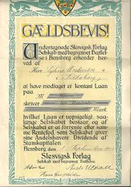

---


Principperne i gældsbrevsloven finder anvendelse både for gældsbreve og simple fordringer, jf. (Lovbekendtgørelse nr. 333 af 31. marts 2014 om gældsbreve; forkortet her ”GBL”).
**<a href="https://jura.tepedu.dk/lovsamling.html" target="_blank">klik her!</a>**

---

GBL indeholder ikke nogen direkte definition af begrebet **gældsbrev**. 

Gældsbrevslovens forarbejder henholder sig til den gængse juridiske forståelse, nemlig at der ved et gældsbrev forstås: 

**"En skriftlig erklæring, der hjemler en i hovedsagen, ubetinget, ensidig fordring på et bestemt pengebeløb"**. 

---

Eller udtrykt på en anden måde: 

Et gældsbrev er en skriftlig skylderklæring, hvor udstederen erkender, at der påhviler ham eller hende en ensidig ubetinget forpligtelse til at betale et bestemt pengebeløb.

Kravet om, at der skal foreligge en skriftlig erklæring, indebærer, at der skal foreligge et dokument. 

---

Det kræves endvidere, at erklæringen er dispositiv, hvilket indebærer, at der efter almindelige regler skal foreligge et løfte. 

For at være et gældsbrev skal erklæringen gå ud på at forpligte underskriveren. 

---

En betalingsanvisning, der alene indeholder en anmodning til tredjemand om at betale (og altså ikke går ud på at forpligte underskriveren selv) er ikke et gældsbrev. 

Som hovedregel må erklæringen være forsynet med udstederens (eller dennes fuldmægtigs) underskrift. 

---

Dette krav fraviges, hvor det er sædvanligt, at dokumentet ikke underskrives, f.eks. ved rente- og udbyttekuponer. 

I øvrigt kan underskriften være stemplet eller trykt.

---

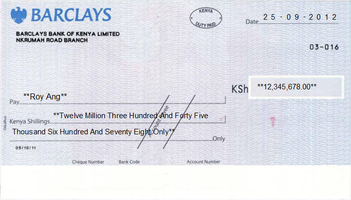

**"Checks og veksler"** er ikke omfattet af gældsbrevsbegrebet, dels fordi disse dokumenttyper er reguleret i deres egne love (Checklov: Lovbekendtgørelse nr. 558 af 25. august 1986 og Veksellov: Lovbekendtgørelse nr. 1661 af 12. december 2018), dels grundet deres særegne karakter.  

---  

Erklæringen på gældsbrevet skal være i hovedsagen **ubetinget**. 

Det er uden betydning, at forfaldstiden eller det beløb, der skal betales, til dels er afhængig af en fremtidig uvis begivenhed, når det dog til sin tid kan afgøres, hvilket beløb der skal betales.

Da erklæringen skal være selvstændig foreligger der dog ikke et gældsbrev, hvis der i et almindeligt brev findes en udtalelse, som isoleret set indeholder et løfte om betaling af en pengesum.

---

Kravet om, at erklæringen skal være ensidig, indebærer at f.eks. en købekontrakt ikke er et gældsbrev: 

Sælgers krav på købesummen er afhængig af ikke-misligholdelse fra sælgers side.

---


Ud fra tilsvarende synspunkter falder også "lejekontrakter" uden for begrebet.

---

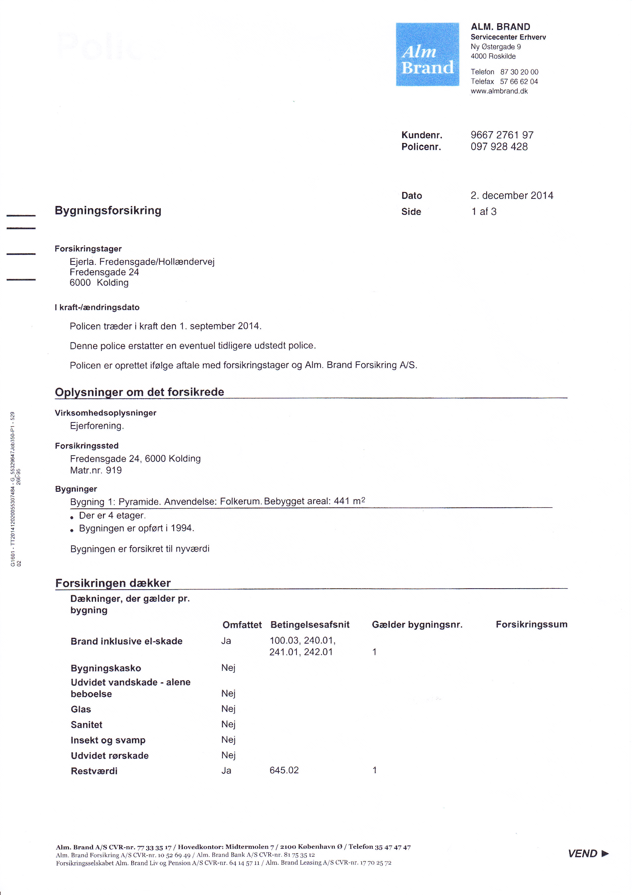

En "forsikringspolice" er ikke et gældsbrev, da sikredes krav er afhængig af sikredes opfyldelse af sine forpligtelser bl.a. præmiebetaling.

---

Erklæringen skal gå ud på at forpligte underskriveren til at betale et bestemt pengebeløb. 

Det er uden betydning, om beløbet er angivet i dansk eller fremmed valuta, eller begge dele, jf. GBL § 7, om det er bestemt efter guldværdi, jf. dommen i **U 1933.703 H**.
**<a href="https://pro.karnovgroup.dk/document/7000240384/1" target="_blank">Dommen klik her!</a>**

---

eller om det er pristalsreguleret.

Hvis flere landes møntenhed har samme betegnelse, f.eks. kroner, men gældsbrevet ved sin angivelse af skyldens størrelse ikke har bestemt, hvilket lands mønt, der er tænkt på, antages det, at der skal betales i betalingsstedets mønt, jf. dommen i **U 1962.294 H**.
**<a href="https://pro.karnovgroup.dk/document/7000217947/1" target="_blank">Dommen klik her!</a>**

---


Beløbet må dog ikke være helt ubestemt, hvorfor udbyttekuponer til aktier ikke er gældsbreve.

---

Vurderingen af, om et dokument er **"simpelt"** eller **"negotiabelt"** (omsætteligt), foretages uafhængigt af GBL § 1, jf. GBL § 11.

Ifølge GBL § 1 er det udgangspunktet, at den, der udsteder et gældsbrev, ikke derved mister indsigelser fra det retsforhold, der gav anledning til gældsbrevets udstedelse.

---

Når en person i anledning af et retsforhold mellem ham og en anden udsteder et gældsbrev, er det altså hovedreglen, at personen ikke påtager sig en forpligtelse, der er uafhængig af det pågældende retsforhold. 

Skyldneren bevarer dermed over for kreditor indsigelser om mangler, manglende levering eller ugyldighed mv. i det retsforhold, som gav anledning til gældsbrevets udstedelse. 

---

Skyldneren bevarer også den indsigelse, at skyldneren ikke har modtaget det lån, som skulle tilbagebetales med det beløb, som gældsbrevet lyder på. 

Alt i alt udtrykkes dette ofte på den måde, at gældsbrevet ikke er udtryk for en "novation" (afløsning af en gammel gæld gennem etablering af en ny) af skyldforholdet. 

---

Fra den nævnte hovedregel om, at der ikke indtræder novation (dvs. stiftelse af en ny fordring), må der ifølge ordlyden af GBL § 1 gøres undtagelse, hvis det er aftalt, at det retsforhold, der har givet anledning til gældsbrevets udstedelse, skal ophøre med at have nogen betydning og skal erstattes af retsforholdet ifølge gældsbrevet.

---

Udstederen kan miste indsigelser over for den, til hvem gældsbrevet er overdraget, jf. navnlig GBL §§ 15-17 om negotiable gældsbreve, hvorimod udstederen ifølge GBL § 1 ikke mister indsigelser over for den, til hvem gældsbrevet er udstedt. 

---

Det fordrer efteromstændighederne en afgørende stillingtagen til, om der er tale om en indsigelse over for en person, til hvem gældsbrevet er overdraget, eller om en indsigelse over for en person, til hvem gældsbrevet er udstedt. 

---

Spørgsmålet om der foreligger en overdragelsessituation eller en udstedelsessituation opstår navnlig, hvor der mellem en person, D, og en anden person, K1, består et retsforhold, og hvor D i anledning af retsforholdet udsteder et gældsbrev, men efter aftale med K1 ikke udsteder gældsbrevet til K1, men til en tredjemand, K2.

---

Selvom der i så fald formelt foreligger en overdragelsessituation, kan der reelt være tale om en udstedelsessituation, således at D ikke mister eventuelle indsigelser over for K2.

---

<h4><a href="https://www.youtube.com/embed/8ufuecp-wXA" target="_blank">Video Hvordan laver du et gældsbrev</a></h4>

---

<h4><a href="https://www.youtube.com/embed/J88adaVemVQ" target="_blank">Video Hvordan opretter du et gældsbrev online</a></h4>

---

<h4><a href="https://www.youtube.com/embed/PPqd-fYRCg0" target="_blank">Video Hvordan du laver en låneaftale</a></h4>

---

## Flere skyldnere hæfter solidarisk


Flere skyldnere hæfter solidarisk, hvis ikke andet er aftalt, jf. den deklaratoriske regel i GBL § 2:

1. Kreditor kan vælge at kræve hele gælden betalt af hver enkelt solidarisk skyldner.

2. Har en solidarisk skyldner betalt hele gælden til kreditor, har skyldneren regresret mod de øvrige skyldnere.

---

## Skyldnerens forpligtelser


---


*En skyldner (debitor) er forpligtet til at betale et bestemt beløb*:

**"I rette tid"** 

Forfaldstid, seneste betalingstidspunkt.
Frigørelsestid, tidligste betalingstidspunkt.
  
**"På rette sted"** 

Pengeskyld er bringeskyld, pengene skal være kommet frem til kreditor inden forfaldstid.
  
**"På rette måde"**

Betalingsmiddel – betalingskort, kontanter, bankoverførsel, sms afhængig af hvad der er aftalt.
  
**"Til rette kreditor"** – obs. på deponeringsloven.

---

Betaling med betalingskort eller andre betalingstjenester (netbank, mobiltelefon mm.) er reguleret i betalingsloven (BTL).

  
En betalingstransaktion med kort går gennem betalingsmodtagers bank og kortholders bank. 

---


```{r transaktion, echo=FALSE, result=TRUE,fig.height=3,fig.cap=("Transaktion, køber betaler sælger en cafe med dankort")}

nodes <- data.frame(id = 1:4, shape = c("box"),label  = c("betaler","udbyder\nkøbers bank","udbyder\nsælgers bank","betalingsmodtager\nsælger cafe"),font.size = c(25,25,25,25),level = c(2,1,1,2))
edges <- data.frame(from = c(1,2,3), 
                    to = c(2,3,4),
                    arrows = c("to"),
                    length = c(100,400,100),
                    font.size = c(20,20,20),
                    label=c("","Nets",""),
                    smooth = c(FALSE,FALSE,FALSE)
                    )
 visNetwork(nodes, edges, width = "100%") %>% 
   visInteraction(dragNodes = TRUE, 
                 dragView = TRUE, 
                 zoomView = FALSE) %>%
  visNodes(color = list(background = "white", 
                        border = "white",
                        highlight = "yellow"),
           shadow = list(enabled = TRUE, size = 30))  %>%
  visHierarchicalLayout(direction = "UD",levelSeparation = 200) %>%
visEdges(color = list(color = "lightgrey", highlight = "yellow") )
```

---


**Bliver kortet brugt uberettiget skelnes mellem:**

+	Kortholders træk uden dækning (kortet kan måske spærres og transaktionen kan evt. tilbageføres).
  
+	Kortmisbruget er begået af andre (tredjemand) end kortholder.

---

## Tredjemandsbrug af kortholders betalingskort


---

Kortmisbrug her er, hvor kortholder ikke selv har (mis-)brugt kortet.

---

**Betalerens eget misbrug** reguleres derimod af aftalen mellem udbyderen og betaler og af de almindelige erstatningsregler. 

Betaler kan i medfør af almindelige kontrakt- og erstatningsretlige regler således ifalde ansvar overfor sin udbyder, hvis betaler forsætligt eller ved grov uagtsomhed har medvirket til misbruget.  

---

Ej heller **"tredjemands (misbrugerens) ansvar"** er reguleret af betalingslovens regler, men af straffelovens regler i kap. 18 om forbrydelser vedrørende penge, jf. straffelovens §§ 166-170.
**<a href="https://jura.tepedu.dk/lovsamling.html">Lovsamlingen klik her!</a>**


Se fx dommen i **U 2003.432 V**, fængsel i 6 måneder for pengefalsk.
**<a href="https://pro.karnovgroup.dk/document/7000260384/1">Dommen klik her!</a>**

---

Dommen i **U 2003.251 Ø**, bedrageri med dankort for 139.500 kr. henført under straffelovens § 286, stk. 2.
**<a href="https://pro.karnovgroup.dk/document/7000259305/1">Dommen klik her!</a>**

---

"Tredjemandsbrug af kortholders betalingskort" er reguleret af betalingsloven (forkortet; ”BTL”).
**<a href="https://jura.tepedu.dk/lovsamling.html">Lovsamlingen klik her!</a>**


---


---

**HR:** Banken hæfter for misbruget og skal dække kortholders tab, jf. BTL § 99.

---

**U1:** Kortholder hæfter ubegrænset, hvis kortholder har handlet svigagtigt eller med vilje ikke overholdt kortreglerne fx omkring sikkerhed, jf. BTL § 100, stk. 2.

---
 
**U2:** Har kort og pinkode været brugt, hæfter kortholder for 375 kr., jf. BTL § 100, stk. 3.

---

**U3:** Kortholder kan hæfte for op til 8.000 kr., jf. BTL § 100, stk. 4, hvis kort og pinkode har været brugt og:

Kortet ikke er spærret med det samme (i nævnspraksis indenfor 1-1,5 timer efter man positiv er blevet opmærksom på, at man har mistet betalingskortet).

Kortholder selv har givet pinkoden til misbrugeren, og/eller

Kortholder ved groft uforsvarlig (nærmest sløseri) adfærd har gjort misbruget muligt, se

**Det Finansielle Ankenævn - Sagsnr.: 30/2019**: Tyveri af pung, der indeholdt Eurocard og pinkodehusker. Spørgsmål om udvidet hæftelse for misbrug begrundet i groft uforsvarlig adfærd: "... Det kan ikke lægges til grund, at klageren har udvist uagtsomhed i forbindelse med opbevaringen af kortet. På den baggrund finder Ankenævnet ikke, at den uberettigede anvendelse blev muliggjort ved groft uforsvarlig adfærd fra klagerens side, hvilket i givet fald ville forudsætte, at klageren havde udvist uagtsomhed såvel i forbindelse med kortets bortkomst som med hensyn til omgangen med koden, og at uagtsomheden var betydelig i hvert fald i den ene henseende. Ankenævnet finder herefter ikke, at sparekassen har godtgjort, at betingelserne for, at klageren hæfter for 8.000 kr. af misbruget som følge af groft uforsvarlig adfærd, jf. betalingslovens § 100, stk. 4 nr. 3, er opfyldt. Klagerens hæftelse for tabet udgør herefter højst 375 kr., jf. lov om betalinger § 100, stk. 3".

---

    
**U4:** Kortholder hæfter ubegrænset, jf. BTL § 100, stk. 5, hvis kort og pinkode er anvendt og:
  
Kortholder selv har oplyst koden til misbrugeren og

Kortholder burde have indset risikoen for misbrug, fx i en skilsmissesituation.

---

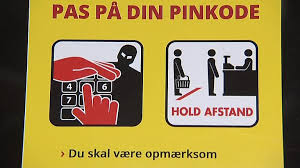
 
---

Efter kortet er spærret er banken ansvarlig for al misbrug af kortholders betalingskort.


```{r hæftelse, echo=FALSE}

mydf <- data.frame(
  S1 = c("Hæftelse i kr" ,"0", 
"0 kr.", 
"375,-kr.", 
"Højst 8000,- kr.", 
"Ubegrænset"
),
  S2 = c("Paragraf" ,
  "BL § 100, stk. 8",
"BL § 100, stk. 6",
"BL § 100, stk. 3",
"BL § 100, stk. 4",
"BL § 100, stk. 5"),
  S3 = c("Hændelse",
         "Misbrug efter kortet er spærret. ",
         "Misbrug hvor kortet og 
          pinkoden er brugt. ",
         "Hæftelse hvis kortet og 
      den pinkoden er brugt. Kunden har som minimum har handlet simpelt uagtsomt. ",
         "Misbrug af kortet, hvor pinkoden har været anvendt samt et af følgende:<br>1. Kunden har ikke oplyst at kortet er mistet<br>
          2. Kunden selv har givet en anden kortet<br>
          3. Kunden har udvist en grov uforsvarlig adfærd",
         "Misbrug af kort og pinkode, og kunden selv har udleveret kort og pinkode til misbrugeren samt at kunden burde have indset at. der var risiko for misbrug."),
  S4 = c("Eksempel",
         "En kvinde har tabt sit kort og 
          spærret dette, så snart hun opdagede tabet.<br>Efter kortet blev 
          spærret blev kortet brugt til 
          køb på internettet.",
          "En kortholder har mistet sit kort
          og pinkode, og der er 
          intet at bebrejde kortholder i 
          forbindelse med tab og misbrug",
         "En fortravlet mand har glemt sit dankort 
          i en hæveautomat, inden kortet 
          bliver spærret bliver det 
          brugt til betaling i en forretning med den 
          rigtige pinkode. ",
         "En cafegæst får stjålet sin pung med både kort og pinkode, fra sin efterladte taske, under toiletbesøg. Kortet misbruges til hævninger og køb for i alt 25.000,- kr.",
         "En pige låner en ven sit kort og pinkode, til trods for denne tidligere har misbrugt kort. Han fester på barer og diskoteker for 38.000,- kr.")
)
names(mydf) <- NULL

mydf %>%
  kable("html", escape = FALSE, caption = "Hæftelse ved kortmisbrug") %>%
  kable_styling(full_width = T,font_size = 10,bootstrap_options = c("responsive","bordered","striped")) %>%
  column_spec(1, bold = T, border_right = T, color = "black", background = "lightgrey") %>%
  column_spec(2, bold = T, border_right = T, color = "black", background = "lightgrey") %>%
  column_spec(3, bold = T, border_right = T, color = "black", background = "lightgrey") %>%
  column_spec(4, bold = T, border_right = T, color = "black", background = "lightgrey") %>%
  row_spec(1,italic = T,bold = T,font_size = 12,color = "white", background = "darkgrey")
  # row_spec(1,italic = T,bold = T,font_size = 12)
  # column_spec(0, angle = -45)%>%
  # scroll_box(width = "500px") %>%
  # footnote(general = "Databeskyttelsesforordningen",general_title = "Kilde:")
```

---

## Eksamensopgave 1

**Om tredjemandsmisbrug af kortholderes betalingsmiddel**


Klokken er 9.31 mandag d. 5. februar 2018, da Andreas Andersen ringer til privatrådgiver Lærke Jensens kontor i Sparekassen Pecunia. 

Han får hurtigt forklaret, at grunden til, at han har ringet er, at han har mistet sit Visa/dankort og at han gerne vil have kortet spærret. 

Lærke spærrer straks kortet og sammen gennemgår de de seneste hævninger på kontoen og finder hurtigt ud af, at der er fem hævninger, Andreas ikke kender til. 

Søndag d. 4. februar 2018 kl. 02.32 – 2.000 kr. i andet pengeinstituts hæveautomat.

Søndag d. 4. februar 2018 kl. 02.44 – 5.000 kr. i Sparekassen Pecunias hæveautomat.

Søndag d. 4. februar 2018 kl. 02.46 – 3.500 kr. i Sparekassen Pecunias hæveautomat.

Søndag d. 4. februar 2018 kl. 03.01 – 732 kr. Restaurant Festaben – varekøb.

Søndag d. 4. februar 2018 kl. 05.32 – 418 kr. Restaurant Morgengry – varekøb.

Andreas forklarer, at han mandag morgen ca. kl. 8.45, da han sad i toget på vej på arbejde, fandt ud af, at hans pung var blevet væk. I hans pung var bl.a. hans Visa/Dankort og en seddel med pinkoden. 

Pinkoden, 4567, stod bag på en bon og var kamufleret som en del af et telefonnummer: Pia Kjellerup – 30 45 67 87. 

Pungen var i hans jakke som han havde glemt på et bord, da han ca. kl. 01.00 forlod semesterstartsfesten på sit studie. 

Banken kan dokumentere, at pin-koden er brugt ved alle hævninger. 

Andreas kan dokumentere, at han på hævningstidpunkteterne var sammen med en af sine kvindelige medstuderende hjemme hos hende. 


**Eksamensspørgsmålet:**

1. Giv en begrundet redegørelse for, hvordan tabet skal fordeles mellem Andreas og Sparekassen Pecunia (20%).

---

**Podcast om svaret på eksamensopgaven**

---

Om uagtsomhed ved brugen af "Nemid":

Se dommen i **U 2019.2593 V**. Kvinde hæftede på grund af uagtsomhed for lån optaget af en anden ved misbrug af kvindens NemID.
**<a href="https://pro.karnovgroup.dk/document/7000838249/1">Dommen klik her!</a>**

---

**Quiz om betalingskort** 


**<a href="https://www.forbrug.dk/quiz/betalingskort/?rn=43716" target="_blank">Test din viden i forbrug.dk’s quiz om betalingskort. Klik her!</a>**  

---


---


## Forskellige typer af pengekrav og fordringer  

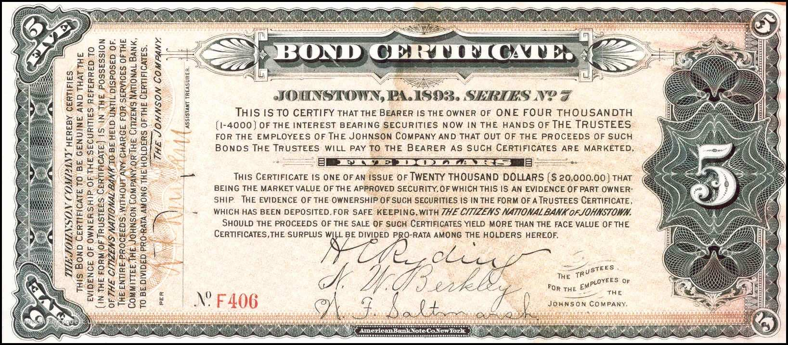

---

**Alle pengekrav og fordringer kan deles op i 5 slags:**


*  Simple fordringer.

*  Simple gældsbreve.

*  Omsætningsgældsbreve.

*  Tinglyste negotiable pantebreve.

*  Tinglyste simple pantebreve.

---

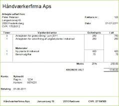

**Simple fordringer** er almindeligt pengekrav, hvor der ikke er lavet et gældsbrev, fx **fakturakrav** (regninger) eller en kassekredit.

---


**Simple gældsbreve** er gældsbreve, som ikke er omsætningsgældsbreve, jf. GBL §26, jf. GBL § 11, stk. 2, fx lånedokumenter (familielån og banklån).

---
 
**Omsætningsgældsbreve**, er gældsbreve som beskrevet i GBL § 11, stk. 2, fx hvis det tydeligt fremgår, at det er et omsætningsgældsbrev, fx **Tinglyste negotiable pantebreve** – typisk pantebreve med pant i fast ejendom såsom et **ejerpantebrev**.

---

**Eksempel:**

Hansen har en stor friværdi i sit hus. Han vil gerne bruge pengene til køb af et sommerhus. Han udsteder derfor et ejerpantebrev, som han pantsætter til sin lokale bank. 

Da der er tale om et ejerpantebrev, som er et omsætningsgældsbrev, skal det først tinglyses, og dernæst skal banken have det udleveret. Sikringsakten er effektiv rådighedsberøvelse.

---

**Ejerpantebrevs-dokument:**


---


**Tinglyste simple pantebreve** – typisk pantebrev med pant i andet end fast ejendom, fx solfangeranlæg.

  
---

```{r network14, echo=FALSE, result=TRUE,fig.cap=("Typer af pengekrav og fordringer")}


nodes <- data.frame(id = 1:7, 
                    level = c(1,2,2,3,3,3,3),
                    shape = c(rep("box",7)), 
                    label = c("gældsbrev?\n er det underskrevet, ensidig,\nubetinget, skyldnererklæring",
                              "pantebrev?\ngælden er sikret ved pant i et aktiv",
                              "simpel fordring",
                              "omsætningsgældsbrev\n en af de 4 kategorier\nfra GBL §11 stk. 2",
                              "simpelt gældsbrev\n ikke en af de 4 kategorier\nfra GBL §11 stk. 2",
                              "simpelt pantebrev\npant i andet end\nfast ejendom",
                              "negotiabelt pantebrev\npant i fast ejendom"
                              ),
                    font.size = c(rep(8,7)))
          edges <- data.frame(from = c(1,1,2,2,2,2),
                              to = c(2,3,4,5,6,7),
                              label = c("ja","nej","nej","nej","ja","ja"),
                              # arrows = c(""),
                              # length = rep(10,6),
                              color = list(color = "lightgrey", highlight = "yellow"),
                              font.size = c(rep(8,6))
                              
                              )

visNetwork(nodes, edges, height = "500px", width = "100%",avoidOverlap=2) %>% 
     visInteraction(dragNodes = TRUE, 
                 dragView = TRUE, 
                 zoomView = FALSE) %>%
  visNodes(color = list(background = "white", 
                        border = "white",
                        highlight = "yellow"),
           shadow = list(enabled = TRUE, size = 30))  %>%
  visHierarchicalLayout(direction = "UD",levelSeparation = 100) %>%
  visLayout(hierarchical = TRUE)

```


---

## Reguleringen af simple gældsbreve og simple fordringer  


Dette afsnit beskriver nærmere reguleringen af simple gældsbreve og simple fordringer.

Afsnittet indeholder:   

* Lovgrundlag.

* Sikringsakt.

* Legitimationsvirkning.

* Udlæg i borttransporterede fordringer, factoring.

* Udlæg i Dankort-betalinger.

* Udlæg i bankindeståender.

* Sikring af et udlæg i bankindeståender.

* Slutafregning.

* Legitimationsvirkning ved udlæg i bankindeståender. 

---

Lovgrundlag:

Alle gældsbreve og fordringer, hvad enten de er skriftlige eller mundtlige, er omfattet af gældsbrevslovens kapitel 3 om simple fordringer.

Dette gælder dog ikke for:  

* de gældsbreve og fordringer, der er nævnt i GBL § 11, stk. 2.

* digitale pantebreve efter tinglysningslovens regler.

* fondsaktiver. 

---

### Sikringsakten ved simple gældsbreve og simple fordringer?


**Begrebet "sikringsakt":**

Sikringsakten er den handling (akt), man skal foretage, for at ens pant er retsbeskyttet over for kreditorer eller aftaleerhververe. 

Sikringsakten kan være, at man skal give meddelelse (denunciere), jf. Gbl. § 31, eller sørge for tinglysning eller anden registrering eller foretage rådighedsberøvelse.

---

**"Denunciation":** Betyder **underretning - meddelelse**. Er i nogle tilfælde en betingelse for at sikre sin ret efter en aftale overfor den anden parts kreditorer.

---


Når man foretager udlæg i simple gældsbreve eller simple fordringer, er der som udgangspunkt intet krav om, at man foretager en sikringsakt. 

Den, der foretager udlægget, er sikret både over for skyldnerens øvrige kreditorer og godtroende aftaleerhververe fra udlæggets foretagelse. Se RPL § 526, stk. 1 og 2.

---

I modsætning til tidligere skal der dog nu foretages en sikringsakt ved udlæg i ikke-negotiable tinglyste digitale pantebreve, nemlig tinglysning af udlægget. 

Ved overdragelse af ikke-negotiable tinglyste digitale pantebreve er sikringsakten tinglysning ligesom ved de øvrige pantebreve. Se fx TL § 47, stk. 6, hvad angår løsørepantebreve.

---

Hvis der foretages udlæg i et papirbaseret pantebrev, skal fogeden tage dette med og sende pantebrevet til tinglysningskontoret i forbindelse med tinglysning af udlægget. 

Se § 15, stk. 3 i lov nr. 539 af 8. juni 2006, som er ændret ved § 2 i lov nr. 504 af 12. juni 2009, hvoraf fremgår, at pantebrevet ved tinglysningen skal konverteres til et digitalt pantebrev.

---

Hvis det simple gældsbrev eller den simple fordring er knyttet til et dokument, bør fogeden tage dokumentet i forvaring. Se RPL § 523, stk. 2. 

Dette er ikke for at iagttage en sikringsakt, men derimod af hensyn til legitimationsvirkningen hvor fratagelse af rådigheden kan få betydning. Se RPL § 524.

---

### Sikringsakt ved overdragelse af simpelt gældsbrev eller simpel fordring, herunder sekundære udlæg


Den, der får overdraget et simpelt gældsbrev eller en simpel fordring til eje eller pant, skal derimod foretage en sikringsakt for at være beskyttet mod overdragerens retsforfølgende kreditorer.

Sikringsakten består i, at fordringsskyldneren får besked om overdragelsen fra overdrageren eller erhververen. Se GBL § 31, stk. 1.  

 
---

### Dobbeltoverdragelse af fordringen

```{r ,echo=FALSE,fig.height=2, result=TRUE,fig.cap=("Dobbeltoverdragelse")}


nodes <- data.frame(id = 1:3, 
                    shape = c("box"), 
                    label = c(" A "," B "," C "),
                    font.size = c(25,25,25))
edges <- data.frame(from = c(1,1), to = c(2,3),arrows = c("to"),length = rep(40,2))

visNetwork(nodes, fig.width=4,edges,  width = "100%") %>% 
  visInteraction(dragNodes = TRUE, 
                 dragView = TRUE, 
                 zoomView = FALSE) %>%
  visNodes(color = list(background = "white", 
                        border = "white",
                        highlight = "yellow"),
           shadow = list(enabled = TRUE, size = 30))  %>%
  visHierarchicalLayout(direction = "LR",levelSeparation = 300) %>%
visEdges(color = list(color = "lightgrey", highlight = "yellow") )
  # visLayout(randomSeed = 24) # to have always the same network

```

I tilfælde af at en fordring bliver overdraget flere gange af A, er den erhverver, der først meddeler fordringsskyldneren (D) om overdragelsen af fordringen, sikret retten til fordringen. 

Det er under forudsætning af, at erhververen var i "god tro" om, at der ikke var andre rettighedshavere ved underretningen til fordringsskyldneren. Se GBL § 31, stk. 2. 

---

Dette gælder, selvom erhververen først fik overdraget fordringen efter, at en anden havde erhvervet fordringen.

Ved overdragelse af simple gældsbreve eller simple fordringer får erhververen ikke bedre ret end overdrageren, hverken over for gældsbrevets eller fordringens skyldner eller over for en tidligere indehaver af fordringen. Se GBL § 27. 

---

En overdragelse kan derfor ikke føre til, at skyldneren mister sine indsigelser. 

De indsigelser, skyldneren havde mod overdrageren, kan han også gøre gældende mod erhververen, selv om erhververen var i god tro. 

Det gælder også, når der er foretaget udlæg i fordringen. Se GBL § 27.  

---

### Legitimationsvirkning  

Skyldneren frigøres uanset overdragelsen af det simple gældsbrev eller den simple fordring ved betaling til overdrageren. 

Det gælder dog ikke, hvis skyldneren vidste, at overdrageren ikke længere havde ret til at modtage betalingen, eller hvis skyldneren ikke har udvist den agtpågivenhed, som forholdene krævede. Se GBL § 29.

---

### Udlæg i borttransporterede fordringer – factoring     

Som et led i finansieringen af en virksomheds drift sker der ofte belåning af debitorerne (den såkaldte **"factoring"-ordning**). 

Ordningen indebærer, at fakturaerne forsynes med en transportpåtegning om, at betaling med frigørende virkning kun kan ske til transporthaveren. 

---

**Ordningen kan etableres med fx:**  

* et factoring-firma.

* virksomhedens sædvanlige pengeinstitut.

* et søster- eller datterselskab (såkaldt intern factoring).

---
  
Som betingelse for at virksomhedens kreditorer skal respektere fakturabelåningen, kræves det, at hver enkelt faktura til kunderne er forsynet med en tekst (eventuelt et stempel), der klart angiver, at fordringen er borttransporteret. Se GBL § 31, stk. 1.

---

En ordning om at belåne fakturaer medfører normalt ikke, at pantefogeden er afskåret fra at foretage udlæg i allerede udførte, men endnu ikke fakturerede arbejder eller leverancer.

---

<h4><a href="https://www.youtube.com/embed/zNxALT0w14U" target="_blank">Video Hvad er factoring</a></h4>

---

**Specielt om udlæg i dankort-betalinger:**

Udlæg kan foretages i dankort-betalinger. Se dommen i **U 2000.715 Ø**, hvor en pantefoged havde foretaget udlæg for et skattekrav hos en forretningsindehaver.
**<a href="https://pro.karnovgroup.dk/document/7000196241/1">Dommen klik her!</a>**

---

**Specielt om udlæg i bankindeståender:**

Der er intet til hinder for, at der foretages udlæg i bankindeståender, fordi disse kan betragtes som skyldnerens simple fordringer mod et pengeinstitut. 

Hvis udlægsforretningen foretages hos pengeinstituttet, så indeståendet straks udbetales, er der dog tale om udlæg i penge og ikke i fordringer. Se RPL § 521.

---

## Reguleringen af omsætningsgældsbreve

Omsætningsgældsbreve kaldes også for **"negotiable gældsbreve"**. 

Hvis et gældsbrev ikke er et omsætningsgældsbrev, er det et simpelt gældsbrev. 

---

I forbindelse med indførelsen af reglerne om digital tinglysning blev der i tinglysningsloven indsat regler om omsætningsgældsbreve. 

---

Der findes herefter regler om omsætningsgældsbreve to steder i lovgivningen.  

**Reglerne om omsætningsgældsbreve står herefter i følgende to love:**  

**A) Gældsbrevsloven (GBL), hvor det i GBL § 11, stk. 2, fastslås, hvad der er omsætningsgældsbreve:**

*1*.	Gældsbreve, der lyder på betaling til ihændehaveren eller som ikke angiver, hvem gælden skal betales til (ihændehavergældsbreve).

*2*.	Gældsbreve, der lyder på betaling til en bestemt person eller ordre (ordregældsbreve).

*3*.	Gældsbreve, der giver pant i registreret skib eller luftfartøj, medmindre der i gældsbrevet er indføjet ordene »ikke til ordre« eller tilsvarende forbehold.

*4*. Gældsbreve, der lyder på betaling til en bestemt person (navnegældsbreve), når de tydeligt angiver, at de skal være omsætningsgældsbreve.

---

**B) Tinglysningsloven (TL), hvor der står, at:**  

*1*. Et tinglyst pantebrev, bortset fra et skadesløsbrev, der giver pant i fast ejendom, er negotiabelt, medmindre der i pantebrevet er indføjet ordene »ikke til ordre« eller tilsvarende forbehold, jf. TL § 27, stk. 2.

*2*. Et tinglyst pantebrev, herunder et ejerpantebrev, der giver pant i motorkøretøjer er ikke negotiabelt, medmindre dette klart fremgår af pantebrevet, jf. TL § 42c. Skadesløsbreve er ikke negotiable pantebreve, jf. TL § 42g, stk. 3, 2. og 3. pkt.  

*3*. Et tinglyst pantebrev, herunder et ejerpantebrev, der giver pant i andele i andelsboligforeninger som nævnt i TL § 42i, er ikke negotiabelt, medmindre dette klart fremgår af pantebrevet. 

Skadesløsbreve er ikke negotiable pantebreve: Se TL § 42m, stk. 2, 2. og 3. pkt.  

*4*. Et tinglyst pantebrev, herunder et ejerpantebrev, der giver pant i løsøre, er ikke negotiabelt, medmindre dette klart fremgår af pantebrevet. 

Skadesløsbreve er ikke negotiable pantebreve: Se TL § 47, stk. 7, 2. og 3. pkt.  

---

**Bemærk her** 


Hvis et gældsbrev ikke falder ind under definitionen i henholdsvis GBL eller TL, og det klart fremgår af gældsbrevet, at det ikke skal være negotiabelt, er det som nævnt et simpelt gældsbrev: 

Se GBL § 11, stk. 2 og TL § 27, stk. 2, § 42g, stk. 3, 2. og 3. pkt., § 42m, stk. 2, 2. og 3. pkt. og § 47, stk. 7, 2. og 3. pkt.  

---

<h4><a href="https://www.youtube.com/embed/4SY6YPbY2YY" target="_blank">Video 1 Om gældsbrevsloven</a></h4>

---

<h4><a href="https://www.youtube.com/embed/uODiLMSn3kg" target="_blank">Video 2 Om gældsbrevsloven</a></h4>

---

<h4><a href="https://www.youtube.com/embed/nC3Sy7tBCaY" target="_blank">Video 3 Om gældsbrevsloven</a></h4>


---

### Tinglysning af simple (ikke-negotiable) pantebreve  

Et simpelt (ikke-negotiabelt) pantebrev skal dog også tinglyses digitalt for at opnå omsætningsbeskyttelse. 

Se fx TL § 47, stk. 6, hvad angår "løsørepantebreve", der som udgangspunkt er ikke-negotiable fx. en bil eller maskine. 

---

Gældsbrevslovens kapitel 3, bortset fra § 31, bruges også på tinglyste digitale ikke-negotiable (simple) pantebreve: Se GBL § 26, stk. 2.

Gældsbrevslovens kapitel 2 gælder ikke (længere) for tinglyste digitale pantebreve: Se GBL § 11, stk. 3. 

---

Det betyder dog ikke, at den hidtidige retstilstand er brudt, da reglerne i GBL §§ 15-17 om ekstinktion (en rettigheds ophør, ved at den fortrænges af en senere rettighed) af indsigelser finder direkte anvendelse: Se TL § 27a. 

Reglerne om ekstinktion af rettigheder er også uforandret overført til tinglysningsloven: Se TL § 27b. 

---

Reglerne er dog rettet til, fordi sikringsakten nu sker ved tinglysning i modsætning til tidligere, hvor sikringsakten skete ved rådighedsberøvelse. Se nedenfor.

---

### Sikringsakten ved de forskellige omsætningsgældsbreve

Når man foretager udlæg i omsætningsgældsbreve, er sikringsakten forskellig, afhængig af hvilken type omsætningsgældsbrev der er tale om. 

Nedenstående afsnit er derfor opdelt så sikringsakten for omsætningsgældsbreve, der ikke er pantebreve, beskrives først, og herefter beskrives sikringsakten ved udlæg i negotiable pantebreve. 

---

Sikringsakt ved udlæg i omsætningsgældsbreve, der ikke også er pantebreve.

---

En aftaleerhververs ret til et omsætningsgældsbrev kan ikke anfægtes af andre, hvis aftaleerhververen har fået gældsbrevet i hænde og er i god tro om overdragerens ret. Se GBL § 14.  

Sikringsakten over for aftaleerhververe er derfor rådighedsberøvelse, hvad angår disse gældsbreve. 

---

Det vil sige, at man ved udlæg i disse omsætningsgældsbreve efter RPL § 523, stk. 2, altid skal tage gældsbrevet i forvaring.  

Et udlæg i fordringer, herunder omsætningsgældsbreve, er beskyttet over for andre retsforfølgende kreditorer straks fra dets foretagelse. 

Udlægshaver skal derfor ikke foretage nogen særlig sikringsakt i forhold til andre kreditorer. Se RPL § 526, stk. 1 og 2.  

---

### Sikringsakt ved udlæg i negotiable pantebreve:  

Efter den digitale tinglysning er indført, skal stiftelse og ændring af rettigheder over alle pantebreve, der tinglyses digitalt, ske ved tinglysning. 

Derfor skal pantebreve, der vedrører fast ejendom, biler, andelsboliger og løsøre tinglyses, hvis man vil sikre sig de rettigheder, der knytter sig til pantebrevet. 

Se TL § 1, TL § 42j, stk. 7, (andelsboligbogen), TL § 42d, stk. 7, (bilbogen) og TL § 47, stk. 6 (løsøre).  

---

Når man foretager **"udlæg i tinglyste digitale pantebreve"**, skal udlægget derfor tinglyses for at opnå beskyttelse mod aftaler om pantebrevet og mod retsforfølgning. 

Se TL § 1 (fast ejendom), TL § 42j, stk. 7 (andelsboligbogen), TL § 42d, stk. 7 (bilbogen) og TL § 47, stk. 6 (løsøre). Det gælder derfor også de digitale pantebreve, der er negotiable.  
 
---

Hvis man foretager **"udlæg i et papirbaseret pantebrev"**, skal fogeden tage dette med og sende pantebrevet til tinglysningskontoret i forbindelse med tinglysning af udlægget. 

Se § 15, stk. 3 i lov nr. 539 af 8. juni 2006, som ændret ved § 2 i lov nr. 504 af 12. juni 2009, hvoraf fremgår, at pantebrevet ved tinglysningen skal konverteres til et digitalt pantebrev. 

---

Hvad angår de tinglyste digitale pantebreve, kan en aftaleerhververs ret til et pantebrev ikke anfægtes af andre, hvis aftaleerhververen har fået tinglyst sin ret og er i god tro om overdragerens ret. Se TL § 27 b. 

Dette gælder også bilbogen (TL § 42g stk. 3, 1. pkt.), andelsboligbogen (TL § 42m, stk. 2, 1. pkt.) og personbogen (TL § 47, stk. 7, 1. pkt.).  

---

"Legitimationsvirkning", hvornår er man over for omverdenen angivet som berettiget til at gøre fordringen gældende?

Den, der på lovlig vis har fået omsætningsgældsbrevet i hænde, har ret til at gøre fordringen gældende. Se GBL § 13.  

---

For tinglyste digitale pantebreve er den, der er berettiget ifølge tingbogen, legitimeret til at gøre fordringen gældende. Se TL § 27a, stk. 1. 

---

Tilsvarende gælder for bilbogen (TL § 42g, stk. 3, 1. pkt., jf. TL § 27a, stk. 1), andelsboligbogen (TL § 42m, stk. 2, 1. pkt, jf. TL § 27a, stk.1) og personbogen (TL § 47, stk. 7, 1. pkt., jf. TL § 27a, stk. 1).  


Reglen om overdragelse af omsætningsgældsbreve og reglen om legitimationen over for skyldner bygger på GBL § 13. Se også GBL § 14 og 19. 

---

Når skyldneren betaler til den, der er legitimeret efter GBL § 13, frigøres skyldneren, såfremt skyldneren er i god tro. Se GBL § 19. 

Betalingen har frigørende virkning, selv om ihændehaverens inkompetence skyldes, at denne ikke har erhvervet ret til omsætningsgældsbrevet, eller at det var overdraget eller gjort til genstand for udlæg. 

Legitimationen omfatter også andre dispositioner end betaling, fx meddelelse af henstand eller ændring af betalingsvilkårene. 

---


Hvad angår **"tinglyste digitale pantebreve"** er reglerne de samme, dog med den forskel, at der ikke er krav om, at man har pantebrevet i hånden, men derimod, at man har tinglyst det. Se TL § 27b. 

Samme bestemmelse gælder også "bilbogen" (TL § 42g, stk. 3, 1. pkt.), **"andelsboligbogen"** (TL § 42m, stk. 2, 1. pkt.) og personbogen (TL § 47, stk. 7, 1. pkt.). 

---

For at udlægshaver kan blive legitimeret over for gældsbrevsdebitor, skal han derfor have gældsbrevet i hænde og for de tinglyste digitale pantebreves vedkommende have tinglyst sin ret. 

Se RPL § 523, stk. 2 og TL § 27a. Reglen gælder også bilbogen, andelsboligbogen og personbogen.  

---


Hvis et omsætningsgældsbrev er overdraget, men skyldneren har betalt forfaldne renter eller forfaldne, tidsfæstede afdrag til overdrageren, kan skyldneren gøre dette gældende over for en senere erhverver af omsætningsgældsbrevet. 

Se GBL § 16. 

Samme regel gælder for de tinglyste digitale pantebreve. Se TL § 27a, stk. 2, 1. pkt. 

---

Udstederen af et gældsbrev bevarer også sine indsigelser om, at gældsbrevet er udstedt under tvang, ved forfalskning m.v., og om at gældsbrevet er ophørt ved forældelse m.v. Se GBL § 17 og TL § 27a, stk. 2, 2. pkt. 

Bestemmelserne gælder også bilbogen, andelsboligbogen og personbogen.  

---

Hvis et omsætningsgældsbrev er overdraget, kan skyldneren med frigørende virkning betale forfaldne renter og forfaldne, tidsfæstede afdrag til overdrageren, medmindre skyldneren vidste, at denne ikke længere havde ret til at modtage betaling eller havde grund til mistanke derom. Se GBL § 20. 

En tilsvarende regel gælder for de tinglyste digitale pantebreve. Se TL § 29, stk. 2. 

---

Legitimationsvirkningen indtræder derfor, når udlægshaver meddeler gældsbrevsdebitor, at betaling med frigørende virkning kun kan ske til udlægshaveren. 

Udlæg i omsætningsgældsbreve skal derfor altid meddeles over for gældsbrevsdebitor. 

Dette gælder også for udlæg i de tinglyste digitale pantebreve. 

---

Debitor skal anmodes om kvittering for, at debitor har modtaget underretningen.  

Gældsbrevsdebitor bliver ved betaling til udlægshaver frigjort under samme betingelser som ved betaling efter overdragelse af et gældsbrev. Se RPL § 524.  

---

### Oversigt over sikringsakter på fordringer, omsætningsgældsbreve og pantebreve

**Hvad er en sikringsakt?**

En sikringsakt er den handling der skal til, for at man opnår sikkerhed mod rettigheder, der er stiftet efter ens rettigheder. 

Handlingen skal altså til for, at man ikke mister sin ret til det aktiv, som fx fogedretten efter anmodning har foretage udlæg i.

---

Det er typen af aktiv, der er afgørende for hvilken sikringsakt, der skal foretages. Hvis der f.eks. er tale om udlæg i livsforsikringspoler, skal der ske påtegning på policen.

---

**Sikringsakt foretages således for at sikre erhververen mod overdragerens aftaleerhververe og kreditorer:**

* Simple fordringer – sikringsakten for overdragelse er "denunciation" (meddelelse).

* Omsætningsgældsbreve – sikringsakten for overdragelse er "rådighedsberøvelse".

* Pantebreve – sikringsakten for overdragelse er "tinglysning".

---

## Overdragelse af fordringer

**Som studerende skal du være særlig opmærksom på følgende problemstillinger ved gennemgangen af fordringers overdragelse:**


Fortabelse af indsigelser og rettigheder, GBL § 27 (simple).

Prioritetskonflikt simple gældsbreve, GBL § 31. 

Legitimation. 

Omsætningsbeskyttelse.

Begreberne vindikation og ekstinktion skal anvendes.


---

```{r fordring1,echo=FALSE, result=TRUE, fig.cap=("Skyldner, kreditor og senere erhverver eller erhververe")}


nodes <- data.frame(id = 1:4, 
                    shape = c("box"), 
                    level = c(1,2,3,4),
                    label = c("Debitor\nSkyldner","Kreditor\nOverdrager","Erhverver","Erhverver"),
                    font.size = c(15,15,15,15))
edges <- data.frame(from = c(1,2,3), to = c(2,3,4),
                    arrows = c("to"),
                    label = c("Kreditor har en fordring på debitor","Kreditor overdrager til erhverver 1","Erhverver 1 overdrager til erhverver 2"),
                    
                    shadow = TRUE)

  visNetwork(nodes, edges, width = "100%") %>% 
   visInteraction(dragNodes = TRUE, 
                 dragView = TRUE, 
                 zoomView = FALSE) %>%
  visNodes(color = list(background = "white", 
                        border = "white",
                        highlight = "yellow"),
           shadow = list(enabled = TRUE, size = 30))  %>%
      visHierarchicalLayout(direction = "UD",levelSeparation = 100)  %>%
      visLayout(randomSeed = 24) %>%
  visEdges(color = list(color = "lightgrey", highlight = "yellow"))

```

---

**"Vindikation"** er tilbagesøgning af ting, som en anden uretmæssigt besidder - fx udlevering til ejermanden af en stjålen cykel. Kan ske, selv om besidderen har købt tingen i god tro.

---

Se Højesteretsdommen i **U 1976.674/2 H**. Autohandler, som havde overladt til anden autohandler at forevise en bil for en evt. køber, kunne efter den anden forhandlers salg af bilen vindicere bilen fra køberen.
**<a href="https://pro.karnovgroup.dk/document/7000209935/1" target="_blank">Dommen klik her!</a>**

---

Modsat er **"ekstinktion"** som er	udtryk for, at den godtroende omsætningserhverver vinder ret - modsat vindikation.

---

**Lidt andre begreber, som vi jurister arbejder med:**

**"Cedent":**	Overdrager af en fordring.

**"Cession":**	Overdragelse af en fordring.

**"Cessionar":**	Erhverver af en fordring.

**"Cessus":**	Skyldneren i fordring, der bliver overdraget.

---

**Bemærk her**


I relation til retsplejelovens regler er en fordring et krav på betaling af en pengeydelse.

En lang række af fordringer er baseret på dokumenter i form af pantebreve, fakturaer og kontrakter mv., mens andre krav ikke foreligger i skriftlig form. 

---

Fælles for alle fordringer er, at de indeholder et krav om, at debitor skal betale eller give en ting/ydelse. 

Der er ikke i lovgivningen stillet formkrav til fordringer.

---

Efter RPL § 508 skal en fordring kunne identificeres, for at man kan foretage udlæg i den. 

Det betyder kun, at der er et krav om, at man kan bevise, at fordringen eksisterer, men ikke at den fx foreligger i skriftlig form mv.


---

<h4><a href="https://www.youtube.com/embed/NqakMVHBPw4" target="_blank">Video Overdragelse af fordringer</a></h4>

---


### Skyldners indsigelser over for den oprindelige kreditor

Lovbekendtgørelse nr. 333 af 31. marts 2014 om gældsbreve  

```{r fordring2,echo=FALSE, result=TRUE, fig.cap=("indsigelse over gældsforhold")}
nodes <- data.frame(id = 1:2, 
                    shape = c("box"), 
                    level = c(1,2),
                    label = c("debitor/\nskyldner","kreditor/\nsælger"),
                    font.size = c(15,15))
edges <- data.frame(from = c(1), to = c(2),
                    arrows = c("to"),
                    label = c("debitor har en indsigelse overfor kreditor"),
                    
                    shadow = TRUE)

visNetwork(nodes, edges, width = "100%") %>% 
   visInteraction(dragNodes = TRUE, 
                 dragView = TRUE, 
                 zoomView = FALSE) %>%
  visNodes(color = list(background = "white", 
                        border = "white",
                        highlight = "yellow"),
           shadow = list(enabled = TRUE, size = 30))  %>%
      visHierarchicalLayout(direction = "UD",levelSeparation = 100)  %>%
      visLayout(randomSeed = 24) %>%
  visEdges(color = list(color = "lightgrey", highlight = "yellow"))
```


---

Skyldner kan gøre alle indsigelser gældende overfor oprindelig kreditor, jf. GBL § 1, samt fx efter aftaleloven og købeloven.

Skyldneren bevarer dermed over for kreditor indsigelser om mangler, manglende levering eller ugyldighed mv. i det retsforhold, som gav anledning til gældsbrevets udstedelse. 

Skyldneren bevarer også den indsigelse, at han eller hun ikke har modtaget det lån, som skulle tilbagebetales med det beløb, som gældsbrevet lyder på.  

---

**Fx følgende indsigelser over for kreditor bevares:**

* Indsigelse efter aftaleloven – ugyldighedsgrunde, fx svig.

* Indsigelse om mangler efter købeloven, jf. KBL §§ 76 og 75a.

---

Det har ikke betydning om kravet er en simpel fordring, et gældsbrev eller et pantebrev

Skyldnerens indsigelsen over for kreditor kan betyde, at skyldner skal betale mindre end der står i gældsbrevet eller måske slet ingenting.

---
 
### Forholdet mellem overdrager og erhverver


Hvis kreditor overdrager fordringen på debitor til en erhverver bliver det juridisk karakteriseret som et "efterfølgende trepartsforhold”: 

---
 
```{r fordring3,echo=FALSE, result=TRUE, fig.cap=("Kreditor overdrager fordring til erhverver")}


nodes <- data.frame(id = 1:3, 
                    shape = c("box"), 
                    level = c(1,2,2),
                    label = c("debitor/\nskyldner","Kreditor/\nOverdrager","erhverver"),
                    font.size = c(15,15,15))
edges <- data.frame(from = c(1,2,1), to = c(2,3,3),
                    arrows = c("to"),
                    label = c("1. kreditor har\nen fordring på debitor","2. kreditor overdrager\n fordringen til erhververen","3. debitor skal nu\nbetale erhververen"),
                    length = c(100,300,100),
                    shadow = TRUE)

visNetwork(nodes, edges, width = "100%") %>% 
   visInteraction(dragNodes = TRUE, 
                 dragView = TRUE, 
                 zoomView = FALSE) %>%
  visNodes(color = list(background = "white", 
                        border = "white",
                        highlight = "yellow"),
           shadow = list(enabled = TRUE, size = 30))  %>%
      visHierarchicalLayout(direction = "UD",levelSeparation = 100)  %>%
      visLayout(randomSeed = 24) %>%
  visEdges(color = list(color = "lightgrey", highlight = "yellow"))

```

---

### Efterfølgende trepartsforhold  
	
Begrebet **"efterfølgende trepartsforhold"** omfatter de tilfælde, hvor den oprindelige kreditgivers rettigheder i henhold til kreditaftalen tiltransporteres en tredjemand. 

Begrebet er en kreditaftaleretlig term, der dækker over begreber som factoring, kontraktbelåning, kontraktsdiscontering o.lign. 

---

Begrebets materielle indhold er reguleret ved reglerne om personskifte i skyldforhold, herunder navnlig reglerne om kreditorskifte. 

Mens det oprindelige trepartsforhold er kendetegnet ved, at tredjemanden finansierer forbrugeren, er det efterfølgende trepartsforhold kendetegnet ved, at tredjemanden finansierer sælgeren.

---

Forholdet mellem forbrugeren i et kreditkøb og tredjemanden i det efterfølgende trepartsforhold reguleres dels ved de almindelige regler om kreditorskifte i skyldforhold, dels ved kreditaftalelovens §§ 31-33. 

Forholdet mellem sælgeren/kreditgiveren i det oprindelige trepartsforhold og tredjemanden i det efterfølgende trepartsforhold er navnlig, men ikke kun, reguleret ved gældsbrevslovens §§ 9 og 10 og ved gældsbrevslovens §§ 29-31 samt den righoldige retspraksis, der foreligger vedrørende factoring, fakturabelåning og selskabsopsplitning mv. 

---

For en nærmere gennemgang af det oprindelige trepartsforhold, jf. kreditaftalelovens § 4, nr. 15, 2. pkt. og det efterfølgende trepartsforhold, [se kapitel 5 i min bog Forbrugerretten II, den civilretlige forbrugerbeskyttelse:](https://shop.karnovgroup.dk/products/forbrugerretten-ii-5-udgave) 

---

Se nærmere gennemgangen i afsnittet om det efterfølgende trepartsforhold.
**<a href="https://jura.tepedu.dk/kreditaftaler.html#trepartsforhold">klik her!</a>**

---

<h4><a href="https://www.youtube.com/embed/B9dSq8QSHp0" target="_blank">Video Debitor- og kreditorskifte</a></h4>

---

Fordringer kan overdrages til en anden kreditor (sælges eller pantsættes) som andre aktiver.

Fx kan købekontrakt med gyldigt ejendomsforbehold sælges til en anden kreditor (erhverver):

---

```{r fordring4,echo=FALSE, result=TRUE, fig.cap=("Salg af købekontrakt fx. bilkøb")}
nodes <- data.frame(id = 1:3, 
                    shape = c("box"), 
                    level = c(1,2,2),
                    label = c("bilkøber/\ndebitor/\nskyldner","bilsælger/\nkreditor/\noverdrager","finansieringsselskab"),
                    font.size = c(10,10,10))
edges <- data.frame(from = c(1,2,1,2,3), to = c(2,3,3,1,2),
                    arrows = c("to","to","to","to","to"),
                    font.size = c(10,10,10,10,10),
                    
                    label = c("1. bilsalg på\nkøbekontrakt","2. bilsælger\nsælger\nkøbekontrakt\ntil finansieringsselskab","3. debitor skal nu\nbetale\n til finansieringsselskabet","",""),
                    length = c(300,300,300,300,300),
                    shadow = TRUE
              
                    )
  visNetwork(nodes, edges, width = "100%") %>% 
   visInteraction(dragNodes = TRUE, 
                 dragView = TRUE, 
                 zoomView = FALSE) %>%
  visNodes(color = list(background = "white", 
                        border = "white",
                        highlight = "yellow"),
           shadow = list(enabled = TRUE, size = 30))  %>%
      visHierarchicalLayout(direction = "UD",levelSeparation = 100)  %>%
      visLayout(randomSeed = 24) %>%
  visEdges(color = list(color = "lightgrey", highlight = "yellow"))
```


---

**1**. Kunden (skyldneren) køber en bil og underskriver købekontrakt til bilsælgeren (overdrageren)

**2**. Bilsælgeren (overdrageren) sælger købekontrakten til et finansieringsselskab (erhververen)

**3**. Kunden (skyldneren) skal nu betale til finansieringsselskabet (erhververen), som har købt købekontrakten af bilsælgeren (overdrageren)

**4**. Overdrager (bilsælgeren) indestår for, at fordringen består jf. GBL § 9. 

---

Bestemmelsen er gældsbrevslovens regel om overdragerens objektive ansvar for, at fordringen består, dvs. udtrykt på latin: **"nomen esse verum"**. 

Det objektive ansvar gælder ikke når manglende betaling skyldes debitors manglende betalingsevne, dvs., jf. GBL § 10:

"Overdrageren af et gældsbrev indestår kun for skyldnerens vederhæftighed, når han har påtaget sig det". 

---

Bestemmelsen i GBL § 10 tager alene stilling til spørgsmålet om objektivt ansvar. 

At overdrageren normalt ikke er objektivt ansvarlig, udelukker ikke, at overdrageren kan være erstatningsansvarlig efter almindelige regler.

---

For det første er overdrageren erstatningsansvarlig, hvis der fra overdragerens side foreligger forhold, der kan ligestilles med svig, eller overdrageren i øvrigt har udvist culpøst forhold. 

Denne situation foreligger, hvis overdrageren transporterer fordringen med viden eller burde-viden om skyldnerens manglende betalingsevne.

For det andet kan overdrageren kræves, hvis dette følger af aftalen med erhververen. 

---

Er der eksempelvis aftalt **"skadesløs transport"**, hæfter overdrageren som simpel kautionist over for erhververen for fordringen.

Se begrebet **"skadesløs transport"**; overdragelse af en fordring, hvor overdrageren indestår som simpel kautionist for, at skyldneren betaler, jf. GBL § 10 (nomen esse bonum).

---

Om "simpel kaution" se afsnittet.
**<a href="https://jura.tepedu.dk/kautionsforhold.html#simpel-kaution-eller-en-selvskyldnerkaution">klik her!</a>**

---

<h4><a href="https://www.youtube.com/embed/jS9HN8OxvgI" target="_blank">Video At slå op i bilbogen</a></h4>

---


Overdrager (bilsælgeren) indestår således ikke for skyldners (bilkøberens) betalingsevne fremover jf. GBL § 10

---

### Betalingslegitimation

**Hvad er en ”betalingslegitimation” også kaldet legitimationsvirkningen?**  

**Den korte forklaring:** Hvem kan skyldner betale til med frigørende virkning, når fordringen er overdraget – eller udtrykt på en anden måde: 

Debitor kan med frigørende virkning betale til den person som har betalingslegitimation. 

Som udgangspunkt frigøres debitor ved betaling i god tro, til den der er berettiget efter GBL § 13, jf. GBL § 19.  

---

### Hvem kan skyldner betale til med frigørende virkning, når fordringen er overdraget?  


Betaler skyldner ikke med frigørende virkning, kan han risikere at skulle betale igen  

-	svaret afhænger af, hvilket type kravet er. 

---

**"Skyldners indsigelser overfor erhverver af fordringen (A-C)"**

**Hvad sker der med skyldners indsigelser, når kreditor har overdraget fordringen til erhverver?**

Skyldner kan gøre alle indsigelser gældende over for kreditor – men ikke, når kreditor har overdraget kravet til en erhverver

-	Løsningen afhænger af, hvilken type krav, der er tale om, se nedenfor

---

**Konflikter mellem senere erhververe (C-D):**

Når en fordring overdrages flere gange kan der opstå konflikter mellem de forskellige erhververe 

---

Kædeoverdragelse: 

Fx hvis der er en indsigelse om svig i den tidligere overdragelse, så den sælger, man har købt fordringen af, ikke rigtigt ejede den

---

**Dobbeltoverdragelse:**

Fx hvis den samme fordring er overdraget to gange til forskellige erhververe:

Løsningen afhænger af, hvilken type krav der er tale om, se nedenfor 

---
 
### Hvordan løses konflikterne med de forskellige fordringer

**Løsningen af de forskellige konflikter løses forskelligt afhængigt af fordringens type, der skelnes mellem:**  

*  Simple fordringer/simple gældsbreve.

*  Omsætningsgældsbreve.

*  Simple pantebreve.

*  Omsætningspantebreve.

Gældsbreve, der ikke er omsætningsgældsbreve er simple gældsbreve.  

---  
 
## Simple fordringer og simple gældsbreve

Simple fordringer og simple gældsbreve behandles ens efter reglerne i gældsbrevsloven om simple gældsbreve, jf. reglerne i kap. 3 i gældsbrevsloven, som omhandler gældsbreve, der ikke er omsætningspapirer.

Disse regler kan således anvendes analogt på fordringer, for hvilke der ikke er udstedt gældsbrev (såkaldte simple fordringer).

Overdragelse af fordringer kan ske til eje eller pant.  

---

**Fakturabelåning er ofte overdragelse af enkelte (større) fordringer til en bank:**


```{r fordring5,echo=FALSE, result=TRUE, fig.cap=("Fakturabelåning bank får sikkerhed i udestående faktura")}
nodes <- data.frame(id = 1:3, 
                    shape = c("box"), 
                    level = c(1,2,2),
                    label = c("rederi/\ndebitor/\nskyldner","skibsværft/\nkreditor\noverdrager","bank"),
                    font.size = c(10,10,10))
edges <- data.frame(from = c(1,2,1,2,3), to = c(2,3,3,1,2),
                    arrows = c("to","to","to","to","to"),
                    font.size = c(10,10,10,10,10),
                    
                    label = c("1. skibsværft sælger\nskib og udsteder\nfaktura","2. skibsværft\noverdrager\nfakturaen\n på skibet til banken","3. rederiet skal nu\nbetale\n til banken","",""),
                    length = c(300,300,300,300,300),
                    shadow = TRUE
              
                    )
  visNetwork(nodes, edges, width = "100%") %>% 
   visInteraction(dragNodes = TRUE, 
                 dragView = TRUE, 
                 zoomView = FALSE) %>%
  visNodes(color = list(background = "white", 
                        border = "white",
                        highlight = "yellow"),
           shadow = list(enabled = TRUE, size = 30))  %>%
      visHierarchicalLayout(direction = "UD",levelSeparation = 100)  %>%
      visLayout(randomSeed = 24) %>%
  visEdges(color = list(color = "lightgrey", highlight = "yellow"))
```

---

Den korte forklaring: Factoring er typisk overdragelse af alle virksomhedens krav til et finansieringsselskab.

---

**Den lange forklaring:** 

Factoring, er en aftale, der går ud på, at en virksomhed mod betaling overlader sine kortfristede fordringer til en anden, som derefter inddriver fordringerne. 

Aftalen kan enten gå ud på, at factoringselskabet yder virksomheden et lån med sikkerhed i de nævnte tilgodehavender, såkaldt fakturabelåning, eller at factoringselskabet køber virksomhedens debitorportefølje og betaler et beløb til fuld og endelig afgørelse.

---

```{r fordring6,echo=FALSE, result=TRUE, fig.cap=("Factoringselskab køber udestående fakturaer")}
nodes <- data.frame(id = 1:6, 
                    shape = c("box"), 
                    level = c(1,1,1,1,2,2),
                    label = c("debitor\nkøber varer\naf virksomhed","debitor\nkøber varer\naf virksomhed","debitor\nkøber varer\naf virksomhed","debitor\nkøber varer\naf virksomhed","virksomhed\nsælger varer","factoringselskab\nerhverver fordring\nog modtager betaling"),
                    font.size = c(12))
edges <- data.frame(from = c(1,2,3,4,5,1,2,3,4), to = c(5,5,5,5,6,6,6,6,6),
                    arrows = c("from","from","from","from","to","to","to","to","to"),
                    font.size = c(10,10,10,10,10,10,10,10,10),
                    label = c("1. varesalg","1. varesalg","1. varesalg","1. varesalg","2. overdragelse\naf fordring\nfrigiver livkviditet\ntil virksomheden","\n\n\n      3. betaling","\n\n\n    3. betaling","3. betaling","3. betaling"),
                    length = c(100,100,100,100,600,100,100,100,100),
                    shadow = TRUE
              
                    )
  visNetwork(nodes, edges, width = "100%") %>% 
   visInteraction(dragNodes = TRUE, 
                 dragView = TRUE, 
                 zoomView = FALSE) %>%
  visNodes(color = list(background = "white", 
                        border = "white",
                        highlight = "yellow"),
           shadow = list(enabled = TRUE, size = 30))  %>%
      visHierarchicalLayout(direction = "UD",levelSeparation = 200)  %>%
      visLayout(randomSeed = 24) %>%
  visEdges(color = list(color = "lightgrey", highlight = "yellow"))
```


--- 
 
**Factoring kan have forskellige formål:**

+	Administration af debitorportefølje, kundebogholderi mv.

+	Inddrivelse af fordringer, der ikke bliver betalt til tiden – inkasso.

+	Forsikring eller risikoafdækning, hvis det er aftalt, at factoringselskabet skal have risikoen for, om kunderne betaler.

+	Likviditet; factoringselskabet stiller likviditet til rådighed mod at få sikkerhed i fordringer eller ved at købe fordringerne.
  
  
---

### Betalingslegitimation

Betaling til overdrager GBL § 29, så længe skyldner er i god tro. 

Skyldneren frigøres uanset overdragelsen af det simple gældsbrev eller den simple fordring ved betaling til overdrageren. 

Det gælder dog ikke, hvis skyldneren vidste, at overdrageren ikke længere havde ret til at modtage betalingen, eller hvis skyldneren ikke har udvist den agtpågivenhed, som forholdene krævede. 

---

GBL § 29 er udtryk for den naturlige retsstilling, at den, der skylder penge til en anden, skal kunne betale med frigørende virkning til denne. 

Det samme gælder omvendt, at den der skylder penge til en person ikke kan betale med frigørende virkning til en anden. 

---

Reglen indeholder dog en modifikation, da skyldner ikke bliver frigjort, når han betaler til den oprindelige kreditor, hvis skyldneren vidste, at overdrageren ikke længere havde ret til at modtaget betalingen, eller hvis skyldneren ikke har udvist den agtpågivenhed, som forholdene krævede.

---

**Eksempel:**

Hvis en person, der er legitimeret som fordringshaver, overdrager en simpel fordring til først A og dernæst B, og fordringsskyldneren ikke har kendskab og ikke burde have kendskab til overdragelsen til A, men derimod først får meddelelse om overdragelsen fra B, frigøres fordringsskyldneren ved betaling til B, selv om fordringen i virkeligheden tilkom A, fordi B var i ond tro, da han gav underretningen til fordringsskyldneren. Se GBL § 31, stk. 2.

---

Overdrager og erhverver skal denuntiere (give meddelelse) til skyldner, GBL § 31

---

Betaling til erhverver er med frigørende virkning medmindre der er en stærk ugyldighedsgrund mellem overdrager og erhverver, jf. GBL § 30 (se figur \@ref(fig:fordring7))


---

```{r fordring7,echo=FALSE,fig.height=3, result=TRUE, fig.cap=("Stærk ugyldighedsgrund")}
nodes <- data.frame(id = 1:3, 
                    shape = c("box"), 
                    level = c(1,2,2),
                    label = c("debitor/\nskyldneren","kreditor/\noverdrageren","erhverver/\nny kreditor"),
                    font.size = c(10,10,10))
edges <- data.frame(from = c(1,2), to = c(2,3),
                    arrows = c("to","to"),
                    font.size = c(10,10),
                    label = c("kreditor har\nfortsat krav","stærk ugyldighedsgrund\noverdrager har fortsat et betalingskrav\nmod skyldneren"),
                    length = c(300,300),
                    shadow = TRUE
              
                    )
  visNetwork(nodes, edges, width = "100%") %>% 
   visInteraction(dragNodes = TRUE, 
                 dragView = TRUE, 
                 zoomView = FALSE) %>%
  visNodes(color = list(background = "white", 
                        border = "white",
                        highlight = "yellow"),
           shadow = list(enabled = TRUE, size = 30))  %>%
      visHierarchicalLayout(direction = "UD",levelSeparation = 100)  %>%
      visLayout(randomSeed = 24) %>%
  visEdges(color = list(color = "lightgrey", highlight = "yellow"))
```

---

Gælder både ordinære og ekstraordinære afdrag.

Hvis skyldneren ikke ved, til hvem fordringen er overdraget eller ikke har modtaget betryggende meddelelse herom, men skyldneren dog ikke kan betale til den tidligere kreditor, kan skyldneren frigøre sig ved at deponere efter Lovbekendtgørelse nr. 339 af 2. februar 2014 om skyldneres ret til at frigøre sig ved deponering (deponeringsloven).
 

---

### Skyldners indsigelser

**Hvad sker der med skyldners indsigelser, når kreditor har overdraget fordringen til erhverver?**

Erhververen får som hovedregel ikke større ret end overdrageren havde, dvs. der indtræder ikke ekstinktion (udslettelse) af indsigelser eller rettigheder.

Skyldner kan gøre samme indsigelser gældende overfor erhverver, som skyldneren kunne gøre gældende over for kreditor (overdrageren), jf. GBL § 27 (se figur \@ref(fig:fordring8)).

---

```{r fordring8,echo=FALSE,fig.height=3,result=TRUE, fig.cap=("Skyldnerens indsigelser: Hvem er skyldner er i konflikt afgører, hvilken bestemmelse, der skal anvendes")}
nodes <- data.frame(id = 1:4, 
                    shape = c("box"), 
                    level = c(1,2,2,2),
                    label = c("debitor/\nskyldner","kreditor/\noverdrager","erhverver 1","erhverver 2"),
                    font.size = c(10,10,10,10))
edges <- data.frame(from = c(1,2,3,1,1), to = c(2,3,4,3,4),
                    arrows = c("to","to","to","to","to"),
                    font.size = c(12,12,12,12,12),
                    label = c("GBL §1","fordring\noverdrages","fordring\noverdrages","GBL §27","GBL §27"),
                    length = c(200,100,100,200,200),
                    shadow = TRUE
              
                    )
  visNetwork(nodes, edges, width = "100%") %>% 
   visInteraction(dragNodes = TRUE, 
                 dragView = TRUE, 
                 zoomView = FALSE) %>%
  visNodes(color = list(background = "white", 
                        border = "white",
                        highlight = "yellow"),
           shadow = list(enabled = TRUE, size = 30))  %>%
      visHierarchicalLayout(direction = "UD",levelSeparation = 100)  %>%
      visLayout(randomSeed = 24) %>%
  visEdges(color = list(color = "lightgrey", highlight = "yellow"))
```


Grundlæggende er formålet med reglerne om overdragelse af simple fordringer at undgå, at skylderens byrde øges ved overdragelse. 

Dette har særligt fundet udtryk i GBL § 27, hvorefter skyldnerens indsigelser mod at være helt eller delvis forpligtet over for kreditor, også kan gøres gældende over for en senere erhverver af fordringen.

---

"Overdragelse" omfatter enhver overførelse i levende live. GBL § 27 tager ikke stilling til, om et simpelt gældsbrev kan overdrages. Hovedreglen er, at dette kan ske. 

Overdragelse kan være afskåret eller begrænset ved aftale mellem skyldneren og kreditor, hvilket i givet fald må respekteres af erhververen.

---

Når skyldneren har betalt til erhververen, består der ikke længere nogen fordring, som der kan gøres indsigelse imod. 

Opdager skyldneren eksempelvis efter betaling, at skyldneren kan gøre misligholdelsesbeføjelser gældende i anledning af kontraktsforholdet med overdrageren, kan sådanne misligholdelsesbeføjelser ikke som et pengekrav rettes mod erhververen efter GBL § 27.

---

**Med hensyn til skyldnerens indsigelser:** 

Hvis en fordring ikke er blevet gyldig over for den oprindelige kreditor - eller fordringen efter stiftelsen er ændret eller bragt til ophør - bevarer skyldneren indsigelsen herom over for en senere erhverver, selvom denne er i god tro. 

Typiske indsigelser er fx beføjelser som skyldneren i anledning af mangler eller forsinkelse kan gøre gældende som misligholdelse over for overdrageren (realdebitor), og som han tilsvarende kan gøre gældende over for erhververen som indsigelser mod at betale beløbet (eller en del heraf).

---

Skyldner kan kun kræve nedsættelse af gælden over for erhververen ikke fx afhjælpning eller omlevering af den mangelfulde ydelse fra overdrageren.

Skyldner kan ikke kræve flere penge tilbage, end erhverver har modtaget, jf. nærmere kreditaftalelovens (KAL) § 33, stk. 3.

---

### Konflikt mellem senere erhververe

Kædeoverdragelse (se figur \@ref(fig:fordring9))

Erhververen får ikke en bedre ret end overdrageren, jf. nærmere den obligationsretlige grundsætning i GBL § 27.


---

```{r fordring9,echo=FALSE,fig.height=3, result=TRUE, fig.cap=("Kædeoverdragelse erhververen får ikke en bedre ret end overdrageren")}
nodes <- data.frame(id = 1:4, 
                    shape = c("box"), 
                    level = c(1,2,2,2),
                    label = c("debitor/\nskyldner","kreditor/\noverdrager","erhverver\nny kreditor","erhverver\nseneste kreditor"),
                    font.size = c(10,10,10,10))
edges <- data.frame(from = c(1,2,3), to = c(2,3,4),
                    arrows = c("to","to","to"),
                    font.size = c(10,10,10),
                    label = c("","GBL §27","GBL §27"),
                    length = c(100,200,200),
                    shadow = TRUE
              
                    )
  visNetwork(nodes, edges, width = "100%") %>% 
   visInteraction(dragNodes = TRUE, 
                 dragView = TRUE, 
                 zoomView = FALSE) %>%
  visNodes(color = list(background = "white", 
                        border = "white",
                        highlight = "yellow"),
           shadow = list(enabled = TRUE, size = 30))  %>%
      visHierarchicalLayout(direction = "UD",levelSeparation = 100)  %>%
      visLayout(randomSeed = 24) %>%
  visEdges(color = list(color = "lightgrey", highlight = "yellow"))
```

---

**Dobbeltoverdragelse:**


```{r ,echo=FALSE,fig.height=3, result=TRUE, fig.cap=("Dobbeltoverdragelse, Evas mulighed for at fortrænge Carls ret afgøres af GBL § 31")}
nodes <- data.frame(id = 1:4, 
                    shape = c("box"), 
                    level = c(1,2,3,3),
                    label = c("Ali","Bo","Carl","Eva"),
                    font.size = c(25,25,25,25))
edges <- data.frame(from = c(1,2,2), to = c(2,3,4),
                    arrows = c("to","to","to"),
                    font.size = c(10,10,10),
                    label = c("","",""),
                    length = c(100,200,200),
                    shadow = TRUE
              
                    )
  visNetwork(nodes, edges, width = "100%") %>% 
   visInteraction(dragNodes = TRUE, 
                 dragView = TRUE, 
                 zoomView = FALSE) %>%
  visNodes(color = list(background = "white", 
                        border = "white",
                        highlight = "yellow"),
           shadow = list(enabled = TRUE, size = 30))  %>%
      visHierarchicalLayout(direction = "UD",levelSeparation = 100)  %>%
      visLayout(randomSeed = 24) %>%
  visEdges(color = list(color = "lightgrey", highlight = "yellow"))
```


---

**HR:** Først i tid bedst i ret (uskreven hoveregel i dansk ret).

**U1**: En erhverver ifølge aftale kan vinde over en anden aftaleerhververs ret ved at foretage sikringsakt først i god tro.  

**U2**: Udlæg får førsteret, når det er foretaget før aftaleerhververens meddelelse er kommet frem.  

**U3**: Et udlæg i fordringen er beskyttet mod andre kreditorer og aftaleerhververe i et år fra udlæg er foretaget.

---

> Eksempel: Tømrermester Hansen pantsætter en kreditkøbskontrakt til sin bank som sikkerhed for sin kassekredit. Hansen er i pengenød og sætter samme kontrakt til sikkerhed for et køb hos sin leverandør af byggematerialer. Afgørende for, hvem der har sikkerhed i købekontrakten, er, hvem der først denuncierer. Det vil sige hvis denunciation der først kommer frem til debitor.

---

**Dobbeltoverdragelse af fordring:**  

I tilfælde af at en fordring bliver overdraget flere gange, er den erhverver, der først meddeler fordringsskyldneren (debitor) om overdragelsen af fordringen, sikret retten til fordringen. 

Det er under forudsætning af, at erhververen var i god tro om, at der ikke var andre rettighedshavere ved underretningen til fordringsskyldneren (debitor), jf. GBL § 31, stk. 2. 

Dette gælder, selvom erhververen først fik overdraget fordringen efter, at en anden havde erhvervet fordringen (se figur \@ref(fig:fordring10)). 

---

```{r fordring10,fig.height=3,echo=FALSE, result=TRUE, fig.cap=("Dobbeltoverdragelse af fordring: Først i tid bedst i ret og i god tro")}
nodes <- data.frame(id = 1:4, 
                    shape = c("box"), 
                    level = c(1,2,3,3),
                    label = c("debitor/\nskyldner","kreditor/\noverdrager\ndobbeltoverdrager","erhverver/\nkreditor","erhverver\nkreditor"),
                    font.size = c(10,10,10,10))
edges <- data.frame(from = c(1,2,2), to = c(2,3,4),
                    arrows = c("to","to","to"),
                    font.size = c(10,10,10),
                    label = c("","GBL §31","GBL §31"),
                    length = c(100,100,100),
                    shadow = TRUE
              
                    )
  visNetwork(nodes, edges, width = "100%") %>% 
    visInteraction(dragNodes = TRUE, 
                 dragView = TRUE, 
                 zoomView = FALSE) %>%
  visNodes(color = list(background = "white", 
                        border = "white",
                        highlight = "yellow"),
           shadow = list(enabled = TRUE, size = 30))  %>%
      visHierarchicalLayout(direction = "UD",levelSeparation = 100)  %>%
      visLayout(randomSeed = 24) %>%
  visEdges(color = list(color = "lightgrey", highlight = "yellow"))
```


---

Ved overdragelse af simple gældsbreve eller simple fordringer får erhververen ikke bedre ret end overdrageren, hverken over for gældsbrevets eller fordringens skyldner eller over for en tidligere indehaver af fordringen, jf. GBL § 27. 

En overdragelse kan derfor ikke føre til, at skyldneren mister sine indsigelser. 

---

De indsigelser, skyldneren havde mod overdrageren, kan han også gøre gældende mod erhververen, selv om erhververen var i god tro. 

Det gælder også, når der er foretaget udlæg i fordringen, jf. GBL § 27. 

---

**Begrebet: Dobbeltoverdragelse**

Hvis en rettighedshaver (A) disponerer mere end en gang over den samme rettighed, er der en rettighedskonflikt mellem de to erhververe (B og C)


```{r ,echo=FALSE,fig.height=3, result=TRUE, fig.cap=("Dobbeltoverdragelse, Anne sælger sin brugte elcykel først til Bonnie og sidenhen til Carla ")}
nodes <- data.frame(id = 1:3, 
                    shape = c("box"), 
                    level = c(1,2,2),
                    label = c("Anne","Bonnie","Carla"),
                    font.size = c(25,25,25))
edges <- data.frame(from = c(1,1), to = c(2,3),
                    arrows = c("to","to"),
                    font.size = c(20,20),
                    label = c("Sælger elcykel til\nBonnie","Sælger bagefter\nelcykel til Carla"),
                    length = c(100,100),
                    shadow = TRUE
              
                    )
  visNetwork(nodes, edges, width = "100%") %>% 
   visInteraction(dragNodes = TRUE, 
                 dragView = TRUE, 
                 zoomView = FALSE) %>%
  visNodes(color = list(background = "white", 
                        border = "white",
                        highlight = "yellow"),
           shadow = list(enabled = TRUE, size = 30))  %>%
      visHierarchicalLayout(direction = "LR",levelSeparation = 500)  %>%
      visLayout(randomSeed = 24) %>%
  visEdges(color = list(color = "lightgrey", highlight = "yellow"))
```


---


### Udlæg i en simple gældsbrev eller den simple fordring 

Hvis det simple gældsbrev eller den simple fordring er knyttet til et dokument, bør fogeden tage dokumentet i forvaring, jf. RPL (retsplejeloven) § 523, stk. 2. 

Dette er ikke for at iagttage en sikringsakt, men derimod af hensyn til legitimationsvirkningen hvor fratagelse af rådigheden kan få betydning, jf. RPL § 524.

---

**Sikringsakt ved overdragelse af simpelt gældsbrev eller simpel fordring, herunder sekundære udlæg:**

Den, der får overdraget et simpelt gældsbrev eller en simpel fordring til eje eller pant, skal derimod foretage en sikringsakt for at være beskyttet mod overdragerens retsforfølgende kreditorer. 

Sikringsakten består i, at fordringsskyldneren får besked om overdragelsen fra overdrageren eller erhververen, jf. GBL § 31, stk. 1.  

---

## Omsætningsgældsbreve

For at være et omsætningsgældsbrev må dokumentet først og fremmest være et gældsbrev. Om definitionen heraf se GBL § 1.

Omsætningsgældsbreve er negotiable, dvs. omsættelige.

---

Det afgøres efter GBL § 11, om et gældsbrev er negotiabelt. 

Opregningen i denne bestemmelse er udtømmende, hvilket vil sige, at gældsbreve, som falder uden for bestemmelsen, som udgangspunkt er simple gældsbreve.

---

Negotiable gældsbreve betegnes i § 11 som omsætningsgældsbreve. 

Imidlertid kan både omsætningsgældsbreve og simple gældsbreve omsættes. 

Til omsætningsgældsbrevene knytter der sig imidlertid retsvirkninger, som gør disse gældsbreve særligt egnede til omsætning. 

---

Omsætningsgældsbreve inddeles i de hovedtyper, som er opregnet i GBL § 11, stk. 2, nr. 1-4:

"Omsætningsgældsbreve er:

1) Gældsbreve, der lyder på betaling til ihændehaveren eller ikke angiver, hvem gælden skal betales til (ihændehavergældsbreve). 

2) Gældsbreve, der lyder på betaling til bestemt person eller ordre (ordregældsbreve). 

3) Gældsbreve, der giver pant i registreret skib eller luftfartøj, medmindre der i gældsbrevet er indføjet ordene »ikke til ordre« eller tilsvarende forbehold.

4) Gældsbreve, der lyder på betaling til en bestemt person (navnegældsbreve), når de utvetydig angiver, at de skal være omsætningsgældsbreve.

Grundlæggende opnår en godtroende aftaleerhverver af et omsætningsgældsbrev den retsstilling, som fremgår af dokumentets indhold. 

---

Eller anderledes udtrykt: Det er i almindelighed risikofrit for en aftaleerhverver at begrænse sine undersøgelser vedrørende tredjemands indsigelser og rettigheder til indholdet af det erhvervede dokument.

Skadesløsbreve er ikke omfattet, da de ikke går ud på betaling af en bestemt sum penge og allerede derfor slet ikke er gældsbreve.

Hvis gældsbrevet indeholder ordene "ikke til ordre" eller tilsvarende klart forbehold, en såkaldt "rektaklausul", er det ikke et omsætningsgældsbrev, men derimod et simpelt gældsbrev.

---

### Betalingslegitimation

Betaling til den, der har gældsbrevet i hænde (besiddelse), jf. her GBL § 13.

**Skyldner kan betale ordinære afdrag til overdrager, hvis:**

* Skyldner er i god tro om overdragelse til erhverver og

* Afdrag og evt. renter er forfaldne til betaling, jf. her GBL § 20.

* Skyldner skal betale restgæld og ekstraordinære afdrag til ihændehaveren, jf. her GBL § 19.

* Skyldner kan kræve gældsbrevet udleveret ved indfrielse af gælden.

* Skyldner kan kræve at gældsbrevet får en påtegning om ekstraordinære afdrag, jf. her GBL § 21, stk. 3.


---

**Den lidt længere forklaring om betalingslegitimation (legitimationsvirkningen) ved omsætningsgældsbreve:** 

Den, der på lovlig vis har fået omsætningsgældsbrevet i hænde, har ret til at gøre fordringen gældende, jf. GBL § 13.

---


For tinglyste digitale pantebreve er den, der er berettiget ifølge "Tingbogen", legitimeret til at gøre fordringen gældende, jf. TL § 27a, stk. 1.   

Tilsvarende gælder for Bilbogen (TL § 42g, stk. 3, 1. pkt., jf. TL § 27a, stk. 1), 

"Andelsboligbogen" (TL § 42m, stk. 2, 1. pkt, jf. TL § 27a, stk.1) og 

"Personbogen" (TL § 47, stk. 7, 1. pkt., jf. TL § 27a, stk. 1).  

---

Reglen om overdragelse af omsætningsgældsbreve og reglen om legitimationen over for skyldner bygger på GBL § 13, jf. GBL §§ 14 og 19. 

Når skyldneren betaler til den, der er legitimeret efter GBL § 13, frigøres skyldneren, såfremt skyldneren er i god tro, jf. GBL § 19. 

---

Betalingen har frigørende virkning, selv om ihændehaverens inkompetence skyldes, at han eller hun ikke har erhvervet ret til omsætningsgældsbrevet, eller at det var overdraget eller gjort til genstand for udlæg. 

---

Legitimationen omfatter også andre dispositioner end betaling, fx meddelelse af henstand eller ændring af betalingsvilkårene. 

Hvad angår tinglyste digitale pantebreve er reglerne de samme, dog med den forskel, at der ikke er krav om, at man har pantebrevet, men derimod, at man har tinglyst det, jf. TL § 27b.  

---

Samme bestemmelse gælder også bilbogen (TL § 42g, stk. 3, 1. pkt.), 

andelsboligbogen (TL § 42m, stk. 2, 1. pkt.) og 

personbogen (TL § 47, stk. 7, 1. pkt.).  

---

For at udlægshaver kan blive legitimeret over for gældsbrevsdebitor, skal denne derfor have gældsbrevet i hænde og for de tinglyste digitale pantebreves vedkommende have tinglyst sin ret, jf. RPL § 523, stk. 2 og TL § 27a. 

Reglen gælder også bilbogen, andelsboligbogen og personbogen.  

---

Hvis et omsætningsgældsbrev er overdraget, men skyldneren har betalt forfaldne renter eller forfaldne, tidsfæstede afdrag til overdrageren, kan skyldneren gøre dette gældende over for en senere erhverver af omsætningsgældsbrevet, jf. GBL § 16. 

Samme regel gælder for de tinglyste digitale pantebreve, jf. TL § 27a, stk. 2, 1. pkt. 

---

Udstederen af et gældsbrev bevarer også sine indsigelser om, at gældsbrevet er udstedt under tvang, ved forfalskning m.v., og om at gældsbrevet er ophørt ved forældelse m.v., jf. GBL § 17 og TL § 27a, stk. 2, 2. pkt. 

Bestemmelserne gælder også bilbogen, andelsboligbogen og personbogen.  

Hvis et omsætningsgældsbrev er overdraget, kan skyldneren med frigørende virkning betale forfaldne renter og forfaldne, tidsfæstede afdrag til overdrageren, medmindre skyldneren vidste, at denne ikke længere havde ret til at modtage betaling eller havde grund til mistanke derom, jf. GBL § 20. 

En tilsvarende regel gælder for de tinglyste digitale pantebreve, jf. TL § 29, stk. 2.  

---

Legitimationsvirkningen indtræder derfor, når udlægshaver meddeler gældsbrevsdebitor, at betaling med frigørende virkning kun kan ske til udlægshaveren. 

Udlæg i omsætningsgældsbreve skal derfor altid meddeles over for gældsbrevsdebitor. 

---

Dette gælder også for udlæg i de tinglyste digitale pantebreve. 

Debitor skal anmodes om kvittering for, at han har modtaget underretningen.  

Gældsbrevsdebitor bliver ved betaling til udlægshaver frigjort under samme betingelser som ved betaling efter overdragelse af et gældsbrev, jf. RPL § 524.  

---

### Skyldners indsigelser

**Svage indsigelser går tabt for skyldner, når gældsbrevet er overdraget, jf. GBL § 15 hvis:**

+ Overdragelsen til erhverver er sket ved gyldig aftale.
  
+	Erhverver er i god tro om indsigelsen.
  
+	Den gode tro er tilstede på det tidspunkt gældsbrevet bliver overdraget fysisk.
  
* Skyldner bevarer stærke indsigelser også overfor en erhverver i god tro, jf. GBL § 17:

---


```{r ,echo=FALSE,fig.height=3, result=TRUE, fig.cap=("Skyldners indsigelser. Valg af bestemmelse afhænger af hvem skyldner er i konflikt med.")}
nodes <- data.frame(id = 1:4, 
                    shape = c("box"), 
                    level = c(1,2,2,2),
                    label = c("Anne\nskyldner","Bonnie Bilsælger","Finansieringsselskab\nErhverver 1","Seneste kreditor\nErvherver 2"),
                    font.size = c(25,25,25,25))
edges <- data.frame(from = c(1,1,1,2,3), to = c(2,3,4,3,4),
                    arrows = c("to","to","to","to","to"),
                    font.size = c(20,20,20,20,20),
                    label = c("GBL § 1","GBL § 15-17","GBL § 15-17","overdrager","overdrager"),
                    length = c(100,100,100,100,100),
                    shadow = TRUE
              
                    )
  visNetwork(nodes, edges, width = "100%") %>% 
   visInteraction(dragNodes = TRUE, 
                 dragView = TRUE, 
                 zoomView = FALSE) %>%
  visNodes(color = list(background = "white", 
                        border = "white",
                        highlight = "yellow"),
           shadow = list(enabled = TRUE, size = 30))  %>%
      visHierarchicalLayout(direction = "LR",levelSeparation = 500)  %>%
      visLayout(randomSeed = 24) %>%
  visEdges(color = list(color = "lightgrey", highlight = "yellow"))
```

---

```{r fordring11,fig.height=3,echo=FALSE, result=TRUE, fig.cap=("Skyldners indsigelser i forhold til hvem skyldneren er i konflikt med")}
nodes <- data.frame(id = 1:4, 
                    shape = c("box"), 
                    level = c(1,2,2,2),
                    label = c("debitor/\nskyldner","kreditor/\noverdrager","1. erhverver/\n kreditor","2. erhverver/\nseneste kreditor"),
                    font.size = c(10,10,10,10))
edges <- data.frame(from = c(1,2,2,1,1), to = c(2,3,4,3,4),
                    arrows = c("to","to","to","to","to"),
                    font.size = c(10,10,10,10,10),
                    label = c("GBL §1","","","GBL §15-17","GBL §15-17"),
                    length = c(100,100,100,100,100),
                    shadow = TRUE
              
                    )
  visNetwork(nodes, edges, width = "100%") %>% 
    visInteraction(dragNodes = TRUE, 
                 dragView = TRUE, 
                 zoomView = FALSE) %>%
  visNodes(color = list(background = "white", 
                        border = "white",
                        highlight = "yellow"),
           shadow = list(enabled = TRUE, size = 30))  %>%
      visHierarchicalLayout(direction = "UD",levelSeparation = 100)  %>%
      visLayout(randomSeed = 24) %>%
  visEdges(color = list(color = "lightgrey", highlight = "yellow"))
```
 
---

### Konflikt mellem senere erhververe


**Kædeoverdragelse, jf. nærmere GBL § 14:** 

**En aftaleerhverver (ikke retsforfølgende kreditor) kan fortrænge en tidligere indsigelse, hvis aftaleerhverver:**

+	Er i god tro om indsigelsen.

+	Har fået gældsbrevet udleveret.

+	Har en berettiget forventning om at overdragelsen er gyldig.
  
---

```{r fordring12,fig.height=3,echo=FALSE, result=TRUE, fig.cap=("Aftaleerhververens fortrængelse af tidligere indsigelser")}
nodes <- data.frame(id = 1:4, 
                    shape = c("box"), 
                    level = c(1,2,2,2),
                    label = c("debitor/\nskyldner","kreditor/\noverdrager","1. erhverver\n kreditor","2. erhverver\nseneste kreditor"),
                    font.size = c(10,10,10,10))
edges <- data.frame(from = c(1,2,3), to = c(2,3,4),
                    arrows = c("to","to","to"),
                    font.size = c(10,10,10),
                    label = c("","GBL §14","GBL §14"),
                    length = c(100,200,200),
                    shadow = TRUE
              
                    )
  visNetwork(nodes, edges, width = "100%") %>% 
    visInteraction(dragNodes = TRUE, 
                 dragView = TRUE, 
                 zoomView = FALSE) %>%
  visNodes(color = list(background = "white", 
                        border = "white",
                        highlight = "yellow"),
           shadow = list(enabled = TRUE, size = 30))  %>%
      visHierarchicalLayout(direction = "UD",levelSeparation = 100)  %>%
      visLayout(randomSeed = 24) %>%
  visEdges(color = list(color = "lightgrey", highlight = "yellow"))
```


---

En aftaleerhververs ret til et omsætningsgældsbrev kan således ikke anfægtes af andre, hvis aftaleerhververen har fået gældsbrevet i hænde og er i god tro om overdragerens ret, jf. her GBL § 14.

Sikringsakten over for aftaleerhververe er derfor rådighedsberøvelse, hvad angår disse gældsbreve. 

---

Det vil sige, at man ved udlæg i disse omsætningsgældsbreve efter RPL § 523, stk. 2, altid skal tage gældsbrevet i forvaring.

Et udlæg i fordringer, herunder omsætningsgældsbreve, er beskyttet over for andre retsforfølgende kreditorer straks fra dets foretagelse. 

---

Udlægshaver skal derfor ikke foretage nogen særlig sikringsakt i forhold til andre kreditorer, jf. RPL § 526, stk. 1 og 2.

---

Dobbeltoverdragelse, jf. GBL § 14 ved salg, samt GBL § 22 ved pant (se figur \@ref(fig:fordring13) og \@ref(fig:fordring13))


---


```{r ,echo=FALSE,fig.height=3, result=TRUE, fig.cap=("Panthavers beskyttelse mod overdragerens kreditorer er reguleret af GBL § 22")}
nodes <- data.frame(id = 1:4, 
                    shape = c("box"), 
                    level = c(1,2,3,3),
                    label = c("Anne\nskyldner","Bonnie Bilsælger","Carla Panthaver","Seneste kreditor\nErhverver 2"),
                    font.size = c(25,25,25,25))
edges <- data.frame(from = c(1,2,2), to = c(2,3,4),
                    arrows = c("to","to","to"),
                    font.size = c(20,20,20),
                    label = c("","GBL § 22","GBL § 22"),
                    length = c(100,100,100),
                    shadow = TRUE
              
                    )
  visNetwork(nodes, edges, width = "100%") %>% 
   visInteraction(dragNodes = TRUE, 
                 dragView = TRUE, 
                 zoomView = FALSE) %>%
  visNodes(color = list(background = "white", 
                        border = "white",
                        highlight = "yellow"),
           shadow = list(enabled = TRUE, size = 30))  %>%
      visHierarchicalLayout(direction = "LR",levelSeparation = 500)  %>%
      visLayout(randomSeed = 24) %>%
  visEdges(color = list(color = "lightgrey", highlight = "yellow"))
```

---

**HR:** Først i tid bedst i ret.  

**U1:**: En aftaleerhverver kan vinde over en andens ret ved at foretage sikringsakten først i god tro.  

**U2:** Et udlæg i gældsbrevet er beskyttet mod andre kreditorer fra udlægget er foretaget.

---


```{r fordring13,fig.height=3,echo=FALSE, result=TRUE, fig.cap=("Dobbeltoverdragelse ved salg GBL § 14 i hånden og i god tro")}
nodes <- data.frame(id = 1:4, 
                    shape = c("box"), 
                    level = c(1,2,3,3),
                    label = c("debitor/\nskyldner","overdrager ved salg","1. kreditor","2. kreditor"),
                    font.size = c(10,10,10,10))
edges <- data.frame(from = c(1,2,2), to = c(2,3,4),
                    arrows = c("to","to","to"),
                    font.size = c(10,10,10),
                    label = c("","HR: I hænde/\n god tro, GBL § 14","Senere kreditor"),
                    length = c(100,100,100),
                    shadow = TRUE
              
                    )
  visNetwork(nodes, edges, width = "100%") %>% 
    visInteraction(dragNodes = TRUE, 
                 dragView = TRUE, 
                 zoomView = FALSE) %>%
  visNodes(color = list(background = "white", 
                        border = "white",
                        highlight = "yellow"),
           shadow = list(enabled = TRUE, size = 30))  %>%
      visHierarchicalLayout(direction = "UD",levelSeparation = 100)  %>%
      visLayout(randomSeed = 24) %>%
  visEdges(color = list(color = "lightgrey", highlight = "yellow"))
```

---

**En lidt længere forklaring om GBL § 14:**  

En aftaleerhververs ret til et omsætningsgældsbrev kan ikke anfægtes af andre, hvis aftaleerhververen har fået gældsbrevet i hænde og er i god tro om overdragerens ret, jf. GBL § 14.  

Bestemmelsen i GBL § 14 indeholder regler om eksstinktion af rettigheder ved overdragelse af et omsætningsgældsbrev til en godtroende erhverver og omfatter alle former for omsætningsgældsbreve. Se GBL § 14, stk. 1:

"Når et ihændehavergældsbrev er overdraget til eje eller pant af den, der sad inde med det, og erhververen har fået gældsbrevet i hænde, hindrer det ikke hans ret, at overdrageren var umyndig eller manglede ret til at råde over gældsbrevet, medmindre erhververen vidste dette eller ikke har udvist den agtpågivenhed som forholdene krævede".

---

**Om eksstinktion (udslettelse) af indsigelser henvises til GBL §§ 15-17.**  

En erhverver af et omsætningsgældsbrev, som afleder ret fra en legitimeret overdrager, opnår – på visse betingelser - ret til gældsbrevet, selv om overdrageren var materielt uberettiget til at råde herover, jf. GBL § 14, stk. 1.  

Reglen i GBL § 14, stk. 1 gælder, uanset af hvilken grund gældsbrevet er kommet bort fra dets virkelige ejer. 

---

Det kan eksempelvis tænkes, at gældsbrevet er blevet stjålet fra ejeren og forsynet med en falsk transportpåtegning, hvorefter det er bragt i omsætning.  

---

Der antages normalt at gælde fem betingelser for ekstinktion af rettigheder i medfør af GBL § 14:  

1. Det er for det første en betingelse, at overdragelsen er sket i levende live ad omsætningsvejen, dvs. ved aftale (herunder ved gaveaftale). 

Der sker derimod ikke ekstinktion til fordel for en arving eller en retsforfølgende kreditor. 

Der kan heller ikke ske ekstinktion ved, at omsætningsgældsbrevet erhverves ved subrogation (en anden part indtræder i et eksisterende retsforhold).  

---

2. Det er for det andet en betingelse, at overdragelsen er gyldig. 

Er gældsbrevet stjålet fra A og af tyven B overdraget til C, vinder C altså kun ret, hvis aftalen mellem ham og B er gyldig. 

A er altså ikke afhængig af, at B (evt. dennes konkursbo) gør ugyldigheden gældende. 

A kan i et sådant tilfælde i kraft af den såkaldte genvejsregel rette et vindikationskrav direkte mod C. 

Dog hindrer det ikke erhververens ret, at overdrageren var umyndig, hvis erhververen var i god tro om umyndigheden.  

---

3. Det er for det tredje en betingelse, at erhververen selv har fået gældsbrevet i hænde. 

GBL § 14 må dog forstås således, at det er tilstrækkeligt, at gældsbrevet overgives til en tredjemand, der besidder det på erhververens vegne. 

---

4. Det er for det fjerde en betingelse, at erhververen er i god tro, når erhververen får gældsbrevet i hænde. 

Dette er i GBL § 14 udtrykt således, at erhververen vinder ret, medmindre erhververen vidste, at overdrageren manglede ret til at råde over gældsbrevet, eller erhververen ikke har udvist den agtpågivenhed, som forholdene krævede. 

I almindelighed kan det forlanges, at erhververen foretager en undersøgelse af selve gældsbrevet. 

Den, der vil bestride erhververens ret, må bevise, at erhververen ikke har udvist den fornødne agtpågivenhed.  

---

5. Det er for det femte en betingelse, at omsætningsgældsbrevet erhverves fra en legitimeret person. 

Ved ihændehavergældsbreve er overdrageren legitimeret, blot overdrageren sad inde med gældsbrevet, jf. GBL § 14, stk. 1. 

Ved andre omsætningsgældsbreve skal overdrageren ifølge GBL § 14, stk. 2, være legitimeret ifølge GBL § 13, dvs. at gældsbrevet skal være udstedt til overdrageren, eller at overdrageren skal være legitimeret ved skriftlige overdragelser, der fremtræder som en sammenhængende række.

---

GBL § 14, stk. 2:

"Ved andre omsætningsgældsbreve  gælder det samme, dersom overdragelsen er foretaget af den, som efter § 13 formodes at have ret til at gøre fordringen gældende, eller af nogen, som med grund antoges at være identisk med ham eller at have fuldmagt til at overdrage for ham. Støtter overdrageren sin ret på tidligere overdragelser, behøver erhververen ikke at prøve deres ægthed eller gyldighed, medmindre omstændighederne giver grund dertil".

---

Bestemmelsen kan medføre ekstinktion af enhver ret over et omsætningsgældsbrev. 

Ikke blot en ejendomsret, men også en panteret eller et udlæg, kan fortrænges, hvis erhververen opfylder ekstinktionsbetingelserne. 

Er ejeren af et omsætningsgældsbrev gået konkurs, må dokumentet fratages ejeren. 

---

Sker dette ikke, og råder fallenten over gældsbrevet på en måde, som opfylder ekstinktionsbetingelserne, vinder en godtroende erhverver ret til gældsbrevet, jf. således konkurslovens § 30, stk. 2. 

Dette gælder, selv om konkursen er bekendtgjort, jf. konkurslovens § 30, stk. 1. 

---

Se nærmere gældsbrevsloven og konkursloven.
**<a href="https://jura.tepedu.dk/lovsamling.html">Lovsamlingen klik her!</a>**

---

Er en ret til omsætningsgældsbrevet ekstingveret af en godtroende aftaleerhverver, vågner retten ikke op igen, fordi gældsbrevet senere overdrages til en erhverver, som kendte eller burde kende den ekstingverede ret. 

Dette almindelige princip er begrundet i hensynet til den godtroende erhverver, som har ekstingveret retten, og som derfor ikke skal tåle nogen indskrænkning i sine muligheder for at omsætte gældsbrevet. 

---

Selv om GBL § 14's betingelser ikke er opfyldt, må man være opmærksom på, at erhververen altid får den ret, som overdrageren havde, og som erhververen naturligvis kan videregive til andre.  

---

```{r fordring14,fig.height=3,echo=FALSE, result=TRUE, fig.cap=("Dobbeltoverdragelse pant - GBL § 22")}
nodes <- data.frame(id = 1:4, 
                    shape = c("box"), 
                    level = c(1,2,3,3),
                    label = c("debitor/\nskyldner","overdrager/\npantsætter","panthaver","kreditor"),
                    font.size = c(10,10,10,10))
edges <- data.frame(from = c(1,2,2), to = c(2,3,4),
                    arrows = c("to","to","to"),
                    font.size = c(10,10,10),
                    label = c("","panthavers beskyttelse mod\npansætters kreditorer er\nreguleret i GBL §22","GBL §22"),
                    length = c(100,100,100),
                    shadow = TRUE
              
                    )
  visNetwork(nodes, edges, width = "100%") %>% 
    visInteraction(dragNodes = TRUE, 
                 dragView = TRUE, 
                 zoomView = FALSE) %>%
  visNodes(color = list(background = "white", 
                        border = "white",
                        highlight = "yellow"),
           shadow = list(enabled = TRUE, size = 30))  %>%
      visHierarchicalLayout(direction = "UD",levelSeparation = 100)  %>%
      visLayout(randomSeed = 24) %>%
  visEdges(color = list(color = "lightgrey", highlight = "yellow"))
```


---

## Tinglyste digitale simple pantebreve

Ved **tinglyste digitale simple gældsbreve** forstås dels pantebreve, der giver pant i fast ejendom, og som indeholder en **rektaklausul**, jf. tinglysningslovens § 27, stk. 2, dvs. en klausul med ordene **"ikke til ordre"**. 

Klausulen medfører, at dokumentet er unegotiabelt og efter reglerne om simple gældsbreve ikke kan overdrages. 

Endvidere er simple pantebreve dels tinglyste digitale pantebreve,  

*  der giver pant i motorkøretøjer,
*  andele i andelsboligforeninger og 
*  løsøre

Medmindre de efter deres indhold er gjort negotiable, jf. tinglysningslovens §§ 42g, stk. 3, 42 m, stk. 2 og 47, stk. 7.

---

### Betalingslegitimation

*  Som simple gældsbreve, jf. GBL § 26, stk. 2.

*  Betaling til overdrager jf. GBL § 29, så længe skyldner er i god tro.

Skyldneren frigøres uanset overdragelsen af det simple gældsbrev eller den simple fordring ved betaling til overdrageren. 

Det gælder dog ikke, hvis skyldneren vidste, at overdrageren ikke længere havde ret til at modtage betalingen, eller hvis skyldneren ikke har udvist den agtpågivenhed, som forholdene krævede, jf. GBL § 29.

---

Når erhverver har foretaget sin sikringsakt (tinglysning), kan skyldner betale med frigørende virkning til den nu tinglyste erhverver, således at gælden nedskrives eller forsvinder.

Gælder både i forhold til ordinære og ekstraordinære afdrag på gælden.


---
 
### Skyldners indsigelser

*  Som simple gældsbreve, jf. GBL § 26, stk. 2.

*  Erhverver kan ikke få bedre ret end overdrager.

*  Skyldner kan gøre samme indsigelser gældende overfor erhverver, som han eller hun kunne gøre gældende over for kreditor, jf. GBL § 27.  


---
 
### Konflikt mellem senere erhververe

Kædeoverdragelse (se figur \@ref(fig:fordring15))

+	Som et simpelt gældsbrev, jf. GBL § 26, stk. 2.

+	Erhverver ikke bedre ret end overdrager, jf. GBL § 27.


---

```{r fordring15,fig.height=3,echo=FALSE, result=TRUE, fig.cap=("Overdragerens indsigelser over for senere erhverver - GBL § 27")}
nodes <- data.frame(id = 1:4, 
                    shape = c("box"), 
                    level = c(1,2,2,2),
                    label = c("skyldner","overdrager","erhverver 1","erhverver 2"),
                    font.size = c(10,10,10,10))
edges <- data.frame(from = c(1,2,3), to = c(2,3,4),
                    arrows = c("to","to","to"),
                    font.size = c(10,10,10),
                    label = c("","overdragers indsigelse\noverfor senere erhverver 2\nreguleres af GBL §27","overdragers indsigelse\noverfor erhverver 2\nreguleres af GBL §27"),
                    length = c(100,200,200),
                    shadow = TRUE
              
                    )
  visNetwork(nodes, edges, width = "100%") %>% 
    visInteraction(dragNodes = TRUE, 
                 dragView = TRUE, 
                 zoomView = FALSE) %>%
  visNodes(color = list(background = "white", 
                        border = "white",
                        highlight = "yellow"),
           shadow = list(enabled = TRUE, size = 30))  %>%
      visHierarchicalLayout(direction = "UD",levelSeparation = 100)  %>%
      visLayout(randomSeed = 24) %>%
  visEdges(color = list(color = "lightgrey", highlight = "yellow"))
```

---

Dobbeltoverdragelse (se figur \@ref(fig:fordring16)):

---

```{r fordring16,fig.height=3,echo=FALSE, result=TRUE, fig.cap=("Dobbeltoverdragelse pant - sikringsakt tinglysning")}
nodes <- data.frame(id = 1:4, 
                    shape = c("box"), 
                    level = c(1,2,3,3),
                    label = c("debitor/\nskyldner","overdrager/\npantsætter","1. rettighedshaver","2. rettighedshaver"),
                    font.size = c(10,10,10,10))
edges <- data.frame(from = c(1,2,2), to = c(2,3,4),
                    arrows = c("to","to","to"),
                    font.size = c(10,10,10),
                    label = c("","panthaver skal tinglyse\nsin ret for at sikre sig mod\ndobbeltoverdragelse jf. TL §1",""),
                    length = c(100,100,100),
                    shadow = TRUE
              
                    )
  visNetwork(nodes, edges, width = "100%") %>% 
    visInteraction(dragNodes = TRUE, 
                 dragView = TRUE, 
                 zoomView = FALSE) %>%
  visNodes(color = list(background = "white", 
                        border = "white",
                        highlight = "yellow"),
           shadow = list(enabled = TRUE, size = 30))  %>%
      visHierarchicalLayout(direction = "UD",levelSeparation = 100)  %>%
      visLayout(randomSeed = 24) %>%
  visEdges(color = list(color = "lightgrey", highlight = "yellow"))
```

---

**HR:** Først i tid bedst i ret. 

**U:**	En senere rettighedshaver kan fortrænge en tidligere stiftet ret, hvis: 

Senere rettighedshaver har tinglyst først. 

En aftaleerhverver skal være i god tro på tinglysningstidspunktet, jf. TL § 5.

---

### Sikringsakt ved udlæg i simple pantebreve

**Se tinglysningsloven, hvor der står:**  

Et tinglyst pantebrev, bortset fra et skadesløsbrev, der giver pant i fast ejendom, er negotiabelt, medmindre der i pantebrevet er indføjet ordene "ikke til ordre" eller tilsvarende forbehold, jf. TL § 27, stk. 2.

Et tinglyst pantebrev, herunder et ejerpantebrev, der giver pant i motorkøretøjer er ikke negotiabelt, medmindre dette klart fremgår af pantebrevet, jf. TL § 42 c. 

Skadesløsbreve er ikke negotiable pantebreve, jf. TL § 42g, stk. 3, 2. og 3. pkt.  

---

Et tinglyst pantebrev, herunder et ejerpantebrev, der giver pant i andele i andelsboligforeninger som nævnt i TL § 42 i, er ikke negotiabelt, medmindre dette klart fremgår af pantebrevet. 

Skadesløsbreve er ikke negotiable pantebreve, jf. TL § 42m, stk. 2, 2. og 3. pkt.  

---

Et tinglyst pantebrev, herunder et ejerpantebrev, der giver pant i løsøre, er ikke negotiabelt, medmindre dette klart fremgår af pantebrevet. 

Skadesløsbreve er ikke negotiable pantebreve, jf. TL § 47, stk. 7, 2. og 3. pkt.

---

Bemærk:

Hvis et gældsbrev ikke falder ind under definitionen i henholdsvis GBL eller TL, og det klart fremgår af gældsbrevet, at det ikke skal være negotiabelt, er det et simpelt gældsbrev, jf. GBL § 11, stk. 2 og TL § 27, stk. 2, § 42g, stk. 3, 2. og 3. pkt., § 42m, stk. 2, 2. og 3. pkt. og § 47, stk. 7, 2. og 3. pkt.  

---

**Tinglysning af simple (ikke-negotiable) pantebreve:**  

Et simpelt (ikke-negotiabelt) pantebrev skal dog også tinglyses digitalt for at opnå omsætningsbeskyttelse, jf. fx TL § 47, stk. 6, hvad angår løsørepantebreve, der som udgangspunkt er ikke-negotiable. 

Gældsbrevslovens kapitel 3, bortset fra GBL § 31, bruges også på tinglyste digitale ikke-negotiable (simple) pantebreve, jf. GBL § 26, stk. 2.

---

Gældsbrevslovens kapitel 2 gælder ikke (længere) for tinglyste digitale pantebreve, jf. GBL § 11, stk. 3. 

Det betyder dog ikke, at den hidtidige retstilstand er brudt, da reglerne i GBL §§ 15-17 om ekstinktion (en rettigheds ophør, ved at den fortrænges af en senere rettighed) af indsigelser finder direkte anvendelse, jf. TL § 27 a.

---

Reglerne om ekstinktion af rettigheder er også uforandret overført til tinglysningsloven, jf. TL § 27 b. 

Reglerne er dog rettet til, fordi sikringsakten nu sker ved tinglysning i modsætning til tidligere, hvor sikringsakten skete ved rådighedsberøvelse.   

---

I modsætning til tidligere skal der dog nu foretages en sikringsakt ved udlæg i ikke-negotiable tinglyste digitale pantebreve, nemlig tinglysning af udlægget. 

Ved overdragelse af ikke-negotiable tinglyste digitale pantebreve er sikringsakten tinglysning ligesom ved de øvrige pantebreve, jf. fx TL § 47, stk. 6, hvad angår løsørepantebreve.

---

Hvis der foretages udlæg i et papirbaseret pantebrev, skal fogeden tage dette med og sende pantebrevet til tinglysningskontoret i forbindelse med tinglysning af udlægget, jf. § 15, stk. 3 i lov nr. 539 af 8. juni 2006, som er ændret ved § 2 i lov nr. 504 af 12. juni 2009, hvoraf fremgår, at pantebrevet ved tinglysningen skal konverteres til et digitalt pantebrev.


---

<h4><a href="https://www.youtube.com/embed/CBUM8aybRQU" target="_blank">Video Digital tinglysning af underskrift på dokumenter og skøde</a></h4>

---

<h4><a href="https://www.youtube.com/embed/6Spl32wXXco" target="_blank">Video Forstå tinglysning på 45 sekunder</a></h4>

---


## Negotiable pantebreve

Et tinglyst pantebrev, bortset fra et skadesløsbrev, der giver pant i fast ejendom, er negotiabelt, medmindre der i pantebrevet er indføjet ordene »ikke til ordre« eller tilsvarende forbehold. 

**Skadesløsbreve** er ikke negotiable pantebreve. Se TL § 42 m, stk. 2.

---

### Betalingslegitimation

Betaling til den tinglyste kreditor, TL § 29, stk. 1

Skyldner kan betale ordinære afdrag til overdrager, jf. TL § 29, stk. 2, hvis:

+	Skyldner er i god tro om overdragelse til erhverver og

+	Afdrag og evt. renter er forfaldne til betaling.
  
Ved betaling af hele gælden kan skyldner krævet, at pantet skal aflyses, TL § 29a.

Skyldner kan kræve at pantebrevet bliver nedlyst ved betaling af ekstraordinære afdrag, TL § 29b, stk. 1.

---
 
### Skyldners indsigelser

Som ved omsætningsgældsbreve, jf. TL § 27 a.

**Svage indsigelser går tabt for skyldner, når gældsbrevet er overdraget, jf. nærmere GBL § 15 hvis:**

+	Overdragelsen er blevet tinglyst.

+	Erhverver er i god tro om indsigelsen.

+	Den gode tro er tilstede på det tidspunktet hvor erhverver får tinglyst sin ret, jf. nærmere TL § 5.

+	Overdragelsen til erhverver er fra den person, der havde ret til at disponere ifølge tingbogen.

Skyldner bevarer stærke indsigelser også over for en erhverver i god tro, jf. TL § 27 a, stk. 2 og GBL § 17.

---
 
### Konflikt mellem senere erhververe

*  Som ved omsætningsgældsbrev, jf. TL § 27b.

*  Kædeoverdragelse (se figur \@ref(fig:fordring17))

---

```{r fordring17,fig.height=3,echo=FALSE, result=TRUE, fig.cap=("Konflikt mellem skyldneren og senere erhververe reguleres af TL §27b")}
nodes <- data.frame(id = 1:4, 
                    shape = c("box"), 
                    level = c(1,2,2,2),
                    label = c("debitor/\nskyldner","overdrager","1. erhverver/\nny kreditor","2. erhverver\nseneste kreditor"),
                    font.size = c(10,10,10,10))
edges <- data.frame(from = c(1,2,3), to = c(2,3,4),
                    arrows = c("to","to","to"),
                    font.size = c(10,10,10),
                    label = c("","TL §27b","TL §27b"),
                    length = c(100,200,200),
                    shadow = TRUE
              
                    )
  visNetwork(nodes, edges, width = "100%") %>% 
    visInteraction(dragNodes = TRUE, 
                 dragView = TRUE, 
                 zoomView = FALSE) %>%
  visNodes(color = list(background = "white", 
                        border = "white",
                        highlight = "yellow"),
           shadow = list(enabled = TRUE, size = 30))  %>%
      visHierarchicalLayout(direction = "UD",levelSeparation = 100)  %>%
      visLayout(randomSeed = 24) %>%
  visEdges(color = list(color = "lightgrey", highlight = "yellow"))
```

---

**En aftaleerhverver (ikke kreditor) kan fortrænge en tidligere indsigelse hvis:**

*	Aftaleerhverver er i god tro om indsigelsen.

*	Aftaleerhverver har tinglyst sin ret til pantebrevet.

*	Overdrager havde tinglyst ret til pantebrevet.

*  Dobbeltoverdragelse.

  +	Som ovenfor beskrevet ved simple pantebreve.


---


---

<h4><a href="https://www.youtube.com/embed/2EwMrDiABD8" target="_blank">Video om tingbogens historie</a></h4>

---

## Løsningsmodeller for eksamensopgaver vedrørende gældsbreve, fordringer og pant

**1. Er der oprettet et gældsbrev**^[Følgende afsnit bygger på Løsningsmodellerne fra opgavesamlingen i Erhvervsret ASPIRI, v. advokat *Peter Wedel Ranch Krarup*.]

- Et gældsbrev er en skriftlig, ensidig, ubetinget skylderklæring om betaling af et bestemt beløb. Pantebreve, herunder ejerpantebreve er også gældsbreve.

- Hvis der ikke foreligger et gældsbrev, er der tale om en simpel fordring. 

---

**1.1. Gældsbrev**

- Hvis der er tale om et gældsbrev, anvendes Gældsbrevsloven (GBL).

- Sondre om omsætningsgældsbrev eller simpelt gældsbrev.

---

**1.1.1. Omsætningsgældsbreve**

- **Ihændehavergældsbreve** er gældsbreve, der lyder på betaling til ihændehaveren eller er uden kreditorangivelse, jf. GBL § 11, stk. 2, nr. 1. 

- **Ordregældsbreve** er gældsbreve, der lyder på betaling til en navngivet kreditor med tilføjelsen ”eller ordre”, jf. GBL § 11, stk. 2, nr. 2. 

- Pantebreve er omsætningsgældsbreve, når det tillige giver **pant i registreret skib eller luftfartøj**, med mindre der i gældsbrevet er indføjet ordene ”ikke til ordre” eller tilsvarende forbehold, jf. GBL § 11, stk. 2, nr. 3. 

- **Navnegældsbreve**, når det utvetydigt angives, at gældsbrevet er et omsætningsgældsbrev, jf. GBL § 11, stk. 2, nr. 4. 

- Reglerne finder dog ikke anvendelse på tinglyste digitale gældsbreve/pantebreve, jf. GBL § 11, stk. 3. Se i stedet løsningsmodel om pant og udlæg, jf. TL § 27a.

---

**1.1.2. Simple gældsbreve**

- Simple gældsbreve er navnegældsbreve, jf. GBL § 26, stk. 1. 

- Pantebreve, der giver pant i biler, løsøre, fordringer og lignende, er simple gældsbreve. 

- Reglerne, bortset fra § 31, finder tillige anvendelse på tingslyste digitale simple gældsbreve, jf. GBL § 26, stk. 2.

---


**1.2. Simpel fodring**

- Reglerne om simple gældsbreve samt reglerne i GBL §§ 1-10 anvendes analogt. 

---


**2. Hvad er tvisten**

- Når flere gør krav på fordringen/gældsbrevet, jævnfør afsnit 3 nedenfor. 

- Debitor har indsigelser mod betaling, jævnfør afsnit 4 nedenfor.

- Mellem en overdrager og en erhverver, jævnfør afsnit 5 nedenfor. 

- Fordringens ophør, jævnfør afsnit 6 nedenfor. 

---


**3. Når flere gør krav på fordringen/gældsbrevet**


**3.1. Sikringsakten skal være opfyldt**

**3.1.1 Simple gældsbreve**

- Ved pant og overdragelse til eje er sikringsakten denuntiation til debitor, jf.GBL § 31.

- Tinglyste digitale simple gældsbreve, jf. GBL § 26, stk. 2 – skal overdragelse tingslyses. 

- Ved udlæg kræves ikke sikringsakt, jf. GBL § 31 modsætningsvist. 

- Pantsatte fordringer kan inddrives af panthaver, efterhånden som de forfalder, jf. RPL (retsplejeloven) § 538 a, stk. 3. 

---


**3.1.2. Fordringspant i simple fordringer**

- Ved fordringspant kan indehaveren af en erhvervsvirksomhed ved skadesløsbrev underpantsætte virksomhedens udestående og fremtidige simple fordringer hidrørende fra salg af varer og tjenesteydelser, jf. TL § 47d, stk. 1-2. (I personbogen, jf. TL § 43a).

- Der kan på intet tidspunkt være tingslyst både virksomhedspant og fordringspant, jf. TL § 47e, stk. 2. 

- Fordringspant kan ikke stilles til fordel for skyldnerens eller pantsætterens nærstående (KL § 2), jf. TL § 47e, stk. 1. 

- Skadesløsbreve med fordringspant kan ikke overdrages, jf. TL § 47d, stk. 2, 2. punkt. 

- Fordringspant der er stiftet inden afsigelsen af konkursdekret, anmeldelse af rekonstruktion eller indledning af gældssaneringssag over pantsætteren, omfatter ikke aktiver erhvervet derefter, jf. TL § 47f. 

- Pantsatte fordringer kan inddrives af panthaveren, efterhånden som de forfalder, jf. RPL § 538a, stk. 3-4. 

---


**3.1.3. Omsætningsgældsbreve**

- Ved pant skal panthaveren have fået gældsbrevet i hænde, jf. GBL § 22.

- Ved udlæg kræves ikke sikringsakt, jf. GBL § 22 modsætningsvist. 

- Ved køb er erhververen beskyttet fra aftalens indgåelse, jf. GBL § 32. modsætningsvist. 

- Ved elektroniske værdipapirer er sikringsakt registrering i værdipapircentralen, jf. VHL § 66.

- Pantsatte fordringer kan inddrives af panthaveren, efterhånden som de forfalder, jf. RPL § 538a, stk. 3. 

---


**3.2. Hvis overdrager eller pantsætter erklæres konkurs – omstødelse**

- **Fristdagen** findes og er første anmeldelse til Skifteretten, jf. KL (konkursloven) § 1. 

---

**3.2.1. Pant**

**Pant for gammel gæld**

Pant for gammel gæld omstødes, såfremt sikringsakten er foretaget senere end 3 måneder før fristdagen, jf. KL § 70.

---

**Pant for samtidig stiftet gæld**

- Pant for samtidig stiftet gæld omstødes kun, såfremt sikringsakten er foretaget senere end 3 måneder før fristdagen, og denne ikke er sikret uden ugrundet ophold mod retsforfølgning ( indenfor et par dage), jf. KL § 70. 

---

**Fordringspant**

- Fordringspant (TL § 47 d), i fordringer, som er stiftet senere end 3 måneder før fristdagen, men efter gældens stiftelse, kan omstødes, jf. konkurslovens § 70, stk. 1, 2. Punkt.

---

**3.2.2. Udlæg**

- Udlæg foretaget senere end 3 måneder før fristdagen omstødes, jf. KL § 71. Kræver udlægget sikringsakt, omstødes dette, hvis blot sikringsakten er foretaget indenfor denne frist, jf. KL § 73. 

---

**3.3. Dispositioner i konflikt med andre rettighedshavere**

**3.3.1. Simple gældsbreve**

- Udgangspunktet er, at først i tid er bedst i ret. 

- En senere erhverver (panthaver/køber) kan vinde ret, hvis denne denuncierer først i god tro, jf. GBL § 31, stk. 2. 

---

**3.3.2. Omsætningsgældsbreve**

- Udgangspunktet er, at først i tid er bedst i ret. 

- En senere erhverver (panthaver/køber) kan vinde ret, hvis denne først har fået gældsbrevet i hænde i god tro  § 14. Ved andre gældsbreve end ihændehavergældsbreve gælder dette kun, hvis overdragelsen sker af den, der efter GBL § 13 i henhold til skriftlige transporter formodes at have retten til gældsbrevet. Ved ihændehavergældsbrevet dog ikke ved ond tro, jf. GBL § 14 stk. 1. Ved pantebrevet se TL § 28. 

---


**4. Debitor har indsigelse mod betaling**

- Undersøg om indsigelsen er juridisk berettiget, hvilket afgøres efter de relevante retsregler, herunder AFTL, KBL, TL, reglerne om modregning mf. 

---

**4.1. Tvister mellem debitor og den oprindelige kreditor iht. gældsbrevet**

- Samtlige indsigelser ift. til den oprindelige kreditor bevares, uanset at gældsbrev er udstedt, jf. GBL § 1. 

---

**4.2. Tvister mellem debitor og erhververe/panthavere**

**4.2.1 Simple gældsbreve**

- Debitor bevarer samtlige indsigelser uanset overdragelsen, jf. GBL § 27.

---

**4.2.2. Omsætningsgældsbreve**

- En aftaleerhverver (køber, panthaver samt gavemodtager), som har fået gældsbrevet i hænde i god tro, ekstinkverer som udgangspunkt debitors indsigelser, jf. GBL § 15.

- Ved andre gældsbreve end ihændehavergældsbreve gælder dette kun, hvis overdragelsen sker af den, der efter GBL § 13 i henhold til skriftlige transporter formodes at have retten til gældsbrevet, jf. GBL § 14, stk. 2. Ved ihændehavergældsbreve ekstinkveres ikke ved ond tro, jf. GBL § 14, stk. 1. Ved pantebreve se TL § 27. 

- Ift. arvinger og kreditorer ved udlæg ekstinkveres aldrig, jf. GBL § 15 modsætningsvist. 

- Ydelser, der var forfaldne før overdragelsen, ekstinkveres ikke, jf. GBL § 16.

- At gældsbrevet et falsk, forfalsket eller udstedt ved voldelig tvang ( AFTL § 28), udsteder er umyndig eller manglende evne til at handle fornuftsmæssigt, at gældsbrevet er mortificeret, deponeret, forældet, prækluderet eller ophørt ved tvangsakkord eller gældssanering kan altid gøres gældende, jf. GBL § 17. 

---

**4.3. Har debitor betalt efter en overdragelse med frigørende virkning**

**4.3.1. Simple gældsbreve**

- Skyldneren kan betale til den oprindelige kreditor, så længe skyldneren ikke er blevet underrettet om overdragelsen (denuncieret), jf. GBL § 29.

---


**4.3.2. Omsætningsgældsbreve**

- Ved ordinære betalinger kan skyldneren betale til den oprindelige kreditor, så længe han ikke er blevet underrettet om overdragelsen (denuncieret), jf. GBL § 20.

- Ved ekstraordinære betalinger frigøres skyldneren kun, såfremt betaling sker til den kreditor, der har gældsbrevet i hænde, jf. GBL § 19. Ved andre gældsbreve end ihændehavergældsbreve gælder dette kun, hvis overdragelse sker af den, der efter SGBL § 13 i henhold til skiftlige transporter formodes at have retten til gældsbrevet. 

---


**4.4. Debitors modregningsadgang efter overdragelse af fordringen til ny kreditor**

**4.4.1. Simple gældsbreve**

- Skyldneren kan uanset overdragelse modregne med krav på overdrageren, som er erhvervet inden han fik kundskab om overdragelsen, jf. GBL § 28.

---


**4.4.2. Omsætningsgældsbreve**

- Ved krav der ikke udspringer af samme retsforhold ( ikke-konnekse krav) kan skyldneren efter overdragelsen kun modregne med krav på overdrageren, såfremt erhververen kendte denne modfordring og skyldneren ville lide tab, hvis modregningen blev afskåret, jf. GBL § 18, stk. 1. 

- Ved krav, der udspringer af samme retsforhold (konnekse krav), kan skyldneren uanset overdragelsen modregne med krav på overdrageren, jf. GBL § 18, stk. 2.

---


**4.5. Trepartsforhold ved forbrugerkredit**

- Det kaldes et trepartsforhold, når købet finansieres af tredjemand, dog ikke når køberen selv skaffer sig kreditten (f.eks. ved lån i egen bank).

---

**4.5.1. Købers (forbrugerens) indsigelser**

- Det kan ikke aftales, at der ved overdragelse til tredjemand af de rettigheder, der tilkommer kreditgiveren, sælgeren eller leverandøren af en tjenesteydelse, sker indskrænkningen af dennes forpligtelser over for forbrugeren - KAL (kreditaftaleloven) § 32.

- Overdrages kreditgiverens rettigheder i henhold til en kreditaftale til tredjemand, har forbrugeren over for erhververen ret til at gøre en hver indsigelse gældende, som forbrugeren kunne gøre gældende over for den oprindelige kreditgiver, jf. KAL § 33 stk. 1.

- Forbrugeren skal underrettes om overdragelse efter KAL § 33, stk. 1. Dette gælder dog ikke, hvis den oprindelige kreditgiver efter aftale med erhververen forsat står for kreditten i forhold til forbrugeren - jf. KAL § 33 stk. 2.

- I de tilfælde, der er nævnt i KAL § 4, nr. 15, litra b, kan forbrugeren også overfor anden kreditor rejse samme pengekrav på grundlag af købet som over for sælgeren. Forbrugerne må dog først sandsynliggøre, at sælgeren ikke opfylder sine forpligtelser, og kravet kan ikke overstige, hvad vedkommende kreditor har modtaget som betaling fra forbrugeren i anledning af købet - jf. KAL § 33 stk. 3.

- Ved kreditaftaler med henblik på opnåelse af en tjenesteydelse finder bestemmelsen i stk. 3 tilsvarende anvendelse, når vederlaget for tjenesteydelsen dækkes helt eller delvis ved lån indrømmet forbrugeren af en tredjemand på grundlag af en aftale herom mellem denne og leverandøren af tjenesteydelsen - jf. KAL § 33 stk. 4. 

- Har Kreditgiveren fået pant i fast ejendom gælder reglerne i KAL § 33, stk. 2-4 kun i det omfang, andet ikke følger af reglerne om tinglyste pantebreve i fast ejendom - jf. KAL KAL § 33 stk. 5.

---


**5. Mellem en overdrager og en erhverver**

- Overdrageren indestår for fordringens beståen, (f.eks. at denne er ugyldig eller betalt) - GBL § 9.

- Overdrageren indestår ikke for debitors betalingsevne - jf. GBL § 10. 

---


**6. Fordringers ophør**

**6.1. Flere debitorer - samdebitorer**

- Når et gældsbrev er udstedt af flere, er udstederen forpligtet én for alle og alle for én, medmindre andet er aftalt - jf. GBL § 2 stk. 1.

- "Har en af dem betalt gælden, kan afkræve hver enkelt af medskyldnerne hans del. Hvis en af medskyldnerne åbenbart ikke kan betale eller hans opholdssted er ubekendt, må de andre udrede hver sin del, hvad han ikke har betalt. Det samme gælder, hvis han ikke har betalt sin del inden 14 dage, efter af krav herom er fremsat eller på betrykkende måde afsendt til ham" - jf. GBL § 2 stk. 2. 

---

**6.2. Betaling**

**6.2.1. Betalingsstedet**

- Er der ikke truffet aftale om betalingsstedet, skal betaling erlægges på fordringshavers bopæl, eller, hvis han driver forretning, på forretningsstedet - jf. GBL § 3 stk. 1. 

- Kreditor kan dog anvise et andet betalingssted, hvis det ikke medfører udgift eller ulempe for debitor - jf. GBL § 3 stk. 2.

- Ved ihændehavergældsbreve skal betalingen dog ske hos debitor - jf. GBL § 4 stk. 1.

- Ved gældsbreve, der fremtræder som led i en sammenhørende udgivelse af et større antal gældsbreve med fælles tekst (massegældsbreve), eller som i anledning af indlån udstedes af banker eller andre, hvis virksomhed omfatter modtagelse af indlån skal betalingen dog ske hos debitor - jf. GBL § 4 stk. 2.

- Ved forbrugerkreditaftaler kan betaling ske rettidigt til pengeinstitut eller postkontor. Indbetalingen skal blot ske inden betalingsfristens udløb, uanset om kreditgiver først modtager pengene på et senere tidspunkt - jf. KAL § 25.

---

**6.2.2. Betalingstiden**

- Er forfaldstiden ikke aftalt på forhånd, forfalder fordringen til betaling ved kreditors påkrav - jf. GBL § 5 stk. 1.

- Hvis et gældsbrev forfaldsdag eller sidste rettidige betalingsdag falder på en helligdag eller en lørdag eller på grundlovsdag den 5 juni, udskydes forfaldsdagen, henholdsvis sidste rettidige betalingsdag, til følgende søgnedag. Dette gælder også, når gældsbrevet lyder på betaling inden en hvis frist, som udløber på en helligdag eller en lørdag eller på grundlovsdagen - jf. GBL § 5 stk. 2.

- Lyder et gældsbrev på betaling i (11.) juni eller (11.) december termin, regnes den 11. som forfaldsdag, men betaling anses for rettidig, når der erlægges senest den 18. i måneden eller, når denne er en helligdag eller en lørdag, den følgende søgnedag. Ved andre gældsbreve har skyldneren kun løbedage, når der er aftalt - jf. GBL § 5 stk. 3.

- Forbrugeren kan til enhver tid indfri gælden helt eller delvist (førtidig betaling) - jf. KAL § 26 stk. 1.

- Indfrier en forbruger eller køber gælden helt eller delvist før tid, eller kreditgiver tilbagetager det solgte, skal der ske afkortning i kreditomkostningerne, således at forbrugeren eller køberen bliver fritaget for kreditomkostninger for den ubenyttede del af kredittiden - jf. KAL § 27.

---

**6.2.3. Betalingsvaluta**

- Lyder gældsbrevet på mønt, der ikke er gangbar på det sted, hvor betalingen sker, kan betalingen, medmindre andet er aftalt, ske enten i den mønt, hvorpå gældsbrevet lyder, eller i stedets mønt efter værdien på betalingsdagen - jf. GBL § 7 stk. 1.

- Betaler skyldneren ikke i rette tid et gældsbrev, hvis mønt ikke er gangbar på det sted, hvor betalingen skal ske, og er gældsbrevets mønt faldet i kurs, har fordringshaveren krav på erstatning for det tab, han derved måtte have lidt. Hvis omstændighederne ikke giver grundlag for at opgøre tabet anderledes, kan han lave betaling i mønt, der er gangbar på det sted, hvor betaling skulle ske, efter kursen på den dag, da gælden skulle være betalt - jf. GBL § 7 stk. 2.

- Kurstabet skal dog ikke erstattes, hvis forhalingen beror på fordringshaverens forhold eller skyldes lovgivningsforanstaltninger, standsninger i den almindelige samfærdsel eller lignende uovervindelige hindringer, som skyldneren ikke burde have regnet med ved gældsbrevets udstedelse - jf. GBL § 7 stk. 3.

---

**6.3. Modregning**

**6.3.1. Definition af modregning**

- Ved modregning betales en fordring ved nedskrivning af en anden modsat rettet fordring mellem samme parter.
 
- Modregning kan ske frivilligt ved aftale mellem parterne eller tvungent ved at den ene part erklærer modregning. 

---

**6.3.2. Frivillig modregning**

- Frivillig modregning kan foretages af kreditor eller debitor efter aftale. Mod-regneren afgiver en erklæring om, at denne opfylder hovedfordringen (sin gæld til hovedmanden) ved at opgive en tilsvarende del af sit tilgodehavende (modkravet).

---

**6.3.3. Tvungen modregning**

- Modregningen kan foretages uden aftale ved afgivelse af modregningserklæring over for den anden part, hvis følgende betingelser er opfyldt: 

1.	Kreditor efter den ene fordring skal være debitor efter den anden fordring (gensidighed). 

2.	Fordringerne skal være udjævnelige (komputabilitet). Dvs., at ydelsen efter den ene fordring umiddelbart kan anvendes til opfyldelse af hovedfordringen (f.eks. penge mod penge, men ikke pære mod æbler). 

3.	Hovedfordringens frigørelsestid skal være kommet, dvs. debitor i henhold til denne skal være forpligtet til at betale fordringen (afviklingsmoden).

4.	Modfordringen skal være forfalden til betaling. 

5.	Modfordring skal være retskraftigt. 

---

**6.3.4. Modregning i konkurs**

- Adgangen for en kreditor til at foretage modregning er begrænset i forbindelse med konkurs. Fordringerne behøver ikke være forfaldne til betaling, men fordringernes beskaffenhed må ikke udelukke modregning. 

- Den, som på fristdagen havde en fordring på skyldneren, kan, selv om fordringen ikke var forfalden, benytte den til modregning med dens fulde beløb over for en fordring, som da tilkom skyldneren, medmindre modregning var udelukket på grund af fordringernes beskaffenhed - jf. KL § 42, stk. 1.

- Modregning kan ske mellem fordringer, som begge er erhvervet efter fristdagen, men inden konkursdekretets afsigelse - jf. KL § 42, stk. 2.

- En fordring på skyldneren som er erhvervet fra tredjemand ved overdragelse eller retsforfølgning senere end tre måneder før fristdagen, da den anden erhvervede sin fordring. Det samme gælder, hvis erhvervelsen er sket tidligere og erhververen da indså eller burde indse, at skyldneren var insolvent - jf. KL § 42, stk. 3.

- Modregning kan ikke ske, hvis skyldnerens krav mod fordringshaveren er erhvervet under sådanne omstændigheder, at erhvervelsen i forbindelse med modregning må sidestilles med en omstødelig betaling - jf. KL § 42 stk. 4.

---

## Quiz


<h3><a href="https://quiz.tepedu.dk/jura16" target="_blank">Quiz Fordringer, gældsbreve og pantebreve </a></h3>


<!--chapter:end:12-Fordringer.Rmd-->

# Ophør af fordringer

```{r, echo=FALSE, results='asis'}
cat(readLines('np.html'))
```


---

***Som studerende skal du være særlig opmærksom på følgende problemstillinger ved gennemgangen af fordringer (krav) og deres ophør i forhold til eksamen, samt senere når du skal arbejde i den finansielle sektor:***


***Sondring mellem almindelige fordringer, simple gældsbreve og omsætningsgældsbreve – analog anvendelse af reglerne for simple gældsbreve jf. GBL § 26 på alm. fordringer (ved afprøvningen bør der være fokus på simple fordringer/gældsbreve og tinglyste negotiable dokumenter)***

---

**Sikringsakt** 

**Fordringers ophør:** 

- **Forældelse Se forældelseslovens regler**  

- **Modregning – almindelige betingelser + GBL § 27 og 28**

- **Betaling med frigørende virkning, GBL § 29 og 30** 


---

## Modregningsadgang


**Modregning** er en måde at opfylde/afslutte krav på. 

Modregning bringer krav til ophør i det omfang, kravene dækker hinanden. 

---


```{r ,echo=FALSE,fig.height=3, result=TRUE, fig.cap=("Modkrav og hovedkrav, skyldner på hovedkravet Bonnie vil modregne")}
nodes <- data.frame(id = 1:2, 
                    shape = c("box"), 
                    level = c(1,2),
                    label = c("Anne\nskyldner","Bonnie\nskyldner på hovedkravet"),
                    font.size = c(20,20))
edges <- data.frame(from = c(1,2), to = c(2,1),
                    arrows = c("to","to"),
                    font.size = c(15,15),
                    label = c("Bonnie låner 100 kr. af Anne\nAnne har hovedkrav på 100 kr.\nBonnie betaler 50 kr. for Anne\nBonnie modregner sit modkrav på 50 kr. i Annes hovedkrav.",""),
                    length = c(100,100),
                    shadow = TRUE
              
                    )
  visNetwork(nodes, edges, width = "100%") %>% 
   visInteraction(dragNodes = TRUE, 
                 dragView = TRUE, 
                 zoomView = FALSE) %>%
  visNodes(color = list(background = "white", 
                        border = "white",
                        highlight = "yellow"),
           shadow = list(enabled = TRUE, size = 30))  %>%
      visHierarchicalLayout(direction = "LR",levelSeparation = 700)  %>%
      visLayout(randomSeed = 24) %>%
  visEdges(color = list(color = "lightgrey", highlight = "yellow"))
```

---


---

Se det gældende hovedprincip om modregningsadgang fra romerretten: **"inter easdem personas"*;	modregning kan som udgangspunkt kun ske når hovedkrav og modkrav er mellem de samme personer.

---

Modregning gøres ved, at den ene parts krav fratrækkes den anden parts krav.

Modregning har karakter af betaling. 

Modregning er en forenkling af betalingssystemet.

Ved modregning opgiver den ene part sit krav hos den anden part. 

Men samtidig bringer han sin gæld til den anden til ophør. 

Han får således lov til at beholde den ydelse, som han ellers skulle have betalt til opfyldelse af sin skyld.

Modregning gør ikke, at parterne slipper for at overholde reglerne i lovgivningen. 

Lovgivningen om bogføring og anden lovgivning (beregning af moms osv.) skal naturligvis overholdes.

Modregning har også karakter af privat tvangsfuldbyrdelse. 

Modregning kan nemlig ske, hvis den ene part ønsker det. 

Der behøver ikke at foreligge en aftale mellem parterne eller et samtykke fra modparten. 

Modregningen indebærer altså, at fordringen bliver opfyldt, selv om en part ikke kan eller vil betale.

Modregning sker ved, at den ene part afgiver en erklæring (modregningserklæring) om modregning til den anden.

---

**I modregning gælder der et særligt sprogbrug af juridiske begreber:** 


* *Modregneren: Den der ønsker at modregne og derfor afgiver en modregningserklæring.

* Hovedmanden: Modtageren af modregningserklæringen.

* Modfordringen: Modregnerens tilgodehavende hos den anden part.

* Hovedfordringen: Modregnerens skyld til den anden part.

* Konneksitet: Det betyder, at der er tale om krav, som har fælles oprindelse. Konneks anvendes om fordringer, der udspringer af samme retsforhold, dvs.at hovedkravet og modkravet udspringer af det samme retsforhold. 

---

Fx, at forbrugeren skylder afdrag (hovedkravet) i forbindelse med køb af en bil, og at der er konstateret mangler ved bilen, som køberen vil modregne (modkravet) i de afdrag, der skyldes på bilen overfor sælgeren.

**Der er udvidet adgang til modregning med konnekse modfordringer**. 

---

Se nedenfor de 4 betingelser for, at der kan foretages **"tvungen ikke-konneks modregningsafgang"**, dvs. at hovedkrav og modkrav ikke udspringer af det samme retsforhold fx. kreditkøb af en bil samt mangler ved købet af en anden bil.

---

**Ved tvungen ikke-konneks modregning kan modregning ske, uden at der foreligger en aftale om modregning mellem parterne.**

Tvungen ikke-konneks modregning iværksættes ved, at modregneren afgiver en modregningserklæring. 

---

Modregningserklæringen har karakter af påbud til hovedmanden. 

Han kan derfor ikke afvise erklæringen, og den har virkning, så snart den er kommet frem til ham.

Fordringer vedbliver således med at bestå med deres fulde beløb, indtil modregning er erklæret, og ophører først, når erklæringen er nået frem til hovedmanden.

---

### Betingelser for tvungen ikke-konneks modregning

For at tvungen ikke-konneks modregning må finde sted, er der en række betingelser, der skal være opfyldte.

Disse betingelser skal alle være opfyldte på det tidspunkt, hvor den tvungne ikke-konnekse modregning iværksættes.

**Betingelserne er følgende:**

* 1. Kravene er udjævnelige.

* 2. Kravene er afviklingsmodne.

* 3. Kravene er gensidige.

* 4. Modkravet er retskraftigt.

---

* Ad. 1. **Kravene til udjævnelighed**

Betingelsen om udjævnelighed betyder, at kravene kan benyttes til korrekt opfyldelse af hinanden. 

Betingelsen om udjævnelighed er opfyldt, når både hovedfordringen og modfordringen er pengefordringer.

Dvs. krav om **"komputabel"**;	Sammenregnelig. 

Det er en betingelse for modregning, at hovedfordring og modfordring er komputable, fx. 2 krav på penge. 

Hovedkravet er penge og modkravet er penge.

Kravene behøver ikke at være lige store, for at tvungen modregning må gennemføres. 

Blot kravene er delelige, må der modregnes over for en hovedfordring, der er større end modfordringen, og modregnes med en modfordring, der er større end hovedfordringen.

---

* Ad. 2. **Kravene er afviklingsmodne**

At kravene er afviklingsmodne betyder, at modfordringens forfaldstidspunkt er kommet, mens hovedfordringens frigørelsestidspunkt skal være kommet. 

Forfaldstidspunktet er det tidspunkt, hvor kreditor kan kræve, at debitor betaler, hvad debitor skylder. 

Frigørelsestidspunktet er det tidspunkt, hvor debitor har ret til at frigøre sig ved at betale, hvad debitor skylder.

Denne betingelse er begrundet i, at en kreditor kan kræve betaling, når forfaldstidspunktet er kommet, mens en debitor kan frigøre sig fra sin gæld, når frigørelsestidspunktet er kommet.

Med "forfaldstidspunkt" menes sidste rettidige betalingsdag, da betaling som udgangspunkt ikke må kræves før da.

---

* Ad. 3. **Kravene er gensidige**

Modregning må kun ske, hvor to personer (fysiske og/eller juridiske personer) har krav på hinanden, således at debitor efter den ene fordring er kreditor efter den anden fordring.

---

* Ad. 4. Modkravet er retskraftigt

At modkravet skal være retskraftigt betyder, at modfordringen ikke må være bortfaldet, fx ved **forældelse"** eller **præklusion:** 

En ret kan ophøre ved præklusion, hvis retten ikke gøres gældende rettidigt fx en kreditors krav, når der indrykkes et proklama i et dødsbo.

Hvis modfordringen er bortfaldet, er modregning udelukket.

---

## Ophør ved forældelse


**Der bliver behandlet følgende vigtige emner vedrørende forældelse:**


* Hvorfor forældelsesregler. 

* Retsvirkningerne af forældelse. 

* Om forældelsesfrister i forældelsesloven. 

* Forældelsesfrister - pengelån, indlån, kaution. 

* Afbrydelse af forældelse. 

* Passivitetsgrundsætningen. 

---

### Hvorfor forældelsesregler 

Forældelsesreglerne er nødvendige regler, der primært er til for at udelukke gamle krav, som det kan være svært at føre bevis for eksistensen af, eller krav, som de involverede parter havde indrettet sig på ikke længere eksisterede.

Uden forældelsesreglerne kunne der opstå mange uløselige, indgribende og urimelige tvister mellem mange parter.

De almindelige forældelsesregler er samlet i forældelsesloven, men der finder også en række forældelsesfrister vedrørende særlige retsforhold i andre love, fx i købeloven.

---

Forældelsesloven (FL; Lovbekendtgørelse nr. 1238 af 9. november 2015 om forældelse af fordringer), 
**<a href="https://jura.tepedu.dk/lovsamling.html">Se Lovsamlingen klik her!</a>**

---

**Forældelsesloven omfatter:**

**Fordringer på penge eller andre ydelser, fx:**

+ Krav på løn.

+ Krav på erstatning.

+ Krav efter en faktura.


**Forældelsesloven omfatter ikke:**

+ Tinglyste pantebreve.

+ Krav på andet end penge.

---

Særlige krav kan være forældet efter andre regler, fx købelovens reklamationsregler §§ 81 og 83.

Skyldner skal ikke betale, hvis kravet er forældet.

---

Forældelsesfristen løber fra det tidligste tidspunkt kreditor kunne kræve betaling:

+ Forfaldstidspunkt, der hvor skyldner skal betale fordringen.

+ Misligholdelsestidspunkt, hvis en kontrakt bliver misligholdt.

+ Skadestidspunkt, hvis kravet opstår som følge af erstatningsansvar for en skade.
   
---

### Retsvirkningerne af forældelse

Når forældelsen faktisk indtræder, ophører forpligtelsen helt med at eksistere – uanset om de involverede parter har kendskab til fordringen eller ej, eller om de med vilje ikke har betalt. 

Det er heller ikke nødvendigt at meddele modparten, at kravet er forældet. Man kan forholde sig passiv.

---

Renter mv. af en forældet fordring bliver forældede samtidig med selve fordringen, uanset hvornår de er opstået.

Det er i mange situationer muligt at aftale, at forældelsen ikke skal indtræde. 

Dog kan forældelsesfristerne i forældelsesloven ikke på forhånd fraviges til skade for en forbruger.

---

### Om forældelsesfrister i forældelsesloven 

Forældelseslovens opbygning er lavet sådan, at der er en almindelig forældelsesfrist på 3 år (den relative forældelsesfrist). 

Det fremgår af forældelseslovens § 3, stk. 1.

---


```{r, echo=FALSE, result=TRUE, message=FALSE ,fig.height=3,fig.cap=("Forældelsesfrister i forældelsesloven")}
library(timevis)

data <- data.frame(
  id      = 1:3,
  content = c("Krav blev fremsat",
              "Forældelsesperiode på 3 år", "Krav forældes"),
  start   = c("2019-01-01","2019-01-01","2022-01-01"),
  end     = c( NA, "2022-01-01", NA) )
timevis(data, showZoom = FALSE)%>%
  setOptions(list(editable = FALSE)) %>%
  setSelection("5") %>%
  fitWindow(list(animation = TRUE))
```

---

Denne regel er dog suppleret med en lang række andre frister og udsættelsesmuligheder, der gælder for særlige situationer og særlige retsforhold.

Alle fristerne i forældelsesloven skal som hovedregel regnes fra det tidligste tidspunkt, hvor fordringshaveren kunne kræve fordringen opfyldt. 

---

Det følger af forældelseslovens § 2, som der dog også er undtagelser til.

Forældelsesfrister (se tabellen nedenfor)


```{r ophør1,echo=FALSE}
mydf <- data.frame(
  S1 = c("Forældelse 3 år HR alle krav fx." ,
         "Mangler fast ejendom", 
          "Renter", 
          "Rykkergebyrer", 
          "Overtræk kontokort",
         "Rådgiveransvar",
         ""
),
  S2 = c("Forældelse 10 år, når der er en undtagelse fx." ,
  "Gældsbrev",
"Frivilligt forlig",
"Dom",
"Pengelån",
"Ubevilliget overtræk Bank",
"Kassekredit indenfor maksimum"
)
)
names(mydf) <- NULL
mydf %>%
  kable("html", escape = FALSE, caption = "Forældelse 3 og 10 år") %>%
  kable_styling(full_width = T,font_size = 10,bootstrap_options = c("responsive","bordered","striped")) %>%
  column_spec(1, bold = T, border_right = T, color = "black", background = "lightgrey") %>%
  column_spec(2, bold = T, border_right = T, color = "black", background = "lightgrey") %>%
  # column_spec(3, bold = T, border_right = T, color = "black", background = "lightgrey") %>%
  row_spec(1,italic = T,bold = T,font_size = 12,color = "white", background = "darkgrey") #%>%
  # row_spec(1,italic = T,bold = T,font_size = 12)
  # column_spec(0, angle = -45)%>%
  # scroll_box(width = "500px") %>%
  # footnote(general = "Forsikringsankenævnets klageguide",general_title = "Kilde:")%>%
# footnote(number = "Hvis skadevolder er under 14 år eller er utilregnelig, kan der dog være dækning selv om handlingen er forvoldt forsætligt")
```


---

### Forældelsesfrister - pengelån, indlån og kaution 

---


---

Forældelsesloven indeholder særlige frister for visse fordringer, der har særlig interesse for pengeinstitutter og andre långivere.

For pengelån og overtræk er forældelsesfristen 10 år. For renter og gebyrer heraf dog kun 3 år, jf. forældelseslovens § 6.

---

For indlån i pengeinstitutter er forældelsesfristen 20 år fra seneste kontobevægelse jf. forældelseslovens § 7.

Når en fordring er sikret ved kaution, forældes kautionen ligesom den fordring, der kautioneres for. Det vil sige, at kaution for pengelån forældes efter 10 år.

---

**HR: Alle krav forældes efter 3 år, jf. FL § 3, stk. 1, fx:**

+ Krav på renter og rykkergebyrer.

+ Krav som følge af mangler ved fast ejendom.

+ Overtræk på et kontokort.

---

   
**U: Nogle krav forældes efter 10 år, fx:**

+ Underskrevet gældsbrev.

+ Frivilligt forlig.

+ Dom.

+ Pengelån.
 
---

### Afbrydelse af forældelse 

I forældelseslovens kapitel 5 findes der nogle regler om, hvordan forældelsen kan afbrydes. 

Det vil sige, at fristen kan komme til at løbe længere end det umiddelbare udgangspunkt.

---

Der skal sondres mellem egentlig afbrydelse og foreløbig afbrydelse.

Egentlig afbrydelse af en forældelsesfrist kan ske ved anerkendelse af gælden, eller ved at fordringshaverne foranstalter tvangsinddrivelse. 

---

Konsekvensen af afbrydelsen er, at fristen ikke løber længere.

* Når fristen afbrydes, starter den forfra.

* Afbrydelse sker når.

+ Skyldner erkender at skylde pengene, fx når:
   
* Skyldner betaler renter og afdrag.

* Underskriver et frivilligt forlig.

* Eller accepterer på anden måde.

+ Vil skyldner ikke erkende gælden, må skyldner foretage retslige skridt, fx:

* Forfølge krav i Fogedretten.

* Klage til et privat godkendt tvistløsningsorgan (klage- og ankenævn fx. forsikringsankenævnet og Det Finansielle Ankenævn).

---

**Suspenderet forældelsesfrist:** 

Betyder at fristen løber først fra et senere tidspunkt.

Hvis kreditor ikke kendte til kravet (fx fordi kreditor ikke er klar over, at der er en skade).

---

Hvis kreditor ikke kendte til skyldner (fx fordi kreditor ikke ved, hvem der har ansvar for skaden).

Fristen kan ikke suspenderes ud over de lange frister på 10 eller 30 år (miljø- og personskader).

---

### Passivitetsgrundsætning

Der gælder en almindelig uskreven passivitetsgrundsætning i dansk ret.

Passivitetsgrundsætninger hviler på spørgsmålet om, hvorvidt kreditor ved at forholde sig passiv i en længere periode har givet debitor en berettiget forventning om, at kreditor ikke har til hensigt at forfølge sit krav. 

---

Hvis man som debitor vil påberåbe sig en ulovfæstet passivitetsgrundsætning som grundlag for, at kreditor ikke længere har en ret til at kræve betaling skal der udover at være passeret en længere rum tid også være nogle andre forhold der gør, at debitor ikke længere regnede med, at kreditor havde til hensigt at forfølge sit krav. 

1.	Er debitor i god tro?

2.	Skyldes vildfarelsen vedrørende betaling overvejende kreditors forhold?

3.	Er fejlen opdaget og rettet hurtigt?

---

Sådanne nogle andre forhold skal vurderes ud fra den konkrete situation.

Det kan således ikke udelukkes, at domstolene i en konkret situation finder, at kreditor har fortabt sin ret til at kræve betaling på baggrund af passivitetsbetragtninger.

---

<h4><a href="https://www.youtube.com/embed/3zskyjImReg" target="_blank">Video Forældelse af erstatningskrav</a></h4>


---


<h4><a href="https://www.youtube.com/embed/krDpzh9ugJ0">Video Forældelsesfrister ved gæld</a></h4>


---


<h4><a href="https://www.youtube.com/embed/1W-4uy3N-3Q">Video Gode råd om gæld og om forældelse</a></h4>


---

<h4><a href="https://www.youtube.com/embed/hWILK4x7P_s">Video Få styr på sin gæld, herunder omkostninger og forældelse</a></h4>

---


## Deponering

Aftalt deponering eller efter deponeringsloven (Lovbekendtgørelse nr. 339 2. april 2014 om skyldneres ret til at frigøre sig ved deponering).


Deponeringsloven vedrører en debitors mulighed for med frigørende virkning at deponere sin ydelse i form af penge eller værdipapirer med den virkning, at debitor stilles, som om han havde opfyldt sin forpligtelse.

Deponering betyder, at debitor betaler til en konto i en bank med frigørende virkning

---

**Deponering kan ske, når:**

+ Debitor ikke kan betale på grund af kreditors forhold, fx hvis kreditor er væk.
   
+ Kreditor ikke vil opfylde debitors betingelser, fx udlevere en kvittering.
   
+ Det er uvist, hvem der er rette kreditor.
   
* Deponering kan ikke ske i andre tilfælde - heller ikke fx hvis debitor er utilfreds med huslejens størrelse.

---

Lidt begreber:

**"Deponering":**	En betaling, som er betinget af, at visse krav bliver opfyldt.

**"Depositar":** Den person, der påtager sig at opbevare en værdi (ting såvel som penge) for en anden. Depositaren forpligter sig samtidig til at tilbagelevere den samme ting.


---

## Quiz


<h3><a href="https://quiz.tepedu.dk/jura17" target="_blank">Quiz Ophør af fordringer </a></h3>


---

<!--chapter:end:13-Ophoerfordringer.Rmd-->

# Pant i fast ejendom, løsøre og virksomhedspant

```{r, echo=FALSE, results='asis'}
cat(readLines('np.html'))
```


---

***Forståelsen af reglerne om pant i fast ejendom, løsøre og virksomhedspant i er især anvendelig for dig, der skal arbejde i ejendomshandel, ejendomsadministration, bank og realkredit, forsikring, samt revision og økonomifunktion i forbindelse med sikkerhedsstillelse ved lån til kunder og klienter ved deres køb af fast ejendom og ved finansiering via virksomhedspant i tinglysningsloven.***

---

***Som studerende skal du være særlig opmærksom på følgende forhold ved gennemlæsning af pensum om pant i fast ejendom, løsøre og virksomhedspant i forhold til eksamen:***


**Underpant i fast ejendom:**


* *Stiftelse, TL § 1*.

* *Sikringsakt*.  
  
* *Prioritetsrækkefølge, TL § 1 og § 1, stk. 2*.

* *Underpantsætning af ejerpantebreve, TL § 1a*. 
  
* *Overordnet om oprykning, § 40*. 

* *Tilbehørspant, TL §§ 37-38*. 

* *Prioritetskonflikt, TL § 1 (prioritetskonflikt) og TL § 5 (god tros begrebet)* 

* *Ejerpantebreve, TL § 1a*.  

* *Forståelse for forskellen mellem en aftaleerhverver, arvinger og  retsforfølgende kreditorer*.

* *Gyldighedsvirkningen, TL § 27 (kædekonflikt) + evt. erstatningsadgang, TL § 30 og 31*.


---

**Underpant i løsøre:**


* *Underpant i løsøre (inkl. motorkøretøjer m.m.)*.

* *Stiftelse*.

* *Sikringsakt*.

* *Prioriteter*. 

---

**Virksomhedspant/fordringspant:**

* *Virksomhedspant TL § 47c - § 47f*.

* *Hvad der er omfattet af virksomhedspantet også ift. til pantets omfang i fast ejendom og fordringspantet*.

* *Virksomhedspant ved skadesløsbrev/ejerpantebrev (indhold, omfang, udskillelse ifølge regelmæssig drift, prioritetskonflikter, forholdet til anden pantsætning og individualforfølgning/udlæg*.

* *Fordringspant TL § 47d*. 

---

## Parter, regler og definitioner


Ejeren af et aktiv har ejendomsretten til aktivet.

Den der har ejendomsretten er rettighedshaver.

Ejeren kan give pant i aktivet til panthaver. 

Så bliver ejer pantsætter, og panthaver bliver også rettighedshaver.

---

Pant reguleres i vidt omfang af reglerne i tinglysningsloven, jf. Lovbekendtgørelse nr. 1075 af 29. september 2014 om tinglysning. 
**<a href="https://jura.tepedu.dk/lovsamling.html" target="_blank">klik her!</a>**

---

**"Allonge"**	er et tillæg - til et pantebrev.

---

## Pant som sikkerhed


Pant i et aktiv giver kreditor større sikkerhed for, at en gæld betales tilbage.

Panthaver kan tvangssælge aktivet på tvangsauktion.

Er der flere panthaver i samme aktiv opstår en prioritetsstilling:


```{r pant1, echo=FALSE}
mydf <- data.frame(
  S1 = c("Prioritetsstilling" ,
         "1", 
          "2", 
          "3", 
          "4"
),
  S0 = c("Type af\nhæftelse" ,
         "Realkreditlån", 
          "Pantebrev", 
          "Pantebrev", 
          "Pantebrev"
),
  S1 = c("Beløb" ,
         "3.000.000 DKK", 
          "172.000 DKK", 
          "150.000 DKK", 
          "170.000 DKK"
),
  S2 = c("Tinglysningsdato" ,
         "23. august 2016", 
          "16 juli 2017", 
          "2. maj 2018", 
          "27. maj 2019"
)
)
names(mydf) <- NULL
mydf %>%
  kable("html", escape = FALSE, caption = "Eksempel på prioritetsstilling for en ejendom") %>%
  kable_styling(full_width = T,font_size = 10,bootstrap_options = c("responsive","bordered","striped")) %>%
  column_spec(1:4, bold = T, border_right = T, color = "black", background = "lightgrey") %>%
  # column_spec(2, bold = T, border_right = T, color = "black", background = "lightgrey") %>%
  # # column_spec(3, bold = T, border_right = T, color = "black", background = "lightgrey") %>%
  row_spec(1,italic = T,bold = T,font_size = 12,color = "white", background = "darkgrey") %>%
scroll_box(width = "100%")
  # row_spec(1,italic = T,bold = T,font_size = 12)
  # column_spec(0, angle = -45)%>%
  # scroll_box(width = "500px") %>%
  # footnote(general = "Forsikringsankenævnets klageguide",general_title = "Kilde:")%>%
# footnote(number = "Hvis skadevolder er under 14 år eller er utilregnelig, kan der dog være dækning selv om handlingen er forvoldt forsætligt")
```

---


Pantsætter (ejer) skal passe på det pantsatte aktiv. 

Pantsætteren skal sørge for almindelig vedligeholdelse af det pantsatte aktiv.

Der må ikke ske forringe pantets værdi ud over sædvanlig slid og ælde, fx:
   
* Værdiforringende ændringer.

* Fjerne aktiver fra pantet.

---

Pantsætter skal ofte sørge for at aktivet er forsikret mod tyveri og brand.
   
---

## Forskellige typer pant


**Håndpant:**

Håndpant er en pantsætningsform ved løsøre og omsætningspapirer (fx. kunst og smykker, kaldet "pretiosa";	som kostbarheder, især smykker), hvor der er fare for, at pantsætter vil forringe aktivet eller pantsætter sælger aktivet.

Sikringsakten er, at pantsætteren er berøvet fysisk rådighed over det pantsatte.

Det kræver således en rådighedsberøvelse af aktivet fra pantsætteren.

---

   
**Underpant:**

Det oftest anvendte, da pantsætter kan beholde rådigheden over aktivet (fx pantsætning af hus eller bil).

---
   
**Retspant: er fx et "udlæg":** 

Hvis man skylder penge, og man ikke betaler, kan kreditor bede fogedretten om at hjælpe med at indkræve pengene.

I fogedretten vil man blive spurgt, om man har mulighed for at betale pengene. 

Hvis man ikke kan betale, kan fogedretten foretage udlæg i et eller flere af ens aktiver. 

Det kan for eksempel være ens faste ejendom eller ens bil. 

Udlæg betyder, at kreditor kan forlange, at det aktiv, der er foretaget udlæg i, sælges på auktion, så kreditor kan få sine penge.

Der kan ikke foretages udlæg i små pengebeløb, sædvanligt indbo eller i andre ting af beskeden værdi, som er nødvendige for familiens erhverv eller uddannelse

---

Lovbestemt pant: er fx ejendomsskat. 

Det offentliges lovbestemte pant har fortrinsret, hvad ejendomsskatter angår.

---
 
## Pantebreve, samt aftaler om pant

Et pantebrev er et lån ydet mod sikkerhed i fast ejendom. 

Med et pantebrev stiller ejeren sin ejendom som sikkerhed over for en långiver, der så bliver panthaver. 

Afdrager boligejeren ikke på lånet som aftalt, kan panthaveren begære tvangsauktion over ejendommen uden først at skulle foretage udlæg.

Et **"pantebrev"** er nærmere en aftale som indeholder beskrivelse af det pantsatte og hvad det ligger til sikkerhed for:

+	Kan indeholde et gældsbrev

+	Oprettes på baggrund af en pantebrevsformular

+	Skal tinglyses i Tingbogen: Personbogen, Andelsboligbogen eller Bilbogen

+	Skal være digitalt for at kunne tinglyses og underskrives med digital signatur (NemId).

---

Begrebet "viljesbestemt pant" er pant stiftet ved aftale - i modsætning til retspant, fx et udlæg.


---
 
## Typer af pantebreve  

**Der findes følgende pantebrevsformer:**

**"Realkreditpantebreve"**, der både giver pant i en ejendom og er et gældsbrev, hvor køber erkender at skylde et beløb til realkreditinstituttet.

---

**"Ejerpantebreve"**, hvor ejeren af en fast ejendom reserverer et pant i sin ejendom og underpantsætter dette fx til sin bank. 

Ejerpantebreve anvendes typisk som sikkerhed for lån i pengeinstitutter med tinglyst prioritetsstilling, men indebærer ikke i sig selv en pligt til forrentning og afdrag af et bestemt lånt beløb. 

---

**"Skadesløsbreve"****, hvor en ejer af en fast ejendom giver en bestemt kreditor sikkerhed i sin ejendom, når størrelsen af gælden ikke er endeligt fastlagt.

Skadesløsbrevet kan stilles som sikkerhed for et bestemt engagement - fx en kassekredit eller lignende.

---

"Sælgerpantebreve", der både giver pant i en ejendom og er et gældsbrev, hvor køber erkender at skylde et beløb til kreditor (sælger).

---

Alle pantebreve skal tinglyses for at pantet gyldigt kan stiftes.

"Tinglysningsafgiften"** for pantebreve er 1,5 % af lånets hovedstol oprundet til nærmeste 100 med tillæg af kr.1.660. 

Tinglysningsafgiften vil normalt blive medfinansieret i lånet.

---

**Eksempler på almindelige situationer:**

Da de færreste boligkøbere har mulighed for at betale boligen kontant, skal der normalt optages lån i forbindelse med boligkøbet. 

Som regel bliver der optaget et realkreditlån, eventuelt suppleret med et banklån. 

Når realkreditinstitutter og banker yder lån, forudsættes det, at boligkøberen giver pant i boligen til sikkerhed for tilbagebetaling af lånet.

---

Pantet stiftes ved, at der tinglyses et pantebrev i Tingbogen.

Ved ejerlejligheder er det almindeligt, at der er tinglyst et ejerpantebrev til sikkerhed for ejers forpligtelser over for ejerforeningen. 

Da det oftest har 1. prioritet ’skubber’ det de øvrige pantebreve ned. 

---

Nogle ejerforeninger vælger i stedet at tinglyse vedtægterne pantstiftende for at etablere sikkerheden.

Pensionister har mulighed for at foretage indefrysning af ejendomsskatterne ved at søge lån hos kommunen. 

Her sikrer kommunen lånet ved tinglysning af skadesløsbrev på ejendommen. 

---

Har køber ikke mulighed for at opnå sædvanlig finansiering via bank eller realkreditinstitut, sker det at sælger tilbyder at udstede et sælgerpantebrev til sikkerhed for købesummens betaling. 

Dette indebærer i praksis, at køber afdrager på lånet direkte til sælger i stedet for banken eller realkreditinstituttet.


<a href="https://www.tinglysningsretten.dk/tinglysning/faq/pant" target="_blank">Se spørgsmål og svar om pant, fra tinglysningsrettens hjemmeside Klik her!</a>

---

**Godt at vide inden man tinglyser:**

Al tinglysning foregår digitalt på hjemmesiden www.tinglysning.dk. Det er muligt at tinglyse i Tingbogen (fast ejendom) "Bilbogen", "Andelsboligbogen" og "Personbogen".

Alle, der har NemID, har adgang til den digitale tinglysning, men det er en god ide at gøre sig overvejelser omkring, om man har de juridiske forudsætninger for at tinglyse.

I mapperne ovenfor finder man vejledninger til de digitale tingbøger samt generelle. Sidstnævnte kategori dækker over almengyldige vejledninger til tinglysningssystemet.

---


**Rent praktisk er tinglysningsprocessen delt i tre faser:**

1. Vælg den relevante dokumenttype under **”Ny Anmeldelse”** og udfyld alle trin. Personen, der har oprettet anmeldelsen, vil fremadrettet blive kaldt ”Anmelder”.

2. Når anmeldelsen er færdiggjort og lagt i underskriftsmappen, skal de relevante parter logge ind med deres NemID og underskrive digitalt.

3. Når alle underskrifter er på plads, skal anmelder sørge for at anmelde til tinglysning. Hvis der afkræves tinglysningsafgift for dokumenttypen, vil betalingen foregå her.

---

Vær opmærksom på at det er anmelder, der har det juridiske ansvar for indholdet i anmeldelsen.

---

**Hotline:**

Deres hotline kan være behjælpelig, hvis man har tekniske problemer. Tinglysningsretten kan – som domstol – ikke yde juridisk vejledning. Hotline kan kontaktes på tlf. 70 22 18 00.

---
 
## Sikringsakt

Pant kræver typisk at der foretages en **"sikringsakt"** for at panthavers ret er sikret mod andre. 

Forholdet mellem pantsætter og panthaver kræver ikke tinglysning.

---

**Sikringsakten afhænger af aktivet og kan være:**

+ Tinglysning.
   
+ Registrering.
   
+ Fysisk rådighedsberøvelse.
   
+ Meddelelse (denuntiation).
   
+ Ingenting.

---

```{r pant2, echo=FALSE}
mydf <- data.frame(
  S1 = c("Aktivtype" ,
         "Fast ejendom", 
          "Biler", 
          "Løsøre", 
          "Simple fordringer",
         "Negotiable gældsbreve", 
          "Digitale pantebreve", 
          "Værdipapirer"
),
  S2 = c("Ejendomsret" ,
         "Tinglysning i\ntingbogen", 
          "Ingen", 
          "Ingen", 
          "Denunciation til debitorer",
         "Rådighedsberøvelse", 
          "Tinglysning", 
          "Registrering hos værdipapircentralen, VP securities"
),
  S3 = c("Underpant" ,
          "Tinglysning i\ntingbogen", 
          "Ingen", 
          "Ingen", 
          "Denunciation til debitorer",
         "", 
          "Tinglysning", 
          "Registrering hos værdipapircentralen, VP securities"
),
  S4 = c("Udlæg" ,
         "", 
          "Tinglysning\nbilbogen\nrådighedsberøvelse", 
          "Intet", 
          "Intet",
         "Rådighedsberøvelse", 
          "Tinglysning", 
          "Registrering hos værdipapircentralen, VP securities"
),
  S5 = c("Ejendomsforbehold" ,
         "", 
          "Tinglysning\nbilbogen", 
          "Intet", 
          "",
         "", 
          "", 
          ""
),
  S6 = c("Håndpant" ,
         "", 
          "", 
          "Rådighedsberøvelse", 
          "",
         "Rådighedsberøvelse", 
          "", 
          ""
)
)
names(mydf) <- NULL
mydf %>%
  kable("html", escape = FALSE, caption = "Sikringsakter for aktiver") %>%
  kable_styling(full_width = T,font_size = 10,bootstrap_options = c("responsive","bordered","striped")) %>%
  column_spec(1:6, bold = T, border_right = T, color = "black", background = "lightgrey") %>%
  # column_spec(2, bold = T, border_right = T, color = "black", background = "lightgrey") %>%
  # # column_spec(3, bold = T, border_right = T, color = "black", background = "lightgrey") %>%
  row_spec(1,italic = T,bold = T,font_size = 12,color = "white", background = "darkgrey") %>%
scroll_box(width = "100%")
  # row_spec(1,italic = T,bold = T,font_size = 12)
  # column_spec(0, angle = -45)%>%
  # scroll_box(width = "500px") %>%
  # footnote(general = "Forsikringsankenævnets klageguide",general_title = "Kilde:")%>%
# footnote(number = "Hvis skadevolder er under 14 år eller er utilregnelig, kan der dog være dækning selv om handlingen er forvoldt forsætligt")
```

---

Formålet med sikringsakten er:

Prioritetskonstaterende virkning: 

Er der flere panthaver i samme aktiv opstår en prioritetsstilling i mellem panthaverne.

---

Offentliggørende virkning:  

Tinglysning af en rettighed medfører, at det bliver offentliggjort. 

Alle har ret til at slå op i tingbøgerne og se ejerskab, pant mv. 

---

Rådighedsindskrænkende virkning:  

Håndpantsætning medfører, at pantsætter ikke længere har adgang til aktivet. 

Andre pantformer indskrænker pantsætter ret til at råde over aktivet.  


---
 
## Aktiver kreditor kan få pant i  

Aktivtyper som der kan gives pant i:

* Biler.

* Fast ejendom.

* Andelslejlighed.

* Løsøre.

* Virksomhedspant.

* Fordringer og fordringspant.

* Værdipapirer, aktier og anparter.

* Fly og skibe.
 
---

```{r pant3, echo=FALSE}
mydf <- data.frame(
  S1 = c("Aktivtype" ,
         "Fast ejendom samt tilbehør", 
          "Andelslejlighed", 
          "Biler", 
          "Løsøre herunder virksomhedspant og fordringspant, erhvervsfartøjer under 5 bruttoton, fritidsskibe under 20 bruttoton",
         "Børsnoterede værdipapirer også kaldet fondsaktiver", 
          "Aktier og anparter ikke børsnoterede", 
          "Fly",
         "Erhvervsfartøjer over 5 bruttoton, fritidsskibe over 20 bruttoton"
         
),
  S2 = c("Lov" ,
         "Tinglysningsloven afsnit 1, kapitel 1-6", 
          "Tinglysningsloven kapitel 6b", 
          "Tinglysningsloven kapitel 6a", 
          "Tinglysningsloven kapitel 7",
         "Kapitalmarkedsloven", 
          "Selskabsloven", 
          "Lov om registrering af rettigheder over luftfartøjer",
         "Søloven"
)
)
names(mydf) <- NULL
mydf %>%
  kable("html", escape = FALSE, caption = "Hvilken lov regulerer  sikkerhed for aktiver") %>%
  kable_styling(full_width = T,font_size = 10,bootstrap_options = c("responsive","bordered","striped")) %>%
  column_spec(1:2, bold = T, border_right = T, color = "black", background = "lightgrey") %>%
  # column_spec(2, bold = T, border_right = T, color = "black", background = "lightgrey") %>%
  # # column_spec(3, bold = T, border_right = T, color = "black", background = "lightgrey") %>%
  row_spec(1,italic = T,bold = T,font_size = 12,color = "white", background = "darkgrey") #%>%
  # row_spec(1,italic = T,bold = T,font_size = 12)
  # column_spec(0, angle = -45)%>%
  # scroll_box(width = "500px") %>%
  # footnote(general = "Forsikringsankenævnets klageguide",general_title = "Kilde:")%>%
# footnote(number = "Hvis skadevolder er under 14 år eller er utilregnelig, kan der dog være dækning selv om handlingen er forvoldt forsætligt")
```
 
---
 
## Pant i fast ejendom


Pant i fast ejendom er en sikkerhed som bruges til opfyldelse af en forpligtelse. 

Pant i fast ejendom bruges oftest til at stille sikkerhed for et lån via et pantebrev.

---

Når der stilles sikkerhed for et lån ved pant i fast ejendom, kan långiver kræve ejendommen på tvangsauktion, hvis forpligtelsen om gælden ikke bliver overholdt og derigennem opnår långiver en sikkerhed, når der lånes penge ud til ejeren af boligen.

---

Ved udbetaling af et lån, hvor der stilles sikkerhed i den faste ejendom, bliver der lavet et pantebrev, som er det juridiske dokument der indeholder forpligtelserne omkring lånet, og viser at der er givet pant i ejendommen mod lån af penge.

---

Pant i fast ejendom kan både bruges som sikkerhed via et pantebrev til køb af bolig og dermed som sikkerhed for et boliglån samt ved at tage lån i friværdi.

---

Se "tinglysningsloven", jf. Lovbekendtgørelse 2014-09-30 nr. 1075
om tinglysning.
**<a href="https://jura.tepedu.dk/lovsamling.html" target="_blank">Lovsamlingen klik her!</a>**

---

Alle rettigheder over fast ejendom skal tinglyses:

* Tinglyses i Tingbogen med angivelse af et eller flere matrikelnumre.

* Adkomst – skøde tinglyses for at sikre ejendomsretten.

* Byrder/servitutter - også kaldet en deklaration - fx en lejekontrakt, vejret, byggehøjde eller ægtepagt tinglyses for at sikre sig mod evt. køber.

* Hæftelser – pant og udlæg tinglyses for at sikre prioritet på evt. tvangsauktion.  

* Flere panthavere i samme ejendom – prioritetsstilling.

* Skal et foranstående pant udvides, skal efterstående panthavere give tilladelse (rykningspåtegning).

* Der er oftest aftalt oprykningsret i et pantebrev, og så rykker det op i prioritetsstillingen efterhånden som gælden i foranstående pantebrev bliver nedbragt.

* Kreditor kan højst give henstand med betaling på pantebrevet 1 år, ellers vil rentekravet komme sidst i prioritetsordenen.

* Ejerpant kan opstå, hvis der ikke er aftalt oprykningsret, og et gælden i et foranstående pantebrev er nedbragt.

---

## Begrebet "hævd"

"Hævd" er en	særlig erhvervelsesmåde, hvor retten stiftes ved en uhjemlet råden (ikke lovmæssig råden) i 20 år eller i alderstid. Danske Lov 5-5-1 lyder således:

"Hvis Gods og Ejendom nogen haver haft i Haand og Hævd i tyve Aar Ulast og Ukært til Tinge, det beholder hand, uden anden Adkomst at fremvise, angerløst og Uafvundet, medmindre det bevisis, at hand hafde det, enten til pant eller i Forlæning, eller i Forsvar". 
**<a href="https://jura.tepedu.dk/lovsamling.html" target="_blank">Lovsamlingen klik her!</a>**

---

Hævd er således en særlig form for erhvervelse af ejendomsret. 

Hævd erhverves ved kontinuerlig uretmæssig brug af en ejendom. 

---

Brugen af ejendommen må således ikke ske i overensstemmelse med aftale med ejeren af ejendommen. 

Hævd kan opnås af en eller flere personer og der kan ske udskiftning i personkredsen undervejs i hævdsperioden.

---

Erhvervelse af hævd forudsætter, at den uretmæssige råden er forløbet over en længere årrække. 

Der skal mindst være tale om en kontinuerlig råden i 20 år og i visse tilfælde op mod 40-50 år. 

---

Den 20-årige råden kaldes ordinær hævd mens den længere rådighedsperiode kaldes alderstidshævd.

Rådigheden afbrydes, hvis ejeren opstiller en fysisk hindring eller foretager retslige skridt mod den eller de personer, der bruger ejendommen.

Når der vindes hævd får den eller de, der har brugt ejendommen, ejendomsret i overensstemmelse med den råden, der er udvist. 

---

Hvis den skete råden er begrænset, bliver der kun hævd som bruger af ejendommen.

Hævd skal tinglyses på samme måde som servitutter, for at blive beskyttet. 

Hævd eksisterer så længe hævden er tinglyst og kan ophøre på samme måde som servitutter, altså ved aftale og passivitet m.v.

---

<h4><a href="https://youtu.be/hPEDQjWpyjg" target="_blank">Video Tinglysningslovens §§ 1 og 27</a></h4>

---

<h4><a href="https://youtu.be/W-GUDkF6tIg" target="_blank">Video Tinglysningslovens § 40</a></h4>

---


De vigtigste dokumenter, der således kan tinglyses:

"Endeligt skøde": Ikke andre betingelser end købesummens betaling.

"Betinget skøde": Endelig overdragelse er gjort betinget af andre forhold end købesummens betaling.

"Almindelige pantebreve": Skal udfærdiges på standardblanket. Foranstående hæftelser skal angives.

"Skadesløsbreve/ejerpantebreve": Hvor der gives pant for et max. beløb, men skyldens størrelse fremgår ikke af selve pantebrevet, men af et under-liggende skyldforhold.

"Servitutter": Ex. servitut vedrørende lokalplaner og vejret.

---

Pantebrevslån som alternativ boligfinansiering:

Et pantebrevslån er et privat lån, man tager uden om banken. 

Man kan tage et pantebrevslån, hvis man køber fast ejendom, og dermed stiller sikkerhed i den bolig man finansierer med lånet.  

---

## Hvad omfatter pant i fast ejendom

Hvad er omfattet af begrebet "fast ejendom": 

Fast ejendom dækker både over jordarealer samt bygninger. 

Et stykke jord med tilhørende bygning anses som samme faste ejendom, og har derfor en samlet værdi. 

---

En bygning på en lejet grund kan i nogle tilfælde være særskilt fast ejendom og pantsættes uafhængigt af grunden:  

* Et afgrænset stykke jord med tilhørende beplantning og eventuelt bygninger – samme faste ejendom.

* En bygning på lejet grund kan være en særskilt fast ejendom og kan pantsættes uafhængigt af grunden.

* En del løsøre er tilbehør til fast ejendom og bliver en del af den samlede faste ejendom. 

---

Ejendomspant i løsøre beskrives af:

+ Tilvækstlæren.

+ TL § 38 om indlagt løsøre.

+ TL § 37 om erhvervsløsøre.
   
---   

```{r pant5, echo=FALSE}
mydf <- data.frame(
  S1 = c("I konflikt med" ,
          "TL § 47, individuelt løsørepant", 
          "TL § 47b, stk. 2, flydende pant i driftsmateriel", 
          " TL § 47c, virksomhedspant",
         "Ejendomsforbehold", 
          "Udlæg i løsøre"
),
  S2 = c("Løsning" ,
         "Løsørepant skal aftales før aktivet kommer ind på ejendommen.", 
         "Ingen konflikt, TL § 47b, stk. 2 finder udelukkende anvendelse i virksomheder fra lejede lokaler.", 
          "TL § 37 vinder altid over virksomhedspant jf. TL § 47c stk. 4", 
         "Ejendomsforbeholdet vinder, hvis det er gyldigt", 
          "Det er ikke muligt at få udlæg i løsøre omfattet af TL $ 37 jf. rpl. § 510"
)
)
names(mydf) <- NULL
mydf %>%
  kable("html", escape = FALSE, caption = "Tilbehør til fast ejendom, løsøre omfattet af TL § 37") %>%
  kable_styling(full_width = T,font_size = 10,bootstrap_options = c("responsive","bordered","striped")) %>%
  column_spec(1:2, bold = T, border_right = T, color = "black", background = "lightgrey") %>%
  # column_spec(2, bold = T, border_right = T, color = "black", background = "lightgrey") %>%
  # # column_spec(3, bold = T, border_right = T, color = "black", background = "lightgrey") %>%
  row_spec(1,italic = T,bold = T,font_size = 12,color = "white", background = "darkgrey") #%>%
# scroll_box(width = "100%")
  # row_spec(1,italic = T,bold = T,font_size = 12)
  # column_spec(0, angle = -45)%>%
  # scroll_box(width = "500px") %>%
  # footnote(general = "Forsikringsankenævnets klageguide",general_title = "Kilde:")%>%
# footnote(number = "Hvis skadevolder er under 14 år eller er utilregnelig, kan der dog være dækning selv om handlingen er forvoldt forsætligt")
```

---


```{r pant4, echo=FALSE}
mydf <- data.frame(
  S1 = c("I konflikt med" ,
         "TL § 37, tilbehør til fast ejendom (erhverv)", 
          "TL § 47, individuelt løsørepant", 
          "TL § 47b, stk. 2, flydende pant i driftsmateriel", 
          " TL § 47c, virksomhedspant",
         "Ejendomsforbehold", 
          "Udlæg i løsøre"
),
  S2 = c("Løsning" ,
         "Benyt TL § 38", 
          "Ikke særskilt ret over TL § 38-tilbehør, hvorfor TL § 38 anvendes", 
          "Ingen konflikt, TL § 47b, stk. 2 finder udelukkende anvendelse i virksomheder fra lejede lokaler.", 
          "Ikke særskilt ret over TL § 38-tilbehør, hvorfor TL § 38 anvendes", 
         "Ikke særskilt ret over TL § 38-tilbehør, hvorfor TL § 38 anvendes", 
          "rpl § 510 udelukker udlæg i løsøre omfattet af TL § 38"
)
)
names(mydf) <- NULL
mydf %>%
  kable("html", escape = FALSE, caption = "Tilbehør til fast ejendom, løsøre omfattet af TL § 38") %>%
  kable_styling(full_width = T,font_size = 10,bootstrap_options = c("responsive","bordered","striped")) %>%
  column_spec(1:2, bold = T, border_right = T, color = "black", background = "lightgrey") %>%
  # column_spec(2, bold = T, border_right = T, color = "black", background = "lightgrey") %>%
  # # column_spec(3, bold = T, border_right = T, color = "black", background = "lightgrey") %>%
  row_spec(1,italic = T,bold = T,font_size = 12,color = "white", background = "darkgrey") #%>%
# scroll_box(width = "100%")
  # row_spec(1,italic = T,bold = T,font_size = 12)
  # column_spec(0, angle = -45)%>%
  # scroll_box(width = "500px") %>%
  # footnote(general = "Forsikringsankenævnets klageguide",general_title = "Kilde:")%>%
# footnote(number = "Hvis skadevolder er under 14 år eller er utilregnelig, kan der dog være dækning selv om handlingen er forvoldt forsætligt")
```


## Tilvækstlæren 


Hvad betyder "tilvækstlæren":

Når en genstand anbringes i en ejendom på en sådan måde, at det beskadiger ejendommen at fjerne genstanden, kan genstanden blive omfattet af ejendommens pant.

"Tilvækstlæren" omfatter således løsøreaktiver, som ikke kan fjernes fra ejendommen uden at gøre skade på den.

Det omfatter fx nedgravede kabler, kloaknet, vinduer, tag – alt der er ”vokser” ind i bygningen/ejendommen.

Løsøre omfattet af tilvækstlæren er en del af ejendommen og ingen kan have en særskilt ret over det. 

Det vokser så og sige ind i ejendommens pant. 

Dette gælder også, selvom ejeren ikke selv har betalt for løsøret.

---


TL § 38 – Indlagt løsøre:


Omfatter løsøreaktiver, som er:

+ Indlagt i bygningen (installeret, boret ind i væggen mv.).

+ Til brug for bygningen (fx vaskemaskine, fryser, aircondition men ikke driftsaktiver til brug for virksomheden).

+ På ejerens bekostning (så hvis lejer eller en 3. mand har betalt er løsøret ikke omfattet af ejendomspantet).
   

Indlagt løsøre er omfattet af ejendomspantet og særskilt ret over det kan ikke opretholdes (hverken ejendomsforbehold eller pant).

---

Et juridiske begreber ved fast ejendom:

"Afståelsesret" er en	ret for en lejer til at lade en anden indtræde i sit sted på uændrede vilkår.

"Aftægt" er en ret til en fri bolig og evt. visse naturalydelser, som er forbeholdt i forbindelse med overdragelse af en fast ejendom.

Se det latinske udtryk "Jus tollendi sine læsione prioris status";	betegner en ret til at bortfjerne installerede genstande, hvis dette kan ske uden beskadigelse af den øvrige del af bygningen.


---

TL § 38 har følgende ordlyd: 

”Når en bygning er opført, helt eller delvis, og når ledninger, varmeanlæg, husholdningsmaskiner eller lignende er blevet indlagt i bygningen på ejerens bekostning til brug for bygningen, kan særskilt ret over bygningens materialer og over nævnte tilbehør ikke forbeholdes, være sig som ejendomsret eller på anden måde. Tinglyst pantebrev i en ejendom omfatter uden særlig vedtagelse også dette tilbehør”. 

---

TL § 38 afskærer således inden for sit anvendelsesområde adgangen til at opretholde særskilte rettigheder over bestanddele og tilbehør til den faste ejendom, det være sig i form af ejendomsforbehold, løsøreunderpant, leasing eller på anden måde.^[Følgende afsnit om TL § 37 og 38 bygger på *Peter Mortensen* bemærkninger i Karnovkommentaren til Tinglysningsloven, KarnovGroup.]

Tilbehør til en erhvervsejendom nu kun omfattes af TL § 38, såfremt tilbehøret er til brug for selve bygningen (eller grunden) modsat erhvervsvirksomheden. 

---

Herved er der åbnet mulighed for, at maskiner og andet tilbehør til erhvervsvirksomheden kan finansieres særskilt ved salg med ejendomsforbehold, løsøreunderpant, leasing eller på anden måde. 

Der er hermed skabt ligestilling mellem erhvervsvirksomheder, der drives fra henholdsvis ejede og lejede lokaler. 

---

Efter retspraksis forstås ved "indlagt", at genstanden varigt er anbragt på et bestemt sted i ejendommen, og at den udgør et nødvendigt, naturligt eller hensigtsmæssigt led i erhvervsvirksomheden. 

Den nærmere afgrænsning har dog givet anledning til tvivl. 

---

Formuleringen i TL 38: »når en bygning er opført, helt eller delvis« gælder bestemmelsen herefter uden hensyn til, om bygningen (virksomheden) er fuldført eller taget i brug. 

TL § 38 kan anvendes analogt på tilbehør til grunden. 

---

Domme:


Dommen **U 1934.167:** Centrifugalpumpe ved brønd i det fri, der anvendtes til gartneris forsyning med vand omfattet af TL § 38. 
**<a href="https://pro.karnovgroup.dk/document/7000240470/1" target="_blank">Dommen klik her!</a>**

Dommen **U 1932.603 Ø:** Automatisk pumpe i ejendoms gård forbundet med rør til hovedbygning og stald omfattet af TL 38. 
**<a href="https://pro.karnovgroup.dk/document/7000240219/1" target="_blank">Dommen klik her!</a>**

---


Men dommen **VLT 1932 329:** Pumpe anvendt i briketfabrik, anbragt i skur uden tilknytning til nogen bygning, var ikke omfattet af TL § 38.

---

Svinehuse, hønsehuse og mindre skure omfattes af TL § 38, selv om man ikke kan henregne dem til bygninger. 

---


Dommen **U 1939.883 V:** Hønsehus af tynde brædder, opstillet et stykke fra ejendommens bygninger på støbt cementramme, således at det let kunne fjernes, uden for TL § 38. 
**<a href="https://pro.karnovgroup.dk/document/7000241331/1" target="_blank">Dommen klik her!</a>**

---


Det er tvivlsomt, i hvilket omfang vindmøller er omfattet af TL § 38, således at særskilt pantsætning - og andre særskilte rettigheder - er afskåret i tilfælde, hvor møllen opføres på egen ejendom.

---

Se dommen **U 1991.447/1 V:** Vindmølle, der udelukkende producerede el til videresalg og ikke forsynede den ejendom, hvorpå den var beliggende, ikke omfattet af pantet i ejendommen efter TL § 38; pantsætning måtte derfor ske efter reglerne for løsøre. 
**<a href="https://pro.karnovgroup.dk/document/7000199565/1" target="_blank">Dommen klik her!</a>**

---

Der lægges der vægt på i TL § 38, om tilbehøret er *indlagt i »bygningen«*. Hermed er det understreget, at en genstand kun kan anses for omfattet af TL § 38, hvis den kan anses som et tilbehør til selve bygningen, jf. også ordene *"til brug for bygningen"*. 

---

Det er således ikke tilstrækkeligt, at genstanden kan betragtes som tilbehør til en erhvervsvirksomhed, der drives i bygningen.  

Tilbehør til grunden kan også være omfattet af TL § 38, jf. ordet "delvis".

---

Med udtrykket »indlagt« er det bl.a. fremhævet, at der må være en vis rumlig forbindelse mellem bygning (grund) og tilbehør, selv om det ikke kræves, at anbringelsen er sket »mur- og nagelfast«. 

Generelt følger af begrebet »indlagt« dels et krav om, at genstanden skal være bestemt til stationær brug (modsat let transportabel), dels et krav om, at den skal være varigt anbragt på ejendommen (modsat blot midlertidigt): 


Se dommen **U 1987.854 V:** Køleskabe, komfurer og elradiatorer, der var opstillet i 2 nyopførte huse, men ikke var tilsluttet elnettet, anset for omfattet af TL § 38. 
**<a href="https://pro.karnovgroup.dk/document/7000206469/1" target="_blank">Dommen klik her!</a>**

---

Kravet om, at anskaffelsen skal være sket på ejerens bekostning. 

---

Udenfor falder herefter tilfælde, hvor anskaffelsen er bekostet af en lejer, idet det afgørende i denne henseende er, om vederlaget i realiteten betales af ejeren, ikke om betalingen formelt kommer fra ejeren, jf. dommen i **U 1941.731/2 H**. 
**<a href="https://pro.karnovgroup.dk/document/7000241579/1" target="_blank">Dommen klik her!</a>**

---

Er en genstand anskaffet af ejendommens ejers ægtefælle, må udgangspunktet være, at den ikke omfattes af TL § 38, jf. dommene i **U 1983.951 V.** 
**<a href="https://pro.karnovgroup.dk/document/7000207034/1" target="_blank">Dommen klik her!</a>**

---

Dommen i **U 1985.227 V**.
**<a href="https://pro.karnovgroup.dk/document/7000205273/1" target="_blank">Dommen klik her!</a>**

---

Man vil dog formentlig stille ret strenge krav til beviset for, at genstanden reelt er bekostet af den anden ægtefælle, ligesom § 38 er anvendelig, hvis den ægtefælle, der har anskaffet genstanden, må antages reelt at være medejer af ejendommen, jf. dommen i **U 1984.620 V.** 
**<a href="https://pro.karnovgroup.dk/document/7000205229/1" target="_blank">klik her!</a>**

---

Tilsvarende gælder ved faste samlivsforhold.

Hvis indføjelsen er foretaget af en lejer, en brugspanthaver eller anden midlertidig besidder, omfattes forholdet som nævnt ikke af TL § 38.

---

TL § 38 afskærer som nævnt navnlig ejendomsforbehold i genstande, der indlægges i en fast ejendom, men heller ikke andre særskilte rettigheder kan opretholdes over sådanne genstande, således ikke panterettigheder, der er stiftet efter reglerne om pant i løsøre, eller brugs- og lejerettigheder (leasingrettigheder). 

---

TL § 37 regulerer "erhvervstilbehør".

TL § 37, stk. 1 har følgende formulering;

"Hvor en fast ejendom varigt er indrettet med en særlig erhvervsvirksomhed for øje, omfatter tinglyst pantebrev i ejendommen, når intet andet er aftalt, også det dertil hørende driftsinventar og driftsmateriel - derunder maskiner og tekniske anlæg af enhver art - og ved landejendomme tillige den til ejendommen hørende besætning, gødning, afgrøder og andre frembringelser, for så vidt de ikke udskilles ifølge en regelmæssig drift af den pågældende ejendom”

---

Hvis ejendommen er:

En erhvervsejendom. I reglen skal indretningen fremgå af særlige bygningsforanstaltninger. 

Specielt inventar mv. kan i særlige tilfælde være tilstrækkeligt, medens faktisk anvendelse til erhverv ikke er nok. 

---

Ikke hele ejendommen behøver at være indrettet med henblik på erhvervsvirksomheden, når den blot ikke spiller en kun ubetydelig rolle.

Som er varigt indrettet: I tvivlstilfælde kan der ses hen til betydningen for pantesikkerheden, jf. dommen i **U 1934.352.** 
**<a href="https://pro.karnovgroup.dk/document/7000240490/1" target="_blank">klik her!</a>**

---

Det er uden betydning, om ejendommen først ved senere bygningsændring er blevet indrettet til erhvervsejendom

---

Med en "særlig erhvervsvirksomhed for øje". 

Der ligger næppe nogen begrænsning i udtrykket »særlig«. 

Ejendommens indretning til erhverv behøver således ikke at sigte til et bestemt erhverv, men er dette tilfældet, er løsøret kun omfattet af panteretten efter TL § 37 i det omfang, det hører til en virksomhed af den art, hvortil ejendommen er indrettet,

Er driftsmateriel og driftsmidler omfattet af ejendomspantet. 

---

Altså - med undtagelse af biler, jf. stk. 3 - alle genstande, der varigt benyttes i driften som grundlag for denne (produktionsmidler), derimod (bortset fra landejendomme) ikke råvarer, halvfabrikata og færdige produkter.

---

Se hertil dommen **U 1987.586 V** Køkkener, der midlertidigt var opstillet i en køkkenfabrikants detailforretninger for at fremme salget, og som var monteret på nogenlunde samme måde som i et privat hjem, men blev udskiftet ved modelskifte mv., var ikke omfattet af en panthavers panteret efter TL § 37 og TL § 47 b, stk. 2, idet køkkenerne i princippet måtte sidestilles med enhver anden form for demonstrations/udstillingsvare, der traditionelt henregnes til en virksomheds varelager. 
**<a href="https://pro.karnovgroup.dk/document/7000206004/1" target="_blank">Dommen klik her!</a>**

---

Se dommen **U 1973.925 H** Et vaskeri drev også virksomhed med udlejning af arbejdstøj, duge og sengelinned mv. Antaget, at disse genstande nærmest måtte sidestilles med et varelager og ikke kunne anses som driftsinventar eller driftsmateriel omfattet af TL § 37. 
**<a href="https://pro.karnovgroup.dk/document/7000210263/1" target="_blank">klik her!</a>**

---

Bestemmelsen kan fraviges ved aftale (deklaratorisk), hvis:

+ Aftale om pant eller ejendomsforbehold indgås før løsøret bliver bragt ind på ejendommen.

+ Aftale om pant bliver tiltrådt af panthaverne i ejendommen.

---
   
Løsøret kan udskilles ifølge regelmæssig drift.
 
Hvis ejendommen er en landejendom omfatter pantet også:


Besætningen: 

Dyr er i ældre retspraksis efter omstændighederne blevet opfattet som driftsmateriel, således at de ansås for omfattet af tilbehørspantet, selv om der ikke var tale om en landejendom:


Dommen i **U 1981.863 V** (Heste i stutteri). 
**<a href="https://pro.karnovgroup.dk/document/7000207606/1" target="_blank">Dommen klik her!</a>**

---

Dommen i **U 1969.961 V** (Høns i hønseri). 
**<a href="https://pro.karnovgroup.dk/document/7000219399/1" target="_blank">Dommen klik her!</a>**


Men se nu dommen **U 1987.807 H** En ørredbestand på et dambrug kunne ikke anses for driftsmateriel. 
**<a href="https://pro.karnovgroup.dk/document/7000206388/1" target="_blank">Dommen klik her!</a>**


og 


Dommen i **U 1995.362 H** En minkfarms besætning af mink ikke anset som driftsinventar eller driftsmateriel. 
**<a href="https://pro.karnovgroup.dk/document/7000201619/1" target="_blank">Dommen klik her!</a>**

---

Under besætning falder alle dyr, der indgår i en normal landbrugsdrift, herunder avlsdyr samt afkom, se dommen i **U 1935.561 V.** 
**<a href="**https://pro.karnovgroup.dk/document/7000240677/1**" target="_blank">Dommen klik her!</a>**

--- 


Således også høns, smågrise og får, jf. dommen i **VLT 1957.159:** Ekstraordinært stort fårehold, uanset at besætningen ikke kunne ernæres af gårdens produkter, men ikke kaniner, pelsdyr, duer, bier og lignende. 

---

Det må dog kræves, at dyrene har væsentlig betydning for ejendommen, hvorfor man snarere vil medtage høns ved husmandsbrug, dommen **U 1937.154 V.** 
**<a href="https://pro.karnovgroup.dk/document/7000240940/1" target="_blank">Dommen klik her!</a>**

---
End ved større landejendomme, jf. dommen **U 1935.373 V.** 
**<a href="https://pro.karnovgroup.dk/document/7000240650/1" target="_blank">Dommen klik her!</a>**

---
 
Gødning, afgrøder og andre frembringelser: 

En landbrugsejendoms mælkekvote er ikke omfattet af TL § 37, og det samme gælder et krav på godtgørelse for ophør med mælkeleverance, jf. dommen **U 1992 815 V:** 
**<a href="https://pro.karnovgroup.dk/document/7000200169/1" target="_blank">Dommen klik her!</a>**

---

Såvel den på roden værende som den indhøstede avl og afgrøde, jf. dommen **U 1964 746 V:** 
**<a href="https://pro.karnovgroup.dk/document/7000211153/1" target="_blank">Dommen klik her!</a>**

---

Panthaverne i den faste ejendom må dog respektere høstpant stiftet i henhold til lov om høstpant. 

Om kartoffelleveringsrettigheder, se dommen **U 1998 209/2 V:** og dommen **U 2000.967 V.** 
**<a href="https://pro.karnovgroup.dk/document/7000196373/1" target="_blank">Dommen klik her!</a>**

---

En landejendom er oftest en traditionel gård med jordbrug og besætning. 

Der må være tale om en egentlig jordbrugsvirksomhed, jf. dommen **U 1995.362 H:** Minkfarm ikke omfattet. Panteret i minkfarm omfattede ikke minkskind, der var løsørepantsat, jf. TL's § 37. 
**<a href="https://pro.karnovgroup.dk/document/7000201619/1" target="_blank">Dommen klik her!</a>**

---

Se dommen **U 1981.863 V.** En ejendom, der var noteret som landbrugsejendom, men som gennem lang tid udelukkende havde været drevet som stutteri og var indrettet specielt hertil, var ikke omfattet:
**<a href="https://pro.karnovgroup.dk/document/7000207606/1" target="_blank">Dommen klik her!</a>**

---

Se dommen i **U 1969.961 V** Hønseri ikke anset for en landejendom. Se link til dommen her: 
**<a href="https://pro.karnovgroup.dk/document/7000219399/1" target="_blank">Dommen klik her!</a>**

---

Se dommen **U 1933.762 V** (ligeledes). 
**<a href="https://pro.karnovgroup.dk/document/7000240392/1" target="_blank">Dommen klik her!</a>**

---

Se dommen **VLT 1935.58** (pant i smedje med tilhørende areal af 1 td land antoges ikke at omfatte 1 hest, 1 ko og nogle smågrise, selv om stald var indrettet i husets ene ende). 

---

Det er uden betydning, om ejendommens jorder er beliggende i en landkommune eller ikke. 

Det er ligeledes uden betydning, om ejendommen ligger i landzone eller er noteret som en landbrugsejendom efter loven herom. 

---

Muligvis kan antallet af dyr på en ejendom være så stort, at der ikke er tale om jordbrug i traditionel forstand, men om industri, der ikke er omfattet. 

Det er derimod ikke nødvendigt, at opdræt af en besætning udelukkende baseres på ejendommens egen avl af foder.

---

Begreb:

"Høstpant" er pant i alle afgrøder, der høstes på ejendommen det pågældende år, hvis det vedrører leverancer af rå- og hjælpestoffer, i tiden 01.01-31.07, og ellers afgrøderne, der høstes det følgende år.

---

Ejeren eller brugeren af en landbrugsejendom kan stifte pant i ejendommens afgrøder til sikkerhed for betalingen af gæld opstået i forbindelse med køb af de rå- og hjælpestoffer, jf. høstpantebrevslovens § 1, stk. 1, se nærmere **Lovbekendtgørelse 2015-12-14 nr. 1658 om høstpant**
**<a href="https://jura.tepedu.dk/lovsamling.html" target="_blank">Se Lovsamlingen klik her!</a>**

---

Høstpanterbrevsloven indebærer bl.a., at en ejer eller en bruger af en landbrugsejendom kan stifte panteret i ejendommens kommende høst til sikkerhed for betalingen af gæld i forbindelse med opkøb af visse rå- og hjælpestoffer.

---

Høstpantebrevsordningen blev i sin tid indført som en hjælpeforanstaltning over for landbruget i en helt speciel nødsituation, og landbrugets økonomiske situation og landmændenes faktiske udnyttelse af ordningen begrundede senere, at ordningen blev gjort permanent.

---

Uden for panteretten falder personlige brugsgenstande.

Se dommen **U 1975.323 Ø**. Udsmykningsgenstande, herunder en antik våbensamling, i restaurationsvirksomhed ikke anset for omfattet af TL § 37, hvorimod et farvefjernsyn efter sin placering og anvendelse måtte betragtes som driftsinventar i forretningen. 
**<a href="https://pro.karnovgroup.dk/document/7000211506/1" target="_blank">Dommen klik her!</a>**

---

Personbiler er i almindelighed ikke omfattet, selv om de er anskaffet forud for 1993-06-01 og derfor ikke er undtaget efter TL § 37, stk. 3, jf. dommene i **U 1979.411/1 V, U 1978.823 V og U 1973.354 V**.

---

Er der tvivl om, hvorvidt genstande er omfattet af TL § 37 (eller TL § 38), kan de fremhæves udtrykkeligt i pantebrevet. Løsøregenstande, som ikke er omfattet af TL § 37, kan pantsættes særskilt efter TL § 47 som individualiserbart løsøre eller efter TL § 47 c, som virksomhedspant.


---

<h4><a href="https://youtu.be/xHy4WseYSYY" target="_blank">Video om pant i fast ejendom, jf. TL §§ 37 og 38</a></h4>

---

## Fine bilder og dyre vaner Eksamensopgave 1

**"Fine biler og dyre vaner"**

Eksamensopgavesæt om pant i fast ejendom, virksomhedspant, pantets omfang, konkurs, omstødelse, tvangsfuldbyrdelse og rekonstruktion mv.


Super Cars I/S beskæftigede sig med salg af nye og brugte, eksklusive specialbiler som Porsche, Ferrari, Maseratti, Jaguar. 

Desuden drev selskabet et autoværksted, der havde specialiseret sig i disse bilmærker samt faciliteter til opbevaring af kundernes biler under optimale forhold, i vinterperioden. 

Selskabet havde kreditter og lån på i alt16 mio. kr. i Erhvervsbanken, og ønskede nu at udvide engagementet til kr. 20 mio. kr. 

Erhvervsbanken havde oprindelig accepteret engagementet på baggrund af partnernes personlige hæftelse, da de var ganske velhavende, men forlangte nu tillige pant i selskabets aktiver, som betingelse for udvidelsen. 

Resultatet blev at Super Cars gav banken pant i sin ejendom med showroom. Værkstedet blev drevet fra en lejet ejendom, som Super Cars selvfølgelig ikke kunne pantsætte. 

Der blev samtidig etableret virksomhedspant med afkrydsning af alle kategorier på skadesløsbrevet. Begge aftaler blev behørigt tinglyst.

Under besøg på virksomheden havde kreditchefen fra Erhvervsbanken, set de mange fornemme sportsvogne og havde desuden hæftet sig ved det kostbare og avancerede udstyr i værkstedet. 

Hun var ikke i tvivl om, at sikkerheden i ejendommen sammen med virksomhedspantet ville dække engagementet.

Det var gode tider med et generelt stort forbrug i samfundet, så det gik rigtig godt for Super Cars. 

Desværre havde selskabet en økonomidirektør, Larsen, som også gerne ville være med på velstandsbølgen, og derfor supplerede sin løn ved at tappe selskabet ved underslæb. 

Det førte til at selskabet, efter egen begæring, kom under rekonstruktion.

Eksamensspørgsmål

A. Hvordan hæfter partnerne bag Super Cars I/S, for virksomhedens gæld?

B. Hvilke funktioner har fristdagen under rekonstruktionen?

---


Ved den efterfølgende opgørelse af bankens sikkerheder opstod der diskussion mellem rekonstruktøren og banken om følgende spørgsmål: 

A. Banken gjorde gældende, at virksomhedspantet omfattede såvel virksomhedens varelager, af både nye og brugte biler, som direktørens firmabil.


B. Blandt selskabets fordringer var erstatningskravet overfor Larsen, nogle købekontrakter med ejendomsforbehold i de solgte biler samt en lang række almindelige tilgodehavender fra værkstedet. 

Banken gjorde gældende, at alle disse fordringer var omfattet af virksomhedspantet. 

Eksamensspørgsmålet:

Har banken ret i disse påstande? 

---

I forbindelse med et særligt klimareguleringsanlæg til de kælderlokaler under udstillingslokalerne, hvor man opbevarede de kostbare biler under optimale temperatur- og fugtighedsforhold, opstod der uenighed om retten til anlægget mellem banken og leverandøren, som havde solgt det på kredit med gyldigt ejendomsforbehold.

Eksamensspørgsmålet:

Hvordan afgøres spørgsmålet?

---

Rekonstruktøren gjorde krav gældende overfor den ene partners datter, der som gave fra Super Cars, på hendes 18 års fødselsdag, godt 1½ år inden fristdagen, havde modtaget en temmelig kostbar Masserati.

Eksamensspørgsmålet:*

Hvilke muligheder har rekonstruktøren for omstødelsen?


---

Eksamensspørgsmålet:

5. Hvilke formål tjener omstødelse under rekonstruktion og konkurs?

---

**Podcast om svaret på eksamensopgaven**

---

<h4><a href="https://youtu.be/uK1iZr2t3y8" target="_blank">Video om TL §§ 37 og 38 om tilhørspant</a></h4>

---


## Pant i løsøre

Løsøre omfatter enkelte aktiver, fx cykel, maleri, smykker, båd eller andre genstande.

Pant i løsøre kan tinglyses.

Ejendomsret til løsøre registreres ikke i et officielt register på samme måde som fast ejendom.

Ejendomsretten sikres ved individualisering.

---

<h4><a href="https://youtu.be/Qs5xtmQYcZY" target="_blank">Video om pant i løsøre</a></h4>

---
 
## Biler


Motorkøretøjer er:

Typisk: Personbiler, lastbiler, varebiler, busser, campingvogne, motorcykler, påhængs- og sættevogne Typisk ikke: Knallerter, traktorer, mejetærsker, sidevogne.

Pant eller ejendomsforbehold tinglyses i Bilbogen med angivelse af stelnummer og bilens ejer.

Flere panthavere i samme bil – medfører en prioritetsstilling.

Et pantebrev har som udgangspunkt oprykningsret, efterhånden som foranstående pantebrev bliver betalt.

Pantebrev slettes fra Bilbogen efter 10 år.

---

**U 2014.1275 V:** Forsikringsselskab, der havde udbetalt erstatning for totalskadet bil til ejeren, der havde kørt spirituskørsel med en promille på 1,84, og til panthaveren, havde krav på tilbagebetaling hos forsikringstageren.

---

## Pant i andet løsøre

Pant tinglyses i Personbogen med angivelse af, hvilken genstand pantet omfatter – en klar og tydelig beskrivelse anbefales.

Flere panthavere i samme løsøre – medfører en prioritetsstilling.

Ejendomsforbehold og udlæg kan ikke tinglyses i Personbogen.

Pantebrev slettes fra Personbogen efter 10 år.


---

## Flydende pant – TL § 47b, stk. 2 – pant

Bestemmelsen i TL § 47b, stk. 2 har følgende formulering: 

”Når en erhvervsvirksomhed drives fra lejet ejendom, kan indehaveren uanset bestemmelsen i stk. 1 pantsætte det til virksomheden hørende driftsinventar og driftsmateriel - derunder maskiner og tekniske anlæg af enhver art - og ved landejendomme tillige den til ejendommen hørende besætning, gødning, afgrøder og andre frembringelser. 

---

Pantsætningen er ikke til hinder for, at de nævnte genstande udskilles ifølge en regelmæssig drift af virksomheden. Reglerne i 1. og 2. pkt. gælder ikke for de i § 42 c nævnte køretøjer”.  

---

I lighed med hvad der gælder efter TL § 37, skal ejendommen være indrettet med erhvervsvirksomhed for øje, jf. dommen i **U 1990.217 H.** 
**<a href="https://pro.karnovgroup.dk/document/7000199006/1" target="_blank">Dommen klik her!</a>**

---

Det er en betingelse, at virksomheden virkelig kan siges at blive drevet fra lejet ejendom. 

Hvis virksomheden primært drives fra egen ejendom, medens den lejede ejendom alene er at betragte som et accessorium hertil, kan løsøre, der befinder sig på den lejede ejendom, derfor ikke gyldigt pantsættes under ét i medfør af TL § 47 b, stk. 2, jf. dommen i **U 1983.425 V** og **U 1984.829/1 V**.  

---

Der kræves ligesom ved TL § 37 en stedlig tilknytning til ejendommen, jf. dommene i **U 1990.217 H**, jf. **U 1988.745 Ø**. 


Bestemmelsen i TL § 47b, stk. 2 giver ikke hjemmel til pantsætning af varelagre og lignende, bortset fra den særlige regel om landbrugsejendomme, jf. dommen i **U 1971.616 H.** 
**<a href="https://pro.karnovgroup.dk/document/7000212386/1" target="_blank">Dommen klik her!</a>**


Lejekontrakt og/eller goodwill kan pantsættes sammen med driftsinventar mv. 

Se også dommen i **U 1972.176 V.** Pantet omfattede også genstande erhvervet ved en lejekontrakt, der i et bo tilsidesattes som en omgåelse af (dagældende) afbetalingslov. "Pant i driftsinventar antoges også at omfatte pant i inventar, som panthaver havde »udlejet« til pantsætter, hvis bo nægtede at anerkende lejeaftalerne". 
**<a href="https://pro.karnovgroup.dk/document/7000214040/1" target="_blank">Dommen klik her!</a>**

---

En erhvervsvirksomhed, der drives fra lejede lokaler kan således give pant i: 

+ Driftsmidler og driftsinventar.

+ Rettigheder efter lejekontrakten.

+ Evt. i goodwill.

---
   
Hvis det er en landbrugsvirksomheds kan pantet også omfatte besætning og afgrøder mm.

Nye aktiver bliver automatisk omfattet af pantet.


Aktiver kan udskilles ifølge regelmæssig drift, se dommen i **U 1972.1058 V:** Køberen af en opslåningsmaskine fra et bageri burde have indset, at der ikke forelå udskillelse ifølge regelmæssig drift, og dømtes til at erstatte panthaveren maskinens værdi. 
**<a href="https://pro.karnovgroup.dk/document/7000216059/1" target="_blank">Dommen klik her!</a>**

---

## Virksomhedspant – TL § 47


Virksomhedspant er et panteretligt redskab der skal lette virksomheders adgang til finansiering, ved pantsætning af forskellige aktivkategorier.

Bestemmelsen har følgende ordlyd i TL § 47, stk. 1-2:  

“Underpant i løsøre, som ikke er nævnt i § 42 c, skal tinglyses for at opnå beskyttelse mod aftaler, der i god tro indgås med pantets ejer, og mod retsforfølgning.

Stk. 2. Underpant i ejerpantebreve, der giver pant i løsøre, skal tinglyses for at opnå beskyttelse mod aftaler, der i god tro indgås om pantebrevet, og mod aftaler om eller retsforfølgning mod løsøret”.

---

Sikringsakten er således registrering i form af tinglysning, jf. TL § 47, stk. 2.  

TL § 47 omfatter ikke pantebreve, der giver underpant i biler mv., idet rettigheder over biler mv. er reguleret i kap. 6 a. 


---

Vedrørende underpant i andet løsøre som ikke er omfattet af TL § 47, bemærkes der følgende:


* a) "Skibe" på over 5 BRT og fly:  
   
Panterettigheder i skibe på over 5 BRT og panterettigheder i fly kan ikke tinglyses efter § 47, men skal for at opnå beskyttelse registreres i skibsregistret, henholdsvis rettighedsregistret for luftfartøjer, jf. sølovens kap. 2, og lov om registrering af rettigheder over luftfartøjer § 1. 

Disse love indeholder tillige nærmere regler om bl.a. panterettens omfang og forholdet mellem flere panthavere (stort set svarende til § 40). 

Med henblik på afgørelse af, om pantsætning af et skib kan ske efter § 47, kan tinglysningsdommeren forlange fremlæggelse af målebrev, jf. dommen i **U 1985.443 V.** 
**<a href="https://pro.karnovgroup.dk/document/7000205540/1" target="_blank">Dommen klik her!</a>**

---

* b) "Forbud mod generalpant og pant i tingsindbegreb": 

Se TL §§ 47 a og 47 b. Se også TL § 47 c om virksomhedspant. 

---

* c) "Pantsætning efter § 47 af formuegoder, der ikke har karakter af løsøre": 

Genstande, der skal pantsættes efter reglerne om fast ejendom, kan ikke pantsættes efter TL § 47, jf. dommen i **U 1962.894/1 V** Træsommerhus på lejet grund bestemt til forbliven på stedet, jf. dommen i **U 1966.608/2 V** Tilsvarende afgørelse, selv om der i pantebrevet var angivet, at huset ikke var bestemt til varig forbliven på stedet. 

---

"Patenter, varemærker og mønstre" kan pantsættes efter TL § 47. 


Efter varemærkelovens § 41 kan en pantsætning af et varemærke registreres i varemærkeregisteret, men dette har ikke betydning som sikringsakt.

I dommen **U 1993.543 V**, hvorefter en panteret i goodwill antoges at omfatte et varemærke samt mønstre og modeller m.m. Vedr. pantsætning efter TL § 47 af edb - produktionsretten, maskinel og/eller programmel, domænenavne m.v.: 
**<a href="https://pro.karnovgroup.dk/document/7000200645/1" target="_blank">Dommen klik her!</a>**

---

"Domænenavne og rettigheder" i henhold til patentloven, varemærkeloven, designloven, brugsmodelloven, mønsterloven, ophavsretsloven og lov om beskyttelse af halvlederprodukters udformning kan pantsættes ved virksomhedspant, jf. TL § 47 c, stk. 3, nr. 7.  

Der kan tinglyses underpant i løsøre købt med ejendomsforbehold (retten til at blive ejer).  

---

I forbindelse med pantsætning af en løsøregenstand kan tillige pant i lejeindtægter af genstanden tinglyses efter TL § 47, jf. dommene i **U 1986.858 H** og **U 1984.1009 V**, men anderledes med dommen i **U 1984.131/2 V**. 

I mangel af udtrykkelig bestemmelse herom er indtægter ikke omfattet af pantet, jf. dommen i **U 1983.423 V**. 
**<a href="https://pro.karnovgroup.dk/document/7000206422/1" target="_blank">Dommen klik her!</a>**

---

Den der driver virksomhed fra egen ejendom, kan pantsætte den til virksomheden knyttede goodwill efter TL § 47, og at den, der driver virksomhed fra lejede lokaler, kan pantsætte den til virksomheden knyttede goodwill efter TL § 47, selv om det ikke sker i forbindelse med pantsætning af en overdragelig lejekontrakt, og selv om lejekontrakten ikke er overdragelig. 

---

Der må herefter ved forskellige pantebreve kunne ske pantsætning af henholdsvis goodwill efter TL § 47 og driftsinventar og -materiel efter TL § 47 b, stk. 2, men der kan også fortsat foretages en fælles pantsætning af goodwill samt driftsinventar og -materiel. 

---

Der kan ved pantsætning af goodwill næppe kræves anden specifikation end en tydelig angivelse af, til hvilken virksomhed den pågældende goodwill er knyttet, sammenlign her dommen i **U 1993.543 V**. 
**<a href="https://pro.karnovgroup.dk/document/7000200645/1" target="_blank">Dommen klik her!</a>**

---

* d) "Specifikation af det pantsatte":

Bortset fra de særlige undtagelser fra forbuddet mod underpant i tingsindbegreb - herunder navnlig TL § 47 b, stk. 2, § 47 c og § 47 d, er det en forudsætning for tinglysning af et pantebrev, der giver underpant i løsøre, og for beskyttelsen over for tredjemand, at pantebrevet i tilstrækkelig grad specificerer (individualiserer) det pantsatte. 

---

Det vil kræve, at de pantsatte genstande klart adskilles fra andre genstande tilhørende pantsætteren, således at denne ikke er i stand til at underskyde ikke-pantsatte genstande under aftalen og dermed skade de øvrige kreditorer. 

Rent praksis kunne det være stelnummer på de knallerter der er omfattet af pantet.

---

Oversigt over, hvad der er omfattet af virksomhedspant, jf. TL § 47:   


```{r pant6, echo=FALSE}
mydf <- data.frame(
  S1 = c(
           
          "TL § 47b, stk. 2, flydende pant i driftsmateriel", 
          "TL § 47c, virksomhedspant",
         "Ejendomsforbehold", 
          "Udlæg i løsøre",
         "TL § 47c, virksomhedspant",
          "Ejendomsforbehold", 
          "Udlæg i løsøre",
         "Ejendomsforbehold", 
          "Udlæg i løsøre",
         "Udlæg i løsøre"
),
  S2 = c(
         
         "Individuelt løsørepant, tinglyst inden det kommer ind i virksomheden vil have førsteprioritet", 
          "Individuelt løsørepant, tinglyst inden det kommer ind i virksomheden vil have førsteprioritet",  
         "Ejendomsforbeholdet skal respekteres af pant", 
          "Løsørepant skal respekteres af udlæg",
         "Tinglysningstidspunktet afgør prioritetsstillingen",
         "Ejendomsforbeholdet skal respekteres af pant", 
         "Løsørepant skal respekteres af udlæg",
         "Ejendomsforbeholdet skal respekteres af pant", 
         "Ved meddelelse inden 3 dage, skal udlæg respekteres af virksomhedspant",
         "Ejendomsforbeholdet skal respekteres af udlæg"
)
)
names(mydf) <- NULL
mydf %>%
  kable("html", escape = FALSE, caption = "Virksomhedspant TL § 47") %>%
  kable_styling(full_width = T,font_size = 10,bootstrap_options = c("responsive","bordered","striped")) %>%
   column_spec(1:2, bold = T, border_right = T, color = "black", background = "lightgrey") %>%
  # column_spec(2, bold = T, border_right = T, color = "black", background = "lightgrey") %>%
   # column_spec(3, bold = T, border_right = T, color = "black", background = "lightgrey") %>%
  pack_rows(index = c( "TL § 47 Individuelt løsørepant" = 4, "TL § 47 b stk. 2 flydende pant" = 3,"TL § 47 c virksomhedspant" = 2,"Ejendomsforbehold" = 1),label_row_css = "background-color: #666; color: #fff;")


# scroll_box(width = "100%")
  # row_spec(1,italic = T,bold = T,font_size = 12)
  # column_spec(0, angle = -45)%>%
  # scroll_box(width = "500px") %>%
  # footnote(general = "Forsikringsankenævnets klageguide",general_title = "Kilde:")%>%
# footnote(number = "Hvis skadevolder er under 14 år eller er utilregnelig, kan der dog være dækning selv om handlingen er forvoldt forsætligt")
```

---

## Musik med problemer Eksamensopgave 2

**"Musik med problemer"**

Om pant i fast ejendom og løsøre, samt erstatning, kaution, erstatningsbetingelserne og huseftersynsordningen, mv.


Johan Tuxen-Brahe bor og driver sit pladeselskab, SoundNeed ApS, fra en tidligere landejendom syd for København. 

Han bor i det gamle stuehus og lejer de tidligere produktionsbygninger ud til virksomheden, der har indrettet studie, lager og administration mv. 

Både banken og realkreditinstituttet har pant i ejendommen.

Den 12. september 2014, er han til møde med sin bankrådgiver fra Køge Kapitalbank vedrørende finansiering af nye initiativer.

Det drejer sig om en ny stor luft/vand varmepumpe, som Johan forestillede sig kunne finansieres med kredit sikret med enten ejendomsforbehold eller pant i enten selve anlægget eller alternativt i ejendommen, til enten leverandøren eller Kapitalbanken. 


Eksamensspørgsmålet:

1. Hvordan skal bankrådgiveren rådgive Johan i dette spørgsmål?

Emne: Pant i fast ejendom og løsøre

Regler: Tinglysningsloven (TL) § 38 – kreditaftaleloven (KAL) § 21


Banken er også i øvrigt i tvivl om hvorvidt de har tilstrækkelig sikkerhed for SoundNeeds kassekredit, og drøfter mulighederne for i øvrigt at få pant i virksomhedens aktiver.


Eksamensspørgsmålet:

2. Hvilke muligheder kunne der blive tale om? 

Emne: Pant i løsøre 

Anvend reglerne: TL §§ 47b stk. 2 og 47c


Johan nævner også, at hans gamle onkel, ”Tuxen”, der er tidligere musiker, og altid har støttet hans ambitioner indenfor branchen, og desuden ejer 5% af anparterne i SoundNeed ApS, måske kunne overtales til at kautionere overfor banken, i forbindelse med køb af varmeanlægget.


Eksamensspørgsmålet:

3. Hvilke overvejelser må bankrådgiveren gøre sig i forhold til denne mulighed?

Emne: Kaution

Anvend reglerne: Alm. Regler om kaution – lov om finansiel virksomhed (FIL) §§ 47 og 48 –  samt kautionspjecen udarbejdet af FinansDanmark og ForbrugerrådetTænk


Læringsmål: Forståelse for kaution i både private og erhvervsforhold.


SoundNeed har også brug for en ny mixerpult til lydstudiet, og Johan forslår, at kreditten til købet finasieres med et lån i banken sikret med pant i mixerpulten.


Eksamensspørgsmålet:

4. Hvilke muligheder har banken for at få pant i mixerpulten?

Emne: Pant i løsøre

Anvend reglen: TL § 47

Læringsmål: Anvende, vurdere og formidle reglerne om kreditsikring og finansiel sikkerhedsstillelse i sammenhæng med andre juridiske emner, og i en praktisk sammenhæng med risiko- og kreditvurdering af private og erhvervskunder.

I perioder med ekstraordinær travlhed hyrer Johan lydteknikeren Lars Ravn, til at bistå med arbejdet i lydstudiet. Uheldigvis kommer Lars en sen aften, hvor han nok lidt rigelig, har søgt inspiration i noget stærkt øl fra det lokale mikrobryggeri, til at vælte et næsten fyldt glas øl, ud over den nye mixerpult, som bestemt ikke har godt af denne behandling.


Eksamensspørgsmålet:

5. Kan Johan, og i givet fald efter hvilke regler, kræve erstatning af Lars Ravn?

Emne: Erstatning udenfor kontrakt

Anvend reglen: De alm. Erstatningsbetingelser – EAL § 23 stk. 3

Læringsmål: Anvende og vurdere de grundlæggende erstatningsbetingelser ved erstatning udenfor kontrakt, for derigennem at kunne vurdere reglerne for rådgivnings- og professionsansvar indenfor den finansielle sektor (God skik bekendtgørelsen og LOFE § 24) samt reglerne om principalansvar.

Til Ejendommen hørte en tidligere aftægtsbolig, som Johan aldrig har haft brug for, og længe har ønsket solgt. Det har nu endelig ført til, at ejendommen via ejendomsmægler Groth, er blevet solgt til folkepensionisten Mia Andersen, der har tegnet ejerskifteforsikring. 

Desværre viser det sig, at tilstandsrapporten, ikke har medtaget en ellers oplagt sætningsskade på en skillevæg mellem stuen og køkkenet. 

Samtidig har det vist sig, at der ved slagregn og vind fra en ganske bestemt retning, trænger vand ind under tagkonstruktionen.

Eksamensspørgsmålet:

6. Hvem kan Mia Andersen rette krav imod, i forhold til de to uheldige situationer?

Emne: Overdragelse af fast ejendom - Huseftersynsordningen

Anvend reglerne: Lov om forbrugerbeskyttelse ved erhvervelse af fast ejendom (LFFE) §§ 1 - 5

Læringsmål: At anvende og formidle centrale regler og praksis for køb og salg af fast ejendom med fokus på forbrugerbeskyttelse.

---

**Podcast om svaret på eksamensopgaven**

--- 
 
 
## Fordringspant for udestående og fremtidige fordringer -  TL § 47d


Fordringspant er et såkaldt flydende pant – TL § 47d og har følgende formulering:

”Indehaveren af en erhvervsvirksomhed kan ved anvendelse af skadesløsbrev underpantsætte virksomhedens udestående og fremtidige simple fordringer hidrørende fra salg af varer og tjenesteydelser (fordringspant).

Stk. 2. Fordringspant skal tinglyses for at opnå beskyttelse mod aftaler, der i god tro indgås med pantets ejer, og mod retsforfølgning.  Skadesløsbreve som nævnt i stk. 1 kan ikke overdrages særskilt”.

---

TL § 47 d giver således en adgang til fordringspant - dvs. samlet underpantsætning af udestående og fremtidige fordringer som tingsindbegreb ved tinglysning i personbogen. 

Reglen supplerer gældsbrevslovens bestemmelser om pantsætning af simple gældsbreve, der anvendes analogt på andre simple fordringer.  

Bestemmelsen giver mulighed for et »flydende« pant i virksomhedens kundetilgodehavender således, at de enkelte fordringer omfattes af panteretten, efterhånden som de stiftes ved salg af varer m.v. på kredit, og udgår af pantet fx ved indfrielse af fordringen.  

Ifølge TL § 47 e, stk. 2, kan en virksomhed ikke på samme tid pantsætte sine aktiver efter både TL § 47 c (virksomhedspant) og efter TL § 47 d (fordringspant).  

En virksomhed kan hermed give underpant i den til enhver tid værende debitorportefølje således, at virksomhedens udestående fordringer på tidspunktet for pantets stiftelse omfattes heraf, ligesom fremtidige fordringer omfattes af panteretten, efterhånden som de stiftes. 

De omhandlede fordringer hidrører fra salg af varer og tjenesteydelser og stiftes derfor ved virksomhedens indgåelse af aftaler om kreditsalg m.v. med virksomhedens kunder. 

Den enkelte fordring udgår af panteretten ved ophør, dvs. typisk ved indfrielse, herunder modregning, eller ved forældelse.  

Tinglysning i personbogen er sikringsakt for fordringspantet og giver beskyttelse mod aftaler, der i god tro indgås med pantets ejer, og mod retsforfølgning. 

Det følger heraf, at panthaveren ikke skal iagttage gældsbrevslovens § 31, stk. 1, hvorefter sikringsakten ved overdragelse til sikkerhed af simple fordringer er underretning herom til skyldner for at opnå beskyttelse mod godtroende aftaleerhververe.  

TL § 47d regulerer ikke, hvornår et utinglyst fordringspant kan ekstingveres. 

Dette må afgøres ud fra almindelige formueretlige principper om ekstinktion. 

Det følger af disse principper, at den panteret eller retsforfølgning, der skal fortrænge en utinglyst panteret, selv skal være omsætningsbeskyttet, dvs. ved tinglysning eller meddelelse i henhold til gældsbrevslovens § 31. 

Udlæg i fordringer er dog sikret ved udlæggets foretagelse. Erhververen ifølge aftale om underpant skal endvidere være i god tro på tidspunktet for aftalens anmeldelse til tinglysning.  

TL § 47d omfatter udelukkende fordringer, som stammer fra salg af varer eller tjenesteydelser

* Kan omfatte fakturakrav, betaling for rådgivning, lejebetaling, leasingydelse mm.

* TL § 47d omfatter ikke negativt momstilsvar eller krav på erstatning

---

## Tæppehandleren fra Sorø Eksamensopgave 3


**"Tæppehandleren fra Sorø"**

Om køb, erstatning, god skik for finansielle virksomheder,forsikringsret, erstatningsansvarsloven, konkursret, pant og ejendomsforbehold 


---

<br>


Jonas Hansen ejer og driver virksomheden Hansen Tæpper ApS, der importerer og sælger ægte tæpper. 

Virksomheden drives fra en ejet ejendom med lager indrettet med læsserampe samt showroom og kontorlokaler mv. i Sorø. 

Lageret er fordelt på flere bygninger på den store grund, og da en af disse bygninger nedbrænder en kold forårsnat i januar 2017, får Jonas problemer med at opfylde en større ordre til Safir Tæpper i Roskilde. 

Det viser sig at branden er forårsaget af en defekt elektrisk radiator, som havde befundet sig i et personalerum i bygningen.

Med henvisning til købelovens § 23, kræver Safir Tæpper erstatning for det tab de lider som følge af den manglende leverance.


*Eksamensspørgsmålet*:

1.	Under hvilke betingelser har de ret til erstatning? (12%)

---

Jonas fætter, Ole André, havde dagen inden branden besøgt Jonas på virksomheden, da de skulle drøfte en kommende fætter-kusinefest. Det gjorde de under en lidt våd frokost. Herefter havde Ole efterladt sin gamle bil, der ikke var kaskoforsikret, og som nu var brændt sammen med lagerbygningen. 


Eksamensspørgsmålet:

2.	Under hvilke betingelser har Ole ret til erstatning? (10%)

---

Efterfølgende hævder forsikringsselskabet, at branden er forårsaget af grov uagtsomhed fra Hansen Tæppers ansatte, for hvem faren ved den defekte ovn måtte have været oplagt.


Eksamensspørgsmålet:

3.	Hvad kan det komme til at betyde hvis denne påstand er korrekt? (20%)

---

Virksomheden yder også service med rensning og vedligeholdelse af tæpper, og da en særlig tæpperensningsmaskine er gået tabt under branden måtte der indkøbes en ny. Den kostbare maskine købes d. 3. februar, på kredit med ejendomsforbehold til sælgeren.

Jonas er også nødsaget til at anskaffe en ny varevogn til selskabet. Handlen gennemføres den 6. februar, og ligeledes på kredit med ejendomsforbehold der tinglyses.

Der findes også elektriske radiatorer af ældre dato, i et par af de andre bygninger på grunden, som nu endelig udskiftes med moderne varmepumper, der også finansieres med kredit sikret med ejendomsforbehold.

Branden og nogle uheldige forretningsdispositioner fører imidlertid til store økonomiske problemer, og det kniber med at svare en hver sit. 

En af Hansen Tæppers vigtigste leverandører truer med at gøre udlæg, hvis han ikke modtager et anseeligt afdrag på den forfaldne gæld. 

På ejendommen har der tidligere været en porcelænsfabrikation, og Jonas skaffer hurtigt nogle ekstra penge ved at sælge to porcelænsovne, der er efterladt fra denne aktivitet, og trækker samtidig det sidste på kassekreditten, hvorefter han betaler afdraget d. 16. februar.

Jonas håber hermed at have klaret skærende, men da forsikringssagen trækker ud og banken ikke vil forstrække ham yderligere, må han smide håndklædet i ringen. 

Efter et møde med revisoren d. 13. april, indgiver han således dagen efter rekonstruktionsbegæring, hvilket skifteretten imødekommer den 18. april. 

Rekonstruktionen viser sig dog hurtigt udsigtsløs, hvorefter virksomheden overgår til konkurs.

Eksamensspørgsmålet:

4.	Hvilken dag er fristdag? (8%) 

---

Vedrørende tæpperensningsmaskinen, varevognen og varmepumperne opstod der nu konflikt mellem realkreditinstituttet der har pant i ejendommen, banken, der har virksomhedspant, og sælgerne, der har ejendomsforbehold, om hvem der har ret til disse aktiver.


Eksamensspørgsmålet:

5.	Hvordan forholder det sig med rettighederne over de tre nævnte aktiver? (22%)

---


Både realkreditinstituttet og banken mener desuden at have ret til de solgte porcelænsovne, hvilket dog afvises af kuratoren.


Eksamensspørgsmålet:

6.	Hvem har ret? (12%)

---

Kuratoren mener desuden, at betalingen til leverandøren kan omstødes.


Eksamensspørgsmålet:


7.  Hvilke argumenter ligger der bag denne påstand, og har hun ret i det? (16%)

---

**Podcast om svaret på eksamensopgaven**

---

## Møbler med prioritet Eksamensopgave 4

**"Møbler med prioritet"**

Falk Møbler har ansat en ny indkøbsassistent, Lone Kaas, der efter indledende forhandlinger, den 1. oktober 2015, modtog en e-mail med et tilbud fra firmaet Lifetools key account manager, Henrik Lods, om et parti have og udemøbler til DKK 500.000, hvoraf de DKK 300.000 skulle erlægges kontant. 

Lone afventer imidlertid nogle andre tilbud, og vil derfor ikke svare med det samme. 

To dage senere modtager hun en e-mail fra Henrik, der forklarer, at tilbuddet desværre var regnet forkert ud, i det prisen skulle ha' været DKK 630.000, hvorfor det oprindelige tilbud er ugyldigt og desuden trækkes tilbage.

Lone er ikke enig heri og foretager sig ikke andet, før hun i løbet af de følgende dage får overblik over markedet, hvorefter hun accepterer Lifetools oprindelige tilbud med en e-mail d. 7. oktober.

Hos Lifetools er Henrik på kursus, så han ser først mailen efter weekenden, d. 12. oktober, og svarer samme dag tilbage, at der desværre ikke er en aftale, da det oprindelige tilbud jo er trukket tilbage og desuden er ugyldigt, derudover, hævder han, er accepten for sen. 

Endvidere gør Lifetools gældende, at Henrik Lods, under alle omstændigheder, har overtrådt sine beføjelser, da han ikke må tilbyde henstand på mere end 25 % af kontantprisen. 

Lone, der har fulgt godt med i erhvervsjuratimerne, mener ikke at argumenterne holder.


1. Er tilbuddet trukket tilbage? (10 %)
 
2. Er tilbuddet ugyldigt? (10 %)

3. Er tilbuddet accepteret rettidigt? (15 %)

4. Har Henrik overskredet sin beføjelse på en sådan måde, at Lifetools ikke bliver bundet af aftalen? (15 %)

---

Falck Møbler har gennem flere år forsynet butikskæden Gadget Gonzzo med møbler, og i forbindelse med et stort fremstød, med en række nye butikker, ønskede Gadget Gonzzo, 18 måneders delvis kredit, på en ordre på DKK 840.000, for klassiske møbler til virksomhedens direktionslokaler i henholdsvis København og Aarhus. 

Aftalen blev sluttet den 18. marts 2015, med en udbetaling på DKK 420.000. 

Til sikkerhed for kreditten fik Falck Møbler et gyldigt ejendomsforhold i det værdifulde inventar.

5. Hvilke betingelser skal være opfyldt for, at ejendomsforbeholdet skal være gyldigt? (10 %)

---

Gadget Gonzzos fremstød krævede også finansiering fra anden side, og den 1. april udvides kassekreditten efter aftale med Kommers Banken, der til sikkerhed får virksomhedspant omfattende alle relevante typer aktiver. 

Imidlertid udvikler salget sig ikke så hurtigt som forventet og Gadget Gonzzo løber ind i likviditetsproblemer, hvorefter en vareleverandør, Sound Studio, der ikke har modtaget betaling som aftalt, får udlæg i de fine nye møbler, hvilket straks meddeles Kommers Banken.

Det lykkes ikke umiddelbart Gadget Gonzzo at overkomme problemerne, og den 4. august 2015, begæres selskabet under rekonstruktion, hvilket bevilges den 10. august 2015. 

6. Til hvilken instans indgives begæringen og hvilke betingelser skal være opfyldt for, at den kan imødekommes? (5 %)

7. Hvilken dag er fristdag og hvilken betydning har den under rekonstruktionen? (5 %)

---

Reel Realkredit har pant i Gadget Gonzzos ejendom med de nye møbler, i Aarhus, mens administrations- og direktionsafdelingen i København, befandt sig i lejede lokaler. 
Rekonstruktøren anslog de stadig næsten nye møblers værdi til at være DKK 800.000, mens Falck Møbler stadig havde DKK 380.000 til gode.

8. Hvordan er prioritetsstillingen i de solgte møbler mellem Falck Møbler, Reel Realkredit, Kommers Banken og Sound Studio? (30 %)

---

**Podcast om svaret på eksamensopgaven**

---

## Smykkefirmaet Frandsen A/S Eksamensopgave 5

**Smykkefirmaet Frandsen A/S**

Opgave 1 

Peter Frandsen er eneejer af smykkefirmaet Frandsen A/S, som er beliggende i en tidligere landejendom nord for Aarhus.

I bygningerne er der indrettet produktionslokaler, kontorlokaler, mødelokaler og administrationslokaler. Produktionen af smykkerne går hovedsageligt til det europæiske marked, men firmaet vil i det nye år også satse på en markedsføring af håndlavede smykker i dansk design på det russiske marked.

De gamle radiatorer i landejendommen er meget utætte og skal derfor udskiftes hurtigst muligt, før vinteren kommer.

Både Danmarksbanken og realkreditinstituttet Boliglup har efter det oplyste pant i landejendommen.

Den 12. september 2019, er Peter til møde med sin bankrådgiver fra Aarhus Spar og Lån Bank, Kim Rasmussen vedrørende mulighederne for en bankfinansiering til en udskiftning de 21 radiatorer, eventuelt mod pant i ejendommen.  
 
Aktieselskabet har fået et tilbud fra ”Radiatorland” på 21 radiatorer af typen ”Ludvig Panel Radiatorer” med afmontering og bortskaffelse af de eksisterende radiatorer, samt installation af de nye radiatorer til en samlet pris på 276.500 kr. inkl. moms. Tilbuddet fra Radiatorland er dateret den 1. september 2019. 

Radiatorland er stærkt interesseret i at få ordren. Under den klare forudsætning, at radiatorfirmaet får sædvanligt ejendomsforbehold i hele leverancen, tilbyder Radiatorland derfor et års rentefri kredit, som skal afvikles med 12 lige store, månedlige afdrag. 

Peter vil gerne rådgives om, hvilken af de 2 finansieringsmodeller han kan gøre brug af. 

Eksamensspørgsmål 1. Hvordan bør bankrådgiveren Kim Rasmussen rådgive i dette spørgsmål? 

Opgave 2 

Smykkefirmaet har ligeledes brug for rådgivning om finansiering af en ny produktionsmaskine, der kan producere top kvalitet, titanium smykker, 316L rustfrit stål smykker, Wolfram smykker, messing smykker osv. 

Peter foreslår Kim, at banken yder et lån til købet af en ny produktionsmaskine mod at få sikkerhed i produktionsmaskinen. Peter beder derfor Kim undersøge nærmere med bankens juridiske afdeling, hvilke muligheder banken har for at få sikkerhed i en ny produktionsmaskine.

Eksamensspørgsmål 2. Hvilke muligheder har banken for at få pant i produktionsmaskinen? 

Opgave 3 

Smykkefirmaet har igennem en periode, ikke kunnet opfylde de resultatbudgetter, der tidligere var blevet oplyst til banken. Banken ønsker derfor at få sikkerhed for den kassekredit på 300.000 kr., som i 2018 blev givet smykkefirmaet Frandsen A/S uden sikkerhed. 

I den forbindelse nævner Peter over for bankrådgiveren, at hans hustru Birthe Frandsen, som er tidligere supermodel, med en stor personlig formue, måske vil kunne overtales til at kautionere for aktieselskabets kassekredit over for banken. 

Birthe har desværre vist tegn på en begyndende Alzheimer sydom (demens), som har medført glemsomhed og hukommelsessvækkelse. Sygdommen hos Birthe skyldes formentlig et større narkotikamisbrug som model i sine unge dage i Paris, Rom og New York. 

Hvis det ikke lykkes med Birthe som kautionist, så er hans søster Sonja Petersen også en oplagt kautionist-mulighed, dog bemærker Peter under samtalen med Kim, at Sonja vist lige er blevet arbejdsløs, som bager, men hun er medlem af en A-kasse og har en lønforsikring i Topdanmark.

I øvrigt er Peter i tvivl om forskellen på en simpel kaution i forhold til en selvskyldnerkaution?

Eksamensspørgsmål 3. Hvilke overvejelser bør bankrådgiveren gøre sig i forhold til disse kautionsmuligheder, og hvilken af de 2 kautionstyper vil banken formentlig anvende, hvis det skulle blive aktuelt at få kaution.

Opgave 4 

I perioder med ekstraordinær travlhed ansætter Peter, den russiskfødte smykkedesigner Ivan Volkova, til at bistå med udviklingen af et særligt designsmykke til det russiske marked. Uheldigvis kommer Ivan under en fredagsvinsmagning i et af produktionslokalerne, hvor han nok lidt rigelig, havde søgt inspiration i god rødvin fra det franske Loire-vindistrikt, til at vælte et næsten fyldt glas vin, ud over en smykkemaskine, som bestemt ikke havde godt af denne behandling.

Eksamensspørgsmål 4. Kan Peter, og i givet fald efter hvilke regler, kræve erstatning af Ivan Volkova?

---

**Podcast om svaret på eksamensopgaven**

---

## Økologi og kassevogn Eksamensopgave 6

**"Økologi og kassevogn"** 

Kaj Vang, som driver det økologiske gartneri/planteskole Tusindfryd i Svogerslev, vest for Roskilde, står overfor en spændende udvikling. Harald Toft, der ejer en af Tusindfryds konkurrenter, Vindinge Planteskole, SØ for Roskilde vil gå på pension, men har ikke været i stand til at finde en køber til virksomheden. Herefter er man blevet enige om, i første omgang, at udleje planteskolen til Kaj fra 1. januar 2013. 

Sammen med Vindinge Planteskole overtager Kaj altmuligmanden Ronny Vang, som efter et hasteopkald i begyndelsen af april, tager initiativ til at efterkomme en ordre fra kommunen om et større parti planter til bunddækning. Da han under leveringen svinger lastbilens kran med planterne ud til siden, forrykkes vægten, og da Ronny har undladt at bruge vognens støtteben vælter lastbilen ned over kommunens gaffeltruck og en parkeret bil. Både kommunen og bilejeren kræver herefter erstatning af Tusindfryd. 

1.	Har de ret til det?

Kommunen insisterer endvidere på en ny leverance i stedet for den ødelagte, hvilket Kaj, der ikke har nye planter på lager, afviser med henvisning til, at aftalen ikke er gyldig, eftersom Ronny, der heller ikke under Vindinge Planteskole havde beføjelse til at ekspedere større ordrer på egen hånd, har overskredet sin fuldmagt.

2.	Har Kaj ret i det?  

Kaj har store planer for en rationel stordrift af de to enheder virksomheden nu omfatter. Planerne indebærer investering i et stort solvarmeanlæg til opvarmning af drivhusene i Svogerslev, nye automatiserede planteborde til den nye afdeling i Vindinge og en kassevogn til transporten mellem de to steder. Kaj arvede virksomheden i Svogerslev to år forinden og bor i den medfølgende beboelse. Han mener det er på tide, nu hvor han er i gang, at renovere køkkenet med nye hvidevarer. 
Desværre fulgte en trist, våd og kold dansk sommer, og da en af virksomhedens store aftagere gik konkurs, hvilket forårsagede et betydeligt tab for Tusindfryd, så det sort ud. På et møde om situationen d. 
8. oktober, blev Kaj og hans rådgivere enige om, at han skulle indgive begæring om 
rekonstruktionsbehandling til skifteretten. Hvilket skete den 12. oktober, hvorefter der var møde i skifteretten den 18. oktober. 

3.	Hvad er kriteriet for, at en begæring om rekonstruktion efterkommes af skifteretten? 

4.	Hvilken dag er fristdagen? 

Ved rekonstruktørens arbejde kommer det frem, at solvarmeanlægget var købt på kredit sikret med pant i anlægget, og at panthaver vil udnytte pantet, samtidig med at banken mener anlægget hører med til deres virksomhedspant, og realkreditinstituttet hævder, at det hører under pantet i den faste ejendom. 

5.	Hvordan er parternes situation i forhold til solvarmeanlægget? 

En lignende situation gør sig gældende vedrørende nye automatiserede planteborde, der er solgt på kredit med ejendomsforbehold. Her er striden også mellem sælgeren og bankens virksomhedspant mens det tredje krav kommer fra udlejeren, Harald Toft, der hævder, at bordene hører med til pantet i hans ejendom. 

6.	Hvordan afklares situationen vedrørende bordene? 

De nye hvidevarer i Kajs køkken er også købt på kredit med ejendomsforbehold, og nu kræver sælgeren hvidevarerne tilbage imod realkreditinstituttets påstand om, at de hører under pantet i den faste ejendom. 

7.	Hvem har ret? 

Kassevognen er købt kontant, men blev d. 28. august, pantsat og tinglyst til sikkerhed for et gammelt betalingskrav fra en gødningsleverandør. Nu hævder banken, at bilen hører med i virksomhedspantet, leverandøren hævder, at han har 1. prioritet og rekonstruktionsboet mener, at bilen tilhører Tusindfryd. 

8.	Hvordan forholder det sig med bilen? 

---

**Podcast svaret på eksamensopgaven**


---
 
## Rettigheder over fondsaktiver 

Området for værdipapirhandel reguleres af Lovbekendtgørelse nr. 12 af 8. januar 2018 om kapitalmarkeder. 

Kapitalmarkedsloven indeholder overordnet den samlede regulering, der gælder for udstedelse og handel med finansielle instrumenter på markedspladser. 

De væsentligste områder, der reguleres, er reglerne om betingelse for optagelse til handel på en markedsplads af et finansielt instrument, fx reglerne om prospektkrav, om udstedernes og andres oplysningsforpligtigelser og om overtagelsestilbud. 

Derudover omfatter loven regler om organisation og virksomhedsudøvelse, som gælder for de af markedets virksomheder, som ikke er undergivet anden finansiel lovgivning, fx markedspladserne. 

Disse virksomhedstyper er også undergivet et tilsyn og skal have en tilladelse, førend deres aktiviteter kan påbegyndes.  

Rettigheder over fondsaktiver (børsnoterede aktier og obligationer) skal registreres i værdipapircentral, jf. bekendtgørelse nr. 1175 af 31.oktober 2017 om registrering af fondsaktiver i en værdipapircentral (CSD). 

Dobbeltoverdragelse af børsnoterede værdipapirer – fondsaktiver er reguleret i kapitalmarkedslovens § 184.  
 
Fondsaktiver er defineret som omsættelige dematerialiserede/papirløse værdipapirer, der er registrerede i en værdipapircentral, jf. kapitalmarkedslovens § 3, nr. 34.  
 
Se nærmere kapitel 17 om regulering af dobbeltoverdragelser, jf. kapitalmarkedslovens § 184 og kædeoverdragelser i kapitalmarkedslovens § 186.  

---

## Om værdipapircentralen  


<h4><a href="https://www.vp.dk/" target="_blank">Værdipapircentralens hjemmeside</a></h4>

---

Værdipapircentraler, eller "clearing houses" på engelsk, er en vigtig del af aktiemarkedet at kende for som investor. 

Kort sagt, er centralernes opgave nemlig at passe på investorernes aktier. Det er her, de bor.  

I Danmark hedder værdipapircentralen VP Securities. 

De har monopol i Danmark på administrering og overvågning af alle danske aktier, uanset om aktierne er noterede eller ej.  

Hvad enten man handler aktier via en bank eller en børsmægler, så opbevares aktierne trygt i digitale depoter hos en værdipapircentral, der ikke har noget med de andre aktører at gøre.  

På den måde er man som investor altid sikret imod, at bank eller børsmægler går konkurs. 

Går banken ned, så overfører værdipapircentralen blot værdipapirerne til en anden udbyder.  

---

## Løsningsmodeller for ekamensopgaver i forbindelse med ejendomsrettens overgang ved køb (købernes beskyttelse)


Reglerne om ejendomsrettens overgang er relevant til afgørelse af, om en erhverver (køber) er beskyttet mod overdragerens (sælgerens) kreditor og evt. konkursbo, f.eks. i opgaver, hvor en køber endnu ikke har fået det købte udleveret, og sælgeren går konkurs, eller sælgerens kreditorer forsøger at foretage udlæg heri.^[Følgende afsnit bygger på Løsningsmodellerne fra opgavesamlingen i Erhvervsret ASPIRI, v. advokat *Peter Wedel Ranch Krarup*.]

**1. Ejendomsretten går over på køber som følger**

**18.1.1. Løsere og rettigheder (goodwill, patenter, varemærker, ophavsrettigheder, m.v.)**

**1.1.1. Er købet et genus- eller specieskøb**

-	Har sælger valgfrihed med hensyn til den vare, der skal leveres, er købet et genuskøb.

-	Har sælger ikke valgfrihed med hensyn til den vare, der skal leveres er købet et specieskøb.

---

**1.1.2. Ved specieskøb**

- Ved specieskøb går ejendomsretten over på køber, når købsaftalen er indgået.

---

**1.1.3. Ved genuskøb**

-	Ved genuskøb går ejendomsretten over, når der er sket bindende individualisering:

-	Salgsgenstanden er afsendt på erhververens regning og risiko.

-	Udskillelse er sket i overværelse af erhververen.

-	Erhververen har modtaget meddelelse om udskillelse eller afsendelse.

-	Mærkning med erhververens navn efter udtrykkelig bestemmelse af købsaftalen.

---


**1.2. Fast ejendom**

-	Ejendomsretten går over på køber ved tinglysning af skøde – jf. TL § 1, stk. 1 i tingbogen § 7.

---

**18.1.3. Fordringer og gældsbreve**

-	Se løsningsmodel ovenfor i kap. 16 – Fordringer og gældsbreve.

---

**1.4 Kapitalandele (Aktier, anparter og ejerbeviser)**

**1.4.1. Ejerbeviser (Aktiebreve)**

-	Fra aftalens indgåelse – SEL (selskabsloven) § 65, stk. 1 modsætningsbevis.

---

**1.4.2 Kapitalandele uden ejendomsbeviser (aktier og anparter)**

-	Ved denunciation til selskabet – SEL § 65 stk. 1.

**1.4.3. Ved kapitalandele udstedt via Værdipapircentralen**

-	Ved registrering i Værdipapircentralen – VHL (værdipapirhandelsloven) § 66.

---

**2. Evt. Omstødelse efter konkurslovens regler**

-	Typisk ved overdragelse til en for lav pris (skjult gave) – KL § 64 og 74.

---

**3. Dispositioner i konflikt med andre rettighedshavere**

**3.1.  Dobbeltoverdragelser**

**3.1.1. Løsøre og rettigheder**

-	Først i tid er bedst i ret, men en senere erhverver kan vinde ret, hvis denne har fået genstanden i hænde i god tro om den første købers ret.

---

**3.1.2. Fast ejendom**

-	Først i tid er bedst i ret, men en senere erhverver kan vinde ret, hvis han tinglyser først i god tro om den første købers ret – jf. TL § 1, stk. 2.

-	Den gode tro skal foreligge ved indleveringen af skødet til tinglysning – TL § 5.

---

**3.1.3. Kapitalandele (aktier, anparter og ejerbeviser)**

**3.1.3.1. Ejerbeviser (aktiebreve)**

- Udgangspunkter er, at først i tid er bedst i ret.

- En senere erhverver kan vinde ret, hvis han først har fået aktiebrevet i hænde i god tro – jf. SEL (selskabsloven) § 66, stk. 1 smhl. jf. GBL (gældsbrevslovens) § 14. 

---

**3.1.3.2. Kapitalandele uden ejerbeviser (aktier og anparter)**

- Udgangspunktet er, at i først i tid er bedst i ret.

- En senere erhverver kan vinde ret, hvis denne denuncierer først i god tro – jf. SEL § 65, stk. 2.

---

**3.2. Ulovlige dispositioner**

- En erhverver (også i god tro) af stjålne genstande opnår ikke ret til disse. Ejeren vil derfor kunne vindicere sådanne stjålne genstande – jf. Danske Lov 6-17-5 (Danske lov). 

- Det samme gælder analogt ved røveri, afpresning, voldelig tvang samt umyndighed.

- Ejerens ret fortabes, hvis han har givet overdrageren en særlig legitimation til at handle over genstanden (f.eks. ved fuldmagt, kommission og konsignation), eller ejeren har optrådt uforsigtig eller udvist passivitet. 

- Ejerens ret ekstinkveres ved kontanter efter ”pengeregelen”, idet den person, der i god tro modtager kontant betaling, kan ekstinkvere indsigelser om, at den betalende ikke kunne disponere over pengene. Dette gælder også, såfremt pengene er stjålne. 

---

**3.3. Køb af genstande med ejendomsforbehold**

- Sælger kan som udgangspunkt vindicere salgsgenstanden fra en senere erhverver. 

- Sælges med ejendomsforbehold til en forhandler af det solgte, kan sælgeren efter forhandlergrundsætningen ikke vindicere en videresolgt genstand. 

---

**3.4. Når der tillige pant i fast ejendom**

**3.4.1. Erhvervsvirksomheds driftsmateriel og –inventar (TL(tinglysningslovens) § 37)**

- Er genstanden driftsmateriel/-inventar, og er dette indført til en pantsat fast ejendom, der af ejeren varigt er indrettet med en særlig erhvervsvirksomhed for øje, indgår sådanne aktiver i pantet i den faste ejendom, med mindre andet er aftalt – jf. TL § 37. 

- Undtaget er motorkøretøjer, dvs. biler, lastvogne, motorcykler, sætte- og påhængsvogne samt campingvogne (men ikke mejetærskere, traktorer og gaffeltrucks – jf. TL § 37, stk. 3.).

- Inden driftstilbehør indføres til virksomheden, kan dette dog frit underpantsættes ved etablering af løsørepant eller erhverves med ejendomsforbehold jf. TL § 37, stk. 1.

-Pantsætter er berettiget til at udskille aktiverne som led i sædvanlig regelmæssig drift af ejendommen – jf. TL §37, stk. 1, 2. led. 

- Der kan ikke foretages særskilt udlæg i driftsmateriel omfattet af TL § 37 – RPL § 510.

---

**3.4.2. Når genstanden er bygningstilbehør (TL § 38)**

- Er genstanden bygningstilbehør, og er denne af ejeren indlagt i en pantsat fast ejendom til brug for bygningen, ekstinkveres ejendomsforbehold, løsørepantsætning, ejendomsret og leasing af panthaverne i den faste ejendom – jf. TL § 38.

- Pantsætter er berettiget til at udskille bygningstilbehør som led i sædvanlig regelmæssig drift/vedligeholdelse af ejendommen. Dette er bl.a. tilfældet, når et aktiv erstattes af et nyere.

- Der kan ikke foretages særskilt udlæg i driftsmateriel omfattet af TL §37 – RPL (retsplejeloven) § 510.

---

## Løsningsmodeller til eksamensopgaver vedrørende pant

Om pant og udlæg (Pantehaveres og udlægshaveres beskyttelse)^[Følgende afsnit bygger på Løsningsmodellerne fra opgavesamlingen i Erhvervsret ASPIRI, v. advokat *Peter Wedel Ranch Krarup*.]

**1. Hvad er den pantsatte genstand**

-	Ved løsøre/rettigheder/biler/fast ejendom anvendes denne løsningsmodel

-	Ved fordringer/gældsbreve/pantebreve/værdipapirer/aktier anvendes i stedet løsningsmodel om (fordringer) i kap. 16.

---

**2. Er sikringsakten iagttaget**

**2.1. Håndpant**

-	Fast ejendom og rettigheder kan ikke håndpantssættes.

-	Sikringsakten er effektiv rådighedsberøvelse:

-	Overgivelse til panthaver.

-	Nøglepant – låses inde eller låses fast

-	Opbevaring hos 3. mand samt orientering om, at udlevering ikke må ske.

-	Fyldestgøres et krav, der er sikret ved håndpant, ikke rettidigt, kan panthaveren lade pantet bortsælge ved tvangsaktion – jf. RPL § 538a, stk. 1.

---

**2.2. Underpant**

-	Sikringsakten skal være opfyldt:

-	Fast ejendom: Tinglysning – jf. TL § 1, stk. 1 i tingbogen – jf. TL § 7.

-	Løsøre: tinglysning - jf. § 47, stk. 1 i personbogen – jf. TL § 43a.

-	Motorkøretøjer (ikke traktorer, mejetærskere og gaffeltrucks): tinglysning - jf. § 42d, stk. 1 i bilbogen – jf. TL § 42e.

-	Rettigheder: tinglysning - jf. § 47, stk. 1 i personbogen – jf. TL § 43a.

-	Omsætningspapirer, simple gældsbreve og andre fordringer kan ikke underpantsættes.

-	I forbrugerkreditkøb kan kreditgiver ikke i forbindelse med aftalens indgåelse eller leveringen af det solgte få pant i dette til sikkerhed for, at forbrugeren opfylder sine forpligtelser 

– KAL § 21, stk. 1. Bestemmelsen i stk. 1 hindrer ikke, at kreditgiveren efter reglerne om pantsætning af fast ejendom får pant i det solgte, nar dette udgør tilbehør til eller bestanddel af en fast ejendom – jf. KAL § 21, stk. 2.

-	Hvis ejerpantebrev skal sikringsakten være opfyldt – jf. TL § 47, stk. 10:

-	Ejerpantebrev i fast ejendom: tinglysning – jf. TL § 1a, stk. 1 i tingbogen – jf. TL § 7.

-	Ejerpantebrev i løsøre: tinglysning - jf. § 47, stk. 2 i personbogen – jf. TL § 43a.

-	Ejerpantebrev i motorkøretøjer (ikke traktorer, mejetærskere og gaffeltrucks): tinglysning - jf. § 42d, stk. 3 i bilbogen – jf. TL § 42e.

-	Ejerpantebrev i rettigheder: tinglysning - jf. § 47, stk. 2 i personbogen – jf. TL § 43a.

---

**2.3. Virksomhedspant**

-	Sikringsakten skal være opfyldt:

-	Indehaveren af en erhvervsvirksomhed kan ved tinglyst skadesløsbrev underpant sætte, hvad virksomheden ejer og fremtidig erhverver, herunder simple fordringer, varelagre, uindregistrerede motorkøretøjer, driftsinventar og driftsmateriel, drivmidler og hjælpestoffer, besætninger samt immaterielle rettigheder – jf. TL § 47c, stk. 1-3 (i personbogen - jf. § 43a).

-	Der kan på intet tidspunkt være tinglyst både virksomheds- og fordringspant – jf. TL § 47e, stk. 2.

-	Fordringspant kan ikke stilles til fordel for skyldnerens eller pantsætterens nærstående (KL § 2) – jf. TL § 47e, stk. 1.

-	Skadesløsbreve med fordringspant kan ikke overdrages – jf. TL § 47c, stk. 2, 2. pkt.

---

**18.2.4. Udlæg (retspant)**

-  	Kan der foretages udlæg i aktivet – jf. RPL §§ 507 - 515.

-  	Sikringsakten skal være opfyldt 	

- Fast ejendom: tinglysning – jf. TL § 1, stk. 1 i tingbogen – jf. TL § 7

- Løsøre: kræver ikke sikringsakt.

- Biler (ikke traktorer, mejetærskere & gaffeltrucks): tinglysning - jf. § 42 d, stk. 1 i bilbogen – jf. TL § 42 e.

- Rettigheder: kræver ikke sikringsakt.

---

**3. Hvis pantsætter erklæres konkurs – omstødelse**

-	Fristdagen er første anmeldelse til skifteretten – jf. KL § 1.

---

**3.1. Pant**

**3.1.1. Pant for gammel gæld**

-	Pant for gammel gæld omstødes, såfremt sikringsakten er foretaget senere end 3 mdr. før fristdagen – jf. KL § 70.

---

**18.3.1.2. Pant for samtidig stiftet gæld**

- 	Pant for samtidig stiftet gæld omstødes kun, såfremt sikringsakten er foretaget senere end 3 mdr. før fristdagen, og denne ikke er sikret uden ugrundet ophold mod retsforfølgning (inden for et par dage) – jf. KL § 70.

---

**3.1.3. Virksomhedspant**

-	Virksomhedspant omstødes, såfremt sikringsakten er foretaget senere end 3 mdr. før fristdagen – jf. KL § 70 stk. 1 & stk. 3.

-	Den forøgelse af pantet, der sker ved, at aktiver senere end 3 måneder før fristdagen bliver omfattet af pantet, omstødes, medmindre forøgelsen fremtrådte som ordinær. Hvis der således kan omstødes, vil omstødelse tillige kunne ske med hensyn til efterfølgende forøgelser, uanset om disse kan anses som ordinære.  Omstødelse kan dog ikke ske, i det omfang den samlede forøgelse modsvares af en forringelse af virksomhedspantet eller nettoforøgelse af den sikrede fordring, der er indtrådt efter den nævnte forøgelse – jf. KL § 70a.

---

**3.2. Udlæg**

-	Udlæg foretaget senere end 3 mdr. før fristdagen omstødes – jf. KL § 71. Kræver udlægget sikringsakt, omstødes dette, hvis blot sikringsakten er foretaget inden for denne frist – jf. KL § 73. 

---

**4. Prioritetsstillingen ved flere pantsætninger/udlæg** 

**4.1. Fast ejendom**

-	Først i tid er som udgangspunkt bedst i ret. 

---


**4.1.1. Aftaleerhverver (pant eller køb)**

-	Ved aftalepant kan en senere erhverver vinde ret over en tidligere ret, hvis den senere erhverver tinglyser først i god tro om den tidligere ret ved indlevering til tinglysning – jf. TL § 1, stk. 2 og § 5. 

---

**4.1.2. Kreditforfølgning (udlæg)**

-	Ved udlæg kan en senere udlægshaver vinde ret over en tidligere ret, hvis blot den senere udlægshaver tinglyser først – jf. TL § 1, stk. 2. Udlægshaver må godt være i ond tro om den tidligere ret. 

---

**4.2. Ejerpantebrev i fast ejendom**

-	Først i tid, bedst i ret.

---

**4.2.1. Underpant i ejerpantebrev**

-	Ved aftalepant kan en senere erhverver vinde ret over en tidligere ret, hvis den senere erhverver tinglyser først i god tro om den tidligere ret ved indleveringen til tinglysningen – jf. TL § 1a, stk. 2 og § 5.

---

**4.2.2. Overdragelse**

- 	Ved overdragelse kan en senere udlægshaver vinde ret over en tidligere ret, hvis den senere erhverver tinglyser først i god tro om den tidligere ret ved indleveringen til tinglysningen – jf. TL § 1a, stk. 4 og § 5.

---

**4.2.3. Kreditforfølgning (udlæg)**

-	Ved udlæg kan en senere udlægshaver vinde ret over en tidligere ret, hvis blot den senere udlægshaver tinglyser først – jf. TL § 1 a, stk. 2 Udlægshaver må godt være i ond tro om den tidligere ret.

---

**4.3. Løsøre**

-	Først i tid, bedst i ret.

---

**4.3.1. Underpant**

-	Ved aftalepant kan en senere erhverver vinde ret over en tidligere ret, hvis den senere erhverver tinglyser først i god tro om den tidligere ret ved indleveringen til tinglysning – jf. TL § 47, stk. 3 og § 5.

---

**4.3.2. Overdragelse**

-	Ved aftale kan en senere erhverver vinde ret over en tidligere ret, hvis den senere erhverver tinglyser først i god tro om den tidligere ret ved indleveringen til tinglysning – jf. TL § 47, stk. 3 og § 5.

---

**4.4. Ejerpantebrev i løsøre**

-	Først i tid, bedst i ret.

---


**4.4.1. Underpant i ejerpantebrev**

-	Ved aftalepant kan en senere erhverver vinde ret over en tidligere underpanteret, hvis den senere erhverver tinglyser først i god tro om den tidligere ret ved indleveringen til tinglysning – jf. TL § 47, stk.6 og § 5.

---

**4.4.2. Overdragelse**

-	Ved overdragelse kan en senere erhverver vinde ret over en tidligere ret, hvis den senere erhverver tinglyser først i god tro om den tidligere ret ved indleveringen til tinglysning – jf. TL § 47, stk. 6 og § 5.

---

**4.5. Motorkøretøjer**

-	Først i tid, bedst i ret.

---

**4.5.1. Aftaleerhverver (pant el. køb)**

-	Ved aftalepant kan en senere erhverver vinde ret over en tidligere ret, hvis den senere erhverver tinglyser først i god tro om den tidligere ret ved indleveringen til tinglysning – jf. TL § 47, stk. 6 og § 5.

---

**4.5.2. Kreditorforfølgning (udlæg)**

-	Ved udlæg kan en senere udlægshaver vinde ret over en tidligere ret, hvis blot den senere udlægsgaver tinglyser først – jf. TL § 42 d, stk. 1. Udlægshaver må godt være i ond tro om den tidligere ret.

---

**4.6. Ejerpantebrev i motorkøretøjer**

-	Først i tid er som udgangspunkt bedst i ret. 

---

**4.6.1. Underpant i ejerpantebrev**

- Ved aftalepant kan en senere erhverver vinde ret over en tidligere ret, hvis den senere erhverver tinglyser først i god tro om den tidligere ret ved indleveringen til tinglysning – jf. TL § 42d, stk. 4 og § 5.

---

**4.6.2. Overdragelse**

- Ved aftalepant kan en senere erhverver vinde ret over en tidligere ret, hvis den senere erhverver tinglyser først i god tro om den tidligere ret ved indleveringen til tinglysning – jf. TL § 42d, stk. 7 og § 5.

---

**4.6.3. Kreditforfølgning (udlæg)**

- Ved udlæg kan en senere udlægshaver vinde ret over en tidligere ret, hvis blot den senere udlægshaver tinglyser først – jf. TL § 42d, stk. 4. Udlægshaver må godt være i ond tro om den tidligere ret. 

---


**4.7. Virksomhedspant**

-	Først i tid er som udgangspunkt bedst i ret.

---

**4.7.1. Kreditforfølgning (udlæg, konkurs m.v.)**

- Tinglyst virksomhedspant skal respektere senere udlæg, hvis udlægshaveren senest 3 hverdage efter udlæggets foretagelse har givet meddelelse til virksomhedspanthaveren om udlægget – jf. TL § 47c, stk. 5.

- 	Virksomhedspant der er stiftet inden afsigelsen af konkursdekret, anmeldelse af rekonstruktion eller indledning af gældssaneringssag over pantsætteren, omfatter ikke aktiver erhvervet derefter – jf. TL § 47f.

13.4.7.2. Pant af driftsmateriel fra lejede lokaler
- 	Tinglysningstidspunktet er afgørende for fastlæggelse af prioritetsstillingen imellem en pant af driftsmateriel fra lejede lokaler efter TL § 47b, stk. 2, og virksomhedspant, uanset hvornår det enkelte aktiv må anses for at være blevet omfatter af panterettighederne – jf. TL § 47e, stk. 3.

---

**5. Dispositioner i konflikt med andre rettighedshavere**

**5.1. Erhvervsvirksomheds driftsmateriel og – inventar (TL § 37)**

-	Er genstanden driftsmateriel/inventar, og er dette indført til en pantsat fast ejendom, der af ejeren varigt er indrettet med en særligerhvervsvirksomhed for øje, indgår sådanne aktiver i pantet i den faste ejendom, med mindre andet er aftalt – jf. TL § 37.

-	Undtaget er motorkøretøjer, dvs. biler, lastvogne, motorcykler, sætte- og påhængsvogne samt campingvogne (men ikke mejetærskere, traktorer og gaffeltrucks) – jf. TL § 37, stk. 3.

-	Inden driftstilbehør indføres til virksomheden, kan dette dog frit underpantsættes ved etablering af løsørepant eller erhvervs med ejendomsforbehold – jf. TL § 37, stk. 1.

-	Pantsætter er berettiget til at udskille aktiverne som led i sædvanlig regelmæssig drift af ejendommen – jf. TL § 37, stk. 1, 2. Led.

-	Virksomhedspant omfatter ikke driftsmateriel/-inventar omfattet af en tinglyst panteret i efter TL § 37, uanset hvornår panteretten i den faste ejendom er tinglyst - jf. § 47c, stk. 4.

-	Der kan ikke foretages særskilt udlæg i driftsmateriel omfattet af TL § 37 – jf. RPL § 510.

---

**5.2. Når genstanden er bygningstilbehør (TL § 38)**

-	Er genstanden bygningstilbehør, og er denne af ejeren indlagt i en pantsat fast ejendom til brug for bygningen, ekstinkveres ejendomsforbehold, løsørepantsætning, ejendomsret og leasing af panthaverne i den faste ejendom – jf. TL § 38.

-	Pantsætter er berettiget til at udskille bygningstilbehør som led i sædvanlig regelmæssig drift/vedligeholdelse af ejendommen. Dette er bl.a. tilfældet, når et aktiv erstattes af et nyere.

-	Der kan ikke foretage særskilt udlæg i driftsmateriel omfattet af TL § 37 – jf. RPL § 510.

---

**5.3. Virksomhedspant**

-	Virksomhedspant omfatter ikke driftsmateriel/-inventar omfatter af en tinglyst panteret i efter TL § 37, uanset hvornår panteretten i den faste ejendom er tinglyst - jf. § 47c, stk. 4.

-	Virksomhedspant er ikke til hinder for, at aktiver, bortset fra fordringer, udskilles ifølge regelmæssig drift af virksomheden – jf. TL § 47c, stk. 1, 2. Pkt.

---

**6. Oprykningsret – ændringer i pantebrevsvilkår m.v.**

-	Er oprykningsret aftalt efter TL § 40, stk. 3. Ellers forudsæt dette af opgavetekniske grunde.

-	Når oprykningsret er aftalt, kan en foranstående panthaver efter TL § 40, stk. 7, ikke:

*	Meddele henstand med eller nedsætte afdrag - jf. TL § 40, stk. 3.

*	Meddele henstand med renter udover 1 år fra forfaldsdagen - jf. TL § 40, stk. 4. 

*	Forhøje renten - jf. TL § 40, stk. 5.

*	Aftale længere uopsigelighed - jf. TL § 40, stk. 5. 

*	Ændre tvangsauktionsklausul om at pantebrevet indestår i ejendommen ved tvangsauktion - jf. TL § 40, stk. 6.

---

**7. Virkning af forældelse**

-	Ved en fordrings forældelse bortfalder også retten til fyldestgørelse for fordring i pant eller udlæg i skyldnerens ejendom – FL (forældelsesloven) § 25, stk. 1.

-	Uanset fordringens forældelse bevares retten til fyldestgørelse i pant i skyldnerens ejendom, jf. FL § 25, stk. 2, når der er tale om:

1.	Pant for hovedstolen ifølge tinglyst pantebrev i fast ejendom for en bestemt angiven sum;

2.	Håndpant, bortset fra håndpant i ejerpantebrev; eller

3.	Underpant i fast ejendom, som panthaveren inden fordringen forældelse har overtaget til brug. 

---

## Quiz

<h3><a href="https://quiz.tepedu.dk/jura18" target="_blank">Quiz Pant i fast ejendom, løsøre og virksomhedspant </a></h3>

---

 

<!--chapter:end:14-Pant_1.Rmd-->

# Pant i fast ejendom, løsøre og virksomhedspant

```{r, echo=FALSE, results='asis'}
cat(readLines('np.html'))
```


---

***Forståelsen af reglerne om pant i fast ejendom, løsøre og virksomhedspant i er især anvendelig for dig, der skal arbejde i ejendomshandel, ejendomsadministration, bank og realkredit, forsikring, samt revision og økonomifunktion i forbindelse med sikkerhedsstillelse ved lån til kunder og klienter ved deres køb af fast ejendom og ved finansiering via virksomhedspant i tinglysningsloven.***

---

***Som studerende skal du være særlig opmærksom på følgende forhold ved gennemlæsning af pensum om pant i fast ejendom, løsøre og virksomhedspant i forhold til eksamen:***


**Underpant i fast ejendom:**


* *Stiftelse, TL § 1*.

* *Sikringsakt*.  
  
* *Prioritetsrækkefølge, TL § 1 og § 1, stk. 2*.

* *Underpantsætning af ejerpantebreve, TL § 1a*. 
  
* *Overordnet om oprykning, § 40*. 

* *Tilbehørspant, TL §§ 37-38*. 

* *Prioritetskonflikt, TL § 1 (prioritetskonflikt) og TL § 5 (god tros begrebet)* 

* *Ejerpantebreve, TL § 1a*.  

* *Forståelse for forskellen mellem en aftaleerhverver, arvinger og  retsforfølgende kreditorer*.

* *Gyldighedsvirkningen, TL § 27 (kædekonflikt) + evt. erstatningsadgang, TL § 30 og 31*.


---

**Underpant i løsøre:**


* *Underpant i løsøre (inkl. motorkøretøjer m.m.)*.

* *Stiftelse*.

* *Sikringsakt*.

* *Prioriteter*. 

---

**Virksomhedspant/fordringspant:**

* *Virksomhedspant TL § 47c - § 47f*.

* *Hvad der er omfattet af virksomhedspantet også ift. til pantets omfang i fast ejendom og fordringspantet*.

* *Virksomhedspant ved skadesløsbrev/ejerpantebrev (indhold, omfang, udskillelse ifølge regelmæssig drift, prioritetskonflikter, forholdet til anden pantsætning og individualforfølgning/udlæg*.

* *Fordringspant TL § 47d*. 

---

## Parter, regler og definitioner


Ejeren af et aktiv har ejendomsretten til aktivet.

Den der har ejendomsretten er rettighedshaver.

Ejeren kan give pant i aktivet til panthaver. 

Så bliver ejer pantsætter, og panthaver bliver også rettighedshaver.

---

Pant reguleres i vidt omfang af reglerne i tinglysningsloven, jf. Lovbekendtgørelse nr. 1075 af 29. september 2014 om tinglysning. 
**<a href="https://jura.tepedu.dk/lovsamling.html" target="_blank">klik her!</a>**

---

**"Allonge"**	er et tillæg - til et pantebrev.

---

## Pant som sikkerhed


Pant i et aktiv giver kreditor større sikkerhed for, at en gæld betales tilbage.

Panthaver kan tvangssælge aktivet på tvangsauktion.

Er der flere panthaver i samme aktiv opstår en prioritetsstilling:


```{r pant1, echo=FALSE}
mydf <- data.frame(
  S1 = c("Prioritetsstilling" ,
         "1", 
          "2", 
          "3", 
          "4"
),
  S0 = c("Type af\nhæftelse" ,
         "Realkreditlån", 
          "Pantebrev", 
          "Pantebrev", 
          "Pantebrev"
),
  S1 = c("Beløb" ,
         "3.000.000 DKK", 
          "172.000 DKK", 
          "150.000 DKK", 
          "170.000 DKK"
),
  S2 = c("Tinglysningsdato" ,
         "23. august 2016", 
          "16 juli 2017", 
          "2. maj 2018", 
          "27. maj 2019"
)
)
names(mydf) <- NULL
mydf %>%
  kable("html", escape = FALSE, caption = "Eksempel på prioritetsstilling for en ejendom") %>%
  kable_styling(full_width = T,font_size = 10,bootstrap_options = c("responsive","bordered","striped")) %>%
  column_spec(1:4, bold = T, border_right = T, color = "black", background = "lightgrey") %>%
  # column_spec(2, bold = T, border_right = T, color = "black", background = "lightgrey") %>%
  # # column_spec(3, bold = T, border_right = T, color = "black", background = "lightgrey") %>%
  row_spec(1,italic = T,bold = T,font_size = 12,color = "white", background = "darkgrey") %>%
scroll_box(width = "100%")
  # row_spec(1,italic = T,bold = T,font_size = 12)
  # column_spec(0, angle = -45)%>%
  # scroll_box(width = "500px") %>%
  # footnote(general = "Forsikringsankenævnets klageguide",general_title = "Kilde:")%>%
# footnote(number = "Hvis skadevolder er under 14 år eller er utilregnelig, kan der dog være dækning selv om handlingen er forvoldt forsætligt")
```

---


Pantsætter (ejer) skal passe på det pantsatte aktiv. 

Pantsætteren skal sørge for almindelig vedligeholdelse af det pantsatte aktiv.

Der må ikke ske forringe pantets værdi ud over sædvanlig slid og ælde, fx:
   
* Værdiforringende ændringer.

* Fjerne aktiver fra pantet.

---

Pantsætter skal ofte sørge for at aktivet er forsikret mod tyveri og brand.
   
---

## Forskellige typer pant


**Håndpant:**

Håndpant er en pantsætningsform ved løsøre og omsætningspapirer (fx. kunst og smykker, kaldet "pretiosa";	som kostbarheder, især smykker), hvor der er fare for, at pantsætter vil forringe aktivet eller pantsætter sælger aktivet.

Sikringsakten er, at pantsætteren er berøvet fysisk rådighed over det pantsatte.

Det kræver således en rådighedsberøvelse af aktivet fra pantsætteren.

---

   
**Underpant:**

Det oftest anvendte, da pantsætter kan beholde rådigheden over aktivet (fx pantsætning af hus eller bil).

---
   
**Retspant: er fx et "udlæg":** 

Hvis man skylder penge, og man ikke betaler, kan kreditor bede fogedretten om at hjælpe med at indkræve pengene.

I fogedretten vil man blive spurgt, om man har mulighed for at betale pengene. 

Hvis man ikke kan betale, kan fogedretten foretage udlæg i et eller flere af ens aktiver. 

Det kan for eksempel være ens faste ejendom eller ens bil. 

Udlæg betyder, at kreditor kan forlange, at det aktiv, der er foretaget udlæg i, sælges på auktion, så kreditor kan få sine penge.

Der kan ikke foretages udlæg i små pengebeløb, sædvanligt indbo eller i andre ting af beskeden værdi, som er nødvendige for familiens erhverv eller uddannelse

---

Lovbestemt pant: er fx ejendomsskat. 

Det offentliges lovbestemte pant har fortrinsret, hvad ejendomsskatter angår.

---
 
## Pantebreve, samt aftaler om pant

Et pantebrev er et lån ydet mod sikkerhed i fast ejendom. 

Med et pantebrev stiller ejeren sin ejendom som sikkerhed over for en långiver, der så bliver panthaver. 

Afdrager boligejeren ikke på lånet som aftalt, kan panthaveren begære tvangsauktion over ejendommen uden først at skulle foretage udlæg.

Et **"pantebrev"** er nærmere en aftale som indeholder beskrivelse af det pantsatte og hvad det ligger til sikkerhed for:

+	Kan indeholde et gældsbrev

+	Oprettes på baggrund af en pantebrevsformular

+	Skal tinglyses i Tingbogen: Personbogen, Andelsboligbogen eller Bilbogen

+	Skal være digitalt for at kunne tinglyses og underskrives med digital signatur (NemId).

---

Begrebet "viljesbestemt pant" er pant stiftet ved aftale - i modsætning til retspant, fx et udlæg.


---
 
## Typer af pantebreve  

**Der findes følgende pantebrevsformer:**

**"Realkreditpantebreve"**, der både giver pant i en ejendom og er et gældsbrev, hvor køber erkender at skylde et beløb til realkreditinstituttet.

---

**"Ejerpantebreve"**, hvor ejeren af en fast ejendom reserverer et pant i sin ejendom og underpantsætter dette fx til sin bank. 

Ejerpantebreve anvendes typisk som sikkerhed for lån i pengeinstitutter med tinglyst prioritetsstilling, men indebærer ikke i sig selv en pligt til forrentning og afdrag af et bestemt lånt beløb. 

---

**"Skadesløsbreve"****, hvor en ejer af en fast ejendom giver en bestemt kreditor sikkerhed i sin ejendom, når størrelsen af gælden ikke er endeligt fastlagt.

Skadesløsbrevet kan stilles som sikkerhed for et bestemt engagement - fx en kassekredit eller lignende.

---

"Sælgerpantebreve", der både giver pant i en ejendom og er et gældsbrev, hvor køber erkender at skylde et beløb til kreditor (sælger).

---

Alle pantebreve skal tinglyses for at pantet gyldigt kan stiftes.

"Tinglysningsafgiften"** for pantebreve er 1,5 % af lånets hovedstol oprundet til nærmeste 100 med tillæg af kr.1.660. 

Tinglysningsafgiften vil normalt blive medfinansieret i lånet.

---

**Eksempler på almindelige situationer:**

Da de færreste boligkøbere har mulighed for at betale boligen kontant, skal der normalt optages lån i forbindelse med boligkøbet. 

Som regel bliver der optaget et realkreditlån, eventuelt suppleret med et banklån. 

Når realkreditinstitutter og banker yder lån, forudsættes det, at boligkøberen giver pant i boligen til sikkerhed for tilbagebetaling af lånet.

---

Pantet stiftes ved, at der tinglyses et pantebrev i Tingbogen.

Ved ejerlejligheder er det almindeligt, at der er tinglyst et ejerpantebrev til sikkerhed for ejers forpligtelser over for ejerforeningen. 

Da det oftest har 1. prioritet ’skubber’ det de øvrige pantebreve ned. 

---

Nogle ejerforeninger vælger i stedet at tinglyse vedtægterne pantstiftende for at etablere sikkerheden.

Pensionister har mulighed for at foretage indefrysning af ejendomsskatterne ved at søge lån hos kommunen. 

Her sikrer kommunen lånet ved tinglysning af skadesløsbrev på ejendommen. 

---

Har køber ikke mulighed for at opnå sædvanlig finansiering via bank eller realkreditinstitut, sker det at sælger tilbyder at udstede et sælgerpantebrev til sikkerhed for købesummens betaling. 

Dette indebærer i praksis, at køber afdrager på lånet direkte til sælger i stedet for banken eller realkreditinstituttet.


<a href="https://www.tinglysningsretten.dk/tinglysning/faq/pant" target="_blank">Se spørgsmål og svar om pant, fra tinglysningsrettens hjemmeside Klik her!</a>

---

**Godt at vide inden man tinglyser:**

Al tinglysning foregår digitalt på hjemmesiden www.tinglysning.dk. Det er muligt at tinglyse i Tingbogen (fast ejendom) "Bilbogen", "Andelsboligbogen" og "Personbogen".

Alle, der har NemID, har adgang til den digitale tinglysning, men det er en god ide at gøre sig overvejelser omkring, om man har de juridiske forudsætninger for at tinglyse.

I mapperne ovenfor finder man vejledninger til de digitale tingbøger samt generelle. Sidstnævnte kategori dækker over almengyldige vejledninger til tinglysningssystemet.

---


**Rent praktisk er tinglysningsprocessen delt i tre faser:**

1. Vælg den relevante dokumenttype under **”Ny Anmeldelse”** og udfyld alle trin. Personen, der har oprettet anmeldelsen, vil fremadrettet blive kaldt ”Anmelder”.

2. Når anmeldelsen er færdiggjort og lagt i underskriftsmappen, skal de relevante parter logge ind med deres NemID og underskrive digitalt.

3. Når alle underskrifter er på plads, skal anmelder sørge for at anmelde til tinglysning. Hvis der afkræves tinglysningsafgift for dokumenttypen, vil betalingen foregå her.

---

Vær opmærksom på at det er anmelder, der har det juridiske ansvar for indholdet i anmeldelsen.

---

**Hotline:**

Deres hotline kan være behjælpelig, hvis man har tekniske problemer. Tinglysningsretten kan – som domstol – ikke yde juridisk vejledning. Hotline kan kontaktes på tlf. 70 22 18 00.

---
 
## Sikringsakt

Pant kræver typisk at der foretages en **"sikringsakt"** for at panthavers ret er sikret mod andre. 

Forholdet mellem pantsætter og panthaver kræver ikke tinglysning.

---

**Sikringsakten afhænger af aktivet og kan være:**

+ Tinglysning.
   
+ Registrering.
   
+ Fysisk rådighedsberøvelse.
   
+ Meddelelse (denuntiation).
   
+ Ingenting.

---

```{r pant2, echo=FALSE}
mydf <- data.frame(
  S1 = c("Aktivtype" ,
         "Fast ejendom", 
          "Biler", 
          "Løsøre", 
          "Simple fordringer",
         "Negotiable gældsbreve", 
          "Digitale pantebreve", 
          "Værdipapirer"
),
  S2 = c("Ejendomsret" ,
         "Tinglysning i\ntingbogen", 
          "Ingen", 
          "Ingen", 
          "Denunciation til debitorer",
         "Rådighedsberøvelse", 
          "Tinglysning", 
          "Registrering hos værdipapircentralen, VP securities"
),
  S3 = c("Underpant" ,
          "Tinglysning i\ntingbogen", 
          "Ingen", 
          "Ingen", 
          "Denunciation til debitorer",
         "", 
          "Tinglysning", 
          "Registrering hos værdipapircentralen, VP securities"
),
  S4 = c("Udlæg" ,
         "", 
          "Tinglysning\nbilbogen\nrådighedsberøvelse", 
          "Intet", 
          "Intet",
         "Rådighedsberøvelse", 
          "Tinglysning", 
          "Registrering hos værdipapircentralen, VP securities"
),
  S5 = c("Ejendomsforbehold" ,
         "", 
          "Tinglysning\nbilbogen", 
          "Intet", 
          "",
         "", 
          "", 
          ""
),
  S6 = c("Håndpant" ,
         "", 
          "", 
          "Rådighedsberøvelse", 
          "",
         "Rådighedsberøvelse", 
          "", 
          ""
)
)
names(mydf) <- NULL
mydf %>%
  kable("html", escape = FALSE, caption = "Sikringsakter for aktiver") %>%
  kable_styling(full_width = T,font_size = 10,bootstrap_options = c("responsive","bordered","striped")) %>%
  column_spec(1:6, bold = T, border_right = T, color = "black", background = "lightgrey") %>%
  # column_spec(2, bold = T, border_right = T, color = "black", background = "lightgrey") %>%
  # # column_spec(3, bold = T, border_right = T, color = "black", background = "lightgrey") %>%
  row_spec(1,italic = T,bold = T,font_size = 12,color = "white", background = "darkgrey") %>%
scroll_box(width = "100%")
  # row_spec(1,italic = T,bold = T,font_size = 12)
  # column_spec(0, angle = -45)%>%
  # scroll_box(width = "500px") %>%
  # footnote(general = "Forsikringsankenævnets klageguide",general_title = "Kilde:")%>%
# footnote(number = "Hvis skadevolder er under 14 år eller er utilregnelig, kan der dog være dækning selv om handlingen er forvoldt forsætligt")
```

---

Formålet med sikringsakten er:

Prioritetskonstaterende virkning: 

Er der flere panthaver i samme aktiv opstår en prioritetsstilling i mellem panthaverne.

---

Offentliggørende virkning:  

Tinglysning af en rettighed medfører, at det bliver offentliggjort. 

Alle har ret til at slå op i tingbøgerne og se ejerskab, pant mv. 

---

Rådighedsindskrænkende virkning:  

Håndpantsætning medfører, at pantsætter ikke længere har adgang til aktivet. 

Andre pantformer indskrænker pantsætter ret til at råde over aktivet.  


---
 
## Aktiver kreditor kan få pant i  

Aktivtyper som der kan gives pant i:

* Biler.

* Fast ejendom.

* Andelslejlighed.

* Løsøre.

* Virksomhedspant.

* Fordringer og fordringspant.

* Værdipapirer, aktier og anparter.

* Fly og skibe.
 
---

```{r pant3, echo=FALSE}
mydf <- data.frame(
  S1 = c("Aktivtype" ,
         "Fast ejendom samt tilbehør", 
          "Andelslejlighed", 
          "Biler", 
          "Løsøre herunder virksomhedspant og fordringspant, erhvervsfartøjer under 5 bruttoton, fritidsskibe under 20 bruttoton",
         "Børsnoterede værdipapirer også kaldet fondsaktiver", 
          "Aktier og anparter ikke børsnoterede", 
          "Fly",
         "Erhvervsfartøjer over 5 bruttoton, fritidsskibe over 20 bruttoton"
         
),
  S2 = c("Lov" ,
         "Tinglysningsloven afsnit 1, kapitel 1-6", 
          "Tinglysningsloven kapitel 6b", 
          "Tinglysningsloven kapitel 6a", 
          "Tinglysningsloven kapitel 7",
         "Kapitalmarkedsloven", 
          "Selskabsloven", 
          "Lov om registrering af rettigheder over luftfartøjer",
         "Søloven"
)
)
names(mydf) <- NULL
mydf %>%
  kable("html", escape = FALSE, caption = "Hvilken lov regulerer  sikkerhed for aktiver") %>%
  kable_styling(full_width = T,font_size = 10,bootstrap_options = c("responsive","bordered","striped")) %>%
  column_spec(1:2, bold = T, border_right = T, color = "black", background = "lightgrey") %>%
  # column_spec(2, bold = T, border_right = T, color = "black", background = "lightgrey") %>%
  # # column_spec(3, bold = T, border_right = T, color = "black", background = "lightgrey") %>%
  row_spec(1,italic = T,bold = T,font_size = 12,color = "white", background = "darkgrey") #%>%
  # row_spec(1,italic = T,bold = T,font_size = 12)
  # column_spec(0, angle = -45)%>%
  # scroll_box(width = "500px") %>%
  # footnote(general = "Forsikringsankenævnets klageguide",general_title = "Kilde:")%>%
# footnote(number = "Hvis skadevolder er under 14 år eller er utilregnelig, kan der dog være dækning selv om handlingen er forvoldt forsætligt")
```
 
---
 
## Pant i fast ejendom


Pant i fast ejendom er en sikkerhed som bruges til opfyldelse af en forpligtelse. 

Pant i fast ejendom bruges oftest til at stille sikkerhed for et lån via et pantebrev.

---

Når der stilles sikkerhed for et lån ved pant i fast ejendom, kan långiver kræve ejendommen på tvangsauktion, hvis forpligtelsen om gælden ikke bliver overholdt og derigennem opnår långiver en sikkerhed, når der lånes penge ud til ejeren af boligen.

---

Ved udbetaling af et lån, hvor der stilles sikkerhed i den faste ejendom, bliver der lavet et pantebrev, som er det juridiske dokument der indeholder forpligtelserne omkring lånet, og viser at der er givet pant i ejendommen mod lån af penge.

---

Pant i fast ejendom kan både bruges som sikkerhed via et pantebrev til køb af bolig og dermed som sikkerhed for et boliglån samt ved at tage lån i friværdi.

---

Se "tinglysningsloven", jf. Lovbekendtgørelse 2014-09-30 nr. 1075
om tinglysning.
**<a href="https://jura.tepedu.dk/lovsamling.html" target="_blank">Lovsamlingen klik her!</a>**

---

Alle rettigheder over fast ejendom skal tinglyses:

* Tinglyses i Tingbogen med angivelse af et eller flere matrikelnumre.

* Adkomst – skøde tinglyses for at sikre ejendomsretten.

* Byrder/servitutter - også kaldet en deklaration - fx en lejekontrakt, vejret, byggehøjde eller ægtepagt tinglyses for at sikre sig mod evt. køber.

* Hæftelser – pant og udlæg tinglyses for at sikre prioritet på evt. tvangsauktion.  

* Flere panthavere i samme ejendom – prioritetsstilling.

* Skal et foranstående pant udvides, skal efterstående panthavere give tilladelse (rykningspåtegning).

* Der er oftest aftalt oprykningsret i et pantebrev, og så rykker det op i prioritetsstillingen efterhånden som gælden i foranstående pantebrev bliver nedbragt.

* Kreditor kan højst give henstand med betaling på pantebrevet 1 år, ellers vil rentekravet komme sidst i prioritetsordenen.

* Ejerpant kan opstå, hvis der ikke er aftalt oprykningsret, og et gælden i et foranstående pantebrev er nedbragt.

---

## Begrebet "hævd"

"Hævd" er en	særlig erhvervelsesmåde, hvor retten stiftes ved en uhjemlet råden (ikke lovmæssig råden) i 20 år eller i alderstid. Danske Lov 5-5-1 lyder således:

"Hvis Gods og Ejendom nogen haver haft i Haand og Hævd i tyve Aar Ulast og Ukært til Tinge, det beholder hand, uden anden Adkomst at fremvise, angerløst og Uafvundet, medmindre det bevisis, at hand hafde det, enten til pant eller i Forlæning, eller i Forsvar". 
**<a href="https://jura.tepedu.dk/lovsamling.html" target="_blank">Lovsamlingen klik her!</a>**

---

Hævd er således en særlig form for erhvervelse af ejendomsret. 

Hævd erhverves ved kontinuerlig uretmæssig brug af en ejendom. 

---

Brugen af ejendommen må således ikke ske i overensstemmelse med aftale med ejeren af ejendommen. 

Hævd kan opnås af en eller flere personer og der kan ske udskiftning i personkredsen undervejs i hævdsperioden.

---

Erhvervelse af hævd forudsætter, at den uretmæssige råden er forløbet over en længere årrække. 

Der skal mindst være tale om en kontinuerlig råden i 20 år og i visse tilfælde op mod 40-50 år. 

---

Den 20-årige råden kaldes ordinær hævd mens den længere rådighedsperiode kaldes alderstidshævd.

Rådigheden afbrydes, hvis ejeren opstiller en fysisk hindring eller foretager retslige skridt mod den eller de personer, der bruger ejendommen.

Når der vindes hævd får den eller de, der har brugt ejendommen, ejendomsret i overensstemmelse med den råden, der er udvist. 

---

Hvis den skete råden er begrænset, bliver der kun hævd som bruger af ejendommen.

Hævd skal tinglyses på samme måde som servitutter, for at blive beskyttet. 

Hævd eksisterer så længe hævden er tinglyst og kan ophøre på samme måde som servitutter, altså ved aftale og passivitet m.v.

---

<h4><a href="https://youtu.be/hPEDQjWpyjg" target="_blank">Video Tinglysningslovens §§ 1 og 27</a></h4>

---

<h4><a href="https://youtu.be/W-GUDkF6tIg" target="_blank">Video Tinglysningslovens § 40</a></h4>

---


De vigtigste dokumenter, der således kan tinglyses:

"Endeligt skøde": Ikke andre betingelser end købesummens betaling.

"Betinget skøde": Endelig overdragelse er gjort betinget af andre forhold end købesummens betaling.

"Almindelige pantebreve": Skal udfærdiges på standardblanket. Foranstående hæftelser skal angives.

"Skadesløsbreve/ejerpantebreve": Hvor der gives pant for et max. beløb, men skyldens størrelse fremgår ikke af selve pantebrevet, men af et under-liggende skyldforhold.

"Servitutter": Ex. servitut vedrørende lokalplaner og vejret.

---

Pantebrevslån som alternativ boligfinansiering:

Et pantebrevslån er et privat lån, man tager uden om banken. 

Man kan tage et pantebrevslån, hvis man køber fast ejendom, og dermed stiller sikkerhed i den bolig man finansierer med lånet.  

---

## Hvad omfatter pant i fast ejendom

Hvad er omfattet af begrebet "fast ejendom": 

Fast ejendom dækker både over jordarealer samt bygninger. 

Et stykke jord med tilhørende bygning anses som samme faste ejendom, og har derfor en samlet værdi. 

---

En bygning på en lejet grund kan i nogle tilfælde være særskilt fast ejendom og pantsættes uafhængigt af grunden:  

* Et afgrænset stykke jord med tilhørende beplantning og eventuelt bygninger – samme faste ejendom.

* En bygning på lejet grund kan være en særskilt fast ejendom og kan pantsættes uafhængigt af grunden.

* En del løsøre er tilbehør til fast ejendom og bliver en del af den samlede faste ejendom. 

---

Ejendomspant i løsøre beskrives af:

+ Tilvækstlæren.

+ TL § 38 om indlagt løsøre.

+ TL § 37 om erhvervsløsøre.
   
---   

```{r pant5, echo=FALSE}
mydf <- data.frame(
  S1 = c("I konflikt med" ,
          "TL § 47, individuelt løsørepant", 
          "TL § 47b, stk. 2, flydende pant i driftsmateriel", 
          " TL § 47c, virksomhedspant",
         "Ejendomsforbehold", 
          "Udlæg i løsøre"
),
  S2 = c("Løsning" ,
         "Løsørepant skal aftales før aktivet kommer ind på ejendommen.", 
         "Ingen konflikt, TL § 47b, stk. 2 finder udelukkende anvendelse i virksomheder fra lejede lokaler.", 
          "TL § 37 vinder altid over virksomhedspant jf. TL § 47c stk. 4", 
         "Ejendomsforbeholdet vinder, hvis det er gyldigt", 
          "Det er ikke muligt at få udlæg i løsøre omfattet af TL $ 37 jf. rpl. § 510"
)
)
names(mydf) <- NULL
mydf %>%
  kable("html", escape = FALSE, caption = "Tilbehør til fast ejendom, løsøre omfattet af TL § 37") %>%
  kable_styling(full_width = T,font_size = 10,bootstrap_options = c("responsive","bordered","striped")) %>%
  column_spec(1:2, bold = T, border_right = T, color = "black", background = "lightgrey") %>%
  # column_spec(2, bold = T, border_right = T, color = "black", background = "lightgrey") %>%
  # # column_spec(3, bold = T, border_right = T, color = "black", background = "lightgrey") %>%
  row_spec(1,italic = T,bold = T,font_size = 12,color = "white", background = "darkgrey") #%>%
# scroll_box(width = "100%")
  # row_spec(1,italic = T,bold = T,font_size = 12)
  # column_spec(0, angle = -45)%>%
  # scroll_box(width = "500px") %>%
  # footnote(general = "Forsikringsankenævnets klageguide",general_title = "Kilde:")%>%
# footnote(number = "Hvis skadevolder er under 14 år eller er utilregnelig, kan der dog være dækning selv om handlingen er forvoldt forsætligt")
```

---


```{r pant4, echo=FALSE}
mydf <- data.frame(
  S1 = c("I konflikt med" ,
         "TL § 37, tilbehør til fast ejendom (erhverv)", 
          "TL § 47, individuelt løsørepant", 
          "TL § 47b, stk. 2, flydende pant i driftsmateriel", 
          " TL § 47c, virksomhedspant",
         "Ejendomsforbehold", 
          "Udlæg i løsøre"
),
  S2 = c("Løsning" ,
         "Benyt TL § 38", 
          "Ikke særskilt ret over TL § 38-tilbehør, hvorfor TL § 38 anvendes", 
          "Ingen konflikt, TL § 47b, stk. 2 finder udelukkende anvendelse i virksomheder fra lejede lokaler.", 
          "Ikke særskilt ret over TL § 38-tilbehør, hvorfor TL § 38 anvendes", 
         "Ikke særskilt ret over TL § 38-tilbehør, hvorfor TL § 38 anvendes", 
          "rpl § 510 udelukker udlæg i løsøre omfattet af TL § 38"
)
)
names(mydf) <- NULL
mydf %>%
  kable("html", escape = FALSE, caption = "Tilbehør til fast ejendom, løsøre omfattet af TL § 38") %>%
  kable_styling(full_width = T,font_size = 10,bootstrap_options = c("responsive","bordered","striped")) %>%
  column_spec(1:2, bold = T, border_right = T, color = "black", background = "lightgrey") %>%
  # column_spec(2, bold = T, border_right = T, color = "black", background = "lightgrey") %>%
  # # column_spec(3, bold = T, border_right = T, color = "black", background = "lightgrey") %>%
  row_spec(1,italic = T,bold = T,font_size = 12,color = "white", background = "darkgrey") #%>%
# scroll_box(width = "100%")
  # row_spec(1,italic = T,bold = T,font_size = 12)
  # column_spec(0, angle = -45)%>%
  # scroll_box(width = "500px") %>%
  # footnote(general = "Forsikringsankenævnets klageguide",general_title = "Kilde:")%>%
# footnote(number = "Hvis skadevolder er under 14 år eller er utilregnelig, kan der dog være dækning selv om handlingen er forvoldt forsætligt")
```


## Tilvækstlæren 


Hvad betyder "tilvækstlæren":

Når en genstand anbringes i en ejendom på en sådan måde, at det beskadiger ejendommen at fjerne genstanden, kan genstanden blive omfattet af ejendommens pant.

"Tilvækstlæren" omfatter således løsøreaktiver, som ikke kan fjernes fra ejendommen uden at gøre skade på den.

Det omfatter fx nedgravede kabler, kloaknet, vinduer, tag – alt der er ”vokser” ind i bygningen/ejendommen.

Løsøre omfattet af tilvækstlæren er en del af ejendommen og ingen kan have en særskilt ret over det. 

Det vokser så og sige ind i ejendommens pant. 

Dette gælder også, selvom ejeren ikke selv har betalt for løsøret.

---


TL § 38 – Indlagt løsøre:


Omfatter løsøreaktiver, som er:

+ Indlagt i bygningen (installeret, boret ind i væggen mv.).

+ Til brug for bygningen (fx vaskemaskine, fryser, aircondition men ikke driftsaktiver til brug for virksomheden).

+ På ejerens bekostning (så hvis lejer eller en 3. mand har betalt er løsøret ikke omfattet af ejendomspantet).
   

Indlagt løsøre er omfattet af ejendomspantet og særskilt ret over det kan ikke opretholdes (hverken ejendomsforbehold eller pant).

---

Et juridiske begreber ved fast ejendom:

"Afståelsesret" er en	ret for en lejer til at lade en anden indtræde i sit sted på uændrede vilkår.

"Aftægt" er en ret til en fri bolig og evt. visse naturalydelser, som er forbeholdt i forbindelse med overdragelse af en fast ejendom.

Se det latinske udtryk "Jus tollendi sine læsione prioris status";	betegner en ret til at bortfjerne installerede genstande, hvis dette kan ske uden beskadigelse af den øvrige del af bygningen.


---

TL § 38 har følgende ordlyd: 

”Når en bygning er opført, helt eller delvis, og når ledninger, varmeanlæg, husholdningsmaskiner eller lignende er blevet indlagt i bygningen på ejerens bekostning til brug for bygningen, kan særskilt ret over bygningens materialer og over nævnte tilbehør ikke forbeholdes, være sig som ejendomsret eller på anden måde. Tinglyst pantebrev i en ejendom omfatter uden særlig vedtagelse også dette tilbehør”. 

---

TL § 38 afskærer således inden for sit anvendelsesområde adgangen til at opretholde særskilte rettigheder over bestanddele og tilbehør til den faste ejendom, det være sig i form af ejendomsforbehold, løsøreunderpant, leasing eller på anden måde.^[Følgende afsnit om TL § 37 og 38 bygger på *Peter Mortensen* bemærkninger i Karnovkommentaren til Tinglysningsloven, KarnovGroup.]

Tilbehør til en erhvervsejendom nu kun omfattes af TL § 38, såfremt tilbehøret er til brug for selve bygningen (eller grunden) modsat erhvervsvirksomheden. 

---

Herved er der åbnet mulighed for, at maskiner og andet tilbehør til erhvervsvirksomheden kan finansieres særskilt ved salg med ejendomsforbehold, løsøreunderpant, leasing eller på anden måde. 

Der er hermed skabt ligestilling mellem erhvervsvirksomheder, der drives fra henholdsvis ejede og lejede lokaler. 

---

Efter retspraksis forstås ved "indlagt", at genstanden varigt er anbragt på et bestemt sted i ejendommen, og at den udgør et nødvendigt, naturligt eller hensigtsmæssigt led i erhvervsvirksomheden. 

Den nærmere afgrænsning har dog givet anledning til tvivl. 

---

Formuleringen i TL 38: »når en bygning er opført, helt eller delvis« gælder bestemmelsen herefter uden hensyn til, om bygningen (virksomheden) er fuldført eller taget i brug. 

TL § 38 kan anvendes analogt på tilbehør til grunden. 

---

Domme:


Dommen **U 1934.167:** Centrifugalpumpe ved brønd i det fri, der anvendtes til gartneris forsyning med vand omfattet af TL § 38. 
**<a href="https://pro.karnovgroup.dk/document/7000240470/1" target="_blank">Dommen klik her!</a>**

Dommen **U 1932.603 Ø:** Automatisk pumpe i ejendoms gård forbundet med rør til hovedbygning og stald omfattet af TL 38. 
**<a href="https://pro.karnovgroup.dk/document/7000240219/1" target="_blank">Dommen klik her!</a>**

---


Men dommen **VLT 1932 329:** Pumpe anvendt i briketfabrik, anbragt i skur uden tilknytning til nogen bygning, var ikke omfattet af TL § 38.

---

Svinehuse, hønsehuse og mindre skure omfattes af TL § 38, selv om man ikke kan henregne dem til bygninger. 

---


Dommen **U 1939.883 V:** Hønsehus af tynde brædder, opstillet et stykke fra ejendommens bygninger på støbt cementramme, således at det let kunne fjernes, uden for TL § 38. 
**<a href="https://pro.karnovgroup.dk/document/7000241331/1" target="_blank">Dommen klik her!</a>**

---


Det er tvivlsomt, i hvilket omfang vindmøller er omfattet af TL § 38, således at særskilt pantsætning - og andre særskilte rettigheder - er afskåret i tilfælde, hvor møllen opføres på egen ejendom.

---

Se dommen **U 1991.447/1 V:** Vindmølle, der udelukkende producerede el til videresalg og ikke forsynede den ejendom, hvorpå den var beliggende, ikke omfattet af pantet i ejendommen efter TL § 38; pantsætning måtte derfor ske efter reglerne for løsøre. 
**<a href="https://pro.karnovgroup.dk/document/7000199565/1" target="_blank">Dommen klik her!</a>**

---

Der lægges der vægt på i TL § 38, om tilbehøret er *indlagt i »bygningen«*. Hermed er det understreget, at en genstand kun kan anses for omfattet af TL § 38, hvis den kan anses som et tilbehør til selve bygningen, jf. også ordene *"til brug for bygningen"*. 

---

Det er således ikke tilstrækkeligt, at genstanden kan betragtes som tilbehør til en erhvervsvirksomhed, der drives i bygningen.  

Tilbehør til grunden kan også være omfattet af TL § 38, jf. ordet "delvis".

---

Med udtrykket »indlagt« er det bl.a. fremhævet, at der må være en vis rumlig forbindelse mellem bygning (grund) og tilbehør, selv om det ikke kræves, at anbringelsen er sket »mur- og nagelfast«. 

Generelt følger af begrebet »indlagt« dels et krav om, at genstanden skal være bestemt til stationær brug (modsat let transportabel), dels et krav om, at den skal være varigt anbragt på ejendommen (modsat blot midlertidigt): 


Se dommen **U 1987.854 V:** Køleskabe, komfurer og elradiatorer, der var opstillet i 2 nyopførte huse, men ikke var tilsluttet elnettet, anset for omfattet af TL § 38. 
**<a href="https://pro.karnovgroup.dk/document/7000206469/1" target="_blank">Dommen klik her!</a>**

---

Kravet om, at anskaffelsen skal være sket på ejerens bekostning. 

---

Udenfor falder herefter tilfælde, hvor anskaffelsen er bekostet af en lejer, idet det afgørende i denne henseende er, om vederlaget i realiteten betales af ejeren, ikke om betalingen formelt kommer fra ejeren, jf. dommen i **U 1941.731/2 H**. 
**<a href="https://pro.karnovgroup.dk/document/7000241579/1" target="_blank">Dommen klik her!</a>**

---

Er en genstand anskaffet af ejendommens ejers ægtefælle, må udgangspunktet være, at den ikke omfattes af TL § 38, jf. dommene i **U 1983.951 V.** 
**<a href="https://pro.karnovgroup.dk/document/7000207034/1" target="_blank">Dommen klik her!</a>**

---

Dommen i **U 1985.227 V**.
**<a href="https://pro.karnovgroup.dk/document/7000205273/1" target="_blank">Dommen klik her!</a>**

---

Man vil dog formentlig stille ret strenge krav til beviset for, at genstanden reelt er bekostet af den anden ægtefælle, ligesom § 38 er anvendelig, hvis den ægtefælle, der har anskaffet genstanden, må antages reelt at være medejer af ejendommen, jf. dommen i **U 1984.620 V.** 
**<a href="https://pro.karnovgroup.dk/document/7000205229/1" target="_blank">klik her!</a>**

---

Tilsvarende gælder ved faste samlivsforhold.

Hvis indføjelsen er foretaget af en lejer, en brugspanthaver eller anden midlertidig besidder, omfattes forholdet som nævnt ikke af TL § 38.

---

TL § 38 afskærer som nævnt navnlig ejendomsforbehold i genstande, der indlægges i en fast ejendom, men heller ikke andre særskilte rettigheder kan opretholdes over sådanne genstande, således ikke panterettigheder, der er stiftet efter reglerne om pant i løsøre, eller brugs- og lejerettigheder (leasingrettigheder). 

---

TL § 37 regulerer "erhvervstilbehør".

TL § 37, stk. 1 har følgende formulering;

"Hvor en fast ejendom varigt er indrettet med en særlig erhvervsvirksomhed for øje, omfatter tinglyst pantebrev i ejendommen, når intet andet er aftalt, også det dertil hørende driftsinventar og driftsmateriel - derunder maskiner og tekniske anlæg af enhver art - og ved landejendomme tillige den til ejendommen hørende besætning, gødning, afgrøder og andre frembringelser, for så vidt de ikke udskilles ifølge en regelmæssig drift af den pågældende ejendom”

---

Hvis ejendommen er:

En erhvervsejendom. I reglen skal indretningen fremgå af særlige bygningsforanstaltninger. 

Specielt inventar mv. kan i særlige tilfælde være tilstrækkeligt, medens faktisk anvendelse til erhverv ikke er nok. 

---

Ikke hele ejendommen behøver at være indrettet med henblik på erhvervsvirksomheden, når den blot ikke spiller en kun ubetydelig rolle.

Som er varigt indrettet: I tvivlstilfælde kan der ses hen til betydningen for pantesikkerheden, jf. dommen i **U 1934.352.** 
**<a href="https://pro.karnovgroup.dk/document/7000240490/1" target="_blank">klik her!</a>**

---

Det er uden betydning, om ejendommen først ved senere bygningsændring er blevet indrettet til erhvervsejendom

---

Med en "særlig erhvervsvirksomhed for øje". 

Der ligger næppe nogen begrænsning i udtrykket »særlig«. 

Ejendommens indretning til erhverv behøver således ikke at sigte til et bestemt erhverv, men er dette tilfældet, er løsøret kun omfattet af panteretten efter TL § 37 i det omfang, det hører til en virksomhed af den art, hvortil ejendommen er indrettet,

Er driftsmateriel og driftsmidler omfattet af ejendomspantet. 

---

Altså - med undtagelse af biler, jf. stk. 3 - alle genstande, der varigt benyttes i driften som grundlag for denne (produktionsmidler), derimod (bortset fra landejendomme) ikke råvarer, halvfabrikata og færdige produkter.

---

Se hertil dommen **U 1987.586 V** Køkkener, der midlertidigt var opstillet i en køkkenfabrikants detailforretninger for at fremme salget, og som var monteret på nogenlunde samme måde som i et privat hjem, men blev udskiftet ved modelskifte mv., var ikke omfattet af en panthavers panteret efter TL § 37 og TL § 47 b, stk. 2, idet køkkenerne i princippet måtte sidestilles med enhver anden form for demonstrations/udstillingsvare, der traditionelt henregnes til en virksomheds varelager. 
**<a href="https://pro.karnovgroup.dk/document/7000206004/1" target="_blank">Dommen klik her!</a>**

---

Se dommen **U 1973.925 H** Et vaskeri drev også virksomhed med udlejning af arbejdstøj, duge og sengelinned mv. Antaget, at disse genstande nærmest måtte sidestilles med et varelager og ikke kunne anses som driftsinventar eller driftsmateriel omfattet af TL § 37. 
**<a href="https://pro.karnovgroup.dk/document/7000210263/1" target="_blank">klik her!</a>**

---

Bestemmelsen kan fraviges ved aftale (deklaratorisk), hvis:

+ Aftale om pant eller ejendomsforbehold indgås før løsøret bliver bragt ind på ejendommen.

+ Aftale om pant bliver tiltrådt af panthaverne i ejendommen.

---
   
Løsøret kan udskilles ifølge regelmæssig drift.
 
Hvis ejendommen er en landejendom omfatter pantet også:


Besætningen: 

Dyr er i ældre retspraksis efter omstændighederne blevet opfattet som driftsmateriel, således at de ansås for omfattet af tilbehørspantet, selv om der ikke var tale om en landejendom:


Dommen i **U 1981.863 V** (Heste i stutteri). 
**<a href="https://pro.karnovgroup.dk/document/7000207606/1" target="_blank">Dommen klik her!</a>**

---

Dommen i **U 1969.961 V** (Høns i hønseri). 
**<a href="https://pro.karnovgroup.dk/document/7000219399/1" target="_blank">Dommen klik her!</a>**


Men se nu dommen **U 1987.807 H** En ørredbestand på et dambrug kunne ikke anses for driftsmateriel. 
**<a href="https://pro.karnovgroup.dk/document/7000206388/1" target="_blank">Dommen klik her!</a>**


og 


Dommen i **U 1995.362 H** En minkfarms besætning af mink ikke anset som driftsinventar eller driftsmateriel. 
**<a href="https://pro.karnovgroup.dk/document/7000201619/1" target="_blank">Dommen klik her!</a>**

---

Under besætning falder alle dyr, der indgår i en normal landbrugsdrift, herunder avlsdyr samt afkom, se dommen i **U 1935.561 V.** 
**<a href="**https://pro.karnovgroup.dk/document/7000240677/1**" target="_blank">Dommen klik her!</a>**

--- 


Således også høns, smågrise og får, jf. dommen i **VLT 1957.159:** Ekstraordinært stort fårehold, uanset at besætningen ikke kunne ernæres af gårdens produkter, men ikke kaniner, pelsdyr, duer, bier og lignende. 

---

Det må dog kræves, at dyrene har væsentlig betydning for ejendommen, hvorfor man snarere vil medtage høns ved husmandsbrug, dommen **U 1937.154 V.** 
**<a href="https://pro.karnovgroup.dk/document/7000240940/1" target="_blank">Dommen klik her!</a>**

---
End ved større landejendomme, jf. dommen **U 1935.373 V.** 
**<a href="https://pro.karnovgroup.dk/document/7000240650/1" target="_blank">Dommen klik her!</a>**

---
 
Gødning, afgrøder og andre frembringelser: 

En landbrugsejendoms mælkekvote er ikke omfattet af TL § 37, og det samme gælder et krav på godtgørelse for ophør med mælkeleverance, jf. dommen **U 1992 815 V:** 
**<a href="https://pro.karnovgroup.dk/document/7000200169/1" target="_blank">Dommen klik her!</a>**

---

Såvel den på roden værende som den indhøstede avl og afgrøde, jf. dommen **U 1964 746 V:** 
**<a href="https://pro.karnovgroup.dk/document/7000211153/1" target="_blank">Dommen klik her!</a>**

---

Panthaverne i den faste ejendom må dog respektere høstpant stiftet i henhold til lov om høstpant. 

Om kartoffelleveringsrettigheder, se dommen **U 1998 209/2 V:** og dommen **U 2000.967 V.** 
**<a href="https://pro.karnovgroup.dk/document/7000196373/1" target="_blank">Dommen klik her!</a>**

---

En landejendom er oftest en traditionel gård med jordbrug og besætning. 

Der må være tale om en egentlig jordbrugsvirksomhed, jf. dommen **U 1995.362 H:** Minkfarm ikke omfattet. Panteret i minkfarm omfattede ikke minkskind, der var løsørepantsat, jf. TL's § 37. 
**<a href="https://pro.karnovgroup.dk/document/7000201619/1" target="_blank">Dommen klik her!</a>**

---

Se dommen **U 1981.863 V.** En ejendom, der var noteret som landbrugsejendom, men som gennem lang tid udelukkende havde været drevet som stutteri og var indrettet specielt hertil, var ikke omfattet:
**<a href="https://pro.karnovgroup.dk/document/7000207606/1" target="_blank">Dommen klik her!</a>**

---

Se dommen i **U 1969.961 V** Hønseri ikke anset for en landejendom. Se link til dommen her: 
**<a href="https://pro.karnovgroup.dk/document/7000219399/1" target="_blank">Dommen klik her!</a>**

---

Se dommen **U 1933.762 V** (ligeledes). 
**<a href="https://pro.karnovgroup.dk/document/7000240392/1" target="_blank">Dommen klik her!</a>**

---

Se dommen **VLT 1935.58** (pant i smedje med tilhørende areal af 1 td land antoges ikke at omfatte 1 hest, 1 ko og nogle smågrise, selv om stald var indrettet i husets ene ende). 

---

Det er uden betydning, om ejendommens jorder er beliggende i en landkommune eller ikke. 

Det er ligeledes uden betydning, om ejendommen ligger i landzone eller er noteret som en landbrugsejendom efter loven herom. 

---

Muligvis kan antallet af dyr på en ejendom være så stort, at der ikke er tale om jordbrug i traditionel forstand, men om industri, der ikke er omfattet. 

Det er derimod ikke nødvendigt, at opdræt af en besætning udelukkende baseres på ejendommens egen avl af foder.

---

Begreb:

"Høstpant" er pant i alle afgrøder, der høstes på ejendommen det pågældende år, hvis det vedrører leverancer af rå- og hjælpestoffer, i tiden 01.01-31.07, og ellers afgrøderne, der høstes det følgende år.

---

Ejeren eller brugeren af en landbrugsejendom kan stifte pant i ejendommens afgrøder til sikkerhed for betalingen af gæld opstået i forbindelse med køb af de rå- og hjælpestoffer, jf. høstpantebrevslovens § 1, stk. 1, se nærmere **Lovbekendtgørelse 2015-12-14 nr. 1658 om høstpant**
**<a href="https://jura.tepedu.dk/lovsamling.html" target="_blank">Se Lovsamlingen klik her!</a>**

---

Høstpanterbrevsloven indebærer bl.a., at en ejer eller en bruger af en landbrugsejendom kan stifte panteret i ejendommens kommende høst til sikkerhed for betalingen af gæld i forbindelse med opkøb af visse rå- og hjælpestoffer.

---

Høstpantebrevsordningen blev i sin tid indført som en hjælpeforanstaltning over for landbruget i en helt speciel nødsituation, og landbrugets økonomiske situation og landmændenes faktiske udnyttelse af ordningen begrundede senere, at ordningen blev gjort permanent.

---

Uden for panteretten falder personlige brugsgenstande.

Se dommen **U 1975.323 Ø**. Udsmykningsgenstande, herunder en antik våbensamling, i restaurationsvirksomhed ikke anset for omfattet af TL § 37, hvorimod et farvefjernsyn efter sin placering og anvendelse måtte betragtes som driftsinventar i forretningen. 
**<a href="https://pro.karnovgroup.dk/document/7000211506/1" target="_blank">Dommen klik her!</a>**

---

Personbiler er i almindelighed ikke omfattet, selv om de er anskaffet forud for 1993-06-01 og derfor ikke er undtaget efter TL § 37, stk. 3, jf. dommene i **U 1979.411/1 V, U 1978.823 V og U 1973.354 V**.

---

Er der tvivl om, hvorvidt genstande er omfattet af TL § 37 (eller TL § 38), kan de fremhæves udtrykkeligt i pantebrevet. Løsøregenstande, som ikke er omfattet af TL § 37, kan pantsættes særskilt efter TL § 47 som individualiserbart løsøre eller efter TL § 47 c, som virksomhedspant.


---

<h4><a href="https://youtu.be/xHy4WseYSYY" target="_blank">Video om pant i fast ejendom, jf. TL §§ 37 og 38</a></h4>

---

## Eksamensopgave 1

**"Fine biler og dyre vaner"**

Eksamensopgavesæt om pant i fast ejendom, virksomhedspant, pantets omfang, konkurs, omstødelse, tvangsfuldbyrdelse og rekonstruktion mv.


Super Cars I/S beskæftigede sig med salg af nye og brugte, eksklusive specialbiler som Porsche, Ferrari, Maseratti, Jaguar. 

Desuden drev selskabet et autoværksted, der havde specialiseret sig i disse bilmærker samt faciliteter til opbevaring af kundernes biler under optimale forhold, i vinterperioden. 

Selskabet havde kreditter og lån på i alt16 mio. kr. i Erhvervsbanken, og ønskede nu at udvide engagementet til kr. 20 mio. kr. 

Erhvervsbanken havde oprindelig accepteret engagementet på baggrund af partnernes personlige hæftelse, da de var ganske velhavende, men forlangte nu tillige pant i selskabets aktiver, som betingelse for udvidelsen. 

Resultatet blev at Super Cars gav banken pant i sin ejendom med showroom. Værkstedet blev drevet fra en lejet ejendom, som Super Cars selvfølgelig ikke kunne pantsætte. 

Der blev samtidig etableret virksomhedspant med afkrydsning af alle kategorier på skadesløsbrevet. Begge aftaler blev behørigt tinglyst.

Under besøg på virksomheden havde kreditchefen fra Erhvervsbanken, set de mange fornemme sportsvogne og havde desuden hæftet sig ved det kostbare og avancerede udstyr i værkstedet. 

Hun var ikke i tvivl om, at sikkerheden i ejendommen sammen med virksomhedspantet ville dække engagementet.

Det var gode tider med et generelt stort forbrug i samfundet, så det gik rigtig godt for Super Cars. 

Desværre havde selskabet en økonomidirektør, Larsen, som også gerne ville være med på velstandsbølgen, og derfor supplerede sin løn ved at tappe selskabet ved underslæb. 

Det førte til at selskabet, efter egen begæring, kom under rekonstruktion.

Eksamensspørgsmål

A. Hvordan hæfter partnerne bag Super Cars I/S, for virksomhedens gæld?

B. Hvilke funktioner har fristdagen under rekonstruktionen?

---


Ved den efterfølgende opgørelse af bankens sikkerheder opstod der diskussion mellem rekonstruktøren og banken om følgende spørgsmål: 

A. Banken gjorde gældende, at virksomhedspantet omfattede såvel virksomhedens varelager, af både nye og brugte biler, som direktørens firmabil.


B. Blandt selskabets fordringer var erstatningskravet overfor Larsen, nogle købekontrakter med ejendomsforbehold i de solgte biler samt en lang række almindelige tilgodehavender fra værkstedet. 

Banken gjorde gældende, at alle disse fordringer var omfattet af virksomhedspantet. 

Eksamensspørgsmålet:

Har banken ret i disse påstande? 

---

I forbindelse med et særligt klimareguleringsanlæg til de kælderlokaler under udstillingslokalerne, hvor man opbevarede de kostbare biler under optimale temperatur- og fugtighedsforhold, opstod der uenighed om retten til anlægget mellem banken og leverandøren, som havde solgt det på kredit med gyldigt ejendomsforbehold.

Eksamensspørgsmålet:

Hvordan afgøres spørgsmålet?

---

Rekonstruktøren gjorde krav gældende overfor den ene partners datter, der som gave fra Super Cars, på hendes 18 års fødselsdag, godt 1½ år inden fristdagen, havde modtaget en temmelig kostbar Masserati.

Eksamensspørgsmålet:*

Hvilke muligheder har rekonstruktøren for omstødelsen?


---

Eksamensspørgsmålet:

5. Hvilke formål tjener omstødelse under rekonstruktion og konkurs?

---

**Podcast om svaret på eksamensopgaven**

---

<h4><a href="https://youtu.be/uK1iZr2t3y8" target="_blank">Video om TL §§ 37 og 38 om tilhørspant</a></h4>

---


## Pant i løsøre

Løsøre omfatter enkelte aktiver, fx cykel, maleri, smykker, båd eller andre genstande.

Pant i løsøre kan tinglyses.

Ejendomsret til løsøre registreres ikke i et officielt register på samme måde som fast ejendom.

Ejendomsretten sikres ved individualisering.

---

<h4><a href="https://youtu.be/Qs5xtmQYcZY" target="_blank">Video om pant i løsøre</a></h4>

---
 
## Biler


Motorkøretøjer er:

Typisk: Personbiler, lastbiler, varebiler, busser, campingvogne, motorcykler, påhængs- og sættevogne Typisk ikke: Knallerter, traktorer, mejetærsker, sidevogne.

Pant eller ejendomsforbehold tinglyses i Bilbogen med angivelse af stelnummer og bilens ejer.

Flere panthavere i samme bil – medfører en prioritetsstilling.

Et pantebrev har som udgangspunkt oprykningsret, efterhånden som foranstående pantebrev bliver betalt.

Pantebrev slettes fra Bilbogen efter 10 år.

---

**U 2014.1275 V:** Forsikringsselskab, der havde udbetalt erstatning for totalskadet bil til ejeren, der havde kørt spirituskørsel med en promille på 1,84, og til panthaveren, havde krav på tilbagebetaling hos forsikringstageren.

---

## Pant i andet løsøre

Pant tinglyses i Personbogen med angivelse af, hvilken genstand pantet omfatter – en klar og tydelig beskrivelse anbefales.

Flere panthavere i samme løsøre – medfører en prioritetsstilling.

Ejendomsforbehold og udlæg kan ikke tinglyses i Personbogen.

Pantebrev slettes fra Personbogen efter 10 år.


---

## Flydende pant – TL § 47b, stk. 2 – pant

Bestemmelsen i TL § 47b, stk. 2 har følgende formulering: 

”Når en erhvervsvirksomhed drives fra lejet ejendom, kan indehaveren uanset bestemmelsen i stk. 1 pantsætte det til virksomheden hørende driftsinventar og driftsmateriel - derunder maskiner og tekniske anlæg af enhver art - og ved landejendomme tillige den til ejendommen hørende besætning, gødning, afgrøder og andre frembringelser. 

---

Pantsætningen er ikke til hinder for, at de nævnte genstande udskilles ifølge en regelmæssig drift af virksomheden. Reglerne i 1. og 2. pkt. gælder ikke for de i § 42 c nævnte køretøjer”.  

---

I lighed med hvad der gælder efter TL § 37, skal ejendommen være indrettet med erhvervsvirksomhed for øje, jf. dommen i **U 1990.217 H.** 
**<a href="https://pro.karnovgroup.dk/document/7000199006/1" target="_blank">Dommen klik her!</a>**

---

Det er en betingelse, at virksomheden virkelig kan siges at blive drevet fra lejet ejendom. 

Hvis virksomheden primært drives fra egen ejendom, medens den lejede ejendom alene er at betragte som et accessorium hertil, kan løsøre, der befinder sig på den lejede ejendom, derfor ikke gyldigt pantsættes under ét i medfør af TL § 47 b, stk. 2, jf. dommen i **U 1983.425 V** og **U 1984.829/1 V**.  

---

Der kræves ligesom ved TL § 37 en stedlig tilknytning til ejendommen, jf. dommene i **U 1990.217 H**, jf. **U 1988.745 Ø**. 


Bestemmelsen i TL § 47b, stk. 2 giver ikke hjemmel til pantsætning af varelagre og lignende, bortset fra den særlige regel om landbrugsejendomme, jf. dommen i **U 1971.616 H.** 
**<a href="https://pro.karnovgroup.dk/document/7000212386/1" target="_blank">Dommen klik her!</a>**


Lejekontrakt og/eller goodwill kan pantsættes sammen med driftsinventar mv. 

Se også dommen i **U 1972.176 V.** Pantet omfattede også genstande erhvervet ved en lejekontrakt, der i et bo tilsidesattes som en omgåelse af (dagældende) afbetalingslov. "Pant i driftsinventar antoges også at omfatte pant i inventar, som panthaver havde »udlejet« til pantsætter, hvis bo nægtede at anerkende lejeaftalerne". 
**<a href="https://pro.karnovgroup.dk/document/7000214040/1" target="_blank">Dommen klik her!</a>**

---

En erhvervsvirksomhed, der drives fra lejede lokaler kan således give pant i: 

+ Driftsmidler og driftsinventar.

+ Rettigheder efter lejekontrakten.

+ Evt. i goodwill.

---
   
Hvis det er en landbrugsvirksomheds kan pantet også omfatte besætning og afgrøder mm.

Nye aktiver bliver automatisk omfattet af pantet.


Aktiver kan udskilles ifølge regelmæssig drift, se dommen i **U 1972.1058 V:** Køberen af en opslåningsmaskine fra et bageri burde have indset, at der ikke forelå udskillelse ifølge regelmæssig drift, og dømtes til at erstatte panthaveren maskinens værdi. 
**<a href="https://pro.karnovgroup.dk/document/7000216059/1" target="_blank">Dommen klik her!</a>**

---

## Virksomhedspant – TL § 47


Virksomhedspant er et panteretligt redskab der skal lette virksomheders adgang til finansiering, ved pantsætning af forskellige aktivkategorier.

Bestemmelsen har følgende ordlyd i TL § 47, stk. 1-2:  

“Underpant i løsøre, som ikke er nævnt i § 42 c, skal tinglyses for at opnå beskyttelse mod aftaler, der i god tro indgås med pantets ejer, og mod retsforfølgning.

Stk. 2. Underpant i ejerpantebreve, der giver pant i løsøre, skal tinglyses for at opnå beskyttelse mod aftaler, der i god tro indgås om pantebrevet, og mod aftaler om eller retsforfølgning mod løsøret”.

---

Sikringsakten er således registrering i form af tinglysning, jf. TL § 47, stk. 2.  

TL § 47 omfatter ikke pantebreve, der giver underpant i biler mv., idet rettigheder over biler mv. er reguleret i kap. 6 a. 


---

Vedrørende underpant i andet løsøre som ikke er omfattet af TL § 47, bemærkes der følgende:


* a) "Skibe" på over 5 BRT og fly:  
   
Panterettigheder i skibe på over 5 BRT og panterettigheder i fly kan ikke tinglyses efter § 47, men skal for at opnå beskyttelse registreres i skibsregistret, henholdsvis rettighedsregistret for luftfartøjer, jf. sølovens kap. 2, og lov om registrering af rettigheder over luftfartøjer § 1. 

Disse love indeholder tillige nærmere regler om bl.a. panterettens omfang og forholdet mellem flere panthavere (stort set svarende til § 40). 

Med henblik på afgørelse af, om pantsætning af et skib kan ske efter § 47, kan tinglysningsdommeren forlange fremlæggelse af målebrev, jf. dommen i **U 1985.443 V.** 
**<a href="https://pro.karnovgroup.dk/document/7000205540/1" target="_blank">Dommen klik her!</a>**

---

* b) "Forbud mod generalpant og pant i tingsindbegreb": 

Se TL §§ 47 a og 47 b. Se også TL § 47 c om virksomhedspant. 

---

* c) "Pantsætning efter § 47 af formuegoder, der ikke har karakter af løsøre": 

Genstande, der skal pantsættes efter reglerne om fast ejendom, kan ikke pantsættes efter TL § 47, jf. dommen i **U 1962.894/1 V** Træsommerhus på lejet grund bestemt til forbliven på stedet, jf. dommen i **U 1966.608/2 V** Tilsvarende afgørelse, selv om der i pantebrevet var angivet, at huset ikke var bestemt til varig forbliven på stedet. 

---

"Patenter, varemærker og mønstre" kan pantsættes efter TL § 47. 


Efter varemærkelovens § 41 kan en pantsætning af et varemærke registreres i varemærkeregisteret, men dette har ikke betydning som sikringsakt.

I dommen **U 1993.543 V**, hvorefter en panteret i goodwill antoges at omfatte et varemærke samt mønstre og modeller m.m. Vedr. pantsætning efter TL § 47 af edb - produktionsretten, maskinel og/eller programmel, domænenavne m.v.: 
**<a href="https://pro.karnovgroup.dk/document/7000200645/1" target="_blank">Dommen klik her!</a>**

---

"Domænenavne og rettigheder" i henhold til patentloven, varemærkeloven, designloven, brugsmodelloven, mønsterloven, ophavsretsloven og lov om beskyttelse af halvlederprodukters udformning kan pantsættes ved virksomhedspant, jf. TL § 47 c, stk. 3, nr. 7.  

Der kan tinglyses underpant i løsøre købt med ejendomsforbehold (retten til at blive ejer).  

---

I forbindelse med pantsætning af en løsøregenstand kan tillige pant i lejeindtægter af genstanden tinglyses efter TL § 47, jf. dommene i **U 1986.858 H** og **U 1984.1009 V**, men anderledes med dommen i **U 1984.131/2 V**. 

I mangel af udtrykkelig bestemmelse herom er indtægter ikke omfattet af pantet, jf. dommen i **U 1983.423 V**. 
**<a href="https://pro.karnovgroup.dk/document/7000206422/1" target="_blank">Dommen klik her!</a>**

---

Den der driver virksomhed fra egen ejendom, kan pantsætte den til virksomheden knyttede goodwill efter TL § 47, og at den, der driver virksomhed fra lejede lokaler, kan pantsætte den til virksomheden knyttede goodwill efter TL § 47, selv om det ikke sker i forbindelse med pantsætning af en overdragelig lejekontrakt, og selv om lejekontrakten ikke er overdragelig. 

---

Der må herefter ved forskellige pantebreve kunne ske pantsætning af henholdsvis goodwill efter TL § 47 og driftsinventar og -materiel efter TL § 47 b, stk. 2, men der kan også fortsat foretages en fælles pantsætning af goodwill samt driftsinventar og -materiel. 

---

Der kan ved pantsætning af goodwill næppe kræves anden specifikation end en tydelig angivelse af, til hvilken virksomhed den pågældende goodwill er knyttet, sammenlign her dommen i **U 1993.543 V**. 
**<a href="https://pro.karnovgroup.dk/document/7000200645/1" target="_blank">Dommen klik her!</a>**

---

* d) "Specifikation af det pantsatte":

Bortset fra de særlige undtagelser fra forbuddet mod underpant i tingsindbegreb - herunder navnlig TL § 47 b, stk. 2, § 47 c og § 47 d, er det en forudsætning for tinglysning af et pantebrev, der giver underpant i løsøre, og for beskyttelsen over for tredjemand, at pantebrevet i tilstrækkelig grad specificerer (individualiserer) det pantsatte. 

---

Det vil kræve, at de pantsatte genstande klart adskilles fra andre genstande tilhørende pantsætteren, således at denne ikke er i stand til at underskyde ikke-pantsatte genstande under aftalen og dermed skade de øvrige kreditorer. 

Rent praksis kunne det være stelnummer på de knallerter der er omfattet af pantet.

---

Oversigt over, hvad der er omfattet af virksomhedspant, jf. TL § 47:   


```{r pant6, echo=FALSE}
mydf <- data.frame(
  S1 = c(
           
          "TL § 47b, stk. 2, flydende pant i driftsmateriel", 
          "TL § 47c, virksomhedspant",
         "Ejendomsforbehold", 
          "Udlæg i løsøre",
         "TL § 47c, virksomhedspant",
          "Ejendomsforbehold", 
          "Udlæg i løsøre",
         "Ejendomsforbehold", 
          "Udlæg i løsøre",
         "Udlæg i løsøre"
),
  S2 = c(
         
         "Individuelt løsørepant, tinglyst inden det kommer ind i virksomheden vil have førsteprioritet", 
          "Individuelt løsørepant, tinglyst inden det kommer ind i virksomheden vil have førsteprioritet",  
         "Ejendomsforbeholdet skal respekteres af pant", 
          "Løsørepant skal respekteres af udlæg",
         "Tinglysningstidspunktet afgør prioritetsstillingen",
         "Ejendomsforbeholdet skal respekteres af pant", 
         "Løsørepant skal respekteres af udlæg",
         "Ejendomsforbeholdet skal respekteres af pant", 
         "Ved meddelelse inden 3 dage, skal udlæg respekteres af virksomhedspant",
         "Ejendomsforbeholdet skal respekteres af udlæg"
)
)
names(mydf) <- NULL
mydf %>%
  kable("html", escape = FALSE, caption = "Virksomhedspant TL § 47") %>%
  kable_styling(full_width = T,font_size = 10,bootstrap_options = c("responsive","bordered","striped")) %>%
   column_spec(1:2, bold = T, border_right = T, color = "black", background = "lightgrey") %>%
  # column_spec(2, bold = T, border_right = T, color = "black", background = "lightgrey") %>%
   # column_spec(3, bold = T, border_right = T, color = "black", background = "lightgrey") %>%
  pack_rows(index = c( "TL § 47 Individuelt løsørepant" = 4, "TL § 47 b stk. 2 flydende pant" = 3,"TL § 47 c virksomhedspant" = 2,"Ejendomsforbehold" = 1),label_row_css = "background-color: #666; color: #fff;")


# scroll_box(width = "100%")
  # row_spec(1,italic = T,bold = T,font_size = 12)
  # column_spec(0, angle = -45)%>%
  # scroll_box(width = "500px") %>%
  # footnote(general = "Forsikringsankenævnets klageguide",general_title = "Kilde:")%>%
# footnote(number = "Hvis skadevolder er under 14 år eller er utilregnelig, kan der dog være dækning selv om handlingen er forvoldt forsætligt")
```

---

## Eksamensopgave 2

**"Musik med problemer"**

Om pant i fast ejendom og løsøre, samt erstatning, kaution, erstatningsbetingelserne og huseftersynsordningen, mv.


Johan Tuxen-Brahe bor og driver sit pladeselskab, SoundNeed ApS, fra en tidligere landejendom syd for København. 

Han bor i det gamle stuehus og lejer de tidligere produktionsbygninger ud til virksomheden, der har indrettet studie, lager og administration mv. 

Både banken og realkreditinstituttet har pant i ejendommen.

Den 12. september 2014, er han til møde med sin bankrådgiver fra Køge Kapitalbank vedrørende finansiering af nye initiativer.

Det drejer sig om en ny stor luft/vand varmepumpe, som Johan forestillede sig kunne finansieres med kredit sikret med enten ejendomsforbehold eller pant i enten selve anlægget eller alternativt i ejendommen, til enten leverandøren eller Kapitalbanken. 


Eksamensspørgsmålet:

1. Hvordan skal bankrådgiveren rådgive Johan i dette spørgsmål?

Emne: Pant i fast ejendom og løsøre

Regler: Tinglysningsloven (TL) § 38 – kreditaftaleloven (KAL) § 21


Banken er også i øvrigt i tvivl om hvorvidt de har tilstrækkelig sikkerhed for SoundNeeds kassekredit, og drøfter mulighederne for i øvrigt at få pant i virksomhedens aktiver.


Eksamensspørgsmålet:

2. Hvilke muligheder kunne der blive tale om? 

Emne: Pant i løsøre 

Anvend reglerne: TL §§ 47b stk. 2 og 47c


Johan nævner også, at hans gamle onkel, ”Tuxen”, der er tidligere musiker, og altid har støttet hans ambitioner indenfor branchen, og desuden ejer 5% af anparterne i SoundNeed ApS, måske kunne overtales til at kautionere overfor banken, i forbindelse med køb af varmeanlægget.


Eksamensspørgsmålet:

3. Hvilke overvejelser må bankrådgiveren gøre sig i forhold til denne mulighed?

Emne: Kaution

Anvend reglerne: Alm. Regler om kaution – lov om finansiel virksomhed (FIL) §§ 47 og 48 –  samt kautionspjecen udarbejdet af FinansDanmark og ForbrugerrådetTænk


Læringsmål: Forståelse for kaution i både private og erhvervsforhold.


SoundNeed har også brug for en ny mixerpult til lydstudiet, og Johan forslår, at kreditten til købet finasieres med et lån i banken sikret med pant i mixerpulten.


Eksamensspørgsmålet:

4. Hvilke muligheder har banken for at få pant i mixerpulten?

Emne: Pant i løsøre

Anvend reglen: TL § 47

Læringsmål: Anvende, vurdere og formidle reglerne om kreditsikring og finansiel sikkerhedsstillelse i sammenhæng med andre juridiske emner, og i en praktisk sammenhæng med risiko- og kreditvurdering af private og erhvervskunder.

I perioder med ekstraordinær travlhed hyrer Johan lydteknikeren Lars Ravn, til at bistå med arbejdet i lydstudiet. Uheldigvis kommer Lars en sen aften, hvor han nok lidt rigelig, har søgt inspiration i noget stærkt øl fra det lokale mikrobryggeri, til at vælte et næsten fyldt glas øl, ud over den nye mixerpult, som bestemt ikke har godt af denne behandling.


Eksamensspørgsmålet:

5. Kan Johan, og i givet fald efter hvilke regler, kræve erstatning af Lars Ravn?

Emne: Erstatning udenfor kontrakt

Anvend reglen: De alm. Erstatningsbetingelser – EAL § 23 stk. 3

Læringsmål: Anvende og vurdere de grundlæggende erstatningsbetingelser ved erstatning udenfor kontrakt, for derigennem at kunne vurdere reglerne for rådgivnings- og professionsansvar indenfor den finansielle sektor (God skik bekendtgørelsen og LOFE § 24) samt reglerne om principalansvar.

Til Ejendommen hørte en tidligere aftægtsbolig, som Johan aldrig har haft brug for, og længe har ønsket solgt. Det har nu endelig ført til, at ejendommen via ejendomsmægler Groth, er blevet solgt til folkepensionisten Mia Andersen, der har tegnet ejerskifteforsikring. 

Desværre viser det sig, at tilstandsrapporten, ikke har medtaget en ellers oplagt sætningsskade på en skillevæg mellem stuen og køkkenet. 

Samtidig har det vist sig, at der ved slagregn og vind fra en ganske bestemt retning, trænger vand ind under tagkonstruktionen.

Eksamensspørgsmålet:

6. Hvem kan Mia Andersen rette krav imod, i forhold til de to uheldige situationer?

Emne: Overdragelse af fast ejendom - Huseftersynsordningen

Anvend reglerne: Lov om forbrugerbeskyttelse ved erhvervelse af fast ejendom (LFFE) §§ 1 - 5

Læringsmål: At anvende og formidle centrale regler og praksis for køb og salg af fast ejendom med fokus på forbrugerbeskyttelse.

---

**Podcast om svaret på eksamensopgaven**

--- 
 
 
## Fordringspant for udestående og fremtidige fordringer -  TL § 47d


Fordringspant er et såkaldt flydende pant – TL § 47d og har følgende formulering:

”Indehaveren af en erhvervsvirksomhed kan ved anvendelse af skadesløsbrev underpantsætte virksomhedens udestående og fremtidige simple fordringer hidrørende fra salg af varer og tjenesteydelser (fordringspant).

Stk. 2. Fordringspant skal tinglyses for at opnå beskyttelse mod aftaler, der i god tro indgås med pantets ejer, og mod retsforfølgning.  Skadesløsbreve som nævnt i stk. 1 kan ikke overdrages særskilt”.

---

TL § 47 d giver således en adgang til fordringspant - dvs. samlet underpantsætning af udestående og fremtidige fordringer som tingsindbegreb ved tinglysning i personbogen. 

Reglen supplerer gældsbrevslovens bestemmelser om pantsætning af simple gældsbreve, der anvendes analogt på andre simple fordringer.  

Bestemmelsen giver mulighed for et »flydende« pant i virksomhedens kundetilgodehavender således, at de enkelte fordringer omfattes af panteretten, efterhånden som de stiftes ved salg af varer m.v. på kredit, og udgår af pantet fx ved indfrielse af fordringen.  

Ifølge TL § 47 e, stk. 2, kan en virksomhed ikke på samme tid pantsætte sine aktiver efter både TL § 47 c (virksomhedspant) og efter TL § 47 d (fordringspant).  

En virksomhed kan hermed give underpant i den til enhver tid værende debitorportefølje således, at virksomhedens udestående fordringer på tidspunktet for pantets stiftelse omfattes heraf, ligesom fremtidige fordringer omfattes af panteretten, efterhånden som de stiftes. 

De omhandlede fordringer hidrører fra salg af varer og tjenesteydelser og stiftes derfor ved virksomhedens indgåelse af aftaler om kreditsalg m.v. med virksomhedens kunder. 

Den enkelte fordring udgår af panteretten ved ophør, dvs. typisk ved indfrielse, herunder modregning, eller ved forældelse.  

Tinglysning i personbogen er sikringsakt for fordringspantet og giver beskyttelse mod aftaler, der i god tro indgås med pantets ejer, og mod retsforfølgning. 

Det følger heraf, at panthaveren ikke skal iagttage gældsbrevslovens § 31, stk. 1, hvorefter sikringsakten ved overdragelse til sikkerhed af simple fordringer er underretning herom til skyldner for at opnå beskyttelse mod godtroende aftaleerhververe.  

TL § 47d regulerer ikke, hvornår et utinglyst fordringspant kan ekstingveres. 

Dette må afgøres ud fra almindelige formueretlige principper om ekstinktion. 

Det følger af disse principper, at den panteret eller retsforfølgning, der skal fortrænge en utinglyst panteret, selv skal være omsætningsbeskyttet, dvs. ved tinglysning eller meddelelse i henhold til gældsbrevslovens § 31. 

Udlæg i fordringer er dog sikret ved udlæggets foretagelse. Erhververen ifølge aftale om underpant skal endvidere være i god tro på tidspunktet for aftalens anmeldelse til tinglysning.  

TL § 47d omfatter udelukkende fordringer, som stammer fra salg af varer eller tjenesteydelser

* Kan omfatte fakturakrav, betaling for rådgivning, lejebetaling, leasingydelse mm.

* TL § 47d omfatter ikke negativt momstilsvar eller krav på erstatning

---

## Eksamensopgave 3


**"Tæppehandleren fra Sorø"**

Om køb, erstatning, god skik for finansielle virksomheder,forsikringsret, erstatningsansvarsloven, konkursret, pant og ejendomsforbehold 


---

<br>


Jonas Hansen ejer og driver virksomheden Hansen Tæpper ApS, der importerer og sælger ægte tæpper. 

Virksomheden drives fra en ejet ejendom med lager indrettet med læsserampe samt showroom og kontorlokaler mv. i Sorø. 

Lageret er fordelt på flere bygninger på den store grund, og da en af disse bygninger nedbrænder en kold forårsnat i januar 2017, får Jonas problemer med at opfylde en større ordre til Safir Tæpper i Roskilde. 

Det viser sig at branden er forårsaget af en defekt elektrisk radiator, som havde befundet sig i et personalerum i bygningen.

Med henvisning til købelovens § 23, kræver Safir Tæpper erstatning for det tab de lider som følge af den manglende leverance.


*Eksamensspørgsmålet*:

1.	Under hvilke betingelser har de ret til erstatning? (12%)

---

Jonas fætter, Ole André, havde dagen inden branden besøgt Jonas på virksomheden, da de skulle drøfte en kommende fætter-kusinefest. Det gjorde de under en lidt våd frokost. Herefter havde Ole efterladt sin gamle bil, der ikke var kaskoforsikret, og som nu var brændt sammen med lagerbygningen. 


Eksamensspørgsmålet:

2.	Under hvilke betingelser har Ole ret til erstatning? (10%)

---

Efterfølgende hævder forsikringsselskabet, at branden er forårsaget af grov uagtsomhed fra Hansen Tæppers ansatte, for hvem faren ved den defekte ovn måtte have været oplagt.


Eksamensspørgsmålet:

3.	Hvad kan det komme til at betyde hvis denne påstand er korrekt? (20%)

---

Virksomheden yder også service med rensning og vedligeholdelse af tæpper, og da en særlig tæpperensningsmaskine er gået tabt under branden måtte der indkøbes en ny. Den kostbare maskine købes d. 3. februar, på kredit med ejendomsforbehold til sælgeren.

Jonas er også nødsaget til at anskaffe en ny varevogn til selskabet. Handlen gennemføres den 6. februar, og ligeledes på kredit med ejendomsforbehold der tinglyses.

Der findes også elektriske radiatorer af ældre dato, i et par af de andre bygninger på grunden, som nu endelig udskiftes med moderne varmepumper, der også finansieres med kredit sikret med ejendomsforbehold.

Branden og nogle uheldige forretningsdispositioner fører imidlertid til store økonomiske problemer, og det kniber med at svare en hver sit. 

En af Hansen Tæppers vigtigste leverandører truer med at gøre udlæg, hvis han ikke modtager et anseeligt afdrag på den forfaldne gæld. 

På ejendommen har der tidligere været en porcelænsfabrikation, og Jonas skaffer hurtigt nogle ekstra penge ved at sælge to porcelænsovne, der er efterladt fra denne aktivitet, og trækker samtidig det sidste på kassekreditten, hvorefter han betaler afdraget d. 16. februar.

Jonas håber hermed at have klaret skærende, men da forsikringssagen trækker ud og banken ikke vil forstrække ham yderligere, må han smide håndklædet i ringen. 

Efter et møde med revisoren d. 13. april, indgiver han således dagen efter rekonstruktionsbegæring, hvilket skifteretten imødekommer den 18. april. 

Rekonstruktionen viser sig dog hurtigt udsigtsløs, hvorefter virksomheden overgår til konkurs.

Eksamensspørgsmålet:

4.	Hvilken dag er fristdag? (8%) 

---

Vedrørende tæpperensningsmaskinen, varevognen og varmepumperne opstod der nu konflikt mellem realkreditinstituttet der har pant i ejendommen, banken, der har virksomhedspant, og sælgerne, der har ejendomsforbehold, om hvem der har ret til disse aktiver.


Eksamensspørgsmålet:

5.	Hvordan forholder det sig med rettighederne over de tre nævnte aktiver? (22%)

---


Både realkreditinstituttet og banken mener desuden at have ret til de solgte porcelænsovne, hvilket dog afvises af kuratoren.


Eksamensspørgsmålet:

6.	Hvem har ret? (12%)

---

Kuratoren mener desuden, at betalingen til leverandøren kan omstødes.


Eksamensspørgsmålet:


7.  Hvilke argumenter ligger der bag denne påstand, og har hun ret i det? (16%)

---

**Podcast om svaret på eksamensopgaven**

---

## Eksamensopgave 4

**"Møbler med prioritet"**

Falk Møbler har ansat en ny indkøbsassistent, Lone Kaas, der efter indledende forhandlinger, den 1. oktober 2015, modtog en e-mail med et tilbud fra firmaet Lifetools key account manager, Henrik Lods, om et parti have og udemøbler til DKK 500.000, hvoraf de DKK 300.000 skulle erlægges kontant. 

Lone afventer imidlertid nogle andre tilbud, og vil derfor ikke svare med det samme. 

To dage senere modtager hun en e-mail fra Henrik, der forklarer, at tilbuddet desværre var regnet forkert ud, i det prisen skulle ha' været DKK 630.000, hvorfor det oprindelige tilbud er ugyldigt og desuden trækkes tilbage.

Lone er ikke enig heri og foretager sig ikke andet, før hun i løbet af de følgende dage får overblik over markedet, hvorefter hun accepterer Lifetools oprindelige tilbud med en e-mail d. 7. oktober.

Hos Lifetools er Henrik på kursus, så han ser først mailen efter weekenden, d. 12. oktober, og svarer samme dag tilbage, at der desværre ikke er en aftale, da det oprindelige tilbud jo er trukket tilbage og desuden er ugyldigt, derudover, hævder han, er accepten for sen. 

Endvidere gør Lifetools gældende, at Henrik Lods, under alle omstændigheder, har overtrådt sine beføjelser, da han ikke må tilbyde henstand på mere end 25 % af kontantprisen. 

Lone, der har fulgt godt med i erhvervsjuratimerne, mener ikke at argumenterne holder.


1. Er tilbuddet trukket tilbage? (10 %)
 
2. Er tilbuddet ugyldigt? (10 %)

3. Er tilbuddet accepteret rettidigt? (15 %)

4. Har Henrik overskredet sin beføjelse på en sådan måde, at Lifetools ikke bliver bundet af aftalen? (15 %)

---

Falck Møbler har gennem flere år forsynet butikskæden Gadget Gonzzo med møbler, og i forbindelse med et stort fremstød, med en række nye butikker, ønskede Gadget Gonzzo, 18 måneders delvis kredit, på en ordre på DKK 840.000, for klassiske møbler til virksomhedens direktionslokaler i henholdsvis København og Aarhus. 

Aftalen blev sluttet den 18. marts 2015, med en udbetaling på DKK 420.000. 

Til sikkerhed for kreditten fik Falck Møbler et gyldigt ejendomsforhold i det værdifulde inventar.

5. Hvilke betingelser skal være opfyldt for, at ejendomsforbeholdet skal være gyldigt? (10 %)

---

Gadget Gonzzos fremstød krævede også finansiering fra anden side, og den 1. april udvides kassekreditten efter aftale med Kommers Banken, der til sikkerhed får virksomhedspant omfattende alle relevante typer aktiver. 

Imidlertid udvikler salget sig ikke så hurtigt som forventet og Gadget Gonzzo løber ind i likviditetsproblemer, hvorefter en vareleverandør, Sound Studio, der ikke har modtaget betaling som aftalt, får udlæg i de fine nye møbler, hvilket straks meddeles Kommers Banken.

Det lykkes ikke umiddelbart Gadget Gonzzo at overkomme problemerne, og den 4. august 2015, begæres selskabet under rekonstruktion, hvilket bevilges den 10. august 2015. 

6. Til hvilken instans indgives begæringen og hvilke betingelser skal være opfyldt for, at den kan imødekommes? (5 %)

7. Hvilken dag er fristdag og hvilken betydning har den under rekonstruktionen? (5 %)

---

Reel Realkredit har pant i Gadget Gonzzos ejendom med de nye møbler, i Aarhus, mens administrations- og direktionsafdelingen i København, befandt sig i lejede lokaler. 
Rekonstruktøren anslog de stadig næsten nye møblers værdi til at være DKK 800.000, mens Falck Møbler stadig havde DKK 380.000 til gode.

8. Hvordan er prioritetsstillingen i de solgte møbler mellem Falck Møbler, Reel Realkredit, Kommers Banken og Sound Studio? (30 %)

---

**Podcast om svaret på eksamensopgaven**

---

## Eksamensopgave 5

**Smykkefirmaet Frandsen A/S**

Opgave 1 

Peter Frandsen er eneejer af smykkefirmaet Frandsen A/S, som er beliggende i en tidligere landejendom nord for Aarhus.

I bygningerne er der indrettet produktionslokaler, kontorlokaler, mødelokaler og administrationslokaler. Produktionen af smykkerne går hovedsageligt til det europæiske marked, men firmaet vil i det nye år også satse på en markedsføring af håndlavede smykker i dansk design på det russiske marked.

De gamle radiatorer i landejendommen er meget utætte og skal derfor udskiftes hurtigst muligt, før vinteren kommer.

Både Danmarksbanken og realkreditinstituttet Boliglup har efter det oplyste pant i landejendommen.

Den 12. september 2019, er Peter til møde med sin bankrådgiver fra Aarhus Spar og Lån Bank, Kim Rasmussen vedrørende mulighederne for en bankfinansiering til en udskiftning de 21 radiatorer, eventuelt mod pant i ejendommen.  
 
Aktieselskabet har fået et tilbud fra ”Radiatorland” på 21 radiatorer af typen ”Ludvig Panel Radiatorer” med afmontering og bortskaffelse af de eksisterende radiatorer, samt installation af de nye radiatorer til en samlet pris på 276.500 kr. inkl. moms. Tilbuddet fra Radiatorland er dateret den 1. september 2019. 

Radiatorland er stærkt interesseret i at få ordren. Under den klare forudsætning, at radiatorfirmaet får sædvanligt ejendomsforbehold i hele leverancen, tilbyder Radiatorland derfor et års rentefri kredit, som skal afvikles med 12 lige store, månedlige afdrag. 

Peter vil gerne rådgives om, hvilken af de 2 finansieringsmodeller han kan gøre brug af. 

Eksamensspørgsmål 1. Hvordan bør bankrådgiveren Kim Rasmussen rådgive i dette spørgsmål? 

Opgave 2 

Smykkefirmaet har ligeledes brug for rådgivning om finansiering af en ny produktionsmaskine, der kan producere top kvalitet, titanium smykker, 316L rustfrit stål smykker, Wolfram smykker, messing smykker osv. 

Peter foreslår Kim, at banken yder et lån til købet af en ny produktionsmaskine mod at få sikkerhed i produktionsmaskinen. Peter beder derfor Kim undersøge nærmere med bankens juridiske afdeling, hvilke muligheder banken har for at få sikkerhed i en ny produktionsmaskine.

Eksamensspørgsmål 2. Hvilke muligheder har banken for at få pant i produktionsmaskinen? 

Opgave 3 

Smykkefirmaet har igennem en periode, ikke kunnet opfylde de resultatbudgetter, der tidligere var blevet oplyst til banken. Banken ønsker derfor at få sikkerhed for den kassekredit på 300.000 kr., som i 2018 blev givet smykkefirmaet Frandsen A/S uden sikkerhed. 

I den forbindelse nævner Peter over for bankrådgiveren, at hans hustru Birthe Frandsen, som er tidligere supermodel, med en stor personlig formue, måske vil kunne overtales til at kautionere for aktieselskabets kassekredit over for banken. 

Birthe har desværre vist tegn på en begyndende Alzheimer sydom (demens), som har medført glemsomhed og hukommelsessvækkelse. Sygdommen hos Birthe skyldes formentlig et større narkotikamisbrug som model i sine unge dage i Paris, Rom og New York. 

Hvis det ikke lykkes med Birthe som kautionist, så er hans søster Sonja Petersen også en oplagt kautionist-mulighed, dog bemærker Peter under samtalen med Kim, at Sonja vist lige er blevet arbejdsløs, som bager, men hun er medlem af en A-kasse og har en lønforsikring i Topdanmark.

I øvrigt er Peter i tvivl om forskellen på en simpel kaution i forhold til en selvskyldnerkaution?

Eksamensspørgsmål 3. Hvilke overvejelser bør bankrådgiveren gøre sig i forhold til disse kautionsmuligheder, og hvilken af de 2 kautionstyper vil banken formentlig anvende, hvis det skulle blive aktuelt at få kaution.

Opgave 4 

I perioder med ekstraordinær travlhed ansætter Peter, den russiskfødte smykkedesigner Ivan Volkova, til at bistå med udviklingen af et særligt designsmykke til det russiske marked. Uheldigvis kommer Ivan under en fredagsvinsmagning i et af produktionslokalerne, hvor han nok lidt rigelig, havde søgt inspiration i god rødvin fra det franske Loire-vindistrikt, til at vælte et næsten fyldt glas vin, ud over en smykkemaskine, som bestemt ikke havde godt af denne behandling.

Eksamensspørgsmål 4. Kan Peter, og i givet fald efter hvilke regler, kræve erstatning af Ivan Volkova?

---

**Podcast om svaret på eksamensopgaven**

---

## Eksamensopgave 6

**"Økologi og kassevogn"** 

Kaj Vang, som driver det økologiske gartneri/planteskole Tusindfryd i Svogerslev, vest for Roskilde, står overfor en spændende udvikling. Harald Toft, der ejer en af Tusindfryds konkurrenter, Vindinge Planteskole, SØ for Roskilde vil gå på pension, men har ikke været i stand til at finde en køber til virksomheden. Herefter er man blevet enige om, i første omgang, at udleje planteskolen til Kaj fra 1. januar 2013. 

Sammen med Vindinge Planteskole overtager Kaj altmuligmanden Ronny Vang, som efter et hasteopkald i begyndelsen af april, tager initiativ til at efterkomme en ordre fra kommunen om et større parti planter til bunddækning. Da han under leveringen svinger lastbilens kran med planterne ud til siden, forrykkes vægten, og da Ronny har undladt at bruge vognens støtteben vælter lastbilen ned over kommunens gaffeltruck og en parkeret bil. Både kommunen og bilejeren kræver herefter erstatning af Tusindfryd. 

1.	Har de ret til det?

Kommunen insisterer endvidere på en ny leverance i stedet for den ødelagte, hvilket Kaj, der ikke har nye planter på lager, afviser med henvisning til, at aftalen ikke er gyldig, eftersom Ronny, der heller ikke under Vindinge Planteskole havde beføjelse til at ekspedere større ordrer på egen hånd, har overskredet sin fuldmagt.

2.	Har Kaj ret i det?  

Kaj har store planer for en rationel stordrift af de to enheder virksomheden nu omfatter. Planerne indebærer investering i et stort solvarmeanlæg til opvarmning af drivhusene i Svogerslev, nye automatiserede planteborde til den nye afdeling i Vindinge og en kassevogn til transporten mellem de to steder. Kaj arvede virksomheden i Svogerslev to år forinden og bor i den medfølgende beboelse. Han mener det er på tide, nu hvor han er i gang, at renovere køkkenet med nye hvidevarer. 
Desværre fulgte en trist, våd og kold dansk sommer, og da en af virksomhedens store aftagere gik konkurs, hvilket forårsagede et betydeligt tab for Tusindfryd, så det sort ud. På et møde om situationen d. 
8. oktober, blev Kaj og hans rådgivere enige om, at han skulle indgive begæring om 
rekonstruktionsbehandling til skifteretten. Hvilket skete den 12. oktober, hvorefter der var møde i skifteretten den 18. oktober. 

3.	Hvad er kriteriet for, at en begæring om rekonstruktion efterkommes af skifteretten? 

4.	Hvilken dag er fristdagen? 

Ved rekonstruktørens arbejde kommer det frem, at solvarmeanlægget var købt på kredit sikret med pant i anlægget, og at panthaver vil udnytte pantet, samtidig med at banken mener anlægget hører med til deres virksomhedspant, og realkreditinstituttet hævder, at det hører under pantet i den faste ejendom. 

5.	Hvordan er parternes situation i forhold til solvarmeanlægget? 

En lignende situation gør sig gældende vedrørende nye automatiserede planteborde, der er solgt på kredit med ejendomsforbehold. Her er striden også mellem sælgeren og bankens virksomhedspant mens det tredje krav kommer fra udlejeren, Harald Toft, der hævder, at bordene hører med til pantet i hans ejendom. 

6.	Hvordan afklares situationen vedrørende bordene? 

De nye hvidevarer i Kajs køkken er også købt på kredit med ejendomsforbehold, og nu kræver sælgeren hvidevarerne tilbage imod realkreditinstituttets påstand om, at de hører under pantet i den faste ejendom. 

7.	Hvem har ret? 

Kassevognen er købt kontant, men blev d. 28. august, pantsat og tinglyst til sikkerhed for et gammelt betalingskrav fra en gødningsleverandør. Nu hævder banken, at bilen hører med i virksomhedspantet, leverandøren hævder, at han har 1. prioritet og rekonstruktionsboet mener, at bilen tilhører Tusindfryd. 

8.	Hvordan forholder det sig med bilen? 

---

**Podcast svaret på eksamensopgaven**


---
 
## Rettigheder over fondsaktiver 

Området for værdipapirhandel reguleres af Lovbekendtgørelse nr. 12 af 8. januar 2018 om kapitalmarkeder. 

Kapitalmarkedsloven indeholder overordnet den samlede regulering, der gælder for udstedelse og handel med finansielle instrumenter på markedspladser. 

De væsentligste områder, der reguleres, er reglerne om betingelse for optagelse til handel på en markedsplads af et finansielt instrument, fx reglerne om prospektkrav, om udstedernes og andres oplysningsforpligtigelser og om overtagelsestilbud. 

Derudover omfatter loven regler om organisation og virksomhedsudøvelse, som gælder for de af markedets virksomheder, som ikke er undergivet anden finansiel lovgivning, fx markedspladserne. 

Disse virksomhedstyper er også undergivet et tilsyn og skal have en tilladelse, førend deres aktiviteter kan påbegyndes.  

Rettigheder over fondsaktiver (børsnoterede aktier og obligationer) skal registreres i værdipapircentral, jf. bekendtgørelse nr. 1175 af 31.oktober 2017 om registrering af fondsaktiver i en værdipapircentral (CSD). 

Dobbeltoverdragelse af børsnoterede værdipapirer – fondsaktiver er reguleret i kapitalmarkedslovens § 184.  
 
Fondsaktiver er defineret som omsættelige dematerialiserede/papirløse værdipapirer, der er registrerede i en værdipapircentral, jf. kapitalmarkedslovens § 3, nr. 34.  
 
Se nærmere kapitel 17 om regulering af dobbeltoverdragelser, jf. kapitalmarkedslovens § 184 og kædeoverdragelser i kapitalmarkedslovens § 186.  

---

## Om værdipapircentralen  


<h4><a href="https://www.vp.dk/" target="_blank">Værdipapircentralens hjemmeside</a></h4>

---

Værdipapircentraler, eller "clearing houses" på engelsk, er en vigtig del af aktiemarkedet at kende for som investor. 

Kort sagt, er centralernes opgave nemlig at passe på investorernes aktier. Det er her, de bor.  

I Danmark hedder værdipapircentralen VP Securities. 

De har monopol i Danmark på administrering og overvågning af alle danske aktier, uanset om aktierne er noterede eller ej.  

Hvad enten man handler aktier via en bank eller en børsmægler, så opbevares aktierne trygt i digitale depoter hos en værdipapircentral, der ikke har noget med de andre aktører at gøre.  

På den måde er man som investor altid sikret imod, at bank eller børsmægler går konkurs. 

Går banken ned, så overfører værdipapircentralen blot værdipapirerne til en anden udbyder.  

---

## Løsningsmodeller for ekamensopgaver i forbindelse med ejendomsrettens overgang ved køb (købernes beskyttelse)


Reglerne om ejendomsrettens overgang er relevant til afgørelse af, om en erhverver (køber) er beskyttet mod overdragerens (sælgerens) kreditor og evt. konkursbo, f.eks. i opgaver, hvor en køber endnu ikke har fået det købte udleveret, og sælgeren går konkurs, eller sælgerens kreditorer forsøger at foretage udlæg heri.^[Følgende afsnit bygger på Løsningsmodellerne fra opgavesamlingen i Erhvervsret ASPIRI, v. advokat *Peter Wedel Ranch Krarup*.]

**1. Ejendomsretten går over på køber som følger**

**18.1.1. Løsere og rettigheder (goodwill, patenter, varemærker, ophavsrettigheder, m.v.)**

**1.1.1. Er købet et genus- eller specieskøb**

-	Har sælger valgfrihed med hensyn til den vare, der skal leveres, er købet et genuskøb.

-	Har sælger ikke valgfrihed med hensyn til den vare, der skal leveres er købet et specieskøb.

---

**1.1.2. Ved specieskøb**

- Ved specieskøb går ejendomsretten over på køber, når købsaftalen er indgået.

---

**1.1.3. Ved genuskøb**

-	Ved genuskøb går ejendomsretten over, når der er sket bindende individualisering:

-	Salgsgenstanden er afsendt på erhververens regning og risiko.

-	Udskillelse er sket i overværelse af erhververen.

-	Erhververen har modtaget meddelelse om udskillelse eller afsendelse.

-	Mærkning med erhververens navn efter udtrykkelig bestemmelse af købsaftalen.

---


**1.2. Fast ejendom**

-	Ejendomsretten går over på køber ved tinglysning af skøde – jf. TL § 1, stk. 1 i tingbogen § 7.

---

**18.1.3. Fordringer og gældsbreve**

-	Se løsningsmodel ovenfor i kap. 16 – Fordringer og gældsbreve.

---

**1.4 Kapitalandele (Aktier, anparter og ejerbeviser)**

**1.4.1. Ejerbeviser (Aktiebreve)**

-	Fra aftalens indgåelse – SEL (selskabsloven) § 65, stk. 1 modsætningsbevis.

---

**1.4.2 Kapitalandele uden ejendomsbeviser (aktier og anparter)**

-	Ved denunciation til selskabet – SEL § 65 stk. 1.

**1.4.3. Ved kapitalandele udstedt via Værdipapircentralen**

-	Ved registrering i Værdipapircentralen – VHL (værdipapirhandelsloven) § 66.

---

**2. Evt. Omstødelse efter konkurslovens regler**

-	Typisk ved overdragelse til en for lav pris (skjult gave) – KL § 64 og 74.

---

**3. Dispositioner i konflikt med andre rettighedshavere**

**3.1.  Dobbeltoverdragelser**

**3.1.1. Løsøre og rettigheder**

-	Først i tid er bedst i ret, men en senere erhverver kan vinde ret, hvis denne har fået genstanden i hænde i god tro om den første købers ret.

---

**3.1.2. Fast ejendom**

-	Først i tid er bedst i ret, men en senere erhverver kan vinde ret, hvis han tinglyser først i god tro om den første købers ret – jf. TL § 1, stk. 2.

-	Den gode tro skal foreligge ved indleveringen af skødet til tinglysning – TL § 5.

---

**3.1.3. Kapitalandele (aktier, anparter og ejerbeviser)**

**3.1.3.1. Ejerbeviser (aktiebreve)**

- Udgangspunkter er, at først i tid er bedst i ret.

- En senere erhverver kan vinde ret, hvis han først har fået aktiebrevet i hænde i god tro – jf. SEL (selskabsloven) § 66, stk. 1 smhl. jf. GBL (gældsbrevslovens) § 14. 

---

**3.1.3.2. Kapitalandele uden ejerbeviser (aktier og anparter)**

- Udgangspunktet er, at i først i tid er bedst i ret.

- En senere erhverver kan vinde ret, hvis denne denuncierer først i god tro – jf. SEL § 65, stk. 2.

---

**3.2. Ulovlige dispositioner**

- En erhverver (også i god tro) af stjålne genstande opnår ikke ret til disse. Ejeren vil derfor kunne vindicere sådanne stjålne genstande – jf. Danske Lov 6-17-5 (Danske lov). 

- Det samme gælder analogt ved røveri, afpresning, voldelig tvang samt umyndighed.

- Ejerens ret fortabes, hvis han har givet overdrageren en særlig legitimation til at handle over genstanden (f.eks. ved fuldmagt, kommission og konsignation), eller ejeren har optrådt uforsigtig eller udvist passivitet. 

- Ejerens ret ekstinkveres ved kontanter efter ”pengeregelen”, idet den person, der i god tro modtager kontant betaling, kan ekstinkvere indsigelser om, at den betalende ikke kunne disponere over pengene. Dette gælder også, såfremt pengene er stjålne. 

---

**3.3. Køb af genstande med ejendomsforbehold**

- Sælger kan som udgangspunkt vindicere salgsgenstanden fra en senere erhverver. 

- Sælges med ejendomsforbehold til en forhandler af det solgte, kan sælgeren efter forhandlergrundsætningen ikke vindicere en videresolgt genstand. 

---

**3.4. Når der tillige pant i fast ejendom**

**3.4.1. Erhvervsvirksomheds driftsmateriel og –inventar (TL(tinglysningslovens) § 37)**

- Er genstanden driftsmateriel/-inventar, og er dette indført til en pantsat fast ejendom, der af ejeren varigt er indrettet med en særlig erhvervsvirksomhed for øje, indgår sådanne aktiver i pantet i den faste ejendom, med mindre andet er aftalt – jf. TL § 37. 

- Undtaget er motorkøretøjer, dvs. biler, lastvogne, motorcykler, sætte- og påhængsvogne samt campingvogne (men ikke mejetærskere, traktorer og gaffeltrucks – jf. TL § 37, stk. 3.).

- Inden driftstilbehør indføres til virksomheden, kan dette dog frit underpantsættes ved etablering af løsørepant eller erhverves med ejendomsforbehold jf. TL § 37, stk. 1.

-Pantsætter er berettiget til at udskille aktiverne som led i sædvanlig regelmæssig drift af ejendommen – jf. TL §37, stk. 1, 2. led. 

- Der kan ikke foretages særskilt udlæg i driftsmateriel omfattet af TL § 37 – RPL § 510.

---

**3.4.2. Når genstanden er bygningstilbehør (TL § 38)**

- Er genstanden bygningstilbehør, og er denne af ejeren indlagt i en pantsat fast ejendom til brug for bygningen, ekstinkveres ejendomsforbehold, løsørepantsætning, ejendomsret og leasing af panthaverne i den faste ejendom – jf. TL § 38.

- Pantsætter er berettiget til at udskille bygningstilbehør som led i sædvanlig regelmæssig drift/vedligeholdelse af ejendommen. Dette er bl.a. tilfældet, når et aktiv erstattes af et nyere.

- Der kan ikke foretages særskilt udlæg i driftsmateriel omfattet af TL §37 – RPL (retsplejeloven) § 510.

---

## Løsningsmodeller til eksamensopgaver vedrørende pant

Om pant og udlæg (Pantehaveres og udlægshaveres beskyttelse)^[Følgende afsnit bygger på Løsningsmodellerne fra opgavesamlingen i Erhvervsret ASPIRI, v. advokat *Peter Wedel Ranch Krarup*.]

**1. Hvad er den pantsatte genstand**

-	Ved løsøre/rettigheder/biler/fast ejendom anvendes denne løsningsmodel

-	Ved fordringer/gældsbreve/pantebreve/værdipapirer/aktier anvendes i stedet løsningsmodel om (fordringer) i kap. 16.

---

**2. Er sikringsakten iagttaget**

**2.1. Håndpant**

-	Fast ejendom og rettigheder kan ikke håndpantssættes.

-	Sikringsakten er effektiv rådighedsberøvelse:

-	Overgivelse til panthaver.

-	Nøglepant – låses inde eller låses fast

-	Opbevaring hos 3. mand samt orientering om, at udlevering ikke må ske.

-	Fyldestgøres et krav, der er sikret ved håndpant, ikke rettidigt, kan panthaveren lade pantet bortsælge ved tvangsaktion – jf. RPL § 538a, stk. 1.

---

**2.2. Underpant**

-	Sikringsakten skal være opfyldt:

-	Fast ejendom: Tinglysning – jf. TL § 1, stk. 1 i tingbogen – jf. TL § 7.

-	Løsøre: tinglysning - jf. § 47, stk. 1 i personbogen – jf. TL § 43a.

-	Motorkøretøjer (ikke traktorer, mejetærskere og gaffeltrucks): tinglysning - jf. § 42d, stk. 1 i bilbogen – jf. TL § 42e.

-	Rettigheder: tinglysning - jf. § 47, stk. 1 i personbogen – jf. TL § 43a.

-	Omsætningspapirer, simple gældsbreve og andre fordringer kan ikke underpantsættes.

-	I forbrugerkreditkøb kan kreditgiver ikke i forbindelse med aftalens indgåelse eller leveringen af det solgte få pant i dette til sikkerhed for, at forbrugeren opfylder sine forpligtelser 

– KAL § 21, stk. 1. Bestemmelsen i stk. 1 hindrer ikke, at kreditgiveren efter reglerne om pantsætning af fast ejendom får pant i det solgte, nar dette udgør tilbehør til eller bestanddel af en fast ejendom – jf. KAL § 21, stk. 2.

-	Hvis ejerpantebrev skal sikringsakten være opfyldt – jf. TL § 47, stk. 10:

-	Ejerpantebrev i fast ejendom: tinglysning – jf. TL § 1a, stk. 1 i tingbogen – jf. TL § 7.

-	Ejerpantebrev i løsøre: tinglysning - jf. § 47, stk. 2 i personbogen – jf. TL § 43a.

-	Ejerpantebrev i motorkøretøjer (ikke traktorer, mejetærskere og gaffeltrucks): tinglysning - jf. § 42d, stk. 3 i bilbogen – jf. TL § 42e.

-	Ejerpantebrev i rettigheder: tinglysning - jf. § 47, stk. 2 i personbogen – jf. TL § 43a.

---

**2.3. Virksomhedspant**

-	Sikringsakten skal være opfyldt:

-	Indehaveren af en erhvervsvirksomhed kan ved tinglyst skadesløsbrev underpant sætte, hvad virksomheden ejer og fremtidig erhverver, herunder simple fordringer, varelagre, uindregistrerede motorkøretøjer, driftsinventar og driftsmateriel, drivmidler og hjælpestoffer, besætninger samt immaterielle rettigheder – jf. TL § 47c, stk. 1-3 (i personbogen - jf. § 43a).

-	Der kan på intet tidspunkt være tinglyst både virksomheds- og fordringspant – jf. TL § 47e, stk. 2.

-	Fordringspant kan ikke stilles til fordel for skyldnerens eller pantsætterens nærstående (KL § 2) – jf. TL § 47e, stk. 1.

-	Skadesløsbreve med fordringspant kan ikke overdrages – jf. TL § 47c, stk. 2, 2. pkt.

---

**18.2.4. Udlæg (retspant)**

-  	Kan der foretages udlæg i aktivet – jf. RPL §§ 507 - 515.

-  	Sikringsakten skal være opfyldt 	

- Fast ejendom: tinglysning – jf. TL § 1, stk. 1 i tingbogen – jf. TL § 7

- Løsøre: kræver ikke sikringsakt.

- Biler (ikke traktorer, mejetærskere & gaffeltrucks): tinglysning - jf. § 42 d, stk. 1 i bilbogen – jf. TL § 42 e.

- Rettigheder: kræver ikke sikringsakt.

---

**3. Hvis pantsætter erklæres konkurs – omstødelse**

-	Fristdagen er første anmeldelse til skifteretten – jf. KL § 1.

---

**3.1. Pant**

**3.1.1. Pant for gammel gæld**

-	Pant for gammel gæld omstødes, såfremt sikringsakten er foretaget senere end 3 mdr. før fristdagen – jf. KL § 70.

---

**18.3.1.2. Pant for samtidig stiftet gæld**

- 	Pant for samtidig stiftet gæld omstødes kun, såfremt sikringsakten er foretaget senere end 3 mdr. før fristdagen, og denne ikke er sikret uden ugrundet ophold mod retsforfølgning (inden for et par dage) – jf. KL § 70.

---

**3.1.3. Virksomhedspant**

-	Virksomhedspant omstødes, såfremt sikringsakten er foretaget senere end 3 mdr. før fristdagen – jf. KL § 70 stk. 1 & stk. 3.

-	Den forøgelse af pantet, der sker ved, at aktiver senere end 3 måneder før fristdagen bliver omfattet af pantet, omstødes, medmindre forøgelsen fremtrådte som ordinær. Hvis der således kan omstødes, vil omstødelse tillige kunne ske med hensyn til efterfølgende forøgelser, uanset om disse kan anses som ordinære.  Omstødelse kan dog ikke ske, i det omfang den samlede forøgelse modsvares af en forringelse af virksomhedspantet eller nettoforøgelse af den sikrede fordring, der er indtrådt efter den nævnte forøgelse – jf. KL § 70a.

---

**3.2. Udlæg**

-	Udlæg foretaget senere end 3 mdr. før fristdagen omstødes – jf. KL § 71. Kræver udlægget sikringsakt, omstødes dette, hvis blot sikringsakten er foretaget inden for denne frist – jf. KL § 73. 

---

**4. Prioritetsstillingen ved flere pantsætninger/udlæg** 

**4.1. Fast ejendom**

-	Først i tid er som udgangspunkt bedst i ret. 

---


**4.1.1. Aftaleerhverver (pant eller køb)**

-	Ved aftalepant kan en senere erhverver vinde ret over en tidligere ret, hvis den senere erhverver tinglyser først i god tro om den tidligere ret ved indlevering til tinglysning – jf. TL § 1, stk. 2 og § 5. 

---

**4.1.2. Kreditforfølgning (udlæg)**

-	Ved udlæg kan en senere udlægshaver vinde ret over en tidligere ret, hvis blot den senere udlægshaver tinglyser først – jf. TL § 1, stk. 2. Udlægshaver må godt være i ond tro om den tidligere ret. 

---

**4.2. Ejerpantebrev i fast ejendom**

-	Først i tid, bedst i ret.

---

**4.2.1. Underpant i ejerpantebrev**

-	Ved aftalepant kan en senere erhverver vinde ret over en tidligere ret, hvis den senere erhverver tinglyser først i god tro om den tidligere ret ved indleveringen til tinglysningen – jf. TL § 1a, stk. 2 og § 5.

---

**4.2.2. Overdragelse**

- 	Ved overdragelse kan en senere udlægshaver vinde ret over en tidligere ret, hvis den senere erhverver tinglyser først i god tro om den tidligere ret ved indleveringen til tinglysningen – jf. TL § 1a, stk. 4 og § 5.

---

**4.2.3. Kreditforfølgning (udlæg)**

-	Ved udlæg kan en senere udlægshaver vinde ret over en tidligere ret, hvis blot den senere udlægshaver tinglyser først – jf. TL § 1 a, stk. 2 Udlægshaver må godt være i ond tro om den tidligere ret.

---

**4.3. Løsøre**

-	Først i tid, bedst i ret.

---

**4.3.1. Underpant**

-	Ved aftalepant kan en senere erhverver vinde ret over en tidligere ret, hvis den senere erhverver tinglyser først i god tro om den tidligere ret ved indleveringen til tinglysning – jf. TL § 47, stk. 3 og § 5.

---

**4.3.2. Overdragelse**

-	Ved aftale kan en senere erhverver vinde ret over en tidligere ret, hvis den senere erhverver tinglyser først i god tro om den tidligere ret ved indleveringen til tinglysning – jf. TL § 47, stk. 3 og § 5.

---

**4.4. Ejerpantebrev i løsøre**

-	Først i tid, bedst i ret.

---


**4.4.1. Underpant i ejerpantebrev**

-	Ved aftalepant kan en senere erhverver vinde ret over en tidligere underpanteret, hvis den senere erhverver tinglyser først i god tro om den tidligere ret ved indleveringen til tinglysning – jf. TL § 47, stk.6 og § 5.

---

**4.4.2. Overdragelse**

-	Ved overdragelse kan en senere erhverver vinde ret over en tidligere ret, hvis den senere erhverver tinglyser først i god tro om den tidligere ret ved indleveringen til tinglysning – jf. TL § 47, stk. 6 og § 5.

---

**4.5. Motorkøretøjer**

-	Først i tid, bedst i ret.

---

**4.5.1. Aftaleerhverver (pant el. køb)**

-	Ved aftalepant kan en senere erhverver vinde ret over en tidligere ret, hvis den senere erhverver tinglyser først i god tro om den tidligere ret ved indleveringen til tinglysning – jf. TL § 47, stk. 6 og § 5.

---

**4.5.2. Kreditorforfølgning (udlæg)**

-	Ved udlæg kan en senere udlægshaver vinde ret over en tidligere ret, hvis blot den senere udlægsgaver tinglyser først – jf. TL § 42 d, stk. 1. Udlægshaver må godt være i ond tro om den tidligere ret.

---

**4.6. Ejerpantebrev i motorkøretøjer**

-	Først i tid er som udgangspunkt bedst i ret. 

---

**4.6.1. Underpant i ejerpantebrev**

- Ved aftalepant kan en senere erhverver vinde ret over en tidligere ret, hvis den senere erhverver tinglyser først i god tro om den tidligere ret ved indleveringen til tinglysning – jf. TL § 42d, stk. 4 og § 5.

---

**4.6.2. Overdragelse**

- Ved aftalepant kan en senere erhverver vinde ret over en tidligere ret, hvis den senere erhverver tinglyser først i god tro om den tidligere ret ved indleveringen til tinglysning – jf. TL § 42d, stk. 7 og § 5.

---

**4.6.3. Kreditforfølgning (udlæg)**

- Ved udlæg kan en senere udlægshaver vinde ret over en tidligere ret, hvis blot den senere udlægshaver tinglyser først – jf. TL § 42d, stk. 4. Udlægshaver må godt være i ond tro om den tidligere ret. 

---


**4.7. Virksomhedspant**

-	Først i tid er som udgangspunkt bedst i ret.

---

**4.7.1. Kreditforfølgning (udlæg, konkurs m.v.)**

- Tinglyst virksomhedspant skal respektere senere udlæg, hvis udlægshaveren senest 3 hverdage efter udlæggets foretagelse har givet meddelelse til virksomhedspanthaveren om udlægget – jf. TL § 47c, stk. 5.

- 	Virksomhedspant der er stiftet inden afsigelsen af konkursdekret, anmeldelse af rekonstruktion eller indledning af gældssaneringssag over pantsætteren, omfatter ikke aktiver erhvervet derefter – jf. TL § 47f.

13.4.7.2. Pant af driftsmateriel fra lejede lokaler
- 	Tinglysningstidspunktet er afgørende for fastlæggelse af prioritetsstillingen imellem en pant af driftsmateriel fra lejede lokaler efter TL § 47b, stk. 2, og virksomhedspant, uanset hvornår det enkelte aktiv må anses for at være blevet omfatter af panterettighederne – jf. TL § 47e, stk. 3.

---

**5. Dispositioner i konflikt med andre rettighedshavere**

**5.1. Erhvervsvirksomheds driftsmateriel og – inventar (TL § 37)**

-	Er genstanden driftsmateriel/inventar, og er dette indført til en pantsat fast ejendom, der af ejeren varigt er indrettet med en særligerhvervsvirksomhed for øje, indgår sådanne aktiver i pantet i den faste ejendom, med mindre andet er aftalt – jf. TL § 37.

-	Undtaget er motorkøretøjer, dvs. biler, lastvogne, motorcykler, sætte- og påhængsvogne samt campingvogne (men ikke mejetærskere, traktorer og gaffeltrucks) – jf. TL § 37, stk. 3.

-	Inden driftstilbehør indføres til virksomheden, kan dette dog frit underpantsættes ved etablering af løsørepant eller erhvervs med ejendomsforbehold – jf. TL § 37, stk. 1.

-	Pantsætter er berettiget til at udskille aktiverne som led i sædvanlig regelmæssig drift af ejendommen – jf. TL § 37, stk. 1, 2. Led.

-	Virksomhedspant omfatter ikke driftsmateriel/-inventar omfattet af en tinglyst panteret i efter TL § 37, uanset hvornår panteretten i den faste ejendom er tinglyst - jf. § 47c, stk. 4.

-	Der kan ikke foretages særskilt udlæg i driftsmateriel omfattet af TL § 37 – jf. RPL § 510.

---

**5.2. Når genstanden er bygningstilbehør (TL § 38)**

-	Er genstanden bygningstilbehør, og er denne af ejeren indlagt i en pantsat fast ejendom til brug for bygningen, ekstinkveres ejendomsforbehold, løsørepantsætning, ejendomsret og leasing af panthaverne i den faste ejendom – jf. TL § 38.

-	Pantsætter er berettiget til at udskille bygningstilbehør som led i sædvanlig regelmæssig drift/vedligeholdelse af ejendommen. Dette er bl.a. tilfældet, når et aktiv erstattes af et nyere.

-	Der kan ikke foretage særskilt udlæg i driftsmateriel omfattet af TL § 37 – jf. RPL § 510.

---

**5.3. Virksomhedspant**

-	Virksomhedspant omfatter ikke driftsmateriel/-inventar omfatter af en tinglyst panteret i efter TL § 37, uanset hvornår panteretten i den faste ejendom er tinglyst - jf. § 47c, stk. 4.

-	Virksomhedspant er ikke til hinder for, at aktiver, bortset fra fordringer, udskilles ifølge regelmæssig drift af virksomheden – jf. TL § 47c, stk. 1, 2. Pkt.

---

**6. Oprykningsret – ændringer i pantebrevsvilkår m.v.**

-	Er oprykningsret aftalt efter TL § 40, stk. 3. Ellers forudsæt dette af opgavetekniske grunde.

-	Når oprykningsret er aftalt, kan en foranstående panthaver efter TL § 40, stk. 7, ikke:

*	Meddele henstand med eller nedsætte afdrag - jf. TL § 40, stk. 3.

*	Meddele henstand med renter udover 1 år fra forfaldsdagen - jf. TL § 40, stk. 4. 

*	Forhøje renten - jf. TL § 40, stk. 5.

*	Aftale længere uopsigelighed - jf. TL § 40, stk. 5. 

*	Ændre tvangsauktionsklausul om at pantebrevet indestår i ejendommen ved tvangsauktion - jf. TL § 40, stk. 6.

---

**7. Virkning af forældelse**

-	Ved en fordrings forældelse bortfalder også retten til fyldestgørelse for fordring i pant eller udlæg i skyldnerens ejendom – FL (forældelsesloven) § 25, stk. 1.

-	Uanset fordringens forældelse bevares retten til fyldestgørelse i pant i skyldnerens ejendom, jf. FL § 25, stk. 2, når der er tale om:

1.	Pant for hovedstolen ifølge tinglyst pantebrev i fast ejendom for en bestemt angiven sum;

2.	Håndpant, bortset fra håndpant i ejerpantebrev; eller

3.	Underpant i fast ejendom, som panthaveren inden fordringen forældelse har overtaget til brug. 

---

## Quiz

<h3><a href="https://quiz.tepedu.dk/jura18" target="_blank">Quiz Pant i fast ejendom, løsøre og virksomhedspant </a></h3>

---

 

<!--chapter:end:14-Pant.Rmd-->

# Tingsretlige konflikter

```{r, echo=FALSE, results='asis'}
cat(readLines('np.html'))
```


---

***Forståelsen af reglerne om tingsretlige konflikter i er især anvendelig for dig, der skal arbejde i ejendomshandel, ejendomsadministration, bank og realkredit, forsikring, samt revision og økonomifunktion i forbindelse med sikkerhedsstillelse ved lån til kunder og klienter ved deres køb af fast ejendom samt ved finansiering via virksomhedspant mv.***

---


## Parter og de forskellige rettighedskonflikter


Tingsretlige begreber:

"Aftaleerhverver" har indgået en aftale om overdragelse af aktivet fx salg eller pantsætning, se fx gældsbrevslovens kap. 2 om fortabelse af indsigelser og rettigheder til fordel for en godtroende omsætningserhverver. 

Hvis man i god tro køber et negotiabelt dokument eller får pant i det og får dokumentet i sin besiddelse, kan man fx gøre gældskravet gældende, selvom overdrageren havde stjålet dokumentet, eller skyldneren havde betalt før tiden. 

Som aftaleerhverver anses også gavemodtager, men ikke arvinger. 

Også en køber på tvangsauktion må anses som aftaleerhverver.

---

"Retsforfølgende kreditor" tvinger sit krav igennem uden aftale fx ved et udlæg.

Den aftale eller retsforfølgning, der skal kunne fortrænge en utinglyst ret, skal selv være tinglyst, og aftaleerhververen skal være i god tro, hvorimod en retsforfølgende kreditor ikke behøver at være i god tro.

---

"Arv" – her er en arving hverken at betragte som en aftaleerhverver eller som en retsforfølgende kreditor.

---

"Lovbestemt pant" er fx SKATs førsteprioritet til ejendomsskat, som ikke skal tinglyses, jf. TL § 4: 

”De på fast ejendom hvilende skatter og afgifter til stat og kommune samt forsikringsbidrag til de af staten anerkendte brandforsikringsselskaber har gyldighed mod enhver uden tinglysning”. 

Under skatter og afgifter falder ikke blot alm. ejendomsskatter, men også skatter og afgifter, der kun hviler på særlige grupper af ejendomme, jf. fx. udtrykkeligt miljøbeskyttelseslovens § 48, stk. 6, om gebyrer til affaldsordninger. 

Afgifter til andre offentlige myndigheder end stat og kommune er ikke omfattet af TL § 4.

---

Se "tinglysningsloven", jf. Lovbekendtgørelse 2014-09-30 nr. 1075 om tinglysning.
**<a href="https://jura.tepedu.dk/lovsamling.html">Se Lovsamlingen klik her!</a>**

---

<h4><a href="https://www.youtube.com/embed/6Spl32wXXco" taget="_blank">Video Forstå tinglysning på 45 sekunder</a></h4>


---

```{r ,echo=FALSE,fig.height=2, result=TRUE,fig.cap=("Dobbeltoverdragelse")}


nodes <- data.frame(id = 1:3, 
                    shape = c("box"), 
                    label = c(" A "," B "," C "),
                    font.size = c(25,25,25))
edges <- data.frame(from = c(1,1), to = c(2,3),arrows = c("to"),length = rep(40,2))

visNetwork(nodes, fig.width=4,edges,  width = "100%") %>% 
  visInteraction(dragNodes = TRUE, 
                 dragView = TRUE, 
                 zoomView = FALSE) %>%
  visNodes(color = list(background = "white", 
                        border = "white",
                        highlight = "yellow"),
           shadow = list(enabled = TRUE, size = 30))  %>%
  visHierarchicalLayout(direction = "LR",levelSeparation = 300) %>%
visEdges(color = list(color = "lightgrey", highlight = "yellow") )
  # visLayout(randomSeed = 24) # to have always the same network

```


"Dobbeltoverdragelse" – når samme rettighedshaver disponerer over samme ret mere end én gang, dvs., at overdrageren uberettiget har overdraget rettigheden aktivet til flere erhververe.

---


"Kædeoverdragelse" – når rettigheden over aktivet først overdrages fra A til B, hvorefter B overdrager dette aktiv videre til C


 
--- 

Hvem der har ret til det pågældende aktiv i tilfælde af en rettighedskonflikt?

Følgende skal afklares, før rettighedskonflikten kan finde sin juridiske løsning:

* Aktivtypen.

* Rettighedstypen.

* Sikringsakten.

* Type af rettighedskonflikt.

---

## Dobbeltoverdragelse


```{r ,echo=FALSE,fig.height=2, result=TRUE,fig.cap=("Dobbeltoverdragelse")}


nodes <- data.frame(id = 1:3, 
                    shape = c("box"), 
                    label = c(" A "," B "," C "),
                    font.size = c(25,25,25))
edges <- data.frame(from = c(1,1), to = c(2,3),arrows = c("to"),length = rep(40,2))

visNetwork(nodes, fig.width=4,edges,  width = "100%") %>% 
  visInteraction(dragNodes = TRUE, 
                 dragView = TRUE, 
                 zoomView = FALSE) %>%
  visNodes(color = list(background = "white", 
                        border = "white",
                        highlight = "yellow"),
           shadow = list(enabled = TRUE, size = 30))  %>%
  visHierarchicalLayout(direction = "LR",levelSeparation = 300) %>%
visEdges(color = list(color = "lightgrey", highlight = "yellow") )
  # visLayout(randomSeed = 24) # to have always the same network

```

Hvis en rettighedshaver (A) disponerer mere end en gang over den samme rettighed, er der således en rettighedskonflikt mellem de to erhververe af samme aktiv (B og C)
(se fig.)

---

*HR:* Først i tid bedst i ret – B fik en rettighed over aktivet før C gjorde, og derfor har B som udgangspunkt en bedre ret

*U:* C kan fortrænge B’s ret, hvis:
  
B ikke har foretaget den nødvendige sikringsakt.

C har selv foretaget sin sikringsakt.

---

Er C aftaleerhverver, skal C være i god tro om B’s ret på det tidspunkt han foretager sikringsakten.

---

Eksempel: I tilfælde af at en fordring bliver overdraget flere gange, er den erhverver, der først meddeler fordringsskyldneren om overdragelsen af fordringen, sikret retten til fordringen. 

Det er under forudsætning af, at han var i god tro om, at der ikke var andre rettighedshavere ved underretningen til fordringsskyldneren, jf. GBL § 31, stk. 2. 

Dette gælder, selvom han først fik overdraget fordringen efter, at en anden havde erhvervet fordringen.

---

Ved overdragelse af simple gældsbreve eller simple fordringer får erhververen ikke bedre ret end overdrageren, hverken over for gældsbrevets eller fordringens skyldner eller over for en tidligere indehaver af fordringen, jf. GBL § 27. 

---

En overdragelse kan derfor ikke føre til, at skyldneren mister sine indsigelser. 

De indsigelser, skyldneren havde mod overdrageren, kan han også gøre gældende mod erhververen, selv om erhververen var i god tro. 

Det gælder også, når der er foretaget udlæg i fordringen, jf. GBL § 27. 

---

Man taler også om ”dobbeltsuccession”, når to eller flere erhververe afleder modstridende rettigheder fra samme person. 

---

I forholdet mellem fx en køber og en sælger giver dobbeltsalgssituationen anledning til et krav om erstatning for "vanhjemmel" (af oldn. vanr 'manglende' og heimild 'berettigelse', egl. 'som hører til ens hjem, retmæssig ejendom'), dvs. sælgers manglende ret til at råde over salgsgenstanden. 

---


---

Nogle aktivtyper behandles efter særlige juridiske regler:

---

## Fast ejendom og de tingsretlige konflikter

Rettighedskonflikten mellem B og C skal løses efter lovbestemmelsen i TL § 1, stk. 2: 

”Den aftale eller retsforfølgning, der skal kunne fortrænge en utinglyst ret, skal selv være tinglyst og erhververen ifølge aftalen være i god tro”.  

---

*HR:* Først i tid bedst i ret – B har indgået aftalen med A først og har derfor først fået rettigheden over ejendommen.

*U:* C kan fortrænge B's rettighed hvis:  
  
B ikke har fået tinglyst sin rettighed.

C har fået tinglyst sin rettighed.

---

Hvis C er aftaleerhverver skal C være i god tro om B’s rettighed på tidspunktet for anmeldelse til tinglysning, jf. TL § 5: 
  
”Ved god tro forstås i denne lov, at erhververen ikke kender den utinglyste ret og ej heller ved grov uagtsomhed er skyld i sit ukendskab til den. God tro må være tilstede på det tidspunkt, da aftalen anmeldes til tinglysning”.  

---

Det særlige godtros-krav gælder således ved ekstinktion (udslettelse) af rettigheder over både fast ejendom, ejerpantebreve, tinglyste negotiable pantebreve, motorkøretøjer, andele i andelsboligforeninger, virksomhedspant, fordringspant og løsøre^[Afsnittet bygger bl.a. på *Peter Mortensen* Karnovkommentar til tinglysningsloven med yderligere litteraturhenvisninger.].  

---

"Ond tro" hos erhververens fuldmægtig udelukker også ekstinktion. 

Det er antaget, at det er groft uagtsomt ikke at undersøge tingbogen. 

Omvendt kan "god tro" styrkes gennem tingbogens oplysninger. 

---

Det er næppe groft uagtsomt ikke at efterse matrikelkort eller andet kortmateriale:

Dettte udgngspunkt modificees af dommen i **U 1965.542/2 Ø**. Er der faktisk vist kortmateriale, der kan indicere eksistensen af fx en vejret, er det groft uagtsomt ikke at foretage nærmere undersøgelse.
**<a href="https://pro.karnovgroup.dk/document/7000212359/1">Dommen klik her!</a>**

---


Se også tilsvarende dommen i **U 1948.130 H** (hjulspor tillige set i marken). Køber af en ejendom kunne ej fortrænge utinglyst vejret, der var vist på matrikelkortet.
**<a href="https://pro.karnovgroup.dk/document/7000242334/1">Dommen klik her!</a>**

---

Konflikten mellem indehaveren af en utinglyst ret og en erhverver af ejendommen vil undertiden kunne ses ikke som et spørgsmål om erhververens gode eller onde tro, men som et spørgsmål om, hvorvidt erhververen overhovedet har fået tilsagt en ret, der strider mod den utinglyste ret:

Se dommen i **U 1991.27 H** 137 m² af en byejendom på 674 m² var uden matrikulering blevet fraskilt ved hegn. En senere erhverver af ejendommen fandtes alene at have erhvervet ret til det besigtigede areal, ikke til hele det matrikulerede areal. 
**<a href="https://pro.karnovgroup.dk/document/7000199368/1">Dommen klik her!</a>**

---

"God tro" bedømmes i dansk ret i almindelighed efter forholdene på aftalens tidspunkt. 

Efter tinglysningsloven skal den "god tro" derimod normalt foreligge ved anmeldelsen (klokkeslættet) til tinglysning, jf. nærmere TL § 14, stk. 1.

 

---

## Om udlæg i fast ejendom
 
Hvis skyldner ejer fast ejendom, kan der på fogedretsmødet i fogedretten foretages udlæg i den faste ejendom. 

Udlægget tinglyses i tingbogen og får den retsvirkning, at skyldner ikke kan råde over ejendommen uden udlægshavers samtykke.

I realiteten betyder det, at skyldner ikke har mulighed for at sælge eller belåne ejendommen, og det kan selvsagt have stor betydning for skyldneren og på den måde være et incitament til at betale kreditors tilgodehavende.

---

Som udlægshaver i en ejendom, har man også mulighed for at begære ejendommen solgt på en tvangsauktion. 

Dette kræver dog en såkaldt "retlig interesse" hos udlægshaver. 

Det betyder, at der skal være "rimelig mulighed" for, at den udlægshaver, der begærer ejendommen på tvangsauktion opnår dækning for sit krav. 

---

Herudover kan udlægshaver blive pålagt at stille sikkerhed for, at foranstående pant- og udlægshavere opnår dækning på tvangsauktionen.

En udlægshaver, der ingen udsigt har til at opnå dækning på en tvangsauktion, kan altså ikke eller kun med stor risiko benytte dennes udlæg til at tvangsrealisere ejendommen på en tvangsauktion. 

---

## Bilen og de tingsretlige konflikter


 
Konflikten om "dobbeltoverdragelsen af en bil" mellem B og C skal løses afhængig af, om parterne er køber, panthaver/ har ejendomsforbehold efter kreditaftalelovens § 34, stk. 1, eller er udlægshaver.


```{r ,echo=FALSE,fig.height=2, result=TRUE,fig.cap=("Dobbeltoverdragelse")}


nodes <- data.frame(id = 1:3, 
                    shape = c("box"), 
                    label = c(" A "," B "," C "),
                    font.size = c(25,25,25))
edges <- data.frame(from = c(1,1), to = c(2,3),arrows = c("to"),length = rep(40,2))

visNetwork(nodes, fig.width=4,edges,  width = "100%") %>% 
  visInteraction(dragNodes = TRUE, 
                 dragView = TRUE, 
                 zoomView = FALSE) %>%
  visNodes(color = list(background = "white", 
                        border = "white",
                        highlight = "yellow"),
           shadow = list(enabled = TRUE, size = 30))  %>%
  visHierarchicalLayout(direction = "LR",levelSeparation = 300) %>%
visEdges(color = list(color = "lightgrey", highlight = "yellow") )
  # visLayout(randomSeed = 24) # to have always the same network

```


C kan fortrænge B’s rettighed over bilen:
  
* Som køber, hvis C får udleveret bilen først i god tro. 
 
*	Som panthaver eller indehaver af ejendomsforbehold, jf. kreditaftalelovens § 34, stk. 1, hvis C først har tinglyst rettigheden i "Bilbogen" i god tro om B’s ret, jf. TL § 5. 
 
*	Som udlægshaver, hvis C først har tinglyst rettigheden i Bilbogen.

---

Se dom om forbrugers tab på godt 145.000 kr. ved bilforhandlers dobbeltsalg skulle dækkes:  
 
**Østre Landsret har den 13. juni 2012** afsagt dom i en ankesag mellem køberen af en bil og bilforhandleren. Bilkøberen havde ved slutseddel af 29. september 2009 hos forhandleren købt en bestemt fabriksny bil for 297.289 kr. til levering den 5. oktober 2009. Bilen havde forinden været markedsført som et "skarpt lagertilbud", hvor det var angivet, at bilen var nedsat fra en tidligere gældende listepris på 442.900 kr. til 297.289 kr., således at man sparede 145.611 kr. Et par dage efter slutsedlens underskrift meddelte forhandleren køberen, at bilen forud for slutsedlens underskrift var solgt, således at handlen ikke kunne gennemføres. Baggrunden herfor var, at bilen via bilimportøren var solgt til Sverige. Forhandleren kunne ikke skaffe en tilsvarende bil af samme fabrikat. Køberen anlagde sag mod bilforhandleren med påstand om, at forhandleren skulle betale erstatning med 145.611 kr. Byretten tog køberens påstand til følge. Bilforhandleren ankede dommen og anførte, at bilen ikke var mere værd end den aftalte pris, som var markedsprisen. Køberen havde som følge heraf ikke lidt et tab.
Østre Landsret stadfæstede byrettens dom, idet landsretten blandt andet henviste til, at bilen var udbudt som et "skarpt lagertilbud" med en prisnedsættelse på 145.611 kr., og at der på tidspunktet, hvor bilkøberen skulle foretage køb af en anden bil af tilsvarende type som følge af forhandlerens dobbeltsalg, ikke var mulighed for at købe med en tilsvarende prisreduktion. Landsretten fandt, at køberens tab kunne opgøres til prisreduktionen, således at forhandleren skulle betale 145.611 kr. til køberen. Sagen blev behandlet i **Østre Landsrets 4. afdeling under j.nr. B-1947-11**.

---

## Udlæg i skyldners aktiver vedrørende køretøjer
 
Hvis skyldner ikke betaler, hvad der skyldes, kan man som kreditor få fogedrettens hjælp til at inddrive tilgodehavendet.

Udlæg i køretøjer tinglyses ligeledes. 

Som ved fast ejendom, er det forholdsvist enkelt, inden fogedretsmødet, at gøre sig bekendt med, hvorvidt skyldner er indehaver af et køretøj.

---

Hvis der er friværdi i køretøjet, og køretøjet har en vis værdi, kan et sådant udlæg være en god og forholdsvis hurtig mulighed for, at kreditor kan få dækning for sit tilgodehavende.

Når udlægget er foretaget i fogedretten, kan køretøjet med fogedens hjælp afhentes og dernæst bortsælges på tvangsauktion. 

Provenuet fra dette salg tilfalder pant- og udlægshavere i prioritetsrækkefølgen fra tingbogen.
 

---

 
## Løsøre og de tingsretlige konflikter

Tingsretlige konflikter omkring et løsøre (som ikke er fast ejendom eller en bil) gælder der følgende retsprincipper for, hvem der vinder ret:

*HR:* Den der er først i tid er også bedst i ret.

---

*U:* Pant skal tinglyses for at være beskyttet mod senere rettigheder, jf. TL § 47. 

---

TL § 47 gælder ikke for underpant i biler mv., som er reguleret i TL kap. 6 a.

---
  
Udlæg i løsøre er beskyttet uden tinglysning. Dvs. også løsøre kan være genstand for udlæg i fogedretten. 

---
  
I modsætning til udlæg i fast ejendom og køretøjer, så tinglyses sådanne udlæg i løsøre ikke, og udlæggene bortfalder automatisk efter et år, hvis der ikke inden da er iværksat tvangsauktion over løsøret.

---
  
Særskilte rettigheder over løsøre skal tinglyses før det kommer ind i virksomheden, hvis der også er givet flydende pant i virksomhedens aktiver.
  
Køber af aktiver, som er omfattet af flydende pant, kan fortrænge panthavers ret, hvis køberen er i god tro om panthavers ret.

Udlæg fortrænger virksomhedspant, hvis udlægshaver har sendt meddelelse til panthaver inden tre dage.

---
 
Konflikter mellem rettigheder over fast ejendom (tilbehør) i forhold til rettigheder over løsøre:

Særskilte rettigheder over løsøre, skal aftales før løsøret kommer ind på ejendommen og sikringsakten skal foretages med det samme.

---

TL § 37 fortrinsret over virksomhedspant: 

Aktiver, der er omfattet af en panteret i medfør af TL § 37, kan ikke omfattes af et virksomhedspant, uanset om panteretten i den faste ejendom er tinglyst før eller efter virksomhedspantet, jf. nærmere TL § 47 c, stk. 4, nr. 1.

---

TL § 38 afskærer inden for sit anvendelsesområde adgangen til at opretholde særskilte rettigheder over bestanddele og tilbehør til den faste ejendom, det være sig i form af ejendomsforbehold, løsøreunderpant, leasing eller på anden måde.

---

## Udlæg i skyldners løsøre
 
Hvis skyldner ikke betaler, hvad der skyldes, kan man som kreditor få fogedrettens hjælp til at inddrive tilgodehavendet.

Også løsøre kan være genstand for udlæg i fogedretten. 

I modsætning til udlæg i fast ejendom og køretøjer (biler), så tinglyses sådanne udlæg ikke, og udlæggene bortfalder automatisk efter et år, hvis der ikke inden da er iværksat tvangsauktion.

Det er dog værd at bemærke, at tvangssalg af løsøre uden den store værdi, ofte ikke står mål med de omkostninger, der er forbundet hermed.


---

 
## Dobbeltoverdragelser af fondsaktiver


"Fondsaktiv": ”Dematerialiseret omsætteligt værdipapir, der er registreret i en værdipapircentral (CSD)”, jf. kapitalmarkedslovens § 3, nr. 34. 

Dvs. et papir, som ikke foreligger i fysisk form, men er registreret elektronisk i den danske Værdipapircentral eller anden værdipapircentral. 

Alle børsnoterede aktier og obligationer mv. skal registreres på denne måde og foreligger således som fondsaktiver. 

---

Begrebet må ikke forveksles med fondsaktier eller fondsanparter.

Et fondsaktiv anses som registreret i en CSD (Central securities depository), både når den pågældende CSD opererer som issuer-CSD og forestår den første registrering af et fondsaktiv, og når CSD’en agerer som investor-CSD og foretager en teknisk registrering i sine systemer af et papir, der er udstedt af en anden CSD.

---
 
Om den tingsretlige regulering af dobbeltoverdragelser mv., af fondsaktivet (børsnoterede værdipapirer) se nærmere om reguleringen af registreringssystemet i kapitalmarkedslovens § 184:

Rettigheder over fondsaktiver skal registreres i en værdipapircentral (CSD) for at opnå beskyttelse mod aftaler, der indgås om fondsaktiverne, og retsforfølgning, jf. kapitalmarkedslovens § 184, stk. 1. 

---

En aftale eller retsforfølgning, der skal kunne fortrænge en ikkeregistreret ret, skal selv være registreret, og erhververen ifølge aftalen skal være i god tro ved anmeldelsen af rettigheden til det kontoførende institut, jf. kapitalmarkedslovens § 184, stk. 2.

Registreringens retsvirkninger regnes fra tidspunktet for endelig registrering i værdipapircentralen (CSD'en), jf. kapitalmarkedslovens § 184, stk. 3. 

Et kontoførende institut skal straks indrapportere modtagne anmeldelser til registrering i en værdipapircentral (CSD), jf. kapitalmarkedslovens § 184, stk. 5. 

---

Denne forpligtelse for det kontoførende institutter skal medvirke til at sikre, at retsvirkningen af en anmeldelse indtræder hurtigst muligt.  

Sikringsakten ved overdragelse af fondsaktiver til eje såvel som til sikkerhed og ved kreditorforfølgning er således registrering i en CSD^[Afsnittet bygger på *Lars Hedegaard Kristensen* og *Henrik Kure* Karnovkommentar til kapitalmarkedslovens § 184.].  

Kapitalmarkedslovens § 184, stk. 1 svarer til TL § 1, stk. 1. 

Registreringen beskytter rettigheder mod at blive fortrængt (sikringsaktens værnende funktion). pant i fondsaktiver, at registreringskravet nok er en nødvendig, men ikke en tilstrækkelig, sikringsakt, idet registreringskravet (uanset at dette ikke fremgår direkte af bestemmelsen) suppleres af det sædvanlige krav om rådighedsberøvelse – og i tilfælde af, at det tillades pantsætter at udtage fondsaktiver af depotet, at der føres kontrol med, at der ikke udtages mere end det aftalte. 

---

Netop ved pant i fondsaktiver gælder et skærpet krav om rådighedsherøvelse, idet blot en kortvarig adgang for pantsætter sætter ham eller hende i stand til at tømme kontoen helt ved på sekunder fra sin netbank at sælge værdipapirbeholdningen i markedet henholdsvis foretage en kontooverførsel, hvorefter den i registreringen liggende offentliggørelse alene består i en mulighed for fx kurator i pantsætters konkursbo at konstatere, at depotet allerede er tømt (og at pantet er borte).  

---

Kapitalmarkedslovens § 184, stk. 2 svarer til TL § 1, stk. 2, og vedrører sikringsaktens eksstinktive funktion (muligheden for at fortrænge uregistrede rettigheder).  

Kapitalmarkedslovens indeholder ikke en særlig definition af, hvad der skal forstås ved god tro, hvorfor dette afgøres i overensstemmelse med dansk rets almindelige regler.  

Herefter er det et krav, at en aftaleerhverver ved anmeldelsen til det kontoførende institut hverken kendte eller burde kende den uregistrerede ret. 

---

Dermed medfører også simpel uagtsomhed hos en aftaleerhverver om en tidligere uregistreret ret, at han anses at være i ond tro.  

Som følge af den særlige måde, hvorpå fondsaktiver normalt omsættes har en aftaleerhverver som udgangspunkt ingen undersøgelsespligt, medmindre konkrete forhold giver anledning til en sådan.

---

I overensstemmelse med dansk rets almindelige regler, er det ikke et krav, at retsforfølgende kreditorer (fx kontohaverens udlægshaver eller konkursbo) skal være i god tro for at kunne eksstingvere.  

CSD’en fastsætter tidspunkter, hvor retsvirkningen indtræder for registrering af transaktioner med fondsaktiver, der indgår i en efterfølgende nettoafviklingsblok, transaktioner med fondsaktiver, der straksafvikles i en bruttoafvikling, og for tilskrivningen af renter, udbytte og andre af udstederen af de pågældende fondsaktiver foranledigede registreringer.  

---

Registreringens retsvirkninger regnes fra tidspunktet for endelig registrering i CSD’en, jf. kapitalmarkedslovens § 184, stk. 3.  

Registrering på en konto i en CSD gennemføres, når indrapportering og endelig prøvelse i den pågældende CSD er afsluttet.  

CSD’en skal undersøge, om anmelderen er berettiget til at anmelde rettigheder over fondsaktiver på en konto, om de angivne fondsaktiver er til stede på kontoen, og om der er registreret andre rettigheder, som er i konflikt med det anmeldte.  

---

Der bemærkes, at der herved ikke er tale om en materiel prøvelse af det anmeldte, men alene en prøvelse med udgangspunkt i de forhold, som er registreret vedrørende kontoen.  

CSD’en fastsætter tidspunkter, hvor retsvirkningen indtræder for registrering af transaktioner med fondsaktiver, der indgår i en efterfølgende nettoafviklingsblok, transaktioner med fondsaktiver, der straksafvikles i en bruttoafvikling, og for tilskrivningen af renter, udbytte og andre af udstederen af de pågældende fondsaktiver foranledigede registreringer.

---

Oversigtsresume af reguleringen af dobbeltoverdragelser af fondsaktiver: 

Konflikten mellem B og C skal således løses efter kapitalmarkedslovens § 184:

*HR:* Først i tid bedst i ret – B har indgået aftalen med A først eller har først fået foretaget udlæg og har derfor først fået rettigheden over fondsaktivet.

---

*U*: C kan fortrænge B’s ret hvis:
  
+ B ikke har registreret sin ret i CSD (Central securities depository).

+ C har registreret sin ret i CSD.

+ Hvis C er aftaleerhverver skal C være i god tro om B’s ret på tidspunktet for registrering i CSD.


---
  
## Kædeoverdragelser  

* Hvis B overdrager en rettighed over et aktiv til C.  

* A havde oprindeligt rettigheden over aktivet og har en indsigelse mod B's ret.  

* Nu er konflikten om rettigheden mellem A og C.    

--- 

*HR:* Kan A gøre indsigelsen gældende overfor B, kan samme indsigelse gøres gældende overfor C.

---

+	*U*: C kan fortrænge A's ret, hvis:

+	C er aftaleerhverver.

+	A har ikke foretaget sikringsakt fx tinglyst indsigelsen.

+	C er i god tro om indsigelsen.

+	C har selv foretaget sikringsakt.

+	A's indsigelse er ikke en stærk ugyldighedsgrund.

---

Nogle aktivtyper behandles efter særlige regler

---
 
### Kædeoverdragelser ved fast ejendom

Rettighedskonflikten mellem A og C løses efter lovbestemmelsen i TL § 27, stk. 1. C kan fortrænge A's ret over den faste ejendom, hvis: 

* Aftalen mellem A og B er tinglyst

* C er aftaleerhverver

* C har tinglyst sin ret

* C er i god tro om A’s rettighed på tidspunktet for anmeldelse til tinglysning

* A's indsigelse ikke er en stærk ugyldighedsgrund, jf. nærmere TL § 27, stk. 2

* Hvis C mister sin rettighed til ejendommen efter TL § 27, stk. 2, kan han eller hun søge erstatning af staten, jf. TL § 31. 

Denne bestemmelse giver en godtroende erhverver ret til erstatning af statskassen, navnlig hvis erhververen bliver mødt af en stærk indsigelse om, at dokumentet er falsk, forfalsket, at det er fremkaldt retsstridigt ved personlig vold eller trussel om øjeblikkelig anvendelse af vold, eller en indsigelse om, at udstederen af dokumentet var umyndig jf. TL § 27, 2. pkt. I stedet for at opnå retten, opnår erhververen således erstatning.

---
 
### Kædeoverdragelse af en bil

*HR:* Rettighedskonflikten mellem A og C over bilen løses som udgangspunkt til A's fordel. A's indsigelse mod B kan også gøres gældende over for C

*U1*: Hvis A har været uforsigtig eller meget passiv over for B, kan C fortrænge A's ret over bilen

*U2:* Hvis A har gyldigt ejendomsforbehold i bilen, jf. kreditaftalelovens § 34, stk. 1, men ikke tinglyst det, vil C fortrænge A's ejendomsforbehold over bilen.

...
 
### Kædeoverdragelse af løsøre

*HR:* Rettighedskonflikten over et løsøre mellem A og C løses som udgangspunkt til A's fordel. A's indsigelse mod B kan også gøres gældende over for C

**U1**: Hvis A har været uforsigtig eller meget passiv over for B, kan C fortrænge A's ret over løsøret.    

---

Et gyldigt ejendomsforbehold i et løsøre, jf. kreditaftalelovens § 34, stk. 1 skal som udgangspunkt respekteres af senere rettighedshavere – selvom det ikke er tinglyst.

---
 
### Kædeoverdragelser af fondsaktiver på kapitalmarkedet

Kædeoverdragelser er reguleret af kapitalmarkedslovens § 186:

”Når registreringen af en aftale om rettigheder over fondsaktiver er endeligt gennemført i en værdipapircentral (CSD), kan en godtroende erhverver ifølge registreret aftale ikke mødes med nogen indsigelse mod gyldigheden af aftalen. Den indsigelse, at et dokument er falsk eller forfalsket, at dets udstedelse retsstridigt er fremkaldt ved personlig vold eller ved trussel om øjeblikkelig anvendelse af sådan, eller at udstederen var umyndig ved udstedelsen, bevares over for en godtroende erhverver ifølge registreret aftale”.^[Afsnittet bygger på *Lars Hedegaard Kristense* og *Henrik Kure* Karnovkommentar til kapitalmarkedslovens § 186.]

Bestemmelsen i kapitalmarkedslovens § 186 er inspireret af TL § 27. 

Lovbestemmelsen i § 186 viderefører § 69 i værdipapirhandelsloven med visse præciseringer og ændringer omkring bevarelse af indsigelser.

Kun godtroende aftaleerhververe kan ekstingvere indsigelser, hvorimod reglen ikke kan påberåbes af retsforfølgende kreditorer.

---

Reglen kan således påberåbes af en panthaver og en erhverver af ejendomsret, men fx ikke af en udlægshaver eller et konkursbo.

Når der er sket endelig registrering, indtræder beskyttelsen mod eksstinktion af indsigelser vedrørende gyldigheden af en aftale om rettigheder over registrerede fondsaktiver, jf. dog de stærke indsigelser i kapitalmarkedslovens § 186, 2. pkt.

Der er ikke blot tale om afskærelse af indsigelser mod gyldigheden af tidligere registrerede aftaler, men bestemmelsen yder tillige den godtroende erhverver beskyttelse mod indsigelser vedrørende hans egen aftale.

---

Bestemmelsen gælder derimod ikke udstederens indsigelser. 

Dog omfattes det tilfælde, at et fondsaktiv er transporteret til den oprindelige udsteder, der på ny overdrager det ved aftale, der er ramt af en af de nævnte stærke indsigelser.

Det følger af bestemmelsens 2. pkt., at de nævnte stærke ugyldighedsgrunde kan gøres gældende, også over for en aftaleerhverver, som har fået sin aftale registreret i god tro.

---

Det bemærkes herved, at kapitalmarkedsloven ikke indeholder en regel svarende til den tidligere værdipapirhandelslovs § 80, stk. 2, som pålagde Værdipapircentralen en objektiv erstatningspligt for den, der ramtes af de nævnte stærke indsigelser.

Om erstatningsansvar hedder det i afsnit 3.17.4 i lovforslaget til kapitalmarkedsloven, at der for såvel de tilsluttede kontoførende institutter som CSD'en gælder et almindeligt culpaansvar. 

Der gælder ikke som efter den tidligere værdipapircentrallov nogen regel om objektivt ansvar, når en materielt berettiget mister sin mulighed for at håndhæve stærke indsigelser eller for den erhverver, som kan mødes med sådanne indsigelser.

---
 
Oversigt:  

* Rettighedskonflikten mellem A og C løses således efter kapitalmarkedslovens § 186.

C kan fortrænge A's ret over fondsaktivet, hvis:

* Aftalen mellem A og B over fondsaktivet er registreret i CSD.

* C er aftaleerhverver.

* C har registreret sin ret over fondsaktivet i CSD.

* C er i god tro om A's ret på tidspunktet for registrering i CSD.

* A's indsigelse ikke er en stærk indsigelse (falsk, umyndig, voldelig tvang).


---

## Quiz


<h3><a href="https://quiz.tepedu.dk/jura20" target="_blank">Quiz Tingsretlige konflikter </a></h3>


<!--chapter:end:15-Tingsretlige.Rmd-->

# Handel med fast ejendom

```{r, echo=FALSE, results='asis'}
cat(readLines('np.html'))
```


---

***Forståelsen af lovreglerne om køb og salg af fast ejendom i er især anvendelig for dig, der skal arbejde i ejendomshandel, ejendomsadministration, bank og realkredit, forsikring, samt revision og økonomifunktion, ved din rådgivning til køberen og sælgeren ved finansiering af fast ejendom mv.***

---

***Reglerne for handel med fast ejendom anvendes også i faget "Salg og Rådgivning", samt brancheretningsfaget "Ejendomsmægler på finansøkonomuddannelsen".***

---

***Som studerende skal du være særlig opmærksom på følgende problemstillinger ved gennemgangen af handel med fast ejendom til brug for løsning af eksamensopgaverne:***


•	**Købsaftalens indgåelse (aftalelovens § 1-7 og de særlige regler i lov om forbrugerbeskyttelse ved erhvervelse af fast ejendom kapitel.**
  
•	**Fortrydelsesretten på 6 hverdage og betaling af en godtgørelse på 1% af den nominelle købesum. Ejendommen skal tilbageleveres i "samme stand og mængde" for at kunne fortryde ejendomskøbet.**

• **Mangler ved fast ejendom.**
  
•	**Advokat – og finansieringsforbehold.**

•	**Ejendomsmæglerens erstatningsansvar.**


---

## Lovgivning og aktører

**Lovgivning til regulering af køb af fast ejendom:**

Aftaleloven, købeloven og markedsføringsloven

Lov om formidling af fast ejendom, jf. Lov nr. 526 af 28. maj 2014 om formidling af fast ejendom m.v. (LOFE), 

Formidlingsbekendtgørelsen, jf. bekendtgørelse nr 1230 af 21/11/2014.
	
Lov om forbrugerbeskyttelse ved erhvervelse af fast ejendom, jf. Lovbekendtgørelse nr. 1123 af 22. september 2015 om forbrugerbeskyttelse ved erhvervelse af fast ejendom mv. (LFFE)

---

Se lovene og formidlingsbekendtgørelsen.
**<a href="https://jura.tepedu.dk/lovsamling.html">Se Lovsamlingen klik her!</a>**

---

Andre begreber om overdragelse af fast ejendom:

Et **"mageskifte"** er ikke et køb af fast ejendom, men	bytte af fast ejendom.

---

Der findes et begreb ved handel med fast ejendom: **"Negotium mixtum cum donatione"** er en	blandet gave og køb, fx hvor en far overdrager en fast ejendom til sin søn for 500.000 kr, hvoraf 200.000 kr. er en gave.

---

**"Skæringsdagen"** ved et ejerskifte	den dag, pr. hvilken renter, bidrag, ejendomsskatter m.v. fordeles mellem sælger og køber i en refusionsopgørelse. Er normalt pr. overtagelsesdagen.

---


**Aktører og funktioner ved hushandlen:**

* En sælger af huset.

* En køber af huset.

* En ejendomsmægler som formidler salg af huset.

* En advokat som berigtiger (godkender) huskøbet og tinglyser.

* En bank som finansierer.

* Et realkreditinstitut som finansierer.

* En bygningssagkyndig som udarbejder tilstandsrapporten.

* En elinstallatør som udarbejder elinstallationsrapporten.

* Et forsikringsselskab som tegner en ejerskifteforsikring for køberen.
 
--- 


<h4><a href="https://youtu.be/N-0EyS75yrg" target="_blank">Video om gode råd om køb af bolig A-Z</a></h4>


---


<h4><a href="https://www.youtube.com/embed/QvUETHDp7do" target="_blank">Video Webinar: Nykredit giver gode råd om boligkøb</a></h4>

---


<h4><a href="https://youtu.be/ga9VK96CdhQ" target="_blank">Video Finansøkonomens anvendelse af juraen i hverdagen i en ejendomsmæglervirksomhed</a></h4>

---


## Gennemgang af en ejendomshandel

**Afsnittet læses kun i hovedtræk, da det bliver mere detaljeret gennemgået under brancheretningsfaget for formidling af fast ejendom.**


* Gennemgang af en typisk handel – køb af privat bolig med hjælp fra ejendomsmægler og advokat.

* Alle aktørerne har forskellige roller og skal koordinere indsatsen, før bolighandlen er på plads.

* Det kan være afgørende at tingene sker i den rigtige rækkefølge, på det rigtige tidspunkt.

* Køberen har en fortrydelsesret på 6 hverdage og koster 1 pct. af den nominelle købesum.

---


<h4><a href="https://youtu.be/U7tQihKHRoA" target="_blank">Video Få styr på førstegangskøbet: Sådan køber du en bolig</a></h4>

---


**Formidlingsaftalen:**


 
En aftale om formidlingsopdraget skal være skriftlig. LOFE § 29, stk. 1.^[Følgende afsnit om formidlingsaftalen bygger på **Sonny Kristoffersen**: Ejendomsmægleren og ejendomsvirksomheden i et juridisk perspektiv, 2018, Hans Reitzels Forlag. Som kan anbefales for dig, der vælger ejendomsmæglerbranchen.] 

Kravet om parternes underskrift skal bl.a. sikre, at der er fuldstændig enighed om de vilkår, som fremgår af aftalen, inklusive situationer, hvor sælgeren fx har anført tillægstekst i hånden.  
  
Der stilles også krav om, at vederlagets størrelse eller beregningsprincipperne herfor skal fremgå af aftalen. 

Hvis vederlagets størrelse ikke er et fast beløb, skal der i stedet angives beregningsprincipperne herfor.  

---

Ved **beregningsprincipper** forstås grundlaget for beregningen af vederlaget, således at det er muligt for forbrugeren selv at beregne den endelige pris. 

Det kan fx være i form af en vis procentdel af selve købesummen eller, hvis der er aftalt vederlag efter regning, en prisliste over de tilbudte og aftalte ydelser.  

---
 
Som en konsekvens af LOFE § 28 om ansvarlig ejendomsmægler **for hvert formidlingsopdrag skal det fremgå af formidlingsaftalen, hvem der er ansvarlig ejendomsmægler for sagen.** 

---

Og som en konsekvens af lovens § 31 om maksimal længde for en aftaleperiode, når der er aftalt resultatafhængigt vederlag, og der skal betales vederlag ved opsigelse, stilles der efter LOFE § 29, stk. 2 krav om, at formidlingsaftalen skal indeholde en angivelse af aftaleperiodens længde.  

---

Ejendomsmægleren fortaber ifølge loven ikke automatisk retten til vederlag, hvis aftalen ikke er i overensstemmelse med LOFE § 29, stk. 1 og 2. 

---

Konsekvensen af LOFE § 29’s bestemmelser er, at hvis en aftale ikke opfylder lovens krav, vil det skulle bedømmes ud fra en fortolkning af de almindelige aftaleretlige regler, hvad konsekvenserne heraf bør være. 

Dette er i tråd med, hvad der er gældende i Norge, hvor der ligeledes er formkrav til formidlingsaftalen, men hvor manglende overholdelse af formkrav ikke i sig selv medfører vederlagsfortabelse eller ugyldighed. 

---

I tilfælde, hvor ejendomsmægleren ikke har anført et vederlag, henvises til LOFE § 32, stk. 1, og bemærkningerne nedenfor.  

Tvister omkring størrelsen af ejendomsmæglernes vederlag eller retten hertil henhører under Klagenævnet for Ejendomsformidling og domstolene.

---

Se LOFE § 29, stk. 3, hvorefter både sælger og ejendomsmægler har mulighed for at opsige aftalen uden varsel. 

Der er intet formkrav til bestemmelsen, men hvis sælgeren har opsagt aftalen, vil det ofte være hensigtsmæssigt for ejendomsmægleren at bekræfte opsigelsen skriftligt. 

Dermed undgås situationer, hvor der kan opstå et bevismæssigt problem om, hvem der har opsagt aftalen, hvilket kan være relevant ved aftaler med resultatafhængigt vederlag, jf. LOFE § 33, stk. 2. 

---

Lovens bestemmelser om mulighed for vederlag ved opsigelse følger af LOFE § 33, se nærmere nedenfor.  

Sælgers ret til at kunne opsige aftalen uden varsel kan ikke begrænses ved aftale, jf. LOFE § 2, stk. 2. 

Dette medfører blandt andet, at ejendomsmægleren ikke i forbindelse med vederlagsaftaler efter regning kan betinge sig et opsigelsesgebyr, da det vil kunne betragtes som en omgåelse af reglen.  

---

**Ejendomsformidling må ikke betinges af andre ydelser:**
  
Bestemmelsen i LOFE § 30, stk. 1, er en videreførelse af den tidligere omsætnings lovs § 23, stk. 1, hvor det fastslås, at ejendomsformidling ikke må betinges af, at køber eller sælger aftager andre ydelser end dem, der er nødvendige for formidlingens korrekte udførelse.  

Bestemmelsen er med til at sikre, at der ikke indgås konkurrenceforvridende aftaler. 

---

Større finansielle koncerner, der fx står i franchisegiverforhold til ejendomsmægleren, hindres herved udtrykkeligt i at stille krav om, at forbrugeren udelukkende aftager ydelser, der udbydes af selskaber inden for samme koncern som franchisegiver.  

---

Således kan forbrugeren ikke forpligtes til at aftage accessoriske ydelser, som fx bestemte forsikringer. 

Derimod er almindelige ydelser inden for ejendomsformidling, der ikke er obligatoriske, men alligevel ganske hyppigt forekommende og efterspurgte, såsom markedsføringstiltag, herunder annoncering, fremvisninger og eftersagsbehandling, ikke omfattet af bestemmelsens forbud. 

---

Bestemmelsen hindrer tillige, at en aftale om formidling af sælgers nuværende bolig betinges af, at købet af ny bolig skal foregå gennem ejendomsmægleren eller med ydelser fra ejendomsmæglerens samarbejdspartnere.

---

**Aftaleperioden for en formidlingsaftale må højst være seks måneder:** 

Bestemmelsen i LOFE § 31 er en delvis videreførelse af den tidligere omsætningslovs § 12, stk. 1, og lyder, at aftaleperioden for en formidlingsaftale højst må være seks måneder. 

Bestemmelsen i LOFE § 31 er dog modsat den tidligere gældende regel alene begrænset til tilfælde, hvor der er aftalt resultatafhængigt vederlag, og hvor det også er aftalt, at sælger skal betale vederlag ved opsigelse.  

Behovet for, at aftalen udløber efter et givet tidsrum, gælder alene for aftaler med resultatafhængigt vederlag, hvor sælgeren har en forventning om, at hvis der ikke leveres et resultat, skal der ikke betales vederlag. 

---

Aftaler af sådan karakter begrænses derfor til en periode, der maksimalt må være på seks måneder, og når perioden ophører, kan sælger vælge ikke at gå videre med aftalen uden at skulle betale ejendomsmægleren, heller ikke et opsigelsesgebyr, jf. LOFE § 33, stk. 2.   

Hvis formidlingsaftalen, som sælger har indgået med ejendomsmægleren, ikke er en resultatafhængig aftale, men en aftale om betaling **”efter regning”**, følger det modsætningsvis af LOFE § 31, at formidlingsaftalen kan indgås for en periode længere end seks måneder.  

---

Efter udløbet af aftalen står det således forbrugeren frit at forlade aftalen. Aftalen kan endvidere højst forlænges med tre måneder ad gangen. 

I forbindelse med den oprindelige aftales udløb, kan der således aftales en ny periode på tre måneder, som herefter kan forlænges med tre måneder ad gangen. 

---

Udgangspunktet må dog være, at forlængelser tidligst kan aftales umiddelbart op til tidspunktet for aftalens udløb, da forlængelsen ellers ville blive en omgåelse af hovedreglen, idet forbrugeren de facto ville have indgået en aftale på fx ni måneders varighed. 

Forlængelser kan også indgås inden for rimelig tid efter, at aftalen er udløbet. Hvis der er forløbet længere tid, vil der være tale om indgåelse af en ny formidlingsaftale.  

Hvis aftalen fortsætter på de oprindeligt aftalte vilkår, og det eneste, der aftales, omhandler selve forlængelsen af aftaleperioden, stilles der ingen formkrav til forlængelsen. 

---

Ejendomsmægleren bærer bevisbyrden for, at der reelt er sket en forlængelse eller fornyelse af aftaleperioden. 

Forbrugeren kan således tilkendegive sin tiltrædelse af forlængelsen mundtligt, skriftligt, via sms, e-mail eller på anden måde. 

---

Den mundtlige tilkendegivelse vil dog kunne indebære bevismæssige problemer for ejendomsmægleren, der i tvivlstilfælde skal løfte bevisbyrden for, at der rent faktisk er indgået en aftale om forlængelse.  

Hvis aftaleperioden udløber, har ejendomsmægleren dog stadig ret til vederlag, hvis der efterfølgende indgås en købsaftale på baggrund af mæglerens indsats, jf. nærmere herom i LOFE § 32, stk. 2. 

---

En **"købsaftale"** er såedes en	aftale om overdragelse af fast ejendom, som har erstattet udtrykket slutseddel.

---

**Oversigt over processen ved gennemførelse af hushandlen:**


* Formidlingsaftalen indgås mellem sælgeren og ejendomsmægleren.

* Formidlingsaftalen skal indeholde betingelser om salgspris, annoncering og mæglers salær.

*	Formidlingsaftalen skal overholde reglerne i LOFE § 29 og formidlingsbekendtgørelsen § 2 og 3.

*	Formidlingsaftalen kan højst løbe i 6 måneder og kan herefter forlænges 3 måneder ad gangen, hvis vederlag er afhængig af resultatet, jf. LOFE § 31.

---

 
Vederlaget til ejendomsmægleren:

Ejendomsmæglerens vederlag reguleres af LOFE §§ 32-34.^[Følgende afsnit om vederlaget bygger på **Sonny Kristoffersen**: Ejendomsmægleren og ejendomsvirksomheden i et juridisk perspektiv, 2018, Hans Reitzels Forlag.] 

Med loven har lovgiver ophævet de tidligere begrænsninger af vederlagsformerne, som til dels har eksisteret siden den tidligere omsætningslovs ikrafttræden i 1994. 

Som følge heraf vil der i lovens bestemmelser om vederlag reguleres så lidt, som det findes nødvendigt omkring ejendomsmæglerens vederlag, da udgangspunktet er aftalefrihed.  

---
	
LOFE § 32, stk. 1, bestemmer, at ejendomsmægleren har ret til det vederlag, som er aftalt med sælger. 

Bestemmelsen skal ses i sammenhæng med formkravet i LOFE § 29, stk. 1, nr. 2, til formidlingsaftalen, hvorefter vederlagets størrelse eller principperne for beregningen heraf skal være anført.  
	
Som anført ovenfor i bemærkningerne til LOFE § 29, stk. 2, fortaber ejendomsmægleren ikke retten til vederlag alene på grund af manglende overholdelse af formkravene til aftalen. 

---

Formålet med formkravet til oplysning om vederlagets størrelse eller beregningsprincipperne herfor i LOFE § 29, stk. 1, nr. 2, er, at ejendomsmægleren dermed får et incitament til at anføre vederlaget samt vilkårene herfor allerede ved selve aftalens indgåelse, idet en manglende overholdelse af pligten vil kunne være medvirkende til nedsættelse af vederlaget, jf. LOFE § 34.  

---

Bestemmelsens krav i LOFE § 32, stk. 1, om, at vederlaget skal være aftalt med sælger, skal forstås i overensstemmelse med de almindelige aftaleretlige principper om aftalers indgåelse. 

Det er formålet med bestemmelsen, at ejendomsmægleren som minimum kan dokumentere, at sælger og ejendomsmægler forud for underskrift af købsaftale har været i dialog om vederlagets størrelse eller beregningsprincipperne herfor. 

Ellers vil ejendomsmægleren ikke være berettiget til at modtage vederlag.

---

Det er væsentligt for en sælger at kunne træffe en beslutning om salg af ejendommen på et oplyst grundlag. 

Her vil størrelsen på vederlaget til ejendomsmægleren også spille en rolle. 

---

Det forhold, at der har været en dialog med sælger om vederlagets størrelse eller beregningsprincipperne herfor, medfører, at når sælgeren aktivt vælger at underskrive en købsaftale om salg af sin ejendom, så skal sælgeren svare ejendomsmægleren vederlag herfor. 

---

Sælgers aktive tilvalg af enten at sætte et salgsformidlingsarbejde i gang eller underskrive en købsaftale er således med til at understrege, at der fx på baggrund af forudgående drøftelser om vederlagets størrelse er indgået en aftale mellem ejendomsmægleren og sælger om et vederlag.  

---
	
Hvorvidt vederlaget med rimelighed kan siges at fremstå så tydeligt og klart for sælgeren, at det er aftalt, skal bedømmes efter aftalelovens almindelige reger – herunder aftalelovens kapitel IV, som omhandler særlige regler om forbrugeraftaler. 

---

Også den såkaldte **"koncipistregel"**, jf. aftalelovens § 38 b, vil være med til at sikre, at eventuelle uklarheder om vederlaget eller størrelsen herpå vil være til ulempe for ejendomsmægleren. 

Ifølge koncipistreglen skal den part, der har affattet (konciperet) de ord, der skaber tvetydighed om fortolkningen, også bære risikoen for denne tvetydighed. 

---

Når der er tale om forbrugeraftaler, bestemmer aftalelovens § 38 b, stk. 1, desuden, at hvis der opstår tvivl om betydningen af et aftalevilkår, som ikke har været genstand for individuel forhandling, gælder den fortolkning, som er mest gunstig for forbrugeren. 

Fortolkningsreglen skal anvendes, når det efter inddragelse af alle fortolkningsmomenter er tvivlsomt, hvordan et aftalevilkår skal forstås.  
	
Urimelige aftalevilkår binder ikke forbrugeren, og aftalen skal forblive bindende på i øvrigt samme vilkår, hvis den kan opretholdes uden de urimelige vilkår, jf. aftalelovens §§ 38 c og 36.  

---

LOFE § 32, stk. 2, bestemmer, at ejendomsmæglerens ret til vederlag ikke begrænses til tilfælde, hvor en handel kommer i stand i aftaleperioden, men at ejendomsmægleren også har ret til vederlag, når en handel gennemføres efter udløbet af aftaleperioden, men på grundlag af ejendomsmæglerens indsats. 

Bestemmelsen dækker både den situation, hvor en sælger og en køber venter med at indgå en købsaftale til formidlingsaftalen er ophørt for at spare vederlaget til ejendomsmægleren, men også hvor købsaftale mellem sælger og køber indgås på baggrund af en aftale, som ejendomsmægleren har udarbejdet, men formidlingsaftalen er udløbet.  

---

I den situation, hvor køber og sælger bevidst holder ejendomsmægleren ude for at spare vederlag, findes LOFE § 32, stk. 1 som udgangspunkt alene relevant i det omfang, det er aftalt mellem sælger og ejendomsmægler, at ejendomsmæglerens vederlag eller en del heraf er resultatafhængigt, og dermed udløses ved indgåelse af en bindende købsaftale. 

I sådanne tilfælde vil en sælger og en køber ellers kunne udnytte ejendomsmæglerens salgsindsats, hvis de blev enige om at vente med at indgå købsaftalen, til formidlingsaftalen var ophørt, enten ved udløb af aftaleperioden eller ved opsigelse.  

---

I andre tilfælde, hvor ejendomsmægleren eksempelvis får ret til vederlag ved levering af ydelser efter regning, og vederlaget således ikke indeholder et resultatafhængigt element, vil det som udgangspunkt følge direkte af formidlingsaftalen, at et salg efter aftaleperiodens ophør ikke vil udløse vederlag til ejendomsmægleren, alene fordi ejendomsmægleren ikke har leveret en ydelse, der udløser ret til vederlag, jf. også bemærkningerne ovenfor til lovens § 31 om sælgers ret til at kunne opsige aftalen uden varsel.  

---

Bestemmelsen i LOFE § 32, stk. 2, finder endvidere anvendelse i den situation, hvor en sælger opsiger formidlingsaftalen umiddelbart efter indgåelse af bindende købsaftale, og hvor der mellem mægler og sælger er aftalt resultatafhængigt vederlag. 

I disse situationer har ejendomsmægleren ret til vederlag, uanset LOFE § 29, stk. 3, jf. LOFE § 33, stk. 2, om mæglers krav på rimeligt vederlag ved sælgers opsigelse af formidlingsaftalen. 

Formidlingsopdraget er i disse situationer ofte ikke afsluttet på dette tidspunkt, men ejendomsmægleren har leveret sin ydelse efter aftalen, nemlig en bindende købsaftale.  

---

LOFE § 32, stk. 2, vil fx finde anvendelse, hvis ejendomsmægleren har annonceret boligen, haft kontakt og forestået forhandlingerne med køber samt udarbejdet købsaftale.  
	
Bestemmelsen i LOFE § 32, stk. 2, sikrer dog også ejendomsmægleren vederlag i tilfælde, hvor sælger og køber vælger at handle ejendommen uden om ejendomsmægleren, hvis parterne er kommet i kontakt med hinanden på baggrund af ejendomsmæglerens indsats. 

---

Det vil ofte være i forbindelse med mæglerens annoncering af ejendommen på internettet og evt. i aviser, at købere bliver opmærksomme på en udbudt ejendom, 

Der kan i konkrete tilfælde alene ved ejendomsmæglerens annoncering af boligen være tale om, at købsaftalen indgås på baggrund af ejendomsmæglerens indsats.

---

Hvorvidt salg efter udløbet af aftaleperioden er omfattet af bestemmelsen i LOFE § 32, stk. 2, må bero på en konkret vurdering. 

Formidlingsaftalens bestemmelser om aftaleperioden, ret til vederlag samt forhold omkring opsigelse vil være af særlig relevans ved en eventuel vurdering.  

---

Ejendomsmægleren har dog ikke krav på vederlag, hvis en anden ejendomsmægler medvirker efter aftalens ophør. 

Ved en anden ejendomsmægler forstås ikke, at der inden for samme formidlingsvirksomhed har medvirket forskellige ejendomsmæglere, men at der er tale om medvirken af en anden ejendomsmægler fra en anden formidlingsvirksomhed. 

---

Dette led er indsat for at beskytte den forbruger, som har valgt at indgå en formidlingsaftale med en ejendomsmægler hos én ejendomsformidlingsvirksomhed, og hvor forbrugeren eventuelt lige har haft ejendommen til salg hos en anden ejendomsmægler i en anden ejendomsformidlingsvirksomhed, mod at skulle betale vederlag til mere end en ejendomsmægler. 

Skulle ejendomsmægler nr. 2 have handlet illoyalt i forhold til ejendomsmægler nr. 1, vil denne eventuelt kunne gøre et krav gældende mod nr. 2.  

---

Det afgørende ved vurderingen af, om en anden ejendomsmægler har medvirket, er, om den anden ejendomsmægler har påtaget sig et formidlingsopdrag for sælger i forhold til den pågældende faste ejendom, og i hvilket omfang mægleren har iværksat eller påbegyndt salgsbestræbelser. 

Det forhold, at køber og sælger henvender sig til en advokat eller en ejendomsmægler og beder denne udføre en afgrænset del af, hvad der normalt indeholdes i et formidlingsopdrag, eksempelvis udfærdigelse af en købsaftale, vil ikke i sig selv være at anse som, at der medvirker en anden ejendomsmægler. 

---

Det vil dog bero på en konkret vurdering, hvorvidt der er tale om formidling eller ej, jf. LOFE § 1, stk. 1, nr. 1.  

---

Endvidere har ejendomsmægleren krav på vederlag, hvis ejendomsmægleren sælger ejendommen, selvom formidlingsaftalen er udløbet, såfremt købsaftalen indgås på baggrund af ejendomsmæglerens indsats. 

Der vil som udgangspunkt ikke være tvivl herom i de situationer, hvor ejendomsmægleren efter formidlingsaftalens udløb har fortsat salgsbestræbelserne og har udarbejdet købsaftalen.   

For så vidt angår betingelserne for, hvornår det kan anføres, at der er indgået en købsaftale, skal handlen være gyldig og uden forbehold og betingelser, jf. dog bemærkningerne nedenfor vedrørende handel med betinget skøde. 

---

Begrebet "betinget skøde" er et skøde, som er betinget af købesummens betaling eller af andre forhold, fx af en udstykningstilladelse. Når betingelserne er opfyldt, meddeles endeligt skøde til køberen.

---

Foreligger der forbehold eller betingelser, skal disse være fjernet, før retten til vederlag kan udløses. 

Endvidere skal fortrydelsesfristen efter lov om forbrugerbeskyttelse ved erhvervelse af fast ejendom også være udløbet.  

---

En handel er i almindelighed gennemført, når der er tinglyst anmærkningsfrit endeligt skøde. 

Det forhold, at der er solgt på et betinget skøde, og at betingelsen er, at køber betaler et beløb, fx om et år, fratager imidlertid ikke ejendomsmægleren krav på vederlag. 

---

Det forhold, at en ellers bindende handel ikke bliver gennemført på grund af købers eller sælgers forhold, fx misligholdelse, fratager heller ikke ejendomsmægleren ret til vederlag. 

Ejendomsmægleren har i disse situationer krav på vederlag i overensstemmelse med det oprindeligt aftalte i formidlingsaftalen, eller hvad der i øvrigt ville kunne dokumenteres at være aftalt med sælger, jf. nærmere LOFE § 32, stk. 1.  

---

Kravet udløses dog kun ved indgåelse af en bindende købsaftale. 

Hvis forbrugeren har valgt at lade ejendomsmægleren fortsætte salgsbestræbelserne efter udløbet af formidlingsaftalen, men enten vælger at afstå fra at sælge uanset købstilbuddets størrelse eller at afbryde samarbejdet, kan ejendomsmægleren ikke kræve vederlag for arbejde foretaget efter aftaleperiodens udløb. 

Det er således kun, når ejendomsmægleren rent faktisk leverer den helt centrale ydelse i formidlingen, nemlig en bindende købsaftale, og forbrugeren dermed får den ydelse, som var hele formålet med indgåelsen af aftalen, at det udløser vederlag til ejendomsmægleren.

---

<h4><a href="https://youtu.be/RKc8n10ChnE" target="_blank">Video Gennemgang af en købsaftale</a></h4>

---

## Hvornår ejendomsmægleren har krav på vederlag ved opsigelse af formidlingsaftalen 

LOFE § 34, stk. 1, fastslår, at ejendomsmægleren ved forbrugerens eller ejendomsmæglerens opsigelse af formidlingsaftalen alene har krav på vederlag, hvis der er et vilkår herom i formidlings-aftalen.  

Ejendomsmæglerens ret til vederlag ved opsigelse opstår, uanset om det er ejendomsmægleren eller forbrugeren, der opsiger formidlingsaftalen inden for aftaleperioden, så længe det er aftalt i formidlingsaftalen.

---

Se dog undtagelsen hertil i lovens § 34, stk. 2, når det gælder resultatafhængigt vederlag. 

Såfremt sælger misligholder aftalen, vil ejendomsmæglerens ret til vederlag i disse situationer skulle vurderes ud fra de almindelige aftaleretlige regler.  

Det er antaget i teorien, men følger også af Erhvervsstyrelsens vejledende udtalelse af 11. september 2009, at hvis der ifølge den tidligere omsætningslov var aftalt vederlag efter regning, så kunne ejendomsmægleren få vederlag for sit erlagte arbejde samt dokumenterede omkostninger til både annoncering og fremskaffelse af dokumenter, uanset om det var ejendomsmægleren eller forbrugeren, der opsagde aftalen. 

Dette princip videreføre LOFE § 34, stk. 1, uændret.  

Da sådanne aftaler fremover kan være fortløbende, findes det også af den grund rimeligt, at parterne har mulighed for at aftale spørgsmål om vederlag i tilfælde af opsigelse.  

Hvor formidlingsaftalen opsiges af ejendomsmægleren efter meget kort tid, kan det i forhold til en vurdering af evt. overtrædelse af god ejendomsmæglerskik efter omstændighederne være relevant at vurdere grundlaget for opsigelsen, herunder hvilke ydelser ejendomsmægleren har leveret, og om ydelserne har selvstændig værdi for sælger, jf. hertil også LOFE § 37 om de obligatoriske ydelser. 

Der kan i sådanne tilfælde lægges vægt på, om sælger har modarbejdet ejendomsmæglerens salgsbestræbelser eller der har været samarbejdsvanskeligheder i øvrigt. 

---

LOFE § 34, stk. 2, har videreført princippet om, at hvis der er aftalt et resultatafhængigt vederlag, har ejendomsmægleren alene krav på vederlag, hvis det er sælgeren, der opsiger aftalen, og hvis det er aftalt i formidlingsaftalen. 

Det findes rimeligt at videreføre denne begrænsning, når der er tale om et resultatafhængigt vederlag, som er direkte afhængig af ejendomsmæglerens præstation og kun opnås, hvis der opnås et resultat, nemlig salg af boligen.

Ifølge den tidligere omsætningslovs § 12, stk. 3, var det kun, når forbrugeren opsagde aftalen, at ejendomsmægleren havde krav på et rimeligt vederlag, hvis formidlingsaftalen indeholdt vilkår herom. 

---

Udgangspunktet er, at der skal betales efter regning for det udførte arbejde, samt at prisen skal være rimelig i forhold hertil. 

Lyder regningen på et beløb, som er større end ¼ af det vederlag, der ville være udløst, hvis der var handlet, må ejendomsmægleren i almindelighed nøjes med ¼, der fungerer som en højestepris i denne situation. 

Dette gælder også, selvom regningen står i rimeligt forhold til det udførte arbejde, medmindre der foreligger særlige omstændigheder, som gør dette urimeligt.

---

I praksis har **Klagenævnet for Ejendomsformidling** fx fundet, at der foreligger særlige omstændigheder i den situation, hvor ejendomsmægleren rent faktisk har en underskrevet købsaftale fra køber til udbudsprisen, men sælgeren ikke vil underskrive købsaftalen, måske fordi sælgeren har fortrudt at sælge ejendommen. 

I disse situationer har nævnet tilkendt ejendomsmægleren fuldt vederlag, kun undtaget et mindre beløb til eftersagsbehandlingen, som jo ikke skal finde sted. 

---

Det er med loven ikke intentionen at ændre på denne nævnspraksis, og ejendomsmæglerens ret til rimeligt vederlag i LOFE § 34, stk. 2, vil således i den ovenfor beskrevne situation udløse samme krav på vederlag som tidligere, medmindre andet er aftalt.

---
	
Desuden fastslås det i LOFE § 34, stk. 2, at vederlaget i disse situationer ikke kan overstige, hvad der er rimeligt i forhold til det udførte arbejde. 

Det vil således være en konkret afvejning af, hvor langt i salgsprocessen ejendomsmægleren er nået, hvor man bl.a. kan lægge vægt på, hvor lang tid ejendommen har været til salg, hvor meget den har været annonceret og udgifterne hertil, hvor mange åbne huse og fremvisninger der har været etc. 

Ejendomsmægleren bør altid kunne dokumentere det vederlag, som sælgeren bliver opkrævet.  

---

LOFE § 34 gælder også for så vidt angår ejendomsmæglerens ret til vederlag ved opsigelse og vil omfatte den situation, hvor forbrugeren opsiger aftalen med ejendomsmægleren på grund af ejendomsmæglerens ikke ubetydelige pligtforsømmelse.

---

## Ejendomsmæglerens obligatoriske opgaver ved formidling af fast ejendom

LOFE § 37, stk. 1, finder man minimumskravene til ejendomsmæglerens obligatoriske opgaver ved formidling af salg af fast ejendom fremgår.^[Følgende afsnit om ejendomsmæglerens obligatoriske opgaver ved formidling af fast ejendom bygger på **Sonny Kristoffersen**: Ejendomsmægleren og ejendomsvirksomheden i et juridisk perspektiv, 2018, Hans Reitzels Forlag.]. 

---

**Efter lovens § 37, stk. 1, har lovgiver nedsat antallet af de obligatoriske opgaver fra fem til fire, således at ejendomsmægleren skal:**

1. Værdiansætte ejendommen. 

2. Beregne salgsprovenu. 

3. Udarbejde salgsopstilling. 

4. Udarbejde udkast til købsaftale.

---

Det vil sige, at ejendomsmægleren ikke længere udarbejder forslag til finansiering samt beregne brutto- og nettoudgift, jf. LOFE § 42.  

LOFE § 37, stk. 1, har til hensigt at bidrage til at skabe klarhed om ejendomsmæglerens rolle set i forhold til de andre professionelle aktørers roller i ejendomshandlen. 

Bestemmelsen sætter fokus på, hvilke opgaver der falder inden for ejendomsmæglerens absolutte kernekompetence.  

---

Udgangspunktet er endvidere, at færre obligatoriske opgaver kan bidrage til at øge konkurrencen og til, at der udvikles nye koncepter. 

Dermed har LOFE § 37, stk. 1, samtidig til formål at bidrage til øget konkurrence på markedet for formidling af salg af fast ejendom.  

Bestemmelsen er ikke udtømmende. 

---

Der fremgår således også pligter af en række andre bestemmelser i loven, herunder LOFE §§ 24-26 om god ejendomsmæglerskik samt LOFE §§ 36, 39 og 41.  

Ejendomsmæglerens pligt til hhv. at værdiansætte ejendommen, beregne salgsprovenu, udfærdige en salgsopstilling samt udarbejde et udkast til en købsaftale er beskrevet i stk. 1. Kravene til fremgangsmåde, indhold m.v. fremgår af LOFE §§ 37-39 og 46.

---

Erhvervsstyrelsen har fastsat nærmere regler om formidlingsopdragets indhold og udførelse (formidlingsbekendtgørelsen), jf. her Bekendtgørelse nr. 1230 21. november 2014 om formidling m.v. ved salg af fast ejendom. 
**<a href="https://jura.tepedu.dk/lovsamling.html">Se Lovsamlingen klik her!</a>**

---

## Ejendomsmæglerens pligt til at udarbejde salgsprovenu til sælger 

Bestemmelsen i LOFE § 38 vedrører ejendomsmæglerens pligt til at udarbejde salgsprovenu til sælger.  

LOFE § 38, stk. 1, bestemmer, at ejendomsmægleren i forbindelse med udbud af en ejendom skal beregne et salgsprovenu til sælgeren ud fra salg til kontantprisen. 

Beregningen skal ske umiddelbart efter formidlingsaftalens indgåelse. Da beregningen ikke er endelig, skal beregningen være i form af et salgsbudget.
	
Som et typisk eksempel på indtægt for sælger ved en handel kan nævnes kontant udbetaling og erlæggelse af købesummen. 

---

Typiske udgifter kan være udgifter til indfrielse af realkreditlån og private pantebreve, ejerskiftegebyr, prioriteringsomkostninger, ejendomsmæglerens vederlag, herunder udlæg til tredjemand og markedsføringsomkostninger, samt udgift til tilstandsrapport, ejer-skifteforsikring, elinstallationsrapport og energimærke. 

---

**Begreber ved køb og salg af fast ejendom:**

En **tilstandsrapport** er en	rapport udarbejdet af en bygningssagkyndig vedrørende en bygnings fysiske tilstand.

En **energikonsulent** er en	arkitekt eller ingeniør, der er godkendt til at udarbejde energimærkning og energiplan.

Et **energimærke** er en	status over en ejendoms energi- og vandforbrug udarbejdet af en energikonsulent.

En **energiplan**	er et forslag til energi- og vandbesparende foranstaltninger.

En **ejerskifteforsikring** er en	forsikring, der dækker visse skjulte mangler ved huskøb. Kaldes også køberforsikring.

Et **ejerskiftelån** er et	lån, der optages som led i en overdragelse af fast ejendom.

---

Uanset i hvilken form sælger betales, skal salgsprovenuet beregnes og angives med et kontantbeløb.  

Beregningen af salgsprovenuet skal i øvrigt foretages i henhold til god ejendomsmæglerskik. 

Ejendomsmægleren skal udlevere beregninger af salgsbudgettet og senere salgsprovenuet til sælger.  

---

LOFE § 38, stk. 2, fastsætter, at hvis der undervejs aftales en ændret udbudspris, skal ejendomsmægleren udarbejde et nyt salgsbudget.

Ændringen medfører også en tilpasning af salgsopstillingen, som mægleren også skal tilrette i nødvendigt omfang. Således kan sælgeren følge med i og være oplyst om de økonomiske konsekvenser ved en ændret udbudspris. 

---

LOFE § 38, stk. 3, bestemmer, at ejendomsmægleren ved salg skal udarbejde et salgsprovenu på grundlag af købsaftalens vilkår. 

Der henvises til bemærkningerne ovenfor til LOFE § 38, stk. 1, for så vidt angår de poster, som typisk indgår i provenuberegningen. 

---

Hvis der mod sædvane fx er tale om en overtagelse af sælgers indestående lån, skal salgsprovenuet således beregnes ud fra denne form.  

Beregningen af salgsprovenuet udleveres til sælger samtidig med sælgers underskrift af købsaftale, da provenuet kan være afgørende for, hvorvidt sælgeren rent faktisk ønsker at acceptere købstilbuddet. 

---

Den gæld, der eventuelt ligger bag et ejerpantebrev, skadesløsbrev og udlæg, indgår normalt ikke i beregningen, men det skal nævnes i beregningen, at der ikke er taget hensyn dertil. 

Tilsvarende bør der gives særskilt oplysning om eventuel skattepligt af provenuet, som følge af forhold som ejertidens længde, ejendommens størrelse og andre let konstaterbare forhold.

---

## Ejendomsmæglerens udarbejdelse af salgsopstilling

LOFE § 39, stk. 1 bestemmer, at ejendomsmægleren umiddelbart efter formidlingsaftalens indgåelse skal udarbejde en specificeret salgsopstilling. 

Salgsopstillingen skal indeholde en udførlig beskrivelse af ejendommen, og herunder altså oplysning om de årlige ejerudgifter.  

---

Ved den **årlige ejerudgift** forstås de samlede årlige udgifter forbundet med at eje ejendommen beregnet på grundlag af foreliggende oplysninger om ejendomsskat, ejendomsforsikring, gæld uden for købesummen, som overtages af køber, fællesudgifter m.v. 

**Fællesudgifter** er de udgifter, som medlemmer fx i en ejerforening betaler i fællesskab, fx vedligeholdelse, renovation, forsikringer og trappelys.

Afgrænsningen af udgifterne er fastsat i formidlingsbekendtgørelsens §§ 6 (salgsopstillingen) og 12 (ejerudgiften).

---

## Ejendommen skal udbydes med relevante oplysninger om forbrugsafhængige forhold 

Bestemmelsen i LOFE § 40 fastsætter, at ejendommen også skal udbydes med relevante oplysninger om forbrugsafhængige forhold. 

Disse forbrugsudgifter, som er forbundet med at eje ejendommen, varierer fra ejendom til ejendom og fra bruger til bruger.

---
	
Ejendomsmægleren skal ikke nødvendigvis basere oplysningerne om forbrugsafhængige forhold på sælgers seneste årsforbrug, hvis der kan etableres et bedre grundlag for opfyldelse af denne oplysningspligt, jf. nærmere formidlingsbekendtgørelsens §§ 13-16 om forbrugsafhængige forhold.  

---

## Ejendommen skal udbydes til en skønnet kontantpris 

Det fremgår af LOFE i § 41, at der alene stilles krav om, at ejendommen skal udbydes til en skønnet kontantpris. 

Udbudsprisen signalerer således sælgers ønske til en kontantpris og betragtes aftalemæssigt som en opfordring til køber om at afgive tilbud; et tilbud, som kan være i både opadgående eller nedadgående retning rent prismæssigt.

---

LOFE § 41, stk. 1, indeholder den grundlæggende regel for kontantprisprincippet, som er defineret i LOFE § 4, nr. 3.  

Bestemmelsen i LOFE § 41, stk. 1, er ikke til hinder for, at der kan sendes et signal om, at der ønskes tilbud på ejendommen, men selv i sådanne situationer skal ejendommen udbydes med en angivet, skønnet kontantpris. 

---
	
Ejendomsmægleren kan derfor ikke få potentielle købere til at deltage i budgivningen ved at udbyde ejendommen til en urealistisk lav pris. 

God ejendomsmæglerskik vil også kunne inddrages i denne vurdering.

---

Med LOFE § 41, stk. 2, fastslås det som en konsekvens af ønsket om at øge købernes opmærksomhed på kontantpris og ejerudgifter, at der ved annoncering og markedsføring af ejendommen skal gives oplysning om ejendommens skønnede kontantpris og årlige ejerudgifter. 

Det er ikke meningen, at ejendomsmægleren i forbindelse med udbuddet skal angive, at der er tale om en **”skønnet kontantpris"**, da det forhold netop følger af ovenstående argumentation. 

---

Kravet om oplysning om energimærke er bevaret på bekendtgørelsesniveau.

---
	
Oplysninger i forbindelse med annoncering og markedsføring skal overholde markedsføringslovens regler. 

Markedsføringslovens §§ 5-6 bestemmer, at en erhvervsdrivendes ikke i sin handelspraksis må anvende urigtige oplysninger eller i kraft af sin fremstillingsform eller på anden måde vildlede eller kunne forventes at vildlede gennemsnitsforbrugeren, uanset om oplysningerne er faktuelt korrekte, og at en erhvervsdrivendes ikke i sin handelspraksis må vildlede ved at udelade eller skjule væsentlige oplysninger eller præsentere væsentlige oplysninger på en uklar, uforståelig, dobbelttydig eller uhensigtsmæssig måde. 
**<a href="https://jura.tepedu.dk/lovsamling.html">Lovsamlingen klik her!</a>**

---

Disse bestemmelser om forbud mod vildledning gælder også inden for fast ejendom. 

Det vurderes, at markedsføringslovens bestemmelser, jf. markedsføringslovens §§ 5-7 er med til at sikre forbrugerne den fornødne beskyttelse i forbindelse med markedsføring af fast ejendom.

---

Hverken i Sverige, Norge, Tyskland, Storbritannien eller Holland findes der krav til omfanget af oplysninger ved markedsføring af fast ejendom.

---

## Ejendomsmægleren må ikke udarbejde finansieringsforslag

Som konsekvens af præciseringen af ejendomsmæglerens rolle samt ophævelse af ejendomsmæglerens pligt til at opgive et brutto- og nettobeløb beregnet på baggrund af et standardfinansieringsforslag er det fastsat i LOFE § 42, stk. 1, at der er indført forbud mod, at ejendomsmægleren udarbejder eller lader udarbejde finansieringsforslag for en konkret ejendom, som fx kan inkluderes i annoncering og salgsopstillinger, herunder som et brutto- og nettobeløb.  

---

Hvis pligten til at opgive et standardiseret brutto- og nettobeløb var blevet fjernet, uden at der samtidig var blevet indført et forbud mod beregning heraf, ville ejendomsmægleren kunne annoncere med et hvilket som helst finansieringsforslag, herunder lån, der har lavest mulige ydelser, fx baseret på variabel rente og afdragsfrihed, til skade for gennemsigtigheden for forbrugerne.

---

Bestemmelsen i LOFE § 42, stk. 1, er derfor med til at sikre, at der ved annoncering og markedsføring af ejendomme vil være fokus på kontantpris og ejerudgifter. 

Det er herefter op til forbrugerne at søge rådgivning hos en bank eller et realkreditinstitut med henblik på at finde en egnet finansiering af boligkøbet.  

---
	
Forbuddet gælder ikke den situation, hvor en ejendomsmægler fx via sin hjemmeside henviser til en banks eller realkreditinstituts hjemmesider, hvor en forbruger kan beregne mulige finansieringsforslag på baggrund af konkrete oplysninger om ejendommen.

Forbuddet efter denne bestemmelse samt forbuddet efter LOFE § 42, stk. 2, er heller ikke til hinder for, at ejendomsmægleren indgår samarbejdsaftaler med penge- og realkreditinstitutter med henblik på at henvise forbrugere, både sælger og køber, til disse, jf. også bemærkningerne ovenfor til LOFE § 21, stk. 1. 

---

Indgås sådanne aftaler, skal ejendomsmæglervirksomheden dog overholde oplysningskravene i LOFE § 21, stk. 2 og 3. Henvisningerne vurderes at være til gavn for konkurrencen på bank- og realkreditinstitutmarkedet.  

Der er i LOFE § 42, stk. 2, forbud mod, at ejendomsmæglere kan formidle finansiering til køb af fast ejendom. 

Der er alene tale om forbud mod formidling af finansiering og ikke mod, at ejendomsmægleren henviser køber til samarbejdende pengeinstitut eller realkreditinstitut, jf. ovenfor.  

---

Forbuddet er begrundet i at sikre en mere klar rolle for ejendomsmægleren, som ikke skal rådgive køber, heller ikke om finansiering af sit ejendomskøb.

Rådgivning herom bør gives af de rådgivere, som har forstand på alle de finansieringsformer, som i dag tilbydes på det finansielle marked. 

Forbuddet er desuden med til at adskille købers beslutning om køb af ejendom fra købers beslutning om finansiering af ejendommen. 

---

Desuden er der inden for de seneste år indført skærpede og særlige regler for finansielle virksomheder og rådgivere, herunder banker og realkreditinstitutter, om rådgivning om lån med sikkerhed i fast ejendom, herunder tilbud af visse lån med sikkerhed i fast ejendom.

---

## Ejendomsmægleren er kun sælgers repræsentant 

Bestemmelsen i LOFE § 26 fastlægger det overordnede princip om, at ingen må være repræsentant for sælger og køber i samme handel.^[Følgende afsnit om LOFE § 26 bygger på **Sonny Kristoffersen**: Ejendomsmægleren og ejendomsvirksomheden i et juridisk perspektiv, 2018 Hans Reitzels Forlag.]  

LOFE § 26, stk. 1, svarer til den tidligere omsætningslovs § 15, stk. 1, og klargør ejendomsmæglerens rolle som sælgers repræsentant, fordi ingen ejendomsmægler kan varetage købers og sælgers interesser lige godt i den samme ejendomshandel. 

---

Begge parter kan have brug for at have hver deres rådgiver, som de betaler direkte hver for sig. 

Herved forstås, at ejendomsmægleren ikke må optræde som repræsentant for både sælger og køber.  

---

Ejendomsmægleren kan fungere som formidler af et salg, men kan også som andre erhvervsdrivende fungere som køberrådgiver, køberrepræsentant eller yde anden bistand til køber.  

---

Bestemmelsen i LOFE § 26 indebærer ikke, at en ejendomsmægler ikke må medvirke til at afslutte en bindende aftale, selvom køber vælger ikke at have egen rådgiver. 

Bestemmelsen i LOFE § 26 forhindrer derimod, at ejendomsmægleren optræder som rådgiver for køberen, når ejendomsmæglerens opdrag samtidig er at sælge ejendommen.

---

Hvor to parter, der begge har givet deres ejendom til formidling hos samme mægler, ønsker at erhverve hinandens ejendomme, må ejendomsmægleren sikre sig, at hver af parterne er orienteret om, at ejendomsmægleren repræsenterer hver part som sælger i hvert af salgene.  

---

Ejendomsmægleren kan ikke repræsentere nogen af parterne som købere i nogen af salgene, heller ikke selvom mægleren opsiger sin formidlingsaftale med den ene sælger, da mægleren ellers ville kunne udnytte den viden, som mægleren har opnået i løbet af aftaleperioden om denne sælger og denne sælgers ejendom, hvilket synes urimeligt og i øvrigt i strid med god ejendomsmægler-skik.
	
Bestemmelsen i LOFE § 26 er ikke til hinder for, at en part, der ønsker at sælge, sættes i forbindelse med en part, der ønsker at købe, fx via en database.  

Bestemmelsen i LOFE § 26 medfører, at ejendomsmægleren ikke må bistå køber med udførelse af berigtigelsen af ejendomshandlen, uanset om aftale herom først indgås, efter handlen er endelig. 

---

Loven gør det klart, at mægler er sælgers mand, så købere i højere grad bliver tilskyndet til at skaffe sig professionel rådgivning.  

Ved en berigtigelse forstås, at handlen gennemføres i overensstemmelse med de aftalte vilkår i købsaftalen. 

---

Da det ikke kan udelukkes, at der efter købsaftalens indgåelse kan opstå situationer, hvor parterne har modsatrettede interesser, og da køberen ikke må misforstå karakteren af en berigtigelse kontra karakteren af reel køberrådgivning, må ejendomsmægleren derfor ikke berigtige handlen på vegne af køber, når ejendomsmægleren har formidlet salget for sælger. 

Køber må således antage en anden rådgiver end ejendomsmægleren til at bistå sig med berigtigelsen.  

---

LOFE § 26, stk. 2, bestemmer, at det ikke kun er på personniveau, at man ikke kan repræsentere både sælger og køber i samme handel. 

Dette er ikke tidligere fremgået eksplicit af omsætningsloven, men af bemærkningerne til omsætningsloven. 

---

Nu er det anført direkte i lovteksten, at ingen inden for samme formidlingsvirksomhed, herunder ejere, ansatte eller personer med tilsvarende tilknytning til virksomheden, kan optræde som repræsentant for køber, hvis ejendommen er solgt af en ejendomsmægler inden for samme virksomhed. 
	
Det er ikke ejendomsformidlingsvirksomhedens organisationsform, der er afgørende for, hvornår der foreligger én eller flere repræsentanter. 

---

En ejendomsformidlingsvirksomhed, som har flere forretningssteder, medfører således ikke, at der foreligger flere repræsentanter i bestemmelsens forstand. 

Til gengæld vil der være flere repræsentanter, hvis en række selvstændige ejendomsmæglere samarbejder i en kæde.

---
	
Et interessentskab skal anses som én virksomhed, således at én deltager ikke kan være sælgers ejendomsmægler samtidig med, at en anden deltager er købers repræsentant.

LOFE § 26, stk. 3, er en forlængelse af god skik-reglen og er en modificeret udgave af den tidligere omsætningslovs § 15, stk. 2, 3. pkt., idet ejendomsmægleren skal oplyse – og ikke rådgive – køber om mulighed, ikke behov, for at søge egen bistand. 

Sikringen af køberens interesser skal ske ved, at mægleren henviser køberen til at søge egen rådgiver.

---

LOFE § 26, stk. 3’s ordlyd har til hensigt at tydeliggøre, at ejendomsmægleren alene kan rådgive sin opdragsgiver, dvs. sælger, og dermed kun kan oplyse køber.  

Det er med LOFE § 26, stk. 3, ikke længere op til ejendomsmægleren at skulle rådgive køber om nogle forhold, og ejendomsmæglerens rolle vil alene være at oplyse køber om alle de relevante forhold omkring ejendommen.  

---

Købers vurderinger og beslutninger skal herefter træffes af køber selv, eventuelt med hjælp fra en rådgiver. 

Hvorvidt køber ønsker at benytte sig af rådgiver(e), er helt op til køber selv at beslutte.  

---

Sikringen af købers interesser sker ved, at ejendomsmægleren henviser køber til at søge egen rådgiver. 

Ejendomsmægleren skal ikke kun oplyse køber om muligheden for at søge juridisk rådgivning, men også rådgivning af byggeteknisk karakter samt af økonomisk og finansiel karakter.  


---

## Værdiansættelsen 

Det fremgår af LOFE § 27, stk. 1, at ejendomsmægleren skal angive, hvilken kontantpris ejendommen skønnes at kunne sælges til inden for et givet tidsrum.^[Følgende afsnit om LOFE § 27 bygger på **Sonny Kristoffersen**: Ejendomsmægleren og ejendomsvirksomheden i et juridisk perspektiv, 2018 Hans Reitzels Forlag.]  

Den værdiansættelse, som reguleres i bestemmelsen, er den, der sker i forbindelse med salg af fast ejendom, dvs. den værdiansættelse, som er direkte relateret til omsætningssituationen, uanset om der er indgået en formidlingsaftale. 
	
Bestemmelsen i LOFE § 27 gælder også for de værdiansættelser, som en ejendomsmægler foretager forud for eventuel indgåelse af en formidlingsaftale. 

---

Udenfor falder værdiansættelser af fast ejendom i andre situationer, fx værdiansættelser, der foretages med henblik på skifteopgørelser og opgørelser ved dannelse af selskaber (apportindskud).  
	
Ved værdiansættelsen skal ejendomsmægleren tage hensyn til markedsforholdene, de fysiske omstændigheder omkring ejendommen samt andre relevante forhold. 


Ejendomsmægleren kan ikke tage et generelt forbehold for eventuelle synlige mangler. Sådanne fejl og mangler vil typisk fremgå af en byggeteknisk gennemgang, bl.a. en tilstandsrapport, el-installationsrapport eller lignende.  

Det må som udgangspunkt antages at være i strid med god ejendomsmæglerskik, hvis ikke ejendomsmægleren i forbindelse med værdiansættelse foretager en fysisk besigtigelse af ejendommen, jf. **Kendelse (103-2009) fra Disciplinærnævnet for Ejendomsmæglere afsagt i 2011.**

---

**Studenteropgave**

Find og gennemgå Kendelse (103-2009) fra Disciplinærnævnet for Ejendomsmæglere afsagt i 2011.

---

LOFE § 27, stk. 2, pålægger ejendomsmægleren at rådgive sælgeren om behov og mulighed for en byggeteknisk gennemgang i forbindelse med værdiansættelsen, herunder muligheden for at benytte sig af huseftersynsordningen. 

---

<h4><a href="https://www.youtube.com/embed/GCogSgE3ZmU" target="_blank">Video Huseftersynsordningen</a></h4>


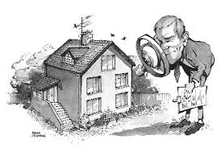

Dette indebærer, at der generelt skal være orienteret om risikoen for skjulte fejl og mangler samt reglerne om mangelsansvar og om mulighederne for at imødegå risikoen ved en byggeteknisk gennemgang og forsikringstegning. 

Tillige skal der være rådgivet om de juridiske konsekvenser af, at der ikke foreligger en rapport fra en byggeteknisk gennemgang. 

Efter indførelsen af huseftersynsordningen vil ejendomsmægleren ofte tage forbehold for en byggeteknisk gennemgang ved sin værdiansættelse af ejendommen.  

---

Ejendomsmæglerens pligt som formidler til at rådgive sælger om byggeteknisk gennemgang, huseftersynsordningen m.v. og til at oplyse køber om rapporten fra en byggeteknisk gennemgang samt muligheden for at tegne ejerskifteforsikring fremgår af LOFE §§ 44-45. 

Hvis sælgeren er utilfreds med ejendomsmæglerens værdiansættelse, så kan sælgeren ikke klage til Klagenævnet for Ejendomsformidling, men må anlægge sag ved domstolene.

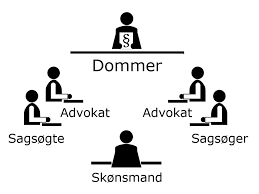

---

<h4><a href="https://www.youtube.com/embed/rCSppX53zWU" target="_blank">Video Ejerskifteforsikring – hvorfor- og hvordan</a></h4>

---

**Oversigt over processen i en ejendomshandel:**  

**Når der er indgået formidlingsaftale med sælgeren skal ejendomsmægleren:**

* Varetage sælgers interesser og rådgive sælger, herunder i LOFE § 37.

*	Værdiansætte ejendommen og fastsætte prisen, jf. LOFE §§ 27 og 41.

*	Udarbejde et finansieringsforslag.

*	Beregne sælgerens provenu, jf. LOFE § 38.

*	Udarbejde salgsopstilling og udkast til købsaftale jf. LOFE §§ 39 og 46. 

*	Fravigelser fra standarden skal fremhæves over for køberen.

*	Der indsættes ofte et advokat og/eller et finansieringsforbehold.

* Købsaftalen gennemses af køberens advokat.

*	Salgsmaterialet er en opfordring til at køberen afgiver tilbud.

*	Give køberen alle de relevante oplysninger for ejendomshandlen

*	Ejendomsmægler må ikke rådgive både sælger og køber, men er udelukket sælgerens mand, jf. LOFE § 26.

*	Køberen skal oplyses om sin fortrydelsesretten af sælgeren/formidleren.

---

## Køberens fortrydelsesret ved køb af fast ejendom mv.
 
**I dansk ret er udgangspunktet, at der ikke gælder en almindelig fortrydelses- og ombytningsret.** 

Der er i lov om forbrugerbeskyttelse ved erhvervelse af fast ejendom mv. fastsat en generel fortrydelsesret ved erhvervelse af fast ejendom og ved indgåelse af aftale om opførelse af en bolig, jf. nærmere Lov om forbrugerbeskyttelse ved erhvervelse af fast ejendom (forkortet; LFFE) kapitel 2 og 3^[Følgende afsnit om fysiske mangler bygger på **Sonny Kristoffersen**: Forbrugerretten II, Den civilretlige forbrugerbeskyttelse, 5. udg. 2016, KarnovGroup, kap. 4 om Forbrugerbeskyttelse ved erhvervelse af fast ejendom.] 

---

Se lov om forbrugerbeskyttelse ved erhvervelse af fast ejendom mv. 
**<a href="https://jura.tepedu.dk/lovsamling.html">Lovsamlingen klik her!</a>**

---

Ifølge lovforarbejderne til denne lov har bevæggrunden for indførelsen af fortrydelsesretten været, at der i overvejende grad er tale om ikke-sagkyndiges indgåelse af en særdeles vidtrækkende og kompliceret aftale af afgørende betydning for de pågældendes økonomi. 

En privat person har således yderst vanskeligt ved, på en begrænset tid, at foretage en fyldestgørende overvejelse af alle en ejendomshandels økonomiske og juridiske konsekvenser.  

---

Fortrydelsesretten skal i denne sammenhæng begrebsmæssigt ses i modsætning til annullation, hvor effekten er, at køber frigøres fra forpligtelsen til naturalopfyldelse, men derimod ikke fra pligten til at svare positiv opfyldelsesinteresse.  
 
Reglerne om en fortrydelsesret ved køb af fast ejendom har karakter af traditionel forbrugerbeskyttelse, eftersom det alene er køberen, der har fortrydelsesret. 

Anvendelsesområdet for LFFE kapitel 2 er dog ikke, som i anden civilretlig forbrugerbeskyttelseslovgivning, afgrænset til forbrugeraftaler. 

---

Anvendelsesområdet for kapitel 2 er på den ene side bredere end i anden forbrugerbeskyttelseslovgivning, idet fortrydelsesretten som hovedregel gælder i alle tilfælde, hvor ejendommen er bestemt til beboelse for køberen. 

Reglerne omfatter dermed ikke kun erhvervsdrivendes salg og formidling af salg til forbrugere, men også handler, hvor både køber og sælger er forbrugere. 

Anvendelsesområdet for kapitel 2 er på den anden side også snævrere end i anden forbrugerbeskyttelseslovgivning, idet fortrydelsesretten ikke gælder i alle tilfælde, hvor køberen skal bruge ejendommen ikke-erhvervsmæssigt (fx som kolonihave), men kun hvor ejendommen er bestemt til beboelse for køberen.

---

Efter LFFE § 6, stk. 1, gælder fortrydelsesretten for det første for aftaler om køb af fast ejendom, når ejendommen hovedsagelig er bestemt til beboelse for køberen. 

Reglerne om fortrydelsesret gælder, uanset om sælgeren er en privatperson, en offentlig institution eller en erhvervsvirksomhed. 

---

Det afgørende er, hvad køberen konkret skal bruge ejendommen til. Det er uden betydning, om ejendommen sælges med eller uden professionel bistand til en af parterne. 

Har to eller flere personer købt ejendommen i fællesskab, kan fortrydelsesretten kun udøves af køberne i fællesskab. 

Hvis det kun er den ene af køberne, som ønsker at træde tilbage, kan dette således ikke ske med hjemmel i loven. 

---

I forhold til anvendelsesområdet for lovens kapitel 1, indeholder bestemmelsen i LFFE § 6, stk. 1, den udvidelse, at fortrydelsesretten i kapitel 2 også omfatter aftaler om køb af andel i en andelsboligforening og køb af aktie eller andet adkomstdokument med tilknyttet brugsret til bolig.

Fortrydelsesretten omfatter utvivlsomt køb af andel i en eksisterende andelsboligforening, hvorimod fortrydelsesretten ikke finder anvendelse ved stiftelsen af en andelsboligforening, hvad enten foreningen stiftes med henblik på overtagelse af en eksisterende ejendom eller med henblik på overtagelse af nybyggeri, der opføres med offentligt tilskud. 

Fortrydelsesretten gælder ej heller for aftaler om køb af fast ejendom mv. på auktion, eller når der ved aftalens indgåelse er indgivet begæring om tvangsauktion, og køberen vidste eller burde vide dette, jf. LFFE § 6, stk. 2, 1. pkt. 

---

Fortrydelsesretten gælder endelig ikke for køb af landbrugsejendomme, der er undergivet landbrugspligt, eller for køb, som er omfattet af lov om forbrugeraftaler, der giver brugsret til fast ejendom på timesharebasis, jf. LFFE § 6, stk. 2, 2. pkt. 

---

Ved køb af fast ejendom på timesharebasis gælder der særlige fortrydelsesregler, jf. lov nr. 102 af 15. februar 2011 om forbrugeraftaler om brugsret til logi på timesharebasis, længerevarende ferieprodukter mv. 

Efter timesharelovens § 9 har køberen af en timesharebolig en fortrydelsesret, som skal være gjort gældende inden for en frist på 14 dage. Fortrydelse kan som udgangspunkt, jf. dog denne lovs § 10, ske inden for en periode på 14 dage fra den dag, hvor aftalen er indgået, eller fra den dag, hvor forbrugeren har modtaget aftalen, hvis sidstnævnte tidspunkt ligger senere, jf. denne lovs § 9, stk. 2.

---

Har sælgeren handlet som led i sit erhverv, eller er aftalen indgået eller formidlet for sælgeren af en erhvervsdrivende som led i dennes erhverv, har sælgeren bevisbyrden for, at aftalen ikke er omfattet af reglerne om fortrydelsesret, jf. LFFE § 6, stk. 3.  

Det betyder i praksis, at sælgeren navnlig skal bevise, at køberen ikke har erhvervet ejendommen hovedsageligt med henblik beboelse. 

---

Det forudsættes i lovforarbejderne, at bevisbyrdereglen ikke finder anvendelse i tilfælde, hvor sælgeren eller formidleren er blevet vildledt af køberen til at tro, at køberen handlede erhvervsmæssigt, dvs. hvis køberen med vilje har givet sælgeren indtryk af, at køberen handlede som led i sit erhverv.  

---

**Generelt om fortrydelsesretten:**

Når der er indgået en aftale om køb, kan køberen træde tilbage fra aftalen på de betingelser, som er nævnt i LFFE §§ 8-11, jf. nærmere LFFE § 7, stk. 1.  

Fortrydelsesretten omfatter aftalen i sin helhed – ikke enkelte dele af aftalen. 

---

Købers fortrydelsesret gælder som udgangspunkt, selv om sælger som led i aftalen er fraflyttet ejendommen, og selv om køber er flyttet ind.  

Der skal være indgået en købsaftale, før fortrydelsesretten bliver aktuel.

---

Det er uden betydning, om aftalen er endelig eller betinget af et eller flere forhold.

Fortrydelsesretten gælder fx ved siden af et eventuelt advokatforbehold, se nærmere nedenfor.  


## Tilbagekaldelse af købstilbud

Det følger af aftalelovens § 7, at et tilbud normalt kan tilbagekaldes, så længe det ikke er kommet til modtagerens kundskab. 

I visse tilfælde kan et tilbud dog tilbagekaldes, selv om det er kommet til modtagerens kundskab, jf. aftalelovens § 39, 2. pkt., hvorefter et tilbud kan tilbagekaldes, hvis det endnu ikke har virket bestemmende på modtagerens handlemåde.  

---

Det følger af LFFE § 7, stk. 2, at så længe et tilbud om køb ikke er antaget af sælgeren, kan køberen tilbagekalde sit tilbud ved at give underretning herom til sælgeren.  

Reglen i LFFE § 7, stk. 2, fraviger således de generelle regler i aftaleloven, da der er tale om en udvidelse af retten til at tilbagekalde tilbud, hvorefter køber kan træde tilbage fra et tilbud, som efter aftaleretlige regler er bindende, så længe tilbuddet ikke er accepteret af sælger.

Hvis der er sket rettidigt tilbagekaldelse af købstilbudet, efter LFFE § 7, stk. 2, så er der ingen købsaftale, og dermed finder fortrydelseretten ikke anvendelse og der skal ikke betales godgørelse til sælgeren.

---

Tilbagekaldelse kan ske, indtil sælgers accept er kommet frem til køber. 

Det må således antages, at tilbagekaldelse af et købstilbud efter bestemmelsen er rettidigt, hvis underretningen herom kommer frem til sælger, før dennes accept er kommet frem til køber.  

---

En mundtlig underretning til sælgeren herom har samme retsvirkning som en skriftlig. 

Af bevismæssige grunde bør underretningen dog gives skriftligt.  

---

Køber skal ikke betale en godtgørelse, hvis underretningen til sælger om, at tilbuddet tilbagekaldes, kommer rettidigt frem, jf. LFFE § 11.  

LFFE § 7, stk. 2, kan ikke ved aftale fraviges til skade for køberen, jf. LFFE § 21, stk. 2.   

---

**Fortrydelsesfristen:**

Efter LFFE § 8, stk. 1 er fortrydelsesretten betinget af, at køberen senest 6 hele hverdage efter aftalens indgåelse giver skriftlig underretning til sælgeren om, at køberen vil træde tilbage fra aftalen. 

Underretningen skal være skriftlig og været kommet frem inden fristens udløb.  

---

Det er forudsat i lovforarbejderne, at den dag, hvor fortrydelsesfristen begynder at løbe, ikke tælles med, og at køberen således altid har en frist på 6 hele hverdage.  

Fristen på 6 hverdage indebærer, at køberen altid har mindst én hel weekend til rådighed, idet lørdag ikke regnes for en hverdag, jf. LFFE § 13. 

Juleaftensdag og nytårsaftensdag betragtes som hverdage, medmindre disse dage falder i en weekend.  

---

Bortset fra de tilfælde, hvor særlige helligdage kommer imellem, vil situationen være den, at hvis aftalen er indgået en fredag, lørdag eller søndag, skal køberens underretning være kommet frem til sælgeren eller formidleren senest den mandag, der ligger henholdsvis 10, 9 eller 8 dage frem i tiden. 

Er aftalen indgået mandag-torsdag skal underretningen være kommet frem senest 8 dage efter den pågældende dag. Underretningen skal på sidste dagen være kommet frem inden døgnets ophør.

Efter almindelige aftaleretlige regler vil underretningen være kommet frem, når sælgeren under normale forhold vil have haft lejlighed til at gøre sig bekendt med underretningens indhold. 

---

Et brev/e-mail er fx kommet frem, når det er lagt i sælgerens postkasse/indkomne beskeder eller kastet ind ad brevsprækken.

I praksis har det navnlig givet anledning til tvivl, om et anbefalet brev er kommet frem, når der er lagt besked hos modtageren om, at brevet ligger klar til afhentning på posthuset. 

Dette vil som udgangspunkt ikke være tilfældet, idet det normalt ikke fremgår af meddelelsen fra posthuset, hvem der er afsender, eller hvad brevets nærmere indhold er. 

---

Det er køberen, der må sørge for, at underretningen om, at han vil træde tilbage, kommer frem til sælgeren.  

Hvis sælgeren har haft flere personer beskæftiget med salget, kan køber med frigørende virkning give meddelelse til den person, der kan modtage tilbagetrædelseserklæringen på sælgerens vegne – typisk en ejendomsformidler. 

Kravet om skriftlig underretning må antages at have til formål at forebygge efterfølgende bevistvivl om, hvorvidt fortrydelsesretten er gjort gældende, eller hvorvidt fortrydelsesfristen er overholdt, og bestemmelsen bør næppe fortolkes snævert. 

---

Underretning kan gives ved brev, telegram og telefax og må ligeledes antages at kunne gives via e-mail og sms.

Er aftalen indgået ved køberens antagelse af sælgerens tilbud om salg, skal underretning være kommet frem senest 6 hverdage efter, at tilbuddet er kommet til køberens kundskab, jf. nærmere LFFE § 8, stk. 2. 

---

**Tidspunkt, hvor fortrydelsesretten begynder at løbe:**

I LFFE § 8 sondres der mellem to situationer: 

A)	Sælgeren afgiver et salgstilbud, som accepteres af køberen (LFFE § 8, stk. 2), eller

B)	Aftalen indgås på anden måde (LFFE § 8, stk. 1).

---

Ad. A. Fortrydelsesperioden kan i alle tilfælde først begynde at løbe, når købsaftalen er indgået, jf. LFFE § 7, stk. 1. 

I de tilfælde, som er omfattet af LFFE § 8, stk. 2, regnes fristen fra det tidspunkt, der ligger før aftalens indgåelse, idet fristen beregnes fra den første hverdag efter, at salgstilbuddet er kommet til køberens kundskab. 

Da der som nævnt først er noget at fortryde, når der er indgået en aftale, kan reglen beskrives sådan, at køberens betænkningstid i disse tilfælde fradrages i 6-dages fristen. 

---

**I lovforarbejderne til LFFE anføres det:** 

»I tilfælde, hvor aftalen indgås ved, at sælgeren afgiver et tilbud om salg, løber 6-dages fristen fra det tidspunkt, hvor sælgeren efter aftaleretlige regler ikke længere kan tilbagekalde tilbuddet, dvs. når det er kommet til køberens kundskab, jf. stk. 2. I nogle af disse tilfælde vil 6-dages fristen allerede være udløbet inden aftalen indgås, således at der slet ikke bliver nogen fortrydelsesret.«

---

Et salgstilbud er kommet til købernes kundskab, når det er blevet læst eller hørt af køberen eller en anden person, der er bemyndiget til at handle på dennes vegne. 

Det kan i praksis være vanskeligt at afgøre, om der foreligger et tilbud eller opfordring til tilbud, jf. herved aftalelovens § 9. '

En salgsopstilling, som ejendomsformidleren udleverer til alle købsinteresserede, kan normalt kun anses som en opfordring til at gøre tilbud. 

---

LFFE § 8, stk. 2, finder kun anvendelse på det tilbud, som køberen accepterer med den virkning, at der indgås en aftale.

---

Ad. B. LFFE § 8, stk. 1, gælder i situationer, hvor købsaftalen indgås på enhver anden måde end ved, at køberen accepterer et tilbud om salg. 

I praksis indgås de fleste købsaftaler vedrørende erhvervelse af fast ejendom, ved at sælgeren accepterer et tilbud fra køberen, fx når køberen underskriver købsaftalen, hvorefter sælger ved sin underskrift acceptere købet. 

Fortrydelsesfristen regnes i alle disse tilfælde fra aftalens indgåelse. 

Loven indeholder imidlertid ikke regler om, hvornår en købsaftale er indgået, og dette spørgsmål afgøres efter de almindelige aftaleretlige regler. 

---

Om afgørelsen af, hvornår aftalen er indgået, har Justitsministeriet som ressortmyndighed i en skrivelse af 6. februar 1996 til Finansrådet (FinansDanmark) anført, at det, efter ministeriets opfattelse, er mest nærliggende, i den foreliggende sammenhæng, generelt at lægge vægt på det tidspunkt, fra hvilket køberen er bundet af sælgerens accept. Udgangspunktet er det tidspunkt, hvor accepten er kommet frem til køberen. 

Accepten anses i almindelighed for at være kommet frem, når accepten er nået så vidt, at modtageren (tilbudsgiveren eller dennes repræsentant) under normale forhold vil have lejlighed til at gøre sig bekendt med dens indhold. 

---

Der må dog efter omstændighederne tages hensyn til særlige forhold hos modtageren – fx at denne er bortrejst – når disse forhold var eller burde være kendt for den, der gav accepten.

Sælgers accept af et købstilbud vil normalt ikke kunne anses for at være kommet frem til køberen, hvis accepten (den underskrevne købsaftale) alene er modtaget af en ejendomsformidler, der repræsenterer sælgeren. 

---

**Betingede købsaftaler (advokatforbehold mv.):**


---

<h4><a href="https://www.youtube.com/embed/eQqlGY1lm2M" target="_blank">Video Fortrydelsesret og advokatforbehold i en bolighandel</a></h4>

---

Efter LFFE § 8, stk. 1 regnes fortrydelsesfristen fra aftalens indgåelse. 

Det er uden betydning, om aftalen er endelig eller betinget. 

Dette betyder bl.a., at et sædvanligt advokatforbehold i en købsaftale ikke udskyder eller på anden måde påvirker fortrydelsesfristen, men blot gælder ved siden af denne.

---

**I lovforarbejderne til LFFE anføres følgende om advokatforbehold:** 

»Fortrydelsesretten gælder, som ovenfor nævnt, fra aftalens indgåelse, uanset om aftalen er endelig eller betinget af et eller flere forhold, fx af, at købers advokat godkender aftalen*. 

---

Hvis advokaten i det nævnte eksempel ikke godkender aftalen, er betingelsen for aftalen imidlertid ikke opfyldt, og der bliver i så fald ikke tale om at benytte fortrydelsesretten efter loven. 

Sådanne aftalte betingelser gælder således ved siden af fortrydelsesretten, og hvis de ikke opfyldes, falder handlen bort, uden at der, som tidligere nævnt, skal betales godtgørelse efter lovens § 11«.

---

Et advokatforbehold kan efter omstændighederne være formuleret således, at det tillægger køber en fakultativ ret til at træde tilbage fra handlen uden pligt til at betale godtgørelse efter LFFE § 11 og uden at have andre konsekvenser. 

Blot en meddelelse fra den pågældende advokat om, at handlen ikke kan godkendes, vil således efter omstændighederne medføre, at købsaftalen bortfalder i sin helhed.

Et forbehold, der ikke indeholder en sidste frist for meddelelse af godkendelse eller nægtelse heraf, mister sin gyldighed, hvis den pågældende advokat ikke reagerer inden rimelig tid. 

Efter retspraksis maksimalt ca. 30 dage.

---

Et advokatforbehold løber derfor ikke til evig tid - kun en måned.

Se dommen i **U 1994.13/1 V**, hvor et advokatforbehold i en slutseddel ikke kunne gøres gældende efter godt en måneds forløb. Sælgeren af en fast ejendom tog i slutsedlen, som han underskrev den 4. eller 6. april, forbehold om sin advokats godkendelse af slutsedlen. Ved skrivelse af 9. maj meddelte advokaten, at han ikke kunne godkende slutsedlen. Da advokatforbeholdet herefter ikke var gjort gældende inden rimelig tid, var sælgeren bundet af aftalen. 
**<a href="https://pro.karnovgroup.dk/document/7000200269/1">Dommen klik her!</a>**

---

Advokaten skal rådgive køberen inden udløbet af advokatforbeholdet, jf. **U 2015.2846/2 H**. Advokat havde tilsidesat god advokatskik og var erstatningsansvarlig over for købere af fast ejendom for udgifter til ulovlige elinstallationer, da han ikke havde rådgivet køberne inden udløbet af fristen for et advokatforbehold i forbindelse med handlen.
**<a href="https://pro.karnovgroup.dk/document/7000730734/1">Dommen klik her!</a>**

---

**Tinglysning af aftale om køb:**

Såfremt en aftale om køb er blevet tinglyst, er fortrydelsesretten betinget af, at køberen inden udløbet af den i LFFE § 8 nævnte frist foretager det fornødne til aflysning af aftalen, jf. LFFE § 9. 

Det er uden betydning, om skødet er endeligt eller betinget. Den nævnte 6 dages frist beregnes på samme måde som efter LFFE § 8.

---

I tilfælde, hvor køberen har taget initiativ til tinglysning, skal køberen selv sørge for at få aftalen aflyst.

Det er køberen, der bærer risikoen for, at registreringen aflyses. 

Går der noget galt ved registreringen, har køberen ikke opfyldt sin forpligtelse inden fortrydelsesfristens udløb, hvorfor fortrydelsen ikke får virkning. 

---

Hvis det er sælgeren, som har sørget for tinglysning af aftalen, er det tilstrækkeligt, at køberen leverer den fornødne dokumentation til aflysning af aftalen til sælgeren.

Køberen har 6 hverdage til at bringe de nævnte forhold i orden, selv om køberen eventuelt allerede dagen efter aftalens indgåelse har givet sælgeren underretning om, at han vil træde tilbage. 

---

**Sælgerens disposition over ejendommen ved fortrydelsesretten:**

Har køberen taget ejendommen i brug, er fortrydelsesretten betinget af, at ejendommen inden udløbet af den i LFFE § 8 nævnte frist stilles til sælgerens disposition, jf. LFFE § 10, stk. 1. 

Det må endvidere antages, at LFFE § 10, stk. 1 også gælder i tilfælde, hvor sælgeren endnu ikke er fraflyttet, men hvor køberen har fået lov til at disponere over en del af ejendommen. 

---

Fortrydelsesretten er således betinget af, at ejendommen i tilfælde, hvor sælgeren er fraflyttet, og køberen har taget ejendommen i brug, stilles til sælgerens disposition på ny senest ved 6-dages fristens udløb. 

Køberen har 6 hverdage til at rømme ejendommen, uanset hvornår den pågældende har underrettet sælgeren om, at køberen vil træde tilbage fra aftalen, dvs. at køberen har hele fortrydelsesperioden på 6 hverdage til at rømme ejendommen, selv om køberen fx allerede efter 2 dage har underrettet sælgeren om tilbagetrædelsen. 

---

Har køberen, efter aftalens indgåelse, foretaget fysiske indgreb i eller forandringer på ejendommen, er fortrydelsesretten betinget af, at køberen inden udløbet af den i LFFE § 8 nævnte frist tilbagefører ejendommen til væsentlig samme tilstand som før indgrebet eller forandringen, jf. hertil LFFE § 10, stk. 2.

Reglen i LFFE § 10, stk. 2 indebærer, at køberen ikke kan træde tilbage fra aftalen, hvis det ikke er muligt at tilbageføre ejendommen til væsentlig samme tilstand som før indgrebet eller forandringen.

---

Som eksempel herpå kan nævnes, at køberen straks efter aftalens indgåelse har fældet nogle gamle træer på grunden. 

I en sådan situation er det ikke muligt at bringe ejendommen tilbage til væsentlig samme stand. 

---

Det samme vil normalt gælde, hvis gamle, bonede parketgulve er blevet afhøvlet eller lakeret, gamle træpaneler fjernet osv.

Udtrykket væsentlig samme tilstand indebærer, at indgreb eller forandringer, der må betegnes som bagatelagtige, ikke vil kunne fratage køber retten til at træde tilbage fra aftalen.  

Om hvorvidt indgrebet må anses som bagatelagtig eller ej må afgøres ud fra en konkret vurdering. 

---

Der er ikke i bestemmelsen gjort undtagelse for indgreb, der består i udbedringer af mangler, eller som i øvrigt må betragtes som forbedringer. 

I disse tilfælde kan det naturligvis aftales, at køberen ikke skal tilbageføre ejendommen til tilstanden før forbedringen, jf. LFFE § 21, stk. 2, hvorefter reglerne i lovens kapitel 2 ved aftale kan fraviges til skade for sælgeren.  

En økonomisk kompensation til den fortrydende køber bliver alene aktuel, hvis der indgås aftale herom med sælger. 

---

Er ejendommen efter aftalens indgåelse blevet beskadiget eller forringet på anden måde som følge af, at køberen eller andre, der har haft adgang til ejendommen i køberens interesse, har udvist uagtsomhed, er fortrydelsesretten betinget af, at køberen inden udløbet af den i LFFE § 8 nævnte frist udbedrer forholdet, jf. LFFE § 10, stk. 3.

Bestemmelsen i LFFE § 10, stk. 3 drejer sig om de tilfælde, hvor køberen eller fx håndværkere, som køberen har engageret, har forvoldt skade på ejendommen i tilbagetrædelsesperioden.

Bestemmelsen indebærer, at sælgeren i tilfælde af, at køberen træder tilbage, bærer risikoen for hændelige skader i tilbagetrædelsesperioden, selv om køberen har taget ejendommen i brug. 

---

Efter LFFE § 10, stk. 3, 2. pkt., har køberen bevisbyrden for, at beskadigelsen eller forringelsen ikke skyldes uagtsomhed hos køberen eller skadevolderen. 

Denne bestemmelse må forstås således, at køberen skal sandsynliggøre, at køberens og skadevolderens handlemåde var i overensstemmelse med normerne for rigtig adfærd i den pågældende situation.

---
 
**Betaling af godtgørelse til sælgeren:**

Det følger af LFFE § 11, stk. 1 at køberen, som betingelse for at kunne træde tilbage fra aftalen, skal betale en godtgørelse til sælger inden 6-dages fristens udløb. 

Der skal dog ikke betales godtgørelse, hvis sælgeren er professionel bygherre eller i øvrigt har som sit væsentligste erhverv at erhverve og videresælge fast ejendom, når sælgeren har handlet som led i dette erhverv, jf. nærmere LFFE § 11, stk. 2. 

---

Derimod er det uden betydning, om sælgeren har haft bistand af en ejendomsformidler.

Godtgørelsen skal beregnes som 1 pct. af den nominelle købesum. Den købesum, som angives i købsaftalen, skal således lægges til grund ved beregningen af godtgørelsen.

---

Dette gælder også i tilfælde, hvor køberen efter aftalen vil have ret til at få købesummen nedsat ved at præstere en større udbetaling (fx gennem indfrielse af sælgerpant til en aftalt kurs). 

Den nominelle købesum og dermed godtgørelsens størrelse afhænger bl.a. af den aftalte finansieringsmåde og afspejler ikke altid ejendommens reelle værdi på samme måde som kontantprisen. 

Når man har valgt ikke at bruge kontantprisen som grundlag for beregningen, skyldes det navnlig, at kontantprisen ikke altid fremgår af parternes aftale, mens købsaftalen altid vil angive den nominelle købesum. 

---

Godtgørelsen efter LFFE § 11 skal blot være betalt inden 6-dages-fristens udløb, også selv om køberen, fx allerede dagen efter aftalens indgåelse, har givet sælgeren besked om, at fortrydelsesretten vil blive benyttet. 

---

Hvornår 6-dages-fristen udløber, beror som nævnt på reglen i LFFE § 8, hvorefter fristen regnes fra aftalens indgåelse, jf. LFFE § 8, stk. 1, eller på den dag, sælgerens tilbud om salg er kommet til køberens kundskab, hvis aftalen er indgået ved køberens accept af salgstilbuddet, jf. LFFE § 8, stk. 2. 

Hvis køber på grund af sælgerens forhold – fx bortrejse eller uoplyst flytning – ikke er i stand til at betale rettidigt, gælder de almindelige regler for "fordringshavermora". 

Er fx køberen ikke hjemme, når sælgeren efter aftale kommer med varen, er køberen i kreditormora. 

Det fritager normalt ikke sælgeren for pligten til at aflevere varen, og sælgeren skal for købers regning opbevare den betryggende, indtil køber kan modtage den, det kaldes for sælgerens omsorgspligt.

Køberens fortrydelsesret bortfalder næppe, hvis køberen har forsøgt at betale rettidigt, men har været forhindret heri på grund af sælgerens forhold.

---

På den anden side bortfalder sælgerens krav på godtgørelsen ikke, og køberen må betale, når det bliver muligt. Køberen har mulighed for at frigøre sig ved deponering i et godkendt pengeinstitut efter reglerne i deponeringsloven, jf. lov nr. 29 af 16. februar 1932. 

---

Det præciseres i LFFE § 11, stk. 1, 2. pkt., at køberen kan betale godtgørelsesbeløbet med frigørende virkning til sælgeren eller til den erhvervsdrivende, som har indgået eller formidlet aftalen, fx en ejendomsformidler eller en advokat. 

Køberen kan også betale godtgørelsesbeløbet med frigørende virkning til andre personer, der efter almindelige fuldmagtsregler eller særlig aftale kan modtage betalingen på sælgerens vegne. 

---

Hvis køberen har betalt en del af købesummen i forbindelse med aftalens indgåelse, vil godtgørelseskravet kunne dækkes ved modregning, jf. LFFE § 12. 

Sælgerens krav på godtgørelse og købernes krav på tilbagebetaling er opstået i kraft af samme retsforhold, og det må antages, at almindelige regler om konneks modregning finder anvendelse. 

Det betyder bl.a., at modregningen kan ske, selv om der ikke foreligger gensidighed (fx hvor forudbetalingen er deponeret hos en medvirkende ejendomsformidler), og køberens modregning har virkning med tilbagevirkende kraft (ex tunc). 

---

Det er således ikke en betingelse for tilbagetrædelsesretten, at sælgeren modtager en modregningserklæring inden 6-dages-fristens udløb, og i øvrigt kan det under hensyn til bestemmelsen i LFFE § 12 i det hele taget næppe kræves, at køberen udtrykkeligt meddeler sælgeren, at godtgørelsen kan fradrages i det forudbetalte beløb. 

---

Hvis der ikke kan ske modregning, og parterne ikke har aftalt noget om, hvordan en eventuel godtgørelse skal betales, gælder de almindelige regler om pengefordringer. 

Det må derfor antages, at køberen er berettiget til foruden med rede penge at betale med check eller ved indbetaling eller overførsel til sælgerens konto i et pengeinstitut eller postgiro.  

Vil trassatbanken ikke honorere checken, er betalingen ikke sket, og køber kan ikke træde tilbage fra handlen. 

---

Godtgørelsesbeløbet skal være kommet frem til sælgeren inden fristens udløb, jf. princippet i gældsbrevslovens § 3.  

Hvis en postanvisning er kommet frem til sælgeren inden 6-dages-fristens udløb, er betalingen rettidig, også selv om sælgeren først efter fristens udløb har mulighed for at få rede penge. 

Hvis beløbet overføres til sælgernes konto, skal beløbet blot være debiteret betalerens konto, jf. betalingstjenestelovens § 69 in fine, inden 6 dages-fristens udløb.

---

Efter LFFE § 11, stk. 2 skal der, som tidligere omtalt, ikke betales godtgørelse til sælgere, der har opført ejendommen med salg for øje, fx køb af et typehus fra en typehusproducent, eller hvor sælger har som hovederhverv at sælge ejendomme, dvs. »har som sit væsentligste erhverv at erhverve og videresælge fast ejendom, når sælgeren har handlet som led i dette erhverv«. 

Det kan, på grund af den beskyttelsespræceptive bestemmelse i LFFE § 21, stk. 2, ikke gyldigt aftales, at køber skal betale en større godtgørelse end foreskrevet i LFFE § 11. 

Aftaler om betaling af et mindre beløb eller slet ingen godtgørelse ved købers brug af fortrydelsesretten kan derimod indgås, da dette ikke er en fravigelse til skade for køber.

---

Køberens benyttelse af fortrydelsesretten giver i øvrigt ikke sælgeren andre krav end kravet på godtgørelse og eventuelle erstatningskrav for skader på ejendommen mv. Med andre ord er køberens benyttelse af den lovbestemte fortrydelsesret ikke en misligholdelse af købsaftalen. 

...

**Tilbagebetaling af forudbetalte og deponerede beløb mv.:**

Har køberen betalt en del af købesummen, skal sælgeren ved tilbagetrædelse straks tilbagebetale det modtagne med fradrag af et eventuelt godtgørelsesbeløb efter LFFE § 11, jf. LFFE § 12, stk. 1, 1. pkt. 

Sælgerens pligt til tilbagebetaling gælder også en eventuel bankgaranti, beløb, der er indbetalt til en ejendomsformidler, samt deponerede beløb.

Denne bestemmelse betyder ikke, at køberen altid kan kræve at få det pågældende beløb tilbagebetalt samtidig med, at sælgeren underrettes om, at køberen vil benytte fortrydelsesretten, jf. LFFE § 8.

---

Sælgerens pligt til at tilbagebetale indtræder først, når køberen gyldigt er trådt tilbage fra aftalen. 

Sælgeren skal således først tilbagebetale, når samtlige betingelser for, at køberen kan træde tilbage, er opfyldt, jf. LFFE §§ 8-11.

Der er i øvrigt ikke i loven knyttet særlige retsvirkninger til, at sælgeren ikke tilbagebetaler straks og der er ikke særlige regler i loven om forrentning af dette beløb. 

---

Det må afgøres efter de almindelige regler i renteloven.  

Efter ændringen af renteloven er det ikke længere et krav, at der – når forfaldsdagen ikke er fastsat i forvejen – fremsættes påkrav om betaling af rente. 

---

Efter § 3, stk. 2 i renteloven, skal der betales rente, når der er gået 30 dage efter den dag, hvor fordringshaveren har afsendt eller fremsat anmodning om betaling, og der skal således efter ændringen blot fremsættes en betalingsanmodning. Meddelelsen om brug af fortrydelsesretten må anses for en anmodning om betaling. 

---

I LFFE § 12, stk. 1, 2. pkt. præciseres det, at det pågældende godtgørelsesbeløb kan fradrages, selv om køberens indbetaling er sket til en ejendomsformidler eller anden mellemmand.

---

I praksis vil forudbetalinger mv. som regel være sket til en ejendomsformidler, en advokat eller et pengeinstitut, og der vil i så fald næppe opstå problemer for køberen med at få sine penge tilbage.

Sælgeren skal, når køberen gyldigt er trådt tilbage fra aftalen, straks tilbagegive eventuelle pantebreve mv. til køberen. 

Hvis dette ikke er muligt, fx fordi sælgeren har overdraget pantebrevet til en godtroende tredjemand, skal køberen holdes skadesløs. 

---

Køberen kan kræve, at sælgeren stiller en bankgaranti eller lignende sikkerhed for de pengekrav, som køberen skal opfylde i henhold til det pågældende dokument, jf. LFFE § 12, stk. 2.

Bestemmelsen beskytter ikke køberen i tilfælde, hvor sælgeren er insolvent. I så fald vil køberen lide tab.

---

**Oplysning om fortrydelsesretten:**

I LFFE kapitel 4 findes reglerne om oplysning om fortrydelsesretten. 

En erhvervsdrivende sælger eller formidler mv., som nævnt i LFFE § 6, stk. 3, skal, inden fortrydelsesfristen begynder at løbe, jf. LFFE § 8, i et særskilt dokument, give køberen oplysning om fortrydelsesretten efter kapitel 2, jf. LFFE § 19, stk. 1, 1. pkt. 

---

Oplysningspligten påhviler for det første alle sælgere, der handler som led i deres erhverv. 

Det er uden betydning, om salget sker som led i sælgernes hoved- eller bierhverv. 

---

Bestemmelsen er også udvidet til at omfatte fx en advokat, der uden at have formidlet kontakten mellem parterne, indgår aftalen på sælgerens eller køberens vegne. 

Ved aftale om køb eller opførelse af bygning, jf. LFFE § 14, skal entreprenøren, inden fortrydelsesfristen begynder at løbe, jf. LFFE § 16, give bestilleren oplysning om fortrydelsesretten efter kapitel 3, jf. nærmere LFFE § 19, stk. 1, 2. pkt. 

---

Der skal gives oplysninger om, at køberen kan træde tilbage fra aftalen, samt om størrelsen af en eventuel godtgørelse, jf. LFFE § 11. 

Kravet om anvendelse af et særskilt dokument indebærer, at det ikke er tilstrækkeligt, at oplysningen indføjes i købs- eller entrepriseaftalen, (henholdsvis i sælgerens eller entreprenørens tilbud, jf. LFFE § 8, stk. 2, og § 16, stk. 2). 

Bestemmelsen i LFFE § 19 er ikke civilretligt sanktioneret, og 6-dages fristen løber således, selv om køberen, henholdsvis bestilleren, ikke har fået oplysning om fortrydelsesretten. 

---

Overtrædelse af pligten til at oplyse om, at køberen har fortrydelsesret, samt af pligten til at anvende en særlig formular mv. er derimod strafsanktioneret, jf. nærmere LFFE § 22.

**Strafbestemmelsen i LFFE § 22 supplerer markedsføringslovens generelle regler om god skik, jf. markedsføringslovens § 3**. '

---

Ejendomsmæglere, der handler i strid med god skik inden for branchen, vil efter omstændighederne også kunne mødes med sanktioner efter lov om formidling af fast ejendom Såfremt overtrædelsen er begået af et selskab, en forening, en fond eller lignende, kan der pålægges den juridiske person at betale en bøde, jf. LFFE § 22, stk. 2.

---

Det bemærkes, at en køber, der som følge af en manglende oplysning om sin ret til tilbagetrædelse for sent bliver opmærksom på muligheden herfor, ikke personligt har nogen glæde af, at sælgeren eller formidleren kan pålægges et bødeansvar. 

---

Kan en køber sandsynliggøre, at han ville have benyttet sig af muligheden for tilbagetræden, hvis han havde fået behørig oplysning om denne mulighed, vil der efter almindelige erstatningsregler være mulighed for at få et tab erstattet hos den, der har tilsidesat oplysningspligten. 

---

Træder køberen tilbage fra en aftale efter reglerne i LFFE kapitel 2, er sælgeren med hensyn til en eventuel professionel rådgivers honorarkrav, stillet som om ejendommen ikke var solgt, jf. LFFE § 20.

Hvilke honorarregler, der gælder i denne situation, vil formentlig afhænge af, hvilken rådgivningsopgave der er tale om. 

---


**Oversigt over fortrydelsesreglerne ved køb af fast ejendom:**

Fortrydelsesretten er en fravigelse af princippet om, at aftaler skal holdes, jf. aftaleloven.

En køber kan tilbagekalde sit tilbud indtil sælgers accept er kommet frem til køber, jf. LFFE § 7.

Efter aftalen er indgået kan køber fortryde handlen, jf. LFFE § 7 og § 8.

---

Meddelelse om fortrydelse skal gives til sælger/ejendomsformidler inden 6 hverdage efter aftalen er indgået, jf. LFFE § 8.

Køber skal samtidig betale en godtgørelse på 1 % af den nominelle købesum til sælgeren, jf. LFFE § 11.
  
Sælger har ikke tilsvarende lovmæssig fortrydelsesret over køberen ved handel med fast ejendom.

---

## Fysiske mangler ved fast ejendom


 
Der skal gøres nogle generelle bemærkninger til området for **»fysiske mangler ved fast ejendom«**. 

Købeloven gælder ikke for køb af fast ejendom.  

---

Mange af købelovens regler udtrykker imidlertid almindelige køberetlige grundsætninger, og principperne i købeloven anvendes derfor i vidt omfang også analogt ved køb og salg af fast ejendom. 

**"Analogi"** i en juridisk sammenhæng betyder anvendelse af en retsregel på et forhold, der ikke dækkes af ordlyden, når der foreligger årsagernes lighed.

---

Dette gælder bl.a. købelovens regler om mangler, jf. købelovens §§ 76 og 75a.^[Følgende afsnit om fysiske mangler bygger på **Sonny Kristoffersen**: Forbrugerretten II, Den civilretlige forbrugerbeskyttelse, 5. udg. 2016, KarnovGroup, kap. 4 om Forbrugerbeskyttelse ved erhvervelse af fast ejendom.]  

En fysisk mangel angår ejendommens fysiske tilstand, fx fejl ved murværk, eller tag. 

---

Rent **"kosmetiske forhold"** som fx, at ejendommens gulv er slidt på overfladen, er plettet, har skjolder osv., er økonomisk set bagatelagtige forhold, som ikke bør udløse erstatning eller afslag, hvis forholdet ikke påvirker bygningens værdi eller brugbarhed.

---

Kosmetiske forhold påvirker heller ikke den bygningssagkyndiges erstatningsansvar, jf. fx **Disciplinær- og klagenævnet for beskikkede bygningssagkyndiges sagsnr.: 15145**: "Vedrørende facademurens deformation/skævhed, finder nævnet, at der er tale om et forhold, som ikke er kritisk, men alene kosmetisk. Deformationen antages at være sket i årene umiddelbart efter opførelsen og må nu antages at have nået en stabil tilstand. Der er ikke tale om et forhold, som kræver udbedring. På denne baggrund, finder nævnet, at der ikke er tilstrækkeligt grundlag for at pålægge den bygningssagkyndige erstatningsvar". 

Samt afgørelsen i **Disciplinær- og klagenævnet for beskikkede bygningssagkyndiges sagsnr.: 14148.**

---

**Studenteropgave**

Find og gennemgå afgørelsen i **Disciplinær- og klagenævnet for beskikkede bygningssagkyndiges sagsnr.: 14148**.

---

Omfattet af mangler ved fast ejendom kan fx også være fravigelser i boligarealet, men dette medfører ikke nødvendigvis en værdiforringelse. 

---


Der synes at være en vis usikkerhed i retspraksis, hvor meget der skal til før, at **"fravigelsen i boligarealet"** udgør en mangel ved en hushandel;
 
Jf. dommen i **U 2015.3442 V** Afvigelse på 13 m2 i boligs areal var en mangel, men værdiforringelsen på 65.000 kr. i forhold til en købesum på 1.465.000 kr. kunne ikke føre til et afslag i købesummen. 
**<a href="https://pro.karnovgroup.dk/document/7000732642/1">Dommen klik her!</a>**

---

Samt 

Dommen i **U 2015.242 V** Ikke forholdsmæssigt afslag for værdiforringelse på 50.000 kr. på grund af arealmangel på 18 m2 ved køb af ejendom til 1.450.000 kr. 
**<a href="https://pro.karnovgroup.dk/document/7000718942/1">Dommen klik her!</a>**

---

Anderledes dommene i **U 2013.3175 H** Arealafvigelse på 17,3 m2 i forhold til det oplyste i salgsopstillingen var en mangel ved fast ejendom. Manglen var ikke omfattet af ansvarsfritagelsen for sælger i § 2, stk. 1, i lov om forbrugerbeskyttelse ved fast ejendom. Den skønnede forskel i handelsværdien på 50.000 kr. var ikke et uvæsentligt beløb, og afslag i købesummen blev fastsat til dette beløb. 
**<a href="https://pro.karnovgroup.dk/document/7000540956/1">Dommen klik her!</a>**

---

Dommen i **U 2013.3181 H.** Mangel ved fast ejendom i form af arealafvigelse på 28 m2 i forhold til det oplyste i salgsopstillingen var ikke omfattet af ansvarsfritagelsen for sælger i § 2, stk. 1, i lov om forbrugerbeskyttelse ved fast ejendom. Afslag i købesummen på 150.000 kr. 
**<a href="https://pro.karnovgroup.dk/document/7000540957/1">Dommen klik her!</a>**

---

Dommen i **U 2019.3243 V**. Køber af parcelhus tilkendt afslag i købesummen på 150.000 kr. for arealmangel på 20 m², idet udestue ikke skulle have indgået i husets boligareal ved salget. 
**<a href="https://pro.karnovgroup.dk/document/7000841175/1">Dommen klik her!</a>**

---

Det følger således af lov om forbrugerbeskyttelse ved erhvervelse af fast ejendom mv. (LFFE)  § 2, stk. 1, at sælgeren er ansvarsfritaget for mangler ved ejendommen, hvis: køberen fra sælgeren har modtaget en tilstandsrapport og en elinstallationsrapport, jf. § 2 a, samt oplysning om ejerskifteforsikring, jf. § 5, kan køberen ikke over for sælgeren påberåbe sig, at en bygnings fysiske tilstand er mangelfuld, eller at en bygnings el-, varme-, ventilations- eller sanitetsinstallationer ikke er funktionsdygtige eller er ulovlige i henhold til offentligretlige forskrifter, jf. dog stk. 2-7. Køberen kan heller ikke over for sælgeren påberåbe sig, at en fejl burde have været nævnt i tilstands- eller elinstallationsrapporten.

---

Den, der køber noget, der er gammelt og brugt, kan ikke uden særlig vedtagelse forvente, at realydelsen vil besidde de samme egenskaber, som den der køber nyt. 

---

Nyere retspraksis vedrørende køb af fast ejendom modificerer tidligere praksis, således at ikke enhver fejl i teknisk forstand uden videre anses som en mangel i køberetlig forstand. 

---

Oplysninger i tilstandsrapporten kan ikke uden videre opfattes som en garanti, jf. **U 1998.185 Ø**. Ikke erstatning for mangler ved gulv, jf. lov om forbrugerbeskyttelse ved erhvervelse af fast ejendom § 2
**<a href="https://pro.karnovgroup.dk/document/7000201845/1">Dommen klik her!</a>**

---

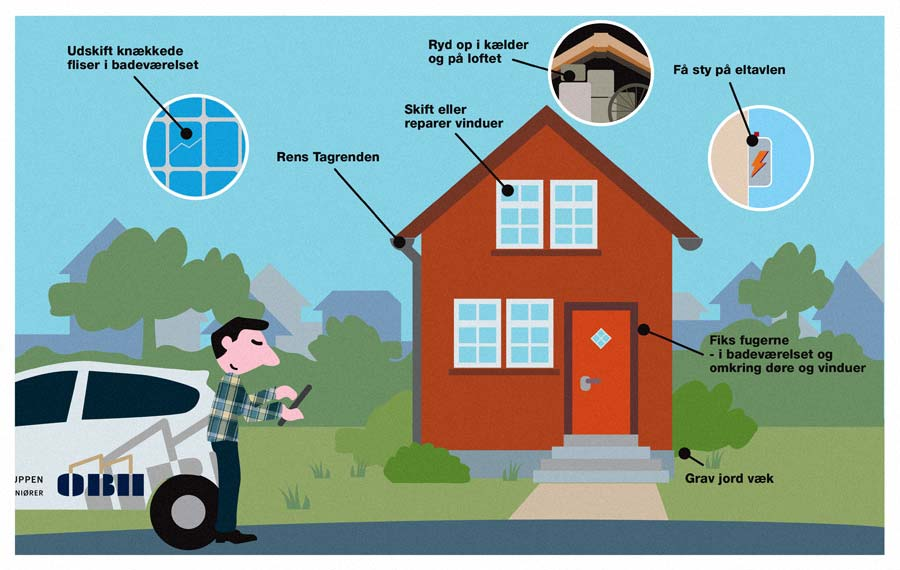

**"Ulovlige bygningsindretninger"** er i retspraksis blevet behandlet på samme måde som fysiske mangler, formentlig fordi en ulovlig bygningsindretning som regel kan lovliggøres ved en fysisk udbedring. 


---

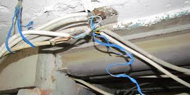

Efter retspraksis foreligger der en fysisk mangel ved en fast ejendom, hvis ejendommen ikke svarer til, hvad sælgeren har garanteret, eller hvad køberen over for sælgeren har forudsat.

Endvidere foreligger der en mangel, hvis ejendommen ikke svarer til, hvad køberen med rimelighed kunne forvente, jf. princippet i købelovens §§ 75 a og 76.

---

Det her skitserede mangelsbegreb må siges at rumme kerneindholdet af mangelsbegrebet, som i øvrigt meget vanskeligt lader sig fastlægge på området for køb og salg af fast ejendom. 

Ved bedømmelsen af, om en ejendom er mangelfuld, lægges der vægt på forholdene på tidspunktet for risikoens overgang, hvilket normalt er overtagelsesdagen, jf. købelovens §§ 44 og 77 a, stk. 1, der antages at gælde analogt ved køb af fast ejendom.

---

Ved afgørelsen af om der foreligger en mangel, lægges der bl.a. vægt på en række konkrete forhold som ejendommens alder, beliggenhed og bygningsmåde, købsaftalens indhold – herunder prisen – og omstændighederne ved aftalens indgåelse. 

Afgørelsen er skønsmæssig og konkret.

---

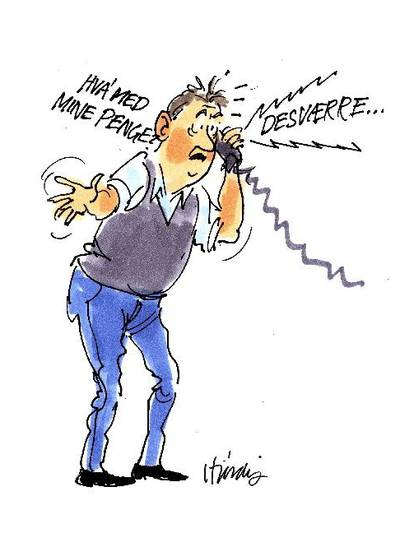

En betingelse for (ud over, at der skal kunne påvises et ansvarsgrundlag), at der overhovedet kan kræves erstatning af en sælger af fast ejendom er, at der kan konstateres en retlig relevant mangel. 

En retlig relevant mangel vurderes på baggrund af, om de konstaterede skader går ud over, hvad man som køber af en ejendom må forvente. 

Ved køb af fast ejendom er køberens mangelsbeføjelser, efter den almindelige obligationsret, retten til at hæve aftalen, at kræve forholdsmæssigt (passende) afslag i købesummen eller at kræve erstatning, jf. princippet i købelovens § 78. 

---

Efter entrepriseretlige regler kan køberen have krav på, at den pågældende entreprenør afhjælper fejl ved byggeriet.

En aftale om køb af fast ejendom kan som udgangspunkt kun hæves, hvis manglen er væsentlig, eller hvis sælgeren har handlet svigagtigt. 

Væsentlighedskravet er meget strengt ved køb af fast ejendom, fordi det normalt vil være et overordentligt indgribende retsmiddel at tvinge sælgeren til at tage ejendommen tilbage, efter at handlen er berigtiget. 

---

Et forholdsmæssigt afslags funktion er at korrigere den købspris, som parterne har aftalt, når det viser sig, at ejendommen ikke har den værdi, som den efter aftalen skulle have.  

Køber kan derfor have krav på et forholdsmæssigt afslag, selv om der for så vidt ikke er noget at bebrejde sælgeren, idet begrundelsen for afslaget er, at den pris, som sælgeren har fået for ejendommen, på grund af manglerne skønnes for høj. 

Efter almindelige obligationsretlige regler kan køberen som udgangspunkt kræve et forholdsmæssigt afslag i købesummen, hvis der foreligger en værdiforringende mangel.  

---

I retspraksis har man fraveget dette udgangspunkt, »idet der ved afgørelsen af, om køberen bør tilkendes et afslag, lægges vægt på manglens omfang og betydning for køberen.« 

Formålet med et forholdsmæssigt afslag er således at gennemføre en delvis restitution.   

Et forholdsmæssigt afslag er ikke betinget af, at der foreligger et ansvarsgrundlag eller andet særligt retsgrundlag. 

---

Udgangspunktet er således, at den pågældende mangel kan siges at være værdiforringende, idet man dog ser bort fra rene bagateller, se hertil dommen i **U 2008.2284 V**. Ikke grundlag for erstatning eller forholdsmæssigt afslag på grund af mangler ved tilbygning:
**<a href="https://pro.karnovgroup.dk/document/7000385757/1">Dommen klik her!</a>**

---

Praksis om mangler ved fast ejendom (før indførelsen af lov om forbrugerbeskyttelse ved erhvervelse af fast ejendom mv.) har – med skiftende variationer – sat bagatelgrænsen forholdsvis højt, ofte op mod 5-8 % af købesummen, førend der kunne gives køberen et forholdsmæssigt afslag.  

Efter almindelige erstatningsregler kan køberen kun kræve erstatning, hvis køberen på grund af manglen har lidt et økonomisk tab. 

---

Tabet skal være **"adækvat"** (påregneligt) for sælgeren, og der skal foreligge et ansvarsgrundlag. 

Ved køb af fast ejendom kan ansvarsgrundlaget i praksis enten være sælgers culpa, svig, vanhjemmel eller tilsidesættelse af sælgerens loyale oplysningspligt, eller en garanti. 

Er ejendommen opført med salg for øje, hæfter sælgeren i videre omfang, herunder for håndværksmæssige fejl begået under opførelsen.

---

Sælgerens loyale oplysningspligt er et centralt begreb, som indebærer, at sælgeren skal oplyse køberen om alle ikke-bagatelagtige forhold, som sælgeren kender eller burde kende, og som den pågældende må regne med, at køberen vil lægge vægt på.

Vurderingen af, hvad en ikke-bygningssagkyndig sælger burde have været bekendt med, må foretages konkret. 

Der lægges navnlig vægt på, om sælgeren i sin ejertid har haft grund til at nære mistanke om forholdet. 

---

Hvis det fx flere gange har været nødvendigt at reparere revner i muren, bør sælgeren som regel få mistanke om, at revnerne kan skyldes dårlig fundering. 

Hvorvidt der er givet en garanti, beror på en konkret fortolkning af aftalens ordlyd og omstændighederne ved aftalens indgåelse.

---

I de tilfælde, hvor garantien er aldeles klar og utvetydig, jf. kravene i de offentlige- og civilretlige standarder i markedsføringslovens § 17 hhv. aftalelovens § 38 b, stk. 2, vil der selvsagt ikke opstå noget problem.  

For at køberen kan gøre garantien gældende, må det forlanges, at den ikke alene og bestemt angiver, hvilke egenskaber der garanteres for (eller imod); fx at »ejendommens areal med garanti udgør så og så mange tønder land«, eller at »ejendommen er garanteret fri for hussvamp«, men garantien bør også angive, hvilke beføjelser køberen skal have, såfremt garantien bliver aktuel, fx ret til erstatning, hævebeføjelse eller andet. 

---

Oplysninger i tilstandsrapporten fra sælgeren kan ikke uden videre anses for at være garantier: 

En køber har som udgangspunkt ikke pligt til af egen drift at besigtige ejendommen før købet. 

Såfremt køberen inden købet, af en godtroende sælger, er blevet opfordret til at undersøge et bestemt angivet forhold nærmere, vil køberen normalt ikke senere kunne påberåbe sig det pågældende forhold som en mangel ved ejendommen, hvis han undlader at følge sælgers opfordring. 


Helt generelt formulerede opfordringer til at besigtige ejendommen har derimod ingen retsvirkning. 

I almindelighed stilles der ikke strenge krav til en købers evne til at opdage mangler i forbindelse med en undersøgelse af en fast ejendom. 

Det skyldes, at køberen i langt de fleste tilfælde savner de faglige forudsætninger for, at kunne vurdere ejendommens kvalitet i detaljer. 

---

En køber kan dog normalt ikke bevare sine mangelsindsigelser ved under besigtigelsen at holde sig i uvidenhed om fejl, som er almindeligt forekommende, og som i den pågældende ejendom kunne opdages af en ikke-fagmand, navnlig ikke hvis der er tale om et brugt hus. 

Der stilles strengere krav til køber, hvis den pågældende er bygningskyndig eller erhvervsmæssigt beskæftiger sig med opførelse eller videresalg af ejendomme.

Køberens undersøgelsespligt må i praksis ofte vejes op mod kravet til sælger om loyalt at oplyse om de mangler, som sælgeren er eller burde være bekendt med.

---

Skjulte fejl og mangler ved overdragelse af fast ejendom reguleres af forældelsesloven – herunder den relative forældelsesfrist på 3 år og den absolutte forældelsesfrist 10-år:


---

**Oversigt for fysiske mangler ved fast ejendom:**

En fysisk mangel ved en fast ejendom er typisk karakteriseret ved en defekt, som ikke burde være i en ejendom med den alder til den pris. Hvad kunne køber med rimelighed forvente?

---

**Uanset at sælger har fået udarbejdet tilstandsrapport mv., kan sælger være ansvarlig for mangler over for køberen, fx:**

* Ved ulovlige bygningsindretninger.

* Hvis sælgeren har givet garanti over for køberen.

* Hvis sælger har handlet svigagtigt eller groft uagtsomt fx ved oplysninger til den bygningssagkyndige eller køberen. 

---

Køber har en undersøgelsespligt – ved siden af sælgers loyale oplysningspligt. 

Mangler uden for bygningen fx, at der på grunden er nedgravet en olietank eller septiktank er sælger ansvarlig over for køberen.

---

Er der mangler ved den faste ejendom kan køberen gøre følgende misligholdelsesbeføjelser gældende over for sælgeren:

Erstatning, hvis de almindelige erstatningsbetingelser er opfyldt om økonomisk tab, ansvarsgrundlag, samt kausalitet og adækvans.

Forholdsmæssigt afslag, som i praksis er den normalt anvendte misligholdelsesbeføjelse for køberen.

Køberen kan undtagelsesvis hæve handlen, hvis manglen er væsentlig.

Mangler ved fast ejendom forældes 3 år efter køber har opdaget manglen eller burde have opdaget den, men maksimalt 10 år, jf. nærmere forældelseslovens § 3.

---

## Tilstandsrapport, el-tjek og ejerskifteforsikring


---

<h4><a href="https://youtu.be/dsA2EXsZVsg" target="_blank">Video Tilstandsrapport og energimærke</a></h4>

---

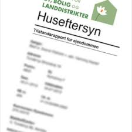

Sælger kan få udarbejdet tilstandsrapport af bygningssagkyndig.

Bygningssagkyndig gennemgår bygninger, men ikke grunden og installationer uden for bygningen.

Den bygningssagkyndige ser efter synlige mangler – ikke de skjulte   mangler, da der er tale om en visuel bygningsgennemgang.

---

Se dommen i **FED2019.26**. A og S købte et hus efter, at La havde udarbejdet en tilstandsrapport for huset. Af tilstandsrapporten fremgik, at der var revner i huset af kategorien K1 og K2. A og S opdagede efterfølgende, at huset var skævt og fik vurderet, at revnerne var værre end det, der fremgik af tilstandsrapporten. En skønsmand udtalte, at flere af indikationerne for skader ud over det, der fremgik af tilstandsrapporten, ikke var til stede på tidspunktet for La's besigtelse af huset, at de øvrige indikationer ikke entydigt indikerede skader af større omfang, og at der ikke var nogen større forskel på, om revnen blev kategoriseret som K2 eller K3. Landsretten fandt på denne baggrund, at La ikke havde handlet ansvarspådragende. 
**<a href="https://pro.karnovgroup.dk/document/7000844862/1">Dommen klik her!</a>**

---

Alle fejl og mangler gives karakter af den bygningssagkyndige i tilstandsrapporten (se fig.):
  
Sælger har en loyal oplysningspligt over for køberen og den bygningssagkyndige og elinstallatøren og skal supplere tilstandsrapporten og elinstallatørrapporten med alle de relevante forhold, sælgeren kender til.
  
El-tjek skal foretages af autoriseret elinstallatør.

Tillæg med udlevering af Hustypebeskrivelser.

---

<h4><a href="https://www.youtube.com/embed/GCogSgE3ZmU" target="_blank">Video Sådan sikrer du din hushandel</a></h4>

---

<h4><a href="https://www.youtube.com/embed/ioTmSBDIJ6k" target="_blank">Video Sådan bruger du hustypebeskrivelserne</a></h4>

---

På baggrund af tilstandsrapport og elinstallationsrapport indhenter sælgeren et tilbud om ejerskifteforsikring.

---

**Sælger er fri for ansvar for fejl og mangler ved den faste ejendom  (jf. LFFE § 2), hvis:**

- Køberen har modtaget tilstandsrapport fra sælger, som er mindre end 6 måneder gammel.

- Køberen har modtaget en elinstallationsrapport fra sælger, som er mindre end 12 måneder gammel.

- Køberen samtidig har modtaget tilbud fra sælger på en ejerskifteforsikring.
  
- Køberen har modtaget tilbud fra sælger om betaling af ½ præmie på 5-årig ejerskifteforsikring.

---

<h4><a href="https://www.youtube.com/embed/krfhBpCbbJg" target="_blank">Video Hvad dækker ejerskifteforsikringen</a></h4>

---


<h4><a href="https://youtu.be/aLNod14h5rc" target="_blank">Video Gode råd om ejerskifteforsikringen</a></h4>

---

<h4><a href="https://www.youtube.com/embed/O3nShnJ2w8c" target="_blank">Video Tjek huset før du køber</a></h4>

---
 
## Ejendomsmæglerens erstatningsansvar
 
Bestemmelsen i LOFE § 47 er en videreførelse af den tidligere omsætningslovs § 24. 

Dog er den tidligere omsætningslovs § 24, stk. 1, 2. pkt., samt en del af den tidligere omsætningslovs § 24, stk. 2, som vedrørte forslag til finansiering, ikke blevet videreført, idet ejendomsmægleren ikke længere kan formidle finansiering til køb af fast ejendom eller foretage beregninger heraf.

Ejendomsmægleren skal yde godtgørelse på objektivt grundlag for forkert provenuberegning eller forkert beregning af ejerudgift, uanset om fejlen kan bebrejdes ejendomsmægleren eller ej.

---

Udtrykket **”godtgørelse”** er valgt frem for ”erstatning” for at markere, at forbrugerens krav udløses uden hensyn til, om der er lidt et sådant tab, som ud fra et culpasynspunkt ville kunne forlanges erstattet. 

Det vil sige, at der ikke skal dokumenteres noget økonomisk tab hos forbrugeren.

---

Sikkerhed for forbrugerne ved handel med fast ejendom er et væsentligt formål med loven.

Det er derfor af helt afgørende betydning, at forbrugerne kan indrette sig i tillid til rigtigheden af professionelle ejendomsformidleres værdiansættelse og beregning af salgsprovenu og ejerudgift.

---

Når ejendomsmæglerens oplysninger på disse centrale punkter ikke er korrekte, er ejendomsmægleren nærmere end forbrugeren til at bære risikoen og langt bedre i stand dertil, fordi risikoen via prissætning og forsikring kan fordeles til en marginalomkostning spredt ud på et stort antal opdrag.

Ændringen i LOFE § 47 beskytter den tillid og forventning til korrektheden, som private forbrugere med føje har i kraft af, at oplysningerne er af den nævnte karakter og hidrører fra en professionel erhvervsudøver på området.

Forbrugeren har krav på godtgørelse, hvis denne i god tro har indrettet sin økonomi i tillid til ejendomsmæglerens beregning af salgsprovenu (sælger) eller ejerudgift (køber), og ejendomsmæglerens beregning er forkert til skade for vedkommende. 

---

Ejendomsmægleren må, hvis forbrugeren har handlet i god tro, godtgøre forbrugeren forskellen. 

Det er alene provenuberegningen ved salg, der er underlagt objektivt ansvar, jf. bestemmelsens henvisning til LOFE § 39.

---

Godtgørelse for fejl i oplysningerne om ejerudgiften må imidlertid fastsættes skønsmæssigt, jf. domspraksis.

Denne godtgørelse skal ikke give køberen mulighed for til evig tid at blive boende til den rigtige udgift, men alene kompensere i rimeligt omfang under hensyn til indrettelsesbetragtningen og omdisponeringsmulighederne.

---

Der skal ligeledes ydes en godtgørelse, hvis forbrugeren i god tro med rimelighed har disponeret i tillid til rigtigheden af en værdiansættelse foretaget af ejendomsmægleren, og denne afviger væsentligt fra, hvad den burde være efter reglen i LOFE § 27.

Værdiansættelsen danner grundlag for aftalen om udbudspris, men udbudsprisen siger intet om den tilgrundliggende værdiansættelse. 

---

I øvrigt bliver det sværere at bevise, at der er tale om en afvigelse, som angivet i bestemmelsen, jo længere tid der går.

At afvigelsen skal være væsentlig vil sige, at der skal foreligge et markant værdispring i forhold til den relevante ydergrænse for det skøn, som værdiansættelsen er udtryk for. 

Den forskel, som kan forlanges erstattet, fastsættes skønsmæssigt ud fra den nævnte ydergrænse.

---

Nedenfor følger tre eksempler fra nyere nævnspraksis, der behandler spørgsmålet om, hvorvidt mægleren skal yde godtgørelse på objektivt grundlag for forkert provenuberegning eller forkert beregning af ejerudgift, uanset om fejlen kan bebrejdes ejendomsmægleren eller ej.

---

I alle andre forhold kan ejendomsmægleren være erstatningsansvarlig efter dansk rets almindelige regler. 

For eksempel vil forbrugeren (køber eller sælger) have ret til erstatning efter dansk rets almindelige regler, såfremt forbrugeren lider et tab som følge af ejendomsmæglerens tilsidesættelse af sine pligter efter loven eller den indgåede formidlingsaftale. 

I almindelighed påhviler det forbrugeren, som vil kræve erstatning, at bevise, at ejendomsmæglerens indsats og rådgivning ikke har opfyldt de krav, der stilles til en sagkyndig ejendomsformidling.

---

Se dommen i **U 2019.2221 H** Ikke grundlag for erstatningsansvar i anledning af en ejendomsmæglers vurdering af værdien af en andelsboligforenings ejendom.
**<a href="https://pro.karnovgroup.dk/document/7000837036/1">Dommen klik her!</a>**

---


**Ejendomsmæglers rådgiveransvar vurderes efter almindelige erstatningsretlige principper:**

Professionsansvar, skærpet objektiviseret culpaansvar.
  
Ejendomsmægler har et objektivt ansvar, jf. LOFE § 47, hvis 

+	Provenu er beregnet forkert af ejendomsmægleren.

+	Beregning af ejerudgifter eller forslag til finansiering er forkert.
  
+	Værdiansættelsen afviger meget og forbrugeren er i god tro om fejlen.

---


  
Køberen kan klage over ejendomsmægleren til "Klagenævnet for ejendomsformidling", dog ikke over værdiansættelsen af ejendommen.
**<a href="https://www.ejendomsmaeglernaevnet.dk/">klik her!</a>**

---

"Disciplinærnævnet for Ejendomsmægler" træffer afgørelse i klagesager om overtrædelse af LOFE, herunder god skik for ejendomsmæglere.
**<a href="https://naevneneshus.dk/start-din-klage/disciplinaernaevnet-for-ejendomsmaeglere/">klik her!</a>**

---

## Eksamensopgave 1

**Kalle og Silles bolighandler**

Om ejendomshandel, forbrugerbeskyttelse, kreditsikring, omsætningsbeskyttelse, erstatningsret og professionsansvaret mv.


Kalle og Sille er kærester og ønsker at finde drømmehuset og flytte sammen. 

Og heldigvis har Kalle nu endelig efter 1½ års liggetid fået solgt sin lille 2-værelses ejerlejlighed. 

Kalle har underskrevet købeaftalen torsdag den 16. oktober og køber modtog et brev fra ejendomsmægleren om Kalles accept dagen efter. 

Kalle og Sille er henrykte og benytter weekenden den 18. og 19. oktober til at se på udvalgte huse i området. Søndag ser de på ejendommen Lærkevej 10, som de falder pladask for. 

Mandag kontakter de deres bankrådgiver, som umiddelbart er positiv overfor købet af ejendommen, da de nu har fået solgt ejerlejligheden. 

Han tilføjer dog: ”I første omgang må I lige afvente fortrydelsesfristens udløb”.


**Eksamensspørgsmålet:**

1. Hvornår udløber fortrydelsesfristen vedrørende ejerlejligheden?

---


**Eksamensspørgsmålet:**


2. Hvilke retsvirkninger har det for Kalle, hvis køberen fortryder aftalen indenfor fristen?

---

Heldigvis ønsker køberen at gennemføre købet af ejerlejligheden og det betyder, at Kalle og Silles køb af Lærkevej 10, nu kan gå i opfyldelse. 

Ejendommen koster kr. 1.795.000 kontant, som de får finansieret ved et realkreditlån på 1.435.000, et banklån på kr. 260.000 og en kontant udbetaling på kr. 100.000. 

Til finansiering af et nyt køkken og div. istandsættelser af ejendommen får de endvidere et lån fra Silles forældre på kr. 250.000 mod sikkerhed i ejendommen.


**Eksamensspørgsmålet:**

3. Forklar hvorledes henholdsvis realkredit, bank og forældrene kan opnå sikkerhed i ejendommen?

---

Kalle og Sille underskriver lånedokumenterne i banken den 9. december. 

Banken får dog på grund af travlhed i afdelingen først tinglyst deres pantebrev den 12. december kl. 12.30 og samme dag kl. 10.15 var realkreditpantebrevet, som var underskrevet den 10. december, ligeledes blevet tinglyst. 

Den 11. december har Kalle og Sille underskrevet lånedokumenterne hos forældrenes advokat, som får tinglyst ejerpantebrevet samme dag. 

Dette medfører en række anmærkninger ved tinglysningen og der opstår derfor uenighed mellem de tre panthavere om prioritetsstillingen i ejendommen.

**Eksamensspørgsmålet:**

4. Hvorledes er prioritetsstillingen i ejendomme?

---

Kalle og Sille har overtaget Lærkevej 10 og er begyndt at renovere ejendommen. 

De undrer sig dog over, at der ikke er en bygningstegning over værelserne på 1. salen, hvor loftshøjden også er noget lavere end i resten af huset. 

Ved en henvendelse til kommunens tekniske forvaltning finder de ud af, at 1. salen slet ikke er godkendt til beboelse. 

I salgsopstillingen, som var udarbejdet af ejendomsmægler Kryger fra MyHome stod der følgende: 

”Ejendommen har et boligareal på 156 m2, heraf 58 m2 udnyttet tagetage.”

Der var ikke udarbejdet nogen tilstandsrapport i forbindelse med handlen.

Lovliggørelse af 1. salen til beboelse vil ifølge en arkitekt koste 180.000. 

Sælger af ejendommen var et dødsbo og Kalle og Sille ønsker nu at gøre et erstatningskrav gældende mod ejendomsmægler Kryger, som de mener, ikke har undersøgt forholdene ved ejendommen tilstrækkeligt i forbindelse med salget. 

Kryger nægter at betale erstatning og siger, at de jo selv måtte have været opmærksomme på dette ved deres besigtigelse af ejendommen og modtagelsen af handelens dokumenter.

**Eksamensspørgsmålet:**

5. Giv en begrundet redegørelse for, om Kalle og Sille efter din opfattelse kan få medhold i deres krav mod ejendomsmægler Kryger.

---

Som var det ikke nok, opdager Kalle nogle måneder senere, at salgsopstillingen også havde en fejl vedrørende udgifterne til renovation, der årligt var angivet 600 kr. for lavt.

**Eksamensspørgsmålet:**

6. Hvordan er Kalles stilling i denne sag?

---

**Podcast om svaret på eksamensopgaven**

---

## Kort oversigt over finansiering af køb af fast ejendom

(Der henvises til de andre øknomiske-finansielle fag på studiet)
 
---

<h4><a href="https://youtu.be/4jT7zb0TzZ8" target="_blank">Video Køb af fast ejendom</a></h4>

---

* Køberen kan forberede finansiering af huskøbet ved at få et lånebevis fra sin bank

* Banken skal yde rådgivning om finansiering af fast ejendom (se nærmere kapitel 19 om rådgivning)

* I en købsaftale kan køber og sælger vælge:

**"Kontanthandel":** 

Købesummen betales til sælgeren ved at købers bank deponerer beløbet i sælgers bank. 

Næsten alle handler gennemføres i dag som kontanthandel. 

Det betyder blot, at køber, udover at deponere en kontant udbetaling hos ejendomsmægleren, får sin bank til at stille en bankgaranti for restkøbesummen. 

Bankgarantien afløses af en kontant deponering i sælgers bank på overtagelsesdagen. 

Men det er dog først, når skøde og tinglysning er endeligt- og anmærkningsfrit på plads, at sælger kan disponere over beløbet. 

---


<h4><a href="https://www.youtube.com/embed/VnxgfS2MTUM" target="_blank">Video få styr på førstegangskøbet: Hvad kan jeg købe bolig for?</a></h4>

---

Køber optager typisk et ejerskiftelån i ejendommen for at kunne fremskaffe købesummen. 

Et ejerskiftelån er egentlig bare betegnelsen for et almindeligt realkreditlån. 

Ethvert realkreditlån kan således være et ejerskiftelån. 

Realkreditlån (ejerskiftelån) kan kun optages i forbindelse med køb af fast ejendom, da der stilles sikkerhed for lånet i ejendommen. 

---

Det er således ikke muligt at optage realkreditlån i forbindelse med køb af andelsbolig. 

Årsagen er, at man ikke som sådan ejer sin andelsbolig, men er medejer i en større forening, der har optaget et eller flere lån. 

---

**"Finansieret handel":** 

Køber overtager sælgers lån i ejendommen – evt. nye lån, som køber har optaget i sælgers navn.
 

*	Realkreditbelåning kan maksimalt udgøre 80 % af ejendommens 
  værdi.
  
* I forbindelse med optagelse af realkreditlån, skal køberen 
  overveje:
  
+	Løbetid (10, 20 eller 30 år).

+	Afdragsfrihed (der betales kun renter på lånet og ikke 
  afdrag).
  
+	Fast eller variabel rente.

+	Kurssikring af lån.
  
---

<h4><a href="https://www.youtube.com/embed/XLCa5kGQ2HA" target="_blank">Video Nye boliglån</a></h4>

---

**For en nærmere gennemgang om køberes finansiering af fast ejendom, se lærebogen "Finansiel Rådgivning - privat" Hans Reitzels Forlag.**

---

## Oversigt over berigtigelse af skøde og refusionsopgørelse

---

<h4><a href="https://www.youtube.com/embed/3GBFrCyRmvw" target="_blank">Video Brug en boligadvokat, når du køber bolig</a></h4>

---

* Købers advokat skal rådgive køberen om hushandlen og gennemgå hushandlens væsentlige dokumenter.
  
* Advokaten skal sørge for at få tinglyst nyt skøde på ejendommen, for at sikre købers adkomst til ejendommen.
  
* Skødet vil få anmærkninger om sælgers endnu ikke aflyste lån.

* Efterhånden som sælgers lån bliver indfriet, vil anmærkningerne på skødet blive fjernet fra tingbogen.
  
* Når skødet er anmærkningsfrit kan købesummen frigives til sælgeren.
  
* Advokaten skal udarbejde en refusionsopgørelse til afslutning af ejendomshandlen.


---

<h4><a href="https://www.youtube.com/embed/PrxUe5RjQso" target="_blank">Video Valg af huslån</a></h4>

---

## Eksamensopgave 2

**”Jeg fik jobbet, mor!!”**

Om handel med fast ejendom


Martin var i fremragende humør. Han havde netop fået besked om at han var blevet ansat som ejendomsmægler hos ”Udby Mæglerne ApS” med start den 1. februar, hvor hans opgaver hovedsagelig ville bestå af salg af huse til private.

Den 1. februar mødte Martin op på sit nye arbejde og her blev han mødt af ejeren Egild. Han bød Martin velkommen og de to blev enige om at Martin sådan set bare kunne gå i gang med arbejdet, da han jo kendte al teorien fra sin tid som Finansøkonomstuderende. 

Martins første opgave var et spørgsmål som Egild var kommet i tvivl om: Egild havde en ejendom beliggende Bygaden 1, Udby til salg for Søren for 1.995.000 kr. Den 28. januar havde Keld henvendt sig til Egild, da han gerne ville købe ejendommen til prisen. Egild skyndte sig at udarbejde en købsaftale, som Keld skrev under om aftenen den 28. januar. 
Egild skyndte sig at sende købsaftalen til Søren, som skrev den under samme aften og afleverede den fysisk tilbage til Egild om morgenen den 29. januar. Egild tænkte at nu var aftalen i hus, men for god ordens skyld ville han lige sende den underskrevne købsaftale til Keld. Egild fik det dog ikke lige gjort, da hans morgenbacon var ved at brænde på. Da Egild kom tilbage til sit skrivebord kunne han se at der netop var kommet en mail fra Keld om at han fortrød købet og ikke ville have ejendommen alligevel.

**Eksamensspørgsmålet:**

1.	Er der indgået en bindende aftale mellem Keld og Søren omkring købet af ejendommen?  (10%)


2.	Hvilken forskel for besvarelsen i spørgsmål 1 ville det have haft, såfremt Egild havde sendt den underskrevne købsaftale tilbage til Keld inden Kelds mail om, at han ikke ville have ejendommen alligevel, kom frem til Eigild? (10%)

---

Martin´s første uger på arbejdet gik fint. Han fik mere og mere ansvar, og det lykkes ham efter ca. 3 uger at sælge sit første hus. Der var tale om et hus beliggende på adressen Sidegaden 1, Udby. Køber var Karsten Karstensen, mens sælger var Sigurd Sigurdsen. Martin havde hørt godt efter på studiet og havde derfor rådet Sigurd til at få udarbejdet tilstandsrapport, el-rapport, tilbud på ejerskifteforsikring samt tilbyde at betale halvdelen af ejerskifteforsikringen. Sigurd havde fulgt Martin´s råd. 

Efter at Karsten havde overtaget huset opdagede han et antal mangler, som han ikke havde været opmærksom på før, men som måtte have været der da han overtog huset. Der var tale om:

-	En ikke umiddelbar synlig revne i taget, som gør at det ved meget kraftig regn drypper ned i stuen. Manglen var ikke nævnt i tilstandsrapporten. Sigurd havde ikke nævnt det, da han aldrig havde været opmærksom på problemet. 

-	Et hul i kloakrøret ca. 5 meter fra huset, men fortsat inde på husets grund. Manglen var ikke nævnt i tilstandsrapporten. 
-	En mindre sætningsskade ved væggen i stuen. Manglen var nævnt i tilstandsrapporten.

-	En revne i en termorude. Manglen stod ikke nævnt i tilstandsrapporten, da revnen først var opstået efter at rapporten var lavet, men inden Karsten skulle overtage huset.

**Eksamensspørgsmålet:**

3.	Giv en begrundet redegørelse for hvem, om nogen, Karsten kan rette krav mod i anledning af udbedring af skaderne? (20%)

---

En fredag eftermiddag var Martin taget ud til en fremvisning af et hus beliggende i nabobyen Indby. Huset tilhørte Pernille. Martin havde i dagens anledning taget sine nye og meget dyre Armani® støvler på. Desværre havde han fået købt dem i en lidt for lille størrelse, men havde valgt at tage dem på alligevel selvom Egild ikke havde ment at det var en god idé, da han syntes at de ikke rigtig udstrålede det image som ”Udby Mæglerne ApS” gerne ville stå for.

Da Martin kommer ind i huset vil han tage støvlerne af, men finder ud af at de sidder rigtig godt fast. Han kæmper noget med støvlerne, men til sidst får han dem revet af. Desværre rammer han med sin voldsomme bevægelse det spejl der hænger i gange. Spejlet falder ned og smadrer mod gulvet. Ude i køkkenet står Pernille og er ved at lave kaffe. Hun bliver så forskrækket at hun taber den meget varme kaffe ned over sin hun ”Guffe”. ”Guffe”, der var en præmiehund med en værdi på 10.000 kr, måtte efterfølgende aflives.

**Eksamensspørgsmålet:**

4.	Er nogen, og i givet fald hvem, erstatningspligtig over for Pernille for tabet af ”Guffe” og det smadrede spejl? (25 %)

---

En af Martins bekendte Birte arbejdede som privatrådgiver i den lokale bank ”Udby sparekasse”. Lars var en af hendes kunder, og ejede en ejendom beliggende Kirkegade 1 i Udby. Ejendommen var for nuværende alene behæftet med et realkreditpantebrev på kr. 1.000.000 med ”Dansk Realkreditselskab” som kreditor. Lars ønskede nu at låne 500.000 kr. i Birtes bank til brug for en større ombygning af ejendommen. Banken havde vurderet Lars som kreditværdig til lånet, og Lars havde givet udtryk for at han ville give banken sikkerhed for lånet i ejendommen, der var vurderet til 2.000.000 kr. På et af deres møder havde Lars fortalt han gerne ville have at pantebrevet også skulle kunne anvendes til sikkerhed for at mindre lån på 50.000 kr. som han havde tænkt sig at optage i nabobyens bank ”Indby bank”.

**Eksamensspørgsmålet:**

5.	Hvilken form for pantebrev kan anvendes til sikring af bankens krav, hvis der tages hensyn til Lars´s ønsker? (10%)

---

Lars ejede også naboejendommen beliggende Kirkegade 3 i Udby. I denne ejendom havde han været nød til at optage en del lån, da der havde været mange uforudsete renoveringsudgifter. Det drejede sig om:

-	Den 1. marts havde Lars optaget et realkreditlån med en hovedstol på 1.100.000 kr. hos ”Dansk Realkreditselskab” med sikkerhed i ejendommen. Pantebrevet var blevet anmeldt til tinglysning den 6. marts

-	Den 2. marts optog Lars et usikret forbrugslån i ”Udby sparekasse” på 100.000 kr. 

-	Den 5. marts optog Lars et lån i ”Indby bank” med en hovedstol på 400.000 kr. med sikkerhed i ejendommen. Pantebrevet var blevet anmeldt til tinglysning samme dag. På et tidligere møde med banken havde Lars både fortalt at han ville optage et realkreditlån, og realkreditselskabet havde krævet at få 1. prioritet, samt at havde ville optage det usikrede forbrugslån i ”Udby sparekasse”.

-	Den 10 marts foretog SKAT udlæg i ejendommen for 150.000 kr. Udlægget blev anmeldt til tinglysning den 15. marts. 

-	Den 13. marts optog Lars et lån i ”Udby sparekasse” på 100.000 kr. med sikkerhed i ejendommen. Pantebrevet blev anmeldt til tinglysning samme dag. Den 14. marts gjorde SKAT ”Udby sparekasse” opmærksom på at de havde foretaget udlæg den 10. marts.

Efterfølgende viste det sig desværre at Lars ikke kunne betale på sine lån, og ejendommen blev solgt på tvangsauktion.

(Ved besvarelsen nedenfor skal det lægges til grund at lånenes hovedstol er identisk med restgælden)

**Eksamensspørgsmålet:**

6.	Hvis der på tvangsauktionen opnås et provenu på 1.550.000 kr., hvilke kreditorer får så del i summen, i hvilken rækkefølge og med hvilket beløb? (25%)
 

---

**Podcast om svaret på eksamensopgaven**

---

## Eksamensopgave 3

**Ejendomsmæglerne Anna og Oline**

Opgave 1 (20 %)  
 
Anna og Oline er veninder og har kendt hinanden siden gymnasietiden. De er begge gået ejendomsmæglervejen og er netop blevet registrerede ejendomsmæglere. Anna er gift og har et barn, og ejer sammen med sin mand en større villa nær Aarhus. Oline lever sammen med sin kæreste i en lejet lejlighed ved havnefronten i Aarhus.  
 
Anna og Oline har begge et ønske om at blive selvstændige erhvervsdrivende, og de synes derfor, at det er nærliggende at starte en ejendomsmæglervirksomhed op sammen. De ønsker ikke at indgå i et kædesamarbejde. Det skal være en uafhængig ejendomsmæglervirksomhed. De er enige om, at de skal have lige stor indflydelse på driften, og at de skal indskyde lige meget i startkapital. De har sparet ca. 100.000 kr. op hver, som de tænker skal anvendes til indskud, hvis der skulle være et kapitalkrav i forbindeles med virksomhedsoprettelsen.  
 
Det vil desuden være nødvendigt for dem at optage et lån til diverse udgifter i forbindelse med opstarten af virksomheden (husleje, depositum, driftsmidler og markedsføring m.m.,) samt oprette en kassekredit i banken til den løbende drift, da de ud over opsparingen til virksomhedsoprettelsen ikke har nogen formue. Anna og hendes mand har dog en mindre friværdi i deres villa.  
 
Anna og Oline har gjort sig mange overvejelser omkring, hvordan de skal gribe det an. De har begge nogle vage minder fra deres studie, hvor de havde noget omkring forskellige virksomhedsformer og hæftelsesforhold, der skal tages stilling til ved etablering af selvstændig virksomhed. De husker også eksempler på virksomhedsejere, der har været tvunget fra hus og hjem, da deres firma gik konkurs. De er derfor meget usikre på, hvilken virksomhedsform, der vil passe til dem, herunder om de skal stifte et I/S, ApS, IVS eller A/S.  
  
De søger nu rådgivning omkring emnet hos dig, der er ansat som ung revisorassistent i et mindre revisorfirma i Aarhus.  
 
Dit svar på spørgsmålet skal begrundes og hvor det er relevant, skal der henvises til love og paragraffer. 

**Eksamensspørgsmålet:**
 
Spørgsmål 1.1 (20 %) 
 
Redegør over for Anna og Oline, hvilke fordele og ulemper der kan være ved de fire virksomhedsformer samt, hvilken virksomhedsform, du skønner, vil egne sig bedst til deres virksomhed.  

---
 
 
Opgave 2 (35 %) 
 
Anna og Oline er helt afklarede efter mødet hos revisoren omkring virksomhedsformer og de beslutter sig for at leje sig ind i nogle butikslokaler på havnefronten i Aarhus. De ligger nu i forhandlinger med deres bank omkring oprettelse af et lån på 400.000 kr. samt etablering af en kassekredit på 100.000 kr. Banken vil gerne låne pengene til virksomheden samt oprette en kassekredit, men da det er en nyetableret virksomhed uden omsætning og kundegrundlag kræver banken, uanset den etablerede virksomhedsform, sikkerhedsstillelse i form af kaution for lånet på 400.000 kr.  
 
Da Anna og Oline ikke selv har mulighed for at kautionere for lånet på 400.000 kr., tilbyder Annas mor og far at gøre det. De er fraskilte, men har begge en god økonomi og en pæn formue. De har dog begge nogle spørgsmål, som de gerne vil have besvaret inden de indgår en kautionsaftale med banken. Annas mor og far beder derfor om et møde med dig, der er ansat som erhvervskunderådgiver i banken.  

**Eksamensspørgsmålet:**
 
Du skal nu forberede kundemødet og udarbejde et notat hertil med svar på følgende spørgsmål:     
 
Dine svar på spørgsmålene skal begrundes og hvor det er relevant, skal der henvises til love og paragraffer.  
 
Eksamensspørgsmålet: 2.1 (10 %) 
 
Hvilken kautionsform vil være mest fordelagtig for henholdsvis banken og kautionisterne? 
 
Eksamensspørgsmålet: 2.2 (15 %) 
 
Bliver der tale om privat eller erhvervsmæssig kaution i det konkrete tilfælde, og hvilken betydning har sondringen for banken i forhold til kautionisterne? 
 
 
For kassekreditten har din kreditchef i banken stillet dig nedenstående spørgsmål, som han forventer et uddybende svar på. 
 
Eksamensspørgsmålet: 2.3 (10 %) 
 
Som du kan se, har banken ikke sikkerhed for kassekreditten. Hvor i konkursordenen skal dette krav placeres, hvis Anna og Oline en dag går konkurs, og hvilken betydning har det for bankens mulighed for at få dækning for deres krav? 

---
 
 
Opgave 3 (45 %) 
 
Anna og Olines ejendomsmæglervirksomhed kører rigtig godt. De har flere attraktive ejerlejligheder og villaer til salg, og der er godt gang i salget af begge dele. Da de har travlt, har de fornylig ansat dig som trainee i ejendomsmæglervirksomheden.  
 
På det daglige morgenmøde beder Anna og Oline dig om at forberede et kundemøde, hvor du skal gennemgå et udkast til en formidlingsaftale med potentiel sælger af en villa. Denne har på forhånd sendt en mail med nogle spørgsmål omkring en ejendomshandel, som han gerne vil have svar på inden, han underskriver aftalen. Du skal nu lave dit notat med svar på nedenstående spørgsmål, så du er godt forberedt til kundemødet.  
 
Dine svar på spørgsmålene skal begrundes og hvor det er relevant, skal der henvises til love og paragraffer. 

**Eksamensspørgsmålet:**
 
Eksamensspørgsmålet: 3.1 (15 %) 
 
Hvilke betingelser skal sælger af en villa opfylde for at frigøre sig fra sit ansvar for skjulte fejl og mangler? 
 
Eksamensspørgsmålet: 3.2 (20 %) 
 
Er der fortrydelsesret i forbindelse med køb af en villa, og i givet fald, hvordan fungerer ordningen?  
 
Eksamensspørgsmålet: 3.3 (10 %) 
 
Når der er afgivet et købstilbud på en villa, hvor længe kan køber da nå at trække sit tilbud tilbage? 

---

<h4><a href="https://www.youtube.com/embed/GCogSgE3ZmU" target="_blank">Video Sådan sikrer du din hushandel</a></h4>

---

**Podcast om svaret på eksamensopgaven**

---

<h4><a href="https://www.youtube.com/embed/hH5T-cIhfSY" target="_blank">Video Hvad er det bedste lån?</a></h4>

---

<h4><a href="https://www.youtube.com/embed/kUx-iNg3tPk" target="_blank">Video Råd fra førstegangskøbere</a></h4>


---

## Forældrekøb

Forældrekøb er, når man som forældre køber en ejerbolig for at leje den ud til sit barn. 

Ved forældrekøb skal man vælge mellem tre beskatningsmetoder.

Forældrene skal betale skat af huslejeindtægten, men forældre skal ikke betale ejendomsværdiskat. 

---

Hør nærmere en Podcast fra SKAT om forældrekøb.
**<a href="https://skat.dk/skat.aspx?oid=2234784" target="_blank">klik her!</a>**

---

<h4><a href="https://www.forbrug.dk/quiz/boligquizzen/?rn=43716" target="_blank">Quiz om boligen</a></h4>


---

## Quiz

<h4><a href="https://quiz.tepedu.dk/jura21" target="_blank">Quiz Handel med fast ejendom</a></h4>


 


<!--chapter:end:16-Handelejendom.Rmd-->

# Familieret

```{r, echo=FALSE, results='asis'}
cat(readLines('np.html'))
```


---

***Forståelsen af reglerne om ægtefællers økonomiske forhold kan være anvendelig for dig, der skal arbejde i ejendomshandel, ejendomsadministration, bank og realkredit, forsikring, samt revision og økonomifunktion i forbindelse med sikkerhedsstillelse ved lån til ægtefællerne ved deres køb af fast ejendom, lejeforhold og ved låneoptag mv.***

---

***Som studerende skal du være særlig opmærksom på følgende problemstillinger ved gennemgangen af familieretten til eksamen og din gennemførelse af "OLA" ved udarbejdelse af det juridiske kundenotat:***

* Relateres til rådgivning af privatkunder.  

* Ægtefællernes hæftelse for lån, jf. ÆF § 3. 

* Ægtefællers særråden, jf. ÆF § 1. 

* Skilsmissebodelingers betydning for privatøkonomien (delingsformue og særeje), herunder at rimelige pensionsrettigheder holdes uden for skilsmisseboet. 

---

**Familieretten" anvendes også i faget "Privatøkonomisk rådgivning" på Finansøkonomuddannelsen.**

---

Citat:

*Det er bedre at være ulykkeligt forelsket end at være ulykkeligt gift. For mange mennesker lykkes begge dele – Guy de Maupassant*

---


## Ægtefællernes rådighed under ægteskabet  

 
---

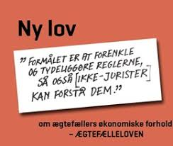

Lovbekendtgørelse 2019-08-07 nr. 774 om ægtefællers økonomiske forhold (forkortet her "ÆF")– gælder for ægtefæller – ikke for ugifte samlevende – og regulerer ægtefællernes økonomiske forhold indbyrdes. 
**<a href="https://jura.tepedu.dk/lovsamling.html" target="_blank">Lovsamlingen klik her!</a>**


---

**Under ægteskabet er ægtefællerne to selvstændige personer med hver sin økonomi.** 

---

**Ægtefællerne har særråden og særhæften**


**Særråden** betyder, at uanset ægteskabets indgåelse så råder hver ægtefælle stadig over de aktiver, som den pågældende står som ejer af. 

Står bilen i mandens navn kan manden altså frit sælge den uden at spørge sin ægtefælle. 

Står bilen derimod i hans ægtefælles navn er det kun hans ægtefælle, der kan sælge bilen.  

---

På samme måde betyder princippet om særhæften, at hver ægtefælle, uanset ægteskabets indgåelse, alene hæfter for sin egen gæld. 

Det, at man indgår ægteskab betyder altså som klart udgangspunkt ikke, at man kommer til at hæfte for sin ægtefælles gæld. 

---

En enkelt generel undtagelse fra denne hovedregel er dog skattegæld, som den ene part opbygger under ægteskabet. 

Her er den anden part medhæftende på grund af princippet om sambeskatning af ægtefæller.  

I alle øvrige forhold har det til gengæld stor betydning hvem af ægtefællerne der står som ejer af de enkelte aktiver og hvem der hæfter for gælden.^[Følgende afsnit om familieretten bygger især på *Linda Nielsens* Karnovkommentar til lov om ægtefællers økonomiske forhold (ÆF), KarnovGroup.] 

---

<h4><a href="https://www.youtube.com/embed/lXw-hdped28" target="_blank" >Video Familieliv og jura</a></h4>


---

## Ægtefællelovens inddeling

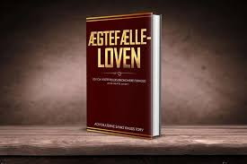


**Lov og ægtefællers økonomiske forhold (forkortet; ÆF) er inddelt i 7 afsnit:**  


* Afsnit I indeholder almindelige bestemmelser om ægtefællers økonomiske forhold. 

* Afsnittet indledes med kapitel 1, der indeholder regler om ægtefællers ret til at råde over deres formue, om aftaler mellem ægtefæller, om hæftelse for gæld og om forsørgelsespligt under ægteskabet. 

* Kapitlet indeholder også den centrale bestemmelse om formuedelingen, der fastslår, at ægtefællers formue som udgangspunkt deles lige mellem dem ved separation, skilsmisse og død.

* Afsnit I indeholder endvidere regler om forbud mod salg m.v. af familiens helårsbolig uden den anden ægtefælles samtykke (kapitel 2) og om gaver til og andre aftaler med tredjemand (kapitel 3).  

* Afsnit II indeholder reglerne om særeje og forhåndsaftaler om formuedelingen. 

* I kapitel 4 og 5 fastlægges ægtefællers muligheder for ved ægtepagt at indgå aftaler om særeje og andre forhåndsaftaler om formuedelingen, mens kapitel 6 indeholder formkrav til ægtepagter. 

* Regler om særejebestemmelser om arv og gave fra tredjemand findes i kapitel 7, og kapitel 8 indeholder generelle regler for særeje, herunder om surrogater for og indtægter af særeje.  

* Afsnit III indeholder reglerne om formuedelingen ved separation og skilsmisse. 

* I kapitel 9 findes de grundlæggende regler om formuedelingen, herunder en oversigt over de aktiver m.v., der ikke indgår i delingen, fastlæggelse af ophørsdagen, fradrag af gæld, aftaler om formuedelingen og fravigelse af ligedelingen ved kortvarige ægteskaber. 

* Aktiver, der ikke indgår i formuedelingen, er reguleret i kapitel 10. Kapitel 11-13 indeholder regler om regulerings- og misbrugskrav (de nuværende vederlagskrav), om kompensationskrav (medvirken til formueforøgelse og urimeligt økonomisk stillet) samt pensionskompensation.* 

* Endelig indeholder kapitel 14 regler om ægtefællernes ret til at udtage aktiver, der indgår i formuedelingen.  

* Afsnit IV (kapitel 15) indeholder særregler om formuedeling ved en ægtefælles død og ved deling af uskiftet bo.  

* Afsnit V (kapitel 16) indeholder regler om fastsættelse og ændring af ægtefællebidrag under ægteskabet, om Familieretshusets sagsbehandling samt om klage over Familieretshusets afgørelser til familieretten.  

* Afsnit VI (kapitel 18) indeholder regler om internationale forhold, navnlig om lovvalget for ægtefællers økonomiske forhold.  

* Endelig fastlægges tidspunktet for lovens ikrafttræden (den 1. januar 2018) i afsnit VII, der også indeholder overgangsregler og bestemmelser om loven territoriale anvendelse (kapitel 19-21).

---


Behandlingen af sager om formuedelingen ved separation og skilsmisse er fortsat reguleret i ægtefælleskifteloven, og arveloven og dødsboskifteloven indeholder regler om skifte af dødsboer og uskiftede boer.  

---

## Almindelige bestemmelser om ægtefællers økonomiske forhold

**Det følger af ÆF § 1:** 

”Under ægteskabet råder hver ægtefælle over sin formue, uanset om formuen er erhvervet før eller efter indgåelsen af ægteskabet, dog med de begrænsninger, som følger af stk. 2, § 2 og kapitel 2 og 3”. 

---

Det betyder, at hver ægtefælle har i levende live rådigheden over alt, hvad ægtefællen har indført i fællesboet. 

Denne råderet kaldes **"særråden"**. 

En ægtefælle kan således som udgangspunkt frit sælge, bortgive og pantsætte sine aktiver uden at spørge den anden ægtefælle om lov. 

---

Efter ÆF § 1, stk. 1, råder hver ægtefælle under ægteskabet over sin formue, uanset om formuen er erhvervet før eller efter indgåelsen af ægteskabet, dog med de begrænsninger som følger af ÆF § 1, stk. 2 (forringelse af formuen), og ÆF § 2 (begrænsninger i ægtefællers adgang til at indgå aftaler med hinanden), samt kapitel 2 (beskyttelse af familiens helårsbolig) og kapitel 3 (gaver til og aftaler med tredjemand).  

---

Efter ÆF § 1, stk. 2 skal en ægtefælle råde over sin formue på en sådan måde, at den ikke utilbørligt forringes til skade for den anden ægtefælle. 

Bestemmelsen omfatter ikke kun råden over ægtefællens delingsformue, men hele ægtefællens formue, herunder navnlig "særeje". 

Baggrunden herfor er, at forringelse af en ægtefælles særeje m.v. kan får betydning ved formuedelingen, fx hvis den ene ægtefælle har et "regulerings- og misbrugskrav" efter lovens kapitel 11, der bl.a. kan rettes mod den anden ægtefælles særeje.   


---

Overtrædelse af ÆF § 1, stk. 2 er ikke selvstændigt sanktioneret, men "misbrug af formuen" kan udløse misbrugskrav efter ÆF § 40, og efter ÆF § 10 kan gaver til tredjemand i visse situationer kræves tilbage.  

Bestemmelsen i ÆF § 1, stk. 2 omhandler en ægtefælles ret til at råde i forhold til tredjemand. 

Bestemmelsen vedrører adgangen til at råde i levende live, da en ægtefælles ret til at råde over sin formue ved sin død er reguleret i arveloven.  

Efter ÆF § 1, stk. 3 kan en ægtefælle under samlivet foretage dispositioner, der ikke uden ulempe kan udsættes, hvis den anden ægtefælle er forhindret i at varetage sine interesser på grund af fravær eller sygdom. 

Dette omfatter også afhændelse og pantsætning, når dette af hensyn til familiens underhold er uomgængeligt nødvendigt. 


Fast ejendom kan dog ikke afhændes eller pantsættes uden Familieretshuset eller familierettens tilladelse.  

Anvendelse af bestemmelsen i ÆF § 1, stk. 3 forudsætter, at samlivet mellem ægtefællerne består. 

Bestemmelsen finder således ikke anvendelse, hvis samlivet er ophævet på grund af uoverensstemmelse, mens bestemmelsen finder anvendelse, selvom ægtefællerne lever adskilt af andre grunde. 

Hvis samlivet har været ophævet på grund af uoverensstemmelse, men senere genoptages, finder bestemmelsen anvendelse igen. 


Efter ÆF § 1, stk. 3 er en ægtefælle ikke forhindret i at varetage sine interesser, hvis den pågældende er i fængsel, på hospital eller institution eller på udlandsrejse, i det omfang det er muligt at komme i kontakt med den pågældende ægtefælle med henblik på at få samtykke til den omhandlede retshandel, eventuelt pr. telefon eller e-mail. 

Bestemmelsen omhandler både ægtefællens bemyndigelse i forhold til den anden ægtefælle til at handle på dennes vegne og ægtefællens legitimation til at handle i forhold til tredjemand. 

Bestemmelsen finder også anvendelse, selvom der er formuefællesskab i ægteskabet, og selvom der er tale om en disposition vedrørende et særejeaktiv. 

---

Dispositionsadgangen gælder ikke, hvis en anden er bemyndiget til at foretage dispositionen, eksempelvis ved en almindelig fuldmagt eller ved en **"fremtidsfuldmagt"** efter lov nr. 618 af 8. juni 2016 om fremtidsfuldmagter:

En fremtidsfuldmagt er en fuldmagt, som kan sættes i kraft en gang i fremtiden, hvis du bliver syg eller svækket og mister evnen til selv at tage vare på dine økonomiske eller personlige forhold. Du kan give fremtidsfuldmagt til en eller flere personer, som du selv udpeger.

---

Bemyndigelsen til at foretage dispositionen kan også tilkomme en værge, der er beskikket efter værgemålsloven.

---

Ægtefællernes adgang til at indgå aftaler og pådrage sig forpligtelser over for hinanden reguleres af ÆF § 2. 

Efter ÆF § 2, stk. 1, kan ægtefæller under ægteskabet indgå aftaler med hinanden, give hinanden gaver og pådrage sig forpligtelser over for hinanden med de undtagelser, der følger af ÆF § 2, stk. 2 og 3 samt konkurslovens § 64. 

---

Der kan fx ske overdragelse af aktiver fra den ene ægtefælle til den anden ægtefælle, leje af hinandens aktiver, ydelse af lån og ansættelse af den ene ægtefælle i den anden ægtefælles virksomhed. 

Det gælder, uanset om de har særeje eller delingsformue, at de fx med juridisk gyldighed kan købe hinandens ting eller pantsætte dem til hinanden, indgå lejeaftaler og arbejdsaftaler mv., se nærmere dommene **U 1943.947, U 1931.294 H og U 1930.1 H**. 

---

**Studenteropgave**

Redegøre nærmere for dommene i **U 1943.947, U 1931.294 H og U 1930.1 H**.
**<a href="https://pro.karnovgroup.dk/journals/ufr">Find dommene klik her!</a>**

---

Da ægtefæller ofte tager ret formløst på de aftaler, de indgår under ægteskabet, kan det i praksis være vanskeligt at afgrænse lån, gaver, sameje og forsørgelse. 

Spørgsmålet har konsekvenser dels over for ægtepars kreditorer, dels over for ægtefællerne selv i en senere bodelingssituation, især for ægtefæller med særeje. 

Den ægtefælle, der hævder at have et gældskrav på den anden, må føre bevis herfor, idet der som udgangspunkt er en formodning for, at overførsel af pengebeløb til ægtefællen sker til opfyldelse af forsørgelsespligten. 

---

Ægtefællerne kan også pådrage sig forpligtelser over for hinanden uden aftale, fx som følge af, at en ægtefælle uagtsomt eller forsætligt forvolder skade på den anden ægtefælles ejendele eller person. 

---

Der kan være tale om erstatnings- eller kontraktsforpligtelser, jf. dommene: i 

**U 1986.212 V** Erstatningsansvar for uberettiget afhændelse*. 
**<a href="https://pro.karnovgroup.dk/document/7000203470/1">Dommen klik her!</a>**

---

Se dommen i **U 1966.151 H:** Tvist mellem fraskilte ægtefæller, som havde haft fuldstændig særeje, om retten til diverse smykker og pelse.
**<a href="https://pro.karnovgroup.dk/document/7000217362/1">Dommen klik her!</a>**

---

Se dommen i **U 1963.1056 Ø** Drabsforsøg, personskade: "H erstatningsansvarlig over for M for mordforsøg. Kravet ej nedsat pga. parternes formuefællesskab. Om kravet skulle indgå i fællesboet, henhørte under skifteretten. 
**<a href="https://pro.karnovgroup.dk/document/7000216131/1">Dommen klik her!</a>**

---

Dommen i **U 1954.825 Ø** Regreskrav for tab af forsørger ikke anerkendt: "Forsikrer ikke tillagt regres i enke og efterladte børns erstatning for tabt forsørger". 
**<a href="https://pro.karnovgroup.dk/document/7000223565/1">Dommen klik her!</a>**

---

Dommen i **U 1959.403/1 Ø** Færdselsuheld: "Motorførers hustru tilkendt erstatning. Der tilkendtes en motorførers hustru, der var passager i automobilet, erstatning hos føreren og dennes forsikringsselskab i anledning af en hende ved førerens uagtsomhed tilføjet skade". 
**<a href="https://pro.karnovgroup.dk/document/7000224605/1">Dommen klik her!</a>**

---

Dommen i **U 1936.636/1 Ø** Færdselsuheld: "Erstatningsansvar. Ved Ø L D 2 Marts 1936 i Anke III 530/1935 (Dansk Forening for international Motorkøretøjsforsikring mod Overlæge Niels Christoffer Bøckmann, Norge) blev Føreren af et Automobil, som ved uforsigtig Kørsel havde foraarsaget Sammenstød med en anden Motorvogn, hvorved bl.a. hans Hustru, der var Passager i hans Vogn, kom til Skade, dømt til at betale hende en Erstatning af 789 Kr, idet der efter den gældende Lovgivning ikke saas at være noget til Hinder for, at Ægtefæller, selv om de lever i sædvanligt Formuefællesskab, kan paadrage sig Erstatningsansvar overfor hinanden, jfr Lov Nr 56 af 18 Marts 1925 § 29".
**<a href="https://pro.karnovgroup.dk/document/7000775312/1">Dommen klik her!</a>**

---

Ægtefællerne kan fx have en interesse i at få erstatningsansvaret fastlagt, hvor skaden er dækket af en forsikring, fx ansvarsforsikring for en bil.  

Efter ÆF § 2, stk. 2 kan ægtefæller ikke ved aftale fravige reglerne i loven, medmindre andet følger af lovens kapitler 4-6 (aftaler om særeje og andre aftaler om formuedeling, samt krav om ægtepagt for sådanne aftaler), samt ÆF § 25, stk. 2, (aftaler om surrogater for og indtægter af særeje og ÆF § 32 (aftaler om formuedeling i forbindelse med separation og skilsmisse).

---

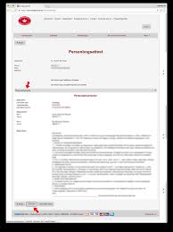

**Kort om ægtepagt:**

En ægtepagt om særeje er en skriftlig aftale mellem to ægtefæller. 

Aftalen bestemmer, at der ikke skal gælde formuefællesskab i ægteskabet, som man ellers automatisk får, når man gifter sig. 

Formuefællesskab betyder kort sagt, at man som ægtefæller skal dele formuer i tilfælde af separation, skilsmisse eller død. 

Hvis man som ægtefæller ikke ønsker dette, kan man helt eller delvist ophæve denne betingelse med en ægtepagt om særeje.

Der er ingen regler for, hvornår en ægtepagt skal laves. 

Det betyder, at en ægtepagt både kan laves og indgås før eller efter man er blevet gift. 

Derfor er ægtepagtens gyldighed den samme, uanset hvad man vælger. 


---

Det er kun en skriftlig og tinglyst ægtepagt (i Personbogen), der vil være gyldig. 

---

Det latinske ord **"inter partes"**; mellem parterne indbyrdes, betyder i denne sammenhæng, at en utinglyst ægtepagt er ugyldig ikke blot i forhold til omverdenen, men også "inter partes".

---

Da en ægtepagt er en aftale, kræves det (som ved alle andre typer af aftaler), at der er enighed mellem parterne. 

Det er altså ikke nok, at den ene ægtefælle eksempelvis ønsker særeje i ægteskabet. 

---

Begge ægtefæller skal være enige herom og indgå en skriftlig (og tinglyst i Personbogen) ægtepagt for, at ønsket bliver en realitet.

Ægtepagter som begreb bliver behandlet senere nedenfor.

---

<h4><a href="https://www.youtube.com/embed/NNG8jga_q_Y" target="_blank" >Video Tinglysning af ægtepagt</a></h4>

---

<h4><a href="https://www.youtube.com/embed/DQmRSVrdmrY" target="_blank" >Video Sådan laver du selv en ægtepagt</a></h4>

---

**Begrænsninger i ægtefællernes aftalefrihed:**

Ægtefæller kan navnlig ikke give afkald på **"retten til forsørgelse"** efter ÆF § 4, stk. 1, eller på forhånd aftale fravigelse af reglerne om samtykke til dispositioner over familiens helårsbolig (lovens kapitel 2).  

Ægtefæller kan ligeledes ikke indgå forhåndsaftaler om formuedelingen ved separation, skilsmisse og død (lovens afsnit III og IV), om regulerings- og misbrugskrav (lovens kapitel 11), om retten til kompensation (lovens kapitel 12), om pensionskompensation (lovens kapitel 13) og om udtagelse af aktiver (lovens kapitel 14).  

Efter ÆF § 2, stk. 3 kan ægtefæller ikke gyldigt aftale, at det, som den ene ægtefælle fremtidigt erhverver, uden vederlag skal tilfalde den anden ægtefælle.


---

**Princippet om ægtefællens særhæften:**

Efter ÆF § 3 hæfter hver af ægtefællerne med den del af delingsformuen, hvorover den pågældende ægtefælle råder, og med sit særeje for de forpligtelser, der påhviler ægtefællen, hvad enten forpligtelserne er opstået før eller under ægteskabet. 

Bestemmelsen medfører, at en ægtefælle alene hæfter for sin egen gæld. 

Dette kaldes **"særhæften"**. 

En ægtefælle hæfter således som udgangspunkt ikke for den anden ægtefælles gæld. Ægtefæller hæfter dog sammen for forpligtelser, som de har påtaget sig sammen, fx ved i fællesskab at optage et lån. 

Ægtefæller hæfter også sammen for forpligtigelser, der følger af, at de sammen ejer et aktiv (sameje), fx ejendomsskatter vedrørende en fast ejendom, som de begge er medejere af.  

---

Ægtefæller hæfter efter almindelige formueretlige regler sammen for forpligtelser, som de har påtaget sig sammen, fx ved i fællesskab at optage et lån, herunder et realkreditlån i fast ejendom. 

Ægtefæller hæfter også sammen for forpligtigelser, der følger af, at de ejer et aktiv i sameje. 

---

Hvis de fx sammen ejer fast ejendom, hæfter de begge for fx ejendomsskatter. 

Fælles hæftelse kan også følge af fuldmagt, kaution mv. 

---

Overladelse af kreditkort eller kontokort kan efter omstændighederne anses som en særlig form for fuldmagt. 

Retspraksis har ud fra stiltiende accept eller passivitet statueret fælles hæftelse for reparationer mv. udført på en ægtefælles ejendom, selvom den anden ægtefælle har bestilt arbejdet, se fx dommene: 

Se dommen i **U 1994.328 Ø** Hustru hæftede for reparationer, manden bestilte udført på hendes faste ejendom. 
**<a href="https://pro.karnovgroup.dk/document/7000200682/1">Dommen klik her!</a>**

---

Dommen i **U 1991.343 V** Hustru hæftede for betalingen for arbejder på hendes faste ejendom, som hendes ægtefælle havde bestilt.
**<a href="https://pro.karnovgroup.dk/document/7000199524/1">Dommen klik her!</a>**

---

Dommen i **U 1987.43 V** Installationsarbejde bestilt af ægtefælle kunne under de konkrete omstændigheder tillige kræves betalt af den anden ægtefælle.
**<a href="https://pro.karnovgroup.dk/document/7000205195/1" target="_blank" >Dommen klik her!</a>**

---

Hæftelse for den anden ægtefælles gæld kan også følge af lovgivningen, bl.a. § 12 i lov om inddrivelse af gæld til det offentlige, hvorefter en ægtefælle under visse betingelser hæfter for den anden ægtefælles skattegæld, og 

§ 92, stk. 2, i aktivloven, hvorefter ægtefæller hæfter solidarisk for krav på tilbagebetaling af hjælp til betaling af renter og afdrag på lån i fast ejendom, selv om kun den ene ægtefælle er ejer af ejendommen.  

---

## Gensidig forsørgelsespligt

Det følger af ÆF § 4, at ægtefællerne har en "gensidig forsørgelsespligt". ”Under ægteskabet har ægtefæller pligt til at forsørge hinanden”, jf. ÆF § 4, stk. 1. 

Hvad en ægtefælle modtager fra den anden ægtefælle som forsørgelse efter ÆF § 4, stk. 1, tilhører modtageren. 

Der kan efter bestemmelserne i kapitel 16 i loven pålægges en ægtefælle, der ikke opfylder sin forsørgelsespligt efter stk. 1, at betale bidrag til den anden ægtefælle.

---

Statsforvaltningen er nedlagt ved familieretshusloven, hvorefter det enten er familieretshuset eller familieretten, der træffer afgørelse om pligt til at udrede bidrag til den anden ægtefælle, jf. lovens § 60 a, stk. 2:

**<a href="https://familieretshuset.dk/">Familieretshuset klik her!</a>**

---

Forsørgelsespligten efter ÆF § 4 er en grundlæggende del af ægteskabet. 


Der er tale om en egentlig **"retlig forpligtelse"**. 

Det er imidlertid i høj grad overladt til ægtefællerne selv at indrette deres indbyrdes forsørgelse efter ønsker, behov og evner. 

---

Ægtefællerne aftaler således selv den indbyrdes fordeling af familiens udgifter og af forsørgelsens form. 

En ægtefælle kan således opfylde sin forsørgelsespligt ved pengeydelser, ved arbejde i hjemmet, pasning af børnene eller arbejde i en virksomhed, som den anden ægtefælle ejer, ligesom der kan være tale om forbrug af formue. 

---

Forsørgelsespligten omfatter i almindelighed navnlig mad, bolig, transport, forsikringer, almindelige forbrugsgoder m.v. 

Hertil kommer tøj, medicin, tandlæge- og lægeregninger, foreningskontingenter, ferie mv.  

Det, den ene ægtefælle overfører til den anden ægtefælle, er ikke et lån, der kan kræves tilbage, og der er heller ikke tale om en gave. 

---

Det kan således ikke kræves tilbage af en ægtefælle i forbindelse med en separation eller skilsmisse.  

Har en ægtefælle overladt den anden et pengebeløb eller afholdt udgifter for denne, vil det undertiden være vanskeligt at afgøre, om der var tale om en ydelse til fyldestgørelse af forsørgelsespligten efter ÆF § 4, et lån eller en gave. 

---

Spørgsmålet har konsekvenser dels over for ægtepars kreditorer, dels over for ægtefællerne selv i en senere bodelingssituation, især for ægtefæller med særeje. 

Den ægtefælle, der hævder at have et gældskrav på den anden, må føre bevis herfor, idet der som udgangspunkt er en formodning for, at overførsel af pengebeløb til ægtefællen sker til opfyldelse af forsørgelsespligten.  

---

Forsørgelsespligten får for boligen den konsekvens, at den ægtefælle, der har skødet på den pågældende faste ejendom eller har lejekontrakt på lejligheden, ikke kan få den anden ægtefælle udsat af boligen ved en umiddelbar fogedforretning, jf. herved dommen **U 2001.2184**. 
**<a href="https://pro.karnovgroup.dk/document/7000229969/1">Dommen klik her!</a>**

---


**Lejebolig er også beskyttet**, jf. lejelovens § 81, stk. 2: 

”Lejeren må dog ikke uden sin ægtefælles samtykke opsige lejemål om familiens bolig eller om lokaler, hvortil ægtefællernes eller den anden ægtefælles virksomhed er knyttet”. 

---

Denne bestemmelse er ufravigelig, jf. lejelovens § 92, stk. 2.  

Forsørgelsespligten gælder kun under ægteskabet og ophører ved separation, skilsmisse og død. 

---

Der er i ÆF § 56, stk. 3, indført en begrænset udvidelse af forsørgelsespligten, idet adgangen til at få fastsat bidrag også skal gælde under behandlingen af en sag om separation og skilsmisse, indtil spørgsmålet om bidragspligt efter separation eller skilsmisse er endeligt afgjort.  

---

Den privatretlige forsørgelsespligt går fortsat forud for offentligretlig forsørgelse. 

Det betyder, at de socialretlige regler først bliver relevante, hvis der ikke er mulighed for, at forsørgelsen kan rummes ægtefællerne imellem. 

---

Den offentligretlige forsørgelse er reguleret i aktivlovens §§ 2 og 97.  

Forsørgelsen af ægtefællernes fælles børn er (fortsat) reguleret af reglerne i lov om børns forsørgelse. 

---

## Stiftelse af formuefællesskabet (delingsformue)

I forbindelse med ægteskabets indgåelse stiftes formuefællesskab (delingsformue), jf. ÆF § 5, som regulerer formuedelingen ved separation, skilsmisse og død. 

Ægtefællernes legale formueordning er den ordning, der gælder for ægtefællers økonomiske forhold, i det omfang ægtefællerne ikke har aftalt andet (se lovens kapitel 4 og 5), eller andet er bestemt af tredjemand (se lovens kapitel 7). 

---

Formueordningen indebærer overordnet set, at ægtefællernes formuer deles lige ved separation, skilsmisse og død. 


Efter ÆF § 5, stk. 1, 1. pkt., deler ægtefæller ved separation eller skilsmisse deres formuer lige, medmindre de har indgået en aftale om delingen af deres formue efter ÆL § 32, eller andet følger af ÆF § 26 om formuedelingen ved separation og skilsmisse. 

Denne bestemmelse fastlægger navnlig, hvilke af ægtefællernes aktiver der indgår i ligedelingen, og som dermed er delingsformue, og hvilke aktiver, der ikke indgår i ligedelingen.  

---

ÆF § 5, stk. 1, 2. pkt. fastlægger formuedelingen ved en ægtefælles død. 

Det følger af bestemmelsen, at ved en ægtefælles død eller ved skifte af et uskiftet bo deles ægtefællernes formuer lige mellem den længstlevende ægtefælle eller dennes dødsbo og førstafdødes dødsbo, medmindre andet følger af ÆF § 51 om formuedelingen ved den første ægtefælles død og ved skifte af uskiftet bo i den længstlevende ægtefælles levende live. 

Denne bestemmelse fastlægger navnlig, hvilke af ægtefællernes aktiver der indgår henholdsvis ikke indgår i ligedelingen af ægtefællernes formue i forbindelse med dødsboskiftet ved førstafdødes død og ved skifte af uskiftet bo i den længstlevende ægtefælles levende live.  

---

Det fremgår af ÆF § 5, stk. 2, at en ægtefælles formue, der efter ÆF § 5, stk. 1 ligeledes, betegnes delingsformue. 

Ægtefællernes delingsformuer udgør et formuefællesskab mellem ægtefællerne.

---

## Dispositioner over familiens helårsbolig


Efter ÆF § 6, stk. 1, må en ægtefælle ikke uden den anden ægtefælles samtykke indgå aftale om at overdrage, pantsætte, udleje eller bortforpagte familiens helårsbolig eller en bolig, der er bestemt til familiens helårsbolig, når boligen helt eller delvist helt eller delvist indgår i ligedelingen efter ÆF § 5, stk. 1, 1. pkt. 

---

Bestemmelsen i § 6, stk. 1 omfatter alle helårsboliger, bortset fra lejeboliger, hvor lejerægtefællens ret til at disponere over lejligheden er reguleret af lejelovens § 81, stk. 2, og almenlejelovens § 84, jf. § 87. 

---

Reglen er således i forhold til den gældende bestemmelse udvidet til også at omfatte andelsboliger og andre boliger omfattet af andelsboliglovens § 1 a, der blandt andet omfatter boligaktieselskaber, boliganpartsselskaber, boligsamejer, boliginteressentskaber og boligkommanditselskaber. 

Er ægtefællernes helårsbolig fx en husbåd eller en campingvogn, er den også omfattet.  

---

I forhold til den gældende bestemmelse er bestemmelsen også begrænset, idet den ikke omfatter erhvervsejendomme og heller ikke fritidshuse, medmindre de tillige anvendes som helårsbolig.  

Ikke kun en ejendom, som familien aktuelt bor i, er omfattet af bestemmelsen i ÆF § 6, stk. 1, men bestemmelsen omfatter fx også en nyindkøbt ejendom eller et hus under opførelse, som familien endnu ikke har nået at flytte ind i, hvilket fremgår af ordene "bestemt til“. 

---

Også en ejendom, der midlertidigt er udlejet under fx en udstationering i udlandet, er omfattet af bestemmelsen, hvis det er hensigten, at familien skal vende tilbage til boligen efter det midlertidige ophold. 

Det afgørende er, hvor familien faktisk bor eller har til hensigt at bo, og ikke boligens status af helårs- eller fritidshus. 

---

Anvendes et helårshus faktisk som fritidshus, er det ikke omfattet af bestemmelsen, og anvendes et fritidshus faktisk som helårsbolig, er det omfattet. 

Flere ejendomme tilhørende ægtefællerne kan være omfattet af bestemmelsen, fx hvis familien bor i ét hus i sommerhalvåret og et andet i vinterhalvåret, eller hvis familien bor i et hus, mens et nyt hus er under opførelse. 

---

ÆF § 6, stk. 1 beskytter kun selve helårsboligen. Det er således fortsat tilladt uden samtykke fx at frasælge eller bortforpagte et jordstykke fra en ejendom. 

---

Det afgørende for, om salg af en del af en ejendom kræver samtykke, vil som efter hidtidig praksis være, om den del, der ønskes frasolgt, udgør en naturlig bestanddel af den faste ejendom, og dermed om ejendommen efter afhændelsen af en del af den stadig kan anvendes til familiens bolig.  

ÆF § 6, stk. 1 omfatter også ejendomme med mere end en beboelseslejlighed, hvis familien bor i en af lejlighederne. 

**Det afgørende er, om dispositionen omfatter familiens helårsbolig**. 

---

Bor familien fx i en lejlighed i en udlejningsejendom, som den ene ægtefælle ejer, kan de andre lejligheder udlejes uden samtykke fra den, der ikke ejer ejendommen. 

Udstykkes en sådan ejendom i ejerlejligheder, kan de øvrige lejligheder sælges uden samtykke. Salg af hele ejendommen kræver derimod samtykke.  

Beskyttelsen af familiens bolig, kun skal omfatte bolig, hvor der er delingsformue (formuefællesskab). 

---

Beskyttelsen skal således alene omfatte boliger, der helt eller delvist indgår i ligedelingen efter ÆF § 5, stk. 1, 1. pkt. 

Dette indebærer, at en bolig ikke er omfattet af beskyttelsen i ÆF § 6, stk. 1, når boligen helt er særeje (skilsmissesæreje, fuldstændigt særeje eller kombinationssæreje), erhvervet for midler fra en pensionsrettighed omfattet af ÆF §§ 34 og 35, for personlige erstatninger omfattet af ÆF § 36, eller for midler omfattet af ÆF § 37 om overdragelige og personlige rettigheder.  

---

Hvis boligen er erhvervet for både delingsformue og særeje, er den efter ÆF § 24, stk. 1, brøkdelssæreje. Den del af boligen, der er delingsformue, indgår i formuedelingen efter ÆF § 5, stk. 1, 1. pkt., og dermed indgår boligen i formuedelingen, også selvom delingsformuen kun udgør en beskeden del af boligens værdi. 

---

Boligen er således omfattet af beskyttelsen efter ÆF § 6.  

Hvis hele ejerægtefællens formue er brøkdelssæreje, sumsæreje, eller sumdeling efter ÆL § 12, stk. 2, nr. 3-5, er ægtefællens enkelte aktiver ikke fuldt ud særeje, hvorfor boligen ligeledes er omfattet af beskyttelsen efter ÆL § 6. 

---

Tilsvarende gælder ved retten til at udtage den anden ægtefælles ejendele efter ÆF § 48.   

I modsætning til den tidligere gældende lovs § 18, stk. 1, 3. pkt., i retsvirkningsloven, er værgens beføjelser ikke udtrykkeligt reguleret. 

---

Det indebærer, at de almindelige regler om værgemål finder anvendelse. Er en ægtefælle frataget den retlige handleevne efter værgemålslovens § 6, kan værgen give samtykke på ægtefællens vegne. 

Dette forudsætter selvsagt, at værgen ikke er inhabil, fx fordi ejerægtefællen selv er værge. I sådanne tilfælde kan der beskikkes en særlig værge efter værgemålslovens § 47.  

---

Efter ÆF § 6, stk. 2, kræves samtykke efter ÆF § 6, stk. 1, selv om ægtefællerne har ophævet samlivet, og efter det ÆL § 6, stk. 3 kræves samtykke efter § 6, stk. 1 også efter separation eller skilsmisse, indtil der efter almindelige formueretlige principper er indgået aftale, eller der er truffet endelig afgørelse om boligen efter ÆL § 48 om ægtefællernes ret til at udtage aktiver ved formuedeling i forbindelse med separation og skilsmisse. 

Hvis der ikke er taget stilling til, hvad der skal ske med ejendommen, skal ejerægtefællen også efter separation eller skilsmisse have den anden ægtefælles samtykke for at kunne foretage dispositioner omfattet af ÆF § 6, stk. 1. 

---

Hvis samtykke nægtes, kan ejerægtefællen anmode om tilladelse fra Familieretshuset eller skifteretten (Familieretten) efter ÆF § 7.  

En ægtefælle kan beskytte sig mod, at den anden ægtefælle sælger eller pantsætter en ejendom uden samtykke ved at få sin vielsesattest noteret på ejendommens blad i tingbogen. 

Dette vil efter loven også kunne ske i tilfælde, hvor ejendommen er delvis særeje. 

---

Har en ægtefælle indgået en aftale, der er omfattet af ÆF § 6, uden samtykke fra den anden ægtefælle og uden tilladelse efter ÆF § 7, kan aftalen efter anmodning fra den anden ægtefælle omstødes ved dom. 

Dette gælder dog ikke, hvis den anden part i aftalen godtgør, at parten ikke vidste eller burde have vidst, at den ægtefælle, der ejer boligen, ikke var berettiget til at indgå aftalen, jf. ÆF § 8, stk. 1.  

---

Bestemmelsen i ÆF § 9 fastslår, at beskyttelsesreglerne i ÆF §§ 6-8 kun finder anvendelse på boliger, der befinder sig i Danmark. 

Dette skyldes, at en afgørelse om dispositioner over boliger i andre lande bør træffes af myndighederne i det pågældende land, ikke mindst fordi danske afgørelser herom ikke kan forventes at blive anerkendt i andre lande.  

---

## Aftaler med tredjemand om erhvervsløsøre


I det tilfælde, hvor en ægtefælle har givet tredjemand en gave. 

Hvis bortgivelsen af gaven medfører nærliggende risiko for, at den anden ægtefælle ikke vil kunne få dækket sine krav ved en formuedeling, og tredjemand (gavemodtageren) vidste eller burde vide dette, giver bestemmelsen i ÆF § 10 denne ægtefælle mulighed for at kræve, at tredjemand giver gaven tilbage. 

---

De krav, som efter ÆF § 10 kan danne grundlag at kræve gaven tilbage, er navnlig regulerings- og misbrugskrav (lovens kapitel 11), krav på kompensation i særlige situationer (lovens kapitel 12) og krav på pensionskompensation (lovens kapitel 13). 

---

Gaven kan ikke kræves tilbage, hvis gavegiver ved gaven ikke blev insolvent (konkurslovens § 17, stk. 2), og gavegiver utvivlsomt havde tilstrækkelige midler til at dække sine forpligtelser, dvs. ikke blev insufficient. 

Efter konkurslovens § 17, stk. 2, er en skyldner insolvent, hvis den pågældende ikke kan opfylde sine forpligtelser, efterhånden som de forfalder, medmindre betalingsudygtigheden må antages blot at være forbigående.

---

Gavegiver skal ikke som i konkurslovens § 64 godtgøre at have været sufficient og likvid trods gaven, men alene at gaven ikke medførte begrundet risiko for insufficiens og insolvens.  

---

Det forudsættes, at ÆF § 10 kun anvendes ved gaver af stor økonomisk værdi, hvilket udelukker lejlighedsgaver. 

De gaver, der kan kræves tilbage, vil typisk stå i misforhold til gavegivers økonomiske forhold, hvilket beror på en konkret vurdering af gavegivers formue- og indtægtsforhold.  

Også motivet for gaven indgår i vurderingen. 

Der vil således navnlig være grund til at kunne kræve gaven tilbage, hvis gavegiver som forberedelse af eller i forbindelse med en samlivsophævelse giver værdifulde gaver til sin nye partner eller andre familiemedlemmer eller venner, med henblik på at unddrage den anden ægtefælle fra at få dækket sine krav. 

---

Gaven kan ikke kræves tilbage, hvis den er givet af midler, der ikke ville være indgået i formuedelingen, typisk fordi midlerne var særeje. 

At give en gave af sit særeje m.v. kan dog være til skade for den anden ægtefælle, hvis gavegiver står tilbage med en betydelig gæld, der efter ÆF § 29, stk. 2, ville være blevet dækket helt eller delvist af gaven, men nu skal dækkes af delingsformuen. 

---

Det samme gælder, hvis den anden ægtefælle har regulerings- og misbrugskrav efter lovens kapitel 11, der på grund af bortgivelsen ikke kan dækkes af gavegivers resterende formue.  

Endelig kræves det, at gavemodtageren vidste eller burde vide, at gaven var givet under de foreliggende omstændigheder. 

Dette vil fx være tilfældet, hvis gavegivers nye partner er klar over, at gavegiver er i færd med at overføre sin formue til partneren inden samlivsophævelse.  

---

**Det er den ægtefælle, der kræver gaven tilbage, der har bevisbyrden herfor.**  

Adgangen til at kræve en gave tilbage tilkommer kun ægtefællen selv, herunder den længstlevende ægtefælle efter gavegivers død, men ikke ægtefællens arvinger eller kreditorer. 

Bestemmelsen finder således anvendelse i relation til formuedeling ved separation og skilsmisse (lovens afsnit III) og formuedeling ved en ægtefælles død (lovens afsnit IV).  

Det er ikke en betingelse for at anvende bestemmelsen, at ægtefællerne bliver separeret eller skilt, og bestemmelsen kan således anvendes, uden at der sker formuedeling. 

---

Uden formuedeling kan det dog være vanskeligt for den pågældende at godtgøre, at gaven medførte nærliggende risiko for, at ægtefællen ikke ville kunne få dækket sine krav i forbindelse med formuedelingen.  

Efter bestemmelsen gives gaven tilbage til gavegiveren sådan, at den anden ægtefælle kan få dækket sine krav ved formuedelingen i gavegiverens formue.  

Hvis gavegiver erklæres konkurs, finder omstødelsesreglerne i konkursloven anvendelse.

---

Efter ÆF § 10, stk. 2 skal retssag om krav efter ÆF § 10, stk. 1 anlægges inden 1 år efter, at den anden ægtefælle har fået kendskab til gaven, og inden 3 år efter det tidspunkt, hvor gaven blev givet. 

Hvis tinglysning eller anden sikringsakt er nødvendig for, at gavemodtager opnår beskyttelse mod retsforfølgning fra gavegivers kreditorer, anses gaven for givet på det tidspunkt, hvor sikringsakten blev foretaget. 

---

Har en ægtefælle overladt løsøre til brug i den anden ægtefælles erhvervsvirksomhed, bliver den ægtefælle, der ejer løsøret, bundet af aftaler om løsøret, som den anden ægtefælle har indgået med tredjemand. 

---

Dette gælder dog ikke, hvis tredjemand vidste eller burde vide, at ægtefællen ikke var berettiget til at indgå aftalen, jf. ÆF § 11.

---

## Afgiftsfrie gavebeløb


I 2019 kan der afgiftsfrit gives gave indtil kr. 65.700 til børn, stedbørn, børnebørn, forældre, stedforældre og bedsteforældre.

Dvs. forældre samlet kan give skattefrit gaver til deres barn for 2 X 65.700 kr. = 131.400 kr.

Af gaver hvis værdi overstiger kr. 65.700 skal der betales en afgift på 15 %, dog skal stedforældre betale en afgift på 36,25 %.

Til svigerbørn kan der i 2019 gives afgiftsfrie gaver på indtil kr. 23.000. Ved gaver derudover skal der betales en afgift på 15 %. 

Ved gaver mellem søskende eller ubeslægtede skal der betales indkomstskat.

Hver person er én giver/modtager uanset ægteskabelig formueordning. Ved gaver ydet fra ægtefæller til børn anses ægtefællerne for to selvstændige gavegivere.

Forældre kan således i 2019 hver - uden afgiftsberegning - give deres barn 65.700 kr., således at barnet modtager 131.400 kr. afgiftsfrit. 

Gaven skal dog være overført fra giverens bodel.

Indskud på børneopsparingskonti tæller med i det beløb på højst 65.700 kr., som man i 2019 afgiftsfrit kan give til hvert af sine børn eller børnebørn. 
**<a href="https://skat.dk/skat.aspx?oid=1947450">SKAT klik her!</a>**

---

**Hvem skal evt. betale gaveafgiften derudover:**

Giver af gaven eller  

Modtager af gaven.  

Afgiften bliver lidt mindre, hvis giver betaler afgiften. 

Giveren hæfter for afgiften, hvis modtageren ikke betaler.

Giver man gaver over ud over det afgiftsfri bestemte beløb til sin nærmeste familie, skal der betales gaveafgift, og man skal udfylde en blanket og sende den til SKAT. 

---

Hvis man giver en gave under afgiftsgrænsen, skal hverken gavegiver eller modtageren gøre noget.

Gaveafgiftsbeløbet indeksreguleres årligt, se link til SKAT om gaver og evt. indberetning for gaver over afgiftsgrænsen. 
**<a href="https://skat.dk/skat.aspx?oid=2234842">SKAT klik her!</a>**

---

**Gavebegrebet i juraen:**


Konkursrettens gavebegreb er formentlig noget mere objektivt end formuerettens, men der skal i alle tilfælde være tale om en vederlagsfri overdragelse af et formuegode. 

Gaver, der gives af den senere fallent, vil derfor pr. definition næsten altid være til skade for kreditorerne. 

Gaven behøver ikke at være et udslag af gavmildhed, men gavegiver og -modtager må være klar over, at den tilsagte ydelse indebærer en vederlagsfri fordel. 

---

Et misforhold mellem ydelserne i en forretningsaftale skaber ikke i sig selv en (delvis) gave, da "den kloge kan narre den mindre kloge", dvs. gøre en god handel. 

Et nært forhold mellem parterne kan dog skabe en formodning for, at en sådan overdragelse er ment som en (delvis) gave. 

---

Dispositionens betegnelse er ikke afgørende. Det reelle indhold er afgørende. Se **TfS 1997.859 VLD** om en gave, der uberettiget hævdedes at være løn for udført arbejde. 

---

## Særeje og forhåndsaftaler om formuefordelingen


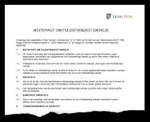


**Efter ÆF § 12 kan ægtefæller ved ægtepagt indgå følgende aftaler om særeje.** 

En ægtepagt om særeje er en skriftlig aftale mellem to ægtefæller. 

Aftalen bestemmer, at der ikke skal gælde formuefællesskab i ægteskabet, som man ellers automatisk får, når man gifter sig.

---

Formuefællesskab betyder kort sagt, at man som ægtefæller skal dele formuer i tilfælde af separation, skilsmisse eller død.  

Særeje er en formueordning, der betyder, at man ikke nødvendigvis skal dele alt i tilfælde af skilsmisse eller død. 

---

**Der findes flere forskellige særejeformer:**

* Fuldstændigt særeje. 

* Skilsmissesæreje. 

* Kombinationssæreje. 

* Brøkdelssæreje. 

* Tidsbegrænset særeje. 

---


Skilsmissesæreje gælder kun ved skilsmisse.  


---

**Fuldstændigt særeje:**


Hvis man har aftalt et fuldstændigt særeje, indebærer dette at der er særejevirkning under ægteskabet, ved separation og skilsmisse, samt ved en eller begge ægtefællers død. 

Med andre ord betyder det, at det man har som sit fuldstændige særeje ikke skal deles med den anden ægtefælle i forbindelse med skilsmisse. 

---

Har man ikke oprettet særeje vil det betyde, at i forbindelse med en skilsmisse skal der ske en deling og derved skal hver part opgøre sin bodel i form af aktiver fratrukket passiver. 

Af sin positive bodel skal man give halvdelen til sin ægtefælle – begge parter ender derved med at gå ud af ægteskabet med lige mange penge, forudsat at begge parter har en positiv bodel og derfor ikke er insolvente. 

---

Har man oprettet fuldstændigt særeje vil denne deling i form af bodele ikke ske hverken i tilfælde af skilsmisse eller død. 

Hvis ægteskabet ophører ved død vil den længstlevende ægtefælle dog stadig modtage arv af det fuldstændige særeje. 

Det skal dog bemærkes, at den længstlevende ægtefælle ikke har mulighed for at sidde i uskiftet bo med de midler der er fuldstændigt særeje.  

---

**Skilsmissesæreje:**


Skilsmissesærejet er en kombination af de to formueretlige grundformer fælleseje og fuldstændigt særeje. 

Der er særejevirkninger under ægteskabet, samt ved separation og skilsmisse, men fællesejevirkninger ved død, uanset hvem af ægtefællerne, der dør først. Der er mulighed for at sidde i uskiftet bo. 

---

Ulempen ved skilsmissesærejet er, at fællesejet opstår uanset hvem af ægtefællerne, der dør først. 

Dette kan være uheldigt i de tilfælde, hvor det er den ægtefælle med megen gæld, der dør som den første. 

---

Den længstlevende ægtefælle er nemlig i denne situation forpligtet til at lade sin formue indgå i delingen med den førstafdøde ægtefælles kreditorer eller særarvinger. 

Derfor bør man normalt aldrig bruge et rent skilsmissesæreje, men derimod aftale et ægtefællebegunstigende kombinationssæreje.  

---

**Kombinationssæreje:**

Kombinationssæreje er således en kombination af skilsmissesæreje og fuldstændigt særeje. 

Ved kombinationssæreje er der altid særeje ved separation og skilsmisse (skilsmissesæreje), og dette skilsmissesæreje bliver i bestemte situationer særeje ved en ægtefælles død (dvs. fuldstændigt særeje). 

---

Ægtefællerne kan aftale, i hvilke situationer der skal være særeje ved en ægtefælles død afhængigt af, hvem af ægtefællerne der dør først. 

Skilsmissesæreje kan således kombineres med særeje ved død på en række forskellige måder. 

---

Kombinationssærejets betydning på et dødsboskifte afhænger derfor dels af den valgte kombination af skilsmissesæreje og fuldstændigt særeje og dels af, hvem af ægtefællerne der dør først.  

Valget af, i hvilke situationer der skal være særeje ved en ægtefælles død, afhænger af, om ægtefællerne ønsker at begunstige den ene af ægtefællerne ved dødsfaldet frem for førstafdødes eller længstlevendes arvinger (ægtefællebegunstigende kombinationssæreje), eller om de ønsker at begunstige deres arvinger (arvingsbegunstigende kombinationssæreje).  

---

**Ægtefællebegunstigende kombinationssæreje:**

For de fleste er det mest fordelagtige at aftale et såkaldt ægtefællebegunstigende kombinationssæreje. 

Dette indebærer, at der er særeje i tilfælde af separation og skilsmisse. 

Men når den første ægtefælle dør, bliver dennes særeje til fælleseje og skal således deles med den længstlevende. 

Den længstlevende ægtefælles særeje opretholdes imidlertid og bliver altså til fuldstændigt særeje. 

---

Det er derfor kun førstafdødes skilsmissesæreje, der bliver til fælleseje ved død.  

Det ægtefællebegunstigende kombinationssæreje er en særejeform, der tiltaler de fleste, idet formen kombinerer fordelene ved skilsmissesæreje og fuldstændigt særeje, således at den længstlevende ægtefælle sikres bedst muligt i forhold til førstafdødes arvinger og eventuelle kreditorer.  

Ægtefællebegunstigende kombinationssæreje anvendes således i tilfælde, hvor ægtefællerne ønsker at tilgodese den længstlevende ægtefælle frem for ægtefællernes sær- og/eller fællesbørn. 

---

Ægtefæller aftaler ofte et ægtefællebegunstigende kombinationssæreje, hvor ægtefællerne har skilsmissesæreje, der skal være fuldstændigt særeje for længstlevende ved førstafdødes død, uanset hvem af ægtefællerne der dør først. 

Dette indebærer, at førstafdødes formue er delingsformue. 

---

Fordelene for den længstlevende er, at længstlevende har mulighed for enten at sidde i uskiftet bo med førstafdødes formue eller modtage boslod og arv af førstafdødes formue, samtidig med at længstlevendes egen formue bliver særeje og dermed ikke skal deles med førstafdødes arvinger, navnlig førstafdødes særbørn og ægtefællernes fællesbørn. 

---

**Arvingsbegunstigende kombinationssæreje:**

Arvingsbegunstigende kombinationssæreje anvendes i tilfælde, hvor ægtefællerne ønsker at tilgodese enten førstafdødes eller længstlevendes arvinger frem for ægtefællen. 

Ved arvingsbegunstigende kombinationssæreje kan eksempelvis førstafdødes arvinger tilgodeses ved, at førstafdødes formue er fuldstændigt særeje, mens længstlevendes formue er delingsformue. 

---

Dette indebærer, at førstafdødes formue ikke deles med længstlevende, inden formuen deles med førstafdødes arvinger (ægtefællen og førstafdødes børn). 

Samtidig skal længstlevendes formue, der er delingsformue, deles lige mellem førstafdødes arvinger og længstlevende. Længstlevende har ikke mulighed for at sidde i uskiftet bo.  

---

**Dødsfaldssæreje ikke muligt:**

Det er ikke muligt at etablere et såkaldt dødsfaldssæreje, hvor der er fælleseje ved skilsmisse men fuldstændigt særeje ved død. 

Hvis man vil have fuldstændigt særeje i tilfælde af død må man også have særeje i tilfælde af skilsmisse. 

---

**Tidsbegrænset særeje:**

Man har mulighed for at tidsbegrænse særejet, således at man fx har særeje de første 10 år af ægteskabet, hvorefter særejet automatisk bliver til fælleseje.  

---

**Brøkdelssæreje:**

Det er muligt at aftale, at en bestemt brøkdel af ens formue eller af et bestemt aktiv skal være særeje. 

Der kan dog være en del praktiske vanskeligheder forbundet med en sådan særejeform. 

For som tiden går, kan midlerne blive blandet sammen eller nyt blive anskaffet, og det kan blive svært at udskille hvad der er fælleseje og hvad der er særeje.  

---

**Hvad man kan aftale særeje om:**

Det er muligt at aftale, at alt hvad man hver for sig ejer på nuværende tidspunkt, samt alt hvad man erhverver i fremtiden skal være særeje. 

Man kan også aftale, at alt hvad ægtefællerne bringer ind i ægteskabet skal være deres særeje, men alt hvad der erhverver under ægteskabet skal være fælleseje.

Det er også muligt at aftale særeje vedrørende bestemte ejendele, fx sommerhuset, båden eller motorcyklen. 

---

**Hvordan særeje etableres:** 

Som tidligere nævnt er udgangspunktet, at man automatisk får fælleseje ved indgåelse af ægteskab. 

Derfor er det nødvendigt at **oprette en ægtepagt, hvis man ønsker særeje.**

Særeje kan også opstå, hvis det er bestemt af en gavegiver eller I forbindelse med et arveforskud, hvor det særskilt bestemmes at arveforskuddet skal være særeje. 

---

En arvelader kan også i et **testamente bestemme**, at arven skal tilfalde arvingen som særeje. Dette kan gælde både tvangsarv og friarv.  

Endelig kan man også i en **begunstigelsesklausul i livs- og ulykkesforsikringer indsætte særejebestemmelser**.  

---

**Hvordan særeje stiftes:**  

**Særeje stiftes ved:**
  
  *	Ægtepagt, jf. ÆF § 12 og § 20.
  
  *	Gave, jf. ÆF § 23.
  
  *	Testamente, jf. ÆF § 23.
  
  *	Begunstigelse i forsikring, jf. forsikringsaftalelovens § 103, stk. 2.
  
  *	Begunstigelse i pension, jf. pensionsopsparingslovens § 3, stk. 2.
  
---


**Ægtefæller kan ved ægtepagt aftale, at en pensionsrettighed skal være særeje, jf. ÆF § 12.** 

En sådan aftale kan også omfatte fremtidige indbetalinger på pensionsrettigheden, jf. ÆF § 13. 

Efter ÆF § 13 kan ægtefællerne ved ægtepagt aftale, at en pensionsrettighed skal være særeje i overensstemmelse med de muligheder for særeje, der findes i ÆF § 12. 

---

Pensionsrettigheden kan således gøres til skilsmissesæreje, fuldstændigt særeje, kombinationssæreje osv., ligesom særejet kan gøres tidsbegrænset.  

ÆF § 13 omfatter både privatpension og pension oprettet som led i ansættelsesforhold. 

---

Da rimelige pensioner efter ÆL § 34 ikke indgår i formuedelingen, vil det som udgangspunkt ikke være nødvendigt at aftale, at en pensionsrettighed er særeje, for at kunne holde rettigheden uden for formuedelingen. 

Der er imidlertid to situationer, hvor særejebestemmelsen især kan få betydning.  

---

For det første undgås, at den del af en pensionsrettighed, der overstiger det rimelige, efter ÆF § 34, stk. 4 skal indgå i formuedelingen. 

Særejet bevirker med andre ord, at den overskydende pension - ekstra pension - ikke indgår i ligedelingen. 

---

For det andet bevirker særejebestemmelsen, at reglerne om pensionkompensation i lovens kapitel 13 ikke kan finde anvendelse. 

Der kan således ikke ved særeje blive tale om fællesskabskompensation efter ÆF § 44 eller rimelighedskompensation efter ÆF § 45. 

---

Derimod kan der godt blive tale om rimelighedskompensation efter ÆF § 42, hvis betingelserne heri er opfyldt.  

Ægtefællerne kan aftale, at allerede foretagne indbetalinger skal være særeje. Herudover kan de aftale, at også fremtidige indbetalinger skal være særeje. 

---

Aftaler ægtefællerne, at pensionsrettigheden skal være særeje, vil dette ifølge motiverne som udgangspunkt også omfatte fremtidige indbetalinger.

Ægtefæller kan ved ægtepagt aftale, at særeje bestemt af tredjemand helt eller delvis skal være en anden form for særeje, jf. ÆF § 12, eller skal være delingsformue, jf. ÆF § 14. 

Ved ægtepagt kan ægtefællerne ikke træffe nogen bestemmelse, der strider mod gavegivers eller arveladers bestemmelse om særeje. 

---

Det fremgår indirekte af ÆF § 14, at ægtefæller ved ægtepagt kan aftale ændringer af tredjemandsbestemt særeje, forudsat at aftalen er i overensstemmelse med særejebestemmelsen, eksempelvis hvis tredjemand har bestemt, at ægtefællerne kan ophæve en særejebestemmelse, når de har været gift i et vist antal år. 

Tredjemandsbestemt særeje kan således kun ændres, hvis tredjemand har bestemt, at dette kan ske. 

---

I relation til gaver kan tredjemand efter fuldbyrdelsen af gaven give samtykke til ændring af den oprindelige særejebestemmelse. 

Hvis ægtefællerne opretter en ægtepagt i strid med tredjemands bestemmelser, er ægtepagten ugyldig. 

---

<h4><a href="https://www.youtube.com/embed/u3qv7qhAn14" target="_blank" >Video Hvilket særeje skal du vælge?</a></h4>

---

## Eksamensopgave 1

**Bo og Jettes ægteskab**


Om bodeling med vejledende løsning

Bo og Jette er glade for hinanden og for deres ægteskab, men alle de økonomiske drøftelser har alligevel givet Bo anledning til at overveje, hvorledes deres økonomiske situation ville være, hvis de blev skilt. 

De har fælleseje i ægteskabet.

Foruden Jettes tøjbutik med tilhørende gæld har de en lejlighed med en friværdi på 500.000 kr. og almindeligt indbo for 600.000 kr. 

Lejligheden havde Bo købt og finansieret inden de blev gift. 

Jette har en guldkæde til en værdi af 10.000 kr. Kæden fik hun for nogle år siden i gave af sin bedstemor kort tid inden hendes død. 

Desuden har Jette for nylig vundet et rejsegavekort på 50.000 kr. 

Jette har ingen pensionsopsparing. 

Bo har heller ikke nogen pensionsordning i sit job, men han har til gengæld sparet 170.000 kr. op på sin private ratepension. 

Desuden har de en leaset Mercedes, hvor de hver måned betaler 2.900 kr. i leasingafgift. 

**Eksamensspørgsmålet:** 

Lav en bodelingsopgørelse for Bo og Jette, hvis de skulle skilles nu og læg til grund, at Jette har købt tøjbutikken for 350.000 kr. og forsat den som personlig virksomhed med en tilhørende gæld på 400.000 kr. 


---

**Podcast om svaret på eksamensopgaven**

---


```{r opgavebodel, echo=FALSE,fig.height=5}

mydf <- data.frame(
  
  S2 = c(
    "Jette",
    "AKTIVER",
    "Tøjbutik 350.000",
    "½ indbo 300.000",
    "Gavekort	50.000",
    "Aktiver i alt	700.000",
    "PASSIVER",
    "Bankgæld 	400.000",
    "Bodel	300.000",
    "Deling 150.000",
    "Boslod	550.000"
    
),
  S3 = c(
    "Bo",
    "AKTIVER",
"Lejlighed 500.000",
"½ indbo	  300.000",
"",
"Aktiver i alt	800.000",
"PASSIVER",
"0",
"Bodel	800.000",
"Deling 400.000",
"Boslod	550.000"

)
  
)
names(mydf) <- NULL

mydf %>%
  kable("html", escape = FALSE,caption = "Bodelingsopgørelse") %>%
  kable_styling(full_width = T,font_size = 10,bootstrap_options = c("responsive","bordered","striped")) %>%
  column_spec(1, bold = F, border_right = T, color = "black", background = "lightgrey") %>%
  column_spec(2, bold = F, border_right = T, color = "black", background = "lightgrey") %>%
  # column_spec(3, bold = F, border_right = T, color = "black", background = "lightgrey") %>%
  row_spec(1,italic = T,bold = T,font_size = 14,color = "black", background = "darkgrey") %>%
  row_spec(2,italic = T,bold = T,font_size = 10,color = "black", background = "lightgrey") %>%
  row_spec(6,italic = T,bold = T,font_size = 10,color = "black", background = "lightgrey") %>%
  row_spec(7,italic = T,bold = T,font_size = 10,color = "black", background = "lightgrey") %>%
  # row_spec(1,italic = T,bold = T,font_size = 12)
  # column_spec(0, angle = -45)%>%
  # scroll_box(width = "500px") %>%
  footnote(general = "Bodelingsopgørelse mellem Jette og Bo",general_title = "")
```

---

## Eksamensopgave 2

**Anders og Pernille ægteskab**

Anders og Pernille blev gift i 2014, da de begge var 29 år gamle. Anders var uddannet finansøkonom og arbejdede i et leasingselskab. Pernille var tidligere butiksassistent, men havde senere valgt at arbejde som frisør hos hendes veninde Lotte, der havde startet sin egen frisørsalon. 

**Eksamensspørgsmålet:** 


Opgave 1 (25 %) 

---

Anders arbejdede i leasingselskabets salgsafdeling og lærte hurtigt, at det var vigtigt at være omhyggelig med udformningen af de tilbud, han sendte til kunderne. 

En fredag eftermiddag havde han i opfølgning af et kundemøde, han havde haft om formiddagen, sendt en mail til kunden, hvori der stod, at leasingselskabet på en bestemt bil kunne tilbyde en månedlig leasing ydelse på 3.400 kr. i en bindingsperiode på 12 mdr. 

Anders tilføjede, at tilbuddet var betinget af, at man modtog kundens accept inden for en uge. Samme fredag aften, hvor mailen var blevet sendt, blev Anders klar over, at han havde skrevet forkert i mailen, eftersom den rigtige pris var 4.400 kr. pr. måned. 

Da han kom på arbejde næste dag, lørdag morgen, kunne han se, at der var kommet en ”auto-reply” fra kunden, hvori der stod: ”Tak for din mail. 

Vi er taget på weekend i sommerhuset og har ikke adgang til vores mail før søndag aften”.  

Anders skyndte sig, at skrive en ny mail, hvori han undskyldte, at hans første mail indeholdt en fejl, men den rigtige pris var 4.400 kr. 

**Eksamensspørgsmålet:** 

1) Redegør for med anvendelse af de relevante bestemmelser, om leasingfirmaet er bundet af det første tilbud på 3.400 kr. ?

---

Opgave 2 (25 %) 


Pernille var glad for at arbejde som frisør. Hun kunne godt lide at have travlt, og hun var glad for kontakten til de mange kunder. 

Hendes veninde Lotte derimod døjede med ondt i ryggen, og ville gerne prøve noget andet. 

Så det kom meget naturligt, at de begyndte at drøfte, om Pernille kunne overtage butikken. Frisørsalonen lå i lejede lokaler i en velbeliggende ejendom og havde afståelsesret. Pernille fik et meget konkret tilbud om at købe butikken for i alt 350.000 kr. kontant, fordelt med goodwill 200.000 kr., varelager 50.000 kr., frisørstole, vaskefaciliteter, udsmykning og andet inventar for tilsammen 100.000 kr.

Pernille syntes, at tilbuddet var rimeligt, men hun havde ikke nogen opsparing af betydning. Hun spurgte derfor sin bank Danske Bank, om hun kunne låne i alt 400.000, så hun foruden købesummen havde 50.000 kr. til finansiering af driften. 

Banken bekræftede, at den mod passende sikkerhed var villig at yde lånet på 400.000 kr. 

Lotte havde hidtil drevet virksomheden, som en personlig virksomhed. Pernille overvejede, om hun i stedet skulle drive salonen, som et anpartsselskab eller måske et aktieselskab.

Eksamensspørgsmål 2) (12,5%) Redegør med inddragelse af de relevante bestemmelser for, hvilke muligheder banken efter det oplyste har for at opnå sikkerhed, og de tilhørende fordele og ulemper.

**Eksamensspørgsmålet:** 

3) (12,5%) Hvilke overvejelser bør Pernille gøre sig i forbindelse med valg af form for virksomhed?


---

Opgave 3 (25 %) 
 
Anders og Pernille er glade for hinanden og for deres ægteskab, men alle de økonomiske drøftelser har alligevel givet Anders anledning til at overveje, hvorledes deres økonomiske situation ville være, hvis de blev skilt. De har fælleseje i ægteskabet.

Foruden frisørsalonen med tilhørende gæld har de en lejlighed med en friværdi på 500.000 kr. og almindeligt indbo for 600.000 kr. 

Lejligheden havde Anders købt og finansieret inden de blev gift. 

Pernille har en guldkæde til en værdi af 10.000 kr. 

Kæden fik hun for nogle år siden i gave af sin bedstemor kort tid inden hendes død. Desuden har Pernille for nylig vundet et rejsegavekort på 50.000 kr. 

Pernille har ingen pensionsopsparing. 

Anders har heller ikke nogen pensionsordning i sit job, men han har til gengæld sparet 170.000 kr. op på sin private ratepension. Desuden har de en leaset BMW, hvor de hver måned betaler 2.900 kr. i leasingafgift. 

**Eksamensspørgsmålet:** 

4) Lav en bodelingsopgørelse for Anders og Pernille, hvis de skulle skilles nu og læg til grund, at Pernille har købt frisørsalonen for 350.000 kr. og forsat den som personlig virksomhed med en tilhørende gæld på 400.000 kr. 

---

Opgave 4 (25 %) 

En dag i marts 19, hvor Pernille var alene, kom der en dame og mand ind i butikken. Damen bad om at måtte se på nærmere på noget af det hårbalsam, som Lotte havde en reklame for i vinduet. Pernille gik sammen med damen hen til det hjørne af butikken, hvor produkterne stod udstillet, mens manden blev stående oppe ved disken. Pernille rakte kunden nogle flasker, men efter at have kigget hurtigt på flaskerne, sagde kunden, at hun alligevel ikke var interesseret og forlod med det samme butikken sammen med manden.

Pernille syntes, det havde været var et mystik optrin, og hun opdagede nu, at hendes jakke, som ellers var lagt bag disken, var havnet på gulvet. Da hun tog jakken op, fandt hun ud af, at hendes pung, som havde ligget i jakken, også var væk. Hun var tydeligvis blevet offer for et tricktyveri, og hun skyndte sig at ringe til politiet. Der var faktisk en patrulje i nærheden, og kort tid efter dukkede to betjente op, som lavede en eftersøgning i området, men det endte uden resultat. Betjentene optog rapport, som man siger, og forlod derefter butikken. Da Pernille var blevet alene, havde hun behov for at sunde sig over en kop kaffe. Da hun havde genvundet fatningen, skyndte hun sig at ringe til sin bank, for at melde sit dankort stjålet. Banken kunne oplyse, at kortet inden for de sidste 45 minutter var blevet anvendt til en kontant hævning på 1.000 kr. og to butiksbetalinger på til sammen 4300 kr.

Det kom efterfølgende frem, at der i pungen havde været forskellige kvitteringer og papir-lapper, bl.a. en seddel hvorpå der stod ”p.d. balsam 6480”. Banken spurgte om ”p.d.” betød ”pinkode dankort”. Pernille forklarede, at det refererede til et tilbud, hun havde fået fra en af sine leverandører, men at hun havde beholdt sedlen, fordi hun kunne bruge den til at huske sin dankort kode.  

Pernille modtog efterfølgende en mail fra sin bank, hvori banken bad hende indbetale ”5.300 kr. svarende til de uberettigede hævninger”. 

**Eksamensspørgsmålet:** 

5) Redegør ud fra den relevante lovgivning for, i hvilken udstrækning du mener, Pernille hæfter for de uberettigede hævninger.  

---

**Podcast om svaret på eksamensopgaven**

---

## Forhåndsaftaler om formuedelingen  

### Alders-, kapital- og ratepensioner

Ægtefæller kan ved **ægtepagt aftale**, at værdien af en **alders-, kapital- eller ratepension skal indgå i formuedelingen ved separation eller skilsmisse**, jf. ÆF § 15. 

Denne bestemmelse omfatter ikke aftaler om deling af pensionsrettigheder ved en ægtefælles død, da den længstlevende ægtefælles pensionsrettigheder og lignende rettigheder efter ÆF § 52, stk. 1, ikke indgår i formuedelingen ved en ægtefælles død.  

---

Denne regel er affødt af, at en ægtefælles rimelige pensionsrettigheder efter ÆF § 34, stk. 1, ikke indgår i formuedelingen. 

Ønsker ægtefællerne at fravige dette, giver bestemmelsen dem mulighed for ved ægtepagt at aftale, at værdien af alders-, kapital- og ratepensioner skal indgå i formuedelingen ved en separation og skilsmisse. 

Det er værdien af pensionen og ikke selve pensionen, der indgår i formuedelingen. 

---

ÆF § 15 omfatter ikke andre pensionsrettigheder end alders-, kapital- og ratepensioner. 

ÆF § 15 giver således ikke mulighed for at aftale, at værdien af en rentepension, herunder en kollektiv pensionsrettighed i fx en tværgående pensionskasse, løbende renteforsikring i et forsikringsselskab eller en tjenestemandspension skal være delingsformue. 

---

Der kan heller ikke efter ÆF § 15 aftales deling af privattegnede livrenter, hvilket har været kritiseret.  

En aftale efter ÆF § 15, vedrører ikke værdien af pensionsordningen ved aftalens indgåelse, men den til enhver tid værende værdi, dvs. i praksis værdien ved formuedelingen.  

Der kan også aftales deling af udbetalte alders-, kapital- og ratepensioner samt indtægter og surrogater. 

---

Det er uafklaret i retspraksis, om det er muligt at aftale, at delingen af alders-, kapital- eller ratepensioner alene skal ske i det omfang værdien af den ene ægtefælles samlede pensioner, herunder rentepensioner, overstiger værdien af den anden ægtefælles pensioner, herunder rentepensioner. 

Der kan formentlig oprettes ægtepagt om sådan deling af »overskydende pension«, således at hver af ægtefællerne får lige meget pension forlods, hvorefter resten deles. 

---

### Personlige erstatninger

Ægtefæller kan ved ægtepagt aftale, at en personlig erstatning, godtgørelse eller forsikringsudbetaling, jf. ÆF § 36, stk. 1 og 2, helt eller delvis skal indgå i formuedelingen. 

Aftalen kan begrænses til at gælde formuedelingen ved en ægtefælles død, herunder hvis en bestemt ægtefælle dør først, eller til at omfatte førstafdødes eller længstlevendes rettigheder, jf. ÆF § 16.  

Herved får en ægtefælle, der har modtaget eksempelvis en personskadeerstatning, mulighed for at sikre den anden ægtefælle, der måske har indrettet sin tilværelse ud fra hensynet til den tilskadekomne ægtefælle, en kompensation i form af andel i erstatningen.

---

Aftalen kan således begrænses til at gælde formuedelingen ved en ægtefælles død, herunder hvis en bestemt ægtefælle dør først, eller til at omfatte førstafdødes eller længstlevendes rettigheder.

Retten til forlods udtagelse af personskadeerstatning mv. fremgår af ÆF § 36.

---

### Uoverdragelige og personlige rettigheder 

Ægtefæller kan ved ægtepagt aftale, at værdien af en rettighed omfattet af ÆF § 37 helt eller delvis skal indgå i formuedelingen. 

Aftalen kan begrænses til at gælde formuedelingen ved en ægtefælles død, herunder hvis en bestemt ægtefælle dør først, eller til at omfatte førstafdøde eller længstlevende ægtefælles rettigheder, jf. ÆF § 17. 

Sådanne aftaler kan indgås for alle typer af uoverdragelige og personlige rettigheder.

---

Ægtefæller kan fx aftale, at værdien af en personlig goodwill, som tilhører den ene ægtefælle, skal indgå i delingen ved separation eller skilsmisse med den virkning, at værdien skal gøres op og indgå i formuedelingen.  

En aftale efter ÆF § 17 vedrører ikke værdien af den pågældende rettighed ved aftalens indgåelse, men den til enhver tid værende værdi, dvs. i praksis værdien ved formuedelingen.  

---

### Gæld

Ægtefæller kan ved ægtepagt aftale, i hvilket omfang gæld skal fradrages i delingsformuen ved formuedeling ved separation, skilsmisse og død, jf. ÆF § 18, stk. 1.  

Adgangen til at aftale fradrag for gæld er begrænset ved ÆF § 18, stk. 2-4 og ÆF § 30. 

---

En aftale om, at en gældspost ikke skal kunne fradrages ved opgørelsen af delingsformuen, får den virkning, at gælden bæres af ægtefællens særejeaktiver eller andre aktiver, der ikke indgår i formuedelingen, herunder navnlig personlige erstatninger, jf. ÆF § 36. 

Har den ægtefælle, hvis gældspost efter aftalen skal holdes uden for delingen, ikke aktiver, der kan holdes uden for delingen, og som kan dække gælden, vil aftalen indebære, at den formue, der skal deles, deles skævt til fordel for den anden ægtefælle, således at denne bliver stillet, som om gælden ikke fandtes.  

---

Ægtefæller kan med denne bestemmelse holde bestemte gældsposter uden for delingen. 

Ægtefæller kan eksempelvis aftale, at den enes **studiegæld** ikke skal kunne fradrages i delingsformuen, eller at halvdelen af gælden på den anden ægtefælles kontokort skal fradrages i delingsformuen.  

Der er som udgangspunkt fri adgang til at aftale, hvilken gæld der skal fradrages i delingsformuen, og hvilken gæld der ikke kan fradrages. 

---

Det er med de undtagelser, der følger af ÆF § 18, stk. 2, endvidere muligt at indgå aftaler om fremtidig sikret gæld, der skal fradrages i delingsformuen, og hvilken der ikke kan fradrages. 

---

Ægtefæller kan således fx aftale, at den studiegæld, en af dem stifter fremover, ikke skal kunne fradrages i delingsformuen.  

Efter ÆF § 18, stk. 2 kan ægtefællerne ikke aftale, at gæld, som ikke er stiftet ved aftalens indgåelse eller stiftes i forbindelse med aftalen, og som efter ÆF § 29, stk. 2, ville skulle fradrages i formue, der ikke indgår i delingen, skal fradrages i delingsformuen. 

---

Denne bestemmelse har til formål at forhindre, at ægtefæller indgår aftale om, at fremtidig gæld, der efter ÆF § 29, stk. 2, påhviler særeje, skal fratrækkes i delingsformue. 

Ægtefæller kan således fx ikke aftale, at al gæld, som manden fremtidig optager med sikkerhed i sin særejeejendom, skal fradrages i delingsformuen.  

Ved aftale om, at gæld, der påhviler særeje, efter ÆF § 29, stk. 2, skal fratrækkes i delingsformuen, er det således et krav, at den gæld, aftalen vedrører, er stiftet senest i forbindelse med aftalens indgåelse, således at ægtefællerne har mulighed for at overskue, hvilken gæld der er omfattet af aftalen. 

---

At gælden skal være stiftet **"i forbindelse med aftalen"** indebærer, at gælden ikke behøver at være stiftet inden indgåelsen af aftalen. 

Der er ikke noget til hinder for, at gælden først stiftes efter indgåelsen af aftalen, således gældsstiftelsen sker i forlængelse af aftalen. 

Selvom et lån først bevilges nogen tid efter aftalen, kan lånet være omfattet af bestemmelsen, hvis ægtefællen ansøgte om lånet i forbindelse med aftalen om gælden, men sagen trak ud, fx på vurdering af ægtefællens kreditværdighed.

---

For så vidt angår usikret gæld, der ikke er knyttet til et bestemt aktiv, og som efter ÆF § 29, stk. 3, skal fradrages med en forholdsmæssig andel i henholdsvis delingsformuen og den formue, der ikke indgår i delingen, kan ægtefæller frit aftale en anden fordeling også for gæld, der endnu ikke er stiftet. 

Ægtefællerne kan således fx aftale, at hele mandens fremtidige studiegæld ikke skal kunne fradrages i delingsformuen, eller at intet af studiegælden skal fratrækkes i delingsformuen. 

---

Efter ÆF § 18, stk. 3 kan ægtefæller endvidere ikke aftale, at gæld skal fradrages i delingsformuen ved en ægtefælles død, men ikke ved separation eller skilsmisse. 

Ægtefællerne kan således ikke fx aftale, at pantegælden i den ene ægtefælles særejeejendom skal fradrages i delingsformuen, hvis ægteskabet ophører ved en ægtefælles død, men ikke hvis ægtefællerne bliver separeret eller skilt.  

Efter ÆF § 18, stk. 4 kan en aftale efter ÆF § 18, stk. 1 ikke tidsbegrænses.  

---

Med henvisningen i ÆF § 18, stk. 1 til ÆF § 30 kan en aftale om fordelingen af gæld ikke medføre, at en ægtefælle ved formuedelingen skal aflevere så meget af sin formue til den anden ægtefælle, at den pågældende ikke har tilstrækkelige midler til at dække sine forpligtelser og kreditorer.  

---

## Ægtepagter og kravet om tinglysning

I overensstemmelse med ÆF § 19 er det **lovfæstet, at såvel ægtefæller som kommende ægtefæller kan oprette en ægtepagt**. 

Ægtepagt er et nødvendigt formkrav for etablering af særeje, jf. ÆF § 12, stk. 1. 

---

Ægtepagt er derimod ikke længere et formkrav for gaveoverdragelser. 

Herefter er gaver mellem ægtefæller gyldige såvel inter partes som i forhold til kreditorerne, også selvom der ikke er oprettet ægtepagt. 

Givers kreditorer er henvist til at søge gaven omstødt efter konkurslovens § 64. Kun hvis gaven skal gøres til særeje kræves ægtepagt, jf. ÆF § 12, stk. 1.  

En ægtepagt er kun gyldig, når den er underskrevet af begge ægtefæller og tinglyst i personbogen efter reglerne herom i lov om tinglysning. 

---

Skal en ægtefælles værge efter værgemålsloven give samtykke til ægtepagten, er ægtepagten kun gyldig, hvis også værgen har underskrevet den, jf. ÆF § 20.  

Der glæder et **"specifikationskrav"** i ægtepagter;	særejet skal i ægtepagter angives på en sådan måde, at det ikke overlades til ejerægtefællen vilkårligt at forøge særejets omfang.

---

Ægtepagter anmeldes digitalt til tinglysning på samme måde som dokumenter om overdragelse og belåning af fast ejendom mv. 

I det digitale tinglysningssystem kan ægtefæller underskrive en ægtepagt digitalt samtidig med, at ægtepagten med digital underskrift anmeldes til tinglysning i tinglysningssystemet i Personbogen.  

---

Hvis ægtefællerne underskriver en ægtepagt i hånden, kan den indlægges (uploades) i tinglysningssystemet, og ægtefællerne kan herefter i fællesskab anmelde den til tinglysning med digital underskrift. 

Hvis kun den ene ægtefælle underskriver anmeldelsen af en ægtepagt, tinglyses ægtepagten med frist til fremvisning af den originalt underskrevne ægtepagt.  

---

Ud over de formelle betingelser, der skal være opfyldt for en korrekt digital tinglysning, foretager Tinglysningsretten en prøvelse af ægtepagten. 

Ved prøvelsen påser Tinglysningsretten, at de aktiver, som ægtepagten vedrører, klart kan identificeres, og at aftalen i ægtepagten er i overensstemmelse med de muligheder, som retsvirkningsloven giver ægtefæller til at indgå aftale om formueordningen i deres ægteskab. 

---

Tinglysningsrettens prøvelse af ægtepagter følger ikke direkte af tinglysningsloven, men er udviklet i retspraksis. 

Ved tinglysning sikres, at eventuelle ægtepagter kommer frem ved ægtefællernes separation, skilsmisse og død, og at en ægtefælle ikke kan destruere en ægtepagt, som er til skade for den pågældende.  

Der gælder ingen tidsfrist efter underskrivningen af en ægtepagt til at anmelde den til tinglysning. 

---

En anmeldelse til tinglysning efter separation, skilsmisse eller den ene ægtefælles død har dog ingen retsvirkninger, heller ikke selvom ægtepagten skulle blive tinglyst. 

Dette gælder også i tilfælde, hvor en ægtepagt er anmeldt før en ægtefælles død, men afvist ved en fejl og efter dødsfaldet anmeldt på ny.  

En ægtepagts retsvirkninger regnes fra den dag, hvor den anmeldes til tinglysning. 

---

Tinglysning af en ægtepagt medfører ikke, at den ved en senere bodeling skal anses for materielt gyldig. 

Der er således ikke noget til hinder for, at en ægtefælle senere gør gældende, at eksempelvis en særejebestemmelse i en tinglyst ægtepagt er ugyldig, fordi den falder uden for, hvad ægtefællerne gyldigt kan aftale efter loven. 

Endvidere er tinglysning ikke til hinder for, at en ægtepagt tilsidesættes efter de almindelige ugyldighedsregler i aftaleloven.  

---

Ofte opretter ægtefæller et testamente og en ægtepagt samtidig. 

Der er ikke noget til hinder for, at ægtefællerne underskriver ægtepagten for notaren samtidig med testamentet, blot de derefter sørger for, at ægtepagten anmeldes digitalt til tinglysning.  

Der er i tinglysningslovens § 50 c, stk. 7 gennemført ændringer i offentlighedens adgang til indholdet af ægtepagter, sådan at de alene kan videregives til brug i konkrete retsforhold. 

---

Fuldstændige oplysninger skal dog efter anmodning videregives til den, som oplysningerne angår. 

En ægtepagt kan kun ændres eller ophæves ved ægtepagt. 

Enhver af ægtefællerne kan anmode om, at en ægtepagt tinglyses, jf. nærmere ÆF §§ 21 og 22.  

---

## Arveladers og gavegivers bestemmelser om særeje  

Bestemmelsen i ÆF § 23 indebærer, at **arv og gave indgår i formuedelingen, medmindre arvelader og gavegiver har bestemt, at arven og gaven skal være særeje**.  

En særejebestemmelse gælder også, selvom ægtefællen modtog arven eller gaven inden ægteskabet.  

Arvelader og gavegiver kan som udgangspunkt træffe samme bestemmelse om særeje, som ægtefæller selv kan aftale efter ÆF § 12, som jo udtømmende gør op med, hvilke **særejeaftaler**, der gyldigt kan indgås. 

---

Ægtefællerne kan dog ikke træffe bestemmelse om **sumsæreje eller sumdeling** efter ÆF § 12, stk. 2, nr. 4 og 5. 

Dette skyldes, at en bestemmelse om sumsæreje bl.a. vil betyde, at en arving vil kunne forbruge hele arven og stadig kunne udtage sumsærejet ved formuedelingen. 

---

Tilsvarende vil arvingen ved bestemmelse om sumdeling kunne forbruge arven og alligevel ved formuedeling kunne udtage den del af arven, der oversiger delingsformuen.  

Arvelader kan således i testamente gøre arven til særeje, og det sker ofte i praksis.  

---

Arveforskud må behandles som gave; ikke som arv, jf. dommen i **U 1975.473Ø** 
**<a href="https://pro.karnovgroup.dk/document/7000211567/1">Dommen klik her!</a>**

---

En bestemmelse om, at arveforskud skal være særeje, skal være truffet senest samtidig med, at arveforskuddet ydes. 

Det er ikke tilstrækkeligt, at det er bestemt i et testamente, at den arv, der ydes forskud på, skal være særeje.  

Generelt gælder der ingen formkrav til gaver. Bestemmelse om, at en gave skal være særeje, skal træffes senest samtidigt med gaveløftet eller gavens overgivelse til gavemodtageren.  

---

Afgrænsningen mellem gaver og gensidigt bebyrdende aftaler giver i praksis anledning til vanskeligheder, især hvor det overdragne aktiv enten er behæftet med gæld, eller hvor modtageren direkte eller indirekte præsterer en modydelse. 

Spørgsmålet har været, om aktivet kan siges at være givet som gave med den virkning, at det fulde aktiv omfattes af særejet. 

---

Praksis, som især vedrører fast ejendom, hvor friværdien gives som gave, er ikke entydig. 

Se fra praksis fx dommen **U 1987.763 H**, hvor der lægges vægt på et kvantitativt kriterium knyttet til gavemomentets omfang. (Uanset kun ca. 13 % af ejendommens værdi blev berigtiget som gave, og gavemodtager skulle overtage rentegæld samt optage ejerskiftelån m.m., statueredes, at landbrugsejendommen i sin helhed blev særeje). 
**<a href="https://pro.karnovgroup.dk/document/7000206313/1">Dommen klik her!</a>**

---

Af motiverne (forarbejderne til loven) til ÆF § 24 stk. 2 fremgår, at der ikke stilles krav til udbetalingens størrelse, se nærmere ÆL § 24. 

Der skal imidlertid være tale om en gave, for at der er hjemmel til at bestemme særeje som gavegiver. 

---

Formentlig må der således stilles krav om, at gavemomentet er utvivlsomt.   

Det, der træder i stedet for særeje, og indtægter af særeje er særeje, jf. ÆF § 25.

---

## Formuedeling ved separation og skilsmisse


---

<h4><a href="https://www.youtube.com/embed/-ZXmo3X8GOQ" target="_blank" >Video Guide til separation og skilsmisse</a></h4>

---

*Det er med pandekager som med kærlighed: de skal nydes, mens de er varme – J. Anker Larsen*

---

<h4><a href="https://www.youtube.com/embed/cKeZZuNhIaw" target="_blank" >Video Guide til bodeling ved skilsmisse</a></h4>

---

Se her en guide når man går fra hinanden:
**<a href="https://www.borger.dk/familie-og-boern/skilsmisse-og-familiebrud">klik her!</a>**

---

Ligedelingsprincippet i forbindelse med formuedeling ved separation og skilsmisse er fastslået i ÆF § 5, stk. 1, 1. pkt. 

Det er de aktiver og passiver, som ægtefællerne besidder på ophørsdagen, der indgår i formuedelingen, se ÆF § 27, mens værdien efter ÆF § 28 fastsættes på udlægstidspunktet eller ved skiftets slutning. 

---

**Børns ejendele ikke indgår i ægtefællernes bodeling.**  

Reglerne i denne lov omhandler de materielle regler om formuedelingen ved separation og skilsmisse. 

De tidligere materielle regler om formuedeling i ægtefælleskifteloven er flyttet til ægtefælleloven (ÆF).

---

Reglerne om behandling af sager om deling af ægtefællers formue findes fortsat i ægtefælleskifteloven, suppleret af regler i retsplejeloven. 

Reglerne om formuedeling ved en ægtefælles død findes i ÆF, jf. kapitel 15.  

---

**"Skæringsdagen"** ved separation og skilsmisse	den dag, hvor formuefællesskabet ophører, dvs. datoen for familieretshusets modtagelse af anmodning om separation eller skilsmisse.

---


**Følgende aktiver og krav indgår ikke i ligedelingen af ægtefællernes delingsformue ved separation eller skilsmisse efter ÆF § 5, stk. 1, 1. pkt., jf. ÆF § 26, stk. 1:**  

1.	Særeje.

2.	Personlige genstande omfattet af ÆF § 31.

3.	Pensionsrettigheder omfattet af ÆF §§ 34 og 35.

4.	Personlige erstatninger omfattet af ÆF § 36.

5.	Uoverdragelige og personlige rettigheder omfattet af ÆF § 37.

6.	Regulerings- og misbrugskrav efter kapitel 11.

7.	Kompensationskrav efter kapitel 12 og 13.

8.	En ægtefælles krav på underholdsbidrag fra den anden ægtefælle efter denne lov eller efter lov om ægteskabs indgåelse og opløsning.  

---

Ved formuedelingen indgår de aktiver og passiver, som hver ægtefælle havde ved udgangen af det døgn, hvor **”Familieretshuset”** modtog anmodning om separation eller skilsmisse, jf. ÆF § 27. 


**Tidspunktet for værdiansættelsen:**  

Ægtefællernes aktiver og passiver indgår i formuedelingen med værdien på udlægstidspunktet eller ved skiftets afslutning, hvis de ikke er udlagt forinden, jf. nærmere ÆF § 28. 

---

**Gæld:**  

Ved opgørelsen af delingsformuen fradrages gæld, der har sikkerhed i aktiver, der er delingsformue. 

Endvidere fradrages usikret gæld, der er stiftet til brug for anskaffelse, forbedring eller vedligeholdelse af aktiver, der er delingsformue, eller i øvrigt kan henføres til sådanne aktiver, jf. ÆF § 29, stk. 1.  

---

**Personlige genstande:**  

En ægtefælle kan inden formuedelingen udtage aktiver, som **udelukkende tjener til ægtefællens personlige brug**, i det omfang aktivernes værdi ikke står i misforhold til ægtefællernes økonomiske forhold. 

Dette gælder også aktiver, som tilhører den anden ægtefælles delingsformue, jf. ÆF § 31.  

---

<h4><a href="https://www.youtube.com/embed/M2Av7OqKLtw" target="_blank" >Video Skilsmisse i børnehøjde</a></h4>

---

### Aftaler om formuedelingen

Med ÆF § 32 lovfæstes mulighed for, at ægtefæller i forbindelse med en separation eller skilsmisse kan indgå aftale om delingen af deres formue, som anses indeholdt indirekte i ægteskabslovens § 58, se LBKG 2019-08-07 nr 771 Ægteskabs indgåelse og opløsning (Ægteskabsloven).
**<a href="https://jura.tepedu.dk/lovsamling.html">Se Lovsamlingen klik her!</a>**

---

Når en separation eller skilsmisse er aktuel, kan ægtefællerne som udgangspunkt frit indgå aftaler om, hvordan deres formue skal deles. 

De kan derfor aftale deling af formue, der ellers ikke skulle deles, og de kan aftale betaling af og afkald på kompensationer. 

De kan også indgå aftaler om, hvem af dem der skal udtage de enkelte aktiver.  

---

Efter lovbestemmelsen i ÆF § 32 indtræder aftalefriheden, når en separation eller skilsmisse er aktuel, og den således indgås med henblik på en forestående formuedeling. 

Det beror på en konkret vurdering, om en aftale er indgået med henblik på en forestående formuedeling. 

Der lægges navnlig vægt på, om der er indgivet en anmodning til Familieretshuset om separation eller skilsmisse, eller om dette sker umiddelbart efter, at aftalen er indgået. 

---

Aftaler om en eventuel kommende formuedeling, når separation eller skilsmisse ikke er aktuel, kan kun indgås ved ægtepagt og inden for rammerne af bestemmelserne i lovens afsnit II.  

Aftaler om delingen af ægtefællernes ejendele, der tillige har virkning ved død, kan kun indgås ved ægtepagt efter bestemmelserne i lovens afsnit II. Herudover kan ægtefællerne hver for sig eller sammen træffe bestemmelse herom ved testamente efter arvelovens regler. 


---

### Beregn formue

Ægtefællens gæld skal trækkes fra ægtefællens formue, før den skal deles. Hvis ægtefællen skylder mere, end han eller hun ejer, og ens formue dermed er negativ, skal dette ikke indgå i delingen.

---


**Sådan finder man sin formue:**

Først skal man lave en opgørelse over sine aktiver (fx fast ejendom, værdipapirer, bil og indbo) og derefter trækker man sin eventuelle gæld fra.

Det, der bliver tilbage, er ens formue – negativ eller positiv.

---

**1. Begge ægtefællers formue er positiv:**

Når formuen er større end gælden, skal værdien deles mellem ægtefællerne. 

Hvis begge formuer er positive, skal halvdelen af hver formue afleveres til den anden ægtefælle. 

Rent praktisk lægger man de to formuer sammen og deler med to. 

På den måde finder man frem til den såkaldte boslod, som er den værdi, hver ægtefælle skal have.

---

**Eksempel:**

Manden har en nettoformue (bodel) på 900.000 kr. og hustruen en på 1.600.000 kr.

Den samlede formue er på 2.500.000 kr. og hver ægtefælles boslod udgør 1.250.000 kr. Manden må derfor aflevere 450.000 kr. til hustruen. Hustruen skal aflevere 800.000 til manden.


```{r bodel1, echo=FALSE,fig.height=5}

mydf <- data.frame(
  S1 = c(
"Samtlige beløb angivet i antal 1.000",
"Aktiver" ,
"Passiver",
"Nettoformuel bodel", 
"Fra Ali til Birgit", 
"Fra Birgit til Ali",
"Formue efter deling boslod"
),
  S2 = c(
    "Ali",
    "1.000",
    "100",
    "900",
    "-450",
    "800",
    "1.250"
),
  S3 = c(
    "Birgit",
"2.000",
"400",
"1.600",
"450",
"-800",
"1.250"
)
  
)
names(mydf) <- NULL

mydf %>%
  kable("html", escape = FALSE,caption = "Ligedeling af delingsformuen") %>%
  kable_styling(full_width = T,font_size = 10,bootstrap_options = c("responsive","bordered","striped")) %>%
  column_spec(1, bold = F, border_right = T, color = "black", background = "lightgrey") %>%
  column_spec(2, bold = F, border_right = T, color = "black", background = "lightgrey") %>%
  column_spec(3, bold = F, border_right = T, color = "black", background = "lightgrey") %>%
  row_spec(1,italic = T,bold = T,font_size = 12,color = "black", background = "darkgrey") %>%
  row_spec(4,italic = T,bold = T,font_size = 12,color = "black", background = "lightgrey") %>%
  row_spec(7,italic = T,bold = T,font_size = 12,color = "black", background = "lightgrey") %>%
  # row_spec(1,italic = T,bold = T,font_size = 12)
  # column_spec(0, angle = -45)%>%
  # scroll_box(width = "500px") %>%
  footnote(general = "Formuedeling mellem Ali og Birgit, der har haft formuefællesskab",general_title = "")
```


---

**2. Den ene formue er positiv og den anden negativ:**

Hvis kun den ene ægtefælles formue er positiv og den anden negativ, skal kun den positive formue deles.

**Eksempel:**

Manden har en negativ formue på 700.000 kr., mens hustruen har en nettoformue (bodel) på 1.600.000 kr. Hustruen må afgive halvdelen af sin formue, altså 800.000 kr., til manden.


```{r bodel2, echo=FALSE,fig.height=5}

mydf <- data.frame(
  S1 = c(
"Samtlige beløb angivet i antal 1.000",
"Aktiver" ,
"Passiver",
"Nettoformuel bodel", 
"Fra Ali til Birgit", 
"Fra Birgit til Ali",
"Formue efter deling boslod"
),
  S2 = c(
    "Ali",
    "300",
    "1.000",
    "-700",
    "0",
    "800",
    "100"
),
  S3 = c(
    "Birgit",
"2.000",
"400",
"1.600",
"0",
"-800",
"800"
)
  
)
names(mydf) <- NULL

mydf %>%
  kable("html", escape = FALSE,caption = "Formuedeling med negativ bodel") %>%
  kable_styling(full_width = T,font_size = 10,bootstrap_options = c("responsive","bordered","striped")) %>%
  column_spec(1, bold = F, border_right = T, color = "black", background = "lightgrey") %>%
  column_spec(2, bold = F, border_right = T, color = "black", background = "lightgrey") %>%
  column_spec(3, bold = F, border_right = T, color = "black", background = "lightgrey") %>%
  row_spec(1,italic = T,bold = T,font_size = 12,color = "black", background = "darkgrey") %>%
  row_spec(4,italic = T,bold = T,font_size = 12,color = "black", background = "lightgrey") %>%
  row_spec(7,italic = T,bold = T,font_size = 12,color = "black", background = "lightgrey") %>%
  # row_spec(1,italic = T,bold = T,font_size = 12)
  # column_spec(0, angle = -45)%>%
  # scroll_box(width = "500px") %>%
  footnote(general = "Formuedeling mellem Ali og Birgit, hvor Ali har negativ nettoformue",general_title = "")
```


---

**3. Begge formuer er negative:**

Er begge formuer negative, **skal der ikke ske nogen deling**. Hver ægtefælle beholder sine egne aktiver og skal betale hver sin gæld.

---

På Domstolsstyrelsens hjemmeside findes det et skema som ægtefællerne skal udfylde til skifteretten til brug for opgørelsen af aktiver og passiver.
**<a href="http://www.domstol.dk/Selvbetjening/blanketter/Blanketter/Oversigt%20over%20aktiver%20og%20passiver.pdf">klik her!</a>**

---

Denne oversigt skal vise centrale oplysninger om begge ægtefællers økonomiske forhold. 

Skifteretten skal bruge oplysningerne på det første møde for at kunne vejlede og eventuelt mægle forlig.

Oplysningerne i oversigten er foreløbige. Aktiver og passiver skal så vidt muligt opgøres pr. den dag, som begge parter havde pr. den dag, der blev indgivet anmodning om separation/skilsmisse (ophørsdagen). 

---

Ægtefællerne behøver ikke at indhente vurderinger for at udfylde oversigten.

Ægtefællerne skal indlevere oversigten til skifteretten senest 7 dage før mødet i skifteretten.

---

**Sammen med oversigten skal der indsendes til Skifteretten:**

* en udskrift af skatteoplysninger for det seneste hele indkomstår (kan findes i skattemappen fra skattemyndighederne under ”Skatteoplysninger/Alle oplysninger”)

* kontoudskrift(er).

* udskrifter over værdipapirdepoter.

* evt. ægtepagt(er).

---

**Hvad hvis man ikke er gift, men samlevende?**

Selvom et par har boet sammen i årevis uden at være gift, opstår der ikke automatisk delingsformue. 

Når samlevende går fra hinanden, tager de derfor som hovedregel hver især deres egne ejendele og penge med sig.

---

Nogle gange er det dog umuligt at opdele en formue efter, hvem der ejer hvad. 

I de tilfælde, kan der være opstået enten et bo eller et sameje. 

Samlevende kan kun få skifterettens hjælp til at dele boet, hvis der under samlivet er opstået et bo, hvor samlevende sammen har flere fælles rettigheder og forpligtelser. 

---

Der skal mere end ét aktiv til, før der er tale om et bo. 

Hvis samlevende fx er uenige om både hus, bil og indbo, så kan samlevende godt bede skifteretten om hjælp til delingen. 

Delingen vil ske efter stort set samme regler, som hvis I var gift med hinanden.

Hvis samlevende derimod kun ejer ét enkelt aktiv sammen, fx fast ejendom, er der ikke tale om et bo, men et sameje.

---

Hvis en samlevende har brug for hjælp til at få opløst og delt et sameje, så kan man fx lægge en civil sag an på www.minretssag.dk. 

Her kan man bede civilretten om at opløse samejet over deres faste ejendom.

I nogle tilfælde kan det være en god idé at kontakte en advokat.

---

### Fravigelse af ligedelingen  

Tilhørte den væsentligste del af ægtefællernes delingsformue den ene ægtefælle ved indgåelsen af ægteskabet, eller har den ene ægtefælle under ægteskabet erhvervet den væsentligste del af delingsformuen ved arv eller gave, og vil ligedeling af formuen efter ÆF § 5, stk. 1, 1. pkt., være åbenbart urimelig, navnlig fordi ægteskabet har været kortvarigt og uden økonomisk fællesskab af betydning, kan det ved formuedeling bestemmes, at denne ægtefælle helt eller delvis kan beholde værdien af egen formue, jf. ÆF § 33.  

Betingelserne om, at ligedeling vil være åbenbart urimelig, og at ægteskabet skal have været uden økonomisk fællesskab af betydning, medfører, at bestemmelsens anvendelsesområde i praksis er snævert. 

---

Hvis betingelserne for skævdeling er opfyldt, fastsættes det beløb, der holdes uden for formuedelingen, skønsmæssigt.  

At indbringe den væsentligste del af fællesboet ved ægteskabets indgåelse - eller efterfølgende erhvervelser i form af arv, gave - betyder ikke nødvendigvis, at de indbragte aktiver udgør mere end halvdelen af fællesboets værdi, se hertil også U 1980 463 Ø. 

---

**Afgørende er, om den ene ægtefælle har indbragt væsentligt mere end den anden**, jf. "TFA" Tidskrift for Familie- og Arveret:

Se dommen i **TFA 2009.92 V**, og at denne værdiforskel er et væsentligt beløb set i forhold til fællesboets samlede værdi. 
**<a href="https://pro.karnovgroup.dk/document/7000395155/1">Dommen klik her!</a>**

---

I dommen i **U 1976.752 V** nævnes boets forholdsvis beskedne værdi som argument mod skævdeling (ikke tillagt M ret til forlods udtagelse efter 1½ års ægteskab; væsentligste aktiv var en af ham indbragt sommerhusgrund ansat til 50.000 kr. Begge ægtefæller havde bidraget til den fælles husholdning). Men heraf kan næppe udledes, at skævdeling ikke kan komme på tale, hvis boet er under 100.000 kr. 
**<a href="https://pro.karnovgroup.dk/document/7000210037/1">Dommen klik her!</a>**

---

**Aktiver, der ikke indgår i formuedelingen under fællesejet**  

**Pensioner**  

En ægtefælles **"rimelige pensionsrettigheder"** indgår ikke i formuedelingen, jf. ÆF § 34.  

Skal boet deles i tilfælde af død, kan længstlevende ægtefælle udtage sine pensioner forlods, jf. ÆF § 52.

---


**Deling i tilfælde af ægtefællernes separation/skilsmisse:**


**Hovedreglen er at ægtefæller kan forlods udtage rimelige pensionsordninger, jf. ÆF § 34.** 

Alle sædvanlige arbejdsmarkedspensioner anses for at være rimelige. Pensioner, som svarer til sædvanlig arbejdsmarkedspension er rimelig. 

---

**”Rimelig”** vurderes i forhold til økonomien på indbetalingstidspunktet, og tidspunkt for indbetaling i forhold til bodelingen.

Pensioner kan udtages forlods af ægtefællerne, hvis ægteskabet har været af kortere varighed, jf. ÆF § 35.

---

Udtages pensionerne af ægtefællen, skal der evt. **betales fællesskabskompensation**, til den ægtefælle, der fx har været på børneorlov og derfor har en mindre pension, jf. ÆF § 44.

---

Er der stor forskel på pensionerne, kan den ene ægtefælle bliver pålagt at betale rimelighedskompensation, men kun hvis ægteskabet har varet i mere end 15 år, jf. nærmere ÆF § 45

Bestemmelsen om pensioners behandling ved formuedeling i anledning af separation eller skilsmisse bygger på en afvejning af det familiepolitiske hensyn, der taler for, at pensionsrettigheder behandles som traditionel formue, over for det pensionspolitiske hensyn, der taler for, at ægtefæller udtager deres egne pensionsrettigheder forlods, når fællesboet skiftes. 

---

Loven indebærer, at ægtefæller på skifte i tilfælde af separation og skilsmisse kan udtage egne rimelige pensionsrettigheder forlods.  

Der skal være tale om **"pensionsrettigheder"**, og disse skal være **"rimelige"**, for at der kan ske forlods udtagelse.  

---

**"Pensionsrettigheder"** omfatter alle pensionsordninger uanset art, dvs. uanset om pensionsordningen er oprettet som led i ansættelsesforhold eller privat, uanset om den er obligatorisk eller frivillig, uanset om den er oprettet i pensionskasse, livsforsikringsselskab eller pengeinstitut og uanset om udbetalingsvilkårene giver ret til løbende udbetaling, (rentepension), rateudbetalinger (ratepension) eller engangsudbetaling (kapitalpension og alderspension). 

---

Således omfatter begrebet pensionsrettigheder i ÆF § 34, stk. 1 tjenestemandspensioner og lignende offentlige tilsagnsordninger, alle typer arbejdsmarkedspensioner i pensionskasser, i livs- og pensionsforsikringsselskaber og i pengeinstitutter, alle typer individuelt oprettede eller videreførte ordninger i pensionskasser og i livs- og pensionsforsikringsselskaber, ATP (Arbejdsmarkedets Tillægs Pension) samt tilsvarende udenlandske ordninger. 

---

Desuden omfatter begrebet pensionsrettigheder pensionsopsparingsordninger i pengeinstitutter. 

Den tidligere så almindelige kapitalpension er afløst af aldersopsparing i pengeinstitutter eller aldersforsikring i forsikringsselskaber. 

---

Sådanne aldersopsparinger er også omfattet af begrebet pensionsrettigheder.  

Der er dog nogle klare udgangspunkter. 

---

Alle sædvanlige arbejdsmarkedspensioner er rimelige, idet ordninger aftalt mellem arbejdsmarkedets parter, fx aftalt ved overenskomst, lokal overenskomst eller fastlagt ved firmaaftale, må anses som udtryk for det pensionsopsparingsniveau, der er almindeligt accepteret som svarende til de pågældendes uddannelses- eller arbejdsmæssige situation. 

Der vil typisk være tale om kollektive ordninger. 

---

Når det gælder individuelle og private pensionsordninger er billedet ikke helt så tydeligt. 

Ægtefæller, der ikke er omfattet af en pensionsordning som led i ansættelsen, kan dog normalt indbetale tilsvarende regelmæssige pensionsbidrag til fx en alders-, kapital-, rate- eller rentepension med den virkning, at pensionsordningen er rimelig.  


Også pensionsordninger for mindre grupper, der har et kortere eller anderledes opsparingsforløb end sædvanligt, som fx piloter, balletdansere, sangere og lignende, falder efter motiverne ind under begrebet "rimelige pensionsrettigheder", hvis ordningen må anses for rimelig i forhold til den pågældende ægtefælles økonomiske situation og forventede pensioneringstidspunkt.  

---

Selvstændige erhvervsdrivende vil ofte også have et andet pensionsopsparingsforløb end lønmodtagere. 

Ved vurderingen af, om en pensionsordning for en selvstændig erhvervsdrivende kan holdes uden for formuedelingen, må der lægges vægt på, om ordningen må anses for rimelig ud fra virksomhedens økonomiske forhold. 

---

Denne vurdering kan være vanskelig.  

Ved vurderingen af, om en pensionsordning må anses for rimelig, må der ud over den pågældende ægtefælles egen situation og indtjeningsforhold også lægges vægt på ægtefællernes samlede situation.

Pensionsindbetalinger ud over en sædvanlig arbejdsmarkedspension, som har til formål at bringe den i pensionsmæssig henseende ringest stillede ægtefælle op på niveau med den anden ægtefælle, vil derfor som udgangspunkt skulle anses som en del af en rimelig pensionsordning, hvis ægtefællernes økonomiske forhold i øvrigt tilsiger en sådan ekstra opsparing. 

Ægtefællen med de mindste pensionsrettigheder kan således inden for rimelighedsbegrebet foretage såkaldt **"opfyldningsopsparing"** der bringer ægtefællens pensionsniveau på linje med den anden ægtefælles pensionsniveau.

---

Se fra retspraksis dommen i **TFA 2017.49 Ø**, hvor en pensionsindbetaling på 339.000 kr. blev anset at overskride grænsen for opfyldningspension. Indbetalingen blev anset for ekstraordinær, da den i væsentlig grad oversteg, hvad M ellers havde indbetalt og skete på et tidspunkt, hvor M og H havde diskuteret separation. 
**<a href="https://pro.karnovgroup.dk/document/7000757760/1">Dommen klik her!</a>**

---

Se tillige dommen i **TFA 2017.229 Ø** om en ægtefælle, der var selvstændig. Indbetalinger i en årrække ud over 18 % skulle indgå i formuedelingen. Engangssum fra gruppelivsforsikring udbetalt til H i forbindelse med bevilling af førtidspension skulle indgå i formuedelingen. 
**<a href="https://pro.karnovgroup.dk/document/7000770262/1">Dommen klik her!</a>**

---

Pensionsordninger, som er etableret ved gældsstiftelse kan i almindelighed ikke betragtes som rimelige ordninger. 
   
---

Som udgangspunkt vil indbetalinger til en pensionsordning, der er større end de på et givet tidspunkt sædvanlige arbejdsmarkedspensionsindbetalinger inden for det pågældende område, eller hvad der svarer hertil, ikke kunne holdes uden for formuedelingen.

Selvom en pensionsordning anses for rimelig og derfor kan udtages forlods ved separation og skilsmisse, kan en ægtefælle blive pålagt at betale et beløb til den anden ægtefælle efter reglerne om pensionskompensation i ÆF §§ 44 og 45. 

Endvidere indgår pensionsrettigheder, der holdes uden for formuedelingen efter ÆF § 34, efter motiverne i vurderingen af, om en ægtefælle er berettiget til kompensation efter ÆF § 42, fordi ægtefællen er stillet urimeligt økonomisk. 

---

Derimod omtales muligheden for kompensation efter ÆF § 43 om medvirken ikke i motiverne.  

Ægtefællerne kan ved ægtepagt aftale, at ratepension, alderspension eller kapitalpension, der kan udtages forlods som rimelig, alligevel skal inddrages i ligedelingen. 

De kan derimod ikke aftale dette med hensyn til **"rentepension"**. 

---

Bestemmelsen om forlods udtagelse af rimelige pensionsrettigheder i ÆF § 34 suppleres af bestemmelsen i ÆF § 35 om behandlingen af pensionsrettigheder ved kortvarige ægteskaber. 

I disse situationer udtager ægtefællerne efter stk. 1, alle pensionsrettigheder forlods, også selvom de ikke er rimelige efter ÆF § 34. 

---

Ved de **korterevarende ægteskaber** indgår ingen pensionsrettigheder således i formuedelingen.  

Et ægteskab anses som udgangspunkt for at være af kortere varighed, hvis det har varet i mindre end 5 år. 

---

Der skal ved opgørelsen af ægteskabets varighed normalt ikke tages hensyn til et forudgående samliv. 

Der kan dog forekomme situationer, hvor det vil være rimeligt også at lægge vægt på et forudgående samliv med økonomisk fællesskab af nogen længde.  

---

I dommen **TFA 2017 39 V** blev et ægteskab på 4 år og 10 måneder anset for kortvarigt, således at parterne kunne udtage alle deres egne pensionsrettigheder forlods. 
**<a href="https://pro.karnovgroup.dk/document/7000756782/1">Dommen klik her!</a>**

---

**Personlig erstatninger**  

Værdien af en ægtefælles erstatninger, godtgørelser og forsikringsudbetalinger m.v., der skyldes erhvervsevnetab, varigt men, svie og smerte, kritisk sygdom og tort m.v. som følge af personskade, **"indgår ikke i formuedelingen"**, i det omfang det modtagne er i behold. 

Det modtagne anses også for at være i behold, hvis det er anvendt til betaling af gæld, der bestod på tidspunktet for modtagelsen, og som ville kunne fratrækkes i delingsformuen, jf. ÆF § 36. 

---

Det afgørende fællestræk ved disse udbetalinger er ifølge motiverne, at de kompenserer for et fremtidigt indtægtstab eller for en mere ideel skade i form af fysisk eller psykisk lidelse eller integritetskrænkelse, som fx ved **voldtægt eller frihedsberøvelse**. 

Sådanne erstatninger er således tæt knyttet til skadelidte selv, og skadelidte bør derfor kunne beholde dem efter separation og skilsmisse. 

På samme måde er en **forsørgertabserstatning**, der ligeledes vedrører fremtiden, knyttet til den berettigedes person.  

---

Med ÆF § 36 foreslås det således, at der indføres en samlet bestemmelse om hvilke erstatninger m.v., der ikke indgår i formuedelingen. 

De erstatninger, der efter bestemmelsen ikke indgår i formuedelingen, betegnes personlige erstatninger.  

---

Med ÆF § 36, stk. 1, fastsættes det, at **værdien af en ægtefælles erstatninger, godtgørelser og forsikringsudbetalinger m.v**., der skyldes erhvervsevnetab, varigt mén, svie og smerte, kritisk sygdom og tort m.v. som følge af personskade, ikke indgår i formuedelingen.  

Personskadeerstatninger kompenserer for selve skaden på skadelidtes person, herunder den lidelse der er forbundet hermed, og for et eventuelt fremtidigt indtægtstab. 

---

Det afgørende fællestræk ved disse udbetalinger er, at de kompenserer for et fremtidigt indtægtstab eller for en mere ideel skade i form af fysisk eller psykisk lidelse eller integritetskrænkelse, som fx ved voldtægt eller frihedsberøvelse. 

Sådanne erstatninger er således tæt knyttet til skadelidte selv, og skadelidte bør derfor kunne beholde dem efter separation og skilsmisse. 

På samme måde er en **forsørgertabserstatning**, der ligeledes vedrører fremtiden, knyttet til den berettigedes person.  

---

Ud over de erstatninger, m.v., der i dag er omfattet af erstatningsansvarslovens § 18, stk. 2, omfatter bestemmelsen i ÆL § 36 også bl.a. **erstatning efter arbejdsskadeforsikringsloven** for tab af erhvervsevne, godtgørelse for varigt mén og erstatning for tab af forsørger, godtgørelser efter patientforsikringsloven og til Hiv-smittede blødere, ulykkesforsikringer samt erstatninger for arbejdsskader og patientskader.  

---

**Livsforsikringer, der udbetales til en begunstiget fra en tredjemand (forsikringstager), er ikke omfatter af bestemmelsen.** 

**Det samme gælder "ulykkes- og sygeforsikringer" fra tredjemand.** 

Disse forsikringer m.v. er ikke på samme måde knyttet til modtagerens person, men har mere karakter af arv og gave. 

Efter forsikringsaftalelovens § 103, stk. 2, jf. § 122, kan en forsikringstager bestemme, at forsikringssummen skal være den begunstigedes særeje.  

---

De ovennævnte nævnte personlige erstatninger holdes efter ÆF § 36, stk. 1 kun uden for formuedelingen, i det omfang det modtagne er i behold. 

Det modtagne anses også for at være i behold, hvis det er anvendt til betaling af gæld, der bestod på tidspunktet for modtagelsen, og som ville kunne fratrækkes i delingsformuen efter ÆF § 29, stk. 1.  

---

Efter ÆL § 36, stk. 2 gælder det samme for værdien af en forsørgertabserstatning, som en ægtefælle har modtaget, samt for værdien af andre personlige erstatninger, der ikke nødvendigvis har tilknytning til en personskade. 

Det drejer sig om godtgørelser efter erstatningsansvarslovens §§ 26 og 26 a, og godtgørelser for overtrædelse af lov om etnisk ligebehandling og ligestillingsloven.  

---

I ÆF § 36, stk. 3 fastsættes det, at ÆF § 36, stk. 1 og 2 ikke skal finde anvendelse på erstatninger for tabt arbejdsfortjeneste, godtgørelser for uberettiget afskedigelse og lignende godtgørelser, der udbetales i tilknytning til et ansættelsesforhold. 

De erstatninger, der er omfattet af ÆF § 36, stk. 3, har overordnet set til formål at kompensere for et tab af indtægt, der allerede er lidt, når erstatningen udbetales. 

Den indtægt, som erstatningen skal dække, ville være indgået i formuedelingen, og erstatning for indtægten skal derfor ligeledes indgå i formuedelingen.  

Opregningen ovenfor af erstatninger m.v., der er omfattet af ÆF § 36, stk. 1, 2 og 3, er ikke udtømmende. Der skal således foretages en vurdering af, om en erstatning er omfattet af de nævnte bestemmelser.  

---

**Praktisk eksempel: "Skal konen dele lottogevinsten"?**

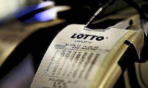

Advokatens brevkasse

Spørgsmål:

Kære advokat Monica Kromann

Først og fremmest tak for din altid nyttige brevkasse, som ofte har givet mig praktisk viden om problemstillinger vedrørende ægteskab.

Sagen er den, at min kone igennem mange år netop har anmodet om skilsmisse. Vores ægteskab har længe hængt i en tynd tråd, og jeg er ikke uenig i, at det er den rigtige beslutning, at blive skilt. Selvom vi er enige om at blive skilt, er vi dog meget uenige omkring delingen af boet, og vi skændes specielt om en større lottogevinst, som min kone vandt blot få dage inden, hun anmodede om skilsmissen.

Lottokuponen var købt for min kones løn, og hun mener derfor, at gevinsten skal tilfalde hende alene, men da vi altid har haft fælles økonomi og aldrig har oprettet en ægtepagt eller andet, mener jeg, at hun skal dele gevinsten med mig ved skilsmissen.

Jeg håber, at du vil besvare mit spørgsmål i din juridiske brevkasse.

Med venlig hilsen

Den fraskilte

SVAR:

Kære fraskilte

Først og fremmest tak for dit spørgsmål til min juridiske brevkasse, som jeg vil forsøge at besvare i det følgende.

Da du og din kone aldrig har oprettet ægtepagt, har I delingsformue i ægteskabet, hvilket betyder, at de af jeres aktiver, som er erhvervet før ægteskabets ophør, skal deles imellem jer ved separation eller skilsmisse.

Din kone har i og for sig ret i, at lottogevinsten tilhører hende, når kuponen er købt for hendes egne midler. Uanset tilhører gevinsten dog din kones delingsformue, da gevinsten er erhvervet før jeres delingsformue er ophørt, altså før din kone anmodede om skilsmisse. 

Ved den forestående skilsmisse står I over for en deling af jeres bo. Dette indebærer, at dine aktiver og passiver bliver stillet op mod hinanden, for at vurdere, om din bodel er solvent, ligesom sin kones aktiver og passiver stilles op mod hinanden, for at vurdere, om hendes bodel er solvent.

Viser det sig, at jeres bodele er solvente, skal I dele dem med hinanden. Dette indebærer, at din kone skal dele halvdelen af værdien af sine aktiver med dig. 

Viser det sig derimod at en eller begge af jeres bodele er insolvente, skal I ikke dele dem med hinanden. Dette følger af et almindeligt familieretligt princip, hvorefter ægtefæller ikke hæfter for hinandens gæld.

For at opsummere, opnår du altså halvdelen af værdien af lottogevinsten, hvis din kone har flere aktiver end hun har passiver. Herefter er der vel kun at sige tillykke med gevinsten!

Jeg håber, at ovenstående var svar på dit spørgsmål. Såfremt du har behov for yderligere vejledning eller assistance i forbindelse med den forestående skilsmisse og bodeling, vil jeg råde dig til at tage kontakt til en advokat med speciale i familieret. Du kan læse mere om familie- og arveretlige emner på min hjemmeside under http://www.advokatkromann.dk/brevkasse.

 

Med venlig hilsen 

Monica Kromann

---

### Uoverdragelige og personlige rettigheder  

**Rettigheder, som ikke kan overdrages eller i øvrigt har personlig karakter, indgår kun i formuedelingen**, i det omfang det er foreneligt med de regler, der gælder for disse rettigheder, jf. ÆF § 37.  

Personlige og uoverdragelige rettigheder omfatter bl.a. ophavsrettigheder, ret til biblioteksafgifter, bundne opsparinger, båndlagt arv og gave samt goodwill.  

Nogle af disse rettigheders behandling ved formuedelingen er reguleret i anden lovgivning, herunder ophavsretsloven, biblioteksafgiftsloven og arveloven for så vidt angår båndlagt arv (arvelovens §§ 53-58). 

---

For så vidt angår rettigheder, der ikke er særligt lovreguleret, er der i nogle tilfælde taget stilling i retspraksis, mens andre alene er omtalt i litteraturen.  

Selvom det bliver fastslået, at en rettighed er uoverdragelig eller af personlig art, er det ikke givet, hvordan rettigheden skal behandles ved formuedelingen. 

Det afgøres ud fra en fortolkning af den enkelte rettigheds karakter.

---

Fravigelse af udgangspunktet om ligedeling kan ske med støtte i en anden lov, forvaltningsakt, privat viljeserklæring, retspraksis og den juridiske litteratur.  

Det følger således af fortolkningen af andre love, private viljeserklæringer m m, i hvilket omfang sådanne fravigelser skal ske. 

---

I visse tilfælde udtages den pågældende rettighed forlods på skifte ved separation eller skilsmisse af den berettigede, i andre tilfælde fraviges reglen om formuedeling kun i mindre omfang.  

Indtægter og surrogater af personlige rettigheder er i almindelighed delingsformue og undergivet den almindelige ligedelingsnorm. 


---

### Regulering og misbrugskrav efter loven

Hvis en ægtefælle ved misbrug af rådigheden over sin formue eller på anden uforsvarlig måde væsentligt har reduceret delingsformuen, har den anden ægtefælle krav på at blive stillet, som om formindskelsen ikke havde fundet sted. 

Sådanne krav betegnes misbrugskrav, jf. ÆF § 40, stk. 1.  

Misbrugskravet kan kun gøres gældende ved formuedelingen. 

---

**Overstiger misbrugskravet delingsformuen**, udtages halvdelen af den manglende del af kravet af særeje eller alders- og kapitalpension, supplerende engangssum og supplerende engangsydelse, jf. ÆF § 34, stk. 2, og ÆF § 35, stk. 2, der tilhører den ægtefælle, der har foretaget misbruget, jf. ÆF § 40, stk. 1.  

Misbrugskrav, der ikke er blevet dækket ved formuedelingen, kan senere gøres gældende mod den anden ægtefælle for halvdelen af den del af kravet, der ikke er blevet dækket. 

Misbrug kan bl.a. være uforholdsmæssigt stort forbrug enten af kapital eller ved optagelse af lån, påtagelse af kautionsforpligtelser, tab ved spekulationsprægede forretninger eller lignende. 

---

Andre dispositioner, der kan udgøre misbrug, kan være pådragelse af erstatningsansvar ved forsætligt eller groft uagtsomme forhold, spirituskørsel, vanrøgt af en ejendom eller forsætlig eller grov uagtsom ødelæggelse af egne aktiver. 

Også gaver til tredjemand kan være misbrug, navnlig hvis ægtefællerne har ophævet samlivet, eller en samlivsophævelse er nært forestående.  

---

Rimelige indbetalinger på pensionsordninger, jf. ÆF § 34, kan ifølge motiverne aldrig være misbrug, mens indbetalinger af uforholdsmæssigt store beløb på pensionsordninger, der kan udtages forlods i medfør af ÆF § 35 om kortvarige ægteskaber, derimod efter omstændighederne kan være misbrug. 

Ved vurderingen heraf må der lægges vægt på størrelsen af indbetalingerne, om de afviger fra et hidtidigt indbetalingsmønster, og om der er særligt store indbetalinger lige op til anmodningen om separation eller skilsmisse. 

Det kan fx være relevant i tilfælde, hvor en ægtefælle på illoyal måde ved en nærtstående separation eller skilsmisse tegner en privat livrente mod et større engangsindskud, selvom ægtefællen ikke tidligere har foretaget sådanne engangsindskud. 

---

**HR:** Delingsformuen skal deles lige (hvis formuen er positiv), jf. ÆF § 5.

**U1:** Har den ene ægtefælle misbrugt delingsformuen, kan den anden ægtefælle have et misbrugskrav, jf. ÆF § 40. 

**U2:** Har en ægtefælle overført midler fra delingsformuen til sit særeje, kan den anden ægtefælle have et reguleringskrav, jf. ÆF § 38.  

**U3:**  Har en ægtefælle overført midler fra sit særeje til delingsformuen kan denne ægtefælle have et reguleringskrav, jf. ÆL § 39.   

---

Reglerne om misbrugskrav finder anvendelse på dispositioner, der er foretaget under hele ægteskabet og ikke kun på dispositioner, der er foretaget i tiden op imod separation eller skilsmisse, men det kan påvirke vurderingen om dette er tilfældet.  

Ved vurderingen af, om der er grundlag for et misbrugskrav, foretages der en samlet bedømmelse af den pågældende ægtefælles dispositioner. 

Det er ikke tilstrækkeligt at bedømme den misbrugsfremkaldende disposition isoleret. 

---

Der ses også på baggrunden for dispositionen, og hvornår den blev foretaget. 

Jo tættere ægtefællerne er på separation og skilsmisse, jo lavere vil grænsen være for, at der er tale om misbrug. 

Navnlig når der er tale om gaver til en ny partner, vil der skulle mindre til, før der er tale om misbrug. 

---

Der kan også foreligge misbrug, selvom der ikke er foretaget en, men en række dispositioner. 

Misbrug, der ligger langt tilbage i tiden vil, hvis krav overhovedet rejses, formentlig ofte kunne anses for at være stiltiende accepteret af den anden ægtefælle, hvis denne har haft kendskab til dispositionen.  

---

Ved misbrug forstås stort personligt forbrug i form af kostbare udlandsrejser, køb af dyr bil, påtagelse af kautionsforpligtelser, pådragelse af uforholdsmæssig stor gæld, tab ved spekulation og spil og vanrøgt i form af undladelser. 

Der må foretages en samlet bedømmelse af ægtefællens dispositioner set i forhold til ægtefællens indtægts- og formueforhold, udgifternes omfang, forbrugets karakter, hensigten med udgifterne og den tidsmæssige sammenhæng med en skiftesituation. 

Forretningsfolk i vid forstand har en bred margin, således at kun forretningsspekulationer, der i høj grad er letsindige eller åbenbart uforsvarlige kan begrunde vederlagskrav. 

---

Se begrebet **"vanrøgt"** som er en	uforsvarlig behandling. Kan give den anden ægtefælle ret til vederlagskrav.

---

Som eksempler på bestemmelsens anvendelse, se fra retspraksis dommen i **TFA 2016.116 Ø** Misbrugskrav afvist. Forbrug på ejendom i Spanien i form af ca. 1,3 mio. kr. til istandsættelse og køb af indbo. 
**<a href="https://pro.karnovgroup.dk/document/7000742331/1">Dommen klik her!</a>**

---

Dommen i **U 2006.2792** Boets nettobeholdning var 1,7 mio. I 1998 og 1999 var H’s privatforbrug 986.000 kr. Misbrugskrav på 200.000 kr.  
**<a href="https://pro.karnovgroup.dk/document/7000355637/1">Dommen klik her!</a>**

---

Dommen i **TFA 2006 119** Salg af andelsbolig i 2-familie hus. Ikke et misbrugskrav. 
**<a href="https://pro.karnovgroup.dk/document/7000323583/1">Dommen klik her!</a>**

---

Dommen i **TFA 2001.305** Ikke et misbrugskrav. Under anke af offentligt fællesboskifte påstod manden, at godt 300.000 kr., overført til hustruen i løbet af et par år før separationen, var a conto boslod, subsidiært at der tilkom ham et vederlagskrav efter (dagældende) lov om ægteskabets retsvirkninger § 23.
**<a href="https://pro.karnovgroup.dk/document/7000284188/1">Dommen klik her!</a>**

---

Dommen i **U 1965.820 Ø** Betydelige gaver fra M til K, som han senere giftede sig med, ej misbrug, da de var afholdt af hans løbende indtægter. 
**<a href="https://pro.karnovgroup.dk/document/7000212639/1">Dommen klik her!</a>**

---

Dommen i **U 1964.174 V** Forbrug på 14.000 kr. i 5 mdr.-periode lige før samlivsophævelse anset som misbrug. M’s bodel var 21.000 kr.; H’s 6.000 kr. 
**<a href="https://pro.karnovgroup.dk/document/7000210541/1">Dommen klik her!</a>**

---

Dommen i **TFA 1997.96** Hustru fik under fællesboskifte tilkendt knap 130.000 kr. med procesrente i vederlag efter (dagældende) lov om ægteskabets retsvirkninger § 23, stk. 1. Manden kunne ikke redegøre for en nettoformuenedgang på over 700.000 kr. siden samlivsophævelsen i 1989. Han havde endvidere misbrugt sin rådighed over bodelen ved oprettelse og salg af et anpartsselskab. Endelig havde han solgt en bil til en søn for en pris under værdien. 
**<a href="https://pro.karnovgroup.dk/document/7000283124/1">Dommen klik her!</a>**

---

Misbrug foreligger også, hvor **ægtefællen har ydet gaver til tredjemand** af en vis, relativ størrelse. 

Misbrugstærsklen vil være lav, hvor gaven ydes til en ny samlivspartner, særlig hvor en skiftesituation er aktualiseret. 

Meget betydelige **arveforskud** til et særbarn i en aktuel skiftesituation vil formentlig også kunne udløse misbrugskrav. 

---

Bodelen må være formindsket væsentligt - i form af forringelse af aktiver eller forøgelse af passiver. 

Der må udøves et samlet skøn over fællesejets værdi før og efter forringelsen, motivet for dispositionen og graden af uforsvarlighed og evt. sammenhæng med en skiftesituation.  

---

For at der kan rettes et misbrugskrav mod den anden ægtefælle kræves, at delingsformuen er formindsket i væsentlig grad. 

Om formindskelsen er så væsentlig, at der kan kræves misbrugskrav afgøres ved at sammenligne størrelsen af ægtefællens delingsformue før og efter den pågældende disposition. 

---

Kan der rejses misbrugskrav, er det afgørende for kravets størrelse, hvor stort boslodstab den anden ægtefælle har lidt ved dispositionen. 

Tabet kan derfor først opgøres, når delingsformuerne gøres op og deles mellem ægtefællerne.  

Der opstår ikke misbrugskrav, hvis den ægtefælle, der foretog dispositionen, havde en negativ delingsformue, da dispositionen blev foretaget, da den anden ægtefælle ikke lider tab ved dispositionen.  

Misbrugskrav vil altid stå tilbage for eventuelle kreditorers krav.

---

Når en ægtefælle er stillet urimeligt økonomisk:

Har en ægtefælle formue, der ikke indgår i formuedelingen, kan den anden ægtefælle ved formuedelingen få tilkendt en kompensation for at sikre, at denne ægtefælle ikke bliver stillet urimeligt økonomisk. 

Ved vurderingen lægges vægt på ægteskabets varighed, et eventuelt forudgående samliv, ægtefællernes indtægts-, formue- og pensionsforhold og omstændighederne i øvrigt., jf. ÆL § 42. 

---

### Pensionskompensation 

Efter ÆF § 44 kan der ved formuedelingen tilkendes en ægtefælle en kompensation, hvis ægtefællen under ægteskabet har foretaget en mindre pensionsopsparing, end hvad der svarer til en rimelig pensionsordning for den pågældende, og dette skyldes, at ægtefællen af hensyn til familien eller den anden ægtefælle helt eller delvis har været uden for arbejdsmarkedet, haft orlov eller arbejdet på nedsat tid. 

Kompensationen kan højst udgøre halvdelen af forskellen mellem værdien af den pensionsopsparing, hver af ægtefællerne har foretaget under ægteskabet af delingsformue.  

---

### Rimelighedskompensation


**Der kan ved formuedelingen efter ÆF § 45 tilkendes en ægtefælle en kompensation for at sikre, at denne ikke stilles urimeligt i pensionsmæssig henseende, hvis**  

1.	Ægteskabet har været af længere varighed. 

2.	Der er stor forskel i værdierne af ægtefællernes pensionsrettigheder.

---

### Udtagelse af aktiver

Hver ægtefælle kan efter vurdering efter ÆL § 48 udtage aktiver, der helt eller delvis indgår i ligedelingen efter ÆF § 5, stk. 1, 1. pkt. 

Dette gælder også aktiver, der tilhører den anden ægtefælle.

**Anmoder begge ægtefæller om at udtage samme aktiv**, udtages aktivet af den ægtefælle, der ejer aktivet, jf. dog ÆF § 48, stk. 3, hvoraf fremgår, at uanset ÆF § 48, stk. 2 udtager den anden ægtefælle et aktiv, hvis aktivet for denne har den væsentligste betydning for opretholdelsen af hjemmet eller fortsættelse af erhverv eller i øvrigt. 

---

**Retten til at udtage et aktiv efter 1. pkt. omfatter følgende aktiver:**  

* Bolig, der udelukkende eller hovedsagelig er bestemt til familiens helårsbolig.

*	Fast ejendom med to beboelseslejligheder, hvoraf den ene udelukkende eller hovedsagelig er bestemt til familiens helårsbolig.

*	Fast ejendom, der er bestemt til familiens fritidsbolig.

*	Indbo i fælles hjem og fritidsbolig.

*	Løsøre, der særlig har tjent den pågældende ægtefælles behov.

*	Erhvervsvirksomhed og erhvervsløsøre.

*	Transportmidler.

---

### Formuedeling ved en ægtefælles død


**Hovedreglen er, at delingsformuen skal deles lige, jf. ÆF § 51, med følgende undtagelser:**

U1: Særejeaktiver. 

U2: Personlige rettigheder mm., jf. ÆF § 37.

U3: Pensionsordninger, jf. ÆF § 52. 

U4: Førstafdøde ægtefælles pensioner, som tilfalder en begunstiget.

U5: Regulerings-, misbrugs- eller kompensationskrav, jf. ÆF § 53. 


---

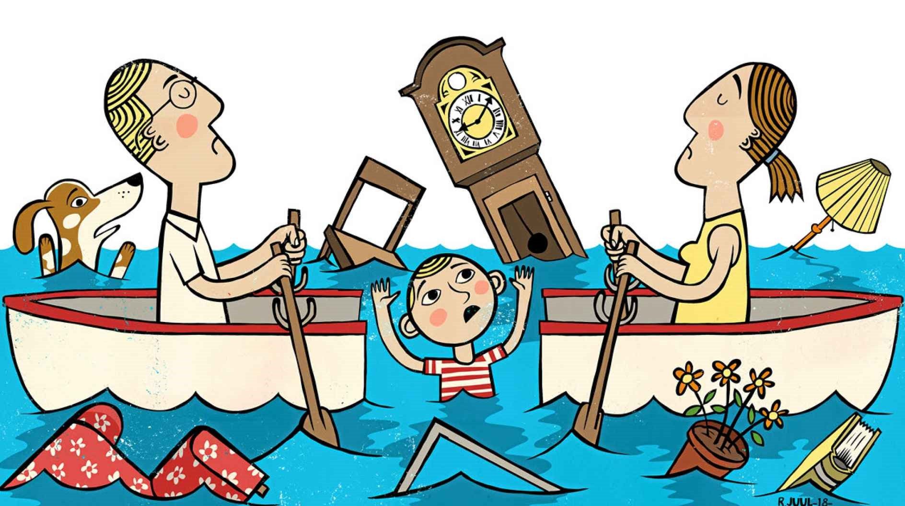

---

**Aspekter af skilsmissen**


<h4><a href="https://www.youtube.com/embed/ZvS2L4wIKPo" target="_blank" >Video Når det går galt ved en skilsmisse</a></h4>


---

<h4><a href="https://www.youtube.com/embed/tEDkwMk96r8" target="_blank" >Video Regler for samvær</a></h4>

---

<h4><a href="https://www.youtube.com/embed/o3E7r1JbvpA" target="_blank" >Video Hvordan møder man skilsmissen?</a></h4>

---

**Andre bestemmelser om ægteskabet:**

Der kan ske omstødelse af et ægteskab. **Ægteskabet kan opløses på grund af fx. bigami (en person gift med flere personer), eller ved blodskam (samleje eller handling af samlejelignende karakter mellem nærtbeslægtede).**


---

**Pairløst samliv:**

<h4><a href="https://www.youtube.com/embed/-g-TQPmtJEU" target="_blank" >Video 8 råd til et papirløst samliv</a></h4>

---

Det er vigtigt at tage stilling til ejerforhold, arv og pension når man lever i et parforhold uden at være gift.

---

**Her er 8 råd til, at sikre hinanden i et papirløst samliv:**

1. Få begge navne på lejekontrakten.

2. Husk de store ting I køber i fællesskab.

3. Lav et testamente.

4. Husk at børnene får arven hvis der ikke er testamente.

5. Få lavet en samejekontrakt.

6. Husk at tjekke pension.

7. Afklar hvem der skal have pengene når du dør.

8. Lær mere om din økonomi, når du lever papirløst på Rådtilpenge.dk

---

## Løsningsmodeller for eksamensopgaver indenfor ægtefælleres økonomiske forhold

**1. Lov om ægtefællers økonomiske forhold**^[Følgende afsnit bygger på Løsningsmodellerne fra opgavesamlingen i Erhvervsret ASPIRI, v. advokat *Peter Wedel Ranch Krarup*.]

- Gælder for ægtefæller.

- Gælder for registrerede partnere – Lov om registrerede partnerskaber § 3.

---

**2. Formuefællesskab eller særeje**

**2.1. Formuefællesskab**

- Der er formuefællesskab, medmindre det er etableret særeje - ÆF § 5.

**2.2. Særeje**

**2.2.1. Oprettelse af særeje**

- Efter ÆF § 12 kan ægtefæller ved ægtepagt indgå følgende aftaler om særeje*. 

- En ægtepagt om særeje er en skriftlig aftale mellem to ægtefæller. 

- Aftalen bestemmer, at der ikke skal gælde formuefællesskab i ægteskabet, som man ellers automatisk får, når man gifter sig. 

- Formuefællesskab betyder kort sagt, at man som ægtefæller skal dele formuer i tilfælde af separation, skilsmisse eller død.  

- Særeje er en formueordning, der betyder, at man ikke nødvendigvis skal dele alt i tilfælde af skilsmisse eller død. 

- Kræver ægtepagt - ÆF § 12, stk. 1 (skal være skriftlig, underskrevet og tinglyst).

---

**2.2.2. Særejets indhold**

At en ægtefælle ved formuedeling ved separation eller skilsmisse beholder sin formue, men at formuen deles ved en ægtefælles død. Særeje efter denne bestemmelse betegnes skilsmissesæreje, jf. ÆF § 12, stk. 1, pkt. 1. 

At en ægtefælle ved formuedeling ved separation eller skilsmisse beholder sin formue, og at ægtefællens formue ved formuedeling i forbindelse med dødsboskifte tilkommer den pågældende ægtefælle eller dennes arvinger. Særeje efter denne bestemmelse betegnes fuldstændigt særeje, jf. ÆF § 12, stk. 1, pkt. 2. 

At en aftale om fuldstændigt særeje kun skal gælde, hvis en bestemt af ægtefællerne dør først, eller kun skal gælde førstafdøde ægtefælles eller længstlevende ægtefælles skilsmissesæreje. Særeje efter denne bestemmelse betegnes kombinationssæreje, jf. ÆF § 12, stk. 1, pkt. 3.  

---

**3. Ægtefællens disposition over formuen**

**3.1. Råderetten**

- Særråden, dvs. En ægtefælle kan disponere alene over sine aktiver - ÆF § 1, stk. 1.

- Visse dispositioner over fast ejendom, når fælleseje kræver samtykke - ÆF § 6, stk. 1.

- Visse dispositioner over løsøre, når fælleseje kræver samtykke, jf. fx ÆF § 10, stk. 1.

- Pligt til ikke at forringe bodel - ÆF § 1, stk. 2 + om misbrugskrav, jf. ÆF § 40.

---

**3.2. Ægtefællerne kan indgå aftaler med hinanden - ÆF § 2.**

---

**3.3. Gaver mellem ægtefæller**

- Gaver mellem ægtefæller er gyldige uden ægtepagt, men det er af bevismæssige grunde klogt at sørge for, at der oprettes og underskrives et gavebrev mellem ægtefæller. 

- Se tillige Konkurslovens omstødelsesregler.

---

**3.4. Dispositioner over den anden ægtefælles aktiver, jf. ÆF § 1, stk. 3**

- Hvis ægtefællen er forhindret og ved nødstilfælde.

- Hvis ægtefællen har overgivet råderetten til den anden ægtefælle.

---

**4. Gældshæftelsen**

- Særhæften, dvs. under ægteskabet hæfter hver ægtefælle med sin formue for sine forpligtelser, uanset om forpligtelserne er opstået før eller under ægteskabet, se ÆF § 3.

---

**5. Bodeling**

**5.1. Anledning til skifte**

-	Bosondring under ægteskabet.

- Ved separation eller skilsmisse.

-	Ved ægtefælles død.

---

**5.2. Skifte af fællesboet**

-	Fællesboet udskiftes - ÆF § 26.

Følgende aktiver og krav indgår ikke i ligedelingen af ægtefællernes delingsformue ved separation eller skilsmisse efter § 5, stk. 1, 1. pkt, jf. ÆF § 26, stk. 1: 

- Særeje.

- Personlige genstande omfattet af ÆF § 31.

- Pensionsrettigheder omfattet af ÆF §§ 34 og 35.

- Personlige erstatninger omfattet af ÆF § 36.

- Uoverdragelige og personlige rettigheder omfattet af ÆF § 37.

- Regulerings- og misbrugskrav efter ÆF kapitel 11.

- Kompensationskrav efter ÆF kapitel 12 og 13.

---

**5.3. Delingen af fællesboet - ÆF §§ 27-33.**

-	Ægtefællernes nettobodel (aktiver og passiver) opgøres hver for sig.

-	Hver ægtefælle har krav på halvdelen af værdien af den andens positive nettobodel.

-	Efter delingen kaldes ægtefællernes andele af fællesboet for boslodder.

---

**5.4. Yderligere krav på den anden ægtefælle**

-	Vederlagskrav ved vanrøgt - ÆF § 40.

---

## Quiz

<h3><a href="https://quiz.tepedu.dk/jura23" target="_blank">Quiz Familieret</a></h3>

---
 

<!--chapter:end:17-Familieret.Rmd-->

# Arveretten

```{r, echo=FALSE, results='asis'}
cat(readLines('np.html'))
```


---

***Forståelsen af reglerne om arv kan være anvendelig for dig, som privat person gifte, som samlevende, og dig som finansøkonomer, der skal arbejde i ejendomshandel, ejendomsadministration, bank og realkredit, forsikring, samt revision og økonomifunktion i forbindelse med sikkerhedsstillelse ved lån til ægtefællerne ved deres køb af fast ejendom, lejeforhold og ved låneoptag mv.***

---

***De arveretlige regler anvendes bl.a. i faget "Privatøkonomisk rådgivning" på finansøkonomuddannelsen, samt i udarbejdelse af det juridiske kundenotat under OLA'er.***

---


<h4><a href="https://www.youtube.com/embed/ikBxcxBSBb8" target="_blank">Video Hvem arver fra dig?</a></h4>

---

***Døden er en gæld, som ingen kan betale mere end èn gang. - Shakespeare.***

---


**Introduktion til arveretten:**

Med arvelovsrevisionen er der blevet gennemført en styrkelse af den længstlevende ægtefælles retsstilling.^[Følgende afsnit om arveretten bygger især på *Linda Nielsens* Karnovkommentar til arveloven, KarnovGroup.] 

---

Se nærmere *"arveloven"*(AL) Lov 2007-06-06 nr. 515
**<a href="https://jura.tepedu.dk/lovsamling.html" target="_blank">Lovsamlingen klik her!</a>**

---

**Oversigt over arveloven:**

* KAP. 1 SLÆGTNINGES ARVERET. 

* KAP. 2 ÆGTEFÆLLENS ARVERET.  

* KAP. 3 SVOGERSKABSARV EFTER EN LÆNGSTLEVENDE ÆGTEFÆLLE.

* KAP. 4 USKIFTET BO.  

* KAP. 7 AFTALE OM ARV SAMT ARVEFORSKUD.  

* KAP. 8 UDELUKKELSE OG BORTFALD AF ARVERET. 

* KAP. 9 TESTAMENTARISK BESTEMMELSE OVER TVANGSARV.  

* KAP. 10 TESTAMENTARISK BESTEMMELSE OVER FRIARV.  

* Kap. 11 OPRETTELSE OG TILBAGEKALDELSE AF TESTAMENTE. 

* Kap. 12 TESTAMENTES UGYLDIGHED OG ANFÆGTELSE.  


---

Ægtefæller vil typisk have et ønske om, at den længstlevende, så vidt muligt kan fortsætte sin livsførelse. 

Arveloven, er derfor søgt indrettet, så dette ønske i højere grad kan realiseres, uden at ægtefæller behøver at oprette et *testamente* om begrænsning af børnenes arv.

Dette er navnlig sket ved en forhøjelse af den legale arveret, fra 1/3 til 1/2 af arveladerens ejendele, når arveladeren samtidig efterlader sig børn (livsarvinger). 

---

Arveloven indebærer endvidere, at arvelader har fået **større frihed til at disponere over sin formue ved oprettelse af testamente**. 

*Livsarvingernes tvangsarv* er således nedsat fra 1/2 til 1/4 af den legale arv.

Også *ægtefællens tvangsarv* udgør fremover 1/4 af den legale arv.  

---

Endvidere er indført en adgang for arvelader til at **begrænse en livsarvings tvangsarv** til 1 mio. kr., ligesom arveladeren har fået mulighed for at bestemme, at en livsarving skal have sin tvangsarv udbetalt kontant. 

Dette indebærer, at det bl.a. bliver lettere at ligestille sammenbragte børn i arveretlig henseende, og at gennemførelsen af generationsskifter af erhvervsvirksomheder lettes.

Herudover giver arveloven mulighed for, at ugifte samlevende på en særlig nem måde kan oprette testamente om gensidig arveret (et **udvidet samlevertestamente**).

---

De aktiver og passiver, som en afdød efterlader sig, kaldes et **dødsbo**.

Afviklingen af dødsboet mellem arvinger og kreditorer kaldes et **skifte**. 

De arveretlige regler i arveloven fastlægger, hvem der er arvinger, og hvor meget og hvad den enkelte arving skal arve af det, der er i behold i boet. 

---

Efterlader afdøde sig ingen gæld, men alene aktiver, og ses der bort fra de forskellige regler om arveafgift (se boafgift og gaveafgift) mv., bliver det de arveretlige regler, der afgør, hvem arvebeholdningen, dvs. boets formue, skal tilfalde. 

---

De arveretlige regler medfører således en **overgang af ejendomsretten** til afdødes formue fra den afdøde til arvingerne. 

---

En betingelse for at arve er, at arvingen har overlevet arveladeren. 

Bevis for arveladerens død vil i almindelighed let kunne føres ved fremlæggelse af en **dødsattest**. 

Hvis en sådan ikke kan tilvejebringes, kan en domstol undertiden statuere, at en person er død eller må anses for død (såkaldt **dødsformodningsdom**).  

---

Beviset for, at arvingen har overlevet den afdøde, kan give vanskeligheder i visse tilfælde. 

Er der ikke vished for, at en bortebleven person har overlevet afdøde, afsættes kun arv til den pågældende, hvis der er nogen sandsynlighed for, at han/hun er i live. 

---

Er der vished for, at arvingen har overlevet afdøde, afsættes derimod arvelod, uanset om arvingens opholdssted måtte være ukendt.  

Hvis to personer, som havde arveret efter hinanden, er døde, uden at det vides, hvem der er død først, anses den ene ikke for at have overlevet den anden. 

Reglen har praktisk betydning fx ved trafikulykker, hvor ægtefæller omkommer. 

---

Et barn, som er avlet forinden dødsfaldet og senere fødes levende, har også arveret. 

Den gravide kvindes foster er således arveberettiget.

---

Det siges, at **"arven er faldet"**, når kravet på arv kan overføres ved aftale, tilegnes af arvingens kreditorer, falde i arv ved arvingens død eller indgå i arvingens eventuelle separations- eller skilsmissebo. 

Dette tidspunkt indtræder som regel ved arveladers død. 

---

Der gælder særregler, når arveladerens efterlevende ægtefælle overtager et fællesbo til hensidden i uskiftet bo med den førstafdødes livsarvinger. 

Et **"uskiftet bo"** er	en ægtefælles overtagelse af fællesboet uden skifte med førstafdødes livsarvinger.

**Sammenlevende person, som ikke er gift, kan ikke sidde i uskiftet bo.**

---
 
## Arvens fordeling til arveklasser

Arvinger kan inddeles i tre hovedgrupper: slægtninge, ægtefæller og testamentsarvinger.  


**Arven fordeles til arveklasse 1, 2 eller 3.** 

**Er der ingen arvinger i arveklasse 1 går man videre til arveklasse 2, og er der ingen arvinger i arveklasse 2, arver arveklasse 3.**  

Ægtefælle har også **legal arveret**.

---

Arvelader kan selv få indflydelse på fordeling af arven ved at oprette testamente. 

Er der ingen arvinger efter arvelov eller testamente tilfalder arven statskassen, (på latin; "fiscus"),  jf. nærmere AL § 95, stk. 1: "Er der ingen arvinger efter loven eller testamente, tilfalder afdødes formue staten".  

---

Vores arvesystem kaldes også for **"parentelsystemet"** med	opdeling af slægten i arveklasser. 

**Første parentel er arveladerens livsarvinger, hvis der ikke er nogen, så går arven videre til:**

**Andet parentel er arveladerens forældre og disses livsarvinger, hvis der ikke er nogen, så går arven videre til:** 

**Tredje parentel er arveladerens bedsteforældre og disses livsarvinger.**


---

**Arveklasse 1:** 

Arveklasse 1 er **"livsarvinger"**, som er børn, børnebørn, oldebørn osv., jf. AL § 1. 

**Børnene arver lige**. 

Er et af børnene døde, træder dette barns livsarvinger i stedet og arver lige ¼ af arven er tvangsarv, jf. AL § 5. 

Børns arv kan begrænses til 1 mio. kr., jf. AL § 5, stk. 2. (1.290.000 kr. i 2019).   

AL § 1 omhandler således arv til 1. arveklasse, dvs. arveladerens livsarvinger (**tvangsarvinger**), som er arveladerens nærmeste slægtsarvinger. 

---

Børnelinjen omfatter børn, børnebørn, oldebørn osv. Slægtskab foreligger mellem en mor og hendes barn og mellem barnet og den mand, der er barnets retlige far. 

Det er en forudsætning at faderskabet er fastslået inden dødsfaldet eller efterfølgende bliver det. arver lige.  

---

Er et barn død, træder dets børn i dets sted og arver indbyrdes lige. 

På tilsvarende måde arver fjernere livsarvinger. 

Denne såkaldte **"stirpal-grundsætning"** betyder, at arven inden for hver arveklasse fordeles i "stammer" og ikke efter "hoveder". 

---

Stirpalgrundsætningen	fordelingen af arven efter stammer og linier. 

**Eksempel:**

Hvis fx arveladeren efterlader sig en datter og en afdød søns 2 børn, arver datteren halvdelen af boet, mens de 2 børnebørn skal dele den anden halvdel med en fjerdedel til hver. Hvis man delte efter antal hoveder, ville de hver arve en tredjedel.

---

Børnebørn arver således ikke, så længe barnet lever. 

Når børnebørnene arver, må de »deles« om det afdøde barns arv - det såkaldte **"repræsentationsprincip"**. 

På tilsvarende måde arver fjernere livsarvinger (oldebørn mv.).   

---

**Arveklasse 2:**

Arveklasse 2 er arveladers forældre, jf. AL § 2. Forældrene arver lige. 

Er en af forældrene død, træder dennes børn (**arveladers søskende**) i stedet og arver lige. Der bliver på denne måde forskel på hel- og halvsøskende. 

**Arveklasse 2 er ikke tvangsarvinger**, så kan arvelader selv bestemme ved testamente, hvad der skal ske med formuen. 

---

Hvis der ikke er oprettet testamente så følger arven arveklasserne.

Bestemmelsen i AL § 2 omhandler således arv til 2. arveklasse - forældrelinjen. 

Hvis arveladeren ikke efterlader sig livsarvinger, tilfalder arven anden arveklasse, som også kaldes **"udarvinger"**; som er arveladerens arveberettigede slægtninge, bortset fra arveladerens livsarvinger, fx afdødes forældre, søskende og søskendebørn.

---

**Arveklasse 2** udgøres således af afdødes forældre og disses efterkommere, dvs. arveladerens søskende, nevøer og niecer osv. 

Et **"kollateralt slægtskab"** er et	slægtskab i sidelinien, dvs. hvor personer har fælles ophav, fx søskende.

Lever begge arveladerens forældre, arver de hver halvdelen, hvis arvelader ikke efterlader sig nogen livsarvinger.

---

*Arveklasse 3:*

Arveklasse 3 er arveladers bedsteforældre, jf. AL § 3. 

Arven fordeles med halvdelen til moderens forældre og halvdelen til faderens forældre. 

Er en af bedsteforældrene døde, træder dennes børn (arveladers faster, moster osv.) i stedet og arver lige. 

---

Bedsteforældre børnebørn (fætre og kusiner) arver ikke. 

**Arveklasse 3 er ikke tvangsarvinger.**  

Lever alle 4 bedsteforældre deles arven i 4 portioner. 

---

Er en af bedsteforældrene død, træder dennes børn i stedet efter **"repræsentationsprincippet"**. 

Arveladers farbrødre, fastre, mostre og morbrødre kan således være legale arvinger. 

Er farfaren død og efterlader sig to børn, arver disse således 1/8. 

---

Derimod falder arven ikke videre til fjernere livsarvinger. 

Arveladerens kusiner og fætre samt deres børn er således ikke legale arvinger.  

---

Arven mellem bedsteforældrelinien på fædrene side og bedsteforældrene på mødrene side sker efter stirpal-grundsætningen i § 2, og fordeles således ud i 1/4 til hhv. farfaren eller dennes børn, farmoren eller dennes børn, mormoren eller dennes børn samt morfaren eller dennes børn. 

---

Er der kun arvinger på fædrene eller mødrene side, deles arven ud med 1/2 til hver af disse eller deres børn. 

Efterlades en mormor og to fastre, arver mormoren således 1/2 og fastrene 1/4, mens fætre og kusiner ikke arver.  

  
---
 


---


<h4><a href="https://www.youtube.com/embed/EIgZkPOF0_E" target="_blank">Video Sådan fordeles arven</a></h4>

---

## Længstlevendes ægtefælles arveret

**Her en oversigt over længstlevendes ægtefælles arveret:**  

*	Ægtefællen arver 1/2, hvis arvelader har børn, jf. AL § 9, stk. 1, ellers det hele jf. § 9, stk. 2. 

*	1/4 af arven er tvangsarv jf. AL § 10. 

*	Længstlevende ægtefælles har mulighed for at sidde i uskiftet, dvs.	en ægtefælles overtagelse af fællesboet uden skifte med førstafdødes livsarvinger.

*	Suppleringsarv AL § 11, stk. 2 op til 780.000 kr. (2019) – inklusive:

+	Boslod og særeje for længstlevende ægtefælle.

+	Arvelod for længstlevende ægtefælle.

+	Forsørgertabserstatning, livsforsikring, pension efter førstafdøde ægtefælle.

+	Ægtefællepension og ægtefælleydelse.

+	Ved længstlevende ægtefælles død, skal arven (som udgangspunkt) fordeles mellem begge ægtefællers arvinger, jf. AL § 16, stk. 2. 
 

---

<h4><a href="https://www.youtube.com/embed/qYf2gatfAWQ" target="_blank">Video Fordeling af arv: Ugift par uden børn</a></h4>

---

<h4><a href="https://www.youtube.com/embed/cDriXFDNg30" target="_blank">Video Fordeling af arv: Ugift par med fælles børn</a></h4>

---


<h4><a href="https://www.youtube.com/embed/x7WzAOJJNXQ" target="_blank">Video Fordeling af arv: Ugift par med stedbørn</a></h4>

---

<h4><a href="https://www.youtube.com/embed/WVec5BYeu34" target="_blank">Video Arv mellem sammenlevende</a></h4>

---

<h4><a href="https://www.youtube.com/embed/bNa7tt460bY" target="_blank">Video om fordeling af arv uden børn</a></h4>

---

<h4><a href="https://www.youtube.com/embed/TXaWe8-jz9s" target="_blank">Video Fordeling af arv med fællesbørn</a></h4>

---

**"Stedbørn"** er	de børn, som ægtefællen har med andre - kaldes også særbørn eller særkuldbørn.

---

<h4><a href="https://www.youtube.com/embed/MQ6i9G5NxUc" target="_blank">Video Fordeling af arv: Ægtepar med stedbørn</a></h4>

---

<h4><a href="https://www.youtube.com/embed/UtsI4IWmajI" target="_blank">Video Arv mellem ægtefæller</a></h4>

---

## Uskiftet bo for den længstlevendes ægtefælle

Vælger ægtefællen at sidde i **uskiftet bo**, får ægtefællen rådighed over alle aktiver og overtager afdødes gældsforpligtelser, jf. AL §§ 24 og 25. 

Kan kun sidde i uskiftet bo med delingsformue – særejet skal skiftes, jf. AL § 17. 

---

**Man kan ikke sidde i uskiftet bo, hvis man ikke har været gift.** 

Særbørn skal give samtykke til uskiftet bo, jf. AL § 18. 

Hvis længstlevende misbruger det uskiftede bos midler, kan børnene kræve skifte, jf. AL § 29.  

---

Længstlevende ægtefælle kan således forbruge det uskiftede bos midler og give gaver mv., men kan af hensyn til førstafdøde ægtefælles arvinger ikke råde frit. 

Spørgsmål om misbrug kan indbringes for skifteretten af førstafdødes arvinger, jf. AL §§ 29-32. 

Længstlevende ægtefælle har rådighed uden at være egentlig ejer. 

---

Den pågældende kan således fx stille sikkerhed, sælge aktiver hørende til det uskiftede bo og give gaver, men skal på den anden side tage hensyn til førstafdøde ægtefælles livsarvinger, idet længstlevende også råder over livsarvingernes potentielle arv efter førstafdødes ægtefælle.  

Når længstlevende dør, skal arven fordeles til begge ægtefællers livsarvinger, men der regnes ikke arv til ægtefællen, jf. AL § 28.  

---

## Arveladers testationskompetence

Testamenter giver arvelader mulighed for at få indflydelse på, hvem der skal arve, og hvad de skal arve.  

---

**Oversigt over arveladers testationskompetence:** 

Hovedreglen er, at arvelader kan ved testamente råde over hele sin formue. 

Undtagelsen er, hvis arvelader er gift og/eller har børn, er testationskompetencen begrænset af tvangsarven, jf. AL § 50.

Tvangsarven er som udgangspunkt 1/4 af arveladers formue.

---

En **"legatar"** er	en person, der skal arve en bestemt angiven pengesum eller bestemte ejendele.

---

**Testationskompetence:**

```{r pie,echo=FALSE, message=FALSE,result=TRUE, fig.cap=("En fjerdedel af testators formue er tvangsarv hvis der er børn eller ægtefælle")}
library("chartjs")
chartjs(height = "300px") %>%
  cjsPie(labels = c("Tvangsarv 25%","Friarv 75%")) %>%
  cjsSeries(data = c(0.25,0.75))%>%
cjsLegend(position = "top")
```


---

**Eksempel: Tvangsarv med ægtefælle og 2 børn, formue: 1.200.000,-:**

```{r pie2,echo=FALSE, message=FALSE,result=TRUE, fig.cap=("Formuen 1.200.000,- Ægtefællen arver 50% af 25% af formuen  i tvangsarv, børnene hver 25% af 25% af formuen i tvangsarv")}
library("chartjs")
chartjs(height = "300px") %>%
  cjsPie(labels = c("Ægtefælle: 12.5%","Barn 1: 6.25%","Barn 2: 6.25%","Friarv: 75%")) %>%
  cjsSeries(data = c(150000,75000,75000,900000))%>%
cjsLegend(position = "top")
```


---

**OBS: Suppleringsarv er også tvangsarv:** 

Der er tale om en tvangsarveret, der ikke kan fratages ved testamente. 

Retten til forlods udtagelse indebærer, at udtagelsen ikke belaster den længstlevende ægtefælles boslodskrav ved opgørelsen af fællesboet, og heller ikke kravet i henhold til retten til suppleringsarv. 

---

En længstlevende ægtefælles påberåbelse af AL § 11, stk. 1 vil kunne medføre, at et dødsbo kan sluttes uden skiftebehandling. 

Reglen vil derfor også i praksis blive påberåbt af en længstlevende ægtefælle, der som enearving ville kunne overtage hele boet efter AL § 9, stk. 2. 

---


<h4><a href="https://www.youtube.com/embed/5MxSyf_Ah84" target="_blank">Video Styr på arven: Testamente eller ej?</a></h4>

---


<h4><a href="https://www.youtube.com/embed/JdGPXTv0KEA" width="853" target="_blank">Video Styr på arven: Fem gode råd om testamente</a></h4>

---

**Hvad du skal være opmærksom på omkring arveforhold:**

1.Find ud af, hvem du vil have, der skal arve efter dig.

2.Husk, at nogle har krav på at arve efter dig.

3.Pensioner og livsforsikringer skal ikke skrives ind i dit testamente.

4.Overvej, om du vil lægge begrænsninger på din arv.

5.Husk at opdatere dit testamente, når der sker ændringer i din familie.

---

<h4><a href="https://www.youtube.com/embed/TcZb7VCClcQ" target="_blank">Video Hvordan opretter du et testamente?</a></h4>

---

<h4><a href="https://www.youtube.com/embed/F6Yourieo0Q" target="_blank">Video Styr på arven: Hvem får pensionen? </a></h4>

---

**Hvem skal have ens pension og livsforsikring, når man dør?**

Det er vigtigt at huske, at pension og livsforsikring ikke skal skrives ind i ens testamente. 

Her skal man til gengæld selv lave en begunstigelse - og det er helt gratis at gøre i banken eller hos ens forsikringsselskab.

---


## Kravet til et gyldigt testamente  


---


*	at testator er fyldt 18 år (15 år for midler den umyndige selv kan råde over)

*	At testator kan handle fornuftsmæssigt

*	At testamentet opfylder kravene til:

*	Notartestamente.

*	Vidnetestamente.

*	Nødtestamente.

---

Hvis der skulle være fejl i et testamente, har domstolene mulighed for at rette og korrigere i et testamente.

---

Se nærmere om **"korrigerende fortolkning"** af et testamente, jf. arvelovens § 76:

"En testamentarisk bestemmelse, der på grund af en fejlskrift eller anden fejltagelse har fået et indhold, der afviger fra det tilsigtede indhold, skal så vidt muligt gennemføres efter sin rette mening. Hvis denne ikke kan fastslås, er den testamentariske bestemmelse ugyldig".

---

Den testamentariske bestemmelse skal kun gennemføres, hvis det rent faktisk er muligt med en meget høj grad af sandsynlighed at finde ud af, hvad den rette mening har været. 

Er det klart, at der er skrevet forkert, men er det ikke muligt at finde ud af, hvad der skulle have stået, må der bortses fra bestemmelsen.

---

**Andre testamenteretlige begreber:**

Et **"kodicil"** er et	tillæg til et testamente.

Et **"liberationslegat"** er en bestemmelse i et testamente om, at en bestemt gældspost skal eftergives ved testators død.

Et **"reciprokt testamente"** er et	gensidigt testamente, hvor opretterne begunstiger hinanden.

**"Repartition"** er en	redegørelse for fordelingen af et dødsbos midler.

**"Sekundosuccesssion"** er en	bestemmelser om, hvem arven tilfalder, når den første arving er død.

**"Eksheredere"**, at	gøre arveløs.

Et **"uigenkaldeligt testamente"** er et	testamente, som ikke kan tilbagekaldes. Uigenkaldelighedserklæringen skal afgives i testamentsform og der skal desuden foreligge et bindende løfte over for arvingerne.

**"Universalarving"** er en	arving, som skal arv hele dødsboet.

---

<h4><a href="https://jyskebank.tv/hvorfor-lave-et-testamente" target="_blank">Video Hvorfor skrive et testamente?</a></h4>


---

## Notartestamente, jf. AL § 63


**Et notartestamente er et testamente, der underskrives foran en notar i byretten.** 

Notarens gebyr på 300 kr. sikrer, at testamentet bliver fundet og fulgt, når testator går bort. 

Notaren påtegner testamentet og kontrollerer testators identitet, fornuft, mv.

---

Registrerer testamentet i Centralregistret for testamenter.

Notartestamentet er svært at anfægte (tilsidesætte) i praksis.

En **"bortkomstklausul"** er en klausul i et notartestamente om, at den underskrevne genpart af testamentet, som opbevares i skifteretten, skal have samme gyldighed som originaleksemplaret.

---

**Nærmere om et notartestamente:**

Ved underskrift af testamente skal man udover originalen medbringe en kopi af testamentet.

Man skal medbringe billedlegitimation med cpr.nr.
 
Notaren skal sikre sig, at man forstår testamentets betydning. 

Det kan for eksempel ske ved at tale om testamentets indhold.

Det er ikke notarens opgave at godkende testamentet.

Både originalen og kopien skal skrives under hos notaren. 

Retsafgiften er som nævnt 300 kr.

Retten beholder kopien og underretter et centralt register om, at testamentet er oprettet.

---

**Om oprettelse af notartestamente - en vejledning til testator:**

Der skal udfyldes en forside til testamentet. 

Hent forsiden her:
**<a href="http://www.domstol.dk/Selvbetjening/blanketter/Blanketter/Forside%20til%20testamente.pdf">klik her!</a>**

---

Det anbefales, at blanketten udfyldes på pc.

Testamentet er gyldigt fra det øjeblik, man har underskrevet det hos **notaren**.

---

Når notaren har påtegnet testamentet, vil man eller ens advokat få det originale testamente udleveret med en påtegning om, at man har underskrevet testamentet i notarens påsyn, og at notaren har skønnet, at man fornuftsmæssigt var i stand til at oprette testamente. 

---

Man bør opbevare testamentet et sted, hvor det er nemt at finde. 

Hvis ens testamente indeholder bestemmelser om ens begravelse, er det en god ide, at man fortæller det til sine nærmeste.

---

Retten opbevarer en kopi af testamentet og sørger for at oprettelsen indberettes til et centralt register. 

Dette sikrer, at skifteretten får besked om testamentet efter ens død.

---

Hvis man har oprettet et testamente hos notaren, skal man også henvende sig til notaren, hvis man vil tilbagekalde eller ændre det. 

Ændring og tilbagekaldelse skal ske ved, at man opretter et nyt testamente, hvori det tidligere testamente bliver tilbagekaldt eller ændret. 

---

Notaren rådgiver ikke om formuleringen af et testamente. 

Formuleringen af testamentet og dets indhold kan man drøfte med en advokat.

---

**Hvad indeholder et testamente?**

Et testamente kan indeholde mange forskellige emner, alt efter hvilken slags testamente, der er tale om. 

**Testamenter regulerer generelt følgende:**

* Parterne: Hvem efterlader arven og har de børn?

* Fordeling af arven: Hvordan skal arven fordeles?

* Subsidiære arvinger: Hvad gælder for sekundære arvinger?

* Særeje for arvinger: Skal arven være særeje?

* Indbotestamente: Hvem arver dine personlige ejendele?

* Ændringer og tilbagekaldelse: Kan testamentet ændres eller tilbagekaldes?

* Samlivsophævelse: Hvad sker der, hvis I går fra hinanden?

* Længstlevendes testationsret: Kan længstlevende lave et nyt testamente?

* Pensioner og forsikring: Hvad skal der ske med pensioner og forsikringer?

* Ajourføring af testamentet: Hvordan ajourføres testamentet?

* Underskrift for notaren: Hvordan skal testamentet underskrives?

---

## Vidnetestamente, jf. AL § 64


---

Et vidnetestamente er et testamente, der underskrives under tilstedeværelse af **to uvildige vidner**. 

I den tilhørende vidnepåtegning skal vidnerne skrive under på, at de sammen har overværet underskrivelsen af testamentet samt at testator var fornuftsmæssig i stand til at råde over sin formue ved testamente.

---

To vitterlighedsvidner, som ikke selv må være begunstiget i testamentet.

Vidnerne kontrollerer testators underskrift, fornuft mv.

---

**En person kan således ikke være testamentsvidne, hvis:**

* Testamentet begunstiger den pågældende eller dennes ægtefælle, samlever, beslægtede eller besvogrede i op- eller nedstigende linje, søskende eller andre nærstående. (Forlovede vil sammen med kærester og - efter en konkret vurdering - fjernere beslægtede blive anset for at være nærstående), 

* Testamentet begunstiger en person eller institution, som den pågældende ved testamentets oprettelse har en sådan tilknytning til, at testamentsvidnet har haft en særlig interesse i begunstigelsen, eller

* Der i øvrigt foreligger omstændigheder, som er egnede til at vække tvivl om den pågældendes habilitet.

---

Hvis et testamentsvidne har medvirket til oprettelse af et testamente i strid med AL § 64, stk. 3, nr. 1-3, er testamentet således anfægteligt. 

**Bevisbyrden** påhviler den, der vil arve, hvis testamentet tilsidesættes.


---

**<a href="https://dokument24.dk/info/vitterlighedsvidne">Hvad er et vitterlighedsvidne? klik her!</a>**


---

## Nødtestamente, jf. AL § 65

*"Holografisk testamente"*, i dansk ret et nødtestamente oprettet **uden vidner**, men skrevet og underskrevet egenhændigt af testator.


---

**Betingelser ved oprettelsen af et nødtestamente:**

Kræver en nødsituation.

Ingen formkrav.

Bortfalder efter tre måneder.

---

En nødsituation kunne fx blodprop eller umiddelbart før en stor operation.

Andre nødstilfælde kan være et synkende skib, en naturkatastrofe, samt beslutning om selvmord, jf. nedenfor dommene om nødtestamente ved selvmord, jf. **U 1970.10 H, U 1979.108 H** og **U 2000.1340 H.**


---

Se dommen i **U.2019.1526 V** Testamente oprettet på dødslejet med begunstigelse af samleverske opfyldte betingelserne i arvelovens § 65 for nødtestamente.
**<a href="https://pro.karnovgroup.dk/document/7000834350/1">Dommen klik her!</a>**

---

Se dommen i **U 1970.10 H** Holografisk testamente oprettet før selvmord blev anset for et gyldigt nødtestamente.
**<a href="https://pro.karnovgroup.dk/document/7000213771/1">Dommen klik her!</a>**

---

Se dommen i **U 1979.108 H** Dokument efterladt af afdød, som havde begået selvmord, anerkendt som nødtestamente.
**<a href="https://pro.karnovgroup.dk/document/7000208197/1">Dommen klik her!</a>**

---

Se dommen i **U 2000.1340 H** Holografisk testamente anerkendt, da opretteren ikke var ude af stand til at råde fornuftsmæssigt.
**<a href="https://pro.karnovgroup.dk/document/7000196579/1">Dommen klik her!</a>**


---


## Udvidet samlevertestamente

"Udvidet samlevertestamente" er en	betegnelse for et testamente mellem ugifte samlevende, hvor de bestemmer, at de skal arve hinanden og arves, som om de var ægtefæller, jf. AL § 87. 

For gyldigt at oprette et sådant testamente skal parterne opfylde betingelserne for at kunne indgå ægteskab med hinanden, jf. AL § 88. 

---

Et udvidet samlevertestamente kan derfor ikke oprettes af søskende eller andre personer, der er beslægtet i op- og nedstigende linje. 

Der kan heller ikke oprettes et udvidet samlevertestamente, hvis en af parterne er gift eller part i et registreret partnerskab. 

---

Er der tale om personer af samme køn, er det endvidere en betingelse, at en af parterne er dansk (eller norsk, svensk eller islandsk) statsborger og har bopæl her i landet, eller at begge parter har haft bopæl her i landet i de sidste to år, jf. § 2 i lov om registreret partnerskab.  

Personer, der sidder i uskiftet bo, kan ikke oprette udvidet samlevertestamente.

---

Parterne skal endvidere på dødstidspunktet leve sammen sammen på fælles bopæl og  

a) vente, have eller have haft et fælles barn eller  

b) have levet sammen på den fælles bopæl i et ægteskabslignende forhold i de sidste 2 år.

Samlevende har således ingen legal arveret, kræver oprettelse af testamente.

Samleverne kan arve hinanden – maksimalt 7/8 af formuen i konkurrence med børn. 

---

Samleveren kan udtage suppleringsarv.

---

Der kan udloddes svogerskabsarv efter længstlevende samlever.

Ordet "udlodning" betyder	udbetaling af arv i et dødsbo.

Samlevende kan ikke sidde i uskiftet bo.

Udvidet samlevertestamente skal ændres ved nyt testamente.

Udvidet samlevertestamente bortfalder ved indgåelse af ægteskab.

---

Hvis der fx. er bestemt i et samlevertestamente, at **”længstlevende skal arve mest muligt”**. Det betyder, at andre arvinger skal have deres arv begrænset mest muligt til fordel for den af dem, som bliver længstlevende.

Det får den betydning, at førstafdødes formue skal deles ligeligt mellem længstlevende og evt. et fællesbarn, eller særbarn, født, som ufødt jf. AL § 94, jf. AL § 1 om børns arveret og AL § 9 om ægtefællens arveret, når afdøde har livsarvinger. 

Desuden vil den længstlevende automatisk være **”begunstiget”** og dermed umiddelbart have retten til udbetalinger fra evt. livsforsikringer jf. nærmere forsikringsaftaleloven § 102. 

Længstlevende vil også have de særlige rettigheder, som i arvesituationen tilkommer en ægtefælle i form udtagelsesret mv, dog ikke retten til at hensidde i uskiftet bo.  

Barnet er tvangsarving, og arven til barnet kan højst begrænses til en fjerdedel af det, som barnet i udgangspunktet skulle arve, jf. AL § 5. 

I denne situation, hvor der ikke er andre livsarvinger, skulle barnet i udgangspunktet arve halvdelen af den formue, der falder i arv efter førstafdøde. Dvs. tvangsarven til barnet efter førstafdøde udgør ¼ x ½ = 1/8 

Fællesformuen, som skal deles, efter førsteafdøde udgør fx på dette tidspunkt i alt 600.000 kr. Arven efter førstafdøde udgør altså i alt 300.000 kr., hvoraf længstlevende skal arve mest muligt, dvs. 7/8 eller i alt 262.500 kr. og barnet får 37.500 kr. i tvangsarv efter den førstafdøde.    

---

<h4><a href="https://www.youtube.com/embed/0Ss86d4klSw" target="_blank">Video Udvidet samlevertestamente</a></h4>

---

## Indbotestamente	

Testamentarisk bestemmelse om, hvem der skal arve sædvanligt indbo og personlige effekter. 

Kan ifølge  arvelovens § 66 oprettes skriftligt af testator ved en dateret og underskrevet erklæring. 

For den, der i forvejen er arving, anses en begunstigelse i et indbotestamente for en fortrinsret til inden for sin arvelod at overtage de pågældende genstande til vurderingsbeløbet, medmindre andet fremgår af den testamentariske bestemmelse.

---

Ved indbotestamentet kan testator således i en erklæring - dvs. uden at oprette et egentligt testamente efter arvelovens §§ 63-64 bestemme, hvem der skal arve sædvanligt indbo og personlige effekter. 

---

Et indbotestamente kan også tilgodese personer, der ikke i forvejen er arvinger efter loven eller testamente, uanset at dette vil medføre en kvantitativ omfordeling af arven efter arveladeren. 

Pengelegater er ikke omfattet af bestemmelsen.

---

Hvis et testamente skal ændres eller tilbagekaldes, skal ændringen overholde formkravene til testamenter, jf. AL § 67.  

Et uigenkaldeligt testamente indskrænker testators testationskompetence – arvelader har ikke mulighed for at ændre testamentet. 

---

Hvis forudsætningerne for at oprette et uigenkaldeligt testamente brister eller var urigtige, kan testamentet være ugyldigt, jf. AL § 77. 


---

## Fradømmelse af arveretten

Der kan ske en fradømmelse af arveretten for arvingen ved dennes forsætlige forbrydelse mod den afdøde.

**Følgende fremgår således af arvelovens § 48:**

"Når en person har begået en forsætlig overtrædelse af straffeloven, som har medført en andens død, kan det ved dom bestemmes, at den pågældende fortaber retten til at få arv, forsikringssummer, pensioner eller andre ydelser, der var afhængige af den dræbtes død. Tilsvarende kan det bestemmes, at den pågældendes arv eller andel i forsikringssummer, pension eller andre ydelser ikke må forøges som følge af lovovertrædelsen.

Stk. 2.  Den, der har forsøgt at dræbe en slægtsarving, øvet vold mod eller groft krænket den pågældende eller truet vedkommende på strafbar måde, kan efter den forurettedes anmodning fradømmes retten til arv, forsikringssummer, pensioner eller andre ydelser, der er afhængige af den pågældendes død...".

---

Bestemmelsen i arvelovens § 48 handler om fradømmelse af arveret - med en præcisering af, at bestemmelsen også finder anvendelse på forsikringssummer, pensioner, herunder kapital- og ratepensioner og andre ydelser, der kommer til udbetaling som følge af dødsfaldet, herunder fx udbetalinger fra Lønmodtagernes Dyrtidsfond.

Reglen i § 48 er fakultativ (frivillig), men det normale er fortabelse af arveretten, særlig ved forsætligt drab. 

---

Det kræves ikke, at fx et drab er begået for at arve eller på anden måde begunstige sig. 

Uagtsomt drab efter straffelovens § 241 kan ikke føre til frakendelse af arveretten, hvorimod medvirken til drab kan, uanset om straffen nedsættes eller bortfalder, fx ved straffrihed pga. psykisk abnormitet, straffelovens § 16. 

---

Se fra retspraksis om frakendelse af arveretten:

Se dommen i **U 2005.1545 H**. Fængsel i 12 år for drab på far. Frakendelse af arveret og ret til ulykkesforsikring.
**<a href="https://pro.karnovgroup.dk/document/7000306320/1">Dommen klik her!</a>**

---

Dommen i **U 2002.2434 H** Drab af ægtefælle. 10 års fængsel for drab af ægtefælle. Udvisning.
**<a href="https://pro.karnovgroup.dk/document/7000253665/1">Dommen klik her!</a>**

---

Se dommene i **U 1997.1686 H**; **U 1996.1645 H**; **U 1995.57 H**; **U 1993.921 H:** Skyldig i drab, men straffri efter straffelovens § 16 og anbringelse på hospital for sindslidende. 

---

Dommen i **U 1990.591 H** Drab på 75-årig mormor: "32-årig T, der i 1984 for blandt andet voldtægt af særlig farlig karakter var idømt fængsel i 3 år, var fundet skyldig i manddrab ved at have kværket eller stranguleret sin 75-årige mormor og tyveri ved kort efter drabet at have stjålet ca. 44.000 kr. i kontanter og guldsmykker til en samlet værdi af ca. 38.000 kr. fra mormoderens lejlighed. Nævningerne havde besvaret et tillægsspørgsmål om at anvende straffelovens § 85 på drabet benægtende. Straffen blev fastsat til fængsel i 14 år". 
**<a href="https://pro.karnovgroup.dk/document/7000199157/1">Dommen klik her!</a>**

---

Dommen i **U 1946.812 H** Medvirken. T, der var K's universalarving, fik tredjemand til at dræbe K. Fængsel på livstid. Frakendt arveret.
**<a href="https://pro.karnovgroup.dk/document/7000242186/1">Dommen klik her!</a>**
 
--

**Se retspraksis, hvor der ikke skete fortabelse:** 

Se dommen i **U 1983.439 V** En abnorm enkeltreaktion, hvor tiltalte følte sig truet og uretfærdigt behandlet af faderen. Fængsel i 6 år for drab på far. Ej frakendelse af retten til arv.
**<a href="https://pro.karnovgroup.dk/document/7000206460/1">Dommen klik her!</a>**

---

Dommen i **U 1981.615 Ø** Sønnerne ønskede faderen bevarede arveretten. Sindslidende, som havde dræbt sin hustru, ikke frakendt retten til at få arv efter afdøde.
**<a href="https://pro.karnovgroup.dk/document/7000207495/1">Dommen klik her!</a>**

---

Arveretsfortabelse rammer kun de skyldige, ikke deres livsarvinger, som derfor får arven.

---

**Studenteropgave**

Gennemgå følgende domme om frakendelse af arveretten: **U 1997.1686 H**; **U 1996.1645 H**; **U 1995.57 H**; **U 1993.921 H**.

---

## Dødsgaver

**"Dødsgave"** er en	gave, som ikke kan gøres gældende, så længe giveren lever. Kræver testamentsform, jf. arvelovens § 93.

**"Dødslejegave	gave"**, som gives på dødslejet. Kræver testamentsform, jf. arvelovens § 93, dog ikke "sædvanlige gaver", jf. arvelovens § 93, stk. 2.

---

Se ligeledes romerrettens begreb **"inter vivos"**; som betyder **"mellem levende"**. Det modsatte af **"mortis causa"** (ved død). 

En gave er en disposition inter vivos, mens et testamente er en disposition mortis causa.

...

Ved sædvanlige gaver tænkes navnlig på fødselsdagsgaver, bryllupsgaver, konfirmationsgaver og andre gaver, som gives i anledning af en bestemt begivenhed. 

Også gaver, der ydes uden nogen bestemt ydre anledning, kan være omfattet af bestemmelsen i arvelovens § 93. 

Det forhold, at en gave er omfattet af reglen om afgiftsfritagelse i boafgiftslovens § 22, medfører ikke i sig selv, at gaven kan anses for en sædvanlig gave, og at der ikke stilles krav om iagttagelse af testamentsreglerne. 

---

Der stilles efter bestemmelsen i arvelovens § 93, stk. 2 ingen nærmere krav til gavens art, og penge kan således også anses for en sædvanlig gave. 

Ved bedømmelsen af, om der er tale om en sædvanlig gave, må der bl.a. ses på giverens indkomst- og formueforhold på gavetidspunktet, samt på, hvad der tidligere er givet som gave, og om værdien står i misforhold til giverens kår.

---


Fx vil det forhold, at en døende person betænker sit barnebarn med en konfirmationsgave på 10.000 kr., iflg. motiverne (forarbejderne) til arveloven ikke kræve, at der oprettes testamente, hvis også øvrige børnebørn eller andre slægtninge er blevet betænkt med en lignende gave. 

Sædvanlige gaver mellem ægtefæller og konkurslovens regler, om lejlighedsgaver, der er undtaget fra omstødelse i konkurs, vil i øvrigt være vejledende ved den nærmere fastlæggelse af, hvad der kan anses for sædvanlige gaver.


---

<h4><a href="https://www.youtube.com/embed/exm1sAFp0dE" target="_blank">Video Webseminar om Arv, testamenter og pensioner</a></h4>

---

## Behandlingen af dødsboet

**Om information og vejledning om behandling af dødsboer:**

**Hvem anmelder dødsfaldet til skifteretten?**

Præsten anmelder dødsfaldet til folkeregisteret og skifteretten, som straks sender besked til skattevæsenet.

---

**Hvem skal tage sig af begravelsen?**

Normalt tager den nærmeste familie sig af begravelsen. 

Hvis der ikke er nogen familie, tager kommunen sig af sagen.

---

**Hvad må de pårørende, inden de pårørende har været i skifteretten?**

Indtil skifteretten har taget stilling til, hvordan boet skal behandles, skal de pårørende sørge for, at afdødes værdier bliver opbevaret betryggende. 

Inden da må familien ikke begynde at dele eller sælge afdødes ting eller betale regninger.

---

Når skifteretten har taget stilling til boets behandling, udsteder skifteretten en skifteretsattest som bevis for, at de, der overtager boet, har ret til at råde over afdødes formue.

---

**Skifterettens behandling:**

Skifteretten vil kontakte kontaktpersonen i boet ca. 4 uger efter dødsfaldet.

I nogle tilfælde kan sagen behandles ved et telefonmøde med en medarbejder fra skifteretten. 

I andre tilfælde vil det være nødvendigt med et møde i skifteretten.

---

**Begreber:**

**"Skæringsdagen"** i et dødsbo	den dag, pr. hvilken dødsboet gøres op. Skal ved almindeligt privat skifte ligge senest 12 måneder efter dødsdagen.

---

**"Boudlæg":**

Hvis afdødes formue ikke overstiger 45.000 kr., kan boet blive behandlet som boudlæg.

---

**"Ægtefælleudlæg":**

Hvis afdødes og ægtefællens samlede formue ikke overstiger 780.000 kr., bliver hele boet udlagt til ægtefællen.

---

**"Uskiftet bo":**

Hvis afdøde efterlader sig børn, kan ægtefællen sidde i uskiftet bo.

En ægtefælle har således ret til at få boet efter sin afdøde ægtefælle udleveret til uskiftet bo med fællesbørnene. 

Hvis afdøde havde børn med andre end ægtefællen (særbørn), kan ægtefællen også være i uskiftet bo med dem, hvis de giver deres samtykke, jf. nærmere arvelovens § 18, stk. 1.

---

Ægtefællen skal påtage sig at betale afdødes gæld.

Der skal indrykkes en annonce i Statstidende (et proklama), hvor kreditorer bliver bedt om at anmelde deres tilgodehavende inden 8 uger. 

Hvis ægtefællen fortryder at have påtaget sig afdødes gæld, skal ægtefællen, inden 8 ugers fristens udløb, henvende sig til skifteretten.

Det koster 500 kr. i retsafgift (2019) at få boet udleveret til uskiftet bo.

---

**Man kan ikke få boet udleveret til uskiftet bo, hvis:**

1. Afdøde og ægtefællen kun havde særeje.

2. Afdøde ikke havde børn.

3. Afdøde eller ægtefællen er insolvent.

4. Boet kan behandles som  boudlæg og normalt heller ikke, hvis boet kan behandles som ægtefælleudlæg. 

---

<h4><a href="https://www.youtube.com/embed/Fuag5hpZ9Ik" target="_blank">Video Få styr på arven: Uskiftet bo kan blive dyrt </a></h4>

---
Se link her:

**Om boudlæg:**

**<a href="http://www.domstol.dk/saadangoerdu/doedsfald/dodsbo/boudlaeg/Pages/default.aspx">klik her!</a>**

---

**Om ægtefælleudlæg:**

**<a href="http://www.domstol.dk/saadangoerdu/doedsfald/dodsbo/aegtefaelleudlaeg/Pages/default.aspx">klik her!</a>**

---

## Skattemæssige konsekvenser ved arv

Valg af skifteform kan have stor betydning for ægtefællens og arvingernes skattemæssige forhold.

Læs mere om dødsboskat i SKAT´s vejledning, som man kan finde her eller søg råd hos revisor eller advokat:
**<a href="https://www.skat.dk/skat.aspx?oid=133802&chk=216282">klik her!</a>**

---

**"Privat skifte":**

Hvis arvingerne er enige om det, kan boet skiftes privat. 
 
Hvis der ikke skal betales boafgift, kan boet behandles som forenklet privat skifte. 

---

Hvis ægtefællen er enearving, gælder særlige regler for et forenklet privat skifte.

Arvinger, der er enige om det, kan således vælge at skifte privat. 

Det betyder, at man skal være enige om, hvordan boet skal deles, herunder hvem der er arvinger.

---

Mindst en af arvingerne skal være myndig og solvent og skal underskrive en erklæring på tro og love herom.

Arvingerne skal udpege en kontaktperson, som skifteretten, skattevæsenet og andre, der skal i forbindelse med boet, kan henvende sig til.

---

Arvingerne skal selv lave opgørelse i boet og dele arven imellem sig.

Hvis der er umyndige arvinger eller arvinger, der ikke er i stand til at klare sig selv, skal disse arvinger have en værge eller skifteværge.

Retsafgiften er 2.500 kr., hvis den samlede arv er under 1.000.000 kr., og 9.000 kr., hvis arven er over 1.000.000 kr.

---

Arvingerne skal indlevere anmodning om privat skifte og solvenserklæring til skifteretten, inden skifteretten kan udstede skifteretsattesten.

Åbningsstatus skal indsendes til skifteretten senest 6 måneder efter dødsdagen (dog senest 2 måneder efter at boet er udleveret). 

---

Åbningsstatus skal indsendes i to eksemplarer, der begge skal være underskrevet af samtlige arvinger.

Endelig boopgørelse skal indleveres til skifteretten inden 15 måneder efter dødsdagen.

---

*"Skattemæssige konsekvenser"* ved valg af skifteform:

Valg af skifteform kan have stor betydning for ægtefællens og arvingernes skattemæssige forhold.

---

<h4><a href="https://www.youtube.com/embed/Va5cNkBjT_M" target="_blank">Video Hvad koster det at arve?</a></h4>

---

**Når man arver, skal man betale det, der hedder "boafgift". Det, der tidligere hed arveafgift. Der findes tre afgiftsklasser:**

• 0 pct. = Ægtefælle.

• 15 pct. = Samlever, hvis man har boet sammen i minimum to år, børn, børnebørn, oldebørn, forældre.

• 15 pct. + 25 pct. = Søskende, niecer, nevøer, bedsteforældre, tanter og onkler.

---

Men der findes et bundfradrag på 276.600 kr. pr. bo, som er afgiftsfri.

Hvis man gerne vil undgå afgiften, kan det være en mulighed at give gaver, mens man lever, i stedet for at vente til man dør. 

Den nuværende grænse (2019) for gaver for nærbeslægtede er 61.500 kr. pr. person.

---

**"Bobestyrerbo":**

Hvis der ikke foreligger andre muligheder, bliver boet behandlet som bobestyrerbo. 

Det gælder også, hvis der er uenighed mellem arvingerne.

---

Se link her: *Hvornår skal et bo behandles af en bobestyrer?*: 
**<a href="http://www.domstol.dk/saadangoerdu/doedsfald/dodsbo/bobestyrerbo/Pages/default.aspx">klik her!</a>**

---

**"Boer efter udlændinge (tidligere kaldet "henvisningsboer")":**

Se link her:
**<a href="http://www.domstol.dk/SAADANGOERDU/DOEDSFALD/DODSBO/UDLAENDINGE/Pages/default.aspx" >klik her!</a>**

---

**"Vejledning til værger og skifteværger":** 

Se link her:
**<a href="http://www.domstol.dk/SAADANGOERDU/DOEDSFALD/DODSBO/VAERGER/Pages/default.aspx" >klik her!</a>**

---

**Klage over skifterettens afgørelser:**

Man kan klage over skifterettens afgørelser til landsretten.

---

<h4><a href="https://www.youtube.com/embed/_TmFA4SLd0U"  target="_blank">Video Få styr på arven: Undgå spærret konto ved død</a></h4>


---

## Eksamensopgave om arv

Bo Mortensen på 52 år levede papirløst sammen med Pia Larsen på 30 år. Parret mødte hinanden, da Pia for seks år siden blev ansat som sekretær i Intel A/S, hvor Bo Mortensen er direktør. Parret har sammen to børn på henholdsvis 2 og 3 år. 
For to år siden købte parret en dejlig villa sammen, og ejer den i forholdet 50/50.

**Eksamensspørgsmål 1:** 

Hvem er arvinger efter Bo Mortensen, og hvad ville arven udgøre, hvis Bo pludselig faldt om af et hjerteslag?

---

Ud over medejerskabet til villaen ejer Bo Mortensen også en stor aktiepost i Intel A/S, en pensionsopsparing med et indestående på kr. 2.500.000 og al indbo i den faste ejendom, da Pia intet ejede, da de flyttede sammen.
Bo Mortensen og Pia Larsen blev gift i august 2019, men Bo er noget bekymret for, hvordan han skal beskytte sin formue mod deling, hvis det nu viser sig, at ægteskabet med Pia alligevel ikke holder.

**Eksamensspørgsmål 2**: 

Angiv hvilke muligheder du kan se, at Bo Mortensen har.

---

Bo Mortensen er meget forelsket i Pia, og vil også gerne have, at Pia over tid får ret til en større og større andel af hans formue på trods af at ægteskabet eventuelt måtte ende med en skilsmisse.

**Eksamensspørgsmål 3:**

Angiv om en sådan mulighed findes for Bo Mortensen.

---

En mørk og tåget aften i december 2019 kører Bo Mortensen ind i et træ på vej hjem fra arbejde, og bliver dræbt på stedet.

Pia Larsen bliver indkaldt til møde i Skifteretten og præsenteres for den kendsgerning, at Bo Mortensen har et - for Pia ukendt - barn på 20 år.

**Eksamensspørgsmål 4:** 

Hvem er arvinger efter Bo Mortensen og hvor stor en andel får de hver især af dødsboet. (der skal ikke udregnes noget beløb).

<a class="spreaker-player" href="https://www.spreaker.com/episode/28803484" data-resource="episode_id=28803484" data-width="100%" data-height="200px" data-theme="light" data-playlist="false" data-playlist-continuous="false" data-autoplay="false" data-live-autoplay="false" data-chapters-image="true" data-episode-image-position="right" data-hide-logo="true" data-hide-likes="true" data-hide-comments="true" data-hide-sharing="true" data-hide-download="true">Listen to "rettevejledning" on Spreaker.</a>

<script async src="https://widget.spreaker.com/widgets.js"></script>

---


## Løsningsmodeller til eksamensopgaver med arv og skifte


**1. Gennemgå samtlige personer for arveret** ^[Følgende afsnit bygger på Løsningsmodellerne fra opgavesamlingen i Erhvervsret ASPIRI, v. advokat Peter Wedel Ranch Krarup.]

-	Ufødte børn tager kun arv, hvis de er avlet forinden dødsfaldet og fødes levnede - AL (arveloven) § 94, stk. 1.

-	Kun arvinger, der er i live på dødstidspunktet tager arv - jf. AL § 94, stk. 1.

-	Er to, som har arvet efter hinanden, døde, uden at det vides, hvem der er død først, arver ingen af dem hinanden - jf. AL § 94, stk. 2.

---

**1.1. Arveklasse 1**

-	Livsarvinger, dvs. Børn - jf. AL § 1, stk. 1. 

-	Livsarvingers afkom - jf. AL § 1, stk. 2. 

-	Adaptivbørn sidestilles med livarvinger, jf. AL § 4.

-	Ægtefællen, jf. AL § 9. 

- Arveretten bortfalder ved separation og skilsmisse  - jf. AL § 49, stk. 1.

- Ugifte samlevende har ingen arveret uden testamente. 

---

**1.2. Arveklasse 2 (kun hvis der ikke er arvinger efter arveklasse 1)**

-	Afdødes forældre arver lige - jf. AL § 2, stk. 1. 

- Er en af forældrene døde, arver dennes livsarvinger - jf. AL § 2, stk. 2.

- Hvis ingen livsarvinger, arver den anden forældre og dennes livsarvinger - jf. AL § 2, stk. 2.

---

**1.3. Arveklasse 3 (Kun hvis der ikke er arvinger efter arveklasse 1 og 2)**

-	Afdødes bedsteforældre arver lige - jf. AL § 3, stk. 1. 

- Er en af disse døde, arver dennes børn, men ikke deres livsarvinger - jf. AL § 3, stk. 2. 

- Er en af bedsteforældrenes børn døde, arver de andre bedsteforældre - jf. AL § 3, stk. 2.

---

**1.4. (kun hvis ikke arvinger efter arveklasse 1-3)**

-	statskassen arver, såfremt der ikke er arvinger - jf. AL § 95, stk. 1. 

---

**2. Testamente oprettet** 

**2.1. Formkrav**

-	Fyldt 18 år - jf. AL § 62, stk. 1.

-	Ved fornufts fulde brug på oprettelsestidspunktet - jf. AL § 72. 

---

**2.2. Testamentetyper** 

**2.2.1. Notartstestamente - jf. AL § 63**

Formkrav:

-	Skriftligt. 

-	Underskrives for notar. 

---

**2.2.2. Vidnetestamente - jf. AL § 64**

Formkrav:

-	Skriftligt. 

-	Underskrives for to vitterlighedsvidner - jf. AL § 64, stk. 1.

-	Vidnerne skal være fyldt 18 år og ved deres fornufts fulde brug - jf. AL § 64, stk. 2.

-	Vidnerne må ikke være i familie med testator eller begunstiget - jf. AL § 64, stk. 3.

---

**2.2.3. Nødtestamente - jf. AL § 65**

-	Består der hindringer på grund af sygdom eller nødstilfælde, således at der ikke kunne oprettes notar- eller vidnetestamente, kan der oprettes et nødtestamente på en hvilken som helst anden måde - jf. AL § 65, stk. 1.

-	Et nødstestamente bortfalder 3 måneder efter af hindringer er ophørt - jf. AL § 65, stk. 2.

---

**2.3. Testationskompetence**

-	Livsarvinger og ægtefællen er tvangsarvinger, og testator kan alene begrænse deres arv til ¼ - jf. AL § 5, stk. 1.

-	Testator kan ved testamente begrænse arvelodden til hvert af sine børn til kr. 1.000.000 - jf. AL § 5, stk. 2. Dette vil også binde deres livsarvinger, med mindre andet fremgår af testamentet.

-	Længstlevende kan uanset ovenstående udtaget, så meget, at værdien deraf sammenlagt med længstlevendes boslod, arvelod og særeje, udgør indtil kr. 630.000 (2009). - jf. AL § 11, stk. 3.

-	Kan fordele og råde over bestemte ejendele - jf. AL § 50, stk. 2-3 + AL § 59.

-	Kan båndlægge arv jf. AL § 55-61.

-	Kan gøre arven til særeje.

---

**2.4. Fælles/gensidige testamenter – se AL §§ 80-86**

**2.5. Udvidet samlevertestamente – se AL §§ 87-88**

**2.6. Ændring eller tilbagekaldelse af testamente**

-	Tilbagekaldelse/genkaldelse i testamenteform - jf. AL § 67, stk. 1.

-	Ændring kun i testamenteform (codicil) - jf. AL § 67, stk. 1.

-	I forhold til ægtefælle bortfalder testamentet ved separation eller skilsmisse § 67 + § 49.

-	I forhold til samlever bortfalder testamentet ved samlivsophør - jf. § 67, stk. 3.

---

**2.7. Ugyldighed**

-	Et testamente er ugyldigt, såfremt det ikke opfylder krav til form og tilblivelse - jf. §§ 72-74.

-	Et testamente er ugyldigt, hvis det er fremkaldt ved svig, tvang o. lign. - jf. AL § 75.

-	Et testamente er ugyldigt, hvis dette på grund af fejl har fået et andet indhold ens tilsigtet - jf. AL § 76.

-	Et testamente er ugyldigt, hvis testator befandt sig i en vildfarelse - jf. AL § 77.

-	Anfægtelse af ugyldige testamenter kan ske af enhver, der ville arve - jf. AL § 79.

---

**3. Hensidder ægtefælle i uskiftet bo**

**3.1. Betingelser for ægtefællens hensidden i uskiftet bo**

-	Ret til at sidde i uskiftet bo med fællesboet, men særeje skal skiftes - jf. AL § 17.

-	Hvis afdøde efterlader særlige livsarvinger, kræves samtykke fra disse - jf. AL § 18, stk. 1.:

- Hvis livsarvinger umyndige kræves værgens samtykke - jf. AL § 18, stk. 2.

- Umyndige er børn under 18 år – jf. Værgemålslovens § 1 stk. 1.

- For den umyndige handler denne værge – jf. Værgemålslovens § 1, stk.2.

- Indehaveren af forældremyndighed er værgen – jf. Værgemålslovens § 2.

---

**3.2. Retsvirkningerne af udskiftet bo** 

-	Den efterlevende ægtefælle kommer til at hæfte personligt for afdødes gæld - jf. AL § 25 stk. 1.

-	Den efterlevende ægtefælle udøver en ejers rådighed over det udskiftede bo - jf. AL § 24, stk. 1.

-	Ved testamente kan ægtefællen kun råde over, hvad der falder i arv eller denne, jf. AL § 24 stk. 2.

---

**3.3. Ophør og skifte**

-	Den efterlevende har ret til at skifte til enhver tid - jf. AL § 26, stk.1 

-	Den efterlevende har pligt til at skifte:

- Ved indgåelse af nyt ægteskab - jf. AL § 27, stk. 2.

- Når umyndige særlige livsarvinger bliver myndige og anmoder herom - jf. AL § 18, stk. 1.

- Når misbrug eller vanrøgt godtgøres - jf. AL § 29.

- Når alle livsarvinger efter førstafdøde er afgået ved døden, overtages det uskiftede bo til fri rådighed - jf. AL § 34.

---

**3.4. Skifte af det uskiftede bo**

**3.4.1. Det udskiftede bo består af - jf. AL § 23:**

-	Fællesboet.

-	Hvad den efterlevende ægtefælle erhverver, medmindre dette er særeje, særlige personlige eller uoverdragelige rettigheder - jf. AL § 23, stk. 1.

-	Arv og gave indgår dog ikke, såfremt skifte begæres senest 3 måneder efter modtagelsen - jf. AL § 23, stk. 7.

-	Vederlagskrav som følge af misbrug eller gaver - jf. AL §§ 30-31.

---

**3.4.2. Fordelingen af det udskiftede bo:**

-	Kun arvinger i live på tidspunktet for skifte tager arv - jf. AL § 28, stk. 1, 1. pkt.

-	Skiftes i længstlevendes live, beregnes arv til længstlevende. Ved skifte efter længstlevendes død, beregnes ikke arv til længstlevende jf. AL § 28, stk. 1, 2. pkt. 

-	Fordelingen af arv sker efter forholdet på tidspunktet for skifte, og der er ingen arvinger efter den ene ægtefælle, arver den anden ægtefælles arvinger hele boet - jf. AL § 28, stk. 2.

---

**4. Opgørelse af arven**

-	Den arv, der falder efter afdøde, udgør dennes formue. 

-	Afdødes særeje

-	Afdødes boslod af fællesboet.

---

**5. Fordelingen af arven**

-	Opgør brøker, og hvis muligt beløb i kroner, for hver enkelt arving:

-	Hvis ægtefælle og livsarvinger, så ægtefælle ½ og livsarvinger ½ - jf. AL § 9, stk. 1. 

-	Hvis kun ægtefælle, arver denne det det hele - jf. AL § 9, stk. 2. 

-	Hvis kun livsarvinger, arver disse i lige deling det hele - jf. AL § 1, stk. 1. 

-	Ellers arveklasse 2,3 og Statsklassen i rækkefølge. 

---

## Quiz

<h3><a href="https://quiz.tepedu.dk/jura24" target="_blank">Quiz Arveretten</a></h3>


---


<!--chapter:end:18-Arveretten.Rmd-->

# Lovsamling 

```{r, echo=FALSE, results='asis'}
cat(readLines('np.html'))
```


<h3><a href="https://www.retsinformation.dk/eli/lta/2016/193" target="_blank">Aftaleloven</a></h3>
<h3><a href="https://www.retsinformation.dk/eli/lta/2007/515" target="_blank">Arveloven</a></h3>
<h3><a href="https://www.retsinformation.dk/eli/lta/2017/652" target="_blank">Betalingsloven</a></h3>
<h3><a href="https://www.retsinformation.dk/eli/lta/1986/558" target="_blank">Checkloven</a></h3>
<h3><a href="https://www.retsinformation.dk/eli/lta/2018/502" target="_blank">Databeskyttelsesloven</a></h3>
<h3><a href="https://www.retsinformation.dk/eli/retsinfo/1683/11000" target="_blank">Danske Lov - sammenskrivning af Kong Christian den femtis danske lov</a></h3>
<h3><a href="https://www.retsinformation.dk/eli/lta/2002/227" target="_blank">E-handelsloven</a></h3>
<h3><a href="https://www.retsinformation.dk/eli/lta/2019/659" target="_blank">Erhvervsvirksomhedsloven</a></h3>
<h3><a href="https://www.retsinformation.dk/eli/lta/2018/1070" target="_blank">Erstatningsansvarsloven</a></h3>
<h3><a href="https://www.retsinformation.dk/eli/lta/2013/1457" target="_blank">Forbrugeraftaleloven</a></h3>
<h3><a href="https://www.retsinformation.dk/eli/lta/2015/1123" target="_blank">Forbrugerbeskyttelse ved erhvervelse af fast ejendom mv</a></h3>
<h3><a href="https://www.retsinformation.dk/eli/lta/2015/524" target="_blank">Forbrugerklageloven</a></h3>
<h3><a href="https://www.retsinformation.dk/eli/lta/2015/1237" target="_blank">Forsikringsaftaleloven</a></h3>
<h3><a href="https://www.retsinformation.dk/eli/lta/2020/378" target="_blank">Forsikringsformidlingsloven</a></h3>
<h3><a href="https://www.retsinformation.dk/eli/lta/2015/1238" target="_blank">Forældelsesloven</a></h3>
<h3><a href="https://www.retsinformation.dk/eli/lta/2018/1324" target="_blank">Færdselsloven</a></h3>
<h3><a href="https://www.retsinformation.dk/eli/lta/1953/169" target="_blank">Grundloven</a></h3>
<h3><a href="https://www.retsinformation.dk/eli/lta/2014/333" target="_blank">Gældsbrevsloven</a></h3>
<h3><a href="https://www.retsinformation.dk/eli/lta/2017/1373" target="_blank">Hundeloven</a></h3>
<h3><a href="https://www.retsinformation.dk/eli/lta/2020/380" target="_blank">Hvidvaskloven</a></h3>
<h3><a href="https://www.retsinformation.dk/eli/lta/2015/1658" target="_blank">Høstpantebrevsloven</a></h3>
<h3><a href="https://www.retsinformation.dk/eli/lta/2014/1018" target="_blank">Inkassoloven</a></h3>
<h3><a href="https://www.retsinformation.dk/eli/lta/2014/11" target="_blank">Konkursloven</a></h3>
<h3><a href="https://www.retsinformation.dk/eli/lta/2019/817" target="_blank">Kreditaftaleloven</a></h3>
<h3><a href="https://www.retsinformation.dk/eli/lta/2014/140" target="_blank">Købeloven</a></h3>
<h3><a href="https://www.retsinformation.dk/eli/lta/2019/927" target="_blank">Lejeloven</a></h3>
<h3><a href="https://www.retsinformation.dk/eli/lta/2018/1231" target="_blank">Lov om andelsboligforeninger og andre bofællesskaber</a></h3>
<h3><a href="https://www.retsinformation.dk/eli/lta/2019/937" target="_blank">Lov om finansiel virksomhed</a></h3>
<h3><a href="https://www.retsinformation.dk/eli/lta/2016/330" target="_blank">Bekendtgørelse om god skik for finansielle virksomheder</a></h3>
<h3><a href="https://www.retsinformation.dk/eli/lta/2020/379" target="_blank">Bekendtgørelse om god skik for finansielle rådgivere m.fl</a></h3>
<h3><a href="https://www.retsinformation.dk/eli/lta/2018/1581" target="_blank">Bekendtgørelse om god skik for boligkredit</a></h3>
<h3><a href="https://www.retsinformation.dk/eli/lta/2014/526" target="_blank">Lov om formidling af fast ejendom</a></h3>
<h3><a href="https://www.retsinformation.dk/eli/lta/2014/1230" target="_blank">Formidlingsbekendtgørelsen</a></h3>
<h3><a href="https://www.retsinformation.dk/eli/lta/2019/774" target="_blank">Lov om ægtefællers økonomiske forhold</a></h3>
<h3><a href="https://www.retsinformation.dk/eli/lta/2019/771" target="_blank">Lov om ægteskabets indgåelse og opløsning</a></h3>
<h3><a href="https://www.retsinformation.dk/eli/lta/2017/426" target="_blank">Markedsføringsloven</a></h3>
<h3><a href="https://www.retsinformation.dk/eli/lta/2007/261" target="_blank">Produktansvarsloven</a></h3>
<h3><a href="https://www.retsinformation.dk/eli/lta/2014/459" target="_blank">Renteloven</a></h3>
<h3><a href="https://www.retsinformation.dk/eli/lta/2019/938" target="_blank">Retsplejeloven</a></h3>
<h3><a href="https://www.retsinformation.dk/eli/lta/2019/763"
target="_blank">Selskabsloven</a></h3>
<h3><a href="https://www.retsinformation.dk/eli/lta/2019/976"
target="_blank">Straffeloven</a></h3>
<h3><a href="https://www.retsinformation.dk/eli/lta/2014/1075" target="_blank">Tinglysningsloven</a></h3>
<h3><a href="https://www.retsinformation.dk/eli/lta/2007/1015" target="_blank">Værgemålsloven</a></h3>


<!--chapter:end:19-Lovsamling.Rmd-->

# Vejledning til løsning af eksamensopgaver for finansøkonomer

```{r, echo=FALSE, results='asis'}
cat(readLines('np.html'))
```

---


---

## Studieordningen

Det fremgår af studieordningen for Erhvervs- og Finansjura, at faget indeholder relevant juridisk lovning i relation til juridiske problemstillinger inden for ejendomshandel, ejendomsadministration, bank og realkredit, forsikring samt revision og økonomifunktion. 

Erhvervs- og finansjura omhandler nærmere identifikation af relevante juridiske problemstillinger, og hvordan der kan argumenteres for et problems løsning eller forebyggelse.  

---

Læringsmålet for dig som studerende er, at du får en *udviklingsbaseret viden* om praksis og centralt anvendt teori og metode inden for erhvervs- og finansjura i relation til erhvervet og, at du får forståelse for praksis, centralt anvendt teori og metode samt at du kan forstå erhvervets anvendelse af teori og metode inden for erhvervs- og finansjura. 

---

Du skal som studerende opnå *færdigheder*, så du kan anvende centrale metoder og redskaber inden for erhvervs- og finansjura samt, 

*at* du kan anvende de færdigheder, der knytter sig til beskæftigelse inden for erhvervet og at du kan vurdere praksisnære problemstillinger samt, 

*at* du kan opstille og vælge løsningsmuligheder med udgangspunkt i erhvervs- og finansjura  og 

*at* du kan formidle praksisnære problemstillinger og løsningsmuligheder inden for erhvervs- og finansjura til kunder, samarbejdspartnere og brugere. 

---

Du skal som studerende tilegne dig *kompetencer*, så du kan håndtere udviklingsorienterede situationer i relation til erhvervs- og finansjura inden for erhvervet og 

at du kan deltage i fagligt og tværfagligt samarbejde inden for erhvervs- og finansjura med en professionel tilgang og 

at du i en struktureret sammenhæng kan tilegne dig ny viden, færdigheder og kompetencer inden for erhvervs- og finansjura i relation til erhvervet.

---

Bedømmelseskriterierne for censor og eksaminators vurdering af din skriftlige eksamensbesvarelse i Erhvervs- og Finansjura er læringsmålene fra herværende Studieordning.

---


## Praktiske oplysninger om eksamen i Erhvervs- og Finansjura

Eksamens varighed er 2 timer. 

Alle skriftlige og elektroniske hjælpemidler er tilladt. 

Internettet må anvendes til informationssøgning, men det er IKKE tilladt at anvende Internettet til kommunikation med andre under eksamen.  

---

Du skal selv medbringe computer, forlængerledning mm.  

Tjek inden eksamen, at din computer kan kommunikere med WISEflow, så du kan uploade din besvarelse. 

Vær opmærksom på, at sikring af data under eksamen er dit eget ansvar. 

---

Husk løbende at gemme dit arbejde.  

Som udgangspunkt er du selv ansvarlig for dit tekniske udstyr, men der vil være IT-support til skriftlige eksamener. IT-supporten kan hjælpe med adgang til WISE-flow mv. 

Såfremt du får IT- tekniske problemer, skal du blive siddende på din plads, række hånden op og tilkalde eksamensvagten.

---

Eksamensopgaven frigives ved eksamens begyndelse i WI SE-flow.  

Inden eksamen skal du læse de informationer, der er i Akademiets formelle eksamensinstrukser i dokumentet ”Eksamensreglement Cphbusiness”.

---

Du finder dette dokument på Moodle. 

Disse regler er gældende for alle eksaminer, der afvikles på Akademiet og har hjemmel i gældende Bekendtgørelser på området. 

Aflevering foregår elektronisk og du skal uploade din besvarelse i WISEflow. 

Der gives en karakter efter 7-trins skalaen for hver deleksamen.  

Der er ekstern censur på bedømmelsen. 

Den samlede eksamen bedømmes som Bestået/Ikke bestået ud fra et simpelt gennemsnit af karaktererne i de fire delprøver.

---

Ved beregningen kan der ikke rundes op, dvs. gennemsnittet skal give mindst 2,0. 

Din bedømmelse frigives på Selvbetjening. 

Karakteren påføres eksamensbeviset. 

---

Bestås ordinær eksamen ikke tilmeldes du automatisk til reeksamen. 

Ved manglende beståelse af årsprøven, skal du aflægge reeksamen i de deleksamener, hvor du ikke har opnået en karakter på mindst 02. 

---

Beståede deleksamener fra ordinær eksamen indgår i den samlede bedømmelse af reeksamen. 

Tidsplan fremgår af semesterets eksamenskalender.

---

## Vejledning i opgavebesvarelse af Erhvervs- og finansjura eksamensopgaverne

Eksaminator udarbejder typisk 3 til 4 eksamensopgaver med tilhørende underspørgsmål. 

Det er vigtigt, at du respekterer opgaveteksten ved din opgavebesvarelse.

---

### Opbygningen betyder meget

I den skriftlige eksamensbesvarelse betyder det meget, hvordan besvarelsen er opbygget.^[Følgende afsnit om vejledning i opgavebesvarelse af juridiske eksamensopgaver bygger væsentligt på *Morten Rosenmeier* tekster på portalen www.juraeksamen.dk, jf. afsnit "2.5 – Bliv bedre til at opbygge eksamensbesvarelser" for de jurastuderende, som her er blevet tilpasset til dig på finansøkonomstudiet.] 

Det har blandt andet betydning, hvordan du strukturerer og disponerer stoffet, hvilke spørgsmål du behandler og ikke behandler, og hvordan du argumenterer for en løsning på det juridiske problem i opgaven. 

---

### Identifikation af de relevante problemer og regler

Jura handler væsentligt om at henføre fakta under juridiske regler og nå frem til et rigtigt resultat. 

Med en traditionel terminologi drejer jura sig om 

faktum – jus – subsumtion. 

Du har et faktisk hændelsesforløb (faktum; her opgaveteksten) som passer ind i nogle juridiske regler (jus). 

Hvis du holder faktum (opgaveteksten) og jus (retsreglerne) op mod hinanden (subsumption), når du frem til et juridisk resultat. 

---

Det, du skal kunne, er at finde de relevante regler, der passer på en sag, og bruge dem rigtigt. 

Du skal kunne identificere den relevante jus og foretage en korrekt subsumption. 

---

Begrebet subsumption omfatter sagens faktum (hvad der er sket), retsfaktum (de retligt relevante fakta), jus (de relevante retsregler) og retsfølge (resultatet/konfliktens løsning/opgavens konklusion - dit svar på det stillede spørgsmål).

---

Konkret med de skriftlige eksamensbesvarelser: 

Cphbusiness leverer faktum ogpaveteksten med spørgsmål. 

Din opgave til den skriftlige eksamen er så at finde jussen og foretage subsumptionen.

---

Så det du skal i en skriftlig eksamensopgave er, at:

•	Du skal identificere de juridiske problemer, opgaven drejer sig om, og finde de retsregler, der er relevante for en løsning af konflikten.

•	Du skal argumentere på en overbevisende måde.

• Du skal argumentere for hvilke argumenter parterne kan fremføre.

•	Du skal nå frem til det mest rigtige resultater.

---

### Hvordan identificerer du de relevante juridiske problemer og de relevante juridiske regler?

Det første du skal, når du skal løse en eksamensopgave, er at identificere de juridiske problemer og regler, opgaven giver anledning til. 

Det kræver en form for juridisk paratviden. Du kan ikke se de juridiske problemer i en sag, hvis ikke du har et eller andet basalt kendskab til de regler, der kan komme i spil. 

Det er ikke det samme som, at du skal kunne alle regler minutiøst udenad. 

Nogle af dem kan du søge på i e-bogen via søgefunktionen. 

---

Men du skal have et sådant basalt kendskab til området, at du kan se, hvilke juridiske hovedproblemer opgaven giver anledning til.

Derfor er det selvfølgelig særdeles vigtigt til skriftlig eksamen, at du som studerende kan det stof, du skal op i. 

Jo bedre du kan det, jo mere er du i stand til at identificere de spørgsmål, opgaven giver anledning til, og de regler, der skal bruges for at besvare dem.

---

### Udarbejd tjeklister før eksamen

Den bedste måde at forberede sig til den skriftlig eksamen, er at du dels sørger for at kunne sit stof godt, og dels ved herudover at bruge tjeklister. 

Det vil sige lister, som du har lavet på forhånd, og som nævner alle de regler, man skal huske at kontrollere, hvis du får en sag/en opgave, der handler om et bestemt juridisk emne. 

---

Hvis du fx får en opgave i kaution, kan der stå på din tjekliste, at du skal huske at tjekke:

•	Hvis der er flere kautionister.

•	Er det simpel- selvskyldner eller tabskaution.

•	Er kautionen begrænset.

•	Kautionsforpligtelsens indhold.

•	Bortfald eller ophør af kautionsforpligtelsen.

•	Kautionistens regresret mod skyldneren.

•	Indbyrdes regres mellem flere kautionister.

Etc., etc.

---

Tjeklister må gerne være lange og grundige og detaljerede som du kan bruge i din besvarelse af opgaven og dine tjeklister kan du også bruge, når du skal ud og arbejde som finansøkonom.

Nævn de retsregler, resultaterne udledes af, og lad være med selv at opfinde dem.

Det er vigtigt, at du altid nævner de regler, du udleder resultater af. 

---

### Gode besvarelser skal virke logiske og klare og velstrukturerede.

Behandl delproblemer hver for sig.

Skriftlige juridiske eksamensopgaver – og de fleste konkrete sager i det virkelige liv – aktualiserer normalt en række underspørgsmål og delproblemer.

---

I en eksamensopgave i erstatningsret uden for kontraktsforhold kan det fx være et delproblem, om der er noget ansvarsgrundlag, et andet om der er adækvans (påregnelighed), et tredje om skadelidtes interesse overhovedet er en værnet interesse (om det strider mod lov og ærbarhed).

---

I en opgave om kaution kan et delproblem være, om der er indgået en gyldig kautionsaftale, et andet om hvilken kaution der er aftalt, et tredje om kautionistens regresret mod skyldneren, etc.

Det er normalt udtryk for en god struktur, hvis du behandler de forskellige delproblemer hver for sig og på en måde, så det hele tiden er tydeligt for læseren, hvor i besvarelsen de forskellige delproblemer behandles. 

---

Behandlingen af hvert delproblem kan evt. indledes med en sigende overskrift, fx 

»Er der indgået en gyldig kautionsaftale?«, 

»Er de lovpligtige oplysninger givet til kautionisten fra banken?«,

»Følgerne af manglende oplysninger om debitors økonomiske forhold« 

etc.

---

Hvert delproblem bør så vidt muligt behandles færdigt, før du går videre til det næste. 

Stoffet bør ordnes i veldefinerede, velstrukturerede kasser.

Løsningen af hvert delproblem bør afsluttes med en lille, men klar og tydelig konklusion, så læseren klart og tydeligt kan se, hvad løsningen på de enkelte delproblemer er.

Til sidst i besvarelsen kommer der så en afsluttende hovedkonklusion, fx at der er erstatningsansvar for en skade, eller at kautionsaftalen er ugyldig.

---

### Dine konklusioner skal være klare

Konklusioner skal være klare og tydelige. Man må ikke være tvivl om, hvad det er, du når frem til.

Ofte vil opgaverne angå uafklarede spørgsmål, sådan så det er juridisk tvivlsomt, hvad det rigtige resultat egentlig er. 

---

Selv i den slags tilfælde bør man i eksamensbesvarelser nå frem til en klar konklusion: 

Man forklarer, at spørgsmålet er tvivlsomt, men at det efter ens opfattelse er mest korrekt at antage det og det. 

---

Det opleves som en form for sikkerhed, og sikkerhed betyder nu engang meget i alle eksamenssammenhænge.

Det sker, at der i en opgavetekst mangler relevante oplysninger, sådan så du ikke som studerende sikkert kan konkludere, om noget forholder sig på den ene eller den anden måde. 

Det er så meningen, at du skal »løse opgaven alternativt«, dvs. forklare, at hvis det forholder sig på den ene måde, fører det til ét bestemt resultat, hvorimod det, hvis det forholder sig på den anden måde, fører til et bestemt andet resultat.

---

Det er sjældent, at eksamensopgaver lægger op til den slags alternative løsninger. 

Normalt er de skrevet sådan, så der kun er én løsning, der er rigtig. 

Men selv i opgaver, der lægger op til at skulle løses alternativt, skal de alternative løsninger angives klart og tydeligt og ende med klare konklusioner.

---

### Kom frem til det væsentlige

Når du argumenterer i skriftlige eksamensopgaver, er det vigtigt, at læseren dvs. eksaminator og censor oplever alt det, du skriver, som relevant og væsentligt.

---

Heri ligger blandt andet:

•	Du bør fatte sig i rimelig korthed og nå frem til sagens kerne passende hurtigt

•	Din analyse må ikke virke omstændelig og langtrukken

•	Du må ikke dvæle ved uvæsentlige detaljer

•	Det skal virke, som om du hurtigt kommer til sagen og skærer ind til benet

•	Du bør bruge længst tid på det væsentlige og mindre tid på det mindre væsentlige. Det decideret uvæsentlige skal udelades.

• Du skal huske at du er under et stort tidspres

---

### Hvordan skal man sondre mellem det væsentlige og det uvæsentlige?

Det er selvfølgelig vigtigt, at det stof, du vælger at gå let hen over, rent faktisk er mindre væsentligt. 

Det er derimod uheldigt, hvis de emner, du anser for uvæsentlige og derfor går let hen over, er nogle, som den, der skal rette ens besvarelse, anser for væsentlige og centrale. 

---

Det er derfor vigtigt, at du kan sit stof godt nok til, at du er i stand til sikkert at vurdere, hvad der er væsentligt, hvad der er mindre væsentligt, og hvad der er uvæsentligt.

Tit vil de opgaver, du får til eksamen, være formuleret på en måde, som inviterer én til at fokusere på nogle ganske bestemte, tvivlsomme juridiske problemstillinger. 

---

De problemstillinger er så givetvis væsentlige, mens de problemstillinger, der ikke giver anledning til tvivl, ikke er det på samme måde.

Typisk er opgaverne skruet sådan sammen, at du bliver stillet over for et hændelsesforløb og spurgt, hvad de juridiske konsekvenser er. 

For at tage stilling til det er du så typisk nødt til at undersøge, om en række juridiske betingelser er opfyldt. 

---

Nogle af betingelserne vil normalt klart være opfyldt, mens andre giver anledning til tvivl. 

Blandt de tvivlsomme betingelser er der nogle, der giver anledning til stærk tvivl, og andre, der kun giver anledning til mere moderat tvivl.

I den slags opgaver vil det typisk være et centralt og væsentligt spørgsmål, om de betingelser, der giver anledning til tvivl, er opfyldt. 

---

Jo mere tvivl de forskellige kriterier giver anledning til, jo mere centrale er de.

Derimod vil de betingelser, der klart er opfyldt, ikke være centrale på samme måde. 

I nogle situationer vil de være meget lidt væsentlige eller direkte uvæsentlige.

---

### Undgå udførlig genfortælling af opgavens faktum

Når du vil forklare andre mennesker om, hvordan du mener, et juridisk problem skal løses, er det selvfølgelig vigtigt, at de pågældende ved, hvad det pågældende problem går ud på. 

Derfor er der mange studerende, der indleder deres besvarelse med at opsummere, hvad opgaven drejer sig om. 

---

På samme måde er der mange, der opsummerer dele af opgavens faktum, når de behandler opgavens delproblemer.

Censor og eksaminator, der skal rette dine besvarelser, har opgaven liggende foran sig og ved godt, hvad den handler om. 

Eksaminator har udarbejdet eksamensopgaven og givet censor en rettevejledning til dennes brug for bedømmelsen.

---

Udførlig genfortælling af, hvad der står i opgaven, er derfor ikke til nogen hjælp for os der skal bedømme dine besvarelser. 

Derimod opleves udførlige referater let som uvæsentlige, overflødige omsvøb, der ikke bidrager positivt til bedømmelsen.

---

Det er derfor vigtigt, at du nøjes med at gengive opgavens oplysninger kort og klart. 

Langstrakt, udførlig genfortælling opleves derimod som uhensigtsmæssig systematik. 

Det er tilstrækkeligt, at du kort og klart nævner, hvad de problemer, der skal løses, går ud på.

---

### Undgå udførlige diskussioner af irrelevante spørgsmål

Decideret uvæsentlige spørgsmål skal overstås på en halv sætning eller helt udelades. 

De må ikke behandles udførligt. 

Det opleves som uhensigtsmæssig struktur og trækker ned, hvis en besvarelse bruger tid og plads på evident irrelevante spørgsmål.

---

Undgå lange, omstændelige redegørelser for reglerne

Når du i en eksamensbesvarelse analyserer et juridisk problem, skal du nævne de relevante regler, og henvise til de relevante retskilder.

Ud over selve henvisningen, fx til en lov eller e-bogen, skal du omtale reglerne og forklare, hvad de går ud på.

---

Du skal i den forbindelse skrive ud fra det udgangspunkt, at den, der skal læse og rette besvarelsen, er en jurist, som allerede har kendskab til reglerne. 

Det er derfor vigtigt, at ens omtale af reglerne er kort og klar. 

---

Det, der skal omtales, er kun lige præcis de regler, der er relevante for løsningen af problemet. 

Derimod ønskes der ikke brede, lærebogsagtige skildringer af retsområdet. 

---

Der er ingen grund til at være langstrakt og omstændelig. 

Det er bedre, at du skærer ind til benet og kommer til sagen, da du også er under tidspres med kun to timer til din besvarelse af de stillede opgaver.

---

Det, vi måler, er din evne til at løse et juridisk problem på en klar og præcis og velstruktureret måde. 

Redegør hellere kort og præcist for, hvad reglerne går ud på, som du vil anvende til løsningen af opgaven.

---

### Argumentationen bør være logisk og klar

Det er vigtigt, at den argumentation, du har i din besvarelse, er af en god juridisk kvalitet. 

Heri ligger ikke alene, at den skal inddrage de relevante retsregler og henvise til dem på den rigtige måde. 

---

Det er også et krav, at selve argumentationen virker letforståelig og overbevisende. 

Det stiller krav om, at du bruger et hensigtsmæssigt, klart sprog i besvarelsen. 

Men det er ikke nok, at sproget er klart. 

---

Selve argumentationen, de logiske slutninger, de juridiske ræsonnementer, skal være logiske og klare.

•	Sørg for at det, du skriver, er klart og forståeligt

•	Sæt dig i læserens sted. Alle argumenter, du kommer med, skal kunne forstås uden vanskelighed

•	Der må ikke være logiske uklarheder i argumentationen. Den skal være klar og tydelig fra start til slut.

---

### Opsummering

•	Gør gerne brug af tjeklister.

•	Hav en hensigtsmæssig struktur. Behandl de forskellige delproblemer hver for sig og følg dem til dørs med små klare konklusioner.

•	Kom til sagen og fokuser på det væsentlige.

•	Giv det mere væsentlige mere plads end det mindre væsentlige.

•	Undlad udførlig genfortælling af opgavens faktum.

•	Undlad udførlige, lærebogsagtige gengivelser af juridiske reglers indhold.

•	Undlad at diskutere irrelevante spørgsmål.

•	Tilstræb en logisk og klar og reel argumentation.

---


---

## Sommereksamen på Finansøkonomuddannelsen i 2019

**Opgavesættet til sommereksamen 2019**

Uddannelse:	Finansøkonom
	
Fag:	Erhvervs- og finansjura 
	
Dato:	7. juni 2019
	
Klokkeslæt:	8:30 til 10:30

Hjælpemidler:	

Alle skriftlige og elektroniske hjælpemidler, herunder Internettet, er tilladt. Kommunikation med andre er ikke tilladt under prøven.    


Vægtning af opgaver:

Opgavesættet består af 4 delopgaver, der indgår i bedømmelsen af den samlede opgavebesvarelse med følgende omtrentlige vægte:

Opgave 1     25 %
Opgave 2     25 %
Opgave 3     25 %
Opgave 4     25 %
I alt       100 %


Aflevering af besvarelsen:

Opgavebesvarelsen skal afleveres i henhold til skolens eksamensreglement jf. bekendtgørelse nr. 1500 af 02. december 2016

Se hjemskolens formalia.

Navn eller eksamensnummer skal fremgå af hver side.

Anders og Pernille blev gift i 2014, da de begge var 29 år gamle. Anders var uddannet finansøkonom og arbejdede i et leasingselskab. 

Pernille var tidligere butiksassistent, men havde senere valgt at arbejde som frisør hos hendes veninde Lotte, der havde startet sin egen frisørsalon. 

---

**Opgave 1 (25 %)** 

Anders arbejdede i leasingselskabets salgsafdeling og lærte hurtigt, at det var vigtigt at være omhyggelig med udformningen af de tilbud, han sendte til kunderne. 

En fredag eftermiddag havde han i opfølgning af et kundemøde, han havde haft om formiddagen, sendt en mail til kunden, hvori der stod, at leasingselskabet på en bestemt bil kunne tilbyde en månedlig leasing ydelse på 3.400 kr. i en bindingsperiode på 12 mdr. 

Anders tilføjede, at tilbuddet var betinget af, at man modtog kundens accept inden for en uge. 

Samme fredag aften, hvor mailen var blevet sendt, blev Anders klar over, at han havde skrevet forkert i mailen, eftersom den rigtige pris var 4.400 kr. pr. måned. 

Da han kom på arbejde næste dag, lørdag morgen, kunne han se, at der var kommet en ”autoreply” fra kunden, hvori der stod: ”Tak for din mail. Vi er taget på weekend i sommerhuset og har ikke adgang til vores mail før søndag aften”.  

Anders skyndte sig, at skrive en ny mail, hvori han undskyldte, at hans første mail indeholdt en fejl, men den rigtige pris var 4.400 kr.  

Spørgsmål 1) Redegør for med anvendelse af de relevante bestemmelser, om leasingfirmaet er bundet af det første tilbud på 3.400 kr. ?

---

**Opgave 2 (25 %)** 


Pernille var glad for at arbejde som frisør. Hun kunne godt lide at have travlt, og hun var glad for kontakten til de mange kunder. Hendes veninde Lotte derimod døjede med ondt i ryggen, og ville gerne prøve noget andet. Så det kom meget naturligt, at de begyndte at drøfte, om Pernille kunne overtage butikken. 

Frisørsalonen lå i lejede lokaler i en velbeliggende ejendom og havde afståelsesret. 

Pernille fik et meget konkret tilbud om at købe butikken for i alt 350.000 kr. kontant, fordelt med goodwill 200.000 kr., varelager 50.000 kr., frisørstole, vaskefaciliteter, udsmykning og andet inventar for tilsammen 100.000 kr.

Pernille syntes, at tilbuddet var rimeligt, men hun havde ikke nogen opsparing af betydning. 

Hun spurgte derfor sin bank Danske Bank, om hun kunne låne i alt 400.000, så hun foruden købesummen havde 50.000 kr. til finansiering af driften. 

Banken bekræftede, at den mod passende sikkerhed var villig at yde lånet på 400.000 kr. 

Lotte havde hidtil drevet virksomheden, som en personlig virksomhed. Pernille overvejede, om hun i stedet skulle drive salonen, som et anpartsselskab eller måske et aktieselskab.

Spørgsmål 2) (12,5%) Redegør med inddragelse af de relevante bestemmelser for, hvilke muligheder banken efter det oplyste har for at opnå sikkerhed, og de tilhørende fordele og ulemper.

Spørgsmål 3) (12,5%) Hvilke overvejelser bør Pernille gøre sig i forbindelse med valg af form for virksomhed?

---

**Opgave 3 (25 %)** 
 
Anders og Pernille er glade for hinanden og for deres ægteskab, men alle de økonomiske drøftelser har alligevel givet Anders anledning til at overveje, hvorledes deres økonomiske situation ville være, hvis de blev skilt. 

De har fælleseje i ægteskabet.

Foruden frisørsalonen med tilhørende gæld har de en lejlighed med en friværdi på 500.000 kr. og almindeligt indbo for 600.000 kr. 

Lejligheden havde Anders købt og finansieret inden de blev gift. 

Pernille har en guldkæde til en værdi af 10.000 kr. 

Kæden fik hun for nogle år siden i gave af sin bedstemor kort tid inden hendes død. 

Desuden har Pernille for nylig vundet et rejsegavekort på 50.000 kr. Pernille har ingen pensionsopsparing. 

Anders har heller ikke nogen pensionsordning i sit job, men han har til gengæld sparet 170.000 kr. op på sin private ratepension. 

Desuden har de en leaset BMW, hvor de hver måned betaler 2.900 kr. i leasingafgift. 

Spørgsmål 4) Lav en bodelingsopgørelse for Anders og Pernille, hvis de skulle skilles nu og læg til grund, at Pernille har købt frisørsalonen for 350.000 kr. og forsat den som personlig virksomhed med en tilhørende gæld på 400.000 kr. 

---

**Opgave 4 (25 %)** 

En dag i marts 19, hvor Pernille var alene, kom der en dame og mand ind i butikken. 

Damen bad om at måtte se på nærmere på noget af det hårbalsam, som Lotte havde en reklame for i vinduet. Pernille gik sammen med damen hen til det hjørne af butikken, hvor produkterne stod udstillet, mens manden blev stående oppe ved disken. 

Pernille rakte kunden nogle flasker, men efter at have kigget hurtigt på flaskerne, sagde kunden, at hun alligevel ikke var interesseret og forlod med det samme butikken sammen med manden.

Pernille syntes, det havde været var et mystik optrin, og hun opdagede nu, at hendes jakke, som ellers var lagt bag disken, var havnet på gulvet. 

Da hun tog jakken op, fandt hun ud af, at hendes pung, som lå i jakken, også var væk. Hun var tydeligvis blevet offer for et tricktyveri, og hun skyndte sig at ringe til politiet. 

Der var faktisk en patrulje i nærheden, og kort tid efter dukkede to betjente op, som lavede en eftersøgning i området, men det endte uden resultat. 

Betjentene optog rapport, som man siger, og forlod derefter butikken. 

Da Pernille var blevet alene, havde hun behov for at sunde sig over en kop kaffe. Da hun havde genvundet fatningen, skyndte hun sig at ringe til sin bank, for at melde sit dankort stjålet. 

Banken kunne oplyse, at kortet inden for de sidste 45 minutter var blevet anvendt til en kontant hævning på 1.000 kr. og to butiksbetalinger på til sammen 4300 kr.

Det kom efterfølgende frem, at der i pungen havde været forskellige kvitteringer og papir-lapper, bl.a. en seddel hvorpå der stod ”p.d. balsam 6480”. Banken spurgte om ”p.d.” betød ”pinkode dankort”. 

Pernille forklarede, at det refererede til et tilbud, hun havde fået fra en af sine leverandører, men at hun havde beholdt sedlen, fordi hun kunne bruge den til at huske sin dankort kode.  

Pernille modtog efterfølgende en mail fra sin bank, hvori banken bad hende indbetale ”5.300 kr. svarende til de uberettigede hævninger”. 

Spørgsmål 5) Redegør ud fra den relevante lovgivning for, i hvilken udstrækning du mener, Pernille hæfter for de uberettigede hævninger.  

---

#### Reeksamen til sommereksamen i 2019

**Reeksamen til sommereksamen 2019**

**Opgave 1 (25 %)** 

Børge Olsen var Smart-tv-nørd, som hele tiden forsøgte at holde trit med udviklingen af Smart-tv fra SONY. 

I den forbindelse havde Børge Olsen set på Elgigantens hjemmeside et fantastisk køtilbud på nyt Smart-tv produkt fra SONY: 

SONY 55" 4K SMART LED TV KD55XF7596BAEP. Pris: 8000,00 kr.

For den pris fik man en funktionsrig 4K Smart TV med fjernbetjening med stemmefunktion fra Sony med:

•	55" 4K HDR Android Smart-TV
•	400 Hz Motionflow XR - Fantastisk bevægelse!
•	4K X-Reality PRO
•	HDR10 + HLG
•	Chromecast & Miracast
•	S-Force Front Surround Sound
•	4 x HDMI, 3 x USB
•	DVB-T2/C/S2

Den 1. august 2019 stod Børge tidligt op for at være en af de første i køen til at købe et af de få eksemplarer, der var kommet til Elgiganten i Fields afdelingen i København.

Prisen var 8.000 kr., men han havde kun taget 4.000 kr. med og ville derfor gerne låne de sidste 4.000 kr. Elgiganten foreslog ham følgende muligheder:

1.	Han kunne købe Smart-tv’et på kredit i Elgiganten med ejendomsforbehold.

2.	Han kunne købe Smart-tv’et på kredit i forretningen mod samtidig at underskrive et løsørepantebrev, der gav Elgiganten pant i tv’et.

3.	Han kunne købe Smart-tv’et på kredit i forretningen mod samtidig at underskrive et ordregældsbrev.

4.	Han kunne søge et lån hos et finansieringsselskab, som Elgiganten havde en samarbejdsaftale med. Elgiganten havde låneansøgningsskemaer liggende i Fields

Spørgsmål 1) Redegør med inddragelse af den relevante lovgivning for, om det er lovligt for Elgiganten at tilbyde finansieringen på de anførte måder

---

**Opgave 2 (25 %)** 

Børge Olsen er kunde i Sydbank, hvor han har en konto med et tilknyttet Visa/dankort. Betalte med sit kort i et supermarked den 11. april 2019 kl. 18.01, hvor han samtidig hævede ekstra 500 kr. 

Næste gang han forsøgte at bruge sit dankort var 2 dage senere, d. 13 april kl. 10, da han ville købe ind hos fiskehandleren. 

Da han skulle betale, blev han klar over, at han have mistet sin dankort. Han havde ikke nogen ide om, hvordan havde mistet det.   

kl. 13.21 samme dag ringede Børge Olsen til Nets for at spærre kortet. Han fik i den forbindelse oplyst, at i perioden fra 12. april 2019 kl. 18.38 til 13. april 2019 kl. 11.39 14 var kortet blevet brugt 9 gange med et samlet beløb på i alt 30.122,02 kr.

Ligeledes den 13 april var der i tidsrummet I tidsrummet fra kl. 10.57 til kl 11.39 blevet der foretaget yderligere 4 fire hævninger på tilsammen 9.355 kr. hvorefter Nets havde spærret kortet på grundlag af mistanke om misbrug

Børge Olsen anmeldte sagen til politiet og gav samtidig Sydbank besked om, at han ikke kunne godkende nogen af de nævnte hævninger på hans konto.

Børge forklarede, at han havde spærret kortet så hurtigt som mulig. 

Han havde ringet til Nets, da han var kommet hjem, men af ikke nærmere oplyste årsager havde det taget noget tid for ham at komme hjem.    

I et efterfølgende brev skrev Sydbank til ham, at han af det samlede beløb hæftede for 8.000 kr., da ”der går for lang tid, fra du opdager at kortet er stjålet, til kortet bliver spærret.”

Spørgsmål 2) Redegør med henvisning til den relevante lovgivning for, i hvilken udstrækning Børge Olsen hæfter for det misbrug, der har fundet af sted den 12. og 13. april 2019?

---

**Opgave 3 (25 %)** 

Kurt Petersen er indehaver af et mindre mekanikerværksted, hvor der foruden Kurt er ansat en arbejdsmand på 22 år. 

Værkstedet er indrettet således, at kunderne skal parkere deres biler i værkstedets indkørsel, hvorfra de efterfølgende bliver kørt ind på værkstedet, når de skal repareres. 

Arbejdsmanden, som har kørekort, har ansvaret for at køre de indleverede biler ind på værkstedshallen. 

Da arbejdsmanden skal køre den en af bilerne ind i værkstedshallen, kommer han til at køre ind i værkstedsporten, som bliver revet løs, falder ned og bliver ødelagt.  

Ved påkørslen får den kundebil, han kører i også nogle store buler. 

Spørgsmål 3) Redegør med inddragelse af de relevante lovbestemmelser for, hvem der kan pålægges ansvar for:

1)	Den ødelagte værkstedsport 
2)	Bulerne på kundebilen

---

**Opgave 4 (25 %)**

For ca. et halvt år siden havde Kurt Petersen en kunde, som fik udskiftet motoren i sin bil. 

Det blev til en samlet regning på 38.000 kr., som kunden ikke umiddelbart kunne betale. 

Det blev aftalt, at kunden skulle betale 8.000 kr. ved afhentning af bilen, og at restbeløbet skulle betales løbende inden for de næste 6 måneder i takt med, at kunden kunne afdrage.

På trods af talrige rykkere betalte kunden imidlertid ikke noget. 

Da Kurt efter 4 måneder sendte yderligere en rykker, fik han et han et brev fra kundens advokat med meddelelse om, at kunden var gået konkurs. 

I brevet fra advokaten, stod der, at konkursboet havde samlede aktiver for i alt 250.000 kr. og følgende gældsposter:

Gæld til Kurt Petersen 30.000 kr.
Skattegæld på 400.000 kr.
Skyldig løn til ansatte 65.000 kr.
Bankgæld på 500.000 kr.
Husleje på 75.000 kr.
Bøde 3.000 kr.
Indkøb, som boet havde foretaget, på i alt 35.000 kr.

Der var ikke stillet sikkerhed for nogen af de nævnte gældsposter

Spørgsmål 4: Redegør med inddragelse af den relevante lovgivning for, hvor stor en dividende Kurt Petersen kan forvente at modtage fra konkursboet.

---

## 2 Reeksamen til sommereksamen i 2019

**2 Reeksamen til sommereksamen 2019**

**Opgave 1 (25 %)**

Bo Bjerrehus gjorde sig inden for antikviteter som var over 100 år gammel og størstedelen af hans virksomhed bestod i import fra udlandet. 

Særligt slotte fra Slovenien havde hans store interesse, idet de kunne erhverves forholdsvis billigt og alligevel sælges til en høj pris i København til liebhavere som bestod af dansker og svensker.

Bo Bjerrehus havde netop fået to containere hjem på sit lager i Nordhavnen med en ny sending af antikke møbler fra følgende slotte i Slovenien: ”Bled Castle”, ”Predjama Castle” og ”Ljubljana Castle”. 

I containerne var bl.a. to ens mahognispiseborde med 2 sæt á 12 stole eller i alt 24 tilhørende stole. 

Derudover var der en forholdsvis stor 16-armet messing-lysekrone samt 4 ægte uldtæpper i forskellige størrelser og farver (1x2m, 2x3m, 2x4m og 4x5m).

Bo Bjerrehus fremviste effekterne til Ole Olsen den 28. maj 2018, i sin store eksklusive antikvitetsforretning, som var beliggende i Bredgade i indre Købehavn. 

Ole Olsen var særligt vild med det store uldtæppe på 4x5m og spisebordsstolene. 

Bo Bjerrehus og Ole Olsen blev hurtig enig om en pris på 8.500,00 kr. for uldtæppet og 18.000,00 kr. for et spisebordssæt. Olsen betalte herefter kontant 8.500,00 kr. for uldtæppet. 

Da Olesen ikke havde nok kontante midler til købet af møblerne udfyldte han straks en lånebrochure i antikvitetsbutikken i Bredgade fra kreditbureauet ”Sikkerflex” om finansiering af beløbet på 18.000,00 kr. uden udbetaling. 

Det fremgik af låneansøgningen fra ”Sikkerflex”, at kreditbureauet ikke hæftede for eventuelle køberetlige mangler ved det købte. 

Den aftalte afdragsperiode var 6 måneder.

Bo Bjerrehus sendte straks låneansøgningen ind pr. mail til ”Sikkerflex” og efter 5 minutter blev lånebeløbet på de 18.000,00 kr. godkendt og overført til Bo Bjerrehus’ konto. Ole Olsen kunne derefter så forlade antikvitetsbutikken med uldtæppet og et spisebordssæt.

Omkring julen 2018 viste det sig, at stolebenene på 6 af stolene fra Slovenien var begyndt at revne. Ole Olsen kontaktede straks Bo Bjerrehus efter nytår for at reklamere over stolenes tilstand.

Desværre var Bo Bjerrehus gået konkurs dagen efter købet den 29. maj 2018.

Spørgsmål 1: Der ønskes en begrundet redegørelse for, hvilke muligheder Ole Olsen har for at gøre sit krav gældende.

---

**Opgave 2 (25 %)**

Jørgen var ansat som nyuddannet personvognsmekaniker hos bilværkstedet ”Bil til tiden”. Værkstedet udførte alle former for reparationer for såvel erhvervsvirksomheders firmabiler og for private bilejere.

I maj 2019 havde værkstedet modtaget Bo Bjerrehus’ bil en Mercedes Brabus s550, med et produktionsår fra 2015, der netop havde været til det første bilsyn.

Ved bilsynet var der desværre blevet konstateret flere forhold på bilen, som skulle udbedredes inden for 30 dage efter synsdatoen i henhold til reglerne, herunder var der en enkelt bundplade, der var gennemtærede, hvorfor den skulle udskiftes.

Jørgen blev sat til at foretage pladearbejdet på bilen i en af de bygninger, der tilhørte bilværkstedet. Jørgen skulle bl.a. udskifte de rustangrebne dele af rammehovedbundspladen, hvilket han valgte at gøre, mens han sad i bilen.

Jørgen var opmærksom på, som han var blevet undervist på tekniskskole, at man som udgangspunkt altid skal punktsvejse, hvor der oprindeligt var punktsvejsninger, og fuldsvejsninger hvor der oprindeligt var fuldsvejsninger. 
For en rammehovedbundsplade vil det sige, at den skulle punktsvejses ved napoleonshatten, punktsvejses ved rammetunnelen og fuldsvejses ved kanterne hvor toppe og bunden af rammehovedet mødes forrest.

Ved udskiftning skulle Jørgen svejse den nye bundplade på, og der opstod i den forbindelse lige pludselig brand i bilen.

Branden var opstået ved, at benzinslangen, der var placeret i højre side af bilen, smeltede som følge af varmen fra svejseflammen, hvorefter benzinen løb ud og antændtes. 

Bil udbrændte totalt, og værkstedsbygningen blev stærkt beskadiget.

Det vidste sig, at Jørgen ikke havde været opmærksom på, hvor benzinslagen var placeret på denne bilmodel og han have derfor ikke inden svejsearbejdets påbegyndelse undersøgt benzinslangens placering, som han ellers havde lært at man skulle af sin mester.

Bilværkstedet ”Bil til tiden” havde en ansvarsforsikring hos forsikringsselskabet Albatros.

Bo Bjerrehus krævede erstatning for sin udbrændte Mercedes fra Jørgen, samt fra bilværkstedet ”Bil til tiden”.

Spørgsmål 2: Med inddragelse af den relevante lovgivning, ønskes der en stillingtagen til, om Bo Bjerrehus kan opnå erstatning fra Jørgen og fra bilværkstedet ”Bil til tiden”.

---

**Opgave 3 (25%)**

Bjerrehus havde en kollega i antikvitetsbranchen, som hed Mortensen. Mortensen havde også kunder og forretningsforbindelser både i Danmark og i udlandet.


En dag modtog han en mail fra en af sine danske samarbejdspartnere, som havde 3 uldtæpper til salg. Uldtæpperne var ikke helt magen til, men mindede dog om det uldtæppe, som Bjerrehus havde solgt til Ole Olsen (Opgave 1). 

Mortensens samarbejdspartner vedhæftede nogle fotos og gav en indgående beskrivelse af tæpperne og tilføjede, at det var nogle meget eksklusive tæpper, som stammede fra et dødsbo.

Samarbejdspartneren spurgte, om Mortensen havde lyst til at give et tilbud på køb af alle tre tæpper. Det ville Mortensen gerne og svarede tilbage dagen efter – som var en tirsdag - at han gerne ville købe dem til en samlet pris på 45.000 kr.

Tirsdag aften havde Mortensen en telefonsamtale med Bjerrehus, som fortalte, at han havde solgt sit tæppe for 8.500 kr. 

Oven på den oplysning fik Mortensen ”kolde fødder” i forhold til det købstilbud, han havde sendt tidligere på dagen. 

Han skyndte sig derfor at skrive en ny mail til sin samarbejdspartner om, at han havde overvurderet størrelsen på tæpperne, som han havde troet var større, end de i virkeligheden var. 

Han ønskede derfor kun, skrev han, at købe tæpperne til en samlet pris på 30.000 kr.

Onsdag morgen modtog han svar fra samarbejdspartneren, som blankt afviste Mortensens ønske, og han tilføjede, at han aftenen forinden havde læst Mortensens mail, og at han netop nu var ved at sende en accept af Mortensens købstilbud på 45.000 kr. 

Mortensen fik kort tid efter denne mail, og skrev med det samme tilbage, at han ikke mente, at han var bundet af sit tilbud.

Spørgsmål 3: Redegør med inddragelse af den relevante lovgivning for, om Mortensen er bundet af sit tilbud.

---

**Opgave 4 (25%)**

Mortensen antikvitetsforretning havde også udviklet sig dårligt, og gennem nogle måneder undlod han at betale sine gæld, og han betalte heller ikke afdrag på hans kassekredit i banken. 

Kassekreditten skulle have været nedbragt med 40.000 kr., men det var Mortensen ikke i stand til at betale. 

Banken opsagde derfor hele kassekreditten, og bad sin advokat tage det samlede tilgodehavende på i alt 152.000 kr. til inkasso. 

Antikvitetsforretningen var drevet som en personlig ejet virksomhed, og der var ikke stillet sikkerhed for kassekreditten.

Under et møde i Fogedretten oplyste Mortensen følgende om sine aktiver:

1. Han havde en Audi, som han brugte både privat og i forretningen. 

Han havde købt den som brugt, og den havde kostet 180.000 kr. 

Han havde betalt 50.000 kr. kontant og resten skulle afvikles over 3 år. Sælgeren havde gyldigt ejendomsforbehold i bilen for restkøbesummen.

2. Privat boede Mortensen i en andelslejlighed på 170 m2 med sin søn. Lejligheden havde en værdi på 1,4 mio. kr.

3. Mortensen havde et depot i banken med forskellige aktier til en samlet kursværdi på 80.000 kr., som stammede fra en erstatning, han havde fået udbetalt fra sit forsikringsselskab for en knæskade, han pådrog sig for et par år siden.

4. Han havde også forskelligt indbo som fx dagligstuemøbler, en ny, indbydende seng, køkkenmaskiner, musikanlæg, der var et par år gammel og nogle mere personlige ting som et par ski og en almindelig cykel.

5. Han havde desuden en computer til en værdi af 12.000 kr. Computeren brugte han i sin virksomhed.

6. Endelig havde han en vielsesring til en værdi af 8.000 kr., som stammede fra ægteskabet med hans nu fraskilte kone.

Spørgsmål 4: Redegør med inddragelse af den relevante lovgivning for, i hvilken udstrækning banken vil kunne gøre udlæg i de nævnte aktiver.

---


<!--chapter:end:20-Vejledning.Rmd-->

# Podcasts

```{r, echo=FALSE, results='asis'}
cat(readLines('np.html'))
```


<script async src="https://widget.spreaker.com/widgets.js"></script>  
<br>
<a class="spreaker-player" href="https://www.spreaker.com/episode/40409436" data-resource="episode_id=40409436" data-width="100%" data-height="350px" data-theme="light" data-playlist="show" data-playlist-continuous="true" data-autoplay="false" data-live-autoplay="false" data-chapters-image="true" data-episode-image-position="left" data-hide-logo="true" data-hide-likes="true" data-hide-comments="true" data-hide-sharing="true" data-hide-download="true" data-cover="https%3A%2F%2Fd3wo5wojvuv7l.cloudfront.net%2Fimages.spreaker.com%2Foriginal%2F09fdb4872bdbd4e7cd0a30fdc74ee72f.jpg">Listen to "Podcast eksamensopgave 3.1. Borde og Stole AS" on Spreaker.</a>

<br>
<a class="spreaker-player" href="https://www.spreaker.com/show/jura" data-resource="show_id=3421279" data-width="100%" data-height="350px" data-theme="light" data-playlist="show" data-playlist-continuous="true" data-autoplay="false" data-live-autoplay="false" data-chapters-image="true" data-episode-image-position="right" data-hide-logo="true" data-hide-likes="true" data-hide-comments="true" data-hide-sharing="true" data-hide-download="true" data-cover="https://d1bm3dmew779uf.cloudfront.net/cover/82d497d128ab0adc306278c68db0041d.jpg"></a>

<br>
<a class="spreaker-player" href="https://www.spreaker.com/show/kapitel-2-aftaleloven" data-resource="show_id=3543307" data-width="100%" data-height="350px" data-theme="light" data-playlist="show" data-playlist-continuous="true" data-autoplay="false" data-live-autoplay="false" data-chapters-image="true" data-episode-image-position="right" data-hide-logo="true" data-hide-likes="true" data-hide-comments="true" data-hide-sharing="true" data-hide-download="true" data-cover="https://d1bm3dmew779uf.cloudfront.net/cover/bb453683459dec52bf6b9b83a3192674.jpg"></a>

<br>
<br>

<!--chapter:end:21-Podcasts.Rmd-->

